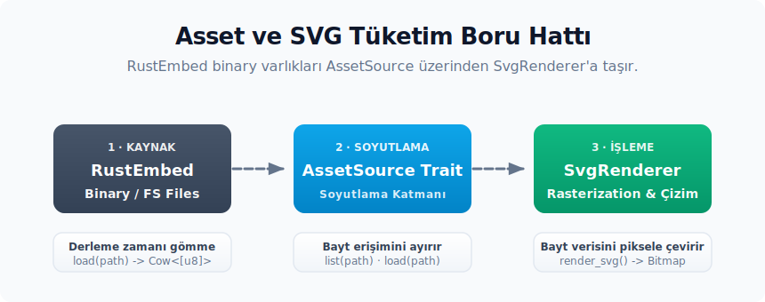

# AssetSource sözleşmesi ve RustEmbed entegrasyonu

Bu bölüm, varlık altyapısının iki temel bileşenini ele alır: klasör yapısını `get/iter` API'si arkasında sarmalayan `RustEmbed` makrosu ve çalışma zamanında bu varlıklara tek tip arayüz sunan `AssetSource` trait yapısı. Her iki parça birbirinden bağımsız şekilde tasarlanmıştır; bir uygulama `RustEmbed` kullanmadan da `AssetSource` implementasyonunu gerçekleştirebilir (örneğin tüm varlıkları doğrudan dosya sisteminden okuyan bir uygulama), bunun tersi de mümkündür. Zed bu iki yapıyı birleştiren küçük bir köprü struct yapısı tanımlar; bu bölüm o köprünün hem sözleşmesini hem de davranış detaylarını ortaya koymaktadır.

---

<div align="center">



</div>

## 1. AssetSource trait'inin tanımı

GPUI tarafında varlık altyapısının tek yüzeyi `gpui::AssetSource` trait'idir. Tanım `gpui` crate'indedir ve gövdesi yalnızca iki metottan oluşur:

```rust
pub trait AssetSource: 'static + Send + Sync {
    /// Verilen path'teki varlığı yükler.
    fn load(&self, path: &str) -> Result<Option<Cow<'static, [u8]>>>;

    /// Verilen prefix ile başlayan tüm varlık path'lerini listeler.
    fn list(&self, path: &str) -> Result<Vec<SharedString>>;
}
```

Trait'in üç özelliği bilinçli bir tasarım kararıdır:

- **`'static` yaşam süresi:** `AssetSource` `App` global state'ine konacaktır; bu yüzden borrow yaşam süresi taşıyamaz. Tüm path string'leri ve byte slice'ları `'static` veya `Cow<'static>` ile aktarılır.
- **`Send + Sync`:** Varlık yükleme arka plan task'lerinde yapılabilir (örneğin `ImageAssetLoader` background executor üzerinde çalışır). Bu yüzden trait thread-safe olmak zorundadır.
- **`Cow<'static, [u8]>` dönüş tipi:** `RustEmbed` derleme zamanında varlıkları binary'ye gömdüğünde `Cow::Borrowed` döner (kopya yok); dosya sisteminden okuyan bir uygulama ise `Cow::Owned` döner. Tüketici tarafında her iki durum aynı kod yoluyla çalışır.

`load` metodunun `Result<Option<...>>` şeklinde bir değer döndürmesi bilinçli bir karardır; ancak dosyanın bulunamaması durumundaki davranış modeli doğrudan ilgili implementasyona bırakılır. Boş veya dosya sistemi tabanlı bir varlık kaynağı dosya mevcut değilse `Ok(None)` döndürebilir; Zed bünyesindeki `Assets` sarmalayıcısı ise eksik yolu `Err` kabul eder. Bu sayede tüketici, kullandığı kaynağın sözleşmesine göre 'yedeğe geçme' veya 'hatayı günlüğe kaydedip (log'layıp) nesneyi görünmez bırakma' davranışını açıkça belirleme imkanına kavuşur.

### 1.1 Boş implementasyon: `()`

GPUI, `AssetSource` trait'ini Rust'ın unit type'ı `()` için de implement eder:

```rust
impl AssetSource for () {
    fn load(&self, _path: &str) -> Result<Option<Cow<'static, [u8]>>> {
        Ok(None)
    }

    fn list(&self, _path: &str) -> Result<Vec<SharedString>> {
        Ok(vec![])
    }
}
```

Bu boş implementasyon iki yerde varsayılan davranışı sağlar:

1. **`Application::with_platform` çağrısının ilk hali:** `Application::with_assets` çağrılmadığı sürece `App` `Arc::new(())` ile gelir; yani varlıkları sormak hata vermez, sadece her şey "yok" döner.
2. **`LoadThemes::JustBase`:** Tema sistemi başlatılırken `LoadThemes::JustBase` seçilirse `ThemeRegistry` `Box::new(()) as Box<dyn AssetSource>` ile kurulur; kullanıcı temaları yüklenmez, sadece fallback tema kalır. Bu mod özellikle testlerde tema dosyalarına bağımlı olmadan çalışmayı mümkün kılar.

Boş implementasyonun varlığı şu pratik sonucu doğurur: bir test veya başlangıç senaryosu yazılırken varlık olmayan bir `App` kurmak için ekstra struct yazmaya gerek kalmaz. `Arc::new(())` yeterlidir.

---

## 2. RustEmbed macro'su ve klasör paketleme

`rust-embed` crate'i, bir klasörü tek bir statik erişim API'si arkasına alan procedural makroyu sağlar. Zed'in release derlemelerinde ve `debug-embed` feature'ı etkinken dosyalar binary içerisine gömülür; normal debug derlemelerinde ise aynı API doğrudan dosya sisteminden okuma yapar. Bu ayrım kritik önem taşır: `Assets::get` ve `Assets::iter` çağrıları her iki modda da tamamen aynı görünür, fakat debug modunda dosya değişiklikleri yeniden derleme gerektirmeden anında okunabilirken release modunda içerik doğrudan binary'nin sabit bir parçası haline gelir. Zed bu makroyu iki ayrı struct yapısı üzerinde konumlandırır.

### 2.1 Ana asset struct'ı

```rust
#[derive(RustEmbed)]
#[folder = "../../assets"]
#[include = "fonts/**/*"]
#[include = "icons/**/*"]
#[include = "images/**/*"]
#[include = "themes/**/*"]
#[exclude = "themes/src/*"]
#[include = "sounds/**/*"]
#[include = "prompts/**/*"]
#[include = "*.md"]
#[exclude = "*.DS_Store"]
pub struct Assets;
```

Macro derleme zamanında `assets/` klasörünü tarar ve release/debug-embed kolu için aşağıdaki yapıyı üretir:

- `Assets::get(path) -> Option<EmbeddedFile>`: Verilen path için varlığı döner. `EmbeddedFile` içinde `data: Cow<'static, [u8]>` ve metadata bulunur.
- `Assets::iter() -> impl Iterator<Item = Cow<'static, str>>`: `RustEmbed` kalıplarıyla eşleşen dosya yollarını döner. Bu iterator, `list` metodunda filtreleme gerçekleştirmek amacıyla kullanılır.

`#[include]` ve `#[exclude]` direktifleri `rust-embed` 8.11'de `globset` ile ayrı kümeler halinde değerlendirilir. Sıra "ilk eşleşen kazanır" şeklinde çalışmaz; exclude kalıpları include kalıplarından önceliklidir. Bu yüzden `themes/src/*` kalıbı, `themes/**/*` include'u ile eşleşen dosyaları da dışarıda bırakır. `*.DS_Store` kalıbı da aynı nedenle konumundan bağımsız olarak eşleşen dosyaları çıkarır.

Bir başka pratik ayrıntı: `globset::Glob::new` varsayılan yapılandırmasında `*` yol ayırıcısını da eşleyebilir; bu nedenle `SettingsAssets` tarafındaki `#[include = "keymaps/*"]` özniteliği `keymaps/macos/atom.json` gibi alt dizinlerdeki dosyaları da kapsar. Buna karşın, yeni bir kalıp tanımlanırken niyeti açıkça ortaya koymak adına alt dizin eşlemeleri için `**/*` kalıbının kullanılması okunabilirliği artırır ve gelecekte farklı bir glob motoruna taşınmayı kolaylaştırır.

**Önemli ayrıntı:** Makro, üretilen release kolu için dosya listesini derleme sırasında yapılandırır. Bu maliyet küçük boyutlu klasörlerde hissedilmese de, Zed gibi yüzlerce ikon ve onlarca temayı barındıran büyük bir varlık klasörüyle çalışırken artımlı derlemelerde (incremental build) fark edilebilir bir gecikme yaratabilir. Bu nedenle Zed, `Assets` struct yapısını **ayrı bir crate** (`assets` crate'i) içerisine yerleştirmiştir; `zed` ana crate'i yeniden derlendiğinde bu crate'in önbelleği (cache) değişmediği için tarama işlemi atlanır. Dosya başındaki yorum satırı da bu kararı net bir şekilde doğrulamaktadır: '...ana zed crate'inden ayrıldı, böylece zed her yeniden derlendiğinde RustEmbed makrosunu çalıştırmak gerekmez. Bu durum artımlı derlemede bir-iki saniye kazandırır.'

### 2.2 Ayar ve klavye asset struct'ı

```rust
#[derive(RustEmbed)]
#[folder = "../../assets"]
#[include = "settings/*"]
#[include = "keymaps/*"]
#[exclude = "*.DS_Store"]
pub struct SettingsAssets;
```

`SettingsAssets` ayrı tutulmasının iki gerekçesi vardır:

- **Erken erişim:** Settings ve keymap dosyaları, uygulama başlatma sürecinde `App` çalışma zamanı kurulmadan **önce** okunur. `default_settings()` fonksiyonu `cx.asset_source()` çağrısı yapmaz; doğrudan `SettingsAssets::get` üzerinden veriye erişir. Eğer bu varlıklar `Assets` içinde yer alsaydı, settings sisteminin başlatılması doğrudan `App` kurulumuna bağımlı hale gelirdi ve bu da döngüsel bağımlılık (circular dependency) riskini doğururdu.
- **Crate sınırı:** `settings` crate'i, `assets` crate'ine ve `Application::with_assets` ile kurulan çalışma zamanı varlık kaynağına bağımlı olmamalıdır. `settings` crate'i `gpui::App` tipini kullansa da, default settings/keymap içeriklerini `Assets` yerine kendi `SettingsAssets` struct yapısı üzerinden okur. Bu yaklaşım settings başlatma süreçlerini ana varlık crate'inin kuruluş sırasından ayırarak bağımlılık grafiğini düzleştirmeye yardımcı olur.

İki struct birden olmasının pratik karşılığı şudur: aynı `assets/` klasöründeki dosyalar iki kez paketlenmez. `#[include]` filtreleri çakışmadığı sürece her dosya yalnızca bir struct tarafından alınır; release build'de bu, aynı byte'ların iki ayrı embed koluna girmemesi anlamına gelir.

---

## 3. AssetSource implementasyonu

`Assets` struct'ı `RustEmbed`'in ürettiği API'yi `AssetSource` trait'ine taşır:

```rust
impl AssetSource for Assets {
    fn load(&self, yol: &str) -> Result<Option<Cow<'static, [u8]>>> {
        Self::get(yol)
            .map(|dosya| Some(dosya.data))
            .with_context(|| format!("varlık yolu yüklenemedi: {yol:?}"))
    }

    fn list(&self, yol: &str) -> Result<Vec<SharedString>> {
        Ok(Self::iter()
            .filter_map(|varlik_yolu| {
                if varlik_yolu.starts_with(yol) {
                    Some(varlik_yolu.into())
                } else {
                    None
                }
            })
            .collect())
    }
}
```

İki metot da basittir ama bazı incelikler vardır:

- `load`: `Self::get` metodu `Option<EmbeddedFile>` döner; `Some(dosya.data)` yardımıyla içerideki `Cow<'static, [u8]>` verisi çıkarılır. `with_context` burada kritik önem taşır: dosya yolu mevcut değilse `Option::None` değeri `Err` haline dönüştürülür ve mesaj olarak `varlık yolu yüklenemedi: ...` ifadesi eklenir. Yani `Assets` için eksik dosya durumu `Ok(None)` değil, doğrudan bir hata olarak kabul edilir. `Ok(None)` davranışını Zed içerisinde özellikle boş `()` kaynağı ve bu yolu bilinçli olarak seçen özel kaynaklar üretir.
- `list`: `starts_with` yardımıyla prefix filtrelemesi gerçekleştirir. Dolayısıyla `list("fonts")` çağrıları `fonts/ibm-plex-sans/...` gibi alt klasörlerde yer alan tüm dosya yollarını döner. Bu davranış font yükleyici tarafından kullanılır ve recursive listeleme ihtiyacını ortadan kaldırır.

`list` metodunun recursive olması, font ve tema klasörlerindeki alt dizinleri (örneğin `themes/one/`, `themes/ayu/`) ek bir traverse koduna gerek kalmadan keşfetmeyi mümkün kılar. Tüketici sadece sonuçları kendi uzantı filtresinden geçirir (`.ttf`, `.json` vb.).

---

## 4. Çalışma zamanına bağlama: `Application::with_assets`

`AssetSource` implementasyonu, GPUI'ye `Application::with_assets` zinciriyle aktarılır. `gpui` crate'indeki imza:

```rust
impl Application {
    pub fn with_platform(platform: Rc<dyn Platform>) -> Self {
        Self(App::new_app(
            platform,
            Arc::new(()),                  // <-- başlangıçta boş AssetSource
            Arc::new(NullHttpClient),
        ))
    }

    pub fn with_assets(self, varlik_kaynagi: impl AssetSource) -> Self {
        let mut context_lock = self.0.borrow_mut();
        let varlik_kaynagi = Arc::new(varlik_kaynagi);
        context_lock.asset_source = varlik_kaynagi.clone();
        context_lock.svg_renderer = SvgRenderer::new(varlik_kaynagi);
        drop(context_lock);
        self
    }
    // ...
}
```

Üç gözlem önemlidir:

1. **`with_assets` bağlantısı kurulmadığında varsayılan değer boş `()`'tır.** Yani varlık hattı yokken uygulama çökmez, sadece her ikon ve font "yok" döner. Bu davranış testler için faydalıdır ama üretimde `with_assets` bağlantısı SVG ve font yükleme hattı için gereklidir.
2. **`SvgRenderer` constructor'ı varlık kaynağını alır.** Bu sayede `svg()` element'i path string'ini doğrudan ham byte'lara çevirebilir; ekstra bir köprü gerekmez. `SvgRenderer::new` çağrısı varlık kaynağının `Arc` clone'unu kendi içine kopyalar, böylece SVG render hattı `App` lock'una girmeden varlık okuyabilir.
3. **`Arc<dyn AssetSource>`:** Trait object olarak saklanır. Bu, farklı varlık kaynaklarının (RustEmbed, dosya sistemi, ağ) aynı çalışma zamanı üzerinde yan yana taşınmasını mümkün kılar. Pratikte Zed yalnızca tek bir varlık kaynağı kullanır ama trait object esnekliği test ortamında değer kazanır.

Zed'in `main.rs` dosyasındaki kuruluş zinciri:

```rust
let uygulama = Application::with_platform(gpui_platform::current_platform(false))
    .with_assets(Assets);
```

`Assets` struct'ı zero-sized type olduğu için `Arc::new(Assets)` neredeyse maliyetsizdir. Varlık hattı bu tek satırla devreye girer.

---

## 5. `cx.asset_source()` ile tüketim yüzeyi

Çalışma zamanına girmiş bir uygulamada varlık kaynağına iki yoldan ulaşılır:

- `App::asset_source(&self) -> &Arc<dyn AssetSource>`: Doğrudan varlık kaynağı referansı verir.
- `cx.asset_source()`: Aynı metodun `Context` üzerinden kestirme yolu.

Pratikte bu yüzey üç farklı kullanım deseni üretir:

**Senkron list+load:**

```rust
let varlik_kaynagi = cx.asset_source();
let font_yollari = varlik_kaynagi.list("fonts")?;
for font_yolu in &font_yollari {
    if !font_yolu.ends_with(".ttf") {
        continue;
    }
    let font_baytlari = varlik_kaynagi.load(font_yolu)??;
    // ...
}
```

Bu desen, font yükleme (`Assets::load_fonts`) ve tema yükleme (`load_bundled_themes`) gibi uygulama başlatma süreçlerinde tercih edilir. Senkron bir çağrı olduğundan release derlemelerinde binary içinden gelen veya debug modunda yerel dosya sisteminden hızlıca okunan küçük varlıklar için son derece elverişlidir. Ağ tabanlı veya büyük dosya sistemi varlıkları için ise asenkron `Asset` trait yapısı tercih edilir.

**Tek varlık yükleme (senkron):**

```rust
let yol = format!("sounds/{}.wav", ses.file());
let baytlar = cx.asset_source().load(&yol)?
    .map(anyhow::Ok)
    .with_context(|| format!("Bu yol için varlık yok: {yol}"))??
    .into_owned();
```

`Audio::sound_source` bu deseni kullanır: tek bir dosyayı senkron olarak alır ve `rodio::Decoder`'a verir. WAV dosyaları küçük olduğundan async loader gerekmez.

**Indirect tüketim (svg renderer, image cache):**

`SvgRenderer` ve `ImageAssetLoader` `cx.asset_source()` çağrısını kendi içlerinde yapar. UI kodu yalnızca path verir; render hattı path'i varlık kaynağına çevirip byte'lara erişir. Bu, varlık path'lerinin uygulama yüzeyinde "string olarak" dolaşmasını sağlar; ham byte taşımak gerekmez.

---

## 6. Üç tüketim desenini birbirinden ayırmak

Varlık altyapısı tek arayüze sahiptir, ama tüketici tarafında üç farklı desen ortaya çıkar. Bunları birbirinden ayırmak önemlidir çünkü her birinin maliyet profili farklıdır:

| Desen | Tipik tüketici | Yaşam süresi | Maliyet profili |
|-------|---------------|--------------|-----------------|
| **Toplu liste+load** | `Assets::load_fonts`, `load_bundled_themes` | Uygulama başlatma anında bir kez | O(varlık sayısı); önyüklenmiş varlıklar için ucuz |
| **Tek dosya senkron load** | `Audio::sound_source`, `default_settings` | Talep anında | O(1); ufak dosyalar için ideal |
| **Asenkron çekme (Asset trait)** | `ImageAssetLoader`, `SvgAsset` | Talep anında, cache'li | Background executor; büyük dosyalar veya ağ kaynaklı için |

`Asset` trait'i (üçüncü desenin yüzeyi) `gpui` crate'inde tanımlıdır:

```rust
pub trait Asset: 'static {
    type Source: Clone + Hash + Send;
    type Output: Clone + Send;

    fn load(
        source: Self::Source,
        cx: &mut App,
    ) -> impl Future<Output = Self::Output> + Send + 'static;
}
```

Bu trait `AssetSource`'tan farklıdır: `AssetSource` ham byte sağlar; `Asset` trait'i ise belirli bir varlık varlık türü için decode/parse/decode-image gibi işlemleri de kapsayan asenkron yükleyicidir. Tipik implementasyonlar `cx.asset_source()` çağrısı yapar, byte'ları alır ve kendi formatına çevirir. `window.use_asset::<T>(source, cx)` ve `cx.fetch_asset::<T>(source)` çağrıları cache mekanizmasını sağlar; aynı kaynak ikinci kez istendiğinde yüklenmiş Future paylaşılır.

Bu üçlü mimarinin pratik sonucu şudur: bir varlığın sadece ham byte verisine erişmek hedefleniyorsa `AssetSource` yeterlidir; ancak bir varlığı kullanıcı arayüzü (UI) render hattına bağlamak ve önbelleğe (cache) almak gerekiyorsa `Asset` trait'i altında ayrı bir implementasyonun kurgulanması gerekir. `SvgAsset` ve `ImageAssetLoader` bu desenin en bariz örnekleridir; sonraki bölümlerde her biri tüketici bağlamında ayrı ayrı ele alınacaktır.

---

## 7. Kendi GPUI uygulamasında minimum kurulum

Zed'in yaklaşımını kendi uygulamanda sergilemek için Zed'in asset dosyalarını veya crate gövdesini kopyalamak gerekmez. Aynı desen küçük bir `RustEmbed` struct'ı ve `AssetSource` implementasyonu ile kurulabilir:

```rust
use anyhow::Context as _;
use gpui::{AssetSource, Result, SharedString};
use rust_embed::RustEmbed;
use std::borrow::Cow;

#[derive(RustEmbed)]
#[folder = "assets"]
#[include = "fonts/**/*"]
#[include = "icons/**/*"]
#[include = "images/**/*"]
#[exclude = "*.DS_Store"]
pub struct UygulamaVarliklari;

impl AssetSource for UygulamaVarliklari {
    fn load(&self, yol: &str) -> Result<Option<Cow<'static, [u8]>>> {
        Self::get(yol)
            .map(|dosya| Some(dosya.data))
            .with_context(|| format!("varlık yolu yüklenemedi: {yol:?}"))
    }

    fn list(&self, yol: &str) -> Result<Vec<SharedString>> {
        Ok(Self::iter()
            .filter_map(|varlik_yolu| {
                varlik_yolu
                    .starts_with(yol)
                    .then(|| varlik_yolu.into())
            })
            .collect())
    }
}
```

Uygulama kuruluşunda tek zorunlu bağlantı `with_assets` çağrısıdır:

```rust
let uygulama = gpui_platform::application().with_assets(UygulamaVarliklari);
uygulama.run(|cx| {
    // Pencere açmadan önce fontları, temaları veya kendi başlangıç varlıklarını yükle.
});
```

Bu minimum kurulum tamamlandıktan sonra `svg().path("icons/search.svg")`, `img("images/logo.svg")`, `cx.asset_source().load("...")` ve `cx.asset_source().list("...")` gibi kullanımların tamamı aynı Zed desenini esas alır. Dosya varlığını tip güvenli (type-safe) hale getirmek hedefleniyorsa, Zed'in `IconName`, `VectorName` ve `Sound` enum yapılarıyla kurguladığına benzer küçük kayıt enum'larının eklenmesi önerilir; yalnızca path string'i ile ilerlemek de mümkündür ancak bu durumda önizleme, serileştirme ve eksik dosya kontrolleri zayıf kalacaktır.

---
