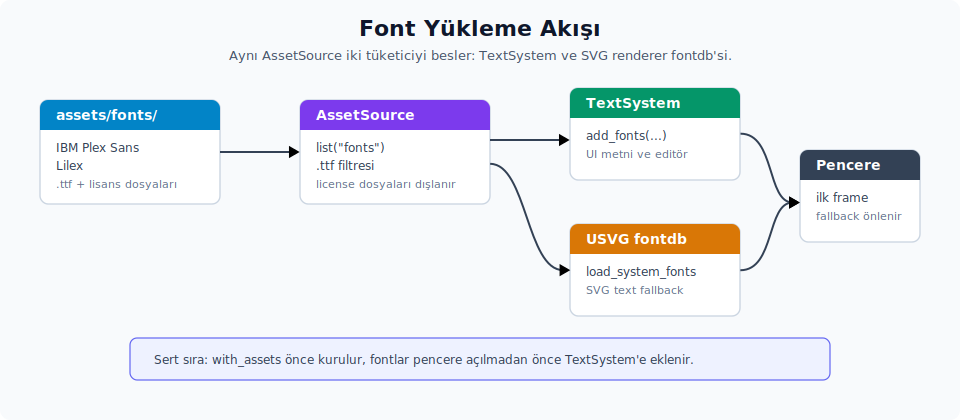

# Fontların paketlenmesi ve yüklenmesi

Bu bölüm, varlık altyapısının ilk büyük tüketicisi olan font yükleme yolunu anlatır. Font yükleme süreci üç ayrı sistemi birden besler: GPUI'nin metin shaping sistemi (`TextSystem`), SVG render hattının USVG fontdb veritabanı ve test ortamlarında kullanılan minimum font kümesi. Üçü de aynı `AssetSource` yüzeyinden okur, fakat hedef tüketici farklıdır. Bu farklılığı anlamak, "neden iki yerde font yükleniyor?" sorusunun cevabını verir ve uygulamaya yeni font eklerken hangi noktanın güncellenmesi gerektiğini netleştirir.



---

## 1. Font klasörünün yapısı

Zed iki font ailesini gömülü olarak taşır:

```text
assets/fonts/
├── ibm-plex-sans/
│   ├── IBMPlexSans-Regular.ttf
│   ├── IBMPlexSans-Italic.ttf
│   ├── IBMPlexSans-SemiBold.ttf
│   ├── IBMPlexSans-SemiBoldItalic.ttf
│   └── license.txt
└── lilex/
    ├── Lilex-Regular.ttf
    ├── Lilex-Bold.ttf
    ├── Lilex-Italic.ttf
    ├── Lilex-BoldItalic.ttf
    └── OFL.txt
```

**Karar:** İki ayrı font ailesi taşınır; biri sans-serif (`IBM Plex Sans`), biri monospace (`Lilex`). Her aileye ait dört varyant (regular, italic, bold, bold italic) ayrı `.ttf` dosyası olarak durur. Her klasörde lisans dosyası vardır; OFL bu dosyaların font dosyasıyla birlikte taşınmasını şart koşar.

**Genişleme:** Yeni bir font eklendiğinde yapılması gereken üç şey vardır:

1. `.ttf` dosyasını `fonts/<aile_adi>/` altına koyarsın.
2. Aile için lisans dosyası aynı klasöre eklersin.
3. `Assets` struct'ının `#[include = "fonts/**/*"]` direktifi recursive olduğundan ek değişiklik gerekmez; dosyalar `RustEmbed` erişim kümesine otomatik girer. Release/debug-embed build'de binary'ye gömülür, normal debug build'de aynı path'lerden dosya sistemi üzerinden okunur.

Yani font ekleme yalnızca dosya kopyalama işidir; kodda string referansı veya enum varyantı eklenmesi gerekmez. Bu davranış sonraki bölümlerdeki ikon ve ses sisteminden ayrılır: orada her dosya için enum varyantı eklemek zorunludur.

---

## 2. `load_embedded_fonts`: ana font yükleme yolu

Zed'in `zed` crate'indeki font yükleyici aynı list+load invariant'ını uygular. Güncel kaynakta bu iş background executor kapsamı içinde fail-fast açmayla yapılır; rehberde aynı akışın `Result` döndüren eşdeğeri gösterilir:

```rust
use anyhow::Context as _;

fn load_embedded_fonts(cx: &App) -> anyhow::Result<()> {
    let varlik_kaynagi = cx.asset_source();
    let font_yollari = varlik_kaynagi.list("fonts")?;
    let mut gomulu_fontlar = Vec::new();

    for font_yolu in &font_yollari {
        if !font_yolu.ends_with(".ttf") {
            continue;
        }

        let font_baytlari = varlik_kaynagi
            .load(font_yolu)?
            .with_context(|| format!("font varlığı bulunamadı: {font_yolu}"))?;
        gomulu_fontlar.push(font_baytlari);
    }

    cx.text_system()
        .add_fonts(gomulu_fontlar)?;
    Ok(())
}
```

Akış dört adımdan oluşur:

1. **`varlik_kaynagi.list("fonts")`** — Recursive listeleme yapılır; `fonts/ibm-plex-sans/...` ve `fonts/lilex/...` altındaki tüm dosyalar tek listede toplanır.
2. **`.ttf` filtresi** — `license.txt` ve `OFL.txt` gibi dosyalar dışlanır. Filtre yalnızca path uzantısına bakar; klasör adına bakmaz. Yeni bir font klasörü eklendiğinde bu filtre otomatik genişler.
3. **List+load invariant'ı** — Kaynak kodu önce `Result`, sonra `Option` katmanını açar. İlk katman okuma hatasını, ikinci katman "varlık var" garantisini temsil eder. `list` çağrısının döndürdüğü bir path'in `load` ile okunabilir olması gerekir; bu invariant bozulduğunda varlık paketi veya `RustEmbed` eşleşmesi gözden geçirilir.
4. **`cx.text_system().add_fonts(...)`** — Tüm byte'lar tek bir çağrıyla `TextSystem`'e verirsin. Bu çağrı font'ları platform metin sistemine (CoreText, DirectWrite, freetype) kaydeder; uygulama bu noktadan sonra `font_family("IBM Plex Sans")` veya `font_family("Lilex")` ile bu aileleri kullanabilir.

**Çağrı noktası:** `load_embedded_fonts(cx)` Zed'in uygulama kurulumunda pencere açılmadan önce çağırırsın. Güncel `main.rs` içinde `Application::with_assets(Assets)` en başta kurulur, font yükleme ise birçok global init'ten sonra ama editor/workspace pencereleri açılmadan önce yaparsın. Sert gereksinim budur: varlık kaynağı kurulmadan `cx.asset_source()` boş `()` döner ve `list("fonts")` sonuç vermez; pencere açıldıktan sonra çağrılırsa ilk frame font yedeğe düşebilir.

---

## 3. `Assets::load_fonts`: kütüphane içi yardımcı

`assets` crate'i aynı işi struct üzerinde method olarak da sunar:

```rust
impl Assets {
    pub fn load_fonts(&self, cx: &App) -> anyhow::Result<()> {
        let font_yollari = self.list("fonts")?;
        let mut gomulu_fontlar = Vec::new();
        for font_yolu in font_yollari {
            if font_yolu.ends_with(".ttf") {
                let font_baytlari = cx
                    .asset_source()
                    .load(&font_yolu)?
                    .with_context(|| format!("font varlığı bulunamadı: {font_yolu}"))?;
                gomulu_fontlar.push(font_baytlari);
            }
        }

        cx.text_system().add_fonts(gomulu_fontlar)
    }
}
```

Bu metot ile `main.rs` içindeki `load_embedded_fonts` arasında iki belirgin fark vardır. Birincisi **çağrı konumu**dur: `load_fonts` kütüphane yardımcısı olarak `Assets` üstünde durur, `load_embedded_fonts` ise Zed'in uygulama girişinde aynı list+load fikrini yürütür. İkincisi **okuma biçimi**dir: `load_embedded_fonts` font dosyalarını `background_executor().scoped(...)` ile paralel okur ve her birini ayrı bir görev içinde yükler; `Assets::load_fonts` ise dosyaları sıralı bir `for` döngüsünde tek tek okur. Alternatif binary veya örnek uygulama tarafında `Application::with_assets(Assets)` çağrısından sonra `Assets.load_fonts(cx)?` yeterlidir.

`Assets::load_fonts` özellikle ikinci kullanım için durur: bir kütüphane veya alternatif binary `Assets` struct'ını kendi kuruluş yolunda doğrudan çağırmak isteyebilir. O senaryolarda `Application::with_assets(Assets)` çağrısından sonra tek satır `Assets.load_fonts(cx)?` çağrısı yeterlidir.

---

## 4. Test ortamı için `load_test_fonts`

`Assets` struct'ı test senaryoları için ayrı bir yardımcı da sağlar:

```rust
use anyhow::Context as _;

pub fn load_test_fonts(&self, cx: &App) -> anyhow::Result<()> {
    let font_baytlari = self
        .load("fonts/lilex/Lilex-Regular.ttf")?
        .with_context(|| "test fontu bulunamadı: fonts/lilex/Lilex-Regular.ttf")?;

    cx.text_system().add_fonts(vec![font_baytlari])
}
```

Bu metot yalnızca tek bir font yükler: `Lilex-Regular.ttf`. Gerekçe şudur: testlerde metin shaping davranışını doğrulamak için en az bir monospace fontu olmalıdır, fakat tüm fontları yüklemek başlatma süresini artırır. Tek bir Lilex regular varyantı çoğu yazı testi için yeterlidir.

**Kullanım yeri:** GPUI'nin `TestApp`, `TestAppContext`, `HeadlessAppContext` veya `VisualTestAppContext` kurulumlarında bu metot opsiyonel olarak çağırırsın. Test font'a ihtiyaç duymuyorsa (örneğin sadece layout testi) bu metot atlanabilir; o durumda `TextSystem` font listesi boş kalır ve metin elementleri sıfır boyutlu hesaplanır.

---

## 5. USVG fontdb entegrasyonu

`SvgRenderer` SVG dosyalarındaki `<text>` etiketlerini doğru render edebilmek için ayrı bir font veritabanı tutar. Bu veritabanı `usvg::fontdb::Database` türündedir ve iki kaynaktan beslenir: sistemde kurulu font'lar ile Zed'in gömülü font'ları. Sistem font'ları, paylaşılan bir `SYSTEM_FONT_DB` (`LazyLock` ile bir kez kurulan) veritabanında tutulur; bu veritabanı program ömründe yalnızca bir kez `load_system_fonts()` ile doldurulur. Zenginleştirme gerektiğinde bu paylaşılan veritabanı **klonlanır** ve gömülü font'lar klon üstüne eklenir; böylece paylaşılan sistem veritabanı değişmeden kalır:

```rust
fn load_bundled_fonts(varlik_kaynagi: &dyn AssetSource, db: &mut usvg::fontdb::Database) {
    let font_yollari = [
        "fonts/ibm-plex-sans/IBMPlexSans-Regular.ttf",
        "fonts/lilex/Lilex-Regular.ttf",
    ];
    for yol in font_yollari {
        match varlik_kaynagi.load(yol) {
            Ok(Some(veri)) => db.load_font_data(veri.into_owned()),
            Ok(None) => log::warn!("Yerleşik font bulunamadı: {yol}"),
            Err(hata) => log::warn!("Yerleşik font yüklenemedi {yol}: {hata}"),
        }
    }
}
```

Güncel Zed kodunda bu zenginleştirilmiş fontdb, `SvgRenderer::new` anında değil ilk SVG render ihtiyacında lazy olarak hazırlanır. Böylece SVG render etmeyen testler sistem font veritabanını derin kopyalama maliyetini ödemez.

Burada dikkat edilmesi gereken üç ayrıntı vardır:

- **Sabit kodlu path listesi:** USVG yalnızca iki regular varyantı yükler. Bold, italic ve bold-italic gibi varyantlar dahil edilmez. Gerekçe: SVG'lerde nadiren bold metin bulunur; pratikte regular varyantlar render kalitesi için yeterlidir ve veritabanı boyutu küçük kalır.
- **Hata toleransı:** `load` çağrısı `None` ya da `Err` döndürürse uyarı log'lanır, fakat fail-fast çalışmaz. Bu davranış GPUI'yi varlık bağımlılığından koruyan bir tampon görevi yapar; varlık hattı kurulu olmasa bile SVG render hattı çalışmaya devam eder, sadece yerleşik font'lar olmayacaktır.
- **Sistem font'ları ile birleştirme:** `load_bundled_fonts` doğrudan paylaşılan `SYSTEM_FONT_DB` üstünde değil, onun bir klonu üstünde çalışır. Sistemde kurulu font'lar bu paylaşılan veritabanına bir kez `load_system_fonts()` ile yüklenmiştir; her zenginleştirmede veritabanı klonlanır ve bundled font'lar klona eklenir. Yani bundled font'lar sistem font'larının üzerine biner; çakışma durumunda hangi varyantın seçileceği `usvg`'nin kendi önceliklendirme kuralına kalır.

### 5.1 Generic family yedeği

USVG fontdb'nin ilginç bir davranışı vardır: generic CSS aileleri (`sans-serif`, `serif`, `monospace`, `cursive`, `fantasy`) varsayılan olarak Microsoft font'larına (Arial, Times New Roman) bağlanır. Bu font'lar çoğu Linux dağıtımında kurulu olmadığından, fontconfig bu varsayılanları düzeltmediği durumda generic aile `query` çağrıları `None` döner. Linux sistemlerinde fontconfig genellikle bunları doldurur ama her zaman güvenilir değildir. Zed bu boşluğu kapatmak için `fix_generic_font_families` fonksiyonunu kullanır:

```rust
let aileler_ve_yedekler: &[(Family<'_>, &str)] = &[
    (Family::SansSerif, "IBM Plex Sans"),
    (Family::Serif, "IBM Plex Sans"),       // Zed serif font taşımıyor; sans yedeği
    (Family::Monospace, "Lilex"),
    (Family::Cursive, "IBM Plex Sans"),
    (Family::Fantasy, "IBM Plex Sans"),
];
```

Her generic aile için bir yedek ad belirlersin. Veritabanında o ailenin bir sürümü zaten varsa yedek uygulanmaz; yoksa `db.set_sans_serif_family(name)` gibi metotlarla ad atarsın. Bu sayede SVG içinde `font-family="sans-serif"` yazan bir `<text>` öğesi hiçbir Linux dağıtımında "fontsuz" kalmaz.

**Önemli mantık:** Serif font Zed tarafından paketlenmediği için Serif → IBM Plex Sans yedeği kasıtlıdır. SVG render çıktısı serif beklenen yerde sans-serif görünür; bu, "hiç render olmamak" yerine "yakın eşdeğer ile render olmak" kararıdır.

### 5.2 Emoji font seçimi

USVG'nin font seçim hattı ayrıca emoji karakterleri için özel bir yol içerir:

```rust
#[cfg(target_os = "macos")]
const EMOJI_FONT_FAMILIES: &[&str] = &["Apple Color Emoji", ".AppleColorEmojiUI"];

#[cfg(target_os = "windows")]
const EMOJI_FONT_FAMILIES: &[&str] = &["Segoe UI Emoji", "Segoe UI Symbol"];

#[cfg(any(target_os = "linux", target_os = "freebsd"))]
const EMOJI_FONT_FAMILIES: &[&str] = &[
    "Noto Color Emoji", "Emoji One", "Twitter Color Emoji", "JoyPixels",
];
```

`is_emoji_presentation(ch)` true dönerse, `select_emoji_font` bu listedeki ilk uygun ailesini bulup `id` döner. Emoji font'ları Zed binary'sine gömülmez; sistem font'ları beklenir. Bu karar binary boyutu için kritiktir: Apple Color Emoji tek başına 100+ MB olduğundan binary'ye gömmek pratik değildir.

---

## 6. `add_fonts` çağrısının `TextSystem` tarafındaki etkisi

`cx.text_system().add_fonts(vec)` çağrısı font byte'larını platforma özgü metin sistemine (macOS CoreText, Windows DirectWrite, Linux freetype) verir. Detaylar metin sistemi bölümünde işlenir; bu bölüm için bilinmesi gereken üç davranış vardır:

1. **Idempotent değildir:** Aynı font ikinci kez eklenirse hiçbir platform "zaten var" cevabı döndürmez; her platform tekrar çağrıda font'u koşulsuz yeniden ekler. macOS, Windows ve Linux tarafının üçü de gelen byte'ları doğrudan platform font veritabanına yeniden kaydeder, var olup olmadığını sorgulamaz. Bu yüzden `add_fonts` tek seferlik çağrılmak üzere tasarlanmıştır.
2. **Lifetime:** Byte'lar `Cow<'static>` olarak gelir; `'static` lifetime burada iki ayrı sahiplik biçimini birden kapsar. `Cow::Borrowed` durumu release embed yoludur: byte'lar binary'ye gömülüdür ve binary'nin statik (`.data`) segmentinde durur, çalışma sırasında ayrı bir bellek ayrılmaz. `Cow::Owned` durumu ise dosya sisteminden okuma yoludur: byte'lar heap'te ayrılır ve `Arc` ile sarılarak font verisi olarak tutulur. İki durumda da veri uygulama boyunca canlı kalır; fark verinin nerede durduğudur.
3. **Çağrı zamanı:** `add_fonts` çağrısı **pencere açılmadan önce** yapman gerekir; aksi halde ilk frame'de font bulunamadığı için yedeğe düşülür ve metin beklenen fontla render edilmez. Zed bu yüzden font yüklemeyi `Application::with_assets` çağrısından sonra, fakat editor ve workspace pencereleri açılmadan önce yapar.

---

## 7. Pratik akış özeti

Font sisteminin bütününü tek bir akış olarak okumak gerekirse:

```text
assets/fonts/<aile>/*.ttf
       │
       ▼ (RustEmbed erişim kümesi; release'te embed, debug'da dosya sistemi)
Assets struct
       │
       ▼ (Application::with_assets)
App.asset_source: Arc<dyn AssetSource>
       │
       ├──► load_embedded_fonts ──► cx.text_system().add_fonts ──► GPUI metin sistemi
       │
       └──► SvgRenderer::new ──► load_bundled_fonts ──► usvg::fontdb::Database
                                                       └──► fix_generic_font_families
                                                       └──► select_emoji_font (sistem font'ları)
```

İki tüketici (`TextSystem` ve USVG fontdb) aynı `.ttf` dosyalarını farklı yollardan yükler. Bu, kodda görünen tekrarın sebebidir: GPUI'nin kendi metin shaping'i için ayrı bir kütüphane, SVG render hattı için ayrı bir kütüphane kullanılır ve ikisi font veritabanını ortak tutmaz. Pratik sonucu şudur: bir uygulamaya yeni bir font ailesi eklemek isteyen geliştirici, hem `TextSystem`'in göreceğinden emin olmak için `assets/fonts/` altına dosyayı koyar, hem de SVG'lerde de görünmesi gerekiyorsa `load_bundled_fonts` listesini güncellemeyi düşünür.

---
