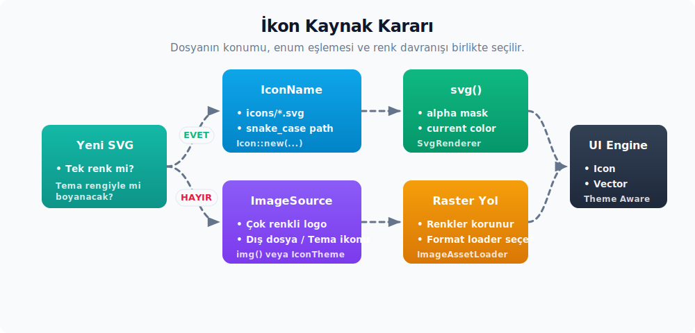

# İkon sistemi ve SVG render hattı

Bu bölüm, varlık altyapısının en sık tüketilen parçasını anlatır: SVG ikonları. Zed'de yüzlerce SVG dosyası `icons/` klasörü altında durur. UI'da `Icon` ya da `Vector` bileşenleriyle render edilir. Yüzeyde basit görünse de akış dört ayrı katmandan oluşur: dosya yerleşimi, path eşleme kayıt sistemi (`IconName` ve `KnockoutIconName`), gpui'nin `svg()` element'i ve `SvgRenderer`'ın rasterleştirme adımı. Her katmanın ne yaptığını ayırmak, "yeni bir ikon nasıl eklenir, neden bazı ikonlar tema renkleriyle boyanırken bazıları çok renkli kalır, dış ikon temalarını nasıl destekleriz?" gibi soruları cevaplamayı kolaylaştırır.



---

## 1. `icons/` klasörünün yapısı

İkon klasörü üç alt bölgeye ayrılır:

```text
assets/icons/
├── *.svg                 # UI ikonları (IconName ile eşleşir)
├── file_icons/
│   └── *.svg             # IconTheme tarafından okunan dosya tipi ikonları
└── knockouts/
    └── *.svg             # IconDecoration için maske SVG'leri
```

Her bölgenin tüketicisi farklıdır:

| Alt klasör | Path formatı | Tüketici | Eşleme yapısı |
|------------|--------------|----------|---------------|
| `icons/*.svg` | `icons/<snake_case_isim>.svg` | `Icon` bileşeni | `IconName` enum'u (`icons`) veya doğrudan path |
| `icons/file_icons/*.svg` | `icons/file_icons/<isim>.svg` | `IconTheme` tarafından dolaylı | `FILE_ICONS`, `DirectoryIcons`, `ChevronIcons` |
| `icons/knockouts/*.svg` | `icons/knockouts/<isim>.svg` | `IconDecoration` bileşeni | `KnockoutIconName` enum'u |

**Sonuç:** Aynı klasör hiyerarşisinde üç farklı sözleşme yan yana durur. Bu, "her klasör kendi tüketici sözleşmesini besler" prensibinin somut karşılığıdır: bir SVG'yi `icons/` köküne koymak ona tipli UI ikonu davranışı kazandırmaz; aynı dosya için `IconName` varyantı eklemen gerekir. Zed kaynak ağacında `icons/*.svg` altında `IconName`'e bağlı olmayan eski veya doğrudan path ile çağrılabilecek dosyalar da bulunabilir; bunlar `Icon::new(IconName::...)` yüzeyinden değil, ancak açık path ile çağrılırsa görünür olur.

---

## 2. `IconName` registry'si

İkon eşlemenin tek doğru kaynağı `icons` crate'indeki `IconName` enum'udur:

```rust
#[derive(
    Debug, PartialEq, Eq, Copy, Clone, EnumIter, EnumString, IntoStaticStr, Serialize, Deserialize,
)]
#[strum(serialize_all = "snake_case")]
pub enum IconName {
    AcpRegistry,
    AiAnthropic,
    AiBedrock,
    // ... (yüzlerce varyant)
    ZedPredictUp,
    ZedSrcCustom,
    ZedSrcExtension,
}

impl IconName {
    /// Bu ikonun dosya yolunu döndürür.
    pub fn path(&self) -> Arc<str> {
        let dosya_govdesi: &'static str = self.into();
        format!("icons/{dosya_govdesi}.svg").into()
    }
}
```

Üç tasarım kararı dikkat çekicidir:

- **`#[strum(serialize_all = "snake_case")]`** — Enum varyant adı `AiAnthropic` yazıldığında string formu `ai_anthropic` olur. Path üretimi bu dönüşümün üzerine kuruludur; `format!("icons/{dosya_govdesi}.svg")` ifadesi `icons/ai_anthropic.svg` döner. Yani dosya adı ile enum varyantı isim formu üzerinden 1:1 eşleşir.
- **`EnumIter`** — Tüm varyantları gezme imkânı verir; `Icon`'un önizleme sayfasında "tüm ikonlar" galerisini üretirken kullanılır (`<IconName as strum::IntoEnumIterator>::iter()`).
- **`Serialize`/`Deserialize`** — `IconName` settings JSON'larında saklanabilir. Bu, tema veya kullanıcı tercihlerinde "şu eylem için şu ikonu kullan" eşlemelerini mümkün kılar.

İkon enum iterator yüzeyi:

| API | Rol |
| :-- | :-- |
| `IconNameIter` | `strum::EnumIter`'in ürettiği `iter()` çağrısının dönüş türüdür; component önizleme, ikon galerisi veya doğrulama araçlarında tüm `IconName` varyantlarını dolaşmak için kullanılır. Pratikte iterasyon `IntoEnumIterator::iter()` üzerinden başlatılır, tür adı çağrı tarafında doğrudan yazılmaz. |

**Genişleme adımları:** Yeni bir tipli UI ikonu eklerken iki dosya değişir:

1. `assets/icons/yeni_ikon.svg` dosyası eklersin.
2. `IconName` enum'una `YeniIkon` varyantı eklersin.

Üçüncü bir adım (kayıt, lookup table güncelleme vb.) yoktur; `strum` macro'ları gerisini halleder. `IconName::path()` çağrısı `IntoStaticStr` ile elde edilen statik dosya gövdesini kullanır, sonra `format!("icons/{dosya_govdesi}.svg")` ile küçük bir `Arc<str>` path üretir. Yani lookup tablosu yoktur, fakat path oluştururken küçük bir çalışma zamanı tahsisi yaparsın.

Bu sözleşmenin yönü tek taraflıdır: her `IconName` varyantının dosyası bulunmalıdır; fakat `assets/icons/*.svg` altındaki her dosyanın mutlaka `IconName` varyantı olması gerekmez. Zed'in mevcut ağacında bu duruma giren birkaç dosya vardır (`supermaven*.svg`, `repl_*.svg`, bazı eski check ikonları gibi). Kendi uygulamanda public API istiyorsan enum varyantı ekle; yalnızca deneysel veya tek noktalı kullanım varsa doğrudan path yeterli olabilir.

---

## 3. `Icon` bileşeni ve üç kaynak türü

`ui` crate'indeki `Icon` bileşeni, üç farklı kaynak türünü birden destekler:

```rust
#[derive(Clone)]
enum IconSource {
    /// Zed binary'sine gömülü SVG.
    Embedded(SharedString),
    /// Belirtilen yoldaki görsel dosyası.
    ///
    /// Mevcut SVG renderer çok renkli SVG render desteğini tam taşımaz.
    ///
    /// İkon temalarını desteklemek için ikonları bunun yerine görsel olarak render ederiz.
    External(Arc<Path>),
    /// Zed binary'sine gömülü olmayan SVG.
    ExternalSvg(SharedString),
}
```

Üç varyantın gerekçesi farklıdır:

- **`Embedded`** — En sık kullanılan yol. `IconName::path()` çağrısı `icons/xxx.svg` döner ve `Icon::new(IconName::X)` çağrısı bu path'i içine alır. SVG render hattı `cx.asset_source()` üzerinden okur; release/debug-embed build'de bu binary içinden gelir, normal debug build'de `RustEmbed` aynı path'i dosya sisteminden okuyabilir.
- **`External`** — Dış ikon temalarını destekler. Üçüncü taraf bir ikon teması yüklendiğinde Zed'in SVG render hattı **çok renkli (polychrome) SVG**'leri tam render edemediğinden bu ikonlar raster image olarak `img()` element'i ile çizilir. PNG ya da JPG döndüren ikon paketleri bu yoldan geçer.
- **`ExternalSvg`** — Dosya sistemindeki bir SVG dosyasını okur. Zed binary'sinde olmayan ama disk üzerinde mevcut olan SVG'ler için kullanırsın. Bu yol `Asset` trait'inin `SvgAsset` implementasyonu üzerinden async yüklenir; sonraki bölümde detaylanır.

`Icon::from_path` heuristik bir ayrım yapar:

```rust
pub fn from_path(path: impl Into<SharedString>) -> Self {
    let yol = path.into();
    let kaynak = if yol.starts_with("icons/") {
        IconSource::Embedded(yol)
    } else {
        IconSource::External(Arc::from(PathBuf::from(yol.as_ref())))
    };
    // ...
}
```

Kural basittir: path `icons/` ile başlıyorsa binary'de gömülü kabul edilir; aksi halde dış raster image olarak alırsın. Bu heuristik kasıtlı olarak SVG dışı ikonları (örneğin PNG dosya ikonları) `External` yoluna iter; `from_path` ile çağrılan dış SVG'ler için `from_external_svg` ayrı bir kapı sağlar.

### 3.1 Render davranışı

`Icon` bileşeninin `render` metodu üç kaynak türü için üç farklı element üretir:

```rust
impl RenderOnce for Icon {
    fn render(self, _: &mut Window, cx: &mut App) -> impl IntoElement {
        match self.source {
            IconSource::Embedded(yol) => svg()
                .with_transformation(self.transformation)
                .size(self.size)
                .flex_none()
                .path(yol)
                .text_color(self.color.color(cx))
                .into_any_element(),
            IconSource::ExternalSvg(yol) => svg()
                .external_path(yol)
                .with_transformation(self.transformation)
                .size(self.size)
                .flex_none()
                .text_color(self.color.color(cx))
                .into_any_element(),
            IconSource::External(yol) => img(yol)
                .size(self.size)
                .flex_none()
                .text_color(self.color.color(cx))
                .into_any_element(),
        }
    }
}
```

Üç yol birbirinden iki davranış noktasında ayrılır:

- **Path mı external_path mı?** `svg()` element'inin iki ayrı setter'ı vardır: `path()` binary'den okur, `external_path()` dosya sisteminden okur. Bu ayrım element seviyesinde net tutulur.
- **`svg()` mi `img()` mi?** SVG render hattı tek renkli SVG'lerde `text_color` ile boyama yapar; çok renkli SVG'ler veya raster image'lar için `img()` element'i gerekir.

---

## 4. `svg()` element'inin path ayrımı

GPUI'nin `gpui` crate'indeki `Svg` struct'ı iki path alanı tutar:

```rust
pub struct Svg {
    interactivity: Interactivity,
    transformation: Option<Transformation>,
    path: Option<SharedString>,         // binary'den okuma
    external_path: Option<SharedString>, // dosya sisteminden okuma
}
```

Render zamanında `paint` metodu hangi alanın dolu olduğuna göre dallanır:

```rust
if let Some((yol, renk)) = self.path.as_ref().zip(style.text.color) {
    // ... binary path: window.paint_svg ile doğrudan varlık kaynağına düşer
    window
        .paint_svg(bounds, yol.clone(), None, transformation, renk, cx)
        .log_err();
} else if let Some((yol, renk)) = self.external_path.as_ref().zip(style.text.color) {
    // ... dosya sistemi path'i: SvgAsset üzerinden async yüklenir
    let Some(baytlar) = window
        .use_asset::<SvgAsset>(yol, cx)
        .and_then(|varlik| varlik.log_err())
    else {
        return;
    };

    window
        .paint_svg(bounds, yol.clone(), Some(&baytlar), transformation, renk, cx)
        .log_err();
}
```

Beş gözlem önemlidir:

1. **`zip(style.text.color)`** — Path doluysa bile text color yoksa render atlanır. SVG ikonu boyanmadan çizilemez; bu kasıtlı bir guard'dır. Renksiz bir ikon görünmez kalır; `style.text.color` setter'ı (`text_color`, `text_xxx`) zorunludur.
2. **`window.paint_svg`** — Düşük seviye render çağrısı; window'un kendi kuyruğuna SVG paint primitive'i ekler. İçeride `SvgRenderer` çağrılır.
3. **`paint_svg`'nin ikinci argümanı** — `Embedded` yolunda `None` geçilir (varlık kaynağından okunur); `External` yolunda `Some(&bytes)` geçilir (önceden yüklenmiş byte'lar verilir). Aynı render hattı iki kaynak türü için tek metot ile kullanırsın.
4. **`window.use_asset::<SvgAsset>(path, cx)`** — Asenkron yükleme yolu. İlk çağrıda task başlatılır; ikinci çağrıda cache'lenmiş Future paylaşılır. Varlık henüz yüklenmemişse `None` döner ve render atlanır; yükleme bitince `cx.notify(entity_id)` ile view yeniden çizilir.
5. **`log_err()`** — Asset yükleme veya render hatası fatal değildir; log'a düşer ve ikon görünmez kalır. Bu davranış UI sağlamlığı için bilinçlidir: bir tek ikon dosyasının bozuk olması tüm pencereyi düşürmez.

### 4.1 `SvgAsset` implementasyonu

Filesystem yolunu besleyen `Asset` implementasyonu:

```rust
enum SvgAsset {}

impl Asset for SvgAsset {
    type Source = SharedString;
    type Output = Result<Arc<[u8]>, Arc<std::io::Error>>;

    fn load(
        kaynak: Self::Source,
        _cx: &mut App,
    ) -> impl Future<Output = Self::Output> + Send + 'static {
        async move {
            let baytlar = fs::read(Path::new(kaynak.as_ref())).map_err(|hata| Arc::new(hata))?;
            let baytlar = Arc::from(baytlar);
            Ok(baytlar)
        }
    }
}
```

Üç ayrıntı vardır:

- **`enum SvgAsset {}`** — Boş enum, hiçbir değer üretmez. `Asset` trait'inin yalnızca tip parametresi olarak kullanılır; struct'tan ucuz, çünkü değer instance'lanmaz.
- **`Source = SharedString`** — Path bir `SharedString` üzerinden hash'lenir; aynı path için aynı task paylaşılır. Bu sayede aynı dosyadan birden fazla yerden istek gelirse fs::read tek kez çalışır.
- **`Output = Result<Arc<[u8]>, Arc<std::io::Error>>`** — Hata Arc'lanır, böylece task sonucu birden fazla çağrıcıya paylaşılabilir. `std::io::Error` `Clone` değildir; bu yüzden `Arc` zorunludur.

---

## 5. `SvgRenderer` ve rasterleştirme

`gpui` crate'indeki `SvgRenderer`, ham SVG byte'larını piksel buffer'ına çevirir. Yapısı sade tutulur:

```rust
pub struct SvgRenderer {
    asset_source: Arc<dyn AssetSource>,
    usvg_options: Arc<usvg::Options<'static>>,
}
```

`asset_source` referansı yapı kurulurken `Application::with_assets` çağrısı sırasında verilir; render zamanında binary path'leri bu kaynaktan çekilir. `usvg_options` font seçim ve fallback davranışını içerir (önceki bölümde anlatıldı). Sistem font veritabanı ile gömülü fontların birleştirilmesi lazy yapılır; ilk SVG render'a kadar pahalı fontdb kopyası oluşturulmaz.

### 5.1 İki ayrı render yolu

`SvgRenderer` iki public render API'si sunar:

```rust
pub fn render_single_frame(
    &self,
    bytes: &[u8],
    scale_factor: f32,
) -> Result<Arc<RenderImage>, usvg::Error> {
    self.render_pixmap(bytes, SvgSize::ScaleFactor(scale_factor * SMOOTH_SVG_SCALE_FACTOR))
        // ... BGRA buffer'a çevirme
}

pub(crate) fn render_alpha_mask(
    &self,
    params: &RenderSvgParams,
    bytes: Option<&[u8]>,
) -> Result<Option<(Size<DevicePixels>, Vec<u8>)>> {
    anyhow::ensure!(!params.size.is_zero(), "can't render at a zero size");

    // render_pixmap burada gövde içi yerel bir closure'dır; pixmap'i
    // rasterleştirip alpha kanalını çıkarır.
    let render_pixmap = |bytes| {
        // ... pixmap'i alpha mask'e çevir
    };

    if let Some(bytes) = bytes {
        render_pixmap(bytes)
    } else if let Some(baytlar) = self.asset_source.load(&params.path)? {
        render_pixmap(&baytlar)
    } else {
        Ok(None)
    }
}
```

İki yolun farkı:

- **`render_single_frame`** — Tam renkli BGRA çıktısı üretir. `RenderImage` (ImageId taşıyan ham buffer) döner. Bu yol çok renkli SVG'ler ve `Asset` cache'i tarafından kullanırsın.
- **`render_alpha_mask`** — Yalnızca alpha kanalını çıkarır. UI ikonları için kullanılır; çünkü tek renkli SVG'ler yalnızca silüet bilgisine ihtiyaç duyar ve render hattı bu silüeti `text_color` ile boyar. Alpha mask, BGRA buffer'a göre çok daha az bellek harcar. GPU tarafında atlas'lanması da kolaydır.

`render_alpha_mask`'in tasarımı önemlidir: gövde, istenen boyut sıfırsa erken hata döndüren bir guard ile açılır (sıfır boyutta render edilemez), böylece sıfır genişlik veya yükseklikte boş bir pixmap oluşturma denemesi baştan engellenir. Asıl rasterleştirme `render_pixmap` adlı gövde içi yerel bir closure'da yapılır; bu, `SvgRenderer`'ın ayrı bir `render_pixmap` metodu olmasına rağmen ondan bağımsız, yalnızca bu fonksiyonun içinde yaşayan kısa bir yardımcıdır. `bytes` parametresi `Option<&[u8]>` tipindedir: `Some(bytes)` geçildiğinde önceden yüklenmiş byte'lar kullanılır; `None` geçildiğinde `self.asset_source.load(&params.path)?` ile binary'den okunur. Yani aynı metot hem `Embedded` hem `ExternalSvg` yolunu besler.

### 5.2 `SMOOTH_SVG_SCALE_FACTOR`

```rust
pub const SMOOTH_SVG_SCALE_FACTOR: f32 = 2.;
```

SVG ikonları daima istenen boyutun iki katı çözünürlükte render edilir, sonra display scale factor üzerine bindirilir. Gerekçe: anti-alias kalitesini yükseltmek için render iki katı boyutta yapılır; GPU bunu küçültürken yumuşak ara değerler elde edilir. Bu davranış özellikle `IconSize::XSmall` (12px) gibi küçük boyutlarda göze çarpan keskinliği yumuşatır.

---

## 6. `IconTheme` ve `file_icons/`

Dosya ağacında dosya tiplerine göre değişen ikonlar `IconTheme` üzerinden yönetilir. `theme` crate'i:

```rust
pub struct IconTheme {
    pub id: String,
    pub name: SharedString,
    pub appearance: Appearance,
    pub directory_icons: DirectoryIcons,
    pub named_directory_icons: HashMap<String, DirectoryIcons>,
    pub chevron_icons: ChevronIcons,
    pub file_stems: HashMap<String, String>,
    pub file_suffixes: HashMap<String, String>,
    pub file_icons: HashMap<String, IconDefinition>,
}

pub struct IconDefinition {
    pub path: SharedString,
}
```

Dosya tipi → ikon path eşlemesi statik tablodan gelir:

```rust
const FILE_ICONS: &[(&str, &str)] = &[
    ("astro", "icons/file_icons/astro.svg"),
    ("audio", "icons/file_icons/audio.svg"),
    // ...
];
```

Tablo üç sabit tablonun katmanlanmasıyla kurulur:

1. `FILE_STEMS_BY_ICON_KEY`: dosya adı tabanı → icon key eşlemesi. Burada uzantı değil, tam dosya adı gövdesi eşlenir; ör. `Podfile` ruby ikonuna, `Dockerfile` docker ikonuna bağlanır. Bir dosyanın uzantısı olmasa da yalnızca adından ikon türetebilirsin.
2. `FILE_SUFFIXES_BY_ICON_KEY`: `("cpp", &["c++", "h++", "cc", "cpp", ...])` gibi suffix → icon key eşlemesi. Dizinin elemanları bir icon key'e bağlanan uzantılardır; ör. `c++` da `cc` de aynı `cpp` ikonuna düşer.
3. `FILE_ICONS`: `("cpp", "icons/file_icons/cpp.svg")` gibi icon key → path eşlemesi.

`default_icon_theme()` bu üç tabloyu katmanlayıp `IconTheme` instance'ı üretir; dosya adı tabanı ve uzantı katmanları bir icon key'e indirger, son tablo icon key'i path'e çevirir. Ayrıca klasör ve chevron ikonları `DirectoryIcons` ve `ChevronIcons` alanlarından gelir (`icons/file_icons/folder.svg`, `icons/file_icons/folder_open.svg`, `icons/file_icons/chevron_right.svg`, `icons/file_icons/chevron_down.svg`). Bu yüzden `icons/file_icons/` altındaki her dosya `FILE_ICONS` tablosunda görünmek zorunda değildir; bazı dosyalar dosya tipi değil, proje paneli davranışı için destek ikonudur. Path string'leri doğrudan `icons/file_icons/` altındadır; yani UI bu path'leri `Icon::from_path` veya direkt `svg().path()` ile tüketir.

**Genişleme:** Yeni bir dosya tipi eklemek için eşleme tablosuna (adın tabanına göre `FILE_STEMS_BY_ICON_KEY`, uzantıya göre `FILE_SUFFIXES_BY_ICON_KEY`) ve `FILE_ICONS` tablosuna girilmesi gerekir; ikisinin senkron olmaması durumunda dosya tipi eşleşse de path bulunmaz veya tam tersi.

### 6.1 Dış ikon temaları ve raster yedek

`IconSource::External(Arc<Path>)` varyantı dış ikon temaları için kullanırsın. Bunun gerekçesi `IconSource` enum'unun docstring'inde açıkça yazılıdır: Zed'in SVG render hattı polychrome (çok renkli) SVG'leri tam desteklemediği için dış ikonlar PNG/JPG olarak ya da `external_path` üzerinden bir bypass ile render edilir. Pratikte ikon teması extension'ları (`extensions/<name>/icons/...`) dosya yollarını absolute path olarak verir ve `Icon::from_path` heuristic'i bu path'leri `External` koluna ister.

---

## 7. `KnockoutIconName` ve `IconDecoration`

İkonların üzerine küçük durum süslemeleri (örneğin sağ alt köşede "X" işareti, "nokta", "üçgen") koymak için `IconDecoration` bileşeni vardır. Süslemenin arkasında knockout SVG'leri durur:

```rust
pub enum KnockoutIconName {
    XFg, XBg,
    DotFg, DotBg,
    TriangleFg, TriangleBg,
}

impl KnockoutIconName {
    pub fn path(&self) -> Arc<str> {
        let dosya_govdesi: &'static str = self.into();
        format!("icons/knockouts/{dosya_govdesi}.svg").into()
    }
}
```

Her süsleme **iki SVG** ile çalışır:

- `*_bg` — Süslemenin arkasında, içine girilen ikonu maskeleyen "delik" formundaki silüet. Bu SVG `knockout_color` ile renklendirilir; tipik olarak ikonun yerleştirildiği container'ın arkaplan rengiyle aynı tutulur.
- `*_fg` — Süslemenin asıl şekli. `cx.theme().colors().icon` rengiyle çizilir.

`IconDecoration::render` iki katmanı üst üste koyar:

```rust
div()
    .size(size)
    .flex_none()
    .absolute()
    .bottom(self.position.y)
    .right(self.position.x)
    .child(arka_plan)
    .child(on_plan)
```

Bu yapının pratik karşılığı şudur: ikona "kapalı/devre dışı" göstermek için bir X eklendiğinde, ikon ile X'in çakıştığı alan `_bg` silüetiyle kazınır; X içinde ikonun pikselleri görünmez olur. Knockout SVG'leri olmasaydı X ile ikon birbirine karışır, okunabilirlik düşerdi.

**Sözleşme:** Her `IconDecorationKind` için iki knockout dosyasının `icons/knockouts/<isim>_fg.svg` ve `icons/knockouts/<isim>_bg.svg` olarak bulunması zorunludur. `KnockoutIconName` enum'una yeni varyant eklemeden bu dosyaların eklenmesi çalışma zamanında görünür etki üretmez.

---

## 8. `Vector` bileşeni ve `images/` ilişkisi

`ui` crate'indeki `Vector` bileşeni, ikon ile vektör görsel arasındaki ayrımı somutlaştırır:

```rust
pub enum VectorName {
    BusinessStamp,
    Grid,
    ProTrialStamp,
    ProUserStamp,
    StudentStamp,
    ZedLogo,
    ZedXCopilot,
}

impl VectorName {
    pub fn path(&self) -> Arc<str> {
        let dosya_govdesi: &'static str = self.into();
        format!("images/{dosya_govdesi}.svg").into()
    }
}
```

`Vector` ile `Icon` arasındaki fark dosya yolunda biter:

| Boyut | Icon | Vector |
|-------|------|--------|
| Klasör | `icons/*.svg` | `images/*.svg` |
| Registry | `IconName` | `VectorName` |
| Tipik boyut | 12-24 px | 40-200 px |
| Önerilen ölçek | Tek tip ölçek (IconSize) | Genişlik+yükseklik ayrı |
| Render | `svg()` element'i | `svg()` element'i |

İki bileşen aynı render hattını paylaşır (`svg()` element'i ve `SvgRenderer`), fakat semantik farklıdır: `Icon` standart boyutlardaki UI ikonları içindir, `Vector` ise logo, damga, dekoratif çizim gibi serbest boyutlu görseller için tasarlanmıştır. Sonraki bölümde `images/` klasörü ve `Vector` bileşeni ayrıca işlenir.

---

## 9. İkon ekleme akışı

Pratik bir özet olarak, "bir tipli UI ikonu eklemek" için izlenmesi gereken adımlar:

1. SVG dosyası **tek renkli** (monochrome) olacak şekilde hazırlanır. Renk değerleri `currentColor` veya yer tutucu olarak `#000` bırakılır; çalışma zamanında `text_color` ile boyanır.
2. Dosya `assets/icons/yeni_ikon.svg` olarak konur (snake_case dosya adı).
3. `icons` crate'indeki `IconName` enum'una `YeniIkon` varyantı eklersin.
4. UI kodunda `Icon::new(IconName::YeniIkon)` ile kullanırsın. Boyut için `.size(IconSize::Small)`, renk için `.color(Color::Accent)` zincirlenir.

Bu akışta dikkat edilmesi gereken tipik durumlar şunlardır:

- Dosya `assets/icons/` altında ama `IconName` varyantı yok: `Icon::from_path("icons/yeni_ikon.svg")` ile çağrılarak çalışır ama tipli enum yardımı, serileştirme ve önizleme iterasyonu dışında kalır.
- `IconName` varyantı eklendi ama dosya konulmadı: `svg()` element'i `path` yükleyemez; ikon görünmez kalır ve log'a hata düşer.
- SVG çok renkli olarak hazırlandı: `text_color` ile boyandığında beklenmedik sonuç verir. Bu durumda dosyayı `images/` altına alıp `img("images/yeni_logo.svg")` ile tam renkli image hattından geçirmek daha doğru olur; `Vector` de `svg().path` kullandığı için tek renkli alpha-mask davranışını paylaşır.

---

## 10. Pratik akış özeti

İkon sisteminin bütününü tek diyagramda görmek istersek:

```text
                  IconName::YeniIkon
                          │
                          ▼ ::path()
                  "icons/yeni_ikon.svg"
                          │
       ┌──────────────────┴──────────────────┐
       ▼                                     ▼
  Icon::new(IconName::X)              svg().path("icons/yeni_ikon.svg")
       │                                     │
       │  IconSource::Embedded ──────────────┤
       │  IconSource::ExternalSvg ──► svg().external_path(...)
       │  IconSource::External ─────► img(...)
       │                                     │
       │            ┌────────────────────────┘
       ▼            ▼
  window.paint_svg(bounds, path, bytes?, transformation, color, cx)
                          │
                          ▼
                  SvgRenderer
                  ├── usvg::Tree::from_data (usvg_options)
                  ├── resvg::render → Pixmap
                  └── BGRA + alpha mask çıkışı
                          │
                          ▼
                  GPU sprite atlas + paint kuyruğu
```

Bu akışta üç kararın altı çizilmelidir:

- **Tek tip ikonlar `svg()`, renkli logolar `img()`:** `Icon` ve `Vector` `text_color` ile boyanan alpha-mask SVG hattını kullanır; çok renkli SVG'ler için `img()` veya raster image yolu seçersin.
- **Varlık path'leri tip güvenli üretilir:** Path'in dosya gövdesi `IconName` varyantından `strum` ile gelir; `IconName::path()` yalnızca `icons/` prefix'i ve `.svg` uzantısını ekleyip `Arc<str>` üretir. SVG render hattı bu path'i hash'leyip rasterleştirilmiş bitmap'i cache'ler; aynı ikon ikinci kez render edildiğinde sadece atlas referansı kullanırsın.
- **Knockout sözleşmesi 2 dosyayla çalışır:** `IconDecoration` için her süsleme türünün `_fg` ve `_bg` SVG'leri zorunludur. Tek dosya ile aynı görünüm üretilemez çünkü maskelenecek alan açıkça `_bg` silüeti ile tanımlanır.

---
