# İkon sistemi ve SVG render hattı

Bu bölüm, varlık altyapısının en sık tüketilen bileşeni olan SVG ikonlarını ele almaktadır. Zed bünyesinde yüzlerce SVG dosyası `icons/` klasörü altında saklanır ve kullanıcı arayüzünde (UI) `Icon` veya `Vector` bileşenleri yardımıyla render edilir. Yüzeyde basit görünse de bu akış dört temel katmandan oluşur: dosya yerleşimi, dosya yolu (path) eşleme kayıt sistemi (`IconName` ve `KnockoutIconName`), GPUI'nin `svg()` element yapısı ve `SvgRenderer` vasıtasıyla yürütülen rasterleştirme (rasterization) adımı. Her katmanın üstlendiği görevi ayrıştırmak; yeni bir ikonun nasıl ekleneceği, neden bazı ikonların tema renkleriyle boyanırken bazılarının çok renkli kaldığı ve dış ikon temalarının nasıl destekleneceği gibi soruların yanıtlanmasını kolaylaştırır.


SVG ikonlarının binary veya dosya sisteminden yüklenip GPU üzerinde render edilmesine kadar geçen adımları ve veri akışını aşağıdaki hareketli şemada görebiliriz:



---

## 1. `icons/` klasörünün yapısı

İkon klasörü üç alt bölgeye ayrılır:

```text
assets/icons/
├── *.svg                 # UI ikonları (IconName ile eşleşir)
├── file_icons/
│   └── *.svg             # IconTheme tarafından okunan dosya tipi ikonları
└── knockouts/
    └── *.svg             # IconDecoration için maske SVG'leri
```

Her bölgenin tüketicisi farklıdır:

| Alt klasör | Path formatı | Tüketici | Eşleme yapısı |
|------------|--------------|----------|---------------|
| `icons/*.svg` | `icons/<snake_case_isim>.svg` | `Icon` bileşeni | `IconName` enum'u (`icons`) veya doğrudan path |
| `icons/file_icons/*.svg` | `icons/file_icons/<isim>.svg` | `IconTheme` tarafından dolaylı | `FILE_ICONS`, `DirectoryIcons`, `ChevronIcons` |
| `icons/knockouts/*.svg` | `icons/knockouts/<isim>.svg` | `IconDecoration` bileşeni | `KnockoutIconName` enum'u |

**Sonuç:** Aynı klasör hiyerarşisinde üç farklı sözleşme yan yana yer alır. Bu durum, 'her klasör kendi tüketici sözleşmesini besler' prensibinin somut bir yansımasıdır: sadece bir SVG dosyasını `icons/` dizininin kök seviyesine yerleştirmek, ona tipli (typed) bir UI ikonu niteliği kazandırmaz; ilgili dosya için `IconName` varyantının da tanımlanması zorunludur. Zed kaynak ağacında `icons/*.svg` altında `IconName` enum yapısına bağlı olmayan eski veya doğrudan dosya yoluyla çağrılabilen dosyalar da barınabilir; fakat bunlar `Icon::new(IconName::...)` arayüzünden değil, yalnızca açık dosya yolu (path) ile çağrıldıklarında görünürlük kazanır.

---

## 2. `IconName` registry'si

İkon eşlemenin tek doğru kaynağı `icons` crate'indeki `IconName` enum'udur:

```rust
#[derive(
    Debug, PartialEq, Eq, Copy, Clone, EnumIter, EnumString, IntoStaticStr, Serialize, Deserialize,
)]
#[strum(serialize_all = "snake_case")]
pub enum IconName {
    AcpRegistry,
    AiAnthropic,
    AiBedrock,
    // ... (yüzlerce varyant)
    ZedPredictUp,
    ZedSrcCustom,
    ZedSrcExtension,
}

impl IconName {
    /// Bu ikonun dosya yolunu döndürür.
    pub fn path(&self) -> Arc<str> {
        let dosya_govdesi: &'static str = self.into();
        format!("icons/{dosya_govdesi}.svg").into()
    }
}
```

Üç tasarım kararı dikkat çekicidir:

- **`#[strum(serialize_all = "snake_case")]`:** Enum varyant adı `AiAnthropic` olarak yazıldığında, bunun string formu `ai_anthropic` olarak çözümlenir. Dosya yolu üretimi bu dönüşüm modelini esas alır; böylece `format!("icons/{dosya_govdesi}.svg")` ifadesi `icons/ai_anthropic.svg` yolunu üretir. Kısacası, dosya adı ile enum varyantının isim formatı arasında 1:1 eşleşme sağlanır.
- **`EnumIter`** — Tüm varyantları gezme imkânı verir; `Icon`'un önizleme sayfasında "tüm ikonlar" galerisini üretirken kullanılır (`<IconName as strum::IntoEnumIterator>::iter()`).
- **`Serialize`/`Deserialize`** — `IconName` settings JSON'larında saklanabilir. Bu, tema veya kullanıcı tercihlerinde "şu eylem için şu ikonu kullan" eşlemelerini mümkün kılar.

İkon enum iterator yüzeyi:

| API | Rol |
| :-- | :-- |
| `IconNameIter` | `strum::EnumIter`'in ürettiği `iter()` çağrısının dönüş türüdür; bileşen önizleme, ikon galerisi veya doğrulama araçlarında tüm `IconName` varyantlarını dolaşmak amacıyla kullanılır. Pratikte iterasyon `IntoEnumIterator::iter()` üzerinden başlatılır ve tür adı çağrı tarafında doğrudan yazılmaz. |

**Genişleme adımları:** Yeni bir tipli UI ikonu eklerken iki dosya değişir:

1. `assets/icons/yeni_ikon.svg` dosyası eklenir.
2. `IconName` enum yapısına `YeniIkon` varyantı dahil edilir.

Herhangi bir üçüncü adım (manuel kayıt, arama tablosu güncellemesi vb.) gerekmez; `strum` makroları kalan işlemleri otomatik olarak yürütür. `IconName::path()` çağrısı, `IntoStaticStr` ile elde edilen statik dosya gövdesini kullanır ve `format!("icons/{dosya_govdesi}.svg")` yardımıyla küçük bir `Arc<str>` dosya yolu (path) üretir. Bu mimaride statik bir lookup tablosu bulunmasa da dosya yolu oluşturma aşamasında küçük bir çalışma zamanı (runtime) tahsisi (allocation) gerçekleştirilir.

Bu sözleşmenin yönü tek taraflıdır: her `IconName` varyantına karşılık gelen bir SVG dosyasının bulunması zorunludur; ancak `assets/icons/*.svg` altındaki her dosya için bir `IconName` varyantının tanımlanması şart değildir. Zed'in mevcut kaynak ağacında bu kapsamda yer alan birkaç dosya (`supermaven*.svg`, `repl_*.svg`, bazı eski check ikonları gibi) mevcuttur. Özel bir uygulamada public API kararlılığı hedefleniyorsa enum varyantının eklenmesi önerilir; yalnızca deneysel veya tek bir noktada geçici bir kullanım söz konusuysa doğrudan dosya yolu (path) kullanımı da yeterli olabilir.

---

## 3. `Icon` bileşeni ve üç kaynak türü

`ui` crate'indeki `Icon` bileşeni, üç farklı kaynak türünü birden destekler:

```rust
#[derive(Clone)]
enum IconSource {
    /// Zed binary'sine gömülü SVG.
    Embedded(SharedString),
    /// Belirtilen yoldaki görsel dosyası.
    ///
    /// Mevcut SVG renderer çok renkli SVG render desteğini tam taşımaz.
    ///
    /// İkon temalarını desteklemek için ikonları bunun yerine görsel olarak render ederiz.
    External(Arc<Path>),
    /// Zed binary'sine gömülü olmayan SVG.
    ExternalSvg(SharedString),
}
```

Üç varyantın gerekçesi farklıdır:

- **`Embedded`** — En sık kullanılan yol. `IconName::path()` çağrısı `icons/xxx.svg` döner ve `Icon::new(IconName::X)` çağrısı bu path'i içine alır. SVG render hattı `cx.asset_source()` üzerinden okur; release/debug-embed build'de bu binary içinden gelir, normal debug build'de `RustEmbed` aynı path'i dosya sisteminden okuyabilir.
- **`External`:** Dış ikon temalarını desteklemek üzere tasarlanmıştır. Üçüncü taraf bir ikon teması yüklendiğinde, Zed'in SVG render hattı **çok renkli (polychrome) SVG** dosyalarını tam olarak render edemediğinden bu ikonlar raster görsel formatında `img()` element yapısıyla çizilir. PNG veya JPG formatındaki ikon paketleri bu yol üzerinden işlenir.
- **`ExternalSvg`:** Dosya sistemindeki bağımsız bir SVG dosyasını okumaya yarar. Zed binary dosyasında yer almayan ancak disk üzerinde fiziksel olarak mevcut olan SVG'ler için tercih edilir. Bu akış, `Asset` trait'inin `SvgAsset` implementasyonu üzerinden asenkron (async) olarak yüklenir ve sonraki aşamalarda detaylandırılır.

`Icon::from_path` heuristik bir ayrım yapar:

```rust
pub fn from_path(path: impl Into<SharedString>) -> Self {
    let yol = path.into();
    let kaynak = if yol.starts_with("icons/") {
        IconSource::Embedded(yol)
    } else {
        IconSource::External(Arc::from(PathBuf::from(yol.as_ref())))
    };
    kaynak
}
```

Kural son derece basittir: dosya yolu (path) `icons/` ile başlıyorsa binary'ye gömülü kabul edilir; aksi takdirde dış raster görsel (raster image) olarak ele alınır. Bu heuristik yaklaşım, SVG dışındaki ikonları (örneğin PNG uzantılı dosya ikonlarını) kasıtlı olarak `External` yoluna yönlendirir; `from_path` ile çağrılan dış SVG'ler için ise `from_external_svg` fonksiyonu bağımsız bir erişim noktası sunar.

### 3.1 Render davranışı

`Icon` bileşeninin `render` metodu üç kaynak türü için üç farklı element üretir:

```rust
impl RenderOnce for Icon {
    fn render(self, _: &mut Window, cx: &mut App) -> impl IntoElement {
        match self.source {
            IconSource::Embedded(yol) => svg()
                .with_transformation(self.transformation)
                .size(self.size)
                .flex_none()
                .path(yol)
                .text_color(self.color.color(cx))
                .into_any_element(),
            IconSource::ExternalSvg(yol) => svg()
                .external_path(yol)
                .with_transformation(self.transformation)
                .size(self.size)
                .flex_none()
                .text_color(self.color.color(cx))
                .into_any_element(),
            IconSource::External(yol) => img(yol)
                .size(self.size)
                .flex_none()
                .text_color(self.color.color(cx))
                .into_any_element(),
        }
    }
}
```

Üç yol birbirinden iki davranış noktasında ayrılır:

- **Path mi yoksa external_path mi?** `svg()` elementinin iki bağımsız setter metodu bulunur: `path()` binary içerisinden okuma yaparken, `external_path()` dosya sistemini esas alır. Bu ayrım element seviyesinde son derece net korunur.
- **`svg()` mi yoksa `img()` mi?** SVG render hattı, tek renkli SVG'lerde `text_color` ile renklendirme uygular; çok renkli SVG'ler veya raster görseller için ise doğrudan `img()` element yapısı tercih edilmelidir.

---

## 4. `svg()` element'inin path ayrımı

GPUI'nin `gpui` crate'indeki `Svg` struct'ı iki path alanı tutar:

```rust
pub struct Svg {
    interactivity: Interactivity,
    transformation: Option<Transformation>,
    path: Option<SharedString>,         // binary'den okuma
    external_path: Option<SharedString>, // dosya sisteminden okuma
}
```

Render zamanında `paint` metodu hangi alanın dolu olduğuna göre dallanır:

```rust
if let Some((yol, renk)) = self.path.as_ref().zip(style.text.color) {
    // ... binary path: window.paint_svg ile doğrudan varlık kaynağına düşer
    window
        .paint_svg(bounds, yol.clone(), None, transformation, renk, cx)
        .log_err();
} else if let Some((yol, renk)) = self.external_path.as_ref().zip(style.text.color) {
    // ... dosya sistemi path'i: SvgAsset üzerinden async yüklenir
    let Some(baytlar) = window
        .use_asset::<SvgAsset>(yol, cx)
        .and_then(|varlik| varlik.log_err())
    else {
        return;
    };

    window
        .paint_svg(bounds, yol.clone(), Some(&baytlar), transformation, renk, cx)
        .log_err();
}
```

Beş gözlem önemlidir:

1. **`zip(style.text.color)`:** Dosya yolu belirtilmiş olsa bile, text color (metin rengi) tanımlanmamışsa render işlemi atlanır. SVG ikonlarının boyanmadan çizilmesi engellenmiştir; bu kasıtlı bir koruma (guard) mantığıdır. Renk atanmamış bir ikon görünmez kalacağından, `style.text.color` setter işlevlerinin (`text_color`, `text_xxx`) kullanılması zorunludur.
2. **`window.paint_svg`** — Düşük seviye render çağrısı; window'un kendi kuyruğuna SVG paint primitive'i ekler. İçeride `SvgRenderer` çağırılır.
3. **`paint_svg` işlevinin ikinci argümanı:** `Embedded` akışında `None` değeri geçilerek verinin doğrudan varlık kaynağından okunması sağlanır; `External` akışında ise `Some(&bytes)` geçilerek önceden yüklenmiş byte verileri aktarılır. Böylece aynı render hattı, her iki kaynak türü için de tek bir metot vasıtasıyla kullanılabilir.
4. **`window.use_asset::<SvgAsset>(path, cx)`:** Asenkron yükleme akışıdır. İlk çağrıda yükleme görevi (task) başlatılır; sonraki çağrılarda ise önbelleğe alınmış (cached) Future yapısı paylaşılır. Varlık henüz yüklenmemişse metot `None` döner ve render işlemi pas geçilir; yükleme tamamlandığında ise `cx.notify(entity_id)` çağrısıyla view bileşeni yeniden çizilir.
5. **`log_err()`** — Asset yükleme veya render hatası fatal değildir; log'a düşer ve ikon görünmez kalır. Bu davranış UI sağlamlığı için bilinçlidir: bir tek ikon dosyasının bozuk olması tüm pencereyi düşürmez.

### 4.1 `SvgAsset` implementasyonu

Filesystem yolunu besleyen `Asset` implementasyonu:

```rust
enum SvgAsset {}

impl Asset for SvgAsset {
    type Source = SharedString;
    type Output = Result<Arc<[u8]>, Arc<std::io::Error>>;

    fn load(
        kaynak: Self::Source,
        _cx: &mut App,
    ) -> impl Future<Output = Self::Output> + Send + 'static {
        async move {
            let baytlar = fs::read(Path::new(kaynak.as_ref())).map_err(|hata| Arc::new(hata))?;
            let baytlar = Arc::from(baytlar);
            Ok(baytlar)
        }
    }
}
```

Üç ayrıntı vardır:

- **`enum SvgAsset {}`** — Boş enum, hiçbir değer üretmez. `Asset` trait'inin yalnızca tip parametresi olarak kullanılır; struct'tan ucuz, çünkü değer instance'lanmaz.
- **`Source = SharedString`** — Path bir `SharedString` üzerinden hash'lenir; aynı path için aynı task paylaşılır. Bu sayede aynı dosyadan birden fazla yerden istek gelirse fs::read tek kez çalışır.
- **`Output = Result<Arc<[u8]>, Arc<std::io::Error>>`** — Hata Arc'lanır, böylece task sonucu birden fazla çağrıcıya paylaşılabilir. `std::io::Error` `Clone` değildir; bu yüzden `Arc` zorunludur.

---

## 5. `SvgRenderer` ve rasterleştirme

`gpui` crate'indeki `SvgRenderer`, ham SVG byte'larını piksel buffer'ına çevirir. Yapısı sade tutulmuştur:

```rust
pub struct SvgRenderer {
    asset_source: Arc<dyn AssetSource>,
    usvg_options: Arc<usvg::Options<'static>>,
}
```

`asset_source` referansı yapı kurulurken `Application::with_assets` çağrısı sırasında verilir; render zamanında binary path'leri bu kaynaktan çekilir. `usvg_options` font seçim ve fallback davranışını içerir (önceki bölümde anlatıldı). Sistem font veritabanı ile gömülü fontların birleştirilmesi lazy yapılır; ilk SVG render'a kadar pahalı fontdb kopyası oluşturulmaz.

### 5.1 İki ayrı render yolu

`SvgRenderer` iki public render API'si sunar:

```rust
pub fn render_single_frame(
    &self,
    bytes: &[u8],
    scale_factor: f32,
) -> Result<Arc<RenderImage>, usvg::Error> {
    self.render_pixmap(bytes, SvgSize::ScaleFactor(scale_factor * SMOOTH_SVG_SCALE_FACTOR))
        // ... BGRA buffer'a çevirme
}

pub(crate) fn render_alpha_mask(
    &self,
    params: &RenderSvgParams,
    bytes: Option<&[u8]>,
) -> Result<Option<(Size<DevicePixels>, Vec<u8>)>> {
    anyhow::ensure!(!params.size.is_zero(), "can't render at a zero size");

    let render_pixmap = |bytes| {
        // ... pixmap'i alpha mask'e çevir
    };

    if let Some(bytes) = bytes {
        render_pixmap(bytes)
    } else if let Some(baytlar) = self.asset_source.load(&params.path)? {
        render_pixmap(&baytlar)
    } else {
        Ok(None)
    }
}
```

İki yolun farkı:

- **`render_single_frame`** — Tam renkli BGRA çıktısı üretir. `RenderImage` (ImageId taşıyan ham buffer) döner. Bu yol, çok renkli SVG'ler ve asenkron `Asset` önbellek mekanizmaları tarafından tercih edilir.
- **`render_alpha_mask`** — Yalnızca alpha (saydamlık) kanalını çıkarır. Kullanıcı arayüzü (UI) ikonları için kullanılır; nitekim tek renkli SVG'ler yalnızca silüet bilgisine gereksinim duyar ve render hattı bu silüeti `text_color` yardımıyla boyar. Alpha mask yapısı, BGRA buffer'larına kıyasla çok daha az bellek tüketir ve GPU tarafında atlas oluşturulmasını (texture atlas) kolaylaştırır.

`render_alpha_mask` işlevinin tasarımı kritik detaylar barındırır: fonksiyon gövdesi, talep edilen boyut sıfır ise erken hata döndüren bir koruma (guard) ile başlar; bu sayede sıfır genişlik veya yükseklikte geçersiz bir pixmap oluşturma denemesi baştan engellenir. Asel rasterleştirme işlemi, gövde içerisinde yerel bir closure olarak tanımlanan `render_pixmap` vasıtasıyla yürütülür. Bu closure, SvgRenderer'ın genel bir render_pixmap metodu bulunmasına karşın ondan bağımsız çalışan, yalnızca bu fonksiyon içinde geçerli kısa bir yardımcıdır. bytes parametresi Option<&[u8]> tipindedir: Some(bytes) geçildiğinde önceden yüklenmiş byte'lar işlenirken; None geçildiğinde self.asset_source.load(&params.path)? çağrısıyla veri doğrudan binary içerisinden okunur. Dolayısıyla aynı metot hem Embedded hem de ExternalSvg akışlarını besleyebilir.

### 5.2 `SMOOTH_SVG_SCALE_FACTOR`

```rust
pub const SMOOTH_SVG_SCALE_FACTOR: f32 = 2.;
```

SVG ikonları daima talep edilen boyutun iki katı çözünürlükte render edilir, ardından display scale factor (ekran ölçekleme faktörü) üzerine bindirilir. Gerekçe, kenar yumuşatma (anti-aliasing) kalitesini yükseltmektir; render işlemi iki katı boyutta gerçekleştirildikten sonra GPU bunu küçülterek yumuşak geçişli ara değerler elde eder. Bu davranış modeli özellikle `IconSize::XSmall` (12px) gibi küçük boyutlu ikonlarda oluşabilecek aşırı keskinleşmeyi veya kırılmaları yumuşatır.

---

## 6. `IconTheme` ve `file_icons/`

Dosya ağacında dosya tiplerine göre değişkenlik gösteren ikonlar `IconTheme` yapısı üzerinden yönetilir. `theme` crate'i:

```rust
pub struct IconTheme {
    pub id: String,
    pub name: SharedString,
    pub appearance: Appearance,
    pub directory_icons: DirectoryIcons,
    pub named_directory_icons: HashMap<String, DirectoryIcons>,
    pub chevron_icons: ChevronIcons,
    pub file_stems: HashMap<String, String>,
    pub file_suffixes: HashMap<String, String>,
    pub file_icons: HashMap<String, IconDefinition>,
}

pub struct IconDefinition {
    pub path: SharedString,
}
```

Dosya tipi → ikon path eşlemesi statik tablodan gelir:

```rust
const FILE_ICONS: &[(&str, &str)] = &[
    ("astro", "icons/file_icons/astro.svg"),
    ("audio", "icons/file_icons/audio.svg"),
    // ...
];
```

Tablo yapısı, üç farklı sabit tablonun katmanlanmasıyla kurgulanır:

1. `FILE_STEMS_BY_ICON_KEY`: dosya adı tabanı → icon key eşlemesi. Burada uzantı değil, tam dosya adı gövdesi eşlenir; ör. `Podfile` ruby ikonuna, `Dockerfile` docker ikonuna bağlanır. Bir dosyanın uzantısı olmasa da yalnızca adından ikon türetilmesi mümkündür.
2. `FILE_SUFFIXES_BY_ICON_KEY`: `("cpp", &["c++", "h++", "cc", "cpp", ...])` gibi suffix → icon key eşlemesi. Dizinin elemanları bir icon key'e bağlanlanan uzantılardır; ör. `c++` da `cc` de aynı `cpp` ikonuna düşer.
3. `FILE_ICONS`: `("cpp", "icons/file_icons/cpp.svg")` gibi icon key → path eşlemesi.

`default_icon_theme()` işlevi bu üç tabloyu katmanlayarak bir `IconTheme` örneği (instance) üretir; dosya adı tabanı ve uzantı katmanlarını bir icon key değerine indirger ve son tablo yardımıyla bu key'i dosya yoluna (path) dönüştürür. Ayrıca klasör ve chevron ikonları doğrudan `DirectoryIcons` ve `ChevronIcons` alanlarından beslenir (`icons/file_icons/folder.svg`, `icons/file_icons/folder_open.svg`, `icons/file_icons/chevron_right.svg`, `icons/file_icons/chevron_down.svg`). Bu sebeple `icons/file_icons/` altında yer alan her dosyanın `FILE_ICONS` tablosunda görünmesi zorunlu değildir; bazı dosyalar doğrudan dosya tipi ikonunu değil, proje paneli davranışlarını destekleyen yardımcı ikonları temsil eder. Dosya yolu string'leri doğrudan `icons/file_icons/` altındadır; yani kullanıcı arayüzü bu yolları `Icon::from_path` veya doğrudan `svg().path()` ile tüketebilir.

**Genişleme:** Yeni bir dosya tipi eklemek için eşleme tablolarına (dosya adı tabanına göre `FILE_STEMS_BY_ICON_KEY`, uzantıya göre `FILE_SUFFIXES_BY_ICON_KEY`) ve `FILE_ICONS` tablosuna giriş yapılması gerekir; bu iki tarafın uyumsuz olması durumunda dosya tipi eşleşse bile dosya yolu bulunamaz veya tam tersi bir durum yaşanır.

### 6.1 Dış ikon temaları ve raster yedek

`IconSource::External(Arc<Path>)` varyantı, dış ikon temalarını desteklemek amacıyla kullanılır. Bunun gerekçesi, `IconSource` enum yapısının docstring açıklamasında açıkça belirtilmiştir: Zed'in SVG render hattı polychrome (çok renkli) SVG'leri tam olarak desteklemediğinden, dış ikonlar PNG/JPG formatında veya `external_path` üzerinden bir geçiş yoluyla (bypass) render edilir. Pratikte ikon teması eklentileri (extension'lar), dosya yollarını mutlak yol (absolute path) olarak sunar ve `Icon::from_path` heuristik mantığı bu yolları doğrudan `External` koluna yönlendirir.

---

## 7. `KnockoutIconName` ve `IconDecoration`

İkonların üzerine küçük durum süslemeleri (örneğin sağ alt köşede "X" işareti, "nokta", "üçgen") koymak için `IconDecoration` bileşeni vardır. Süslemenin arkasında knockout SVG'leri durur:

```rust
pub enum KnockoutIconName {
    XFg, XBg,
    DotFg, DotBg,
    TriangleFg, TriangleBg,
}

impl KnockoutIconName {
    pub fn path(&self) -> Arc<str> {
        let dosya_govdesi: &'static str = self.into();
        format!("icons/knockouts/{dosya_govdesi}.svg").into()
    }
}
```

Her süsleme **iki SVG** ile çalışır:

- `_bg`: Süslemenin arkasında yer alan ve içine yerleştirildiği ikonu maskeleyen 'delik' formundaki silüettir. Bu SVG, `knockout_color` ile renklendirilir; tipik olarak ikonun yerleştirildiği kapsayıcının (container) arka plan rengiyle aynı tonda seçilmesi hedeflenir.
- `_fg`: Süslemenin asıl biçimidir. Doğrudan `cx.theme().colors().icon` rengiyle çizilir.

`IconDecoration::render` iki katmanı üst üste koyar:

```rust
div()
    .size(size)
    .flex_none()
    .absolute()
    .bottom(self.position.y)
    .right(self.position.x)
    .child(arka_plan)
    .child(on_plan)
```

Bu yapının pratik karşılığı şudur: ikonu 'kapalı/devre dışı' göstermek amacıyla bir X işareti eklendiğinde, ikon ile X'in çakıştığı alan `_bg` silüeti vasıtasıyla maskelenerek temizlenir; böylece X sınırları içinde ikonun kendi pikselleri görünmez hale gelir. Eğer knockout SVG'leri olmasaydı, X işareti ile ikon detayları birbirine karışarak okunabilirliği ciddi ölçüde düşürürdü.

**Sözleşme:** Her `IconDecorationKind` için iki bağımsız knockout dosyasının `icons/knockouts/<isim>_fg.svg` ve `icons/knockouts/<isim>_bg.svg` adlarıyla dizin altında bulunması zorunludur. `KnockoutIconName` enum yapısına yeni bir varyant dahil edilmeden sadece dosyaların eklenmesi, çalışma zamanında herhangi bir görsel etki üretmez.

---

## 8. `Vector` bileşeni ve `images/` ilişkisi

`ui` crate'indeki `Vector` bileşeni, ikon ile vektör görsel arasındaki ayrımı somutlaştırır:

```rust
pub enum VectorName {
    BusinessStamp,
    Grid,
    ProTrialStamp,
    ProUserStamp,
    StudentStamp,
    ZedLogo,
    ZedXCopilot,
}

impl VectorName {
    pub fn path(&self) -> Arc<str> {
        let dosya_govdesi: &'static str = self.into();
        format!("images/{dosya_govdesi}.svg").into()
    }
}
```

`Vector` ile `Icon` arasındaki fark dosya yolunda biter:

| Boyut | Icon | Vector |
|-------|------|--------|
| Klasör | `icons/*.svg` | `images/*.svg` |
| Registry | `IconName` | `VectorName` |
| Tipik boyut | 12-24 px | 40-200 px |
| Önerilen ölçek | Tek tip ölçek (IconSize) | Genişlik+yükseklik ayrı |
| Render | `svg()` element'i | `svg()` element'i |

Her iki bileşen de aynı render hattını (`svg()` elementi ve `SvgRenderer`) paylaşır; ancak semantikleri farklıdır: `Icon` standart boyutlardaki arayüz ikonları için kullanılırken, `Vector` logo, damga veya dekoratif çizim gibi serbest boyutlu görseller için tasarlanmıştır. Sonraki bölümde `images/` klasörü ve `Vector` bileşeni ayrıntılı olarak ele alınacaktır.

---

## 9. İkon ekleme akışı

Pratik bir özet olarak, "bir tipli UI ikonu eklemek" için izlenmesi gereken adımlar:

1. SVG dosyasını **tek renkli** (monochrome) olacak şekilde hazırlanması gerekir. Renk değerleri `currentColor` veya yer tutucu olarak `#000` olarak bırakılır; çalışma zamanında `text_color` ile dinamik olarak renklendirilir.
2. Dosyanın `assets/icons/yeni_ikon.svg` dizinine yerleştirilmesi gerekir (snake_case dosya adı formatında).
3. `icons` crate'i içindeki `IconName` enum yapısına `YeniIkon` varyantının eklenmesi gerekir.
4. Kullanıcı arayüzü kodunda `Icon::new(IconName::YeniIkon)` şeklinde çağırarak kullanılması mümkündür. Boyut için `.size(IconSize::Small)`, renk için ise `.color(Color::Accent)` metotlarının zincirlenmesi mümkündür.

Bu akışta dikkat edilmesi gereken tipik durumlar şunlardır:

- Dosyanın `assets/icons/` altında yer alıp `IconName` varyantının bulunmaması: `Icon::from_path("icons/yeni_ikon.svg")` şeklinde doğrudan çağrılarak çalıştırılabilir; fakat bu durumda tipli enum kolaylıklarından, serileştirme ve önizleme iterasyonlarından yoksun kalacaktır.
- `IconName` varyantının eklenip dosyanın fiziksel olarak yerleştirilmemesi: `svg()` elementi dosya yolunu (path) yükleyemez; ikon görünmez kalır ve hata log kaydı düşer.
- SVG dosyasının çok renkli (polychrome) olarak tasarlanması: `text_color` ile renklendirildiğinde beklenmedik ve hatalı sonuçlar doğurur. Bu durumda dosyanın `images/` dizini altına taşınarak `img("images/yeni_logo.svg")` vasıtasıyla tam renkli görsel (raster/polychrome) hattından geçirilmesi daha doğrudur; nitekim `Vector` bileşeni भी `svg().path()` kullandığı için tek renkli alpha-mask davranışını paylaşır.

---

## 10. Pratik akış özeti

İkon sisteminin bütününü tek diyagramda görmek istersek:

```text
                   IconName::YeniIkon
                           │
                           ▼ ::path()
                   "icons/yeni_ikon.svg"
                           │
        ┌──────────────────┴──────────────────┐
        ▼                                     ▼
   Icon::new(IconName::X)              svg().path("icons/yeni_ikon.svg")
        │                                     │
        │  IconSource::Embedded ──────────────┤
        │  IconSource::ExternalSvg ──► svg().external_path(...)
        │  IconSource::External ─────► img(...)
        │                                     │
        │            ┌────────────────────────┘
        ▼            ▼
   window.paint_svg(bounds, path, bytes?, transformation, color, cx)
                           │
                           ▼
                   SvgRenderer
                   ├── usvg::Tree::from_data (usvg_options)
                   ├── resvg::render → Pixmap
                   └── BGRA + alpha mask çıkışı
                           │
                           ▼
                   GPU sprite atlas + paint kuyruğu
```

Bu akışta üç kararın altı çizilmelidir:

- **Tek renkli ikonlar için `svg()`, renkli logolar için `img()`:** `Icon` ve `Vector` yapıları `text_color` ile renklendirilen alpha-mask SVG hattını kullanır; çok renkli SVG'ler veya raster görseller için ise `img()` element yolu tercih edilir.
- **Varlık dosya yolları tip güvenli üretilir:** Dosya yolunun gövdesi `IconName` varyantından `strum` yardımıyla elde edilir; `IconName::path()` yalnızca `icons/` prefix'ini ve `.svg` uzantısını ekleyerek bir `Arc<str>` oluşturur. SVG render hattı bu yolu hash'leyerek rasterleştirilmiş bitmap verisini önbelleğe (cache) alır; aynı ikon ikinci kez çizildiğinde sadece atlas referansından yararlanılır.
- **Knockout sözleşmesi iki ayrı dosya gerektirir:** `IconDecoration` kapsamında her süsleme türünün `_fg` ve `_bg` SVG dosyalarının bulunması zorunludur. Tek bir dosya ile aynı görünüm elde edilemez; çünkü maskelenecek alan açıkça `_bg` silüetiyle tanımlanmaktadır.

---
