# Görsel ve raster varlık akışı

## Sürüm Analiz Raporu

- [x] Doğrulanan asset/UI yüzeyi: `VectorName::VipStamp` ve `assets/images/vip_stamp.svg` yolu.
- [x] Kaynak doğrulama dosyası: `crates/ui/src/components/image.rs`.

Bu bölüm, vektörel logolar ve raster (PNG/JPG/WebP/GIF) görseller için kullanılan işlem hattını ele almaktadır. İkon sistemiyle paylaşılan ortak bir SVG render hattı bulunsa da tüketim arayüzü farklılık gösterir. `images/` klasörü serbest boyutlu vektörel görsellere ev sahipliği yapar. Raster görseller ise `img()` elementi ve `ImageSource` enum yapısı üzerinden akar. Bu ayrım, uzak bir URL'den gelen bir görsel ile binary içerisine gömülü bir logonun aynı arayüzü nasıl paylaştığını açıklar.

Bölüm boyunca `Resource::Embedded` ve `Resource::Path` koşullarının hangi durumlarda seçildiği incelenecektir. Ayrıca `ImageAssetLoader` format desteği ve görsel önbellek (image cache) davranışları da aynı akış kapsamında ele alınmaktadır.

---

## 1. `images/` klasörü ve `VectorName`

İkonların aksine vektörel görseller (logolar, damgalar, dekoratif çizimler) `assets/images/` altında durur:

```text
assets/images/
├── business_stamp.svg
├── grid.svg
├── pro_trial_stamp.svg
├── pro_user_stamp.svg
├── student_stamp.svg
├── vip_stamp.svg
├── zed_logo.svg
└── zed_x_copilot.svg
```

`ui` crate'indeki `VectorName` enum'u bu dosyaları registry'ye bağlar:

```rust
#[derive(
    Debug, PartialEq, Eq, Copy, Clone, EnumIter, EnumString, IntoStaticStr, Serialize, Deserialize,
)]
#[strum(serialize_all = "snake_case")]
pub enum VectorName {
    BusinessStamp,
    VipStamp,
    Grid,
    ProTrialStamp,
    ProUserStamp,
    StudentStamp,
    ZedLogo,
    ZedXCopilot,
}

impl VectorName {
    pub fn path(&self) -> Arc<str> {
        let dosya_govdesi: &'static str = self.into();
        format!("images/{dosya_govdesi}.svg").into()
    }
}
```

İkonlardaki `IconName` ile yapısal olarak **birebir aynıdır**: snake_case dönüşümü, `EnumIter` ve `IntoStaticStr` özellikleri paylaşılır. Tek fark dosya yolu prefix'idir (`images/` yerine `icons/`). Bu bilinçli tasarım kararı sayesinde yeni bir vektörel görsel eklemek için izlenmesi gereken adımlar şunlardır:

1. `assets/images/yeni_logo.svg` dosyasının eklenmesi gerekir.
2. `VectorName::YeniLogo` varyantının tanımlanması gerekir.
3. UI kodunda `Vector::square(VectorName::YeniLogo, rems_from_px(60.))` şeklinde çağırarak kullanılması mümkündür.

---

## 2. `Vector` bileşeni

`Vector` ile `Icon` arasındaki tek mimari fark, boyutlandırma yaklaşımıdır:

```rust
pub struct Vector {
    path: Arc<str>,
    color: Color,
    size: Size<Rems>,            // <-- Size<Rems>: genişlik ve yükseklik ayrı
    transformation: Transformation,
}

impl Vector {
    pub fn new(vektor: VectorName, genislik: Rems, yukseklik: Rems) -> Self {
        Self {
            path: vektor.path(),
            color: Color::default(),
            size: Size { width: genislik, height: yukseklik },
            transformation: Transformation::default(),
        }
    }

    pub fn square(vektor: VectorName, boyut: Rems) -> Self {
        Self::new(vektor, boyut, boyut)
    }
}
```

`Icon` `Rems` ile **tek değer** alır. `IconSize` enum'undan türetilmiş standart boyutlardan birini bekler; `Vector` ise genişlik ve yükseklik için iki ayrı `Rems` ister. Bu, kullanım amaçları arasındaki anlam farkını yansıtır:

| Boyut | Icon | Vector |
|-------|------|--------|
| Tipik kullanım | UI eylemleri (16-24px) | Logo, damga (40-200px) |
| Boyut alanı | Tek değer (kare) | Genişlik + yükseklik |
| Standart ölçek | `IconSize` enum'u | Çağrı yerinde belirlenir |
| Renk modeli | Tek renkli (tema rengi) | Tek renkli (tema rengi) |

Her iki bileşen de aynı render hattını (`svg()` elementi ve `SvgRenderer`) paylaşır; ancak semantikleri farklıdır: `Icon` standart boyutlardaki arayüz ikonları için kullanılırken, `Vector` logo, damga veya dekoratif çizim gibi serbest boyutlu görseller için tasarlanmıştır. Sonraki bölümde `images/` klasörü ve `Vector` bileşeni ayrıntılı olarak ele alınacaktır.

Eğer çok renkli bir logo veya illüstrasyon çizilmesi gerekiyorsa, `Vector` yerine `img("images/logo.svg")` kullanımının tercih edilmesi gerekir; `ImageAssetLoader` SVG byte verilerini `SvgRenderer::render_single_frame` vasıtasıyla tam renkli bir `RenderImage` nesnesine dönüştürür.

`Vector::render` çağrısı son derece sade tutulur:

```rust
impl RenderOnce for Vector {
    fn render(self, _window: &mut Window, cx: &mut App) -> impl IntoElement {
        let genislik = self.size.width;
        let yukseklik = self.size.height;

        svg()
            .flex_none()
            .w(genislik)
            .h(yukseklik)
            .path(self.path)
            .text_color(self.color.color(cx))
            .with_transformation(self.transformation)
    }
}
```

`svg()` elementine doğrudan dosya yolu (path) aktarılır, herhangi bir ekstra işleme gerek duyulmaz. Kısacası `Vector`, özünde 'iki boyutu birbirinden bağımsız yönetilen bir SVG ikonu' şeklinde ele alınabilir.

---

## 3. `img()` element'i ve `ImageSource`

Raster görseller, uzak URL'ler ve dosya sistemindeki büyük görsel dosyaları için `img()` element yapısı tercih edilir. `gpui` crate'indeki tanım dört farklı kaynak türünü destekleyecek şekilde kurgulanmıştır:

```rust
#[derive(Clone)]
pub enum ImageSource {
    /// Görsel içeriği bir kaynak konumundan yüklenecek.
    Resource(Resource),
    /// Cache'lenmiş görsel verisi.
    Render(Arc<RenderImage>),
    /// Cache'lenmiş görsel verisi.
    Image(Arc<Image>),
    /// Kullanılacak özel yükleme fonksiyonu.
    Custom(Arc<dyn Fn(&mut Window, &mut App) -> Option<Result<Arc<RenderImage>, ImageCacheError>>>),
}
```

Dört varyantın anlamı:

- **`Resource(Resource)`** — Bir path, URI veya embedded path string'idir. En sık kullanılan kaynak türüdür; `From<&str>`, `From<&Path>`, `From<PathBuf>` gibi conversion'lar bu varyantı üretir.
- **`Render(Arc<RenderImage>)`** — Daha önce decode edilmiş ham BGRA buffer. Cache veya elle üretilmiş image data için kullanılır; ekstra yükleme yapılmaz, doğrudan render edilir.
- **`Image(Arc<Image>)`** — Decode edilmemiş ama yüklenmiş image instance'ı (format ve ham byte'lar elde, BGRA'ya çevrilmemiş). Tipik kullanım panodan (clipboard) gelen görseldir. Decode'un kendisi senkron bir `to_image_data` çağrısıdır; fakat bu çağrı asset task'ı içinde, yani arka planda koşar, böylece render zamanını bloke etmez.
- **`Custom(Arc<dyn Fn>)`:** Tamamen özel bir yükleyici (loader) mekanizmasıdır. Kullanıcı arayüzü bileşeni kendi yükleme mantığını tanımlamak istediğinde (örneğin clipboard üzerinden görsel yapıştırma işlemlerinde) bu varyanttan yararlanılır.

### 3.1 String'den ImageSource'a tip dönüşümleri

`img(...)` çağrısının kabul ettiği parametre tiplerinin esnekliği sayesinde tüm süreç tek bir çağrı ile yönetilebilir. `gpui` crate'indeki kritik dönüşüm yapısı şu şekildedir:

```rust
impl<'a> From<&'a str> for ImageSource {
    fn from(metin: &'a str) -> Self {
        if is_uri(metin) {
            Self::Resource(Resource::Uri(metin.to_string().into()))
        } else {
            Self::Resource(Resource::Embedded(metin.to_string().into()))
        }
    }
}
```

Heuristik son derece basittir: `url::Url::from_str(s).is_ok()` çağrısı `true` döndüğü takdirde ilgili string bir URI olarak yorumlanır; aksi takdirde gömülü bir asset dosya yolu (embedded asset path) kabul edilir. Yani:

- `img("images/zed_logo.svg")` → `Resource::Embedded("images/zed_logo.svg")`
- `img("https://example.com/avatar.png")` → `Resource::Uri("https://example.com/avatar.png")`
- `img(&Path::new("/tmp/screenshot.png"))` → `Resource::Path(...)` (ayrı `From<&Path>` impl'i)

Bu otomatik dönüşüm zinciri, bileşen geliştiricilerinin kaynak türünü her seferinde açıkça belirtmesi zorunluluğunu ortadan kaldırır. Dosya yolu (path) olduğundan emin olunamayan girdiler için ham string yerine `PathBuf` veya `Arc<Path>` kullanılması daha güvenli bir yaklaşımdır. Aksi takdirde, girdi 'https://' gibi belirteçlerle başlamadığı sürece `Embedded` kabul edilir ve binary içerisinden okunmaya çalışılır.

---

## 4. `Resource` enum'u ve üç kaynak yolu

`gpui` crate'indeki `Resource` enum'u, kaynak türünü ayrıştırır:

```rust
pub enum Resource {
    Uri(SharedUri),
    Path(Arc<Path>),
    Embedded(SharedString),
}
```

`ImageAssetLoader::load` işlevi bu üç varyantı sırasıyla işler:

```rust
async move {
    let baytlar = match kaynak.clone() {
        Resource::Path(uri) => fs::read(uri.as_ref())?,
        Resource::Uri(uri) => {
            let mut yanit = istemci.get(uri.as_ref(), ().into(), true).await
                .with_context(|| format!("görsel varlığı yüklenemedi: {uri:?}"))?;
            let mut govde = Vec::new();
            yanit.body_mut().read_to_end(&mut govde).await?;
            if !yanit.status().is_success() {
                // ... ImageCacheError::BadStatus döner
            }
            govde
        }
        Resource::Embedded(yol) => {
            let veri = varlik_kaynagi.load(&yol).ok().flatten();
            if let Some(veri) = veri {
                veri.to_vec()
            } else {
                return Err(ImageCacheError::Asset(
                    format!("Gömülü kaynak bulunamadı: {}", yol).into(),
                ));
            }
        }
    };
    // ... decode adımı
    Ok(baytlar)
}
```

Üç yolun karakteristikleri:

| Resource | Kaynak | Hata davranışı | Cache anahtarı |
|----------|--------|----------------|----------------|
| `Path` | Filesystem (senkron `fs::read`) | `std::io::Error` | `Arc<Path>` hash'i |
| `Uri` | HTTP istemcisi (`cx.http_client()`) | `BadStatus` veya body okuma hatası | `SharedUri` hash'i |
| `Embedded` | `cx.asset_source()` | `ImageCacheError::Asset` | `SharedString` hash'i |

Üç yolun ortak yanı, tümünün byte'a indirilmesidir. Sonraki decode adımı her üçü için aynıdır:

```rust
if let Ok(format) = image::guess_format(&bytes) {
    let data = match format {
        ImageFormat::Gif => {
            let decoder = GifDecoder::new(Cursor::new(&bytes))?;
            // ... her frame okunur, RGBA→BGRA döndürülür
        }
        // ... diğer formatlar
    };
}
```

`image` crate'i dosya formatını tespit eder; her format için bağımsız bir decoder hattı mevcuttur. GIF formatı için animasyon kareleri (frame'ler) sırayla işlenirken, statik formatlar için tek bir kare üretilir.

### 4.1 Desteklenen format listesi

`Img::extensions()` desteklenen formatları döner:

```rust
pub fn extensions() -> &'static [&'static str] {
    &[
        "avif", "jpg", "jpeg", "png", "gif", "webp", "tif", "tiff", "tga", "dds",
        "bmp", "ico", "hdr", "exr", "pbm", "pam", "ppm", "pgm", "ff", "farbfeld",
        "qoi", "svg",
    ]
}
```

Bu liste `image::ImageFormat::from_extension` çıktısının üzerine `svg` eklenmiş halidir. SVG hem `svg()` element'i hem `img()` element'i üzerinden render edilebilir; aralarındaki fark şudur:

- `svg()` ile çağrı: `text_color` ile tek renkli boyama yapılır; ikon tarzı kullanım.
- `img()` ile çağrı: SVG `SvgRenderer` üzerinden raster image olarak çevirilir; çok renkli dosyalar buradan geçer.

Uygulamadaki asıl ayrım dosya uzantısından ziyade byte içeriğine dayanır. `ImageAssetLoader` öncelikle `image::guess_format(&bytes)` yardımıyla raster formatları yakalar; bu çağrı SVG için bir format döndüremediğinde ise `svg_renderer.render_single_frame(&bytes, 1.0)` fallback (varsayılan yedek) mekanizmasına geçer. Dolayısıyla `Img::extensions()` listesinde yer alan `svg` ifade, 'image crate'in SVG formatını doğrudan decode ettiği' anlamına gelmeyip, `img()` elementinin SVG byte verilerini GPUI'nin SVG renderer'ı üzerinden işleme alabildiğini ifade eder.

---

## 5. `ImageAssetLoader` ve `Asset` cache'i

`ImageAssetLoader` `Asset` trait'inin somut bir implementasyonudur:

```rust
pub enum ImageAssetLoader {}

impl Asset for ImageAssetLoader {
    type Source = Resource;
    type Output = Result<Arc<RenderImage>, ImageCacheError>;

    fn load(kaynak: Self::Source, cx: &mut App) -> impl Future<Output = Self::Output> + Send + 'static {
        let istemci = cx.http_client();
        let svg_renderer = cx.svg_renderer();
        let varlik_kaynagi = cx.asset_source().clone();
        async move {
            // ... yukarıdaki üç yol
        }
    }
}

pub type ImgResourceLoader = AssetLogger<ImageAssetLoader>;
```

Üç nokta önemlidir:

- **`AssetLogger<T>` sarmalayıcısı:** `gpui` crate'inde tanımlı olan bu adaptör, `T::Output` değeri `Result` olup `Err` döndüğünde hata durumunu log kaydına yansıtır. Pratikte `img()` elementi `ImgResourceLoader = AssetLogger<ImageAssetLoader>` yapısıyla çalışır; bu sayede hata durumlarında günlüğe açıklayıcı bir mesaj yazılır ancak fatal bir exception fırlatılmaz.
- **`cx.svg_renderer()` ve `cx.http_client()` klonları async closure içerisine taşınır:** Trait yapısı `'static` bir Future talep ettiği için, asenkron closure kendi kapsamına geçici `cx` referansını dahil edemez. Bu nedenle ihtiyaç duyulan servisler (svg renderer, http client, varlık kaynağı) closure başlangıcında klonlanarak taşınır.
- **Output `Arc<RenderImage>`:** Yüklenen görsel önbelleğe alınmış (cached) şekilde geri döndürülür; aynı kaynak için yapılan sonraki çağrılar doğrudan aynı `Arc` referansını paylaşır. `RenderImage` nesnesi bir `ImageId` barındırır ve GPU sprite atlas'ı üzerinde bu kimlik (id) yardımıyla aranır.

### 5.1 `use_asset` cache mekaniği

`ImageSource::use_data` metodunun imza yapısı `(&self, cache: Option<AnyImageCache>, window, cx)` şeklindedir; yani tek başına bir kaynak parametresi almakla kalmayıp yanına bir `cache` seçeneği de kabul eder. `Resource` varyantı işlenirken öncelikle bu `cache` kontrol edilir: eğer element ağacında en yakın konumda bir `ImageCacheElement` mevcutsa `cache.load(resource, window, cx)` çağrısı yürütülür. Yalnızca yerel görsel önbelleği bulunmadığında (`None` durumu) `window.use_asset::<ImgResourceLoader>(resource, cx)` aracılığıyla global asset cache'ine yönlendirme yapılır:

```rust
pub fn use_asset<A: Asset>(&mut self, kaynak: &A::Source, cx: &mut App) -> Option<A::Output> {
    let (gorev, ilk_mi) = cx.fetch_asset::<A>(kaynak);
    gorev.clone().now_or_never().or_else(|| {
        if ilk_mi {
            let entity_id = self.current_view();
            self.spawn(cx, {
                let gorev = gorev.clone();
                async move |cx| {
                    gorev.await;

                    cx.on_next_frame(move |_, cx| {
                        cx.notify(entity_id);
                    });
                }
            })
            .detach();
        }
        None
    })
}
```

Akış:

1. `cx.fetch_asset::<A>(kaynak)` cache'te task var mı bakar. Yoksa yeni Future başlatır.
2. `now_or_never()` çağrısı Future hazır durumdaysa doğrudan sonucu döner; aksi takdirde `None` döner ve ilgili view'in yeniden render edilmesi (re-render) için bir tetikleyici kurulur.
3. İlk çağrı esnasında (`is_first == true`) Future tamamlandığında `cx.notify(entity_id)` tetiklenir; böylece görsel yüklendiğinde view yeniden çizilir ve `use_asset` sonraki çağrıda başarıyla sonucu geri döndürür.

Bunun pratik sonucu şudur: bir image elementi ilk render anında boş olarak çizilir, byte verileri yüklenip decode edildikten sonra ise otomatik olarak güncellenir. Bu davranış kullanıcı tarafında hafif bir titreme (flash) olarak algılanabilir; bunu yumuşatmak amacıyla `with_loading(...)` metodu yardımıyla geçici yer tutucu UI bileşenlerinin tanımlanması mümkündür.

---

## 6. `ImageCache` ve `image_cache` element'i

<div align="center">



</div>

Image cache'in iki seviyesi vardır:

- **Global önbellek (Global Cache):** `App` üzerinde konumlanan `loading_assets` eşleşme tablosudur. `use_asset` çağrısı varsayılan olarak buraya yönlendirilir.
- **Yerel önbellek (Lokal Cache):** Element ağacında yer alan bağımsız bir `ImageCacheElement` nesnesidir. Belirli bir bölgedeki görsellerin ayrı un cache yapısına yönlendirilmesi hedeflendiğinde tercih edilir.

`Icon::preview` örneğindeki kullanım:

```rust
h_flex()
    .image_cache(gpui::retain_all("tum ikonlar"))
    .flex_wrap()
    .gap_2()
    .children(<IconName as strum::IntoEnumIterator>::iter().map(...))
```

`gpui::retain_all` çağrısı, 'bu önbellek hiçbir veriyi tahliye etmesin' (evict) davranışını tetikler; böylece tüm ikon galerisi açık olsa bile cache temizliği yapılmaz. GPUI bünyesinde yerleşik olarak sunulan tek `ImageCache` somut türü, `RetainAllImageCacheProvider` tarafından üretilen `RetainAllImageCache` yapısıdır. Bu yapı adı itibarıyla LRU çağrıştırsa da gerçekte herhangi bir tahliye (eviction) stratejisi (boyut sınırı veya LRU) barındırmaz; sadece veriyi yükler ve bellekte tutar. Eğer özel bir eviction (tahliye) stratejisine ihtiyaç duyulursa `ImageCache` trait'inin manuel olarak implement edilip özel bir cache yapısının kurgulanması gerekir.

`Img::image_cache(entity)` çağrısı, bir image elementinin cache hiyerarşisindeki en yakın `ImageCacheElement` referansını yoksaymasını (override) sağlayarak doğrudan belirtilen cache yapısının kullanılmasını mümkün kılar. Bu yaklaşım, 'belirli bir görseli özel bir cache alanına yerleştirme' istekleri için esnek bir zemin sunar.

---

## 7. Üç tüketim akışını ayırmak

Görsel asset'lar için tüketim yüzeyini netleştirmek gerekirse:

| Senaryo | Çağrı | Resource türü | Cache |
|---------|-------|--------------|-------|
| Binary'deki tek renkli vektör logo | `Vector::new(VectorName::X, w, h)` | `svg().path("images/x.svg")` doğrudan monochrome SvgRenderer yoluna düşer | Sprite atlas / alpha mask cache |
| Binary'deki renkli SVG | `img("images/x.svg")` | `Resource::Embedded` | `ImgResourceLoader` |
| Binary'deki raster | `img("images/x.png")` | `Resource::Embedded` | `ImgResourceLoader` |
| Filesystem'deki dış görsel | `img(Path::new("/tmp/x.png"))` | `Resource::Path` | `ImgResourceLoader` |
| Uzak HTTP görsel | `img("https://...")` | `Resource::Uri` | `ImgResourceLoader` |
| Önceden decode edilmiş | `img(arc_render_image)` | `ImageSource::Render` (cache yok) | - |
| Özel loader | `img(\|w, cx\| ...)` | `ImageSource::Custom` | Loader'a göre |

Tek `img()` element'inin altında bu kadar farklı yolun durması, kullanıcı tarafında basit bir API üretir: aynı çağrı imzası dört farklı kaynak türüyle çalışır. Asset boru hattı bu basitliği `Resource` enum'unun decode aşamasında türünü ayırarak sağlar.

---

## 8. `RenderImage` ve `Image` ayrımı

Boru hattının en sonunda iki ayrı tür bulunur; pratikte ayrım şudur:

- **`Image`:** Dosya formatı tespit edilmiş fakat henüz BGRA formatına decode edilmemiş ham görsel verisidir. `to_image_data(renderer)` çağrısıyla `RenderImage` nesnesine dönüştürülür.
- **`RenderImage`:** BGRA piksel buffer'ı barındıran, bir `ImageId` taşıyan ve GPU atlası üzerinde doğrudan konumlandırılabilen nihai görsel çıktısıdır.

Akış: `Resource → bytes → Image → RenderImage → GPU atlas`. `ImgResourceLoader` Resource'tan RenderImage'a kadar tek adımda gider; `ImageDecoder` ise elinde Image olan bir kullanıcıya RenderImage döndürür. Bu ayrım iki kullanım senaryosunu destekler:

1. Görsel örneği (Image instance) uygulama içerisinde paylaşıldığında (örneğin clipboard üzerinden yapıştırılmış bir görsel) — `ImageDecoder` yardımıyla decode işlemi yürütülür.
2. Kaynak dosya yolu (Resource path) olarak belirtildiğinde — `ImgResourceLoader` doğrudan resource seviyesinden başlayarak tüm adımları tek seferde tamamlar.

---

## 9. Pratik kullanım örnekleri

Tipik kullanımlar dört kalıpta toplanır:

```rust
// 1. Binary'deki tek renkli Zed logosu
Vector::square(VectorName::ZedLogo, rems_from_px(60.))
    .color(Color::Accent)

// 2. Binary'deki renkli SVG veya raster image
img("images/business_stamp.svg")
    .size(rems_from_px(40.))

// 3. Dış URL'den avatar
img("https://example.com/avatars/user_42.png")
    .size(rems_from_px(24.))
    .with_fallback(|| Icon::new(IconName::User).into_any_element())

// 4. Filesystem'deki ekran görüntüsü
img(Path::new(&ekran_goruntusu_yolu))
    .object_fit(ObjectFit::Contain)
    .with_loading(|| div().child("Yükleniyor..."))
```

Dördüncü örnekte iki ek setter dikkat çekicidir:

- **`with_loading`** — Görsel henüz yüklenirken arayüzde gösterilecek geçici yer tutucu (loading placeholder) bileşenidir. Asenkron yükleme süreçlerinde ilk karenin boş kalmasını önlemek amacıyla kullanılır.
- **`with_fallback`** — Görsel yüklenemediğinde (404 hatası veya decode başarısızlığı) devreye girecek alternatif UI bileşenidir. Genellikle bir yedek ikon veya hata kutusu yerleştirilir.

Her iki callback de `Fn() -> AnyElement` imzasındadır; render süreçleri tetiklendikçe durum tutmaksızın yeniden çağrılırlar.

---

## 10. Pratik akış özeti

```text
img("images/x.png")
    │
    ▼ String -> ImageSource (heuristic)
ImageSource::Resource(Resource::Embedded("images/x.png"))
    │
    ▼ window.use_asset::<ImgResourceLoader>(kaynak, cx)
cx.fetch_asset::<ImgResourceLoader>(kaynak)
    │
    ▼ task cache: ilk çağrıda Future başlat
    │
    ▼ ImageAssetLoader::load
    ├── Resource::Path -> fs::read
    ├── Resource::Uri  -> cx.http_client().get(...)
    └── Resource::Embedded -> cx.asset_source().load(&yol)
    │
    ▼ image::guess_format(bytes)
    │
    ▼ decoder hattı (Gif/Png/Jpg/Svg/...)
    │
    ▼ RGBA → BGRA dönüşümü
    │
    ▼ Arc<RenderImage> (ImageId atanır)
    │
    ▼ window.paint_image(bounds, render_image, style, cx)
    │
    ▼ GPU sprite atlas + paint kuyruğu
```

Üç noktanın altı çizilmelidir:

- **Kaynak tabanlı (Resource-based) görsel yükleme asenkrondur**, dolayısıyla yükleme süresi sıfır değildir. İlk render karesinde görsel görünmeyebilir; bu nedenle yükleme durumunun bilinçli şekilde yönetilmesi önerilir. `ImageSource::Render` gibi önceden decode edilmiş veri kaynaklarında bu asenkron bekleme süreci yaşanmaz.
- **`ImgResourceLoader` üç kaynak türünü birden yönetebilir**; bu sayede `img()` elementi uzak URL, yerel path ve gömülü (embedded) path seçenekleri için aynı arayüzü sunar.
- **Önbellek hash algoritması Resource türünü de kapsar**; aynı yol string'i bir kez URI, bir kez de Embedded olarak yorumlanırsa farklı cache anahtarları üretilir. Bu durum dönüşümler deterministik olduğundan pratik olarak bir çakışma yaratmaz; ancak özel bir loader tasarlarken bu hash davranışının göz önünde bulundurulması gerekir.

---
