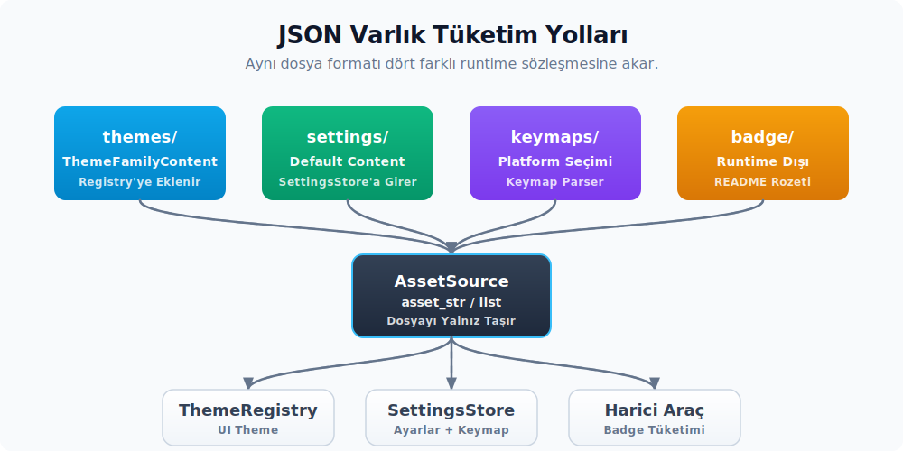

# JSON varlıkları: tema, keymap, settings, badge

Bu bölüm, asset altyapısının yapılandırılmış (structured) varlık katmanını ele alır. JSON dosyaları binary ile birlikte taşınır, fakat tüketim biçimleri birbirinden farklıdır:

- Tema JSON'ları runtime'da bir registry'ye eklenir.
- Keymap JSON'ları kullanıcı tercihine göre seçilip parse edilir.
- Settings JSON'ları varsayılan değer kaynağı olarak okunur.
- Badge JSON'u runtime'da hiç tüketilmez.

Bu dört yolu birlikte anlatmak, "neden tüm JSON'lar aynı tüketim hattından geçmiyor?" sorusunu cevaplar. Yeni bir JSON tabanlı varlık eklerken hangi modelin seçileceğini de netleştirir.



---

## 1. JSON varlıklarının topolojisi

JSON dosyaları üç klasör altında dağılmıştır:

```text
assets/
├── themes/
│   ├── one/
│   │   ├── one.json          # 4 tema (Light, Dark, Light Gentler, Dark Gentler)
│   │   └── LICENSE
│   ├── ayu/
│   ├── gruvbox/
│   └── LICENSES/
├── keymaps/
│   ├── default-linux.json
│   ├── default-macos.json
│   ├── default-windows.json
│   ├── initial.json          # kullanıcının keymap dosyası şablonu
│   ├── storybook.json
│   ├── vim.json
│   ├── linux/                # editor-emulation paketleri
│   │   ├── atom.json
│   │   ├── cursor.json
│   │   ├── emacs.json
│   │   ├── jetbrains.json
│   │   └── sublime_text.json
│   └── macos/
│       ├── atom.json
│       ├── cursor.json
│       ├── emacs.json
│       ├── jetbrains.json
│       ├── sublime_text.json
│       └── textmate.json
├── settings/
│   ├── default.json
│   ├── default_semantic_token_rules.json
│   ├── initial_user_settings.json
│   ├── initial_server_settings.json
│   ├── initial_local_settings.json
│   ├── initial_tasks.json
│   ├── initial_debug_tasks.json
│   └── initial_local_debug_tasks.json
└── badge/
    └── v0.json               # runtime'da okunmaz; README rozeti
```

İki ayrı `RustEmbed` struct'ı bu klasörleri taşır:

- `Assets` (`assets`): `themes/` klasörünü taşır. `badge/` runtime'da kullanılmaz; `Assets` include listesinde yer almaz, sadece repository'deki asset topolojisinin parçasıdır.
- `SettingsAssets` (`settings`): `keymaps/` ve `settings/`.

Tema sistemi `cx.asset_source()` üzerinden okur (yani `Assets` struct'ı runtime'a `with_assets` ile bağlandıktan sonra erişilebilir). Keymap ve settings doğrudan `SettingsAssets::get` üzerinden senkron okur. `App` runtime'ı kurulmadan da çağrılabilir. Bu ayrım asset altyapısının kuruluş sırasındaki kritik bir kararıdır. Sonraki bölümlerde örneklenir.

---

## 2. Tema JSON'larının akışı

Tema JSON'larının yüklenmesi `theme_settings` crate'indeki `load_bundled_themes` fonksiyonunda yaparsın:

```rust
pub fn load_bundled_themes(registry: &ThemeRegistry) {
    let theme_paths = registry
        .assets()
        .list("themes/")
        ?
        .into_iter()
        .filter(|path| path.ends_with(".json"));

    for path in theme_paths {
        let Some(theme) = registry.assets().load(&path).log_err().flatten() else {
            continue;
        };

        let Some(theme_family) = serde_json::from_slice(&theme)
            .with_context(|| format!("failed to parse theme at path \"{path}\""))
            .log_err()
        else {
            continue;
        };

        let refined = refine_theme_family(theme_family);
        registry.insert_theme_families([refined]);
    }
}
```

Akış altı adımdadır:

1. **`registry.assets().list("themes/")`** — Recursive listeleme; `themes/one/one.json`, `themes/ayu/ayu.json`, `themes/LICENSES/...` gibi tüm path'ler döner.
2. **`.json` filtresi** — `LICENSE` dosyaları ve klasörler dışlanır. Filtre uzantı bazlıdır.
3. **`assets().load(&path)` çağrısı** — Her tema dosyası ham byte olarak yüklenir. `log_err().flatten()` desen, hata varsa log'a düşürür ve `None` döndürür; aksi halde `Some(bytes)` ile devam edilir.
4. **`serde_json::from_slice`** — Byte'lar `ThemeFamilyContent` struct'ına parse edilir. Bu struct Zed tema JSON sözleşmesini mirror eder; tüm renk alanlarını `Option<T>` olarak tutar.
5. **`refine_theme_family`** — `Content` → `Refinement` → `Theme` dönüşümü uygularsın. Bu adım tema sistemi bölümünde detaylıdır; özetle: kullanıcı temasındaki eksik alanlar fallback değerleriyle doldurulur ve runtime'da kullanıma hazır `Theme` struct'ı üretilir.
6. **`registry.insert_theme_families`** — Hazır tema ailesi `ThemeRegistry`'ye eklenir; `cx.theme()` artık bu temaya erişebilir.

**Hata toleransı:** Bozuk bir tema dosyası tüm uygulamayı durdurmaz. Parse hatası `log_err()` ile log'a düşer, `continue` ile bir sonraki tema'ya geçilir. Bu davranış kullanıcı sürtüşmesini azaltır: bir tema dosyası bozuksa kullanıcı yalnızca o temaya erişemez, kalan tema seçimleri çalışmaya devam eder.

### 2.1 `LoadThemes` kademeleri ve asset bağımlılığı

Tema sistemi başlatılırken üç farklı asset davranışı seçebilirsin:

```rust
pub enum LoadThemes {
    /// Sadece fallback tema yüklenir; kullanıcı temaları yüklenmez.
    JustBase,
    /// Tüm gömülü temalar yüklenir.
    All(Box<dyn AssetSource>),
}

pub fn init(themes_to_load: LoadThemes, cx: &mut App) {
    SystemAppearance::init(cx);
    let assets = match themes_to_load {
        LoadThemes::JustBase => Box::new(()) as Box<dyn AssetSource>,
        LoadThemes::All(assets) => assets,
    };
    ThemeRegistry::set_global(assets, cx);
    FontFamilyCache::init_global(cx);
    // ...
}
```

`JustBase` modu test ortamı için kritiktir: `()` boş `AssetSource` ile geçilirse `load_bundled_themes` çağrısı boş liste döner; registry yalnızca fallback temayla kalır. Tema JSON'ları olmayan bir test ortamı da bu mod ile çalışır.

`All(assets)` modu production için kullanırsın. `Box<dyn AssetSource>` parametresi `Assets` struct'ından bir referans ister; `Assets` struct'ı tema klasörünü include eder (yukarıdaki `#[include = "themes/**/*"]` direktifi).

Zed'in `main.rs` dosyasındaki kuruluş:

```rust
theme_settings::init(theme::LoadThemes::All(Box::new(Assets)), cx);
```

Bu çağrıdan sonra `ThemeRegistry::global(cx)` tüm gömülü tema ailelerini içerir.

### 2.2 Kullanıcı temaları ve registry içine alma

Kullanıcı temaları (yani `~/.config/zed/themes/*.json` altındaki dosyalar) ayrı bir yoldan yüklenir:

```rust
fn load_user_themes_in_background(fs: Arc<dyn fs::Fs>, cx: &mut App) {
    cx.spawn({
        let fs = fs.clone();
        async move |cx| {
            // ... themes_dir taranır, her .json dosyası fs.load ile okunur
            // load_user_theme(registry, bytes) ile registry'ye eklenir
        }
    })
}
```

Filesystem'den okuma asenkron yapılır; binary'deki tema yükleme ise senkron `list+load` döngüsüdür. İki yol birleştiğinde aynı `ThemeRegistry`'ye akar ve fark gözlemlenemez. Bu, "binary'deki varlık + filesystem override" deseninin tema sistemindeki karşılığıdır.

---

## 3. Keymap JSON'ları ve `SettingsAssets` yolu

Keymap dosyaları farklı bir tüketim yolu izler. `settings` crate'i:

```rust
#[cfg(target_os = "macos")]
pub const DEFAULT_KEYMAP_PATH: &str = "keymaps/default-macos.json";

#[cfg(target_os = "windows")]
pub const DEFAULT_KEYMAP_PATH: &str = "keymaps/default-windows.json";

#[cfg(not(any(target_os = "macos", target_os = "windows")))]
pub const DEFAULT_KEYMAP_PATH: &str = "keymaps/default-linux.json";

pub fn default_keymap() -> Cow<'static, str> {
    asset_str::<SettingsAssets>(DEFAULT_KEYMAP_PATH)
}

pub const VIM_KEYMAP_PATH: &str = "keymaps/vim.json";

pub fn vim_keymap() -> Cow<'static, str> {
    asset_str::<SettingsAssets>(VIM_KEYMAP_PATH)
}

pub fn initial_keymap_content() -> Cow<'static, str> {
    asset_str::<SettingsAssets>("keymaps/initial.json")
}
```

Üç noktanın altını çizmek gerekir:

- **`cfg` ile platform seçimi.** Derleme zamanında platforma göre `DEFAULT_KEYMAP_PATH` farklı bir değere atarsın. macOS binary'si yalnızca `keymaps/default-macos.json`'u kullanır; diğer platform varyantları release paketinde bulunsa da çağrı yolu yoktur. Pratikte üçü de `SettingsAssets` erişim kümesine girer (`keymaps/*` include eder), ama runtime yalnızca platforma uygun olanı okur.
- **`asset_str::<SettingsAssets>` çağrısı.** `util::asset_str` jenerik bir yardımcıdır:

  ```rust
  pub fn asset_str<A: rust_embed::RustEmbed>(path: &str) -> Cow<'static, str> {
      match A::get(path)?.data {
          Cow::Borrowed(bytes) => Cow::Borrowed(std::str::from_utf8(bytes)?),
          Cow::Owned(bytes) => Cow::Owned(String::from_utf8(bytes)?),
      }
  }
  ```

  Bu fonksiyon `RustEmbed::get` çağrısını yapar (yani `cx.asset_source()` değil), byte'ları UTF-8 string'e çevirir ve `Cow<'static, str>` döner. Bu yapı sayesinde keymap ve settings dosyaları `App` runtime'ı kurulmadan da okunabilir; özellikle erken kuruluş aşamasında settings store'a varsayılan değerleri vermek için kritiktir.

- **Sert paketleme kontratı.** `A::get(path)` `None` döndürürse kaynak kodu fail-fast davranır. Bu, keymap dosyalarının `SettingsAssets` erişim kümesinde mutlaka bulunması gerektiğini söyleyen bir paketleme varsayımıdır. Eğer dosya silinirse veya `#[include]` filtresi yanlışsa, uygulama başlatılırken panik atar; bu da deployment öncesi tespit edilebilir bir hatadır.

Burada küçük ama önemli bir paketleme ayrıntısı vardır: `SettingsAssets` kaynak kodunda `#[include = "keymaps/*"]` olarak görünür, buna rağmen tüketilen path'ler `keymaps/macos/atom.json` ve `keymaps/linux/jetbrains.json` gibi alt dizinlerdedir. Bunun nedeni `rust-embed` 8.11'in `include-exclude` özelliğinde kullanılan `globset` varsayılanlarının `*` karakterini path ayırıcısını da eşleyebilecek şekilde değerlendirmesidir. Yani Zed'in mevcut kalıbı alt paketleri kapsar; yine de bu kalıp değiştirilirken kök `keymaps/*.json` dosyalarının yanı sıra platform alt paketlerinin de gömülü kaldığı mutlaka doğrulanmalıdır. Daha açık bir ifade istenirse `keymaps/**/*` kalıbı tercih edebilirsin.

### 3.1 Platform-spesifik editor keymap paketleri

`assets/keymaps/macos/` ve `assets/keymaps/linux/` altında editor emülasyon dosyaları durur (`atom.json`, `cursor.json`, `emacs.json`, `jetbrains.json`, `sublime_text.json`, `textmate.json`). Bunlar `BaseKeymap` enum'u üzerinden seçersin:

```rust
pub fn asset_path(&self) -> Option<&'static str> {
    #[cfg(target_os = "macos")]
    match self {
        BaseKeymap::JetBrains => Some("keymaps/macos/jetbrains.json"),
        BaseKeymap::SublimeText => Some("keymaps/macos/sublime_text.json"),
        BaseKeymap::Atom => Some("keymaps/macos/atom.json"),
        BaseKeymap::TextMate => Some("keymaps/macos/textmate.json"),
        BaseKeymap::Emacs => Some("keymaps/macos/emacs.json"),
        BaseKeymap::Cursor => Some("keymaps/macos/cursor.json"),
        BaseKeymap::VSCode => None,         // varsayılan, ek dosya yok
        BaseKeymap::None => None,
    }
    // ... linux varyantı
}
```

Üç davranış kuralı önemlidir:

- **VSCode varsayılan keymap'tir.** `default-<platform>.json` zaten VSCode kısayollarını taşır. `BaseKeymap::VSCode` için ek bir dosya yoktur; sadece default keymap aktif olur.
- **`BaseKeymap::None` boş keymap'tir.** Tüm kısayollar devre dışı bırakılır; kullanıcı her kısayolu kendisi tanımlar.
- **Linux'ta TextMate yoktur.** macOS'a özgü bir paketleme tercihidir; `#[cfg]` ile match koluna eklenmez. Bu, "binary'de olsa bile platforma uygun değilse çağırma" davranışının tipik bir örneğidir.

Keymap seçimi `BaseKeymap` setting'inden okunur, `BaseKeymap::asset_path` ile path elde edilir, `SettingsAssets` üzerinden içerik okunur ve default keymap'in üzerine eklersin. Bu zincir kullanıcı tercihinin asset boru hattına nasıl bağlandığını net bir şekilde gösterir.

---

## 4. Settings JSON'ları

Settings yükleyici hattı `asset_str` ile birden fazla varsayılan dosyayı okur:

```rust
pub fn default_settings() -> Cow<'static, str> {
    asset_str::<SettingsAssets>("settings/default.json")
}

pub fn default_semantic_token_rules() -> Cow<'static, str> {
    asset_str::<SettingsAssets>("settings/default_semantic_token_rules.json")
}

pub fn initial_user_settings_content() -> Cow<'static, str> {
    asset_str::<SettingsAssets>("settings/initial_user_settings.json")
}

pub fn initial_server_settings_content() -> Cow<'static, str> {
    asset_str::<SettingsAssets>("settings/initial_server_settings.json")
}

pub fn initial_project_settings_content() -> Cow<'static, str> {
    asset_str::<SettingsAssets>("settings/initial_local_settings.json")
}

pub fn initial_tasks_content() -> Cow<'static, str> {
    asset_str::<SettingsAssets>("settings/initial_tasks.json")
}

pub fn initial_debug_tasks_content() -> Cow<'static, str> {
    asset_str::<SettingsAssets>("settings/initial_debug_tasks.json")
}

pub fn initial_local_debug_tasks_content() -> Cow<'static, str> {
    asset_str::<SettingsAssets>("settings/initial_local_debug_tasks.json")
}
```

Sekiz fonksiyon iki anlam grubuna ayrılır:

| Grup | Dosya | Anlamı |
|------|-------|--------|
| **Default** | `default.json`, `default_semantic_token_rules.json` | Runtime'da varsayılan değer kaynağı; her settings okumasında fallback olarak kullanılır |
| **Initial** | `initial_user_settings.json`, `initial_server_settings.json`, `initial_local_settings.json`, `initial_tasks.json`, `initial_debug_tasks.json`, `initial_local_debug_tasks.json` | Kullanıcı dosyası ilk kez oluşturulurken disk'e yazılan şablon içerik |

**Default vs Initial farkı:** Default dosyalar `SettingsStore`'a varsayılan değer enjekte eder; her settings çağrısı bu değerleri okur. Initial dosyalar yalnızca yeni kullanıcı kurulumunda kullanılır; mevcut bir kullanıcı dosyası varsa initial dosyalara dokunulmaz.

Bu ayrım önemli bir tasarım kararıdır: default değerin değişmesi tüm kullanıcıları etkiler (binary güncelleyince); initial dosyanın değişmesi yalnızca yeni kullanıcılar üzerinden görünür. Bir ayar default'unun değiştirilmesi geri uyumluluk değerlendirmesi gerektirir; initial dosyasının değişmesi ise yalnızca onboarding deneyimini etkiler.

### 4.1 `SettingsStore` ve default değer enjeksiyonu

`settings` crate'indeki `init`:

```rust
pub fn init(cx: &mut App) {
    let settings = SettingsStore::new(cx, &default_settings());
    cx.set_global(settings);
    SettingsStore::observe_active_settings_profile_name(cx).detach();
}
```

`SettingsStore::new` çağrısı `default_settings()` çıktısını (yani `settings/default.json` içeriği) parse eder ve ayarların başlangıç değerlerini bu içerikten çıkarır. Kullanıcı dosyaları sonradan yüklendiğinde bu varsayılan değerlerin üzerine yazılır.

Önemli ayrıntı: `default_settings()` çağrısı **panic atabilir**. `asset_str::<SettingsAssets>` içindeki asset okuma kontratı dosya yoksa panik atar. Yani settings sisteminin başlatılması, default JSON dosyasının `SettingsAssets` erişim kümesinde bulunmasına sıkı sıkıya bağlıdır. Bu kasıtlı bir sertliktir: settings olmadan Zed başlatılamaz, fail-fast davranışı kabul edilir.

---

## 5. İki RustEmbed yolu karşılaştırması

JSON varlıklarının üç farklı yoldan tüketildiği görülüyor:

| Varlık | Yol | `cx.asset_source()` mu? | Kuruluş sırası |
|--------|-----|------------------------|----------------|
| Tema JSON'ları | `cx.asset_source().list/load` | Evet | `App` runtime'ı kurulduktan sonra |
| Keymap JSON'ları | `asset_str::<SettingsAssets>` | Hayır (RustEmbed::get) | `App` kurulmadan önce de çağrılabilir |
| Settings JSON'ları | `asset_str::<SettingsAssets>` | Hayır | `App` kurulmadan önce de çağrılabilir |
| Badge JSON | - | Hayır (runtime'da okunmaz) | - |

İki yolun pratikteki anlamı:

- **`cx.asset_source()` yolu (`Assets`)** dinamiktir: runtime'da değiştirilebilir, test ortamında mock'lanabilir (`Arc::new(()) as Arc<dyn AssetSource>`), filesystem yolu ile yer değiştirebilir.
- **`SettingsAssets::get` yolu** statiktir: derleme zamanında sabit, runtime mock'lanamaz. Bu, settings ve keymap'in temel uygulama sözleşmesinin parçası olduğunu söyler; testte bile farklı default'larla çalışmak istenirse parametre olarak override geçmek gerekir.

**Yeni JSON varlık eklerken karar:** Eğer varlık runtime'da değişebiliyorsa (tema gibi: kullanıcı override eder, extension ekler) `Assets` yolu kullanırsın. Eğer varlık derleme zamanında sabit ve uygulamanın temel sözleşmesinin parçasıysa (settings default'u, keymap base'i) `SettingsAssets` yolu seçersin. İkinci yol, runtime mock'lanmasını zorlaştırdığı için daha "katı" bir sözleşmedir.

---

## 6. `badge/v0.json` ve runtime dışı tüketim

`assets/badge/v0.json` `RustEmbed` include kalıplarında yer almaz; ne `Assets` ne `SettingsAssets` bu dosyayı binary'ye gömer. Tüketicisi tamamen dışsaldır: README.md'deki shields.io rozeti bu JSON'u GitHub raw URL'inden çeker ve "Zed" yazılı bir badge render eder.

Bu dosyanın asset klasöründe durmasının iki gerekçesi vardır:

1. **Versiyonlama:** `v0.json` adı, ileride badge formatı değişirse `v1.json` eklenerek geriye uyumluluğun korunabileceğini gösterir. Eski README rozetleri eski formatı okumaya devam eder.
2. **Sahiplik:** `assets/` klasörü görsel sözleşmenin merkezi olduğundan, projeyi temsil eden bir badge dosyasının da burada durması anlamlıdır. `.github/` klasörüne konulabilirdi ama görsel kimlik açısından `assets/badge/` daha keşfedilebilir.

**Sonuç:** Asset klasörü her dosyanın runtime tüketicisi olduğu varsayımı yanlıştır. Yeni bir dosya eklerken include kalıplarını bilinçli yönetmek, binary boyutunu ve runtime sözleşmesini koruma altına alır.

---

## 7. JSON tüketimi karşılaştırma tablosu

JSON varlık türlerinin tüketim profillerini özetlemek gerekirse:

| Varlık türü | Tüketici | Yükleme zamanı | Format | Override mekanizması |
|-------------|----------|----------------|--------|---------------------|
| Tema | `ThemeRegistry` | Uygulama başlatma (eager) | `serde_json` ile `ThemeFamilyContent` | `~/.config/zed/themes/*.json` |
| Default keymap | `KeymapFile::load_settings_file` | Uygulama başlatma | Custom keymap parser | `~/.config/zed/keymap.json` |
| Base keymap (Atom/JetBrains/...) | Kullanıcı seçimi sonrası | Setting değişimi anında | Custom keymap parser | Yok (sabit dosya) |
| Default settings | `SettingsStore::new` | Uygulama başlatma | `serde_json` ile `SettingsContent` | `~/.config/zed/settings.json` |
| Initial settings | İlk kurulum | Disk'e yazılır | Salt metin | - (yeni kullanıcı oluşumunda kullanılır) |
| Badge | Runtime yok | - | - | - |

Üç desen göze çarpar:

- **Binary + filesystem override** (tema, keymap, settings): Binary varsayılanları taşır, kullanıcı dosyaları override eder. Üçü için de aynı kural geçerlidir: dosya yoksa default'tan okunur.
- **Initial dosya yalnızca onboarding** (initial_*.json): Yeni kullanıcı için disk'e yazılır; sonradan binary güncellense de mevcut kullanıcı dosyası değişmez.
- **Runtime dışı varlık** (badge): Binary'ye girmez, sadece klasörde durur.

---

## 8. Yeni JSON varlık eklerken karar ağacı

Yeni bir JSON dosyası eklenmesi gerektiğinde aşağıdaki sorular sırayla cevaplanır:

```text
1. Runtime'da okunacak mı?
   ├── Hayır → assets/ altına koy, include kalıplarında yer verme (badge gibi)
   └── Evet ↓

2. Runtime'da değişebilir mi (kullanıcı override, extension)?
   ├── Evet → Assets struct'ı + cx.asset_source().load (tema gibi)
   └── Hayır ↓

3. App kurulmadan önce okunması gerekiyor mu?
   ├── Evet → SettingsAssets struct'ı + asset_str (settings, keymap gibi)
   └── Hayır → Assets struct'ı + cx.asset_source().load
```

Üç noktada karar vermen gerekir:

- **Tüketim yolu (Assets vs SettingsAssets):** Eğer dosya `App` runtime'ı kurulmadan okunacaksa veya başlatma sırasında erken çağrılan bir bileşen tarafından okunacaksa `SettingsAssets` tercih edersin. Aksi halde `Assets` daha esnektir (test mock'lanabilir).
- **Parse stratejisi:** Eğer dosya bir struct'a deserialize edilecekse `serde_json::from_slice` kullanırsın. Eğer dosya UTF-8 string olarak okunup özel bir parser'a verilecekse `asset_str` daha doğrudur (string dönüşümünü kendi içinde yapar).
- **Override stratejisi:** Eğer kullanıcı dosyayı override edebilmeliyse filesystem watcher kurulur veya `cx.spawn` ile asenkron yükleme yolu eklenir; aksi halde binary content tek otoritedir.

Bu karar ağacı, JSON varlıklarının tüketim hattını seçerken üç boyutu birden değerlendirir: erişim zamanı, esneklik ve override gereksinimi.

---
