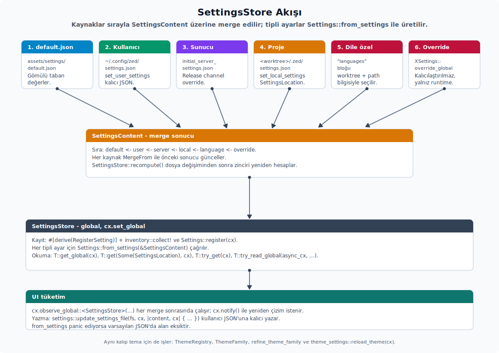

# Akış ve Kayıt

---

## Ayar Akışı



Ayar akışı şu sırayla işler:

1. Kullanıcı `~/.config/zed/settings.json`, proje seviyesindeki `.zed/settings.json`, sunucu yan ayar dosyası veya bir EditorConfig dosyasına yazar.
2. `watch_config_file` / `watch_config_dir` dosya değişikliklerini bir `mpsc::UnboundedReceiver<String>` üzerinden yayar.
3. `SettingsStore::set_user_settings` / `set_local_settings` / `set_global_settings` / `set_server_settings` ham JSON'u içerik tipine çevirip store'a yedirir.
4. Store, kayıtlı `Settings` tiplerinin değerlerini birleştirilmiş `SettingsContent` üzerinden yeniden hesaplar ve global olarak GPUI `App`'e bildirir.
5. UI tarafları `cx.observe_global::<SettingsStore>(...)` ile değişimi izler ve yeniden çizer.

`settings::init(cx)` startup sırasında çağrılır; içerde `SettingsStore::new(cx, &default_settings())` çalışır ve oluşan store `cx.set_global(...)` ile global hale getirilir. `default_settings()` paketlenmiş `settings/default.json` dosyasını döndürür.

---

## `Settings` trait'i

`settings::Settings` her tipli ayarın çalışma zamanı sözleşmesidir:

```rust
pub trait Settings: 'static + Send + Sync + Sized {
    const PRESERVED_KEYS: Option<&'static [&'static str]> = None;

    fn from_settings(content: &SettingsContent) -> Self;

    fn register(cx: &mut App);
    fn get<'a>(path: Option<SettingsLocation>, cx: &'a App) -> &'a Self;
    fn get_global(cx: &App) -> &Self;
    fn try_get(cx: &App) -> Option<&Self>;
    fn try_read_global<R>(cx: &AsyncApp, f: impl FnOnce(&Self) -> R) -> Option<R>;
    fn override_global(settings: Self, cx: &mut App);
}
```

- `from_settings` birleştirilmiş `SettingsContent` üzerinden tipi inşa eder. Varsayılan değerleri `assets/settings/default.json` tarafından sağlamak gerekir; aksi halde panic riski vardır.
- `PRESERVED_KEYS` versiyon etiketi gibi alanların ayar dosyasında daima yazılı kalmasını ister. Tip etiketli içeriklerde "schema_version" gibi kayıtların kaybolmaması içindir.
- `get` ve `get_global` `SettingsStore::get` üzerinden değer döndürür. `path` parametresi `SettingsLocation { worktree_id, path }` ile worktree veya proje yolu hedefli üzerine yazmaları katmanlı olarak birleştirir.
- `try_get` store mevcut değilse `None` döndürür; test bağlamlarında ve henüz başlatma yapılmamış erken kodlarda işe yarar.
- `try_read_global` async bağlam (`AsyncApp`) içinde okumayı sağlar; closure içinde yalnızca `&Self` görür, mutasyon yapılmaz.
- `override_global` programatik üzerine yazmadır; dosyaya kaydedilmez, yalnız o anki süreçteki değeri değiştirir.

`SettingsKey` JSON içindeki kök veya alt anahtar eşleşmesini tip seviyesinde taşır:

```rust
pub trait SettingsKey: 'static + Send + Sync {
    const KEY: Option<&'static str>;
    const FALLBACK_KEY: Option<&'static str> = None;
}
```

`KEY = None` ayarın root object üzerinden çözüldüğü anlamına gelir. `FALLBACK_KEY` eski JSON anahtarlarından yeni yapıya geçerken uyumluluk için kullanılır; yeni anlatımlarda kalıcı anahtar olarak değil geçiş desteği olarak düşünmen gerekir.

---

## `RegisterSetting` derive'ı

Ayar tipleri iki yoldan kaydedilir:

- **Derive ile `inventory` kayıt listesi üzerinden otomatik kayıt:**

  ```rust
  use settings::{RegisterSetting, Settings, SettingsContent};

  #[derive(Clone, Deserialize, RegisterSetting)]
  pub struct OzellikAyarlari {
      pub etkin: bool,
  }

  impl Settings for OzellikAyarlari {
      fn from_settings(icerik: &SettingsContent) -> Self {
          let etkin = match icerik
              .ozellik
              .as_ref()
              .and_then(|ozellik| ozellik.etkin)
          {
              Some(etkin) => etkin,
              None => false,
          };
          Self { etkin }
      }
  }
  ```

  `RegisterSetting` `inventory::collect!` ile derleme zamanı kayıt listesi üretir. `SettingsStore::new` veya `register_setting` çağrısı bu listeyi okur ve tipleri otomatik olarak kaydeder.

- **Elle kayıt:**

  ```rust
  OzellikAyarlari::register(cx);
  ```

  Statik kayıt makrosu kullanılamayan dinamik tip varyantlarında veya test setup'larında elle çağırmak doğru yoldur.

---

## Ayar değişimini dinleme

`SettingsStore` global'i her dosya değişimi veya programatik üzerine yazmadan sonra bildirilir. UI veya servis kodu değişimi `observe_global` ile izler:

```rust
cx.observe_global::<SettingsStore>(|cx| {
    let ayar = OzellikAyarlari::get_global(cx);
    ayara_gore_uygula(ayar, cx);
}).detach();
```

- Geri çağrı içinde değer zaten yeni durumdadır; tekrar oku ve ona göre davran.
- Entity'yi yeniden çizmek için `cx.notify()` çağrısı gerekir. `observe_global` yalnız geri çağrıyı çalıştırır, view'i kendiliğinden geçersizleştirmez.
- Entity yaşam döngüsünü subscription drop güvenliğine bağlamak için `Context<T>::observe_global` tercih edilir; entity drop edildiğinde subscription da temizlenir.

---

## Aktif profil ve override katmanları

`UserSettingsContent` üzerinde `for_profile`, `for_release_channel`, `for_os` uzantı metotları aktif profil, release kanalı (dev/stable) ve işletim sistemine özel override içeriğini döndürür:

- `ActiveSettingsProfileName(String)` aktif kullanıcı profili adını taşıyan basit bir `Global`'dir; `SettingsStore::observe_active_settings_profile_name(cx)` bu global değiştiğinde merged content'i yeniden hesaplar.
- `for_release_channel` `release_channel::RELEASE_CHANNEL.dev_name()` üzerinden eşleşen `release_channel_overrides` girişini açar.
- `for_os` `env::consts::OS` üzerinden eşleşen `platform_overrides` girişini açar.

Bu katmanların birleşim önceliği `SettingsFile::cmp` üzerinden belirlenir; sıra: `Project` > `Server` > `User` > `Global` > `Default`.

| API | Alt özellikler | Kısa anlamı |
| :-- | :-- | :-- |
| `ActiveSettingsProfileName` | `String` alanı, `Global` impl'i | Aktif kullanıcı profilinin adını GPUI global'i olarak taşır. |
| `SettingsKey` | `KEY`, `FALLBACK_KEY` | JSON kök/alt anahtar eşleşmesini tip seviyesinde tutar. |
| `SettingsFile` | `Default`, `Global`, `User`, `Server`, `Project` | Ayar kaynağını ve merge öncelik sırasını temsil eder. |
| `SettingsLocation` | `worktree_id`, `path` | Okumanın hangi worktree/path için yapılacağını söyler. |
| `SettingsParseResult` | `parse_status`, `migration_status`, `result`, `requires_user_action`, `ok`, `parse_error` | Dosya parse ve migrasyon sonucunu tek yapıda toplar. |
| `SettingsFile` | merge önceliği: `Project` > `Server` > `User` > `Global` > `Default` | Override katmanlarında hangi kaynağın kazanacağını belirler. |
| `base_keymap_setting` | re-export modül | Base keymap ayarını tipli settings yüzeyine bağlayan yardımcı modüldür. |
| `editable_setting_control` | re-export modül | Ayarlar UI'ında düzenlenebilir setting control modelini settings crate kökünden erişilebilir kılar. |

---

## Kök `SettingsContent` schema yüzeyi

`settings_content::SettingsContent`, kullanıcı JSON'unun düz görünen alanlarını domain content tiplerine dağıtır. `project`, `theme`, `extension`, `workspace`, `editor`, `remote`, `tabs`, `preview_tabs`, `file_finder`, `project_panel`, `git_panel`, `outline_panel`, `collaboration_panel`, `agent`, `agent_servers`, `message_editor`, `image_viewer`, `repl` ve `which_key` alanları farklı domain content'lerini aynı kök merge hattında birleştirir; aşağıdaki daha küçük content tipleri ise top-level alanların schema, merge ve default davranışını taşır. Bu tipler runtime `Settings` implementasyonu değildir; `SettingsStore` içindeki ham `SettingsContent` merge hattının sözleşmesidir.

| API | JSON/settings rolü | Not |
| :-- | :-- | :-- |
| `AudioSettingsContent`, `AudioInputDeviceName`, `AudioOutputDeviceName` | `audio` ve deneysel giriş/çıkış cihazı ayarları | Cihaz adları `#[serde(transparent)]` newtype olarak taşınır. |
| `CallSettingsContent` | `calls` altında sesli çağrı başlangıç tercihleri | `mute_on_join` ve `share_on_join` gibi bool alanları içerir. |
| `TelemetrySettingsContent` | `telemetry` altında diagnostics ve metrics tercihleri | Varsayılan implementasyonu iki alanı da `true` yapar. |
| `DebuggerSettingsContent`, `SteppingGranularity` | `debugger` stepping, breakpoint ve DAP log ayarları | Dock alanı settings crate'indeki `DockPosition` değerine bağlanır. |
| `GitPanelSettingsContent`, `StatusStyle`, `ScrollbarSettings` | Git paneli görünümü, dock, scrollbar ve commit başlığı sınırları | `StatusStyle` dosya durumunun ikon mu renkli label mı gösterileceğini seçer. |
| `PanelSettingsContent`, `DockSide` | Collaboration ve benzeri panel genişliği/dock schema'sı | Tek panel content taşıyıcısı birden çok panel alanında kullanılır. |
| `FileFinderSettingsContent`, `FileFinderWidthContent`, `IncludeIgnoredContent` | File finder ikon, genişlik ve ignored dosya stratejisi | `IncludeIgnoredContent::Smart` default seçimdir. |
| `VimSettingsContent`, `ModeContent`, `UseSystemClipboard`, `CursorShapeSettings`, `VimInsertModeCursorShape` | Vim modu davranışı ve cursor shape override'ları | `CursorShapeSettings` editor `CursorShape` ile Vim insert shape enum'unu birleştirir. |
| `JournalSettingsContent`, `HourFormat` | Journal dizini ve saat formatı | `HourFormat` `hour12` / `hour24` JSON değerlerini taşır. |
| `OutlinePanelSettingsContent`, `IndentGuidesSettingsContent`, `ShowIndentGuides`, `LineIndicatorFormat` | Outline panel görünümü, indent guide ve satır göstergesi formatı | `LineIndicatorFormat` kısa/uzun gösterim seçimini saklar. |
| `ImageViewerSettingsContent`, `ImageFileSizeUnit` | Görsel görüntüleyici dosya boyutu birimi | Binary ve decimal birim ayrımı content enum'udur. |
| `RemoteSettingsContent`, `SshConnection`, `WslConnection`, `DevContainerConnection`, `RemoteProject`, `SshPortForwardOption` | SSH, WSL ve dev container bağlantı tanımları | Remote ayarları `SettingsContent.remote` flatten alanının schema sınırıdır. |
| `ReplSettingsContent`, `WhichKeySettingsContent`, `DelayMs` | REPL scrollback/inline çıktı ve which-key gecikmesi | `DelayMs` display çıktısında `ms` son eki kullanır. |
| `FeatureFlagsMap`, `InstrumentationSettingsContent`, `PerformanceProfilerSettingsContent` | Feature flag override ve profiler/tracing ayarları | `FeatureFlagsMap` özel `JsonSchema` adıyla runtime schema değişimine izin verir. |
| `PlatformOverrides`, `ReleaseChannelOverrides`, `ProfileBase` | OS, release kanalı ve profil taban override'ları | `settings_overrides!` macro'su `OVERRIDE_KEYS` ve `get_by_key` üretir. |
| `ExtensionsSettingsContent`, `ExtensionSettingsContent`, `ExtensionCapabilityContent` | Uzantı ve uzantı capability payload'ları | Extension content, settings schema'sına ayrı flatten katmanı olarak girer. |
| `HideMouseMode`, `MessageEditorSettings` | Global mouse gizleme ve message editor davranışı | `HideMouseMode` typing/action kaynaklı cursor gizlemeyi seçer. |
| `WindowButtonLayoutContentDiscriminants` | Title bar pencere düğmesi layout enum discriminant'ı | Selector/schema tarafında variant listesini content katmanından verir. |
| `default_true`, `serialize_optional_f32_with_two_decimal_places` | Serde default ve float serialize yardımcıları | Content alanlarının schema/JSON kararlılığında kullanılan küçük yardımcılardır. |

---

## Tuzaklar

Akış ve kayıt tarafında karşılaşılan tipik hatalar:

- `from_settings` panic ediyorsa varsayılan JSON eksiktir; her alanın `assets/settings/default.json` içinde tanımlanması gerekir.
- Dile özel ayar gerekiyorsa `Settings::get(Some(SettingsLocation { worktree_id, path }), cx)` çağrısı worktree özel üzerine yazmaları otomatik getirir.
- `register_setting` `SettingsStore::new` içinde derleme zamanı kayıt listesini tek seferde okur; runtime'da bir tipi geç kaydetmek istendiğinde `Settings::register(cx)` çağrılmalıdır.
- Yeni ayar eklenirken `settings_content` schema'sı güncellenmelidir; aksi halde JSON schema doğrulaması yeni alanı tanımaz.
- `override_global` kalıcılaştırılmaz; dosyaya yazmak için `update_settings_file` yardımcısı kullanırsın.
