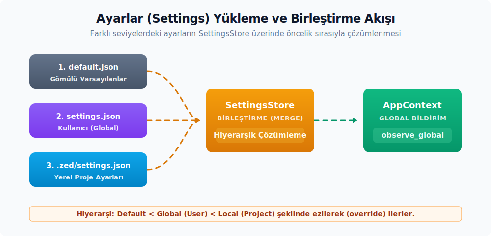

# Akış ve Kayıt

---

## Ayar Akışı


Uygulama ayarlarının yüklenmesi, diskteki değişikliklerin izlenmesi ve birleştirilerek (merge) bileşenlere duyurulması süreçleri `SettingsStore` aracılığıyla yürütülür. Aşağıdaki şemada, varsayılan, global ve yerel ayar dosyalarının hiyerarşik bir öncelikle birleştirilmesi ve `observe_global` kancası üzerinden kullanıcı arayüzü bileşenlerine yansıtılması akışı gösterilmektedir:



Ayar güncelleme ve yükleme akışı şu sırayla işler:

1. Kullanıcı `~/.config/zed/settings.json`, proje seviyesindeki `.zed/settings.json`, sunucu tarafındaki ayar dosyası veya bir EditorConfig dosyasına yeni ayarlar yazar.
2. `watch_config_file` veya `watch_config_dir` fonksiyonları dosya değişikliklerini algılar ve bir `mpsc::UnboundedReceiver<String>` kanalı üzerinden yayar.
3. `SettingsStore::set_user_settings`, `set_local_settings`, `set_global_settings` veya `set_server_settings` metotları ham JSON verisini ilgili içerik tipine dönüştürerek store'a işler.
4. Store, kayıtlı `Settings` tiplerinin değerlerini birleştirilmiş `SettingsContent` üzerinden yeniden hesaplar ve global olarak GPUI `App` bağlamına bildirir.
5. UI tarafındaki bileşenler `cx.observe_global::<SettingsStore>(...)` ile bu değişimi izleyerek kendilerini yeniden çizer.

`settings::init(cx)` çağrısı başlangıç (startup) sırasında gerçekleştirilir; bu çağrının arka planında `SettingsStore::new(cx, &default_settings())` çalışır ve oluşan store `cx.set_global(...)` ile global hale getirilir. `default_settings()` fonksiyonu, paketlenmiş `settings/default.json` dosyasının içeriğini döndürür.

---

## `Settings` Trait'i

`settings::Settings`, tipli her ayar yapısının çalışma zamanı (runtime) sözleşmesini oluşturur:

```rust
pub trait Settings: 'static + Send + Sync + Sized {
    const PRESERVED_KEYS: Option<&'static [&'static str]> = None;

    fn from_settings(content: &SettingsContent) -> Self;

    fn register(cx: &mut App);
    fn get<'a>(path: Option<SettingsLocation>, cx: &'a App) -> &'a Self;
    fn get_global(cx: &App) -> &Self;
    fn try_get(cx: &App) -> Option<&Self>;
    fn try_read_global<R>(cx: &AsyncApp, f: impl FnOnce(&Self) -> R) -> Option<R>;
    fn override_global(settings: Self, cx: &mut App);
}
```

- Tek zorunlu (gövdesiz) metot `from_settings`'tir; `register`, `get`, `get_global`, `try_get`, `try_read_global` ve `override_global` metotları ise `#[track_caller]` ve `where Self: Sized` nitelikleriyle varsayılan gövdeye sahip olarak sunulur. Bunların özel tipler için yeniden tanımlanması gerekmez.
- `from_settings` metodu, birleştirilmiş `SettingsContent` üzerinden ilgili tipi inşa eder. Varsayılan değerler `assets/settings/default.json` içerisinde sağlanmalıdır; aksi takdirde çözümleme sırasında çalışma zamanı hataları (panic) oluşabilir.
- `PRESERVED_KEYS` sabit değeri, versiyon etiketleri gibi alanların ayar dosyasında daima yazılı kalmasını sağlar. Bu sayede tip etiketli içeriklerde `"schema_version"` gibi kayıtların kaybolması engellenir.
- `get` ve `get_global` metotları `SettingsStore::get` üzerinden değer döndürür. `path` parametresi, `SettingsLocation { worktree_id, path }` bilgisiyle worktree veya proje yoluna özel üzerine yazma (override) katmanlarını hiyerarşik olarak birleştirir.
- `try_get` metodu store mevcut değilse `None` döndürür; test bağlamlarında ve henüz tam başlatılmamış erken kod bloklarında faydalıdır.
- `try_read_global` metodu, asenkron bağlam (`AsyncApp`) içinde okuma yapmayı sağlar; closure içinde yalnızca `&Self` referansını görür ve mutasyon gerçekleştiremez.
- `override_global` metodu, programatik olarak ayarların üzerine yazılmasını sağlar. Bu işlem dosyaya kalıcı olarak kaydedilmez, yalnızca o anki süreçteki değeri değiştirir.

`SettingsKey` trait'i, JSON içindeki kök veya alt anahtar eşleşmesini tip seviyesinde taşır:

```rust
pub trait SettingsKey: 'static + Send + Sync {
    const KEY: Option<&'static str>;
    const FALLBACK_KEY: Option<&'static str> = None;
}
```

`KEY = None` olması, ayarın root object (kök nesne) üzerinden çözümlendiği anlamına gelir. `FALLBACK_KEY` ise eski JSON anahtarlarından yeni yapılara geçiş yapılırken uyumluluğu korumak amacıyla kullanılır; yeni anlatımlarda kalıcı bir anahtar olarak değil, geçiş desteği olarak düşünülmelidir.

---

## `RegisterSetting` Derive Makrosu

Ayar tipleri iki farklı yolla kaydedilebilir:

- **Derive makrosu ile `inventory` kayıt listesi üzerinden otomatik kayıt:**

  ```rust
  use settings::{RegisterSetting, Settings, SettingsContent};

  #[derive(Clone, Deserialize, RegisterSetting)]
  pub struct OzellikAyarlari {
      pub etkin: bool,
  }

  impl Settings for OzellikAyarlari {
      fn from_settings(icerik: &SettingsContent) -> Self {
          let etkin = match icerik
              .ozellik
              .as_ref()
              .and_then(|ozellik| ozellik.etkin)
          {
              Some(etkin) => etkin,
              None => false,
          };
          Self { etkin }
      }
  }
  ```

  `RegisterSetting` derive makrosu, her tip için `inventory::submit!` ile envanter listesine otomatik bir giriş ekler; envanter listesinin kendisi ise `SettingsStore` crate'i içinde `inventory::collect!` ile tanımlanır. `SettingsStore::new` (ve içerde çağrılan `load_settings_types`) bu listeyi tek seferde okuyarak tüm tipleri kaydeder.

- **Elle (Manuel) kayıt:**

  ```rust
  OzellikAyarlari::register(cx);
  ```

  Statik kayıt makrosunun kullanılamadığı dinamik tip varyantlarında veya test kurulumlarında bu metodun manuel olarak çağrılması doğru yoldur.

---

## Ayar Değişimini Dinleme

`SettingsStore` global nesnesi, her dosya değişiminden veya programatik olarak üzerine yazma işleminden sonra tetiklenir. Arayüz (UI) veya servis kodları bu değişimi `observe_global` ile izler:

```rust
cx.observe_global::<SettingsStore>(|cx| {
    let ayar = OzellikAyarlari::get_global(cx);
    ayara_gore_uygula(ayar, cx);
}).detach();
```

- Geri çağrı (callback) tetiklendiğinde değerler zaten güncellenmiş durumdadır; güncel değer doğrudan okunarak işlem gerçekleştirilir.
- Entity'yi yeniden çizmek için `cx.notify()` çağrısının yapılması gerekir. `observe_global` yalnızca geri çağrı fonksiyonunu yürütür, görünümü (view) kendiliğinden geçersizleştirip yeniden çizdirmez.
- Entity yaşam döngüsünü abonelik iptali (subscription drop) güvenliğine bağlamak için `Context<T>::observe_global` yöntemi tercih edilmelidir; böylece entity yok edildiğinde abonelik de otomatik olarak temizlenir.

---

## Aktif Profil ve Override Katmanları

`UserSettingsContent` yapısı üzerinde tanımlı `for_profile`, `for_release_channel` ve `for_os` genişletme (extension) metotları; aktif profile, release kanalına (dev/stable) ve işletim sistemine özel override içeriklerini döndürür:

- `ActiveSettingsProfileName(String)`, aktif kullanıcı profili adını taşıyan basit bir `Global` değerdir. `SettingsStore::observe_active_settings_profile_name(cx)` metodu bu global değer değiştiğinde birleştirilmiş içeriği (merged content) yeniden hesaplar.
- `for_release_channel` metodu, `release_channel::RELEASE_CHANNEL.dev_name()` üzerinden eşleşen `release_channel_overrides` girişini açar.
- `for_os` metodu ise `env::consts::OS` üzerinden eşleşen `platform_overrides` girişini okur.

Dosyaların öncelik sıralamasında `SettingsFile::cmp` yapısı `Project` > `Server` > `User` > `Global` > `Default` şeklindedir. Çalışma zamanı birleştirme (merge) hattında global değerler şu sırayla kurulur: `Default` üzerine sırasıyla `Extension`, `Global`, kullanıcı içeriği, kullanıcı release kanalı (`for_release_channel`), kullanıcı işletim sistemi (`for_os`), aktif profil ve son olarak `Server` katmanları eklenir. Yani aktif profil; kullanıcının release/OS override'larından sonra, `Server` katmanından ise önce uygulanır. Dosya/path hedefli okumalarda proje ve local ayarlar bu zincirin en üstüne eklenerek nihai sonucu belirler.

| API | Alt Özellikler | Kısa Anlamı |
| :-- | :-- | :-- |
| `ActiveSettingsProfileName` | `String` alanı, `Global` impl'i | Aktif kullanıcı profilinin adını GPUI global'i olarak taşır. |
| `SettingsKey` | `KEY`, `FALLBACK_KEY` | JSON kök/alt anahtar eşleşmesini tip seviyesinde tutar. |
| `SettingsFile` | `Default`, `Global`, `User`, `Server`, `Project` | Ayar kaynağını ve birleştirme öncelik sırasını temsil eder. |
| `SettingsLocation` | `worktree_id`, `path` | Okuma işleminin hangi worktree veya dosya yolu için yapılacağını belirtir. |
| `SettingsParseResult` | `parse_status`, `migration_status`, `result()`, `requires_user_action()`, `ok()`, `parse_error()` | Dosya parse ve migrasyon sonuçlarını tek yapıda toplar. |
| `SettingsFile` | merge önceliği: `Project` > `Server` > `User` > `Global` > `Default` | Override katmanlarında hangi kaynağın geçerli olacağını belirler. |
| `base_keymap_setting` | re-export modül | Base keymap ayarını tipli settings yüzeyine bağlayan yardımcı modüldür. |
| `editable_setting_control` | re-export modül | Ayarlar arayüzünde düzenlenebilir kontrol modelini settings crate kökünden erişilebilir kılar. |

---

## Kök `SettingsContent` Şema Yüzeyi

`settings_content::SettingsContent`, kullanıcı JSON dosyasındaki düz alanları ilgili alan modellerine (domain content) dağıtır. `project`, `theme`, `extension`, `workspace`, `editor`, `remote`, `tabs`, `preview_tabs`, `file_finder`, `project_panel`, `git_panel`, `outline_panel`, `collaboration_panel`, `agent`, `agent_servers`, `message_editor`, `image_viewer`, `repl` ve `which_key` alanları, farklı alan içeriklerini aynı kök merge hattında birleştirir; aşağıdaki daha küçük içerik tipleri ise üst seviye alanların şema, birleştirme (merge) ve varsayılan davranışlarını taşır. Bu tipler çalışma zamanı `Settings` implementasyonu değildir; `SettingsStore` içindeki ham `SettingsContent` birleştirme hattının sözleşmesini oluşturur.

| API | JSON/Settings Rolü | Not |
| :-- | :-- | :-- |
| `AudioSettingsContent`, `AudioInputDeviceName`, `AudioOutputDeviceName` | `audio` ve deneysel giriş/çıkış cihazı ayarları | Cihaz adları `#[serde(transparent)]` newtype olarak taşınır. |
| `CallSettingsContent` | `calls` altında sesli çağrı başlangıç tercihleri | `mute_on_join` ve `share_on_join` gibi bool alanları içerir. |
| `TelemetrySettingsContent` | `telemetry` altında tanı, metrik ve model sağlayıcı retention tercihleri | `diagnostics` ve `metrics` varsayılan olarak `true`, `anthropic_retention` varsayılan olarak `false` değerine sahiptir. |
| `DebuggerSettingsContent`, `SteppingGranularity` | `debugger` adım, breakpoint ve DAP günlüğü ayarları | Dock alanı, settings crate'indeki `DockPosition` değerine bağlanır. |
| `GitPanelSettingsContent`, `StatusStyle`, `ScrollbarSettings` | Git paneli görünümü, dock, scrollbar ve commit başlığı sınırları | `StatusStyle`, dosya durumunun ikonla mı yoksa renkli etiketle mi gösterileceğini belirler; `commit_title_max_length` varsayılanı `0` olduğunda başlık uzunluğu uyarısı devre dışıdır. |
| `PanelSettingsContent`, `DockSide` | İş birliği ve benzeri panel genişliği/dock şemaları | Tek panel içerik taşıyıcısı birden çok panel alanında kullanılır. |
| `FileFinderSettingsContent`, `FileFinderWidthContent`, `IncludeIgnoredContent` | Dosya bulucu ikon, genişlik ve göz ardı edilen dosya stratejileri | `IncludeIgnoredContent::Smart` varsayılan seçimdir. |
| `VimSettingsContent`, `ModeContent`, `UseSystemClipboard`, `CursorShapeSettings`, `VimInsertModeCursorShape` | Vim modu davranışları ve cursor şekli override'ları | `CursorShapeSettings`, editör `CursorShape` ile Vim insert shape enum'unu birleştirir. |
| `JournalSettingsContent`, `HourFormat` | Journal dizini ve saat formatı | `HourFormat` `hour12` / `hour24` JSON değerlerini taşır. |
| `OutlinePanelSettingsContent`, `IndentGuidesSettingsContent`, `ShowIndentGuides`, `LineIndicatorFormat` | Outline panel görünümü, girinti çizgileri ve satır göstergesi formatı | `LineIndicatorFormat`, kısa veya uzun gösterim seçeneğini saklar. |
| `ImageViewerSettingsContent`, `ImageFileSizeUnit` | Görsel görüntüleyici dosya boyutu birimi | İkili (binary) ve ondalık (decimal) birim ayrımı sağlayan content enum'udur. |
| `RemoteSettingsContent`, `SshConnection`, `WslConnection`, `DevContainerConnection`, `RemoteProject`, `SshPortForwardOption` | SSH, WSL ve dev container bağlantı tanımları | Uzak (remote) ayarlar, `SettingsContent.remote` flatten alanının şema sınırıdır. |
| `ReplSettingsContent`, `WhichKeySettingsContent`, `DelayMs` | REPL geçmiş/satır içi çıktı ve which-key gecikmesi | `DelayMs`, çıktı gösteriminde `ms` son ekini kullanır. |
| `FeatureFlagsMap`, `InstrumentationSettingsContent`, `PerformanceProfilerSettingsContent` | Özellik bayrağı override ve profil oluşturucu/izleme ayarları | `FeatureFlagsMap`, özel `JsonSchema` adıyla çalışma zamanı şema değişimine izin verir. |
| `PlatformOverrides`, `ReleaseChannelOverrides`, `ProfileBase` | İşletim sistemi, release kanalı ve profil tabanlı override'lar | `settings_overrides!` makrosu `OVERRIDE_KEYS` ve `get_by_key` metotlarını üretir. |
| `ExtensionsSettingsContent`, `ExtensionSettingsContent`, `ExtensionCapabilityContent` | Uzantı ve uzantı yeteneği (capability) verileri | Uzantı içerikleri, settings şemasına ayrı bir flatten katmanı olarak dahil olur. |
| `HideMouseMode`, `MessageEditorSettings` | Global fare gizleme ve mesaj editörü davranışları | `HideMouseMode`, yazma veya eylem kaynaklı imleç gizlemeyi seçer. |
| `WindowButtonLayoutContentDiscriminants` | Pencere buton yerleşim enum discriminant değeri | Seçici/şema tarafında varyant listesini içerik katmanından sağlar. |
| `default_true`, `serialize_optional_f32_with_two_decimal_places` | Serde varsayılan ve float serileştirme yardımcıları | İçerik alanlarının şema/JSON kararlılığında kullanılan küçük yardımcılardır. |

---

## Dikkat Edilmesi Gereken Hususlar

Akış ve kayıt süreçlerinde hataya yol açabilecek kritik hususlar şunlardır:

- `from_settings` çözümlemesi hata (panic) veriyorsa varsayılan JSON dosyası eksiktir; her alanın `assets/settings/default.json` içerisinde tanımlanmış olması gerekir.
- Dile özel ayar yapılması gerektiğinde `Settings::get(Some(SettingsLocation { worktree_id, path }), cx)` çağrısı, o worktree'ye özel üzerine yazılmış ayarları otomatik olarak getirir.
- `SettingsStore::new` envanter kayıt listesini başlangıçta tek seferde okuyarak tüm tipleri kaydeder; çalışma zamanında (runtime) bir tipi geç kaydetmek istediğinizde `Settings::register(cx)` çağrısının manuel yapılması gerekir.
- Yeni bir ayar alanı eklendiğinde `settings_content` şemasının güncellenmesi gerekir; aksi takdirde JSON şema doğrulaması yeni alanı tanımaz.
- `override_global` metodu ayarları kalıcılaştırmaz; ayarları kalıcı olarak dosyaya yazmak için `update_settings_file` yardımcısından faydalanılır.
