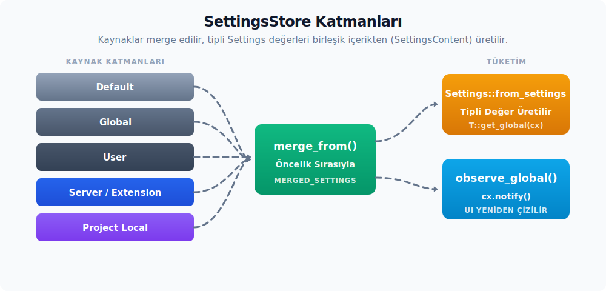

# SettingsStore

`SettingsStore`, Zed'in tüm ayar kaynaklarını tek bir tip güvenli store (ayar deposu) içinde birleştirir. Çalışma zamanındaki (runtime) global değerler; varsayılan (`Default`) üzerine sırasıyla eklenti (`Extension`), `Global`, kullanıcı içeriği, release kanalı, OS, aktif profil ve sunucu (`Server`) katmanları eklenerek kurulur. Dosya yolu (path) hedefli okumalarda ise yerel ayarlar (`local_settings`) bu zincirin en üstüne dahil edilir. Birleştirilmiş nihai içerik daha sonra sisteme kayıtlı olan ilgili `Settings` tiplerine aktarılır.



---

## Store Yapısı

Aşağıdaki veri yapısı (struct) alanları, store'un hem kaynak içerikleri hem de birleşik sonuçları nerede sakladığını göstermektedir:

```rust
pub struct SettingsStore {
    setting_values: HashMap<TypeId, Box<dyn AnySettingValue>>,
    default_settings: Rc<SettingsContent>,
    user_settings: Option<UserSettingsContent>,
    global_settings: Option<Box<SettingsContent>>,
    extension_settings: Option<Box<SettingsContent>>,
    server_settings: Option<Box<SettingsContent>>,
    language_semantic_token_rules: HashMap<SharedString, SemanticTokenRules>,
    merged_settings: Rc<SettingsContent>,
    last_user_settings_content: Option<String>,
    last_global_settings_content: Option<String>,
    local_settings: BTreeMap<(WorktreeId, Arc<RelPath>), SettingsContent>,
    pub editorconfig_store: Entity<EditorconfigStore>,
    _settings_files_watcher: Option<Task<()>>,
    _setting_file_updates: Task<()>,
    setting_file_updates_tx: mpsc::UnboundedSender<
        Box<dyn FnOnce(AsyncApp) -> LocalBoxFuture<'static, Result<()>>>,
    >,
    file_errors: BTreeMap<SettingsFile, SettingsParseResult>,
}

impl Global for SettingsStore {}
```

- `default_settings` — `default.json` üzerinden yüklenen varsayılan sabit içeriktir.
- `user_settings` — Kullanıcının `~/.config/zed/settings.json` dosyasından okunan içeriğidir. Release kanalı, işletim sistemi (OS) ve profil override katmanlarını da barındırır.
- `global_settings` — Collab veya uzak sunucu tarafından yayılan global ayar içeriğidir.
- `server_settings` — SSH proje bağlamı veya uzak sunucu tarafındaki ayar dosyasıdır.
- `extension_settings` — Yüklü uzantıların (extension) dile özel olarak eklediği ayar içerikleridir (yalnızca `all_languages` kapsamındadır, genel ayarlar taşımaz).
- `local_settings` — Proje veya worktree kapsamındaki yerel `.zed/settings.json` dosyalarını `(WorktreeId, RelPath)` çiftiyle eşleştirerek saklar.
- `merged_settings` — Öncelik kurallarına göre tek bir bütün haline getirilerek önbelleğe alınmış nihai içeriktir; tüm sorgular bu değer üzerinden çözümlenir.
- `last_user_settings_content` ve `last_global_settings_content` — Aynı ham metnin tekrar tekrar ayrıştırılmasını (parse) önleyen son içerik önbellekleridir.
- `editorconfig_store` — Proje içerisindeki `.editorconfig` dosyalarını ayrı bir entity yapısında tutar.
- `_settings_files_watcher`, `_setting_file_updates` ve `setting_file_updates_tx` — Dosya izleme ve yazma taleplerini store yaşam döngüsüne bağlayan asenkron görevlerdir.

---

## Kurulum

En sade kurulum senaryosunda store oluşturulur, global duruma (global state) aktarılır ve aktif profil değişimi izlenir:

```rust
let ayarlar = SettingsStore::new(cx, &default_settings());
cx.set_global(ayarlar);
SettingsStore::observe_active_settings_profile_name(cx).detach();
```

`settings::init(cx)` fonksiyonu da başlangıçta aynı adımları uygular ve aktif profil değişimi için gerekli gözlemciyi yapılandırır. `SettingsStore::new(cx, default_settings)` kendisi `SettingsStore::new_with_semantic_tokens(cx, default_settings)`'a devreder; ikisi de varsayılan ayar metnini ayrıştırıp anlamsal token (semantic token) kurallarını global durumda hazırlar. Test koşumlarında ise `SettingsStore::test(cx)` yardımıyla yalnızca test ayar içeriğiyle (`test_settings()`) izole bir store kurulur.

`SettingsStore::update(cx, |store, cx| { ... })` metodu, herhangi bir `BorrowAppContext` üzerinden `cx.update_global` çağrısını sarmalar. Kaynak kod içerisinde doğrudan `SettingsStore::update_global(cx, ...)` kullanımı da GPUI `UpdateGlobal` trait'inden gelir; kayıt ekleme, üzerine yazma veya yeni ayar içerikleri yedirme işlemleri bu blok içinde gerçekleştirilir.

`SettingsStore::load_settings(fs)` fonksiyonu, kullanıcıya ait `settings.json` metnini asenkron olarak okuyan düşük seviyeli bir yardımcıdır; yazma/diff akışları eski metne ihtiyaç duyduğunda bu fonksiyon kullanılır. `SettingsStore::watch_settings_files(fs, cx, callback)` metodu, kullanıcı ve global ayar dosyalarını `watch_config_file` ile bağlar; her dosya değişiminde ilgili `SettingsFile`, `SettingsParseResult` ve `App` bağlamları callback fonksiyonuna iletilir.

`SettingsStore::register_setting::<T>()` metodu, derive makrosu üzerinden `inventory` kayıt listesi zaten doluyken nadiren kullanılır; manuel kayıt yapılması istenen durumlarda ana giriş noktasıdır.

---

## Kaynak Öncelik Sıralaması

`SettingsFile` enum yapısı, ayar kaynaklarını ve çakışma durumundaki öncelik (override) sırasını taşır:

```rust
pub enum SettingsFile {
    Default,
    Global,
    User,
    Server,
    Project((WorktreeId, Arc<RelPath>)),
}
```

`Ord` trait'inin uygulanması; dosya raporlama ve override analizi süreçlerinde `Project` > `Server` > `User` > `Global` > `Default` öncelik sırasını sağlar. `merged_settings` ise store'un çalışma zamanı birleştirme hattında sırasıyla `Default` üzerine `Extension`, `Global`, kullanıcı içeriği, release kanalı, OS, aktif profil ve `Server` katmanları eklenerek inşa edilir; yani aktif profil, kullanıcının release/OS override'larından sonra ve server'dan önce uygulanır. Profilin tabanı `Default` olarak ayarlandıysa, kullanıcının kendi içeriği, release kanalı ve OS katmanları birleştirilmeye dahil edilmez; birleştirme işlemi doğrudan varsayılan üzerine ilgili profili uygular. Yol (path) hedefli okumalarda ise yerel proje ayarları bu değerin üzerine eklenir. Aynı kullanıcının birden çok yerel worktree dosyası olması durumunda, daha derin konumdaki yol (path) daha yüksek önceliğe sahip olur.

`SettingsLocation { worktree_id, path }` yapısı, sorgulayan tarafa "bana bu konum için geçerli olan değeri ver" bildirimini yapar; eğer store öncelik zincirinde o konuma ait yerel (local) katmanlar yer almıyorsa, otomatik olarak global değere dönülür.

`LocalSettingsKind::{Settings, Tasks, Editorconfig, Debug}` enum'ı, proje yerel dosyalarının türünü belirtir. `LocalSettingsPath::{InWorktree(Arc<RelPath>), OutsideWorktree(Arc<Path>)}` yapısı ise worktree içi ve dışı yolları ayırır; `OutsideWorktree` kullanıcının ev dizinine (home directory) yerleştirilmiş bir parent `.editorconfig` gibi kaynakları temsil eder.

| API | Alt Özellikler | Kısa Anlamı |
| :-- | :-- | :-- |
| `SettingsFile` | `Default`, `Global`, `User`, `Server`, `Project((WorktreeId, Arc<RelPath>))` | Store'a işlenen ayar kaynağını ve birleştirme öncelik sırasını taşır. |
| `SettingsLocation` | `worktree_id`, `path` | Worktree/path özel ayar okumalarında hedef konumu belirtir. |
| `LocalSettingsKind` | `Settings`, `Tasks`, `Editorconfig`, `Debug` | Yerel dosyanın hangi işlem yoluna ayrılacağını seçer; `Tasks` ve `Debug` settings store içerisine kabul edilmez, `Editorconfig` ise ayrı bir store'a gider. |
| `LocalSettingsPath` | `InWorktree`, `OutsideWorktree`, `is_outside_worktree`, `to_proto`, `from_proto` | Yerel dosya yolunun worktree içinde mi dışında mı olduğunu ve proto dönüşümlerini taşır. |
| `WorktreeId` | `from_usize`, `from_proto`, `to_proto` | Worktree kimliğini store ve proto sınırında taşır. |

---

## Okuma (Read)

`SettingsStore::get<T: Settings>(path)` metodu, `path` üzerindeki override katmanlarını da hesaba katarak ilgili değeri çözümler. Aşağıdaki sarmalayıcı metotlar trait üzerinde hazır bulunur:

- `T::get_global(cx)` — `path = None` parametresiyle yalnızca global birleştirilmiş değeri döndürür.
- `T::get(Some(SettingsLocation { ... }), cx)` — Belirtilen worktree veya dosya yoluna özel değeri döndürür.
- `T::try_get(cx)` — Store kurulmamışsa hata vermeden `None` döndürür.
- `T::try_read_global(async_cx, |ayar| ...)` — Asenkron bağlamda salt okuma sağlar.

Düşük seviyeli yardımcı metotlar:

- `SettingsStore::merged_settings()` — Birleşik `SettingsContent` referansını döndürür.
- `SettingsStore::raw_user_settings() -> Option<&UserSettingsContent>` — Profil, kanal ve OS override'larını da içeren birleştirilmemiş ham kullanıcı içeriğini döndürür.
- `SettingsStore::raw_default_settings() -> &SettingsContent` — Varsayılan ayarları görüntülemek için kullanılır.
- `SettingsStore::configured_settings_profiles()` — Kullanıcı tarafında tanımlanmış profil adlarını listeler.
- `SettingsStore::get_all_locals::<T>()` — Bir `Settings` tipinin worktree bazındaki tüm yerel değerlerini döndürür.
- `SettingsStore::get_all_files()` — Arayüz ve override analizleri için proje, server, user ve default `SettingsFile` kaynaklarını döndürür; profil, OS, release kanalı, global ve extension katmanları bu listede yer almaz.
- `SettingsStore::get_content_for_file(file)` — Belirli bir kaynağın ham `SettingsContent` referansını verir.
- `SettingsStore::get_overrides_for_field(...)`, `get_value_from_file(...)`, `get_value_up_to_file(...)` — Belirli bir alanın hangi kaynakta hangi değeri taşıdığını açıklayan analitik yardımcılar; ayarlar kullanıcı arayüzünde (settings UI) "bu değer hangi dosyadan geliyor?" sorusunu yanıtlamak için kullanılır.

---

## Yazma (Write)

- `SettingsStore::override_global<T>(value)` — Programatik olarak ayarların üzerine yazmayı sağlar; bu işlem dosyaya kalıcı olarak kaydedilmez.
- `SettingsStore::update_settings_file(fs, update)` — Kullanıcıya ait `settings.json` dosyasına closure aracılığıyla değişiklik uygular ve sonucu diske yazar. Üst seviyedeki `settings::update_settings_file(fs, cx, update)` fonksiyonu da aynı çağrıyı sarmalar.
- `SettingsStore::update_settings_file_with_completion(fs, update) -> oneshot::Receiver<Result<()>>` — Aynı işlemi gerçekleştirir ancak diske yazma işlemi tamamlandığında tetiklenen bir kanal (channel) döndürür; arayüz tarafında "kaydedildi" geri bildirimi gösterilmesi gerektiğinde tercih edilir.
- `SettingsStore::update_user_settings(...)` — Yalnızca test bağlamlarında kullanılabilir; üretim kodunda kalıcı yazma işlemleri için `update_settings_file` yöntemi tercih edilir.
- `SettingsStore::import_vscode_settings(fs, vscode_settings) -> oneshot::Receiver<Result<()>>` — `VsCodeSettings` içeriğini kullanıcı ayar dosyasına aktarır ve yazma tamamlandığında tetiklenen bir kanal döndürür; bu akış aşağıdaki "VS Code İçe Aktarımı" bölümünde detaylandırılmıştır.

JSON metin güncelleme yardımcıları:

| API | Rolü |
| :-- | :-- |
| `replace_value_in_json_text` | JSON metni içinde hedef konumdaki (path) değeri, biçimlendirmeyi (pretty format) koruyarak değiştirir; settings UI yazma akışının düşük seviyeli yardımcısıdır. |
| `replace_top_level_array_value_in_json_text` | Kök seviyedeki dizi (array) değerlerinden birini bulup değiştirir. |
| `append_top_level_array_value_in_json_text` | Kök seviyedeki diziye yeni bir değer ekler. |
| `to_pretty_json` | `serde_json::Value` değerini Zed settings dosyasının beklediği düzenli JSON metnine dönüştürür. |

Ayrı kaynakları doğrudan ayarlamak için kullanılan store metotları şunlardır:

- `set_default_settings(content, cx)` ve `update_default_settings(closure, cx)` — Başlangıçta veya testler sırasında varsayılan ayarları değiştirir.
- `set_user_settings(content, cx)` — Dosya izleyicisinden gelen ham JSON verisini kullanıcı ayarı olarak kaydeder.
- `set_global_settings(content, cx)` — Collab veya uzak sunucudan gelen global ayarları yazar.
- `set_server_settings(content, cx)` — SSH proje bağlamı veya uzak sunucu tarafındaki ayar içeriğini sisteme entegre eder.
- `set_local_settings(worktree_id, path, kind, content, cx)` — Proje yerel dosyasını store'a kaydeder. `kind` parametresi `LocalSettingsKind` üzerinden ayar/tasks/editorconfig/debug ayrımını yapar.
- `clear_local_settings(root_id, cx)` — Bir worktree kapatıldığında ona ait yerel ayarları bellekten temizler.
- `set_extension_settings(content, cx)` — Uzantıların sağladığı dile özel ayar içeriklerini (yalnızca `all_languages`) sisteme yedirir; genel ayarları etkilemez.
- `set_language_semantic_token_rules(...)` ve `remove_language_semantic_token_rules(...)` — Dil bazlı semantik token tanımlarını ekler veya temizler; bu kurallar `language_semantic_token_rules(language)` ile sorgulanır.

`SettingsParseResult` yapısı; kullanıcı, global ve proje settings dosyalarının ayrıştırılması (parse) süreçlerindeki sonuçları taşır. Başarılı durumlarda varsayılan olarak `parse_status = ParseStatus::Success` ve `migration_status = MigrationStatus::NotNeeded` değerleri kullanılır. `ParseStatus::Unchanged` ise dosya içeriği değişmediği için yeniden ayrıştırma gerekmeyen durumları temsil eder. Hata oluşması durumunda ilgili hata veya migrasyon mesajı burada saklanır. `SettingsStore::error_for_file(file)` belirli bir dosyanın hata durumunu okur. `MigrationStatus` otomatik migrasyon adımının başarılı olup olmadığını bildirir; uygulama kodunda birleşik sonucun `SettingsParseResult::result() -> Result<bool>` metodu ile ele alınması gerekir. Dönen `bool` değeri, dosyanın otomatik migrasyon gerektirip gerektirmediğini bildirir.

| API | Alt Özellikler | Kısa Anlamı |
| :-- | :-- | :-- |
| `SettingsParseResult` | `parse_status`, `migration_status`, `unwrap`, `expect`, `result`, `requires_user_action`, `ok`, `parse_error` | Parse ve migrasyon sonuçlarını arayüz (UI) veya günlük (log) akışına aktarmak için kullanılır. |
| `ParseStatus` | `Success`, `Failed`, `Unchanged` | Parse sonucunun başarı, hata veya değişmeyen içerik durumunu temsil eder. |
| `MigrationStatus` | `NotNeeded`, `Succeeded`, `Failed { error }` | Ayar dosyasının otomatik migrasyon durumunu bildirir. |

---

## Şema (Schema) Üretimi

Ayar arayüzü editörü (settings UI) ve LSP otomatik tamamlama özellikleri için `SettingsStore` tarafından JSON şeması üretilir:

- `SettingsStore::json_schema(&params)` — Kullanıcıya ait `settings.json` için tam şemayı üretir.
- `SettingsStore::project_json_schema(&params)` — Proje seviyesindeki `.zed/settings.json` için kısıtlandırılmış şemayı üretir.
- `SettingsJsonSchemaParams<'a>` — Şema üretimi için gerekli registry (kayıt defteri) ve tema verilerini taşır; genelde `App` üzerinden inşa edilir.

LSP ayarları için `LSP_SETTINGS_SCHEMA_URL_PREFIX = "zed://schemas/settings/lsp/"` ön ekiyle ayrı şema URL'leri sunulur ve her dil sunucusu (language server) için bağımsız bir doküman bağlanır.

| API | Alt Özellikler | Kısa Anlamı |
| :-- | :-- | :-- |
| `SettingsJsonSchemaParams` | `language_names`, `font_names`, `theme_names`, `icon_theme_names`, `lsp_adapter_names`, `action_names`, `action_documentation`, `deprecations`, `deprecation_messages` | Çalışma zamanında (runtime) JSON şeması üretiminde kullanılan isim ve dokümantasyon listelerini taşır. |
| `LSP_SETTINGS_SCHEMA_URL_PREFIX` | `zed://schemas/settings/lsp/` | LSP ayar şeması URL'leri için kullanılan ortak ön ektir (prefix). |
| `SemanticTokenRules` | language semantic token kuralları | Dil bazlı semantic token ayarları store içinde bu tip üzerinden saklanır. |
| `language` | `settings_content` reexport | Dil bazlı ayar içerik tiplerini kök `settings_content` yüzeyine çıkarır; store bu tipleri şema üretimi ve path-scoped birleştirme süreçlerinde kullanır. |

---

## `SettingsContent` Domain Şema Aileleri

`SettingsStore` içerisindeki `merged_settings: Rc<SettingsContent>` tek bir büyük çalışma zamanı sözleşmesi gibi görünse de, kaynak kodda dosya/domain bazlı içerik ailelerine ayrılmıştır. Aşağıdaki tablolar bu içerik tiplerini kullanıcı arayüzündeki aileleriyle eşleştirir; alan detayları ilgili çalışma zamanı bölümlerinde genişletilir.

### Editör İçerik Ailesi

| API | Kapsadığı Davranış | Not |
| :-- | :-- | :-- |
| `EditorSettingsContent` | Editör üst seviye şema verisi | İmleç, hover popover, scrollbar, minimap, gutter, arama, otomatik tamamlama ve LSP editör davranışlarını tek bir şema altında toplar. |
| `EditorSettingsContent` | Etkileşim ve arama alanları | `auto_signature_help`, `autoscroll_on_clicks`, `cursor_blink`, `double_click_in_multibuffer`, `drag_and_drop_selection`, `fast_scroll_sensitivity`, `horizontal_scroll_margin`, `middle_click_paste`, `mouse_wheel_zoom`, `multi_cursor_modifier`, `redact_private_values`, `relative_line_numbers`, `rounded_selection`, `scroll_beyond_last_line`, `scroll_sensitivity`, `search`, `search_wrap`, `seed_search_query_from_cursor`, `selection_highlight`, `show_signature_help_after_edits`, `snippet_sort_order`, `use_smartcase_search`, `vertical_scroll_margin` editör etkileşim ve arama davranışlarını taşır. |
| `EditorSettingsContent` | LSP, hover ve diff alanları | `code_lens`, `completion_detail_alignment`, `completion_menu_item_kind`, `completion_menu_scrollbar`, `diagnostics_max_severity`, `diff_view_style`, `excerpt_context_lines`, `expand_excerpt_lines`, `go_to_definition_fallback`, `go_to_definition_scroll_strategy`, `hover_popover_delay`, `hover_popover_enabled`, `hover_popover_hiding_delay`, `hover_popover_sticky`, `inline_code_actions`, `jupyter`, `lsp_document_colors`, `lsp_highlight_debounce`, `minimum_contrast_for_highlights`, `minimum_split_diff_width` LSP, hover, otomatik tamamlama, diff ve notebook entegrasyon ayarlarıdır. |
| `RelativeLineNumbers`, `CompletionDetailAlignment`, `ToolbarContent` | Satır numarası, otomatik tamamlama detay hizası ve editör araç çubuğu tercihleri | Editör şemasının küçük enum/struct yardımcılarıdır. |
| `ScrollbarContent`, `ScrollbarAxesContent`, `ScrollbarDiagnostics` | Editör scrollbar görünümü, eksenleri ve diagnostic göstergeleri | Terminal scrollbar ayarlarından ayrı tutulur. |
| `StickyScrollContent`, `MinimapContent`, `MinimapThumb`, `MinimapThumbBorder` | Sticky scroll ve minimap görünüm ayarları | Minimap kaydırma çubuğu (thumb) ve sınır çizgisi (border) davranışları ayrı enum'lar ile seçilir. |
| `GutterContent`, `CodeLens`, `DocumentColorsRenderMode`, `CurrentLineHighlight` | Gutter, code lens, doküman renkleri ve aktif satır vurgusu | Dil sunucusu çıktılarını editör görünümüne bağlayan şema bileşenleridir. |
| `DoubleClickInMultibuffer`, `MultiCursorModifier`, `ScrollBeyondLastLine`, `CursorShape` | Çoklu buffer tıklama, multicursor modifier, scroll sınırı ve imleç şekli | Editör etkileşim davranışlarını JSON'dan taşır. |
| `GoToDefinitionFallback`, `GoToDefinitionScrollStrategy` | Tanım bulunamadığında fallback ve hedefe kaydırma stratejileri | Navigasyon davranışları editör içerik katmanında kalır. |
| `SnippetSortOrder`, `DiffViewStyle`, `DiffViewStyleIter`, `CompletionMenuItemKind` | Kod bloğu (snippet) sıralaması, diff görünümü ve otomatik tamamlama menü satır tipi | `CompletionMenuItemKind::Symbol`, otomatik tamamlama menüsünde sembol türü bilgisinin gösterileceği modu belirler. |
| `SearchSettingsContent`, `JupyterContent`, `DragAndDropSelectionContent` | Arama, Jupyter ve sürükle-seç tercihleri | Editör içerisindeki özelliğe özel (feature-specific) alt yapılardır. |
| `ShowMinimap`, `DisplayIn`, `MinimumContrast`, `InactiveOpacity`, `CenteredPaddingSettings` | Minimap gösterimi, gösterim hedefi, kontrast, opaklık ve merkezlenmiş yerleşim padding ayarı | Tasarımla kesişen görsel değerler de editör şemasının kapsamındadır. |

### Dil ve Formatter İçerik Ailesi

| API | Kapsadığı Davranış | Not |
| :-- | :-- | :-- |
| `AllLanguageSettingsContent`, `LanguageSettingsContent`, `LanguageToSettingsMap` | Dile özel ayar eşleşmesi ve tekil dil içerikleri | `SettingsContent.project.all_languages` altında dosya yolu/dil birleştirme hattına dahil olur. |
| `EditPredictionProvider`, `EditPredictionSettingsContent`, `CustomEditPredictionProviderSettingsContent`, `EditPredictionPromptFormatContent` | Düzenleme tahmini (edit prediction) sağlayıcısı, özel sağlayıcı ve prompt formatı ayarları | Copilot, Codestral ve Ollama içerikleriyle birlikte değerlendirilir. |
| `CopilotSettingsContent`, `CodestralSettingsContent`, `OllamaModelName`, `OllamaEditPredictionSettingsContent` | Yerleşik düzenleme tahmini sağlayıcılarının verileri | Sağlayıcıya özel URL ve model ayarları şemada ayrı olarak tiplendirilir. |
| `EditPredictionDataCollectionChoice`, `EditPredictionsMode` | Düzenleme tahmini veri toplama politikası ve çalışma modu | Kullanıcı onayı ve çalışma modu enum yapılarıdır. |
| `AutoIndentMode`, `SoftWrap`, `ShowWhitespaceSetting`, `WhitespaceMapContent`, `RewrapBehavior` | Girinti, soft wrap, whitespace ve rewrap davranışları | EditorConfig ve VS Code içe aktarım süreçlerinde de bu alanlara yazma yapılır. |
| `JsxTagAutoCloseSettingsContent`, `InlayHintSettingsContent`, `InlayHintKind`, `CompletionSettingsContent`, `LspInsertMode`, `WordsCompletionMode` | JSX etiketlerinin otomatik kapanması, inlay hint, otomatik tamamlama ve LSP ekleme davranışları | Dil sunucusu çıktılarını editör davranışlarına dönüştüren içerik katmanıdır. |
| `FormatOnSave`, `FormatterList`, `Formatter`, `LanguageServerFormatterSpecifier`, `LineEndingSetting`, `PrettierSettingsContent` | Kaydederken formatlama (format-on-save), formatter zinciri ve satır sonu (line ending) tercihleri | Formatter listesi; language server, external code action ve Prettier yollarını aynı şemada birleştirir. |
| `IndentGuideSettingsContent`, `IndentGuideColoring`, `IndentGuideBackgroundColoring`, `LanguageTaskSettingsContent`, `ModifiersContent` | Dil bazlı girinti çizgileri, görev içerikleri ve modifier tuş seti | Yerel ayarlar ile global dil ayarları aynı içerik tiplerini kullanır; modifier içerik `control`, `alt`, `shift`, `platform` ve `function` alanlarıyla kısayol/hareket tercihlerini şemaya taşır. |

### Proje, LSP ve Git İçerik Ailesi

| API | Kapsadığı Davranış | Not |
| :-- | :-- | :-- |
| `ProjectSettingsContent`, `WorktreeSettingsContent`, `SessionSettingsContent` | Proje, worktree ve oturum (session) üst seviye şema verileri | `SettingsContent.project` flatten alanının ana bileşenleridir. |
| `LspSettingsMap`, `LspSettings`, `GlobalLspSettingsContent`, `LspNotificationSettingsContent`, `LspPullDiagnosticsSettingsContent` | LSP sunucu ayarları, bildirim ve pull diagnostic ayarları | LSP şema URL'leri `SettingsStore::json_schema` üretiminde bu yapılardan beslenir. |
| `DapSettingsContent`, `ContextServerSettingsContent`, `ContextServerCommand`, `OAuthClientSettings` | Hata ayıklama adaptörü (DAP), bağlam sunucusu ve OAuth istemci ayarları | Proje içeriği kapsamındaki araç ve sunucu entegrasyonlarını taşır. |
| `DiagnosticsSettingsContent`, `InlineDiagnosticsSettingsContent`, `DiagnosticSeverityContent` | Tanı (diagnostics) ve satır içi tanı davranışları | Severity enum'ı, kullanıcı JSON dosyasındaki diagnostic eşiğini temsil eder. |
| `GitSettings`, `GitEnabledSettings`, `GitGutterSetting`, `GitHunkStyleSetting`, `GitPathStyle` | Git entegrasyonu, gutter ve hunk görünümleri | Editör ve git paneli kullanımındaki Git davranış ayarlarının şema sahibidir. |
| `InlineBlameSettings`, `BlameSettings`, `BranchPickerSettingsContent` | Blame (satır yazarı gösterme) ve branch picker davranışları | Git arayüz özellikleri proje içeriği altında tiplendirilir. |
| `GitHostingProviderConfig`, `GitHostingProviderKind` | Git barındırma sağlayıcısı bağlantı tipi | Sağlayıcı türü enum yapısı, barındırma entegrasyonu seçimini saklar. |
| `SemanticTokenRule`, `SemanticTokenColorOverride`, `SemanticTokenFontStyle`, `SemanticTokenFontWeight` | Semantik token stili override kuralları | Tema syntax renkleriyle kesişir ancak şema sahibi proje içeriğidir. |
| `NodeBinarySettings`, `BinarySettings`, `FetchSettings`, `DirenvSettings` | Node binary, genel binary indirme ve direnv ayarları | Toolchain keşfi ve dış süreç davranışlarını JSON'dan taşır. |

### Workspace ve Panel İçerik Ailesi

| API | Kapsadığı Davranış | Not |
| :-- | :-- | :-- |
| `WorkspaceSettingsContent`, `ItemSettingsContent`, `PreviewTabsSettingsContent`, `TabBarSettingsContent`, `StatusBarSettingsContent` | Workspace, item/tab ve durum çubuğu görünümleri | `SettingsContent.workspace` flatten alanına ve kök panel alanlarına bağlanır. |
| `ActivePaneModifiers`, `CloseWindowWhenNoItems`, `CliDefaultOpenBehavior`, `DefaultOpenBehavior`, `AutosaveSettingDiscriminants` | Aktif pane modifier tuşları, pencere kapatma, CLI açılış, ürün arayüzünden açılış ve otomatik kaydetme discriminant'ları | Workspace davranışlarının enum/newtype şema yüzeyidir; `DefaultOpenBehavior` `existing_window` ve `new_window` seçenekleriyle UI kaynaklı proje açma varsayılanını taşır. |
| `PaneSplitDirectionHorizontal`, `PaneSplitDirectionVertical`, `CenteredLayoutSettings`, `OnLastWindowClosed` | Pane split yönü, merkezlenmiş düzen ve son pencere kapatma davranışları | Pencere ve workspace yerleşim ayarlarını taşır. |
| `ProjectPanelSettingsContent`, `ProjectPanelAutoOpenSettings`, `ProjectPanelEntrySpacing`, `ProjectPanelIndentGuidesSettings` | Proje paneli ana içeriği, otomatik açılma, boşluklar ve girinti çizgisi ayarları | Dosya ağacı görünümünü kullanıcı JSON dosyasına bağlar. |
| `ProjectPanelScrollbarSettingsContent`, `ProjectPanelSortMode`, `ProjectPanelSortOrder` | Proje paneli scrollbar ve sıralama ayarları | Sıralama modu ve düzeni ayrı enum yapılarla şemada yer alır. |
| `SemanticTokens`, `DocumentFoldingRanges`, `DocumentSymbols` | Workspace seviyesinde semantik token, kod katlama sınırları ve outline kullanımı | Dil sunucusu özellik seçicileri workspace ayarı olarak tiplendirilir. |

### Tema ve Görünüm İçerik Ailesi

| API | Kapsadığı Davranış | Not |
| :-- | :-- | :-- |
| `ThemeSettingsContent` | Tema, font ve arayüz yoğunluğu üst seviye verisi | `theme`, `icon_theme`, `markdown_preview_theme`, `ui_density`, arayüz/tampon/agent/git commit font boyutu ve ağırlığı, font ailesi/özellikleri, gereksiz kodların soluklaştırılması ve tema override alanlarını taşır. |
| `ThemeSettingsContent` | Font alanları | `ui_font_family`, `ui_font_fallbacks`, `ui_font_size`, `ui_font_features`, `ui_font_weight`, `buffer_font_weight`, `buffer_line_height`, `buffer_font_features`, `agent_ui_font_size`, `agent_buffer_font_size`, `git_commit_buffer_font_size`, `markdown_preview_font_family`, `markdown_preview_code_font_family` font odaklı parçalardır. |
| `MarkdownPreviewSettingsContent` | Markdown preview yerleşim genişliği | `SettingsContent.markdown_preview` alanında `limit_content_width` ve `max_width` değerlerini taşır; preview pane geniş olduğunda içerik genişliği bu sözleşmeyle sınırlandırılır. |
| `ThemeSelection`, `ThemeSelectionDiscriminants`, `ThemeName`, `DEFAULT_LIGHT_THEME`, `DEFAULT_DARK_THEME` | Tema seçimi ve varsayılan tema adları | Statik veya dinamik light/dark seçimi yapılır; varsayılan tercihler `One Light` ve `One Dark` isimlerini kullanır. |
| `IconThemeSelection`, `IconThemeSelectionDiscriminants`, `IconThemeName` | Dosya ikonu teması seçimi | Dosya ikonu teması da statik veya dinamik light/dark yapısıyla seçilebilir. |
| `ThemeAppearanceMode`, `UiDensity` | Görünüm modu ve yoğunluğu | `Light`, `Dark`, `System` tema modunu; `Compact`, `Default`, `Comfortable` boşluk oranlarını belirler. `UiDensity::spacing_ratio()` bu seçimi sayısal katsayıya çevirir. |
| `FontFeaturesContent`, `FontSize`, `FontStyleContent`, `FontWeightContent`, `BufferLineHeight`, `BufferLineHeightDiscriminants`, `CodeFade` | Font özellikleri, ölçüleri ve satır yüksekliği değerleri | OpenType özellikleri map'i, ondalıklı font/soluklaştırma sayıları, `FontStyleContent::Oblique`, kalınlık sabitleri ve satır yüksekliği şemasını taşır. |
| `ThemeStyleContent`, `AccentContent`, `PlayerColorContent` | Tema override dosyasının üst yapısı | Pencere arka planı görünümü, accent renkleri, durum renkleri, katılımcı renkleri ve syntax highlight alanlarını birleştirir. |
| `ThemeColorsContent`, `StatusColorsContent`, `HighlightStyleContent` | Tema renkleri, durum renkleri ve syntax highlight stili | Renk token'larını ve syntax stil parçalarını JSON sözleşmesine bağlar. |
| `ThemeColorsContent` | Yüzey ve border (kenarlık) renkleri | `border_disabled`, `border_focused`, `border_selected`, `border_transparent`, `border_variant`, `debugger_accent`, drop target renkleri, `element_active`, `element_background`, `element_disabled`, `element_hover`, `element_selected` ve temel yüzey renklerini taşır. |
| `ThemeColorsContent` | Ghost (hayalet), metin ve ikon renkleri | Ghost element durumları, ikon renkleri (`icon`, `icon_accent`, `icon_disabled`, `icon_muted`), placeholder renkleri, link hover durumları ve metin vurgu renklerini taşır. |
| `ThemeColorsContent` | Editör temel arayüz renkleri | Editör aktif satırı, aktif satır numarası, sarma kılavuzu (wrap guide), editör arka planı, hata ayıklama satırı, gutter arka planı, girinti kılavuz çizgileri ve satır numarası renklerini taşır. |
| `ThemeColorsContent` | Editör highlight ve diff renkleri | Ayraç vurguları, okuma/yazma vurguları ve diff eklenen/silinen satır/kelime arka plan ve kenarlık renklerini taşır. |
| `ThemeColorsContent` | Panel, pane ve sekme (tab) renkleri | Odaklanmış pane kenarlığı, pane grubu kenarlığı, panel arka planı, durum çubuğu arka planı, aktif/pasif sekme arka planları ve araç çubuğu (toolbar) renklerini taşır. |
| `ThemeColorsContent` | Scrollbar, minimap ve arama renkleri | Scrollbar thumb durumları, scrollbar track renkleri, minimap thumb durumları ve arama eşleşmesi vurgu renklerini taşır. |
| `ThemeColorsContent` | Terminal temel ve ANSI renkleri 1 | Terminal arka planı, ön planı, parlak ön planı, sönük ön planı ve temel ANSI renklerini (siyah, mavi, camgöbeği, yeşil, magenta, kırmızı, beyaz, sarı) taşır. |
| `ThemeColorsContent` | Terminal ANSI renkleri 2 | Parlak (bright) ve sönük (dim) ANSI renk varyasyonlarını taşır. |
| `ThemeColorsContent` | Sürüm kontrolü (version control) renkleri | Git ve diff süreçlerindeki ekleme, silme, değiştirme, çakışma (conflict) ve yok sayma (ignore) durumlarına ait renkleri taşır. |
| `ThemeColorsContent` | Vim/Helix modal düzenleme renkleri | Modal düzenleme modlarına (normal, insert, visual, visual block, visual line, replace) ve yığın kopyalamaya (yank) ait arka plan ve ön plan renklerini taşır. |
| `StatusColorsContent` | Semantik durum renkleri | `info`, `warning`, `error`, `success`, `hint`, `predictive` ve `unreachable` semantik durum ve diagnostic (tanı) tonlarını taşır. |
| `StatusColorsContent` | Git/dosya durum renkleri | Dosyaların oluşturulma, değiştirilme, silinme, adlandırılma, çakışma ve yok sayılma durumlarına ait arayüz renklerini taşır. |
| `WindowBackgroundContent` | Pencere arka planı görünümü | `Opaque`, `Transparent` ve `Blurred` değerleriyle tema kaynaklı pencere arka planı görünüm tipini taşır. |

### Terminal İçerik Ailesi

| API | Kapsadığı Davranış | Not |
| :-- | :-- | :-- |
| `ProjectTerminalSettingsContent`, `TerminalSettingsContent` | Proje terminali ve global terminal ayarları | Proje yereli terminal ayarları ile genel terminal ayarları şemada ayrıştırılmıştır. |
| `WorkingDirectory`, `WorkingDirectoryDiscriminants`, `ShellDiscriminants` | Terminal başlangıç dizini ve shell discriminant'ları | Şema tarafında varyant listelerini görünür kılar. |
| `ScrollbarSettingsContent`, `TerminalLineHeight`, `TerminalToolbarContent` | Terminal scrollbar, satır yüksekliği ve araç çubuğu görünümleri | Editör scrollbar ayarlarından izole bir terminal şema yüzeyidir. |
| `CursorShapeContent`, `TerminalBlink`, `AlternateScroll`, `TerminalBell` | Terminal imleci, yanıp sönme, alternatif kaydırma ve zil davranışı | Terminal etkileşim tercihlerini JSON'dan taşır. |
| `CondaManager`, `VenvSettings`, `VenvSettingsContent`, `PathHyperlinkRegex` | Conda/venv ortam aktivasyonları ve dosya yolu bağlantı eşleştiricileri | Ortam aktivasyon script'leri ile hyperlink yakalama kuralları terminal şemasında birleşir. |
| `TerminalDockPosition`, `ActivateScript` | Terminal yerleşimi ve ortam aktivasyon betiği davranışları | Proje terminal ayarları global terminal ayarlarını tamamlayıcı niteliktedir. |

### Agent İçerik Ailesi

| API | Kapsadığı Davranış | Not |
| :-- | :-- | :-- |
| `AgentSettingsContent`, `AgentProfileContent`, `ContextServerPresetContent` | Agent panel, profil ve context server preset ayarları | Model, panel ve izin yapılarını tek bir içerik altında toplar. |
| `AllAgentServersSettings`, `CustomAgentServerSettings` | Agent sunucu ayarları koleksiyonu ve özel sunucu seçimi | Dış agent sunucu davranışlarını settings JSON dosyasına bağlar. |
| `AgentSettingsContent.auto_compact`, `AutoCompactSettingsContent`, `AutoCompactThreshold` | Agent bağlamı büyüdüğünde otomatik compaction eşiği | `enabled` varsayılan olarak açıktır; `threshold` `"90%"` gibi yüzde string'i, pozitif token sayısı veya negatif kalan-token eşiği olarak taşınabilir. |
| `AgentSettingsContent.terminal_init_command` | Terminal Thread başlangıç komutu | Agent paneli Terminal Thread shell'i oluşturduğunda gönderilecek shell komutunu taşır; boş string bu davranışı kapatır. |
| `LanguageModelSelection`, `LanguageModelParameters`, `LanguageModelProviderSetting` | Agent model seçimi ve sağlayıcıya özel parametre override'ları | `language_models` sağlayıcı ayarlarından bağımsız olarak agent model seçimini taşır. |
| `SidebarDockPosition`, `ThinkingBlockDisplay`, `NotifyWhenAgentWaiting`, `PlaySoundWhenAgentDone` | Agent panel yerleşimi, düşünme bloğu gösterimi, bildirimler ve ses davranışları | Kullanıcı etkileşimiyle ilgili enum şema bileşenleridir. |
| `ToolPermissionsContent`, `ToolRulesContent`, `ToolRegexRule`, `ToolPermissionMode` | Tool (araç) izinleri, regex kuralları ve izin modları | Tool çağrısı politikaları içerik şeması seviyesinde tiplendirilir. |
| `SandboxPermissionsContent` | Agent terminal sandbox izinleri | Kalıcı hale gelen ağ erişimi, disk yazma yolları, sandbox dışı çalışma izinleri ve sandbox'ın tamamen kapatılması bilgisini taşır. |

### Dil Modeli Sağlayıcı (Language Model Provider) İçerik Ailesi

| API | Kapsadığı Davranış | Not |
| :-- | :-- | :-- |
| `language_model`, `AllLanguageModelSettingsContent` | Kök re-export ve tüm sağlayıcı ayarlarının koleksiyonu | `SettingsContent.language_models` alanının üst seviye şemasıdır. |
| `AnthropicSettingsContent`, `AnthropicAvailableModel`, `LanguageModelCacheConfiguration` | Anthropic API URL, model listesi ve önbellek yapılandırması | Model girişleri ekran ismi, token limitleri ve tool override'ları barındırabilir. |
| `AnthropicCompatibleSettingsContent`, `AnthropicCompatibleAvailableModel`, `AnthropicCompatibleModelCapabilities` | Anthropic protokolüyle uyumlu özel sağlayıcılar | `api_url`, model listesi, özel header'lar, tool override, thinking modu ve `tools`/`images`/`prompt_caching` kabiliyetlerini `language_models.anthropic_compatible` altında taşır. |
| `AmazonBedrockSettingsContent`, `BedrockAvailableModel`, `BedrockAuthMethodContent` | Bedrock bölge, endpoint, kimlik doğrulama ve model listeleri | Kimlik doğrulama enum'ı; profil adı, SSO, API key ve otomatik yolları ayırır. |
| `OllamaSettingsContent`, `OllamaAvailableModel`, `KeepAlive` | Ollama API, otomatik keşif ve keep-alive davranışları | `KeepAlive` saniye veya süre string'i olarak deserialize edilir. |
| `OpenCodeSettingsContent`, `OpenCodeAvailableModel`, `OpenCodeModelSubscription` | OpenCode API ve abonelik bazlı model listeleri | Abonelik seviyeleri enum yapısı sağlayıcı içeriğinin bir parçasıdır. |
| `LmStudioSettingsContent`, `LmStudioAvailableModel`, `DeepseekSettingsContent`, `DeepseekAvailableModel` | LM Studio ve DeepSeek sağlayıcı verileri | Her sağlayıcı kendine özel available model yapısını kullanır. |
| `MistralSettingsContent`, `MistralAvailableModel`, `OpenAiSettingsContent`, `OpenAiAvailableModel`, `OpenAiModelCapabilities` | Mistral ve OpenAI sağlayıcı ayarları | Token, completion, reasoning ve tool/image yetenekleri sağlayıcı şemasında yer alır. |
| `OpenAiCompatibleSettingsContent`, `OpenAiCompatibleAvailableModel`, `OpenAiCompatibleModelCapabilities` | OpenAI uyumlu isimlendirilmiş sağlayıcı map'i | `HashMap<Arc<str>, ...>` yapısıyla birden fazla özel sağlayıcı tanımlanabilir. |
| `VercelAiGatewaySettingsContent`, `VercelAiGatewayAvailableModel`, `GoogleSettingsContent`, `GoogleAvailableModel` | Vercel AI Gateway ve Google sağlayıcı ayarları | Ağ geçidi ve sağlayıcı ayarları `language_models` altında ayrı anahtarlarla tutulur. |
| `XAiSettingsContent`, `XaiAvailableModel`, `ZedDotDevSettingsContent`, `ZedDotDevAvailableModel`, `ZedDotDevAvailableProvider` | xAI ve `zed.dev` sağlayıcı ayarları | `zed.dev` JSON anahtarı serde rename niteliğiyle korunur. |
| `OpenRouterSettingsContent`, `OpenRouterAvailableModel`, `OpenRouterProvider`, `DataCollection` | OpenRouter sağlayıcısı, model metadata ve veri toplama tercihleri | OpenRouter sağlayıcı bilgisi model girişinden ayrı olarak tiplendirilir. |

Sağlayıcı ayar yapılarının çoğunda `custom_headers: Option<HashMap<String, String>>` alanı bulunur. Bu alan, sağlayıcı HTTP isteklerine özel başlıklar geçirmek için kullanılır; ağ katmanına ait bir üzerine yazma olduğu için API URL veya model listesinden ayrı tutulur.

### Diğer İçerik Taşıyıcıları ve Modül Re-Export'ları

| API | Kapsadığı Davranış | Not |
| :-- | :-- | :-- |
| `ActionName`, `CommandAliasTarget` | Action adını veya komut takma adı hedefini JSON string olarak taşır | `ActionName` keymap ve kayıtlı action alanlarında registry tabanlı şema tamamlama sağlar; `CommandAliasTarget` ise `command_aliases` değerlerinde kayıtlı action adının yanında Vim komutu gibi serbest palet sorgularını da kabul eder. |
| `ExtendingVec`, `SaturatingBool`, `MergeFrom`, `MergeFromTrait` | Özel merge semantiği olan collection, bool newtype ve re-export trait adları | `ExtendingVec` eleman biriktirir, `SaturatingBool` bir kez `true` olduğunda geri düşmez; `MergeFrom::merge_from_option` opsiyonel katman varsa birleştirir, `MergeFromTrait` settings macro çıktısının public trait re-export'udur. |
| `RootUserSettings`, `SettingsProfile` | Kök settings parse trait'i ve profil override verisi | `RootUserSettings` yorumlu/yorumsuz JSON parse girişlerini sağlar; `SettingsProfile` kullanıcı profilinin taban ve settings override içeriğini taşır. |
| `SeedQuerySetting`, `ActivateOnClose`, `ClosePosition`, `ShowCloseButton`, `ShowDiagnostics` | Editör/workspace davranışındaki küçük enum ve içerik seçimleri | Tek başına uzun açıklamalar gerektirmeyen şema seçenekleridir. |
| `AutosaveSetting`, `RestoreOnStartupBehavior`, `EncodingDisplayOptions`, `TextRenderingMode`, `WindowDecorations`, `BottomDockLayout`, `FocusFollowsMouse` | Workspace başlatma, kaydetme, encoding, text render ve pencere dekorasyon ayarları | `WorkspaceSettingsContent` ailesinin alt enum/struct arayüzleridir. |
| `Shell`, `ShowScrollbar` | Terminal shell ve scrollbar gösterim ayarları | `TerminalSettingsContent` altında terminal davranışını belirler. |
| `SidebarSide` | Agent sidebar tarafının dahili/içerik eşleşmesi | `SidebarDockPosition` public settings enum'ını tamamlayan küçük bir yardımcıdır. |
| `TitleBarSettingsContent`, `WindowButtonLayoutContent`, `title_bar` | Title bar ayar verisi, pencere düğmesi layout içeriği ve re-export modülü | Üst bar dokümanında derinlemesine ele alınır; settings tarafında JSON şeması sahibi olarak görünür. |
| `serialize_f32_with_two_decimal_places`, `settings_content::serde_helper::serialize_f32_with_two_decimal_places` | `f32` değerlerini iki ondalık basamakla yazan serializer | `FontSize`, `CodeFade` ve benzeri transparent numeric içerik tiplerinin settings JSON çıktısını sabit formatta tutar. |

---

## Dikkat Edilmesi Gereken Hususlar

- Store'un `Global` olması, her test senaryosunda izole bir store kurulması gerektiği anlamına gelir; `SettingsStore::test(cx)` veya `SettingsStore::new(cx, ...)` ile yenisi kurulmadan koşturulan testler birbirinin durumunu kirletebilir.
- `merged_settings` alanı `Rc` paylaşımındadır; bu nedenle `App` bağlamında uzun süre tutulan referanslar, yeni hesaplamalar sonrasında güncelliğini yitirmiş eski içeriklerden okuma yapılmasına yol açabilir. Sorgulama sırasında `get` çağrısı her zaman en güncel `Rc` değerini çözümlemelidir.
- `set_local_settings` fonksiyonunun `kind` parametresi, içeriğin hangi işlem yoluna gideceğini belirler. Bu nedenle Tasks veya EditorConfig içerikleri ayar deposundan (settings store) hariç tutulur. `Tasks`/`Debug` worktree içi olarak verildiğinde çağrı doğrudan `Err` döner ve içerik ayar deposunda saklanmaz. `Editorconfig` ise ayrı bir `editorconfig_store`'a yönlendirilir, ayar deposuna hiç dahil edilmez. Buna rağmen bu akışın, doğrudan worktree dosyalarını izleyen kod tarafından çağrılması gerekir.
- `SettingsStore::update_user_settings` fonksiyonu `test-support` özelliği altındadır; üretim (release) kodunda doğrudan çağrılırsa derleme `cfg(test)` dışındaki build'lerde hata verir.

---

## İlgili Ek Ayar Tipleri ve Davranışları

### `SandboxPermissionsContent`

`SandboxPermissionsContent`, agent tarafından çalıştırılan terminal komutlarının sandbox yükseltme isteklerinde kalıcı izinleri ayar JSON dosyasına taşır. Yapı, `AgentSettingsContent.sandbox_permissions: Option<SandboxPermissionsContent>` alanının içeriğidir; eğer bu değer atanmamışsa, terminal sandbox izinleri kullanıcı onayı sonucuna göre anlık olarak değerlendirilir.

| Grup | API | Not |
|---|---|---|
| Alanlar | `allow_all_hosts`, `network_hosts`, `allow_fs_write_all`, `allow_unsandboxed`, `disabled`, `write_paths` | Ağ erişimini tüm host'lar veya belirli host desenleri düzeyinde, tüm dosya sistemine yazmayı, sandbox dışında çalışmayı, sandbox'ı tüm agent terminal komutları için kapatmayı ve belirli mutlak yol (path) alt ağaçlarına yazmayı taşır. |

`allow_sandbox_all_hosts()`, tüm host'lara ağ erişimini `allow_all_hosts: Some(true)` olarak kalıcılaştırır. Daha dar ağ izni gerektiğinde `sandbox_network_hosts()` kayıtlı host desenlerini okur, `set_sandbox_network_hosts(hosts)` ise listenin tamamını değiştirir; girişler `github.com` gibi birebir host adı veya `*.npmjs.org` gibi alt alan wildcard'ı olabilir. `allow_sandbox_fs_write_all()` ve `allow_sandbox_unsandboxed()` metotları ilgili boolean izni `Some(true)` yapar. `disable_sandbox()` ise `disabled: Some(true)` yazar ve agent terminal komutlarının sandbox dışında çalışacağı ayar durumunu kalıcılaştırır. `add_sandbox_write_path(path)` metodu, `write_paths: Option<ExtendingVec<PathBuf>>` içerisine dosya yolu ekler; eğer zaten daha genel bir izin mevcutsa ekleme yapmaz, yeni eklenen yol daha genel bir kapsama sahipse eski alt yol izinlerini temizler. Böylece ayar dosyasında `/tmp/proje` izni varken ayrıca `/tmp/proje/cache` gibi gereksiz mükerrer kayıtların birikmesi önlenir.

### `WorktreeSettingsContent`

| Grup | API | Not |
|---|---|---|
| Alanlar | `file_scan_exclusions`, `file_scan_inclusions`, `hidden_files`, `prevent_sharing_in_public_channels`, `private_files`, `read_only_files`, `scan_symlinks` | Public veri sözleşmesinin alanlarıdır. |

`scan_symlinks` alanı `Option<ScanSymlinksSetting>` taşır ve sembolik bağlı (symlinked) dizinlerin içeriklerinin ne zaman taranacağını belirler. JSON dosyasında `snake_case` formatında değer bekler; varsayılan değer `expanded` seçeneğidir.

### `ScanSymlinksSetting`

| Grup | API | Not |
|---|---|---|
| Varyantlar | `Always`, `Expanded` | Sembolik bağlı dizin içeriklerinin tarama zamanlamasını seçen public enum; serileştirme aşamasında `snake_case` (`always`, `expanded`) formatı kullanılır. |

- `Always` — Sembolik bağlı (symlinked) dizinler her koşulda taranır.
- `Expanded` (varsayılan) — Sembolik bağlı dizinler yalnızca çalışma alanında (project panel) genişletildiklerinde taranır.
