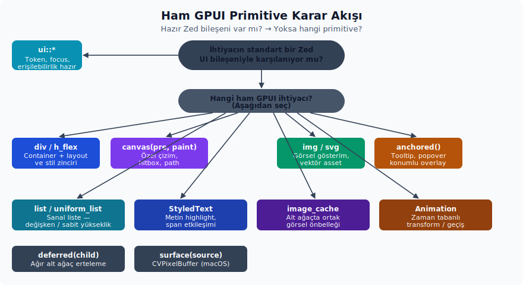

# 2. Ham GPUI Primitive'leri ve Metod Kapsamı

Bu bölüm, Zed `ui` bileşen katmanının altında kalan `gpui::elements` primitive'lerini anlatır. Günlük Zed ekran kodunda önce hazır `ui` bileşenlerine bakarsın. Ham GPUI primitive'lerine ise ancak daha özel bir ihtiyaç çıktığında inersin: kendine özgü bir layout, özel çizim, metin ölçümü, görsel cache, sanal liste veya hazır bileşenlerin sunmadığı bir etkileşim gibi. Kısaca, üst katman çoğu işi karşılar; alt katmana inmek ise genellikle bilinçli bir ihtiyaç sonucudur.

Kaynakta bakacağın ana yerler:

- `gpui` crate'i: primitive export kapısı; tüm element ailelerinin toplandığı giriş noktasıdır.
- `gpui` crate'i: `ParentElement`, `IntoElement`, `Element` trait'lerinin tanımlandığı temel dosya.
- `gpui` crate'i: `Styled` ortak stil yüzeyinin yaşadığı yer; bütün element ailesinin ortak stil dilini sağlar.
- `gpui` crate'i: `Hsla` renk modeli, renk dönüşümleri ve test odaklı proptest yüzeyinin bulunduğu yer.
- `gpui` crate'i: `Div`, `Interactivity`, `InteractiveElement`, `StatefulInteractiveElement` ve `ScrollHandle` gibi etkileşim çekirdeğini barındırır.
- `gpui` crate'inin elements modülünde her özel primitive kendi dosyasındadır: her bir özel primitive'in kendi dosyası; özel API'lerin tanım yerleridir.

## Public GPUI element adları

Aşağıdaki liste `gpui` crate'i altındaki public type, trait, constructor ve constant adlarını tek yerde toplar. Bu bölümü, hangi isimlerin "kullanılabilir resmi yüzey" olduğunu hızlıca görmek için referans olarak kullanırsın:

```text
Anchored, AnchoredFitMode, AnchoredPositionMode, AnchoredState,
Animation, AnimationElement, AnimationExt, AnyImageCache, Canvas, Deferred,
DeferredScrollToItem, Div, DivFrameState, DivInspectorState, DragMoveEvent,
ElementClickedState, ElementHoverState, FollowMode, GroupStyle,
ImageAssetLoader, ImageCache, ImageCacheElement, ImageCacheError,
ImageCacheItem, ImageCacheProvider, ImageLoadingTask, ImageSource,
ImageStyle, Img, ImgLayoutState, ImgResourceLoader, InteractiveElement,
InteractiveElementState, InteractiveText, InteractiveTextState,
Interactivity, ItemSize, LOADING_DELAY, List, ListAlignment,
ListHorizontalSizingBehavior, ListMeasuringBehavior, ListOffset,
ListPrepaintState, ListScrollEvent, ListSizingBehavior, ListState,
RetainAllImageCache, RetainAllImageCacheProvider, ScrollAnchor,
ScrollHandle, ScrollStrategy, Stateful, StatefulInteractiveElement,
StyledImage, StyledText, Surface, SurfaceSource, Svg, TextLayout,
Transformation, UniformList, UniformListDecoration, UniformListFrameState,
UniformListScrollHandle, UniformListScrollState, anchored, canvas, deferred,
div, image_cache, img, list, retain_all, surface, svg, uniform_list
```

## Karar tablosu

Hangi ihtiyaç için hangi API'yi seçeceğini ve ne zaman ham GPUI'ye inmen gerektiğini aşağıdaki tablo pratik biçimde özetler:



| İhtiyaç | Öncelikli API | Ham GPUI'ye inme sebebi |
| :-- | :-- | :-- |
| Standart satır, toolbar, ayar, menü, modal, tab, bildirim | `ui::*` bileşenleri | Tasarım token'ları, focus ve erişilebilirlik hazır gelir |
| Sadece container/layout | `div()`, `h_flex()`, `v_flex()` | Bileşen gerekmeyen bir layout yüzeyi |
| Özel paint veya ölçüm | `canvas(prepaint, paint)` | Hitbox, path, custom çizim veya renderer state gerekir |
| Görsel gösterimi | `img(source)` | Asset, URI, bytes veya cache davranışı gerekir |
| Ortak görsel cache | `image_cache(provider)` / `retain_all(id)` | Alt ağaçtaki `img` elemanlarının aynı cache'i kullanması gerekir |
| SVG asset | `svg().path(...)` / `.external_path(...)` | Vektör asset ve transform gerekir |
| Floating/anchored yüzey | `anchored()` | Tooltip, popover veya konumlanan overlay özel yazılır |
| Ertelenmiş ağır alt ağaç | `deferred(child)` | Render önceliği yönetilir |
| macOS surface | `surface(source)` | `CVPixelBuffer` tabanlı native yüzey çizilir |
| Değişken yükseklikli sanal liste | `list(state, render_item)` | Satır yüksekliği ölçülür ve state ile scroll yönetilir |
| Sabit yükseklikli sanal liste | `uniform_list(id, count, render_item)` | Çok büyük listede hızlı virtualization gerekir |
| Metin layout ölçümü veya span etkileşimi | `StyledText`, `InteractiveText` | Seçili aralık, highlight, hit-test veya inline tooltip gerekir |
| Animasyon | `Animation::new(...)`, `.with_animation(...)` | Element wrapper ile zaman tabanlı transform gerekir |

## Ortak trait yüzeyleri

`ParentElement`, çocuk alabilen bütün container'ların ortak ekleme kapısıdır. Bir elemanın "alt eleman taşıyabilir" sözleşmesini bu trait sağlar:

| Trait | Metodlar | Not |
| :-- | :-- | :-- |
| `ParentElement` | `.extend(elements)`, `.child(child)`, `.children(children)` | `child` ve `children`, `IntoElement` kabul eder; `extend` ise `AnyElement` koleksiyonu ister |

`Styled`, `style(&mut self) -> &mut StyleRefinement` zorunlu metodunu ve makroyla üretilen ortak yardımcı metodları taşır. `Div`, `Img`, `Svg`, `Canvas`, `Surface`, `ImageCacheElement`, `List`, `UniformList`, `Deferred`, `AnimationElement` ve birçok Zed `ui` bileşeni bu yüzeyi miras alır. Bu yüzden bu elementlerin büyük kısmı aynı stil sözlüğünü konuşur.

`Styled` manuel metodları aşağıdaki gibidir:

```text
block, flex, grid, hidden, scrollbar_width,
whitespace_normal, whitespace_nowrap, text_ellipsis, text_ellipsis_start,
text_overflow, text_align, text_left, text_center, text_right, truncate,
line_clamp, flex_col, flex_col_reverse, flex_row, flex_row_reverse,
flex_1, flex_auto, flex_initial, flex_none, flex_basis, flex_grow,
flex_grow_0, flex_grow_1, flex_shrink, flex_shrink_0, flex_shrink_1,
flex_wrap, flex_wrap_reverse, flex_nowrap, items_start, items_end,
items_center, items_baseline,
items_stretch, self_start, self_end, self_flex_start, self_flex_end,
self_center, self_baseline, self_stretch, justify_start, justify_end,
justify_center, justify_between, justify_around, justify_evenly,
content_normal, content_center, content_start, content_end,
content_between, content_around, content_evenly, content_stretch,
aspect_ratio, aspect_square, bg, border_dashed, text_style, text_color,
font_weight, text_bg, text_size, text_xs, text_sm, text_base, text_lg,
text_xl, text_2xl, text_3xl, italic, not_italic, underline, line_through,
text_decoration_none, text_decoration_color, text_decoration_solid,
text_decoration_wavy, text_decoration_0, text_decoration_1,
text_decoration_2, text_decoration_4, text_decoration_8, font_family,
font_features, font, line_height, opacity, grid_cols,
grid_cols_min_content, grid_cols_max_content, grid_rows, col_start,
col_start_auto, col_end, col_end_auto, col_span, col_span_full,
row_start, row_start_auto, row_end, row_end_auto, row_span,
row_span_full, debug, debug_below
```

Flex yardımcılarında kısa adlar ile faktör alan adlar ayrıdır. `flex_grow(grow: f32)` ve `flex_shrink(shrink: f32)` doğrudan özel büyüme/küçülme faktörü yazar. Klasik `1` faktörü için `flex_grow_1()` ve `flex_shrink_1()`, kapatmak için `flex_grow_0()` ve `flex_shrink_0()` kullanılır. `flex_none()` ise büyüme ve küçülmeyi kapatırken `flex_basis` değerini `Length::Auto` yapar; sabit genişlikli kontrol ve ikon hücrelerinde güvenli tercih budur.

`Styled` üzerinde makro yardımıyla üretilen metodlar belirli kurallarla oluşturulur ve aşağıdaki ailelere ayrılır:

| Makro ailesi | Üretilen metodlar |
| :-- | :-- |
| Visibility | `visible`, `invisible` |
| Size/gap prefix'leri | `w`, `h`, `size`, `min_size`, `min_w`, `min_h`, `max_size`, `max_w`, `max_h`, `gap`, `gap_x`, `gap_y` |
| Margin prefix'leri | `m`, `mt`, `mb`, `my`, `mx`, `ml`, `mr` |
| Padding prefix'leri | `p`, `pt`, `pb`, `px`, `py`, `pl`, `pr` |
| Position prefix'leri | `relative`, `absolute`, `inset`, `top`, `bottom`, `left`, `right` |
| Radius prefix'leri | `rounded`, `rounded_t`, `rounded_b`, `rounded_r`, `rounded_l`, `rounded_tl`, `rounded_tr`, `rounded_bl`, `rounded_br` |
| Border prefix'leri | `border_color`, `border`, `border_t`, `border_b`, `border_r`, `border_l`, `border_x`, `border_y` |
| Overflow | `overflow_hidden`, `overflow_x_hidden`, `overflow_y_hidden` |
| Cursor | `cursor`, `cursor_default`, `cursor_pointer`, `cursor_text`, `cursor_move`, `cursor_not_allowed`, `cursor_context_menu`, `cursor_crosshair`, `cursor_vertical_text`, `cursor_alias`, `cursor_copy`, `cursor_no_drop`, `cursor_grab`, `cursor_grabbing`, `cursor_ew_resize`, `cursor_ns_resize`, `cursor_nesw_resize`, `cursor_nwse_resize`, `cursor_col_resize`, `cursor_row_resize`, `cursor_n_resize`, `cursor_e_resize`, `cursor_s_resize`, `cursor_w_resize` |
| Shadow | `shadow`, `shadow_none`, `shadow_2xs`, `shadow_xs`, `shadow_sm`, `shadow_md`, `shadow_lg`, `shadow_xl`, `shadow_2xl` |

Size, margin, padding ve position prefix'leri için aynı üretim kuralı geçerlidir: `{prefix}(length)` özel bir değer vermek için kullanırsın. Buna ek olarak uygun prefix'lerde `{prefix}_{suffix}` metodları üretilir; `auto` dışındaki suffix'lerde `{prefix}_neg_{suffix}` biçimindeki negatif varyantlar da otomatik oluşur. Suffix seti şu değerlerden oluşur: `0`, `0p5`, `1`, `1p5`, `2`, `2p5`, `3`, `3p5`, `4`, `5`, `6`, `7`, `8`, `9`, `10`, `11`, `12`, `16`, `20`, `24`, `32`, `40`, `48`, `56`, `64`, `72`, `80`, `96`, `112`, `128`, `auto`, `px`, `full`, `1_2`, `1_3`, `2_3`, `1_4`, `2_4`, `3_4`, `1_5`, `2_5`, `3_5`, `4_5`, `1_6`, `5_6`, `1_12`. `gap*` ve `padding*` prefix'leri `auto` üretmez. Radius suffix seti: `none`, `xs`, `sm`, `md`, `lg`, `xl`, `2xl`, `3xl`, `full`. Border suffix seti: `0`, `1`, `2`, `3`, `4`, `5`, `6`, `7`, `8`, `9`, `10`, `11`, `12`, `16`, `20`, `24`, `32`.

`InteractiveElement`, ham etkileşimli container davranışını taşır. `id(...)` çağrısı `Stateful<Self>` döndürür. Scroll, click, drag, active ve tooltip gibi durum gerektiren metodlar bundan sonra görünür hale gelir. Yani sıra genellikle önce kimlik vermen, sonra durumlu etkileşimi bağlamandır:

```text
group, id, track_focus, tab_stop, tab_index, tab_group, key_context,
hover, group_hover, debug_selector,
on_mouse_down, capture_any_mouse_down, on_any_mouse_down, on_mouse_up,
capture_any_mouse_up, on_any_mouse_up, on_mouse_pressure,
capture_mouse_pressure, on_mouse_down_out, on_mouse_up_out, on_mouse_move,
on_drag_move, on_scroll_wheel, on_pinch, capture_pinch, capture_action,
on_action, on_boxed_action, on_key_down, capture_key_down, on_key_up,
capture_key_up, on_modifiers_changed, drag_over, group_drag_over, on_drop,
can_drop, occlude, window_control_area, block_mouse_except_scroll, focus,
in_focus, focus_visible
```

`StatefulInteractiveElement` metodları:

```text
focusable, overflow_scroll, overflow_x_scroll, overflow_y_scroll,
track_scroll, anchor_scroll, active, group_active, on_click, on_aux_click,
on_drag, on_hover, tooltip, hoverable_tooltip
```

`Interactivity` lower-level metodları, yukarıdaki fluent API'nin iç karşılıklarıdır: `on_mouse_down`, `capture_any_mouse_down`, `on_any_mouse_down`, `on_mouse_up`, `capture_any_mouse_up`, `on_any_mouse_up`, `on_mouse_pressure`, `capture_mouse_pressure`, `on_mouse_down_out`, `on_mouse_up_out`, `on_mouse_move`, `on_drag_move`, `on_scroll_wheel`, `on_pinch`, `capture_pinch`, `capture_action`, `on_action`, `on_boxed_action`, `on_key_down`, `capture_key_down`, `on_key_up`, `capture_key_up`, `on_modifiers_changed`, `on_drop`, `can_drop`, `on_click`, `on_aux_click`, `on_drag`, `on_hover`, `tooltip`, `hoverable_tooltip`, `occlude_mouse`, `window_control_area`, `block_mouse_except_scroll`. Uygulama kodunda mümkün olduğu sürece fluent `InteractiveElement` ve `StatefulInteractiveElement` metodlarını tercih edersin; `Interactivity`'yi doğrudan yalnız özel bir element yazarken kullanırsın.

Framework implementer metodları `source_location`, `request_layout`, `prepaint`, `paint` ve `Div::compute_style` olarak görünür. Bunlar builder API değildir; günlük UI yazımında kullanmazsın. Yalnızca `Element` implementasyonu yazarken veya GPUI içinde değişiklik yaparken devreye girerler. `GroupHitboxes::get/push/pop`, grup hover/active hitbox state'inin iç global stack yönetimini yapar; üst seviye kodun bunu doğrudan kullanması beklenmez. `DraggedItem<T>::drag(cx)` ve `.dragged_item()` ise sürükleme payload'unu okumak için kullandığın event yardımcılarıdır.

Animasyon easing yardımcıları `linear(delta)`, `quadratic(delta)`, `ease_in_out(delta)`, `ease_out_quint()` ve `bounce(easing)` adlarıyla export edilir. Test modülünde yer alan `select_next` veya `select_previous` gibi örnek view metodları ise component API değildir; sadece test amaçlı örneklerdir.

## İç state ve küçük helper yüzeyi

Bu bölümdeki bazı public adlar framework'ün alt seviye state taşıyıcıları veya kısa helper fonksiyonlarıdır. Bunlar için ayrı anlatım başlığı açmak çoğu zaman okuyucuyu ana akıştan koparır; hangi durumda göründüklerini ve alt alan/variant yüzeylerini tablo halinde bilmek yeterlidir:

| API | Alt özellikler | Kısa anlamı |
| :-- | :-- | :-- |
| `DivFrameState` | `child_layout_ids` | `Div` prepaint aşamasında child layout id'lerini tutan iç frame state'idir. |
| `DragMoveEvent<T>` | `event`, `bounds`, `drag(cx)`, `dragged_item()` | Drag move callback'inde mouse event'ini, hitbox sınırını ve aktif drag payload'unu okutur. |
| `ElementClickedState` | `group`, `element` | Elementin kendisinin veya bağlı olduğu grubun tıklanmış olup olmadığını taşır. |
| `ElementHoverState` | `group`, `element` | Elementin kendisinin veya bağlı olduğu grubun hover durumunu taşır. |
| `GroupStyle` | `group`, `style` | Group hover/active gibi grup tabanlı stil refinement bilgisini tutar. |
| `InteractiveElementState` | `focus_handle`, `clicked_state`, `hover_state`, `hover_listener_state`, `pending_mouse_down`, `scroll_offset`, `active_tooltip` | Etkileşimli elementin frame boyunca kullandığı focus, click, hover, scroll ve tooltip state'idir. |
| `ImageLoadingTask` | `Shared<Task<Result<Arc<RenderImage>, ImageCacheError>>>` | `img` yükleme işinin paylaşılan task tipidir; uygulama kodunda genellikle doğrudan tutulmaz. |
| `ImageStyle` | `grayscale`, `object_fit`, `loading`, `fallback` | `Img` için gri ton, object-fit, loading ve fallback render davranışını taşır. |
| `ImgLayoutState` | iç layout state | `Img` elementinin layout/prepaint ara state'idir; public API olarak elle kurulmaz. |
| `LOADING_DELAY` | `Duration::from_millis(200)` | Görsel loading UI'sı gösterilmeden önceki gecikme sabitidir. |
| `ListPrepaintState` | `hitbox`, `layout` | Değişken yükseklikli `List` prepaint sonucunu taşır. |
| `ListSizingBehavior` | `Infer`, `Auto` | Listenin boyutunu item'lardan mı çıkaracağını yoksa otomatik layout'a mı bırakacağını seçer. |
| `Shadow` | `order`, `blur_radius`, `bounds`, `corner_radii`, `content_mask`, `color`, `element_bounds`, `element_corner_radii`, `inset`, `pad` | Renderer primitive'ine dönüşen düşük seviye gölge verisidir; fluent API'de `BoxShadow` ve `shadow_*` helper'larıyla beslenir. |
| `Stateful<E>` | `element` | `id(...)` sonrası oluşan wrapper'dır; `Styled`, `InteractiveElement` ve `StatefulInteractiveElement` davranışlarını alttaki elemente geçirir. |
| `linear` | `delta` | Easing değerini değiştirmeden döndürür. |
| `quadratic` | `delta * delta` | Basit quadratic easing uygular. |
| `ease_in_out` | iki parçalı quadratic eğri | Başta ve sonda yavaş, ortada hızlı easing üretir. |
| `ease_out_quint` | `1.0 - (1.0 - delta).powi(5)` | Hızlı başlayıp yavaşlayan quint easing closure'ı döndürür. |
| `bounce` | `easing` | Verilen easing'i önce ileri, sonra ters yönde uygulayan bounce closure'ı döndürür. |
| `elements` | re-export modülü | `gpui::elements` primitive export kapısıdır; doğrudan domain API değildir. |
| `styled` | re-export modülü | `Styled` trait ve stil altyapısının modül export'udur. |
| `view` | re-export modülü | `View`/entity tabanlı GPUI yüzeyinin modül export'udur; bu dosyada yalnız bağlantı bağlamında geçer. |

## Primitive API kataloğu

Aşağıdaki tablo her primitive'in nasıl üretildiğini, hangi özel metodlara sahip olduğunu ve hangi disiplinle kullanılması beklendiğini bir arada sunar:

| API | Constructor | Özel metodlar / ilişkili tipler | Kullanım disiplini |
| :-- | :-- | :-- | :-- |
| `Div` | `div()` | `Styled`, `ParentElement`, `InteractiveElement`, `StatefulInteractiveElement`; ayrıca `.on_children_prepainted(...)`, `.image_cache(...)`, `.with_dynamic_prepaint_order(...)` | Her özel layout'un tabanı olabilir; standart kontrol yerine kullanacaksan focus, hover, tooltip ve action bağlarını açıkça kurulur |
| `ScrollHandle` | `ScrollHandle::new()` | `.offset()`, `.max_offset()`, `.top_item()`, `.bottom_item()`, `.bounds()`, `.bounds_for_item(ix)`, `.scroll_to_item(ix)`, `.scroll_to_top_of_item(ix)`, `.scroll_to_bottom()`, `.set_offset(point)`, `.logical_scroll_top()`, `.logical_scroll_bottom()`, `.children_count()` | `overflow_*_scroll` ve `.track_scroll(&handle)` ile bağlarsın |
| `ScrollAnchor` | `ScrollAnchor::for_handle(handle)` | `.scroll_to(window, cx)` | Nested child'ın parent scroll alanına anchor edilmesi gerektiğinde tercih edersin |
| `canvas` / `Canvas<T>` | `canvas(prepaint, paint)` | `Styled`; prepaint closure state döndürür, paint closure bu state ile çizim yapar | Sadece custom render gerektiğinde devreye girer; layout `Styled` boyutlarıyla sabitlenir |
| `img` / `Img` | `img(source)` | `Img::extensions()`, `.image_cache(entity)`; `StyledImage`: `.grayscale(bool)`, `.object_fit(ObjectFit)`, `.with_fallback(fn)`, `.with_loading(fn)` | Loading ve fallback UI'sı belirlenmemiş uzak/asset görsel bırakmaman gerekir |
| `ImageSource` | `ImageSource::{Resource, Custom, Render, Image}` | `.remove_asset(cx)` | Asset lifecycle açıkça temizlenecekse kullanılır |
| `image_cache` / `ImageCacheElement` | `image_cache(provider)` | `ParentElement`, `Styled`; alt ağaçtaki `img` yüklerini provider cache'ine bağlar | Aynı ekran içinde tekrar tekrar görünen görsellerde tercih edersin |
| `AnyImageCache` | `Entity<I: ImageCache>` üzerinden `From` | `.load(resource, window, cx)` | Cache sağlayıcılarının type erasure katmanı |
| `ImageCache` | trait | `.load(resource, window, cx)` | Uygulamaya özel cache stratejisi gerekiyorsa bu trait'i implement edersin |
| `ImageCacheProvider` | trait | `.provide(window, cx)` | Render veya request-layout aşamasında cache sağlar |
| `RetainAllImageCache` | `RetainAllImageCache::new(cx)` | `.load(source, window, cx)`, `.clear(window, cx)`, `.remove(source, window, cx)`, `.len()`, `.is_empty()` | Basit "her şeyi tut" stratejisidir; uzun ömürlü ekranlarda clear/remove sorumluluğunu unutmaman gerekir |
| `retain_all` | `retain_all(id)` | `RetainAllImageCacheProvider` üretir | Inline cache provider gerektiğinde kullanılır |
| `svg` / `Svg` | `svg()` | `.path(path)`, `.external_path(path)`, `.with_transformation(transformation)` | Icon ihtiyaçları için `Icon`'u tercih edersin; ham SVG yalnızca asset transform gerektiğinde anlamlıdır |
| `Transformation` | `Transformation::scale(size)`, `::translate(point)`, `::rotate(radians)` | `.with_scaling(size)`, `.with_translation(point)`, `.with_rotation(radians)` | Birden fazla transform gerektiğinde builder zinciriyle tek `Transformation` oluşturulur |
| `anchored` / `Anchored` | `anchored()` | `.anchor(anchor)`, `.position(point)`, `.offset(point)`, `.position_mode(mode)`, `.snap_to_window()`, `.snap_to_window_with_margin(edges)`; `AnchoredFitMode`, `AnchoredPositionMode`, `AnchoredState` | Popover veya menu gibi hazır yüzeyler yeterliyse önce onları tercih edersin; özel overlay'de pencere sınırı snap'ini açıkça seçilir |
| `deferred` / `Deferred` | `deferred(child)` | `.with_priority(priority)`; `DeferredScrollToItem::priority(priority)` | Ağır alt ağaçların render sırasını ayarlar; etkileşim açısından kritik kontrolleri geciktirmezsin |
| `surface` / `Surface` | `surface(source)` | `.object_fit(ObjectFit)`; `SurfaceSource` macOS `CVPixelBuffer` taşır | macOS native surface dışında kullanmaman gerekir; platform cfg sınırı korunur |
| `list` / `List` | `list(state, render_item)` | `.with_sizing_behavior(ListSizingBehavior)`; `ListAlignment`, `ListHorizontalSizingBehavior`, `ListMeasuringBehavior`, `ListOffset`, `ListScrollEvent`, `FollowMode` | Satır yüksekliği değişken olduğunda kullanılır; state'i view alanında saklanır |
| `ListState` | `ListState::new(item_count, alignment, overdraw)` | `.measure_all()`, `.reset(count)`, `.remeasure()`, `.remeasure_items(range)`, `.item_count()`, `.is_scrolled_to_end()`, `.splice(range, count)`, `.splice_focusable(...)`, `.set_scroll_handler(...)`, `.logical_scroll_top()`, `.scroll_by(distance)`, `.scroll_to_end()`, `.set_follow_mode(mode)`, `.is_following_tail()`, `.scroll_to(offset)`, `.scroll_to_reveal_item(ix)`, `.bounds_for_item(ix)`, `.item_is_above_viewport(ix)`, `.item_is_below_viewport(ix)`, `.scrollbar_drag_started()`, `.scrollbar_drag_ended()`, `.is_scrollbar_dragging()`, `.set_offset_from_scrollbar(point)`, `.max_offset_for_scrollbar()`, `.scroll_px_offset_for_scrollbar()`, `.viewport_bounds()` | Veri değiştiğinde `splice` veya `reset`, ölçüm değiştiğinde `remeasure*` çağrılır |
| `uniform_list` / `UniformList` | `uniform_list(id, item_count, render_item)` | `.with_width_from_item(index)`, `.with_sizing_behavior(...)`, `.with_horizontal_sizing_behavior(...)`, `.with_decoration(decoration)`, `.track_scroll(handle)`, `.y_flipped(bool)`; `UniformListDecoration`, `UniformListFrameState`, `UniformListScrollState` | Sabit satır geometrisi ve çok büyük veri için tercih edersin |
| `UniformListScrollHandle` | `UniformListScrollHandle::new()` | `.scroll_to_item(ix, strategy)`, `.scroll_to_item_strict(ix, strategy)`, `.scroll_to_item_with_offset(ix, strategy, offset)`, `.scroll_to_item_strict_with_offset(ix, strategy, offset)`, `.y_flipped()`, `.logical_scroll_top_index()`, `.is_scrollable()`, `.is_scrolled_to_end()`, `.scroll_to_bottom()`; `ScrollStrategy` | Dışarıdan scroll komutu verme ve scroll durumunu okuma için handle'ı saklanır |
| `StyledText` | `StyledText::new(text)` | `.layout()`, `.with_default_highlights(...)`, `.with_highlights(...)`, `.with_font_family_overrides(...)`, `.with_runs(runs)` | Highlight ve zengin metin gerektiğinde tercih edersin; normal etiket için `Label` daha doğru bir yüzeydir |
| `TextLayout` | `StyledText::layout()` | `.index_for_position(point)`, `.position_for_index(index)`, `.line_layout_for_index(index)`, `.bounds()`, `.line_height()`, `.len()`, `.text()`, `.wrapped_text()` | Hit-test ve ölçüm bilgisi prepaint veya layout sonrası anlam kazanır |
| `InteractiveText` | `InteractiveText::new(id, styled_text)` | `.on_click(range, listener)`, `.on_hover(range, listener)`, `.tooltip(range, builder)`; `InteractiveTextState` | Inline link, mention veya span tooltip için kullanılır |
| `Animation` | `Animation::new(duration)` | `.repeat()`, `.with_easing(easing)` | Animasyon token'larını tek yerde üretirsin; sonsuz animasyonu ise bilinçli olarak seçilir |
| `AnimationExt` / `AnimationElement` | `.with_animation(id, animation, animator)`, `.with_animations(id, animations, animator)` | `AnimationElement::map_element(f)` | Elementi saran bir wrapper'dır; sabit bir `ElementId` vermen zorunludur |

`ListState` scrollbar sürükleme sözleşmesi özellikle değişken yükseklikli listelerde önemlidir. `scrollbar_drag_started()` ile `scrollbar_drag_ended()` arasında `is_scrollbar_dragging()` true döner. `set_offset_from_scrollbar(point)` pozitif "baştan mesafe" almaz; `scroll_px_offset_for_scrollbar()` ile aynı koordinat modelini kullanır. İçerik aşağı kaydıkça `point.y` negatif olur. Bu yüzden scrollbar'ı 150px aşağı taşımak için `point(px(0.), px(-150.))` verirsin. İçerik sürükleme sırasında büyürse sürükleme başlangıcındaki içerik yüksekliği baz alınır; kullanıcı frozen track'in sonuna sürüklediğinde `FollowMode::Tail` yeniden takip eder.

`Hsla` için `proptest` feature'ı açıkken iki test yardımcısı görünür: `Hsla::opaque_strategy()` alpha değeri `1.0` olan renkler üretir, `Arbitrary for Hsla` ise alpha dahil tüm bileşenleri `0.0..=1.0` aralığında üretir. Bu yüzeyi üretim UI kodundan çok renk algoritmaları ve tema kontrastı property testleri için kullanırsın.

## GPUI public enum ve state ayrıntıları

Bazı GPUI tiplerinde asıl kullanım bilgisini taşıyan şey, türün adından çok sahip olduğu variant'lar ve public state alanlarıdır:

| Tip | Variant / Alan | Kullanım notu |
| :-- | :-- | :-- |
| `ScrollStrategy` | `Top`, `Center`, `Bottom`, `Nearest` | `UniformListScrollHandle` scroll komutlarında hedef item'ın viewport içinde nereye oturacağını belirler |
| `FollowMode` | `Normal`, `Tail` | Chat veya log listelerinde tail-follow davranışı; `Tail` sadece kullanıcı zaten sondaysa otomatik takip eder |
| `ListMeasuringBehavior` | `Measure(bool)`, `Visible` | Büyük ve değişken yükseklikli listelerde ilk ölçüm maliyetini kontrol eder |
| `ListHorizontalSizingBehavior` | `FitList`, `Unconstrained` | Satır genişliği listeye mi sığacak, en geniş item'a göre taşabilecek mi sorusunu yanıtlar |
| `AnchoredFitMode` | `SnapToWindow`, `SnapToWindowWithMargin`, `SwitchAnchor` | `anchored()` overlay'lerinde pencere sınırına nasıl sığdırılacağını belirler |
| `AnchoredPositionMode` | `Window`, `Local` | Anchor koordinatının pencereye mi parent'a mı göre yorumlanacağını belirler |
| `ImageCacheError` | `Io`, `Usvg`, `Other` | Görsel yükleme veya render hatalarını sınıflandırır; fallback render için ayırt edici bilgi taşır |
| `ImageCacheItem` | `Loading`, `Loaded` | Cache'in iç state'idir; tüketici çoğu zaman doğrudan bunu değil, `ImageCache::load` sonucunu kullanır |

Public state alanları:

| Tip | Alanlar | Not |
| :-- | :-- | :-- |
| `Animation` | `duration`, `oneshot`, `easing` | `.repeat()` çağrısı `oneshot` değerini `false` yapar; doğrudan field mutation yerine builder zincirini tercih edersin |
| `DeferredScrollToItem` | `item_index`, `strategy`, `offset`, `scroll_strict` | `UniformListScrollHandle` komutlarının pending state'i |
| `UniformListScrollState` | `base_handle`, `deferred_scroll_to_item`, `last_item_size`, `y_flipped` | Scroll handle arkasındaki state; okuma için handle metodları daha doğru bir yüzeydir |
| `ItemSize` | `item`, `contents` | `is_scrollable()` hesabında item viewport'u ile içerik boyutunun ayrımıdır |
| `ListOffset` | `item_ix`, `offset_in_item` | Değişken yükseklikli listede logical scroll pozisyonunu temsil eder |
| `ListScrollEvent` | `visible_range`, `count`, `is_scrolled`, `is_following_tail` | `ListState::set_scroll_handler(...)` callback'i içinde scroll değişimini okuduğun yüzeydir |
| `DivInspectorState` | `base_style`, `bounds`, `content_size` | Inspector veya debug build state'idir; uygulama component API'si değildir |
| `Interactivity` | `element_id`, `active`, `hovered`, `base_style` | `Div` interactivity çekirdeğidir; üretim kodunda fluent builder metodlarını tercih edersin |

## Kullanım örüntüleri

Ham `div()` ile özel bir kontrol yazarken aşağıdaki iskeleti minimum bir örnek olarak düşünebilirsin. Standart bir `ui::Button` yerine elle kontrol yazdığında focus, hover, tooltip ve action bağlarını açıkça kurman gerekir:

```rust
div()
    .id("custom-control")
    .track_focus(&self.focus_handle)
    .tab_index(tab_index)
    .key_context("CustomControl")
    .hover(|style| style.bg(cx.theme().colors().element_hover))
    .focus_visible(|style| style.border_color(cx.theme().colors().border_focused))
    .on_click(cx.listener(|this, _event, window, cx| {
        this.activate(window, cx);
    }))
    .tooltip(|window, cx| Tooltip::text("Açıklama", window, cx))
    .child(Label::new("Etiket"))
```

Değişken yükseklikli liste örüntüsü şu şekildedir. Burada `list(...)` bir state nesnesi ve bir render closure'u alır; closure'un içinde verilen aralığı satır satır render edersin:

```rust
list(self.list_state.clone(), move |range, window, cx| {
    range
        .map(|ix| self.render_row(ix, window, cx).into_any_element())
        .collect()
})
.with_sizing_behavior(ListSizingBehavior::Infer)
```

Sabit yükseklikli büyük liste örüntüsünde ise `uniform_list` öne çıkar. Buradaki kritik fark, her satırın aynı yüksekliğe sahip olduğunun varsayılmasıdır; bu varsayım sayesinde çok büyük veri kümeleri için hızlı bir virtualization elde edersin:

```rust
uniform_list("items", self.items.len(), move |range, window, cx| {
    range
        .map(|ix| self.render_uniform_row(ix, window, cx).into_any_element())
        .collect()
})
.track_scroll(&self.uniform_scroll_handle)
```

Görsel cache örüntüsü ise alt ağaçtaki tüm `img` çağrılarını ortak bir cache'e bağlamak için kullanırsın. `image_cache(retain_all(...))` katmanı, aynı görselin tekrar tekrar yüklenmesini önler ve loading/fallback davranışını da merkezi bir yerden tanımlayabilirsin:

```rust
image_cache(retain_all("image-cache"))
    .child(img(ImageSource::Resource(resource))
        .object_fit(ObjectFit::Cover)
        .with_loading(|_, _| div().size_full().into_any_element())
        .with_fallback(|_, _| Icon::new(IconName::Image).into_any_element()))
```
