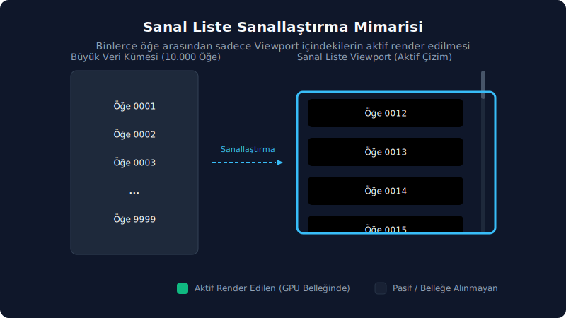

# 2. Ham GPUI Primitive'leri ve Metod Kapsamı

## Sürüm Analiz Raporu

- [x] Güncel kaynak commit aralığı: `e7311d52ba1b..693962917b5a`.
- [x] Güncel doğrulama: `InteractiveElement::on_mouse_exit(...)` ve `Interactivity::on_mouse_exit(...)` işaretçi çıkış olayı yüzeyiyle eşleştirildi.
- [x] Kaynak doğrulama dosyası: `crates/gpui/src/elements/div.rs`.

Bu bölüm, Zed `ui` bileşen katmanının altında kalan `gpui::elements` primitive'lerini anlatır. Günlük Zed ekran kodunda öncelikle hazır `ui` bileşenleri değerlendirilir. Ham GPUI primitive'lerine ise ancak daha özel ihtiyaçlar ortaya çıktığında başvurulması mümkündür: kendine özgü bir düzen (layout), özel çizim, metin ölçümü, görsel önbellek, sanal liste veya hazır bileşenlerin sunmadığı bir etkileşim modeli gibi. Kısacası, üst katman ihtiyaçların çoğunu karşılar; alt katmana inmek ise genellikle bilinçli bir gereksinimin sonucudur.

## Public GPUI element adları

Aşağıdaki liste `gpui` crate'i altındaki genel kullanıma açık (public) tip, trait, yapıcı (constructor) ve sabit (constant) isimlerini tek bir yerde toplar. Bu bölüm, hangi isimlerin kullanılabilir resmi API yüzeyi olduğunu hızlıca görebilmek amacıyla bir referans kılavuzu olarak kullanılabilir:

```text
Anchored, AnchoredFitMode, AnchoredPositionMode, AnchoredState,
Animation, AnimationElement, AnimationExt, AnyImageCache, Canvas, Deferred,
DeferredScrollToItem, Div, DivFrameState, DivInspectorState, DragMoveEvent,
ElementClickedState, ElementHoverState, FollowMode, GroupStyle,
ImageAssetLoader, ImageCache, ImageCacheElement, ImageCacheError,
ImageCacheItem, ImageCacheProvider, ImageLoadingTask, ImageSource,
ImageStyle, Img, ImgLayoutState, ImgResourceLoader, InteractiveElement,
InteractiveElementState, InteractiveText, InteractiveTextState,
Interactivity, ItemSize, LOADING_DELAY, List, ListAlignment,
ListHorizontalSizingBehavior, ListMeasuringBehavior, ListOffset,
ListPrepaintState, ListScrollEvent, ListSizingBehavior, ListState,
RetainAllImageCache, RetainAllImageCacheProvider, ScrollAnchor,
ScrollHandle, ScrollStrategy, Stateful, StatefulInteractiveElement,
StyledImage, StyledText, Surface, SurfaceSource, Svg, Text, TextLayout,
Transformation, UniformList, UniformListDecoration, UniformListFrameState,
UniformListScrollHandle, UniformListScrollState, anchored, canvas, deferred,
div, image_cache, img, list, retain_all, surface, svg, uniform_list
```

## Karar tablosu

Hangi ihtiyaç için hangi API'nin seçileceğini ve ne zaman ham GPUI seviyesine inilmesi gerektiğini aşağıdaki tablo pratik bir biçimde özetlemektedir:


Çok büyük veri kümelerinde, listenin tamamını değil, yalnızca viewport (görünür alan) içinde kalan ve kaydırma (scroll) anında dinamik olarak değişen aralığı render etmek performans açısından kritiktir. Aşağıdaki hareketli şemada değişken yükseklikli `list` ve sabit yükseklikli `uniform_list` sanal liste çalışma mantığı görselleştirilmiştir:



| İhtiyaç | Öncelikli API | Ham GPUI'ye inme sebebi |
| :-- | :-- | :-- |
| Standart satır, toolbar, ayar, menü, modal, tab, bildirim | `ui::*` bileşenleri | Tasarım token'ları, odak ve erişilebilirlik hazır gelir |
| Sadece kapsayıcı/layout | `div()`, `h_flex()`, `v_flex()` | Bileşen gerekmeyen bir layout yüzeyi |
| Özel paint veya ölçüm | `canvas(prepaint, paint)` | Hitbox, path, özel çizim veya renderer durumu gerekir |
| Görsel gösterimi | `img(source)` | Asset, URI, bytes veya önbellek davranışı gerekir |
| Ortak görsel önbellek | `image_cache(provider)` / `retain_all(id)` | Alt ağaçtaki `img` elemanlarının aynı önbelleği kullanması gerekir |
| SVG asset | `svg().path(...)` / `.external_path(...)` | Vektör asset ve transform gerekir |
| Floating/anchored yüzey | `anchored()` | Tooltip, popover veya konumlanan overlay özel yazılır |
| Ertelenmiş ağır alt ağaç | `deferred(child)` | Render önceliği yönetilir |
| macOS surface | `surface(source)` | `CVPixelBuffer` tabanlı native yüzey çizilir |
| Değişken yükseklikli sanal liste | `list(state, render_item)` | Satır yüksekliği ölçülür ve durum ile scroll yönetilir |
| Sabit yükseklikli sanal liste | `uniform_list(id, count, render_item)` | Çok büyük listede hızlı sanallaştırma gerekir |
| Metin layout ölçümü veya span etkileşimi | `StyledText`, `InteractiveText` | Seçili aralık, highlight, hit-test veya inline tooltip gerekir |
| Animasyon | `Animation::new(...)`, `.with_animation(...)` | Element sarmalayıcısı ile zaman tabanlı transform gerekir |

## Ortak trait yüzeyleri

`ParentElement`, çocuk alabilen bütün kapsayıcıların ortak ekleme kapısıdır. Bir elemanın "alt eleman taşıyabilir" sözleşmesini bu trait sağlar:

| Trait | Metotlar | Not |
| :-- | :-- | :-- |
| `ParentElement` | `.extend(elements)`, `.child(child)`, `.children(children)` | `child` ve `children`, `IntoElement` kabul eder; `extend` ise `AnyElement` koleksiyonu ister |

`Styled`, `style(&mut self) -> &mut StyleRefinement` zorunlu metodunu ve makroyla üretilen ortak yardımcı metodları taşır. `Div`, `Img`, `Svg`, `Canvas`, `Surface`, `ImageCacheElement`, `List`, `UniformList` ve birçok Zed `ui` bileşeni bu yüzeyi miras alır. Bu yüzden bu elementlerin büyük kısmı aynı stil sözlüğünü konuşur.

`Styled` manuel metodları aşağıdaki gibidir:

```text
block, flex, grid, hidden, scrollbar_width,
whitespace_normal, whitespace_nowrap, text_ellipsis, text_ellipsis_start,
text_ellipsis_middle, text_overflow, text_align, text_left, text_center,
text_right, truncate, line_clamp, flex_col, flex_col_reverse, flex_row,
flex_row_reverse,
flex_1, flex_auto, flex_initial, flex_none, flex_basis, flex_grow,
flex_grow_0, flex_grow_1, flex_shrink, flex_shrink_0, flex_shrink_1,
flex_wrap, flex_wrap_reverse, flex_nowrap, items_start, items_end,
items_center, items_baseline,
items_stretch, self_start, self_end, self_flex_start, self_flex_end,
self_center, self_baseline, self_stretch, justify_start, justify_end,
justify_center, justify_between, justify_around, justify_evenly,
content_normal, content_center, content_start, content_end,
content_between, content_around, content_evenly, content_stretch,
aspect_ratio, aspect_square, bg, border_dashed, text_style, text_color,
font_weight, text_bg, text_size, text_xs, text_sm, text_base, text_lg,
text_xl, text_2xl, text_3xl, italic, not_italic, underline, line_through,
text_decoration_none, text_decoration_color, text_decoration_solid,
text_decoration_wavy, text_decoration_0, text_decoration_1,
text_decoration_2, text_decoration_4, text_decoration_8, font_family,
font_features, font, line_height, opacity, grid_cols,
grid_cols_min_content, grid_cols_max_content, grid_rows, col_start,
col_start_auto, col_end, col_end_auto, col_span, col_span_full,
row_start, row_start_auto, row_end, row_end_auto, row_span,
row_span_full, debug, debug_below
```

Flex yardımcılarında kısa adlar ile faktör alan adları birbirinden ayrıdır. `flex_grow(grow: f32)` and `flex_shrink(shrink: f32)` doğrudan özel büyüme/küçülme katsayılarını tanımlar. Klasik `1` katsayısı için `flex_grow_1()` ve `flex_shrink_1()`, bu özelliği devre dışı bırakmak için ise `flex_grow_0()` ve `flex_shrink_0()` metotları kullanılır. `flex_none()` ise büyüme ve küçülmeyi kapatırken `flex_basis` değerini `Length::Auto` olarak ayarlar; sabit genişliğe sahip kontrol ve ikon hücrelerinde en güvenli tercih budur.

`Styled` üzerinde makro yardımıyla üretilen metodlar belirli kurallarla oluşturulur ve aşağıdaki ailelere ayrılır:

| Makro ailesi | Üretilen metodlar |
| :-- | :-- |
| Visibility | `visible`, `invisible` |
| Size/gap prefix'leri | `w`, `h`, `size`, `min_size`, `min_w`, `min_h`, `max_size`, `max_w`, `max_h`, `gap`, `gap_x`, `gap_y` |
| Margin prefix'leri | `m`, `mt`, `mb`, `my`, `mx`, `ml`, `mr` |
| Padding prefix'leri | `p`, `pt`, `pb`, `px`, `py`, `pl`, `pr` |
| Position prefix'leri | `relative`, `absolute`, `inset`, `top`, `bottom`, `left`, `right` |
| Radius prefix'leri | `rounded`, `rounded_t`, `rounded_b`, `rounded_r`, `rounded_l`, `rounded_tl`, `rounded_tr`, `rounded_bl`, `rounded_br` |
| Border prefix'leri | `border_color`, `border`, `border_t`, `border_b`, `border_r`, `border_l`, `border_x`, `border_y` |
| Overflow | `overflow_hidden`, `overflow_x_hidden`, `overflow_y_hidden` |
| Cursor | `cursor`, `cursor_default`, `cursor_pointer`, `cursor_text`, `cursor_move`, `cursor_not_allowed`, `cursor_context_menu`, `cursor_crosshair`, `cursor_vertical_text`, `cursor_alias`, `cursor_copy`, `cursor_no_drop`, `cursor_grab`, `cursor_grabbing`, `cursor_ew_resize`, `cursor_ns_resize`, `cursor_nesw_resize`, `cursor_nwse_resize`, `cursor_col_resize`, `cursor_row_resize`, `cursor_n_resize`, `cursor_e_resize`, `cursor_s_resize`, `cursor_w_resize` |
| Shadow | `shadow`, `shadow_none`, `shadow_2xs`, `shadow_xs`, `shadow_sm`, `shadow_md`, `shadow_lg`, `shadow_xl`, `shadow_2xl` |

Size, margin, padding ve position prefix'leri için aynı üretim kuralı geçerlidir: `{prefix}(length)` özel bir değer tanımlamak amacıyla kullanılır. Buna ek olarak uygun prefix'lerde `{prefix}_{suffix}` metotları üretilir; `auto` dışındaki suffix'lerde ise `{prefix}_neg_{suffix}` biçimindeki negatif varyantlar otomatik olarak oluşturulur. Suffix seti şu değerlerden oluşur: `0`, `0p5`, `1`, `1p5`, `2`, `2p5`, `3`, `3p5`, `4`, `5`, `6`, `7`, `8`, `9`, `10`, `11`, `12`, `16`, `20`, `24`, `32`, `40`, `48`, `56`, `64`, `72`, `80`, `96`, `112`, `128`, `auto`, `px`, `full`, `1_2`, `1_3`, `2_3`, `1_4`, `2_4`, `3_4`, `1_5`, `2_5`, `3_5`, `4_5`, `1_6`, `5_6`, `1_12`. `gap*` ve `padding*` prefix'leri `auto` üretmez. Radius suffix seti: `none`, `xs`, `sm`, `md`, `lg`, `xl`, `2xl`, `3xl`, `full`. Border suffix seti: `0`, `1`, `2`, `3`, `4`, `5`, `6`, `7`, `8`, `9`, `10`, `11`, `12`, `16`, `20`, `24`, `32`.

`InteractiveElement`, ham etkileşimli kapsayıcı davranışını barındırır. `id(...)` çağrısı `Stateful<Self>` döndürür. Scroll, tıklama (click), sürükleme (drag), aktiflik (active) ve tooltip gibi durum gerektiren metotlar bu çağrının ardından erişilebilir hale gelir. Dolayısıyla genel işleyiş sırası, önce benzersiz bir kimlik tanımlanması ve ardından durum bazlı etkileşimin bağlanması şeklindedir.

Kimlik ve odak ailesinde `group(...)`, `id(...)`, `track_focus(...)`, `tab_stop(...)`, `tab_index(...)`, `tab_group()` and `key_context(...)` yer alır. Bu metotlar elementin olay dağıtım (dispatch) ağacında nasıl konumlanacağını, klavye gezinmesine dahil olup olmayacağını ve hangi tuş eşleme (keybinding) bağlamında çalışacağını belirler. Görsel odak stilleri için `focus(...)`, `in_focus(...)` ve `focus_visible(...)` metotları kullanılır; `focus_visible` özellikle son girdinin klavye üzerinden yapıldığı senaryolarda odak halkasını göstermek amacıyla tercih edilir.

Fare ve işaretçi (pointer) ailesi; `on_mouse_down(...)`, `on_mouse_up(...)`, `on_mouse_move(...)`, `on_mouse_exit(...)`, `on_mouse_down_out(...)`, `on_mouse_up_out(...)`, `on_mouse_pressure(...)` ve bunların capture/any varyantlarından oluşur. Normal varyantlar elemente gelen olayları işlerken; capture varyantları olay dağıtımının (dispatch) erken aşamalarında devreye girer. `on_mouse_exit(...)`, işaretçinin element hitbox'ından ayrıldığı bubble aşamasını `MouseExitEvent` ile bildirir. `*_out` metotları ise menü veya popup pencerelerini kapatma gibi element dışındaki tıklama akışlarını yönetmek için kullanılır. Scroll ve hareket olayları `on_scroll_wheel(...)`, `on_pinch(...)` ve `capture_pinch(...)` yardımıyla bağlanır.

Eylem (action) ve klavye ailesinde; `capture_action(...)`, `on_action(...)`, `on_boxed_action(...)`, `on_key_down(...)`, `capture_key_down(...)`, `on_key_up(...)`, `capture_key_up(...)` ve `on_modifiers_changed(...)` yer alır. Eylem işleyicileri, keymap üzerinden çözümlenen komutları yakalar; key down/up işleyicileri ise doğrudan ham klavye olaylarına yakın seviyede çalışır. Sürükle-bırak (drag-and-drop) mekanizmasında `on_drag_move(...)`, `drag_over(...)`, `group_drag_over(...)`, `on_drop(...)` ve `can_drop(...)` kullanılır; `can_drop` kabul koşulunu, `on_drop` ise bırakma eyleminin sonucunu temsil eder. `occlude()`, `window_control_area(...)` ve `block_mouse_except_scroll(...)` ise alttaki elementlerin fare olaylarını alıp almayacağını veya özel başlık çubuğu hit-test alanını belirleyen kontrol yardımcılarıdır.

`StatefulInteractiveElement` ise `.id(...)` çağrısının ardından sunulan durumlu (stateful) arayüzdür. `focusable()` metodu elementi odaklanabilir hale getirir. `overflow_scroll(...)`, `overflow_x_scroll(...)`, `overflow_y_scroll(...)`, `track_scroll(...)` ve `anchor_scroll(...)` kaydırma (scroll) davranışını ve dışarıdan izlenen `ScrollHandle` bağlantısını kurar. `active(...)` ve `group_active(...)` basılı/aktif durumlara stil uygular. `on_click(...)`, `on_aux_click(...)`, `on_drag(...)`, `on_hover(...)`, `tooltip(...)` ve `hoverable_tooltip(...)` metotları kullanıcı etkileşimini view durumuna, sürükleme verilerine veya bağımsız bir tooltip view yapısına bağlar.

`Interactivity` daha düşük seviyeli dahili bir taşıyıcıdır; yukarıdaki akıcı (fluent) API'nin gerçek dinleyici (listener) ve hitbox kayıtlarını barındırır. Uygulama kodunda mümkün olduğu sürece akıcı `InteractiveElement` ve `StatefulInteractiveElement` metotları tercih edilmelidir; `Interactivity` yapısı doğrudan yalnızca özel bir element geliştirilirken kullanılmalıdır.

Framework geliştiricilerine yönelik metotlar `source_location`, `request_layout`, `prepaint`, `paint` ve `Div::compute_style` olarak karşımıza çıkar. Bunlar builder API özellikleri değildir ve günlük UI geliştirmelerinde kullanılmazlar. Yalnızca özel `Element` implementasyonu yazılırken veya GPUI çekirdeğinde değişiklik yapılırken devreye girerler. `GroupHitboxes::get/push/pop` metotları grup hover/active hitbox durumlarının dahili global stack yönetimini üstlenir; üst seviye uygulama kodunun bunları doğrudan çağırması beklenmez. `DragMoveEvent<T>::drag(cx)` ve `.dragged_item()` ise sürükleme verilerini okumak için kullanılan olay yardımcılarıdır.

Animasyon easing yardımcıları `linear(delta)`, `quadratic(delta)`, `ease_in_out(delta)`, `ease_out_quint()` ve `bounce(easing)` adlarıyla dışa aktarılır. Test modülünde yer alan `select_next` veya `select_previous` gibi örnek view metotları ise bileşen API'si olmayıp, yalnızca test senaryolarına yönelik örneklerdir.

## İç Durum ve Küçük Yardımcı Yüzeyi

Bu bölümdeki bazı public adlar framework'ün alt seviye durum taşıyıcıları veya kısa yardımcı fonksiyonlarıdır. Bunlar için ayrı anlatım başlığı açmak çoğu zaman okuyucuyu ana akıştan koparır; hangi durumda göründüklerini ve alt alan/varyant yüzeylerini tablo halinde bilmek yeterlidir:

| API | Alt özellikler | Kısa anlamı |
| :-- | :-- | :-- |
| `DivFrameState` | `child_layout_ids` | `Div` prepaint aşamasında child layout id'lerini tutan iç frame durumudur. |
| `DragMoveEvent<T>` | `event`, `bounds`, `drag(cx)`, `dragged_item()` | Drag move callback'inde mouse event'ini, hitbox sınırını ve aktif drag verisini okutur. |
| `ElementClickedState` | `group`, `element` | Elementin kendisinin veya bağlı olduğu grubun tıklanmış olup olmadığını taşır. |
| `ElementHoverState` | `group`, `element` | Elementin kendisinin veya bağlı olduğu grubun hover durumunu taşır. |
| `GroupStyle` | `group`, `style` | Group hover/active gibi grup tabanlı stil refinement bilgisini tutar. |
| `InteractiveElementState` | `focus_handle`, `clicked_state`, `hover_state`, `hover_listener_state`, `pending_mouse_down`, `scroll_offset`, `active_tooltip` | Etkileşimli elementin frame boyunca kullandığı odak, click, hover, scroll ve tooltip durumudur. |
| `ImageLoadingTask` | `Shared<Task<Result<Arc<RenderImage>, ImageCacheError>>>` | `img` yükleme işinin paylaşılan task tipidir; uygulama kodunda genellikle doğrudan tutulmaz. |
| `ImageStyle` | `grayscale`, `object_fit`, `loading`, `fallback` | `Img` için gri ton, object-fit, yükleme ve yedek render davranışını taşır. |
| `ImgLayoutState` | iç layout durumu | `Img` elementinin layout/prepaint ara durumudur; public API olarak elle kurulmaz. |
| `LOADING_DELAY` | `Duration::from_millis(200)` | Görsel yükleme UI'sı gösterilmeden önceki gecikme sabitidir. |
| `ListPrepaintState` | `hitbox`, `layout` | Değişken yükseklikli `List` prepaint sonucunu taşır. |
| `ListSizingBehavior` | `Infer`, `Auto` | Listenin boyutunu item'lardan mı çıkaracağını yoksa otomatik layout'a mı bırakacağını seçer. |
| `Shadow` | `order`, `blur_radius`, `bounds`, `corner_radii`, `content_mask`, `color`, `element_bounds`, `element_corner_radii`, `inset`, `pad` | Renderer primitive'ine dönüşen düşük seviye gölge verisidir; fluent API'de `BoxShadow` ve `shadow_*` yardımcılarıyla beslenir. |
| `Stateful<E>` | `element` | `id(...)` sonrası oluşan sarmalayıcıdır; `Styled`, `InteractiveElement` ve `StatefulInteractiveElement` davranışlarını alttaki elemente geçirir. |
| `linear` | `delta` | Easing değerini değiştirmeden döndürür. |
| `quadratic` | `delta * delta` | Basit quadratic easing uygular. |
| `ease_in_out` | iki parçalı quadratic eğri | Başta ve sonda yavaş, ortada hızlı easing üretir. |
| `ease_out_quint` | `1.0 - (1.0 - delta).powi(5)` | Hızlı başlayıp yavaşlayan quint easing closure'ı döndürür. |
| `bounce` | `easing` | Verilen easing'i önce ileri, sonra ters yönde uygulayan bounce closure'ı döndürür. |
| `elements` | re-export modülü | `gpui::elements` primitive export kapısıdır; doğrudan domain API değildir. |
| `styled` | re-export modülü | `Styled` trait ve stil altyapısının modül export'udur. |
| `view` | re-export modülü | `View`/entity tabanlı GPUI yüzeyinin modül export'udur; bu dosyada yalnız bağlantı bağlamında geçer. |

## Primitive API kataloğu

Aşağıdaki tablo her primitive'in nasıl üretildiğini, hangi özel metotlar / ilişkili tipler ile donatıldığını ve hangi disiplinle kullanılması beklendiğini bir arada sunar:

| API | Constructor | Özel metotlar / ilişkili tipler | Kullanım disiplini |
| :-- | :-- | :-- | :-- |
| `Div` | `div()` | `Styled`, `ParentElement`, `InteractiveElement` (`StatefulInteractiveElement` yalnız `.id()` sonrası); ayrıca `.on_children_prepainted(...)`, `.image_cache(...)`, `.image_cache(...)`, `.with_dynamic_prepaint_order(...)` | Her özel layout'un tabanı olabilir; standart kontrol yerine kullanılacaksa odak, hover, tooltip ve eylem (action) bağlantıları açıkça kurulmalıdır |
| `ScrollHandle` | `ScrollHandle::new()` | `.offset()`, `.max_offset()`, `.top_item()`, `.bottom_item()`, `.bounds()`, `.bounds_for_item(ix)`, `.scroll_to_item(ix)`, `.scroll_to_top_of_item(ix)`, `.scroll_to_bottom()`, `.set_offset(point)`, `.logical_scroll_top()`, `.logical_scroll_bottom()`, `.children_count()` | `overflow_*_scroll` ve `.track_scroll(&handle)` ile bağlanır |
| `ScrollAnchor` | `ScrollAnchor::for_handle(handle)` | `.scroll_to(window, cx)` | Nested child'ın parent scroll alanına anchor edilmesi gerektiğinde tercih edilir |
| `canvas` / `Canvas<T>` | `canvas(prepaint, paint)` | `Styled`; prepaint closure durum döndürür, paint closure bu durum ile çizim yapar | Sadece özel render gerektiğinde devreye girer; layout `Styled` boyutlarıyla sabitlenir |
| `img` / `Img` | `img(source)` | `Img::extensions()`, `.image_cache(entity)`; `StyledImage`: `.grayscale(bool)`, `.object_fit(ObjectFit)`, `.with_fallback(|| ...)` | Yükleme ve yedek UI'sı belirlenmemiş uzak/asset görsel bırakılmaması gerekir |
| `ImageSource` | `ImageSource::{Resource, Custom, Render, Image}` | `.remove_asset(cx)` | Asset yaşam döngüsünü açıkça temizlemek gerektiğinde kullanılır |
| `image_cache` / `ImageCacheElement` | `image_cache(provider)` | `ParentElement`, `Styled`; alt ağaçtaki `img` yüklerini provider önbelleğine bağlar | Aynı ekran içinde tekrar tekrar görünen görsellerde tercih edilir |
| `AnyImageCache` | `Entity<I: ImageCache>` üzerinden `From` | `.load(resource, window, cx)` | Cache sağlayıcılarının type erasure katmanı |
| `ImageCache` | trait | `.load(resource, window, cx)` | Uygulamaya özel önbellek stratejisi gerekiyorsa bu trait implement edilir |
| `ImageCacheProvider` | trait | `.provide(window, cx)` | Render veya request-layout aşamasında önbellek sağlar |
| `RetainAllImageCache` | `RetainAllImageCache::new(cx)` | `.load(source, window, cx)`, `.clear(window, cx)`, `.remove(source, window, cx)`, `.len()`, `.is_empty()` | Basit "her şeyi tut" stratejisidir; uzun ömürlü ekranlarda clear/remove sorumluluğunun açıkça yönetilmesi gerekir |
| `retain_all` | `retain_all(id)` | `RetainAllImageCacheProvider` üretir | Satır içi (inline) önbellek sağlayıcısı (provider) gerektiğinde kullanılır |
| `svg` / `Svg` | `svg()` | `.path(path)`, `.external_path(path)`, `.with_transformation(transformation)` | İkon ihtiyaçları için `Icon` tercih edilir; ham SVG yalnızca asset transform işlemleri gerektiğinde anlamlıdır |
| `Transformation` | `Transformation::scale(size)`, `::translate(point)`, `::rotate(radians)` | `.with_scaling(size)`, `.with_translation(point)`, `.with_rotation(radians)` | Birden fazla transform gerektiğinde builder zinciriyle tek bir `Transformation` nesnesi oluşturulur |
| `anchored` / `Anchored` | `anchored()` | `.anchor(anchor)`, `.position(point)`, `.offset(point)`, `.position_mode(mode)`, `.snap_to_window()`, `.snap_to_window_with_margin(edges)`; `AnchoredFitMode`, `AnchoredPositionMode`, `AnchoredState` | Popover veya menü gibi hazır yüzeyler yeterliyse öncelikle onlar tercih edilir; özel overlay tasarımlarında pencere sınırı snap özelliği açıkça belirtilmelidir |
| `deferred` / `Deferred` | `deferred(child)` | `.with_priority(priority)`, `.priority(priority)` | Ağır alt ağaçların render sırasını ayarlar; etkileşim açısından kritik kontroller geciktirilmemelidir |
| `surface` / `Surface` | `surface(source)` | `.object_fit(ObjectFit)`; `SurfaceSource` macOS `CVPixelBuffer` taşır | macOS native surface dışında kullanılmamalıdır; platform cfg sınırı korunur |
| `list` / `List` | `list(state, render_item)` | `.with_sizing_behavior(ListSizingBehavior)`; `ListAlignment`, `ListHorizontalSizingBehavior`, `ListMeasuringBehavior`, `ListOffset`, `ListScrollEvent`, `FollowMode` | Satır yüksekliği değişken olduğunda tercih edilir; durum view alanında saklanır |
| `ListState` | `ListState::new(item_count, alignment, overdraw)` | `.measure_all()`, `.reset(count)`, `.remeasure()`, `.remeasure_items(range)`, `.item_count()`, `.is_scrolled_to_end()`, `.splice(range, count)`, `.splice_focusable(...)`, `.set_scroll_handler(...)`, `.logical_scroll_top()`, `.scroll_by(distance)`, `.scroll_to_end()`, `.set_follow_mode(mode)`, `.is_following_tail()`, `.scroll_to(offset)`, `.scroll_to_reveal_item(ix)`, `.bounds_for_item(ix)`, `.item_is_above_viewport(ix)`, `.item_is_below_viewport(ix)`, `.scrollbar_drag_started()`, `.scrollbar_drag_ended()`, `.is_scrollbar_dragging()`, `.set_offset_from_scrollbar(point)`, `.max_offset_for_scrollbar()`, `.scroll_px_offset_for_scrollbar()`, `.viewport_bounds()` | Veri değiştiğinde `splice` veya `reset`, ölçüm değiştiğinde `remeasure*` çağrılarının yapılması gerekir |
| `uniform_list` / `UniformList` | `uniform_list(id, item_count, render_item)` | `.with_width_from_item(Some(index))`, `.with_sizing_behavior(...)`, `.with_horizontal_sizing_behavior(...)`, `.with_decoration(decoration)`, `.track_scroll(handle)`, `.y_flipped(bool)`; `UniformListDecoration`, `UniformListFrameState`, `UniformListScrollState` | Sabit satır geometrisi ve çok büyük veri kümeleri için tercih edilir |
| `UniformListScrollHandle` | `UniformListScrollHandle::new()` | `.scroll_to_item(ix, strategy)`, `.scroll_to_item_strict(ix, strategy)`, `.scroll_to_item_with_offset(ix, strategy, offset)`, `.scroll_to_item_strict_with_offset(ix, strategy, offset)`, `.y_flipped()`, `.is_scrollable()`, `.is_scrolled_to_end()`, `.scroll_to_bottom()`; test/test-support altında `.logical_scroll_top_index()`; `ScrollStrategy` | Dışarıdan scroll komutu vermek ve scroll durumunu okumak için handle yapısı saklanır |
| `StyledText` | `StyledText::new(text)` | `.layout()`, `.with_default_highlights(...)`, `.with_highlights(...)`, `.with_font_family_overrides(...)`, `.with_runs(runs)` | Vurgu ve zengin metin gerektiğinde tercih edilir; normal etiket için `Label` daha doğru bir seçenektir |
| `TextLayout` | `StyledText::layout()` | `.index_for_position(point)`, `.position_for_index(index)`, `.line_layout_for_index(index)`, `.bounds()`, `.line_height()`, `.len()`, `.text()`, `.wrapped_text()` | Hit-test ve ölçüm bilgisi prepaint veya layout sonrası anlam kazanır |
| `InteractiveText` | `InteractiveText::new(id, styled_text)` | `.on_click(range, listener)`, `.on_hover(range, listener)`, `.tooltip(range, builder)`; `InteractiveTextState` | Satır içi (inline) link, mention veya span tooltip özellikleri için kullanılır |
| `Animation` | `Animation::new(duration)` | `.repeat()`, `.with_easing(easing)` | Animasyon token'ları tek bir yerde üretilir; sonsuz animasyon seçeneği ise bilinçli olarak belirtilmelidir |
| `AnimationExt` / `AnimationElement` | `.with_animation(id, animation, animator)`, `.with_animations(id, animations, animator)` | `AnimationElement::map_element(f)` | Elementi saran bir sarmalayıcıdır; sabit bir `ElementId` verilmesi zorunludur |

`ListState` scrollbar sürükleme sözleşmesi özellikle değişken yükseklikli listelerde önem taşır. `scrollbar_drag_started()` ile `scrollbar_drag_ended()` arasında `is_scrollbar_dragging()` değeri true döner. `set_offset_from_scrollbar(point)` pozitif "baştan mesafe" değeri almaz; `scroll_px_offset_for_scrollbar()` ile aynı koordinat modelini temel alır. İçerik aşağı kaydıkça `point.y` negatif olur. Dolayısıyla scrollbar'ı 150px aşağı kaydırmak için `point(px(0.), px(-150.))` tanımlanır. İçerik sürükleme esnasında büyürse, sürükleme başlangıcındaki içerik yüksekliği baz alınır; kullanıcı kaydırma alanının sonuna ulaştığında `FollowMode::Tail` yeniden takibi başlatır.

`Hsla` için `proptest` özelliği (feature) açıkken iki test yardımcısı erişilebilir hale gelir: `Hsla::opaque_strategy()` opaklık (alpha) değeri `1.0` olan renkler üretir; `Arbitrary for Hsla` ise alpha dahil tüm bileşenleri `0.0..=1.0` aralığında üretir. Bu yüzey üretim UI kodlarından ziyade, renk algoritmaları ve tema kontrastı test senaryoları (property tests) için kullanılır.

## GPUI Public Enum ve Durum Ayrıntıları

Bazı GPUI tiplerinde asıl kullanım bilgisini taşıyan şey, türün adından çok sahip olduğu varyantlar ve public durum alanlarıdır:

| Tip | Variant / Alan | Kullanım notu |
| :-- | :-- | :-- |
| `ScrollStrategy` | `Top`, `Center`, `Bottom`, `Nearest` | `UniformListScrollHandle` scroll komutlarında hedef item'ın viewport içinde nereye oturacağını belirler |
| `FollowMode` | `Normal`, `Tail` | Chat veya log listelerinde tail-follow davranışı; `Tail` sadece kullanıcı zaten sondaysa otomatik takip eder |
| `ListMeasuringBehavior` | `Measure(bool)`, `Visible` | Büyük ve değişken yükseklikli listelerde ilk ölçüm maliyetini kontrol eder |
| `ListHorizontalSizingBehavior` | `FitList`, `Unconstrained` | Satır genişliği listeye mi sığacak, en geniş item'a göre taşabilecek mi sorusunu yanıtlar |
| `AnchoredFitMode` | `SnapToWindow`, `SnapToWindowWithMargin`, `SwitchAnchor` | `anchored()` overlay'lerinde pencere sınırına nasıl sığdırılacağını belirler |
| `AnchoredPositionMode` | `Window`, `Local` | Anchor koordinatının pencereye mi parent'a mı göre yorumlanacağını belirler |
| `ImageCacheError` | `Other`, `Io`, `BadStatus`, `Asset`, `Image`, `Usvg` | Görsel yükleme veya render hatalarını sınıflandırır; yedek render için ayırt edici bilgi taşır |
| `ImageCacheItem` | `Loading`, `Loaded` | Önbelleğin iç durumudur; tüketici çoğu zaman doğrudan bunu değil, `ImageCache::load` sonucunu kullanır |

Public durum alanları:

| Tip | Alanlar | Not |
| :-- | :-- | :-- |
| `Animation` | `duration`, `oneshot`, `easing` | `.repeat()` çağrısı `oneshot` değerini `false` yapar; doğrudan alan mutasyonu yerine builder zinciri tercih edilir |
| `DeferredScrollToItem` | `item_index`, `strategy`, `offset`, `scroll_strict` | `UniformListScrollHandle` komutlarının bekleyen durumu |
| `UniformListScrollState` | `base_handle`, `deferred_scroll_to_item`, `last_item_size`, `y_flipped` | Scroll handle arkasındaki durum; okuma için handle metodları daha doğru bir yüzeydir |
| `ItemSize` | `item`, `contents` | `is_scrollable()` hesabında item viewport'u ile içerik boyutunun ayrımıdır |
| `ListOffset` | `item_ix`, `offset_in_item` | Değişken yükseklikli listede logical scroll pozisyonunu temsil eder |
| `ListScrollEvent` | `visible_range`, `count`, `is_scrolled`, `is_following_tail` | `ListState::set_scroll_handler(...)` callback'i içinde scroll değişimini okuduğun yüzeydir |
| `DivInspectorState` | `base_style`, `bounds`, `content_size` | Inspector veya debug build durumudur; uygulama bileşen API'si değildir |
| `Interactivity` | `element_id`, `active`, `hovered`, `base_style` | `Div` interactivity çekirdeğidir; üretim kodunda fluent builder metodlarının tercih edilmesi gerekir |

## Kullanım örüntüleri

Ham `div()` ile özel bir kontrol tasarlanırken aşağıdaki iskelet temel bir örnek olarak değerlendirilebilir. Standart bir `ui::Button` yerine manuel olarak kontrol yazıldığında odak, hover, tooltip ve eylem (action) bağlantılarının açıkça kurulması gerekir:

```rust
div()
    .id("custom-control")
    .track_focus(&self.focus_handle)
    .tab_index(tab_index)
    .key_context("CustomControl")
    .hover(|style| style.bg(cx.theme().colors().element_hover))
    .focus_visible(|style| style.border_color(cx.theme().colors().border_focused))
    .on_click(cx.listener(|this, _event, window, cx| {
        this.activate(window, cx);
    }))
    .tooltip(Tooltip::text("Açıklama"))
    .child(Label::new("Etiket"))
```

Değişken yükseklikli liste örüntüsü şu şekildedir. Burada `list(...)` bir durum nesnesi ve bir render closure'u alır; closure verilen satır indeksini alıp o satıra karşılık gelen tek bir element döndürür:

```rust
list(self.list_state.clone(), move |ix, window, cx| {
    self.render_row(ix, window, cx).into_any_element()
})
.with_sizing_behavior(ListSizingBehavior::Infer)
```

Sabit yükseklikli büyük liste örüntüsünde ise `uniform_list` öne çıkar. Buradaki kritik fark, her satırın aynı yüksekliğe sahip olduğunun varsayılmasıdır; bu varsayım sayesinde çok büyük veri kümeleri için hızlı bir sanallaştırma elde edilmesi mümkündür:

```rust
uniform_list("items", self.items.len(), move |range, window, cx| {
    range
        .map(|ix| self.render_uniform_row(ix, window, cx).into_any_element())
        .collect()
})
.track_scroll(&self.uniform_scroll_handle)
```

Görsel önbellek örüntüsü ise alt ağaçtaki tüm `img` çağrılarını ortak bir önbelleğe bağlamak amacıyla kullanılır. `image_cache(retain_all(...))` katmanı, aynı görselin tekrar tekrar yüklenmesini önler; ayrıca yükleme ve yedek (fallback) davranışının da merkezi bir noktadan tanımlanması mümkündür:

```rust
image_cache(retain_all("image-cache"))
    .child(img(ImageSource::Resource(resource))
        .object_fit(ObjectFit::Cover)
        .with_loading(|| div().size_full().into_any_element())
        .with_fallback(|| Icon::new(IconName::Image).into_any_element()))
```
