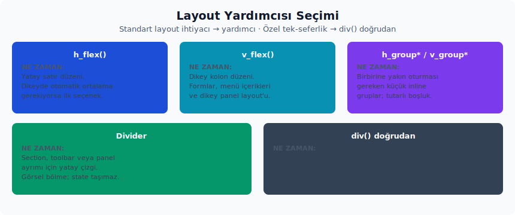

# 3. Layout Temelleri

Layout yardımcıları, GPUI'nin `div()` çağrısının üstüne Zed'de sık kullanılan flex ve ayırıcı kalıplarını ekleyen küçük yapı taşlarıdır. Bunlar tam anlamıyla yüksek seviye bileşen sayılmaz. Daha çok, layout kurarken sürekli tekrar eden stil zincirlerini kısa ve okunur hale getirmek için vardır. İçerik semantiği taşımazlar, kendi başlarına durum yönetmezler; işleri görsel düzeni hızlı ve tutarlı biçimde kurmaktır.

Farklı durumlarda hangi düzen yardımcısının tercih edileceğine karar verirken aşağıdaki yol haritası faydalı olacaktır:



- Satır düzeni ve dikey eksende otomatik ortalama gerekiyorsa `h_flex()` ilk akla gelen seçenektir.
- Dikey kolon düzeni gerektiğinde `v_flex()` kullanılır.
- Birbirine yakın oturması gereken küçük ve tutarlı boşluklu satır içi gruplar için `h_group*` ailesi daha uygundur.
- Küçük ve tutarlı boşluklu dikey gruplar için `v_group*` benzer rolü dikey yönde üstlenir.
- Bölüm, toolbar veya panel ayrımı için `Divider` doğru araçtır.
- Yalnızca tek seferlik özel bir layout gerekiyorsa, doğrudan `div()` ve GPUI'nin style builder'ları yeterli kalır.

## h_flex ve v_flex

Kaynak:

- Tanım: `ui` crate'i
- Altyapı: `ui` crate'i
- Export: `ui::h_flex`, `ui::v_flex`
- Prelude: `ui::prelude::*` içinde otomatik gelir.
- Preview: Doğrudan `impl Component` yok.

Ne zaman kullanılır:

- Bileşenleri satır veya kolon içinde hızlıca hizalamak amacıyla.
- Buton araç çubukları (toolbar), üst veri (metadata) satırları, ikon ve etiket kombinasyonları ile panel içerik düzenlerini kurmak için en sık başvurulan yardımcı araçlardır.

Ne zaman kullanılmaz:

- Aslında semantik bir bileşen gerekiyorsa (yani bir satır sadece bir layout değil, bir liste öğesi veya bir buton gibi anlam taşıyorsa) `ListItem`, `ButtonLike`, `Tab`, `Modal` gibi daha yüksek seviyeli bileşenler önceliklidir.
- Yalnızca tek bir stil ihtiyacı bulunuyorsa, doğrudan `div()` kullanılması kodun okunabilirliği açısından daha net bir tercih olabilir; gereksiz bir yardımcı yerine tasarım niyetinin açıkça belirtilmesi önerilir.

Temel API:

- `h_flex() -> Div`
- `v_flex() -> Div`
- Aynı davranış, herhangi bir `Styled` elementi üzerinde `.h_flex()` ve `.v_flex()` metotlarıyla da tanımlanabilir; böylece var olan bir builder zincire sonradan dahil edilebilir.

Davranış:

- `h_flex()` kaynakta `div().h_flex()` çağırır.
- `StyledExt::h_flex()` arka planda sırasıyla `.flex()`, `.flex_row()` ve `.items_center()` uygular.
- `v_flex()` kaynakta `div().v_flex()` çağırır.
- `StyledExt::v_flex()` ise `.flex()` ve `.flex_col()` uygular.
- Her iki yardımcı da yalnızca yerleşim (layout) stilini belirler. Gap, width, overflow ve responsive davranışlar ayrıca tanımlanmalıdır; bunlar varsayılan olarak uygulanmaz.

İlk örnek, yatay bir durum kümesini aynı satırda toplar:

```rust
use ui::prelude::*;
use ui::Tooltip;

fn arac_cubugu_basligini_render_et(yol: SharedString) -> impl IntoElement {
    h_flex()
        .w_full()
        .min_w_0()
        .justify_between()
        .gap_2()
        .child(
            h_flex()
                .min_w_0()
                .gap_1()
                .child(Icon::new(IconName::File).size(IconSize::Small).color(Color::Muted))
                .child(Label::new(yol).truncate()),
        )
        .child(
            IconButton::new("arac-cubugu-yenile", IconName::RotateCw)
                .icon_size(IconSize::Small)
                .tooltip(Tooltip::text("Yenile")),
        )
}
```

Dikkat edileceğin noktalar:

- `h_flex()` varsayılan olarak `items_center()` uygular. Üstten hizalama gerektiğinde bunun `.items_start()` ile geçersiz kılınması (override) gerekir.
- Uzun metin barındıran yatay flex (h-flex) satırlarında üst öğeye `.min_w_0()`, etiket öğesine de `.truncate()` eklenmelidir; aksi halde flex algoritması metni kısaltmak yerine satırı taşırabilir.
- `v_flex()` kendiliğinden gap (boşluk) eklemez. Dikey boşluğun `.gap_*()` ya da padding yardımıyla açıkça tanımlanması gerekir.

## h_group ve v_group

Kaynak:

- Tanım: `ui` crate'i
- Export: `ui::h_group_sm`, `ui::h_group`, `ui::h_group_lg`, `ui::h_group_xl`, `ui::v_group_sm`, `ui::v_group`, `ui::v_group_lg`, `ui::v_group_xl`
- Prelude: `ui::prelude::*` içinde otomatik gelir.
- Preview: Doğrudan `impl Component` yok.

Ne zaman kullanılır:

- Birbirine yakın durması gereken küçük ikon, etiket (label), rozet (badge) veya buton grupları için.
- Tekrarlanan ve kompakt aralık değerlerini aynı yardımcı üzerinden koruyarak, aynı ölçeği farklı yerlerde tek bir ifadeyle tanımlamak amacıyla.

Ne zaman kullanılmaz:

- Ana sayfa veya panel yerleşimi için `h_flex()` / `v_flex()` daha açık bir niyet ifadesidir; group yardımcıları o ölçekte boşluk için tasarlanmamıştır.
- Geniş boşluklar gerektiren büyük bölümlerde grup yardımcılarındaki aralık değerleri yetersiz kalabilir. Bu durumda `.gap_4()` gibi doğrudan değer atamaları çok daha anlaşılır ve tutarlı sonuçlar verir.

Temel API:

- `h_group_sm()` -> `div().flex().gap_0p5()`
- `h_group()` -> `div().flex().gap_1()`
- `h_group_lg()` -> `div().flex().gap_1p5()`
- `h_group_xl()` -> `div().flex().gap_2()`
- `v_group_sm()` -> `div().flex().flex_col().gap_0p5()`
- `v_group()` -> `div().flex().flex_col().gap_1()`
- `v_group_lg()` -> `div().flex().flex_col().gap_1p5()`
- `v_group_xl()` -> `div().flex().flex_col().gap_2()`

Davranış:

- `h_group*` yardımcıları `items_center()` eklemez. Satırdaki elemanların dikey hizalaması önemliyse `.items_center()` veya `.items_start()` çağrıları manuel olarak eklenmelidir.
- `v_group*` yardımcıları otomatik olarak `flex_col()` stilini uygular; yani dikey istif hazır olarak sunulur.
- Yardımcı isimleri aralık ölçeğini doğrudan tanımlar: `sm` küçük boşluk, isimsiz varyant varsayılan, `lg` biraz daha büyük, `xl` ise bu yardımcı ailesindeki en geniş ölçeği ifade eder. Daha geniş bir boşluk talep edildiğinde bu sabit ölçeklerle sınırlı kalmayıp, `.gap_4()` gibi doğrudan bir değer belirtilmelidir.

Örnek:

```rust
use ui::prelude::*;
use ui::Indicator;

fn durum_kumesini_render_et(sayi: usize) -> impl IntoElement {
    h_group()
        .items_center()
        .child(Indicator::dot().color(Color::Success))
        .child(Label::new("Eşitlendi").size(LabelSize::Small).color(Color::Muted))
        .child(Label::new(format!("{sayi} değişiklik")).size(LabelSize::Small).color(Color::Muted))
}
```

İkinci örnek, dar bir üst veri bloğunu dikey istif olarak kurar:

```rust
use ui::prelude::*;

fn ust_veri_istifini_render_et(dal: SharedString, yol: SharedString) -> impl IntoElement {
    v_group_sm()
        .min_w_0()
        .child(Label::new(dal).size(LabelSize::Small).truncate())
        .child(Label::new(yol).size(LabelSize::Small).color(Color::Muted).truncate())
}
```

Dikkat edileceğin noktalar:

- `h_group*` ve `v_group*` bir bileşen değildir; yalnızca düz bir `Div` döndürür.
- Group yardımcılarını iç içe fazla kullanmak yerleşimi zamanla belirsizleştirir. Ana kapsayıcı için `h_flex` veya `v_flex`, küçük alt kümeler için group yardımcı kullanımı, bu hiyerarşinin okunabilir kalmasını sağlar.

## Divider

Kaynak:

- Tanım: `ui` crate'i
- Export: `ui::Divider`, `ui::DividerColor`, `ui::divider`, `ui::vertical_divider`
- Prelude: Hayır; ayrıca import edersin.
- Preview: `impl Component for Divider`.

Ne zaman kullanılır:

- Panel, modal, araç çubuğu (toolbar) veya listelerde görsel bir ayırıcı hat çizmek için.
- Aynı kapsayıcı içinde yer alan iki içeriği ince bir kenarlık (border) rengiyle ayırmak amacıyla.
- Kesik çizgili bir ayırıcı gerektiğinde dashed yapıcı metotlar (constructors) ile.

Ne zaman kullanılmaz:

- `ContextMenu` içinde bir ayırıcıya ihtiyaç varsa `ContextMenu::separator()` doğru yüzeydir; menü kendi separator API'sini sağlar.
- Sadece bir boşluk gerekiyorsa divider yerine margin veya gap kullanmak daha doğru bir tercihtir; çünkü divider görsel bir çizgi de getirir.
- Tablo ya da listede satırları ayıran semantik bir ayırıcı gerekiyorsa, ilgili bileşenin kendi border veya ayırıcı davranışı tercih edilmelidir.

Temel API:

- Helper constructor'lar: `divider()`, `vertical_divider()`.
- Associated constructor'lar: `Divider::horizontal()`, `Divider::vertical()`, `Divider::horizontal_dashed()`, `Divider::vertical_dashed()`.
- Builder'lar: `.inset()`, `.color(DividerColor)`.
- `Divider` yapısı `Styled` implement eder; temel geometrinin üzerine genişlik, kenar boşluğu gibi `gpui` stil metotları (`.w_full()`, `.mx_2()`, `.max_w(...)` vb.) doğrudan zincirlenebilir. `.inset()` veya `.color(...)` ile karşılanamayan ince yerleşim ayarları bu şekilde gerçekleştirilir.
- `DividerColor`: `Border`, `BorderFaded`, `BorderVariant` (varsayılan).

Davranış:

- Varsayılan renk `DividerColor::BorderVariant`'tır; yani ayırıcı sahnenin içine fazla bağırmaz.
- Düz (solid) ayırıcı, arka planda `Divider::render_solid(base, cx)` yöntemiyle `bg(...)` uygulanarak çizilir.
- Kesikli (dashed) ayırıcı ise `Divider::render_dashed(base)` içinde `canvas(...)` and `PathBuilder::stroke(px(1.)).dash_array(...)` kullanılarak çizilir; bu nedenle düz olana kıyasla performansı daha fazla etkileyen bir çizim sürecine sahiptir.
- Yatay (horizontal) ayırıcı geometri olarak `min_w_0().h_px().max_h_px().w_full()`, dikey (vertical) ayırıcı ise `min_w_0().w_px().h_full()` kullanır; bu temel geometri kurulduktan sonra özel stil zinciri bunun üzerine eklenir. Yatay ayırıcıdaki `max_h_px()` ifadesi, üzerine eklenen stil çizgiyi kalınlaştırmaya çalışsa bile yatay ayırıcının 1 piksellik yüksekliğini korur.
- `.inset()` çağrısı horizontal divider'da `mx_1p5()`, vertical divider'da `my_1p5()` ekler; yani kenarlardan içeri çekme davranışı sağlar.
- Vertical divider'ın görünür olabilmesi için parent kapsayıcının belirli bir yüksekliği olması veya yüksekliğin içerikten otomatik türemesi gerekir; aksi halde dikey çizgi 0 boy alıp kaybolur.

Örnek:

```rust
use ui::prelude::*;
use ui::{Divider, DividerColor};

fn ayar_bolumunu_render_et() -> impl IntoElement {
    v_flex()
        .gap_3()
        .child(Label::new("Düzenleyici").size(LabelSize::Small).color(Color::Muted))
        .child(Divider::horizontal().color(DividerColor::BorderFaded))
        .child(Label::new("Kaydederken biçimlendir"))
}
```

```rust
use ui::prelude::*;
use ui::{Divider, DividerColor};

fn ayrili_arac_cubugunu_render_et() -> impl IntoElement {
    h_flex()
        .h_8()
        .gap_2()
        .child(Button::new("calistir", "Çalıştır"))
        .child(Divider::vertical().color(DividerColor::Border))
        .child(Button::new("hata-ayikla", "Hata ayıkla"))
}
```

Zed içinden kullanım örnekleri:

- `settings_ui` crate'i: bölüm alt kenarlıkları.
- `recent_projects` crate'i: proje grupları ve araç çubuğu ayrımları.
- `git_ui` crate'i: diff araç çubuğu üzerindeki dikey ayırıcılar.

Dikkat edileceğin noktalar:

- `Divider` bir yerleşim (layout) aracı değildir; tamamen görsel bir ayrım oluşturma amacı taşır. Çok sık kullanıldığında arayüz hızla kalabalıklaşabilir. Bölüm hiyerarşisini öncelikle aralıklar ve başlıklar üzerinden kurmak çok daha sade bir sonuç verir; ayırıcı hatlar ise en son seçenek olarak değerlendirilmelidir.
- Kesik çizgili ayırıcı, kesik çizgi efektini elde edebilmek için özel bir canvas çizimi gerçekleştirir. Basit bir ayrım yeterli olduğu durumlarda düz ayırıcı hem daha düşük maliyetli hem de görsel olarak daha tutarlı bir tercihtir.

## Layout Kompozisyon Örnekleri

Panel iskeleti, üstte bir başlık satırı, altında bir ayırıcı ve geri kalan alanı dolduran bir içerik bölgesi içerir. Aşağıdaki örnek bu üç parçanın nasıl bir araya getirilebileceğini gösterir:

```rust
use ui::prelude::*;
use ui::{Divider, Tooltip};

fn panel_kabugunu_render_et(baslik: SharedString) -> impl IntoElement {
    v_flex()
        .size_full()
        .child(
            h_flex()
                .h_8()
                .px_2()
                .justify_between()
                .child(Label::new(baslik).truncate())
                .child(
                    IconButton::new("panel-kapat", IconName::Close)
                        .icon_size(IconSize::Small)
                        .tooltip(Tooltip::text("Paneli kapat")),
                ),
        )
        .child(Divider::horizontal())
        .child(v_flex().flex_1().min_h_0().p_2().gap_2())
}
```

Satır içi üst veri için ise küçük bir ikon, bir dal adı ve bir önde olma sayacı gibi yan yana duran küçük parçaların bir `h_group_sm()` içinde toplanması yeterlidir. Bu örnek, grup yardımcılarının küçük ölçekli satır içi kompozisyonlarda nasıl rahat bir okunabilirlik sağladığını ortaya koyar:

```rust
use ui::prelude::*;

fn dal_ust_verisini_render_et(dal: SharedString, onde: usize) -> impl IntoElement {
    h_group_sm()
        .items_center()
        .child(Icon::new(IconName::GitBranch).size(IconSize::Small).color(Color::Muted))
        .child(Label::new(dal).size(LabelSize::Small).truncate())
        .child(Label::new(format!("{onde} önde")).size(LabelSize::Small).color(Color::Muted))
}
```
