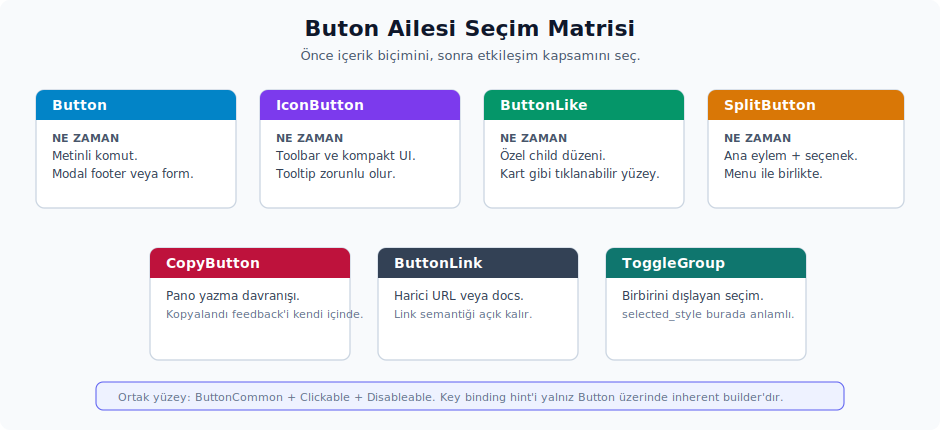
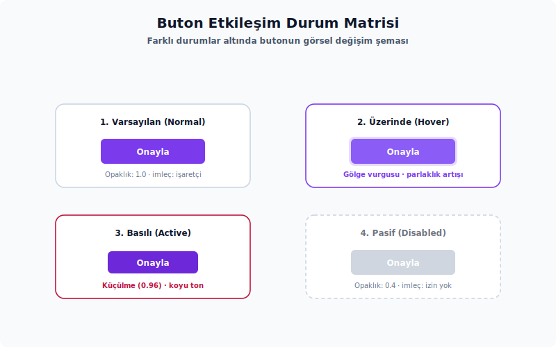

# 5. Buton Ailesi

Buton ailesi, kullanıcı eylemlerini başlatan veya görünür bir UI durumunu değiştiren bileşenlerden oluşur. `Button` metinli eylemler için, `IconButton` yalnızca ikonlu kontroller için, `ButtonLike` ise özel içerikli buton yüzeyleri için tasarlanmıştır. Ailenin diğer üyeleri de bu üç temel yüzeyin üstüne ek davranış veya kompozisyon ekler; arka planda aynı buton disiplinini paylaşırlar.

Hangi durumda hangi buton tipinin tercih edileceğine karar verirken aşağıdaki kısa ayrım yeterli olacaktır:

- Açık metinli bir komut için `Button` ilk seçenektir.
- Toolbar, panel başlığı veya kompakt bir kontrol için `IconButton` daha uygun düşer.
- İçerik standart label/icon düzeninden ayrılıyorsa `ButtonLike` daha esnek bir yüzey sunar.
- Harici bir URL'i açan metin linki için `ButtonLink` vardır.
- Pano (clipboard) kopyalama davranışları için `CopyButton` doğrudan kullanılır.
- Bir ana eylem ve onun yanında açılır seçenekler sunulacaksa `SplitButton` ile birleşik bir yapı kurulabilir.
- Aynı grupta birbirini dışlayan seçimler için `ToggleButtonGroup` tercih edilir.



## Ortak buton trait'leri ve token'lar

Kaynak:

- Ortak trait ve token'lar: `ui` crate'i.
- Prelude: `Button`, `IconButton`, `SelectableButton`, `ButtonCommon`, `ButtonSize`, `ButtonStyle`, `IconPosition` otomatik gelir. `TintColor`, `ButtonLike`, `ButtonLink`, `CopyButton`, `SplitButton` ve toggle button tipleri ise ayrıca import edilir.

Ortak trait'ler:

- `ButtonCommon` (supertrait: `Clickable + Disableable`): `.id(&self) -> &ElementId`, `.style(ButtonStyle)`, `.size(ButtonSize)`, `.tooltip(Fn(...) -> AnyView)`, `.tab_index(impl Into<isize>)`, `.layer(ElevationIndex)`, `.track_focus(&FocusHandle)`.
- `Clickable`: `.on_click(isleyici)`, `.cursor_style(CursorStyle)`.
- `Disableable`: `.disabled(bool)`.
- `Toggleable`: `.toggle_state(bool)` (tek metot).
- `SelectableButton` (supertrait: `Toggleable`): `.selected_style(ButtonStyle)`.
- `FixedWidth`: `.width(impl Into<DefiniteLength>)`, `.full_width()`.
- `VisibleOnHover`: `.visible_on_hover(impl Into<SharedString>)`.

> **`key_binding` ve `key_binding_position` trait'te yer almaz.** Bu iki builder, `Button` struct'ının kendisine ait inherent (impl) metotlardır ve `IconButton`, `ButtonLike`, `SplitButton` üzerinde **çalışmaz**. Bu üç buton tipinde kısayol ipucu göstermek için manuel olarak bir `KeyBinding` widget'ı eklenir (bkz. Bölüm 14, `KeyBinding`). `KeybindingPosition` enum'unun değerleri (`Start`, `End` — varsayılan olarak `End`) ise yalnızca `Button::key_binding_position(...)` parametresi bağlamında anlam taşır.

Buton stilleri:

Butonların farklı etkileşimler altındaki davranışsal durumları ve görsel değişimleri (opaklık, gölge ve boyut gibi) tutarlı bir tasarım diliyle yönetilir. Aşağıdaki durum matrisi şemasında, bir butonun normal, üzerine gelme (hover), tıklanma (active) ve pasiflik (disabled) durumlarındaki görsel geçiş özellikleri özetlenmektedir:



- `ButtonStyle::Subtle`: varsayılan; çoğu sıradan toolbar ve satır eylemi için yeterlidir.
- `ButtonStyle::Filled`: daha fazla vurgu isteyen birincil veya modal eylemler için.
- `ButtonStyle::Tinted(TintColor::Accent | Error | Warning | Success)`: seçili veya semantik bir vurgu gerektiren durumlar için.
- `ButtonStyle::Outlined` ve `OutlinedGhost`: ikincil ama sınırla ayrılması istenen eylemler için.
- `ButtonStyle::OutlinedCustom(hsla)`: özel bir border rengi gerektiğinde kullanılır.
- `ButtonStyle::Transparent`: yalnızca foreground ve hover davranışı istenen kompakt kontroller için uygundur.

Buton boyutları:

- `ButtonSize::Large`: 32px yükseklik.
- `ButtonSize::Medium`: 28px.
- `ButtonSize::Default`: 22px.
- `ButtonSize::Compact`: 18px.
- `ButtonSize::None`: 16px; link veya özel kompozisyonlarda tercih edilir.

İkon konumu için iki ayrı enum vardır:

- `IconPosition`: toggleable entry veya menu/button benzeri satırlarda icon'un label'ın başında mı sonunda mı duracağını anlatır. Değerleri `Start` ve `End`'dir; varsayılan `Start` olur. `ContextMenu::toggleable_entry(...)` gibi API'lerde checked ikonunun veya durum ikonunun hangi tarafta görüneceği bu enum ile belirlenir.
- `KeybindingPosition`: yalnız `Button::key_binding_position(...)` için geçerlidir. Kısayol ipucunu start veya end tarafına taşır; varsayılan `End` olur.

`IconPosition` ile `KeybindingPosition` aynı şey değildir. İlki genel icon slot konumunu, ikincisi yalnız metinli `Button` üzerindeki kısayol ipucu boyutunu yönetir. Bir `IconButton` veya `ButtonLike` üzerinde kısayol ipucu göstermek isteniyorsa `Button::key_binding_position(...)` özelliğini beklemek yerine ayrıca bir `KeyBinding` veya `KeybindingHint` elementi eklenmelidir.

Seçili görünümün nasıl ifade edileceği (`Tinted` mi, `selected_style` mı) sahnenin niyetine göre değişir. Aşağıdaki tablo bu kararı özetler:

| Senaryo | Tercih | Neden |
| :-- | :-- | :-- |
| Buton seçili olmasa bile semantik bir renk taşıyor (örn. delete / approve) | `.style(ButtonStyle::Tinted(TintColor::...))` | Tinted, normal stilin yerine geçer; toggle olmadan da renk kalıcı kalır. |
| Buton normalde `Subtle` veya `Filled`; seçildiğinde vurgulu görünmeli | `.toggle_state(true).selected_style(ButtonStyle::Tinted(TintColor::Accent))` | `selected_style` yalnızca `toggle_state` true iken devreye girer; seçim kalktığında eski stile döner. |
| Seçili durumda da `Subtle` görünmeli ama icon/label rengi değişsin | `.toggle_state(true).selected_label_color(Color::Accent)` veya `IconButton::selected_icon_color(...)` | Buton arka planı korunur, yalnızca içerik rengi değişir. |
| Seçili durumda farklı bir ikon görünmeli | `IconButton::selected_icon(IconName::...)` | Toggle iken icon swap'i `selected_style` ile kombine edilebilir. |

`SelectableButton` trait'i `Button`, `IconButton` ve `ButtonLike` için `selected_style(ButtonStyle)` yüzeyini ortak bir şekilde sunar; aynı görsel kural birden fazla buton tipinde uygulanacaksa bu yardımcı metot tek bir noktadan kullanılabilir.

Buton ailesindeki küçük taşıyıcı ve trait yüzeyleri şu tabloda toplanır:

| API | Alt özellikler | Kullanım notu |
|-----|----------------|---------------|
| `ButtonCommon` | `id`, `style`, `size`, `tooltip`, `tab_index`, `layer`, `track_focus` | Bütün button-like kontrollerin ortak yapılandırma sözleşmesidir. |
| `SelectableButton` | `selected_style` | `Toggleable` kontrollerde seçili görsel stili ortaklaştırır. |
| `ButtonBuilder` | `into_configuration` | `ToggleButtonGroup` satırlarını `ButtonConfiguration` değerine çeviren builder sınırıdır. |
| `ButtonConfiguration` | `label`, `icon`, `on_click`, `selected`, `tooltip` | Toggle button satırlarının render sırasında kullandığı paketlenmiş konfigürasyondur. |
| `IconButtonShape` | `Square`, `Wide` | Icon-only butonun kare mi yoksa geniş toolbar yüzeyi mi olacağını seçer. |
| `IconPosition` | `Start`, `End` | Menü, toggle veya button-like satırlarda ikon/checked işaretinin label'ın hangi tarafında duracağını belirtir. |
| `KeybindingPosition` | `Start`, `End` | Yalnız `Button::key_binding_position` için kısayol ipucu tarafını belirler. |
| `SplitButtonKind` | `ButtonLike`, `IconButton` | Split button'ın sol parçası için kabul edilen iki button yüzeyini tipler. |
| `SplitButtonStyle` | `Filled`, `Outlined`, `Transparent` | Split button'ın birleşik background/border davranışını belirler. |
| `ToggleButtonPosition` | `HORIZONTAL_FIRST`, `HORIZONTAL_MIDDLE`, `HORIZONTAL_LAST`; köşe bayrakları | Grup içindeki butonun hangi köşelerinin yuvarlanacağını hesaplar. |
| `ToggleButtonSimple` | `new`, `selected`, `tooltip` | Yalnız label taşıyan toggle button girdisidir. |
| `ToggleButtonWithIcon` | `new`, `selected`, `tooltip` | Label + icon toggle button girdisidir. |
| `ToggleButtonGroupStyle` | `Transparent`, `Filled`, `Outlined` | Toggle group yüzey stilini seçer. |
| `ToggleButtonGroupSize` | `Default`, `Medium`, `Large`, `Custom(Rems)` | Toggle group ölçüsünü seçer. |
| `private::ToggleButtonStyle` | private marker trait | `ToggleButtonSimple` ve `ToggleButtonWithIcon` dışındaki tiplerin `ButtonBuilder` olmasını sınırlar; crate dışından import edilemez. |

Dikkat edilmesi gereken noktalar:

- `ButtonCommon::tooltip(...)` metodu, `Tooltip::text(...)` gibi `Fn(&mut Window, &mut App) -> AnyView` döndüren yardımcılarla birlikte kullanılır.
- `ButtonLike`, render sırasında click işleyicisi içinde `cx.stop_propagation()` çağırır. Bu yüzden iç içe yerleştirilmiş tıklanabilir yüzeylerde event akışının buna göre düşünülmesi gerekir.
- Disabled durumda olan butonlarda tıklama ve right-click işleyicileri uygulanmaz; sahnede görünseler bile etkileşime girmezler.

## Button

Kaynak:

- Tanım: `ui` crate'i
- Export: `ui::Button`
- Prelude: `ui::prelude::*` içinde otomatik gelir.
- Preview: `impl Component for Button`.

Ne zaman kullanılır:

- Metinle açıklanan kullanıcı eylemleri için: Save, Open, Retry, Apply, Cancel gibi komutlar.
- Modal footer, form eylemi, callout action veya satır içi komut ihtiyaçlarında.
- Metin ile birlikte start veya end icon ve bir keybinding ipucunun birlikte gösterilmesi gerektiğinde.

Ne zaman kullanılmaz:

- Yalnızca ikon kullanılacaksa `IconButton` daha doğru bir yüzeydir.
- İçerik özel slot'lardan oluşuyorsa `ButtonLike` esneklik sağlar.
- Görsel olarak harici bir web linki ifade edilecekse `ButtonLink` tercih edilir.

Temel API:

- Constructor: `Button::new(id, label)`.
- İçerik builder'ları: `.start_icon(...)`, `.end_icon(...)`, `.selected_label(...)`, `.selected_label_color(...)`, `.color(...)`, `.label_size(...)`, `.alpha(...)`, `.key_binding(...)`, `.key_binding_position(...)`.
- Durum builder'ları: `.loading(bool)`, `.truncate(bool)`, `.toggle_state(bool)`, `.selected_style(...)`, `.disabled(bool)`.
- Ortak builder'lar: `.style(...)`, `.size(...)`, `.tooltip(...)`, `.tab_index(...)`, `.layer(...)`, `.track_focus(...)`, `.width(...)`, `.full_width()`, `.on_click(...)`, `.cursor_style(...)`.

Davranış:

- `RenderOnce` implement eder ve render sonunda arka planda bir `ButtonLike` üretir.
- `loading(true)` olduğunda `start_icon` yerine dönen `IconName::LoadCircle` ikonu çizilir.
- Devre dışı (disabled) durumda etiket ve ikon `Color::Disabled` rengiyle çizilir.
- `.truncate(true)` yalnızca dinamik ve taşma riski olan etiketlerde kullanılır; kaynak yorumlarında statik etiketler için kullanılmaması gerektiği özellikle vurgulanmaktadır.

Örnekler:

```rust
use ui::prelude::*;
use ui::{TintColor, Tooltip};

struct AracCubuguDurumu {
    kaydedildi: bool,
    calisiyor: bool,
}

impl Render for AracCubuguDurumu {
    fn render(&mut self, _window: &mut Window, cx: &mut Context<Self>) -> impl IntoElement {
        h_flex()
            .gap_1()
            .child(
                Button::new("projeyi-kaydet", "Kaydet")
                    .start_icon(Icon::new(IconName::Check))
                    .style(ButtonStyle::Filled)
                    .tooltip(Tooltip::text("Projeyi kaydet"))
                    .on_click(cx.listener(|this: &mut AracCubuguDurumu, _, _, cx| {
                        this.kaydedildi = true;
                        cx.notify();
                    })),
            )
            .child(
                Button::new("gorevi-calistir", "Çalıştır")
                    .loading(self.calisiyor)
                    .disabled(self.calisiyor)
                    .style(ButtonStyle::Tinted(TintColor::Success)),
            )
    }
}
```

```rust
use ui::prelude::*;

fn dal_seciciyi_render_et(dal: SharedString) -> impl IntoElement {
    Button::new("dal-secici", dal)
        .end_icon(Icon::new(IconName::ChevronDown).size(IconSize::Small))
        .truncate(true)
}
```

Zed içinden kullanım örnekleri:

- `keymap_editor` crate'i: kaydetme, oluşturma ve JSON düzenleme eylemleri.
- `recent_projects` crate'i: Open, New Window, Delete gibi proje eylemleri.
- `git_ui` crate'i: commit, selector ve split button parçaları.

Dikkat edilmesi gereken noktalar:

- Dinamik bir etiket için `.truncate(true)` eklenirken, parent kapsayıcıya da `min_w_0` gibi taşmayı sınırlayacak bir düzen (layout) davranışı tanımlanmalıdır; aksi takdirde kırpma işlemi beklendiği gibi çalışmaz.
- Loading durumu yalnızca görsel bir yükleme spinner'ı sağlar. Asenkron işlerin hatalarını view durumuna yansıtmak yine view tarafının sorumluluğundadır.
- Tinted stiller için kullanılan `TintColor` prelude içinde sunulmaz; ayrıca import edilmesi gerekir.

## IconButton

Kaynak:

- Tanım: `ui` crate'i
- Export: `ui::IconButton`
- Prelude: `ui::prelude::*` içinde otomatik gelir.
- Preview: `impl Component for IconButton`.

Ne zaman kullanılır:

- Kompakt toolbar eylemleri, panel kapatma, filtre, refresh, split veya menu trigger gibi yalnızca ikonla tanınan eylemler için.
- Seçili durum geldiğinde ikonun veya rengin değişmesi gereken senaryolar için.
- İkonun yanında küçük bir durum noktası (status dot) gerektiğinde `.indicator(...)` ile birlikte kullanılır.

Ne zaman kullanılmaz:

- Eylem ikonla yeterince anlatılamıyorsa `Button` daha okunabilir bir tercih olur.
- İçerik ikon dışında özel bir layout gerektiriyorsa `ButtonLike` daha uygundur.

Temel API:

- Constructor: `IconButton::new(id, icon)`.
- İkon builder'ları: `.icon_size(...)`, `.icon_color(...)`, `.selected_icon(...)`, `.selected_icon_color(...)`, `.alpha(...)`.
- Şekil: `.shape(IconButtonShape::Square | Wide)`. Varsayılan şekil `IconButtonShape::Wide`'dir; kare bir yüzey isteniyorsa `Square` açıkça tanımlanır.
- Durum ve davranış: `.indicator(...)`, `.indicator_border_color(...)`, `.toggle_state(...)`, `.selected_style(...)`, `.disabled(...)`, `.on_click(...)`, `.on_right_click(...)`, `.visible_on_hover(...)`.
- Ortak builder'lar: `.style(...)`, `.size(...)`, `.tooltip(...)`, `.tab_index(...)`, `.layer(...)`, `.track_focus(...)`, `.width(...)`, `.full_width()`, `.cursor_style(...)`.

Davranış:

- `RenderOnce` implement eder ve render sonunda bir `ButtonLike` üretir.
- Seçili durumda `selected_icon` tanımlanmışsa o ikon çizilir.
- Seçili durumdayken `selected_style` da belirtilmişse, ikon rengi bu stile karşılık gelen semantik renkten türetilir. Aksi halde `selected_icon_color` veya `Color::Selected` kullanılır.
- `IconButtonShape::Square`, ikonun kare ölçüsünü kullanarak butonun genişlik (width) ve yükseklik (height) değerlerini eşitler; yani buton bir kare olarak çizilir.

Örnek:

```rust
use ui::prelude::*;
use ui::{IconButtonShape, Tooltip};

struct YanPanelGecisi {
    acik: bool,
}

impl Render for YanPanelGecisi {
    fn render(&mut self, _window: &mut Window, cx: &mut Context<Self>) -> impl IntoElement {
        IconButton::new("yan-panel-gecis", IconName::Menu)
            .shape(IconButtonShape::Square)
            .icon_size(IconSize::Small)
            .toggle_state(self.acik)
            .selected_icon(IconName::Close)
            .tooltip(Tooltip::text("Yan paneli aç/kapat"))
            .on_click(cx.listener(|this: &mut YanPanelGecisi, _, _, cx| {
                this.acik = !this.acik;
                cx.notify();
            }))
    }
}
```

Zed içinden kullanım örnekleri:

- `sidebar` crate'i: sidebar ve terminal toolbar kontrolleri.
- `search` crate'i: search control butonları.
- `keymap_editor` crate'i: filtre ve exact match kontrolleri.

Dikkat edilmesi gereken noktalar:

- Yalnızca ikon barındıran kontroller genellikle bir tooltip açıklaması gerektirir; aksi takdirde simgenin anlamı kullanıcı açısından belirsiz kalabilir.
- `.visible_on_hover(group_name)` kullanıldığında, parent element üzerinde aynı isimle `.group(group_name)` çağrılmış olmalıdır; aksi takdirde hover etkisi tetiklenmez.
- Seçili durumu yalnızca görsel olarak değiştirmek yeterli değildir. View durumu değiştiğinde işleyici içinde durum güncellenmeli ve ardından `cx.notify()` çağrılmalıdır.

## ButtonLike

Kaynak:

- Tanım: `ui` crate'i
- Export: `ui::ButtonLike`
- Prelude: Hayır; `use ui::ButtonLike;` ayrıca eklenmesi gerekir.
- Preview: `impl Component for ButtonLike`.

Ne zaman kullanılır:

- Standart `Button` veya `IconButton` slot modelinin yetmediği özel yüzeylerde.
- Buton gibi davranan ama içinde birden fazla label, icon, badge veya özel bir layout bulunan satır ve trigger'lar için.
- Split button'ın sol veya sağ parçasını özel köşe yuvarlamalarıyla oluşturmak gerektiğinde.

Ne zaman kullanılmaz:

- Basit bir metinli eylem için `Button` zaten yeterlidir.
- Yalnızca bir ikon için `IconButton` daha tutarlı bir tercihtir.
- "Sadece biraz farklı aralık istedim" gibi bir nedenle kullanılması uygun değildir; tutarlılık açısından yüksek seviyeli bileşenler önceliklidir.

Temel API:

- Constructor: `ButtonLike::new(id)`.
- Grup constructor'ları: `new_rounded_left`, `new_rounded_right`, `new_rounded_all`.
- Style ve durum: `.style(...)`, `.size(...)`, `.disabled(...)`, `.toggle_state(...)`, `.selected_style(...)`, `.opacity(...)`, `.height(...)`.
- Davranış: `.on_click(...)`, `.on_right_click(...)`, `.tooltip(...)`, `.hoverable_tooltip(...)`, `.cursor_style(...)`, `.tab_index(...)`, `.layer(...)`, `.track_focus(...)`, `.visible_on_hover(...)`.
- Layout: `ParentElement` implement eder; `.child(...)` ve `.children(...)` kabul eder. Ayrıca `.width(...)` ve `.full_width()` builder'larını taşır.

Yuvarlama davranışı:

`ButtonLikeRounding` kaynakta `pub(crate)` bir yardımcı tiptir; uygulama kodunda doğrudan import edilmez. Public kullanım yüzeyi `ButtonLike` constructor'larıdır. Snapshot denetimi sabit imzalarını görebildiği için burada kaynak eşlemesi verilebilir, ama önerilen API sabitin kendisi değil constructor'dır.

| İç sabit | Kaynak görünürlüğü | Public karşılığı |
| :-- | :-- | :-- |
| `ButtonLikeRounding::ALL` | crate içi sabit | Tüm köşeler yuvarlatılır; dışarıdan `ButtonLike::new_rounded_all(...)` ile seçilir. |
| `ButtonLikeRounding::LEFT` | crate içi sabit | Sol parça yuvarlatılır, sağ kenar düz kalır; dışarıdan `ButtonLike::new_rounded_left(...)` ile seçilir. |
| `ButtonLikeRounding::RIGHT` | crate içi sabit | Sağ parça yuvarlatılır, sol kenar düz kalır; dışarıdan `ButtonLike::new_rounded_right(...)` ile seçilir. |

Split button veya bitişik araç çubuğu (toolbar) parçaları tasarlanırken sol ve sağ yapıcı metotlar (constructors) kullanılır. Tek başına duran özel yüzeylerde varsayılan `ButtonLike::new(...)` zaten tüm köşeleri yuvarlatır; yalnızca kaynak kodla birebir eşleşme (parite) gerektiğinde `new_rounded_all(...)` adı bu davranışı açıkça belirtir.

Davranış:

- `RenderOnce` implement eder.
- Kendisine verilen child'ları bir h-flex buton yüzeyi içinde render eder.
- Style hesabı için enabled, hover, active, focus ve disabled durumlarının hepsi `ButtonStyle` üzerinden türetilir.
- Click işleyicisi disabled değilse çalışır ve event propagation durdurulur.

Örnek:

```rust
use ui::prelude::*;
use ui::{ButtonLike, Tooltip};

fn hesap_tetikleyicisini_render_et(ad: SharedString, eposta: SharedString) -> impl IntoElement {
    ButtonLike::new("hesap-tetikleyici")
        .style(ButtonStyle::Subtle)
        .tooltip(Tooltip::text("Hesabı değiştir"))
        .child(
            h_flex()
                .min_w_0()
                .gap_2()
                .child(Icon::new(IconName::Person).size(IconSize::Small))
                .child(
                    v_flex()
                        .min_w_0()
                        .child(Label::new(ad).truncate())
                        .child(Label::new(eposta).size(LabelSize::Small).color(Color::Muted).truncate()),
                ),
        )
}
```

Zed içinden kullanım örnekleri:

- `recent_projects` crate'i: özel proje açma satırları.
- `language_tools` crate'i: header yüzeyi.
- `agent_ui` crate'i: özel mention yüzeyi.

Dikkat edilmesi gereken noktalar:

- `ButtonLike` sınırlandırılmamış (unconstrained) bir yapı olduğundan tasarım sisteminin dışına çıkılmasına kolayca zemin hazırlayabilir; yalnızca gerçekten farklı bir slot ihtiyacı mevcutsa tercih edilmelidir. Aksi takdirde uygulamanın görsel tutarlılığı zamanla azalabilir.
- `new_rounded_left/right/all` yapıcı metotları split veya bitişik buton grupları için uygundur; tek bir buton tasarımı için ise normal `new` yapıcı metodu genellikle yeterlidir.

## ButtonLink

Kaynak:

- Tanım: `ui` crate'i
- Export: `ui::ButtonLink`
- Prelude: Hayır; `use ui::ButtonLink;` ayrıca eklenmesi gerekir.
- Preview: `impl Component for ButtonLink`.

Ne zaman kullanılır:

- Kullanıcıyı harici bir web sayfasına gönderen inline veya ayar metni içindeki linkler için.
- Bir linkin buton focus ve tıklama davranışını taşıması, ama görsel olarak underline metin gibi görünmesi gerektiğinde.

Ne zaman kullanılmaz:

- Uygulama içi bir action için normal `Button` veya menu entry daha doğrudan bir çözümdür.
- Link metadata, tooltip veya zengin içerik gerekiyorsa özel bir `ButtonLike` kompozisyonuna geçmek gerekebilir.

Temel API:

- Constructor: `ButtonLink::new(label, link)`.
- Builder'lar: `.no_icon(bool)`, `.label_size(...)`, `.label_color(...)`.

Davranış:

- Render aşamasında arka planda bir `ButtonLike::new(...)` kurulur.
- Etiket (label) otomatik olarak altı çizili (underline) hale getirilir.
- Varsayılan olarak `IconName::ArrowUpRight` ikonunun sonda (end icon) gösterilmesi, bu yön okunun link metnine "harici adrese açılır" niteliği katmasını sağlar.
- Tıklama (click) işleyicisi `cx.open_url(&self.link)` çağrısı yaparak ilgili bağlantıyı web tarayıcısında açar.

Örnek:

```rust
use ui::prelude::*;
use ui::ButtonLink;

fn saglayici_baglantisini_render_et() -> impl IntoElement {
    h_flex()
        .gap_1()
        .child(Label::new("API anahtarını şurada oluştur"))
        .child(
            ButtonLink::new("sağlayıcı ayarları", "https://example.com/settings")
                .label_size(LabelSize::Small)
                .label_color(Color::Accent),
        )
}
```

Zed içinden kullanım örnekleri:

- `language_models` crate'i: provider ayarları ve belge bağlantıları.

Dikkat edilmesi gereken noktalar:

- Harici bir bağlantıya gidileceğinin kullanıcıya açıkça belli edilmesi önemlidir. Varsayılan olan arrow-up-right ikonu bu yüzden değerlidir ve yalnızca linkin gerçekten inline bir metin gibi görünmesi gereken çok özel durumlarda `.no_icon(true)` ile kapatılması önerilir.

## CopyButton

Kaynak:

- Tanım: `ui` crate'i
- Export: `ui::CopyButton`
- Prelude: Hayır; `use ui::CopyButton;` ayrıca eklenmesi gerekir.
- Preview: `impl Component for CopyButton`.

Ne zaman kullanılır:

- Sabit ya da render anında bilinen bir string'i clipboard'a kopyalamak için.
- SHA, path, komut, hata metni veya diagnostic içeriği gibi alanların yanında küçük bir copy ikonunun durması gerektiğinde.

Ne zaman kullanılmaz:

- Kopyalama işlemi async veya başarısız olabilen özel bir akış ise ve hatanın UI'da gösterilmesi gerekiyorsa, davranışı view durumu ile açıkça yöneten özel bir buton daha uygundur.

Temel API:

- Constructor: `CopyButton::new(id, message)`.
- Builder'lar: `.icon_size(...)`, `.disabled(bool)`, `.tooltip_label(...)`, `.visible_on_hover(...)`, `.custom_on_click(...)`.

Davranış:

- Render sırasında anahtarlı (keyed) bir `CopyButtonState` kullanılır.
- Varsayılan tıklama davranışı, tanımlanan `message` metnini panoya (clipboard) yazar.
- Kopyalama işleminin ardından iki saniye boyunca `IconName::Check`, `Color::Success` rengiyle birlikte "Copied!" ipucunun gösterilmesini sağlar.
- İki saniyelik durum yenilemesi için `cx.background_executor().timer(...)` kullanan bir asenkron görev arka plana (detach) gönderilir; böylece süre dolduğunda görünüm otomatik olarak eski haline geri döner.
- İki saniyelik "Copied!" görsel durumu her tıklamada tetiklenir; `.custom_on_click(...)` belirtilmiş olsa bile bu görsel geri bildirim çalışmaya devam eder. Özel işleyici yalnızca panoya yazma adımının yerine geçer, kopyalandı görsel göstergesini devre dışı bırakmaz.

Örnek:

```rust
use ui::prelude::*;
use ui::CopyButton;

fn kopyalanabilir_sha_render_et(kisa_sha: SharedString, tam_sha: SharedString) -> impl IntoElement {
    h_flex()
        .group("sha-row")
        .gap_1()
        .child(Label::new(kisa_sha).size(LabelSize::Small).color(Color::Muted))
        .child(
            CopyButton::new("commit-sha-kopyala", tam_sha)
                .tooltip_label("Copy commit SHA")
                .visible_on_hover("sha-row"),
        )
}
```

Zed içinden kullanım örnekleri:

- `markdown` crate'i: code block copy davranışı.
- `git_ui` crate'i: commit SHA kopyalama.
- `agent_ui` crate'i: komut ve hata metni kopyalama.

Dikkat edilmesi gereken noktalar:

- `.visible_on_hover(...)` için parent element üzerinde aynı isimle `.group(...)` çağrılması gerekir.
- `.custom_on_click(...)` metodu varsayılan kopyalama davranışına ekleme yapmaz, doğrudan onun yerine geçer. Eğer özel işleyici hata üretebiliyorsa, bu hatanın view durumuna taşınması veya loglanması gerekir; aksi takdirde kullanıcı kopyalama işleminin başarısız olduğunu fark edemez.

## SplitButton

Kaynak:

- Tanım: `ui` crate'i
- Export: `ui::SplitButton`
- Prelude: Hayır; `use ui::SplitButton;` ayrıca eklenmesi gerekir.
- Preview: Doğrudan `impl Component for SplitButton` yok.

Ne zaman kullanılır:

- Bir ana eylemin yanında aynı kontrol içinde ikinci bir trigger gerektiğinde. Örneğin Commit ile commit seçenekleri ya da Run ile run configuration menüsünün birlikte yer alması bu kalıba uyar.

Ne zaman kullanılmaz:

- İki eylem birbirine eşit önemdeyse ayrı `Button` veya bir toolbar grubu daha okunaklı bir yapı sunar.
- Sağ parça sadece dekoratifse split button bu yapıya gereksiz bir ağırlık katar.

Temel API:

- Constructor: `SplitButton::new(left, right)`.
- `left`: `ButtonLike` veya `IconButton` (`SplitButtonKind` üzerinden).
- `right`: `AnyElement`.
- Style: `SplitButtonStyle::Filled`, `Outlined`, `Transparent`.

Davranış:

- `RenderOnce` implement eder.
- Sol ve sağ parçayı tek bir h-flex kontrol olarak render eder; iki parça görsel olarak tek bir bütünmüş gibi görünür.
- `Filled` ve `Outlined` stilleri border ile divider çizer; ayrıca `Filled` stilinde ise yüzey arka planı (surface background) ve hafif bir gölge (shadow) uygulanır.

Örnek:

```rust
use ui::prelude::*;
use ui::{ButtonLike, SplitButton, SplitButtonStyle, Tooltip};

fn calistirma_ayrili_butonunu_render_et() -> impl IntoElement {
    let sol = ButtonLike::new_rounded_left("calistir-birincil")
        .style(ButtonStyle::Filled)
        .child(
            h_flex()
                .gap_1()
                .child(Icon::new(IconName::PlayFilled).size(IconSize::Small))
                .child(Label::new("Çalıştır")),
        );

    let sag = IconButton::new("calistirma-secenekleri", IconName::ChevronDown)
        .style(ButtonStyle::Filled)
        .tooltip(Tooltip::text("Çalıştırma seçenekleri"))
        .into_any_element();

    SplitButton::new(sol, sag).style(SplitButtonStyle::Filled)
}
```

Zed içinden kullanım örnekleri:

- `git_ui` crate'i: commit split button.
- `git_ui` crate'i: commit modal split button.
- `debugger_ui` crate'i: console action split button.

Dikkat edilmesi gereken noktalar:

- Sol ve sağ parçalara bağımsız tıklama (click) işleyicileri atanır; `SplitButton` yalnızca görsel bütünlük sağlar, eylemleri birleştirmez.
- Sağ parça bir popover veya menü tetikleyicisi (trigger) olacaksa, odak kapanma davranışı ilgili `PopoverMenu` veya `ContextMenu` tarafında yönetilir; `SplitButton` bu sorumluluğu üstlenmez.

## ToggleButtonGroup

Kaynak:

- Tanım: `ui` crate'i
- Export: `ui::ToggleButtonGroup`, `ui::ToggleButtonSimple`, `ui::ToggleButtonWithIcon`, `ui::ToggleButtonGroupStyle`, `ui::ToggleButtonGroupSize`.
- Prelude: Hayır; ayrıca import edilmesi gerekir.
- Preview: `impl Component for ToggleButtonGroup<...>`.

Ne zaman kullanılır:

- Aynı anda tek seçimin aktif olduğu segment kontrol veya mod seçicilerde.
- Görünüm modu, diff modu, filtre modu veya küçük bir ayar seçicisi gibi durumlar için.

Ne zaman kullanılmaz:

- Bağımsız aç/kapat kontrolleri için `Switch`, `Checkbox` veya tekil `IconButton::toggle_state(...)` daha uygun bir araçtır.
- Seçenek sayısı fazlaysa ya da dinamik olarak değişiyorsa, bir dropdown/menu çözümü daha ölçeklenebilir bir tercih olur.

Temel API:

- Button girdisi: `ToggleButtonSimple::new(label, on_click)`.
- İkonlu girdi: `ToggleButtonWithIcon::new(label, icon, on_click)`.
- Girdi builder'ları: `.selected(bool)`, `.tooltip(...)`.
- Group constructor'ları: `ToggleButtonGroup::single_row(group_name, [buttons; COLS])`, `ToggleButtonGroup::two_rows(group_name, first_row, second_row)`.
- Group builder'ları: `.style(ToggleButtonGroupStyle)`, `.size(ToggleButtonGroupSize)`, `.selected_index(usize)`, `.auto_width()`, `.label_size(LabelSize)`, `.tab_index(&mut isize)`, `.width(impl Into<DefiniteLength>)`, `.full_width()`.
- `ToggleButtonGroupStyle`: `Transparent`, `Filled`, `Outlined`.
- `ToggleButtonGroupSize`: `Default`, `Medium`, `Large`, `Custom(Rems)`.

Davranış:

- `RenderOnce` implement eder.
- Her girdi bir `ButtonLike` olarak render edilir.
- `selected_index` veya girdinin `.selected(true)` olması, seçili görünümü birlikte tetikler.
- Seçili görünüm, `ButtonStyle::Tinted(TintColor::Accent)` arka planı ile accent etiket/ikon rengi kombinasyonuyla çizilir.
- `ToggleButtonPosition` grup içinde ilk, orta veya son segmentin köşe yuvarlamasını ifade eder. Public sabit değerleri vardır (`HORIZONTAL_FIRST`, `HORIZONTAL_MIDDLE`, `HORIZONTAL_LAST`), ancak alanlar private olduğu için normal geliştirici kodu doğrudan segment durumu oluşturamaz; bunun yerine `ToggleButtonGroup` aracılığıyla kullanılması gerekir.
- `ButtonBuilder` trait'i public görünmesine rağmen private bir supertrait ile sealed durumdadır. Bu nedenle dış bir crate kendi girdi tipini implement edemez; beklenen giriş noktaları `ToggleButtonSimple` ve `ToggleButtonWithIcon`'dur.
- Sealed supertrait kaynakta `private::ToggleButtonStyle` adıyla yer alır; crate dışından import edilemez ve tüketici API'si olarak düşünülmemiştir.
- `ButtonConfiguration` aynı şekilde iç bir taşıyıcı görevindedir; alanları private olduğu için tüketici kodu tarafından elle kurulmaz, yalnızca `ButtonBuilder` implementasyonlarının dönüş değeri olarak ortaya çıkar.

Örnek:

```rust
use ui::prelude::*;
use ui::{ToggleButtonGroup, ToggleButtonGroupStyle, ToggleButtonSimple};

struct DiffModuSecici {
    selected: usize,
}

impl Render for DiffModuSecici {
    fn render(&mut self, _window: &mut Window, cx: &mut Context<Self>) -> impl IntoElement {
        ToggleButtonGroup::single_row(
            "diff-mode",
            [
                ToggleButtonSimple::new("Unified", cx.listener(
                    |this: &mut DiffModuSecici, _, _, cx| {
                        this.selected = 0;
                        cx.notify();
                    },
                )),
                ToggleButtonSimple::new("Split", cx.listener(
                    |this: &mut DiffModuSecici, _, _, cx| {
                        this.selected = 1;
                        cx.notify();
                    },
                )),
            ],
        )
        .selected_index(self.selected)
        .style(ToggleButtonGroupStyle::Outlined)
        .auto_width()
    }
}
```

Zed içinden kullanım örnekleri:

- `git_ui` crate'i: git picker mod seçimi.
- Component preview: `ui` crate'indeki tek satır, ikonlu ve çok satırlı örnekler.

Dikkat edilmesi gereken noktalar:

- `selected_index` sınır kontrolü yapmaz; belirtilen indeksin girdi sayısıyla uyumlu olması geliştiricinin sorumluluğundadır.
- `tab_index(&mut isize)` çağrısı, iletilen değişkeni buton sayısı kadar artırır. Aynı form içindeki sonraki odaklanabilir elemanların da hesaba katılması gerekir; aksi takdirde tab sırası beklenmedik bir noktaya kayabilir.
- `ToggleButtonGroup` yalnızca görsel seçim davranışını kurar; asıl seçili durumun view struct'ı içinde bir alanda saklanması ve tıklama işleyicisi (click listener) içinde güncellenmesi gerekir.

## Buton Kompozisyon Örnekleri

Aşağıdaki araç çubuğu örneği `IconButton` ve `Button`'ı birlikte kullanır. İlk buton yan paneli açıp kapatır; ikinci buton ise yükleme durumu ile birlikte vurgulu bir kayıt eylemini temsil eder:

```rust
use ui::prelude::*;
use ui::{TintColor, Tooltip};

struct DuzenleyiciAracCubugu {
    yan_panel_acik: bool,
    kaydediliyor: bool,
}

impl Render for DuzenleyiciAracCubugu {
    fn render(&mut self, _window: &mut Window, cx: &mut Context<Self>) -> impl IntoElement {
        h_flex()
            .gap_1()
            .child(
                IconButton::new("yan-panel-gecis", IconName::Menu)
                    .toggle_state(self.yan_panel_acik)
                    .tooltip(Tooltip::text("Yan paneli aç/kapat"))
                    .on_click(cx.listener(|this: &mut DuzenleyiciAracCubugu, _, _, cx| {
                        this.yan_panel_acik = !this.yan_panel_acik;
                        cx.notify();
                    })),
            )
            .child(
                Button::new("kaydet", "Kaydet")
                    .start_icon(Icon::new(IconName::Check))
                    .loading(self.kaydediliyor)
                    .style(ButtonStyle::Tinted(TintColor::Accent)),
            )
    }
}
```

Bir ayar satırında ise maskelenmiş bir API anahtarı, onu kopyalayan bir `CopyButton` ve sağlayıcı belgelerine yönlendiren bir `ButtonLink` aynı satırda yer alabilir:

```rust
use ui::prelude::*;
use ui::{ButtonLink, CopyButton};

fn api_anahtari_eylemlerini_render_et(maskeli_anahtar: SharedString, belge_url: &'static str) -> impl IntoElement {
    h_flex()
        .gap_2()
        .child(Label::new(maskeli_anahtar.clone()).size(LabelSize::Small).color(Color::Muted))
        .child(CopyButton::new("api-anahtari-kopyala", maskeli_anahtar).tooltip_label("Anahtarı kopyala"))
        .child(ButtonLink::new("Sağlayıcı belgeleri", belge_url).label_size(LabelSize::Small))
}
```
