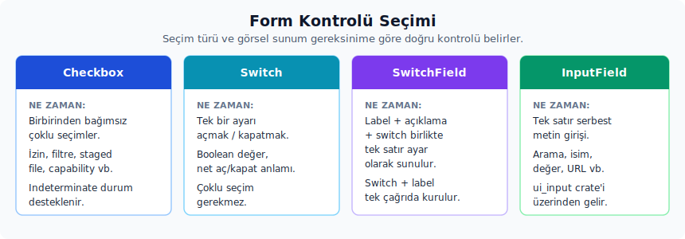

# 6. Form ve Seçim Bileşenleri

## Sürüm Analiz Raporu

- [x] Doğrulanan form yüzeyi: `ErasedEditor::select_all` tip silmeli editor köprüsü.
- [x] Kaynak doğrulama dosyası: `crates/ui_input/src/ui_input.rs`.

Bu bölüm, kullanıcıdan değer alan veya var olan bir ayarı değiştiren kontrolleri anlatır. Butonlardan hemen sonra gelmesinin sebebi de budur: checkbox, switch ve giriş alanları aynı olay modeline yaslanır; ayrıca önceki bölümlerdeki label ve icon düzenini tekrar kullanır. Butonların çalışma şekli anlaşıldıysa, bu kontrollerin arkasındaki fikir tanıdık gelecektir.

Hangi durumda hangi kontrolün tercih edileceği konusunda aşağıdaki ayrım faydalı olacaktır:



- Birbirinden bağımsız çoklu bir seçim varsa `Checkbox` doğru araçtır.
- Bir ayarı aç/kapat anlamı taşıyan tek bir değer için `Switch` daha uygundur.
- Etiket (label), açıklama ve switch'in bir arada düzenli bir ayar satırı olarak sunulması hedefleniyorsa, `SwitchField` ile bu üçlü tek seferde kurulabilir.
- Tek satırlık metin girişleri için ise `ui_input::InputField` kullanılır.

Tüm bu kontroller için ortak kural şudur: görsel durum (view state) ile uygulama mantığı (business logic) birbirinden ayrı tutulmalıdır. `Checkbox`, `Switch` veya giriş alanları yalnızca o anki durumu ekrana yansıtır. Gerçek değerin view durumunda ya da uygulama modelinde saklanması ve ilgili olay işleyicisi (listener) içinde güncellenmesi gerekir. Bu ayrımın net tutulması, arayüzün tutarlılığını korur.

## Checkbox

Kaynak:

- Tanım: `ui` crate'i
- Export: `ui::Checkbox`, `ui::checkbox`, `ui::ToggleStyle`
- Prelude: Hayır; `Checkbox` ve `ToggleStyle` için ayrıca import edilir.
- `ToggleState` ise prelude içinde otomatik gelir.
- Preview: `impl Component for Checkbox`.

Ne zaman kullanılır:

- Bir listedeki her seçimin diğerlerinden bağımsız olduğu senaryolarda.
- Çoklu izinler, filtreler, staged dosyalar ve özellik etkinleştirme gibi birden fazla değerin aynı anda seçilebileceği yapılarda.
- Üst seviye bir seçimin alt öğelerinin yalnızca bir kısmının seçili olduğu durumlarda `ToggleState::Indeterminate` ile bu kısmi durumu göstermek amacıyla.

Ne zaman kullanılmaz:

- Yalnızca tek bir ayarı açıp kapatma durumu söz konusuysa `Switch` veya `SwitchField` çok daha açık bir niyet ifade eder.
- Karşılıklı olarak birbirini dışlayan seçenekler için `ToggleButtonGroup`, `DropdownMenu` veya bir menü girdisi daha doğru yüzeydir.
- Sadece pasif bir durum göstergesi gerekiyorsa `Indicator`, `Icon` veya `.visualization_only(true)` ile etkileşime kapatılmış bir checkbox tercih edilmesi mümkündür.

Temel API:

- Constructor: `Checkbox::new(id, checked: ToggleState)`.
- Yardımcı constructor: `checkbox(id, toggle_state)`.
- Builder'lar: `.disabled(bool)`, `.placeholder(bool)`, `.fill()`, `.visualization_only(bool)`, `.style(ToggleStyle)`, `.elevation(...)`, `.tooltip(...)`, `.label(...)`, `.label_size(...)`, `.label_color(...)`, `.on_click(...)`, `.on_click_ext(...)`.
- Statik boyut yardımcısı: `Checkbox::container_size() -> Pixels` checkbox kutusu için kullanılan sabit yan boyut ölçüsünü (`px(20.0)`) döndürür; bir checkbox satırının diğer kontrollerle hizalanması gerektiğinde başvurulacak referans değerdir.
- `ToggleStyle`: `Ghost`, `ElevationBased(ElevationIndex)`, `Custom(Hsla)`.

Davranış:

- `RenderOnce` implement eder.
- `ToggleState::Selected` için `IconName::Check`, `ToggleState::Indeterminate` için ise `IconName::Dash` ikonunu çizer.
- Tıklama (click) işleyicisine mevcut durum değil, `self.toggle_state.inverse()` değeri iletilir. Yani işleyici her zaman hedef durumu alır.
- `ToggleState::Indeterminate.inverse()` çağrısının sonucu `Selected` olur; bu sayede kısmi seçimden tıklama ile tam seçime geçilir.
- `disabled(true)` click işleyicisini devre dışı bırakır.
- `visualization_only(true)` pointer ve hover davranışını kaldırır, ama bileşeni disabled gibi soluk renkle göstermez; yalnızca dokunulamaz hale getirir.

Örnek:

```rust
use ui::prelude::*;
use ui::{Checkbox, Tooltip};

struct GizlilikAyarlari {
    tanilama_paylasimi: bool,
}

impl Render for GizlilikAyarlari {
    fn render(&mut self, _window: &mut Window, cx: &mut Context<Self>) -> impl IntoElement {
        Checkbox::new("tanilama-paylasimi-checkbox", self.tanilama_paylasimi.into())
            .label("Anonim tanılamaları paylaş")
            .label_size(LabelSize::Small)
            .tooltip(Tooltip::text("Çökme ve performans tanılamalarını iyileştirmeye yardımcı olur."))
            .on_click(cx.listener(|this: &mut GizlilikAyarlari, durum: &ToggleState, _, cx| {
                this.tanilama_paylasimi = durum.selected();
                cx.notify();
            }))
    }
}
```

Zed içinden kullanım örnekleri:

- `workspace` crate'i: güvenlik modalındaki seçim.
- `git_ui` crate'i: staged/unstaged seçimleri.
- `language_tools` crate'i: context menu içinde yer alan özel checkbox girdisi.

Dikkat edilmesi gereken noktalar:

- İşleyiciye gelen durum mevcut durum değil, hedef durumdur. `self.tanilama_paylasimi = durum.selected()` örneğinde olduğu gibi doğrudan uygulama durumuna yazılması gerekir; değerin tekrar tersine çevrilmesine gerek yoktur.
- Kısmi bir seçim gösteriliyorsa `ToggleState::from_any_and_all(...)` yardımcısının kullanılması, manuel `if` koşullarına kıyasla çok daha okunabilir kod üretilmesini sağlar.
- `Checkbox` bir etiketle (label) tanımlandığında, tıklama alanı tüm satıra yayılır. Satır içinde iç içe başka bir tıklanabilir öğe konumlandırılacaksa, olay yayılımının (event propagation) bilinçli olarak yönetilmesi gerekir.

## Switch

Kaynak:

- Tanım: `ui` crate'i
- Export: `ui::Switch`, `ui::switch`, `ui::SwitchColor`, `ui::SwitchLabelPosition`.
- Prelude: Hayır; ayrıca import edilir.
- Preview: `impl Component for Switch`.

Ne zaman kullanılır:

- Bir ayarı anında açıp kapatan, iki karşıt duruma sahip kontrollerde.
- Bir etiket gerektiği fakat uzun bir açıklama metnine ihtiyaç duyulmadığı durumlarda.
- Araç çubukları veya kompakt ayar satırlarında.

Ne zaman kullanılmaz:

- Açıklama, tooltip ve switch'ten oluşan düzenli bir ayar satırı kuruluyorsa `SwitchField` daha bütünlüklü bir yüzey sağlar.
- Çoklu bir seçimde checkbox semantiği daha doğrudan bir anlatım sunar.

Temel API:

- Constructor: `Switch::new(id, state: ToggleState)`.
- Yardımcı constructor: `switch(id, toggle_state)`.
- Builder'lar: `.color(SwitchColor)`, `.disabled(bool)`, `.on_click(...)`, `.label(...)`, `.label_position(...)`, `.label_size(...)`, `.aria_label(...)`, `.full_width(bool)`, `.key_binding(...)`, `.tab_index(...)`.
- `SwitchColor`: `Accent`, `Custom(Hsla)`.
- `SwitchLabelPosition`: `Start`, `End`.

Davranış:

- `ToggleState::Selected` açık, diğer durumlar kapalı görünür.
- Erişilebilirlik ağacında `Role::Switch` rolüyle çizilir; `.aria_label(...)` verilmezse görünür label erişilebilirlik adı olarak kullanılır.
- Toggle durumu `aria_toggled(Toggled::True | Toggled::False)` üzerinden bildirilir.
- Click işleyicisine `self.toggle_state.inverse()` gönderilir; yani Switch da Checkbox gibi hedef durumu taşır.
- `.label(...)` tek başına etiketi çizdirmez; etiketin görünmesi için ayrıca `.label_position(Some(SwitchLabelPosition::Start))` veya `.label_position(Some(SwitchLabelPosition::End))` tanımlanması gerekir.
- `.aria_label(...)` verilmezse erişilebilirlik etiketi görünür label'dan türetilir. Label çizdirilmeyen kompakt switch'lerde ekran okuyucu etiketi için bu builder'ın açıkça verilmesi gerekir.
- `full_width(true)` switch ile etiketi satır içinde iki uca doğru yayar; böylece etiket solda, switch ise sağda konumlanır.
- `tab_index(...)` tanımlandığında switch, odaklandığında görünür bir kenarlık (border) kazanır ve klavye odak sırasına dahil olur.

Örnek:

```rust
use ui::prelude::*;
use ui::{Switch, SwitchLabelPosition};

struct EditorAyarlari {
    otomatik_kaydet: bool,
}

impl Render for EditorAyarlari {
    fn render(&mut self, _window: &mut Window, cx: &mut Context<Self>) -> impl IntoElement {
        Switch::new("otomatik-kaydet-switch", self.otomatik_kaydet.into())
            .label("Otomatik kaydet")
            .label_position(Some(SwitchLabelPosition::Start))
            .full_width(true)
            .on_click(cx.listener(|this: &mut EditorAyarlari, durum: &ToggleState, _, cx| {
                this.otomatik_kaydet = durum.selected();
                cx.notify();
            }))
    }
}
```

Dikkat edilmesi gereken noktalar:

- `ToggleState::Indeterminate`, switch için ayrı bir görsel ara durum üretmez. Switch açık/kapalı mantığı taşıdığı için bu durumun çoğunlukla `bool` üzerinden yönetilmesi daha tutarlı bir tercihtir.
- Devre dışı (disabled) bir switch, dış kapsayıcıda işaretçi imlecini (pointer cursor) tamamen kaldırmaz. Kullanıcıya neden devre dışı olduğunun açıklanması gerekiyorsa satıra kısa bir açıklama veya tooltip eklenmesi bu boşluğu kapatır.

## SwitchField

Kaynak:

- Tanım: `ui` crate'i
- Export: `ui::SwitchField`
- Prelude: Hayır; ayrıca import edilir.
- Preview: `impl Component for SwitchField`.

Ne zaman kullanılır:

- Ayar ekranlarında etiket, açıklama ve switch'in bir arada gösterileceği durumlarda.
- Tek satırda sağda switch, solda ise metinsel bağlam sunulmak istenen seçeneklerde.
- Bir tooltip ikonuyla ek bilgi verilmesi gereken ayarlarda.

Ne zaman kullanılmaz:

- Yalnızca kompakt bir switch gerekiyorsa `Switch` daha sade bir yüzey sunar.
- Birden fazla bağımsız seçim varsa bir `Checkbox` listesi daha doğru bir ifade biçimidir.

Temel API:

- Constructor: `SwitchField::new(id, label, description, toggle_state, on_click)`.
- `label`: `Option<impl Into<SharedString>>`.
- `description`: `Option<SharedString>`.
- `toggle_state`: `impl Into<ToggleState>`.
- Builder'lar: `.description(...)`, `.disabled(bool)`, `.color(...)`, `.tooltip(...)`, `.tab_index(...)`.

Davranış:

- `RenderOnce` implement eder.
- Kapsayıcının kendisine yapılan tıklama ile iç switch'e yapılan tıklama, aynı `on_click` geri çağrısını hedef durum parametresiyle tetikler; yani satırın herhangi bir yerine tıklamak da switch'i açık/kapalı durumuna getirir.
- Tooltip tanımlandığında etiketinin yanında bir `IconButton::new("tooltip_button", IconName::Info)` render edilir. Bu ikonun tıklama işleyicisi boştur; yani bilgi ikonuna tıklamak switch'i toggle etmez, yalnızca bilgi göstergesi olarak durur.
- Açıklama belirtildiğinde, bu içerik muted renkli bir `Label` olarak çizilir.

Örnek:

```rust
use ui::prelude::*;
use ui::{SwitchField, Tooltip};

struct AsistanAyarlari {
    hizli_mod: bool,
}

impl Render for AsistanAyarlari {
    fn render(&mut self, _window: &mut Window, cx: &mut Context<Self>) -> impl IntoElement {
        SwitchField::new(
            "hizli-mod",
            Some("Hızlı mod"),
            Some("Rutin düzenlemelerde daha hızlı yanıtları tercih et.".into()),
            self.hizli_mod,
            cx.listener(|this: &mut AsistanAyarlari, durum: &ToggleState, _, cx| {
                this.hizli_mod = durum.selected();
                cx.notify();
            }),
        )
        .tooltip(Tooltip::text("Bu ayar yeni isteklerin davranışını değiştirir."))
    }
}
```

Dikkat edilmesi gereken noktalar:

- `SwitchField` ile tam genişlikte bir ayar satırı düzeni kurulur. Araç çubukları (toolbar) gibi dar alanlarda bu fazla yer kaplayacağı için doğrudan `Switch` tercih edilmesi gerekir.
- Tooltip yalnızca label varlığında görsel bir ikonla birlikte çizilir; label'sız kullanımda tooltip görünmez.

Ortak `ToggleState` modeli:

| Varyant | Anlam | Not |
| :-- | :-- | :-- |
| `Unselected` | Kapalı / seçili değil | `Default` varyantıdır; `false.into()` bu değeri üretir |
| `Indeterminate` | Kısmi seçim | Checkbox'ta görsel ara durum üretir; switch'te ayrı bir ara durum beklenmez |
| `Selected` | Açık / seçili | `true.into()` bu değeri üretir |

Yardımcılar: `.inverse()`, `ToggleState::from_any_and_all(any_checked, all_checked)`, `.selected()`, `From<bool>`. Bunlardan `from_any_and_all`, alt seçimlerin sayısına göre üst durumun otomatik olarak doğru varyanta oturmasını sağlar.

Form ve toggle yardımcı API'leri:

| API | Rol |
| :-- | :-- |
| `checkbox` | `Checkbox::new(id, toggle_state)` için kısa constructor'dır; görsel ve işleyici davranışı `Checkbox` ile aynıdır. |
| `switch` | `Switch::new(id, toggle_state)` için kısa constructor'dır; iki durumlu ayar satırlarında sade kullanım sağlar. |
| `ToggleStyle` | Checkbox ve benzeri toggle yüzeylerinde `Ghost`, `ElevationBased(ElevationIndex)` veya `Custom(Hsla)` görünümünü seçer. |
| `SwitchColor` | Switch açık durum rengini `Accent` ya da `Custom(Hsla)` olarak belirler. |
| `SwitchLabelPosition` | Switch label'ının `Start` veya `End` tarafında duracağını seçer. |

## InputField (`ui_input`)

Metin giriş alanlarında, içerideki ikonların, metinlerin ve yardımcı butonların dikey eksende kusursuz hizalanması son derece önemlidir. Aşağıdaki şemada, bir `InputField` bileşeninin anatomisi, öğelerin dikeyde ortalanması (`items-center`) ve bileşen odaklandığında (focus) sınır çerçevesinin görsel değişimi gösterilmektedir:



Kaynak:

- Tanım: `ui_input` crate'i
- Export: `ui_input::InputField`
- Prelude: Hayır; `use ui_input::InputField;` ayrıca eklenir.
- Preview: `impl Component for InputField`.

Ne zaman kullanılır:

- Arama girişi, API anahtarı alanı, ayar formu veya modal içi tek satırlık metin girişleri gerektiğinde.
- Editör tabanlı metin girişi davranışı, odak handle'ı, placeholder, maskelenmiş (masked) değer ve tab sırası desteği istendiğinde.

Ne zaman kullanılmaz:

- Yalnızca statik bir metin göstermek için `Label` daha basit ve doğru bir çözümdür.
- Çok satırlı veya editor özellikleri gerektiren bir içerik için doğrudan editor tabanlı bir view kullanılması gerekir.
- `ui` crate'i içine bağımlılık eklerken `ui_input`'un doğrudan çözüm olarak düşünülmesine gerek yoktur; `ui_input`, editor crate'ine bağımlı olduğu için ayrı bir crate olarak tutulur ve bu mimari sınırın korunması hedeflenir.

Temel API:

- Constructor: `InputField::new(window, cx, placeholder_text)`.
- Builder'lar: `.start_icon(IconName)`, `.label(...)`, `.label_size(...)`, `.label_min_width(...)`, `.tab_index(...)`, `.tab_stop(bool)`, `.masked(bool)`.
- Okuma/yazma: `.text(cx)`, `.is_empty(cx)`, `.clear(window, cx)`, `.set_text(text, window, cx)`, `.set_masked(masked, window, cx)`, `.set_error(error, cx)`.
- Düşük seviye erişim: `.editor() -> &Arc<dyn ErasedEditor>`.

Davranış:

- `Render` ve `Focusable` implement eder; genellikle `Entity<InputField>` olarak view durumunda saklanır.
- `InputField::new(...)` çağrısı, `ui_input::ERASED_EDITOR_FACTORY` fabrika fonksiyonunun önceden kurulmuş olmasını bekler. Zed çalışma zamanı bu fabrikayı editör entegrasyonu aşamasında hazırlar.
- `.masked(true)` tanımlandığında sağda bir göster/gizle `IconButton`'ı render edilir ve bu butona tıklamak maskeleme durumunu günceller.
- Odak görünümü, editör odak handle'ına bağlı kenarlık (border) rengiyle çizilir.
- `.set_error(Some(mesaj), cx)` bir doğrulama hatası ayarlar: alanın kenarlığını kırmızıya çevirir ve mesajı alanın altında küçük bir ipucu metni olarak gösterir. `.set_error(None, cx)` hatayı temizler.

Örnek:

```rust
use gpui::Entity;
use ui::prelude::*;
use ui_input::InputField;

fn api_anahtari_girdisi_olustur(window: &mut Window, cx: &mut App) -> Entity<InputField> {
    cx.new(|cx| {
        InputField::new(window, cx, "sk-...")
            .label("API anahtarı")
            .start_icon(IconName::LockOutlined)
            .masked(true)
    })
}
```

Zed içinden kullanım örnekleri:

- `language_models` crate'i: API key girişi.
- `keymap_editor` crate'i: context ve action girişleri.
- `component_preview` crate'i: bileşen arama filtre girişi.

Düşük seviye yüzey — `ErasedEditor`:

`.editor()` çağrısıyla elde edilen `Arc<dyn ErasedEditor>` değeri, gerçek bir `Editor` view'una tip silmeli bir kapı sunar. Bu sayede `ui_input` crate'i `editor` crate'ine doğrudan bağımlı olmaz; editor entegrasyonu uygulama başlangıcında bir kez `ERASED_EDITOR_FACTORY: OnceLock<...>` üzerinden kurulur:

`ui_input` köprü API'leri:

| API | Rol |
| :-- | :-- |
| `ERASED_EDITOR_FACTORY` | Çalışma zamanında gerçek adaptörünü sağlayan global fabrikadır; `InputField::new(...)` çağrısını bu fabrika kurulduktan sonra yapılması gerekir. |
| `ErasedEditor` | Metin okuma/yazma, tümünü seçme, salt okunur/çok satırlı kip, odak handle'ı, maskeleme, olay aboneliği ve render işlemlerini crate sınırını bozmadan sunan trait yüzeyidir. |
| `ErasedEditorEvent` | `BufferEdited` ve `Blurred` olaylarıyla giriş değişimi ve odak kaybını bildirir. |

```rust
// Uygulama başlangıcında (genellikle editor crate'inin init fonksiyonu kurar):
if ui_input::ERASED_EDITOR_FACTORY
    .set(|window, cx| Arc::new(OrnekEditorAdaptoru::new(window, cx)))
    .is_err()
{
    // Fabrika daha önce kurulduysa mevcut adaptör kullanılır.
}
```

`ErasedEditor` trait metodları:

| Metot | İmza | Kullanım |
| :-- | :-- | :-- |
| `text(cx)` | `(&self, &App) -> String` | Anlık metin değeri |
| `set_text(text, window, cx)` | `(&self, &str, &mut Window, &mut App)` | Programatik değer atama |
| `clear(window, cx)` | `(&self, &mut Window, &mut App)` | Tüm metni siler |
| `select_all(window, cx)` | `(&self, &mut Window, &mut App)` | Metnin tamamını seçer |
| `set_placeholder_text(text, window, cx)` | `(&self, &str, &mut Window, &mut App)` | Placeholder güncelleme |
| `move_selection_to_end(window, cx)` | `(&self, &mut Window, &mut App)` | İmleci sona taşır |
| `select_all(window, cx)` | `(&self, &mut Window, &mut App)` | Girişteki tüm metni seçer; sonraki yazım mevcut değeri tek adımda değiştirir |
| `set_read_only(read_only, cx)` | `(&self, bool, &mut App)` | Düzenleyiciyi salt okunur veya düzenlenebilir hale getirir |
| `set_multiline(max_lines, window, cx)` | `(&self, Option<usize>, &mut Window, &mut App)` | Tek satırlı girdiyi çok satırlı düzenlemeye açar; `max_lines` üst sınırı opsiyoneldir |
| `set_masked(masked, window, cx)` | `(&self, bool, &mut Window, &mut App)` | Şifre maskesi aç/kapat |
| `set_read_only(read_only, cx)` | `(&self, bool, &mut App)` | Editor girdisini salt okunur veya düzenlenebilir duruma alır |
| `set_multiline(max_lines, window, cx)` | `(&self, Option<usize>, &mut Window, &mut App)` | Tek satır davranışından çok satırlı girişe geçer; `Some(n)` en fazla satır sayısını sınırlar |
| `focus_handle(cx)` | `(&self, &App) -> FocusHandle` | Odak yönetimi |
| `subscribe(callback, window, cx)` | callback: `FnMut(ErasedEditorEvent, &mut Window, &mut App)`, `Subscription` döner | Olay aboneliği; geri çağrıya olay değeri iletilir |
| `render(window, cx)` | `(&self, &mut Window, &App) -> AnyElement` | Manuel render (InputField içeride çağırır) |
| `as_any()` | `&dyn Any` | Downcast için |

`ErasedEditorEvent` enum'u iki varyant taşır:

| Varyant | Ne zaman yayınlanır |
| :-- | :-- |
| `BufferEdited` | Kullanıcı metni değiştirdiğinde (yazma, silme, paste vb.) |
| `Blurred` | Editor odağı kaybettiğinde |

Değer değişimini takip etmek için view içinde bir abonelik (subscription) kurulması ve bunun saklanması gerekir. Abonelik drop edildiğinde geri çağrı sonlanır ve olay akışı durur:

```rust
use gpui::{Entity, Subscription};
use ui::prelude::*;
use ui_input::{ErasedEditorEvent, InputField};

struct ApiAnahtariFormu {
    giris: Entity<InputField>,
    gecerli_deger: String,
    _giris_aboneligi: Subscription,
}

impl ApiAnahtariFormu {
    fn new(window: &mut Window, cx: &mut Context<Self>) -> Self {
        let giris = cx.new(|cx| {
            InputField::new(window, cx, "sk-...")
                .label("API anahtarı")
                .masked(true)
        });

        let zayif = cx.weak_entity();
        let abonelik = giris.read(cx).editor().subscribe(
            Box::new(move |olay, window, cx| {
                zayif
                    .update(cx, |this: &mut Self, cx| match olay {
                        ErasedEditorEvent::BufferEdited => {
                            this.gecerli_deger = this.giris.read(cx).text(cx);
                            cx.notify();
                        }
                        ErasedEditorEvent::Blurred => {
                            // Doğrulama veya kaydetme
                        }
                    })
                    .ok();
            }),
            window,
            cx,
        );

        Self { giris, gecerli_deger: String::new(), _giris_aboneligi: abonelik }
    }
}
```

> **`_giris_aboneligi` saklamak şart.** `Subscription` drop edilirse geri çağrı ölür ve `BufferEdited` olayı tetiklenmez. Aynı kural diğer GPUI abonelikleri için de geçerlidir.

Dikkat edilmesi gereken noktalar:

- `InputField` `RenderOnce` değildir; her render adımında yeniden oluşturulmak yerine bir `Entity` olarak saklanır ve görünüm durumunda tutulur.
- Metin değerini `field.read(cx).text(cx)` yardımıyla okunması gerekir. Değer değişimine tepki vermek istendiğinde yukarıdaki `subscribe` örneğinin izlenmesi ve dönen `Subscription` değerinin view alanında saklanması gerekir.
- `ERASED_EDITOR_FACTORY` kurulmadan `InputField::new` çağrılırsa panik oluşur; bu yüzden editör crate'inin init fonksiyonunun uygulama başlangıcında çalıştığından emin olunması gerekir.
- `label_min_width(...)` adında "label" ifadesi geçse de, kaynak kodda bu metot input kapsayıcısının `min_width` değerini ayarlar.

## Ayar UI Form Yüzeyi

Kaynak:

- Sayfa verisi: `settings_ui` crate'i.
- Renderer kayıtları: `settings_ui` crate'i.
- Tool izin kurulumu: `settings_ui` crate'i.

Davranış:

- `settings_ui::init_renderers(...)`, `settings::CompletionMenuItemKind` için açılır seçim renderer'ı kaydeder. Bu ayar `editor.completion_menu_item_kind` JSON yolu ile görünür; değerler `off` ve `symbol` olur.
- Ayar sayfasındaki `"Completion Menu Item Kind"` (tamamlama menüsü öğe türü) satırı, tamamlama menüsünde LSP öğe türü bilgisinin gösterilip gösterilmeyeceğini seçtirir. `off` öğe türünü gizler, `symbol` sözdizimi teması ile renklendirilmiş tek harfli rozet gösterir.
- `"Version Control / Git Hunks"` bölümünde `"Show Stage/Restore Buttons"` satırı `git.show_stage_restore_buttons` boolean ayarını yazar. Bu değer `false` olduğunda diff hunk üstündeki `"Stage"`, `"Unstage"` ve `"Restore"` butonları render edilmez.
- `"Araç İzinleri"` kurulum listesindeki `skill` aracı kaynakta `"Loading agent skill instructions"` açıklamasıyla gelir. Regex açıklaması skill adına değil, skill'in `SKILL.md` dosyasının mutlak yoluna göre eşleştiğini belirtir.
- Ayar araması boş sorguda filtre uygulamaz; sayfa listesi resetlenir. Sorgu birden fazla kelime içerdiğinde, kelimelerin tamamının ilgili belgedeki bir kelime önekiyle eşleşmesi beklenir.

Dikkat edilmesi gereken noktalar:

- Yeni enum tabanlı ayarlar için yalnızca `SettingItem` eklemek yetersizdir; ilgili enum'u `init_renderers(...)` içinde uygun renderer'a kaydedilmesi gerekir.
- Git hunk butonları ayarlarla kapatıldığında, aynı eylemi ikinci bir butonla arayüze tekrar eklememeye dikkat edilmesi gerekir. Kullanıcıya sunulan arayüz, ayar değerini doğrudan yansıtmalıdır.

## Form Kompozisyon Örnekleri

Bir ayar satırı için tipik kompozisyon, `SwitchField`'ın etrafına bir `v_flex` koymak ve gerekirse birden fazla benzer satırı bu kolonda alt alta dizmektir. Aşağıdaki örnek tek bir satır gösterir:

```rust
use ui::prelude::*;
use ui::{SwitchField, Tooltip};

struct AyarlarGorunumu {
    kaydederken_bicimlendir: bool,
}

impl Render for AyarlarGorunumu {
    fn render(&mut self, _window: &mut Window, cx: &mut Context<Self>) -> impl IntoElement {
        v_flex()
            .gap_3()
            .child(
                SwitchField::new(
                    "kaydederken-bicimlendir",
                    Some("Kaydederken biçimlendir"),
                    Some("Dosyayı yazmadan önce etkin biçimlendiriciyi çalıştır.".into()),
                    self.kaydederken_bicimlendir,
                    cx.listener(|this: &mut AyarlarGorunumu, durum: &ToggleState, _, cx| {
                        this.kaydederken_bicimlendir = durum.selected();
                        cx.notify();
                    }),
                )
                .tooltip(Tooltip::text("Bu dil için yapılandırılan biçimlendiriciyi kullanır.")),
            )
    }
}
```
