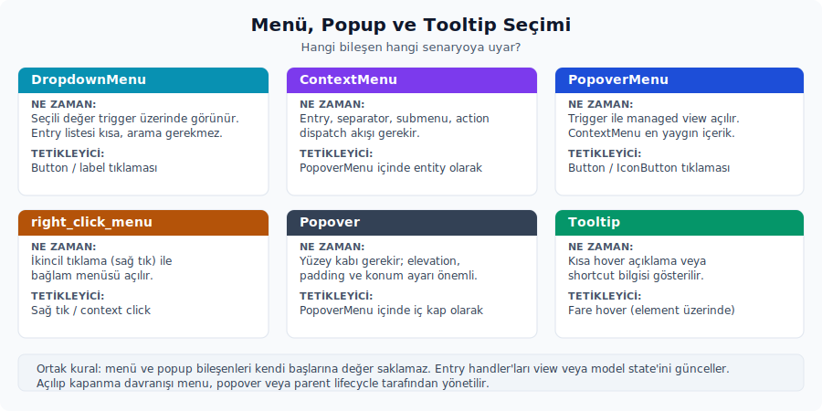

# 7. Menü, Popup ve Tooltip

**Trait impl kapsamı.** Bu konu altında ayrı başlık açmayı gerektirmeyen trait implementasyon üyeleri:

| Konu | Üyeler | Not |
|---|---|---|
| `Tooltip` | `description`, `scope` | Trait impl üzerinden gelen public üyelerdir; çoğu dönüşüm, render, builder veya standart trait köprüsüdür. |


**Public API kapsamı.** Bu başlık altında ayrı alt başlık açmayı gerektirmeyen public alt yüzeyler:

| Konu | Grup | API | Not |
|---|---|---|---|
| `Tooltip` | Metotlar | `for_action`, `for_action_in`, `for_action_title`, `for_action_title_in`, `key_binding`, `meta`, `new_element`, `simple`, `text`, `with_meta`, `with_meta_in` | Builder, sorgu veya runtime çağrıları; ayrıntı bu konu anlatımındaki kullanım bağlamıyla okunur. |


Bu bölüm, bir kontrolün arkasından geçici bir yüzey açan bileşenleri anlatır. Önceki bölümde form ve seçim state'inin nasıl tutulduğunu gördük; burada odak biraz değişir. Artık asıl soru "değer nerede duruyor" değil, "seçenekler nasıl sunulacak, menü içeriği hangi modelle kurulacak, popup nasıl açılıp kapanacak" sorusudur.

Hangi durumda hangisini seçeceğini kabaca şöyle ayırabilirsin:



- Seçili değeri trigger üzerinde gösteren bir seçenek listesi için `DropdownMenu` uygundur.
- Menü içeriğinde entry, separator, submenu ve action dispatch akışı gerekiyorsa `ContextMenu` doğru yapı taşıdır.
- Buton veya ikon trigger ile açılan ve içinde managed bir view bulunan menüler için `PopoverMenu` tercih edersin.
- İkincil tıklamayla (sağ tık) açılan bir bağlam menüsü için `right_click_menu` vardır.
- Bir popup yüzeyinin içeriğini doğru elevation ve padding ile çizmek için `Popover` kullanırsın.
- Kısa hover açıklamaları veya shortcut bilgilerini göstermek için ise `Tooltip` doğru yüzeydir.

Menü ve popup bileşenleri kendi başlarına değer saklamaz. Entry handler'ları view veya model state'ini günceller. Popup'ın açılıp kapanma davranışı ise ilgili menu, popover veya parent lifecycle tarafından yönetilir.

## DropdownMenu

**Trait impl kapsamı.** Bu konu altında ayrı başlık açmayı gerektirmeyen trait implementasyon üyeleri:

| Konu | Üyeler | Not |
|---|---|---|
| `DropdownMenu` | `description`, `name`, `scope` | Trait impl üzerinden gelen public üyelerdir; çoğu dönüşüm, render, builder veya standart trait köprüsüdür. |


**Public API kapsamı.** Bu başlık altında ayrı alt başlık açmayı gerektirmeyen public alt yüzeyler:

| Konu | Grup | API | Not |
|---|---|---|---|
| `DropdownMenu` | Metotlar | `attach`, `full_width`, `new`, `new_with_element`, `no_chevron`, `offset`, `style`, `tab_index`, `trigger_icon`, `trigger_size`, `trigger_tooltip` | Builder, sorgu veya runtime çağrıları; ayrıntı bu konu anlatımındaki kullanım bağlamıyla okunur. |


Kaynak:

- Tanım: `../zed/crates/ui/src/components/dropdown_menu.rs`
- Export: `ui::DropdownMenu`, `ui::DropdownStyle`.
- Prelude: Hayır; ayrıca import edersin.
- Preview: `impl Component for DropdownMenu`.

Ne zaman kullanırsın:

- Seçili değerin trigger üzerinde göründüğü option picker'larda.
- Liste kısa olduğu, ancak inline bir segment kontrol için fazla uzun kaldığı durumlarda.
- Menü içeriğinin doğal olarak bir `ContextMenu` ile ifade edilebildiği yapılarda.

Ne zaman kullanmazsın:

- Trigger üzerindeki değer değişmiyor ve yalnızca bir eylem listesi açılıyorsa, doğrudan `PopoverMenu<ContextMenu>` kullanmak niyeti daha açık gösterir.
- Geniş bir arama veya filtre deneyimi gerekiyorsa, bir picker bileşeni veya özel managed view tercih edersin.

Temel API:

- Constructor: `DropdownMenu::new(id, label, menu: Entity<ContextMenu>)`.
- Özel label için: `DropdownMenu::new_with_element(id, label: AnyElement, menu)`.
- Builder'lar: `.style(DropdownStyle)`, `.trigger_size(ButtonSize)`, `.trigger_tooltip(...)`, `.trigger_icon(IconName)`, `.full_width(bool)`, `.handle(PopoverMenuHandle<ContextMenu>)`, `.attach(Anchor)`, `.offset(Point<Pixels>)`, `.tab_index(...)`, `.no_chevron()`, `.disabled(bool)`.
- `DropdownStyle`: `Solid`, `Outlined`, `Subtle`, `Ghost`.

Davranış:

- Text label durumunda arka planda bir `Button` üretilir; özel element label durumunda ise bir `ButtonLike` kullanılır.
- İçeride `PopoverMenu::new((id, "popover"))` kurulur.
- Varsayılan trigger ikonu `IconName::ChevronUpDown`'dur; `.no_chevron()` bu oku kaldırır.
- Varsayılan attach noktası `Anchor::BottomRight`'tır.
- `DropdownStyle` değerleri button stiline şu şekilde eşlenir: `Solid -> Filled`, `Outlined -> Outlined`, `Subtle -> Subtle`, `Ghost -> Transparent`.

Örnek:

```rust
use ui::prelude::*;
use ui::{ContextMenu, DropdownMenu, DropdownStyle, Tooltip};

fn render_sort_dropdown(window: &mut Window, cx: &mut App) -> impl IntoElement {
    let menu = ContextMenu::build(window, cx, |menu, _, _| {
        menu.header("Sort by")
            .toggleable_entry("Name", true, IconPosition::Start, None, |_, _| {})
            .toggleable_entry("Updated", false, IconPosition::Start, None, |_, _| {})
            .separator()
            .entry("Reverse order", None, |_, _| {})
    });

    DropdownMenu::new("sort-dropdown", "Name", menu)
        .style(DropdownStyle::Outlined)
        .trigger_tooltip(Tooltip::text("Change sort order"))
}
```

Zed içinden kullanım örnekleri:

- `../zed/crates/acp_tools/src/acp_tools.rs`: connection selector.
- Component preview: `../zed/crates/ui/src/components/dropdown_menu.rs`.

Dikkat edeceğin noktalar:

- `DropdownMenu`, menu entity'sini dışarıdan alır. Menü entry handler'ları seçili değeri view veya model state'ine yazmalıdır; dropdown bu yazımı kendi başına yapmaz.
- Dinamik bir label kullanıyorsan mevcut seçili değeri her render'da label'a yansıtman gerekir. Aksi halde kontrol seçim değişse bile eski etiketi göstermeye devam eder.
- `full_width(true)`, trigger ile popover'ın genişliklerini birlikte etkiler. Dar formlarda parent width'i de bilinçli ayarlaman gerekir.

## ContextMenu

**Trait impl kapsamı.** Bu konu altında ayrı başlık açmayı gerektirmeyen trait implementasyon üyeleri:

| Konu | Üyeler | Not |
|---|---|---|
| `ContextMenu` | `focus_handle` | Trait impl üzerinden gelen public üyelerdir; çoğu dönüşüm, render, builder veya standart trait köprüsüdür. |


**Public API kapsamı.** Bu başlık altında ayrı alt başlık açmayı gerektirmeyen public alt yüzeyler:

| Konu | Grup | API | Not |
|---|---|---|---|
| `ContextMenu` | Metotlar 1 | `action_checked`, `action_checked_with_disabled`, `action_disabled_when`, `build`, `build_persistent`, `cancel`, `clear_selected`, `confirm`, `custom_entry`, `custom_entry_with_docs`, `custom_row`, `end_slot`, `end_slot_action`, `entry` | Builder, sorgu veya runtime çağrıları; ayrıntı bu konu anlatımındaki kullanım bağlamıyla okunur. |
| `ContextMenu` | Metotlar 2 | `entry_with_end_slot`, `entry_with_end_slot_on_hover`, `extend`, `fixed_width`, `header`, `header_with_link`, `item`, `keep_open_on_confirm`, `key_context`, `label`, `link`, `link_with_handler`, `new`, `on_action_dispatch` | Builder, sorgu veya runtime çağrıları; ayrıntı bu konu anlatımındaki kullanım bağlamıyla okunur. |
| `ContextMenu` | Metotlar 3 | `on_blur_subscription`, `push_item`, `rebuild`, `secondary_confirm`, `select_first`, `select_last`, `select_next`, `select_previous`, `select_submenu_child`, `select_submenu_parent`, `selectable`, `selected_index`, `separator`, `submenu` | Builder, sorgu veya runtime çağrıları; ayrıntı bu konu anlatımındaki kullanım bağlamıyla okunur. |
| `ContextMenu` | Metotlar 4 | `submenu_with_colored_icon`, `submenu_with_icon`, `toggleable_entry`, `trigger_end_slot_handler` | Builder, sorgu veya runtime çağrıları; ayrıntı bu konu anlatımındaki kullanım bağlamıyla okunur. |


Kaynak:

- Tanım: `../zed/crates/ui/src/components/context_menu.rs`
- Export: `ui::ContextMenu`, `ui::ContextMenuEntry`, `ui::ContextMenuItem`.
- Prelude: Hayır; ayrıca import edersin.
- Preview: Doğrudan bir component preview yok; `DropdownMenu` ve gerçek kullanım örnekleri üzerinden görünür hale gelir.

Ne zaman kullanırsın:

- Entry, separator, header, checked state, submenu ve action dispatch içeren bir menü içeriği oluşturmak için.
- Aynı menü modelinin hem dropdown veya popover içinde hem de sağ tık menüsünde tekrar tekrar kullanılması gereken durumlarda.

Ne zaman kullanmazsın:

- Bir menü değil de serbest layout içeren bir popup yüzeyi gerekiyorsa, bir `Popover` içinde özel bir managed view kurmak daha doğru bir çözümdür.
- Yalnızca tek bir buton eylemi söz konusuysa bir menü kurmaya gerek kalmaz; sade bir buton yeterlidir.

Temel API:

- `ContextMenu::build(window, cx, |menu, window, cx| menu...)`.
- `ContextMenu::build_persistent(window, cx, builder)` ise menünün açık kalmasını ve yeniden kurulabilmesini gerektiren durumlarda kullanırsın.
- Yapı builder'ları: `.context(focus_handle)`, `.header(...)`, `.header_with_link(...)`, `.separator()`, `.label(...)`, `.entry(...)`, `.toggleable_entry(...)`, `.custom_row(...)`, `.custom_entry(...)`, `.custom_entry_with_docs(...)`, `.entry_with_end_slot(...)`, `.entry_with_end_slot_on_hover(...)`, `.selectable(bool)`, `.action(...)`, `.action_checked(...)`, `.action_checked_with_disabled(...)`, `.action_disabled_when(...)`, `.link(...)`, `.link_with_handler(...)`, `.submenu(...)`, `.submenu_with_icon(...)`, `.submenu_with_colored_icon(...)`, `.keep_open_on_confirm(bool)`, `.fixed_width(...)`, `.key_context(...)`, `.end_slot_action(action)`.
- Dinamik item ekleme builder'ları: `.item(item: impl Into<ContextMenuItem>)` ve `.extend(items: impl IntoIterator<Item = impl Into<ContextMenuItem>>)` zincirleme kullanım için uygundur. `&mut self` üzerinden mutate eden `.push_item(item)` ise builder zinciri dışında menü içeriğini değiştirmek için (örneğin bir event callback içinde) tercih edersin.
- Programatik mutator'lar: `.rebuild(window, cx)`, `build_persistent` ile açık kalan menünün içeriğini yeniden kurar; `.trigger_end_slot_handler( window, cx)` ise aktif entry'nin end slot handler'ını programatik olarak çalıştırır.
- Action ve navigation metodları: `.selected_index()`, `.confirm(...)`, `.secondary_confirm(...)`, `.cancel(...)`, `.end_slot(...)`, `.clear_selected()`, `.select_first(...)`, `.select_last(...)`, `.select_next(...)`, `.select_previous(...)`, `.select_submenu_child(...)`, `.select_submenu_parent(...)`, `.on_action_dispatch(...)`, `.on_blur_subscription(...)`. Bunlar büyük çoğunlukla keymap ve action bağlarından çağrılır; normal menü inşası sırasında builder zincirine karıştırılmaz.
- Entry builder'ları: `ContextMenuEntry::new(label).icon(...).toggleable(...)` zincirine ek olarak `.custom_icon_path(...)`, `.custom_icon_svg(...)`, `.icon_position(...)`, `.icon_size(...)`, `.icon_color(...)`, `.action(...)`, `.handler(...)`, `.secondary_handler(...)`, `.disabled(...)`, `.documentation_aside(...)` builder'ları vardır.
- `ContextMenuItem` variant'ları: `Separator`, `Header`, `HeaderWithLink`, `Label`, `Entry`, `CustomEntry`, `Submenu`. Builder zincirleri çoğu durumda bu enum'u doğrudan üretir; dinamik bir menü listesi saklanacaksa `ContextMenuItem` koleksiyonu da bu amaçla kullanabilirsin.

Davranış:

- `Focusable` ve `EventEmitter<DismissEvent>` implement eder.
- Blur olduğunda menü kapanır; bir submenu açıkken focus orada korunuyorsa kapanma ertelenir.
- Confirm edilen entry handler'ı çalıştırılır. `keep_open_on_confirm(false)` durumunda menü `DismissEvent` yayınlar ve kapanır.
- `build_persistent(...)` ile kurulan menü hem rebuild edilebilir hem de açık kalabilir.
- Klavye gezintisi için menünün kendi action'ları ve `key_context` değeri birlikte kullanılır.

Örnek:

```rust
use ui::prelude::*;
use ui::ContextMenu;

fn build_file_menu(window: &mut Window, cx: &mut App) -> Entity<ContextMenu> {
    ContextMenu::build(window, cx, |menu, _, _| {
        menu.header("File")
            .entry("Rename", None, |_, _| {})
            .entry("Duplicate", None, |_, _| {})
            .separator()
            .toggleable_entry("Show hidden files", true, IconPosition::Start, None, |_, _| {})
            .submenu("Open with", |menu, _, _| {
                menu.entry("Text editor", None, |_, _| {})
                    .entry("System app", None, |_, _| {})
            })
    })
}
```

Zed içinden kullanım örnekleri:

- `../zed/crates/language_tools/src/lsp_log_view.rs`: LSP server ve log view menüleri.
- `../zed/crates/git_ui/src/git_panel.rs`: git panel eylem menüleri.
- `../zed/crates/keymap_editor/src/keymap_editor.rs`: filtre ve keybinding menüleri.

Özel entry'ler oluşturulduğunda menü çok daha esnek bir hâle gelir:

```rust
use gpui::IntoElement;
use ui::prelude::*;
use ui::{Chip, ContextMenu};

fn build_menu_with_custom_entries(window: &mut Window, cx: &mut App) -> Entity<ContextMenu> {
    ContextMenu::build(window, cx, |menu, _, _| {
        menu.header_with_link(
            "Available Tools",
            "Docs",
            "https://zed.dev/docs/tools",
        )
        .custom_entry(
            |_, _| {
                h_flex()
                    .gap_2()
                    .child(Label::new("Run Selection"))
                    .child(Chip::new("beta").label_color(Color::Accent))
                    .into_any_element()
            },
            |_, _| {},
        )
        .custom_entry_with_docs(
            |_, _| Label::new("Open Workspace Settings").into_any_element(),
            |_, _| {},
            Some(ui::DocumentationAside::new(
                ui::DocumentationSide::Right,
                std::rc::Rc::new(|_| {
                    Label::new("Workspace ayarları sadece bu proje için geçerlidir.")
                        .into_any_element()
                }),
            )),
        )
    })
}
```

`header_with_link(...)` üç parametre alır: başlık, link etiketi ve link URL'i. Render edilen header'a tıklandığında URL `cx.open_url(...)` ile açılır.

`custom_entry(render_fn, handler)`, entry görselini sıfırdan üretmeye olanak verir. Varsayılan olarak selectable'dır; entry'nin yalnızca görsel kalması istendiğinde (yani bir label gibi davranması beklendiğinde) `.selectable(false)` ile bu davranış kapatılır.

`custom_entry_with_docs(render_fn, handler, documentation_aside)` ise entry'nin yanında bir popover olarak küçük bir dokümantasyon paneli açılmasını sağlar. Aynı davranış normal `entry(...)` zinciri üzerine `.documentation_aside(side, render)` çağrılarak da ekleyebilirsin.

Action ve link yardımcıları:

- `action(label, action)`: önce varsa context focus handle'ına focus verir, ardından action dispatch eder.
- `action_checked(...)` ve `action_checked_with_disabled(...)`: action entry'ye sırasıyla checked ve disabled durumlarını ekler.
- `action_disabled_when(disabled, label, action)`: disabled koşulunu entry oluştururken doğrudan bağlar.
- `link(...)` ve `link_with_handler(...)`: entry'nin sonuna bir `ArrowUpRight` ikonu ekler, custom handler'ı çalıştırır ve ardından action dispatch eder.

End slot ve ikon yardımcıları:

- `entry_with_end_slot(...)`, entry'nin sağ tarafına ikinci bir icon action koyar; yani satırın sağında ek bir kontrol yer alır.
- `entry_with_end_slot_on_hover(...)`, aynı action'ı yalnızca satırın üzerine gelindiğinde gösterir.
- `custom_icon_path(...)` ve `custom_icon_svg(...)`, `ContextMenuEntry` üzerinde normal bir `IconName` yerine harici bir ikon kaynağı seçer.
- `submenu_with_colored_icon(...)`, submenu label'ına semantik `Color` ile renklendirilmiş bir ikon ekler.

Dikkat edeceğin noktalar:

- `ContextMenu` tek başına bir açma mekanizması değildir. Kullanıcının görmesi için `DropdownMenu`, `PopoverMenu` veya `right_click_menu` yüzeylerinden biriyle sunulur.
- Handler içinde view state'i değiştirilecekse, ilgili entity üzerinden `window.handler_for(...)`, `cx.listener(...)` veya local model update pattern'i kullanırsın. Yukarıdaki örneklerde yer alan boş handler'lar yalnızca API şeklini gösterir.
- Submenu builder'ları yeni bir `ContextMenu` değerini döndürmelidir. Parent menüdeki state'i kopyalayarak kullanman gerektiğinde, closure capture'larını sade tutman okunabilirliği artırır.

## PopoverMenu

**Trait impl kapsamı.** Bu konu altında ayrı başlık açmayı gerektirmeyen trait implementasyon üyeleri:

| Konu | Üyeler | Not |
|---|---|---|
| `PopoverMenu` | `id`, `paint`, `prepaint`, `request_layout`, `source_location` | Trait impl üzerinden gelen public üyelerdir; çoğu dönüşüm, render, builder veya standart trait köprüsüdür. |


**Public API kapsamı.** Bu başlık altında ayrı alt başlık açmayı gerektirmeyen public alt yüzeyler:

| Konu | Grup | API | Not |
|---|---|---|---|
| `PopoverMenu` | Metotlar | `anchor`, `attach`, `full_width`, `offset`, `on_open`, `trigger`, `trigger_with_tooltip`, `with_handle` | Builder, sorgu veya runtime çağrıları; ayrıntı bu konu anlatımındaki kullanım bağlamıyla okunur. |


Kaynak:

- Tanım: `../zed/crates/ui/src/components/popover_menu.rs`
- Export: `ui::PopoverMenu`, `ui::PopoverMenuHandle`, `ui::PopoverTrigger`.
- Prelude: Hayır; ayrıca import edersin.
- Preview: Doğrudan bir component preview yok; gerçek kullanım menu trigger bileşenleri üzerinden ortaya çıkar.

Ne zaman kullanırsın:

- Bir `Button`, `IconButton` veya `ButtonLike` trigger'ına bağlı bir popover veya menü açmak gerektiğinde.
- Menü açıldığında trigger'ın seçili görünmesi ve menü kapanınca eski focus'un geri gelmesi istendiğinde.
- `ContextMenu` dışında başka bir `ManagedView`'in popup olarak sunulacağı durumlarda.

Ne zaman kullanmazsın:

- Sağ tık davranışı gerekiyorsa `right_click_menu` daha doğru bir yüzeydir.
- Yalnızca hazır dropdown semantikleri gerekiyorsa `DropdownMenu` daha tutarlı bir tercihtir.

Temel API:

- Constructor: `PopoverMenu::new(id)`.
- Builder'lar: `.full_width(bool)`, `.menu(...)`, `.with_handle(...)`, `.trigger(...)`, `.trigger_with_tooltip(...)`, `.anchor(Anchor)`, `.attach(Anchor)`, `.offset(Point<Pixels>)`, `.on_open(...)`.
- `PopoverMenuHandle` yöntemleri: `.show(...)`, `.hide(...)`, `.toggle(...)`, `.is_deployed()`, `.is_focused(...)`, `.refresh_menu(...)`.

Davranış:

- Trigger tipi `PopoverTrigger` trait'ini sağlamalıdır. Bu trait, `IntoElement + Clickable + Toggleable + 'static` kombinasyonunun public bir alias yüzeyidir.
- Trigger tıklandığında menu builder bir `Option<Entity<M>>` döndürür; `None` döndürdüğünde menü açılmaz.
- Açılan menu `DismissEvent` yayınladığında handle temizlenir ve mümkünse önceki focus geri verilir.
- Menü deferred olarak render edildiği için focus iki `on_next_frame` sonrasında uygulanır.
- Trigger'a menü açıkken tekrar tıklanırsa menü dismiss edilir ve event propagation durdurulur.
- `PopoverMenuElementState` açık menü entity'sini ve trigger bounds bilgisini frame'ler arasında saklar. `PopoverMenuFrameState` ise layout pass sırasında trigger element'i, menu element'i ve layout id bilgisini taşır. Bunlar public görünse de normal uygulama kodunun kuracağı değerler değildir; `PopoverMenu` element lifecycle'ı tarafından yönetilir.

**Menu ve popover yardımcı API kapsamı.** Aşağıdaki tipler bu bölümdeki davranışların küçük taşıyıcılarıdır:

| API | Alt özellikler | Kullanım notu |
|-----|----------------|---------------|
| `DropdownStyle` | `Solid`, `Outlined`, `Subtle`, `Ghost` | Dropdown trigger'ının button stiline eşlenen görsel yüzeyidir. |
| `ContextMenuItem` | `Separator`, `Header`, `HeaderWithLink`, `Label`, `Entry`, `CustomEntry`, `Submenu` | Menü içeriğini saklamak veya dinamik üretmek için kullanılan enum modelidir. |
| `ContextMenuEntry` | `toggle`, `label`, `icon`, `custom_icon_path`, `custom_icon_svg`, `handler`, `secondary_handler`, `action`, `disabled`, `documentation_aside`, end-slot alanları | Tek bir seçilebilir menü satırının bütün görsel ve davranış bilgisini taşır. |
| `DocumentationSide` | `Left`, `Right` | Entry dokümantasyon panelinin menünün hangi yanında açılacağını belirtir. |
| `DocumentationAside` | `side`, `render`; `new` | Entry veya picker yanında küçük açıklama paneli render etmek için kullanılır. |
| `PopoverMenuHandle` | `show`, `hide`, `toggle`, `is_deployed`, `is_focused`, `refresh_menu` | Popover'ın dışarıdan açma/kapama ve içerik yenileme tutamacıdır. |
| `PopoverTrigger` | `IntoElement + Clickable + Toggleable + 'static` | Popover tetikleyicisi olabilecek button-like elementleri sınırlayan trait alias yüzeyidir. |
| `PopoverMenuElementState` | `menu`, `child_bounds` | Açık menü entity'si ve trigger bounds bilgisini element state olarak saklar. |
| `PopoverMenuFrameState` | `child_layout_id`, `child_element`, `menu_element`, `menu_handle` | Popover layout pass sırasında kullanılan geçici frame state'tir. |
| `MenuHandleElementState` | `menu`, `position` | Sağ tık menüsünün açık entity'sini ve cursor/handle pozisyonunu saklar. |
| `RequestLayoutState` | `child_layout_id`, `child_element`, `menu_element` | `right_click_menu` elementinin layout sırasında child ve menu elementlerini taşıdığı state'tir. |
| `PrepaintState` | `hitbox`, `child_bounds` | `right_click_menu` için prepaint aşamasında hitbox ve child bounds bilgisini taşır. |
| `POPOVER_Y_PADDING` | `Pixels` sabiti | `Popover` yüzeyinin dikey iç boşluğuna eklenen sabit değerdir. |
| `tooltip_container` | `AppContext` tabanlı helper | Tooltip ve link preview yüzeylerine ortak elevation, font, padding ve metin rengini uygular. |
| `LinkPreview` | `new(url, cx)` | Uzun URL'i 100 karakterlik satırlara bölüp 500 karakterde kırpan tooltip view'idir. |
| `popover_menu` | `picker` crate alt modülü | `PickerPopoverMenu` sarmalayıcısını sağlar; picker'ı `PopoverMenu` içinde trigger arkasına yerleştirir. |

Örnek:

```rust
use ui::prelude::*;
use ui::{ContextMenu, PopoverMenu, Tooltip};

fn render_more_actions(window: &mut Window, cx: &mut App) -> impl IntoElement {
    let menu = ContextMenu::build(window, cx, |menu, _, _| {
        menu.entry("Rename", None, |_, _| {})
            .entry("Delete", None, |_, _| {})
    });

    PopoverMenu::new("more-actions")
        .menu(move |_, _| Some(menu.clone()))
        .trigger_with_tooltip(
            IconButton::new("more-actions-trigger", IconName::Menu)
                .icon_size(IconSize::Small)
                .style(ButtonStyle::Subtle),
            Tooltip::text("More actions"),
        )
}
```

Zed içinden kullanım örnekleri:

- `../zed/crates/language_tools/src/lsp_log_view.rs`: LSP seçim menüleri.
- `../zed/crates/agent_ui/src/conversation_view/thread_view.rs`: add context ve permission menüleri.
- `../zed/crates/git_ui/src/git_panel.rs`: repository, branch ve commit kontrolleri.

Dikkat edeceğin noktalar:

- `trigger_with_tooltip(...)`, menü açıkken trigger tooltip'inin görünmesini engeller. İkon-only trigger'larda bu davranış genellikle istenir.
- `with_handle(...)` kullanıldığında handle'ın view state'inde saklaman gerekir. Her render'da yeni bir handle oluşturulması, dışarıdan show ve hide kontrolünü işlemez hâle getirir.
- `anchor` menünün hangi köşesinin konumlanacağını belirler; `attach` ise trigger'ın hangi köşesine bağlanacağını ifade eder. İkisi birlikte popup'ın görsel olarak nereye yapışacağını yönetir.

## RightClickMenu

**Trait impl kapsamı.** Bu konu altında ayrı başlık açmayı gerektirmeyen trait implementasyon üyeleri:

| Konu | Üyeler | Not |
|---|---|---|
| `RightClickMenu` | `id`, `paint`, `prepaint`, `PrepaintState`, `request_layout`, `RequestLayoutState`, `source_location` | Trait impl üzerinden gelen public üyelerdir; çoğu dönüşüm, render, builder veya standart trait köprüsüdür. |


**Public API kapsamı.** Bu başlık altında ayrı alt başlık açmayı gerektirmeyen public alt yüzeyler:

| Konu | Grup | API | Not |
|---|---|---|---|
| `RightClickMenu` | Metotlar | `anchor`, `attach`, `menu`, `trigger` | Builder, sorgu veya runtime çağrıları; ayrıntı bu konu anlatımındaki kullanım bağlamıyla okunur. |


Kaynak:

- Tanım: `../zed/crates/ui/src/components/right_click_menu.rs`
- Export: `ui::RightClickMenu`, `ui::right_click_menu`.
- Prelude: Hayır; ayrıca import edersin.
- Preview: Doğrudan bir component preview yok.

Ne zaman kullanırsın:

- Dosya, tab, satır, liste item'i veya editor yüzeyi üzerinde sağ tıkla bir bağlam menüsünün açılması gerektiğinde.
- Menü konumunun varsayılan olarak cursor pozisyonuna göre belirlenmesi istendiğinde.

Ne zaman kullanmazsın:

- Sol tık trigger'lı bir menü için `PopoverMenu` daha uygundur.
- Seçili değeri gösteren bir kontrol için `DropdownMenu` daha doğru bir yüzeydir.

Temel API:

- Constructor: `right_click_menu::<M>(id)`.
- Builder'lar: `.trigger(|is_menu_active, window, cx| element)`, `.menu(|window, cx| Entity<M>)`, `.anchor(Anchor)`, `.attach(Anchor)`.

Davranış:

- Sağ tık (`MouseButton::Right`) hovered hitbox üzerinde bubble phase'de yakalandığında menü açılır.
- Açılma sırasında `prevent_default()` ve `stop_propagation()` çağrılır; böylece browser veya parent kontrolü olayı işlemez.
- `attach(...)` verildiğinde, menünün pozisyonu cursor yerine trigger bounds'unun belirtilen köşesine bağlanır.
- Açılan managed view `DismissEvent` yayınladığında menu state'i temizlenir ve mümkünse focus önceki elemana döner.
- `MenuHandleElementState`, açık menüyü ve son cursor/attach pozisyonunu saklar. `RequestLayoutState` child layout id'sini ve menü element'ini, `PrepaintState` ise child hitbox'ı ile bounds bilgisini taşır. Bu state tiplerini elle üretmezsin; sağ tık menüsünün cursor konumu, focus dönüşü ve deferred menu render'ı için element sistemi kullanır.

Örnek:

```rust
use ui::prelude::*;
use ui::{ContextMenu, right_click_menu};

fn render_project_row(window: &mut Window, cx: &mut App) -> impl IntoElement {
    let menu = ContextMenu::build(window, cx, |menu, _, _| {
        menu.entry("Open", None, |_, _| {})
            .entry("Reveal in Finder", None, |_, _| {})
            .separator()
            .entry("Remove from Recent Projects", None, |_, _| {})
    });

    right_click_menu("recent-project-row-menu")
        .trigger(|menu_open, _window, cx| {
            h_flex()
                .w_full()
                .px_2()
                .py_1()
                .when(menu_open, |this| this.bg(cx.theme().colors().element_hover))
                .child(Label::new("zed").truncate())
        })
        .menu(move |_, _| menu.clone())
}
```

Zed içinden kullanım örnekleri:

- `../zed/crates/platform_title_bar/src/system_window_tabs.rs`: sistem tab sağ tık menüsü.
- `../zed/crates/editor/src/element.rs`: buffer header bağlam menüsü.
- `../zed/crates/agent_ui/src/conversation_view/thread_view.rs`: context entry sağ tık menüleri.

Dikkat edeceğin noktalar:

- Trigger closure'ı içinde gelen `is_menu_active` değeri, hover veya selected görseli için kullanabilirsin. Bu değerin bir uygulama state'i olarak saklanmaması beklenir; çünkü zaten menü tarafından yönetilir.
- Sağ tık menüsünün içinde sol tıkla çalışan custom kontroller varsa, event propagation davranışını ve menu dismiss akışını test etmen gerekir; yoksa sürpriz davranışlar ortaya çıkabilir.

## Popover

**Trait impl kapsamı.** Bu konu altında ayrı başlık açmayı gerektirmeyen trait implementasyon üyeleri:

| Konu | Üyeler | Not |
|---|---|---|
| `Popover` | `extend` | Trait impl üzerinden gelen public üyelerdir; çoğu dönüşüm, render, builder veya standart trait köprüsüdür. |


**Public API kapsamı.** Bu başlık altında ayrı alt başlık açmayı gerektirmeyen public alt yüzeyler:

| Konu | Grup | API | Not |
|---|---|---|---|
| `Popover` | Metotlar | `aside`, `new` | Builder, sorgu veya runtime çağrıları; ayrıntı bu konu anlatımındaki kullanım bağlamıyla okunur. |


Kaynak:

- Tanım: `../zed/crates/ui/src/components/popover.rs`
- Export: `ui::Popover`, `ui::POPOVER_Y_PADDING`.
- Prelude: Hayır; ayrıca import edersin.
- Preview: Doğrudan bir component preview yok.

Ne zaman kullanırsın:

- Açılmış bir popup yüzeyinin içeriğini standart elevation ve padding ile çizmek için.
- Menü olmayan ama trigger'a bağlı küçük bir seçenek paneli, açıklama paneli veya yardımcı içerik gerektiğinde.
- Ana içeriğe ek olarak yan tarafta bir açıklama alanı gerekiyorsa `.aside(...)` builder'ı bu rolü üstlenir.

Ne zaman kullanmazsın:

- Popup'ı açmak veya kapatmak için tek başına yeterli değildir; bu iş için `PopoverMenu` veya başka managed view akışı gerekir.
- Sıradan bir context menu entry listesi için `ContextMenu` daha doğru bir yüzeydir.

Temel API:

- Constructor: `Popover::new()`.
- Builder: `.aside(...)`.
- `ParentElement` implement eder; `.child(...)` ve `.children(...)` kabul eder.

Davranış:

- İçeriği `v_flex().elevation_2(cx)` yüzeyi üzerinde çizer.
- `aside(...)` verdiğinde, ikinci bir elevation yüzeyi olarak yan içerik eklenir.
- `POPOVER_Y_PADDING` sabiti dikey padding hesabı sırasında kullanılır.

Örnek:

```rust
use ui::prelude::*;
use ui::Popover;

fn render_filter_popover() -> impl IntoElement {
    Popover::new()
        .child(
            v_flex()
                .gap_2()
                .px_2()
                .child(Label::new("Filter").size(LabelSize::Small).color(Color::Muted))
                .child(Label::new("Open files only")),
        )
        .aside(
            Label::new("Applies to the current workspace.")
                .size(LabelSize::Small)
                .color(Color::Muted),
        )
}
```

Dikkat edeceğin noktalar:

- `Popover` konumlandırma yapmaz. Bir `ManagedView` render'ı içinde kullanılıp, o view'in `PopoverMenu` ile açılması gerekir.
- İçerik genişliği child layout aracılığıyla kontrol edilir; `Popover` kendi başına sabit bir width vermez.

## Tooltip

Kaynak:

- Tanım: `../zed/crates/ui/src/components/tooltip.rs`
- Export: `ui::Tooltip`, `ui::LinkPreview`, `ui::tooltip_container`.
- Prelude: Hayır; ayrıca import edersin.
- Preview: `impl Component for Tooltip`.

Ne zaman kullanırsın:

- İkon-only bir butonun anlamını anlatmak için.
- Disabled veya karmaşık kontrollerde kısa bir neden veya metaveri göstermek için.
- Bir action'a bağlı klavye kısayolunun tooltip içinde gösterilmesi istendiğinde.

Ne zaman kullanmazsın:

- Kullanıcı akışının anlaşılması tooltip'in görünmesine bağlı kalıyorsa, bunun yerine görünür bir label veya açıklama metni eklemen gerekir.
- Uzun dokümantasyon, form hatası veya kalıcı bilgi için tooltip yerine görünür bir içerik kullanılır; aksi halde önemli bilgi gizli kalır.

Temel API:

- Basit builder closure: `Tooltip::text(title)`.
- Immediate view: `Tooltip::simple(title, cx)`.
- Action shortcut'lı builder: `Tooltip::for_action_title(title, action)`, `Tooltip::for_action_title_in(title, action, focus_handle)`.
- Action shortcut'lı immediate view: `Tooltip::for_action(...)`, `Tooltip::for_action_in(...)`.
- Meta açıklamalı view: `Tooltip::with_meta(...)`, `Tooltip::with_meta_in(...)`.
- Özel element: `Tooltip::element(...)`, `Tooltip::new_element(...)`.
- Instance builder'ları: `Tooltip::new(title).meta(...).key_binding(...)`.
- `tooltip_container(cx, |div, cx| ...)`: Zed tooltip yüzeyini özel içerikle yeniden kullanmak için kullanılan düşük seviyeli helper.
- `LinkPreview::new(url: &str, cx: &mut App) -> AnyView`: uzun bir URL'i 100 karakterlik parçalara bölüp, en fazla 500 karakterde keserek tooltip yüzeyi içinde yumuşak satır kırma ile render eden basit bir URL önizleme view'ı. Dönen `AnyView`, doğrudan `Tooltip::new_element(...)` veya entity tabanlı tooltip slot'larına geçirilebilir. Bu yapı tek başına bir network çağrısı, başlık çekme veya metadata akışı içermez; bunlar parent tooltip view'ında elle uygularsın.

Davranış:

- Tooltip yüzeyi `tooltip_container(...)` içinde `elevation_2`, UI fontu ve tema text rengiyle çizilir.
- `key_binding` varsa title satırının sağında gösterilir.
- `meta` verildiğinde, ikinci satırda küçük ve muted bir label olarak çizilir.
- `Tooltip::text(...)` gibi yöntemler, `.tooltip(...)` builder imzasına doğrudan uyan bir closure döndürür.
- GPUI görünür tooltip'i kaynak elementin hover durumuna bağlı tutar. Mouse kaynak hitbox'tan ayrıldığında normal tooltip kapanır; `hoverable_tooltip` kullanıldığında tooltip yüzeyi de hover alanı sayılır ve kullanıcı mouse'u tooltip içine taşıdığı sürece yüzey açık kalabilir.

Örnek:

```rust
use ui::prelude::*;
use ui::Tooltip;

fn render_refresh_button() -> impl IntoElement {
    IconButton::new("refresh-models", IconName::RotateCw)
        .icon_size(IconSize::Small)
        .tooltip(Tooltip::text("Refresh models"))
}
```

Zed içinden kullanım örnekleri:

- `../zed/crates/keymap_editor/src/keymap_editor.rs`: action ve binding tooltip'leri.
- `../zed/crates/git_ui/src/git_panel.rs`: git panel buton tooltip'leri.
- `../zed/crates/agent_ui/src/conversation_view/thread_view.rs`: action, disabled state ve meta açıklamaları.

Dikkat edeceğin noktalar:

- `.tooltip(Tooltip::text(...))` en yaygın ve en sade kullanım biçimidir.
- Shortcut göstermek isteniyorsa action tabanlı helper'lar tercih edilir; kısayolu elle string olarak yazmak, keymap değişikliklerinde tutarsızlığa yol açar.
- Tooltip metninin uzun bir açıklama değil; kısa bir eylem adı veya kısa bir neden olarak tutulması okunabilirliği korur.

## Menü ve Popup Kompozisyon Örnekleri

Bir toolbar üzerindeki ek eylem menüsü, `PopoverMenu` ve `ContextMenu`'nün en doğal kombinasyonudur. Bir ikon trigger'a tooltip eklenir, menü içeriği ise dışarıda `ContextMenu::build` ile hazırlanır:

```rust
use ui::prelude::*;
use ui::{ContextMenu, PopoverMenu, Tooltip};

fn render_toolbar_menu(window: &mut Window, cx: &mut App) -> impl IntoElement {
    let menu = ContextMenu::build(window, cx, |menu, _, _| {
        menu.entry("New File", None, |_, _| {})
            .entry("New Folder", None, |_, _| {})
            .separator()
            .entry("Open Settings", None, |_, _| {})
    });

    PopoverMenu::new("toolbar-create-menu")
        .menu(move |_, _| Some(menu.clone()))
        .trigger_with_tooltip(
            IconButton::new("toolbar-create-menu-trigger", IconName::Plus)
                .icon_size(IconSize::Small),
            Tooltip::text("Create"),
        )
}
```

<!-- phase14-api-anchor:start -->

## Ek public API kapsamı

Bu bölüm, mevcut HEAD API snapshot envanterinde bu dosyanın konu alanına bağlı olan ama ayrı anlatım başlığı gerektirmeyen public field, variant ve member yüzeylerini toplar. Adlar kaynak API sembolleriyle aynı tutulur; ayrıntı için ilgili ana konu anlatımı esas alınır.

### `ContextMenuItem`

| Grup | API | Not |
|---|---|---|
| Varyantlar | `CustomEntry`, `Entry`, `Header`, `HeaderWithLink`, `Label`, `Separator`, `Submenu` | Public enum sözleşmesinin varyantlarıdır; davranış bu dosyadaki konu bağlamıyla okunur. |
| Metotlar | `custom_entry` | Builder, sorgu veya runtime çağrılarıdır; ayrıntı bu dosyadaki kullanım bağlamıyla okunur. |

### `ContextMenuEntry`

| Grup | API | Not |
|---|---|---|
| Metotlar 1 | `action`, `custom_icon_path`, `custom_icon_svg`, `disabled`, `documentation_aside`, `handler`, `icon`, `icon_color` | Builder, sorgu veya runtime çağrılarıdır; ayrıntı bu dosyadaki kullanım bağlamıyla okunur. |
| Metotlar 2 | `icon_position`, `icon_size`, `new`, `secondary_handler`, `toggle`, `toggleable` | Builder, sorgu veya runtime çağrılarıdır; ayrıntı bu dosyadaki kullanım bağlamıyla okunur. |

### `DocumentationSide`

| Grup | API | Not |
|---|---|---|
| Varyantlar | `Left`, `Right` | Public enum sözleşmesinin varyantlarıdır; davranış bu dosyadaki konu bağlamıyla okunur. |

### `DocumentationAside`

| Grup | API | Not |
|---|---|---|
| Metotlar | `new` | Builder, sorgu veya runtime çağrılarıdır; ayrıntı bu dosyadaki kullanım bağlamıyla okunur. |
| Alanlar | `render`, `side` | Public veri sözleşmesinin alanlarıdır; kullanım bağlamı bu dosyadaki ana açıklamayla okunur. |

### `DropdownStyle`

| Grup | API | Not |
|---|---|---|
| Varyantlar | `Ghost`, `Outlined`, `Solid`, `Subtle` | Public enum sözleşmesinin varyantlarıdır; davranış bu dosyadaki konu bağlamıyla okunur. |

### `PopoverMenuHandle`

| Grup | API | Not |
|---|---|---|
| Metotlar | `hide`, `is_deployed`, `is_focused`, `refresh_menu`, `show`, `toggle` | Builder, sorgu veya runtime çağrılarıdır; ayrıntı bu dosyadaki kullanım bağlamıyla okunur. |

### `LinkPreview`

| Grup | API | Not |
|---|---|---|
| Metotlar | `new` | Builder, sorgu veya runtime çağrılarıdır; ayrıntı bu dosyadaki kullanım bağlamıyla okunur. |

<!-- phase14-api-anchor:end -->
