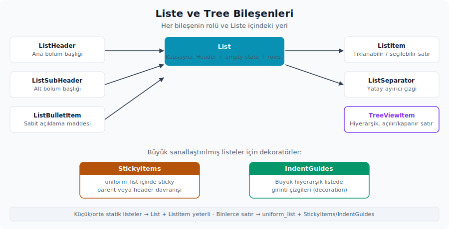

# 9. Liste ve Tree Bileşenleri

Liste bileşenleri, aynı görsel ritme sahip satırları, bölüm başlıklarını, boş durumları ve hiyerarşik navigation yüzeylerini kurmak için kullanırsın. Küçük ve orta ölçekli statik listelerde `List` ile `ListItem` çoğu zaman yeterlidir. Satır sayısı büyüdüğünde ve satır yüksekliği aynı kaldığında ise GPUI tarafının `uniform_list(...)` çağrısı daha doğru olur. `StickyItems` ve `IndentGuides` gibi yardımcılar da bu düşük seviyeli listenin üstüne decoration olarak eklersin.

Hangi durumda hangisini seçeceğini şu ayrımla düşünebilirsin:



- Basit bir container, header ve empty state için `List` uygundur.
- Tıklanabilir veya seçilebilir bir satır için `ListItem` doğru yüzeydir.
- Listenin ana bölüm başlığı için `ListHeader` kullanırsın.
- Daha küçük bir alt bölüm başlığı için `ListSubHeader` vardır.
- Liste içinde yatay bir ayırıcı için `ListSeparator` tercih edersin.
- Sabit açıklama maddeleri için yardımcı olarak `ListBulletItem` kullanırsın.
- Hiyerarşik ve açılıp kapanabilen bir navigation satırı için `TreeViewItem` doğrudan bu rol için tasarlanmıştır.
- Büyük bir `uniform_list` içinde sticky parent veya header davranışı istendiğinde `StickyItems` devreye girer.
- Büyük hiyerarşik bir listede girinti çizgileri için `IndentGuides` kullanırsın.

## List

Kaynak:

- Tanım: `ui` crate'i
- Export: `ui::List`, `ui::EmptyMessage`.
- Prelude: Hayır; ayrıca import edersin.
- Preview: `impl Component for List`.

Ne zaman kullanırsın:

- Az sayıda satır içeren ayar, onboarding, modal, provider veya kart içi listelerde.
- Header ve empty state'in aynı bileşen üzerinden yönetilmesinin istendiği yerlerde.
- Çocuk satırların yükseklikleri birbirinden farklı olabilir ve lazy rendering gerekmediği durumlarda.

Ne zaman kullanmazsın:

- Binlerce satır içeren, scroll edilen ve başarım açısından kritik bir liste için GPUI'nin `uniform_list(...)` çağrısı tercih edersin.
- Tablo semantiği, column resize veya header/row sözleşmesi gerektiren yapılar için doğrudan tablo veya veri bileşenleri daha doğru bir araçtır.

Temel API:

- Constructor: `List::new()`.
- Builder'lar: `.empty_message(...)`, `.header(...)`, `.toggle(...)`.
- `ParentElement` implement eder; `.child(...)` ve `.children(...)` kabul eder.
- `EmptyMessage`: `Text(SharedString)` veya `Element(AnyElement)`.

Boş durum tipi:

| API | Rol |
| :-- | :-- |
| `EmptyMessage` | Liste boşken gösterilecek içeriği seçer; `Text` düz label, `Element` ise özel `AnyElement` empty state'i sağlar. |

Davranış:

- `RenderOnce` implement eder.
- Container, tam genişlikte bir `v_flex()` ve dikey padding ile çizilir.
- Hiç çocuk yoksa varsayılan olarak `"No items"` mesajı muted bir `Label` şeklinde gösterilir.
- `.empty_message(...)` ya bir string ya da özel bir `AnyElement` alabilir.
- `.toggle(Some(false))` verilir ve children boşsa, empty state de gizlenir.
- `.header(...)` verildiğinde header, children'dan önce render edilir.

Örnek:

```rust
use ui::prelude::*;
use ui::{List, ListHeader, ListItem};

fn render_provider_list() -> impl IntoElement {
    List::new()
        .header(ListHeader::new("Providers"))
        .empty_message("No providers configured")
        .child(
            ListItem::new("provider-openai")
                .start_slot(Icon::new(IconName::Check).size(IconSize::Small))
                .child(Label::new("OpenAI")),
        )
        .child(
            ListItem::new("provider-anthropic")
                .start_slot(Icon::new(IconName::Check).size(IconSize::Small))
                .child(Label::new("Anthropic")),
        )
}
```

Zed içinden kullanım örnekleri:

- `edit_prediction_ui` crate'i: custom empty state'li completion listesi.
- `language_models` crate'i: provider ayar listeleri.
- `toolchain_selector` crate'i: toolchain seçenekleri.

Dikkat edeceğin noktalar:

- `List`, kendi başına bir scroll davranışı sağlamaz. Scroll gerekiyorsa parent container'a `overflow_y_scroll()` eklenir; büyük listelerde ise `uniform_list(...)` tercih edersin.
- Dinamik çocuklar üretilirken sabit bir `ElementId` kullanılması önerilir. Yalnızca index üzerinden id vermek, yeniden sıralanan listelerde state ve focus takibini zorlaştırır.
- Empty state custom bir element ise `.into_any_element()` çağrısıyla iletilmesi gerekir.

## ListItem

Kaynak:

- Tanım: `ui` crate'i
- Export: `ui::ListItem`, `ui::ListItemSpacing`.
- Prelude: Hayır; ayrıca import edersin.
- Preview: `impl Component for ListItem`.

Ne zaman kullanırsın:

- Liste satırı, picker sonucu, ayar satırı, navigation row veya action row için.
- Satırda bir start icon veya avatar, bir ana içerik ve bir sağ slot bir arada gerektiğinde.
- Selected, disabled, hover, focus veya disclosure state'inin satır düzeyinde gösterilmesi istendiğinde.

Ne zaman kullanmazsın:

- Yalnızca metin gösterilecekse `Label` veya `ListBulletItem` çok daha sade bir çözüm sunar.
- Çok büyük listelerde `ListItem` satır olarak yine kullanabilirsin, ancak container olarak `List` yerine `uniform_list(...)` tercih edersin.

Temel API:

- Constructor: `ListItem::new(id)`.
- Spacing: `.spacing(ListItemSpacing::Dense | ExtraDense | Sparse)`.
- Slotlar: `.start_slot(...)`, `.end_slot(...)`, `.end_slot_on_hover(...)`, `.show_end_slot_on_hover()`.
- Hiyerarşi: `.indent_level(usize)`, `.indent_step_size(Pixels)`, `.inset(bool)`, `.toggle(...)`, `.on_toggle(...)`, `.always_show_disclosure_icon(bool)`.
- Davranış: `.on_click(...)`, `.on_hover(...)`, `.on_secondary_mouse_down(...)`, `.tooltip(...)`.
- Görsel state: `.toggle_state(bool)`, `.disabled(bool)`, `.selectable(bool)`, `.outlined()`, `.rounded()`, `.focused(bool)`, `.docked_right(bool)`, `.height(...)`, `.overflow_x()`, `.group_name(...)`.

Satır yoğunluğu:

| API | Rol |
| :-- | :-- |
| `ListItemSpacing` | `Dense`, `ExtraDense` ve `Sparse` seçenekleriyle satırın yatay/dikey iç boşluk ritmini belirler. |

Davranış:

- `RenderOnce`, `Disableable`, `Toggleable` ve `ParentElement` implement eder.
- `toggle_state(true)` satırı selected background ile çizer; ama uygulama state'ini kendisi değiştirmez. Selected bilgisinin arkasındaki gerçek değerin view tarafında tutulması gerekir.
- `disabled(true)` click handler'ını devre dışı bırakır.
- `.toggle(Some(is_open))` bir disclosure ikonu render eder; çocukların gerçekten gösterilip gösterilmeyeceğini parent view kontrol eder.
- `end_slot_on_hover(...)`, normal end slot'u hover sırasında verilen hover slot'uyla değiştirir. `.show_end_slot_on_hover()` ise mevcut end slot'u yalnızca hover anında görünür kılar.
- `indent_level(...)`, `inset(false)` durumunda girintiyi satırın içinde uygular; `inset(true)` olduğunda ise girinti satırın dışında uygulanır.

Örnek:

```rust
use ui::prelude::*;
use ui::{List, ListHeader, ListItem, ListItemSpacing, Tooltip};

struct FileList {
    selected: usize,
}

impl FileList {
    fn render_file_row(
        &self,
        ix: usize,
        name: &'static str,
        path: &'static str,
        cx: &mut Context<Self>,
    ) -> impl IntoElement {
        ListItem::new(("file-row", ix))
            .spacing(ListItemSpacing::Dense)
            .toggle_state(self.selected == ix)
            .start_slot(Icon::new(IconName::File).size(IconSize::Small).color(Color::Muted))
            .child(
                v_flex()
                    .min_w_0()
                    .child(Label::new(name).truncate())
                    .child(Label::new(path).size(LabelSize::Small).color(Color::Muted).truncate()),
            )
            .end_slot(
                IconButton::new(("file-row-actions", ix), IconName::Ellipsis)
                    .icon_size(IconSize::Small)
                    .tooltip(Tooltip::text("File actions")),
            )
            .show_end_slot_on_hover()
            .on_click(cx.listener(move |this: &mut FileList, _, _, cx| {
                this.selected = ix;
                cx.notify();
            }))
    }
}

impl Render for FileList {
    fn render(&mut self, _window: &mut Window, cx: &mut Context<Self>) -> impl IntoElement {
        List::new()
            .header(ListHeader::new("Open files"))
            .child(self.render_file_row(0, "main.rs", "crates/app/src/main.rs", cx))
            .child(self.render_file_row(1, "lib.rs", "crates/ui/src/lib.rs", cx))
    }
}
```

Zed içinden kullanım örnekleri:

- `picker` crate'i: picker satırları.
- `outline_panel` crate'i: outline satırları.
- `git_ui` crate'i: repository selector satırları.

Dikkat edeceğin noktalar:

- `ListItem`, çocuk içeriğini `overflow_hidden()` ile sarar. Bu yüzden uzun metinli içerikte iç label'lara da `.truncate()` ve parent layout'a `.min_w_0()` eklemen gerekir.
- Hover sırasında görünen action butonları için, satır id'sinin ve içerideki action id'lerinin sabit kalması önerilir; aksi halde hover state'i tutarlı çalışmaz.
- Sağ tık ile bir context menu açmak için `.on_secondary_mouse_down(...)` kullanabilirsin; daha kapsamlı bir bağlam menüsü gerektiğinde ise `right_click_menu(...)` daha bütünlüklü bir çözüm sunar.

## ListHeader

Kaynak:

- Tanım: `ui` crate'i
- Export: `ui::ListHeader`
- Prelude: Hayır; ayrıca import edersin.
- Preview: `impl Component for ListHeader`.

Ne zaman kullanırsın:

- Liste veya panel içinde ana bir section başlığı göstermek için.
- Başlık yanında bir icon, sayaç, action veya collapse disclosure gerektiğinde.

Ne zaman kullanmazsın:

- Daha küçük bir alt bölüm başlığı için `ListSubHeader` daha uygun bir yüzeydir.
- Sayfa veya modal ana başlığı için `Headline` veya modal header daha doğru bir tercihtir.

Temel API:

- Constructor: `ListHeader::new(label)`.
- Builder'lar: `.toggle(...)`, `.on_toggle(...)`, `.start_slot(...)`, `.end_slot(...)`, `.end_hover_slot(...)`, `.inset(bool)`, `.toggle_state(bool)`.

Davranış:

- `RenderOnce` ve `Toggleable` implement eder.
- UI density ayarına göre header yüksekliği otomatik olarak değişir.
- `.toggle(Some(is_open))` çağrısı, başa bir `Disclosure` ekler.
- `.on_toggle(...)` hem disclosure'a hem de label container tıklama davranışına aynı anda bağlanır.
- `.end_hover_slot(...)`, header'ın group hover state'i sırasında sağ tarafta absolute olarak çizilir.

Örnek:

```rust
use ui::prelude::*;
use ui::{ListHeader, Tooltip};

fn render_recent_header(count: usize) -> impl IntoElement {
    ListHeader::new("Recent projects")
        .start_slot(Icon::new(IconName::Folder).size(IconSize::Small))
        .end_slot(Label::new(count.to_string()).size(LabelSize::Small).color(Color::Muted))
        .end_hover_slot(
            IconButton::new("clear-recent-projects", IconName::Trash)
                .icon_size(IconSize::Small)
                .tooltip(Tooltip::text("Clear recent projects")),
        )
}
```

Dikkat edeceğin noktalar:

- Header collapse state'inin view state'inde tutulması gerekir; `.toggle(...)` yalnızca disclosure görünümünü ayarlar, gerçek açık/kapalı bilgisini taşımaz.
- `end_hover_slot(...)`, normal `end_slot` ile aynı alanı paylaşır. Bu yüzden count ve hover action birlikte tasarlanırken, ikisinin görsel olarak nasıl yer değiştireceği önceden düşünülür.

## ListSubHeader

Kaynak:

- Tanım: `ui` crate'i
- Export: `ui::ListSubHeader`.
- Prelude: Hayır; ayrıca import edersin.
- Preview: `impl Component for ListSubHeader`.

Ne zaman kullanırsın:

- Liste içinde daha küçük, ikinci seviye bir bölüm başlığı gerektiğinde.
- Küçük label, opsiyonel sol ikon ve sağ slot yeterli olduğunda.

Ne zaman kullanmazsın:

- Collapse disclosure, hover slot veya daha güçlü header davranışı gerekiyorsa `ListHeader` daha uygundur.

Temel API:

- Constructor: `ListSubHeader::new(label)`.
- Builder'lar: `.left_icon(Option<IconName>)`, `.end_slot(AnyElement)`, `.inset(bool)`, `.toggle_state(bool)`.

Davranış:

- `RenderOnce` ve `Toggleable` implement eder.
- Label, muted renkte ve `LabelSize::Small` boyutunda çizilir.
- `.end_slot(...)` doğrudan bir `AnyElement` bekler.

Örnek:

```rust
use ui::prelude::*;
use ui::ListSubHeader;

fn render_pinned_sub_header() -> impl IntoElement {
    ListSubHeader::new("Pinned")
        .left_icon(Some(IconName::Folder))
        .end_slot(Label::new("3").size(LabelSize::Small).color(Color::Muted).into_any_element())
}
```

Zed içinden kullanım örnekleri:

- `component_preview` crate'i: preview navigation section başlıkları.
- `editor` crate'i: completion menu group header'ları.
- `agent_ui` crate'i: archive view alt bölümleri.

Dikkat edeceğin noktalar:

- `end_slot(...)` generic değildir; slot elementini `.into_any_element()` çağrısıyla iletmen gerekir.
- Subheader'ın selected state'i yalnızca görseldir; gerçek navigation state'i parent view'da tutulur.

## ListSeparator

Kaynak:

- Tanım: `ui` crate'i
- Export: `ui::ListSeparator`.
- Prelude: Hayır; ayrıca import edersin.
- Preview: Doğrudan `impl Component` yok.

Ne zaman kullanırsın:

- Aynı listede iki satır grubunu ince bir çizgiyle ayırmak için.
- Menü olmayan listelerde separator ihtiyacı doğduğunda.

Ne zaman kullanmazsın:

- `ContextMenu` içinde ayrım gerekiyorsa `.separator()` doğrudan menü API'sinde yer alır.
- Section başlığı gerekiyorsa `ListHeader` veya `ListSubHeader` çok daha anlamlı bir araçtır.

Davranış:

- `RenderOnce` implement eder.
- Tam genişlikte, 1px yükseklikli ve `border_variant` rengiyle çizilir.
- Dikey margin olarak `DynamicSpacing::Base06` kullanır.

Örnek:

```rust
use ui::prelude::*;
use ui::{List, ListItem, ListSeparator};

fn render_grouped_actions() -> impl IntoElement {
    List::new()
        .child(ListItem::new("copy").child(Label::new("Copy")))
        .child(ListItem::new("paste").child(Label::new("Paste")))
        .child(ListSeparator)
        .child(ListItem::new("delete").child(Label::new("Delete").color(Color::Error)))
}
```

## ListBulletItem

Kaynak:

- Tanım: `ui` crate'i
- Export: `ui::ListBulletItem`.
- Prelude: Hayır; ayrıca import edersin.
- Preview: `impl Component for ListBulletItem`.

Ne zaman kullanırsın:

- Modal, onboarding veya açıklama paneli içinde kısa bir madde listesi göstermek için.
- Dash ikonu, satır wrap davranışı ve Zed liste spacing'inin hazır gelmesi istendiğinde.

Ne zaman kullanmazsın:

- Tıklanabilir veya seçilebilir bir satır için `ListItem` doğru yüzeydir.
- Hiyerarşik bir tree veya çok satırlı bir navigation için `TreeViewItem` daha uygundur.

Temel API:

- Constructor: `ListBulletItem::new(label)`.
- Builder: `.label_color(Color)`.
- `ParentElement` implement eder; bir child verildiğinde label yerine child'lar wrap'li inline içerik olarak render edilir.

Dikkat edeceğin noktalar:

- Bu bileşen açıklayıcı bir içerik için tasarlanmıştır. İçerisine bir action link konabilir, ama row-level bir selection veya keyboard navigation beklenmemelidir.
- Kaynakta iç `ListItem` id'si sabittir; bu yüzden keyed bir satır state'inin gerektiği dinamik listelerde `ListItem` ile özel bir satır kurmak daha doğru bir tercih olur.

## TreeViewItem

Kaynak:

- Tanım: `ui` crate'i
- Export: `ui::TreeViewItem`.
- Prelude: Hayır; ayrıca import edersin.
- Preview: `impl Component for TreeViewItem`.

Ne zaman kullanırsın:

- Parent ile child arasında bir ilişkinin olduğu navigation satırlarında.
- Root öğesinin disclosure ile açılıp kapanacağı, child öğelerin ise girinti çizgisiyle gösterileceği yapılarda.
- Selected ve focused state'lerinin tree satırı üzerinden gösterileceği durumlarda.

Ne zaman kullanmazsın:

- Slot'lu, serbest layout'lu bir satır gerektiğinde `ListItem` daha esnek bir çözüm sunar.
- Büyük ve özel bir hiyerarşik panel kurulurken `uniform_list(...)`, `ListItem` ve `IndentGuides` üçlüsü çok daha esnek bir altyapı verir.

Temel API:

- Constructor: `TreeViewItem::new(id, label)`.
- Davranış: `.on_click(...)`, `.on_hover(...)`, `.on_secondary_mouse_down(...)`, `.tooltip(...)`, `.on_toggle(...)`, `.tab_index(...)`, `.track_focus(&FocusHandle)`.
- Görsel state: `.expanded(bool)`, `.default_expanded(bool)`, `.root_item(bool)`, `.focused(bool)`, `.toggle_state(bool)`, `.disabled(bool)`, `.group_name(...)`.

Davranış:

- `RenderOnce`, `Disableable` ve `Toggleable` implement eder.
- `root_item(true)` olan satırda disclosure ile label aynı satırda çizilir.
- `root_item(false)` olan bir child satırda, solda bir indentation line çizilir.
- `.expanded(...)` yalnızca disclosure ikonunun görünümünü belirler; child satırlarının gerçekten render edilip edilmeyeceğine parent view karar verir.
- `.default_expanded(...)` mevcut kaynakta alanı set eder, ancak render içinde okunmaz. Açık veya kapalı state için `.expanded(...)` kullanırsın.
- `.toggle_state(true)` selected background ile birlikte border davranışını tetikler.

Örnek:

```rust
use ui::prelude::*;
use ui::TreeViewItem;

struct SymbolTree {
    module_open: bool,
    selected: usize,
}

impl Render for SymbolTree {
    fn render(&mut self, _window: &mut Window, cx: &mut Context<Self>) -> impl IntoElement {
        v_flex()
            .child(
                TreeViewItem::new("symbols-module", "module app")
                    .root_item(true)
                    .expanded(self.module_open)
                    .toggle_state(self.selected == 0)
                    .on_toggle(cx.listener(|this: &mut SymbolTree, _, _, cx| {
                        this.module_open = !this.module_open;
                        cx.notify();
                    })),
            )
            .when(self.module_open, |this| {
                this.child(
                    TreeViewItem::new("symbols-main", "fn main")
                        .toggle_state(self.selected == 1)
                        .on_click(cx.listener(|this: &mut SymbolTree, _, _, cx| {
                            this.selected = 1;
                            cx.notify();
                        })),
                )
            })
    }
}
```

Zed içinden kullanım örnekleri:

- Component preview: `ui` crate'i.
- Zed içindeki hiyerarşik panellerin büyük kısmı, daha özelleşmiş `ListItem` ile `uniform_list` kompozisyonlarını kullanır. `TreeViewItem` ise hazır ve basit bir tree row ihtiyacına dönüktür.

Dikkat edeceğin noktalar:

- `TreeViewItem`, child listesini kendi içinde tutmaz. Açık bir root'un altındaki child öğelerini parent layout tarafından eklemen gerekir.
- Disabled state, hover ve tıklama davranışını tamamen kaldırmaz. Click handler disabled olduğunda bağlanmaz, ancak görsel durumun tasarımda da disabled olarak ifade edilmesine dikkat etmek gerekir.

## StickyItems

Kaynak:

- Tanım: `ui` crate'i
- Export: `ui::sticky_items`, `ui::StickyItems`, `ui::StickyCandidate`, `ui::StickyItemsDecoration`.
- Prelude: Hayır; ayrıca import edersin.
- Preview: Doğrudan bir component preview yok.

Ne zaman kullanırsın:

- Bir `uniform_list(...)` içinde scroll ederken üst parent veya header satırlarının sticky kalması gerektiğinde.
- Project panel gibi derin, hiyerarşik ve çok satırlı listelerde.

Ne zaman kullanmazsın:

- Normal bir `List` içinde kullanılamaz; `UniformListDecoration` akışına bağlıdır.
- Küçük listelerde sticky davranışın hem maliyeti hem karmaşıklığı gereksizdir.

Temel API:

- `sticky_items(entity, compute_fn, render_fn)`.
- `StickyCandidate` trait'i: `fn depth(&self) -> usize`. Render edilecek her satır verisinin bu trait'i implement etmesi beklenir; depth değerinin görünür range içindeki sıraya göre monotonik olarak artması gerekir.
- `StickyItemsDecoration` trait'i: `fn compute(&self, indents: &SmallVec<[usize; 8]>, bounds, scroll_offset, item_height, window, cx) -> AnyElement`. Sticky bölgenin üstüne overlay (girinti çizgisi, vurgu gibi) çizmek için bu trait implement edilip `.with_decoration(...)` ile bağlanır; `IndentGuides` bu trait'i hazır şekilde implement eder.
- Builder: `.with_decoration(decoration: impl StickyItemsDecoration)`.

Sticky altyapı API'leri:

| API | Rol |
| :-- | :-- |
| `sticky_items` | `uniform_list(...)` için sticky parent/header decoration'ı üreten public helper'dır. |
| `StickyCandidate` | Satır verisinden `depth()` bilgisini okuyarak hangi üst öğelerin sticky kalacağını hesaplatan trait'tir. |
| `StickyItemsDecoration` | Sticky overlay üzerine ek çizim veya girinti vurgusu bindirmek için kullanılan decoration trait'idir. |
- `compute_fn`: görünür range için sticky candidate listesi üretir.
- `render_fn`: seçilen sticky candidate için render edilecek `AnyElement` listesini üretir.

Davranış:

- `UniformListDecoration` implement eder.
- Görünür range ve candidate depth değerlerinden sticky anchor hesaplar.
- Sticky entry "drift" ediyorsa (yani konumu kayıyorsa), son sticky element scroll pozisyonuna göre yukarı doğru itilir.
- Ek decoration olarak `IndentGuides` de aynı anda bağlanabilir.

Örnek iskelet:

```rust
use ui::{StickyCandidate, sticky_items};

#[derive(Clone)]
struct StickyOutlineEntry {
    index: usize,
    depth: usize,
}

impl StickyCandidate for StickyOutlineEntry {
    fn depth(&self) -> usize {
        self.depth
    }
}
```

Zed içinden kullanım örnekleri:

- `project_panel` crate'i: project tree sticky entries ile indent guide decoration birlikte kullanılır.

Dikkat edeceğin noktalar:

- Candidate `depth()` değerleri visible range sırasıyla uyumlu olmalıdır. Yanlış bir depth verilmesi, sticky anchor'ın yanlış bir satırdan seçilmesine yol açar.
- `render_fn` birden fazla sticky ancestor döndürebilir; bu elemanların yüksekliklerinin uniform list item height ile uyumlu olması gerekir.

## IndentGuides

Kaynak:

- Tanım: `ui` crate'i
- Export: `ui::indent_guides`, `ui::IndentGuides`, `ui::IndentGuideColors`, `ui::IndentGuideLayout`, `ui::RenderIndentGuideParams`, `ui::RenderedIndentGuide`.
- Prelude: Hayır; ayrıca import edersin.
- Preview: Doğrudan bir component preview yok.

Ne zaman kullanırsın:

- Büyük bir hiyerarşik `uniform_list(...)` içinde girinti çizgileri göstermek için.
- Project panel, outline panel veya benzer tree listelerinde.
- Sticky item decoration içinde de aynı girinti çizgilerinin devam etmesi istendiğinde.

Ne zaman kullanmazsın:

- Basit `ListItem::indent_level(...)` kullanılan küçük listelerde, girinti çizgilerine ihtiyaç duyulmaz.
- Editor metni indent guide'ları için bu bileşen kullanılmaz; editor tarafı kendi indent guide sistemini taşır.

Temel API:

- Constructor: `indent_guides(indent_size: Pixels, colors: IndentGuideColors)`.
- Renk yardımcısı: `IndentGuideColors::panel(cx)`.
- Builder'lar: `.with_compute_indents_fn(entity, compute_fn)`, `.with_render_fn(entity, render_fn)`, `.on_click(...)`.
- `IndentGuideColors` public alanları: `default: Hsla`, `hover: Hsla`, `active: Hsla`. `panel(cx)` helper'ı dışında özel bir renk seti gerektiğinde, bu alanlarla doğrudan bir struct literal kurulabilir.
- `RenderIndentGuideParams`: `indent_guides: SmallVec<[IndentGuideLayout; 12]>`, `indent_size: Pixels`, `item_height: Pixels`. `with_render_fn` callback'inin girdisidir.
- `RenderedIndentGuide`: `bounds: Bounds<Pixels>`, `layout: IndentGuideLayout`, `is_active: bool`, `hitbox: Option<Bounds<Pixels>>`. `with_render_fn` callback'inden dönen vektörün eleman tipidir.
- `IndentGuideLayout`: `offset: Point<usize>` (satır indeksi ve depth), `length: usize` (kaç satır boyunca süreceği), `continues_offscreen: bool`. `.on_click(...)` callback'i bu tipi `&IndentGuideLayout` olarak alır.

Indent guide taşıyıcıları:

| API | Rol |
| :-- | :-- |
| `IndentGuideColors` | Girinti çizgileri için default, hover ve active renk setini taşır; `panel(cx)` panel temasına uygun varsayılanı üretir. |
| `RenderIndentGuideParams` | Custom render callback'ine hesaplanmış guide layout'larını, indent ölçüsünü ve item yüksekliğini verir. |
| `RenderedIndentGuide` | Custom render sonucunda her guide için bounds, layout, active state ve opsiyonel hitbox bilgisini taşır. |
| `IndentGuideLayout` | Bir guide'ın hangi satır/depth noktasından başlayıp kaç satır sürdüğünü ve offscreen devam edip etmediğini belirtir. |

Davranış:

- `UniformListDecoration` olarak kullanıldığında `.with_compute_indents_fn(...)` çağrısı zorunludur; verilmediğinde compute sırasında panic oluşur.
- Visible range sonrasında daha fazla item varsa, range bir satır genişletilir; böylece offscreen devam eden bir guide doğru hesaplanır.
- `.on_click(...)` verildiğinde guide hitbox'ları oluşur, hover rengi uygulanır ve pointing hand cursor görünür.
- `.with_render_fn(...)` verilmediğinde her guide 1px genişliğinde varsayılan bir çizgi olarak çizilir.

Örnek:

```rust
use gpui::{ListSizingBehavior, UniformListScrollHandle, uniform_list};
use ui::prelude::*;
use ui::{IndentGuideColors, ListItem, indent_guides};

#[derive(Clone)]
struct OutlineEntry {
    depth: usize,
    label: SharedString,
}

struct OutlineList {
    entries: Vec<OutlineEntry>,
    scroll_handle: UniformListScrollHandle,
}

impl Render for OutlineList {
    fn render(&mut self, _window: &mut Window, cx: &mut Context<Self>) -> impl IntoElement {
        let entries = self.entries.clone();

        uniform_list("outline-list", entries.len(), move |range, _, _| {
            range
                .map(|ix| {
                    let entry = &entries[ix];
                    ListItem::new(("outline-entry", ix))
                        .indent_level(entry.depth)
                        .indent_step_size(px(12.))
                        .child(Label::new(entry.label.clone()).truncate())
                })
                .collect::<Vec<_>>()
        })
        .with_sizing_behavior(ListSizingBehavior::Infer)
        .track_scroll(&self.scroll_handle)
        .with_decoration(
            indent_guides(px(12.), IndentGuideColors::panel(cx)).with_compute_indents_fn(
                cx.entity(),
                |this: &mut OutlineList, range, _, _| {
                    this.entries[range]
                        .iter()
                        .map(|entry| entry.depth)
                        .collect()
                },
            ),
        )
    }
}
```

Zed içinden kullanım örnekleri:

- `project_panel` crate'i: project tree indent guide'ları için custom render ve tıklama davranışı uygulanır. Project panel `on_click` içinde `IndentGuideLayout::offset.y` değerinden hedef satırı bulur; secondary modifier aktifse ilgili parent entry collapse edilir.
- `outline_panel` crate'i: outline list indent guide'ları. `with_render_fn(...)` aktif guide'ı hesaplar ve `RenderedIndentGuide::is_active` alanını set eder.
- `git_ui` crate'i: hiyerarşik git panel satırları. Git panel custom render ile yalnızca bounds ve layout üretir; `hitbox: None` bırakarak tıklama davranışı eklemez.

Dikkat edeceğin noktalar:

- `indent_size` değeri satırların `.indent_step_size(...)` değeri ile uyumlu olmalıdır; aksi halde girinti çizgileri ile satır içerikleri birbirinden kayar.
- `with_compute_indents_fn(...)` callback'i visible range için tam olarak o aralıktaki depth dizisini üretmelidir.
- Custom render sırasında `hitbox` alanını biraz büyütmek, ince 1px çizgilerin tıklanmasını çok daha kolaylaştırır.

## Liste ve Tree Kompozisyon Örnekleri

Collapsible bir bölüm için `ListHeader` ile `List` birlikte kullanırsın. Aşağıdaki örnekte expanded değeri view state'inde tutulur ve header'ın disclosure ikonu bu değeri toggle eder:

```rust
use ui::prelude::*;
use ui::{List, ListHeader, ListItem};

struct DependencyList {
    expanded: bool,
}

impl Render for DependencyList {
    fn render(&mut self, _window: &mut Window, cx: &mut Context<Self>) -> impl IntoElement {
        List::new()
            .header(
                ListHeader::new("Dependencies")
                    .toggle(Some(self.expanded))
                    .on_toggle(cx.listener(|this: &mut DependencyList, _, _, cx| {
                        this.expanded = !this.expanded;
                        cx.notify();
                    })),
            )
            .when(self.expanded, |list| {
                list.child(
                    ListItem::new("dependency-gpui")
                        .start_slot(Icon::new(IconName::Folder).size(IconSize::Small))
                        .child(Label::new("gpui")),
                )
            })
    }
}
```

Sağ tık destekli bir satırda ise `ListItem::on_secondary_mouse_down` event'i, sağ tıklamayı yakalar ve istenirse `right_click_menu(...)` ile birlikte kullanabilirsin. Aşağıdaki örnek yalnızca eventi tutmayı gösterir:

```rust
use ui::prelude::*;
use ui::{ListItem, Tooltip};

fn render_contextual_file_row() -> impl IntoElement {
    ListItem::new("contextual-file-row")
        .start_slot(Icon::new(IconName::File).size(IconSize::Small))
        .child(Label::new("settings.json").truncate())
        .end_slot(
            IconButton::new("contextual-file-actions", IconName::Ellipsis)
                .icon_size(IconSize::Small)
                .tooltip(Tooltip::text("File actions")),
        )
        .show_end_slot_on_hover()
        .on_secondary_mouse_down(|event, _window, cx| {
            cx.stop_propagation();
            let _position = event.position;
        })
}
```
