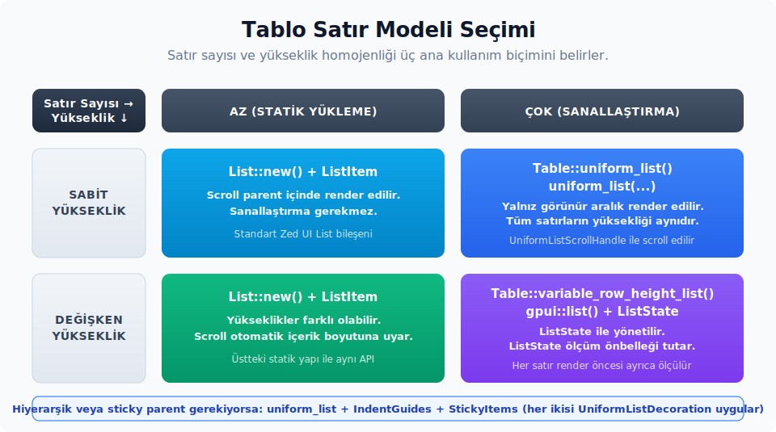

# 11. Veri ve Tablo Bileşenleri

Zed UI tarafında tabloya ihtiyaç duyulduğunda ana giriş noktası `Table` bileşenidir. Küçük ve sabit satırlı tablolar doğrudan `.row(...)` çağrılarıyla kurulur. Satır sayısı arttığında ise tablo, GPUI'nin sanallaştırılmış liste altyapısına bağlanan `.uniform_list(...)` veya `.variable_row_height_list(...)` çağrılarıyla render edilir. Yani tablo tek bir kalıba sıkışmaz; satır modeline göre üç farklı kullanım biçimi sunar.

## GPUI uniform_list ile Köprü

`Table::uniform_list(...)` ve Bölüm 9'daki büyük listeler GPUI'nin `uniform_list(...)` elementine bağlanır. Bu element yalnızca görünür satır aralığını render eder; böylece binlerce satırlık listeler gereksiz render maliyeti yaratmadan ekrana basılabilir. Kullanım esnasında şu kurallara dikkat edilmelidir:

- `uniform_list(id, item_count, |range, window, cx| Vec<AnyElement>)` imzası bir kimlik (id) ile bir satır sayısı alır; kalan kısımda yalnızca görünür `range` için satırlar üretilir. Aralık içindeki indeks dizisi `range.map(|indeks| ...)` ifadesiyle dolaşılır.
- Satır yüksekliğinin homojen (eş değer) olması beklenir. İçerik her satırda farklı bir yükseklik gerektiriyorsa, GPUI tarafındaki `list(...)` elementi ve `ListState` ile çalışan `Table::variable_row_height_list(...)` daha uygun bir seçimdir.
- Kaydırma (scroll) davranışı için `UniformListScrollHandle` değeri görünüm (view) yapısında saklanır ve `.track_scroll(&handle)` metoduyla bağlanır. Tablo tarafında `Table::interactable(...)` çağrısı kullanıldığında bu süreç, içerideki `TableInteractionState` üzerinden yönetilir.
- `with_sizing_behavior(ListSizingBehavior::Infer)`, listenin içeriğine göre yükseklik hesaplar. `Auto` ise liste için sabit bir ölçü hesaplamaz; boyut kararı üst yerleşim (layout) ve esnek (flex) akışa bırakılır.
- `with_decoration(...)` alanına (slot) `IndentGuides` ve `StickyItems` gibi süslemeler bağlanır; bu süslemelerin `UniformListDecoration` trait'ini implement etmesi gerekir.



Karar matrisi:

| Satır modeli | Kullanım |
| :-- | :-- |
| Sabit, az satır | `List::new()` ile `ListItem::new(...)`; kaydırma doğrudan üst öğe içinde gerçekleştirilir. |
| Sabit yükseklik, çok satır | `uniform_list(id, count, ...)` veya `Table::uniform_list(...)`. |
| Değişken yükseklik, çok satır | `gpui::list(...) + ListState` veya `Table::variable_row_height_list(...)`. |
| Hiyerarşik ya da sticky üst öğe | `uniform_list(...)` ile birlikte `IndentGuides` ve `StickyItems`. |

`gpui::ListAlignment` (`Top`, `Bottom`) ve `ListSizingBehavior` (`Infer`, `Auto`) için tip referansları `gpui` crate'inde tanımlıdır. UI tarafındaki `Table`, sanallaştırılmış satırlarda `Auto` kullanır; `project_panel` gibi ağaç listelerinde `Infer` örneği görülür.

Bu ailede tablo kurulurken üç karar birlikte değerlendirilir; biri değiştiğinde diğerleri de genellikle bu durumdan etkilenir:

- **Satır modeli:** Sabit bir satır listesi mi, sabit yükseklikli sanallaştırılmış bir liste mi, yoksa değişken yükseklikli sanallaştırılmış bir liste mi.
- **Kolon genişliği modeli:** Otomatik, explicit (belirli), redistributable (yeniden dağıtılabilir) veya resizable (yeniden boyutlandırılabilir).
- **Etkileşim modeli:** Sadece görsel bir tablo mu, yoksa odak, scroll ve resize durumu tutan etkileşimli (interactable) bir tablo mu.

## Table

Kaynak:

- Tanım: `ui` crate'i
- Export: `ui::Table`, `ui::UncheckedTableRow`.
- Prelude: Hayır; ayrıca import edilmesi gerekir.
- Preview: `impl Component for Table`.

Tavsiye Edilen Kullanım Alanları:

- Başlıklar (header), satır sınırları, çizgili (striped) görünüm ve kolon hizası gereken veri görünümleri için.
- Satır sayısı büyüdüğünde sanallaştırma üzerinden performanslı bir şekilde render almak gerektiğinde.
- Kolon genişliklerinin tek bir API üzerinden yönetilmesi istendiğinde.

Tercih Edilmemesi Gereken Durumlar:

- Tek kolonlu seçim listelerinde `List` ile `ListItem` kullanımı çok daha uygundur.
- Hiyerarşik veriler için `TreeViewItem` doğru yüzeydir.
- Form satırları veya araç çubuğu bilgileri için tablo yerine `h_flex()` veya `v_flex()` ile açık bir yerleşim kurmak genellikle daha okunabilir bir yapı sunar.

Temel API:

- Constructor: `Table::new(cols)`.
- Header: `.header(headers)`.
- Sabit satır: `.row(items)`.
- Sanallaştırılmış sabit yükseklikli satırlar: `.uniform_list(id, row_count, render_item_fn)`.
- Sanallaştırılmış değişken yükseklikli satırlar: `.variable_row_height_list(row_count, list_state, render_row_fn)`.
- Görsel builder'lar: `.striped()`, `.hide_row_borders()`, `.hide_row_hover()`, `.no_ui_font()`, `.disable_base_style()`.
- Genişlik: `.width(width)`, `.width_config(config)`.
- Sabit ilk kolonlar: `.pin_cols(n)`.
- Etkileşim: `.interactable(&table_interaction_state)`.
- Satır özelleştirme: `.map_row(callback)`.
- Boş durum: `.empty_table_callback(callback)`.

Davranış:

- `cols`, tablo satırlarının ve başlığının beklenen kolon sayısıdır.
- `.header(...)` ve `.row(...)` içine verilen `Vec<T>` içeride bir `TableRow<T>` değerine dönüştürülür. Eleman sayısı `cols` ile eşleşmezse panic oluşur.
- Varsayılan hücre stili `px_1()`, `py_0p5()`, `whitespace_nowrap()`, `text_ellipsis()` ve `overflow_hidden()` özelliklerini uygular.
- `.disable_base_style()` çağrısı hücre baz stilini kapatır. CSV önizleme gibi her hücrenin kendi yerleşimini taşıdığı durumlarda tercih edilir.
- `.row(...)` yalnızca tablo sabit satır modundayken satır ekler. Tablo `.uniform_list(...)` veya `.variable_row_height_list(...)` ile kurulduysa satırlar bir closure üzerinden üretilir.
- `.map_row(...)`, tablonun ürettiği `Stateful<Div>` satır kapsayıcısını alır. Bu sayede seçili satır, hover durumu, sağ tık veya özel tıklama davranışı gibi ek nitelikler eklemek mümkün hale gelir.
- `.pin_cols(n)`, ilk `n` kolonu yatay kaydırma sırasında görünür tutar. Kaynakta yalnızca `ColumnWidthConfig::Resizable` ile desteklenir; `n == 0` veya `n >= cols` durumunda tablo tek bölümlü normal bir yerleşime döner.
- Sabitlenmiş yerleşimde (pinned layout) header, satırlar ve yeniden boyutlandırma katmanı (resize overlay) aynı yatay `ScrollHandle`'ı izler. Sabitlenmiş kolonlar, kaydırılabilir kolonlarla aynı liste öğesi içinde render edildiği için değişken yükseklikli satırlarda iki tarafın yüksekliği ayrışmaz. Bu nedenle `.pin_cols(...)` kullanılırken tablonun `.interactable(...)` ile bağlanması pratikte zorunlu hâle gelir.

Minimum örnek:

```rust
use ui::{Table, prelude::*};

fn model_tablosu_render() -> impl IntoElement {
    Table::new(3)
        .width(px(520.))
        .header(vec!["Model", "Sağlayıcı", "Durum"])
        .row(vec!["gpt-5.2", "OpenAI", "Hazır"])
        .row(vec!["claude-sonnet", "Anthropic", "Anahtar gerekiyor"])
        .row(vec!["local-llm", "Ollama", "Çevrim dışı"])
        .striped()
}
```

Karışık hücre içeriği gerekiyorsa, her hücrenin `.into_any_element()` çağrısıyla aynı tipe çevrilmesi yeterlidir:

```rust
use ui::{Button, ButtonStyle, Indicator, Table, prelude::*};

fn paket_satiri_tablosu_render() -> impl IntoElement {
    Table::new(4)
        .width(px(720.))
        .header(vec![
            "Durum".into_any_element(),
            "Paket".into_any_element(),
            "Sürüm".into_any_element(),
            "Eylem".into_any_element(),
        ])
        .row(vec![
            Indicator::dot().color(Color::Success).into_any_element(),
            Label::new("rust-analyzer").truncate().into_any_element(),
            Label::new("1.0.0").color(Color::Muted).into_any_element(),
            Button::new("rust-analyzer-ac", "Aç")
                .style(ButtonStyle::Subtle)
                .into_any_element(),
        ])
}
```

Sabit yükseklikli büyük bir liste için tablo `.uniform_list(...)` ile kurulur. Burada satır sayısı view içinde tutulur ve sadece görünür aralık render edilir:

```rust
use gpui::Entity;
use ui::{Table, TableInteractionState, prelude::*};

#[derive(Clone)]
struct PaketSatiri {
    ad: SharedString,
    surum: SharedString,
    etkin: bool,
}

struct PaketTablosu {
    tablo_durumu: Entity<TableInteractionState>,
    satirlar: Vec<PaketSatiri>,
}

impl PaketTablosu {
    fn new(cx: &mut Context<Self>) -> Self {
        Self {
            tablo_durumu: cx.new(|cx| TableInteractionState::new(cx)),
            satirlar: Vec::new(),
        }
    }
}

impl Render for PaketTablosu {
    fn render(&mut self, _window: &mut Window, _cx: &mut Context<Self>) -> impl IntoElement {
        let satirlar = self.satirlar.clone();

        Table::new(3)
            .interactable(&self.tablo_durumu)
            .striped()
            .header(vec!["Paket", "Sürüm", "Durum"])
            .uniform_list("paket-tablosu", satirlar.len(), move |aralik, _window, _cx| {
                aralik
                    .map(|indeks| {
                        let satir = &satirlar[indeks];
                        vec![
                            Label::new(satir.ad.clone()).truncate().into_any_element(),
                            Label::new(satir.surum.clone())
                                .color(Color::Muted)
                                .into_any_element(),
                            Label::new(if satir.etkin { "Etkin" } else { "Devre dışı" })
                                .into_any_element(),
                        ]
                    })
                    .collect()
            })
    }
}
```

Değişken yükseklikli satırlarda ise `ListState` ile birlikte `.variable_row_height_list(...)` kullanılır. Veri her değiştiğinde durumun `reset(...)` veya uygun bir `splice(...)` çağrısıyla güncellenmesi gerekir:

```rust
use gpui::{Entity, ListAlignment, ListState};
use ui::{Table, TableInteractionState, prelude::*};

#[derive(Clone)]
struct GunlukSatiri {
    seviye: SharedString,
    mesaj: SharedString,
}

struct GunlukTablosu {
    tablo_durumu: Entity<TableInteractionState>,
    liste_durumu: ListState,
    satirlar: Vec<GunlukSatiri>,
}

impl GunlukTablosu {
    fn new(satirlar: Vec<GunlukSatiri>, cx: &mut Context<Self>) -> Self {
        Self {
            tablo_durumu: cx.new(|cx| TableInteractionState::new(cx)),
            liste_durumu: ListState::new(satirlar.len(), ListAlignment::Top, px(100.)),
            satirlar,
        }
    }

    fn satirlari_degistir(&mut self, satirlar: Vec<GunlukSatiri>, cx: &mut Context<Self>) {
        self.liste_durumu.reset(satirlar.len());
        self.satirlar = satirlar;
        cx.notify();
    }
}

impl Render for GunlukTablosu {
    fn render(&mut self, _window: &mut Window, _cx: &mut Context<Self>) -> impl IntoElement {
        let satirlar = self.satirlar.clone();

        Table::new(2)
            .interactable(&self.tablo_durumu)
            .header(vec!["Seviye", "Mesaj"])
            .variable_row_height_list(satirlar.len(), self.liste_durumu.clone(), move |indeks, _, _| {
                let satir = &satirlar[indeks];
                vec![
                    Label::new(satir.seviye.clone()).color(Color::Muted).into_any_element(),
                    div()
                        .whitespace_normal()
                        .child(Label::new(satir.mesaj.clone()))
                        .into_any_element(),
                ]
            })
    }
}
```

Zed içinden kullanım örnekleri:

- `ui` crate'i: Bileşen önizlemesindeki basit, çizgili (striped) ve karışık içerikli tablo örnekleri.
- `keymap_editor` crate'i: Kısayol düzenleyici tablosu; `uniform_list`, `TableInteractionState` ve yeniden dağıtılabilir kolonlar.
- `csv_preview` crate'i: CSV önizlemeleri için `ResizableColumnsState`, `disable_base_style()` ve iki farklı render mekanizması. İlk kolon `pin_cols(1)` ile yatay kaydırma sırasında sabitlenir.
- `edit_prediction_ui` crate'i: Metadatalar için küçük, UI yazı tipi (font) kapatılmış bir tablo.

Dikkat Edilmesi Gereken Hususlar:

- Başlık (header) ve tüm satırların aynı kolon sayısında olması gerekir.
- Bir `Vec` içinde farklı element tipleri kullanılıyorsa, her hücrenin `.into_any_element()` çağrısıyla aynı tipe dönüştürülmesi gerekir.
- Büyük veri setlerinde `.row(...)` ile binlerce satır eklemek beklenmez; bu durumda `.uniform_list(...)` veya `.variable_row_height_list(...)` doğru tercihtir.
- `variable_row_height_list` için kullanılan `ListState` durumunun satır sayısıyla senkron tutulması gerekir. Veri sayısı değiştiğinde `reset(...)` veya uygun `splice(...)` çağrısı gerçekleştirilir.

## TableInteractionState

Kaynak:

- Tanım: `ui` crate'i
- Export: `ui::TableInteractionState`.
- Prelude: Hayır; ayrıca import edilmesi gerekir.
- Render modeli: `Entity<TableInteractionState>` olarak görünüm durumunda saklanır.

Tavsiye Edilen Kullanım Alanları:

- Tablo kendi içinde dikey kaydırma yapacaksa.
- Kolon yeniden boyutlandırma tutamaçları (resize handles) kullanılacaksa.
- Tablonun odak tutamacı (focus handle), kaydırma farkı (scroll offset) veya özel kaydırma çubuğu ayarı dışarıdan yönetilecekse.

Temel API:

- `TableInteractionState::new(cx)`.
- `.with_custom_scrollbar(scrollbars)`.
- `.scroll_offset() -> Point<Pixels>`.
- `.set_scroll_offset(offset)`.
- `TableInteractionState::listener(&entity, callback)`.

Davranış:

- `focus_handle`, `scroll_handle`, `horizontal_scroll_handle` ve isteğe bağlı bir `custom_scrollbar` barındırır.
- `.interactable(&state)` verilmedikçe tablo, kaydırma ve odak durumunu bu entity'ye bağlamaz.
- Yatay kaydırma, tablo genişliği modeline bağlıdır. Sabit bir toplam genişlik veya `ResizableColumnsState` yoksa, tablo genellikle kapsayıcıya sığacak şekilde davranır.
- `Table::pin_cols(...)` kullanılan bir resizable tabloda aynı `horizontal_scroll_handle`, header'ın ve her satırın scrollable bölümünü kilitli tutmak için kullanılır.
- `with_custom_scrollbar(...)`, Zed ayarlarından gelen scrollbar davranışını tabloya taşımak amacıyla tercih edilir.

Örnek:

```rust
use gpui::Entity;
use ui::{ScrollAxes, Scrollbars, Table, TableInteractionState, prelude::*};

struct DenetimTablosu {
    tablo_durumu: Entity<TableInteractionState>,
}

impl DenetimTablosu {
    fn new(cx: &mut Context<Self>) -> Self {
        let tablo_durumu = cx.new(|cx| {
            TableInteractionState::new(cx)
                .with_custom_scrollbar(Scrollbars::new(ScrollAxes::Both))
        });

        Self { tablo_durumu }
    }

    fn tablo_render(&self) -> impl IntoElement {
        Table::new(2)
            .interactable(&self.tablo_durumu)
            .header(vec!["Zaman", "Olay"])
            .row(vec!["09:42", "Proje açıldı"])
    }
}
```

Zed içinden kullanım örnekleri:

- `keymap_editor` crate'i: Özel kaydırma çubuğu ile etkileşimli bir keymap tablosu.
- `csv_preview` crate'i: CSV önizlemesindeki kaydırma durumu yönetimi.
- `git_ui` crate'inin `git_graph` modülü: Tablo odak tutamacını seçim davranışıyla birleştiren örnek.

Dikkat Edilmesi Gereken Hususlar:

- `TableInteractionState` doğrudan bir struct alanı olarak değil, bir `Entity` içinde tutulmalıdır.
- Kaydırma farkı (scroll offset) elle set ediliyorsa, aynı frame içindeki veri sayısının veya liste durumunun değişiklikleriyle çakışmamasına dikkat edilmelidir.
- Odaklanma (focus) davranışı gerekiyorsa, `focus_handle` alanı public olduğu için Zed'deki örnekler gibi `tab_index(...)` veya `tab_stop(...)` ile yapılandırılabilir.

## ColumnWidthConfig

Kaynak:

- Tanım: `ui` crate'i
- Export: `ui::ColumnWidthConfig`, `ui::StaticColumnWidths`.
- Prelude: Hayır; ayrıca import edilmesi gerekir.

Tavsiye Edilen Kullanım Alanları:

- Kolonların otomatik, oranlı, belirli (explicit) veya kullanıcı tarafından yeniden boyutlandırılabilir olmasını ayarlamak için.
- Sanallaştırılmış bir tabloda yatay boyutlandırma (sizing) davranışını doğru kurmak için.

Temel API:

- `ColumnWidthConfig::auto()`: Kolonlar ve tablo otomatik olarak genişler.
- `ColumnWidthConfig::auto_with_table_width(width)`: `.width(width)` ile aynı davranış; tablo genişliği sabit, kolonlar ise otomatik şekillenir.
- `ColumnWidthConfig::explicit(widths)`: Her kolon için belirli (explicit) bir `DefiniteLength` alır.
- `ColumnWidthConfig::redistributable(columns_state)`: Toplam alan korunarak kolonlar yeniden paylaştırılır.
- `ColumnWidthConfig::Resizable(columns_state)`: Kolonlar mutlak bir genişlik taşır ve tablo toplam genişliği kolon toplamına göre değişir.
- `ColumnWidthConfig::table_width(window, cx)`: Tablo kapsayıcısının kullanacağı toplam genişliği döndürür. `Resizable` modunda kolon genişliklerini rem boyutuyla piksele çevirip toplar; diğer modlarda konfigürasyondaki sabit tablo genişliğini kullanır.
- `ColumnWidthConfig::list_horizontal_sizing(window, cx)`: Tablo satırlarını taşıyan `uniform_list` için yatay sizing davranışını üretir. Auto, explicit, redistributable ve resizable modların yatay scroll/fill kararını aynı noktadan verir.

Genişlik taşıyıcıları:

| API | Rol |
| :-- | :-- |
| `StaticColumnWidths` | Statik satırlı tabloda kolon genişliğinin otomatik mi (`Auto`) yoksa explicit `TableRow<DefiniteLength>` ile mi geleceğini belirtir. |
| `TableResizeBehavior` | Kolon resize davranışını seçer: `None` resize'ı kapatır, `Resizable` varsayılan minimumla açar, `MinSize(f32)` özel minimum eşik uygular. |

Explicit genişlik örneği:

```rust
use ui::{ColumnWidthConfig, Table, prelude::*};

fn acik_genislikli_tablo_render() -> impl IntoElement {
    Table::new(3)
        .width_config(ColumnWidthConfig::explicit(vec![
            DefiniteLength::Absolute(AbsoluteLength::Pixels(px(96.))),
            DefiniteLength::Fraction(0.35),
            DefiniteLength::Fraction(0.65),
        ]))
        .header(vec!["Tür", "Ad", "Yol"])
        .row(vec!["Dosya", "main.rs", "crates/app/src/main.rs"])
}
```

Dikkat Edilmesi Gereken Hususlar:

- `.width(width)` aslında `ColumnWidthConfig::auto_with_table_width(width)` ifadesinin kısaltmasıdır. Yeniden boyutlandırma gerekiyorsa `.width_config(...)` doğrudan kullanılır.
- `explicit(widths)` içinde `widths.len()` ile tablo kolon sayısının birbirine eşit olması gerekir.
- `Resizable` için ilişkili bir constructor yoktur; enum varyantı doğrudan `ColumnWidthConfig::Resizable(entity)` biçiminde kullanılır.
- `Table::pin_cols(n)` yalnızca `ColumnWidthConfig::Resizable(entity)` ile anlamlı ve destekli bir kullanımdır. `Auto`, `Explicit` ve `Redistributable` modlarında sabitlenmiş ayrım (pinned split) davranışına güvenilmemelidir.
- Sabitlenmiş yerleşimde (pinned layout) sabitlenmiş bölümün resize divider'ları yalnızca görsel çizgi olarak render edilir; sürükleme etkileşimi scrollable bölümün divider'larında kalır. Header hücresine çift tıklama ile kolon sıfırlama (reset) davranışı ise `HeaderResizeInfo` üzerinden çalışmaya devam eder.

## RedistributableColumnsState

Kaynak:

- Tanım: `ui` crate'i
- Export: `ui::RedistributableColumnsState`.
- İlgili tipler: `ui::TableResizeBehavior`, `ui::HeaderResizeInfo`.
- Prelude: Hayır; ayrıca import edilmesi gerekir.

Tavsiye Edilen Kullanım Alanları:

- Tablo kapsayıcı genişliği korunacak ve kullanıcı yalnızca kolonların birbirine göre oranını değiştirebilecekse.
- Kısayol düzenleyici (keymap editor) ve git grafiği gibi tabloda toplam alanın sabit kalması gereken yerlerde.
- Aynı tabloda hem oranlı hem mutlak başlangıç genişliklerinin kullanılması gerekiyorsa.

Tercih Edilmemesi Gereken Durumlar:

- CSV veya spreadsheet benzeri bir tabloda kullanıcı tek bir kolonu genişletince toplam tablo genişliği de büyümeliyse, `ResizableColumnsState` çok daha uygundur.
- Yalnızca sabit oranlı kolon gerekiyorsa `ColumnWidthConfig::explicit(...)` çok daha basit bir çözümdür.

Temel API:

- `RedistributableColumnsState::new(cols, initial_widths, resize_behavior)`.
- `.cols()`.
- `.initial_widths()`.
- `.preview_widths()`.
- `.resize_behavior()`.
- `.widths_to_render()`.
- `.preview_fractions(rem_size)`.
- `.preview_column_width(column_index, window)`.
- `.cached_container_width()`.
- `.set_cached_container_width(width)`.
- `.commit_preview()`.
- `.reset_column_to_initial_width(column_index, window)`.

Davranış:

- Başlangıç genişlikleri `DefiniteLength` alır. Aynı tabloda `DefiniteLength::Fraction(...)` ile `DefiniteLength::Absolute(...)` birlikte kullanılabilir.
- Sürükleme sırasında `preview_widths` güncellenir; bırakma (drop) sonrasında `commit_preview()` çağrısıyla kalıcı genişliklere aktarılır.
- `Table` içinde `.interactable(...)` ve `.width_config(ColumnWidthConfig::redistributable(...))` birlikte kullanıldığında yeniden boyutlandırma tutamacı bağlantısı (resize handle binding) normal tablo için otomatik olarak gerçekleştirilir.
- `TableResizeBehavior::None`, ilgili bölücü (divider) yönünde yeniden boyutlandırma yayılımını engeller.
- `TableResizeBehavior::Resizable`, varsayılan minimum sınırla boyutlandırmaya izin verir.
- `TableResizeBehavior::MinSize(value)`, redistributable algoritmasında minimum kolon oranı olarak değerlendirilir.
- `TableResizeBehavior::is_resizable()` metodu `None` dışındaki davranışlarda `true` döner. Header hücresinde yeniden boyutlandırma tutamacı çizimi veya imleç (cursor) seçimi yaparken enum varyantlarını tekrar `match` etmek yerine bu soru sorulur.

Örnek:

```rust
use gpui::Entity;
use ui::{
    ColumnWidthConfig, RedistributableColumnsState, Table, TableInteractionState,
    TableResizeBehavior, prelude::*,
};

struct KisayolTablosu {
    tablo_durumu: Entity<TableInteractionState>,
    kolonlar: Entity<RedistributableColumnsState>,
}

impl KisayolTablosu {
    fn new(cx: &mut Context<Self>) -> Self {
        Self {
            tablo_durumu: cx.new(|cx| TableInteractionState::new(cx)),
            kolonlar: cx.new(|_cx| {
                RedistributableColumnsState::new(
                    4,
                    vec![
                        DefiniteLength::Absolute(AbsoluteLength::Pixels(px(36.))),
                        DefiniteLength::Fraction(0.42),
                        DefiniteLength::Fraction(0.28),
                        DefiniteLength::Fraction(0.30),
                    ],
                    vec![
                        TableResizeBehavior::None,
                        TableResizeBehavior::Resizable,
                        TableResizeBehavior::Resizable,
                        TableResizeBehavior::Resizable,
                    ],
                )
            }),
        }
    }

    fn tablo_render(&self) -> impl IntoElement {
        Table::new(4)
            .interactable(&self.tablo_durumu)
            .width_config(ColumnWidthConfig::redistributable(self.kolonlar.clone()))
            .header(vec!["", "Eylem", "Tuşlar", "Bağlam"])
            .empty_table_callback(|_, _| Label::new("Kısayol yok").into_any_element())
    }
}
```

Zed içinden kullanım örnekleri:

- `keymap_editor` crate'i: Oranlı kolonlar ile yeniden boyutlandırılabilir bir kısayol tablosu.
- `git_ui` crate'inin `git_graph` modülü: Grafik alanı ve commit tablosu aynı redistributable durum ile hizalanır.

Dikkat Edilmesi Gereken Hususlar:

- `cols`, `initial_widths.len()` ve `resize_behavior.len()` değerlerinin birbirine eşit olması gerekir.
- Normal bir `Table` kullanımında `bind_redistributable_columns(...)` ve `render_redistributable_columns_resize_handles(...)` çağırmaya gerek yoktur; `Table` bunu kendi sarmalayıcısında (wrapper) otomatik olarak yapar.
- Aynı kolon durumu farklı görsel bölgelerde paylaşılıyorsa, düşük seviyeli yardımcıları kullanmak gerekir.

## ResizableColumnsState

Kaynak:

- Tanım: `ui` crate'i
- Export: `ui::ResizableColumnsState`.
- İlgili tipler: `ui::TableResizeBehavior`.
- Prelude: Hayır; ayrıca import edilmesi gerekir.

Tavsiye Edilen Kullanım Alanları:

- Her kolonun mutlak genişliği ayrı ayrı değişecekse.
- Kullanıcı bir kolonu büyüttüğünde tablonun toplam genişliği büyümeli ve yatay kaydırma (scroll) devreye girmeliyse.
- CSV, spreadsheet veya geniş veri önizlemeleri gibi senaryolar için.

Temel API:

- `ResizableColumnsState::new(cols, initial_widths, resize_behavior)`.
- `.cols()`.
- `.resize_behavior()`.
- `.set_column_configuration(col_idx, width, resize_behavior)`.
- `.reset_column_to_initial_width(col_idx)`.

Davranış:

- Başlangıç genişlikleri `AbsoluteLength` alır.
- Yeniden boyutlandırılan kolonun genişliği değişir; komşu kolonlardan genişlik oranı çalınmaz.
- `ColumnWidthConfig::Resizable(entity)` konfigürasyonuyla tablo toplam genişliğini kolon genişliklerinin toplamı üzerinden hesaplar.
- `TableResizeBehavior::MinSize(value)` değeri, resizable algoritmasında rem tabanlı bir minimum eşik olarak uygulanır.

Örnek:

```rust
use gpui::Entity;
use ui::{
    ColumnWidthConfig, ResizableColumnsState, Table, TableInteractionState,
    TableResizeBehavior, prelude::*,
};

struct CsvBenzeriTablo {
    tablo_durumu: Entity<TableInteractionState>,
    kolonlar: Entity<ResizableColumnsState>,
}

impl CsvBenzeriTablo {
    fn new(cx: &mut Context<Self>) -> Self {
        Self {
            tablo_durumu: cx.new(|cx| TableInteractionState::new(cx)),
            kolonlar: cx.new(|_cx| {
                ResizableColumnsState::new(
                    3,
                    vec![
                        AbsoluteLength::Pixels(px(56.)),
                        AbsoluteLength::Pixels(px(180.)),
                        AbsoluteLength::Pixels(px(320.)),
                    ],
                    vec![
                        TableResizeBehavior::None,
                        TableResizeBehavior::Resizable,
                        TableResizeBehavior::MinSize(8.),
                    ],
                )
            }),
        }
    }

    fn tablo_render(&self) -> impl IntoElement {
        Table::new(3)
            .interactable(&self.tablo_durumu)
            .width_config(ColumnWidthConfig::Resizable(self.kolonlar.clone()))
            .pin_cols(1)
            .header(vec!["#", "Ad", "Değer"])
            .row(vec!["1", "dil", "Rust"])
    }
}
```

Zed içinden kullanım örnekleri:

- `csv_preview` crate'i: CSV kolon durumunun `ResizableColumnsState` ile saklanması.
- `csv_preview` crate'i: Tablonun `ColumnWidthConfig::Resizable(...)` ile render edilmesi.

Dikkat Edilmesi Gereken Hususlar:

- Bu model yatay kaydırma (scroll) üretebilir; bu yüzden tablonun `.interactable(...)` ile bağlanması gerekir.
- Kolon sayısı değişirse, eski durumu güncellemek yerine yeni bir `ResizableColumnsState` oluşturmak çok daha net bir tercih olur.
- `set_column_configuration(...)`, çalışma zamanında tek bir kolonun başlangıç ve mevcut genişliğini birlikte günceller.
- İlk kolonun satır numarası veya seçim sütunu gibi her zaman görünür kalması gerekiyorsa, `ColumnWidthConfig::Resizable(entity)` ile birlikte `Table::pin_cols(n)` kullanılır. Zed CSV önizlemesi ilk kolonu bu şekilde sabitler. Kullanıcı sabitlenmiş bölümdeki bölücüyü (divider) sürükleyemez; boyut değiştirme ihtiyacı kaydırılabilir kolonlarda beklenir veya kolon konfigürasyonu durum üzerinden güncellenir.

## TableRow ve UncheckedTableRow

Kaynak:

- Tanım: `ui` crate'i
- Export: `ui::table_row::TableRow`.
- Alias: `ui::UncheckedTableRow<T> = Vec<T>`.
- Prelude: Hayır.

Tavsiye Edilen Kullanım Alanları:

- Düşük seviyeli tablo yardımcılarına doğrulanmış bir satır aktarılması gerektiğinde.
- Kolon sayısı kuralının tek bir noktada denetlenmesi istendiğinde.
- Tablo dışındaki veri motorlarında satırların dikdörtgensel (rectangular) biçimde tutulması gerektiğinde.

Temel API:

- `TableRow::from_vec(data, expected_length)`.
- `TableRow::try_from_vec(data, expected_length)`.
- `TableRow::from_element(element, length)`.
- `.cols()`.
- `.get(col)`, `.expect_get(col)`.
- `.as_slice()`, `.into_vec()`.
- `.map(...)`, `.map_ref(...)`, `.map_cloned(...)`.

Davranış:

- `from_vec(...)` uzunluk eşleşmezse panic üretir.
- `try_from_vec(...)`, uzunluk hatasını `Result::Err` olarak döndürür.
- `Table::header(...)`, `Table::row(...)`, `.uniform_list(...)` ve `.variable_row_height_list(...)` genel API'lerinde `Vec<T>` kabul eder; `TableRow` dönüşümü arka planda otomatik olarak gerçekleştirilir.
- `IntoTableRow` trait'i, `Vec<T>` için tek bir `.into_table_row(expected_length)` yöntemi sağlar; uzunluk eşleşmezse panic üretir. Kaynakta `Table` bunu içeride kullandığı için normal kullanımda import edilmesine gerek yoktur. Düşük seviyeli yardımcılara inildiğinde ise `use ui::table_row::IntoTableRow as _;` ifadesiyle çağrılabilir. Doğrulanmış (`Result` döndüren) bir dönüşüm için ise doğrudan `TableRow::try_from_vec(data, expected_length)` kullanılır.

Satır doğrulama API'leri:

| API | Rol |
| :-- | :-- |
| `table_row` | `TableRow` ve `IntoTableRow` düşük seviye modülünü taşır; normal `Table` kullanımında doğrudan modüle inilmesi gerekmez. |
| `IntoTableRow` | `Vec<T>` değerini beklenen kolon sayısıyla doğrulanmış `TableRow<T>` değerine çeviren trait'tir. |

Örnek:

```rust
use ui::{AnyElement, table_row::TableRow};

fn hucreleri_dogrula(hucreler: Vec<AnyElement>, kolon_sayisi: usize) -> Option<TableRow<AnyElement>> {
    TableRow::try_from_vec(hucreler, kolon_sayisi).ok()
}
```

Dikkat Edilmesi Gereken Hususlar:

- Normal `Table` kullanımı sırasında el ile `TableRow` üretmeye gerek yoktur.
- `expect_get(...)`, veri motoru kuralları bozulduğunda erken hata vermek için uygundur; kullanıcı girdisinden gelen satırlarda `get(...)` daha güvenli bir tercihtir.

## Düşük Seviye Resize ve Render Yardımcıları

Kaynak:

- `render_table_row`: `ui` crate'i
- `render_table_header`: `ui` crate'i
- `TableRenderContext`: `ui` crate'i
- `HeaderResizeInfo`: `ui` crate'i
- `bind_redistributable_columns`: `ui` crate'i
- `render_redistributable_columns_resize_handles`: `ui` crate'i

Ne zaman kullanılır:

- Tek bir `Table` yeterli değilse; örneğin header, graph alanı ve tablo gövdesi farklı kapsayıcılarda ama aynı kolon durumuyla hizalanacaksa.
- Yeniden boyutlandırma tutamaçlarının tablo dışındaki kardeş (sibling) elemanların üzerine bind edilmesi gerekiyorsa.
- Satır veya header render'ının `Table` dışındaki özel bir yerleşim (layout) içinde yeniden kullanılması gerektiğinde.

Ne zaman kullanılmaz:

- Normal bir veri tablosu için bu yardımcılara inilmesine gerek yoktur. `Table` zaten header, row, scroll ve resize binding'ini tek bir yerde yönetir.
- Sadece genişlik ayarlamak için `bind_redistributable_columns(...)` çağrılmaz; `ColumnWidthConfig` bu amaç için yeterlidir.

Temel API:

- `TableRenderContext::for_column_widths(column_widths, use_ui_font)`:
  - `column_widths`: `Option<TableRow<Length>>`. `None` verildiğinde hücreler sabit bir genişlik almaz. Redistributable veya resizable bir durum üzerinden geliyorsa `columns_state.read(cx).widths_to_render()` çağrısıyla beslenir.
  - `use_ui_font`: `true` olduğunda hücre içeriği `text_ui(cx)` ile çizilir; `false` olduğunda font ailesi üst öğeden miras alınır. `Table::no_ui_font()` ile kapatılan davranışla aynıdır. CSV önizleme, monospace bir görünüm için bu değeri `false` yapar.
  - `striped`, `show_row_borders`, `show_row_hover`, `total_row_count`, `disable_base_cell_style`, `map_row`, `pinned_cols` ve `h_scroll_handle` alanları, `Default::default()` benzeri varsayılanlarla doldurulur. Özel bir görünüm gerekiyorsa `for_column_widths(...)` çıktısı üzerinden ilgili alanlar değiştirilebilir.
- `render_table_header(headers, table_context, resize_info, entity_id, cx) -> AnyElement`.
- `render_table_row(row_index, items, table_context, window, cx)`.
- `HeaderResizeInfo::from_redistributable(&columns_state, cx)`.
- `HeaderResizeInfo::from_resizable(&columns_state, cx)`.
- `resize_behavior: TableRow<TableResizeBehavior>` public alanı, header hücresinin resizable olup olmadığını okumak için kullanılır. İlgili kolon durumu public bir alan değildir; sıfırlama ve durum güncelleme işlemleri için `reset_column(...)` çağrısı gerçekleştirilir.
- `bind_redistributable_columns(container, columns_state)`.
- `render_redistributable_columns_resize_handles(&columns_state, window, cx)`.

Düşük seviye tablo yardımcıları:

| API | Rol |
| :-- | :-- |
| `TableRenderContext` | Header ve satır render'ı için kolon genişlikleri, font seçimi, stripe/border/hover davranışı, pinned kolon ve yatay scroll handle bilgisini taşır. |
| `HeaderResizeInfo` | Header hücresinin resize davranışını ve kolon sıfırlama akışını bağlamak için redistributable veya resizable durumdan üretilir. |
| `bind_redistributable_columns` | Redistributable kolon durumunu sürükleme önizlemesi ve bırakma kaydetme (drop commit) davranışıyla kapsayıcıya bağlar. |
| `render_redistributable_columns_resize_handles` | Redistributable kolon bölücü/tutamak katmanlarını (divider/handle overlay) üretir. |
| `render_table_header` | Doğrulanmış header hücreleri, render bağlamı (context) ve opsiyonel resize bilgisiyle tablo header element'i üretir. |
| `render_table_row` | Satır indeksi, hücreler ve `TableRenderContext` üzerinden tablo gövde satırını render eder. |

Örnek:

```rust
use gpui::Entity;
use ui::{
    HeaderResizeInfo, RedistributableColumnsState, TableRenderContext,
    bind_redistributable_columns, render_redistributable_columns_resize_handles,
    render_table_header, table_row::TableRow, prelude::*,
};

fn ozel_tablo_basligi_render(
    kolonlar: &Entity<RedistributableColumnsState>,
    window: &mut Window,
    cx: &mut App,
) -> impl IntoElement {
    let genislikler = kolonlar.read(cx).widths_to_render();
    let baglam = TableRenderContext::for_column_widths(Some(genislikler), true);
    let resize_bilgisi = HeaderResizeInfo::from_redistributable(kolonlar, cx);

    bind_redistributable_columns(
        div()
            .relative()
            .child(render_table_header(
                TableRow::from_vec(
                    vec![
                        Label::new("Graf").into_any_element(),
                        Label::new("Açıklama").into_any_element(),
                        Label::new("Yazar").into_any_element(),
                    ],
                    3,
                ),
                baglam,
                Some(resize_bilgisi),
                Some(kolonlar.entity_id()),
                cx,
            ))
            .child(render_redistributable_columns_resize_handles(kolonlar, window, cx)),
        kolonlar.clone(),
    )
}
```

Zed içinden kullanım örnekleri:

- `git_ui` crate'inin `git_graph` modülü: Grafik alanı ve commit tablosu aynı redistributable kolon durumuyla hizalanır; başlık ve yeniden boyutlandırma tutamaçları düşük seviyeli yardımcılarla kurulur.

Dikkat Edilmesi Gereken Hususlar:

- `bind_redistributable_columns(...)`, sürükleme hareketi sırasında önizleme genişliğini günceller ve bırakma anında kaydeder.
- `render_redistributable_columns_resize_handles(...)`, kolon durumundan bölücüleri üretir; kapsayıcının `relative()` olması tutamak yerleşimini çok daha öngörülebilir hâle getirir.
- `render_table_header(...)` içinde çift tıklama ile kolon sıfırlama davranışı `HeaderResizeInfo` üzerinden bağlanır.
- Header ve row için aynı `TableRenderContext` genişlik modelinin kullanılması zorunludur; aksi takdirde hücreler hizalanamaz.
- Sabitlenmiş kolonlu özel bir render akışı kuruluyorsa, `TableRenderContext.pinned_cols` ile `TableRenderContext.h_scroll_handle` birlikte ayarlanmalıdır. Normal `Table::pin_cols(...)` kullanımı bu iki alanı kendi içinde zaten doldurur. Kaydırılabilir satır ve başlık bölümleri `overflow_x_scroll()` ile aynı handle'ı takip eder; ayrıca resize sürükleme koordinatı bu yatay kaydırma farkına göre düzeltilir.

## Veri Tablosu Kompozisyon Örnekleri

Boş durumlu küçük bir tabloda `empty_table_callback(...)`, hiç satır yokken kullanıcıya açıklayıcı bir mesaj gösterir:

```rust
use ui::{Table, prelude::*};

fn bos_is_tablosu_render() -> impl IntoElement {
    Table::new(3)
        .width(px(560.))
        .header(vec!["İş", "Durum", "Süre"])
        .empty_table_callback(|_, _| {
            v_flex()
                .p_3()
                .gap_1()
                .child(Label::new("İş yok").color(Color::Muted))
                .child(Label::new("Kuyruğa alınan işler burada görünür").size(LabelSize::Small))
                .into_any_element()
        })
}
```

Satır seçimi için `map_row(...)` ile satır kapsayıcısının üzerinde özel bir görsel durum uygulanabilir. Aşağıdaki örnek seçili satıra arka plan rengi atar:

```rust
use ui::{Table, prelude::*};

fn secilebilir_satirlar_render(secili_indeks: Option<usize>) -> impl IntoElement {
    Table::new(2)
        .header(vec!["Ad", "Rol"])
        .row(vec!["Ada", "Yönetici"])
        .row(vec!["Linus", "Bakımcı"])
        .map_row(move |(indeks, satir), _window, cx| {
            satir.when(secili_indeks == Some(indeks), |satir| {
                satir.bg(cx.theme().colors().element_selected)
            })
            .into_any_element()
        })
}
```

Karar rehberi olarak şu kısa özet işe yarar:

- Az satır ve basit bir görünüm gerekiyorsa `Table::new(...).header(...).row(...)` yeterlidir.
- Çok satır ama tek satır yüksekliği varsa `.uniform_list(...)` doğru tercihtir.
- Çok satır ve çok satırlı (multiline) ya da değişken içerik mevcutsa `.variable_row_height_list(...)` kullanılır.
- Kapsayıcı genişliği sabit kalmalı ama kolon oranları değişmeliyse `RedistributableColumnsState` devreye girer.
- Kolonlar mutlak genişlikte olacak ve yatay kaydırma oluşabilecekse `ResizableColumnsState` seçilir.
- Header, gövde ve ek görsel bölgeler aynı kolon durumunu paylaşacaksa düşük seviyeli render ve resize yardımcılarına inilir.
