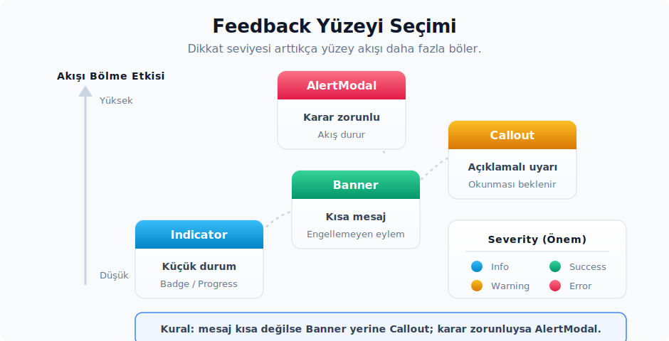

# 12. Geri Bildirim ve Durum Göstergeleri

Geri bildirim bileşenleri, kullanıcıya uygulamanın o anki durumunu anlatır. Bilgi, başarı, uyarı, hata, ilerleme, sayaç veya dikkat gerektiren kararlar bu grubun çatısı altına girer. Hepsi aynı tema token'larını paylaşır, fakat görsel yoğunlukları farklıdır. Bu yüzden önce mesajın ne kadar dikkat çekmesi gerektiğine karar verir, sonra uygun yüzeyi seçersin:

- `Banner`: sayfa veya panel üstünde kısa ve akışı bölmeyen bir mesaj vermek için kullanırsın.
- `Callout`: içerik akışı içinde, kullanıcının okuması ve gerekirse karar vermesi beklenen daha açıklayıcı bir mesaj için kullanırsın.
- `Modal`: kendi modal içeriğini kurmak için bir iskelet sağlar.
- `AlertModal`: kısa karar akışları veya uyarı diyalogları için.
- `AnnouncementToast`: yeni özellik veya duyuru kartı; yaşam döngüsü üst bildirim sistemi tarafından yönetirsin.
- `CountBadge`, `Indicator`, `ProgressBar`, `CircularProgress`: küçük durum ve ilerleme göstergeleri.
- `ActivityIndicator`: workspace status alanında LSP, debug, git, dosya sistemi, extension ve formatlama aktivitelerini tek bir kompakt tetikleyici altında toplar.



## Severity

Kaynak:

- Tanım: `ui` crate'i
- Export: `ui::Severity`.
- Prelude: `ui::prelude::*` içinde otomatik gelir.

Ne zaman kullanırsın:

- Bir mesajın tonunu `Info`, `Success`, `Warning` veya `Error` olarak tek bir enum üzerinden seçmek için.
- `Banner` ve `Callout` gibi bileşenlerde icon, background ve border renginin otomatik olarak eşleşmesi gerektiğinde.

Davranış:

- `Banner` ve `Callout`, severity değerinden icon ile status renklerini türetir.
- `Info` için sade bir `info_background` tonu ve muted ikon rengi seçilir; `Success` yeşil, `Warning` sarı, `Error` kırmızı status token'larını kullanır.
- Severity, kullanıcıya gösterilen mesajın yerine geçmez. Mesaj yine kısa ve açık olmalıdır. Bir aksiyon gerekiyorsa, aksiyonu ayrı bir buton slot'una yerleştirirsin.

## Banner

Kaynak:

- Tanım: `ui` crate'i
- Export: `ui::Banner`.
- İlgili tipler: `ui::Severity`.
- Prelude: Hayır; ayrıca import edersin.
- Preview: `impl Component for Banner`.

Ne zaman kullanırsın:

- Sayfa veya panel içinde kısa bir bilgi, başarı, uyarı veya hata mesajı göstermek için.
- Kullanıcıyı akıştan koparmadan bir CTA veya düzeltme aksiyonu sunmak için.
- Bir içeriğin üstünde ya da ilgili bölümün başında non-blocking bir mesaj konumlandırmak için.

Ne zaman kullanmazsın:

- Uzun açıklama, madde listesi veya ayrıntılı bir karar gerekiyorsa `Callout` daha uygun bir yüzeydir.
- Kullanıcının devam etmeden önce karar vermesi zorunluysa `AlertModal` daha doğru bir araçtır.
- Kısa süreli bir global bildirim yaşam döngüsü gerekiyorsa, uygulama bildirim altyapısı ile uygun bildirim view'ı birlikte kullanırsın.

Temel API:

- `Banner::new()`.
- `.severity(Severity)`.
- `.action_slot(element)`.
- `.wrap_content(bool)`.
- ParentElement: `.child(...)`, `.children(...)`.

Davranış:

- Varsayılan severity değeri `Severity::Info`'dur.
- Severity'ye göre icon, background ve border rengi seçersin.
- `action_slot(...)` verildiğinde, banner sağ tarafta bir aksiyon alanı açar ve içerik padding'i bu yapıya göre düzenlenir.
- `.wrap_content(true)`, dar alanlarda içeriğin satıra kırılmasına izin verir.

Örnek:

```rust
use ui::{Banner, Button, Icon, IconName, IconSize, Severity, prelude::*};

fn senkron_banner_render() -> impl IntoElement {
    Banner::new()
        .severity(Severity::Info)
        .child(Label::new("Senkronizasyon sürüyor"))
        .action_slot(
            Button::new("senkronizasyonu-gor", "Görüntüle")
                .end_icon(Icon::new(IconName::ArrowUpRight).size(IconSize::Small)),
        )
}
```

Çok satırlı içerik gerekirse `wrap_content(true)` çağrısı satır kırılmasına izin verir:

```rust
use ui::{Banner, Severity, prelude::*};

fn saglayici_uyari_banner_render() -> impl IntoElement {
    Banner::new()
        .severity(Severity::Warning)
        .wrap_content(true)
        .child(
            Label::new(
                "Bu ayar seçili sağlayıcı için kullanılamaz.",
            )
            .size(LabelSize::Small),
        )
}
```

Zed içinden kullanım örnekleri:

- `extensions_ui` crate'i: extension upsell ve registry migration banner'ları.
- `settings_ui` crate'i: ayar sayfası uyarıları.
- `language_models` crate'i: provider durum mesajları.

Dikkat edeceğin noktalar:

- Banner kısa kalmalıdır. Birden fazla paragraf veya liste gerektiren içerikler için `Callout` daha uygundur.
- `action_slot(...)` içinde birden çok aksiyon yer alacaksa, `h_flex().gap_1()` ile açık bir aralık kurulması okunabilirliği artırır.
- Banner, modal içindeki karar alanı gibi kullanmaman gerekir. Modal kararlarını footer aksiyonlarıyla verirsin.

## Callout

Kaynak:

- Tanım: `ui` crate'i
- Export: `ui::Callout`, `ui::BorderPosition`.
- İlgili tipler: `ui::Severity`.
- Prelude: Hayır; ayrıca import edersin.
- Preview: `impl Component for Callout`.

Ne zaman kullanırsın:

- İçerik içinde kullanıcının okuması gereken bir açıklamayı, sınırlamayı veya kararı göstermek için.
- Başlığı, açıklamayı, aksiyonu ve dismiss kontrolünü tek bir yüzeyde toplamak için.
- Markdown veya özel bir element gibi metin dışı bir açıklama içeriği gerekiyorsa `description_slot(...)` ile.

Ne zaman kullanmazsın:

- Yalnızca tek satırlık bir sayfa üstü mesaj için `Banner` çok daha uygundur.
- Global ve geçici bir bildirim için bir notification host kullanırsın.
- Bloklayıcı bir karar gerekiyorsa `AlertModal` doğru yüzeydir.

Temel API:

- `Callout::new()`.
- `.severity(Severity)`.
- `.icon(IconName)`.
- `.title(text)`.
- `.description(text)`.
- `.description_slot(element)`.
- `.actions_slot(element)`.
- `.dismiss_action(element)`.
- `.line_height(px)`.
- `.border_position(BorderPosition::Top | BorderPosition::Bottom)`.

Callout kenar seçimi:

| API | Rol |
| :-- | :-- |
| `BorderPosition` | Callout border çizgisinin `Top` veya `Bottom` tarafında görüneceğini seçer. |

Davranış:

- Varsayılan severity `Severity::Info`'dur.
- `.icon(...)` çağrılmadığında icon alanı render edilmez. Çağrıldığında mevcut render akışında görünen icon adı ve rengi severity'den türetilir; verdiğin `IconName` alanın gösterileceğini belirtir.
- `.description_slot(...)` ile `.description(...)` aynı anda verildiğinde slot önceliklidir.
- Açıklama alanı `max_h_32()` ve `overflow_y_scroll()` özelliklerini kullanır; bu sayede uzun bir içerikte callout'un yüksekliği kontrol altında tutarsın.
- Aksiyon ve dismiss slot'ları title satırının sağında render edersin.

Örnek:

```rust
use ui::{Button, Callout, IconButton, IconName, IconSize, Severity, prelude::*};

fn yeniden_dene_callout_render() -> impl IntoElement {
    Callout::new()
        .severity(Severity::Warning)
        .icon(IconName::Warning)
        .title("Bağlantı başarısız")
        .description("10 saniye içinde yeniden denenecek. Sorun sürerse ağ ayarlarını kontrol et.")
        .actions_slot(Button::new("simdi-yeniden-dene", "Şimdi yeniden dene").label_size(LabelSize::Small))
        .dismiss_action(
            IconButton::new("yeniden-deneme-uyarisini-kapat", IconName::Close).icon_size(IconSize::Small),
        )
}
```

Özel bir açıklama içeriği gerekiyorsa `description_slot(...)` ile çok satırlı veya kompozit bir yapı verilebilir:

```rust
use ui::{Callout, IconName, Severity, prelude::*};

fn izin_callout_render() -> impl IntoElement {
    Callout::new()
        .severity(Severity::Error)
        .icon(IconName::XCircle)
        .title("İzin reddedildi")
        .description_slot(
            v_flex()
                .gap_1()
                .child(Label::new("Seçili komut bu çalışma alanında çalıştırılamaz."))
                .child(Label::new("İzin vermek için çalışma alanı ayarlarını aç.").color(Color::Muted)),
        )
}
```

Zed içinden kullanım örnekleri:

- `agent_ui` crate'i: agent retry, token ve tool kullanımı uyarıları.
- `zed` crate'i: visual test durum mesajları.

Dikkat edeceğin noktalar:

- `Callout` içeriği flow içinde yer alır; viewport'u kaplayan bir overlay gibi davranmaz.
- İkon gösterilmesi gerekiyorsa `.icon(...)` çağrısı açıkça yapman gerekir.
- Description slot'una scroll yapan karmaşık bir içerik konulduğunda, içerideki metinlerin `min_w_0()` ve `.truncate()` davranışını ayrıca düşünürsün.

## Modal

Kaynak:

- Tanım: `ui` crate'i
- Export: `ui::Modal`, `ui::ModalHeader`, `ui::ModalRow`, `ui::ModalFooter`, `ui::Section`, `ui::SectionHeader`.
- Prelude: Hayır; ayrıca import edersin.
- Preview: Doğrudan `impl Component` yok.

Ne zaman kullanırsın:

- Modal içeriğini Zed'in header, section ve footer düzeniyle kurmak için.
- Çok bölümlü bir ayar, form veya seçim akışı oluşturulurken.
- Scroll handle'ı dışarıdan yönetilen bir modal body gerektiğinde.

Ne zaman kullanmazsın:

- Kısa bir uyarı ve iki aksiyonlu bir karar için `AlertModal` daha az kodla doğru davranışı verir.
- Modal dışı bir panel veya sayfa düzeni için `v_flex()` ile birlikte `Section` dışında bir layout daha uygun olur.

Temel API:

- `Modal::new(id, scroll_handle)`.
- `.header(ModalHeader)`.
- `.section(Section)`.
- `.footer(ModalFooter)`.
- `.show_dismiss(bool)`.
- `.show_back(bool)`.
- ParentElement: `.child(...)`, `.children(...)`.
- `ModalHeader::new().headline(...).description(...).icon(...).show_dismiss_button(...).show_back_button(...)`.
- `ModalFooter::new().start_slot(...).end_slot(...)`.
- `Section::new()`, `Section::new_contained()`, `.contained(bool)`, `.header(...)`, `.meta(...)`, `.padded(bool)`.
- `SectionHeader::new(label).end_slot(...)`.
- `ModalRow::new()`.

Modal alt yapı taşları:

| API | Rol |
| :-- | :-- |
| `ModalHeader` | Modal başlığını, açıklamasını, icon'unu ve dismiss/back buton görünürlüğünü yönetir. |
| `ModalRow` | Section içinde tek satırlık ayar veya içerik satırı kurmak için üst element yüzeyidir. |
| `ModalFooter` | Modal alt aksiyon alanını `start_slot` ve `end_slot` ile düzenler. |
| `Section` | Modal veya panel içinde padded/contained alt bölüm yüzeyi oluşturur. |
| `SectionHeader` | Section başlığı ve opsiyonel sağ slot için küçük header bileşenidir. |

Davranış:

- Modal root `size_full()`, `flex_1()` ve `overflow_hidden()` kullanır; modal kapsayıcısı genellikle üst overlay tarafından sağlarsın.
- `scroll_handle` verildiğinde body `overflow_y_scroll()` ve `track_scroll(...)` ile bağlanır.
- `show_dismiss(true)` ve `show_back(true)`, header'da Zed'in `menu::Cancel` aksiyonunu dispatch eden icon button'lar üretir.
- `Section::new_contained()` border'lı bir iç yüzey oluşturur; normal `Section` ise daha düz bir akış verir.

Örnek:

```rust
use ui::{
    Button, Modal, ModalFooter, ModalHeader, ModalRow, Section, SectionHeader, prelude::*,
};

fn proje_ayarlari_modal_render() -> impl IntoElement {
    Modal::new("proje-ayarlari-modal", None)
        .show_dismiss(true)
        .header(
            ModalHeader::new()
                .headline("Proje ayarları")
                .description("Değişiklikler geçerli çalışma alanına uygulanır."),
        )
        .section(
            Section::new()
                .header(SectionHeader::new("Davranış"))
                .child(
                    ModalRow::new()
                        .child(Label::new("Kaydederken biçimlendir").flex_1())
                        .child(Label::new("Etkin").color(Color::Muted)),
                ),
        )
        .footer(ModalFooter::new().end_slot(Button::new("ayarlari-kaydet", "Kaydet")))
}
```

Modal Yaşam Döngüsü ve Workspace Entegrasyonu:

Zed UI tarafındaki `Modal` bileşeni yalnızca bir içerik iskeletidir. Bir modal'ın açılıp kapanma davranışı bu bileşenin değil; asıl olarak `workspace::ModalLayer` ile `workspace::ModalView` trait'inin sorumluluğundadır.

```rust
use gpui::{Entity, ManagedView};
use ui::{Modal, ModalFooter, ModalHeader, Section, prelude::*};
use workspace::{ModalView, Workspace};

struct ProjeAyarlariModal {
    odak_handle: gpui::FocusHandle,
}

impl gpui::EventEmitter<gpui::DismissEvent> for ProjeAyarlariModal {}

impl gpui::Focusable for ProjeAyarlariModal {
    fn focus_handle(&self, _cx: &App) -> gpui::FocusHandle {
        self.odak_handle.clone()
    }
}

impl ManagedView for ProjeAyarlariModal {}
impl ModalView for ProjeAyarlariModal {}

impl Render for ProjeAyarlariModal {
    fn render(&mut self, _window: &mut Window, _cx: &mut Context<Self>) -> impl IntoElement {
        Modal::new("proje-ayarlari-modal", None)
            .header(ModalHeader::new().headline("Proje ayarları"))
            .section(Section::new().child(Label::new("…")))
            .footer(ModalFooter::new().end_slot(Button::new("kapat", "Kapat")))
    }
}

fn proje_ayarlarini_ac(
    workspace: &mut Workspace,
    window: &mut Window,
    cx: &mut Context<Workspace>,
) {
    workspace.toggle_modal::<ProjeAyarlariModal, _>(window, cx, |_window, cx| {
        ProjeAyarlariModal {
            odak_handle: cx.focus_handle(),
        }
    });
}
```

`ModalView` trait sözleşmesi şu maddeleri kapsar:

- `ManagedView` üzerinden gelen `Render + Focusable + EventEmitter<DismissEvent>` zorunluluğu.
- `on_before_dismiss(window, cx) -> DismissDecision`: kapanmadan önce bir validation veya kullanıcı onayı istenebilir. `DismissDecision::Pending` kapanmayı erteler; `DismissDecision::Dismiss(false)` ise iptal eder.
- `fade_out_background(&self) -> bool`: ekrandaki diğer içeriği soluklaştırmak için override edebilirsin.
- `render_bare(&self) -> bool`: workspace tarafındaki `ModalLayer`'ın varsayılan elevation yüzeyini atlamak gerektiğinde kullanırsın.

`Workspace::toggle_modal::<V, _>(window, cx, build_fn)` çağrısı, aynı modal türü zaten açıksa onu kapatır; farklı bir modal açıksa onu kapatıp yenisini açar. `ModalLayer`, dismiss olayını dinler ve odağı önceki elemana otomatik olarak geri verir.

Dikkat edeceğin noktalar:

- `Modal` yalnızca bir içerik iskeletidir; açma ve kapama yaşam döngüsü modal host veya üst view tarafından yönetirsin.
- Header'daki dismiss ve back butonları `menu::Cancel` dispatch eder; bu aksiyonu üst context'inde ele alırsın.
- Section içinde çok sayıda ayar satırı yer alıyorsa, body için bir scroll handle vermen gerekir.
- `Modal`, bir `AlertModal` yerine kullanılsa bile yine de workspace üzerinden `toggle_modal` ile sunulur; ayrı bir overlay altyapısı kurmaya gerek yoktur.

## AlertModal

Kaynak:

- Tanım: `ui` crate'i
- Export: `ui::AlertModal`.
- Prelude: Hayır; ayrıca import edersin.
- Preview: `impl Component for AlertModal`.

Ne zaman kullanırsın:

- Kullanıcıdan kısa bir onay veya iptal kararı almak için.
- Güvenlik, silme veya workspace trust gibi devam etmeden önce anlaşılması gereken uyarılar için.
- Özel bir header veya footer gerekse de modal iskeletini hızlıca kurmak için.

Ne zaman kullanmazsın:

- Non-blocking bir bilgi mesajı için `Banner` veya `Callout` çok daha doğrudan bir araçtır.
- Çok bölümlü bir ayar formu için `Modal` daha uygundur.
- Yeni özellik duyurusu için `AnnouncementToast` daha doğru bir yüzeydir.

Temel API:

- `AlertModal::new(id)`.
- `.title(text)`.
- `.header(element)`.
- `.footer(element)`.
- `.primary_action(label)`.
- `.dismiss_label(label)`.
- `.width(width)`.
- `.key_context(context)`.
- `.on_action::<A>(listener)`.
- `.track_focus(&focus_handle)`.
- ParentElement: `.child(...)`, `.children(...)`.

Davranış:

- Varsayılan genişlik `px(440.)`'tır.
- `.title(...)` verildiğinde küçük bir `Headline` içeren bir varsayılan başlık üretilir.
- `.primary_action(...)` veya `.dismiss_label(...)` verildiğinde bir varsayılan altlık üretilir. Etiket verilmediği durumda birincil metin `"Ok"`, kapatma metni ise `"Cancel"` olur.
- Varsayılan altlık butonları yalnızca görünümü kurar; karar akışını Zed eylem sistemi üzerinden `.on_action(...)` veya üst yaşam döngüsü ile bağlarsın.
- `.header(...)` ve `.footer(...)` verildiğinde, varsayılan başlık veya altlık yerine tamamen özel bir element render edersin.

Örnek:

```rust
use ui::{AlertModal, prelude::*};

fn proje_silme_uyarisi_render() -> impl IntoElement {
    AlertModal::new("proje-silme-uyarisi")
        .title("Proje silinsin mi?")
        .child("Bu işlem projeyi son projeler listesinden kaldırır.")
        .primary_action("Sil")
        .dismiss_label("İptal")
}
```

Özel bir header gerektiğinde, hem `width(...)` hem de `header(...)` ile modal'a kendi görsel kimliği verilebilir:

```rust
use ui::{AlertModal, Icon, IconName, prelude::*};

fn sinirli_calisma_alani_uyarisi_render(cx: &App) -> impl IntoElement {
    AlertModal::new("sinirli-calisma-alani-uyarisi")
        .width(rems(40.))
        .header(
            v_flex()
                .p_3()
                .gap_1()
                .bg(cx.theme().colors().editor_background.opacity(0.5))
                .border_b_1()
                .border_color(cx.theme().colors().border_variant)
                .child(
                    h_flex()
                        .gap_2()
                        .child(Icon::new(IconName::Warning).color(Color::Warning))
                        .child(Label::new("Tanınmayan çalışma alanı")),
                ),
        )
        .child("Kısıtlı mod, çalışma alanı komutlarının otomatik çalışmasını engeller.")
        .primary_action("Çalışma alanına güven")
        .dismiss_label("Kısıtlı kal")
}
```

Zed içinden kullanım örnekleri:

- `workspace` crate'i: restricted workspace karar akışı; `key_context`, `track_focus` ve `.on_action(...)` birlikte kullanırsın.
- `ui` crate'i: basic ve özel header önizleme örnekleri.

Dikkat edeceğin noktalar:

- AlertModal kısa ve karar odaklı tutarsın. Birden fazla section gerekiyorsa doğru araç `Modal`'dır.
- Tehlikeli aksiyonlarda primary label'ın net olması beklenir; `"Ok"` yerine doğrudan eylemi anlatan bir metin tercih edersin.
- Odak ve klavye action davranışı gerekiyorsa `key_context(...)` ile `track_focus(...)` bağlanmadan yalnızca görsel bir modal üretilmesi doğru değildir; aksi halde modal klavye ile etkileşemez.

## AnnouncementToast

Kaynak:

- Tanım: `ui` crate'i
- Export: `ui::AnnouncementToast`.
- Prelude: Hayır; ayrıca import edersin.
- Preview: `impl Component for AnnouncementToast`.

Ne zaman kullanırsın:

- Yeni özellik, önemli değişiklik veya üründeki görünür duyuruları kart biçiminde göstermek için.
- İllüstrasyon, başlık, açıklama, madde listesi ve iki aksiyonlu duyuru gerektiğinde.

Ne zaman kullanmazsın:

- Hata, retry veya inline bir durum mesajı için `Banner` ya da `Callout` daha uygundur.
- Basit bir toast ihtiyacı için üst bildirim sisteminin daha küçük view'ı kullanırsın.
- Kullanıcının devam etmeden karar vermesi gerekiyorsa `AlertModal` daha doğru bir yüzeydir.

Temel API:

- `AnnouncementToast::new()`.
- `.illustration(element)`.
- `.heading(text)`.
- `.description(text)`.
- `.bullet_item(element)`.
- `.bullet_items(items)`.
- `.primary_action_label(text)`.
- `.primary_on_click(handler)`.
- `.secondary_action_label(text)`.
- `.secondary_on_click(handler)`.
- `.dismiss_on_click(handler)`.

Davranış:

- Varsayılan primary label `"Try Now"`, secondary label ise `"Learn More"` olarak gelir.
- Click işleyicileri boş bir default closure ile gelir; gerçek davranışın bağlanması üst view'in dismiss veya navigation geri çağrıları üzerinden olur.
- Root element `occlude()`, `relative()`, `w_full()` ve `elevation_3(cx)` kullanır.
- Sağ üstte bir close icon button render edilir; dismiss yaşam döngüsü `.dismiss_on_click(...)` geri çağrısına bırakırsın.

Örnek:

```rust
use ui::{AnnouncementToast, ListBulletItem, prelude::*};

fn ozellik_duyurusu_render() -> impl IntoElement {
    div().w_80().child(
        AnnouncementToast::new()
            .heading("Paralel agent'lar")
            .description("Birden çok agent thread'ini projeler arasında çalıştır.")
            .bullet_item(ListBulletItem::new("Agent'ları izole worktree'lerde başlat"))
            .bullet_item(ListBulletItem::new("Tab değiştirmeden ilerlemeyi gözden geçir"))
            .primary_action_label("Şimdi dene")
            .primary_on_click(|_, _window, cx| cx.open_url("https://zed.dev"))
            .secondary_action_label("Daha fazla bilgi")
            .secondary_on_click(|_, _window, cx| cx.open_url("https://zed.dev/docs"))
            .dismiss_on_click(|_, _window, _cx| {}),
    )
}
```

Zed içinden kullanım örnekleri:

- `auto_update_ui` crate'i: announcement toast notification view'ı; click işleyicileri telemetry, URL ve dismiss geri çağrılarıyla bağlanır.

Dikkat edeceğin noktalar:

- `AnnouncementToast` tek başına notification yaşam döngüsünü yönetmez. Dismiss, suppress veya route davranışını üst notification view'ı içinde uygulaman gerekir.
- Madde sayısı sınırlı tutulur; çok uzun bir duyuru kartı kullanıcıyı akıştan koparır.
- İllüstrasyon eklendiğinde toast'ın üstünde render edilir ve body'den border ile ayrılır.

## Notification Modülü

Kaynak:

- Modül: `ui` crate'i
- Export: `ui::AlertModal`, `ui::AnnouncementToast`.
- Prelude: Hayır.

Mevcut `ui` kaynağında standalone bir `Notification` bileşeni yer almaz. `notification` dosyası yalnızca `alert_modal` ve `announcement_toast` modüllerini re-export eder. Runtime bildirim kuyruğu, dismiss veya suppress olayları ve notification trait'leri Zed'in daha üst seviyeli notification altyapısında tutarsın.

Pratik sonuç şudur:

- UI bileşeni olarak `AlertModal` veya `AnnouncementToast` render edersin.
- Gösterme, saklama, kapatma ve tekrar göstermeme kararı üst notification view'ı içinde yönetirsin.
- Toast içindeki click işleyicilerinde gerekirse telemetry, URL açma ve dismiss akışını birlikte bağlarsın.

## CountBadge

Kaynak:

- Tanım: `ui` crate'i
- Export: `ui::CountBadge`.
- Prelude: Hayır; ayrıca import edersin.
- Preview: `impl Component for CountBadge`.

Ne zaman kullanırsın:

- İkon, tab veya kompakt bir toolbar item üzerinde küçük bir sayaç göstermek için.
- Bildirim, hata, değişiklik veya bekleyen öğe sayısını küçük bir alanda belirtmek için.

Ne zaman kullanmazsın:

- Sayısal değer ana içeriğin kendisiyse, bir `Label` veya tablo hücresi kullanırsın.
- Durum sadece var/yok şeklindeyse `Indicator::dot()` daha sade bir ifadedir.

Temel API:

- `CountBadge::new(count)`.

Davranış:

- `count > 99` durumunda `"99+"` olarak gösterilir.
- `absolute()`, `top_0()` ve `right_0()` ile üst öğenin sağ üst köşesine yerleşir.
- Üst element `relative()` değilse, badge beklenen konuma oturmaz.
- Background, editor background ile error status renginin blend edilmesiyle hesaplanır.

Örnek:

```rust
use ui::{CountBadge, IconButton, IconName, prelude::*};

fn bildirim_butonu_render(sayi: usize) -> impl IntoElement {
    div()
        .relative()
        .child(IconButton::new("bildirimler", IconName::Bell))
        .when(sayi > 0, |this| this.child(CountBadge::new(sayi)))
}
```

Zed içinden kullanım örnekleri:

- `workspace` crate'i: dock item üzerinde count badge.
- `ui` crate'i: capped count önizlemesi.

Dikkat edeceğin noktalar:

- Üst öğenin hitbox'ı ile badge'in absolute konumunu birlikte düşünmen gerekir. Çok küçük icon button'larda badge, tıklanabilir alanı görsel olarak kalabalıklaştırabilir.
- Badge metni otomatik olarak capped olduğu için, gerçek tam sayıyı tooltip veya bir detay view'ında göstermen gerekebilir.

## Indicator

Kaynak:

- Tanım: `ui` crate'i
- Export: `ui::Indicator`.
- Prelude: Hayır; ayrıca import edersin.
- Preview: `impl Component for Indicator`.

Ne zaman kullanırsın:

- Küçük bir durum noktası, üst bar veya icon tabanlı bir durum göstergesi gerektiğinde.
- Liste satırında bağlantı, breakpoint, conflict, active/inactive gibi hızlı taranabilir durumlar için.
- Bir icon button veya list item yanında, dikkat çekmeyen bir status işareti için.

Ne zaman kullanmazsın:

- İşlem ilerlemesi için `ProgressBar` ya da `CircularProgress` kullanırsın.
- Metinsel bir açıklama gerekiyorsa yanına bir `Label` eklersin; indicator tek başına erişilebilir bir anlam taşımaz.

Temel API:

- `Indicator::dot()`.
- `Indicator::bar()`.
- `Indicator::icon(icon)`.
- `.color(Color)`.
- `.border_color(Color)`.

Davranış:

- Dot varyantı `w_1p5()`, `h_1p5()` ve `rounded_full()` kullanır.
- Bar varyantı `w_full()`, `h_1p5()` ve `rounded_t_sm()` kullanır; bu yüzden üst genişlik önemlidir.
- Icon indicator, ikonu `custom_size(rems_from_px(8.))` ile çok küçük bir biçimde render eder.
- `border_color(...)` yalnızca dot ve bar varyantları için bir border uygular.

Örnek:

```rust
use ui::{Indicator, prelude::*};

fn baglanti_durumu_render(bagli: bool) -> impl IntoElement {
    h_flex()
        .gap_1()
        .items_center()
        .child(
            Indicator::dot().color(if bagli {
                Color::Success
            } else {
                Color::Error
            }),
        )
        .child(Label::new(if bagli { "Bağlı" } else { "Bağlı değil" }))
}
```

Zed içinden kullanım örnekleri:

- `workspace` crate'i: status bar indicator.
- `debugger_ui` crate'i: debug session durumu.
- `keymap_editor` crate'i: conflict indicator.
- `title_bar` crate'i: title bar durum noktaları.

Dikkat edeceğin noktalar:

- Rengi `Color::Success`, `Warning`, `Error`, `Info` veya `Muted` gibi semantik token'lardan seçmen tutarlılığı korur.
- Indicator tek bilgi kaynağı olarak kullanılmaz; özellikle error ve warning durumlarında tooltip veya label ile anlamı belirtmen gerekir.

## ProgressBar

Kaynak:

- Tanım: `ui` crate'i
- Export: `ui::ProgressBar`.
- Prelude: Hayır; ayrıca import edersin.
- Preview: `impl Component for ProgressBar`.

Ne zaman kullanırsın:

- İşlemin belirli bir `value / max_value` oranı varsa.
- Yatay alanda dosya indirme, kullanım limiti, senkronizasyon veya task progress göstermek için.

Ne zaman kullanmazsın:

- İlerleme oranı bilinmiyorsa `LoadingLabel` veya `SpinnerLabel` çok daha uygundur.
- Çok dar bir inline alanda ring görünümü daha doğal duracaksa `CircularProgress` tercih edersin.

Temel API:

- `ProgressBar::new(id, value, max_value, cx)`.
- `.value(value)`.
- `.max_value(max_value)`.
- `.bg_color(hsla)`.
- `.fg_color(hsla)`.
- `.over_color(hsla)`.

Davranış:

- Fill genişliği `(value / max_value).clamp(0.02, 1.0)` formülüyle hesaplanır.
- `value > max_value` durumunda fill rengi `over_color` olur.
- Varsayılan foreground renk `cx.theme().status().info`'dur.
- `max_value` pozitif bir değer olmalıdır; sıfır veya anlamsız bir max değer üretilmemelidir.

Örnek:

```rust
use ui::{ProgressBar, prelude::*};

fn kullanim_ilerlemesi_render(kullanilan: f32, limit: f32, cx: &App) -> impl IntoElement {
    v_flex()
        .gap_1()
        .child(
            h_flex()
                .justify_between()
                .child(Label::new("Kullanım"))
                .child(Label::new(format!("{kullanilan:.0} / {limit:.0}")).color(Color::Muted)),
        )
        .child(ProgressBar::new("kullanim-ilerlemesi", kullanilan, limit, cx))
}
```

Zed içinden kullanım örnekleri:

- `edit_prediction_ui` crate'i: kullanım limiti progress bar'ı.
- `ui` crate'i: empty, partial ve filled önizleme örnekleri.

Dikkat edeceğin noktalar:

- `value` ve `max_value` aynı birimde olmalıdır.
- Progress bar'a sadece renk yüklenmemeli; yanında bir label veya tooltip ile bağlam vermen okunabilirliği artırır.
- `value > max_value` bilinçli bir over-limit durumudur. Normal "işlem tamamlandı" durumu için `value == max_value` kullanırsın.

## CircularProgress

Kaynak:

- Tanım: `ui` crate'i
- Export: `ui::CircularProgress`.
- Prelude: Hayır; ayrıca import edersin.
- Preview: `impl Component for CircularProgress`.

Ne zaman kullanırsın:

- Dar veya inline bir alanda belirli bir ilerleme oranını ring olarak göstermek için.
- Token kullanımı, kompakt quota veya küçük status cluster'larında.

Ne zaman kullanmazsın:

- Geniş yatay bir alanda metinle birlikte ilerleme göstermek için `ProgressBar` daha okunaklı bir tercihtir.
- İlerleme oranı bilinmiyorsa spinner veya loading bileşeni kullanırsın.

Temel API:

- `CircularProgress::new(value, max_value, size, cx)`.
- `.value(value)`.
- `.max_value(max_value)`.
- `.size(px)`.
- `.stroke_width(px)`.
- `.bg_color(hsla)`.
- `.progress_color(hsla)`.

Davranış:

- Canvas üzerinde bir background circle ve bir progress arc çizer.
- Progress üstten başlar ve saat yönünde ilerler.
- Progress oranı `(value / max_value).clamp(0.0, 1.0)` ile hesaplanır.
- `progress >= 0.999` olduğunda tam bir çember çizersin.
- Varsayılan stroke width `px(4.)`'tür.

Örnek:

```rust
use ui::{CircularProgress, prelude::*};

fn token_halkasi_render(kullanilan: f32, maks: f32, cx: &App) -> impl IntoElement {
    h_flex()
        .gap_1()
        .items_center()
        .child(
            CircularProgress::new(kullanilan, maks, px(18.), cx)
                .stroke_width(px(2.))
                .progress_color(cx.theme().status().info),
        )
        .child(Label::new(format!("{kullanilan:.0}/{maks:.0}")).size(LabelSize::Small))
}
```

Zed içinden kullanım örnekleri:

- `agent_ui` crate'i: token usage ring'leri.
- `ui` crate'i: farklı yüzde değerleri için önizleme örnekleri.

Dikkat edeceğin noktalar:

- Ring küçük olduğunda, bir label veya tooltip olmadan oranı okumak zorlaşır.
- `max_value` pozitif bir değer olmalıdır.
- Aynı ekranda çok sayıda animasyonlu veya sık güncellenen canvas progress kullanılıyorsa, repaint maliyeti hesaba katılır.

## ActivityIndicator

Kaynak:

- Tanım: `activity_indicator` crate'i
- Export: `activity_indicator::ActivityIndicator`; `ui` crate kökünden re-export edilen genel bir bileşen değildir.
- Render modeli: `workspace::StatusItemView` olarak workspace status alanına bağlanır.

Ne zaman kullanırsın:

- Workspace genelinde devam eden LSP, debug, git, dosya sistemi, extension update veya formatlama hatası gibi aktiviteleri tek bir status tetikleyicisinde göstermek için.
- Bir aktivite kullanıcı aksiyonu gerektiriyorsa aynı tetikleyici üzerinden click işleyicisi veya popover menu vermek için.

Davranış:

- İçeriği `ActivityIcon` ayrımıyla seçersin: bilinmeyen süreli işler `LoadingSpinner`, statik durumlar ise `Icon(IconName)` taşır.
- Spinner görünümü doğrudan `Button::loading(true)` üzerinden gelir; bu yüzden loading durumunda start icon yerine `IconName::LoadCircle` çizersin.
- Warning, download ve benzeri statik durumlarda tetikleyici `Button::start_icon(...)` kullanır; ikon `Color::Muted` ile çizersin.
- Language server work listesi tetikleyiciye yalnızca içerikte özel bir click işleyicisi yoksa popover olarak bağlanır. Menü en az bir cancellable work varsa açılır; cancellable entry'ler `Close` ikonu ve `Cancel ...` label'ıyla render edersin.
- Environment error, formatting failure veya extension failure gibi durumlar kendi click işleyicilerini taşıyorsa language server work menüsü aynı tetikleyiciye eklenmez.
- Extension install ve remove durumları loading spinner kullanır; extension upgrade ve download durumları download ikonu kullanır.

Dikkat edeceğin noktalar:

- `ActivityIndicator`, genel amaçlı bir progress bileşeni değildir. Bir panel içinde belirli bir iş oranı göstermek için `ProgressBar`, kompakt oran için `CircularProgress`, bilinmeyen süreli yerel loading için `Button::loading(...)` veya `SpinnerLabel` tercih edersin.
- Popover menüsünde yalnızca iptal edilebilir işler aksiyon üretir. İptal edilemeyen işler tek başına menüyü açtırmaz; bu yüzden kullanıcıya tıklanabilir bir affordance gerekiyorsa ilgili durumun `on_click` geri çağrısını açıkça bağlarsın.

## Geri Bildirim Kompozisyon Örnekleri

Bir senkronizasyon sürecinde hem genel bir banner hem de yüzdeyi gösteren bir progress bar bir arada görünebilir:

```rust
use ui::{Banner, ProgressBar, Severity, prelude::*};

fn senkron_geri_bildirimi_render(ilerleme: f32, cx: &App) -> impl IntoElement {
    v_flex()
        .gap_2()
        .child(
            Banner::new()
                .severity(Severity::Info)
                .child(Label::new("Senkronizasyon sürüyor"))
                .child(Label::new("Uzak değişiklikler uygulanıyor.").color(Color::Muted)),
        )
        .child(ProgressBar::new("senkron-ilerlemesi", ilerleme, 1.0, cx))
}
```

Bir toolbar üzerinde hem bir count badge hem de küçük bir indicator birlikte yer alabilir. Aşağıdaki örnek hem sayaç hem de hata durumu için yan yana bir kullanım gösterir:

```rust
use ui::{CountBadge, IconButton, IconName, Indicator, prelude::*};

fn inceleme_arac_cubugu_ogesi_render(sorun_sayisi: usize, hata_var: bool) -> impl IntoElement {
    h_flex()
        .gap_2()
        .items_center()
        .child(
            div()
                .relative()
                .child(IconButton::new("inceleme", IconName::Check))
                .when(sorun_sayisi > 0, |this| this.child(CountBadge::new(sorun_sayisi))),
        )
        .child(
            Indicator::dot().color(if hata_var {
                Color::Error
            } else {
                Color::Success
            }),
        )
}
```

Bütün bu bileşenlerin kullanım kararı için kısa bir özet işe yarar:

- Kısa, non-blocking ve sayfa veya panel üstü bir mesaj için `Banner`.
- İçerik içinde açıklama, aksiyon ve dismiss bir arada gerekiyorsa `Callout`.
- Çok bölümlü bir modal içerik için `Modal`.
- Kısa bir karar veya uyarı diyalogu için `AlertModal`.
- Yeni özellik duyurusu için `AnnouncementToast` ile notification yaşam döngüsü birlikte.
- Bir ikon üzerine sayaç bindirmek için `CountBadge`.
- Var/yok veya nokta düzeyinde bir durum için `Indicator`.
- Belirli bir yatay ilerleme için `ProgressBar`.
- Belirli bir kompakt ilerleme için `CircularProgress`.
