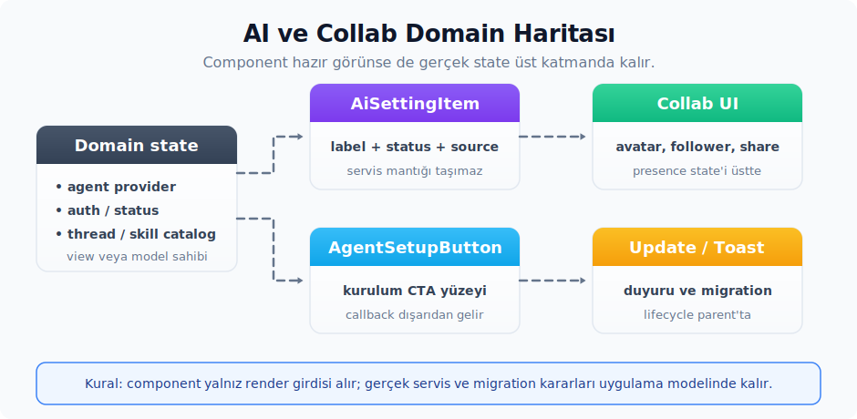

# 15. AI ve Collab Özel Alanı

Bu bölümdeki bileşenler Zed'in AI, agent, provider, collaboration ve update akışlarına yakından bağlıdır. Bu yüzden genel bir uygulamada kullanılmadan önce domain modelinin bu API'lere gerçekten uyup uymadığı kontrol edilmelidir. Aksi halde component görsel olarak hazır görünür, fakat modelin ihtiyaçlarıyla çelişebilir.

Bu ailede iki genel kural vardır:

- Domain'e bağlı bileşenlerde gerçek servis state'i component'in içine taşınmaz. Component'e yalnızca render için gereken label, status, ikon, callback ve metadata verirsin.
- AI ve Collab bileşenleri başka panellerde kompoze edilirken domain state'i view'da tutulur. Bu component'ler yalnızca o state'i görsel olarak düzenler.



## AiSettingItem

Kaynak:

- Tanım: `ui` crate'i
- Export: `ui::AiSettingItem`, `ui::AiSettingItemStatus`, `ui::AiSettingItemSource`.
- Prelude: Hayır; ayrıca import edersin.
- Preview: `impl Component for AiSettingItem`.

Ne zaman kullanırsın:

- MCP server, agent provider veya AI integration için ayar satırı göstermek gerektiğinde.
- Status indicator, source icon, detail label, action button ve detay satırını tek bir kompakt row'da toplamak için.

Temel API:

- `AiSettingItem::new(id, label, status, source)`.
- `.icon(element)`.
- `.detail_label(text)`.
- `.action(element)`.
- `.details(element)`.
- `AiSettingItemStatus`: `Stopped`, `Starting`, `Running`, `Error`, `AuthRequired`, `ClientSecretRequired`, `Authenticating`.
- `AiSettingItemSource`: `Extension`, `Custom`, `Registry`.

AI ayar satırı enum'ları:

| API | Rol |
| :-- | :-- |
| `AiSettingItemStatus` | Provider veya MCP satırının durumunu taşır: `Stopped`, `Starting`, `Running`, `Error`, `AuthRequired`, `ClientSecretRequired`, `Authenticating`. |
| `AiSettingItemSource` | Ayarın nereden geldiğini belirtir: `Extension`, `Custom` veya `Registry`. |

Davranış:

- Bir icon verilmediğinde, label'ın ilk harfinden küçük bir avatar otomatik olarak üretilir.
- `Starting` ve `Authenticating` durumlarında ikon, opacity üzerinden pulse animasyonu alır.
- Status ile source için tooltip otomatik üretilir.
- Status indicator, `IconDecorationKind::Dot` ile ikonun köşesine yerleşir.

Örnek:

```rust
use ui::{
    AiSettingItem, AiSettingItemSource, AiSettingItemStatus, IconButton, IconName, IconSize,
    prelude::*,
};

fn render_mcp_setting_row() -> impl IntoElement {
    AiSettingItem::new(
        "postgres-mcp",
        "Postgres",
        AiSettingItemStatus::Running,
        AiSettingItemSource::Extension,
    )
    .detail_label("3 tools")
    .action(
        IconButton::new("postgres-settings", IconName::Settings)
            .icon_size(IconSize::Small)
            .icon_color(Color::Muted),
    )
}
```

Zed içinden kullanım örnekleri:

- `agent_ui` crate'i: MCP server ve agent configuration listeleri.
- `ui` crate'i: running, stopped, starting ve error preview örnekleri.

Dikkat edeceğin noktalar:

- Source enum'u, gerçek kurulum kaynağıyla eşleşmelidir; tooltip metni bu değerden türetilir.
- `.details(...)` uzun bir hata metni için kullanabilirsin. Yine de ana satırın kalabalıklaşmamasına dikkat etmek gerekir.

## AgentSetupButton

Kaynak:

- Tanım: `ui` crate'i
- Export: `ui::AgentSetupButton`.
- Prelude: Hayır; ayrıca import edersin.
- Preview: `impl Component for AgentSetupButton`.

Ne zaman kullanırsın:

- Onboarding veya provider setup ekranında bir agent seçeneğini bir card-button şeklinde göstermek için.
- Üstte ikon veya isim, altta state bilgisi olan küçük bir seçim yüzeyi gerektiğinde.

Temel API:

- `AgentSetupButton::new(id)`.
- `.icon(Icon)`.
- `.name(text)`.
- `.state(element)`.
- `.disabled(bool)`.
- `.on_click(handler)`.

Davranış:

- Disabled değilse ve bir `on_click` bağlanmışsa, hover sırasında pointer cursor, hover background ve border rengi uygulanır.
- `state(...)` verildiğinde, alt bölüm border-top ile subtle bir background ile ayrılır.

Örnek:

```rust
use ui::{AgentSetupButton, Icon, IconName, IconSize, prelude::*};

fn render_agent_setup_button() -> impl IntoElement {
    AgentSetupButton::new("setup-zed-agent")
        .icon(Icon::new(IconName::ZedAgent).size(IconSize::Small))
        .name("Zed Agent")
        .state(Label::new("Ready").size(LabelSize::Small).color(Color::Success))
        .on_click(|_, _window, _cx| {})
}
```

Zed içinden kullanım örnekleri:

- `onboarding` crate'i: onboarding sırasında agent setup seçenekleri.

Dikkat edeceğin noktalar:

- Boş bir card üretmemek için en azından icon ile name veya state verilmesi beklenir.
- Disabled durumdayken click handler render edilmez.

## ThreadItem

Kaynak:

- Tanım: `ui` crate'i
- Export: `ui::ThreadItem`, `ui::AgentThreadStatus`, `ui::ThreadItemWorktreeInfo`, `ui::WorktreeKind`.
- Prelude: Hayır; ayrıca import edersin.
- Preview: `impl Component for ThreadItem`.

Ne zaman kullanırsın:

- Bir agent thread listesinde title, status, timestamp, worktree metadata'sı ve diff özetini tek satırda göstermek için.
- Hover action slot'u ve selected/focused görsel state'i gerektiren thread listelerinde.

Temel API:

- `ThreadItem::new(id, title)`.
- `.timestamp(text)`.
- `.icon(IconName)`, `.icon_color(Color)`, `.icon_visible(bool)`.
- `.custom_icon_from_external_svg(svg)`.
- `.icon_char(text)`, icon slot'unda tek karakterlik agent/thread simgesi gösterir.
- `.notified(bool)`.
- `.status(AgentThreadStatus)`.
- `.title_generating(bool)`, `.title_label_color(Color)`, `.highlight_positions(Vec<usize>)`.
- `.title_slot(element)` — başlık alanını tamamen özel bir element ile doldurur; normal title, generating label ve highlight yolu yerine geçer.
- `.is_truncated(bool)` — uzun başlıklar için gradient taşma katmanını açar veya kapatır. Varsayılan değer `true`'dur.
- `.selected(bool)`, `.focused(bool)`, `.hovered(bool)`, `.rounded(bool)`.
- `.added(usize)`, `.removed(usize)`.
- `.project_paths(Arc<[PathBuf]>)`, `.project_name(text)`.
- `.worktrees(Vec<ThreadItemWorktreeInfo>)`.
- `.is_remote(bool)`, `.archived(bool)`.
- `.on_click(handler)`, `.on_hover(handler)`, `.action_slot(element)`, `.base_bg(Hsla)`.
- `AgentThreadStatus`: `Completed`, `Running`, `WaitingForConfirmation`, `Error`. `Completed` varsayılan durumdur ve özel bir status ikonu/animasyonu göstermez.

Thread metadata taşıyıcıları:

| API | Rol |
| :-- | :-- |
| `AgentThreadStatus` | Thread satırının tamamlanmış, çalışıyor, onay bekliyor veya hata durumunda olduğunu seçer. |
| `ThreadItemWorktreeInfo` | Thread satırında gösterilecek worktree adı, branch adı, tam path, highlight pozisyonları ve worktree türünü taşır. |
| `WorktreeKind` | Worktree bilgisini `Main` veya `Linked` olarak sınıflandırır; component yalnız gösterilebilir linked metadata'yı öne çıkarır. |

Davranış:

- `Running` status, `LoadCircle` ikonunu rotate animation ile birlikte gösterir.
- `WaitingForConfirmation` warning ikonu ve bir tooltip üretir.
- `Error` durumu close ikonu ve bir tooltip üretir.
- `notified(true)` accent bir circle kullanır.
- Metadata satırında linked worktree bilgisi, project name veya path, diff stat ve timestamp sırayla render edilir.
- `title_slot(...)` verildiğinde başlık metnini component değil verilen element çizer; bu yol özel ikon, badge veya zengin başlık kompozisyonu için ayrılmıştır.
- `is_truncated(false)` gradient taşma katmanını kapatır; parent layout başlık taşmasını kendisi yönetecekse kullanılır.
- `action_slot(...)` yalnızca `.hovered(true)` durumunda görünür.

Örnek:

```rust
use ui::{
    AgentThreadStatus, IconButton, IconName, IconSize, ThreadItem,
    ThreadItemWorktreeInfo, WorktreeKind, prelude::*,
};

fn render_agent_thread() -> impl IntoElement {
    ThreadItem::new("thread-parser", "Fix parser error recovery")
        .icon(IconName::AiClaude)
        .status(AgentThreadStatus::Running)
        .timestamp("12m")
        .worktrees(vec![ThreadItemWorktreeInfo {
            worktree_name: Some("parser-fix".into()),
            branch_name: Some("fix/parser-recovery".into()),
            full_path: "/worktrees/parser-fix".into(),
            highlight_positions: Vec::new(),
            kind: WorktreeKind::Linked,
        }])
        .added(42)
        .removed(7)
        .hovered(true)
        .action_slot(
            IconButton::new("delete-thread", IconName::Trash)
                .icon_size(IconSize::Small)
                .icon_color(Color::Muted),
        )
}
```

Zed içinden kullanım örnekleri:

- `sidebar` crate'i: thread switcher listesi.
- `sidebar` crate'i: sidebar thread entries.
- `zed` crate'i: geniş thread item varyantları.

Dikkat edeceğin noktalar:

- `ThreadItem` yoğun bir domain component'idir. Genel bir liste satırı ihtiyacı için `ListItem` veya özel bir `h_flex()` kompozisyonu çok daha temiz bir çözüm sunar.
- Worktree metadata'sında yalnızca `WorktreeKind::Linked` olan ve worktree veya branch bilgisi bulunan girdiler gösterilir; diğerleri bileşen tarafından filtrelenir.
- Hover state'i component içinde ölçülmez. Parent view, `.hovered(...)` değerini doğru şekilde yönetmek durumundadır.

## ConfiguredApiCard

Kaynak:

- Tanım: `ui` crate'i
- Export: `ui::ConfiguredApiCard`.
- Prelude: Hayır; ayrıca import edersin.
- Preview: `impl Component for ConfiguredApiCard`.

Ne zaman kullanırsın:

- Bir API key veya provider credential'ın yapılandırılmış olduğu durumu göstermek için.
- Reset veya remove key aksiyonunu aynı satırda sunmak için.

Temel API:

- `ConfiguredApiCard::new(label)`.
- `.button_label(text)`.
- `.tooltip_label(text)`.
- `.disabled(bool)`.
- `.button_tab_index(isize)`.
- `.on_click(handler)`.

Davranış:

- Sol tarafta success rengiyle bir `Check` ikonu ve label render edilir.
- Button label verilmediğinde varsayılan olarak `"Reset Key"` gelir.
- Button'ın start ikonu `Undo`'dur.
- `disabled(true)`, button'ı disabled hâle getirir ve click handler bağlanmaz.

Örnek:

```rust
use ui::{ConfiguredApiCard, prelude::*};

fn render_configured_key_card() -> impl IntoElement {
    ConfiguredApiCard::new("OpenAI API key configured")
        .button_label("Reset Key")
        .tooltip_label("Click to replace the current key")
        .on_click(|_, _window, _cx| {})
}
```

Zed içinden kullanım örnekleri:

- `language_models` crate'i: provider key state'i.
- `language_models` crate'i, `deepseek`, `google`, `open_router`: benzer provider kartları.
- `settings_ui` crate'i.

Dikkat edeceğin noktalar:

- Card yalnızca configured durumu temsil eder; bir credential giriş formu değildir.
- `button_tab_index(...)`, provider setup ekranında klavye sırasını ayarlamak için kullanırsın.

## SkillsIllustration

Kaynak:

- Tanım: `ui` crate'i
- Export: `ui::SkillsIllustration`.
- Prelude: Hayır; `use ui::SkillsIllustration;` ayrıca eklersin.
- Preview: Doğrudan `impl Component for SkillsIllustration` yok; onboarding ve agent skills yüzeylerinde başka component'lerin içinde kullanırsın.

Ne zaman kullanırsın:

- Onboarding, "what's new" veya agent skills özelliklerini tanıtan boş durum ekranlarında. Skill adları ve source bilgisiyle küçük bir görsel tanıtım alanı gerektiğinde.
- Henüz veri olmayan ama özelliğin görsel anlamını anlatmak gereken alanlarda dekoratif bir illustration olarak.

Ne zaman kullanmazsın:

- Gerçek bir agent thread listesi için: `ThreadItem` ile `List` kompozisyonu kullanırsın.
- Etkileşim gerektiren agent provider seçimi için: `AgentSetupButton` veya `AiSettingItem` çok daha uygundur.
- Gerçek skill katalogu, arama veya seçim listesi için bu component kullanılmaz; yalnızca statik bir illustration'dır ve click handler veya state yüzeyi sunmaz.

Temel API:

- Constructor: `SkillsIllustration::new()`. Bu çağrı argümansızdır.
- `RenderOnce` implement eder; sonradan eklenen bir style builder zinciri yoktur.
- Konteyner içinde yerleştirildiğinde yüksekliği 150px civarında sabittir; genişliği ise parent layout belirler.

Davranış:

- Üç satırlı bir skill listesi çizer. Her satırda iki küçük skill etiketi yer alır.
- Her skill etiketi `Sparkle` ikonu, skill adı ve parantez içinde source bilgisini gösterir.
- Üst katmanda editor background renginden transparana giden bir gradient fade bulunur.
- Renkler `cx.theme().colors().border`, `element_active` ve `editor_background` token'larından beslenir; bu sayede tema değişikliklerinde otomatik uyum sağlar.

Örnek:

```rust
use ui::prelude::*;
use ui::SkillsIllustration;

fn render_skills_onboarding() -> impl IntoElement {
    v_flex()
        .gap_2()
        .child(Headline::new("Use agent skills").size(HeadlineSize::Large))
        .child(
            Label::new("Attach focused skills to give the agent reusable context.")
                .size(LabelSize::Small)
                .color(Color::Muted),
        )
        .child(SkillsIllustration::new())
}
```

Zed içinden kullanım örnekleri:

- `agent_ui` crate'i ve onboarding ilişkili akışlar: skill özelliğinin tanıtım alanlarında dekoratif bir illustration olarak.
- `ui` crate'i: bileşenin tek tanım dosyası; alt yapı taşları (`Label`, `Icon`, `h_flex`, `v_flex`) doğrudan ui crate'inden tüketilir.

Dikkat edeceğin noktalar:

- Bu bileşen yalnızca görsel bir illustration'dır; gerçek thread, worktree veya agent verisi göstermek için kullanılmaması beklenir.
- İçindeki skill adları statiktir; gerçek proje veya kullanıcı skill listesinden beslenmez.
- `SkillsIllustration::new()` çağrısı parametresizdir; renk veya boyut özelleştirmesi tamamen bileşenin kendi içine bağımlıdır. Farklı bir görsele ihtiyaç doğduğunda, kaynak dosyayı referans alarak özel bir illustration component'i yazmak daha uygun olur.

## CollabNotification

Kaynak:

- Tanım: `ui` crate'i
- Export: `ui::CollabNotification`.
- Prelude: Hayır; ayrıca import edersin.
- Preview: `impl Component for CollabNotification`.

Ne zaman kullanırsın:

- Incoming call, project share, contact request veya channel invite gibi iki aksiyonlu collaboration notification view'ı için.
- Avatar, metin ve accept/dismiss buton düzenini standart bir şekilde tutmak için.

Temel API:

- `CollabNotification::new(avatar_uri, accept_button, dismiss_button)`.
- ParentElement: `.child(...)`, `.children(...)`.

Davranış:

- Avatar `px(40.)` boyutunda render edilir.
- Sağ tarafta iki button dikey olarak yerleşir.
- İçerik `SmallVec<[AnyElement; 2]>` üzerinden tutulur ve bir `v_flex().truncate()` içinde render edilir.

Örnek:

```rust
use ui::{Button, CollabNotification, prelude::*};

fn render_project_share_notification() -> impl IntoElement {
    CollabNotification::new(
        "https://avatars.githubusercontent.com/u/67129314?v=4",
        Button::new("open-shared-project", "Open"),
        Button::new("dismiss-shared-project", "Dismiss"),
    )
    .child(Label::new("Ada shared a project with you"))
    .child(Label::new("zed").color(Color::Muted))
}
```

Zed içinden kullanım örnekleri:

- `collab_ui` crate'i
- `collab_ui` crate'i
- `collab_ui` crate'i

Dikkat edeceğin noktalar:

- Accept ve dismiss button'larının callback'leri parent notification view'ında bağlanmalıdır.
- Uzun kullanıcı veya proje adlarında, child label'lara bir truncate davranışının eklemen gerekir; aksi halde satır taşabilir.

## Agent Skills UI

Kaynak:

- Completion ve mention: `agent_ui` crate'i, `acp_thread` crate'i.
- Thread banner'ları: `agent_ui` crate'i.
- Rules migration: `prompt_store` crate'i.
- Announcement toast: `auto_update_ui` crate'i.

Ne zaman kullanırsın:

- Agent input içinde `/skill-name` veya `@` mention üzerinden bir `SKILL.md` dosyasını prompt bağlamına eklemek için.
- Skill load hatalarını conversation içinde kullanıcıya gösterip dosyaya doğrudan açılabilir bir aksiyon sunmak için.
- Skills tanıtımını kullanıcıya tek seferlik bir announcement toast üzerinden iletmek için.

Davranış:

- Prompt context tipi `skill` olarak geçer ve UI label'ı `Skills`, ikonu `IconName::Sparkle` olur.
- Slash autocomplete açıldığında provider önce delegate'e `slash_autocomplete_invoked(...)` bildirir; native agent bunu global ve proje-local skills taramasını başlatmak için kullanır.
- Slash listesinde Skills, Agent Commands grubundan önce sıralanır. Skill completion label'ında ad ve scope/source birlikte gösterilir; documentation alanında skill description yer alır.
- Skill seçildiğinde metne `MentionUri::Skill` link'i eklersin. Link veya mention açıldığında ilgili `SKILL.md` dosyası workspace içinde absolute path ile açılır.
- `SkillLoadingErrorsUpdated` event'leri thread view'da warning `Callout` olarak render edilir. Her callout `Open File` butonu ve dismiss icon button'ı taşır; dosya düzeltildiğinde veya kaldırıldığında dismiss kaydı da temizlenir.
- Rules-to-Skills migration tek seferlik ve non-destructive çalışır; tüm kullanıcılar için aynı şekilde uygulanır. `MIGRATION_DONE_KEY` global KVP anahtarıyla bir kez çalışacak şekilde korunur. Non-default Rules global skills dizinine `SKILL.md` olarak taşınır; Default Rules ve özelleştirilmiş built-in prompt gövdeleri global `AGENTS.md` dosyasına eklersin. Sonuç `rules_to_skills_migration_result` anahtarıyla saklarsın.
- Skills announcement toast'u `auto_update_ui` içinde "Introducing Skills Support" başlığıyla kurarsın. Migration sonucu boş değilse Rules dönüşümünü anlatan ek bullet gösterir; primary action agent paneline focus eder, secondary action skills dokümantasyonuna gider. Toast `skills_announcement_dismissed` KVP anahtarıyla bir kez dismiss edilir.
- Tool permissions setup sayfasında `skill` aracı ayrı bir satırdır. Regex pattern'leri skill adıyla değil, skill'in `SKILL.md` dosyasının absolute path'iyle eşleşir.

Dikkat edeceğin noktalar:

- Skill gövdesi component state'ine kopyalanmaz; UI catalog metadata'sını, dosya yolunu ve yükleme hatalarını gösterir. Gövde, ihtiyaç anında skill tool tarafından okunur.
- Project-local skill ile global skill aynı adı kullanıyorsa, kullanıcı arayüzünde scope/source gösterilmelidir; aksi halde slash completion'da hangi skill'in seçildiği belirsizleşir.
- Skill load hataları dismiss edilebilir ama bu kalıcı bir suppress değildir. Alttaki dosya düzelip sonra yeniden bozulursa hata tekrar gösterilir.

## UpdateButton

Kaynak:

- Tanım: `ui` crate'i
- Export: `ui::UpdateButton`.
- Prelude: Hayır; ayrıca import edersin.
- Preview: `impl Component for UpdateButton`.

Ne zaman kullanırsın:

- Title bar içinde auto-update durumunu ve update aksiyonunu göstermek için.
- Checking, downloading, installing, updated veya error state'leri için hazır bir görünüm gerektiğinde.

Temel API:

- `UpdateButton::new(icon, message)`.
- `.icon_animate(bool)`.
- `.icon_color(Option<Color>)`.
- `.tooltip(text)`.
- `.with_dismiss()`.
- `.disabled(bool)`.
- `.on_click(handler)`.
- `.on_dismiss(handler)`.
- Convenience constructor'lar: `UpdateButton::checking()`, `downloading(version)`, `installing(version)`, `updated(version)`, `errored(error)`.

Davranış:

- `icon_animate(true)` çağrısı, ikona rotate animation uygular.
- `.with_dismiss()` sağ tarafta bir dismiss icon button gösterir.
- `.disabled(true)`, ana `ButtonLike` alanını disable eder. Bunun yanında checking, downloading ve installing convenience constructor'ları bu durumu kendileri uygular.
- Ana alan `ButtonLike::new("update-button")` üzerinden render edilir.
- Tooltip verildiğinde ana button area'ya bağlanır.
- `checking()` ile `installing(...)` dönen `IconName::LoadCircle` kullanır; animation süresi 2 saniyedir. `downloading(...)` `IconName::Download`, `errored(...)` ise `IconName::Warning` ile çizilir.
- Convenience constructor'ların varsayılan mesajları şu şekildedir: `checking()` "Checking for Zed Updates…", `downloading(...)` "Downloading Zed Update…", `installing(...)` "Installing Zed Update…", `errored(...)` ise "Failed to Update". Özel bir metin gerektiğinde `UpdateButton::new(...)` ile açıkça bir state kurarsın.
- Kenarlık rengi disabled state'e göre değişir: aktif konumda `colors().text.opacity(0.15)` ile yumuşatılmış bir border, disabled konumda ise standart `colors().border` kullanırsın. Bu nedenle aktif `updated(...)` ve `errored(...)` durumları, disabled olan checking, downloading ve installing durumlarından daha belirgin bir kenarlık taşır.
- Title bar'daki `UpdateVersion` tooltip'i `Update to Version: ...` biçimindedir; SHA tabanlı bir version'da kısaltılmış SHA yerine tam SHA gösterilir.

Örnek:

```rust
use ui::{UpdateButton, prelude::*};

fn render_ready_update_button() -> impl IntoElement {
    UpdateButton::updated("1.99.0")
        .on_click(|_, _window, _cx| {})
        .on_dismiss(|_, _window, _cx| {})
}
```

Zed içinden kullanım örnekleri:

- `auto_update_ui` crate'i: auto-update title bar ve notification akışları.

Dikkat edeceğin noktalar:

- Bu component title bar bağlamına göre tasarlanmıştır; genel bir sayfa CTA'sı olarak kullanılması beklenmez.
- `checking()`, `downloading(...)` ve `installing(...)` constructor'ları zaten disabled bir hâlde gelir. Bu yüzden bu durumlarda click handler bağlamak anlamsızdır; kullanıcı bir aksiyon yapabilmeliyse `updated(...)`, `errored(...)` veya `UpdateButton::new(...)` ile açıkça bir state kurmak gerekir.
- `updated(...)` ve `errored(...)` dismiss gösterir; bir dismiss callback'i bağlanmadığında button görünür kalır ama state temizlenmez.

## AI/Collab Kompozisyon Örnekleri

Bir collab özet satırı için Facepile, Chip ve DiffStat birlikte kullanabilirsin. Aşağıdaki örnek hem reviewer'ları hem değişiklik sayısını hem de açıklayıcı bir başlığı tek bir satırda toplar:

```rust
use ui::{Avatar, Chip, DiffStat, Facepile, prelude::*};

fn render_collab_summary() -> impl IntoElement {
    h_flex()
        .gap_2()
        .items_center()
        .child(
            Facepile::empty()
                .child(Avatar::new("https://avatars.githubusercontent.com/u/326587?s=60"))
                .child(Avatar::new("https://avatars.githubusercontent.com/u/2280405?s=60")),
        )
        .child(
            v_flex()
                .min_w_0()
                .child(Label::new("Reviewing changes").truncate())
                .child(Chip::new("2 reviewers").label_color(Color::Muted)),
        )
        .child(DiffStat::new("review-summary-diff", 12, 3))
}
```

Bir agent ayar satırı için ise `AiSettingItem` ile `ConfiguredApiCard` birlikte iyi bir özet sunar. İlki MCP veya agent provider'ı temsil eder; ikincisi credential'ın yapılandırıldığını gösterir:

```rust
use ui::{
    AiSettingItem, AiSettingItemSource, AiSettingItemStatus, ConfiguredApiCard,
    IconButton, IconName, IconSize, prelude::*,
};

fn render_agent_settings_summary() -> impl IntoElement {
    v_flex()
        .gap_2()
        .child(
            AiSettingItem::new(
                "claude-agent",
                "Claude Agent",
                AiSettingItemStatus::Running,
                AiSettingItemSource::Extension,
            )
            .detail_label("Ready")
            .action(
                IconButton::new("agent-settings", IconName::Settings)
                    .icon_size(IconSize::Small)
                    .icon_color(Color::Muted),
            ),
        )
        .child(ConfiguredApiCard::new("Anthropic API key configured"))
}
```

Bu bölümdeki bileşenlerin nerede tercih edileceğini özetleyen kısa bir karar rehberi şöyle özetlenebilir:

- Kişi görseli için `Avatar`; kişi grubu için `Facepile`.
- Kompakt metadata etiketi için `Chip`.
- Eklenen ve silinen satır özetleri için `DiffStat`.
- Açılır veya kapanır bir icon button için `Disclosure`.
- Sağ kenarda yumuşak bir fade overlay için `GradientFade`.
- Bundled bir SVG için `Vector`; raster veya dış kaynaklı bir görsel için GPUI `img(...)`.
- Shortcut render için `KeyBinding`; açıklamalı bir shortcut hint için `KeybindingHint`.
- Focus ve scroll traversal için `Navigable`.
- AI ayar satırı için `AiSettingItem`; provider credential state'i için `ConfiguredApiCard`; agent thread listesi için `ThreadItem`.
- Agent skills özelliği için onboarding veya illustration alanı gerekiyorsa `SkillsIllustration` (yalnızca dekoratif).
- Collaboration toast layout'u için `CollabNotification`; title bar update state'i için `UpdateButton`.
