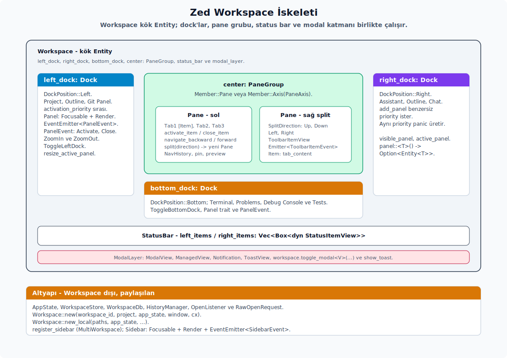

# Dock ve Panel Modeli

---

## Çalışma Alanı İskeleti

`workspace` crate'i GPUI çekirdeğinin üstüne `Workspace` adında merkezi bir uygulama görüntüsü koyar; merkezde pane grubunu, solda `left_dock`'u, sağda `right_dock`'u ve altta `bottom_dock`'u bir arada tutar. Bu modelin ana kaynak yüzeyi `workspace` crate'inin dock, pane ve panel modülleridir.

**Panel yardımcı yüzeyi.** Panel UI'ı yazarken aşağıdaki sınırları bilmen gerekir:

- `panel::PanelHeader` varsayılan `header_height` veya `panel_header_container` sağlayan bir yardımcı trait değildir; `workspace::Panel` üstünde işaretleyici bir trait'tir. Başlık yüksekliği gerekiyorsa doğrudan `Tab::container_height(cx)`, kapsayıcı gerekiyorsa `h_flex()`/`v_flex()` ve `ui::Button`/`ui::IconButton` bileşenleri kurarsın.
- `panel_button`, `panel_filled_button`, `panel_icon_button` ve `panel_filled_icon_button` serbest fonksiyon yardımcıları yoktur. Panel UI'ında buton katman/boyut/stil kararları doğrudan bileşen üzerinde açıkça belirtilir.
- Git paneli `GitPanelTab::{Changes, History}` durumuyla iki tab çizer. Changes sekmesi staged/unstaged liste ve commit footer akışını taşır; History sekmesi commit geçmişini `UniformListScrollHandle` ile sanallaştırır, ok tuşlarıyla `focused_history_entry` seçer ve confirm ile `CommitView::open` çağırır. Panel action dinleyicilerine `ActivateChangesTab` ve `ActivateHistoryTab` eklemen gerekir.
- Branch diff görünümü toolbar'daki `Base: ...` popover'ı ile diff baz branch'ini değiştirir. Picker `branch_picker::select_popover(...)` üzerinden checkout yapmadan branch seçer, geri çağrı `DiffBase::Merge { base_ref }` ayarlar ve `BranchDiff::set_diff_base` `BranchDiffEvent::DiffBaseChanged` yayar. Ağaç tabanlı merge-base diff hesabı sürerken `is_tree_base_loading()` true döner; boş görünümler bunu yükleme göstergesiyle ayırmalı, eski statik baz varsayımına dönmemelidir.

**Çalışma alanı yapısı.** Çalışma alanı üç ana dock'u ve merkezdeki pane grubunu bir arada tutar:

- **Oluşturma:** Zaten hazırlanmış bir `Project` entity'si için `Workspace::new(workspace_id, project, app_state, window, cx)` kullanırsın; path listesinden yeni çalışma alanı açma akışında ise yüksek seviyeli `Workspace::new_local(...)` tercih edersin.
  - `workspace_id`: Varsa kalıcı çalışma alanı kimliği; yeni oturumlarda `None` verilebilir.
  - `project`: Dosya, arama, dil ve terminal servislerini sağlayan çekirdek proje entity'si.
  - `app_state`: Genel istemci (`client`), kullanıcı ve dil (`LanguageRegistry`) kayıtlarını barındıran durum.
- `Workspace` merkezde pane grubunu, solda `left_dock`'u, sağda `right_dock`'u ve altta `bottom_dock`'u taşır.
- Dock entity'sini `DockPosition::{Left, Bottom, Right}` ile konumlandırırsın.
- `Workspace::left_dock()`, `right_dock()`, `bottom_dock()`, `all_docks()`, `dock_at_position(position)` ile erişirsin.
- Aksiyonlar: `ToggleLeftDock`, `ToggleRightDock`, `ToggleBottomDock`, `ToggleAllDocks`, `CloseActiveDock`, `CloseAllDocks`, `Increase/DecreaseActiveDockSize`, `ResetActiveDockSize` gibi.

**Panel yazma.** Yeni bir paneli `Panel` trait'ini uygulayarak tanımlarsın:

- `persistent_name()` dock durumu serileştirmesinde ve telemetry'de kullanılan kimliktir; `panel_key()` ise boyut durumu kalıcılaştırma ve keymap context kimliğidir.
- `position`, `position_is_valid`, `set_position` panelin hangi dock'ta oturduğunu yönetir.
- `default_size`, `min_size`, `initial_size_state`, `size_state_changed`, `supports_flexible_size`, `has_flexible_size`, `set_flexible_size` boyut ve kalıcılık davranışını belirler.
- `icon`, `icon_tooltip`, `icon_label`, `toggle_action`, `activation_priority` status bar butonunu ve sıralamayı tanımlar.
- `starts_open`, `enabled`, `set_active`, `is_zoomed`, `set_zoomed`, `pane`, `remote_id` dock durumu ve uzak çalışma alanı entegrasyonudur.
- `is_agent_panel` ajan paneli gibi özel panelleri işaretler; `hide_button_setting` panel butonunu gizleme ayarına bağlanır.
- Panel `Focusable + EventEmitter<PanelEvent> + Render` olmalıdır.

**Dock davranışı.** Dock entity'sinin panel ekleme ve görünürlük yönetimi şu şekildedir:

- `Dock::add_panel` paneli `activation_priority` sırasına göre ekler. Aynı priority'i kullanan iki panel hata ayıklama build'inde panic'e yol açar; her panele benzersiz bir priority seçersin.
- `Dock::set_open`, `activate_panel`, `active_panel`, `active_panel_index`, `visible_panel`, `panel::<T>()`, `panel_for_id`, `panel_index_for_type`, `panel_index_for_proto_id`, `panel_index_for_persistent_name`, `remove_panel`, `panels_len` ve `first_enabled_panel_idx` temel görünürlük, arama ve seçim API'leridir.
- `active_panel_size`, `stored_active_panel_size`, `stored_panel_size`, `stored_panel_size_state`, `resize_active_panel`, `resize_all_panels`, `clamp_panel_size` ve `toggle_panel_flexible_size` panel boyutu ve esnek boyut geçişlerini yönetir.
- `restore_state`, serialize edilmiş dock durumundan aktif panel, açık/kapalı durum ve zoom bilgisini geri yükler.
- `set_panel_zoomed`, `zoomed_panel` ve `zoom_out` panel zoom katmanı ile çalışma alanı serileştirmesini birlikte günceller.
- `has_agent_panel` dock içinde agent paneli var mı sorusunu cevaplar; AI/multi-workspace sidebar durumunu değerlendirirken kullanılır.
- Panel `PanelEvent::Activate` yaydığında dock açılır, panel aktiflenir ve odak panele taşınır.
- `PanelEvent::Close` aktif görünür paneli kapatır.
- `PanelEvent::ZoomIn/ZoomOut` çalışma alanı zoom katmanı durumunu günceller.
- Boyut durumu `PanelSizeState { size, flex }` olarak kalıcılaştırılır.

**Dock ve panel API kapsamı.** Bu ailedeki action ve enum'ların çoğu ayrı uzun bölüm değil, davranış tablosu gerektirir:

| API | Açıklama |
|-----|----------|
| `dock` | `Dock`, `Panel`, `PanelHandle`, `DockPosition`, `PanelEvent` ve panel boyut durumunu barındıran modül ailesidir. |
| `DockPosition` | `Left`, `Bottom`, `Right` dock yerleşimlerini taşır; `axis()` yan dock'lar için `Horizontal`, alt dock için `Vertical` döndürür. |
| `PanelEvent` | `Activate`, `Close`, `ZoomIn`, `ZoomOut` olaylarıyla dock'un panel görünürlüğünü, odaklanmasını ve zoom katmanını günceller. |
| `PanelSizeState` | `size: Option<Pixels>` ve `flex: Option<f32>` alanlarıyla dock panel boyutunu kalıcılaştırır. |
| `ToggleLeftDock` | Sol dock'u açar veya kapatır. |
| `ToggleRightDock` | Sağ dock'u açar veya kapatır. |
| `ToggleBottomDock` | Alt dock'u açar veya kapatır. |
| `ToggleAllDocks` | Açık dock setini saklayıp tüm dock'ları kapatır; tekrar çağrıldığında önceki açık seti geri yükler. |
| `CloseActiveDock` | O anda odaklı veya aktif görünen dock'u kapatır. |
| `CloseAllDocks` | Üç dock'u da kapatır. |
| `DecreaseActiveDockSize` | `px` alanındaki piksel miktarı kadar aktif dock boyutunu azaltır. |
| `ResetActiveDockSize` | Aktif dock panel boyutunu varsayılan boyuta döndürür. |
| `ZoomIn` | Aktif pane'i zoom katmanına taşır. |
| `ZoomOut` | Pane zoom'unu kapatır ve normal pane yerleşimine döner. |

**Dock, panel ve sidebar ek API kapsamı.** Aşağıdaki dışa açık yüzeyler dock modelinin ayar, serileştirme, render ve sidebar bağlantı parçalarıdır. Birçoğu re-export olduğu için ayrı başlık yerine ait olduğu karar hattında okunmalıdır.

| API | Rol |
| :-- | :-- |
| `DockData`, `DockStructure` | Dock/pane ağacının restore ve serialization sırasında taşınan veri modelidir. |
| `PanelId`, `PanelButtons`, `DraggedSidebar`, `SidebarHandle` | Panel kimliği, panel buton seti, sidebar drag payload'u ve sidebar entity handle sınırını temsil eder. |
| `StatusBarSettings`, `TabBarSettings` | Status bar ve tab bar davranışını taşıyan settings parçalarıdır. |
| `AutosaveSetting`, `BottomDockLayout`, `EncodingDisplayOptions`, `RestoreOnStartupBehavior` | Workspace'in settings content re-export'larıdır; autosave, alt dock düzeni, encoding görünümü ve startup restore davranışını bağlar. |
| `IncreaseActiveDockSize`, `DecreaseOpenDocksSize`, `IncreaseOpenDocksSize`, `ResetOpenDocksSize` | Aktif veya açık dock'ların piksel/flex boyutunu büyütme, küçültme ve sıfırlama action'larıdır. |
| `ActivePaneDecorator`, `PaneRenderContext`, `PaneRenderResult`, `HANDLE_HITBOX_SIZE` | Pane group render'ında aktif pane vurgusu, drag/resize hitbox ölçüsü ve render sonucu taşıyıcılarını kapsar. |
| `LeaderDecoration`, `PaneLeaderDecorator` | Collab/follow liderinin pane üzerinde görsel decoration olarak çizilmesini sağlayan trait ve taşıyıcı yüzeyidir. |
| `MoveFocusedPanelToNextPosition`, `CloseWorkspaceSidebar`, `FocusWorkspaceSidebar`, `ToggleWorkspaceSidebar` | Odaklı paneli konum döngüsünde taşır veya multi-workspace sidebar'ını kapatır, odaklar, açıp kapatır. |
| `MoveProjectToNewWindow`, `MultiWorkspaceEvent`, `MultiWorkspaceState`, `SerializedProjectGroup` | Multi-workspace penceresinde proje grubunu yeni pencereye taşıma, event ve persist state modelini taşır. |
| `NextProject`, `PreviousProject`, `NextThread`, `PreviousThread`, `NewThread` | Sidebar MRU geçişinde proje/thread ileri-geri gezinme ve yeni thread açma action'larıdır. |
| `PathList`, `SerializedPathList`, `RecentWorkspace`, `RemoteConnectionIdentity` | Recent workspace ve remote workspace açma akışında path listesi, serialize edilen path listesi ve remote kimliğini taşır. |
| `remote_connection_identity`, `same_remote_connection_identity`, `sidebar_side_context_menu` | Remote kimlik karşılaştırması ve sidebar tarafı bağlam menüsü için re-export edilen yardımcılardır. |

**`toggle_dock` akışı.** Dock'u açıp kapatan tipik akış birkaç adımdan oluşur:

1. Dock görünürse açık pozisyonları kaydedersin.
2. Dock açık durumunu terslersin.
3. Aktif panel yoksa ilk etkin paneli aktif edersin.
4. Açılıyorsa odağı panelin focus handle'ına taşırsın; kapanırken odak o panelden geliyorsa orta pane'e geri verirsin.
5. Çalışma alanını serileştirirsin.

**Yeni panel eklerken kontrol.** Aşağıdaki noktalar yeni bir panel hazırlanırken gözden geçirilmelidir:

- `panel_key` kalıcılaştırma ve keymap kimliğidir; yeni panelde baştan sabit bir değer seçmen gerekir.
- `position_is_valid` alt ve yan sınırlamalarını net tanımlamalıdır.
- `toggle_action()` action'ı önceden kaydedilmiş olmalıdır.
- `activation_priority()` benzersiz olmalıdır.
- `set_active` içinde UI durumu değiştiriliyorsa `cx.notify()` çağrısı bu akışa eklenmelidir.
- Dock değiştiren ayar gözlemcilerinde panel taşınırken boyut durumu ekseni değişiyorsa sıfırlanabilir; bu mevcut `Dock::add_panel`/ayar gözlemci akışında zaten yaparsın.

---
