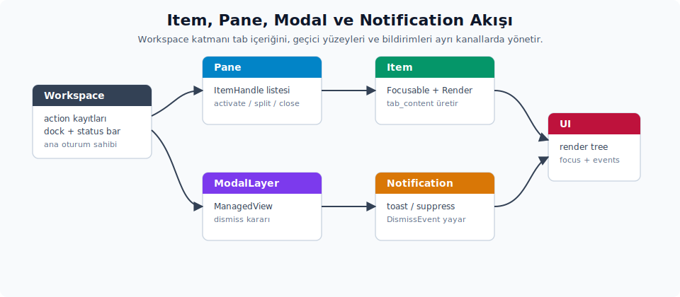
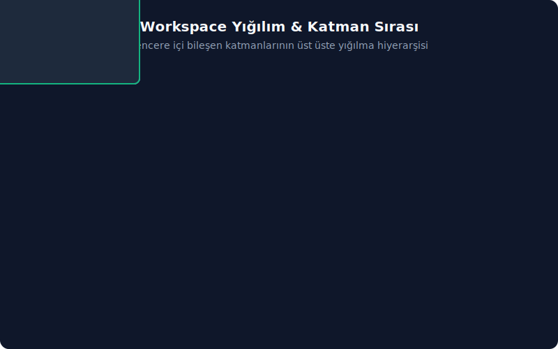

# Item, Pane, Modal, Toast ve Notification Sistemi

## Sürüm Analiz Raporu

- [x] Kaynak commit aralığı: `d0802abdecad..78b6bf2fbe2a`.
- [x] Doğrulanan pane yüzeyi: `dirty_message_for`, `MarkdownInlineCode`, `SaveIntent` ve dirty item kapatma uyarısı.
- [x] Kaynak doğrulama dosyası: `crates/workspace/src/pane.rs`.

GPUI bir UI framework'üdür. Zed'in çalışma alanı katmanı bunun üstünde tab/pane, modal, toast ve bildirim akışlarını standartlaştırır. Yeni bir editör benzeri panel veya komut yazarken bu sözleşmelerin bilinmesi gerekir.



Çalışma alanındaki farklı katmanların (Workspace, Pane/Tab, Modal, Toast ve Notification) üst üste yığılım hiyerarşisi (Z-index düzeni) aşağıdaki 3D şemada gösterilmiştir:



---

## Item ve ItemHandle

Pane içindeki her tab içeriği `Item` trait'ini uygular:

```rust
pub trait Item: Focusable + EventEmitter<Self::Event> + Render + Sized {
    type Event;

    fn tab_content(&self, params: TabContentParams, window: &Window, cx: &App)
        -> AnyElement;
    fn tab_content_text(&self, detail: usize, cx: &App) -> SharedString;
    fn tab_tooltip_text(&self, _: &App) -> Option<SharedString> { None }
    fn deactivated(&mut self, window: &mut Window, cx: &mut Context<Self>) {}
    fn workspace_deactivated(&mut self, window: &mut Window, cx: &mut Context<Self>) {}
    fn telemetry_event_text(&self) -> Option<&'static str> { None }
    fn navigate(
        &mut self,
        _data: Arc<dyn Any + Send>,
        _window: &mut Window,
        _cx: &mut Context<Self>,
    ) -> bool {
        false
    }
    // ... save/save_as, project_path, can_split, breadcrumbs, dragged_selection, ...
}
```

`ItemHandle` boxed veya dyn karşılığıdır; pane API'leri çoğunlukla `Box<dyn ItemHandle>` ile çalışır. `to_any_view`, `to_followable_item_handle`, `to_serializable_item_handle`, `to_searchable_item_handle` ve `downgrade_item` tip silinmiş view/search/follow/serialization köprüleridir. `project_paths`, `project_entry_ids`, `project_item_model_ids`, `workspace_settings`, `item_focus_handle`, `subscribe_to_item_events`, `relay_action`, `added_to_pane`, `on_release`, `dragged_tab_content` ve `can_autosave` ise pane yaşam döngüsü, odaklanma (focus), tab sürükleme, otomatik kaydetme (autosave) ve eylem (action) yönlendirme tarafında kullanılır. `FollowableItem` collab takibi için ek bir sözleşmedir.

`Item` ek davranış noktaları tab görünümü, yaşam döngüsü ve yetenek (capability) davranışını aynı trait içinde toplar. `tab_icon`, `tab_tooltip_content`, `suggested_filename`, `breadcrumb_location`, `breadcrumb_prefix`, `show_toolbar` ve `tab_extra_context_menu_actions` tab/breadcrumb arayüzünü besler. `can_save`, `can_save_as`, `is_dirty`, `capability`, `toggle_read_only`, `has_deleted_file` ve `has_conflict` save ve dosya durumu kararlarını verir. `added_to_workspace`, `pane_changed`, `discarded`, `on_removed`, `set_nav_history`, `preserve_preview`, `pixel_position_of_cursor`, `handle_drop`, `to_item_events`, `act_as_type` ve `clone_on_split` ise pane yaşam döngüsü, önizleme (preview), sürükle/bırak (drag/drop), olay çevirimi ve split davranışının genişletme noktalarıdır.

Dirty item kapatma uyarısı, path metnini `MarkdownInlineCode` ile sarar. Bu nedenle `dir/__init__.py` gibi markdown vurgusu üretebilecek dosya adları uyarı metninde kod parçası olarak güvenli biçimde görünür. Path yoksa metin dosya adı üretmeye çalışmaz ve genel buffer ifadesiyle kurulur.

**`active_project_path`.** `Item` trait'inde varsayılan bir yöntem olarak tanımlıdır; `ItemHandle::project_path` ise buna yönlendirilmiştir:

```rust
fn active_project_path(&self, cx: &App) -> Option<ProjectPath> {
    if self.buffer_kind(cx) != ItemBufferKind::Singleton {
        return None;
    }
    let mut result = None;
    self.for_each_project_item(cx, &mut |_, item| {
        result = item.project_path(cx);
    });
    result
}
```

Tekli arabellek (`Singleton`) öğeler bu varsayılanı miras alır; tek proje öğelerinin yolunu döndürür. Çok-arabellek öğeler (`ProjectDiff`, `MultiDiffView` gibi editör sarmalayıcıları) birincil imlecin altındaki arabelleğin yolunu döndürmek için bu yöntemi geçersiz kılar (override eder). `Editor` ise `active_buffer(cx)` üzerinden aktif tamponu bularak uygulamasını geçersiz kılar. `SplittableEditor` da sağ taraf editörüne yönlendirir.

`ItemHandle::project_path`, `<T as Item>::active_project_path` çağrısına yönlendirir; geçersiz kılma (override) tek bir noktada tanımlanır ve tutarlı çalışır.

Durum çubuğunun (status bar) breadcrumb güncellemesi ve git panelinin aktif dosya tespiti bu yol üzerinden çalışır. `ItemEvent::UpdateBreadcrumbs` olayı geldiğinde, aktif panedeki aktif öğe bu olayı yayarsa çalışma alanı `active_item_path_changed(false, window, cx)` çağrısını tetikler.

**Tipik akış.** Yeni bir sekme (tab) türü oluşturmak şu adımlardan geçer:

- `impl Item for BenimGorunumum` implementasyonu yazılır.
- `Workspace::open_path`, `open_paths` veya `open_abs_path` zaten `ProjectItem` üreterek doğru `Item` görünümünü açar; özel bir akışta `Pane::add_item(Box::new(view), ...)` kullanılır.
- `Pane::activate_item`, `close_active_item`, `split` (split direction ile yeni pane) Pane API'leridir; `navigate_backward` ise `GoBack` action'ının işleyicisidir.
- `Workspace::split_pane(pane, direction, cx)` mevcut pane'i böler.
- `Workspace::register_action::<A>(|workspace, &A, window, cx| ...)` çalışma alanı seviyesinde global eylemleri ekler (komut paleti veya keymap üzerinden tetiklenir).

---

## ModalView ve Modal Layer

`ModalView` trait'i şu sözleşmeyi taşır:

```rust
pub trait ModalView: ManagedView {
    fn on_before_dismiss(
        &mut self,
        _window: &mut Window,
        _cx: &mut Context<Self>,
    ) -> DismissDecision {
        DismissDecision::Dismiss(true)
    }

    fn fade_out_background(&self) -> bool { false }
    fn render_bare(&self) -> bool { false }
}
```

`ManagedView = Focusable + EventEmitter<DismissEvent> + Render`. Modal yazarken bu bileşik trait'in sağlanması gerekir.

**Açma ve kapama.** Modal toggle akışı şu yardımcılara dayanır:

```rust
calisma_alani.toggle_modal(window, cx, |window, cx| {
    ModalGorunumu::new(window, cx)
});

calisma_alani.hide_modal(window, cx);
```

`toggle_modal` aynı tipte bir modal zaten açıksa onu kapatır; aksi halde yenisini açar. `on_before_dismiss` varsayılan olarak `DismissDecision::Dismiss(true)` döndürür. Bu metot `DismissDecision::Dismiss(false)` veya `Pending` döndürürse yeni modal görünmez.

**Tekrar açılabilir picker modalı.** Modal katmanı kapatılan son tekrar açılabilir picker'ı düşürmek yerine gizli bir stashed modal olarak saklayabilir. Picker tarafında varsayılan `reopenable` değeri açıktır; özel bir picker bu davranıştan çıkarılacaksa `Picker::reopenable(false, cx)` kullanılır. Kayıt mekanizması modal wrapper tipine değil focus kimliğine dayanır:

| API | Rol |
| :-- | :-- |
| `register_reopenable_picker(focus_handle, cx)` | Picker veya picker taşıyan modalın focus handle değerini tekrar açılabilir registry'ye ekler. |
| `deregister_reopenable_picker(focus_handle, cx)` | Aynı focus handle için tekrar açma kaydını temizler. |
| `ModalLayer::reveal_stashed_modal(window, cx) -> bool` | Aktif modal yoksa saklanan son picker modalını yeniden gösterir ve bir modal açıldı olayını yayar. |
| `workspace::ReopenLastPicker` | Geçerli pencerede en son saklanan picker modalını tekrar görünür hale getiren workspace action'ıdır. |

## `SecurityModal`

`SecurityModal::new(worktree_store, remote_host, window, cx)` çalışma alanı güven kararını soran hazır modalı üretir. `window` parametresi, modal içinde kullanılan `InputField` entity'sinin oluşturulması için gereklidir. Tek bir dosya olmayan proje güven sorusu gösterildiğinde modal, güvenilecek klasör kapsamını düzenlenebilir bir alan olarak sunar; değer boş, göreli veya projenin üst dizini/eşiti olmayan bir yol ise alan hata durumuna geçer. `~` ile başlayan yollar kullanıcının home dizinine genişletilir.

| API | Rol |
| :-- | :-- |
| `SecurityModal::new(worktree_store, remote_host, window, cx)` | Worktree güven kararını soran modal görünümünü kurar; `remote_host` uzak geliştirme bağlamını, `window` ise içerideki giriş alanı entity'sini besler. |
| `SecurityModal::dismiss(cx)` | Modal kapatma isteğini çalışma alanı güven sonucuyla birlikte tamamlar. |
| `SecurityModal::refresh_restricted_paths(cx)` | Güven kapsamı giriş alanındaki güncel path değerinden kısıtlı yol listesini ve hata durumunu yeniden hesaplar. |

---

## StatusBar ve StatusItemView

`workspace` crate'i:

```rust
pub trait StatusItemView: Render {
    fn set_active_pane_item(
        &mut self,
        active_pane_item: Option<&dyn ItemHandle>,
        window: &mut Window,
        cx: &mut Context<Self>,
    );

    fn hide_setting(&self, cx: &App) -> Option<HideStatusItem>;
}
```

Çalışma alanı durum çubuğuna (status bar) öğe eklemek için:

```rust
calisma_alani.status_bar().update(cx, |durum_cubugu, cx| {
    durum_cubugu.add_left_item(sol_gorunum, window, cx);
    durum_cubugu.add_right_item(sag_gorunum, window, cx);
});
```

Status öğeleri, aktif pane öğesi değiştikçe `set_active_pane_item` ile bilgilendirilir; bu sayede git branch göstergesi (indicator) veya imleç konumu gibi bileşenler odaktaki tampona (buffer) göre güncellenir. `hide_setting()` `Some(HideStatusItem)` döndürürse status bar sağ tık menüsüne kaynakta `"Hide Button"` kaydı eklenir ve kullanıcı ayar dosyası `update_settings_file` üzerinden güncellenir. Öğe zaten başka bir ayarla koşullu görünüyorsa `None` döndürülebilir.

---

## Notification ve Toast Sistemi

`workspace` crate'i:

```rust
pub trait Notification:
    EventEmitter<DismissEvent> + EventEmitter<SuppressEvent> + Focusable + Render
{}

pub enum NotificationId {
    Unique(TypeId),               // tip başına tek
    Composite(TypeId, ElementId), // tip + sub-id
    Named(SharedString),          // serbest isim
}

// Yapıcı yardımcıları:
// NotificationId::unique::<BildirimGorunumu>()
// NotificationId::composite::<BildirimGorunumu>(oge_id)
// NotificationId::named("kaydet".into())
```

Mesaj göstermek için kullanılan başlıca akışlar şunlardır:

```rust
calisma_alani.show_notification(
    NotificationId::unique::<BildirimGorunumu>(),
    cx,
    |cx| cx.new(|cx| BildirimGorunumu::new(cx)),
);

calisma_alani.show_toast(
    Toast::new(NotificationId::named("kaydet".into()), "Kaydedildi")
        .autohide(),
    cx,
);

calisma_alani.show_error(hata, cx);
```

`show_error<E: WorkspaceError + 'static>(err, cx)` hatayı **sahiplenerek** alır (referansla değil); `String`, `&'static str` ve `anyhow::Error` için hazır `WorkspaceError` uygulaması bulunduğundan bu tipler doğrudan geçirilebilir. Hata yüzeyinin tamamı (önem düzeyi, eylem düğmeleri, otomatik kapanma) [Bildirim Yardımcıları ve Async Hata Gösterimi](05-bildirim-yardimcilari.md) bölümünde işlenir.

`Toast` hafif ve geçicidir (autohide); `Notification` ise kalıcı bir görünümdür (view) ve kullanıcı kapatana (dismiss edene) kadar görünür kalır. `SuppressEvent` aynı kaynaktan gelen tekrarlı bildirimleri bastırmak amacıyla kullanılır.

`Workspace::toggle_status_toast<V: ToastView>` modal layer mantığında `ToastView` üzerinden toast'ı toggle eder; tipik arayüz elemanları (örneğin asenkron iş ilerleme göstergeleri) bu yolla bağlanır.

```rust
pub trait ToastView: ManagedView {
    fn action(&self) -> Option<ToastAction>;
    fn auto_dismiss(&self) -> bool { true }
}
```

`ToastAction::new(label, on_click)` toast içindeki eylem butonunu tanımlar. `ToastView` tabanlı toast'larda otomatik kapatma (auto dismiss) varsayılan olarak `true`'dur. `Workspace::show_toast` ile gösterilen hafif `Toast` struct'ında ise `.autohide()` çağrılmadıkça otomatik kapanma yoktur.

---

## Item, Modal, Status ve Toast API Kapsamı

Bu bölümde bazı tipler davranışın ana başlığıdır (`Item`, `ModalView`, `Notification`), bazıları ise o davranışın seçenek veya olay taşıyıcısıdır. Aşağıdaki tablo ikinci grubu başlık yoğunluğu oluşturmadan kapsar.

| API | Rol |
|-----|-----|
| `workspace::Event` | Çalışma alanı seviyesinde pane ekleme/kaldırma, öğe (item) ekleme/kaldırma, aktif öğe değişimi, modal açma, zoom değişimi ve panel ekleme gibi olayları yayar. |
| `workspace::pane::Event` | Pane seviyesinde öğe ekleme, aktivasyon, kapatma, split, sabitleme/serbest bırakma (pin/unpin), odaklanma (focus) ve zoom olaylarını taşır. |
| `DismissDecision` | Modal kapanmadan önce `Dismiss(true)`, `Dismiss(false)` veya `Pending` kararı verir. |
| `HideStatusItem` | Status bar öğesinin sağ tık menüsünden kullanıcı ayarına gizleme yazmasını sağlar; `new` kapanışı alır, `apply` ayar dosyasını günceller. |
| `ItemEvent` | `CloseItem`, `UpdateTab`, `UpdateBreadcrumbs`, `Edit` sinyalleriyle öğe değişimini çalışma alanına bildirir. |
| `ItemBufferKind` | `Multibuffer`, `Singleton`, `None` ile öğenin proje tampon (project buffer) ilişkisini sınıflandırır. |
| `TabContentParams` | `detail`, `selected`, `preview`, `deemphasized`, `max_title_len` alanlarını tab çizimine taşır; `text_color()` anlamsal rengi üretir. `max_title_len: Option<usize>` sekme başlığının kırpılacağı azami uzunluğu çağırana bırakır (`None` ise öğenin kendi varsayılanı geçerlidir). |
| `TabTooltipContent` | Tooltip'i düz `Text` veya özel görünüm (custom view) üreten `Custom` kapanışı olarak temsil eder. |
| `OpenVisible` | Açılan yolun (path) proje panelindeki görünürlüğünü `All`, `None`, `OnlyFiles`, `OnlyDirectories` olarak sınırlar. |
| `NotificationId` | Bildirimleri `Unique(TypeId)`, `Composite(TypeId, ElementId)` veya `Named(SharedString)` kimliğiyle tekilleştirir (dedupe eder). |
| `SuppressEvent` | Kullanıcının aynı bildirim kaynağını bastırma isteğini bildirim görünümünden çalışma alanına taşır. |
| `ToastView` | `ManagedView` tabanlı toast view sözleşmesidir; `action()` buton eylemini, `auto_dismiss()` kapanma davranışını verir. |
| `ToastAction` | Toast içindeki buton için `id`, `label` ve opsiyonel `on_click` geri çağrısını taşır. |
| `modal_layer` | `ModalView`, `DismissDecision` ve modal yığını (modal stack) davranışını barındıran modül sınırıdır. |
| `notifications` | Çalışma alanı bildirim listesi, bildirim kimlikleri, uygulama seviyesi bildirimler ve hata yardımcılarının modül sınırıdır. |
| `pane` | Öğe sekme listesi, split, zoom, close/save eylemleri ve pane olaylarını barındıran ana modüldür. |
| `security_modal` | `SecurityModal` ve çalışma ağacı güven kapsamı doğrulama akışını barındıran modül sınırıdır. |

**Item, follow, modal ve toast ek kapsamı.** Bu dışa açık yüzeyler öğe yaşam döngüsünün yan kanallarıdır: Tab ayarları, follow/collab bağlantısı, modal stack ve notification host davranışını tamamlar.

| API | Rol |
| :-- | :-- |
| `ActivateOnClose`, `ClosePosition`, `ShowCloseButton`, `ShowDiagnostics` | Sekme kapatma sonrası aktivasyon, kapatma butonu konumu, kapatma butonu görünürlüğü ve tanı (diagnostic) göstergesi ayarlarını öğe yüzeyine yeniden ihraç (re-export) eder. |
| `HighlightedText` | Sekme veya öğe üstverisinde vurgulanan pozisyonlarla birlikte metin taşımak için kullanılan küçük veri modelidir. |
| `WeakItemHandle`, `WeakFollowableItemHandle`, `FollowableItemHandle` | Öğe ve izlenebilir öğelere (followable item) güçlü sahiplik (strong ownership) almadan erişmek veya tipi silinmiş follow sözleşmesine bağlanmak için kullanılır. |
| `FollowEvent`, `FollowableViewRegistry`, `FollowerState`, `LEADER_UPDATE_THROTTLE` | Takip (follow) olayı dönüşümü, uzak görünüm arşivi (remote view registry), takipçi durumu (follower state) ve lider güncelleme sınırlama (throttling) sabitini kapsar. |
| `ActiveModal` | Modal katmanı (modal layer) içinde açık modal görünümünü ve dismiss davranışını taşıyan dahili durum (internal state) modelidir. |
| `ToastLayer`, `RestoreBanner`, `SuppressNotification`, `ClearAllNotifications` | Toast host'u, geri yükleme başlığı (restore banner) ve bildirim bastırma/temizleme eylemlerini temsil eder. |
| `Notifications`, `LanguageServerPrompt` | Çalışma alanı bildirim sunucusu ile dil sunucusu (language server) prompt görünümlerinin genel yüzeyidir. |
| `PaneSearchBarCallbacks` | Pane arama çubuğunun eşleşme gezintisi (match navigation) ve değiştirme (replace) geri çağrılarını pane dışındaki araç çubuğu görünümüne taşır. |
| `add_hide_button_entry` | Durum çubuğu sağ tık menüsüne kaynakta `"Hide Button"` kaydını ekleyen yardımcıdır; `hide_setting()` döndüren öğelerle birlikte kullanılır. |

---

## `Workspace::open_*` Akışı

Çalışma alanı içinde dosya açmanın birkaç yolu vardır; en doğrudan yol `open_paths`'tir. Tipik bir çağrı:

```rust
let gorev = calisma_alani.open_paths(
    vec![PathBuf::from("src/main.rs")],
    OpenOptions {
        visible: Some(OpenVisible::All),
        ..Default::default()
    },
    None,
    window,
    cx,
);
```

**Önemli giriş noktaları.** Çalışma alanı içinde içerik açmak için farklı ihtiyaçlara karşılık veren birkaç yardımcı vardır:

- `workspace::open_paths(paths, app_state, open_options, cx)`: Bağımsız yardımcıdır; gerekirse pencere açar veya mevcut çalışma alanını yeniden kullanır.
- `Workspace::open_paths(abs_paths, OpenOptions, pane, window, cx)`: Mevcut çalışma alanı içinde birden çok mutlak yol (path) açar.
- `Workspace::open_path(project_path, pane, focus, window, cx)`: Belirli bir `ProjectPath`'i mevcut çalışma alanı içinde açar; `Task<Result<Box<dyn ItemHandle>>>` döner.
- `Workspace::open_abs_path(path, options, window, cx)`: `PathBuf` alır, dosyayı projeye (worktree) ekler ve öğeyi açar.
- `Workspace::open_path_preview(path, pane, focus_item, allow_preview, activate, window, cx)`: Dosya bulucu gibi önizleme akışları için kullanılır.
- `Workspace::open_url_or_file(url_or_path, base_path, window, cx)`: Metni önce URL olarak çözmeyi dener (`http`/`https` ve tanımadığı şemalar dış uygulamada `cx.open_url` ile açılır, `file://` yerel dosya olur); URL değilse dosya yolu sayar ve mutlak yolu doğrudan, göreli yolu önce `base_path`'e göre (yerel projede ve dosya gerçekten varsa) sonra proje worktree'lerine göre çözüp açar. Hiçbiri tutmazsa metni yine `cx.open_url` ile işletim sistemine bırakır. Markdown'daki, üzerine gelindiğinde beliren (hover) açıklamalardaki veya bildirimlerdeki bağlantılar gibi "URL mi, dosya mı belli değil" akışlarında tercih edilir.
- `Workspace::split_abs_path(...)`, `split_path(...)`, `split_item(...)`: Yeni pane oluşturarak yol veya öğeyi split (bölünmüş panel) içinde açar.

---

## Dikkat Edilmesi Gereken Hususlar

Öğe ve çalışma alanı tarafında dikkat edilmesi gereken hataya açık kullanımlar:

- `Item` uygulamasında `Self::Event` türünü doğru tanımlanması ve `EventEmitter<Self::Event>` uygulanması şarttır; aksi halde `Item` trait kısıtlaması (bound) sağlanamaz.
- `Pane::add_item` çağrısının `Box::new(view)` ile yapılması gerekir; pane, item sahipliğini üzerine alır.
- `Workspace::register_action` geri çağrı imzası `Fn(&mut Self, &A, &mut Window, &mut Context<Self>)` biçimindedir; diğer GPUI `on_action` dinleyicilerinden farklı bir pozisyonel düzene sahiptir (`&A` ortadadır).
- `NotificationId::Unique(TypeId::of::<T>())` ile aynı tipte iki bildirim açıldığında ikincisi birincinin yerine geçer; farklı bir alt kimlik isteniyorsa `Composite(TypeId, ElementId)` tercih edilmesi gerekir.
- `Toast` otomatik gizleme (autohide) süresi varsayılan değildir; uzun mesajlarda elle `dismiss_toast` çağrılması gerekebilir.
- `ModalView::on_before_dismiss` metodu `Pending` (ya da `Dismiss(false)`) döndürürse modal kapatılmaz, açık kalır. Burada bir bekleme veya asenkron çözümleme yoktur; kapatma akışının yeniden çağrılması gerekir.
