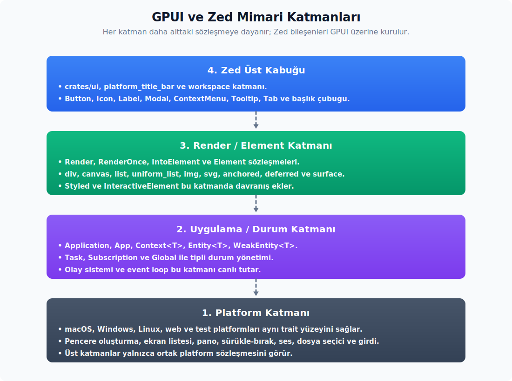
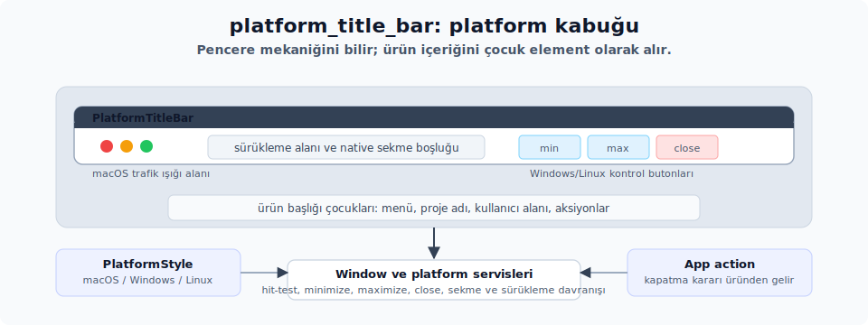
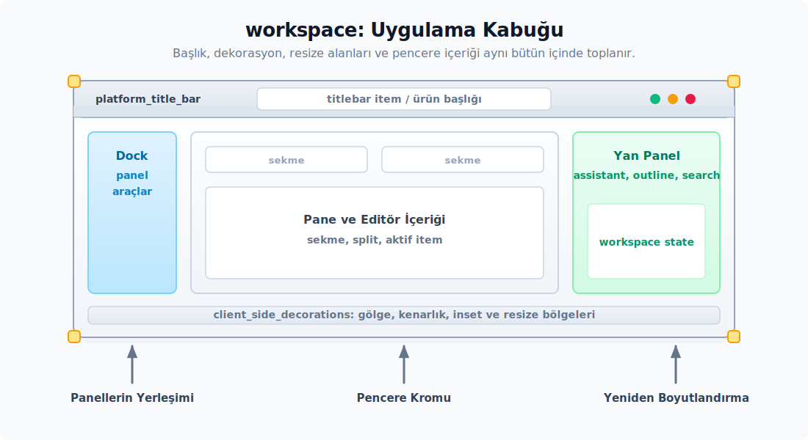

# Temeller

---

## Büyük Resim

GPUI, birbirinin üzerine kurulan üç katmandan oluşur. Her katman bir alttakinin üzerine binip bir üsttekine daha sade bir arayüz sunar. Böylece uygulama kodunda hangi sorunun nerede çözüleceğini daha kolay görürsün.



1. **Platform katmanı.** İşletim sistemine doğrudan dokunan kısımdır. GPUI macOS, Windows, Linux, web ve test ortamlarını aynı arayüzün arkasına gizler. Uygulama kodun "pencere aç", "girdi al", "ekrana çiz" gibi istekleri ortak bir sözleşme ile anlatır. Bu sözleşmeyi `Platform` ve `PlatformWindow` trait'leri taşır. Pencere oluşturma, ekran listesi, pano (`clipboard`), sürükle-bırak, sistem zili ve dosya seçici gibi platforma özgü yetenekler bu iki trait üzerinden açılır. Bu trait'lerin macOS, Windows, Linux, web ve test arka uçlarını GPUI/Zed tarafındaki platform crate'leri uygular; senin uygulama kodun normalde aynı `App`, `Window` ve element API'siyle konuşur. Böylece uygulamanı her platform için ayrı bir uygulama katmanı yazarak değil, ortak GPUI yüzeyini kullanarak geliştirirsin.

2. **Uygulama/durum katmanı.** Uygulamanın yaşam döngüsü ve bellekteki tüm durum burada yaşar. `Application` süreç başlangıcını ve olay döngüsünü (`event loop`) yönetir. `App` uygulama genelindeki duruma erişilen ana kapıdır. `Context<T>`, belirli bir varlık güncellenirken `App`'in üstüne eklenen daha geniş bir bağlamdır. `Entity<T>` ve `WeakEntity<T>` ise `heap`'te (dinamik bellekte) tutulan durum kutularına güçlü ve zayıf erişim sağlar. `Task` arka plan işlerini temsil eder; `Subscription` ise olay dinleme aboneliklerini. İkisi de değer elden çıktığında kaydı otomatik temizleyen sahiplik araçlarıdır. `Global` uygulama açık kaldığı sürece tek kopya kalması gereken kaynaklar içindir. Olay sistemi de varlıklar arasında tipli mesajlaşmayı kurar.

3. **Render/element katmanı.** Ekrandaki ağacı üretip çizen kısımdır. `Render` trait'i, kendi verisini taşıyan entity'lerin her ekran karesinde yeni bir element ağacı üretmesini sağlar. `RenderOnce` ve `IntoElement` ise yeniden kullanabilirsin, kendi kalıcı verisini taşımayan bileşenleri tanımlar. `Element` trait'i yerleşim ile çizim sözleşmesinin kendisidir. `div`, `canvas`, `list`, `uniform_list`, `img`, `svg`, `anchored` ve `surface` (yalnız macOS) bu trait'in hazır uygulamalarıdır. Üstüne `Styled` ve `InteractiveElement` zincirleri eklersin. Flex/grid stil zinciri, renkler, tıklama, sürükleme, klavye odağı ve scroll davranışı bu zincirler üzerinden çalışır.

Zed bu üç katmanın üstüne kendi tasarım sistemini koyar. Bunlar GPUI'nin parçası değil; GPUI üzerine yazılmış son kullanıcı bileşenleridir:

- `ui` — Button, Icon, Label, Modal, ContextMenu, Tooltip, Tab, Table, Toggle ve benzeri yeniden kullanılan bileşenleri barındırır. Tutarlı bir görsel dil ve davranış kalıbı sağlar; uygulama içindeki ekranları bu kit'ten bileşen alarak kurarsın. Zed uygulama kodu çoğu zaman `use ui::prelude::*;` ile başlar. Bu prelude GPUI çekirdek trait'lerini ve Zed'in sık kullanılan UI bileşenlerini birlikte getirir. Yalnız çekirdek GPUI örneği yazarken `gpui::prelude::*` yeterli olabilir.

  ```rust
  use ui::prelude::*; // Zed UI + GPUI çekirdek trait'leri
  ```
- `platform_title_bar` — platforma göre pencere kontrol butonlarını ve başlık çubuğu davranışını çizer. Linux ve Windows tarafında istemci tarafı süslemesi (`client-side decoration`) gerektiğinde başlık çubuğunu da bu paket üretir.

  

- `workspace` — ana çalışma alanını, istemci tarafı süslemesi gölgesini, pencere köşelerindeki yeniden boyutlandırma bölgelerini ve pencere içeriğini tek bir bütün halinde birleştirir. Uygulamanın iskeleti, panellerin yerleşimi ve pencere kromu burada toplanır.

  

Kısacası alttan yukarıya doğru sıralama şöyle: platform → durum → çizim. Bu rehber önce bu üç GPUI katmanını açar; sonraki Zed UI, `platform_title_bar` ve `workspace` bölümlerinde ise Zed'in bu katmanları nasıl kullandığını referans alıp aynı yaklaşımı kendi GPUI uygulamana nasıl uyarlayacağını gösterir.

## GPUI Kavram Sözlüğü: Temel Kavramlara Giriş

Bu bölüm bir ezber tablosu değildir. GPUI'yi ilk kez okurken asıl zor olan şey, aynı anda birkaç farklı "dünya" ile karşılaşmaktır: çalışan uygulama, pencere, bellekte tutulan veri, her ekran karesinde yeniden kurulan element ağacı, async işler ve kullanıcı girdisi. Aşağıdaki sözlük bu dünyaları birbirinden ayırmak için vardır.

En kısa zihinsel model şu:

1. `Application` programı başlatır.
2. `App` çalışan uygulamanın ana belleği ve servis kapısıdır.
3. `App`, `Entity<T>` adı verilen kalıcı veri nesneleri oluşturur.
4. Bir pencerenin başlangıç view'u, yani kök view, genellikle `Render` trait'ini uygulayan bir `Entity<V>` olur.
5. `Render::render`, o anki veriyi geçici bir element ağacına çevirir.
6. `Element` ağacı yerleşim, çizim hazırlığı ve çizim aşamalarından geçer; sonra ekrana basılır.

Yani GPUI'de ekranda gördüğün şeyler doğrudan bellekte duran nesneler değildir. Bellekte kalıcı olan çoğunlukla `Entity<T>` içindeki veridir. Ekrandaki element ağacı ise her çizimde yeniden üretilen geçici bir tariftir. Bu ayrımı erken oturtmak, sonraki bölümlerdeki neredeyse tüm API kararlarını anlamayı kolaylaştırır.

### Uygulama ve Durum

| Kavram | Basit karşılık | Ne işe yarar? | İlk okurken dikkat |
|---|---|---|---|
| `Application` | Programın dış kabı | `main` tarafında platformu, asset kaynağını ve olay döngüsünü (`event loop`) kurar. Uygulama hazır olduğunda `run` geri çağrısı içinde sana `&mut App` verir. | Genellikle uygulama başlangıcında bir kez tanımlarsın. Sonraki ekran, pencere ve özellikleri yeni bir `Application` kurarak değil, çalışan `App`, `Window` ve `Entity` yüzeyleriyle geliştirirsin. |
| `App` | Çalışan uygulamanın merkezi | Uygulama genelindeki verilere, pencerelere, entity listesine, kısayol tablosuna, async çalıştırıcılara, platform servislerine ve asset sistemine erişim sağlar. | `cx` adı bir zorunluluk değil, GPUI/Zed kodlarında bağlam değişkeni için yaygın kullanılan bir isimlendirme tercihidir. Aynı ad farklı bağlamlarda farklı tipi gösterebilir: bazen yalnızca `App`, bazen de bir entity'ye bağlı `Context<T>` olur. |
| `Global` | Her yerden erişilen ortak veri | Tema, ayarlar, uygulama oturumu veya tüm pencerelerin paylaşması gereken servisler gibi uygulama açık kaldığı sürece tek kopya durması gereken veriler için kullanırsın. | Sadece tek bir panelin kullandığı arama metni, seçili satır, açık/kapalı durumu gibi bilgileri burada tutmazsın; bunları o paneli yöneten Rust struct'ının alanlarında tutarsın. Bu struct genellikle `Entity<T>` içinde yaşar. |
| `Entity<T>` | Tipli, kalıcı veri kaydı | `T` değerini GPUI'nin entity listesinde tutar. Okuma ve güncellemeyi `varlik.read(cx)` ve `varlik.update(cx, ...)` üzerinden yaparsın. | `Entity<T>` ekrandaki kutu veya buton değildir; ekrana ne çizileceğini belirleyen veriyi tutar. |
| `WeakEntity<T>` | Entity'yi hayatta tutmayan referans | Async işler, abonelikler veya iki nesnenin birbirini işaret ettiği durumlarda entity'ye geri dönmek için kullanırsın; ama entity'yi tek başına canlı tutmaz. | `upgrade` veya `update` başarısız olabilir; çünkü kullanıcı ilgili pencereyi kapatmış ve entity artık silinmiş olabilir. |
| `Context<T>` | Bir entity üzerinde çalışırken gelen bağlam | `Entity<T>` güncellenirken veya çizim üretilirken `App` yeteneklerine ek olarak `cx.notify()`, `cx.emit(...)`, `cx.observe(...)`, `cx.subscribe(...)`, `cx.spawn(...)` gibi o entity'ye özel metotları açar. | Değişen veri ekrandaki sonucu değiştiriyorsa update sonunda çoğunlukla `cx.notify()` çağırırsın. |
| `EventEmitter<E>` | Entity'nin olay duyurması | Bir entity'nin dışarıya `E` tipinde olaylar yayabileceğini belirtir. Başka kodlar bu olayları dinleyebilir. | Bu, tarayıcıdaki DOM olay sistemi gibi element tıklaması değildir; entity'ler arasında tipli mesajlaşmadır. |
| `Subscription` | Dinleyici kaydının ömrü | `observe`, `subscribe` veya `listener` kayıtlarının ne kadar süre yaşayacağını taşır. `Subscription` elden çıkınca dinleme de biter. | Oluşturduğun `Subscription`'ı bir değişkende veya entity alanında saklamazsan dinleyici hemen kapanır. |
| `Task<T>` | İptal edilebilir async iş | Ön plan/arka plan executor'ında çalışan `future`'ı temsil eder. | `Task` değeri elden çıkarsa iş iptal olur. İşin devam etmesi gerekiyorsa `Task`'i bir alanda saklarsın ya da bilinçli şekilde bağımsız bırakırsın. |
| `AsyncApp` | `await` sonrasına taşınabilen app bağlamı | Async blok içinde `App`'e güvenli şekilde geri dönmeni sağlar. | `await` sırasında pencere veya entity kapanmış olabilir; bu yüzden async bağlamdaki erişimler çoğu zaman hata döndürebilir. |

### Pencere ve Kullanıcı Girdisi

| Kavram | Basit karşılık | Ne işe yarar? | İlk okurken dikkat |
|---|---|---|---|
| `Window` | Tek pencerenin canlı bağlamı | Klavye odağı, imleç, pencere boyutu, IME, prompt, tıklama alanları, scroll, komut yönlendirme, yenileme ve düşük seviyeli çizim işlerini yönetir. | `App` uygulama geneline bakar; `Window` yalnızca o pencereye ait bilgiyi taşır. |
| `WindowHandle<V>` | Pencereyi sonradan bulmaya yarayan referans | Açılmış pencerenin en üst view'unu doğru Rust tipiyle okumak veya güncellemek için kullanırsın. | Bu değer pencereye ulaşma yoludur; kendi başına çizim yapmaz. Çizim yine kök view'un `Render` çıktısından gelir. |
| `FocusHandle` | Klavye odağı kimliği | Bir view veya element grubunun klavye odağına katılmasını sağlar. `track_focus` ve tab navigasyonu bunun etrafında çalışır. | Element ağacı her çizimde yeniden kurulur; hangi parçanın odakta olduğunu bu referans sayesinde takip edersin. |
| `Hitbox` | Mouse ile test edilen alan | Prepaint aşamasında kaydedilen dikdörtgen veya bölge üzerinden hover, tıklama, sürükleme gibi davranışların hedefini belirler. | Görsel olarak çizilmiş olmak tek başına tıklanabilir olmak demek değildir; hitbox gerekir. |
| `ScrollHandle` | Scroll konumunu tutan referans | Bir scroll alanının konumunu ve scroll davranışını ekran kareleri arasında korur. | Scroll konumu kaybolmasın istiyorsan aynı alan için sabit bir element id'si kullanırsın ve `ScrollHandle`'ı uygun yerde saklarsın. |
| `Action` | Kullanıcı komutu | Menü, kısayol veya komut paleti üzerinden gelen "kaydet", "sekmeyi kapat", "satırı seç" gibi niyeti temsil eder. | Action "şu tuşa basıldı" değil, "şu komut istendi" bilgisidir. |
| `Keymap` | Kısayol eşleme tablosu | Tuş kombinasyonlarını aktif bağlama göre action'lara bağlar. | Bir tuşa basıldığında GPUI önce klavye odağının hangi element ağacında olduğunu, sonra o ağacın `key_context` etiketlerini dikkate alır. Bu yüzden aynı kısayol editör bağlamında "satırı sil", terminal bağlamında "terminal girdisini temizle" gibi farklı action'lara çözülebilir. |

### Render ve Element Modeli

| Kavram | Basit karşılık | Ne işe yarar? | İlk okurken dikkat |
|---|---|---|---|
| View | Ekran parçasını yöneten Rust tipi | GPUI'de "view" çoğu zaman `Render` trait'ini uygulayan ve `Entity<V>` içinde tutulan bir Rust tipidir. Örneğin bir panelin seçili satırı veya açık menüsü bu tipin alanlarında durabilir. | View ayrı bir widget sınıfı değildir; veriyi tutan Rust tipi ile ekrana çizme metodunun birleşimidir. |
| Kök view | Pencerenin en üst view'u | Bir pencerenin çizim ağacı kök view'dan başlar. Pencere açılırken bu kök genellikle `Entity<V>` olarak oluşur. | Pencerenin ana içeriği kök view'dur; onun altında üretilen elementler her çizimde yeniden kurarsın. |
| `Render` | View'u ekrana çeviren metot sözleşmesi | Bir `Entity<V>`'nin ekrana nasıl görüneceğini üretir. `render(&mut self, window, cx)` her çizim döngüsünde element ağacı döndürür. | `Render` trait'ini uygulayan tip genellikle kendi verisini alanlarında tutar ve o veriye göre element üretir. |
| `RenderOnce` | Tek seferlik bileşen tarifi | Kendi kalıcı verisini tutmayan, eldeki veriden element üreten küçük bileşenler için kullanırsın. Zed UI bileşenlerinde sık görürsün. | `self` tüketilir; seçili satır, açık menü gibi kalıcı bilgileri tutmak için değil, tekrar kullanılabilir element tarifi yazmak içindir. |
| `IntoElement` | Element'e dönüşebilme | Bir değerin GPUI element ağacına katılabileceğini söyler. `String`, `div()`, Zed UI bileşenleri veya özel bileşenler bu yolla alt öğe olabilir. | Çoğu API `impl IntoElement` alır; bu yüzden farklı görünen birçok şey aynı `.child(...)` çağrısına girebilir. |
| `Element` | Yerleşim ve çizim yapan düğüm | `request_layout`, `prepaint` ve `paint` aşamalarını tanımlar. `div`, `canvas`, `list`, `img`, `svg` gibi hazır elementler bunun uygulamalarıdır. | Element ağacı kalıcı değildir; ekran karesi sonunda düşer ve sonraki çizimde yeniden kurarsın. |
| `div()` | Temel kapsayıcı | Flex/grid yerleşimi, boşluk, kenarlık, arka plan, alt öğe ekleme ve interaktif davranışların çoğu burada başlar. | Web'deki `div` gibi düşünmek yardımcıdır, ama GPUI'nin Rust trait zinciriyle çalışır. |
| `Styled` | Stil zinciri | `.flex()`, `.p_2()`, `.bg(...)`, `.text_color(...)`, `.rounded_sm()` gibi stil metotlarını açar. | Stil metotları element tarifi oluşturur; seçili değer veya açık/kapalı durumu gibi kalıcı veri saklamaz. |
| `InteractiveElement` | Etkileşim zinciri | `.on_click(...)`, `.on_mouse_down(...)`, `.on_action(...)`, `.track_focus(...)`, `.key_context(...)` gibi kullanıcı girdisi metotlarını açar. | Bir elementin tıklama, klavye veya komut alabilmesi için ilgili hitbox, focus veya action bağlantısını kurman gerekir. |
| `Animation` | Zaman tabanlı geçiş | Süre ve easing bilgisiyle değerleri ekran kareleri arasında yumuşak şekilde değiştirir. | Animasyonun devam etmesi için pencerenin yeni ekran karesi istemesi gerekir. |

### Görsel Veri, Ölçü ve Asset

| Kavram | Basit karşılık | Ne işe yarar? | İlk okurken dikkat |
|---|---|---|---|
| `Pixels` | Mantıksal piksel | Boyut, konum, padding ve sınır (`bounds`) değerlerinde kullandığın ana ölçü birimidir. | Fiziksel ekran pikseliyle bire bir aynı olmak zorunda değildir; scale factor devrededir. |
| `Hsla` / `Rgba` | Renk tipleri | UI renklerini HSLA veya RGBA uzayında taşır. | Zed tarafında çoğu renk doğrudan sabit değil, tema üzerinden gelir. |
| `Background` | Dolgu tanımı | Düz renk, gradient veya pattern gibi arka plan dolgularını temsil eder. | Renk ile dolgu aynı şey değildir; dolgu daha geniş bir tariftir. |
| `AssetSource` | Asset byte kaynağı | SVG, image, font veya paketlenmiş dosya gibi varlıkların nereden okunacağını uygulamaya söyler. | Başlangıçta `Application` üzerinde kurarsın; elementler asset isterken bu kaynağa dayanır. |

### Hangi Kavramı Ne Zaman Aramalıyım?

- "Bu veri ekranda değişince görüntü de değişsin" diyorsan `Entity<T>`, `Context<T>` ve `cx.notify()` üçlüsüne bakarsın.
- "Bu iş bir pencerenin klavye odağı, imleci, boyutu veya çizim aşaması ile ilgili" diyorsan `Window` tarafındasın.
- "Bu şey ekranda nasıl görünüyor?" sorusu `Render`, `RenderOnce`, `IntoElement`, `Element` ve `Styled` zincirine çıkar.
- "Kullanıcı bir komut verdi" diyorsan `Action`, `Keymap`, klavye odağı ve `key_context`'i birlikte değerlendirirsin.
- "Async iş bitince hâlâ aynı view var mı?" sorusu `Task<T>`, `WeakEntity<T>` ve `AsyncApp` ile ilgilidir.
- "Bu veri bütün uygulamanın ortak bilgisi mi, yoksa yalnızca tek bir ekran parçasının bilgisi mi?" ayrımı `Global` ile `Entity<T>` arasındaki ana seçimdir.

Zed'in `ui` içindeki `Button`, `Icon`, `Label`, `Modal`, `Tooltip` gibi bileşenleri bu çekirdek kavramların üstüne kuruludur. GPUI sana veri ve durum, pencere, element, kullanıcı girdisi ve çizim altyapısını verir; Zed UI ise bu altyapıyı kullanarak ürün içinde tekrar edilen hazır bileşenleri sağlar.

---
