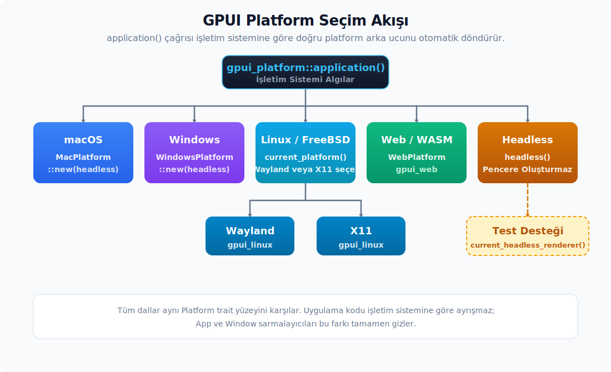
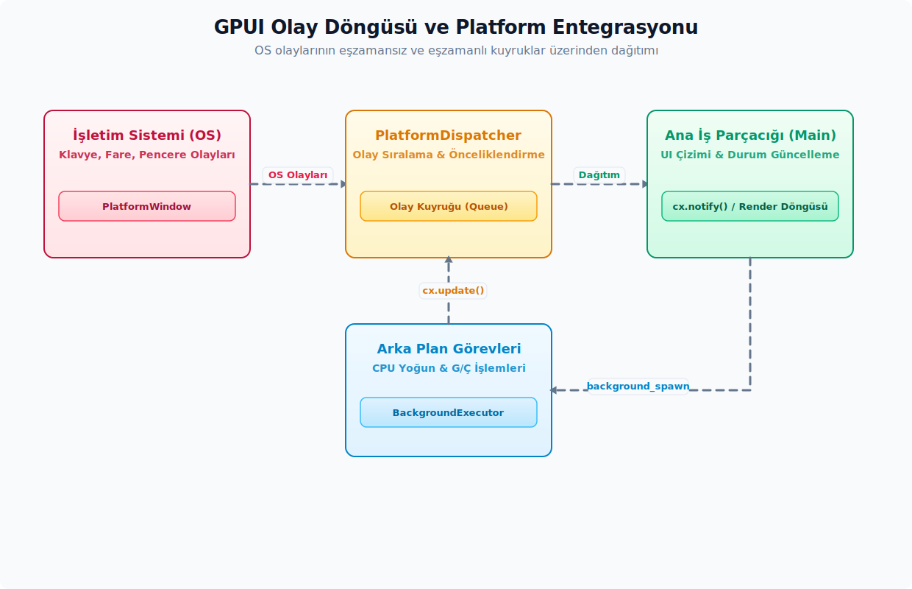

# Uygulama ve Platform

## Sürüm Analiz Raporu

- [x] Doğrulanan platform yüzeyi: `Application::run_embedded`, `ApplicationHandle`, primary selection pano metotları ve sistem uyku dönüşü callback akışı.
- [x] Kaynak doğrulama dosyaları: `crates/gpui/src/app.rs`, `crates/gpui/src/platform.rs` ve rustdoc JSON snapshot kayıtları.
- [x] Doğrulanan mobil platform sözleşmesi: `AppLifecyclePhase`, `Platform::on_app_lifecycle`, `Platform::on_memory_warning` ve `Platform::gestures`.
- [x] Kaynak doğrulama dosyaları: `crates/gpui/src/platform.rs` ve `crates/gpui/src/gestures.rs`; tip ve trait imzaları rust-analyzer ile doğrulandı.

---

## İçindekiler
- [Platform Başlatma](#platform-başlatma)
- [Application Yaşam Döngüsü ve Platform Olayları](#application-yaşam-döngüsü-ve-platform-olayları)
- [Platform Servisleri](#platform-servisleri)
- [Platform Trait Uygulaması ve Sarmalayıcı Sınırları](#platform-trait-uygulaması-ve-sarmalayıcı-sınırları)
- [Başsız Çalışma, Ekran Yakalama ve Test Çizim Aracı](#başsız-çalışma-ekran-yakalama-ve-test-çizim-aracı)

---

## Platform Başlatma

Bir GPUI uygulamasının ilk adımı platform arka ucunu başlatmaktır. Normal bir uygulama geliştirirken, hedef platformlara göre ayrı ayrı başlangıç dosyaları yazma gereksinimi duyulmaz; `gpui_platform::application()` çalıştığı işletim sistemine uygun GPUI platform implementasyonunu otomatik bağlar. Pencere açılması, klavye girdilerinin okunması ve ekrana çizim yapılması gibi düşük seviyeli platform işlemleri bu arka uç tarafından şeffaf bir biçimde yürütülür. Geliştiricinin ise yalnızca ortak `App`, `Window` ve element API'lerini kullanması yeterlidir. Tipik bir uygulama başlangıcı şu kalıbı takip eder:

```rust
use gpui::{App, AppContext as _, Window, WindowOptions, div, prelude::*};
use gpui_platform::application;

struct KokGorunum;

impl Render for KokGorunum {
    fn render(&mut self, _window: &mut Window, _cx: &mut Context<Self>) -> impl IntoElement {
        div().size_full().child("Merhaba")
    }
}

fn main() {
    application().run(|cx: &mut App| {
        if let Err(hata) = cx.open_window(WindowOptions::default(), |_, cx| {
            cx.new(|_| KokGorunum)
        }) {
            eprintln!("pencere açılamadı: {hata:?}");
        }
    });
}
```

`application()` çağrısı çalıştığı işletim sistemine göre doğru platform arka ucunu otomatik döndürür. Zed'deki seçim kabaca şöyle:



- macOS: `gpui_macos::MacPlatform::new(headless)`
- Windows: `gpui_windows::WindowsPlatform::new(headless)`
- Linux/FreeBSD: `gpui_linux::current_platform(headless)`; Wayland veya X11 arka ucunu platform crate'i kendi içinde seçer.
- Web/WASM: `gpui_web::WebPlatform`

Görsel olmayan senaryolar için ayrı bir başlatıcı vardır: `gpui_platform::headless()`, `current_platform(true)` üzerinden başsız modda bir `Application` kurar. Bu yöntem, herhangi bir kullanıcı arayüzü veya pencere oluşturmadan, yalnızca arka plan görevlerini ya da test düzeneklerini çalıştırmanın hedeflendiği durumlarda tercih edilir. Test desteğine ihtiyaç duyulması durumunda `gpui_platform::current_headless_renderer()` fonksiyonundan yararlanılır. Güncel sürümde bu çağrı yalnızca macOS üzerinde çalışan Metal tabanlı bir başsız çizim aracı döndürür; diğer platform hedeflerinde ise `None` çıktısı üretilir.

## Application Yaşam Döngüsü ve Platform Olayları

GPUI'ın olay döngüsü, platformdan gelen ham girdilerin kuyruğa alınması ve iş parçacıkları arasında güvenli bir biçimde iletilmesi esasına dayanır. Aşağıdaki şemada, işletim sisteminden gelen olayların sıraya alınması, `PlatformDispatcher` üzerinden dağıtılması ve asenkron arka plan görevleri ile ana iş parçacığı arasındaki etkileşim süreci gösterilmektedir:



`Application`, GPUI çalışmaya başlamadan önce kullanılan builder katmanıdır. Uygulama yaşam döngüsü boyunca geçerli olacak asset kaynakları, HTTP istemci yapılandırmaları ve uygulamadan çıkış politikaları (quit mode) bu builder arayüzü vasıtasıyla kurulur. Tipik bir yapılandırma kurulumu aşağıdaki gibidir:

```rust
let uygulama = gpui_platform::application()
    .with_assets(Varliklar)
    .with_http_client(http_istemcisi)
    .with_quit_mode(QuitMode::Default);

uygulama.on_open_urls(|urller| {
    // Platform URL açma olayı.
});

uygulama.on_reopen(|cx| {
    cx.activate(true);
});

uygulama.on_system_wake(|cx| {
    cx.refresh_windows();
});

uygulama.run(|cx| {
    // Genel kurulum, keymap, pencereler.
});
```

`run` çağrısı, kontrolü platformun olay döngüsüne devreder. Bu noktadan sonra uygulama tamamen olay tabanlı olarak çalışır.

### `ApplicationHandle` ve `run_embedded`

Bazı hedeflerde olay döngüsünü GPUI değil, dış bir taşıyıcı yönetir. WebAssembly misafirleri veya yabancı bir yerel uygulama içine gömülen GPUI yüzeyleri bu sınıfa girer. Bu biçimde `Application::run_embedded(on_finish_launching) -> ApplicationHandle` kullanılır. Platform `run` callback'ini çalıştırıp geri döndüğünde `ApplicationHandle` uygulamayı canlı tutar; handle bırakıldığında uygulama sahipliği de bırakılır.

`ApplicationHandle::update(|cx| ...)` dış olay döngüsünden GPUI `App` bağlamına kısa ve yeniden girişsiz bir güncelleme noktası açar. Bu metot, zaten bir GPUI güncellemesi yürürken iç içe çağrılmamalıdır; uygulama durumu `RefCell` üzerinde tutulduğu için çift ödünç alma çalışma zamanı hatasına dönüşür. Await noktaları arasında uygulamaya zayıf bağla dönmek gerektiğinde `ApplicationHandle::to_async() -> AsyncApp` kullanılır; ancak uygulamayı canlı tutma sorumluluğu yine güçlü `ApplicationHandle` değerindedir.

**Çıkış ve etkinleştirme.** Uygulamanın hangi koşulda sonlanacağını belirlemek için `QuitMode` enum varyantları kullanılır:

- `QuitMode::Default`: macOS üzerinde yalnızca açık bir çıkış isteğiyle sonlanır; diğer platformlarda ise son pencere kapandığında GPUI otomatik olarak çıkış işlemini yürütür.
- `QuitMode::LastWindowClosed`: Son pencere kapandığı an uygulama otomatik olarak sonlanır.
- `QuitMode::Explicit`: Çıkış işlemi yalnızca `App::quit()` çağrısı yapıldığında gerçekleşir.

| API | Alt özellikler | Kısa anlamı |
| :-- | :-- | :-- |
| `QuitMode` | `Default`, `LastWindowClosed`, `Explicit` | Uygulamanın son pencere kapandığında mı yoksa açık quit isteğiyle mi sonlanacağını belirler. |
| `CursorHideMode` | klavye girdisine tepki olarak imleci gizleme politikası | Uygulama seviyesinde, klavye girdilerine (yazım işlemleri veya komut tetikleyen kısayollar) tepki olarak fare imlecinin ne zaman gizleneceğini yapılandırır. İmlecin fare hareketiyle tekrar görünür kılınması ise platform arka ucu tarafından otomatik olarak yürütülür. |

- `cx.on_app_quit(|cx| async { ... })` ile kaydedilen tüm geri çağrıları GPUI, uygulama tamamen sonlanmadan önce çalıştırır. Bu geri çağrılar için ayrılan süreyi `gpui::SHUTDOWN_TIMEOUT: Duration = 200ms` (`app`) sabiti belirler; bu eşik aşılırsa hâlâ bekleyen `future`'lar artık beklenmez (bırakılır), bir hata günlüğü yazılır ve GPUI platform çıkışını sürdürür. Bu zaman kısıtı nedeniyle, uygulamanın kapanışı sırasında tamamlanması zorunlu olan uzun soluklu işlerin, bağımsız (detached) bırakılan asenkron `Task`'lere emanet edilmemesi, bunun yerine yaşam döngüsü gözlemcilerine (lifecycle observers) bağlanması kritik bir önem taşır.

**Uygulama etkinliği ve görünürlüğü.** `cx.activate(ignoring_other_apps)` uygulamayı platform düzeyinde öne getirir. Özellikle yeni bir pencere açıldığında ya da harici bir URL yönlendirmesiyle uygulamaya geri dönüldüğünde `ignoring_other_apps = true` parametresi tercih edilir. Uygulamanın kendi pencereleri arasında odağın yumuşak bir biçimde güncellenmesi istendiğinde ise `false` seçeneği daha uygundur. `cx.hide()` uygulamanın tamamını gizler. `cx.hide_other_apps()` ve `cx.unhide_other_apps()` ise macOS tarzı uygulama menüsü eylemlerinde olduğu gibi diğer uygulamaları gizleme ya da geri gösterme komutlarını platforma iletir. Bu dört metot tekil bir görünüm (view) durumunu manipüle etmek yerine, doğrudan işletim sistemi kabuğuna uygulama genelindeki etkileşim niyetini iletir.

**Pencere etkinliği ve görünürlüğü.** `window.activate_window()` yalnızca ilgili platform penceresini öne alır. `window.minimize_window()` pencereyi küçültür; `window.toggle_fullscreen()` ise tam ekran modunu tersine çevirir. Yürütülecek eylemin kapsamı tüm uygulamayı etkiliyorsa `App` arayüzü, yalnızca belirli bir pencereye özgü ise ilgili `Window` bağlamı kullanılmalıdır.

**Platform sinyalleri.** Uygulama, işletim sisteminden gelen olayları çeşitli kanallarla dinleyebilir:

- `cx.on_keyboard_layout_change(...)` — Kullanıcının klavye düzenini değiştirmesi durumunda tetiklenir.
- `cx.keyboard_layout()` ve `cx.keyboard_mapper()` — Tuş vuruşlarını (keystrokes) eylemlere (actions) eşlemek için gerekli verileri sağlar.
- `cx.thermal_state()` ve `cx.on_thermal_state_change(...)` — Yoğun görsel çizimler, dosya dizinleme veya ağır arka plan görevlerinde CPU/GPU tasarrufuna (throttling) gitme kararlarını alırken yararlanılır.
- `Application::on_system_wake(|cx| ...)` — İşletim sistemi uyku durumundan döndüğünde çalışır ve geri çağrıya `&mut App` verir. Ağ bağlantılarının yeniden doğrulanması, zamanlayıcıların tazelenmesi veya pencere çizimlerinin yenilenmesi gibi uygulama geneli toparlanma işleri bu noktaya bağlanır.
- `cx.set_cursor_hide_mode(CursorHideMode::...)` — Metin yazımı ya da eylem (action) tetiklenmesi durumunda fare imlecinin gizlenme politikasını yapılandırır.
- `cx.refresh_windows()` — Tüm pencereleri tek bir etki döngüsü (`effect cycle`) içinde yeniden çizmeye zorlar.
- `cx.set_quit_mode(mode)` — Uygulamadan çıkış politikasını çalışma zamanında dinamik olarak güncellemeye olanak tanır. Bu çağrı, başlangıçtaki builder arayüzünde yer alan `.with_quit_mode(...)` alanı ile aynı dahili veriyi değiştirir.
- `cx.on_window_closed(|cx, window_id| ...)` — Pencere kapandıktan *sonra* çalışır; bu noktada pencereye artık erişilemez, geri çağrı `&mut App` ile birlikte kapanan pencerenin `WindowId`'sini alır.

**Dikkat noktaları.** Bu API'lerde dikkat edilmesi gereken birkaç yorum farkı var:

- `on_open_urls` geri çağrısı `&mut App` almaz; uygulama verilerine veya durumuna erişilmesi gereken senaryolarda, yakalanan URL adreslerini bir iç iş kuyruğuna ya da `Global` durum kutusuna aktaracak bir mekanizma tasarlanmalıdır.
- `on_reopen` özellikle macOS'ta Dock veya uygulama ikonuna tıklamayla yeniden açılma senaryosunda devreye girer. Eğer ekranda açık herhangi bir pencere kalmadıysa, yeni bir çalışma alanı (workspace) açma mantığı bu blok içerisinde tetiklenir.
- `refresh_windows()` çağrısı herhangi bir uygulama verisini mutasyona uğratmaz; yalnızca bir sonraki ekran tazelemesinde tüm pencerelerin yeniden çizilmesi gerektiğini planlayıcıya bildirir.

### Mobil Platform Yaşam Döngüsü ve Gesture Servisi

Mobil işletim sistemleri uygulama görünürlüğünü ve işlem ömrünü kendileri yönettiği için `Platform` trait'i bu olayları düşük seviyeli geri çağrılarla taşır. Bu yüzey, `Application` builder'ının genel bir uzantısı değil, yeni bir GPUI platform arka ucu yazılırken uygulanan sözleşmedir:

| API | Sözleşme |
| :-- | :-- |
| `Platform::on_app_lifecycle(Box<dyn FnMut(AppLifecyclePhase)>)` | İşletim sisteminin uygulama evresi değiştiğinde platform arka ucunun çağıracağı dinleyiciyi kaydeder. |
| `Platform::on_memory_warning(Box<dyn FnMut()>)` | iOS bellek uyarısı veya Android bellek daraltma sinyalini GPUI katmanına taşır. |
| `Platform::gestures() -> Option<Rc<dyn PlatformGestures>>` | Platformun sağladığı yerel gesture tanıyıcı hizmetini döndürür; hizmet yoksa `None` üretir. |

`AppLifecyclePhase` dört evreyi ayırır:

| Evre | Anlamı |
| :-- | :-- |
| `Active` | Uygulama ön plandadır ve girdi alır. |
| `Inactive` | Uygulama görünürdür ancak sistem diyaloğu gibi bir nedenle girdi almaz. |
| `Background` | Uygulama görünür değildir; GPU yüzeyi bırakılabilir ve işlem sistem tarafından sonlandırılabilir. |
| `Foreground` | Uygulama görünür hâle gelmektedir, fakat girdi akışı henüz geri verilmemiştir. |

Bu üç `Platform` metodu varsayılan uygulamalara sahiptir: yaşam döngüsü ve bellek uyarısı geri çağrılarını kaydetmeyen arka uçlarda işlem yapılmaz, `gestures()` ise `None` döndürür. Mevcut HEAD altında platform crate'lerinde bu varsayılanları ezen bir uygulama bulunmaz. Bu nedenle tiplerin varlığı, masaüstü arka uçlarında mobil olay üretildiği veya taşınabilir gesture tanımanın çalıştığı anlamına gelmez. Dokunma tipleri ve geçerli yönlendirme sınırı [Dokunma Olayları ve Gesture Platform Sözleşmesi](09-etkilesim-ve-olaylar.md#dokunma-olayları-ve-gesture-platform-sözleşmesi) başlığında ele alınır.

## Platform Servisleri

`App` üzerinden erişilen platform servisleri, uygulamanın dış dünyaya açılan kapılarıdır. Pencere yönetimi, panoya yazma, kimlik bilgileri, URL açma ve ekran yakalama işlemleri buradan yürütülür. Sarmalayıcılar (`wrapper`'lar) `gpui` crate'i içinde tanımlıdır; asıl davranış ise platforma özgü `Platform` trait implementasyonunda gerçekleşir. Aşağıdaki sınıflandırma, hangi işlevin nereden çağrılacağını hızlıca bulmak amacıyla hazırlanmıştır:

- **Uygulama yaşam döngüsü:** `quit`, `restart`, `set_restart_path`, `on_app_quit(|cx| async ...)`, `on_app_restart(|cx| ...)`, `activate`, `hide`, `hide_other_apps`, `unhide_other_apps`.
- **Pencereler:** `windows`, `active_window`, `window_stack`, `refresh_windows`.
- **Ekran:** `displays`, `primary_display`, `find_display`.
- **Görünüm:** `window_appearance`, `button_layout`, `should_auto_hide_scrollbars`, `set_cursor_hide_mode`.
- **Pano:** `read_from_clipboard`, `write_to_clipboard`.
- **Linux primary selection:** `read_from_primary`, `write_to_primary` — X11 ve Wayland ortamlarında orta tıklama ile yapıştırma için kullanılan ayrı bir panoyu (primary selection) hedefler.
- **macOS find pasteboard:** `read_from_find_pasteboard`, `write_to_find_pasteboard` — macOS üzerindeki uygulama genelinde paylaşılan "son aranan metin" panosunu yönetir.
- **Keychain ve kimlik bilgisi deposu:** `write_credentials(url, username, password)`, `read_credentials(url) -> Task<Result<Option<(String, Vec<u8>)>>>`, `delete_credentials(url)`. Geri dönen `Task` nesnesi arka plan çalıştırıcısında yürütülür; bu görevi `await` ile beklemek veya `detach_and_log_err(cx)` metoduyla bağımsız (detached) olarak arka planda yürütmek mümkündür.
- **URL:** `open_url`, `register_url_scheme`.
- **Dosya ve prompt:** `prompt_for_paths`, `prompt_for_new_path`, `reveal_path`, `open_with_system`, `can_select_mixed_files_and_dirs`.
- **Menü:** `set_menus`, `get_menus`, `set_dock_menu`, `add_recent_document`, `update_jump_list`.
- **Termal durum:** `thermal_state`, `on_thermal_state_change`.
- **Sistem uyku dönüşü:** `Application::on_system_wake(|cx| ...)`; platform arka ucundaki `Platform::on_system_wake` sinyalini `&mut App` erişimli bir uygulama callback'ine dönüştürür.
- **İmleç görünürlüğü:** `cursor_hide_mode`, `set_cursor_hide_mode`, `is_cursor_visible`. İşaretçinin görsel stili pencere veya hitbox bağlamında `window.set_cursor_style(style, &hitbox)` metoduyla, sürükleme (drag and drop) işlemleri sırasında ise `cx.set_active_drag_cursor_style(...)` vasıtasıyla belirlenir.
- **Ekran yakalama:** `is_screen_capture_supported`, `screen_capture_sources`.
- **Klavye:** `keyboard_layout()`, `keyboard_mapper()`, `on_keyboard_layout_change(|cx| ...)`.
- **Sistem uyanması:** `Application::on_system_wake(|cx| ...)` işletim sistemi uyku durumundan çıktığında tetiklenir; callback `&mut App` alır ve pencere yenileme, zamanlayıcıları kontrol etme veya dış kaynak durumunu tazeleme gibi uygulama geneli işleri yürütür.
- **HTTP istemcisi:** `http_client() -> Arc<dyn HttpClient>`, `set_http_client(Arc<dyn HttpClient>)`. Başlangıçta `Application::with_http_client(...)` ile de ayarlanabilir. GPUI'nin varsayılan HTTP istemcisi işlem yapmayan bir sahte istemcidir (`NullHttpClient`). Bu nedenle gerçek ağ istekleri gerektiğinde `with_http_client(...)` aracılığıyla gerçek bir istemcinin sağlanması gerekir.
- **Uygulama yolu ve compositor:** `app_path() -> Result<PathBuf>` (macOS üzerinde bundle yolu veya Linux üzerinde çalıştırılabilir dosyanın konumu), `path_for_auxiliary_executable(name)` (yardımcı programlar için bundle içi arama yolu), `compositor_name() -> &'static str` (Linux'ta `"Wayland"`, `"X11"` veya başsız oturumda `"Headless"`; diğer platformlarda ise boş metin döner).

`Window` üzerinden gelen pencereye özgü kontroller ise şunlardır:

- `window.on_window_should_close(cx, |window, cx| -> bool)` — Kullanıcı kapatma butonuna bastığında tetiklenir; `false` döndürülmesi durumunda pencerenin kapanması engellenir.
- `window.appearance()`, `window.observe_window_appearance(...)` — Pencere görünüm modunu (light/dark vb.) okur ve değişimini gözlemler.
- `window.tabbed_windows()`, `window.set_tabbing_identifier(...)` ve diğer yerel pencere sekmesi API'leri ("Yerel Pencere Sekmeleri ve SystemWindowTabController" bölümüne bakın).

Yeni bir platform uyarlaması (port) veya test arka uç modülü yazıldığında, bu sözleşmelerin (trait) tamamının implement edilmesi zorunludur. Normal uygulama geliştirme süreçlerinde ise doğrudan bu trait'lerle konuşmak yerine `App` and `Window` sarmalayıcı arayüzleri tercih edilir. Bu sayede platformlar arası farklılıkları sarmalayıcı katmanı kendi üzerine alır.

## Platform Trait Uygulaması ve Sarmalayıcı Sınırları

Uygulama kodu `Platform` veya `PlatformWindow` trait'lerini doğrudan çağırmaz; akış `App` ve `Window` sarmalayıcıları üzerinden ilerler. Trait sözleşmesini bilmek en çok yeni bir platform uyarlaması, test platformu veya başsız arka uç yazımında önem kazanır. Aşağıdaki listeler trait'lerin hangi büyük yetenek gruplarına ayrıldığını gösterir:

`Platform` ana grupları:

- **Çalıştırıcı ve metin:** `background_executor`, `foreground_executor`, `text_system` — Görev çalıştırıcılar ve metin sistemi platforma bağlı kaynaklardır.
- **Uygulama yaşam döngüsü:** `run`, `quit`, `restart`, `activate`, `hide`, `hide_other_apps`, `unhide_other_apps`, `on_quit`, `on_reopen`, `on_system_wake`.
- **Ekran ve pencere:** `displays`, `primary_display`, `active_window`, `window_stack`, `open_window`.
- **Görünüm ve UI politikası:** `window_appearance`, `button_layout`, `should_auto_hide_scrollbars`, imleç görünürlüğü ve stili.
- **URL, yol ve prompt:** `open_url`, `on_open_urls`, `register_url_scheme`, `prompt_for_paths`, `prompt_for_new_path`, `reveal_path`, `open_with_system`.
- **Menüler:** `set_menus`, `get_menus`, `set_dock_menu`, `on_app_menu_action`, `on_will_open_app_menu`, `on_validate_app_menu_command`.
- **Pano ve kimlik bilgisi:** Normal pano, Linux primary selection, macOS find pasteboard ve kimlik bilgisi deposu görevleri.
- **Ekran yakalama ve klavye:** `is_screen_capture_supported`, `screen_capture_sources`, `keyboard_layout`, `keyboard_mapper`, `on_keyboard_layout_change`.

`PlatformWindow` ana grupları:

- **Sınırlar ve durum:** `bounds`, `window_bounds`, `content_size`, `resize`, `scale_factor`, `display`, `appearance`, `modifiers`, `capslock`.
- **Girdi:** `set_input_handler`, `take_input_handler`, `on_input`, `update_ime_position` — IME desteği ve klavye girişi bu metotlardan geçer.
- **Pencere yaşam döngüsü:** `activate`, `is_active`, `is_hovered`, `minimize`, `zoom`, `toggle_fullscreen`, `on_should_close`, `on_close`.
- **Çizim:** `on_request_frame`, `draw(scene)`, `completed_frame`, `sprite_atlas`, `is_subpixel_rendering_supported`.
- **Süsleme ve çarpışma testi:** `set_title`, `set_background_appearance`, `on_hit_test_window_control`, `request_decorations`, `window_decorations`, `window_controls`.
- **Platforma özel:** macOS sekme ve belge API'leri, Linux taşıma, yeniden boyutlandırma, menü, `app-id` ve `inset` desteği, Windows ham handle, yalnızca test için `render_to_image`.

**Sarmalayıcı sınırı.** Trait ve sarmalayıcı arasındaki en kritik ayrımlar şunlardır:

- `Platform::set_cursor_style` genel platform imlecini belirler; ancak uygulama arayüzünde belirli hitbox alanlarına göre dinamik imleç stilleri uygulanmak istendiğinde `Window::set_cursor_style` metodu tercih edilmelidir.
- `PlatformWindow::prompt` doğrudan platforma özgü yerel bir uyarı kutusu (dialog) açarken, `Window::prompt` gerektiğinde özel tasarlanmış arayüz yedeklerini (fallback dialogs) de yönetebilir.
- `PlatformWindow::map_window` metodu Linux platformundaki pencere eşleme (mapping) ve görünür kılma (show) aşamalarını kontrol etmek amacıyla tanımlanmıştır; uygulama kodunda bu metoda doğrudan dokunulmaz, bunun yerine `WindowOptions.show` yapılandırması ve pencere sarmalayıcısının iç mekanizmaları bu süreci otomatik olarak yönetir.

| API | Alt özellikler | Kısa anlamı |
| :-- | :-- | :-- |
| `PlatformWindow` | pencere yaşam döngüsü, bounds, prompt, input handler, accessibility, render/test hook'ları | İşletim sistemi pencere arka ucunun ana trait'idir; uygulama kodu `Window` sarmalayıcısını kullanır. |
| `ScreenCaptureSource`, `ScreenCaptureStream`, `ScreenCaptureFrame` | `metadata`, `stream`, frame callback payload | Platform ekran yakalama kaynaklarını ve akan kareleri temsil eder. |
| `ElementInputHandler`, `EntityInputHandler` | input handler bağlayıcıları | Platform input kararlarını view/entity `InputHandler` uygulamasına taşır. |

- Trait tanımı üzerindeki varsayılan metot gövdeleri genellikle o özelliğin o platform tarafından desteklenmediğini işaret eder; sarmalayıcı üzerinden elde edilen `None` veya işlem yapmayan (`no-op`) çıktılar, platformun ilgili yeteneğe sahip olmadığını gösterir.

## Platform Taşıyıcıları ve Port Sınırı

GPUI'nın platform modülünde görünen bazı public tipler uygulama geliştiricisinin doğrudan çağıracağı API değil, yeni platform arka ucu veya başsız renderer yazarken karşılayacağı sözleşmedir. Bu tiplerin bu rehberde bulunmasının temel amacı, geliştiricinin hangi eylemleri doğrudan `App`/`Window` sarmalayıcıları üzerinden yapması gerektiği ile hangi eylemlerin platform implementasyonlarının sorumluluğunda olduğu arasındaki ayrımı netleştirmektir.

**Display ve sistem sinyalleri.** `PlatformDisplay`, `DisplayId`, `SourceMetadata`, `ThermalState`, `RequestFrameOptions` ve `PlatformHeadlessRenderer` platformun ekran, ısı durumu, frame isteği ve başsız çizim sınırını tanımlar. Uygulama kodunda bunlara genellikle `cx.displays()`, `cx.primary_display()`, `cx.find_display(id)`, `cx.thermal_state()`, `cx.on_thermal_state_change(...)`, `cx.is_screen_capture_supported()` ve `cx.screen_capture_sources()` üzerinden erişilir. Yeni bir platform portu geliştirilmediği sürece `PlatformDisplay` trait'ini implement etme veya manuel olarak `RequestFrameOptions` yapıları üretme ihtiyacı duyulmaz.

**Metin, input ve atlas sınırı.** `PlatformTextSystem`, `NoopTextSystem`, `PlatformInputHandler`, `PlatformAtlas`, `AtlasKey`, `AtlasTextureList`, `AtlasTextureId`, `AtlasTextureKind` ve `TileId` renderer ile platformun alt sözleşmeleridir. Metin tarafında uygulama akışı `App::text_system()`, `Window::text_system()`, `Window::line_height()` ve `StyledText` üzerindedir; girdi tarafında `EntityInputHandler`, `ElementInputHandler` ve element listener'ları kullanılır; görsel atlas tarafında ise normal yol `img(...)`, `svg()`, `window.paint_image(...)` ve `window.paint_svg(...)`'dır. Bu düşük seviyeli taşıyıcıların doğrudan kullanılması durumunda, GPU atlas temizliği ve platform kaynaklarının ömür yönetimi (lifetimes) gibi karmaşık sorumluluklar geliştiriciye yüklenir.

**Çalıştırıcı ve platform dispatcher.** `PlatformDispatcher`, `RunnableMeta`, `RunnableVariant` ve `TimerResolutionGuard` task scheduling ile platform event loop'u arasında kalır. Uygulama kodunda bunların karşılığı `cx.background_executor()`, `cx.foreground_executor()`, `cx.spawn(...)`, `Task` ve testlerde `run_until_parked()` yardımcılarıdır. `RunnableMeta` kaynak konumu bilgisini taşır; profiler ve debug tooling bunu kullanır. Normal bir uygulama özelliği geliştirirken, bu düşük seviyeli tiplerin state modellerine dahil edilmesi tercih edilmez.

**Platform yardımcı fonksiyonları.** `guess_compositor()` fonksiyonu yalnızca Linux/FreeBSD ortamlarına özeldir; herhangi bir sunucu bağlantısı kurmadan, aktif olan pencere yöneticisini (compositor) tahmin ederek `"Wayland"`, `"X11"` veya `"Headless"` değerlerinden birini döndüren düşük seviyeli bir yardımcıdır. Uygulama geliştirirken bunun yerine `cx.compositor_name()` metodunun kullanılması daha doğrudur. `get_gamma_correction_ratios(gamma)` glif/atlas gamma düzeltmesi içindir; tema rengi, kontrast veya tasarım paleti seçimi için kullanılmaz. Ekran yakalama tarafındaki `scap_screen_sources(...)`, `scap` arka ucunu `ScreenCaptureSource` sözleşmesine uyarlar; kullanıcı arayüzü düzeyindeki akışlarda ise `cx.screen_capture_sources()` sarmalayıcısı tercih edilmelidir.

**Doğru tercih.** Platform tipleriyle karşılaşıldığında şu karar çizgisi iş görür: uygulama penceresi açıyor, menü kuruyor, prompt gösteriyor veya asset çiziyorsa `App`, `Window` ve element API'lerini kullanır. Yeni bir işletim sistemi arka ucu, test çalıştırma platformu, başsız renderer veya GPU tabanlı görsel atlas entegrasyonları tasarlarken `Platform`, `PlatformWindow`, `PlatformTextSystem` ve `PlatformAtlas` trait'lerinin implement edilmesi gerekir; `PlatformInputHandler` gibi taşıyıcı yapılar ise bu düşük seviyeli sözleşmeler arasında veri taşımak amacıyla kullanılır.

## Başsız Çalışma, Ekran Yakalama ve Test Çizim Aracı

Görsel arayüz olmadan da bir GPUI uygulamasını başlatmak mümkündür. Bu yöntem özellikle komut satırı arayüzü (CLI) alt komutlarında, toplu veri işleme (batch processing) betiklerinde, arka plan sunucu süreçlerinde ve başarım ölçümü (benchmark) senaryolarında büyük kolaylık sağlar. İlgili giriş noktaları `headless()` fonksiyonu ile `App` üzerindeki `screen_capture_sources` metodudur.

Başsız bir uygulama şu biçimde başlatılır:

```rust
gpui_platform::headless().run(|cx: &mut App| {
    // Arka plan görevleri, asset yükleme, ağ IO; çizim yok.
});
```

Bu örnek hiçbir `open_window` çağırmadığı için pencere oluşturmaz; dolayısıyla tek başına görsel arayüz doğrulamaları veya ekran görüntüsü (screenshot) üretimi için elverişli değildir. UI testi gerektiğinde `gpui_platform::headless` yerine `HeadlessAppContext` veya `VisualTestContext` tercih edilir. `gpui_platform::current_headless_renderer()` ise yalnızca `test-support` özelliği (`feature`) altında derlenir; güncel sürümde macOS üzerinde Metal tabanlı bir başsız çizim aracı döndürebilir, diğer platformlarda ise `None` döner.

**Ekran yakalama API'si.** Ekran yakalama akışını GPUI `oneshot` kanallar üzerinde kurar ve ekran karelerini bir geri çağrıya iletir:

```rust
let destekleniyor_mu = cx.update(|cx| cx.is_screen_capture_supported());

let kaynak_alici = cx.update(|cx| cx.screen_capture_sources());
let kaynaklar = kaynak_alici.await??;
if let Some(kaynak) = kaynaklar.first() {
    let akis_alici = kaynak.stream(
        &cx.foreground_executor(),
        Box::new(|kare| {
            // kare: ScreenCaptureFrame
        }),
    );
    let akis = akis_alici.await??;
    let ust_veri = akis.metadata()?;
}
```

`ScreenCaptureSource` her platformda farklı bir kaynak listesi sunar (ekran, pencere, alan gibi). Yakalama işlemi `ScreenCaptureSource::stream(&ForegroundExecutor, frame_callback)` ile başlar. Geri dönen `oneshot::Receiver<Result<Box<dyn ScreenCaptureStream>>>` akış handle'ını taşır; ekran karelerini ise GPUI geri çağrısına `ScreenCaptureFrame` olarak iletir.

Linux/FreeBSD/Windows tarafındaki `screen-capture` özelliği açıkken `gpui::platform::scap_screen_capture` modülü, `scap` arka ucunu `ScreenCaptureSource` ve `ScreenCaptureStream` trait'lerine uyarlar. Uygulama geliştirme aşamalarında genellikle bu seviyeye inilmesi gerekmez; platformlar arası özellik desteği doğrudan `cx.is_screen_capture_supported()` ve `cx.screen_capture_sources()` sarmalayıcıları vasıtasıyla denetlenir.

**Dikkat noktaları.** Ekran yakalama ve başsız çalışma tarafında dikkat edilmesi gereken birkaç nokta vardır:

- macOS'ta `Screen Recording` izni kullanıcı onayı gerektirir; ilk çağrıda sistem bir izin penceresi açar, onay verilmesinin ardından sonraki çalıştırmalarda da izin geçerli kalır.
- Bazı platformlarda ekran yakalama desteklenmez; `is_screen_capture_supported()` `false` dönebilir veya kaynak listesi boş gelebilir. Bu tür durumlar uygulama düzeyinde ele alınmalı ve kullanıcıya açıklayıcı bir bilgilendirme mesajı sunulmalıdır.
- Kullanıcı arayüzü testlerinde işletim sistemi üzerinde gerçek bir pencere açmak yerine; `TestAppContext`, `VisualTestContext` ya da özel bir çizim aracı fabrikasıyla yapılandırılmış `HeadlessAppContext` tercih edilir. Bu sayede yazılan testler, CI (Sürekli Entegrasyon) sunucuları gibi fiziksel bir ekranı bulunmayan ortamlarda da sorunsuz bir biçimde çalıştırılabilir.

---
