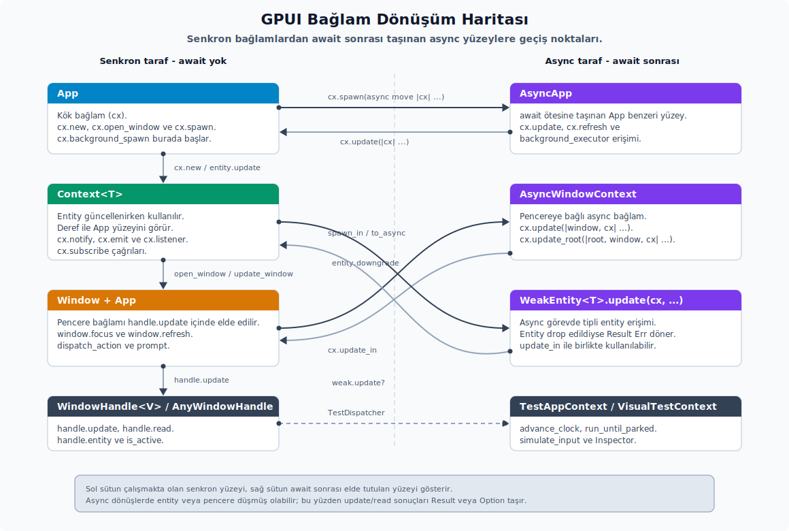

# Bağlamlar ve Pencere Handle'ları

---

## Temeller ve Bağlamlar



GPUI'de neredeyse her işi bir bağlam (`context`) üzerinden yaparsın. Kodda bu bağlam genellikle `cx` adıyla görünür. Bağlam, o anda hangi katmandan konuşulduğunu ve nelere erişebildiğini belirler. Birden fazla bağlam tipi vardır ve her birinin sorumluluğu farklıdır:

- **`App`**: uygulamanın kök bağlamıdır. Global durum, açık pencerelerin listesi, platform servisleri, keymap, global'ler, yeni entity oluşturma ve pencere açma gibi süreç ömrü boyu geçerli işleri buradan yaparsın.
- **`Context<T>`**: belirli bir `Entity<T>` güncellenirken karşılaştığın bağlamdır. `App` üzerine deref eder, yani `App`'in tüm metotlarına buradan da ulaşabilirsin; ek olarak `cx.notify()`, `cx.emit(...)`, `cx.listener(...)`, `cx.observe(...)`, `cx.subscribe(...)`, `cx.spawn(...)` gibi entity'ye özel API'leri açar.
- **`Window`**: tek bir pencereye özgü durum ve davranıştır. Klavye odağı, imleç, pencere boyutu, yeniden boyutlandırma, başlık, arka plan görünümü, komut yönlendirme (`action dispatch`), IME, prompt ve platform pencere işlemleri bu bağlam üzerinden yürür.
- **`AsyncApp` / `AsyncWindowContext`**: bir `await` noktasının ötesine kadar taşınabilen async bağlamlardır. Bu bağlamlarda `update`, `update_entity`, `read_entity`, `update_global` gibi çağrılar çoğunlukla doğrudan değeri (`R`) döndürür; uygulama (`App`) tümüyle düşmüşse panikler. Yalnız pencereyi ya da zayıf entity'yi yeniden canlandıran çağrılar (`update_window`, `with_window`, `read_window` ve zayıf entity üzerindeki `update`) bekleyiş sırasında pencere/entity kapanmış olabileceği için `Result` ya da `Option` döndürür.
- **`TestAppContext` / `VisualTestContext`**: testlerde simülasyon, zamanlayıcı kontrolü ve görsel doğrulama için ayrılmış bağlamlardır; üretim akışlarında kullanılmaz.

Rustdoc tarafındaki `gpui::_ownership_and_data_flow` modülü de aynı sahiplik modelini anlatır: entity state'inin sahibi `App`'tir; `Entity<T>` ise o state'e erişmek için kullandığın tipli bir handle'dır. Bu modül `#[cfg(doc)]` altında yalnızca rustdoc anlatımı için görünür; uygulama kodunun doğrudan çağırdığı bir çalışma zamanı API'si değildir.

| API | Alt özellikler | Kısa anlamı |
| :-- | :-- | :-- |
| `_ownership_and_data_flow` | rustdoc-only modül | Entity/App sahiplik modelini dokümantasyon için açıklar; runtime uygulama API'si değildir. |
| `subscription` | crate kök reexport | Observe/subscribe dönüşlerinin yaşam döngüsü tiplerini GPUI kök yüzeyinden erişilebilir yapar. |

**Entity kullanımı.** Bir entity'yi hem okuyabilirsin hem güncelleyebilirsin. İki işlemi de bağlam üzerinden yaparsın:

```rust
let varlik = cx.new(|cx| Durum::new(cx));

let deger = varlik.read(cx).deger;

varlik.update(cx, |durum, cx| {
    durum.deger += 1;
    cx.notify();
});

let zayif = varlik.downgrade();
zayif.update(cx, |durum, cx| {
    durum.deger += 1;
    cx.notify();
})?;
```

**Kurallar.** Bağlam kullanımında dikkat edeceğin ana noktalar şunlardır:

- Çizim çıktısını etkileyen bir veri değiştiğinde `cx.notify()` çağırırsın. Aksi halde view'da yeni veriye rağmen ekran yenilenmez.
- Bir entity güncellenirken aynı entity'yi yeniden update'e sokma; bu durum yeniden girişe (`reentrancy`) yol açtığı için `panic` üretebilir.
- Uzun yaşayan async işlerde `Entity<T>` yerine `WeakEntity<T>` yakalarsın; bu sayede iş bitmeden entity elden çıktığında döngüsel sahiplik oluşmaz.
- Bir `Task` değeri elden çıktığında içindeki iş iptal olur. Bu yüzden ya `await` edersin, ya struct'ın bir alanında saklarsın, ya da `detach()` / `detach_and_log_err(cx)` ile bağımsız bırakırsın.

## WindowHandle, AnyWindowHandle ve VisualContext

`open_window` ve test yardımcıları, açılan pencereyi temsil eden tipli bir `WindowHandle<V>` döndürür. Bu handle, kök view'un tipini derleme zamanında taşır. Buna karşılık `AnyWindowHandle` kök tipini çalışma zamanında tutar; gerektiğinde alta `downcast` edebilirsin.

İki handle arasında doğrudan bir Deref ilişkisi vardır: `WindowHandle<V>` `#[derive(Deref, DerefMut)]` sayesinde içindeki `AnyWindowHandle` değerine deref olur. Bu yüzden bazı metotlar tipli handle üzerinden çağrılabilir gibi görünür, oysa o metotların asıl sahibi `AnyWindowHandle`'dır. API yüzeyini okurken `Owner::method -> dönüş tipi -> hata davranışı` üçlüsünü birlikte düşünmen gerekir. Yalnız metot adına bakmak burada kolayca yanıltır.

Aynı Deref kalıbını GPUI'de başka handle ve olay ailelerinde de görürsün:

- `Entity<T>: Deref<Target = AnyEntity>` ve `WeakEntity<T>: Deref<Target = AnyWeakEntity>` — tipli entity handle'ları tipsiz handle'a deref eder. Detay "Entity Tip Soyutlaması, Geri Çağrı Adaptörleri ve View Önbelleği" başlığında işlenir.
- `ModifiersChangedEvent`, `ScrollWheelEvent`, `PinchEvent`, `MouseExitEvent`: `Deref<Target = Modifiers>` — bu dört olay Modifiers metotlarını doğrudan açar (`olay.secondary()`, `olay.modified()`). Buna karşılık `MouseDownEvent`, `MouseUpEvent`, `MouseMoveEvent` Deref *etmez*; yalnızca `modifiers` alanını alan olarak verir. Detay "CursorStyle, FontWeight ve Sabit Enum Tabloları" başlığındadır.
- `Context<'a, T>: Deref<Target = App>` — `cx.theme()`, `cx.refresh_windows()` gibi App metotlarını Context üzerinden de çağırabilirsin (bkz. "Temel Bağlamlar").

Bu Deref kalıbında metot adı tek başına yeterli değildir. Aynı isim tipli ve tipsiz sahiplerde (`owner`) farklı dönüş tipleriyle karşına çıkabilir.

**`WindowHandle<V>`.** Tipli handle kök view'a doğrudan tipli erişim sağlar. Bu handle çoğunlukla `cx.open_window(...)` dönüşünden gelir. `cx.window_handle()` ise o anki pencerenin tipsiz `AnyWindowHandle` değerini verir; kök view'u `V` tipiyle güncellemek için `WindowHandle<V>` gerekir:

```rust
tutamac.update(cx, |kok: &mut Workspace, window, cx| {
    kok.focus_active_pane(window, cx);
})?;

let kok_referansi: &Workspace = tutamac.read(cx)?;
let baslik = tutamac.read_with(cx, |kok, cx| kok.title(cx))?;
let varlik = tutamac.entity(cx)?;
// WindowHandle::is_active `Option<bool>` döner; window kapanmış/geçici
// olarak ödünç alınmışsa `None`. Tipik kullanım:
let aktif_mi: Option<bool> = tutamac.is_active(cx);

// `window_id()` sahip olarak `AnyWindowHandle` metodudur; fakat
// `WindowHandle<V>: Deref<Target = AnyWindowHandle>` olduğu için bu çağrı
// metot çözümleme ile çalışır:
let id = tutamac.window_id();

// Tipsiz tutamaç saklamak veya AnyWindowHandle API'sini açık göstermek
// gerektiğinde dönüşümü bilinçli yaparsın:
let tipsiz: AnyWindowHandle = tutamac.into();
let ayni_id = tipsiz.window_id();
```

**`AnyWindowHandle`.** Tipi silinmiş handle'ı jenerik kodlarda ve çalışma zamanı `downcast` senaryolarında kullanırsın:

```rust
if let Some(calisma_alani) = tipsiz_tutamac.downcast::<Workspace>() {
    calisma_alani.update(cx, |calisma_alani, window, cx| {
        calisma_alani.activate(window, cx);
    })?;
}

tipsiz_tutamac.update(cx, |kok_gorunum, window, _cx| {
    let kok_varlik_id = kok_gorunum.entity_id();
    window.refresh();
    (kok_varlik_id, window.is_window_active())
})?;

let baslik = tipsiz_tutamac.read::<Workspace, _, _>(cx, |calisma_alani, cx| {
    calisma_alani.read(cx).title(cx)
})?;
```

**Tam sahip/metot yüzeyi.** Aşağıdaki tablo her metodun asıl sahibini, dönüş tipini ve hata davranışını birlikte gösterir. Böylece tipli handle üzerinde "hangi çağrı bu tipe ait, hangisi deref ile geliyor" ayrımı netleşir:

| Sahip | Metot | Dönüş | Not |
|---|---|---|---|
| `WindowHandle<V>` | `new(id)` | `Self` | Kök tipini çalışma zamanında doğrulamaz; id + `TypeId::of::<V>()` saklar. |
| `WindowHandle<V>` | `root(cx)` | `Result<Entity<V>>` | Sadece `test` veya `test-support`; kök tipi uyuşmazsa ya da pencere kapalıysa hata. |
| `WindowHandle<V>` | `update(cx, \|&mut V, &mut Window, &mut Context<V>\| ...)` | `Result<R>` | Tipli kök view'u günceller. |
| `WindowHandle<V>` | `read(&App)` | `Result<&V>` | Kısa süreli değiştirilemez ödünç alma; kapalı veya ödünç verilmiş pencere hata verir. |
| `WindowHandle<V>` | `read_with(cx, \|&V, &App\| ...)` | `Result<R>` | Geri çağrı içinde güvenli okuma. |
| `WindowHandle<V>` | `entity(cx)` | `Result<Entity<V>>` | Kök entity handle'ını döndürür. |
| `WindowHandle<V>` | `is_active(&mut App)` | `Option<bool>` | Kapalı veya ödünç verilmiş pencere için `None` döner. |
| `WindowHandle<V>` deref | `window_id()` | `WindowId` | Asıl sahip `AnyWindowHandle`; deref sayesinde `handle.window_id()` çalışır. |
| `WindowHandle<V>` deref | `downcast<T>()` | `Option<WindowHandle<T>>` | Asıl sahip `AnyWindowHandle`; tipli handle üzerinde çoğu zaman gereksizdir. |
| `AnyWindowHandle` | `window_id()` | `WindowId` | Pencere kimliği. |
| `AnyWindowHandle` | `downcast<T>()` | `Option<WindowHandle<T>>` | `TypeId` eşleşmezse `None`. |
| `AnyWindowHandle` | `update(cx, \|AnyView, &mut Window, &mut App\| ...)` | `Result<R>` | Kök tipi bilinmez; geri çağrı `AnyView` alır. |
| `AnyWindowHandle` | `read::<T, _, _>(cx, \|Entity<T>, &App\| ...)` | `Result<R>` | Önce `downcast` yapar, sonra tipli entity okutur. |

**Context trait'leri.** Farklı bağlamlar arasında ortak metot setleri trait'ler aracılığıyla paylaşılır:

- `AppContext`: `new`, `reserve_entity`, `insert_entity`, `update_entity`, `read_entity`, `update_window`, `with_window`, `read_window`, `background_spawn`, `read_global` gibi temel App davranışlarını sağlar.
- `VisualContext`: pencereye bağlı bağlamlara (örneğin `Window`+`App` çiftine) `window_handle`, `update_window_entity`, `new_window_entity`, `replace_root_view`, `focus` metotlarını ekler.
- `BorrowAppContext`: `App`, `Context<T>`, async ve test context'leri gibi `App`'i ödünç alabilen bağlamlar arasında `set_global`, `update_global` ve `update_default_global` yardımcılarını ortaklaştırır.

**Pencerede kök değiştirme.** `window.replace_root(cx, |window, cx| NewRoot::new(window, cx))` çağrısı, mevcut pencerenin kök entity'sini yeni bir `Render` view ile değiştirir. Async ve test bağlamlarında aynı işi `replace_root_view` yardımcısı üzerinden yaparsın. Bu kalıbı, yeni bir pencere açmadan kök akışını değiştirmek için kullanırsın. Yine de değiştirdiğin köke ait abonelikleri ve `Task` sahipliklerini ayrıca düşünmen gerekir; aksi halde geride kalan dinleyiciler veya işler bağlamını kaybetmiş halde çalışmaya devam edebilir.

**`with_window` kullanımı.** `with_window(entity_id, ...)` çağrısı, verilen entity'nin en son çizildiği pencereyi bulur. Aynı entity birden fazla pencerede çiziliyorsa bu API bilinçli bir "o anki pencere" kısayolu olarak çalışır; belirli bir pencere hedefliyorsan o pencerenin `WindowHandle`'ını doğrudan saklarsın.

## Application ve App Yaşam Döngüsü

`Application`, GPUI runtime'ını başlatan dış kabuktur. `App` ise runtime başladıktan sonra tüm callback'lerde dolaşan canlı uygulama bağlamıdır. Bu ayrım önemlidir: platform, asset source, HTTP client ve quit davranışı gibi kurulum kararlarını `Application` üzerinde verirsin; açık pencere, global state, action registry, clipboard, credential ve observer gibi çalışma zamanı kararlarını `App` üzerinde yönetirsin.

`Application` builder zinciri şu sırayla okunur:

| API | Görevi | Ne zaman kullanırsın |
|---|---|---|
| `Application::with_platform(platform)` | GPUI'yi belirli bir `Platform` implementasyonu ile başlatır. | Test, headless veya özel platform adaptörü gerektiğinde. Normal desktop uygulamada varsayılan launcher bu seçimi senin yerine yapar. |
| `Application::with_assets(asset_source)` | Uygulama genelindeki asset sağlayıcısını bağlar. | Paketlenmiş ikon, font, tema veya SVG varlıklarını GPUI üzerinden çözmek istediğinde. |
| `Application::with_http_client(http_client)` | Uygulama genelindeki HTTP istemcisini değiştirir. | Testte sahte istemci vermek veya uygulama genelinde özel proxy/kimlik doğrulama kullandırmak istediğinde. |
| `Application::with_quit_mode(mode)` | Son pencere kapanınca uygulamanın nasıl davranacağını belirler. | Menü çubuğu yaşayan macOS tarzı uygulama ile tüm pencere kapanınca çıkan uygulama davranışı arasında seçim yaparken. |
| `Application::on_open_urls(...)` | Platformdan gelen URL açma isteklerini yakalar. | Custom URL scheme veya dosya açma akışını uygulama state'ine yönlendirmek için; `run`'dan önce kaydedersin. |
| `Application::on_reopen(...)` | Platformun "uygulamayı yeniden aç" olayını yakalar. | macOS dock ikonuna tıklama gibi durumlarda yeni pencere açmak veya mevcut pencereyi öne almak için; bunu da `run`'dan önce kaydedersin. |
| `Application::run(|cx| ...)` | Event loop'u başlatır ve ilk `App` bağlamını verir. | Global state, keymap, action ve ilk pencere kurulumu burada yapılır. `run` self'i tükettiği ve olay döngüsünü bloklayan son çağrı olduğu için zincirin sonunda gelir. |
| `Application::background_executor()`, `foreground_executor()`, `text_system()`, `path_for_auxiliary_executable(...)` | Kurulum sonrası servisleri okur. | Launcher seviyesinde task, metin sistemi veya yardımcı executable yolu gerekiyorsa; çoğu view kodunda aynı servisleri `App` üzerinden alırsın. |

`App` tarafında yaşam döngüsü birkaç ayrı aileye ayrılır. `quit()`, `restart()`, `shutdown()` ve `SHUTDOWN_TIMEOUT` aynı sahnenin farklı katmanlarıdır. `quit()` platforma çıkış isteği gönderir. `restart()` restart path'i kullanarak süreci yeniden başlatma niyeti taşır. `shutdown()` ise quit observer'larını çalıştırır, açık pencereleri kapatır ve bekleyen quit görevlerini `SHUTDOWN_TIMEOUT` boyunca bekler; normal view kodundan çağrılması beklenmez. `SHUTDOWN_TIMEOUT`, kapanış sırasında task'ların beklenebileceği kısa süreyi belirleyen sabittir.

`QuitMode` uygulamanın son pencere kapandıktan sonraki davranışını tarif eder. `CursorHideMode` ise klavye/fare etkileşimine göre imlecin ne zaman gizleneceğini belirler; bunu `cursor_hide_mode()`, `set_cursor_hide_mode(...)` ve `is_cursor_visible()` ile birlikte düşünürsün. Platform state'i okuyan `window_appearance()`, `thermal_state()`, `keyboard_layout()`, `keyboard_mapper()` ve `compositor_name()` gibi metotlar, view çiziminden çok uygulama politikası veya tanılama kararlarında işe yarar.

## App Üzerindeki Çalışma Zamanı Yüzeyi

`App` çok geniş bir API taşır; hepsini aynı amaç için kullanmazsın. Aşağıdaki gruplar hangi metot ailesinin hangi soruya cevap verdiğini gösterir.

| Soru | İlgili API'ler | Kullanım notu |
|---|---|---|
| Hangi pencere açık ve hangisi aktif? | `windows()`, `window_stack()`, `active_window()`, `open_window(...)`, `with_window(...)`, `refresh_windows()` | Pencere listesi ve aktif pencere uygulama geneline aittir. Belirli bir kök view'a tipli erişim gerekiyorsa `WindowHandle<V>` saklamak daha doğrudur. |
| Hangi ekran veya platform kabiliyeti var? | `displays()`, `primary_display()`, `find_display(...)`, `screen_capture_sources()`, `is_screen_capture_supported()`, `button_layout()`, `should_auto_hide_scrollbars()` | Bu metotlar UI kararını platform gerçekliğine bağlar. Değerleri render sırasında okuyabilirsin, ama kalıcı ayar gibi saklamadan önce platform değişimini dinlemeyi düşünmen gerekir. |
| Global state nasıl tutulur? | `has_global::<G>()`, `global::<G>()`, `try_global::<G>()`, `global_mut::<G>()`, `default_global::<G>()`, `set_global(...)`, `remove_global::<G>()`, `clear_globals()` | `Global` uygulama genelinde tekil state içindir. `global()` yoksa panikler; opsiyonel bağımlılıklar için `try_global()` daha doğru olur. `clear_globals()` test/yeniden kurulum sınırına aittir. |
| Entity yaşam döngüsü nasıl izlenir? | `observe(...)`, `subscribe(...)`, `observe_new::<T>(...)`, `observe_release(...)`, `observe_release_in(...)`, `assert_no_new_leaks(...)`, `leak_detector_snapshot()`, `ref_counts_drop_handle()` | Observer ve subscription dönüşleri `Subscription` olarak tutulur veya detach edilir; aksi halde hemen düşer. Leak metotları üretim davranışı değil, test ve tanılama güvenliği sağlar. |
| Action ve keymap uygulama geneline nasıl bağlanır? | `bind_keys(...)`, `clear_key_bindings()`, `key_bindings()`, `all_bindings_for_input(...)`, `on_action(...)`, `dispatch_action(...)`, `is_action_available(...)`, `build_action(...)`, `all_action_names()`, `action_schemas()`, `action_schema_by_name(...)`, `action_documentation()`, `deprecated_actions_to_preferred_actions()`, `action_deprecation_messages()`, `intercept_keystrokes(...)`, `observe_keystrokes(...)`, `stop_propagation()`, `propagate()` | Bu aile ayrıntılı olarak Action ve Keymap bölümünde anlatılır. Burada temel sınır şudur: keymap kayıtları globaldir, action dispatch ise odak yoluna göre pencereye ve element ağacına iner. |
| Async iş nereden başlatılır? | `background_executor()`, `foreground_executor()`, `spawn(...)`, `spawn_with_priority(...)`, `defer(...)`, `to_async()` | `spawn(...)` sana `AsyncApp` verir; `await` sonrasında App'e erişmek için bu bağlamı kullanırsın. Render'ı etkileyen sonucu döndürdüğünde ilgili entity veya global state'i tekrar güncellemen gerekir. |
| Platform servisleri nereden gelir? | `http_client()`, `set_http_client(...)`, `asset_source()`, `fetch_asset(...)`, `remove_asset(...)`, `drop_image(...)`, `svg_renderer()`, `text_system()`, `text_rendering_mode()`, `set_text_rendering_mode(...)`, `init_colors()` | Asset, SVG ve metin sistemi çoğu zaman daha özel bölümlerde anlatılır. `App` bunların ortak erişim noktasıdır; cache ve kaynak seçimi uygulama genelindedir. |
| Clipboard ve credential nasıl yönetilir? | `read_from_clipboard()`, `write_to_clipboard(...)`, `read_from_primary()`, `write_to_primary(...)`, `read_from_find_pasteboard()`, `write_to_find_pasteboard(...)`, `read_credentials(...)`, `write_credentials(...)`, `delete_credentials(...)` | Clipboard metotları senkron platform state'i okur/yazar; primary selection çifti Linux/FreeBSD, find pasteboard çifti macOS `cfg` kapısındadır. Credential metotları `Task<Result<...>>` döndürür; platform store erişimi async ve hata üretebilir. |
| Dosya, URL ve prompt işleri nereden yapılır? | `open_url(...)`, `register_url_scheme(...)`, `open_with_system(...)`, `reveal_path(...)`, `app_path()`, `path_for_auxiliary_executable(...)`, `prompt_for_paths(...)`, `prompt_for_new_path(...)`, `set_prompt_builder(...)`, `reset_prompt_builder()` | Kullanıcının sistemle etkileşime girdiği dosya/URL işleri `App` üzerinden platforma gider. Prompt builder test ve ürün özelleştirmesinde önemlidir; normal akışta platform prompt'u kullanılır. |
| Menü, dock ve son dokümanlar nasıl bağlanır? | `set_menus(...)`, `get_menus()`, `set_dock_menu(...)`, `perform_dock_menu_action(...)`, `add_recent_document(...)`, `update_jump_list(...)` | Menü listesi platform uygulama menüsünü, dock/jump list ise işletim sistemi entegrasyonunu besler. Action dispatch ile aynı command modeline bağlandığında tutarlı davranır. |
| Süren bir sürüklemeyi nasıl izler/yönetirim? | `has_active_drag()`, `stop_active_drag()`, `active_drag_cursor_style()`, `set_active_drag_cursor_style(...)` | `has_active_drag()` o an bir sürükleme sürüyor mu söyler (çakışan etkileşimi kapılamak için); `stop_active_drag(window)` süreni iptal eder (Escape/`Cancel` akışı); imleç stilini hedefe göre değiştirip kullanıcıya geri bildirim verirsin. Ayrıntı: [Etkileşim ve Olaylar](09-etkilesim-ve-olaylar.md). |
| Uygulamayı öne alma/gizleme (platform kabuğu) nasıl yapılır? | `activate(ignoring_other_apps)`, `hide()`, `hide_other_apps()`, `unhide_other_apps()` | Tek bir bileşenin (view) kendi durumu değil, uygulamanın işletim sistemi kabuğu işlemleridir (macOS-merkezli): sırasıyla uygulamayı öne getir, uygulamayı gizle, diğer uygulamaları gizle ve yeniden göster. |
| Kapanış ve pencere olayları nasıl dinlenir? | `on_app_quit(...)`, `on_app_restart(...)`, `on_window_closed(...)`, `on_keyboard_layout_change(...)`, `on_thermal_state_change(...)` | Bu observer'lar uygulama genelindeki platform olaylarını state'e yansıtmak için kullanılır. Callback içinde uzun iş başlatıyorsan task sahipliğini açık yönetirsin. |
| Inspector ve debug yüzeyi nasıl bağlanır? | `set_inspector_renderer(...)`, `register_inspector_element(...)`, `get_name()`, `can_select_mixed_files_and_dirs()` | Inspector API'leri debug/test destekli build'lerde anlamlıdır. Üretim ekranının iş mantığını inspector varlığına bağlamazsın. |

`AppCell`, `AppRef` ve `AppRefMut` daha düşük seviyeli borç alma katmanıdır. `AppCell::borrow()`, `borrow_mut()` ve `try_borrow_mut()` çoğu uygulama kodunda doğrudan görünmez; GPUI'nin callback ve async köprüsü App'i güvenli şekilde dolaştırmak için bunları kullanır. `try_borrow_mut()` borç alınamayan durumda hata döndürdüğü için reentrant güncelleme tanılamasında önemlidir.

## `Context<T>` Üzerindeki Entity Merkezli Yüzey

`Context<T>` bir `Entity<T>` güncellenirken kullanılan bağlamdır. `Context<'a, T>: Deref<Target = App>` olduğu için `App` metotlarına da erişirsin; fakat `Context<T>`'nin asıl değeri, o entity'ye özel kimlik, bildirim, event, observer ve task yardımcılarını taşımasıdır.

| API ailesi | Metotlar | Davranış |
|---|---|---|
| Entity kimliği | `entity_id()`, `entity()`, `weak_entity()` | Güncellenen entity'nin güçlü veya zayıf handle'ını verir. Uzun yaşayan task ve callback'lerde `weak_entity()` tercih edilir. |
| Ekranı yenileme | `notify()` | Entity'nin yeniden çizilmesi gerektiğini işaretler. State değiştiği halde `notify()` çağrılmazsa render sonucu değişmeyebilir. |
| Event yayma | `emit(event)` | `EventEmitter` üzerinden dinleyicilere tipli event gönderir. Event, state değişikliğinin kendisi değildir; başka parçaların bu değişiklikten haberdar olmasını sağlar. |
| Listener üretme | `listener(...)`, `processor(...)` | UI callback'lerini entity state'ine güvenli bağlar. `listener` zayıf handle kullanır; entity düşmüşse sessizce hiçbir şey yapmaz ve değer döndürmez. `processor` güçlü handle kullanır; geri çağrının dönüş değerini sana verir (senkron `update`), bu yüzden bir sonuç gerektiğinde tercih edersin. |
| Observer kurma | `observe(...)`, `observe_self(...)`, `observe_global(...)`, `observe_global_in(...)`, `observe_in(...)`, `observe_release(...)`, `observe_release_in(...)`, `observe_window_bounds(...)`, `observe_window_activation(...)`, `observe_window_appearance(...)`, `observe_button_layout_changed(...)`, `observe_keystrokes(...)`, `observe_pending_input(...)` | Observer'lar dış state değişimini bu entity'ye taşır. Pencere veya global içeren `_in` varyantları callback'e `Window` bağlamı gerektiğinde kullanılır. |
| Subscription kurma | `subscribe(...)`, `subscribe_self(...)`, `subscribe_in(...)` | `EventEmitter` event'lerini dinler. Subscription saklanmazsa düşer; bu yüzden view alanında tutulur veya bilinçli detach edilir. |
| Focus olayları | `on_focus(...)`, `on_focus_in(...)`, `on_blur(...)`, `on_focus_lost(...)`, `on_focus_out(...)`, `focus_self(window)`, `focus_view(...)` | Focus geçişini state'e yansıtmak için kullanılır. `focus_self` odağı, verdiğin `window` içinde bu view'a taşır; focus handler'larında yeniden dispatch döngüsü kurmamaya dikkat edersin. |
| Yaşam sonu | `on_release(...)`, `on_release_in(...)`, `on_drop(...)` | Entity elden çıkarken temizlik veya son event yazımı için kullanılır. UI state'i zaten elden çıkıyorsa yeni render varsayımı yapmazsın. |
| Async iş | `spawn(...)`, `spawn_in(window, ...)`, `spawn_in_with_priority(...)`, `defer_in(...)`, `on_next_frame(...)` | `spawn` App'e bağlı async iş başlatır ve geri çağrıya entity'nin `WeakEntity`'sini ve `&mut AsyncApp`'i birlikte verir; `spawn_in` ek olarak pencereyi de bağlar. `defer_in` mevcut update bittikten sonra çalışacak işi sıraya alır; aynı update içinde yeniden girişli değişiklik yapmak yerine bunu kullanırsın. |

`Context<T>` ile `App` arasındaki sınırı şöyle düşün: Uygulama geneline ait bir servis veya kayıt gerekiyorsa `App` metodu; mevcut entity'nin state'i, event'i, subscription'ı veya render bildirimi gerekiyorsa `Context<T>` metodu kullanılır.

## Entity, WeakEntity ve AnyEntity Ailesi

`Entity<T>`, GPUI tarafından yönetilen state'e tipli ve güçlü bir referanstır. `WeakEntity<T>` aynı state'e sahiplik uzatmadan bakar. `AnyEntity` ve `AnyWeakEntity` ise tip silinmiş hallerdir; generic olmayan koleksiyonlarda, pencere köklerinde ve çalışma zamanı `downcast` gerektiren yerlerde kullanılır.

| Tip | Metotlar | Kullanım notu |
|---|---|---|
| `Entity<T>` | `entity_id()`, `read(cx)`, `read_with(cx, ...)`, `update(cx, ...)`, `update_in(cx, ...)`, `write(cx)`, `as_mut(cx)`, `downgrade()`, `into_any()` | Günlük uygulama kodunun ana handle'ıdır. `read` kısa süreli ödünç verir; `update` state'i değiştirir; `update_in` pencere bağlamı gerektiren değişikliklerde kullanılır. |
| `WeakEntity<T>` | `upgrade()`, `update(cx, ...)`, `update_in(cx, ...)`, `read_with(cx, ...)`, `new_invalid()` | Async task ve uzun yaşayan callback'lerde döngüsel sahipliği engeller. `upgrade()` `None` dönerse entity artık yoktur; bu durum hata değil, yaşam döngüsünün doğal sonucudur. |
| `AnyEntity` | `entity_id()`, `entity_type()`, `downgrade()`, `downcast::<T>()` | Tipi çalışma zamanında bilinen handle'larla çalışırken kullanılır. `downcast` başarısız olabilir; bu yüzden tip varsayımı iş mantığının tek dayanağı yapılmaz. |
| `AnyWeakEntity` | `entity_id()`, `upgrade()`, `is_upgradable()`, `assert_released()`, `new_invalid()` | Tip silinmiş zayıf referanstır. Testte release doğrulaması için `assert_released()` kullanılabilir; üretim davranışı buna bağlanmaz. |
| `EntityId` | `as_u64()`, `as_non_zero_u64()` | Log, harita anahtarı veya dış sistemle eşleme için kimlik değerini verir. Entity'nin kendisine erişim sağlamaz. |

`EntityMap`, `Entity<T>` değerlerinin App içindeki gerçek saklama alanıdır. `insert`, `reserve`, `read`, `lease`, `end_lease`, `extend_accessed`, `clear_accessed`, `take_dropped`, `leak_detector_snapshot`, `assert_no_new_leaks` ve `ref_counts_drop_handle` gibi metotlar GPUI'nin sahiplik ve leak detection mekanizmasını yürütür. Uygulama kodunda çoğunlukla `cx.new`, `entity.update(...)` ve `WeakEntity` yüzeyiyle çalışırsın; `EntityMap` metotlarını ancak test altyapısı, framework entegrasyonu veya düşük seviye tanılama yazarken doğrudan görürsün.

`LeakDetector`, `handle_created`, `handle_released`, `snapshot`, `assert_released` ve `assert_no_new_leaks` ile entity handle yaşamını takip eder. Bu aile, "state gerçekten elden çıktı mı?" sorusunun test cevabıdır. Kullanıcıya görünen davranışı değiştirmek için değil, sahiplik hatasını erken yakalamak için kullanılır.

## AsyncApp ve AsyncWindowContext

`AsyncApp`, `App::spawn(...)` içinde verilen ve `await` noktaları boyunca taşınabilen bağlamdır. `AsyncWindowContext` aynı fikri pencereye bağlı işler için genişletir. Bu iki tipteki kritik fark şudur: synchronous `Context<T>` anlık ve ödünç alınmış App/Window erişimi verir; async bağlam ise pencere veya zayıf entity üzerinden geri dönerken canlılık varsayımını yeniden kurar ve bu çağrıların bir bölümünde `Result` ya da `Option` ile başarısızlığı sana taşır.

| Tip | Metotlar | Davranış |
|---|---|---|
| `AsyncApp` | `refresh()`, `update(...)`, `background_executor()`, `foreground_executor()`, `subscribe(...)`, `open_window(...)`, `spawn(...)`, `has_global::<G>()`, `read_global(...)`, `try_read_global(...)`, `read_default_global(...)`, `update_global(...)`, `on_drop(...)` | App hala yaşıyorsa çalışma zamanı state'ine geri döner. Global okuma/yazma ve pencere açma gibi işler async task sonucunu uygulamaya bağlar. |
| `AsyncWindowContext` | `window_handle()`, `update(...)`, `update_root(...)`, `on_next_frame(...)`, `read_global(...)`, `update_global(...)`, `spawn(...)`, `prompt(...)` | Window kapanmışsa pencereye geri dönen çağrılar `Result` hata dönebilir. Bu yüzden async pencere işlerinde hata yayma (`?`) veya kullanıcıya sessiz no-op kararı açık olmalıdır. |

Async bağlamda temel kural şudur: Task sonucunda ekrana yansıyacak state değişiyorsa entity'yi `update`/`update_in` ile günceller ve `cx.notify()` çağırırsın. Task yalnız arka plan cache'ini veya global state'i değiştiriyorsa ilgili global observer'ın render'ı tetikleyeceğinden emin olursun.

---
