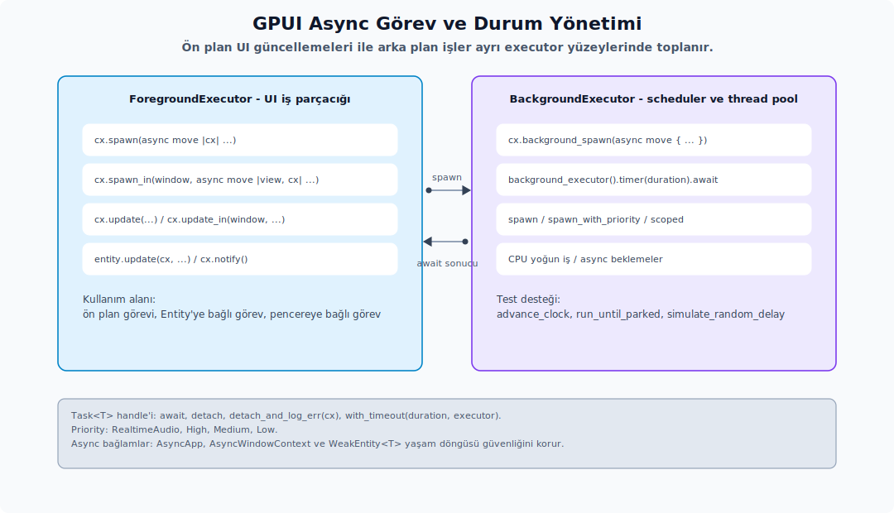
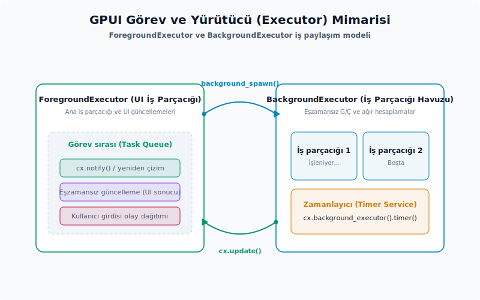
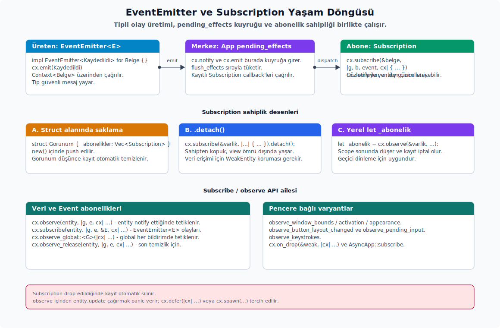
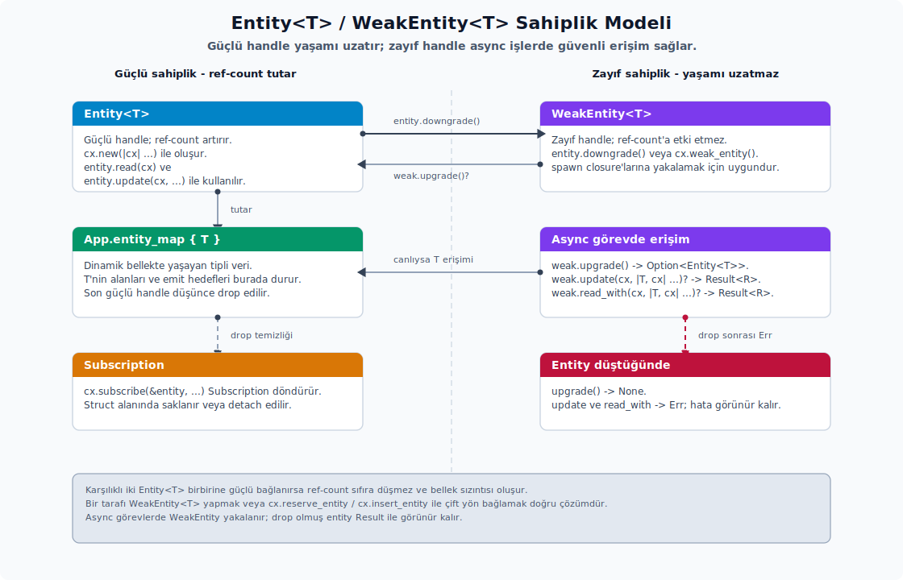

# Async, Görev ve Durum Yönetimi

---

## Async İşler



GPUI bünyesinde asenkron işlemler, bağlam (context) üzerinden başlatılan `Task` handle'ları (tutacakları) vasıtasıyla yönetilir. Bu doğrultuda üç temel kalıp mevcuttur: ön plan görevi, o anki entity'ye (varlığa) bağlı görev ve pencere ömrünü hesaba katan görev. Ön plan görevi UI (arayüz) iş parçacığıyla (thread) aynı çalıştırıcı üzerinde koşarken; diğer iki kalıp, ilgili entity veya pencerenin yaşam döngüsünü esas alır. Her bir kalıbı, ihtiyaç duyduğu bağlama göre farklı bir closure (kapanış) imzasıyla tanımlamak mümkündür.

**Ön plan görevi.** Herhangi bir entity veya pencere bağlamına ihtiyaç duymayan en sade görev biçimidir:

```rust
cx.spawn(async move |cx| {
    cx.update(|cx| {
        // App verisini güncelle
    })
})
.detach();
```

**Entity'ye bağlı görev.** Bu kalıpta closure, parametre olarak o anki entity'nin `WeakEntity` referansını alır. Böylece asenkron beklemeler sırasında entity'nin bellekten düşme ihtimali `Result` tipi üzerinden güvenli bir şekilde yönetilebilir hale gelir:

```rust
cx.spawn(async move |gorunum, cx| {
    cx.background_executor().timer(Duration::from_millis(200)).await;
    gorunum.update(cx, |gorunum, cx| {
        gorunum.hazir_mi = true;
        cx.notify();
    })?;
    Ok::<(), anyhow::Error>(())
})
.detach_and_log_err(cx);
```

**Pencereye bağlı görev.** Pencere bağlamını asenkron tarafa taşıyarak, pencere eylemlerinin `cx.update_in` yardımıyla yürütülmesine imkan tanır:

```rust
cx.spawn_in(window, async move |gorunum, cx| {
    gorunum.update_in(cx, |gorunum, window, cx| {
        window.activate_window();
        cx.notify();
    })?;
    Ok::<(), anyhow::Error>(())
})
.detach_and_log_err(cx);
```

`Context::spawn` ve `spawn_in` fonksiyonlarının imzaları `AsyncFnOnce(WeakEntity<T>, &mut AsyncApp/AsyncWindowContext)` beklediği için closure yapısının `async move |gorunum, cx| { ... }` biçiminde kurulması gerekir. Closure gövdesinden `Result` döndürüldüğü durumlarda, derleyicinin tip çıkarımını doğru yapabilmesi adına ya yukarıdaki gibi `Ok::<(), anyhow::Error>(())` ile son ifadenin tipi açıkça belirtilmeli ya da kod bloğunun başında `let _: Result<_, anyhow::Error> = ...` kalıbına yer verilmelidir.

`window.to_async(cx)` çağrısı doğrudan bir `AsyncWindowContext` üretir. Geri çağırma işlevlerinin dışına taşınacak pencere bağımlı asenkron yardımcılar yazılırken bu yöntemin tercih edilmesi uygundur. Günlük entity ve view geliştirme süreçlerinde ise `cx.spawn_in(window, ...)` fonksiyonu, sunduğu güvenlik ve okunabilirlik sayesinde daha pratik bir sarmalayıcı görevi görür.

**Arka plan iş parçacığı.** Arayüzün donmasını engellemek amacıyla, CPU yoğun veya uzun süren işlemler ön plan çalıştırıcısını (foreground executor) bloke etmeyecek şekilde arka plan çalıştırıcısına devredilebilir. Arka plandaki işlem tamamlandığında ise elde edilen sonuç bir ön plan görevi aracılığıyla tekrar kullanıcı arayüzüne taşınır:

```rust
let gorev = cx.background_spawn(async move {
    pahali_is().await
});

cx.spawn(async move |cx| {
    let sonuc = gorev.await;
    cx.update(|cx| {
        // sonucu UI'a taşı
    })
})
.detach();
```

**Testlerde zamanlayıcı.** Test senaryolarında zaman akışının tam kontrolünü sağlamak adına GPUI'nın yerleşik zamanlayıcı mekanizmasından yararlanılır:

- GPUI testleri yazılırken `smol::Timer::after(...)` yerine `cx.background_executor().timer(duration).await` ifadesinin çağrılması gerekir. Bu sayede zamanı sanal olarak elle ilerletmek ve `run_until_parked()` yardımıyla senkron bir yürütme gerçekleştirmek mümkün hale gelir. `cx.background_executor().timer()` ve `run_until_parked()` birlikteliği, deterministik (belirlenebilir) test akışlarının temelini oluşturur.

## Çalıştırıcı, Öncelik, Timeout ve Test Zamanı

GPUI bünyesinde asenkron işlemlerin yönetimi ve iş parçacıkları arasındaki görev dağılımı, iki temel çalıştırıcı yapısına dayanır. Aşağıdaki şemada, ön plan iş parçacığı (`ForegroundExecutor`) ile arka plan iş parçacığı havuzu (`BackgroundExecutor`) arasındaki iş bölümü ve asenkron görevlerin (`spawn`/`update`) aktarım yolları gösterilmektedir:



GPUI bünyesinde görevlerin yürütülmesi iki temel çalıştırıcı arasında paylaştırılır. Ön plan çalıştırıcısı (foreground executor) doğrudan UI iş parçacığı üzerinde çalışırken; arka plan çalıştırıcısı (background executor) ise zamanlayıcı (`scheduler`) ve iş parçacığı havuzu (`thread pool`) vasıtasıyla işleri yürütür. Bu ayrım sadece başarımı artırmakla kalmaz, aynı zamanda bir `await` noktasından sonra hangi bağlamların güvenle tutulabileceğini de belirler. Örneğin, ön plan tarafında `App` veya `Window` bağlamlarına güvenli dönüş noktaları sağlanmışken, arka plan tarafında bu tür doğrudan erişimler bulunmaz.

**Temel tipler.** Yürütme sistemi aşağıdaki bileşenlerden meydana gelir:

- `BackgroundExecutor`: Ana metotları `spawn`, `spawn_with_priority`, `timer`, `scoped`, `scoped_priority` ve `is_main_thread` şeklindedir. Test süreçlerinde ise `advance_clock`, `run_until_parked` ve `simulate_random_delay` fonksiyonlarından yararlanmak mümkündür.
- `ForegroundExecutor`: Asenkron görevleri (future) ana iş parçacığına yerleştirir; `spawn` ve `spawn_with_priority` metotlarının yanı sıra, senkron köprü vazifesi gören `block_on` ve `block_with_timeout` işlevlerini sunar.
- `Priority`: Yürütme önceliğini belirleyen ve dört seviyeden oluşan bir enum yapısıdır: `RealtimeAudio`, `High`, `Medium` ve `Low`. `RealtimeAudio` seviyesi ayrı bir iş parçacığı gerektirdiğinden, arayüz dışı ses işlemleri gibi son derece kısıtlı senaryolar haricinde tercih edilmesi önerilmez.
- `Task<T>`: Üzerinde `await` çağrısı yapılabilen asenkron görev tutacağıdır. Bu nesne kapsam dışına çıkıp elden bırakıldığında (drop) arka plandaki işlem de iptal edilir. İşin kesintisiz tamamlanması isteniyorsa görevi `await` etmek, bir struct alanı içinde saklamak veya `detach()` ya da `detach_and_log_err(cx)` metotlarıyla serbest bırakmak gerekir.
- `FutureExt::with_timeout(duration, executor)`: Bir asenkron görevi çalıştırıcının zamanlayıcısı ile yarıştırarak sonucu `Result<T, Timeout>` formatında döner.

**Zaman aşımı (Timeout) örneği.** Bu yapının en yaygın kullanım senaryolarından biri, uzun süren bir arka plan işlemine üst süre sınırı getirmektir:

```rust
let yurutucu = cx.background_executor().clone();
let gorev = cx.background_spawn(async move {
    buyuk_dosyayi_ayristir(yol).await
});

let sonuc = gorev
    .with_timeout(Duration::from_secs(5), &yurutucu)
    .await?;
```

**Ön plan önceliği.** `App::spawn_with_priority(...)` and `ForegroundExecutor::spawn_with_priority(...)` fonksiyonları parametre olarak bir `Priority` değeri kabul eder. Ancak mevcut sürümde ön plan çalıştırıcısı bu öncelik değerini göz ardı ederek işleri ana iş parçacığı üzerinde sırayla yürütür. Bu sebeple buradaki öncelik parametresi kesin bir davranış garantisi sunmaktan ziyade, çağrının amacını ve önem derecesini belgeleyen bir API arayüzü olarak yorumlanmalıdır:

```rust
cx.spawn_with_priority(Priority::High, async move |cx| {
    cx.update(|cx| {
        cx.refresh_windows();
    });
})
.detach();
```

**Güncelleme (Update) mantığı.** `AsyncApp::update(|cx| ...)` doğrudan `R` tipinde bir değer döndürür. Entity güncellemelerinin aksine bu çağrının başarısız olma ihtimali bulunmadığından hata kontrolü amacıyla `?` operatörünü kullanmaya gerek yoktur. Pencere özelindeki asenkron işlemlerde ise `AsyncWindowContext::update(|window, cx| ...) -> Result<R>` veya `Entity::update(cx, ...)` gibi hata dönebilen alternatif yöntemler tercih edilmelidir.

**Asenkron bağlam kestirme fonksiyonları.** Asenkron bağlamlar üzerinde sıklıkla ihtiyaç duyulan pratik kestirme metotlar şunlardır:

- `AsyncApp::refresh()`: Tüm pencereler için yeniden çizim planlaması yapar. Asenkron akışlar içerisinden arayüzü tazelemek için `update(|cx| cx.refresh_windows())` yazma zahmetini ortadan kaldırır.
- `AsyncApp::background_executor()` ve `foreground_executor()`: İlgili çalıştırıcı handle'larını döndürür. Zamanlayıcı, zaman aşımı (timeout) yönetimi veya iç içe `spawn` gerektiren durumlarda bu referanslar kullanılır.
- `AsyncApp::subscribe(&entity, ...)`, `open_window(options, ...)`, `spawn(...)`, `has_global::<G>()`, `read_global`, `try_read_global`, `read_default_global`, `update_global` ve `on_drop(&weak, ...)`: `await` edilebilen uygulama görevlerinde, ana ön plan verilerine güvenli bir şekilde erişip geri dönebilmek için tasarlanmış geçiş noktalarıdır.
- `AsyncWindowContext::window_handle()`: Bağımlı olunan pencere referansını sunar. `update(|window, cx| ...)` yalnızca pencere verisini mutasyona uğratırken; kök görünüm olan `AnyView` üzerinde işlem yapılması gerektiğinde `update_root(|root, window, cx| ...)` fonksiyonundan yararlanılır.
- `AsyncWindowContext::on_next_frame(...)`, `read_global`, `update_global`, `spawn(...)` ve `prompt(...)`: Pencere bağımlı asenkron işlemlerde "pencerenin kapanmış olma" riskini `Result` ya da alternatif bir `receiver` kanalı üzerinden kontrol etmeye olanak tanır.

**Entity ve pencere odaklı öncelikli görevler.** Öncelikli yürütülmesi gereken işlerin tipli varyantları için şu yardımcı fonksiyonlar sunulmuştur:

- `cx.spawn_in_with_priority(priority, window, async move |weak, cx| { ... })`: O anki entity'ye ait `WeakEntity<T>` referansı ile birlikte `AsyncWindowContext` bağlamını sağlar.
- `window.spawn_with_priority(priority, cx, async move |cx| { ... })`: Doğrudan pencere handle'ına bağlı olan ancak belirli bir entity gerektirmeyen asenkron işlemler için uygundur.
- Belirlenen öncelik değeri, yalnızca ön plan çalıştırıcısının iş kuyruğundaki yoklama sırasını etkiler; dolayısıyla uzun sürecek CPU yoğun hesaplamaların yine de `background_spawn` aracılığıyla arka plana devredilmesi gerekir.

**Hazır değer.** Bir işlem sonucu halihazırda elde edilmişse, yeni bir asenkron görev başlatmaya gerek kalmaksızın değer doğrudan `Task::ready` ile döndürülebilir. Bu yöntem, çağıran fonksiyonun geri dönüş tipini her iki senaryoda da `Task` olarak tutarlı kılmaya yardımcı olur:

```rust
fn onbellekten_veya_async(onbellekteki: Option<Veri>, cx: &App) -> Task<anyhow::Result<Veri>> {
    if let Some(veri) = onbellekteki {
        Task::ready(Ok(veri))
    } else {
        cx.background_spawn(async move { veri_yukle().await })
    }
}
```

**Test zamanı.** Test ortamlarında zamanlama ve yürütme mekanizmalarının davranışları ile ilgili şu hususlara dikkat edilmesi gerekir:

- `cx.background_executor().timer(duration).await` çağrısı doğrudan GPUI zamanlayıcısına bağlı çalışır. `smol::Timer::after` kullanımı, GPUI'ın `run_until_parked()` mekanizmasıyla uyum göstermeyebileceği için test senaryolarında tercih edilmemelidir.
- `advance_clock(duration)` fonksiyonu yalnızca sanal saati (fake clock) ilerletir. İlerletilen süre sonucunda çalışmaya hazır hale gelen görevleri tetiklemek için ek olarak `run_until_parked()` çağrısı yapılmalıdır.
- `allow_parking()` metodu, bekleyen görevler bulunmasına rağmen test akışının duraklatılmasını (parked) bilinçli olarak kabul etmek amacıyla kullanılır; bu ayarın üretim (production) kodlarına taşınması uygun değildir.
- `block_with_timeout` işlevi, belirlenen süre aşıldığında asenkron görevi (future) çağırana geri iade eder. Bu yaklaşım, görevin iptal edilip edilmeyeceği veya ileride tekrar mı deneneceği kararını tamamen geliştiriciye bırakır.
- `PriorityQueueSender<T>` ve `PriorityQueueReceiver<T>` yapıları GPUI çekirdeğinden dışa aktarılan, farklı metotlara sahip iki ayrı tiptir. Gönderici tarafındaki `send(priority, item)` ve `spin_send(priority, item)` metotları veriyi öncelik kuyruğuna ekler. Alıcı tarafındaki `try_pop()`, `spin_try_pop()`, `pop()`, `try_iter()` ve `iter()` metotları ise yüksek (high), orta (medium) ve düşük (low) öncelikli kuyrukları ağırlıklı bir seçim algoritmasıyla tüketir. `Priority::RealtimeAudio` görevleri bu genel kuyruğa girmez. `spin_send` ve `spin_try_pop` işlevleri, executor'ın kilitsiz hızlı yolunda kısa süreli dönerek (spin lock) kuyruğa erişim denemesi yaptığı için sıradan uygulama içi mesajlaşmalarda değil, doğrudan scheduler veya platform sınırlarında anlam ifade eder.

**Executor API yelpazesi.** `BackgroundExecutor` ve `ForegroundExecutor` yapıları aynı zamanlayıcı altyapısını kullansalar da sorumluluk sınırları farklılık gösterir:

- `BackgroundExecutor::new(dispatcher)` ve `ForegroundExecutor::new(dispatcher)` metotları, platform veya test ortamı ayağa kaldırılırken kullanılır. Standart uygulama akışında ise çalıştırıcı referansları `cx.background_executor()` ve `cx.foreground_executor()` vasıtasıyla temin edilir.
- `BackgroundExecutor::spawn(...)` ve `spawn_with_priority(...)` metotları, `Send + 'static` sınırlarına uyan asenkron görevler bekler. Bunlar CPU yoğun, G/Ç (I/O) ve zamanlayıcı (timer) gerektiren işlemler için uygundur. `Priority::RealtimeAudio` seviyesindeki görevler doğrudan özel bir ses iş parçacığına yönlendirildiği için standart UI güncellemelerinde kullanılmamalıdır.
- `ForegroundExecutor::spawn(...)` işleri doğrudan ana iş parçacığı üzerinde koşturur. `spawn_with_priority(...)` metodu ise parametre alsa da ön plan işleri ardışık yürütüldüğü için pratikte öncelik sırasını göz ardı eder.
- `BackgroundExecutor::scoped(...)` ve `scoped_priority(...)` metotları, aynı kapsam (scope) dahilinde başlatılan tüm alt görevlerin tamamlanmasını bekler. `Scope::spawn(...)` ise ödünç alınan (borrowed) verilerle çalışan kısa ömürlü işleri güvenli bir şekilde bir araya getirir. Ancak uzun ömürlü UI durumlarını güncellemek amacıyla `Context::spawn` veya `cx.background_spawn` kullanılması kod okunabilirliği açısından daha yerindedir.
- `BackgroundExecutor::now()` ve `timer(duration)` metotları sanal test saatini baz alır. Deterministik test senaryolarında `std::time::Instant::now()` ve `smol::Timer` yerine bu metotların kullanılması gerekir.
- `BackgroundExecutor::num_cpus()` değeri, test ortamlarında `set_num_cpus(...)` yardımıyla manipüle edilebilir. Görev bölüştürme mantığının çalışılan makinenin fiziksel çekirdek sayısından bağımsız olarak test edilmesi isteniyorsa bu değerin sabitlenmesi faydalı olur.
- `BackgroundExecutor::is_main_thread()`, alt katmandaki `PlatformDispatcher` üzerinden mevcut iş parçacığının ana UI iş parçacığı olup olmadığını denetler. Bu kontrol doğrudan kullanıcı arayüzü verilerine erişim yetkisi olarak algılanmamalıdır; zira arayüz verilerine dönmek için yine `AsyncApp::update`, `AsyncWindowContext::update`, `Context::spawn` veya `Window::spawn` sınırlarının kullanılması zorunludur.
- `scheduler_executor()` ve `dispatcher()` fonksiyonları doğrudan alt seviye scheduler ve platform handle'larına erişim sağlar. Bunlar Zed'in alt kütüphaneleri veya platform uyarlama katmanları için tasarlanmış olup, genel uygulama geliştirme seviyesinde bu handle'ların saklanmasından kaçınılmalıdır.

Test özellikleri etkinleştirildiğinde `BackgroundExecutor` üzerinden `simulate_random_delay()`, `advance_clock(...)`, `tick()`, `run_until_parked()`, `allow_parking()`, `forbid_parking()`, `set_block_on_ticks(...)`, `rng()` ve `set_num_cpus(...)` metotları kullanılabilir hale gelir. Bunlar üretim zamanlayıcısının davranışını değiştirme amacı taşımaz; aksine test aşamasında olası yarış durumlarını (race condition) tetiklemek, sanal zamanı ilerletmek ve park davranışlarını bilinçli bir biçimde onaylamak amacıyla tercih edilir.

**Ön plan bloklama köprüleri.** `ForegroundExecutor::block_test(...)` fonksiyonu, yalnızca GPUI test makrosunun asenkron test gövdesini yürütmesi amacıyla tasarlanmıştır. Senkron kod bloklarından asenkron bir görevi beklemek için `block_on(...)` ve `block_with_timeout(...)` metotları kullanılabilir; ancak kullanıcı arayüzü olay yöneticileri (event handler) içerisinde uzun süren görevleri bu şekilde bloklamak pencerenin donmasına sebebiyet verir. Zaman aşımı durumunda asenkron görev çağıran tarafa geri iade edildiği için, görevin iptal edilip edilmeyeceği veya yeniden mi deneneceği konusundaki karar açıkça verilmelidir.

## Task, TaskExt ve Async Hata Yönetimi

`Task<T>`, GPUI'ın scheduler (zamanlayıcı) katmanından dışa aktarılan ve `await` edilebilen temel asenkron görev handle'ıdır. Bu yapının iç detayları uygulama geliştirme seviyesinde kritik olmasa da, sahip olduğu sahiplik (ownership) modeli son derece önemlidir: `Task` nesnesi saklandığı müddetçe arka plandaki iş yaşamaya devam eder, elden çıkarıldığında ise otomatik olarak iptal edilir. Görevin bilinçli bir şekilde arka planda bağımsız olarak çalışmaya devam etmesi isteniyorsa `detach` ailesi metotlarından yararlanılır. `gpui` kütüphanesindeki yardımcı `TaskExt` trait'i, `Task<Result<T, E>>` tipleri üzerine ek işlevler kazandırır:

```rust
pub trait TaskExt<T, E> {
    fn detach_and_log_err(self, cx: &App);
    fn detach_and_log_err_with_backtrace(self, cx: &App);
}
```

`detach_and_log_err` fonksiyonu, asenkron görevi bir hata günlüğü (log) sarmalayıcısına alıp ön plan çalıştırıcısına yerleştirir; hata oluşması durumunda ise hatayı `log::error!("...: {err}")` formatında kaydeder. Bu işlevi, görevi hiçbir log kaydı oluşturmadan tamamen serbest bırakan standart `detach()` metoduyla karıştırmamak önem arz eder. `_with_backtrace` varyantı ise benzer bir hata günlüğünü `{:?}` formatıyla tutarak, `anyhow::Error` gibi hata izi (backtrace) barındıran tiplerin çağrı yığınlarıyla birlikte detaylıca loglanmasını sağlar.

**Pratik iş akışı.** Tipik bir asenkron kullanıcı arayüzü işlemi, genellikle ağ üzerinden veri çekilip ardından görünümün güncellenmesi şeklinde gerçekleşir:

```rust
cx.spawn_in(window, async move |gorunum, cx| {
    let veri = http_istemcisi.get(adres).await?;
    gorunum.update_in(cx, |gorunum, window, cx| {
        gorunum.uygula(veri, window, cx);
    })?;
    Ok::<(), anyhow::Error>(())
})
.detach_and_log_err(cx);
```

**Görev serbest bırakma (Detach) varyantları.** Bir asenkron görevi arka planda serbest bırakırken, amaca yönelik üç farklı yardımcı metot kullanılabilir:

- `task.detach()`: Herhangi bir hata kaydı tutulmaksızın hata durumları sessizce yutulur. Sadece arayüzde gösterilmesine gerek olmayan ve yarıda kesilip kaybolması sorun teşkil etmeyen işlemler için elverişlidir.
- `task.detach_and_log_err(cx)`: En yaygın ve standart akıştır; üretim kodlarında hata yönetiminin varsayılan yöntemi olarak bu metodun tercih edilmesi önerilir.
- `task.detach_and_prompt_err(prompt_label, window, cx, |err, window, cx| ...)`: Workspace arayüzünde tanımlanmış ek bir yardımcı fonksiyondur. Olası bir hata durumunda kullanıcıya modal bir uyarı penceresi (prompt) gösterilmesini sağlar.

**Tasarım kararları.** Bir asenkron görevin metot imzasındaki temsili belirlenirken şu pratik yaklaşımlar yol gösterici olabilir:

- Asenkron işlemin sonucu çağıran koda iletilmesi gerekiyorsa, metodun `Task<R>` tipi döndürmesi ve çağıran tarafta bu değerin `await` edilmesi gerekir. Elde edilen görevi bir struct alanı bünyesinde saklamak ise, ilerleyen süreçte o alanın elden çıkması durumunda görevin otomatikman iptal edilmesi davranışını beraberinde getirir.
- Eğer çağıran kodun bu sonucu beklemesi gerekmiyorsa, görevi metottan dışarı döndürmek yersizdir; doğrudan `detach_and_log_err(cx)` çağrısı yapılarak asenkron görevin arka plana bırakılması niyetin daha net anlaşılmasını sağlar.
- Hataları günlüğe kaydetmek amacıyla manuel olarak `if let Err(e) = task.await { ... }` şeklinde kontrol kodları yazmaya gerek yoktur; zira `detach_and_log_err` işlevi `track_caller` niteliğini kullanarak hatanın kaynaklandığı satır bilgisini otomatik olarak kayda geçirir.

**Dikkat edilmesi gereken hususlar.** Bu API'leri kullanırken hataya yol açabilecek kritik durumlar şunlardır:

- `Result` tipinin taşıdığı `E` hata parametresinin `Display + Debug` trait'lerini uygulaması gerekir; `anyhow::Error` ve standart Rust hata tipleri bu gereksinimi otomatik olarak karşılar.
- Çeşitli görevleri bir `Vec<Task<()>>` koleksiyonunda toplamak, bu görevlerin kapsam dışına çıkma ve iptal edilme sıralarında beklenmedik yan etkilere yol açabilir. İptal edilmesinin istenmediği standart senaryolarda `detach()` kullanımı niyetin daha net ortaya konmasını sağlar.
- `cx.spawn_in(window, ...)` çağrısı, bağımlı olunan `Window` nesnesi yok edildiğinde asenkron görevi kendiliğinden iptal etmez. Ancak `WeakEntity` referansı üzerinden yapılan `update` veya `update_in` çağrıları bu durumda hata (`Result::Err`) döneceğinden, bu hata dönüşünü işlemden erken çıkış sinyali olarak değerlendirmek gerekir.

## Uygulama Geneli Veri, Observe ve Olay (Event)

GPUI bünyesinde uygulama genelindeki paylaşılan veriler ve durum değişimleri başlıca üç temel mekanizmayla yönetilir: `Global` (uygulama geneli paylaşılan veri), observe (durum değişikliklerini dinleme) ve olay (tipli mesaj yayma). Bu mekanizmaların tamamı bağlam (context) üzerinden tetiklenir ve genellikle uyum içinde birlikte çalışır.

**Uygulama geneli veri.** Uygulama yaşam döngüsü süresince tek bir örneği (singleton) barındırılacak kaynaklar için `Global` trait'inin uygulanması ve ilgili verinin `cx.set_global` yardımıyla kaydedilmesi gerekir:

```rust
struct GenelDurum(UygulamaDurumu);
impl Global for GenelDurum {}

cx.set_global(GenelDurum(durum));

cx.update_global::<GenelDurum, _>(|genel_durum, _cx| {
    genel_durum.0.degisti_mi = true;
});

let deger = cx.read_global::<GenelDurum, _>(|genel_durum, _| genel_durum.0.clone());
```

**Observe (Gözlem).** Bir entity yapısının `cx.notify()` metodunu çağırması, ona bağlı olan tüm gözlemcileri (observer) harekete geçirir. En yaygın kullanım kalıbı, türetilmiş verilerin ana veri kaynağındaki değişimlere göre otomatik güncellenmesini sağlamaktır:

```rust
abonelikler.push(cx.observe(&diger, |gorunum, diger, cx| {
    gorunum.kopya = diger.read(cx).deger;
    cx.notify();
}));
```

**Olay (Event).** Tipli mesajlaşma veya olay yayma işlemleri için ilgili entity'nin `EventEmitter<E>` trait'ini uygulaması gerekir; bu sayede tetiklenen olaylar tüm aktif abonelere ulaştırılır:

```rust
struct Kaydedildi;
impl EventEmitter<Kaydedildi> for Belge {}

cx.emit(Kaydedildi);

abonelikler.push(cx.subscribe(&belge, |gorunum, belge, _: &Kaydedildi, cx| {
    gorunum.son_kaydedilen = Some(belge.entity_id());
    cx.notify();
}));
```

**Pencere odaklı gözlem.** Pencerenin kendi fiziksel durum değişikliklerini takip etmek üzere özelleşmiş bir gözlemci ailesi mevcuttur. Bu gözlemciler, ilgili pencere olaylarında tetiklenerek geri çağırma işlevlerine güncel view referansı ile birlikte `Window` bağlamını iletir:

- `cx.observe_window_bounds(window, ...)`: Pencere yeniden boyutlandırıldığında veya ekrandaki konumu/boyutları değiştiğinde tetiklenir. Yerleşim sınırlarından etkilenen başlık çubuğu, gölgelendirmeler, panel genişlikleri ya da ekran kenarı hizalama hesaplamalarının güncellenmesi amacıyla kullanılır.
- `cx.observe_window_activation(window, ...)`: Pencerenin aktif (odaklanmış) veya pasif duruma geçmesiyle tetiklenir. Başlık çubuğu renklerinin güncellenmesi, odaklanma göstergelerinin yönetimi ya da aktif pencereye göre çalışma alanı (workspace) seçimi gibi dinamikler bu bildirimle yenilenir.
- `cx.observe_window_appearance(window, ...)`: İşletim sistemi genelinde pencerenin açık/koyu görünüm (tema) modu değiştiğinde çalışır. Uygulama teması veya yerel pencere dekorasyonları bu değişiklik üzerine yeniden yapılandırılır.
- `cx.observe_button_layout_changed(window, ...)`: Platforma özgü pencere kontrol butonlarının (kapatma, simge durumuna küçültme, tam ekran yapma) yerleşimi değiştiğinde çalışır. Başlık çubuğunun kendi buton alanlarını çizdiği durumlarda bu bilgiye göre yeniden konumlandırma yapılır.
- `cx.observe_pending_input(window, ...)`: Pencereye iletilen ve henüz belirli bir action (eylem) ile eşleşmemiş, beklemede olan tuş girdileri değiştiğinde tetiklenir. Vim benzeri tuş kombinasyonlarını gösteren "which-key" panelleri veya tuş bağlamı izleme araçları bu veriyi dinler.
- `cx.observe_keystrokes(...)`: Uygulama genelindeki herhangi bir pencerede bir tuş vuruşu (keystroke) işlenip action/event çözümlemesi tamamlandıktan sonra devreye girer; olay yayılımı erken kesildiyse tetiklenmez. Geliştirici tanı araçları, Vim modu durum göstergeleri veya klavye kısayolu geçmişini izleyen arayüzler için idealdir.

## Uygulama Geneli Veri Yardımcıları ve `cx.defer`

`App` bağlamı üzerinden erişilebilen ve global durum yönetimini kolaylaştıran başlıca metotlar şunlardır:

- `cx.set_global<T: Global>(deger)`: Belirtilen türde mevcut bir global veri varsa üzerine yazar, yoksa yeni bir kayıt oluşturur.
- `cx.global<T>() -> &T`: Global verinin varlığından kesin olarak emin olunan durumlarda doğrudan referans döner; ilgili veri bulunamazsa `panic` ile sonuçlanır.
- `cx.global_mut<T>()`: Mevcut global veriye değiştirilebilir (mutable) referans sağlar.
- `cx.default_global<T: Default>() -> &mut T`: İlgili global nesne henüz tanımlanmamışsa varsayılan (default) değerlerle oluşturur, varsa mevcut örneği düzenlenebilir şekilde döndürür.
- `cx.has_global<T>() -> bool`: Okuma işlemi öncesinde ilgili global verinin mevcut olup olmadığını denetler.
- `cx.try_global<T>() -> Option<&T>`: Verinin bulunamama ihtimaline karşı opsiyonel (`Option`) okuma sağlar.
- `cx.update_global<T, R>(|g, cx| ...) -> R`: Global durum üzerinde kapsamlı güncelleme yürütülmesine olanak tanır.
- `cx.read_global<T, R>(|g, cx| ...) -> R`: Global durumun belirli bir fonksiyon kapsamında okunmasını sağlar.
- `cx.remove_global<T>() -> T`: Global nesneyi sistemden tamamen çıkarıp sahipliğini geri verir. Yeniden ayarlanmadığı sürece bu global veri sistemde yok kabul edilir.
- `cx.observe_global<T>(|cx| ...) -> Subscription`: Global durum her güncellendiğinde tetiklenen bir abonelik (subscription) üretir.

**Etki döngüsü (Effect Cycle) yönetimi.** GPUI, veri değişikliklerini ve tetiklenen yan etkileri belirli turlar halinde işler. Güncellemeleri doğrudan iç içe gerçekleştirmek yerine sonraki tura ertelemek genellikle daha kararlı bir yapı sunar:

- `cx.defer(|cx| ...)`: Mevcut etki döngüsü tamamlandığında yürütülür. Özyinelemeli (recursive) güncellemeleri kırmak veya entity işlemlerini güvenli bir sıraya sokmak için idealdir.
- `Context<T>::defer_in(window, |gorunum, window, cx| ...)`: Aynı erteleme mantığının belirli bir pencereye bağımlı olan varyantıdır.
- `window.defer(cx, |window, cx| ...)`: Doğrudan pencere bağlamından erteleme yapmak amacıyla tercih edilir.
- `window.refresh()`: İlgili pencereyi, bir sonraki ekran karesinde yeniden çizilmesi için işaretler.
- `cx.refresh_windows()`: Uygulamadaki tüm pencereler üzerinde yeniden çizim tetikler.

**Dikkat edilmesi gereken hususlar.** Global durumlar ve erteleme işlemleriyle çalışırken şu noktalara özen gösterilmelidir:

- `cx.global<T>()` ve `cx.global_mut<T>()` metotları, ilgili veri henüz kurulmamışsa `panic` oluşturur. Verinin varlığından emin olunmayan çağrı noktalarında `try_global` veya `has_global` denetimlerinin yapılması daha güvenli bir yaklaşımdır.
- `update_global` closure'ı çalışırken, ilgili global nesne geçici olarak `App` bünyesindeki global haritasından ödünç alınır (borrow) ve closure tamamlandığında yerine iade edilir. Dolayısıyla, bu closure gövdesi içerisinden aynı global veriyi tekrar `update_global` ile almaya çalışmak, nesne o esnada haritada bulunmadığından `panic` ile sonuçlanır. Bu tür iç içe mutasyon ihtiyaçlarında, işlemin `cx.defer(...)` yardımıyla bir sonraki etki döngüsüne devredilmesi gerekir.
- Elde edilen `Subscription` tutacakları üzerinde `detach()` çağrılmadığı sürece, bunları barındıran nesnenin (sahibinin) bellekten düşmesiyle birlikte abonelik de sonlanır. Bu yüzden uzun ömürlü olması hedeflenen gözlemcileri bir struct alanı içerisinde saklamak önem taşır.

**Pencereler arası iletişim stratejileri.** Birden fazla pencerenin aynı durum değişikliğinden etkilenmesi gerektiği senaryolarda iki ana model tercih edilebilir:

- Uygulama genelinde tek bir kopya olarak kalması gereken durumlar için `Global` yapılarından yararlanılır. Tema tercihleri, aktif kullanıcı oturumu, uygulama ayarları veya pencerelerin tamamını etkileyen özellik bayrakları (feature flag) bu kapsama girer. Her pencere, kendi görünümünde (view) `observe_global` veya pencere bağlamı gerektiren durumlarda `observe_global_in` aracılığıyla bu global değişimlerini takip edebilir.
- Belirli bir belge, çalışma paneli veya iş alanı (domain) nesnesi birden çok pencereye yayılmış durumdaysa, paylaşılan bir `Entity<T>` referansı saklanmalı ve her iki pencerenin kök görünümüne bu entity'nin bir klonu geçirilmelidir. Bu modelde verinin mutlaka `Global` yapılması zorunlu değildir; sahiplik doğrudan ilgili iş nesnesinde kalır.
- Tek seferlik bildirimler veya anlık mesajlar için `EventEmitter` ve `subscribe` ikilisinin kullanılması daha elverişlidir. Kalıcı bir durum takibi gerekiyorsa, anlık olaylar yerine durumu saklayan bir `Global` veya paylaşılan `Entity<T>` yapısı seçilmelidir.

Global durum tabanlı bir akışta, yapılan değişiklikler tüm gözlemcilere mevcut etki döngüsünün sonunda duyurulur:

```rust
struct OturumDurumu {
    aktif_proje: Option<SharedString>,
}

impl Global for OturumDurumu {}

cx.update_global::<OturumDurumu, _>(|durum, _cx| {
    durum.aktif_proje = Some("gpui-doc".into());
});

self._oturum_gozlemi = cx.observe_global::<OturumDurumu>(|gorunum, cx| {
    gorunum.basligi_yenile(cx);
    cx.notify();
});
```

Paylaşılan entity modelinde ise farklı pencereler aynı tipli veri kaynağını gözlemler:

```rust
let belge = cx.new(|cx| BelgeDurumu::new(cx));

cx.open_window(WindowOptions::default(), {
    let belge = belge.clone();
    move |window, cx| cx.new(|cx| BelgePenceresi::new(belge.clone(), window, cx))
})?;

cx.open_window(WindowOptions::default(), {
    let belge = belge.clone();
    move |window, cx| cx.new(|cx| OnizlemePenceresi::new(belge.clone(), window, cx))
})?;
```

Özetlemek gerekirse; veri uygulama genelinde tekil bir konsepte karşılık geliyorsa `Global`, belirli bir nesne durumunun birden fazla yerde gösterilmesi hedefleniyorsa paylaşılan `Entity<T>`, sadece anlık olay bildirimleri gerekiyorsa `EventEmitter` tercih edilmelidir. `WindowHandle` referansını global durumlar içerisinde uzun süreli saklamak ise pencerenin kapanmış olma ihtimali nedeniyle hata yönetimi zorlukları doğurabileceğinden genellikle son çare olarak görülmelidir.

## Subscription Yaşam Döngüsü



`Subscription` (`gpui` kütüphanesinden), iç detayları gizlenmiş opak (opaque) bir tiptir; bu nesne kapsam dışına çıktığında (drop edildiğinde) barındırdığı geri çağırma kaydı da otomatik olarak silinir. Bu mekanizma üç farklı tasarım modeline imkan tanır. Hangi modelin seçileceği, ilgili aboneliğin ne kadar süre aktif kalması gerektiğine göre değişir:

```rust
// 1. Struct alanı içinde saklama
struct Gorunum { _abonelikler: Vec<Subscription> }
// new(): self._abonelikler.push(cx.subscribe(...));

// 2. Bağımsız bırakma (Geri çağırma işlevi view yaşadığı sürece devam eder)
cx.subscribe(&varlik, |...| { ... }).detach();

// 3. Geçici kapsam (Elde tutulan değişken yok olunca abonelik de kalkar)
let _abonelik = cx.observe(&varlik, |...| { ... });
// _abonelik düştüğünde dinleyici sistemden kaldırılır
```

**Abonelik üreten metotlar.** `Context<T>` bağlamı üzerinde abonelik oluşturmayı sağlayan temel işlevler şunlardır:

- `cx.observe(entity, f)`: Dinlenen entity üzerinde `cx.notify()` çağrıldığında tetiklenir.
- `cx.subscribe(entity, f)`: İlgili entity'nin yaydığı `EventEmitter<E>` olaylarını yakalamak için kullanılır.
- `cx.observe_global::<G>(f)`: Uygulama genelinde paylaşılan veri güncellendiğinde devreye girer.
- `cx.observe_release(entity, f)`: Gözlemlenen entity bellekten tamamen serbest bırakıldığında çalışır.
- `cx.on_focus(handle, window, f)`, `cx.on_blur(...)`, `cx.on_focus_in(...)` ve `cx.on_focus_lost(window, f)`: Odaklanma durumlarını izler. Alt öğelerin odak kaybını takip etmek amacıyla alt seviye `window.on_focus_out(handle, cx, f)` fonksiyonu da kullanılabilir.
- `cx.observe_window_bounds`, `cx.observe_window_activation`, `cx.observe_window_appearance`, `cx.observe_button_layout_changed`, `cx.observe_pending_input` ve `cx.observe_keystrokes`: Pencere durum değişikliklerini ve klavye girdilerini izler.

`Subscription::new(unsubscribe)` metodu, özel bir kaynak için "tutacak düştüğünde temizleme" işlevi tanımlar. `Subscription::detach()` ise geri çağırma kaydını nesne ömründen kopararak arka planda bağımsız kılar. `Subscription::join(a, b)` iki ayrı aboneliği tek bir handle altında birleştirir; bu birleşik handle drop edildiğinde her iki abonelik de sonlandırılır. `SubscriberSet::insert`, `remove` ve `retain` metotları GPUI'ın kendi iç mekanizmalarına ait olup, genel uygulama geliştirme seviyesinde bu setlerin doğrudan yönetilmesi yerine yukarıda belirtilen bağlam metotlarının tercih edilmesi gerekir.

**Dikkat edilmesi gereken hususlar.** Abonelik işlemleri sırasında karşılaşılabilecek potansiyel riskler şunlardır:

- `detach()` kullanımı, uzun ömürlü bir geri çağrıyı view yaşam döngüsünden koparır. View yok edildikten sonra dahi bu geri çağrı çalışabileceğinden, olası bellek erişim hatalarını önlemek adına `WeakEntity` kontrollerinin yapılması şarttır.
- Birden fazla aboneliğin birbirine bağımlı olduğu senaryolarda, iş mantığını aboneliklerin düşme sırasına göre kurgulamak hatalı davranışlara yol açar. Bu durumlarda açık bir kapatma metodunun çağrılması veya tek bir sahipli struct tasarımı tercih edilmelidir.
- Bir `observe` geri çağrısı içerisinden, o esnada güncellenmekte olan (ödünç alınmış) entity'yi yeniden `update` işlemine sokmak `panic` ile sonuçlanır. Çünkü ilgili entity, güncelleme süresince geçici olarak veri haritasından çekilmiştir. Bu tür durumlarda işlemin `cx.spawn(..)` yardımıyla asenkron akışa taşınması ya da `cx.defer(|cx| ...)` ile bir sonraki etki döngüsüne ötelenmesi gerekir. Farklı bir entity nesnesini güncellemek ise bu kısıtlamanın dışındadır.

## Pencere Bağlı Gözlemci, Release ve Odak Yardımcı Desenleri

Standart `observe`, `subscribe` ve `on_release` geri çağırma işlevleri yalnızca `App` veya `Context<T>` bağlamlarını sağlar. Ancak kullanıcı arayüzü (UI) katmanındaki pek çok işlemin pencere durumuna da ihtiyaç duyması nedeniyle GPUI, bu kalıpların pencereye duyarlı varyantlarını da sunar. Aşağıda, bu yardımcı fonksiyon grupları ve kullanım senaryoları detaylandırılmıştır.

**Yeni entity gözleme.** Belirli bir tipte yeni bir entity oluşturulduğu anda sistem geneli bir kanca (hook) takmak amacıyla `observe_new` fonksiyonundan yararlanılır:

```rust
cx.observe_new(|calisma_alani: &mut Workspace, window, cx| {
    if let Some(window) = window {
        calisma_alani.pencere_kancalarini_kur(window, cx);
    }
}).detach();
```

- `App::observe_new<T>(|durum, Option<&mut Window>, &mut Context<T>| ...)`: Belirlenen türde bir entity yaratıldığında tetiklenir. Eğer entity bir pencere kapsamında oluşturulduysa geri çağrıya `Some(window)` parametresi iletilir; penceresiz (headless) testlerde veya uygulama seviyesindeki kurulumlarda ise bu değer `None` olur.
- Zed projesi; `zed`, `toast_layer`, `theme_preview`, `telemetry_log` ve `move_to_applications` gibi modüllerde çalışma alanı (workspace), proje veya editör nesneleri oluşturulduğunda uygulama genelinde kancalar tanımlamak için bu kalıptan faydalanır.
- Elde edilen `Subscription` nesnesi bir struct alanında saklanmalı ya da uygulama ömrü boyunca aktif kalması hedefleniyorsa `detach()` edilmelidir.

**Pencere bağlamıyla gözlem ve abonelik.** Yürütülmesi sırasında pencere bağlamına ihtiyaç duyulan durumlar için özelleşmiş gözlem metotları kullanılır:

```rust
self._aktif_bolme_gozlemi = cx.observe_in(aktif_bolme, window, |gorunum, bolme, window, cx| {
    gorunum.bolmeden_esitle(&bolme, window, cx);
});

self._abonelik = cx.subscribe_in(&modal, window, |gorunum, modal, olay, window, cx| {
    gorunum.modal_olayini_isle(modal, olay, window, cx);
});
```

- `Context<T>::observe_in(&Entity<V>, window, |gorunum, Entity<V>, window, cx| ...)`: Gözlemlenen entity `cx.notify()` yaptığında, hedef entity'yi pencere bağlamıyla birlikte günceller.
- `Context<T>::subscribe_in(&Entity<Yayici>, window, |gorunum, yayici, olay, window, cx| ...)`: `EventEmitter` olaylarını pencere bağlamı eşliğinde işlemek için kullanılır.
- `Context<T>::observe_self(|gorunum, cx| ...)`: Entity `cx.notify()` çağırdığında kendi üzerindeki geri çağırma işlevini tetikler; türetilmiş veya önbelleğe alınmış verileri tek bir merkezde tutmak için elverişlidir.
- `Context<T>::subscribe_self::<Olay>(|gorunum, olay, cx| ...)`: Entity'nin kendi bünyesinde yaydığı olayları dinlemesini sağlar. Bu modelin dikkatli kullanılması önerilir; zira çoğu senaryoda olayı tetikleyen kod yolunda veriyi doğrudan güncellemek çok daha anlaşılır bir akış sunar.
- `Context<T>::observe_global_in::<G>(window, |gorunum, window, cx| ...)`: Uygulama genelindeki paylaşılan veri güncellendiğinde hedef entity'yi pencere bağlamı eşliğinde tazeler. Pencere geçici olarak pasif durumdaysa veya kapanmışsa bu bildirim atlanır ancak gözlemci aboneliği korunur.
- Bu API'ler arka planda `ensure_window(observer_id, window.handle.id)` fonksiyonunu çağırarak, ilgili entity'nin hangi pencereyle ilişkilendirildiğini GPUI çalışma zamanına bildirir. Aynı entity yapısı birden fazla pencerede ortak kullanılacaksa, pencere ilişkisinin bilinçli şekilde kurgulanması gerekir.

**Serbest bırakma (Release) gözlemi.** Bir entity bellekten yok edilirken çalıştırılacak temizlik işlemleri için şu serbest bırakma metotları sunulmuştur:

- `App::observe_release(&varlik, |durum, cx| ...)`: Entity nesnesinin son güçlü referansı (strong handle) düştüğünde, veri bellekten silinmeden hemen önce tetiklenir.
- `App::observe_release_in(&varlik, window, |durum, window, cx| ...)`: Benzer serbest bırakma işlemini pencere referansı eşliğinde gerçekleştirir. Pencere kapanmışsa bu güncelleme başarısız olabilir veya atlanabilir.
- `Context<T>::on_release_in(window, |gorunum, window, cx| ...)`: Mevcut entity serbest bırakıldığında pencere bağlamı ile birlikte tetiklenir.
- `Context<T>::observe_release_in(&diger, window, |gorunum, diger, window, cx| ...)`: Başka bir entity serbest bırakıldığında, gözlemci konumundaki entity'nin güncellenmesine imkan tanır.

**Odak yardımcı fonksiyonları.** Arayüz odaklanma akışlarına müdahale edebilmek amacıyla şu yardımcı metotlar sağlanmıştır:

- `cx.focus_view(&entity, window)`: `Focusable` trait'ini uygulayan farklı bir view nesnesine klavye odağını taşır.
- `cx.focus_self(window)`: Mevcut entity `Focusable` özelliğine sahipse odağı kendi üzerine çeker. Bu işlem arka planda `window.defer(...)` kullandığı için, çizim veya action geri çağırma işlevleri içerisinden tetiklendiğinde odak değişikliği ilgili etki döngüsünün sonunda gerçekleşir.
- `window.disable_focus()`: Pencerenin odak bilgisini sıfırlayarak `focus_enabled` bayrağını `false` durumuna getirir. Bu işlemin tersine çevrilmesini sağlayan bir API bulunmadığından; çağrının ardından yapılacak `focus_next`, `focus_prev` veya `focus(...)` gibi istekler sessizce yoksayılır. Standart bileşen tasarımlarında genellikle ihtiyaç duyulmayan bu işlev, sadece pencere ömrü boyunca klavye odağını kalıcı olarak kapatmak isteyen istisnai durumlarda kullanılır.

**Dikkat edilmesi gereken hususlar.** Bu yardımcı metotlar kurgulanırken gözden kaçabilecek önemli hususlar şunlardır:

- `observe_new` geri çağrısında pencere (`window`) parametresinin her zaman geçerli bir değer taşıdığı varsayılmamalıdır; zira penceresiz test ortamları veya uygulama genelindeki bazı nesne yaratımları `None` döndürebilir.
- Pencere bağlamına dayalı olarak kurulan abonelikler bir struct alanı içinde muhafaza edilmediği takdirde, ilgili kapsam sonlandığında abonelik de hemen sonlanır.
- `focus_self` işlevi ertelemeli çalıştığı için hemen sonraki satırda odağın değiştiğini varsayarak okuma yapmak yanıltıcı olabilir; odaklanmanın gerçek sonucunu bir sonraki etki döngüsünde veya ekran karesi çizim akışında gözlemlemek gerekir.

## Entity Reservation ve Çift Yönlü Referans

Bazı durumlarda bir entity oluşturulurken, henüz var olmayan başka bir entity'nin kimliğine veya zayıf referansına (handle) önceden ihtiyaç duyulabilir. Bunun en tipik örneği, `Workspace` ve `Pane` yapıları arasındaki karşılıklı bağımlılıktır. Bu tür durumlarda güçlü referans döngüleri (reference cycles) oluşturmadan iki yönlü ilişki kurabilmek amacıyla `Reservation` deseni tercih edilmelidir. Bu yöntemde önce kimlik rezerve edilir, ardından oluşturulan entity bu rezerve edilmiş alana yerleştirilir:

```rust
let bolme_rezervasyonu: Reservation<Pane> = cx.reserve_entity();
let bolme_id = bolme_rezervasyonu.entity_id();

let calisma_alani = cx.new(|cx| {
    Workspace::with_pane_id(bolme_id, cx)
});

let bolme = cx.insert_entity(bolme_rezervasyonu, |cx| {
    Pane::new(calisma_alani.downgrade(), cx)
});
```

**`Reservation<T>` arayüzü.** Rezerve edilmiş nesne aracılığıyla iki temel işlem yürütülür:

- `entity_id()`: Entity henüz somut olarak üretilmeden önce benzersiz kimliğini (`EntityId`) sağlar.
- `cx.insert_entity(reservation, build)`: Ayrılmış rezervasyon alanını doldurarak ilgili entity'yi oluşturur ve geriye güçlü `Entity<T>` referansını döndürür.
- Rezervasyon nesnesi herhangi bir veri yerleştirilmeden kapsam dışına çıkarsa (drop edilirse) rezerve edilen alan otomatik olarak iptal edilir.

**Tasarım kalıbı.** Alt entity nesnesinin üst öğeye `WeakEntity` referansı ile bağlanması önerilir. Rezervasyon mekanizması sayesinde, üst öğeyi yapılandırırken alt öğenin referans kimliğini önceden bilmek mümkün olur ve döngüsel sahipliklerin önüne geçilir. Benzer işlem akışları asenkron süreçlerde `AsyncApp` arayüzü üzerinden de yürütülebilir.

**Dikkat edilmesi gereken hususlar.** Rezervasyon desenleri kullanılırken sıkça karşılaşılan hatalar şunlardır:

- Rezervasyon kullanmaksızın iki `Entity<T>` nesnesinin birbirini doğrudan güçlü referansla tutması durumunda referans sayısı sıfırlanamaz ve bu durum bellek sızıntısına (memory leak) yol açar.
- `insert_entity` çağrısı yapılmadan rezervasyon nesnesi elden çıkarılırsa entity hiç oluşturulmamış kabul edilir. Bu durumda daha önce `entity_id()` ile elde edilen kimlik tamamen geçersiz kalır.
- `cx.new` çağrısı, devam eden bir güncelleme işleminin ortasında rezervasyon alanını doldurmaya çalışabilir; iç içe güncelleme sınırlandırmaları rezervasyon işlemleri için de aynen geçerlidir.

## Entity Release, Temizlik ve Sızıntı Tespiti



Entity referansları, referans sayacı (reference counting - Arc) mantığıyla yönetilir. Nesneye ait son güçlü `Entity<T>` referansı kapsam dışına çıktığında ilgili entity bellekten temizlenir. `WeakEntity<T>` ise bu serbest bırakma sürecine etki etmez, sadece nesne hayattayken ona zayıf erişim sağlar.

**Temizlik metotları.** Serbest bırakma anında çalıştırılmak üzere şu geri çağrı yapıları kullanılabilir:

- `cx.on_release(|gorunum, cx| ...)`: Mevcut entity serbest bırakılırken devreye girer.
- `App::observe_release(&varlik, |serbest_birakilan, cx| ...)`: Uygulama bağlamından, farklı bir entity'nin serbest bırakılma anını izler.
- `Context<T>::observe_release(&varlik, |gorunum, serbest_birakilan, cx| ...)`: Görünüm (view) verileriyle birlikte başka bir entity'nin serbest bırakılmasını gözlemler.
- `window.observe_release(&varlik, cx, |serbest_birakilan, window, cx| ...)`: Serbest bırakma anında pencere bağlamına erişim gerekiyorsa bu metottan yararlanılır.
- `cx.on_drop(...)` ve `AsyncApp::on_drop(...)`: Kapsam sonlandığında çalıştırılmak üzere ertelenmiş bir temizlik işlevi kurar. Entity o esnada zaten bellekten düşmüşse güncelleme başarısız olabilir.

**Örnek.** Resim önbelleğinin serbest bırakılmasını takip eden bir önizleme görünümü bu kalıba iyi bir örnektir:

```rust
struct Onizleme {
    onbellek: Entity<RetainAllImageCache>,
    onbellek_birakildi: bool,
    _abonelikler: Vec<Subscription>,
}

impl Onizleme {
    fn new(cx: &mut Context<Self>) -> Self {
        let onbellek = RetainAllImageCache::new(cx);
        let abonelik = cx.observe_release(&onbellek, |gorunum, _onbellek, cx| {
            gorunum.onbellek_birakildi = true;
            cx.notify();
        });

        Self {
            onbellek,
            onbellek_birakildi: false,
            _abonelikler: vec![abonelik],
        }
    }
}
```

**Sızıntı kontrolü.** Test senaryolarında, bellek sızıntılarını denetlemek amacıyla anlık sistem görüntüleri alınabilir:

```rust
let sizinti_anlik_gorunumu = cx.leak_detector_snapshot();
// Test senaryosunun gövdesi.
cx.assert_no_new_leaks(&sizinti_anlik_gorunumu);
```

**Dikkat edilmesi gereken hususlar.** Temizlik ve serbest bırakma süreçlerinde hata yapmamak için şu kurallara dikkat edilmelidir:

- Dönen `Subscription` nesnesi saklanmadığı takdirde hemen drop edilir ve ilişkili dinleyici devre dışı kalır.
- Karşılıklı veri alanlarında iki `Entity<T>` nesnesinin birbirini doğrudan tutması referans döngüsü oluşturur. Bu ilişkilerin en az bir tarafında `WeakEntity<T>` kullanılmalıdır.
- Serbest bırakma geri çağrısı içerisinde uzun sürecek asenkron işler başlatılacaksa, entity verisinin o esnada kapanmakta olduğu göz önünde bulundurulmalı; ihtiyaç duyulan veriler geri çağrının başında kopyalanmalıdır.
- `WeakEntity::update` ve `read_with` metotları her zaman `Result` döndürür. Entity'nin bellekten düşmüş olma ihtimaline karşı bu hata yolları kontrol altında tutulmalıdır.

## Entity Tip Soyutlaması, Geri Çağrı Adaptörleri ve View Önbelleği

Bu bölümde, GPUI çekirdek yapısında yer alan ancak günlük uygulama geliştirme süreçlerinde gözden kaçabilecek bazı API yüzeyleri ele alınmıştır. Entity yapılarının tipli ve tipsiz varyasyonları, view önbellekleme mekanizması, geri çağırma adaptörleri ve düşük seviyeli kimlik tipleri bu kapsamda detaylandırılmıştır.

#### Entity ve WeakEntity API Yüzeyi

`Entity<T>` güçlü referansı (strong handle) şu metotları sunar:

- `varlik.entity_id() -> EntityId`: Entity kimliğini döndürür.
- `varlik.downgrade() -> WeakEntity<T>`: Zayıf referans (`WeakEntity`) üretir.
- `varlik.into_any() -> AnyEntity`: Tipi silinmiş (`AnyEntity`) referansa dönüştürür.
- `varlik.read(cx: &App) -> &T`: İçeriği salt okunur olarak ödünç alır.
- `varlik.read_with(cx, |durum, cx| ...) -> R`: İçeriği bir fonksiyon kapsamında okur.
- `varlik.update(cx, |durum, cx| ...) -> R`: İçeriği günceller.
- `varlik.update_in(gorsel_cx, |durum, window, cx| ...) -> C::Result<R>`: Pencere bağlamı eşliğinde güncelleme yürütür.
- `varlik.as_mut(cx) -> GpuiBorrow<T>`: Değiştirilebilir ödünç referans sağlar; bu referans kapsam dışına çıkarken entity otomatik olarak bildirim tetikler.
- `varlik.write(cx, deger)`: Veriyi tamamen yeni bir değerle değiştirir ve `cx.notify()` çağrısı yapar.

`Context<T>` bağlamı, o anki entity için aynı kimlik ve referans arayüzünü sunar:

- `cx.entity_id() -> EntityId`: Mevcut entity kimliğini döner.
- `cx.entity() -> Entity<T>`: İşlem anında entity'nin hayatta olması zorunlu olduğundan güçlü referans döndürür.
- `cx.weak_entity() -> WeakEntity<T>`: Asenkron görevler, olay dinleyicileri veya döngüsel sahiplik (reference cycle) riski taşıyan alanlarda saklanması gereken zayıf referanstır.

**Kimlik dönüşümleri.** GPUI çalışma zamanı kimlikleri gerektiğinde ham `u64` formatında dışarıya aktarılabilir:

- `EntityId::as_u64()` ve `EntityId::as_non_zero_u64()` metotları; FFI (yabancı fonksiyon arayüzü), telemetri veya hata ayıklama eşlemeleri gibi tipli kimlik sınırlarının dışına çıkılması gereken özel senaryolarda tercih edilir.
- `WindowId::as_u64()` işlevi de benzer dönüşümü pencere kimlikleri için gerçekleştirir. Bu değerlerin iş alanı (domain) kimliği veya kalıcı workspace serileştirme anahtarı olarak kullanılması önerilmez; zira GPUI çalışma zamanı kimlikleri oturumlar arasında kalıcılık garantisi sunmaz.

`WeakEntity<T>` zayıf referans yapısıdır:

- `zayif.upgrade() -> Option<Entity<T>>`: Güçlü referansa yükseltmeyi dener.
- `zayif.update(cx, |durum, cx| ...) -> Result<R>`: Entity canlıysa güncelleme yürütür.
- `zayif.read_with(cx, |durum, cx| ...) -> Result<R>`: Entity canlıysa okuma yapar.
- `zayif.update_in(cx, |durum, window, cx| ...) -> Result<R>`: Entity'nin son çizildiği pencereyi `App::with_window` üzerinden bularak pencere bağlamında güncelleme gerçekleştirir. Entity düşmüşse veya pencere artık mevcut değilse hata döner.
- `WeakEntity::new_invalid()`: Hiçbir zaman yükseltilemeyen nöbetçi (sentinel) bir referans üretir. `Option` tipi yerine doğrudan tipli ancak geçersiz bir handle kullanılması gereken durumlarda tercih edilir.

`AnyEntity` ve `AnyWeakEntity` tipleri ise heterojen koleksiyonlar için tasarlanmıştır:

- `AnyEntity::{entity_id, entity_type, downgrade, downcast::<T>}`
- `AnyWeakEntity::{entity_id, is_upgradable, upgrade, new_invalid}`
- `AnyWeakEntity::assert_released()`: Yalnızca `test` veya `leak-detection` özellikleri etkin olduğunda mevcuttur; güçlü referans sızıntılarını yakalamak amacıyla kullanılır.

**Tasarım kuralı.** Eklenti (plugin), dock panelleri veya çalışma alanı koleksiyon sınırları gibi heterojen yapı gereksinimleri bulunmadığı sürece, daima tipli `Entity<T>` veya `WeakEntity<T>` referanslarının kullanılması önerilir. `AnyEntity` yapısı alt tiplere güvenli dönüşüm (`downcast`) zorunluluğu getirir; uyumsuz tipte yapılan `downcast::<T>()` çağrısı entity'yi `Err(AnyEntity)` olarak geri iade eder.

##### Deref ile Gizlenmiş API Yüzeyi

`Entity<T>` ve `WeakEntity<T>` yapıları, `#[derive(Deref, DerefMut)]` öznitelikleri sayesinde içlerinde barındırdıkları tipsiz referanslara otomatik olarak deref (yönlendirme) yapar:

```rust
#[derive(Deref, DerefMut)]
pub struct Entity<T>     { any_entity: AnyEntity,         entity_type: PhantomData<_> }
#[derive(Deref, DerefMut)]
pub struct WeakEntity<T> { any_entity: AnyWeakEntity,     entity_type: PhantomData<_> }
```

Bu sebeple `AnyEntity` ve `AnyWeakEntity` üzerindeki bazı metotlar tipli handle referansları üzerinden doğrudan çağrılabilir. Metot çözümleme kurallarını anlamak, hangi metodun tipli sarmalayıcıya hangisinin ise tipsiz alt katmana ait olduğunu kavramak açısından kritik önem taşır. Doğru ayrım her zaman `Sahip::metot -> dönüş tipi` eşleşmesiyle yapılmalıdır.

| Sahip | Metot | Dönüş | Erişim |
|---|---|---|---|
| `Entity<T>` | `entity_id()` | `EntityId` | Doğrudan (`AnyEntity::entity_id` ile aynı değeri okur; doğrudan çağrı önceliklidir). |
| `Entity<T>` | `downgrade()` | `WeakEntity<T>` | Doğrudan; aynı adlı `AnyEntity::downgrade -> AnyWeakEntity` gölgelenir. |
| `Entity<T>` | `into_any()` | `AnyEntity` | Doğrudan; `self` değerini tüketir. |
| `Entity<T>` | `read(&App)` | `&T` | Doğrudan. |
| `Entity<T>` | `read_with(cx, \|&T, &App\| ...)` | `R` | Doğrudan. |
| `Entity<T>` | `update(cx, \|&mut T, &mut Context<T>\| ...)` | `R` | Doğrudan. |
| `Entity<T>` | `update_in(gorsel_cx, \|&mut T, &mut Window, &mut Context<T>\| ...)` | `C::Result<R>` | Doğrudan. |
| `Entity<T>` | `as_mut(&mut cx)` | `GpuiBorrow<T>` | Doğrudan; düşerken `cx.notify()` tetikler. |
| `Entity<T>` | `write(&mut cx, deger)` | `()` | Doğrudan; veriyi günceller ve bildirim gönderir. |
| `Entity<T>` deref | `entity_type()` | `TypeId` | Sahip `AnyEntity` olup; `Entity` üzerinde doğrudan karşılığı yoktur, deref vasıtasıyla çağrılır. |
| `Entity<T>` yalnız deref özel durum | `downcast::<U>()` | `Result<Entity<U>, AnyEntity>` | Sahip `AnyEntity::downcast(self)` — **`self` değerini tüketir**. Otomatik deref tüketen metoda doğrudan uygulanmadığı için `varlik.downcast::<U>()` ifadesi derlenmez; bunun yerine `varlik.into_any().downcast::<U>()` kurulmalıdır. |
| `AnyEntity` | `entity_id()` | `EntityId` | Doğrudan. |
| `AnyEntity` | `entity_type()` | `TypeId` | Doğrudan. |
| `AnyEntity` | `downgrade()` | `AnyWeakEntity` | Doğrudan. |
| `AnyEntity` | `downcast::<U>()` | `Result<Entity<U>, AnyEntity>` | Doğrudan; `self` değerini tüketir. |

`WeakEntity<T>` tarafında ise ad çakışmalarına karşı metot imzalarının dikkatle okunması gerekir; zira doğrudan ve deref aracılığıyla gelen metotlar aynı ismi taşımalarına rağmen farklı imzalar barındırır:

| Sahip | Metot | Dönüş | Erişim |
|---|---|---|---|
| `WeakEntity<T>` | `upgrade()` | `Option<Entity<T>>` | Doğrudan; aynı adlı `AnyWeakEntity::upgrade -> Option<AnyEntity>` gölgelenir. |
| `WeakEntity<T>` | `update(cx, \|&mut T, &mut Context<T>\| ...)` | `Result<R>` | Doğrudan. |
| `WeakEntity<T>` | `update_in(cx, \|&mut T, &mut Window, &mut Context<T>\| ...)` | `Result<R>` | Doğrudan; entity'nin son çizildiği pencereyi `App::with_window` ile tespit eder. |
| `WeakEntity<T>` | `read_with(cx, \|&T, &App\| ...)` | `Result<R>` | Doğrudan. |
| `WeakEntity<T>` | `new_invalid()` | `Self` | Doğrudan; aynı adlı `AnyWeakEntity::new_invalid -> AnyWeakEntity` gölgelenir. |
| `WeakEntity<T>` deref | `entity_id()` | `EntityId` | Sahip `AnyWeakEntity` olup; deref vasıtasıyla çağrılır. |
| `WeakEntity<T>` deref | `is_upgradable()` | `bool` | Sahip `AnyWeakEntity` olup; deref vasıtasıyla çağrılır. |
| `WeakEntity<T>` deref | `assert_released()` | `()` | Sahip `AnyWeakEntity` olup; yalnız `test` veya `leak-detection` koşullarında geçerlidir. |
| `AnyWeakEntity` | `entity_id()` | `EntityId` | Doğrudan. |
| `AnyWeakEntity` | `is_upgradable()` | `bool` | Doğrudan. |
| `AnyWeakEntity` | `upgrade()` | `Option<AnyEntity>` | Doğrudan; tipli handle referansı üzerinden çağrılırsa `WeakEntity::upgrade` öncelik kazanır. |
| `AnyWeakEntity` | `new_invalid()` | `Self` | Doğrudan. |
| `AnyWeakEntity` | `assert_released()` | `()` | Doğrudan; yalnız `test` veya `leak-detection` koşullarında geçerlidir. |

**Pratik sonuç.** Örneğin `zayif.entity_id()` çağrısı, tipli handle üzerinde deref aracılığıyla alt katmandaki `AnyWeakEntity::entity_id` metoduna yönlenir. Buna karşın `zayif.upgrade()` çağrısında tipli handle metodu öncelik kazanır ve dönüş değeri `Option<Entity<T>>` olur.

#### AnyView, AnyWeakView ve EmptyView

`AnyView`, `Render` trait'ini uygulayan herhangi bir `Entity<V>` için tipi silinmiş view handle referansıdır. Kendisinin `View` implementasyonu vardır; element ağacına eklendiğinde GPUI onu `ViewElement<AnyView>` üzerinden çizer. Bu sayede farklı görünüm (view) tipleri tek bir ortak element yuvasına yerleştirilebilir:

```rust
let gorunum: AnyView = bolme.clone().into();
div().child(gorunum.clone());
```

**Önemli metotlar.** Tipi silinmiş view yapılarıyla çalışırken yararlanılan temel API'ler şunlardır:

- `AnyView::from(varlik)`: Tipli `Entity<T: Render>` değerini tipi silinmiş view handle biçimine dönüştürür.
- `varlik.into_element()`: Tipli entity'yi doğrudan `ViewElement<Entity<T>>` elementine dönüştürür; tipi silme gerekiyorsa önce `AnyView::from(varlik)` kurulmalıdır.
- `any_view.downcast::<T>() -> Result<Entity<T>, AnyView>`: Tipli handle referansına geri dönüş yapmak amacıyla kullanılır.
- `any_view.downgrade() -> AnyWeakView` ve `AnyWeakView::upgrade() -> Option<AnyView>`: Zayıf referans dönüşümlerini gerçekleştirir.
- `any_view.entity_id()` ve `entity_type()`: Hata ayıklama veya kayıt defteri mekanizmalarında tanımlayıcı olarak kullanılır.
- `EmptyView`: Herhangi bir içerik çizmeyen boş bir `Render` view nesnesidir; yer tutucu (placeholder) gereksinimlerinde tercih edilir.

**Önbelleklenmiş view.** `AnyView::cached(style_refinement) -> ViewElement<AnyView>` ve `Entity<T: Render>::cached(style_refinement) -> ViewElement<Entity<T>>` fonksiyonları, çizimi yüksek maliyetli olan alt görünümlerin render sonuçlarını önbelleğe alarak başarımı artırmak amacıyla tercih edilir:

```rust
div().child(
    AnyView::from(bolme.clone())
        .cached(StyleRefinement::default().v_flex().size_full()),
)
```

Önbellek mekanizması, view kendi üzerinde `cx.notify()` çağırmadığı sürece önceki yerleşim (layout) hesaplamalarını, çizim hazırlıklarını ve render çıktılarını koruyarak yeniden kullanır. Ancak `Window::refresh()` çağrıları önbelleği devre dışı bırakır. Inspector aracı açıkken hitbox'ların tam olarak taranabilmesi adına önbellek devre dışı kalır. Önbelleğe alma işleminde anahtar olarak; yerleşim sınırları (bounds), aktif maske (`ContentMask`) ve aktif yazı stili (`TextStyle`) bilgileri kullanılır. Bu yüzden `cached(...)` çağrısı sırasında iletilen kök `StyleRefinement` değerinin, view'un gerçek kök yerleşim stiliyle örtüşmesi gerekir; uyumsuz stil tanımları arayüzde hatalı veya güncellenmemiş gösterimlere yol açabilir.

#### Geri Çağırma (Callback) Adaptörleri

Çoğu element geri çağırma işlevi, view durum verisini doğrudan parametre olarak kabul etmez:

```rust
Fn(&Event, &mut Window, &mut App)
```

Bu geri çağırma imzalarından view verilerine güvenli bir şekilde dönebilmek adına uygun adaptör metodu seçilmelidir:

- `cx.listener(|gorunum, olay, window, cx| ...)`: `Fn(&Event, &mut Window, &mut App)` tipinde bir dinleyici fonksiyon üretir. Arka planda o anki entity'nin `WeakEntity` referansını kullanır; entity bellekten düşmüşse geri çağrı sessizce sonlanır.
- `cx.processor(|gorunum, olay, window, cx| -> R { ... })`: `Fn(Event, &mut Window, &mut App) -> R` tipinde bir işleyici üretir. Gelen olayın sahipliğini alarak geriye bir dönüş değeri iletilmesi gereken senaryolarda tercih edilir.
- `window.listener_for(&varlik, |durum, olay, window, cx| ...)`: Mevcut `Context<T>` sınırlarının dışında, eldeki tipli `Entity<T>` referansını kullanarak bir olay dinleyici üretir.
- `window.handler_for(&varlik, |durum, window, cx| ...)`: Olay parametresi barındırmayan sade bir `Fn(&mut Window, &mut App)` dinleyicisi sağlar.

`cx.listener` haricindeki adaptörler, özellikle yeniden kullanılabilir arayüz bileşenleri veya pencere seviyesindeki yardımcı kütüphaneler yazarken devreye girer. Dinleyici fonksiyon gövdesi içerisinde veri mutasyona uğradığında `cx.notify()` metodunu çağırmak tamamen geliştiricinin sorumluluğundadır; adaptörler bu tetiklemeyi otomatik olarak gerçekleştirmez.

#### `FocusHandle` Zayıf Referans ve Olay Yönlendirme (Dispatch)

`FocusHandle` yapısı sadece odaklanma durumunu yönetmekle kalmaz; aynı zamanda zayıf referans kontrolü ve olayların ağaç üzerinde yönlendirilmesine de imkan tanır:

- `focus_handle.downgrade() -> WeakFocusHandle`: Zayıf odak referansı (`WeakFocusHandle`) üretir.
- `WeakFocusHandle::upgrade() -> Option<FocusHandle>`: Zayıf referansı tekrar güçlü `FocusHandle` nesnesine yükseltmeyi dener.
- `focus_handle.contains(&diger, window) -> bool`: En son çizilen ekran karesindeki odak ağacı ilişkilerini kontrol eder.
- `focus_handle.dispatch_action(&action, window, cx)`: Olay yönlendirmesini (dispatch) o an odakta bulunan düğüm yerine, doğrudan belirtilen odak handle'ına bağlı düğümden başlatır.

`contains_focused(window, cx)` metodu "mevcut düğüm veya onun alt dallarından herhangi biri odakta mı?" durumunu denetlerken; `within_focused` metodu ise "mevcut düğüm, şu an odakta bulunan düğümün üst hiyerarşisinde mi yer alıyor?" sorusunu yanıtlar. `within_focused` fonksiyonu imzasında `cx: &mut App` parametresini bekler; çünkü olay yönlendirme ve odak yolu hesaplamaları doğrudan güncel uygulama verilerini baz alır.

#### `ElementId` Varyantları

Değişmez element tanımlamalarında kullanılan başlıca `ElementId` varyantları şunlardır:

- `View(EntityId)`, `Integer(u64)`, `Name(SharedString)`, `Uuid(Uuid)`
- `FocusHandle(FocusId)`, `NamedInteger(SharedString, u64)`, `Path(Arc<Path>)`
- `CodeLocation(Location<'static>)`, `NamedChild(Arc<ElementId>, SharedString)`
- `OpaqueId([u8; 20])`

`ElementId::named_usize(name, usize)` metodu, bir `NamedInteger` varyantı üretir. Tasarım kararlarında şu pratik yaklaşımlar izlenebilir: Hata ayıklama seçicileri veya metin tabanlı statik tanımlayıcılar gerektiğinde `Name` varyantı; liste satırları gibi dinamik olarak tekrar eden yapılarda `NamedInteger` varyantı; metin tutamaçları (text anchor) gibi byte seviyesinde benzersiz kimlik gerektiren durumlarda ise `OpaqueId` yapısı tercih edilmelidir.

---
