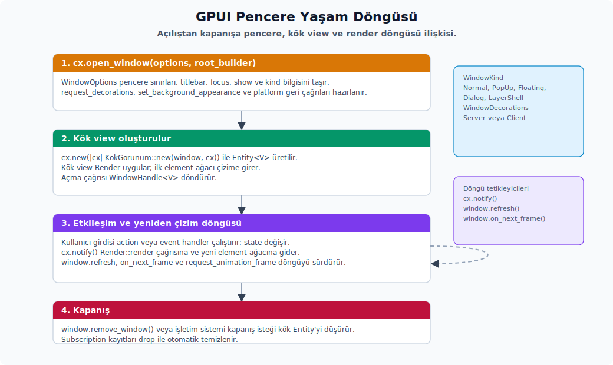

# Pencere Yönetimi

---

## Pencere Oluşturma



GPUI'de pencereyi açan ana API `cx.open_window(options, root_builder)`'dır. İlk parametre, pencerenin başlangıç davranışını anlatan `WindowOptions`; ikincisi ise pencerenin kök view'unu kuran closure'dır. Tipik kullanım şu kalıbı izler:

```rust
let tutamac = cx.open_window(
    WindowOptions {
        window_bounds: Some(WindowBounds::centered(size(px(900.), px(700.)), cx)),
        titlebar: Some(TitlebarOptions {
            title: Some("Pencerem".into()),
            appears_transparent: true,
            traffic_light_position: Some(point(px(9.), px(9.))),
        }),
        focus: true,
        show: true,
        kind: WindowKind::Normal,
        is_movable: true,
        is_resizable: true,
        is_minimizable: true,
        window_min_size: Some(size(px(360.), px(240.))),
        window_background: cx.theme().window_background_appearance(),
        window_decorations: Some(gpui::WindowDecorations::Client),
        app_id: Some(ReleaseChannel::global(cx).app_id().to_owned()),
        ..Default::default()
    },
    |window, cx| {
        window.activate_window();
        cx.new(|cx| KokGorunum::new(window, cx))
    },
)?;
```

**`WindowOptions` alanları.** Aşağıdaki alanlar pencerenin oluşumunda sorumluluğu olan başlıca parametreleri tanımlar:

- `window_bounds`: `None` verirsen GPUI, ekran için varsayılan sınırları seçer. `Some` ile gelen değer `Windowed`, `Maximized` veya `Fullscreen` başlangıcını belirler. Varsayılan seçimde iki sabit kullanılır: `gpui::DEFAULT_WINDOW_SIZE: Size<Pixels>` (1536×1095, ana Zed penceresi için) ve `gpui::DEFAULT_ADDITIONAL_WINDOW_SIZE` (900×750, 6:5 oranında settings veya rules library benzeri ek pencereler için). Kendi varsayılan boyutunu ayrıca ezmek gerekmiyorsa bu değerlere güvenebilirsin (`window.rs:70,74`).
- `titlebar`: `Some(TitlebarOptions)`'ı sistem başlık çubuğu ayarı için kullanırsın. `None` verdiğinde özel başlık çubuğu yolu açılır.
- `focus`: pencere oluşturulduğu anda klavye odağını alıp almayacağını belirler.
- `show`: pencerenin hemen gösterilip gösterilmeyeceğini kontrol eder. Zed ana pencereleri başlangıçta `show: false`, `focus: false` ile açar ve hazır olduğunda gösterir.
- `kind`: `Normal`, `PopUp`, `Floating`, `Dialog`; Linux Wayland özelliğiyle birlikte `LayerShell` de mevcuttur.
- `is_movable`, `is_resizable`, `is_minimizable`: platform seviyesindeki pencere kabiliyetleridir.
- `display_id`: belirli bir monitörü hedefler.
- `window_background`: `Opaque`, `Transparent`, `Blurred` değerleri; Windows için ayrıca `MicaBackdrop` ve `MicaAltBackdrop` seçenekleri de vardır.
- `app_id`: Linux masaüstlerinde uygulama gruplandırması ve görev çubuğu davranışı için kullanırsın.
- `window_min_size`: minimum içerik boyutu.
- `window_decorations`: `Server` veya `Client` seçimini taşır. Linux'ta kritik bir alandır; macOS ve Windows tarafında ise pratikte `TitlebarOptions` daha belirleyicidir.
- `icon`: X11 üzerinde pencere ikonu için kullanırsın.
- `tabbing_identifier`: macOS yerel pencere sekmesi gruplaması için.

`Window::new` çağrısı, GPUI platform penceresini açtıktan sonra şu sırayı izler:

1. `platform_window.request_decorations(...)` çağrılır.
2. `platform_window.set_background_appearance(window_background)` çağrılır.
3. Pencere sınırları `Fullscreen` ise tam ekran, `Maximized` ise yakınlaştırma uygulanır.
4. Platform geri çağrıları bağlanır.
5. İlk çizim gerçekleştirilir.

## Zed'de Ana Pencere Nasıl Açılır?

Zed'in ana pencere açma akışı `crates/zed/src/zed.rs::build_window_options` fonksiyonunda toplanır. Yeni bir workspace penceresi açacaksan bu fonksiyonu tercih edersin:

```rust
let secenekler = zed::build_window_options(ekran_uuid, cx);
let window = cx.open_window(secenekler, |window, cx| {
    cx.new(|cx| Workspace::new(/* ... */, window, cx))
})?;
```

Fonksiyon kendi içinde şu işleri sırayla yapar:

- `display_uuid` ile uygun ekranı bulur.
- `ZED_WINDOW_DECORATIONS=server|client` ortam değişkeniyle üzerine yazmayı okur.
- Aksi durumda `WorkspaceSettings::window_decorations` ayarını kullanır.
- `TitlebarOptions { appears_transparent: true, traffic_light_position: (9,9) }` kurar.
- `focus: false`, `show: false`, `kind: Normal` olarak ayarlar.
- `window_background` değerini aktif temadan alır.
- Linux/FreeBSD'de uygulama ikonunu ekler.
- macOS yerel sekmeleme istendiğinde `tabbing_identifier: Some("zed")` verir.

Modal veya About benzeri küçük pencerelerde bu fonksiyonu kullanmak yerine doğrudan `WindowOptions` kurmak daha yaygın bir desendir. Örneğin `crates/zed/src/zed.rs::about` şu seçenekleri kullanır:

- Merkezlenmiş sınırlar
- `appears_transparent: true`
- `is_resizable: false`
- `is_minimizable: false`
- `kind: Normal`

## Ekran ve Çoklu Monitör

Birden fazla ekran olduğunda hedef ekranı `cx.displays()` listesi üzerinden bulursun. Liste her ekran için kimlik, sınırlar ve UUID bilgisini sağlar:

```rust
for ekran in cx.displays() {
    let id = ekran.id();
    let sinirlar = ekran.bounds();
    let gorunur_sinirlar = ekran.visible_bounds();
    let uuid = ekran.uuid().ok();
}
```

Belirli bir ekrana pencere açmak için seçtiğin ekranın id'sini seçeneklere verirsin:

```rust
WindowOptions {
    display_id: Some(ekran.id()),
    window_bounds: Some(WindowBounds::Windowed(sinirlar)),
    ..Default::default()
}
```

`Bounds` her zaman ekran koordinatlarında ifade edilir. `WindowBounds::centered(size, cx)` çağrısı, ana ya da varsayılan ekran üzerinde merkezleme yapar. Elle konumlandırma gerektiğinde `Bounds::new(origin, size)` kullanırsın.

## WindowKind Davranışı

**Public API kapsamı.** Bu başlık altında ayrı alt başlık açmayı gerektirmeyen public alt yüzeyler:

| Konu | Grup | API | Not |
|---|---|---|---|
| `WindowKind` | Varyantlar | `Dialog`, `Floating`, `Normal`, `PopUp` | Enum seçim değerleri; davranış farkı ilgili konu anlatımında verilir. |


Pencerenin rolünü `WindowKind` ile belirlersin; bu seçim pencerenin odak politikasını, z-order davranışını ve süslemesini doğrudan etkiler:

- `Normal`: ana uygulama penceresi.
- `PopUp`: diğer pencerelerin üstünde duran, bildirim ve geçici popup'lar için. Zed bildirim pencerelerinde bu türü kullanır.
- `Floating`: üst pencere üzerinde sabit duran yüzen panel.
- `Dialog`: üst pencerenin etkileşimini engelleyen modal platform penceresi.
- `LayerShell`: Wayland `layer-shell` özelliği aktifken dock, üst katman veya duvar kağıdı benzeri yüzeyler için.

GPUI içinde modal, popover ve menu gibi yaşam döngüsü başka bir view tarafından yönetilen parçalar `ManagedView` sözleşmesine uyar. Bu sözleşme `Focusable + EventEmitter<DismissEvent> + Render` birleşimidir; view `DismissEvent` yaydığında onu sunan üst katman modalı veya geçici yüzeyi kapatabilir.

| API | Alt özellikler | Kısa anlamı |
| :-- | :-- | :-- |
| `ManagedView` | `Focusable + EventEmitter<DismissEvent> + Render` | Modal, popover ve menu gibi üst katman tarafından yönetilen view sözleşmesidir. |
| `DismissEvent` | boş event struct | Managed view'in kapanmak istediğini üst katmana bildirir. |
| `Focusable` | `focus_handle(&self, cx)` | View'in odak handle'ını dışarı verir; `window.focus_view(...)` bu sözleşmeye dayanır. |
| `FocusId`, `WeakFocusHandle` | opaque focus id, `upgrade` | Odak ağacı kimliği ve düşürülebilir focus handle referansıdır. |

Pop-up ve bildirim pencerelerinde tipik konfigürasyon şuna benzer:

```rust
WindowOptions {
    titlebar: None,
    kind: WindowKind::PopUp,
    focus: false,
    show: true,
    is_movable: false,
    window_background: WindowBackgroundAppearance::Transparent,
    window_decorations: Some(WindowDecorations::Client),
    ..Default::default()
}
```

Zed içindeki örnekler `crates/agent_ui/src/ui/agent_notification.rs` ve `crates/collab_ui/src/collab_ui.rs` dosyalarındadır.

## Başlık Çubuğu ve Pencere Süslemesi

Başlık çubuğu ve pencere süslemesi iki ayrı kavramdır. Karışmasın diye ikisinin sorumluluğunu ayrı düşünmen gerekir:

- `TitlebarOptions`: macOS ve Windows yerel başlık çubuğunun görünümü, başlık metni ve macOS traffic light konumu burada belirlenir.
- `WindowDecorations`: Linux, Wayland ve X11 tarafında süslemenin sunucu tarafında mı (`server-side`) yoksa istemci tarafında mı (`client-side`) olacağını söyler.

GPUI tarafındaki tipler şunlar:

```rust
pub enum WindowDecorations {
    Server,
    Client,
}

pub enum Decorations {
    Server,
    Client { tiling: Tiling },
}
```

`WindowDecorations`, pencere açılırken istenen kiptir. `Decorations` ise platformun fiili durumudur; `window.window_decorations()` ile okunur. Compositor sınırları nedeniyle istenen kip her zaman aynen karşılanmayabilir; bu yüzden bu ikisi ayrı tutulur.

`Tiling`, istemci tarafı süslemenin ekran kenarlarına döşenmiş olup olmadığını dört kenar (`top`, `left`, `right`, `bottom`) üzerinden taşır. `Tiling::tiled()` tüm kenarları döşenmiş kabul eden hazır değeri üretir; `Tiling::is_tiled()` ise en az bir kenar döşenmişse `true` döner. Kenar hizasına göre resize handle veya titlebar boşluğu hesaplıyorsan bu bilgiyi kullanırsın; sıradan pencere açılışında `WindowOptions.window_decorations` yeterlidir.

| API | Alt özellikler | Kısa anlamı |
| :-- | :-- | :-- |
| `WindowDecorations` | `Server`, `Client` | Pencere açılırken istenen süsleme kipidir. |
| `Decorations` | `Server`, `Client { tiling }` | Platformdan dönen fiili süsleme durumudur. |
| `Tiling` | `top`, `left`, `right`, `bottom`, `tiled`, `is_tiled` | Client-side dekorasyonun ekran kenarlarına döşenme bilgisini taşır. |
| `WindowBounds` | `Windowed`, `Maximized`, `Fullscreen`, `centered`, `get_bounds` | Pencerenin başlangıç sınırını ve durumunu temsil eder. |

Zed ayarını tek bir alan üzerinden ifade edersin:

```json
{
  "window_decorations": "client"
}
```

Ortam değişkeniyle de üzerine yazma yapabilirsin:

```sh
ZED_WINDOW_DECORATIONS=server
ZED_WINDOW_DECORATIONS=client
```

Zed settings tipi `settings_content::workspace::WindowDecorations` yalnızca `client` ve `server` değerlerini destekler; varsayılan değer `client`'tır.

## Özel Başlık Çubuğu Nasıl Tanımlanır?

Basit bir GPUI uygulamasında yerel başlık çubuğunu kapatıp özel başlık çubuğunu kök view içine yerleştirirsin:

```rust
cx.open_window(
    WindowOptions {
        titlebar: None,
        ..Default::default()
    },
    |_, cx| cx.new(|_| OrnekGorunum),
)?;
```

Kök view içinde özel başlık çubuğunu şu kalıpta çizersin:

```rust
div()
    .flex()
    .flex_col()
    .size_full()
    .child(
        h_flex()
            .window_control_area(WindowControlArea::Drag)
            .h(px(34.))
            .child("Başlık")
    )
    .child(icerik)
```

Windows tarafında başlık butonu (`caption button`) bölgeleri için `window_control_area` çağrısı kritik öneme sahiptir; yerel çarpışma testini platform bu alanlar üzerinden çözer:

- `WindowControlArea::Drag`: sürüklenebilir başlık alanı.
- `WindowControlArea::Close`: yerel kapatma çarpışma testi alanı.
- `WindowControlArea::Max`: ekranı kaplama veya geri yükleme çarpışma testi alanı.
- `WindowControlArea::Min`: küçültme çarpışma testi alanı.

Zed'de yeni bir workspace benzeri pencere yaparken özel başlık çubuğunu sıfırdan yazmazsın; bunun yerine hazır `PlatformTitleBar` bileşenini kullanırsın:

```rust
let platform_baslik_cubugu = cx.new(|cx| {
    PlatformTitleBar::new("baslik-cubugu", cx)
});

platform_baslik_cubugu.update(cx, |baslik_cubugu, _| {
    baslik_cubugu.set_children([sol_veya_orta_icerik.into_any_element()]);
});

platform_baslik_cubugu.into_any_element()
```

`PlatformTitleBar` hazır olarak şu işleri halleder:

- Linux istemci tarafı süslemesi için sol ve sağ pencere kontrol butonları.
- Windows pencere kontrol butonları.
- macOS traffic light iç boşluğu ve çift tıklama davranışı.
- Linux çift tıklama ile yakınlaştırma veya ekranı kaplama.
- Başlık çubuğu sürükleme alanı.
- Linux'ta sağ tık ile pencere menüsü.
- Yan çubuk açıkken kontrol butonları ile köşe yuvarlamalarının ayarlanması.

Zed'in başlık çubuğu davranışında dikkat çeken iki ayrıntı vardır:

- `TitleBar`, `SkillsFeatureFlag` açıkken `OnboardingBanner` ile "Introducing: Skills" afişini kurar; afiş tıklaması, agent veya skills bilgilendirme modalını açan action'ı yönlendirir. Başlık çubuğu etiketi bu modalın sonucuna göre değişmez.
- `UpdateButton::checking`, `downloading` ve `installing` durumları pasif buton olarak görünür. Sürüm ipucu metni `"Update to Version: ..."` biçimindedir; SHA tabanlı sürümde kısa SHA yerine tam SHA görünür.

## Kontrol Butonlarını Nasıl Yönetirsin?

Pencere kontrol butonları her platformda farklı çizilir; doğru bileşeni seçtiğin sürece çizim ayrıntıları kullanıcının önüne çıkmaz:

- macOS: yerel traffic light devreye girer; Zed iç boşluk ve `traffic_light_position` değerini birlikte yönetir. Pencere açıldıktan sonra konum değişecekse `Window::set_traffic_light_position(position: Point<Pixels>)` çağrısı kullanılır.
- Windows: `platform_title_bar::platforms::platform_windows::WindowsWindowControls`, başlık butonlarını çizer; her buton `WindowControlArea` üzerinden yerel çarpışma testi alanına bağlanır.
- Linux: `platform_title_bar::platforms::platform_linux::LinuxWindowControls`, `WindowButtonLayout` ve `WindowControls` bilgilerine göre kapatma, küçültme ve ekranı kaplama butonlarını çizer.

Sol ve sağ kontrolleri hazır çizmek için iki yardımcı fonksiyon vardır:

```rust
platform_title_bar::render_left_window_controls(
    cx.button_layout(),
    Box::new(workspace::CloseWindow),
    window,
)

platform_title_bar::render_right_window_controls(
    cx.button_layout(),
    Box::new(workspace::CloseWindow),
    window,
)
```

Kapatma butonu doğrudan `window.remove_window()` çağırmaz; bunun yerine Zed kapatma action'ını yönlendirir:

```rust
window.dispatch_action(workspace::CloseWindow.boxed_clone(), cx);
```

Böylece kaydedilmemiş arabellek (`dirty buffer`) kontrolü, kullanıcıya sorma diyaloğu, workspace kapatma mantığı ve kısayolla aynı akışı kullanırsın.

**Linux `WindowButtonLayout`.** Linux tarafında buton düzeni esnektir ve kullanıcı tarafında özelleştirilebilir:

- `WindowButton::{Minimize, Maximize, Close}`, sıralı kontrol tipleridir; düzen, sol ve sağ taraf için `Option<WindowButton>` yuva dizileri tutar. Yuva başına sayı `gpui::MAX_BUTTONS_PER_SIDE: usize = 3` (`platform.rs:457`) ile sabittir; `WindowButtonLayout::{left, right}` bu sayıda elemanlı dizilerdir.
- Düzen, platformdan `cx.button_layout()` ile gelir.
- GNOME tarzı `"close,minimize:maximize"` biçimini ayrıştırabilirsin.
- Varsayılan Linux yedeği `WindowButtonLayout::linux_default()` ile üretilir; sağda küçültme, ekranı kaplama, kapatma şeklindedir.
- `TitleBarSettings` içinde kullanıcı tarafından üzerine yazma da yer alır; `TitleBar`, bunu `PlatformTitleBar::set_button_layout` ile aktarır.

## İstemci Tarafı Süslemesi ve Yeniden Boyutlandırma

Zed'in istemci tarafı süsleme (`client-side decoration`) sarmalayıcısı tek bir yardımcı üzerinde toplanmıştır:

```rust
workspace::client_side_decorations(oge, window, cx, doseme_kenar_yaricapi)
```

Bu sarmalayıcının yaptığı işler şunlar:

- `window.window_decorations()` ile fiili süsleme kipini okur.
- İstemci süslemesi durumunda `window.set_client_inset(theme::CLIENT_SIDE_DECORATION_SHADOW)` çağırır.
- Sunucu süslemesi durumunda inset değerini `0` yapar.
- `window.client_inset()`, platform penceresine son atanan inset değerini okumak için kullanabilirsin; bu değeri iç boşluk ve gölge hesabıyla uyumlu tutman gerekir.
- Döşeme (`tiling`) durumuna göre köşe yuvarlamalarını kaldırır.
- Kenarlık ve gölge çizer.
- Kenar ve köşe bölgelerinde imleci yeniden boyutlandırma imlecine çevirir.
- Fare basmada `window.start_window_resize(edge)` çağırır.

Özel bir istemci tarafı süslemesi yaptığında aynı prensipleri tekrarlaman gerekir:

1. Fiili kipi `window.window_decorations()` ile okursun.
2. İstemci kipiyse gölge veya görünmez yeniden boyutlandırma alanı kadar `set_client_inset` verirsin.
3. Döşeme varsa ilgili kenar ve köşeye yuvarlama, iç boşluk ve gölge vermezsin.
4. Yeniden boyutlandırma bölgelerinde `ResizeEdge`'i hesaplarsın.
5. Hareket için başlık çubuğuna `WindowControlArea::Drag` bağlarsın ya da Linux ve macOS için `window.start_window_move()` çağırırsın.

Linux'ta sunucu tarafı süslemesi her zaman mümkün olmayabilir:

- Wayland'de compositor süsleme protokolü sağlamazsa sunucu isteği istemciye düşürülür.
- X11'de compositor olmadığında istemci tarafı süslemesi sunucuya düşebilir.

Bu yüzden pencere açılırken istenen kip yerine, her çizimde okuduğun fiili `window.window_decorations()` sonucunu esas alırsın.

## Platforma Göre Süsleme Davranışı

#### macOS

- `TitlebarOptions::appears_transparent = true`, stil maskesine `NSFullSizeContentViewWindowMask` ekler.
- `traffic_light_position`, yerel kapatma, küçültme ve yakınlaştırma butonlarının başlangıç konumunu taşır.
- `Window::set_traffic_light_position(position: Point<Pixels>)`, aynı konumu runtime'da günceller. Bu metod macOS cfg'i altındadır; platform penceresi state'ini güncelleyip butonları hemen taşır.
- `titlebar_double_click()`, yerel çift tıklama aksiyonunu uygular.
- `start_window_move()`, yerel `performWindowDragWithEvent` çağırır.
- `tabbing_identifier` verdiğinde yerel pencere sekmesi açılır.
- `WindowDecorations` pratikte platformda işlem yapmaz; macOS için başlık çubuğu davranışını `TitlebarOptions` belirler.

#### Windows

- `TitlebarOptions::appears_transparent`, özel veya tam içerikli başlık çubuğu için kullanırsın.
- Başlık butonlarının yerel çarpışma testi davranışı, `WindowControlArea` üzerinden `HTCLOSE`, `HTMAXBUTTON`, `HTMINBUTTON`, `HTCAPTION` değerlerine platform olay katmanında eşlenir.
- `WindowBackgroundAppearance::MicaBackdrop` ve `MicaAltBackdrop` değerleri, DWM arka plan özniteliği ile uygulanır.
- `WindowControls` çizimini Zed tarafında Windows bileşeni ile yaparsın.

#### Linux/FreeBSD - Wayland

- `WindowDecorations::Server`, `xdg-decoration` protokolü ile istenir.
- Compositor sunucu tarafı süslemesi desteklemiyorsa istemci tarafına düşülür.
- `window_controls()`, Wayland yetenek bilgisinden gelir: tam ekran, ekranı kaplama, küçültme, pencere menüsü.
- `show_window_menu`, `start_window_move`, `start_window_resize`, `xdg_toplevel` üzerinden compositor'a devredilir.
- Bulanıklaştırma için compositor `blur_manager` destekliyorsa `Blurred` yüzeye bulanıklık uygulanır.

#### Linux/FreeBSD - X11

- `request_decorations`, `_MOTIF_WM_HINTS` yazar.
- İstemci tarafı süslemesi compositor gerektirir; yoksa sunucu tarafına düşer.
- `show_window_menu`, `_GTK_SHOW_WINDOW_MENU` istemci mesajını gönderir.
- Taşıma veya yeniden boyutlandırma işlemi `_NET_WM_MOVERESIZE` tarzı bir mesajla başlatılır.
- Döşeme, tam ekran ve ekranı kaplama durumları `Decorations::Client { tiling }` sonucunu etkiler.

#### Web/WASM

- Web platformunda yerel pencere süslemesi kavramı bulunmaz.
- `WindowBackgroundAppearance` şu anda web penceresinde opak veya işlem yapmaz kabul edilir.
- Giriş noktasında `gpui_platform::web_init()` çağrılır.

## Bulanıklık, Şeffaflık ve Mica Yönetimi

Pencere arka planının görünümünü `WindowBackgroundAppearance` enum'u ile ifade edersin:

```rust
pub enum WindowBackgroundAppearance {
    Opaque,
    Transparent,
    Blurred,
    MicaBackdrop,
    MicaAltBackdrop,
}
```

Zed tema ayarı bu enum'un tamamını değil, yalnızca seçili bir alt kümesini kullanıcı içeriği üzerinden destekler:

```json
{
  "experimental.theme_overrides": {
    "window_background_appearance": "blurred"
  }
}
```

Desteklenen setting değerleri `opaque`, `transparent` ve `blurred`'dir. `MicaBackdrop` ve `MicaAltBackdrop` değerleri GPUI seviyesinde mevcuttur, ancak Zed tema şeması şu anda bunları kullanıcıya ifşa etmez.

**Zed akışı.** Tema değişimleri tüm açık pencerelere yansıtılır:

- Tema rafine edilirken `WindowBackgroundContent` -> `WindowBackgroundAppearance` dönüştürülür.
- Ana pencere açılırken `window_background: cx.theme().window_background_appearance()` verilir.
- Ayarlar veya tema değiştiğinde `crates/zed/src/main.rs`, tüm açık pencerelere `window.set_background_appearance(background_appearance)` çağrısı yapar.
- UI tarafında genel yol `ui::theme_is_transparent(cx)`'tir; şeffaf veya bulanıksa `true` döner. Opak arka plan varsayan bileşenler buna göre davranmalıdır.

**Platform davranışı.** Aynı enum değeri her platformda farklı bir mekanizmayla ifade edilir:

- macOS:
  - `Opaque`, pencereyi opak yapar.
  - `Transparent` ve `Blurred` için çizim aracı şeffaflığı açılır.
  - `Blurred` için `NSVisualEffectView` tabanlı bulanıklık view'u eklenir ya da kaldırılır.
- Windows:
  - `Opaque`: kompozisyon özniteliği kapatılır.
  - `Transparent`: kompozisyon durumu şeffaf olarak işaretlenir.
  - `Blurred`: acrylic veya bulanıklık benzeri kompozisyon özniteliği uygulanır.
  - `MicaBackdrop`: DWM `DWMSBT_MAINWINDOW`.
  - `MicaAltBackdrop`: DWM `DWMSBT_TABBEDWINDOW`.
- Wayland:
  - Compositor bulanıklık protokolünü destekliyorsa `Blurred` yüzeye bulanıklık uygulanır.
  - Aksi durumda bulanıklık isteği gözle görülür bir değişiklik üretmeyebilir.
- X11:
  - Şeffaf veya bulanık çizim aracı şeffaflığını etkiler; gerçek arka plan bulanıklığı için pencere yöneticisi veya compositor desteği gerekir.

**Pratik karar tablosu.** Hangi değeri nerede tercih edeceğin şöyle özetlenebilir:

- Tema ve ana pencere için: `cx.theme().window_background_appearance()`.
- Geçici üst katman ve bildirim için: `Transparent`.
- Windows 11'e özel Mica istiyorsan: doğrudan `WindowBackgroundAppearance::MicaBackdrop` veya `MicaAltBackdrop` verirsin; ancak bu seçim Zed tema ayarına otomatik bağlanmaz.
- Bulanıklık tercih edildiğinde içerikte gerçekten alfa bırakırsın; tamamen opak bir kök arka plan, bulanıklığın görünmez olmasına yol açar.

## Pencere Üzerinden Yapılan İşlemler

Pencerenin durumuna ve görünümüne dair sık kullandığın `Window` API'leri şunlar; her biri ilgili platform çağrısının sade bir kapısıdır:

- `window.bounds()` — genel ekran koordinatlarındaki sınırlar.
- `window.window_bounds()` — tekrar açma ve geri yükleme için `WindowBounds`.
- `window.inner_window_bounds()` — Linux inset hariç sınırlar.
- `window.viewport_size()` — çizilebilir içerik boyutu.
- `window.resize(size)` — içerik boyutunu değiştirir.
- `window.is_fullscreen()`, `window.is_maximized()`
- `window.activate_window()`
- `window.minimize_window()`
- `window.zoom_window()`
- `window.toggle_fullscreen()`
- `window.remove_window()`
- `window.set_window_title(title)`
- `window.set_app_id(app_id)`
- `window.set_background_appearance(appearance)`
- `window.set_window_edited(true/false)` — macOS değiştirildi göstergesi.
- `window.set_document_path(path)` — macOS belge erişilebilirliği ve yolu.
- `window.show_window_menu(position)` — Linux başlık çubuğu bağlam menüsü.
- `window.start_window_move()`, `window.start_window_resize(edge)`
- `window.request_decorations(WindowDecorations::Client/Server)`
- `window.window_decorations()`
- `window.window_controls()`
- `window.prompt(...)`
- `window.play_system_bell()`

macOS yerel pencere sekmesi için ek bir API ailesi vardır:

- `window.tabbed_windows()`
- `window.tab_bar_visible()`
- `window.merge_all_windows()`
- `window.move_tab_to_new_window()`
- `window.toggle_window_tab_overview()`
- `window.set_tabbing_identifier(...)`

## Window Çalışma Zamanı API Aileleri

**Public API kapsamı.** Bu başlık altında ayrı alt başlık açmayı gerektirmeyen public alt yüzeyler:

| Konu | Grup | API | Not |
|---|---|---|---|
| `Window` | Metotlar 1 | `activate_window`, `available_actions`, `bindings_for_action`, `bindings_for_action_in`, `bindings_for_action_in_context`, `blur`, `bounds`, `bounds_changed`, `capslock`, `capture_pointer`, `captured_hitbox`, `client_inset`, `compute_layout`, `content_mask` | Builder, sorgu veya runtime çağrıları; ayrıntı bu konu anlatımındaki kullanım bağlamıyla okunur. |
| `Window` | Metotlar 2 | `context_stack`, `current_view`, `default_prevented`, `defer_draw`, `disable_focus`, `dispatch_action`, `dispatch_event`, `dispatch_keystroke`, `display`, `draw`, `drop_image`, `element_offset`, `focus`, `focus_next` | Builder, sorgu veya runtime çağrıları; ayrıntı bu konu anlatımındaki kullanım bağlamıyla okunur. |
| `Window` | Metotlar 3 | `focus_prev`, `focused`, `get_asset`, `gpu_specs`, `handle_input`, `handler_for`, `has_pending_keystrokes`, `highest_precedence_binding_for_action`, `highest_precedence_binding_for_action_in`, `highest_precedence_binding_for_action_in_context`, `inner_window_bounds`, `insert_hitbox`, `insert_inspector_hitbox`, `insert_window_control_hitbox` | Builder, sorgu veya runtime çağrıları; ayrıntı bu konu anlatımındaki kullanım bağlamıyla okunur. |
| `Window` | Metotlar 4 | `invalidate_character_coordinates`, `is_action_available`, `is_action_available_in`, `is_fullscreen`, `is_inspector_picking`, `is_maximized`, `is_window_active`, `is_window_hovered`, `keystroke_text_for`, `last_input_was_keyboard`, `layout_bounds`, `line_height`, `listener_for`, `merge_all_windows` | Builder, sorgu veya runtime çağrıları; ayrıntı bu konu anlatımındaki kullanım bağlamıyla okunur. |
| `Window` | Metotlar 5 | `minimize_window`, `modifiers`, `mouse_position`, `move_tab_to_new_window`, `observe`, `observe_button_layout_changed`, `observe_global`, `observe_release`, `observe_window_appearance`, `on_a11y_action`, `on_action`, `on_action_when`, `on_focus_in`, `on_focus_out` | Builder, sorgu veya runtime çağrıları; ayrıntı bu konu anlatımındaki kullanım bağlamıyla okunur. |
| `Window` | Metotlar 6 | `on_key_event`, `on_modifiers_changed`, `on_mouse_event`, `on_next_frame`, `on_window_should_close`, `paint_drop_shadows`, `paint_emoji`, `paint_glyph`, `paint_image`, `paint_inset_shadows`, `paint_layer`, `paint_path`, `paint_quad`, `paint_strikethrough` | Builder, sorgu veya runtime çağrıları; ayrıntı bu konu anlatımındaki kullanım bağlamıyla okunur. |
| `Window` | Metotlar 7 | `paint_surface`, `paint_svg`, `paint_underline`, `pending_input_keystrokes`, `pixel_snap`, `pixel_snap_bounds`, `pixel_snap_f64`, `pixel_snap_point`, `play_system_bell`, `possible_bindings_for_input`, `prevent_default`, `prompt`, `refresh`, `release_pointer` | Builder, sorgu veya runtime çağrıları; ayrıntı bu konu anlatımındaki kullanım bağlamıyla okunur. |
| `Window` | Metotlar 8 | `rem_size`, `remove_window`, `replace_root`, `request_animation_frame`, `request_autoscroll`, `request_decorations`, `request_layout`, `request_measured_layout`, `resize`, `root`, `scale_factor`, `set_app_id`, `set_background_appearance`, `set_client_inset` | Builder, sorgu veya runtime çağrıları; ayrıntı bu konu anlatımındaki kullanım bağlamıyla okunur. |
| `Window` | Metotlar 9 | `set_cursor_style`, `set_document_path`, `set_focus_handle`, `set_key_context`, `set_rem_size`, `set_tabbing_identifier`, `set_tooltip`, `set_traffic_light_position`, `set_view_id`, `set_window_cursor_style`, `set_window_edited`, `set_window_title`, `show_character_palette`, `show_window_menu` | Builder, sorgu veya runtime çağrıları; ayrıntı bu konu anlatımındaki kullanım bağlamıyla okunur. |
| `Window` | Metotlar 10 | `spawn`, `spawn_with_priority`, `start_window_move`, `start_window_resize`, `subscribe`, `tab_bar_visible`, `tabbed_windows`, `take_autoscroll`, `text_style`, `titlebar_double_click`, `to_async`, `toggle_fullscreen`, `toggle_inspector`, `toggle_window_tab_overview` | Builder, sorgu veya runtime çağrıları; ayrıntı bu konu anlatımındaki kullanım bağlamıyla okunur. |
| `Window` | Metotlar 11 | `transact`, `use_keyed_state`, `use_state`, `viewport_size`, `window_bounds`, `window_controls`, `window_decorations`, `window_handle`, `window_title`, `with_absolute_element_offset`, `with_content_mask`, `with_element_namespace`, `with_element_offset`, `with_element_state` | Builder, sorgu veya runtime çağrıları; ayrıntı bu konu anlatımındaki kullanım bağlamıyla okunur. |
| `Window` | Metotlar 12 | `with_global_id`, `with_id`, `with_image_cache`, `with_inspector_state`, `with_optional_element_state`, `with_rem_size`, `with_tab_group`, `with_text_style`, `zoom_window` | Builder, sorgu veya runtime çağrıları; ayrıntı bu konu anlatımındaki kullanım bağlamıyla okunur. |


`Window` yalnız pencereyi büyütüp küçülten bir handle değildir; çizim fazı, focus ağacı, action yönlendirmesi, element state'i, asset yükleme, prompt, tab ve platform tanılarına da kapı açar. Bu yüzeyi tek tek ezberlemek yerine aşağıdaki ailelerle okursun.

**Kök view ve handle yönetimi.** `window.window_handle()` `AnyWindowHandle` verir; tipli kök view için `WindowHandle<V>` kullanılır. `WindowHandle::root(cx)`, `entity(cx)`, `read(cx)`, `read_with(cx, ...)`, `update(cx, ...)` ve `is_active(cx)` pencere kök entity'sini güvenli biçimde okur veya günceller. Tip bilinmiyorsa `AnyWindowHandle::window_id()`, `downcast::<T>()`, `update(cx, ...)` ve `read(cx, ...)` ile çalışırsın. Bu handle'ları uzun süre sakladığında pencere kapanmış olabilir; bu yüzden dönen `Result`'ı iş akışının parçası sayarsın.

**Async pencere bağlamı.** `window.to_async(cx)` veya `Context::spawn_in(...)` seni `AsyncWindowContext` yüzeyine taşır. `AsyncWindowContext::window_handle()` bağlı pencereyi verir; `update(...)` pencere ve `App` üzerinde çalışır; `update_root(...)` kök view'a da erişir; `on_next_frame(...)` işi sonraki kareye bırakır; `read_global(...)` ve `update_global(...)` global state'e döner; `spawn(...)` pencereye bağlı yeni async iş başlatır; `prompt(...)` pencere kapanmış olabilir durumunu `Result`/receiver üzerinden görünür kılar. Pencere yaşamı önemli değilse `AsyncApp`, pencere state'i ve prompt gerekiyorsa `AsyncWindowContext` kullanırsın.

**Kök değiştirme ve frame yaşamı.** `replace_root(...)`, `root::<E>()`, `refresh()`, `remove_window()`, `draw(cx)`, `bounds_changed(cx)`, `render_to_image()` ve `request_animation_frame()` pencerenin render döngüsünü etkiler. Uygulama view'ı genellikle `cx.notify()` ile kendi yeniden çizimini ister; tüm pencere veya özel test/render yakalama gerektiğinde `window.refresh()` ve `draw(...)` seviyesine inersin. `ArenaClearNeeded` çizim arenasının ne zaman temizleneceğini taşıyan frame içi bir yardımcıdır; normal bileşen state'i değildir.

**Focus ve tab gezinmesi.** `focused(cx)`, `focus(handle, cx)`, `blur()`, `disable_focus()`, `focus_next(cx)` ve `focus_prev(cx)` pencere focus ağacını yönetir. `FocusHandle::tab_index(...)`, `tab_stop(...)`, `downgrade()`, `focus(...)`, `is_focused(...)`, `contains_focused(...)`, `within_focused(...)`, `contains(...)` ve `dispatch_action(...)` odaklanabilir bileşenin doğrudan yüzeyidir. `WeakFocusHandle::upgrade()` odak handle'ını uzun yaşayan yapılarda saklamak için vardır. `FocusId` aynı sorguların düşük seviyeli kimlik karşılığıdır; uygulama kodunda çoğunlukla `FocusHandle` yeterlidir.

**Girdi, hitbox ve imleç.** `mouse_position()`, `modifiers()`, `capslock()`, `last_input_was_keyboard()`, `capture_pointer(hitbox_id)`, `release_pointer()`, `captured_hitbox()`, `insert_hitbox(...)`, `set_cursor_style(...)`, `set_window_cursor_style(...)`, `request_autoscroll(...)` ve `take_autoscroll()` doğrudan etkileşim altyapısıdır. `HitboxId::is_hovered(...)` ve `should_handle_scroll(...)`, tipli `Hitbox` üzerinde de aynı anlama gelir; scroll sırasında klavye girdi kipi gibi durumları hesaba kattığı için düz hover kontrolünden daha güvenilir olabilir. `TooltipId::is_hovered(...)` tooltip üstüne geçildi mi sorusunu cevaplar.

**Element kimliği ve element state'i.** `with_global_id(...)`, `with_id(...)`, `with_element_namespace(...)`, `use_keyed_state(...)`, `use_state(...)`, `with_element_state(...)` ve `with_optional_element_state(...)` ekran kareleri arasında element başına veri saklar. Liste satırı veya tekrar eden öğelerde `ElementId::named_usize(name, index)` gibi sabit ve anlamlı id üretirsin. Aynı global id ve tip için iç içe state alma `panic` üretebilir; state yaşamını element ağacının stabil id düzenine bağlaman gerekir.

**Çizim bağlamı ve ölçüm.** `text_system()`, `text_style()`, `with_text_style(...)`, `rem_size()`, `set_rem_size(...)`, `with_rem_size(...)`, `line_height()`, `scale_factor()`, `pixel_snap(...)`, `pixel_snap_point(...)`, `pixel_snap_bounds(...)`, `with_content_mask(...)`, `content_mask()`, `with_element_offset(...)`, `with_absolute_element_offset(...)`, `element_offset()`, `transact(...)`, `request_layout(...)`, `request_measured_layout(...)`, `compute_layout(...)` ve `layout_bounds(...)` özel element yazarken kullanılır. Normal `div()` ve Zed UI bileşenlerinde bu seviyeye inmezsin; özel `Element` uygulamasında hangi fazda olduğuna dikkat edersin.

**Paint primitive'leri.** `paint_layer(...)`, `paint_drop_shadows(...)`, `paint_inset_shadows(...)`, `paint_quad(...)`, `paint_path(...)`, `paint_underline(...)`, `paint_strikethrough(...)`, `paint_glyph(...)`, `paint_emoji(...)`, `paint_svg(...)`, `paint_image(...)`, `paint_surface(...)` ve `drop_image(...)` yalnız paint fazında anlamlıdır. `fill(bounds, background)`, `quad(...)`, `outline(...)` ve `PaintQuad::corner_radii(...)`, `border_widths(...)`, `border_color(...)`, `background(...)` yardımcıları bu çağrıları besler. Sıradan UI'da `.bg(...)`, `.border_*`, `img(...)` ve `svg()` daha doğru seviyedir.

| API | Alt özellikler | Kısa anlamı |
| :-- | :-- | :-- |
| `HitboxId` | opaque id, test placeholder | Hitbox ve davranışını platform/test tarafında ayırt eden kimliktir. |
| `TooltipId` | `is_hovered` | `window.set_tooltip(...)` ile kaydedilen tooltip isteğini tanımlar. |
| `outline` | bounds, color, border style | Debug/özel çizim için quad outline üretmeye yakın düşük seviye window helper'ıdır. |

**Action ve keymap sorguları.** `dispatch_action(...)`, `dispatch_keystroke(...)`, `dispatch_event(...)`, `prevent_default()`, `default_prevented()`, `context_stack()`, `available_actions(cx)`, `is_action_available(...)`, `is_action_available_in(...)`, `bindings_for_action(...)`, `highest_precedence_binding_for_action(...)`, `bindings_for_action_in_context(...)`, `bindings_for_action_in(...)`, `possible_bindings_for_input(...)`, `keystroke_text_for(...)`, `has_pending_keystrokes()` ve `pending_input_keystrokes()` komut UI'ı, menü etkinliği ve kısayol göstergesi için kullanılır. Bir action'ı çalıştırmak için dispatch yeterlidir; kullanıcının göreceği kısayol metni için bağlam yığınını dikkate alan pencere sorgularını tercih edersin.

**Prompt, platform ve tanı yardımcıları.** `prompt(...)`, `show_character_palette()`, `display(cx)`, `gpu_specs()`, `input_latency_snapshot()`, `play_system_bell()`, `window_title()`, `set_window_title(...)`, `set_window_edited(...)`, `set_document_path(...)`, `set_app_id(...)`, `set_background_appearance(...)`, `appearance()`, `is_window_active()` ve `is_window_hovered()` platform entegrasyonudur. Her platform aynı sonucu üretmeyebilir; örneğin GPU tanısı veya karakter paleti bazı arka uçlarda `None` ya da no-op olabilir.

**Frame içi düşük seviye hook'lar.** `set_key_context(...)`, `set_focus_handle(...)`, `set_view_id(...)`, `insert_window_control_hitbox(...)`, `handle_input(...)`, `on_mouse_event(...)`, `on_key_event(...)`, `on_modifiers_changed(...)`, `on_focus_in(...)`, `on_focus_out(...)`, `listener_for(...)`, `handler_for(...)`, `on_action(...)` ve `on_action_when(...)` element implementasyonu veya framework bileşeni yazarken kullanılır. Uygulama view'ında bunların çoğunun karşılığı `.key_context(...)`, `.track_focus(...)`, `.on_click(...)`, `.on_key_down(...)`, `.on_action(...)` gibi fluent element API'leridir.

**WindowInvalidator ve InputRateTracker.** `WindowInvalidator::invalidate_view(...)`, `is_dirty()`, `set_dirty(...)`, `set_phase(...)`, `update_count()`, `take_views()`, `replace_views(...)`, `not_drawing()`, `debug_assert_paint()`, `debug_assert_prepaint()` ve `debug_assert_paint_or_prepaint()` yardımcıları çizim boru hattının kendi tutarlılık denetimidir. `InputRateTracker::record_input()` ve `is_high_rate()` yüksek frekanslı input geldiğinde platformun frame optimizasyonu yapmasına yardım eder. Bu tipleri uygulama state'i olarak kullanmazsın; pencere çalışma zamanının iç kararlarını açıklarlar.

## Pencere Sınırlarının Saklanması ve Geri Yüklenmesi

`crates/gpui/src/platform.rs::WindowBounds`, Zed tarafında `crates/workspace/src/persistence/`, `crates/workspace/src/workspace.rs` ve `crates/zed/src/zed.rs`.

`WindowBounds` enum'u pencerenin üç ana durumunu kapsar:

```rust
pub enum WindowBounds {
    Windowed(Bounds<Pixels>),
    Maximized(Bounds<Pixels>),
    Fullscreen(Bounds<Pixels>),
}
```

`Bounds`, her üç durumda da geri yüklemeye hazır koordinatları taşır. `Maximized` ve `Fullscreen` içindeki sınır değeri, ilgili durum kapatıldığında geri dönülecek pencereli (`windowed`) sınırları temsil eder.

**Saklama akışı.** Sınırları saklarken tipik kullanım şudur:

```rust
let sinirlar = window.inner_window_bounds();
serilestir(sinirlar, ekran_uuid);
```

Zed varsayılan pencere boyutunu saklarken `inner_window_bounds()` kullanır. Workspace serileştirilirken bazı akışlarda `window.window_bounds()` da tercih edilir. İkisi arasındaki fark, dahil edilen platform veya başlık çubuğu dikdörtgeninin farklı olmasından kaynaklanır. Tam ekran ya da ekranı kaplama durumlarında enum içindeki sınırlar, geri yüklenecek pencereli sınırları temsil eder. Ekran UUID'sini ayrı saklarsın; kullanıcı sonradan monitörü ayırabileceği için bu kimliği pencere sınırlarından bağımsız tutman gerekir.

**Geri yükleme akışı.** Workspace açılırken `zed::build_window_options` üstünde şu sıra izlenir:

1. Saklı `display_uuid`, `cx.displays()` içindeki `display.uuid()` değerleriyle eşleştirilir.
2. Ekran bulunmuşsa `options.display_id` ayarlanır ve kayıtlı `WindowBounds` değeri `options.window_bounds`'a yerleştirilir.
3. Workspace'e özel sınırlar bulunmuyorsa varsayılan pencere sınırları okunur.
4. Hiç kayıt yoksa `WindowOptions.window_bounds = None` bırakılır ve GPUI, platformun varsayılan veya kademeli sınırlarını seçer.

Sınır değişimini izlemek için abonelik kurarsın:

```rust
cx.observe_window_bounds(window, |gorunum, window, _cx| {
    let sinirlar = window.inner_window_bounds();
    gorunum.sinirlari_kaydet(sinirlar);
}).detach();
```

Aynı şekilde `cx.observe_window_appearance(window, ...)` açık veya koyu görünüm değişimini, `cx.observe_window_activation(window, ...)` ise ön plan veya arka plan değişimini takip eder.

**Tuzaklar.** Sınırlar tarafında karşılaştığın tipik karışıklıklar şunlar:

- `window.bounds()` (canlı ekran dikdörtgeni), `window.window_bounds()` ve `window.inner_window_bounds()` farklı olabilir; geri yükleme veya saklama akışında hangi dikdörtgenin beklendiğini mevcut Zed çağrı noktasına göre seçersin.
- Ekranı kaplama ve tam ekran enum'larının içindeki `Bounds<Pixels>`, geri yükleme boyutudur; canlı platform sınırları ekranı tamamen kaplasa bile geri yükleme sonrasında bu pencereli sınırlara geri dönülür.
- Ekran UUID'si Linux/Wayland tarafında boş olabilir; bu durumda `display.uuid().ok()` `None` döner ve uygun bir yedek davranışı düşünmen gerekir.

## Yerel Pencere Sekmeleri ve SystemWindowTabController

**Public API kapsamı.** Bu başlık altında ayrı alt başlık açmayı gerektirmeyen public alt yüzeyler:

| Konu | Grup | API | Not |
|---|---|---|---|
| `SystemWindowTabController` | Metotlar 1 | `add_tab`, `get_next_tab_group_window`, `get_prev_tab_group_window`, `init_visible`, `is_visible`, `merge_all_windows`, `move_tab_to_new_window`, `new`, `remove_tab`, `select_next_tab`, `select_previous_tab`, `set_visible`, `tab_groups`, `update_last_active` | Builder, sorgu veya runtime çağrıları; ayrıntı bu konu anlatımındaki kullanım bağlamıyla okunur. |
| `SystemWindowTabController` | Metotlar 2 | `update_tab_position`, `update_tab_title` | Builder, sorgu veya runtime çağrıları; ayrıntı bu konu anlatımındaki kullanım bağlamıyla okunur. |


macOS yerel pencere sekmeleri, GPUI'de iki katmanlı bir yapı üzerinde durur:

- `WindowOptions::tabbing_identifier` — aynı tanımlayıcıya sahip pencerelerin yerel sekme grubuna girmesini sağlar.
- `SystemWindowTabController` — GPUI `Global`'i olarak yerel sekme gruplarını ve görünürlük durumunu izler.

İlgili `Window` API'leri şunlardır:

- `window.tabbed_windows() -> Option<Vec<SystemWindowTab>>`
- `window.tab_bar_visible() -> bool`
- `window.merge_all_windows()`
- `window.move_tab_to_new_window()`
- `window.toggle_window_tab_overview()`
- `window.set_tabbing_identifier(Some(identifier))`

**Kullanım kararı.** Yerel sekme ile uygulama içi sekme sistemleri farklı kavramlardır:

- Zed workspace sekmesi ve pane sistemi için yerel sekme yerine `workspace::Pane` ve `TabBar` kullanırsın.
- İşletim sistemi seviyesinde birden çok üst düzey pencerenin aynı yerel sekme grubuna alınması gerektiğinde `tabbing_identifier` verirsin.
- Yerel sekme verisi platformdan gelir; Linux ve Windows üzerinde bu API'lerin bir kısmı işlem yapmayabilir veya `None` dönebilir.

**SystemWindowTabController yüzeyi.** Denetleyici `Global` olarak tutulur ve platformdan gelen yerel tab gruplarını GPUI içinde izler. `SystemWindowTabController::init(cx)` ilk kurulumu yapar; `init_visible(cx, visible)`, `is_visible()` ve `set_visible(cx, visible)` yerel tab bar görünürlüğünü yönetir. `tab_groups()` ve `tabs(window_id)` ham grup/tabs okuması verir. `add_tab(cx, id, tabs)`, `remove_tab(cx, id)`, `update_tab_position(cx, id, ix)`, `update_tab_title(cx, id, title)` ve `update_last_active(cx, id)` platformdan gelen değişimleri kaydeder. `get_next_tab_group_window(cx, id)`, `get_prev_tab_group_window(cx, id)`, `select_next_tab(cx, id)`, `select_previous_tab(cx, id)`, `move_tab_to_new_window(cx, id)` ve `merge_all_windows(cx, id)` ise yerel tab komutlarını uygular. Uygulama içi pane sekmelerini bu denetleyiciyle modelleme; bu yüzey yalnız işletim sistemi pencereleri içindir.

**Tuzaklar.** Yerel sekme kullanırken dikkat edeceklerin:

- Yerel pencere sekmesi ile Zed pane sekmesi aynı kavram değildir; kalıcılık ve komut yönlendirmesi farklıdır.
- Pencere başlığı değiştiğinde yerel sekme başlığı için `window.set_window_title(...)` ve denetleyici güncellemesini birlikte düşünmen gerekir.

## Layer Shell ve Özel Platform Pencereleri

Normal Zed pencereleri `WindowKind::Normal` ile açılır. Linux Wayland özelliği aktifken `WindowKind::LayerShell(LayerShellOptions)`'i üst katman, dock veya duvar kağıdı benzeri yüzeyler için kullanabilirsin:

```rust
use gpui::layer_shell::*;

WindowOptions {
    titlebar: None,
    window_background: WindowBackgroundAppearance::Transparent,
    kind: WindowKind::LayerShell(LayerShellOptions {
        namespace: "gpui".to_string(),
        layer: Layer::Overlay,
        anchor: Anchor::LEFT | Anchor::RIGHT | Anchor::BOTTOM,
        margin: Some((px(0.), px(0.), px(40.), px(0.))),
        keyboard_interactivity: KeyboardInteractivity::None,
        ..Default::default()
    }),
    ..Default::default()
}
```

Layer shell ayarları, compositor'a yüzeyin nerede ve nasıl davranacağını anlatır:

- `Layer`: `Background`, `Bottom`, `Top`, `Overlay`.
- `layer_shell::Anchor`: bit bayrağı; `TOP`/`BOTTOM`/`LEFT`/`RIGHT` birleştirilir.
- `exclusive_zone`: compositor'ın başka yüzeylerin bu alanı kaplamamasını istemesi için.
- `exclusive_edge`: özel alanın (`exclusive zone`) hangi kenara ait olduğunu belirtir.
- `margin`: CSS sırasıyla üst, sağ, alt, sol.
- `KeyboardInteractivity`: `None`, `Exclusive`, `OnDemand`.

Bu API yalnızca `#[cfg(all(target_os = "linux", feature = "wayland"))]` altında mevcuttur. Compositor protokolü desteklemediğinde arka uç `LayerShellNotSupportedError` döndürür; bu durumda normal uygulama penceresine düşen bir yedek akış planlaman gerekir.

---

<!-- phase14-api-anchor:start -->

## Ek public API kapsamı

Bu bölüm, mevcut HEAD API snapshot envanterinde bu dosyanın konu alanına bağlı olan ama ayrı anlatım başlığı gerektirmeyen public field, variant ve member yüzeylerini toplar. Adlar kaynak API sembolleriyle aynı tutulur; ayrıntı için ilgili ana konu anlatımı esas alınır.

### `WindowDecorations`

| Grup | API | Not |
|---|---|---|
| Varyantlar | `Client`, `Server` | Public enum sözleşmesinin varyantlarıdır; davranış bu dosyadaki konu bağlamıyla okunur. |

### `Decorations`

| Grup | API | Not |
|---|---|---|
| Varyantlar | `Client`, `Server` | Public enum sözleşmesinin varyantlarıdır; davranış bu dosyadaki konu bağlamıyla okunur. |

### `Tiling`

| Grup | API | Not |
|---|---|---|
| Metotlar | `is_tiled`, `tiled` | Builder, sorgu veya runtime çağrılarıdır; ayrıntı bu dosyadaki kullanım bağlamıyla okunur. |
| Alanlar | `bottom`, `left`, `right`, `top` | Public veri sözleşmesinin alanlarıdır; kullanım bağlamı bu dosyadaki ana açıklamayla okunur. |

### `WindowBounds`

| Grup | API | Not |
|---|---|---|
| Varyantlar | `Fullscreen`, `Maximized`, `Windowed` | Public enum sözleşmesinin varyantlarıdır; davranış bu dosyadaki konu bağlamıyla okunur. |
| Metotlar | `centered`, `get_bounds` | Builder, sorgu veya runtime çağrılarıdır; ayrıntı bu dosyadaki kullanım bağlamıyla okunur. |

### `FocusId`

| Grup | API | Not |
|---|---|---|
| Metotlar | `contains_focused`, `is_focused`, `within_focused` | Builder, sorgu veya runtime çağrılarıdır; ayrıntı bu dosyadaki kullanım bağlamıyla okunur. |

### `WeakFocusHandle`

| Grup | API | Not |
|---|---|---|
| Metotlar | `upgrade` | Builder, sorgu veya runtime çağrılarıdır; ayrıntı bu dosyadaki kullanım bağlamıyla okunur. |

### `Focusable`

| Grup | API | Not |
|---|---|---|
| Trait metotları | `focus_handle` | Trait sözleşmesinin implementor tarafından sağlanan public metotlarıdır. |

### `HitboxId`

| Grup | API | Not |
|---|---|---|
| Metotlar | `is_hovered`, `should_handle_scroll` | Builder, sorgu veya runtime çağrılarıdır; ayrıntı bu dosyadaki kullanım bağlamıyla okunur. |

### `TooltipId`

| Grup | API | Not |
|---|---|---|
| Metotlar | `is_hovered` | Builder, sorgu veya runtime çağrılarıdır; ayrıntı bu dosyadaki kullanım bağlamıyla okunur. |

<!-- phase14-api-anchor:end -->
