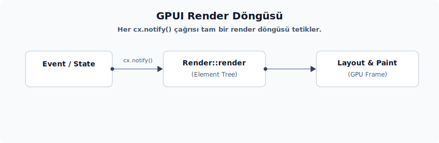
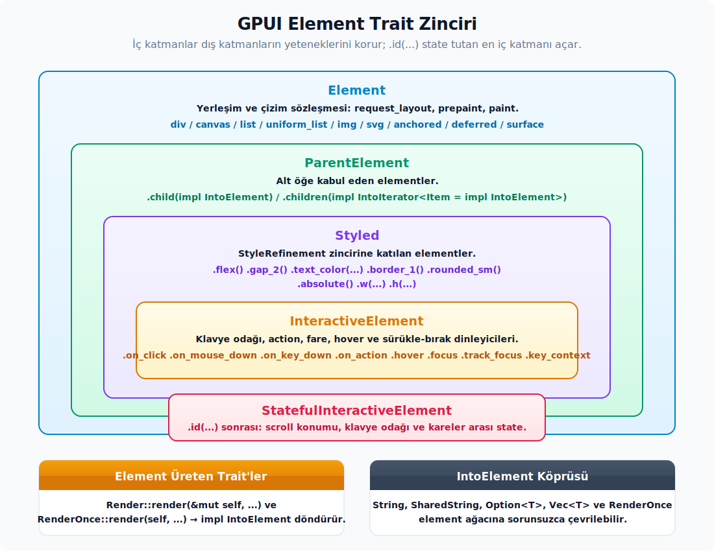

# Render ve Element Modeli

---

## Render Modeli

<div align="center">



</div>

GPUI mimarisinde `Element` ekranda çizilen geçici görsel birimleri; `Render` ise kendi durum verisini (state) barındıran ve bu veriye bağlı olarak geçici element ağaçları üreten kalıcı veri yapısını temsil etmektedir.

| Kavram | Kalıcılık Ömrü | Temel Görevi |
|---|---|---|
| `Entity<V> + Render` | Kalıcıdır (durum verisini korur) | Her `cx.notify()` çağrısında verisini kullanarak geçici element ağacını yeniden oluşturur. |
| `RenderOnce` | Tek seferliktir (tüketilir) | Kendi durum yönetim döngüsü olmayan, dışarıdan aldığı parametrelerle yalnızca tek seferlik arayüz parçaları üreten hafif bileşendir. |
| `Element` | Geçicidir (her karede yeniden üretilir) | Ekran yerleşimini (`layout`) ve boyama (`paint`) aşamalarını yönetir. Ekrana çizilen en uç birimdir. |

Basit bir element ağacı tanımı şu şekilde örneklenebilir:

```rust
div()
    .p_2()
    .bg(rgb(0x000000))
    .text_color(rgb(0xffffff))
    .child("Merhaba GPUI!")
```

Herhangi bir pencerenin kök görünümü (root view) her zaman bir `Entity<V>` nesnesidir. Buradaki `V` tipinin `Render` trait'ini uygulaması (implement etmesi) zorunludur. `Render::render` fonksiyonunun görevi veri kaydetmek, ağ istekleri başlatmak veya kalıcı durum verisi (state) oluşturmak değildir. Bu işlevin tek sorumluluğu; görünümın alanlarında (fields) bulunan mevcut verilere bakarak o ekran karesinde çizilecek olan geçici element ağacını üretip geriye döndürmektir.

Bir profil güncelleme penceresi bu sorumluluk ayrımı için açıklayıcı bir örnektir. E-posta adresi kullanıcı metin girdikçe değişecek, diske kaydedilecek, hata veya başarı durumları yansıtacak ve uygulamanın diğer bölümleri tarafından okunacaksa; bu verilerin tamamı `Render` trait'ini uygulayan kalıcı görünüm (view) nesnesinde saklanmalıdır:

```rust
struct ProfilPenceresi {
    eposta_taslagi: SharedString,
    kaydedildi_mi: bool,
    hata: Option<SharedString>,
}

impl ProfilPenceresi {
    fn epostayi_degistir(&mut self, yeni_eposta: impl Into<SharedString>, cx: &mut Context<Self>) {
        self.eposta_taslagi = yeni_eposta.into();
        self.kaydedildi_mi = false;
        cx.notify();
    }

    fn kaydet(&mut self, cx: &mut Context<Self>) {
        // Kaydetme işlemi bir eylem (action) veya asenkron görev (task) altında yürütülür.
        // Render::render bu tür iş mantığı süreçlerini üstlenmez; sadece sonucu ekrana yansıtır.
        self.kaydedildi_mi = true;
        self.hata = None;
        cx.notify();
    }
}

impl Render for ProfilPenceresi {
    fn render(&mut self, _window: &mut Window, cx: &mut Context<Self>) -> impl IntoElement {
        div()
            .id("profil-penceresi")
            .v_flex()
            .gap_2()
            .child(div().child(format!("Eposta: {}", self.eposta_taslagi)))
            .child(
                div()
                    .id("kaydet")
                    .child("Kaydet")
                    .on_click(cx.listener(|gorunum, _olay, _window, cx| {
                        gorunum.kaydet(cx);
                    }))
            )
            .when(self.kaydedildi_mi, |oge| {
                oge.child(KayitBasariliMesaji {
                    eposta: Some(self.eposta_taslagi.clone()),
                })
            })
            .when_some(self.hata.clone(), |oge, hata| {
                oge.child(div().text_color(rgb(0xff0000)).child(hata))
            })
    }
}
```

Bu kod yapısında `eposta_taslagi`, `kaydedildi_mi` ve `hata` değişkenleri element ağacının değil, doğrudan `ProfilPenceresi` görünümünün kendi alanlarıdır. Kullanıcı e-postayı güncellediğinde veya kaydetme işleminden bir yanıt döndüğünde bu alanlar mutasyona uğratılır ve ardından `cx.notify()` çağrısı tetiklenir. Bu tetikleme sonucunda aynı `Entity<ProfilPenceresi>` nesnesi tekrar render edilir. Uygulamanın diğer bölümleri güncel e-posta bilgisini okumak istediğinde tek yetkili veri kaynağı bu kalıcı görünümdür; geçici elementler veya mesaj bileşenleri veri kaynağı olarak kullanılmamalıdır.

`RenderOnce` trait'i ise bu ana pencere içerisinde kullanılan küçük ve tek seferlik arayüz parçalarının tanımlanmasında rol oynar. Aşağıda örneklenen başarı mesajı bileşeni kendi başına veri mutasyonu gerçekleştirmez, hata durumu yönetmez ve harici kodlar için bir veri kaynağı sunmaz. Yalnızca kendisine parametre olarak iletilen e-posta bilgisini kullanıcıya gösterir:

```rust
#[derive(IntoElement)]
struct KayitBasariliMesaji {
    eposta: Option<SharedString>,
}

impl RenderOnce for KayitBasariliMesaji {
    fn render(self, _window: &mut Window, _cx: &mut App) -> impl IntoElement {
        div()
            .rounded_sm()
            .px_2()
            .child("Eposta adresi kaydedildi.")
            .when_some(self.eposta, |oge, eposta| {
                oge.child(div().text_color(rgb(0x666666)).child(eposta))
            })
    }
}
```

Bu senaryoda `KayitBasariliMesaji` e-posta adresini ekran üzerinde çizebilir; ancak bu işlem onu durum sahibi (stateful) yapmaz. Asıl veri her zaman `ProfilPenceresi` görünümü bünyesinde yaşamaya devam eder. `KayitBasariliMesaji` ise render aşamasında üretilir, `RenderOnce::render(self, ...)` çağrısıyla birlikte geçici bir elemente dönüştürülerek tüketilir. Bir sonraki ekran karesinde bu mesaja yeniden ihtiyaç duyulursa, üst görünüm yeni bir `KayitBasariliMesaji` nesnesi yapılandırarak ağaca ekler.

Arayüz tasarımında şu temel karar kuralları esas alınmalıdır:

- Kullanıcı girdileri, seçilen liste satırı, aktiflik durumları, hata mesajları, yüklenme durumları gibi sonradan sorgulanabilecek her türlü veri kalıcı olarak `Entity<T>` yapısı içerisindeki görünüm (view) veya model bünyesinde tutulmalıdır; bu durumları ekrana çizmek için `Render` trait'inden faydalanılır.
- Bir veri yapısı (struct) yalnızca dışarıdan aldığı metin, ikon, renk veya küçük parametrelerle hızlıca bir görsel parça oluşturup ardından tüketilecekse `RenderOnce` kullanılmalıdır.
- `Render::render` gövdesi; veri tabanına kaydetme, doğrulama veya ağ üzerinden veri çekme gibi işlemlerin yürütüleceği yer değildir. Bu tür süreçler olay dinleyicileri (event handlers), eylemler (actions), model metotları veya asenkron görevler (async tasks) içerisinde yönetilmelidir. `render` metodu yalnızca bu işlemler neticesinde değişen durum verilerini (state) ekrana yansıtmakla yükümlüdür.
- `RenderOnce` yapısında sunulan veriler sadece bilgi amaçlı olup, asla uygulamanın güncel veri kaynağı (source of truth) olarak kabul edilmemelidir.

**Crate kökü ve mühürlü (sealed) trait sınırları.** `gpui` paket kökü, bazı düşük seviyeli sembolleri de dışarıya aktarır. Örneğin `GPUI_MANIFEST_DIR`, derleme anındaki `CARGO_MANIFEST_DIR` değerini taşıyan ve `#[doc(hidden)]` özniteliğiyle gizlenmiş statik bir değişkendir. Bu sabit, yalnızca varlık (asset) veya test altyapısının paketin manifest dizinine erişmesi gerektiği iç süreçlerde kullanılır; uygulama verisi yolu ya da kullanıcı ayarlarının saklanacağı dizinlerin belirlenmesinde tercih edilmez. Mühürlü (`Sealed`) trait deseni ise bundan farklı olarak paket kökünden dışarıya aktarılmaz, özel (private) bir modül altında tutulur; dolayısıyla harici kod bloklarından adlandırılamaz veya erişilemez. GPUI, belirli trait implementasyonlarını yalnızca kendi kütüphane sınırları içerisinde tutmak amacıyla bu mühürleme desenini kullanır; örneğin olay (event) trait'lerini bu desenle korunur. Bir trait bu şekilde mühürlendiğinde, harici uygulama kodlarında o trait'i yeni veri tiplerine uygulamaya çalışmak yerine, GPUI'nın sunduğu standart element, girdi ve olay arayüzleri üzerinden geliştirme yürütülmelidir.

| Yapı / Desen | Konumu ve Erişimi | Temel İşlevi |
| :-- | :-- | :-- |
| `Sealed` (mühürlü) | Crate içi özel (private) modül | Paket kökünden ihraç edilmez. Olay (event) gibi kritik trait'lerin harici paketlerce implemente edilmesini engelleyerek, geliştiriciyi hazır element/olay arayüzlerini kullanmaya yönlendirir. |

## Element Yaşam Döngüsü ve Çizim Aşamaları

Bir `Element` nesnesinin yaşam döngüsü üç ana aşamadan oluşur ve bu aşamalar her ekran karesinde sırasıyla işletilir:

1. `request_layout(...) -> (LayoutId, RequestLayoutState)`: Stil tanımlamaları ve alt öğelerin yerleşim talepleri Taffy yerleşim (layout) motoruna iletilir. Bu aşamada herhangi bir görsel çizim gerçekleştirilmez; yalnızca elementin ne kadarlık bir alana ihtiyaç duyduğu ve alt öğelerinin `LayoutId` kimliklerinin neler olduğu bilgisi hazırlanır.
2. `prepaint(...) -> PrepaintState`: Yerleşim sınırları ve boyutları kesinleştikten sonra, elementin ekran üzerindeki nihai konumuna bağlı işlemler bu aşamada yürütülür: Hitbox kayıtları, kaydırma (scroll) konumlarının hesaplanması, elemente özel durum verilerinin okunması ve dinamik ölçüm işlemleri bu kapsamdadır.
3. `paint(...)`: Ekrana çizilecek olan temel geometrik şekiller (primitives) üretilir. `paint_quad`, `paint_path`, `paint_image`, `paint_svg` veya `set_cursor_style` gibi görsel çizim çağrıları doğrudan bu aşamada gerçekleştirilir.

`Window` nesnesi üzerindeki hata ayıklama denetimleri (debug assertions) bu aşama kurallarının ihlal edilmesini engeller: Örneğin `insert_hitbox` yalnızca prepaint aşamasında; `paint_*` çizim çağrıları paint aşamasında; `with_text_style` ve metin ölçüm yardımcıları ise prepaint ya da paint aşamalarında çağrılabilir. Yanlış aşamada tetiklenen metotlar, hata ayıklama derlemelerinde (debug builds) doğrudan `panic` hatasına yol açarak yazılım hatalarının erken safhada yakalanmasını sağlar.

Erişilebilirlik (accessibility) ağacına dahil olacak özel elementlerde `Element::a11y_role()` metodu `Some(accesskit::Role)` döndürmelidir; `None` dönen elementler erişilebilirlik ağacına dahil edilmez. `write_a11y_info(node)` işlevi ise yalnızca geçerli bir rol atandığında çağrılır; erişilebilirlik etiketleri, seçilme durumları (checked state) veya benzeri AccessKit düğüm niteliklerini doldurmak amacıyla kullanılır. Bu kancalar (hooks) çizim akışından bağımsız yönetilir: Önce rol atamasıyla düğümün varlığı tescil edilir, ardından ilgili erişilebilirlik verileri yazılır.

**Veri Saklama Yolları.** Element düzeyinde kalıcı durum verilerinin nerede saklanacağı, ilgili verinin hedeflenen ömür süresine (lifetime) göre belirlenir:

- **Görünüm (View) Verileri:** `Entity<T>` alanları içerisinde muhafaza edilir; uygulama açık kaldığı sürece ya da görünüm kapanana kadar varlığını sürdürür.
- **Elemente Özel Durum Verileri:** Benzersiz bir `id(...)` tanımlaması ile birlikte `window.with_element_state` veya `with_optional_element_state` arayüzleri üzerinden yönetilir. Aynı ID ardışık ekran karelerinde korunduğu sürece veri korunmaya devam eder; ID değiştiğinde ise sıfırlanır.
- **Sonraki Ekran Karesine Görev Kaydı:** `window.on_next_frame(...)` çağrısı aracılığıyla sonraki kare çizim sırasına eklenir.
- **Eylem Sonuna Erteleme:** `cx.defer(...)`, `window.defer(cx, ...)` veya `cx.defer_in(window, ...)` metotlarıyla mevcut etki döngüsünün en sonuna ertelenir.
- **Sürekli Yeniden Çizim Talebi:** `window.request_animation_frame()` çağrısıyla sisteme kesintisiz olarak yeni bir ekran karesi talebi iletilir.

**Çizim Katmanı Rolleri.** GPUI mimarisinde çizim zinciri, her biri farklı bir yetenek setini temsil eden çeşitli trait sınırlarının bir araya gelmesiyle şekillenir:



- `Render`: Görünüm durumunu (view state) her çizim karesinde geçici element ağacına dönüştürmekten sorumludur.
- `RenderOnce`: Yalnızca hafif, durum bilgisi tutmayan görsel bileşenlerin modellenmesinde rol alır.
- `ParentElement`: Alt öğe (child elements) kabul eden kapsayıcı yapıların ortak arayüzüdür.
- `Styled`: Stil rafine etme (style refinement) zincirlerine dahil olan elementleri işaretler.
- `InteractiveElement`: Klavye odağı, eylem eşlemeleri, fare tıklamaları, hover etkileşimleri ve sürükle-bırak dinleyicilerini etkinleştirir.
- `StatefulInteractiveElement`: `.id(...)` çağrısından sonra, kaydırma (scroll) veya klavye odağı gibi ekran kareleri arasında korunması gereken gelişmiş interaktif durumları yönetir.

**Kritik Kural.** Görünümün ekran üzerindeki çizim çıktısını doğrudan etkileyen bir veri değiştiğinde `cx.notify()` metodu çağrılmalıdır. Bu bildirim yapılmadığı takdirde ilgili görünüm yeniden çizilmez. Tüm pencerenin baştan çizilmesi gerektiğinde ise `window.refresh()` çağrısı kullanılır. Yerel görünüm verilerindeki güncellemeler için, çok daha verimli ve hedefli bir yenileme sunduğundan öncelikle `cx.notify()` tercih edilmelidir.

**Özel `Element` Geliştirme.** Standart arayüz ihtiyaçlarında `div()`, `canvas(...)`, `img(...)` ve `svg()` bileşenleri genellikle tamamen yeterlidir. Sıfırdan bir `Element` yapısı kurmak, yalnızca ekran yerleşim (layout) ve boyama (paint) aşamaları üzerinde tam kontrol kurulması gereken özel senaryolarda anlamlıdır. Aşağıdaki örnek; stil zincirlerinden boyut verisi alabilen ve kendi sınırlarını kırmızı renkli bir kareyle dolduran en yalın özel element şablonunu göstermektedir:

```rust
struct KirmiziKare {
    stil: StyleRefinement,
}

impl KirmiziKare {
    fn new() -> Self {
        Self { stil: StyleRefinement::default() }
    }
}

impl Styled for KirmiziKare {
    fn style(&mut self) -> &mut StyleRefinement {
        &mut self.stil
    }
}

impl IntoElement for KirmiziKare {
    type Element = Self;

    fn into_element(self) -> Self::Element {
        self
    }
}

impl Element for KirmiziKare {
    type RequestLayoutState = Style;
    type PrepaintState = ();

    fn id(&self) -> Option<ElementId> {
        None
    }

    fn source_location(&self) -> Option<&'static core::panic::Location<'static>> {
        None
    }

    fn request_layout(
        &mut self,
        _id: Option<&GlobalElementId>,
        _inspector_id: Option<&InspectorElementId>,
        window: &mut Window,
        cx: &mut App,
    ) -> (LayoutId, Self::RequestLayoutState) {
        let mut stil = Style::default();
        stil.refine(&self.stil);
        let yerlesim_id = window.request_layout(stil.clone(), [], cx);
        (yerlesim_id, stil)
    }

    fn prepaint(
        &mut self,
        _id: Option<&GlobalElementId>,
        _inspector_id: Option<&InspectorElementId>,
        _sinirlar: Bounds<Pixels>,
        _stil: &mut Style,
        _window: &mut Window,
        _cx: &mut App,
    ) {
    }

    fn paint(
        &mut self,
        _id: Option<&GlobalElementId>,
        _inspector_id: Option<&InspectorElementId>,
        sinirlar: Bounds<Pixels>,
        stil: &mut Style,
        _prepaint: &mut (),
        window: &mut Window,
        cx: &mut App,
    ) {
        stil.paint(sinirlar, window, cx, |window, _cx| {
            window.paint_quad(fill(sinirlar, rgb(0xff0000)));
        });
    }
}

div().child(KirmiziKare::new().size(px(24.)))
```

Bu örnek iki kritik ayrımı netleştirmektedir: `request_layout` aşaması yalnızca yerleşim gereksinimlerini hesaplar; fiili çizim işlemleri ise `paint` aşamasında yürütülür. `StyleRefinement` yapısı barındırıldığı için bu özel element de diğer GPUI bileşenleri gibi `.size(...)`, `.m_*` veya `.absolute()` gibi akıcı stil zincirlerine doğrudan katılabilir. `stil.refine(...)` işlevinin derlenebilmesi için ilgili modülde `refineable::Refineable as _` trait'inin içe aktarılması (import) gerekmektedir. Sadece tek seferlik veya basit çizim gereksinimlerinde bu kadar düşük seviyeli yapılara inmek yerine, `canvas(...)` sarmalayıcısından yararlanılması önerilir.

## Element Haritası

GPUI bünyesindeki yerleşik arayüz elementleri, farklı tasarım ihtiyaçlarına yanıt verecek şekilde optimize edilmiştir. Aşağıdaki envanter, hedeflenen sorumluluk sınırlarına göre hangi elementin seçilmesi gerektiğini özetlemektedir:

- `div()`: Neredeyse tüm yerleşim, kapsayıcı ve hizalama işlerinin temel taşıdır. Flexbox/Grid, stil yönetimi, alt öğe yerleşimleri, olay dinleyicileri, klavye odağı ve işletim sistemi pencere kontrol alanlarını (`WindowControlArea`) destekler.
- **Metin Birimleri:** `&'static str`, `String` ve `SharedString` tipleri doğrudan element olarak çizilebilir. Ekran okuyucuların doğru algılaması gereken standart metin alanlarında `Text` yapısı ve `text!` makrosu tercih edilmelidir; bu yapılar erişilebilirlik ağacında benzersiz kimlikler oluşturur. Gelişmiş biçimlendirmeler için `StyledText` ve `InteractiveText` yapıları mevcuttur.
- `svg()`: Satır içi (inline) veya harici dosya yollarından SVG formatındaki vektörel grafikleri çizer.
- `img(...)`: Varlıklar (assets), yerel dosya yolları, web adresleri veya ham byte dizilerinden görseller yükler; yüklenme ve yükleme hatası durumları için yedek görsel (fallback) yapılandırmalarını destekler.
- `canvas(prepaint, paint)`: Düşük seviyeli özel çizim operasyonları veya fare etkileşim alanı (hitbox) hazırlıkları için kullanılır.
- `anchored()`: Pencere sınırlarına veya belirli referans noktalarına sabitlenen popover panelleri ve menü tasarımları için idealdir.
- `deferred(child)`: Çizim sırasının ertelenmesi veya üst katmanlarda render edilmesi gereken durumlar için kullanılır.
- `list(...)`: Satır yükseklikleri değişken olan, büyük ölçekli ve dinamik veri listelerinin performanslı çiziminde tercih edilir.
- `uniform_list(...)`: Tüm satırları eşit yükseklikte olan ve yüksek performans gerektiren verimli listelerin çiziminde kullanılır.
- `surface(...)`: macOS platformuna özel yerel yüzey (surface) kaynaklarını element ağacına dahil etmeye yarar (`#[cfg(target_os = "macos")]`).

**Sıkça Yararlanılan Stil Grupları.** Akıcı builder (fluent API) zincirinde yaygın olarak gruplanan metotlar şunlardır:

- Yerleşim (Layout): `.flex()`, `.flex_col()`, `.flex_row()`, `.grid()`, `.items_center()`, `.justify_between()`, `.content_stretch()`, `.size_full()`, `.w(...)`, `.h(...)`.
- Boşluklar (Spacing): `.p_*`, `.px_*`, `.gap_*`, `.m_*`.
- Metin Biçimleri (Typography): `.text_color(...)`, `.text_sm()`, `.text_xl()`, `.font_family(...)`, `.truncate()`, `.line_clamp(...)`.
- Kenarlık ve Köşeler: `.border_1()`, `.border_color(...)`, `.rounded_sm()`.
- Konumlandırma: `.absolute()`, `.relative()`, `.top(...)`, `.left(...)`.
- Durum Değiştiriciler: `.hover(...)`, `.active(...)`, `.focus(...)`, `.focus_visible(...)`, `.group(...)`, `.group_hover(...)`.
- Etkileşimler: `.on_click(...)`, `.on_mouse_down(...)`, `.on_scroll_wheel(...)`, `.on_key_down(...)`, `.on_action(...)`, `.track_focus(...)`, `.key_context(...)`.

Zed kod tabanında, tasarım sistemi tiplerini ve kütüphane prelude tanımlarını bir arada sunduğu için genellikle `gpui::prelude::*` yerine `ui::prelude::*` tercih edilir. Bu ayrımın korunması önemlidir: Örneğin arayüzde kullanılan `v_flex` ve `h_flex` metotları GPUI'nın çekirdek `Styled` trait'inin birer parçası olmayıp, `ui` tasarım sistemi uzantılarıdır (`ui::prelude`). Buna karşın `.size_full()` metodu doğrudan GPUI `Styled` trait'inin yerel bir işlevidir.

**Çoklu Öğe ve Koleksiyonlardan Element Üretimi.** `ParentElement` trait'i arayüze alt düğümler eklemek üzere iki temel yardımcı sunar: `.child(...)` tek bir `IntoElement` nesnesi eklerken; `.children(...)` ise herhangi bir iterator veya koleksiyonu doğrudan alt öğe listesine dönüştürür. Dinamik listeleri render ederken satırları tek tek eklemek yerine, veri kümesi üzerinde `map` çağrısı çalıştırmak çok daha temiz bir kod akışı sağlar:

```rust
let satir_ogeleri = self.satirlar.iter().enumerate().map(|(sira, satir)| {
    div()
        .id(("satir", sira))
        .h(px(28.))
        .px_2()
        .child(satir.baslik.clone())
});

div()
    .v_flex()
    .children(satir_ogeleri)
```

Bu örnekte `satir_ogeleri` kalıcı bir widget listesi olmayıp, yalnızca o render çağrısında geçici olarak üretilecek element tariflerinin iterator'dır. `self.satirlar` görünüm içindeki kalıcı veriyi (state) temsil ederken; `map` içindeki `div()` yapıları ise o ekran karesine özel geçici elementlerdir. Satırların hover durumlarının, kaydırma konumlarının veya element durumlarının korunabilmesi için `.id(("satir", sira))` şeklinde benzersiz ve sabit bir kimlik atanmalıdır. Sıra numarası yerine varsa veri modelinin kendi veri tabanı kimliğinin kullanılması önerilir.

Koşullu alt öğe gösterimlerinde `Option` veri tipi de bir iterator gibi kullanılabilir:

```rust
div()
    .v_flex()
    .children(self.hata.as_ref().map(|hata| {
        div()
            .text_color(rgb(0xff0000))
            .child(hata.clone())
    }))
    .children(self.satirlar.iter().map(|satir| {
        div().child(satir.baslik.clone())
    }))
```

Farklı tipteki elementleri aynı dinamik listede bir arada tutmak gerektiğinde, her bir öğe `into_any_element()` çağrısıyla `AnyElement` tipine dönüştürülmelidir. Bu yöntem yalnızca heterojen koleksiyonların zorunlu olduğu durumlarda kullanılmalıdır; tek tip satır listelerinde iterator + `.children(...)` yaklaşımı daha sade ve performanslıdır.

## Element ID, Element Verisi ve Tip Soyutlaması

GPUI üzerinde her çizim döngüsünde element ağacı baştan aşağı yeniden kurulur. Buna rağmen etkileşim durumlarının (hover, active), kaydırma konumlarının (scroll offsets) ve görsel önbelleklerin ekran kareleri arasında tutarlı biçimde korunması gerekir. Bu süreklilik, elementlere atanan sabit ID'ler aracılığıyla gerçekleştirilir. İlişkili temel veri yapıları şunlardır:

- `ElementId`: `View`, `Integer`, `Name`, `Uuid`, `FocusHandle`, `NamedInteger`, `Path`, `CodeLocation`, `NamedChild` ve `OpaqueId` varyantlarını barındırır.
- `GlobalElementId`: Pencerenin element ID yığınındaki (ID stack) yerel kimlikleri birleştirerek hiyerarşik tam yolu oluşturur.
- `AnyElement`: Element tipleri için tip soyutlaması (`type erasure`) sağlar; heterojen alt öğe koleksiyonlarında farklı tipteki elementleri bir arada tutmak için kullanılır.
- `AnyView` / `AnyEntity`: View veya entity referansları için tip soyutlaması sağlar.

Element düzeyinde saklanan verilere erişim API'leri `Window` nesnesi üzerindedir ve yalnızca elementin prepaint/paint çizim aşamalarında çağrılabilir. Yüksek seviyeli API'ler bu veri yönetimini otomatikleştirir:

```rust
let satir_durumu = window.use_keyed_state(
    ElementId::named_usize("satir", satir_sirasi),
    cx,
    |_, cx| SatirDurumu::new(cx),
);
```

Daha düşük seviyeli müdahaleler için global ID ve element durum verisi API'leri doğrudan kullanıma sunumaktadır:

```rust
window.with_global_id("gorsel-onbellegi".into(), |genel_id, window| {
    window.with_element_state::<OnbellekDurumu, _>(genel_id, |durum, window| {
        let mut durum = match durum {
            Some(durum) => durum,
            None => OnbellekDurumu::default(),
        };
        durum.hazirla(window);
        (durum.anlik_gorunum(), durum)
    })
});
```

**Element ID Yönetim Disiplini.** Arayüz kimlikleri ile çalışırken şu kurallara dikkat edilmelidir:

- `window.with_id(element_id, |window| ...)` çağrısı yerel element ID yığınana yeni bir yerel kimlik ekler; `with_global_id` ise bu yığından tam hiyerarşik `GlobalElementId` değerini üretir.
- Dinamik liste satırlarında `use_state` yerine daima `use_keyed_state` tercih edilmelidir; zira `use_state` çağrıldığı kod satırı konumuna göre kimlik üretir ve aynı döngü içindeki farklı satır verilerini birbirinden ayırt edemez.
- `with_element_namespace(id, ...)` metodu, özel bir element tasarlanırken alt öğelerin ID çakışmalarını (namespace collisions) engellemek amacıyla kullanılır.
- Aynı `GlobalElementId` ve aynı veri tipi için iç içe `with_element_state` çağrısı yapmak derleme veya çalışma zamanında `panic` hatasına yol açar.
- Element kimliği (ID) değiştiğinde, önceki ekran karesine ait durum verileri korunmaz; animasyonlar, hover etkileşimleri, scroll konumları, erişilebilirlik düğümleri ve görsel önbellek verileri tamamen sıfırlanır.
- Dinamik metin listelerinde `text!(id = ..., metin)` makrosu ya da `Text::new(...)` yapısı aracılığıyla veri modeli kimliklerine bağlı metin ID'leri tanımlanmalıdır. Aynı `text!` makrosunun tekrar eden satırlarda konum tabanlı çağrılması, erişilebilirlik ağacında çakışan metin düğümlerinin oluşmasına sebebiyet verebilir.

**Tip Soyutlaması (Type Erasure) Tercihleri.** Tipli ve tipsiz yapılar arasında seçim yaparken şu yönergeler izlenmelidir:

- Genel kullanım amaçlı bir bileşen API'si harici alt öğeler kabul ediyorsa, parametre tipi olarak `impl IntoElement` tercih edilmelidir.
- Bir veri yapısının (struct) alanında element saklanması gerektiğinde `AnyElement` kullanılmalıdır.
- View veya entity referansları saklanırken, FFI, plugin (eklenti) mimarileri, dock panelleri veya heterojen koleksiyon gereksinimleri olmadığı sürece daima tipli `Entity<T>` veya `WeakEntity<T>` referansları tercih edilmelidir.

## AnyElement, Component ve Interactivity Yüzeyi

GPUI render katmanında yer alan bazı halka açık (public) veri yapıları, günlük uygulama geliştirme süreçlerinde nadiren doğrudan kullanılsa da, element ağacının iç işleyişini anlamak açısından büyük öneme sahiptir:

**AnyElement.** `AnyElement` yapısı heterojen element tiplerini tek bir ortak tipe indirger. Günlük kod yazımında `.into_any_element()` metodu bu dönüşümü sağlar. Düşük seviyeli çalışmalarda `downcast_mut::<T>()` ile iç element tipi denetlenebilir; `request_layout`, `layout_as_root`, `prepaint`, `prepaint_at`, `prepaint_as_root` ve `paint` çağrıları vasıtasıyla elementin yaşam döngüsü manuel olarak yönetilebilir. Bu metotlar yalnızca özel kapsayıcılar, test kütüphaneleri veya framework çekirdeği yazılırken tercih edilir; standart görünümlerde alt öğelerin yönetimi GPUI motoruna bırakılır.

**`Component<C>`.** `Component<C: RenderOnce>` sarmalayıcısı, `#[derive(IntoElement)]` makro çıktılarının arka planda yararlandığı bir yapıdır. `Component::new(component)` çağrısı bir `RenderOnce` bileşenini element yaşam döngüsüne dahil eder; render sürecinde bileşen bir defa tüketilerek ekran karesine işlenir. Uygulama kodlarında doğrudan `Component` üretmek yerine, `RenderOnce` implementasyonunun yapılması ve `IntoElement` makrosunun derive edilmesi çok daha okunaklı bir kod yapısı sunar.

**AnyView ve AnyWeakView.** `AnyView` tipli view handle referanslarının soyutlandığı heterojen alanlarda saklama yapmayı sağlarken; `AnyWeakView` ise bu yapının zayıf (weak) referans karşılığıdır. Dock sistemleri, modal sunucuları veya eklenti yuvaları gibi farklı tipteki view nesnelerini tek bir koleksiyon altında toplamak gerektiğinde kullanılır. Tek bir görünüm türüyle çalışılan standart durumlarda, daha güvenli ve okunaklı olan tipli `Entity<T>` ve `WeakEntity<T>` referansları tercih edilmelidir.

**Interactivity Yapısı.** `Interactivity` yapısı, `Div` ve benzeri elementlerin etkileşim durum verilerini (element ID, odak tutamacı, kaydırma handle'ı, tuş bağlamı, grup isimleri, hover/focus/active durumlarına özel stil refinement'ları, sürükle-bırak kayıtları, olay dinleyicileri ve tooltip yapılandırıcıları gibi) tek bir noktada toplar. Uygulama kodlarında bu alanlar doğrudan el ile doldurulmaz. Bunun yerine fluent mimarideki `.id(...)`, `.track_focus(...)`, `.tab_index(...)`, `.hover(...)`, `.active(...)`, `.on_click(...)` veya `.tooltip(...)` gibi metotlar bu alanları dolaylı olarak yapılandırır.

**Düşük Seviyeli Etkileşim Metotları (Imperative Interactivity).** Özel element geliştirirken `Interactivity` üzerindeki düşük seviyeli şu metotlar kullanılabilir:

- `on_click(...)`, `on_aux_click(...)`, `on_drag(...)`, `on_hover(...)` ve `on_drop(...)` gibi metotlar doğrudan olay davranışlarını düğüme kaydeder.
- `tooltip_show_delay(delay)` tooltip gösterim gecikmesini (varsayılan 500 ms) ayarlar.
- `capture_action(...)`, `capture_key_down(...)` ve `capture_any_mouse_down(...)` gibi metotlar olay yakalama (capture phase) dinleyicileri ekler.
- `occlude_mouse()` ve `block_mouse_except_scroll()` metotları, arkada kalan hitbox alanlarının fare olaylarını alıp almayacağını belirler.
- `window_control_area(...)` özel başlık çubuğu tasarımlarında işletim sistemine özel hit-test alanları kaydeder.
- `compute_style(...)` ekran karesinin çizimi sırasında hover, focus, active veya grup stillerini nihai görünüm stiliyle birleştirir.

Standart bileşen tasarımlarında bu doğrudan (imperative) metotların kullanımı önerilmez; element fluent zinciri bu işlemleri çok daha güvenli yürütür. Bu metotlar yalnızca özel `Element` sınıfları tasarlanırken tercih edilmelidir.

**Arena ve Ekran Karesi Veri Taşıyıcıları.** `Arena`, `ArenaBox<T>`, `DivFrameState`, `InteractiveElementState`, `DragMoveEvent<T>`, `ScrollHandle` ve `Reservation<T>` gibi yapılar, render ve etkileşim fazları arasında veri taşıyan altyapı bileşenleridir. `Arena::alloc(...)`, `capacity()` ve `clear()` metotları pencere çizim arenasına özel bellek yönetimi için tasarlanmıştır; uygulama verilerini saklamak amacıyla kullanılmamalıdır. `DragMoveEvent::drag(cx)` ve `dragged_item()` metotları ise sürükleme yükünü (payload) tipli olarak okumaya yarar; uygulama düzeyinde genellikle `.on_drag_move::<T>(...)` geri çağrı parametresi olarak elde edilir.

## FluentBuilder ve Koşullu Element Üretimi

`FluentBuilder` trait'i, tüm element tiplerine dinamik yardımcı metotlar kazandırarak akıcı metot zincirlerinin (fluent chains) koşullu `if` veya `match` bloklarıyla kesintiye uğramasını engeller:

```rust
pub trait FluentBuilder {
    fn map<U>(self, f: impl FnOnce(Self) -> U) -> U;
    fn when(self, condition: bool, then: impl FnOnce(Self) -> Self) -> Self;
    fn when_else(
        self,
        condition: bool,
        then: impl FnOnce(Self) -> Self,
        else_fn: impl FnOnce(Self) -> Self,
    ) -> Self;
    fn when_some<T>(self, option: Option<T>, then: impl FnOnce(Self, T) -> Self) -> Self;
    fn when_none<T>(self, option: &Option<T>, then: impl FnOnce(Self) -> Self) -> Self;
}
```

Tipik bir kullanım senaryosu, birden fazla koşullu davranış modelini tek bir akıcı zincir altında birleştirir:

```rust
div()
    .flex()
    .when(self.aktif_mi, |oge| oge.bg(rgb(0xFF0000)))
    .when_some(self.simge.as_ref(), |oge, simge| oge.child(simge.clone()))
    .when_else(self.yukleniyor_mu,
        |oge| oge.opacity(0.5),
        |oge| oge.opacity(1.0),
    )
    .map(|oge| match self.yogunluk {
        UiDensity::Compact => oge.gap_1(),
        UiDensity::Default => oge.gap_2(),
        UiDensity::Comfortable => oge.gap_4(),
    })
```

**Sağladığı Avantajlar.** Bu yardımcıların kod yazımına kazandırdığı başlıca faydalar şunlardır:

- Akıcı metot zinciri bozulmaz; `if`/`match` kontrol bloklarına sapmadan tamamen koşullu arayüzler tasarlanabilir.
- Closure içerisine iletilen elementin veri tipi aynen korunur; böylece alt öğeler eklemeye kesintisiz devam edilebilir.
- `.map()` metodu, akıcı zincirin dışına kontrollü biçimde çıkılması ve keyfi tip dönüşümlerinin gerçekleştirilmesi gereken durumlarda kolaylık sağlar.

**Dikkat Edilmesi Gereken Hususlar.** Bu yardımcıların hatalı kullanımları bazı performans veya tasarım sorunlarına yol açabilir:

- `.when()` içerisindeki closure her render karesinde yeniden çalıştırılır; bu nedenle bu gövdelerde maliyetli hesaplama işlemlerinin yürütülmesinden kaçınılmalıdır.
- Aynı element üzerinde çok sayıda `.when_some()` çağrısının zincirlenmesi kodun okunabilirliğini azaltıyorsa, ilgili verilerin önceden standart bir `if let` bloğu ile ayıklanması ve doğrudan tek bir `.child(...)` çağrısıyla eklenmesi tercih edilmelidir.
- `.map()` yöntemi element tipini değiştirebilir; oysa `.when()` metodu element tipini korur (refinement zincirinde kalmasını sağlar). Bu nedenle `.map()` dönüşümleri bilinçli şekilde kullanılmalıdır.

## Refineable, StyleRefinement ve MergeFrom

GPUI ve Zed mimarilerinde iki farklı kompozisyon deseni eş zamanlı olarak çalışır: Çizim süreçlerinde `Refineable`, ayarlar ve tema yükleme aşamalarında ise `MergeFrom`. Her iki desen de 'varsayılan değerlerin üzerine adım adım yeni verileri ekleyerek ezme' mantığını benimser; ancak sistemin farklı alanlarında görev yaparlar:

#### Refineable Deseni

`Refineable` trait'i `refineable` paketi altında şu sözleşmeyle tanımlanmıştır:

```rust
pub trait Refineable: Clone {
    type Refinement: Refineable<Refinement = Self::Refinement> + IsEmpty + Default;

    fn refine(&mut self, refinement: &Self::Refinement);
    fn refined(self, refinement: Self::Refinement) -> Self;

    fn from_cascade(cascade: &Cascade<Self>) -> Self
        where Self: Default + Sized;

    fn is_superset_of(&self, refinement: &Self::Refinement) -> bool;
    fn subtract(&self, refinement: &Self::Refinement) -> Self::Refinement;
}

pub trait IsEmpty {
    fn is_empty(&self) -> bool;
}
```

Bu trait yapısı arayüz esnekliği açısından oldukça zengin kabiliyetler sunar:

- `type Refinement` ilişkili tipi de `Refineable` olmak zorundadır; bu sayede refinement nesnelerinin kendi aralarında da `refine_a.refine(&refine_b)` şeklinde zincirleme birleştirilmesi mümkün kılınır.
- İlgili `Refinement` aynı zamanda `IsEmpty + Default` sınırlarına uymalıdır. `IsEmpty` niteliği, 'bu refinement uygulandığında nesnede herhangi bir değişiklik oluşur mu?' sorusunu yanıtlar; yerleşim önbelleklerinin geçerlilik denetimleri ve fark çıkarımı (`subtract`) bu kontrole dayanır.
- `is_superset_of(refinement)` metodu, üzerinde çağrıldığı nesnenin belirtilen refinement'ı zaten tam olarak kapsayıp kapsamadığını kontrol eder; bu sayede gereksiz `refine` güncellemeleri atlanır.
- `subtract(refinement)` metodu, iki refinement arasındaki farkı hesaplayarak yeni bir refinement nesnesi olarak döndürür.
- `from_cascade(cascade)` işlevi, aşağıda detaylandırılan `Cascade` yapısını varsayılan değerler üzerine uygulayarak tema ve stil katmanlarının düzleştirilmesini sağlar.

`#[derive(Refineable)]` makrosu; orijinal veri yapısıyla aynı alanlara sahip ancak her alanın `Option` ile sarmalandığı bir `XRefinement` tipi üretir. `refine` çağrısı yalnızca `Some` değer taşıyan alanları hedef tipe yazar. Aşağıdaki somut veri tipleri her zaman derive edilerek üretilir ve elle yazılması gerekmez:

| Refinement Türü | Üreten Temel Struct |
| --- | --- |
| `StyleRefinement` | `Style` |
| `TextStyleRefinement` | `TextStyle` |
| `UnderlineStyleRefinement` | `UnderlineStyle` |
| `StrikethroughStyleRefinement` | `StrikethroughStyle` |
| `BoundsRefinement` | `Bounds` |
| `PointRefinement` | `Point` |
| `SizeRefinement` | `Size` |
| `EdgesRefinement` | `Edges` |
| `CornersRefinement` | `Corners` |
| `GridTemplateRefinement` | `GridTemplate` |

Bu `*Refinement` tipleri genellikle doğrudan uygulama kodlarında yazılmaz; fluent stil zincirleri bu verileri arka planda otomatik olarak biriktirir. Geliştiricinin el ile yapılandırması gereken tek tip genellikle `StyleRefinement` yapısıdır; örneğin `.hover(|style| style.bg(...))` olay dinleyicisi imzasında bu tip görünür.

Tipik kullanım senaryoları `Style` ve `StyleRefinement` yapıları üzerinden yürütülür:

```rust
let mut style = Style::default();
style.refine(&StyleRefinement::default()
    .text_size(px(20.))
    .font_weight(FontWeight::SEMIBOLD));
```

Element fluent zincirleri (örneğin `div().text_size(px(14.)).bg(rgb(0xffffff))`) arka planda bir `StyleRefinement` biriktirerek çizim aşamasında temel stil üzerine uygular. Bu refinement içerisinde hizalamalar (align, justify), flex yönelimleri, grid konumları, kaydırma politikaları, gölgelendirmeler ve imleç stilleri gibi özellikler, yalnızca atama yapıldığında temel stili ezer; dokunulmayan alanlar ise varsayılan değerlerini korur.

`refined(self, refinement)` metodu ise değiştirilemez (immutable) yeni bir kopya üretir; ek stillerle yeni bir temel değer oluşturulması gereken senaryolarda tercih edilir.

#### Cascade ve CascadeSlot Yapıları

`Refineable` deseni tek başına iki katmanın (temel değer + refinement) birleştirilmesini sağlar. Daha derin ve çok katmanlı hover, focus veya active akışlarını yönetmek amacıyla `refineable` paketi hiyerarşik bir katman yığını sunar:

```rust
pub struct Cascade<S: Refineable>(Vec<Option<S::Refinement>>);
pub struct CascadeSlot(usize);
```

Bu arayüzün temel özellikleri şu şekildedir:

- `Cascade::default()` çağrısı, slot 0 değerini `Some(default)` ile başlatır; ek slotlar başlangıçta `None` durumundadır. Slot 0 her zaman dolu tutulur ve temel refinement değerini taşır.
- `cascade.reserve() -> CascadeSlot` metodu yeni bir `None` slot ekleyerek, onu sonradan bulmayı sağlayacak benzersiz bir referans tutamacı (handle) döndürür. Hover, focus veya active gibi dinamik katmanların her biri için ayrı bir slot rezerve edilir.
- `cascade.base() -> &mut S::Refinement` metodu, slot 0 değerine değiştirilebilir (mutable) erişim sağlar; her yerleşim hesaplamasında asıl stil buraya yazılır.
- `cascade.set(slot, Option<S::Refinement>)` çağrısı, belirli bir slot alanına refinement yerleştirir veya `None` ile o katmanı etkisiz kılar.
- `cascade.merged() -> S::Refinement` metodu, slot 0 üzerinde diğer dolu slotları sırayla `refine` eder; sonraki slotlar öncekileri ezer.
- `Refineable::from_cascade(&cascade) -> Self` çağrısı, `default().refined(merged())` kısayoludur; çizim esnasında nihai stilin üretilmesi için kullanılır.

**Önemli Not:** GPUI'nın kendi yerleşik `Interactivity` katmanı (örneğin `.hover()`, `.active()`, `.focus()` zincirleri) **`Cascade`/`CascadeSlot` yapılarını kullanmaz**. `Interactivity` yapısı her etkileşim durumu için kendi bünyesinde ayrı bir alan barındırır (örneğin `hover_style`, `active_style`, `focus_style`) ve çizim aşamasında bunları sırayla `refine` eder. Bu stil alanları `Option<Box<StyleRefinement>>` ya da grup stilleri için `Option<GroupStyle>` tipindedir. Dolayısıyla hover stilinde tanımlanan `.bg(...)` ayarı arka plan rengini ezer; ancak yazı boyutuna (`font_size`) dokunmayan bir refinement temel yazı boyutu değerini aynen korur.

`Cascade<S>` ve `CascadeSlot` arayüzleri `refineable` kütüphanesi kapsamında genel amaçlı olarak yer alsa da, GPUI çekirdeği veya Zed bunları bu sürümde dahili olarak kullanmamaktadır. Çok katmanlı stil birleştirme yığınlarını haricen tasarlamak isteyen kütüphane geliştiricileri için birer genişletme noktası sunarlar.

#### MergeFrom Deseni

`MergeFrom` trait'i `settings_content` paketi altında şu şekilde tanımlanmıştır:

```rust
pub trait MergeFrom {
    fn merge_from(&mut self, other: &Self);
    fn merge_from_option(&mut self, other: Option<&Self>) {
        if let Some(other) = other { self.merge_from(other); }
    }
}
```

Varsayılan birleştirme kuralları şu şekildedir:

- `HashMap`, `BTreeMap` ve veri yapıları (structs) için derin birleştirme (deep merge) yapılır; yalnızca `other` kaynağında tanımlanmış alanlar hedef nesneye yazılır.
- `Option<T>` alanlarında `None` değeri hedefi etkilemez; `Some` değerleri ise özyinelemeli (recursive) olarak birleştirilir.
- Diğer tiplerde (vektörler, ilkel veri tipleri) ise eski değerin üzerine tamamen yeni değer yazılır.

`#[derive(MergeFrom)]` makrosu, struct alanları için otomatik özyinelemeli birleştirme kodları üretir. Bu varsayılan davranışı değiştirmek amacıyla, her birleştirmede veriyi sona ekleyen `ExtendingVec<T>` veya bir kez `true` yapıldıktan sonra o durumu koruyan `SaturatingBool` gibi özel sarmalayıcılar (wrappers) kullanılabilir.

**Ayar (Settings) Yükleme Hiyerarşisi.** `SettingsStore::recompute_values` işlevi global değerleri her yeniden hesapladığında, ayar katmanlarını şu sıra doğrultusunda birleştirir:

1. `assets/settings/default.json` içeriği `parse_default_settings` ile okunur; kanal ve platform ezmeleri (overrides) bu temel değere baştan katılır.
2. Eklenti ayarları (`extension_settings`) ve global ayarlar (`global_settings`) sırasıyla eklenir.
3. Kullanıcı ayarları mevcutsa aktif profilin taban (`base`) değerine bakılır. Profil tabanı `User` ise kullanıcı içerikleri, kanal ezmeleri ve işletim sistemi ezmeleri eklenir; ardından aktif profilin kendi `settings` alanı dahil edilir.
4. Sunucu ayarları (`server_settings`) birleştirilir.
5. Global değerler için tüm yerel/proje ayarlarındaki `project.disable_ai` alanı ayrıca `SaturatingBool` mantığıyla birleştirilir.
6. Dosya veya dizin bağlamlı yerel değerlerde, yukarıdaki global temelin üzerine ilgili `local_settings` girdileri klasör derinliğine göre sırayla eklenerek ezilir.

**Dikkat edilmesi gereken hususlar.** Bu iki birleştirme modeliyle çalışırken şu noktalara dikkat edilmelidir:

- `Refineable` zincirinde `default()` temel stili her seferinde sıfırdan hesaplanır; yüksek maliyetli stil yapılandırmalarının arayüz performansını düşürmemesi için uygun bir önbelleğe alınması önerilir.
- `MergeFrom` sıralamasında en özel (spesifik) kaynağı en sona yerleştirilmelidir; sıralama her zaman `local > profile > user > default` akışını izlemelidir.
- Vektör türündeki verilere yeni elemanlar eklemek gerektiğinde `ExtendingVec` tercih edilmelidir; eski listenin tamamen ezilmesi hedefleniyorsa düz `Vec` kullanılmalıdır.
- `Option<Option<T>>` gibi iç içe sarmalanmış seçenek yapılarında `MergeFrom` varsayılan davranışları hatalı sonuçlar üretebileceğinden, bu istisnai durumlarda özel trait implementasyonları yazılmalıdır.

## Ertelenmiş Çizim, Çizim Hazırlığı Sırası ve Üst Katman

`deferred(child)` sarmalayıcısı, alt öğenin ekran yerleşimini (layout) ağaçtaki normal yerinde hesaplar; ancak fiili çizim (paint) işlemini, diğer tüm normal öğelerin çizimleri tamamlanana kadar geciktirir. Bu davranış; açılır kutular (popovers), sağ tık bağlam menüleri, pencere boyutlandırma tutamakları ve yerleşim bırakma alanları (dock drop overlays) gibi her zaman en üst katmanda çizilmesi gereken arayüz parçaları için tasarlanmıştır:

```rust
deferred(
    anchored()
        .anchor(Anchor::TopRight)
        .position(menu_position)
        .child(menu),
)
.with_priority(1)
```

**Ertelenmiş Çizim Mekanizması.** Element yaşam döngüsü aşamaları şu şekilde işler:

- `request_layout`: Alt öğe, ağaçtaki konumuna göre standart yerleşim hesaplamalarını alır.
- `prepaint`: Alt öğe, `window.defer_draw(...)` çağrısı vasıtasıyla en üst katmanda çizilmek üzere ertelenmiş kuyruğa kaydedilir.
- `paint`: Ertelenmiş element, kendi normal paint aşamasında doğrudan hiçbir çizim yapmaz; gerçek çizim işlemleri, ertelenmiş kuyruktaki öğeler sırayla boyanırken gerçekleştirilir.
- `with_priority(n)`: Aynı ekran karesinde kuyruğa eklenen ertelenmiş elementlerin kendi aralarındaki dikey sıralamasını (z-order) belirler; öncelik değeri yüksek olan elementler diğer ertelenmiş öğelerin de üstünde çizilir.

**`Div` Çizim Hazırlığı Yardımcıları.** Yerleşim sonuçlarına bağlı olarak prepaint (çizim hazırlığı) aşamasında dinamik kararlar almak amacıyla şu yardımcı metotlar sunulmuştur:

- `on_children_prepainted(|alt_sinirlar, window, cx| ...)`: Geri çağrıya (callback) tek bir sınır alanı değil, bağlı tüm alt öğelerin sınırlarını barındıran `Vec<Bounds<Pixels>>` listesi iletilir. Alt öğelerin son konum ve boyutlarını ölçerek sonraki çizim adımları için veri üretilmesini sağlar.
- `with_dynamic_prepaint_order(...)`: Alt öğelerin prepaint aşamasındaki işletilme sırasını çalışma zamanında dinamik olarak belirler. Özellikle bir alt öğenin otomatik kaydırma (autoscroll) veya boyut ölçüm sonuçlarının, diğer alt öğelerin konumlarını etkilediği gelişmiş senaryolarda tercih edilir.

**Dikkat Edilmesi Gereken Hususlar.** Ertelenmiş çizimler kullanılırken şu prensiplere uyulmalıdır:

- Ertelenmiş alt öğe yerleşim ağacında yer kapladığı için, `.absolute()` veya `.anchored()` konumlandırmalar hâlâ ilişkili olduğu kök üst öğe sınırlarına bağlı kalır.
- En üstte çizilen katmanın, arkasındaki fare olaylarını bloke etmesi (engellemesi) hedefleniyorsa, alt öğe içerisinde `.occlude()` veya `.block_mouse_except_scroll()` metotları kullanılmalıdır.
- Atanan öncelik (`priority`) değeri genel bir z-index niteliğinde değildir; yalnızca aynı pencere ekran karesi içindeki ertelenmiş çizim kuyruğunun kendi içindeki sıralamasını belirler.
