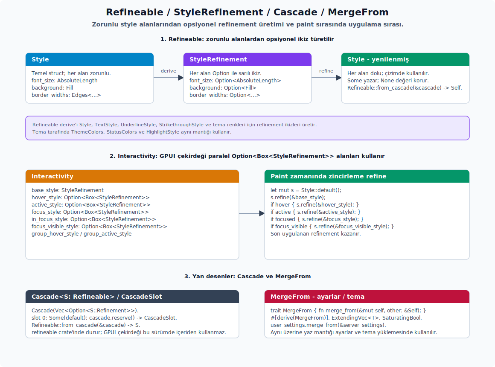

# Render ve Element Modeli

---

## Render Modeli

<div align="center">


</div>

GPUI'de `Element` ekranda çizilen geçici parçayı, `Render` ise kendi verisini taşıyan ve o veriye göre element ağacı üreten kalıcı yapıyı temsil eder.

| Kavram | Kalıcılık | Görevi |
|---|---|---|
| `Entity<V> + Render` | Kalıcı (durumu saklar) | Her `cx.notify()` ile verisini kullanarak geçici element ağacını oluşturur. |
| `RenderOnce` | Tek seferlik (tüketilir) | Kendi yaşam döngüsü olmayan, kendisine verilen veriden yalnızca UI parçası üreten bileşendir. |
| `Element` | Geçici (her karede yeniden) | Yerleşim (`layout`) ve çizimi (`paint`) gerçekleştirir. Ekrana basılan son uç birimdir. |

Bir element ağacının basit bir örneği şöyledir:

```rust
div()
    .p_2()
    .bg(rgb(0x000000))
    .text_color(rgb(0xffffff))
    .child("Merhaba GPUI!")
```

Bir pencerenin kök view'u her zaman bir `Entity<V>` olur. Bu `V` tipi `Render` trait'ini uygulamak zorundadır. `Render::render` veriyi kaydetmez, ağ isteği yapmaz ve kalıcı state oluşturmaz. Görevi yalnızca şudur: view'un alanlarında duran mevcut veriye bakar ve o anda ekranda görünecek geçici element ağacını üretir.

Eposta düzenleme penceresi bu ayrım için net bir örnektir. Eposta değeri kullanıcı yazdıkça değişecek, kaydedilecek, hata veya başarı durumu gösterecek ve başka kodlar tarafından okunacaksa bu veri `Render` uygulayan kalıcı view'da durur:

```rust
struct ProfilPenceresi {
    eposta_taslagi: SharedString,
    kaydedildi_mi: bool,
    hata: Option<SharedString>,
}

impl ProfilPenceresi {
    fn epostayi_degistir(&mut self, yeni_eposta: impl Into<SharedString>, cx: &mut Context<Self>) {
        self.eposta_taslagi = yeni_eposta.into();
        self.kaydedildi_mi = false;
        cx.notify();
    }

    fn kaydet(&mut self, cx: &mut Context<Self>) {
        // Kaydetme işi burada, bir action'da veya async task içinde yapılır.
        // Render::render bu işi yapmaz; sadece sonucu ekrana yansıtır.
        self.kaydedildi_mi = true;
        self.hata = None;
        cx.notify();
    }
}

impl Render for ProfilPenceresi {
    fn render(&mut self, _window: &mut Window, cx: &mut Context<Self>) -> impl IntoElement {
        div()
            .id("profil-penceresi")
            .v_flex()
            .gap_2()
            .child(div().child(format!("Eposta: {}", self.eposta_taslagi)))
            .child(
                div()
                    .id("kaydet")
                    .child("Kaydet")
                    .on_click(cx.listener(|gorunum, _olay, _window, cx| {
                        gorunum.kaydet(cx);
                    }))
            )
            .when(self.kaydedildi_mi, |oge| {
                oge.child(KayitBasariliMesaji {
                    eposta: Some(self.eposta_taslagi.clone()),
                })
            })
            .when_some(self.hata.clone(), |oge, hata| {
                oge.child(div().text_color(rgb(0xff0000)).child(hata))
            })
    }
}
```

Bu örnekte `eposta_taslagi`, `kaydedildi_mi` ve `hata` element ağacının değil `ProfilPenceresi` view'unun alanlarıdır. Kullanıcı epostayı değiştirirse veya kaydetme sonucu gelirse bu alanları günceller ve `cx.notify()` çağırırsın. Sonra aynı `Entity<ProfilPenceresi>` yeniden render edilir. Başka kodlar güncel epostayı kullanacaksa kaynak burasıdır; geçici element veya mesaj bileşeni değildir.

`RenderOnce` ise bu pencerenin içinde kullandığın küçük, tek seferlik UI parçaları içindir. Aşağıdaki başarı mesajı kendi başına eposta düzenlemez, kaydetmez, hata state'i tutmaz ve başka kodlar tarafından güncel veri kaynağı olarak okunmaz. Kendisine verilen epostayı isterse sadece bilgi olarak gösterir:

```rust
#[derive(IntoElement)]
struct KayitBasariliMesaji {
    eposta: Option<SharedString>,
}

impl RenderOnce for KayitBasariliMesaji {
    fn render(self, _window: &mut Window, _cx: &mut App) -> impl IntoElement {
        div()
            .rounded_sm()
            .px_2()
            .child("Eposta adresi kaydedildi.")
            .when_some(self.eposta, |oge, eposta| {
                oge.child(div().text_color(rgb(0x666666)).child(eposta))
            })
    }
}
```

Burada `KayitBasariliMesaji` epostayı gösterebilir; bu onu state sahibi yapmaz. Eposta `ProfilPenceresi` içinde yaşamaya devam eder. `KayitBasariliMesaji` ise render sırasında oluşur, `RenderOnce::render(self, ...)` çağrısıyla element'e dönüşür ve tüketilir. Bir sonraki render'da mesaj yine gerekiyorsa üst view yeni bir `KayitBasariliMesaji` oluşturur.

Karar kuralı kesindir:

- Kullanıcı girdisi, seçili satır, açık/kapalı durumu, hata, yükleniyor bilgisi veya başka kodların daha sonra okuyacağı veri varsa bu verinin sahibi `Entity<T>` içindeki view/model olur; ekrana çizmek için `Render`'ı kullanırsın.
- Bir struct sadece kendisine verilen metin, ikon, renk veya küçük veriyle UI parçası üretip sonra unutulacaksa `RenderOnce`'ı kullanırsın.
- `Render::render` kaydetme, doğrulama veya ağ işleminin yeri değildir; bu işlemleri event handler, action, model metodu veya async task içinde yaparsın. `render`, bu işlemlerden sonra değişen state'i ekrana yansıtır.
- `RenderOnce` içinde görünen veri bilgi amaçlı olabilir; ama güncel verinin kaynağı olarak kullanma.

**Crate kökü ve kapalı trait sınırları.** `gpui` crate kökü bazı düşük seviyeli sembolleri de dışa aktarır. `GPUI_MANIFEST_DIR`, `env!("CARGO_MANIFEST_DIR")` değerini taşıyan `#[doc(hidden)]` bir statik değerdir; asset veya test altyapısı crate'in manifest dizinine ihtiyaç duyduğunda kullanılır, uygulama verisi yolu veya kullanıcı ayarı yolu olarak kullanılmaz. `Sealed` ise bundan farklıdır: crate kökünden dışa aktarılmaz, private bir modülde durur; dış kod onu adlandıramaz veya göremez. GPUI'nın belirli trait implementasyonlarını yalnız crate içinde tutmak için kullandığı iç (crate-içi) mühürlü trait desenidir; örneğin event trait'lerini bu desenle sınırlar. Bir trait bu mühürlü desenle sınırlandığında uygulama kodu o trait'i yeni bir tipe uygulamaya çalışmak yerine GPUI'nın sağladığı element, input veya event yüzeylerinden ilerlemelidir.

| API | Alt özellikler | Kısa anlamı |
| :-- | :-- | :-- |
| `Sealed` (crate-içi) | private modülde mühürlü trait | Crate kökünden dışa aktarılmaz; dış kod onu adlandıramaz. Event gibi trait'lerin dış uygulanmasını engeller, böylece dış kod hazır element/event yüzeyini kullanır. |

## Element Yaşam Döngüsü ve Çizim Aşamaları

`Element` sözleşmesi üç ana aşamadan oluşur. Bu aşamalar aynı ekran karesi içinde sırayla çalışır:

1. `request_layout(...) -> (LayoutId, RequestLayoutState)` — stil ve alt öğelerin yerleşim istekleri Taffy yerleşim ağacına verilir. Bu aşamada çizim yapılmaz; yalnızca "ne kadar yer istiyorum, alt öğelerimin `LayoutId`'leri nedir" bilgisi hazırlanır.
2. `prepaint(...) -> PrepaintState` — yerleşim sonucu artık bilinir; o yüzden element'in son konum ve boyutuna göre yapacağın işler burada gerçekleşir: hitbox kaydı, scroll konumunun hazırlanması, element başına saklanan verinin okunması ve gerekli ölçümler.
3. `paint(...)` — sahneye çizilecek temel şekiller (`primitive`) üretilir. `paint_quad`, `paint_path`, `paint_image`, `paint_svg`, `set_cursor_style` gibi çağrılar bu aşamaya aittir.

`Window` üzerindeki hata ayıklama kontrolleri (`debug assertion`) aşama ihlallerini yakalar: `insert_hitbox` yalnızca prepaint'te; `paint_*` çağrıları paint'te; `with_text_style` ve bazı ölçüm yardımcıları ise prepaint veya paint aşamalarında geçerlidir. Yanlış aşamada yapılan bir çağrı, hata ayıklama derlemesinde `panic` ile sonuçlanır; böylece sorunları erken yakalarsın.

Accessibility ağacına katılacak özel element'lerde `Element::a11y_role()` `Some(accesskit::Role)` döndürür; `None` dönen element'ler accessibility tree'ye eklenmez. `write_a11y_info(node)` yalnız role bulunduğunda çağrılır ve label, checked state veya benzeri accesskit node özelliklerini doldurmak için kullanılır. Bu hook'lar çizimden ayrı düşünülür: önce role ile düğümün varlığı seçilir, sonra node bilgisi yazılır.

**Veri saklama yolları.** Element seviyesinde kalıcı verinin nerede tutulduğu, o verinin ne kadar süre yaşaması gerektiğine göre belirlenir:

- View verisi: `Entity<T>` alanlarında tutarsın; uygulama boyunca veya view kapanana kadar yaşar.
- Element başına saklanan veri: sabit bir `id(...)` ile birlikte `window.with_element_state` veya `with_optional_element_state` üzerinden tutarsın. Aynı ID ardışık çizimlerde korunursa veri devam eder; ID değişirse sıfırlanır.
- Sonraki ekran karesine kayıt: `window.on_next_frame(...)` çağrısıyla yaparsın.
- Etki (effect) sonuna erteleme: `cx.defer(...)`, `window.defer(cx, ...)`, `cx.defer_in(window, ...)`.
- Sürekli yeniden çizim: `window.request_animation_frame()` ile yeni bir ekran karesi talep edersin.

**Çizim katmanı.** GPUI'da çizim zinciri birkaç trait'in birlikte çalışmasıyla ortaya çıkar; her trait belirli bir yetenek setini temsil eder:


- `Render`: entity/view verisini her çizimde element ağacına çevirir.
- `RenderOnce`: yalnızca element'e dönüştürülecek hafif bileşenler için uygundur.
- `ParentElement`: alt öğe kabul eden elementlerin trait'idir.
- `Styled`: stil refinement zincirine dahil olan elementleri belirler.
- `InteractiveElement`: klavye odağı, action, tuş, fare, hover ve sürükle-bırak dinleyicilerini açar.
- `StatefulInteractiveElement`: `id(...)` çağrısından sonra scroll ve klavye odağı gibi ekran kareleri arasında veri korumayı gerektiren interaktif davranışları açar.

**Kritik kural.** `cx.notify()`'ı, view'un çizim çıktısını etkileyen bir veri değiştiğinde çağırırsın. Bu olmadan view yeniden çizilmez. `window.refresh()` ise tüm pencerenin tekrar çizimini ister. Yerel view verisindeki değişimler için önce `cx.notify()`'ı tercih edersin; çünkü daha hedefli bir yenileme yapar.

**Özel `Element` yazımı.** Çoğu durumda `div()`, `canvas(...)`, `img(...)` ve `svg()` yeterlidir. Sıfırdan `Element` uygulamak, yerleşim ve paint fazını elle kontrol etmek gerektiğinde anlamlıdır. Aşağıdaki örnek, stil zincirinden boyut alabilen ve kendi sınırlarına kırmızı kare çizen en küçük element kalıbıdır:

```rust
struct KirmiziKare {
    stil: StyleRefinement,
}

impl KirmiziKare {
    fn new() -> Self {
        Self { stil: StyleRefinement::default() }
    }
}

impl Styled for KirmiziKare {
    fn style(&mut self) -> &mut StyleRefinement {
        &mut self.stil
    }
}

impl IntoElement for KirmiziKare {
    type Element = Self;

    fn into_element(self) -> Self::Element {
        self
    }
}

impl Element for KirmiziKare {
    type RequestLayoutState = Style;
    type PrepaintState = ();

    fn id(&self) -> Option<ElementId> {
        None
    }

    fn source_location(&self) -> Option<&'static core::panic::Location<'static>> {
        None
    }

    fn request_layout(
        &mut self,
        _id: Option<&GlobalElementId>,
        _inspector_id: Option<&InspectorElementId>,
        window: &mut Window,
        cx: &mut App,
    ) -> (LayoutId, Self::RequestLayoutState) {
        let mut stil = Style::default();
        stil.refine(&self.stil);
        let yerlesim_id = window.request_layout(stil.clone(), [], cx);
        (yerlesim_id, stil)
    }

    fn prepaint(
        &mut self,
        _id: Option<&GlobalElementId>,
        _inspector_id: Option<&InspectorElementId>,
        _sinirlar: Bounds<Pixels>,
        _stil: &mut Style,
        _window: &mut Window,
        _cx: &mut App,
    ) {
    }

    fn paint(
        &mut self,
        _id: Option<&GlobalElementId>,
        _inspector_id: Option<&InspectorElementId>,
        sinirlar: Bounds<Pixels>,
        stil: &mut Style,
        _prepaint: &mut (),
        window: &mut Window,
        cx: &mut App,
    ) {
        stil.paint(sinirlar, window, cx, |window, _cx| {
            window.paint_quad(fill(sinirlar, rgb(0xff0000)));
        });
    }
}

div().child(KirmiziKare::new().size(px(24.)))
```

Bu örnek özellikle iki ayrımı gösterir: `request_layout` yalnız layout isteğini üretir; gerçek çizimi `paint` içinde yaparsın. `StyleRefinement` tutulduğu için element, diğer GPUI elementleri gibi `.size(...)`, `.m_*`, `.absolute()` gibi stil zincirlerine katılabilir. `stil.refine(...)` çağrısı için örneğin bulunduğu modülde `refineable::Refineable as _` trait import'u gerekir. Yalnızca kısa süreli özel çizim gerekiyorsa bu kadar düşük seviyeye inmek yerine `canvas(...)`'ı tercih edersin.

## Element Haritası

GPUI'nın yerleşik elementleri farklı görevler için ayrı ayrı tasarlanmıştır. Aşağıdaki liste, hangi element'i hangi sorumluluk için seçeceğini hızlıca gösterir:

- `div()` — neredeyse tüm yerleşim ve kapsayıcı işlerinin temel taşıdır. Flex/grid, stil, alt öğe, olay, klavye odağı ve pencere kontrol alanı (`window-control area`) destekler.
- Metin — `&'static str`, `String`, `SharedString` doğrudan element olur. Ekran okuyucuya görünmesi gereken düz metinlerde `Text`'i ve `text!` makrosunu tercih edersin; bunlar erişilebilirlik ağacı için stabil metin ID'si üretir. Daha karmaşık metin durumlarında `StyledText` ve `InteractiveText` devreye girer.
- `svg()` — satır içi (inline) path veya harici path ile SVG çizimi sağlar.
- `img(...)` — asset, dosya yolu, URL veya byte kaynağı gibi görsel kaynaklarını çizer; yükleme ve yedek görsel (fallback) bölümlerini de destekler.
- `canvas(prepaint, paint)`'i, düşük seviyeli çizim ya da hitbox/imleç gibi çizim hazırlığı gerektiren işler için kullanırsın.
- `anchored()` — pencereye veya belirli bir noktaya sabitlenen popover ve menü benzeri UI parçaları içindir.
- `deferred(child)` — öncelikli veya ertelenmiş çizim gerektiren durumlar için.
- `list(...)` — değişken yükseklikli büyük listelerde tercih edersin.
- `uniform_list(...)` — sabit veya kolay ölçülen satır yüksekliği olan, yüksek başarım gerektiren listeler için.
- `surface(...)` — platform/yerel bir yüzey kaynağını (`surface`) element olarak gösterir. Yalnız macOS'ta kullanılabilir (`#[cfg(target_os = "macos")]`).

**Sık kullanılan stil grupları.** Fluent API'de tekrar tekrar karşılaşılan zincir parçaları genelde şu gruplar altında toplanır:

- Yerleşim: `.flex()`, `.flex_col()`, `.flex_row()`, `.grid()`, `.items_center()`, `.justify_between()`, `.content_stretch()`, `.size_full()`, `.w(...)`, `.h(...)`.
- Boşluk: `.p_*`, `.px_*`, `.gap_*`, `.m_*`.
- Metin: `.text_color(...)`, `.text_sm()`, `.text_xl()`, `.font_family(...)`, `.truncate()`, `.line_clamp(...)`.
- Kenarlık ve şekil: `.border_1()`, `.border_color(...)`, `.rounded_sm()`.
- Konum: `.absolute()`, `.relative()`, `.top(...)`, `.left(...)`.
- Durum: `.hover(...)`, `.active(...)`, `.focus(...)`, `.focus_visible(...)`, `.group(...)`, `.group_hover(...)`.
- Etkileşim: `.on_click(...)`, `.on_mouse_down(...)`, `.on_scroll_wheel(...)`, `.on_key_down(...)`, `.on_action(...)`, `.track_focus(...)`, `.key_context(...)`.

Zed kod tabanında `ui::prelude::*` genellikle `gpui::prelude::*` yerine tercih edilir; bu prelude tasarım sistemi tiplerini de birlikte getirir, böylece `use` listesi sade kalır. Bu ayrımı koruman gerekir: yukarıdaki örneklerde gördüğün `v_flex` ve `h_flex` gpui `Styled`'ın parçası değildir; bunlar `ui` tasarım sistemi uzantısıdır (`ui::prelude`) ve saf-gpui bağlamında bulunmaz. Buna karşılık `size_full` gpui `Styled`'ın yerel bir yöntemidir.

**Tek çocuk, çoklu çocuk ve listeden element üretimi.** `ParentElement` trait'i iki temel yardımcı verir: `.child(...)` tek bir `IntoElement` ekler, `.children(...)` ise herhangi bir iterator'ı veya koleksiyonu alt öğe listesine çevirir. Liste render ederken her satırı ayrı ayrı `.child(...)` ile eklemek yerine veri üzerinde `map` kullanmak daha okunaklıdır:

```rust
let satir_ogeleri = self.satirlar.iter().enumerate().map(|(sira, satir)| {
    div()
        .id(("satir", sira))
        .h(px(28.))
        .px_2()
        .child(satir.baslik.clone())
});

div()
    .v_flex()
    .children(satir_ogeleri)
```

Burada `satir_ogeleri` kalıcı bir widget listesi değildir; yalnızca bu render çağrısında üretilecek element tariflerinin iterator'ıdır. `self.satirlar` view içinde kalıcı veridir, `map` içindeki `div()` değerleri ise ekran karesi için geçici elementlerdir. Satırların hover, scroll, cache veya element durumu koruması gerekiyorsa `.id(("satir", sira))` gibi sabit ID vermen gerekir; sıra yerine gerçek kayıt kimliği varsa onu tercih edersin.

Koşullu alt öğelerde `Option`'ı da iterator gibi kullanabilirsin:

```rust
div()
    .v_flex()
    .children(self.hata.as_ref().map(|hata| {
        div()
            .text_color(rgb(0xff0000))
            .child(hata.clone())
    }))
    .children(self.satirlar.iter().map(|satir| {
        div().child(satir.baslik.clone())
    }))
```

Farklı türden elementleri aynı listede saklaman gerekiyorsa her öğeyi `into_any_element()` ile `AnyElement` haline getirirsin. Buna yalnız heterojen koleksiyon gerçekten gerekiyorsa başvurursun; tek tip satır listelerinde iterator + `.children(...)` daha sade kalır.

## Element ID, Element Verisi ve Tip Soyutlaması

GPUI'da her çizimde element ağacı sıfırdan kurulur. Buna rağmen hover, scroll ve önbellek (cache) gibi durumların ekran kareleri arasında korunması gerekir. Bu kalıcılığı sabit ID'ler sağlar. İlgili ana tipler şunlar:

- `ElementId` — `View`, `Integer`, `Name`, `Uuid`, `FocusHandle`, `NamedInteger`, `Path`, `CodeLocation`, `NamedChild` ve `OpaqueId` varyantlarını taşır.
- `GlobalElementId` — pencerenin element id yığınındaki yerel id'leri birleştirerek tam yol oluşturur.
- `AnyElement` — element için tip soyutlaması (`type erasure`); alt öğe listelerinde farklı türden element tutmak için kullanırsın.
- `AnyView` / `AnyEntity` — view veya entity için tip soyutlaması.

Element başına saklanan veri için API'ler `Window` üzerindedir ve yalnızca element çizimi sırasında çağrılabilir. Yüksek seviyeli API bu veriyi otomatik yönetir:

```rust
let satir_durumu = window.use_keyed_state(
    ElementId::named_usize("satir", satir_sirasi),
    cx,
    |_, cx| SatirDurumu::new(cx),
);
```

Daha düşük seviyeli ihtiyaçlar için global id ve element verisi API'leri doğrudan açıktır:

```rust
window.with_global_id("gorsel-onbellegi".into(), |genel_id, window| {
    window.with_element_state::<OnbellekDurumu, _>(genel_id, |durum, window| {
        let mut durum = match durum {
            Some(durum) => durum,
            None => OnbellekDurumu::default(),
        };
        durum.hazirla(window);
        (durum.anlik_gorunum(), durum)
    })
});
```

**Kurallar.** Element id'siyle çalışırken gözeteceğin disiplinler şunlar:

- `window.with_id(element_id, |window| ...)` yerel element id yığınına bir id ekler; `with_global_id` bu yığından tam bir `GlobalElementId` üretir.
- Liste satırlarında `use_state` yerine `use_keyed_state`'i tercih edersin; `use_state` çağrı konumuna göre id üretir ve aynı çizim noktasındaki birden fazla satırı birbirinden ayıramaz.
- `with_element_namespace(id, ...)`'i özel bir element içinde alt öğe id çakışmalarını önlemek için kullanırsın.
- Aynı `GlobalElementId` ve aynı veri tipi için iç içe `with_element_state` çağrısı `panic` üretir.
- ID değiştiğinde önceki ekran karesinin verisi devam etmez; animasyon, hover, scroll, erişilebilirlik node'u ve görsel önbellek verisi sıfırlanır.
- Dinamik metin listelerinde `text!(id = ..., metin)` veya `Text::new(...)` ile kayıt kimliğine bağlı metin ID'si verirsin. Aynı `text!` çağrı konumu tekrar eden satırlarda kullanılırsa ekran okuyucu ağacında çakışan metin node'ları üretilebilir.

**Tip soyutlaması (type erasure) kararları.** Tipli ve tipsiz element/view arasında seçim yaparken şu yönlendirmeler işine yarar:

- Genel bir bileşen API'si alt öğe kabul ediyorsa `impl IntoElement` almak uygundur.
- Bir struct içinde saklayacaksan `AnyElement`'i kullanırsın.
- View veya entity saklıyorsan mümkün olduğu kadar tipli `Entity<T>` tutmayı tercih edersin; yalnızca plugin, dock öğesi veya heterojen koleksiyon gerektiren durumlarda `AnyEntity`/`AnyView`'u seçersin.

## AnyElement, Component ve Interactivity Yüzeyi

Render katmanında bazı public tipler, uygulama bileşeni yazarken nadiren doğrudan görünür ama element ağacının nasıl çalıştığını anlamak için önemlidir.

**AnyElement.** `AnyElement`, heterojen elementleri tek tipe indirir. `into_any_element()` çağrısı bunun günlük yoludur. Düşük seviyede `downcast_mut::<T>()` ile iç element tipini denetleyebilir, `request_layout(window, cx)`, `layout_as_root(available_space, window, cx)`, `prepaint(window, cx)`, `prepaint_at(origin, window, cx)`, `prepaint_as_root(origin, available_space, window, cx)` ve `paint(window, cx)` ile element yaşam döngüsünü elle sürebilirsin. Bu metotlar özel container, test harness veya framework elementleri içindir; normal view kodunda child elementleri GPUI'nın kendisine bırakırsın.

**`Component<C>`.** `Component<C: RenderOnce>` `#[derive(IntoElement)]` çıktısının kullandığı sarmalayıcıdır. `Component::new(component)` bir `RenderOnce` değerini element yaşam döngüsüne taşır; render sırasında bileşen bir kez tüketilir. Kendi uygulama kodunda `Component` üretmek yerine `RenderOnce` implement edip `IntoElement` derive'ı kullanman daha okunaklıdır. Bu tipin public görünmesi, macro çıktısının derlenebilmesi içindir.

**AnyView ve AnyWeakView.** `AnyView` tipli view handle'ını kaybettiğin heterojen alanlar içindir; `AnyWeakView` bunun zayıf karşılığıdır. Dock, modal host, plugin slotu veya test harness gibi farklı view türlerini aynı koleksiyonda saklaman gerektiğinde uygundur. Tek bir view türüyle çalışıyorsan `Entity<T>` ve `WeakEntity<T>` hem daha güvenli hem daha okunaklıdır.

**Interactivity.** `Interactivity`, `Div` ve benzeri elementlerin etkileşim durumunu taşır: element id, focus handle, scroll handle, key context, grup adı, hover/focus/active style refinement'ları, drag/drop kayıtları, mouse/key/action listener'ları, tooltip builder, window control area, tab index ve hitbox davranışı aynı yerde tutulur. Uygulama kodu bunu doğrudan doldurmaz; `.id(...)`, `.track_focus(...)`, `.tab_index(...)`, `.key_context(...)`, `.hover(...)`, `.active(...)`, `.group(...)`, `.on_click(...)`, `.on_drag(...)`, `.on_drop(...)`, `.tooltip(...)`, `.occlude()` ve `.block_mouse_except_scroll()` gibi fluent metotlar bu alanları düzenler.

**Imperative interactivity metotları.** Özel element yazarken `Interactivity` üzerindeki düşük seviyeli metotlar işine yarayabilir:

- `on_click(...)`, `on_aux_click(...)`, `on_drag(...)`, `on_drag_move(...)`, `on_hover(...)`, `tooltip(...)`, `hoverable_tooltip(...)`, `can_drop(...)` ve `on_drop(...)` olay davranışını ekler.
- `capture_action(...)`, `capture_key_down(...)`, `capture_key_up(...)`, `capture_any_mouse_down(...)`, `capture_any_mouse_up(...)`, `capture_mouse_pressure(...)` ve `capture_pinch(...)` capture aşaması dinleyicileridir.
- `occlude_mouse()` ve `block_mouse_except_scroll()` arkadaki hitbox'ların fare alıp almayacağını belirler.
- `window_control_area(...)` özel başlık çubuğunda platform hit-test alanı üretir.
- `compute_style(...)` frame sırasında hover/focus/active/group refinement'larını nihai stile birleştirir.

Normal bileşen kodunda bu imperative yüzey yanlış seviyedir; element fluent zinciri aynı işi daha güvenli yapar. Bu metotları ancak kendi `Element` veya framework-level wrapper'ını yazarken seçersin.

**Arena ve frame taşıyıcıları.** `Arena`, `ArenaBox<T>`, `DivFrameState`, `DivInspectorState`, `ElementClickedState`, `ElementHoverState`, `InteractiveElementState`, `GroupStyle`, `DragMoveEvent<T>`, `AnchoredState`, `Deferred`, `ScrollHandle`, `ScrollAnchor` ve `Reservation<T>` render veya etkileşim fazları arasında veri taşıyan altyapı tipleridir. `Arena::alloc(...)`, `capacity()` ve `clear()` pencere çizim arenasına aittir; uygulama verisi saklamak için kullanılmaz. `DragMoveEvent::drag(cx)` ve `dragged_item()` sürükleme yükünü tipli biçimde okumaya yarar; uygulama tarafında çoğunlukla `.on_drag_move::<T>(...)` callback argümanı olarak gelir.

## FluentBuilder ve Koşullu Element Üretimi

`FluentBuilder` trait'i tüm element tiplerine üç yardımcı ekler ve fluent zincirin if/match bloklarıyla kırılmasını engeller:

```rust
pub trait FluentBuilder {
    fn map<U>(self, f: impl FnOnce(Self) -> U) -> U;
    fn when(self, condition: bool, then: impl FnOnce(Self) -> Self) -> Self;
    fn when_else(
        self,
        condition: bool,
        then: impl FnOnce(Self) -> Self,
        else_fn: impl FnOnce(Self) -> Self,
    ) -> Self;
    fn when_some<T>(self, option: Option<T>, then: impl FnOnce(Self, T) -> Self) -> Self;
    fn when_none<T>(self, option: &Option<T>, then: impl FnOnce(Self) -> Self) -> Self;
}
```

Tipik bir kullanım birden fazla koşullu davranışı tek bir akıcı zincirde toparlar:

```rust
div()
    .flex()
    .when(self.aktif_mi, |oge| oge.bg(rgb(0xFF0000)))
    .when_some(self.simge.as_ref(), |oge, simge| oge.child(simge.clone()))
    .when_else(self.yukleniyor_mu,
        |oge| oge.opacity(0.5),
        |oge| oge.opacity(1.0),
    )
    .map(|oge| match self.yogunluk {
        UiDensity::Compact => oge.gap_1(),
        UiDensity::Default => oge.gap_2(),
        UiDensity::Comfortable => oge.gap_4(),
    })
```

**Avantajlar.** Bu yardımcıların getirdiği başlıca kolaylıklar şunlar:

- Akıcı zincir (`method chain`) bozulmaz; if/match yapılarına başvurmadan koşullu UI yazabilirsin.
- Closure içine geçen element'in tipi korunur; alt öğe eklemeye devam etmek serbesttir.
- `map`'i zincirin dışına kontrollü çıkmak için kullanırsın; keyfi bir dönüşüm gerektiğinde işine yarar.

**Dikkat noktaları.** Aynı kolaylıkların yanlış kullanımı küçük sorunlar üretebilir:

- `when` closure her çizimde çalışır; içinde ağır hesap yapman başarım sorunu doğurur.
- Aynı element üzerinde defalarca `when_some` zincirlemek okunabilirliği bozuyorsa, veriyi önce normal bir `if let` ile önceden hesaplarsın ve tek bir `.child(...)` çağrısı yaparsın.
- `map` element tipini değiştirebilir; `when` ise tipi değiştirmez (refinement zincirinde kalır). Bu yüzden `map` kullanımını dikkatli yaparsın.

## Refineable, StyleRefinement ve MergeFrom



GPUI ve Zed'de iki kompozisyon deseni paralel çalışır: çizim zincirinde `Refineable`, ayarlar ve tema yüklemesinde `MergeFrom`. İkisi de "varsayılan değerin üstüne adım adım üzerine yazma uygula" mantığını kullanır, ancak farklı yerlerde devreye girer.

#### Refineable

`Refineable` trait'i `refineable` crate'inde tanımlıdır; sözleşmesi şöyledir:

```rust
pub trait Refineable: Clone {
    type Refinement: Refineable<Refinement = Self::Refinement> + IsEmpty + Default;

    fn refine(&mut self, refinement: &Self::Refinement);
    fn refined(self, refinement: Self::Refinement) -> Self;

    fn from_cascade(cascade: &Cascade<Self>) -> Self
        where Self: Default + Sized;

    fn is_superset_of(&self, refinement: &Self::Refinement) -> bool;
    fn subtract(&self, refinement: &Self::Refinement) -> Self::Refinement;
}

pub trait IsEmpty {
    fn is_empty(&self) -> bool;
}
```

Trait sözleşmesi göründüğünden zengindir ve birkaç ince detay içerir:

- `type Refinement` de `Refineable` olmalıdır; yani refinement'ın kendisi tekrar refine edilebilir. Bu sayede `refine_a.refine(&refine_b)` zincirleme birleştirme mümkün olur.
- Aynı `Refinement` ayrıca `IsEmpty + Default` zorunluluğunu taşır. `IsEmpty`, "bu refinement uygulansa hiçbir alan değişir mi?" sorusunu cevaplar; birleştirme, yerleşim önbelleğinin geçersiz sayılması ve `subtract` çıktısı bu kontrole dayanır.
- `is_superset_of(refinement)`, üzerinde çağırdığın değerin bu refinement'ı zaten kapsayıp kapsamadığını söyler; gereksiz `refine` çağrılarını bu sayede atlarsın.
- `subtract(refinement)`, iki refinement arasındaki farkı yeni bir refinement olarak verir.
- `from_cascade(cascade)`, aşağıda anlatılan `Cascade` yapısını varsayılan değer üzerine uygular; tema ve stil katmanlamasının sondaki "düzleştirme" adımıdır.

`#[derive(Refineable)]` (gpui re-export'lu): orijinal struct ile aynı alanlara sahip, ama her alanı `Option`'lı hale getirilmiş bir `XRefinement` türü üretir. `refine` çağrısı yalnızca `Some` alanları yazar. Aşağıdaki somut türler her zaman derive ile üretilir, ayrıca elle yazmaya gerek kalmaz:

| Refinement türü | Üreten struct |
| --- | --- |
| `StyleRefinement` | `Style` |
| `TextStyleRefinement` | `TextStyle` |
| `UnderlineStyleRefinement` | `UnderlineStyle` |
| `StrikethroughStyleRefinement` | `StrikethroughStyle` |
| `BoundsRefinement` | `Bounds` |
| `PointRefinement` | `Point` |
| `SizeRefinement` | `Size` |
| `EdgesRefinement` | `Edges` |
| `CornersRefinement` | `Corners` |
| `GridTemplateRefinement` | `GridTemplate` |

Bu `*Refinement` tiplerini çoğunlukla doğrudan adlandırarak kullanmazsın; fluent API zinciri onları arka planda toplar. Doğrudan elle inşa etmen gereken tek tip genellikle `StyleRefinement`'tır — örneğin `.hover(|style| style.bg(...))` geri çağrısının (`callback`) imzasında bu tip görünür.

Tipik kullanım `Style`/`StyleRefinement` (`gpui` crate'i) üzerinden ilerler:

```rust
let mut style = Style::default();
style.refine(&StyleRefinement::default()
    .text_size(px(20.))
    .font_weight(FontWeight::SEMIBOLD));
```

Element fluent zinciri (örneğin `div().text_size(px(14.)).bg(rgb(0xff))`) arka planda bir `StyleRefinement` biriktirir; çizim sırasında temel stil üzerine refine eder. Bu refinement içinde alignment (`align_items`, `align_self`, `align_content`, `justify_content`), flex yönü (`flex_direction`), grid yerleşimi (`grid_location`), scroll politikası (`allow_concurrent_scroll`, `restrict_scroll_to_axis`), gölge (`box_shadow`) ve imleç (`mouse_cursor`) gibi kısmi alanlar yalnız dokunulduğunda temel stili ezer. `TextStyle`/`TextStyleRefinement`, `HighlightStyle`, `PlayerColors`, `ThemeColors` gibi tüm tema yapıları aynı kalıbı kullanır.

`refined(self, refinement)` ise değiştirilemez bir kopya üretir; "ek stil ile yeni temel değer elde et" senaryolarında uygundur.

#### Cascade ve CascadeSlot

`Refineable` tek başına iki katmanı (temel değer + refinement) birleştirir. Daha derin hover/focus/active akışları için `refineable` crate'i katman yığını sunar:

```rust
pub struct Cascade<S: Refineable>(Vec<Option<S::Refinement>>);
pub struct CascadeSlot(usize);
```

API yüzeyi şöyledir:

- `Cascade::default()`, slot 0'ı `Some(default)` ile kurar; ek slotlar başta `None`'dur. Slot 0 her zaman dolu kalır ve temel refinement'tır.
- `cascade.reserve() -> CascadeSlot`, yeni bir `None` slot ekler ve onu sonradan bulmaya yarayan referansı (`handle`) döner. Hover, focus, active gibi her dinamik katman için ayrı bir slot ayrılır.
- `cascade.base() -> &mut S::Refinement`, slot 0'a değiştirilebilir erişim verir; her yerleşim hesabında asıl stil buraya yazılır.
- `cascade.set(slot, Option<S::Refinement>)`, belirli bir slot'a refinement koyar veya `None` ile o katmanı devre dışı bırakır.
- `cascade.merged() -> S::Refinement`, slot 0 üzerine diğer dolu slotları sırayla `refine` eder; sonraki slot önceki slotu ezer.
- `Refineable::from_cascade(&cascade) -> Self`, `default().refined(merged())` kısayoludur; çizim sırasında nihai stili üretmek için kullanırsın.

**Önemli not.** GPUI'nın kendi `Interactivity` katmanı (`.hover(...)`, `.active(...)`, `.focus(...)`, `.focus_visible(...)`, `.in_focus(...)`, `.group_hover(...)`, `.group_active(...)` zinciri) **`Cascade`/`CascadeSlot` kullanmaz**. `Interactivity` struct'ı her durum için ayrı bir alan tutar (`elements/div`'deki `hover_style`, `active_style`, `focus_style`, `in_focus_style`, `focus_visible_style`, `group_hover_style`, `group_active_style`) ve çizim aşamasında bunları sırayla `refine` eder. Bu alanların tipleri aynı değildir: `focus_style`, `in_focus_style`, `focus_visible_style`, `hover_style` ve `active_style` birer `Option<Box<StyleRefinement>>`'tır; `group_hover_style` ve `group_active_style` ise `Option<GroupStyle>` tipindedir. Yani hover stilinde verdiğin `StyleRefinement::bg(...)` temel arka planı ezer; ama `font_size`'a dokunmayan bir refinement temel `font_size` değerini korur. `None` alan "etki yok" anlamına gelir.

`Cascade<S>` ve `CascadeSlot` arayüzü `refineable` crate'inde genel olarak durur; ancak GPUI çekirdeği veya Zed bu sürümde içeriden kullanmaz. Çoklu katmanlı (3+) refinement yığınını dışarıdan kurmak isteyen kütüphane yazarları için bir uzantı noktasıdır.

#### MergeFrom

`MergeFrom` trait'i `settings_content` crate'inde tanımlıdır:

```rust
pub trait MergeFrom {
    fn merge_from(&mut self, other: &Self);
    fn merge_from_option(&mut self, other: Option<&Self>) {
        if let Some(other) = other { self.merge_from(other); }
    }
}
```

Varsayılan kurallar şöyledir:

- `HashMap`, `BTreeMap`, struct: derin birleştirme — yalnızca `other`'da var olan alanlar yazılır.
- `Option<T>`: `None` üzerine yazmaz; `Some` özyinelemeli olarak birleşir.
- Diğer tipler (`Vec`, ilkel tipler): tam üzerine yazma.

`#[derive(MergeFrom)]` derive'ı, struct alanları için özyinelemeli birleştirme üretir. Bu varsayılan davranışı değiştirmek için `ExtendingVec<T>` (her birleştirmede sona ekleme yapar) ve `SaturatingBool` (bir kez `true` olunca öyle kalır) gibi sarıcılar hazırdır.

**Ayar (`Settings`) yükleme zinciri.** `SettingsStore::recompute_values` global değerleri her yeniden hesapladığında katmanları şu sırayla birleştirir:

1. `assets/settings/default.json` içeriği `parse_default_settings` ile okunur; release-channel ve platform override'ları bu temel değere baştan katılır.
2. Extension ayarları (`extension_settings`) ve global ayarlar (`global_settings`) sırayla eklenir.
3. Kullanıcı ayarları varsa aktif profilin `base` değerine bakılır. Profil tabanı `User` ise kullanıcı içeriği, release-channel override'ı ve OS override'ı eklenir; sonra aktif profilin kendi `settings` alanı eklenir.
4. Server ayarları (`server_settings`) eklenir.
5. Global değer için bütün local/project ayarlarındaki `project.disable_ai` alanı ayrıca `SaturatingBool` mantığıyla birleştirilir.
6. Dosya veya klasör bağlamlı yerel değerlerde, yukarıdaki global temelin üstüne ilgili `local_settings` girdileri yol derinliğine göre sırayla eklenir.

**Dikkat noktaları.** Refineable ve MergeFrom kullanımlarında karşılaşacağın hatalı kalıplar şunlar:

- `Refineable` zincirinde `default()` temel değeri her seferinde yeniden hesaplanır; ağır temel stilleri bir önbelleğe almalısın.
- `MergeFrom` sıralaması alt-üst değildir: en spesifik kaynağı en sona koymalısın (`local > profile > user > default`).
- `Vec`'lere sona eklemek gerekiyorsa `ExtendingVec`'i kullanırsın; üzerine yazmak yeterliyse düz `Vec`'i tercih edersin.
- `Option<Option<T>>` gibi iç içe seçenek yapıları gerektiğinde `MergeFrom`'un varsayılan davranışı doğru sonucu vermeyebilir; bu durumda özel bir `impl` yazman gerekir.

## Ertelenmiş Çizim, Çizim Hazırlığı Sırası ve Üst Katman

`deferred(child)` çağrısı, alt öğenin yerleşimini bulunduğu yerde hesaplar; ama çizimini, üst öğelerin çizimleri tamamlandıktan sonraya erteler. Bu davranış popover, sağ tıklama menüsü, yeniden boyutlandırma tutamacı (`resize handle`) ve dock üzerine bırakma alanı (`dock drop overlay`) gibi üstte çizilmesi gereken parçalar için tasarlanmıştır:

```rust
deferred(
    anchored()
        .anchor(Anchor::TopRight)
        .position(menu_position)
        .child(menu),
)
.with_priority(1)
```

**Davranış.** Üç aşama sırasıyla şu işleri yapar:

- `request_layout`: alt öğe normal şekilde yerleşim alır.
- `prepaint`: alt öğe, `window.defer_draw(...)` ile ertelenmiş kuyruğa taşınır.
- `paint`: ertelenmiş element kendi çizim aşamasında bir şey üretmez; gerçek çizim, ertelenmiş kuyrukta sıra geldiğinde yapılır.
- `with_priority(n)`: aynı ekran karesindeki ertelenmiş elementler arasında üstte/altta sırasını (`z-order`) belirler; yüksek öncelikli element üstte çizilir.

**`Div` çizim hazırlığı yardımcıları.** Yerleşim sonuçlarına göre çizim hazırlığı aşamasında aksiyon almak gerektiğinde iki yardımcı vardır:

- `on_children_prepainted(|alt_sinirlar, window, cx| ...)` — kapanışa tek bir `bounds` değil, her alt öğe için bir `Bounds<Pixels>` taşıyan bir `Vec<Bounds<Pixels>>` gelir; alt öğelerin son konum ve boyutlarını ölçer, sonraki çizim için veri üretir.
- `with_dynamic_prepaint_order(...)` — alt öğelerin çizim hazırlığı sırasını çalışma zamanında belirler. Özellikle bir alt öğenin otomatik kaydırması veya ölçüm sonucu diğer alt öğeyi etkilediği durumlarda kullanırsın.

**Dikkat noktaları.** Ertelenmiş çizim kullanımında dikkat edeceğin noktalar:

- Ertelenmiş alt öğe yerleşimde yer tuttuğu için `absolute`/`anchored` konumlandırma hâlâ doğru üst öğe sınırlarına bağlıdır.
- Üst katmanın fare olaylarını engellemesini istiyorsan alt öğe içinde `.occlude()` veya `.block_mouse_except_scroll()` kullanırsın.
- Öncelik değeri global bir z-index değildir; yalnızca aynı pencere ekran karesi içindeki ertelenmiş kuyruk için geçerlidir.

---
