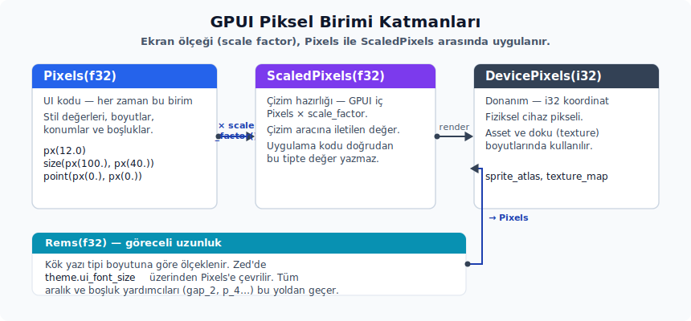

# Stil, Geometri ve Renkler

---

## Styled

`Styled`, `gpui` crate'indeki ortak stil trait'idir. `style(&mut self) -> &mut StyleRefinement` zorunlu metodunu taşır; GPUI çekirdeğinde `Div`, `Img`, `Svg`, `Canvas`, `List`, `UniformList` ve `Surface` bu trait üzerinden aynı fluent stil sözlüğünü kullanır. Zed UI bileşenlerinin çoğu da kendi style alanlarını bu trait'e bağlar.

GPUI stil sistemi CSS ve Tailwind'e benzeyen fluent metotlardan oluşur. Arka planda Rust tipleri olduğu için neyin hangi değeri aldığı daha nettir. Örnek bir stil zinciri:

```rust
div()
    .bg(rgb(0xff0000))
    .rounded_sm()
    .p_2()
    .child("Merhaba")
```

`Styled` çok geniş bir API yüzeyi üretir; her kısa yön, kenar veya ölçek yardımcısı için ayrı anlatım başlığı açmak okunabilirliği düşürür. Basit yardımcılar aşağıdaki tabloda kapsanır. Davranış farkı olan aileler ise tablodan sonra ayrıca açıklanır.

| Aile | `Styled` alt özellikleri | Kısa anlamı |
|---|---|---|
| Görünürlük ve display | `block`, `flex`, `grid`, `hidden`, `visible`, `invisible` | Elementin layout katılımını ve görünürlüğünü belirler. |
| Boyut | `w`, `h`, `size`, `min_w`, `min_h`, `min_size`, `max_w`, `max_h`, `max_size`, `w_*`, `h_*`, `size_*`, `min_w_*`, `min_h_*`, `max_w_*`, `max_h_*`, `size_full`, `h_auto` | Genişlik, yükseklik, minimum/maksimum sınır ve hazır ölçek değerlerini yazar. |
| Margin | `m`, `mx`, `my`, `mt`, `mr`, `mb`, `ml`, `m_*`, `mx_*`, `my_*`, `mt_*`, `mr_*`, `mb_*`, `ml_*`, `m_neg_*`, `mx_neg_*`, `my_neg_*`, `mt_neg_*`, `mr_neg_*`, `mb_neg_*`, `ml_neg_*` | Dış boşluk verir; x/y iki ekseni, t/r/b/l tek kenarı temsil eder. |
| Padding | `p`, `px`, `py`, `pt`, `pr`, `pb`, `pl`, `p_*`, `px_*`, `py_*`, `pt_*`, `pr_*`, `pb_*`, `pl_*` | İç boşluk verir; padding ailesinde auto ve negatif varyant yoktur. |
| Konum | `relative`, `absolute`, `inset`, `top`, `right`, `bottom`, `left`, `inset_*`, `top_*`, `right_*`, `bottom_*`, `left_*`, `inset_neg_*`, `top_neg_*`, `right_neg_*`, `bottom_neg_*`, `left_neg_*` | `absolute`/`relative` konum kipini ve dört yöndeki offset değerlerini yazar; `top` yukarıdan, `right` sağdan, `bottom` aşağıdan, `left` soldan hizalar. |
| Flex yönü ve davranışı | `flex_row`, `flex_row_reverse`, `flex_col`, `flex_col_reverse`, `flex_1`, `flex_auto`, `flex_initial`, `flex_none`, `flex_basis`, `flex_grow`, `flex_grow_0`, `flex_grow_1`, `flex_shrink`, `flex_shrink_0`, `flex_shrink_1`, `flex_wrap`, `flex_wrap_reverse`, `flex_nowrap` | Flex container yönünü, wrap davranışını ve child büyüme/küçülme kurallarını ayarlar. |
| Hizalama | `items_start`, `items_end`, `items_center`, `items_baseline`, `items_stretch`, `self_start`, `self_end`, `self_flex_start`, `self_flex_end`, `self_center`, `self_baseline`, `self_stretch`, `justify_start`, `justify_end`, `justify_center`, `justify_between`, `justify_around`, `justify_evenly`, `content_normal`, `content_start`, `content_end`, `content_center`, `content_between`, `content_around`, `content_evenly`, `content_stretch` | Flex/grid eksenlerinde child, self, main-axis ve multi-line hizalama değerlerini yazar. |
| Gap | `gap`, `gap_x`, `gap_y`, `gap_*`, `gap_x_*`, `gap_y_*` | Çocuklar arasındaki genel, yatay veya dikey aralığı belirler. |
| Kenarlık ve radius | `border`, `border_t`, `border_r`, `border_b`, `border_l`, `border_x`, `border_y`, `border_*`, `border_t_*`, `border_r_*`, `border_b_*`, `border_l_*`, `border_x_*`, `border_y_*`, `border_color`, `border_dashed`, `rounded`, `rounded_*` | Kenarlık kalınlığı, kenarlık rengi/stili ve köşe yarıçapı değerlerini ayarlar. |
| Gölge ve opaklık | `shadow`, `shadow_none`, `shadow_2xs`, `shadow_xs`, `shadow_sm`, `shadow_md`, `shadow_lg`, `shadow_xl`, `shadow_2xl`, `opacity` | Hazır gölge token'larını veya açık `BoxShadow` listesini ve element opaklığını uygular. |
| Arka plan ve metin | `bg`, `text_style`, `text_color`, `text_bg`, `text_size`, `text_xs`, `text_sm`, `text_base`, `text_lg`, `text_xl`, `text_2xl`, `text_3xl`, `text_ellipsis`, `text_ellipsis_start`, `text_overflow`, `text_align`, `text_left`, `text_center`, `text_right`, `truncate`, `line_clamp`, `font`, `font_weight`, `font_family`, `font_features`, `italic`, `not_italic`, `underline`, `line_through`, `text_decoration_none`, `text_decoration_color`, `text_decoration_solid`, `text_decoration_wavy`, `text_decoration_*`, `line_height`, `whitespace_normal`, `whitespace_nowrap` | Background, metin rengi, font, taşma, hizalama ve dekorasyon ayarlarını cascaded text style alanına yazar. |
| Cursor ve taşma | `cursor`, `cursor_*`, `cursor_default`, `cursor_pointer`, `cursor_text`, `cursor_move`, `cursor_not_allowed`, `cursor_context_menu`, `cursor_crosshair`, `cursor_vertical_text`, `cursor_alias`, `cursor_copy`, `cursor_no_drop`, `cursor_grab`, `cursor_grabbing`, `overflow_hidden`, `overflow_x_hidden`, `overflow_y_hidden`, `scrollbar_width` | Pointer görünümü, taşma kırpması ve scrollbar için ayrılacak layout alanını belirler. |
| Aspect ve grid | `aspect_ratio`, `aspect_square`, `grid_cols`, `grid_cols_min_content`, `grid_cols_max_content`, `grid_rows`, `col_start`, `col_end`, `col_span`, `col_span_full`, `row_start`, `row_end`, `row_span`, `row_span_full` | En-boy oranı ve grid template/placement değerlerini yazar; altta `GridTemplate`, `TemplateColumnMinSize` ve `GridPlacement` kullanılır. |

Yukarıdaki fluent metotların büyük çoğunluğu `Styled` trait gövdesinde tek tek yazılmaz; bir grup proc macro tarafından üretilir. `gpui` crate'inde bu makrolar tek satırda çağrılır ve `gpui_macros` crate'i her çağrı için onlarca metot üretir. Hangi makronun hangi metotları ürettiğini aşağıdaki tablodan takip edebilirsin:

| Proc macro (`gpui_macros::...!()`) | Üretilen fluent metotlar (Styled trait üyesi olarak) |
|---|---|
| `visibility_style_methods!()` | `visible()`, `invisible()` |
| `margin_style_methods!()` | `m_*` ile birlikte `mt_`, `mb_`, `my_`, `mx_`, `ml_`, `mr_` ve her birinin spacing scale + `auto` varyantları (`mt_auto()` gibi) |
| `padding_style_methods!()` | `p_*`, `pt_`, `pb_`, `py_`, `px_`, `pl_`, `pr_` (margin ailesinin padding karşılığı) |
| `position_style_methods!()` | `relative()`, `absolute()` ve konumlanmış element ofset önekleri: `inset`, `top`, `bottom`, `left`, `right` |
| `overflow_style_methods!()` | `overflow_hidden()`, `overflow_x_hidden()`, `overflow_y_hidden()` |
| `cursor_style_methods!()` | `cursor(CursorStyle)`, `cursor_default()`, `cursor_pointer()`, `cursor_text()`, `cursor_move()`, `cursor_not_allowed()`, `cursor_context_menu()`, `cursor_crosshair()`, `cursor_vertical_text()`, `cursor_alias()`, `cursor_copy()`, `cursor_no_drop()`, `cursor_grab()`, `cursor_grabbing()` ve yeniden boyutlandırma ailesi: `cursor_ew_resize()`, `cursor_ns_resize()`, `cursor_nesw_resize()`, `cursor_nwse_resize()`, `cursor_col_resize()`, `cursor_row_resize()`, `cursor_n_resize()`, `cursor_e_resize()`, `cursor_s_resize()`, `cursor_w_resize()` |
| `border_style_methods!()` | `border_color(C)` ve `border_*` genişlik önekleri (`border_*`, `border_t_*`, `border_r_*`, `border_b_*`, `border_l_*`, `border_x_*`, `border_y_*`) × sonek tablosu (`_0`, `_1`, `_2`, `_4`, `_8`, vb.) |
| `box_shadow_style_methods!()` | `shadow(Vec<BoxShadow>)`, `shadow_none()`, `shadow_2xs()`, `shadow_xs()`, `shadow_sm()`, `shadow_md()`, `shadow_lg()`, `shadow_xl()`, `shadow_2xl()` |

Bu makrolar, `gpui_macros` crate'inden genel proc macro olarak dışa aktarılır ve `gpui::{visibility_style_methods, margin_style_methods, ...}` üzerinden de yeniden dışa aktarılır. Uygulama kodunun bunları doğrudan çağırması gerekmez; fluent metotlar zaten `Styled` trait'inin parçasıdır ve her `Styled` uygulaması bu metotlara otomatik sahip olur.

Flex faktörü yazarken iki farklı kullanım vardır. Özel oran gerektiğinde `flex_grow(2.0)` veya `flex_shrink(0.5)` gibi açık faktör verirsin. Normal CSS/Tailwind karşılığı olan `flex-grow: 1` ve `flex-shrink: 1` için `flex_grow_1()` ve `flex_shrink_1()` kullanılır. Büyüme veya küçülmeyi kapatan yardımcılar `flex_grow_0()` ve `flex_shrink_0()` adlarıyla kalır; tamamen sabit davranacak öğelerde `flex_none()` büyüme, küçülme ve basis ayarını birlikte toparlar.

### BoxShadow

`BoxShadow` gölgenin içe mi dışa mı çizileceğini `inset: bool` alanıyla taşır. Hazır `shadow_sm()`, `shadow_md()` ve benzeri helper'lar drop shadow üretir; iç gölge gerektiğinde açık `BoxShadow` verirsin. `Style::paint(...)` sırası drop shadow'ları arka plan ve border'dan önce, inset shadow'ları ise elementin arka planından sonra, çocuk içeriğinden önce işler.

| Alan | Kısa anlamı |
|---|---|
| `color` | Gölge rengidir. |
| `offset` | Gölgenin X/Y kaymasıdır. |
| `blur_radius` | Gölge bulanıklığıdır. |
| `spread_radius` | Gölgenin yayılma miktarıdır. |
| `inset` | `true` ise iç gölge, `false` ise dış gölge çizer. |

```rust
let ic_golge = BoxShadow {
    color: black().opacity(0.18),
    offset: point(px(0.), px(1.)),
    blur_radius: px(4.),
    spread_radius: px(0.),
    inset: true,
};

div()
    .rounded_md()
    .bg(rgb(0xffffff))
    .shadow(vec![ic_golge])
    .child("İç gölgeli alan")
```

`Styled` trait içinde ayrıca `gpui_macros::style_helpers!()` çağrısı vardır. Bu proc macro `#[doc(hidden)]` olarak işaretlendiği ve `gpui` crate'inden yeniden dışa aktarılmadığı için `target/doc/gpui/all.html` makro listesinde görünmez. `w_*`, `h_*`, `size_*`, `min_size_*`, `min_w_*`, `min_h_*`, `max_size_*`, `max_w_*`, `max_h_*`, `gap_*`, `gap_x_*`, `gap_y_*` ve `rounded_*` aileleri bu iç makrodan gelir.

Özel bir element için `Styled` uygulandığında trait'in tüm metotları otomatik gelir; bu makroları yeniden çağırman gerekmez. Yalnızca GPUI'nın kendisi gibi yeni bir stil çatısı (`style framework`) yazarken, paralel bir `Styled` benzeri trait için bu makroları yeni trait'in içinde çağırabilirsin. `method_visibility` parametresi genel (`public`) veya `pub(crate)` ayarına izin verir.

**Pratik kararlar.** Stil zinciri kurarken faydalı olan birkaç yönlendirici:

- Görünüm veriye bağlıysa `Render` içinde koşullu `.when(...)` kullanırsın; stili sonradan emir kipinde (`imperative`) değiştirmeye çalışma.
- Scroll, klavye odağı, ipucu ve animasyon gibi kalıcı veriye sahip elementlerde id sabit olmalıdır; aksi halde veri ekran kareleri arasında kaybolur.
- Üst öğenin yerleşim genişliği belirsiz olduğunda metin taşması, görsel en-boy oranı ve `absolute` alt öğenin konumu beklenen sonucu vermeyebilir; bu yüzden üst öğenin boyutunu önceden belirgin bırakman gerekir.
- Kart, araç çubuğu veya liste gibi tekrar eden UI parçalarında boyutları `min/max/aspect_ratio` ile sabitlersin; hover ya da yükleme durumlarının yerleşimi oynatmaması tasarımın temel kuralıdır.

## Geometri Tipleri ve Birim Yönetimi

### Pixels, ScaledPixels ve DevicePixels

GPUI üç farklı piksel birimi kullanır. Ekran ölçeği değiştiğinde hangi birimin hangi katmanda kullanıldığını bilmek birçok hatayı baştan önler:



- `Pixels(f32)` — ölçekten bağımsız mantıksal piksel. UI kodunda neredeyse her zaman bu birimi kullanırsın.
- `ScaledPixels(f32)` — `Pixels * window.scale_factor()`. Çizim aracına iletilen değerdir.
- `DevicePixels(i32)` — fiziksel cihaz pikseli; asset ve doku (`texture`) boyutlarında kullanırsın.

Yardımcı yapıcıları sıklıkla bu kalıpta görünür:

```rust
let piksel = px(12.0);             // Pixels
let rem = rems(1.5);               // Rems
let nokta = point(px(10.), px(20.)); // Point<Pixels>
let boyut = size(px(100.), px(40.)); // Size<Pixels>
let sinirlar = Bounds::from_corners(point(px(0.), px(0.)), point(px(100.), px(100.)));
```

Bu helper'lar basit yapıcı olduğu için ayrı ayrı uzun anlatım gerektirmez; tabloda hangi tipi ürettikleri yeterlidir:

| Helper | Ürettiği değer | Kullanım notu |
|---|---|---|
| `px(value)` | `Pixels` | Mantıksal piksel değeri üretir. |
| `rems(value)` | `Rems` | Root font boyutuna göre ölçeklenen uzunluk üretir. |
| `relative(fraction)` | `DefiniteLength::Fraction` | Üst öğe boyutunun kesri olarak ölçü verir. |
| `percentage(value)` | `Percentage` | 0.0-1.0 aralığında yüzdelik oran taşır. |
| `radians(value)` | `Radians` | Dönüşüm ve yay çizimi için radyan değeri taşır. |
| `point(x, y)` | `Point<T>` | X/Y koordinatı üretir. |
| `size(width, height)` | `Size<T>` | Genişlik/yükseklik çifti üretir. |
| `bounds(origin, size)` | `Bounds<T>` | Origin ve size ile dikdörtgen üretir. |

### Rems, AbsoluteLength, DefiniteLength ve Length

Pixels dışındaki uzunluk tipleri farklı senaryolar için ayrılmıştır:

- `Rems(f32)` — kök yazı tipi boyutuna görelidir (Zed'de `theme.ui_font_size` ile bağlıdır). `.text_sm()` veya `.gap_2()` gibi makro üretimi yardımcılar genellikle Rems üzerinden Pixels üretir.
- `AbsoluteLength` — `Pixels` veya `Rems`.
- `DefiniteLength` — `Absolute(AbsoluteLength)` veya `Fraction(f32)`.
- `Length` — `Definite(DefiniteLength)` veya `Auto`.

| API | Alt özellikler | Kısa anlamı |
|---|---|---|
| `AbsoluteLength` | `Pixels`, `Rems`, `is_zero`, `to_pixels`, `to_rems` | Mutlak uzunluğu piksel/rem ayrımıyla taşır ve gerektiğinde dönüşüm yapar. |
| `DefiniteLength` | `Absolute`, `Fraction`, `to_pixels` | Auto olmayan, kesin veya parent oranlı uzunluk değeridir. |
| `Length` | `Definite`, `Auto` | Stil alanlarında kesin ölçü veya layout tarafından hesaplanan auto ölçüyü ayırır. |

Stil API'leri Length türünü kabul ettiği için farklı birimleri aynı zincirde karışık kullanabilirsin:

```rust
div().w(px(120.))           // Pixels
    .min_h(rems(2.))        // Rems
    .flex_basis(relative(0.5)) // Fraction
    .h_auto()
```

### Percentage, Radians, Half, IsZero, AvailableSpace ve LayoutId

Bu yardımcı tipler stil zincirinde doğrudan kullanıcıya görünmeyebilir, ama layout ve çizim hesabının ara değerlerini taşır:

| API | Ne zaman görünür |
|---|---|
| `Percentage` | Tam daire yüzdesinden `Radians` üretmek veya oranı açık tipte taşımak gerektiğinde. |
| `Radians` | `TransformationMatrix::rotate(...)`, path yayları ve SVG dönüşüm hesabında. |
| `Half` | Sayısal veya geometri değerinin yarısını generic biçimde hesaplayan trait. |
| `IsZero` | `Pixels`, `Rems`, `ScaledPixels`, `DevicePixels` gibi değerlerde sıfır kontrolünü ortaklaştırır. |
| `AvailableSpace` | Taffy layout ölçümünde kullanılabilir, kesin veya minimum/maksimum alan bilgisidir. |
| `LayoutId` | Taffy tarafındaki layout düğüm kimliğidir; normal UI kodunda kalıcı domain ID yerine kullanılmaz. |

| API | Alt özellikler | Kısa anlamı |
|---|---|---|
| `Axis` | `Vertical`, `Horizontal`, `invert` | Ana ekseni seçer ve karşı eksene geçişi sağlar. |
| `Along` | `along`, `apply_along` | Bir değeri verilen eksende okur veya yalnız o eksende dönüştürür. |
| `Half` | `half` | Değerin yarısını üretir. |
| `IsZero` | `is_zero` | Değerin sıfır olup olmadığını söyler. |
| `AvailableSpace` | `Definite`, `MinContent`, `MaxContent`, `min_size` | Layout ölçümünde kesin, min-content veya max-content alan bilgisini taşır. |

### Point, Size, Bounds, Edges ve Corners

Jenerik kapsayıcı tipleri `Point<T>`, `Size<T>`, `Bounds<T>`, `Edges<T>`, `Corners<T>`, çoğu metot için aritmetik destekler (`+`, `-`, `*`, `/`).

**Kaynaktaki doğrudan metot yüzeyi.** Geometri tipleri pek çok yardımcı metoda sahiptir; aşağıdaki liste hangi tipin hangi araçları açtığını özetler:

| Tip | Alanlar ve metot aileleri | Ne işe yarar |
|---|---|---|
| `Point<T>` | `x`, `y`, `new`, `map`, `scale`, `magnitude`, `relative_to`, `max`, `min`, `clamp` | Konum noktasını dönüştürür, ölçekler ve sınırlar. |
| `Size<T>` | `width`, `height`, `new`, `map`, `center`, `scale`, `max`, `min`, `full`, `auto`, `to_pixels`, `to_device_pixels` | Genişlik/yükseklik çiftini üretir ve dönüştürür. |
| `Bounds<T>` | `origin`, `size`, `centered`, `maximized`, `new`, `from_corners`, `from_anchor_and_size`, `centered_at`, `top_center`, `bottom_center`, `left_center`, `right_center`, `intersects`, `center`, `half_perimeter`, `dilate`, `extend`, `inset`, `space_within`, `top`, `bottom`, `left`, `right`, `top_right`, `bottom_right`, `bottom_left`, `corner`, `contains`, `is_contained_within`, `map`, `map_origin`, `map_size`, `localize`, `is_empty`, `scale`, `to_device_pixels`, `to_pixels` | Dikdörtgen alanı, köşeleri, merkezleri, kesişimi ve dönüşümleri hesaplar. |
| `Edges<T>` | `top`, `right`, `bottom`, `left`, `all`, `map`, `any`, `auto`, `zero`, `to_pixels`, `scale`, `max` | Dört kenar boşluğunu veya inset değerini taşır. |
| `Corners<T>` | `top_left`, `top_right`, `bottom_right`, `bottom_left`, `all`, `corner`, `to_pixels`, `scale`, `max`, `clamp_radii_for_quad_size`, `map` | Dört köşe yarıçapını ve köşe bazlı erişimi taşır. |
| `Pixels` | `as_f32`, `floor`, `round`, `ceil`, `scale`, `pow`, `abs`, `signum`, `to_f64` | Mantıksal piksel değerinde yuvarlama, ölçekleme ve ham değer erişimi sağlar. |
| `ScaledPixels` | `as_f32`, `floor`, `round`, `ceil` | Ölçeklenmiş piksel değerini çizim katmanına uygun yuvarlar. |
| `Rems` | `is_zero`, `to_pixels`, `half` | Rem değerini piksele çevirir ve sıfır kontrolü/yarıya bölme sağlar. |
| `DevicePixels` | `to_bytes` | Fiziksel piksel sayısından buffer byte miktarı hesaplar. |

### phi

`phi() -> DefiniteLength` (`geometry`), altın oranı `relative(1.618_034)` olarak döndürür — yani üst öğenin **1.618 katı**, %50 değil. GPUI, varsayılan `TextStyle::line_height` değeri olarak `phi()` kullanır (`style`); bir yazı tipi için satır yüksekliği `font_size * 1.618` olur. Yerleşim oranlamada (örneğin altın oranla iki sütun) üst öğenin katı olarak ifade gerekiyorsa aynı sabiti kullanabilirsin.

**Dikkat noktaları.** Geometri tarafında sıkça yapılan yanılgılar:

- `Bounds::contains(point)`, yarı açık aralıklara göre çalışır; sınır pikseli `false` dönebilir.
- `Pixels` ile `ScaledPixels` aritmetiği, `From` veya `Into` üzerinden açık dönüşüm ister; örtük çevirme yapılmaz.
- `point(x, y)` argüman sırası önce X sonra Y'dir; `size(width, height)` de aynı sırayı izler.

## Layout, Style ve Dönüşüm API Tamamlayıcıları

Stil ve geometri dosyasında geçen bazı tipler doğrudan fluent zincirde görünmez, ama özel element, canvas, popover veya renderer entegrasyonu yazarken karşına çıkar.

### AlignItems, AlignSelf, AlignContent, JustifyItems, JustifySelf ve JustifyContent

Bu hizalama tipleri fluent metotların arkasındaki ham modeldir. Uygulama kodunda çoğunlukla `.items_center()`, `.justify_between()` ve `.content_stretch()` gibi helper'ları kullanırsın; özel element veya style editor yazarken `Style` alanlarını doğrudan güncellemen gerekebilir.

| API | Alt değerler | Kısa anlamı |
|---|---|---|
| `AlignItems`, `AlignSelf`, `JustifyItems`, `JustifySelf` | `Start`, `End`, `FlexStart`, `FlexEnd`, `Center`, `Baseline`, `Stretch` | Tek satır veya tek item hizalama modelidir; self varyantları parent değerini override eder. |
| `AlignContent`, `JustifyContent` | `Start`, `End`, `FlexStart`, `FlexEnd`, `Center`, `Stretch`, `SpaceBetween`, `SpaceEvenly`, `SpaceAround` | Çok satırlı flex/grid içerik dağılımını belirler. |

### Display, FlexDirection, FlexWrap, Visibility, WhiteSpace, TextOverflow, TextAlign, Overflow, Position ve Fill

Bu enum'lar layout, görünürlük, metin taşması ve şekil dolgusu kararlarını taşır. Alt değerler kısa anlamlı olduğu için tablo başlık açmaktan daha okunaklıdır:

| API | Alt değerler | Kısa anlamı |
|---|---|---|
| `Display` | `Block`, `Flex`, `Grid`, `None` | Child layout algoritmasını seçer; `None` layout dışı bırakır. |
| `FlexDirection` | `Row`, `Column`, `RowReverse`, `ColumnReverse` | Flex ana eksenini ve akış yönünü belirler. |
| `FlexWrap` | `NoWrap`, `Wrap`, `WrapReverse` | Flex item'ların tek satırda mı kalacağını, yeni satıra nasıl taşacağını belirler. |
| `Visibility` | `Visible`, `Hidden` | Çizimi açar/kapatır; `Hidden` layout alanını korur. |
| `WhiteSpace` | `Normal`, `Nowrap` | Metnin satır kırıp kırmayacağını belirler. |
| `TextOverflow` | `Truncate`, `TruncateStart` | Sığmayan metni sondan veya baştan kısaltır. |
| `TextAlign` | `Left`, `Center`, `Right` | Metni kutu içinde sola, ortaya veya sağa hizalar. |
| `Overflow` | `Visible`, `Clip`, `Hidden`, `Scroll` | Taşan child içeriklerinin layout ve scroll davranışını belirler. |
| `Position` | `Relative`, `Absolute` | Offset'in normal layout sonucuna mı, konumlu üst öğeye mi göre uygulanacağını belirler. |
| `Fill` | `Color(Background)` | Şekil dolgusunu `Background` üzerinden taşır. |

### Style ve StyleRefinement

`Style::text_style()` aktif metin stilini türetir; `has_opaque_background()` opak zemin olup olmadığını söyler; `overflow_mask(...)` bounds ve rem boyutundan overflow kırpma maskesini üretir; `paint(bounds, window, cx, paint_child)` arka plan, border, `box_shadow` ve çocuk çizimini doğru sırada uygular. `align_items`, `align_self`, `align_content`, `justify_content` ve `flex_direction` Taffy yerleşim kararına iner; `allow_concurrent_scroll` ile `restrict_scroll_to_axis` scroll davranışını, `mouse_cursor` hover imleç stilini, `grid_location` ise grid satır/kolon yerleşimini taşır. `StyleRefinement::grid_location_mut()` grid placement alanını oluşturup döndürür; grid row/column metotları arka planda bunu kullanır. Bu metotlar style zincirinin alt katmanıdır, sıradan `div()` zincirinde elle çağırman gerekmez.

| API | Alt özellikler | Kısa anlamı |
|---|---|---|
| `Style` | `text_style`, `has_opaque_background`, `overflow_mask`, `paint` | Çözümlenmiş stilin metin, background, overflow ve paint davranışını yürütür. |
| `StyleRefinement` | `grid_location_mut`, `style` | Fluent zincirin yazdığı kısmi stil alanlarını taşır ve grid konum alanını lazy oluşturur. |

### ObjectFit

`ObjectFit::get_bounds(container, image_size)` görselin `Fill`, `Contain`, `Cover`, `ScaleDown` veya `None` davranışlarında hangi dikdörtgene yerleşeceğini hesaplar. `img(...).object_fit(...)` normal kullanım için yeterlidir. Kendi `paint_image` veya özel surface elementini yazıyorsan aynı hesaplamayı tekrar etmemek için bu metodu kullanırsın.

| Alt özellik | Kısa anlamı |
|---|---|
| `Fill` | Görseli container'a esnetir. |
| `Contain` | Görselin tamamı görünecek şekilde sığdırır. |
| `Cover` | Container'ı kaplayacak şekilde büyütür, taşan kısmı kırpılabilir. |
| `ScaleDown` | Büyük görseli sığdırır; zaten küçükse orijinal boyutu korur. |
| `None` | Görselin orijinal boyutunu korur. |
| `get_bounds` | Seçilen davranış için hedef `Bounds<Pixels>` hesaplar. |

### Axis ve Along

`Axis` ve `Along` yatay/dikey kararları generic hale getirir. `Axis::invert()` yatay ekseni dikeye, dikeyi yataya çevirir; split pane veya resize handle'da ana eksenden çapraz eksene geçerken kullanılır. `Along::Unit`, implementasyonun her eksende taşıdığı birim tipini belirtir. `Along::along(axis)` verilen eksendeki değeri okur, `Along::apply_along(axis, f)` ise yalnız o ekseni dönüştürür. `Anchor::opposite()` bir kutu referansının tam karşısını, `Anchor::other_side_along(axis)` yalnız verilen eksen boyunca karşı tarafı döndürür; `Anchor::is_center()` ise `TopCenter`, `BottomCenter`, `LeftCenter` veya `RightCenter` değerlerini ayırt eder. Scrollbar, popover, anchored element ve iki eksenli layout helper yazarken bu metotlar koordinat dallanmalarını sadeleştirir. Tek bir bileşen yalnız yatay veya yalnız dikey çalışıyorsa bu tipleri okuyucuya göstermek yerine açık `width`/`height` hesabı daha anlaşılırdır.

### GridTemplate, TemplateColumnMinSize, GridLocation ve GridPlacement

`GridTemplate` CSS'teki `repeat(<n>, minmax(_, 1fr))` benzeri grid template bilgisini taşır; `TemplateColumnMinSize` bu tekrarın minimum kolon/satır boyutunu seçer. `GridLocation` bir öğenin row/column aralığını tutar; her aralık `GridPlacement` değerlerinden oluşur.

| API | Alt değerler veya alanlar | Kısa anlamı |
|---|---|---|
| `TemplateColumnMinSize` | `Zero`, `MinContent`, `MaxContent` | Grid track minimumunun sıfır, min-content veya max-content olacağını belirler. |
| `GridTemplate` | `repeat`, `min_size` | Kaç track üretileceğini ve minimum track boyutunu taşır. |
| `GridLocation` | `row`, `column` | Öğenin grid içinde kapladığı satır ve kolon aralıklarıdır. |
| `GridPlacement` | `Line(i16)`, `Span(u16)`, `Auto` | Başlangıç/bitiş çizgisi, span miktarı veya otomatik yerleşim bilgisidir. |

### Ölçü ve layout ara yardımcıları

`MIN`, `MAX`, `ZERO`, `bounds(...)`, `union(...)` ve `Bounds::intersect(&other)` düşük seviyeli ölçüm ve yerleşim yardımcılarıdır. `Bounds::intersect` iki dikdörtgenin ortak alanını hesaplar; scroll maskesi, popover görünür alanı veya canvas kırpması üretirken kullanılır. Bunlar kalıcı domain ölçüsü değildir; Taffy veya özel çizim hesabı sırasında geçici geometri üretmek için kullanılır.

### PathBuilder ve PathStyle

`PathBuilder::fill()` ve `stroke(width)` ile başlar; `with_style(style)`, `move_to(...)`, `line_to(...)`, `curve_to(...)`, `cubic_bezier_to(...)`, `arc_to(...)`, `relative_arc_to(...)`, `add_polygon(...)`, `close()`, `dash_array(...)`, `translate(...)`, `scale(...)`, `rotate(...)`, `transform(...)` ve `build()` ile tamamlanır. `PathBuilder::with_style(...)`, hazır builder'ın `PathStyle::{Fill, Stroke}` ayarını lyon seçenekleriyle değiştirmek içindir. `PathBuilder::build_path(buf)` ise tessellator'dan gelen `VertexBuffers` değerini doğrudan `Path<Pixels>` modeline çeviren alt seviye köprüdür; normal çizimde çoğunlukla `build()` çağrısının içinden kullanılır. `PathBuilder.style` alanı `PathStyle::{Fill, Stroke}` üzerinden lyon `FillOptions` veya `StrokeOptions` taşır. Kullanıcı etkileşimi olan basit çizimlerde önce `canvas(...)` ve `window.paint_path(...)` yeterli mi diye bakarsın; her frame'de path tessellate etmek yerine mümkünse hesaplamayı cache'lersin.

| API | Alt özellikler | Kısa anlamı |
|---|---|---|
| `PathStyle` | `Fill`, `Stroke` | Tessellation'ın dolgu mu çizgi mi üreteceğini seçer. |
| `PathBuilder` | `style`, `stroke`, `fill`, `with_style`, `dash_array`, `move_to`, `line_to`, `curve_to`, `cubic_bezier_to`, `arc_to`, `relative_arc_to`, `add_polygon`, `close`, `transform`, `translate`, `scale`, `rotate`, `build` | SVG path komutlarını GPUI `Path<Pixels>` değerine dönüştürür. |

### Path, Transformation ve TransformationMatrix

`Path<Pixels>::new`, `scale`, `move_to`, `line_to`, `curve_to`, `push_triangle` ve `clipped_bounds` tessellate edilmiş path verisi üzerinde çalışır; bu seviye artık çizime yakın renderer katmanıdır. `Transformation` SVG elementi için ergonomik dönüşüm builder'ıdır; `TransformationMatrix::unit()`, `translate(...)`, `rotate(...)`, `scale(...)`, `compose(...)` ve `apply(...)` sahne primitive'lerine uygulanacak matrisi üretir. Dönüşüm görseli değiştirir, layout ve hitbox boyutunu otomatik güncellemez.

| API | Alt özellikler | Kısa anlamı |
|---|---|---|
| `Path` | `vertices`, `bounds`, `new`, `scale`, `move_to`, `line_to`, `curve_to`, `push_triangle`, `clipped_bounds` | Tessellate edilmiş çizim geometrisini taşır. |
| `Transformation` | `scale`, `rotate`, `translate`, `with_scaling`, `with_translation`, `with_rotation` | SVG dönüşüm tanımını ergonomik builder olarak taşır. |
| `TransformationMatrix` | `rotation_scale`, `translation`, `unit`, `translate`, `rotate`, `scale`, `compose`, `apply` | Sahne primitive'lerine uygulanacak matris değeridir. |

## Renkler, Gradient ve Background

### Rgba ve Hsla

GPUI renkleri iki temel tipte ifade eder:

- `Rgba { r, g, b, a }` — bileşenler 0.0 ile 1.0 arasında.
- `Hsla { h, s, l, a }` — bileşenler 0.0 ile 1.0 arasında.

Yapıcı çağrıları sıklıkla şu biçimde görünür:

```rust
let kirmizi = rgb(0xff0000);                // Rgba, alfa 1.0
let yari_saydam = rgba(0xff000080);         // 0xRRGGBBAA
let hsl_rengi = hsla(0.0, 1.0, 0.5, 1.0);   // saf kırmızı
let gri = opaque_grey(0.5, 1.0);            // gri yardımcısı
```

| Helper | Kısa anlamı |
|---|---|
| `rgb(value)` | `0xRRGGBB` biçiminden opak `Rgba` üretir. |
| `rgba(value)` | `0xRRGGBBAA` biçiminden alfa dahil `Rgba` üretir. |
| `hsla(h, s, l, a)` | Normalleştirilmiş HSLA bileşenlerinden `Hsla` üretir. |
| `opaque_grey(value, opacity)` | Eşit RGB bileşenli gri `Hsla` üretir. |
| `swap_rgba_pa_to_bgra(&mut [u8])` | Bir byte dilimini yerinde premultiplied-alpha RGBA'dan BGRA'ya dönüştürür. |

### Hazır renk sabitleri

Tümü `pub const fn ... -> Hsla` biçiminde tanımlıdır (`color`):

| Fonksiyon | HSLA değeri | Not |
|---|---|---|
| `black()` | `(0.0, 0.0, 0.0, 1.0)` | Saf siyah |
| `white()` | `(0.0, 0.0, 1.0, 1.0)` | Saf beyaz |
| `transparent_black()` | `(0.0, 0.0, 0.0, 0.0)` | Tam saydam siyah — gradient ucu olarak kullanışlı |
| `transparent_white()` | `(0.0, 0.0, 1.0, 0.0)` | Tam saydam beyaz |
| `red()` | `(0.0, 1.0, 0.5, 1.0)` | %100 doygun kırmızı |
| `blue()` | `(0.666…, 1.0, 0.5, 1.0)` | %100 doygun mavi |
| `yellow()` | `(0.166…, 1.0, 0.5, 1.0)` | %100 doygun sarı |
| `green()` | `(0.333…, 1.0, **0.25**, 1.0)` | Diğerlerinden farklı: lightness 0.25 (koyu yeşil) |

Bu sabitler Zed tasarım sisteminden bağımsızdır; tema renklerine ihtiyaç duyduğunda `cx.theme().colors()`'ı kullanırsın. Debug placeholder, GPU shader testi veya tema-bağımsız palet örnekleri gerektiğinde bu hazır sabitler iş görür. `transparent_black()` `linear_gradient` ucu olarak en yaygın kullanılan tek parça çağrıdır (örneğin fade-out maskeleri için).

**Sık kullanılan metotlar** (`color`):

| API | Alt özellikler | Kısa anlamı |
|---|---|---|
| `Rgba` | `r`, `g`, `b`, `a`, `blend` | 0.0-1.0 aralığında RGBA bileşenlerini taşır ve başka bir RGBA değerini alfa ile karıştırabilir. |
| `Hsla` | `h`, `s`, `l`, `a`, `is_transparent`, `is_opaque`, `opacity`, `alpha`, `fade_out`, `blend`, `grayscale`, `to_rgb` | Alfa, karışım, gri ton ve RGB dönüşüm işlemlerini taşır. |

### Background, ColorSpace ve LinearColorStop

Background yalnızca düz renk değildir; gradient ve desen de aynı çatı altındadır (`color`):

```rust
solid_background(rgb(0xffffff))
linear_gradient(
    derece_acisi,
    linear_color_stop(rgb(0x000000), 0.0),
    linear_color_stop(rgb(0xffffff), 1.0),
)
checkerboard(rgb(0xeeeeee), 8.0)
pattern_slash(rgb(0xff0000), 2.0, 6.0)
```

| Helper veya tip | Kısa anlamı |
|---|---|
| `solid_background(color)` | Tek renkli `Background` üretir. |
| `linear_gradient(angle, from, to)` | İki stop'lu lineer gradient `Background` üretir. |
| `linear_color_stop(color, percentage)` | `LinearColorStop` üretir; yüzde 0.0-1.0 aralığındadır. |
| `checkerboard(color, size)` | Checkerboard pattern `Background` üretir. |
| `pattern_slash(color, width, interval)` | Çapraz tarama pattern `Background` üretir. |
| `Background` | `as_solid`, `color_space`, `opacity`, `is_transparent` metotlarıyla düz renk ayrımı, renk uzayı seçimi ve alfa kontrolü yapar. |
| `ColorSpace` | Gradient interpolasyon uzayını taşır; `Srgb` ve `Oklab` değerleri vardır. |
| `LinearColorStop` | Gradient stop rengini ve yüzde konumunu taşır. |

`linear_gradient(...).color_space(ColorSpace::Oklab)` ile renk uzayını seçebilirsin; `opacity(factor)` her stop'a uygulanır. `Background::as_solid()` yalnızca düz renk background için `Some(Hsla)` döndürür; gradient veya pattern için `None` döner.

`.bg(impl Into<Background>)`, her stil fluent API'sinde mevcuttur. Düz `Hsla` da `Into<Background>` uyguladığı için `.bg(theme.colors().panel_background)` çağrısı tipik bir kullanımdır.

**Pratik notlar.** Renk ve gradient kullanırken karşılaşılan yaygın durumlar:

- Alfa 0 olan bir rengin opak arka plan üstünde sonucu yine opak görünür; bu yüzden gerçekten saydam bir alan istemiyorsan temadaki opak rengi tercih edersin.
- Gradient duraklarında (`stop`) `LinearColorStop::percentage` alanı kaynakta `0.0` ve `1.0` aralığı olarak tanımlıdır; `linear_color_stop(...)` helper'ı bu değeri ayrıca kırpmaz.
- `hsla(...)` helper'ında hue 1.0'a sarılmaz, kırpılır (`clamp`); döndürme için `hue + delta`'yı modulo 1.0 ile hesaplaman gerekir.

### HighlightStyle ve combine_highlights

`LinearColorStop` gradient stop verisidir; `linear_color_stop(...)` helper'ı genellikle doğrudan inşa etmekten daha okunaklıdır. `LinearColorStop::opacity(factor)` stop alfasını düşürür. `TextStyle::highlight(...)` bir highlight stilini çözümlenmiş metin stiline uygular; `HighlightStyle::highlight(other)` ise iki highlight stilini birleştirir. `combine_highlights(...)` aralık taşıyan birden çok vurgu katmanını birleştirir; uygulama form bileşenlerinde genellikle gerekmez.

### Colors, GlobalColors, DefaultColors ve DefaultAppearance

`Colors`, `GlobalColors`, `DefaultColors` ve `DefaultAppearance` temel GPUI paletini taşır. `Colors::light()`, `dark()`, `for_appearance(window)` ve `get_global(cx)` örnekler, testler ve framework varsayılanları için kullanışlıdır; Zed uygulama UI'ında ana kaynak yine tema sistemindeki `cx.theme().colors()` olmalıdır. `swap_rgba_pa_to_bgra(...)` bir byte dilimini yerinde premultiplied-alpha RGBA'dan BGRA'ya dönüştürür; renk seçimi veya theme override için kullanılmaz.

| API | Alt özellikler | Kısa anlamı |
|---|---|---|
| `Colors` | `text`, `selected_text`, `background`, `disabled`, `selected`, `border`, `separator`, `container`, `for_appearance`, `dark`, `light`, `get_global` | GPUI'nin tema sisteminden bağımsız varsayılan paletini taşır. |
| `GlobalColors` | `0` | `Arc<Colors>` global sarmalayıcısıdır. |
| `DefaultColors` | `default_colors` | `App` üzerinden global renk paletine erişim trait'idir. |
| `DefaultAppearance` | `Light`, `Dark` | Varsayılan GPUI renk setinin açık/koyu kipini taşır. |

## SharedString, SharedUri ve Ucuz Klonlanan Tipler

`SharedString` GPUI'nin `gpui_shared_string` re-export'udur; `SharedUri` ise `gpui` crate'inde bu string tipini sarar.

| API | Alt özellikler | Kısa anlamı |
| :-- | :-- | :-- |
| `gpui_shared_string` | crate kök reexport | `SharedString` kaynağını GPUI kök yüzeyinden erişilebilir yapar. |
| `shared_uri` | crate kök reexport | `SharedUri` tipinin modülünü GPUI kök yüzeyinden erişilebilir yapar. |

UI ağacı her çizimde yeniden oluşturulduğu için string ve URI kopyalama maliyeti hızla birikebilir. GPUI bu yükü azaltmak için `Arc` tabanlı tipler sunar:

- `SharedString` — `gpui_shared_string::SharedString` re-export'udur. Kaynakta `Arc<str>` ve `&'static str` üzerinde soyutlama olarak tanımlanır, güncel uygulaması `SmolStr` ile desteklenir. `Clone`, `Display`, `AsRef<str>` ve `From<&str>`, `From<String>`, `From<Box<str>>`, `From<Arc<str>>`, `From<Cow<'_, str>>` uygulamaları hazırdır.
- `SharedUri` — aynı stratejiyle URI tutar; `ImageSource::Resource(Resource::Uri(...))` `SharedUri` bekler.

Render içinde her seferinde `String` üretip kopyalamak yerine entity verisinde `SharedString` saklamak yaygın bir desendir:

```rust
struct Baslik { baslik: SharedString }

impl Baslik {
    fn basligi_ayarla(&mut self, baslik: impl Into<SharedString>, cx: &mut Context<Self>) {
        self.baslik = baslik.into();
        cx.notify();
    }
}

impl Render for Baslik {
    fn render(&mut self, _: &mut Window, _: &mut Context<Self>) -> impl IntoElement {
        div().child(self.baslik.clone())
    }
}
```

**İlgili ucuz klon tipleri.** Aynı maliyet hassasiyetiyle hazırlanmış birkaç tip daha vardır:

- `Arc<str>`, `Arc<Path>`, `Arc<[T]>` — GPUI sıkça `Arc` tabanlı dilim ve dosya yolu bekler.
- `Hsla` ve `Rgba` — `Copy` tipler oldukları için doğrudan değer geçirilir.
- `ElementId` — `Clone`'dur ve içinde iç ID veya metin varyantları taşır.

**Dikkat noktaları.** Ucuz klon tiplerinden faydalanırken atlanması kolay noktalar:

- `SharedString::from(String)` dönüşümü kaynakta `SmolStr::from(text)` üzerinden yapılır; kısa ve uzun metinlerde depolama ayrıntısını bu tip belirler. Sık çalışan yollarda tekrar tekrar yeni `String` üretmekten kaçınman gerekir.
- `to_string()` çağrısı yeni bir `String` bellek ayırması üretir; gerekmiyorsa `as_ref()` veya `Display` üzerinden yazmak daha ekonomiktir.
- Biçim metni (`format string`) her çizimde çalışıyorsa `format!` sonucu da her ekran karesinde bellek ayırması üretir; sonucu önbelleğe almak için entity verisinde tutman gerekir.

## WindowAppearance ve Tema Modu

`gpui` crate'inde tanımlıdır:

```rust
pub enum WindowAppearance {
    Light,        // macOS: aqua
    VibrantLight, // macOS: NSAppearanceNameVibrantLight
    Dark,         // macOS: darkAqua
    VibrantDark,  // macOS: NSAppearanceNameVibrantDark
}
```

`Vibrant` varyantları, macOS `NSAppearance` değerleriyle doğrudan eşleşir. Diğer platformlar bu enum'u yine taşır; ancak `vibrancy`'nin gerçek etkisi platform uygulamasına bağlıdır. Sistem açık veya koyu kipi tercih ettiğinde GPUI bunu platform görünümü olarak yansıtır; kullanıcı elle tema üzerine yazmadığı sürece Zed teması bu sinyali takip eder.

**Erişim.** Tema kipini okumak ve değişimini izlemek için birkaç yol vardır:

- `cx.window_appearance() -> WindowAppearance` — uygulama geneli platform tercihi.
- `window.appearance() -> WindowAppearance` — pencerenin gerçek görünümü (üst öğe üzerine yazabilir).
- `window.observe_window_appearance(|window, cx| ...)` — entity verisine gerek olmayan doğrudan pencere gözlemcisi.
- `cx.observe_window_appearance(window, |gorunum, window, cx| ...)` — `Context<T>` içinden değişimi view verisi ile birlikte izler.
- `window.observe_button_layout_changed(...)` ve `cx.observe_button_layout_changed(window, ...)` — platform pencere kontrol butonu düzeni değiştiğinde çalışır.

Zed örüntüsü `workspace` crate'inde tema seçimine şu şekilde bağlanır:

```rust
cx.observe_window_appearance(window, |_, window, cx| {
    let gorunum = window.appearance();
    *SystemAppearance::global_mut(cx) = SystemAppearance(gorunum.into());
    theme_settings::reload_theme(cx);
    theme_settings::reload_icon_theme(cx);
}).detach();
```

**Dikkat noktaları.** WindowAppearance ile çalışırken dikkat edeceğin noktalar:

- macOS dışında `VibrantLight` ve `VibrantDark` değerleri üretilmez; ancak eşleştirme tablolarında yine de dört değerin tamamını ele alman gerekir.
- `observe_window_appearance` akışı Zed'de sistem görünümünü günceller ve tema/icon tema yeniden yüklemesi yapar; pencere arka planı için `zed/src/main.rs` içindeki `SettingsStore` observer'ı `window.set_background_appearance(cx.theme().window_background_appearance())` çağrısını ayrıca uygular.
- `WindowBackgroundAppearance::Blurred` platforma özgü bir arka plan davranışıdır. macOS uygulaması eski sürümlerde `CGSSetWindowBackgroundBlurRadius`, yeni sürümlerde `NSVisualEffectView` kullanır; bu davranışı `Vibrant*` varyantlarıyla aynı şey gibi düşünmemen gerekir.

---
