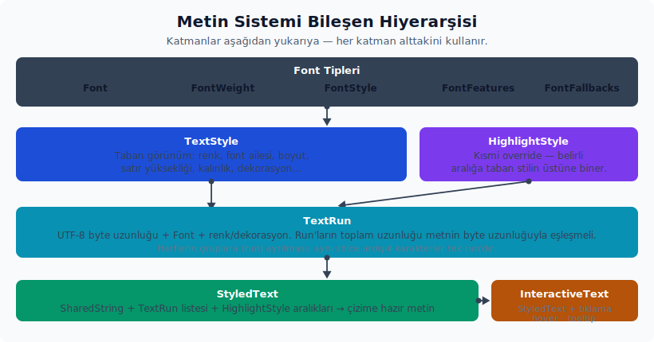

# Metin Sistemi

---

## Metin, Font ve Ölçüm

Metin sisteminin ana tipleri `gpui` crate'i, `style` ve `elements/text` içinde toplanır. Bir metni doğru çizebilmek için stil, font ve ölçüm tipleri birlikte çalışır. Her birinin sorumluluğu ayrıdır:



- `TextStyle` — renk, font ailesi, font boyutu, satır yüksekliği, kalınlık/stil, dekorasyon, boşluk, taşma, hizalama ve satır kısıtlaması gibi metin genelindeki görünüm parametrelerini taşır.
- `HighlightStyle` — belirli aralıklara uygulayacağın kısmi (`partial`) stildir; taban stilin üstüne biner.
- `TextRun` — UTF-8 byte uzunluğu, font ve renk/dekorasyon bilgisini taşır. Run'ların toplam uzunluğu metnin byte uzunluğunu tam olarak karşılamak zorundadır.
- `StyledText` — `SharedString` ile birlikte run, vurgu ve font üzerine yazmalarını birleştirerek çizilir.
- `InteractiveText` — karakter veya aralık bazlı tıklama, hover ve tooltip davranışı sağlar.
- `Font`, `FontWeight`, `FontStyle`, `FontFeatures`, `FontFallbacks` — font seçimi ve özelliklerini tanımlayan yardımcı tiplerdir.

| API | Alt özellikler | Kısa anlamı |
| :-- | :-- | :-- |
| `TextRun` | `len`, font/stil/vurgu alanları | Styled text içinde belirli byte aralığının font ve görsel vurgu bilgisini taşır; toplam run uzunluğu metin byte uzunluğuyla tutarlı olmalıdır. |

Pratikte stil ve vurgu birleşimi şu kalıpta görünür:

```rust
let metin = StyledText::new("Hata: eksik alan")
    .with_highlights([(0..5, HighlightStyle {
        color: Some(rgb(0xff0000).into()),
        font_weight: Some(FontWeight::BOLD),
        ..Default::default()
    })]);

div()
    .text_size(rems(0.875))
    .font_family(".SystemUIFont")
    .line_height(relative(1.4))
    .child(metin)
```

**Metin ölçümü ve yerleşim.** Metnin ne kadar yer kapladığını ve aktif stil değerini aşağıdaki noktalardan okursun:

- `window.text_style()` — o anda kalıtılan (`inherited`) aktif metin stilini verir.
- `window.text_system()` — pencereye bağlı `WindowTextSystem` örneği.
- `App::text_system()` — global text system'a erişimi sağlar.
- `TextStyle::to_run(len)` — kalıtılan stilden run üretir.
- `TextStyle::line_height_in_pixels(rem_size)` — line-height değerini piksele çevirir.
- `window.line_height()` — aktif metin stiline göre satır yüksekliğini döndürür.

**TextSystem ölçüm yüzeyi.** `TextSystem` platform metin sistemi ve font önbelleklerinin sahibidir. `TextSystem::new(platform_text_system)` platform uyarlaması veya test kurulumu içindir; uygulama kodunda mevcut sistemi `App::text_system()` ya da `Window::text_system()` üzerinden alırsın. Okuma ve ölçüm metotları şu şekilde gruplanır:

- Font keşfi ve çözme: `all_font_names()`, `add_fonts(...)`, `resolve_font(...)`, `get_font_for_id(...)`.
- Glif ve satır ölçümü: `bounding_box(...)`, `typographic_bounds(...)`, `advance(...)`, `layout_width(...)`.
- Em/ch ölçüleri: `em_width(...)`, `em_advance(...)`, `ch_width(...)`, `ch_advance(...)`.
- Font metrikleri: `units_per_em(...)`, `cap_height(...)`, `x_height(...)`, `ascent(...)`, `descent(...)`, `baseline_offset(...)`.
- Sarma altyapısı: `line_wrapper(...)`, aynı font/size için `LineWrapper` havuzundan uygun sarmalayıcıyı verir.

Bu metotlar özel editör, ölçüm önbelleği veya metin renderer'ı yazarken değerlidir. Sıradan etiket ve paragraflarda `div().child(...)`, `StyledText`, `InteractiveText` ve fluent text style metotları daha doğru seviyedir.

**WindowTextSystem.** Pencereye bağlı sistem `shape_line(...)`, `shape_line_by_hash(...)`, `shape_text(...)`, `layout_line(...)`, `try_layout_line_by_hash(...)`, `layout_line_by_hash(...)`, `layout_width(...)` ve `em_layout_width(...)` metotlarıyla şekillendirme ve layout cache'ini birlikte yönetir. Hash'li varyantlar aynı metin/stil girdisini tekrar ölçerken cache kullanır. Metin ölçümü ekran karesine ve pencerenin font/scale durumuna bağlıysa `WindowTextSystem`'ı tercih edersin; uygulama geneli font keşfinde `TextSystem` yeterlidir.

**Font, fallback ve feature yardımcıları.** `Font` public modelinde `family` birincil aile adını, `features` OpenType feature set'ini, `fallbacks` kullanıcı yedek zincirini, `style` ve `weight` ise varyant seçimini taşır. `Font::bold()` ve `Font::italic()` mevcut font modeline kalın veya italik varyantı uygular. `FontFallbacks::from_fonts(...)` kullanıcı yedek zinciri üretir, `fallback_list()` zinciri okur. `FontFeatures::disable_ligatures()`, `tag_value_list()` ve `is_calt_enabled()` OpenType feature listesini yönetir; kod editörü gibi ligature davranışını bilinçli kontrol eden yüzeylerde kullanılır. Basit UI metninde bu ayarları elle kurmak yerine tema/font ayarlarına güvenirsin.

**Başarım ipucu: `SharedString`.** GPUI metin taşıyan birçok API'de `SharedString` kullanır; bu tip `gpui_shared_string` crate'inden yeniden dışa aktarılır ve güncel kaynakta `SmolStr` ile desteklenen ucuz klonlanabilir bir metin taşıyıcısıdır. Bir bileşen aynı etiketi birden fazla render'da veya alt bileşene aktarırken yeni `String` üretmek yerine `SharedString`'i klonlarsın. Bu yüzden bileşen alanlarını genellikle `SharedString` tutarsın ve çağıran tarafta `"Kaydet".into()` yazarsın:

```rust
struct EtiketGorunumu {
    metin: SharedString,
}

impl EtiketGorunumu {
    fn metni_guncelle(&mut self, yeni_metin: impl Into<SharedString>, cx: &mut Context<Self>) {
        self.metin = yeni_metin.into();
        cx.notify(); // Değişikliği ekrana yansıtmak için
    }
}

impl Render for EtiketGorunumu {
    fn render(&mut self, _window: &mut Window, _cx: &mut Context<Self>) -> impl IntoElement {
        div().child(self.metin.clone())
    }
}
```

Buradaki `.into()` yalnız okunabilirlik kısaltması değildir; `&'static str`, `String` veya mevcut `SharedString` değerini aynı alana kabul etmeyi sağlar. Statik metinlerde doğrudan string literal vermek yeterlidir, ancak view alanında saklanan veya sık aktarılan metinlerde `SharedString` tercih etmek gereksiz kopyaları azaltır.

**Dikkat noktaları.** Metin sisteminde dikkat edeceğin birkaç önemli nokta:

- Vurgu ve font override aralıkları byte aralığıdır; UTF-8 karakter sınırlarına oturtman gerekir. `with_highlights(...)` ve `with_font_family_overrides(...)` yanlış sınırları debug derlemelerde `debug_assert!` ile yakalar; `with_runs(...)` ise run uzunlukları metni tam tüketmezse `panic` üretir. Çok dilli metinde aralıkları karakter veya grapheme hesabından byte sınırına bilinçli çevirirsin.
- `SharedString` kopyalama maliyetini azaltır; çizim alt öğelerinde `String` yerine bu tipi tercih edersin.
- `text_ellipsis`, `line_clamp` ve `white_space` gibi taşma davranışları yerleşim genişliğine bağlıdır; üst öğenin genişliği belirsizse kırpma beklenen biçimde çalışmaz.
- Sondan üç nokta ile kırpma yapılırken kırpılan parçanın sonundaki boşluk ve ASCII noktalama temizlenir; `"başlık -…"` yerine daha temiz `"başlık…"` çıktısı üretir. Başlangıçtan kırpma davranışı ayrı `TruncateFrom::Start` yoludur.
- `line_clamp` ile `wrap_width` ikisi birlikte ayarlıysa `LineWrapper::truncate_wrapped_line` devreye girer. Bu yöntem kırpma noktasını kelime sınırı sarımını da hesaba katarak belirler: satırları tek geçişte yürürken hem sarım sınırlarını hem kırpma noktasını paralel izler ve son satır taşmadan hemen önce sözcük sınırında keser; yani kırpmayı `width × satır_sayısı` gibi düz bir satır bütçesiyle değil, gerçek görsel sarımla hizalar. `max_lines == 1` veya `TruncateFrom::Start` durumlarında yöntem `truncate_line`'a düşer.
- Uygulamanın genel metin çizim kipini `cx.set_text_rendering_mode(...)` ile `PlatformDefault`, `Subpixel` ve `Grayscale` arasında seçersin. Subpixel akışında her glif için yatayda `gpui::SUBPIXEL_VARIANTS_X: u8 = 4`, dikeyde `gpui::SUBPIXEL_VARIANTS_Y: u8 = 1` farklı varyant rasterize edilir (`text_system`); başka bir deyişle glif atlası boyutu yatay subpixel konumuna duyarlıdır, dikey konumda değildir.
- WGPU/Linux metin arka ucu (`CosmicTextSystem`) `Font.fallbacks` değerini font önbellek anahtarına dahil eder ve `layout_line` içinde kullanıcı yedek zincirini grapheme cluster sınırlarını koruyarak uygular. ASCII karakterlerinde birincil font tercih edilir; combining mark ve ZWJ emoji cluster'ları yedek aralığının içinde bölünmez. Özel font yedek ayarı incelenirken yalnızca aile adını değil yedek listesini de önbellek/ölçüm girdisi sayman gerekir.

## StyledText, TextLayout ve InteractiveText

Basit bir metni doğrudan `SharedString` olarak bir elementin alt öğesi şeklinde verebilirsin. Ölçüm, vurgu, font üzerine yazma veya tıklanabilir aralık gerektiğinde `StyledText` devreye girer. Tıklama ve hover gerekiyorsa `InteractiveText`'i kullanırsın.

**`StyledText` kullanımı.** Vurgu ve font üzerine yazmalarını fluent zincire eklersin:

```rust
let metin = StyledText::new("Ayarları aç")
    .with_highlights(vec![(0..9, vurgu_stili)])
    .with_font_family_overrides(vec![(0..13, "ZedMono".into())]);

let yerlesim = metin.layout().clone();
```

Önceden hesaplanmış `TextRun` listesi varsa vurguyu gecikmeli (`delayed`) uygulamak yerine `.with_runs(runs)` çağrısı yaparsın. `with_default_highlights(&default_style, ranges)` ise üst öğe stili yerine açık bir `TextStyle`'ı baz alarak run üretir.

**Ölçüm sonrası `TextLayout`.** Yerleşim veya prepaint tamamlandıktan sonra elde edilen yerleşim nesnesi metin koordinatları üzerinde sorgu yapmana izin verir:

- `index_for_position(point) -> Result<usize, usize>` — piksel konumundan UTF-8 byte index'i.
- `position_for_index(index) -> Option<Point<Pixels>>` — byte index'ten piksel koordinatı.
- `line_layout_for_index(index)`, `bounds()`, `line_height()`, `len()`, `text()`, `wrapped_text()`.

`TextLayout` değerleri yerleşim veya prepaint tamamlanmadan okunursa panic üretebilir. Bu yüzden ölçüm sonuçlarına ihtiyaç duyan kod olay işleyici ya da yerleşim sonrası akışta çalışır. Çizim sırasında henüz ölçülmemiş bir yerleşim nesnesine güvenme.

**Satır ve sarma alt tipleri.** Metin alt katmanındaki taşıyıcıları şu ayrımla okursun:

- `FontId`, `FontFamilyId`, `GlyphId`, `RenderGlyphParams` ve `GlyphRasterData` glif rasterleme kimlikleri ve parametreleridir; uygulama state'i olarak saklamazsın.
- `FontMetrics` `ascent()`, `descent()`, `line_gap()`, `underline_position()`, `underline_thickness()`, `cap_height()`, `x_height()` ve `bounding_box()` ile fontun ölçü bilgisini verir.
- `ShapedLine` `len()`, `width()`, `with_len(...)`, `paint(...)`, `paint_background(...)` ve `split_at(...)` ile şekillendirilmiş tek satırı yönetir.
- `WrappedLine` `len()`, `paint(...)` ve `paint_background(...)` ile sarılmış satır çıktısını çizer.
- `LineLayout` `index_for_x(...)`, `closest_index_for_x(...)`, `x_for_index(...)` ve `font_id_for_index(...)` ile tek satırda piksel/byte index dönüşümü yapar.
- `WrappedLineLayout` `len()`, `width()`, `size()`, `ascent()`, `descent()`, `wrap_boundaries()`, `font_size()`, `runs()`, `index_for_position(...)`, `closest_index_for_position(...)` ve `position_for_index(...)` ile çok satırlı yerleşimi sorgular.
- `LineWrapper` `wrap_line(...)`, `should_truncate_line(...)` ve `truncate_line(...)` ile sarma ve kırpma kararını verir. `LineWrapper::MAX_INDENT` satır sarmada uygulanabilecek girintiyi 256 ile sınırlar; kullanıcıdan gelen veya markdown/code block'tan türeyen aşırı girintiler layout hesabını patlatmasın diye bu sınırı altyapı uygular.

`LineLayoutCache` aynı satır yerleşimlerini frame içinde tekrar kullanır; `reuse_layouts(...)`, `truncate_layouts(...)`, `finish_frame(...)`, `layout_index(...)`, `layout_wrapped_line(...)`, `try_layout_line_by_hash(...)` ve `layout_line_by_hash(...)` özel metin renderer'ı veya editör gibi yüksek hacimli ölçüm yapan kodlar içindir. Sıradan bileşenlerde cache'i elle yönetmezsin.

**Unicode sınırları.** `LineFragment`, `Boundary`, `WrapBoundary`, `WrapBoundaryCandidate::len_utf8()`, `ShapedRun`, `ShapedGlyph`, `FontRun` ve `DecorationRun` metnin Unicode ve font run parçalarını taşır. Bu tipleri gördüğünde aralıkların byte, UTF-16 veya grapheme sınırı mı istediğini kontrol edersin; string'i doğrudan byte dilimlemek çok dilli metinde hatalı sonuç verir.

**`InteractiveText`.** Tıklama, hover ve tooltip ekleyen sarmalayıcıdır:

```rust
InteractiveText::new("ayarlar-baglantisi", StyledText::new("Ayarları aç"))
    .on_click(vec![0..13], |_aralik_sirasi, window, cx| {
        window.dispatch_action(AyarlariAc.boxed_clone(), cx);
    })
    .on_hover(|sira, olay, window, cx| {
        ustune_gelmeyi_guncelle(sira, olay, window, cx);
    })
    .tooltip(|sira, window, cx| ipucu_olustur(sira, window, cx))
```

Aralıklar yine byte index aralıklarıdır; Unicode metinde karakter sınırlarını yanlış hesaplamak hover ve tıklama eşleşmesini bozar. `on_click` yalnızca mouse down ile mouse up aynı verilen aralık içinde kaldığında dinleyiciyi tetikler. Yani bir aralıkta basıp başka bir aralıkta bırakmak tıklama sayılmaz.

**Markdown çizim davranışı.** Markdown ekosistemi metin sisteminin üzerine özel davranışlar bindirir; bunları bilmek sürpriz davranışları azaltır:

- Markdown görsel çizimi `StyledImage::with_fallback` kullanarak yüklenemeyen görsel için tıklanabilir bir `"Failed to Load: ..."` yedeği üretir. Yedek etiketi önce alt metin değerini, yoksa hedef URL'yi kullanır; tıklama ile `cx.open_url` çağrılır.
- Mermaid kod blokları yalnızca kapalı fenced block biçimindeyse diyagram olarak çıkarılır. ` ```mermaid` etiketinin yanı sıra `.mermaid` veya `.mmd` uzantılı kaynak yolu işaret edilen bloklar da diyagram olarak sayılır.
- Mermaid diyagram arayüzü önizleme ve kod sekmelerini, ayrıca kopyalama butonunu gösterebilir; çizim başarısızsa veya henüz tamamlanmadıysa kaynak kodu görünümü yedek olarak çizilir.

**Markdown çiziminin ek yüzeyleri.**

`CodeBlockRenderer::Default`, kod bloğunun kopyalama ve sarım düğmelerinin görünürlüğünü iki ayrı alanla yönetir:

```rust
CodeBlockRenderer::Default {
    copy_button_visibility: CopyButtonVisibility::VisibleOnHover,
    wrap_button_visibility: WrapButtonVisibility::Hidden,
    border: false,
}
```

`WrapButtonVisibility` üç değer alır: `Hidden` (sarım düğmesi hiç gösterilmez), `AlwaysVisible`, `VisibleOnHover`. Kullanıcı sarım düğmesine tıklayınca `Markdown` yapısının `wrapped_code_blocks` kümesi değişir ve kod bloğu yatay kaydırma yerine sözcük sarımına geçer. `WrapButtonVisibility::Hidden` olmayan tüm durumlarda düğme satırı kopyalama düğmesiyle aynı `h_flex` konteynerini paylaşır; oluşturulan düğmelerden herhangi birinin görünürlük kuralı `AlwaysVisible` ise satır hover beklemeden görünür, `Hidden` olan düğme yine oluşturulmaz.

`CodeBlockRenderer::Default` alanlarının tümü zorunludur; yapıyı kurarken `copy_button_visibility`, `wrap_button_visibility` ve `border`'ı birlikte verirsin.

`on_code_span_link` ile satır içi kod yaylarına bağlantı ekleyebilirsin:

```rust
MarkdownElement::new(markdown, style)
    .on_code_span_link(|metin, _cx| {
        if metin.starts_with("fn ") {
            Some(format!("docs://api/{metin}").into())
        } else {
            None
        }
    })
```

`CodeSpanLinkCallback = Arc<dyn Fn(&str, &App) -> Option<SharedString>>` döndürürse bağlantı stili uygulanır; `None` döndürürse normal kod stili kullanılır. Geri çağrı yalnızca kod bloğunun dışında, bağlantı içinde olmayan ve `MarkdownStyle.prevent_mouse_interaction` kapalı olan durumlarda çalışır.

Shift+tıklama seçimi genişletir: mevcut seçimin kuyruğunu sabit tutar ve tıklama noktasına kadar aralığı uzatır. Shift'siz tıklama ise imleci tek bir konuma taşır.

`Markdown::first_code_block_language()` belgedeki ilk fenced kod bloğunun dilini `Option<Arc<Language>>` olarak döndürür; böyle bir blok yoksa `None` döner. Özellikle içeriği bir dil sunucusuna yönlendirecek veya sözdizim vurgusu uygulayacak kod için hangi dilin aktif olduğunu hızlıca öğrenirken kullanılır.

---
