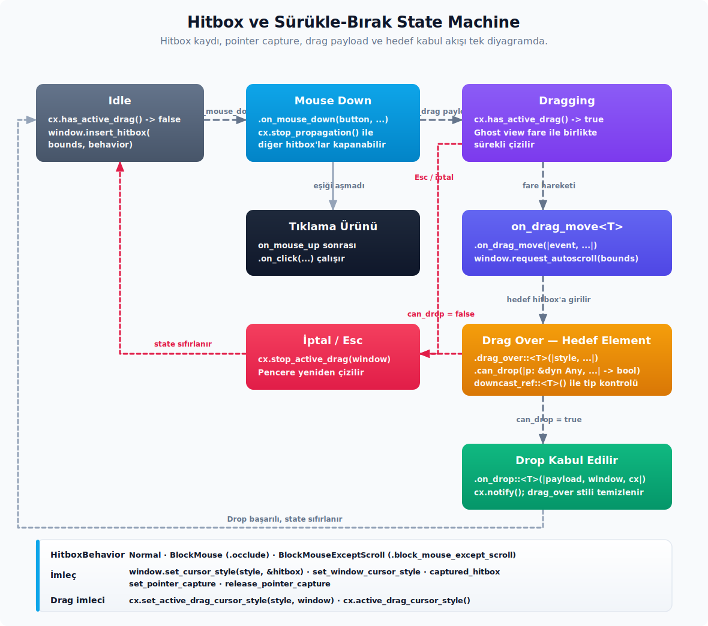

# Etkileşim ve Olaylar

---

## Klavye Odağı, Odak Kaybı ve Klavye Olayları

Klavye odağı GPUI'de `FocusHandle` ile temsil edilir. Bir view'un odak alıp verebilmesi için kendine ait bir handle tutması ve çizim sırasında bu handle'ı elemente bağlaması gerekir.

```rust
struct Gorunum {
    odak_tutamagi: FocusHandle,
}

impl Gorunum {
    fn new(cx: &mut Context<Self>) -> Self {
        Self {
            odak_tutamagi: cx.focus_handle(),
        }
    }
}
```

Çizim zincirinde handle elemente bağlanır; isteğe bağlı olarak `focus-visible` stili eklenebilir:

```rust
div()
    .track_focus(&self.odak_tutamagi)
    .focus_visible(|stil| stil.border_color(cx.theme().colors().border_focused))
```

Programatik olarak odak atamak için handle'ın kendisi veya `cx.focus_view` çağrısı kullanılabilir:

```rust
self.odak_tutamagi.focus(window, cx);
// veya
cx.focus_view(&alt_varlik, window);
```

**Odak sorguları.** Mevcut odak durumunu kontrol etmek için üç temel soru ve üç karşılık gelen metot vardır:

- `focus_handle.is_focused(window)` — handle doğrudan odakta mı?
- `focus_handle.contains_focused(window, cx)` — bu handle veya altındaki bir düğüm odakta mı?
- `focus_handle.within_focused(window, cx)` — bu handle odakta olan düğümün içinde mi?

**Odak olayları.** Odakla ilgili değişimleri dinlemek için ayrı abonelik metotları mevcuttur:

- `cx.on_focus(handle, window, ...)` — handle doğrudan odak aldı.
- `cx.on_focus_in(handle, window, ...)` — handle veya bir alt öğe odak aldı.
- `cx.on_blur(handle, window, ...)` — handle odak kaybetti.
- `cx.on_focus_out(tutamac, window, |gorunum, olay, window, cx| ...)` — handle veya bir alt öğe odak dışına çıktı; geri çağrı view verisini alır ve `FocusOutEvent` içinden odağı kaybeden handle'a (`olay.blurred`) erişilebilir.
- `window.on_focus_out(tutamac, cx, |olay, window, cx| ...)` — aynı olayın view verisi almayan, daha düşük seviyeli `Window` varyantıdır; sonucu `Subscription` olarak döner.
- `cx.on_focus_lost(window, ...)` — pencere içinde hiçbir handle odakta kalmadığında çalışır.

Bu aboneliklerin arkasındaki pencere odak olayı, önceki ve mevcut focus path'lerini karşılaştırır. Bir parent focus handle altındaki çocuk odağa geçerken `on_focus_in`, yalnız path'e yeni giren handle için; `on_focus_out` ise path'ten çıkan handle için çalışır. Modal, form grubu veya iç içe yerleştirilmiş (nested) picker gibi alt odak ağacı barındıran bileşenlerde, bu aboneliklerin doğrudan eşitlik kontrolüne tercih edilmesi önerilir.

**Klavye action akışı.** Tuşların action yapılarına bağlanması birkaç adımdan oluşur ve bu adımlar her özel kısayol için takip edilir:

1. `actions!(namespace, [ActionA, ActionB])` makrosu veya `#[derive(Action)]` + `#[action(...)]` öznitelikleriyle action tanımı gerçekleştirilir.
2. Element ağacında `.key_context("context-name")` belirtilerek action'ın yalnızca uygun bağlamda (context) yönlendirilmesi sağlanır.
3. `cx.bind_keys([KeyBinding::new("cmd-k", ActionA, Some("context-name"))])` çağrısıyla kısayol sisteme kaydedilir.
4. Dinleme işlemi için `.on_action(...)`, `.capture_action(...)` veya `cx.on_action(...)` metotlarından yararlanılır.

**Olay yayılımı.** GPUI olay yayılımı varsayılan olarak yukarı doğru ilerler. İki yardımcı bu davranışı kontrol eder:

- Fare ve tuş olay dinleyicileri olayı varsayılan olarak yukarıya iletir.
- `cx.stop_propagation()`, arkadaki veya üstteki dinleyicilere olayın ulaşmasını keser.
- Action `bubble` aşamasında dinleyiciler varsayılan olarak yayılımı durdurur; ihtiyaç halinde `cx.propagate()` çağrısıyla yayılıma devam edilebilir.

## Fare, Sürükle-Bırak ve Hitbox



Element seviyesindeki etkileşim API'leri tek bir akıcı (fluent) zincir içinde toplanır; doğru metodu seçmek için öncelikle etkileşimin hangi sınıfa girdiğini belirlemek gerekir:

- **Tıklama ve temel fare hareketi:** `.on_click(...)`, mouse down/up aynı hedefte eşleştiğinde `ClickEvent` üretir; buton gibi komut yüzeylerinde bu metot tercih edilir. `.on_mouse_down(...)`, `.on_mouse_up(...)` ve `.on_mouse_move(...)` doğrudan fare olaylarını dinler; sürükleme başlatma, özel basılı durum veya anlık imleç takibi gerektiğinde bu metotlar seçilmelidir. Bu noktada önemli bir ayrım mevcuttur: `.on_click(...)`, `.on_drag(...)` ve `.on_hover(...)` `.id(...)` verilmiş bir elementte (yani `StatefulInteractiveElement`) bulunur; `.on_mouse_down(...)`, `.on_mouse_up(...)`, `.on_mouse_move(...)` ile bırakma ailesi (`.drag_over(...)`, `.can_drop(...)`, `.on_drop(...)`) ise id'si bulunmayan `InteractiveElement` üzerindedir.
- **Dışarı tıklama/kapatma akışı:** `.on_mouse_down_out(...)` ve `.on_mouse_up_out(...)`, fare olayı element hitbox'ının dışında gerçekleştiğinde capture aşamasında çalışır. Popover, menü veya modal dışına tıklanıldığında `DismissEvent` yaymak amacıyla bu metot ailesinden yararlanılır.
- **Kaydırma ve gesture:** `.on_scroll_wheel(...)`, hitbox kaydırma alabiliyorsa scroll olayını dinler; düz hover kontrolünden daha güvenilirdir. `.on_pinch(...)`, trackpad pinch gibi yakınlaştırma gesture'larını yakalar.
- **Sürükleme ve bırakma:** `.on_drag_move::<T>(...)`, sürükleme element sınırının dışına çıksa dahi aynı tipteki aktif drag boyunca hareket bilgisi sağlar; bu durum yeniden boyutlandırma (resize) veya split handle gibi klasik drop içermeyen sürükleme senaryolarında tercih edilir. `.drag_over::<T>(...)` kabul edilebilir sürükleme hedefi üstündeyken geçici stil üretir; `.can_drop(...)` hedefin bırakmayı kabul edip etmeyeceğini belirler; `.on_drop::<T>(...)` başarılı bırakma tamamlandığında tetiklenir.
- **Arkayı engelleme ve imleç:** `.occlude()` arkadaki fare etkileşimlerini kapatır; scroll'un arkaya geçmesi gereken üst katmanlarda `.block_mouse_except_scroll()` daha doğru bir seçimdir. `.cursor_pointer()` hazır işaretçi stilini sağlar; `.cursor(...)` ise özel `CursorStyle` gereksinimlerinde tercih edilir.

Pencere kontrol alanı (hitbox) tanımlanmak istendiğinde akıcı (fluent) API üzerinden belirleme yapılır:

```rust
h_flex()
    .window_control_area(WindowControlArea::Drag)
```

Özel yeniden boyutlandırma ve imleç davranışı için `canvas` ile hitbox eklemek, Zed'deki istemci tarafı pencere süslemesi (`client decoration`) deseninin tipik bir örneğidir:

```rust
canvas(
    |sinirlar, window, _cx| {
        window.insert_hitbox(sinirlar, HitboxBehavior::Normal)
    },
    |_sinirlar, isabet_kutusu, window, _cx| {
        window.set_cursor_style(CursorStyle::ResizeLeftRight, &isabet_kutusu);
    },
)
```

Burada `canvas` imzası `prepaint: FnOnce(Bounds<Pixels>, &mut Window, &mut App) -> T` ve `paint: FnOnce(Bounds<Pixels>, T, &mut Window, &mut App)` şeklindedir. İkinci closure'da ilk pozisyonel argüman `bounds`'tur (kullanılmıyorsa `_bounds`), ikinci argüman ise prepaint'in döndürdüğü değerdir (örnekteki `hitbox`). `set_cursor_style` hitbox'a referans aldığı için `&hitbox` şeklinde geçirilmelidir.

## Olay Tipleri ve PlatformInput Modeli

Element listener'ları çoğu zaman olay tipini kendisi seçer; yine de özel element, test olayı veya platform input çevirimi yazarken GPUI olay ailesini bilmek faydalıdır.

**Trait sınıfları.** `InputEvent`, `KeyEvent`, `MouseEvent` ve `GestureEvent` olayların ortak davranışlarını ayırır. Klavye olayları `to_platform_input()` ile `PlatformInput` değerine dönüşebilir; fare ve gesture olayları da platformdan gelen ham girdiyi GPUI dispatch ağacına taşıyan aynı modelin parçasıdır. Uygulama kodunda bu trait'leri doğrudan implement etmek yerine `.on_key_down(...)`, `.on_mouse_down(...)`, `.on_scroll_wheel(...)` gibi element metotlarının kullanılması gerekir.

**Klavye olayları.** `KeyDownEvent`, `KeyUpEvent`, `ModifiersChangedEvent`, `KeyboardClickEvent`, `KeyboardButton` ve `PlatformInput` klavye akışını tanımlar. `ModifiersChangedEvent` doğrudan `Modifiers`'a deref eder; bu yüzden `olay.secondary()` gibi çağrılar çalışmaktadır. Kısayol yönlendirmesi gerekiyorsa ham `KeyDownEvent` yerine action/keymap modeli tercih edilmeli; metin girdisi gereksinimlerinde ise IME (Input Method Editor) için `InputHandler` yoluna gidilmelidir.

**Fare ve gesture olayları.** `MouseDownEvent`, `MouseUpEvent`, `MouseMoveEvent`, `MouseClickEvent`, `MouseExitEvent`, `MousePressureEvent`, `MouseButton`, `PressureStage`, `ScrollWheelEvent`, `ScrollDelta`, `PinchEvent`, `TouchPhase` ve `NavigationDirection` işaretçi ve hareket girdilerini taşır. `MouseDownEvent::is_focusing()` ve `MouseUpEvent::is_focusing()` sol tuş akışının odağı taşıyıp taşımayacağını açıkça bildirir; `MouseMoveEvent::dragging()` ise hareket sırasında bir mouse button basılı mı sorusunu yanıtlar. `ClickEvent` tıklama sayısını ve basma/bırakma eşleşmesini temsil eder; `.on_click(...)` bunu üretir. `ClickEvent::standard_click()`, sol mouse veya klavye click yolunu; `ClickEvent::is_right_click()` ve `ClickEvent::is_middle_click()` alternatif mouse butonlarını; `ClickEvent::is_keyboard()` klavye kaynaklı tıklamayı; `ClickEvent::first_focus()` ise fare tıklamasının ilk odak kazandıran tıklama olup olmadığını ayırt eder. `ScrollDelta::pixel_delta(line_height)` satır tabanlı scroll değerini piksele dönüştürür; `ScrollDelta::precise()` trackpad gibi hassas piksel girdisiyle satır tabanlı wheel girdisini ayırır; `coalesce(...)` aynı yöndeki delta değerlerini birleştirir.

**Modifier asimetrisi.** `ModifiersChangedEvent`, `ScrollWheelEvent`, `PinchEvent` ve `MouseExitEvent` `Deref<Target = Modifiers>` taşır; bu dört olayda `olay.secondary()` doğrudan çalışır. `MouseDownEvent`, `MouseUpEvent` ve `MouseMoveEvent` ise deref etmez, yalnız `olay.modifiers` alanını verir. Bu fark, geri çağrı (callback) fonksiyonları yazılırken göz önünde bulundurulmalıdır; fare basma ve taşıma olaylarında `olay.modifiers.secondary()` biçimi tercih edilmelidir.

| API | Alt özellikler | Kısa anlamı |
| :-- | :-- | :-- |
| `AsKeystroke` | `as_keystroke` | `Keymap` ve dispatch yardımcılarının `Keystroke` benzeri girdileri tek arayüzden okumasını sağlar. |
| `KeybindingKeystroke` | fiziksel/karakter eşleşme verisi | Keymap tarafında gerçek basılan tuş ile beklenen binding arasındaki karşılaştırmayı taşır. |
| `KeyDownEvent`, `KeyUpEvent` | `keystroke`, `is_held`, `prefer_character_input`; release keystroke | Platform klavye basma/bırakma olaylarıdır; action dispatch veya metin girdisi katmanına çevrilir. |
| `ModifiersChangedEvent` | `modifiers`, `capslock`, `Deref<Target = Modifiers>` | Modifier state değişimini taşır; `olay.secondary()` gibi `Modifiers` metotları doğrudan çağrılabilir. |
| `PlatformInput` | `KeyDown`, `KeyUp`, `ModifiersChanged`, `MouseDown`, `MouseUp`, `MouseMove`, `MousePressure`, `MouseExited`, `ScrollWheel`, `Pinch`, `FileDrop` | Platformdan gelen ham keyboard, mouse, gesture ve dosya bırakma olaylarını tek enum altında dispatch ağacına taşır. |
| `ClickEvent` | `Mouse`, `Keyboard`, `modifiers`, `position`, `is_right_click`, `standard_click`, `first_focus`, `click_count` | `.on_click(...)` için mouse ve klavye click kaynaklarını tek enum altında toplar. |
| `MouseButton` | `Left`, `Right`, `Middle`, `Navigate(Back/Forward)`, `all` | Fare butonu ve navigation button modelidir. |
| `MousePressureEvent`, `PressureStage` | `pressure`, `stage`, `position`, `modifiers`; `Zero`, `Normal`, `Force` | Force-sensitive trackpad basınç bilgisini taşır. |
| `ScrollDelta` | `Pixels`, `Lines`, `precise`, `pixel_delta`, `coalesce` | Scroll wheel/trackpad delta'sını piksel veya satır olarak temsil eder. |
| `UTF16Selection` | UTF-16 tabanlı seçim aralığı | Platform text input/IME köprüsünde seçili metin aralığını taşır. |
| `EntityInputHandler`, `ElementInputHandler` | view input handler trait'i ve element sarmalayıcısı | IME, printable key ve seçili metin sınırı gibi soruları view'ın `InputHandler` uygulamasına bağlar. |
| `FocusOutEvent` | `blurred: WeakFocusHandle` | Focus dışına çıkış aboneliğinde odağı kaybeden handle'ın zayıf referansını verir. |
| `actions` | macro | Veri taşımayan action unit struct'larını ve kayıt altyapısını üretir; olay/kısayol sisteminin kısa tanım yoludur. |

**Dikkat noktaları.** Platform input modeline inerken dikkat edilmesi gereken noktalar:

- Metin girişi için ham `KeyDownEvent` yeterli değildir; IME ve dead-key dilleri için `InputHandler` gerekir.
- `ClickEvent` yalnız mouse down ve mouse up aynı tıklama hedefinde kaldığında oluşur; sürüklemeye dönen akışta tıklama dinleyicisi (click listener) tetiklenmesi beklenmemelidir.
- Scroll ve pinch olaylarında modifier bilgisi doğrudan olay nesnesi üzerinden okunabilir, ancak mouse move/down/up olayları için aynı kısayol geçerli değildir.

## Sürükleme ve Bırakma İçeriği Üretimi

GPUI'da sürükleme sırasında, sürüklenen elementin yerine ayrı bir hayalet (`ghost`) view oluşur ve fare ile birlikte bu view hareket eder:

```rust
div()
    .id("suruklenebilir")
    .on_drag(yuk.clone(), |yuk, fare_kaymasi, _window, cx| {
        cx.new(|_| HayaletGorunum::yuk_icin(yuk.clone(), fare_kaymasi))
    })
```

İmza şöyledir:

```rust
fn on_drag<T, W>(
    self,
    deger: T,
    kurucu: impl Fn(&T, Point<Pixels>, &mut Window, &mut App) -> Entity<W> + 'static,
) -> Self
where
    T: 'static,
    W: 'static + Render;
```

- `deger: T` — sürükleme yükünün (`payload`) tipidir; alıcı tarafta `on_drop::<T>` ile aynı tipe bağlanır.
- `constructor` — her sürükleme başlangıcında hayalet view üreten yapıcıdır; fare uzaklığını yüke göre konumlandırır.
- `W: Render` — hayaletin kendi entity'sidir; standart çizim gibi davranır.

**Bırakma tarafı.** Alıcı element kabul edilebilirlik kontrolünü, stilini ve dinleyicisini ayrı ayrı tanımlar:

```rust
div()
    .drag_over::<SuruklemeYuku>(|stil, _yuk, _window, _cx| {
        stil.bg(rgb(0xeeeeee))
    })
    .can_drop(|yuk, window, cx| {
        yuk
            .downcast_ref::<SuruklemeYuku>()
            .is_some_and(|yuk| yuk.uyumlu_mu(window, cx))
    })
    .on_drop::<SuruklemeYuku>(cx.listener(|gorunum, yuk: &SuruklemeYuku, _window, cx| {
        gorunum.kabul_et(yuk.clone());
        cx.notify();
    }))
```

**API.** Sürükle-bırak akışı için kullanılan başlıca metotlar şunlardır:

- `.on_drag::<T, W>(deger, yapici)` — sürüklemeyi başlatır.
- `.drag_over::<T>(|style, payload, window, cx| -> StyleRefinement)` — hover sırasında uygulanan stil refinement'ı.
- `.can_drop(|payload: &dyn Any, window, cx| -> bool)` — bırakmanın kabul edilip edilmeyeceğine karar verir. Tip kontrolü için `downcast_ref::<T>()` metodu tercih edilmelidir.
- `.on_drop::<T>(listener)` — bırakma tamamlandığında çalışır.
- `.on_drag_move::<T>(listener)` — sürükleme süresince fare konumu bilgisi verir.
- `cx.has_active_drag()` — o an uygulamada (herhangi bir element üzerinde) bir sürükleme sürüyor mu, `true`/`false` döner. Asıl kullanım amacı, uygulama davranışını sürükleme durumuna göre sınırlandırmaktır: çakışan bir etkileşimi durdurmak (örneğin araya bir drag girdiğinde scrollbar sürüklemesini iptal etmek), süren bir sürükleme varken ikinci bir sürükleme işlemini başlatmamak ya da yalnızca sürükleme esnasında bırakma bölgelerini vurgulamak için bu durum kontrol edilir.
- `cx.stop_active_drag(window)` — süren sürüklemeyi iptal eder: aktif drag varsa temizler, pencereyi yeniden çizime işaretler ve `true` döner; yoksa `false`. Tipik yeri `Cancel`/Escape akışıdır ("önce sürüklemeyi iptal et, yoksa sıradaki iptal davranışına geç"). İmleç stilini okuma/değiştirme aşağıda "İmleç" başlığındadır.

**Harici sürükleme.** Dosya sisteminden sürükleyip bırakma akışı için `FileDropEvent` ve `ExternalPaths` tipleri kullanılır. Platform `FileDropEvent::Entered/Pending/Submit/Exited` üretir; `Window::dispatch_event` bu olayları dahili `active_drag` durumuna ve `ExternalPaths` yüküne çevirir. Arayüz tarafında normal sürükle-bırak API'si ile yakalanabilir:

```rust
div()
    .on_drag_move::<ExternalPaths>(cx.listener(|gorunum, olay, window, cx| {
        let yollar = olay.drag(cx).paths();
        gorunum.harici_birakmayi_onizle(yollar, olay.bounds, window, cx);
    }))
    .on_drop(cx.listener(|gorunum, yollar: &ExternalPaths, window, cx| {
        gorunum.harici_yollari_birakmayi_isle(yollar, window, cx);
    }))
```

`ExternalPaths::paths()` `&[PathBuf]` döner. Hayalet view, dosya ikonları olarak platform tarafından çizilir; GPUI tarafındaki `Render for ExternalPaths` bilerek `Empty` döndürür.

**Dikkat Noktaları.** Sürükle-bırak akışları tasarlanırken karşılaşılabilecek hatalı kullanımlar:

- Sürüklenen tip `T: 'static` olmalıdır; ödünç alma süresi (`lifetime`) taşıyan tipler kabul edilmez.
- Aynı element üzerinde `on_drag` iki kez çağrıldığında debug derlemesinde bir doğrulama (`debug_assert`) tetiklenir ("calling on_drag more than once on the same element is not supported"); release derlemesinde bu kontrol devre dışıdır.
- Hayalet view her sürüklemede yeni bir `cx.new(...)` ile yaratılır; yapıcı (constructor) fonksiyonlar içerisinde yan etki (side effect) oluşturmaktan kaçınılmalıdır.
- `can_drop` `false` döndüğünde `drag_over` ve `group_drag_over` stilleri uygulanmaz, `on_drop` çağrılmaz. Kabul edilmeyen hedefler için farklı bir görsel geri bildirim sunulmak istendiğinde `on_drag_move` dinleyicisi tercih edilmelidir.

## Hitbox, İmleç, İşaretçi Yakalama ve Otomatik Kaydırma

Hitbox, fare çarpışma testinin (`hit-test`) ve imleç davranışının temelidir. Element dinleyicileri çoğu zaman hitbox'ı arka planda kurar; bu API doğrudan özel `canvas` veya özel element yazarken devreye girer.

```rust
let isabet_kutusu = window.insert_hitbox(sinirlar, HitboxBehavior::Normal);
if isabet_kutusu.is_hovered(window) {
    window.set_cursor_style(CursorStyle::PointingHand, &isabet_kutusu);
}
```

**Davranış tipleri.** Hitbox yapısının arka planda kalan diğer hitbox'larla ilişkisi `HitboxBehavior` ile belirlenir:

- `HitboxBehavior::Normal` — arkadaki hitbox'ları etkilemez.
- `HitboxBehavior::BlockMouse` — arkadaki fare, hover, ipucu (`tooltip`) ve scroll hitbox davranışlarını engeller. `.occlude()` bu davranışı kullanır.
- `HitboxBehavior::BlockMouseExceptScroll` — arkadaki fare etkileşimini engeller ama scroll'un geçmesine izin verir. `.block_mouse_except_scroll()` bu davranışı kullanır.

**İşaretçi yakalama.** Sürükleme veya yeniden boyutlandırma gibi senaryolarda fare element sınırlarının dışına çıksa bile olayları almaya devam etmek için işaretçi yakalama (pointer capture) yöntemi tercih edilir:

```rust
window.capture_pointer(isabet_kutusu.id);
// sürükleme/yeniden boyutlandırma bittiğinde
window.release_pointer();
```

Yakalama aktifken ilgili hitbox üzerinde durulmuş (hovered) kabul edilir. Yeniden boyutlandırma tutamacı ve sürükleme etkileşimlerinde fare, element sınırlarının dışına çıksa dahi hareket takip edilebilir. `window.captured_hitbox()` aktif yakalama kimliğini (ID) döndürür; özel element hata ayıklaması veya iç içe sürükleme verilerini ayrıştırma dışındaki genel senaryolarda doğrudan kullanılması gerekmez.

**Otomatik kaydırma.** Bu, sürüklemeye özgü değil; prepaint aşamasında çalışan genel bir mekanizmadır: bir element görünür kılınmayı talep eder ve onu saran kapsayıcı bu talebi karşılar. Sürükleme sırasında görünür alanın kenarına yaklaşıldığında tetiklenen otomatik kaydırma yalnızca bir örnek senaryodur; aynı yöntem `List` içi otomatik kaydırma durumlarında da tercih edilebilir. Bu akışta iki yardımcı fonksiyon yer alır:

- `window.request_autoscroll(bounds)` — prepaint sırasında bir elementin verilen sınırların görünür kılınmasını talep etmesini sağlar.
- `window.take_autoscroll()` — saran kapsayıcı (örneğin `List`) tarafında bu talebi tüketir.

**İmleç.** İmleç stili hitbox veya pencere bağlamında ayarlanabilir:

- `window.set_cursor_style(style, &hitbox)` — hitbox üzerinde durulmuşsa imleç stilini ayarlar.
- `window.set_window_cursor_style(style)` — pencere genelindeki imleç durumunu ayarlar.
- `cx.set_active_drag_cursor_style(style, window)` / `cx.active_drag_cursor_style()` — süren bir sürüklemenin imlecini değiştirir / okur. Sürükleme imleci başta sürüklenen elementin kendi `.cursor(...)` stilinden gelir; sürükleme sürerken hedefe göre güncellenir ve geçerli hedefe `CursorStyle::DragCopy`, geçersiz hedefe ise `CursorStyle::OperationNotAllowed` verilerek kullanıcıya geri bildirim sağlanır. Sürükleme işlemi aktif değilken `set_active_drag_cursor_style` metodu `false` döndürür ve herhangi bir işlem gerçekleştirmez.

**Dikkat Noktaları.** Hitbox ve imleç işlemlerinde dikkat edilmesi gereken noktalar:

- `Hitbox::is_hovered`, klavye girdi kipi sırasında `false` dönebilir; scroll dinleyicisi yazarken `should_handle_scroll`'un tercih edilmesi önerilir.
- Üst katman elementleri `.occlude()` kullanmazsa arkadaki butonlar hover ve tıklama almaya devam edebilir.
- İşaretçi yakalama serbest bırakılmadığında sonraki fare hareketlerinde yanlış hitbox üstte kalabilir.

## Tab Sırası ve Klavye Navigasyonu

Tab navigasyonu, `FocusHandle` üzerindeki iki bayrak yardımıyla kontrol edilir ve bu değerler akıcı (fluent) zincir üzerinden okunur:

```rust
let tutamac = cx.focus_handle()
    .tab_stop(true)        // Tab tuşuyla durulabilir
    .tab_index(0);         // Sıralama yoluna katılır
```

**Sıralama kuralları.** Tab gezinme sırası, `TabStopMap` içerisindeki düğüm sıralaması temel alınarak belirlenir:

1. Aynı grup içinde `tab_index` küçükten büyüğe sıralanır.
2. `tab_index` eşit olduğunda element ağaç sırası (DFS) belirleyicidir.
3. `tab_stop(false)` olan handle, `TabStopMap` içinde düğüm olarak görülebilir ama `focus_next` / `focus_prev` onu klavye durağı olarak atlar. Negatif `tab_index` özel olarak "devre dışı" anlamına gelmez; yalnızca sıralamada daha erken bir yol değeri üretir.

**Gruplar.** Bir grup tanımlamak için element tarafında `.tab_group()` metodu tercih edilir; grubun sırasını belirlemek gerektiğinde ise ilgili elemente `.tab_index(index)` değeri atanır. `TabStopMap::begin_group` ve `end_group` metotları gezinme algoritmasının dahili operasyonları olup, uygulama kodlarında doğrudan çağrılmamalıdır.

Düşük seviyeli karşılık `window.with_tab_group(Some(index), |window| ...)` çağrısıdır; `None` verilirse grup açılmadan closure çalışır. Normal bileşen kodunda `.tab_group()` akıcı (fluent) API'si tercih edilmelidir.

**`Window` üzerindeki yardımcılar.** Tab ve Shift-Tab gezinme davranışları pencere üzerinden gerçekleştirilir:

- `window.focus_next(cx)` / `window.focus_prev(cx)` — Tab veya Shift-Tab geldiğinde tetiklenir.
- `window.focused(cx)` — o anki odak handle'ını verir.

**Özel girdi bileşeni.** Tab akışına dahil olacak özel bir girdi (`input`) bileşeni için:

```rust
div()
    .track_focus(&self.odak_tutamagi)
    .on_action(cx.listener(|gorunum, _: &menu::Confirm, window, cx| { ... }))
    .child(/* ... */)
```

`tab_stop(true)` olmadan handle yalnızca programatik olarak odak alır; klavyeyle ulaşılamaz. Erişilebilirlik ve form akışı için her interaktif elementin bir odak tutamağına (handle) sahip olması beklenir.

## Metin Girdisi ve IME

Platform IME entegrasyonu `InputHandler` üzerinden çalışır. Düzenleyici benzeri metin alanlarının sağladığı metotlar üç soruya cevap verir: hangi metin seçili, IME hangi aralığı oluşturuyor ve platform aday penceresini nereye koymalı?

- `selected_text_range(ignore_disabled_input, ...)`, kullanıcının mevcut seçimini UTF-16 aralığı olarak döndürür. Seçim yoksa imleç konumu sıfır uzunluklu aralıkla temsil edilir; metin girdisinin devre dışı bırakıldığı durumlar ise bileşenin kendi politikaları çerçevesinde ele alınır.
- `marked_text_range(...)`, IME'nin henüz kesinleşmemiş işaretli metin aralığını verir. Japonca, Korece veya Çince gibi bileşimli girişlerde aday metin bu aralıkta yaşar.
- `text_for_range(range_utf16, adjusted_range, ...)`, platformun istediği UTF-16 aralığındaki metni döndürür. Aralık bileşenin gerçek sınırlarına uydurulursa `adjusted_range` ile düzeltilmiş aralık bildirilir.
- `replace_text_in_range(range, text, ...)`, kesinleşmiş metni seçili veya verilen aralığa yazar. Normal karakter ekleme ve yapıştırma (paste) akışı bu yoldan sağlanır.
- `replace_and_mark_text_in_range(range, new_text, new_selected_range, ...)`, yeni metni yazar ve aynı anda IME bileşim durumu olarak işaretler. Aday seçimi sürerken metin görünür hale gelir ancak henüz kalıcı bir seçim olarak ele alınmaz.
- `unmark_text(...)`, IME bileşim durumunu temizler; aday metin kesinleştiğinde veya iptal edildiğinde bu metot çağrılır.
- `bounds_for_range(range_utf16, ...)`, verilen UTF-16 aralığının ekran koordinatlarındaki dikdörtgenini döndürür. IME aday penceresinin imlecin yanında kalması buna bağlıdır.
- `character_index_for_point(point, ...)`, ekran noktasını UTF-16 karakter ofsetine dönüştürür. Platformun tıklama veya aday konumu sorgularında tercih edilir.
- `accepts_text_input(...)`, bu handler'ın o anda metin eklemeyi kabul edip etmediğini bildirir. `false` döndüğünde platform yazdırılabilir tuş olaylarını içeri aktarmayabilir.

Özel bir `InputHandler` uygulaması yazılırken `prefers_ime_for_printable_keys` metodu ezilebilir (override). Bununla birlikte, yaygın bir görünüm (view) yöntemi olan `EntityInputHandler` + `ElementInputHandler` ikilisinde bu durum ayrı bir kanca (hook) sunmaz; mevcut sarmalayıcı, `prefers_ime_for_printable_keys` sorgusunu `accepts_text_input` sonucuna göre yanıtlar. IME ve kısayol önceliğinin `accepts_text_input` değerinden bağımsız olarak yönetilmesi gereken durumlarda doğrudan `InputHandler` arayüzünü uygulayan özel bir dinleyici tanımlanmalıdır.

IME aday penceresinin doğru konumda kalması için imleç hareketinden sonra:

```rust
window.invalidate_character_coordinates();
```

Zed bünyesinde, form tipindeki tek satırlık girdiler için doğrudan bir düzenleyici tasarlamak yerine `ui_input::InputField` yapısı tercih edilir. Bu crate, düzenleyici (`editor`) modülüne bağımlı olduğu için doğrudan `ui` altında yer almaz.

**`ui_input` genel yüzeyi.** Genel API üzerinde aşağıdaki öğeler bulunur:

- `pub use input_field::*`; ana bileşen `InputField`.
- `InputField::new(window, cx, placeholder_text)` kurucusu, tek satırlık bir düzenleyici nesnesi talep eder ve yer tutucu metni (`placeholder`) düzenleyiciye atar.
- Builder ve metot zinciri: `.start_icon(IconName)`, `.label(...)`, `.label_size(LabelSize)`, `.label_min_width(Length)`, `.tab_index(isize)`, `.tab_stop(bool)`, `.masked(bool)`, `.is_empty(cx)`, `.editor()`, `.text(cx)`, `.clear(window, cx)`, `.set_text(text, window, cx)`, `.set_masked(masked, window, cx)`.
- `InputFieldStyle`, `pub` bir struct olarak görünür ancak alanları private'dır; dışarıdan stil üzerine yazma sözleşmesi değil, çizim içi tema anlık görüntüsüdür.
- `ErasedEditor` trait'i düzenleyici köprüsüdür; `text`, `set_text`, `clear`, `set_placeholder_text`, `move_selection_to_end`, `set_masked`, `focus_handle`, `subscribe`, `render`, `as_any` metotlarını içerir.
- `ErasedEditorEvent::{BufferEdited, Blurred}`, picker veya arama gibi üst bileşenlerin düzenleme ve odak kaybı akışını dinlemesi için yayınlanır.
- `ERASED_EDITOR_FACTORY: OnceLock<fn(&mut Window, &mut App) -> Arc<dyn ErasedEditor>>`, düzenleyici modülü tarafından kurulur. Zed'in başlatma (initialization) akışında bu fabrika, `Editor::single_line(window, cx)` döndüren `ErasedEditorImpl` ile ilişkilendirilir. Fabrika atanmadığı takdirde `InputField::new` çağrısı `panic` ile sonuçlanır; bu nedenle başlatma esnasında, düzenleyici kurulumunun tamamlanmış olmasına dikkat edilmelidir.

## Metin Girdisi Dinleyicisi ve IME Derin Akışı

Metin düzenleme işlemlerini gerçekleştiren özel bir element tasarlarken yalnızca klavye olaylarını dinlemek yeterli değildir. IME, ölü tuşlar (dead key), işaretlenmiş metinler (marked text) ve aday penceresi yönetimi için sisteme bir `InputHandler` sunulmalıdır.

**View Tarafı.** Geniş bir trait arayüzüne sahip olan bu yapının sık kullanılan metotları aşağıdaki gibi gerçekleştirilebilir:

```rust
impl EntityInputHandler for EditorBenzeriGorunum {
    fn selected_text_range(
        &mut self,
        devre_disi_girdiyi_yoksay: bool,
        window: &mut Window,
        cx: &mut Context<Self>,
    ) -> Option<UTF16Selection> {
        self.secim_utf16(devre_disi_girdiyi_yoksay, window, cx)
    }

    fn marked_text_range(
        &self,
        window: &mut Window,
        cx: &mut Context<Self>,
    ) -> Option<Range<usize>> {
        self.isaretli_aralik_utf16(window, cx)
    }

    fn unmark_text(&mut self, window: &mut Window, cx: &mut Context<Self>) {
        self.isaretli_metni_temizle(window, cx);
    }

    // text_for_range, replace_text_in_range,
    // replace_and_mark_text_in_range, bounds_for_range,
    // character_index_for_point da uygulanır.
}
```

Element çizimi (paint) aşamasında ilgili dinleyici pencereye kaydedilir:

```rust
window.handle_input(
    &odak_tutamagi,
    ElementInputHandler::new(sinirlar, gorunum_varligi.clone()),
    cx,
);
```

**Kurallar.** IME entegrasyonunda dikkat edilmesi gereken temel noktalar şunlardır:

- Aralık (`Range`) değerleri UTF-16 ofseti olup, Rust'ın yerleşik byte indeksleri ile karıştırılmamalıdır.
- `bounds_for_range`, ekran veya aday penceresi konumlandırması için doğru mutlak sınırları döndürmelidir.
- İmleç veya seçim hareketlerini takiben `window.invalidate_character_coordinates()` çağrısı yapılmalıdır; aksi takdirde IME paneli güncel konuma taşınamaz.
- `accepts_text_input` `false` olduğunda platformun metin eklemesi engellenebilir.
- Ham `InputHandler::prefers_ime_for_printable_keys` `true` olduğunda, ASCII dışı bir IME etkinken yazdırılabilir tuşlar kısayollardan önce IME'ye yönlendirilir. `ElementInputHandler` ile sarmalanan `EntityInputHandler` yapısında GPUI bu kararı `accepts_text_input` üzerinden verir; trait bünyesinde ayrı bir özelleştirme kancası bulunmaz.
- Pencere ekran karesi geçişlerinde platform girdi dinleyicisi `Vec<Option<_>>` yuvaları (slot) `.pop()` ile kısaltılmaz; `.take()` yardımıyla yuvada boş bir alan bırakılır ve bir sonraki ekran karesinde aynı yuvaya geri yerleştirilir. `reuse_paint` önbelleğindeki `paint_range` indekslerinin sabit kalması bu sayede sağlanır. Düşük seviyeli özel pencere veya ekran karesi kodları yazılırken, indeks önbelleği etkinken girdi dinleyicisi dizisinin uzunluğunun değiştirilmemesi gerekir.

**Dikkat Noktaları.** IME ile çalışırken hataya açık kullanımlar:

- Yalnızca `.on_key_down` ile metin düzenleyici yazmak, IME ve ölü tuşlu (`dead key`) dillerde bozulur.
- UTF-16 aralığını doğrudan byte dilimine uygulamak, çok byte'lı karakterlerde `panic` ya da yanlış seçim üretir.
- Girdi dinleyicisi ekran karesine bağlıdır; odaktaki element çizilmediğinde platform girdi dinleyicisi de düşer.

## Keystroke, Modifiers ve Platform Bağımsız Kısayollar

`gpui` crate'i, klavye girdisinin normalize edilmiş modelini içerir. Keymap yalnızca action bağlama değildir; tamamlanmamış girdi, IME durumu ve gösterim metni de bu tiplerle taşınır.

**Ana tipler.** Klavye dünyasını ifade eden tipler birbirini destekleyecek şekilde tasarlanmıştır:

- `Keystroke { modifiers, key, key_char }` — gerçek tuş vuruşu. `key`, basılan tuşun ASCII karşılığıdır (örneğin `option-s` için `s`); `key_char` o tuşla üretilebilecek karakteri tutar (`option-s` için `Some("ß")`, `cmd-s` için `None`). ASCII'ye çevrilemeyen düzenlerde `key` yine ASCII karşılığı olur; asıl yazılan karakter `key_char`'a düşer. Ayrı bir `ime_key` alanı yoktur.
- `KeybindingKeystroke` — kısayol dosyalarında görünen görsel `modifier`/`key` ile eşleşme için kullanılan sarmalayıcı tiptir.
- `InvalidKeystrokeError` — ayrıştırma hatası. Hatanın `Display` çıktısı, `gpui::KEYSTROKE_PARSE_EXPECTED_MESSAGE: &str` sabitini şablon olarak kullanır (`platform/keystroke`); kullanıcı keymap ayrıştırıcısında aynı hata mesajının sunulması amacıyla bu sabite bağlanılması önerilir.
- `Modifiers` — `control`, `alt`, `shift`, `platform`, `function` alanları.
- `AsKeystroke` — hem `Keystroke` hem de görsel sarmalayıcılar üzerinden ortak keystroke erişimi sağlayan küçük trait.
- `Capslock { on }` — platform girdi anlık görüntüsünde Caps Lock durumunu taşır.

Tipik kullanım, ayrıştırma, geri biçimleme ve yönlendirme zincirinde görünür:

```rust
let tus_vurusu = Keystroke::parse("cmd-shift-p")?;
let metin = tus_vurusu.unparse();
let islendi_mi = window.dispatch_keystroke(tus_vurusu, cx);
```

**Modifier yardımcıları.** Sık kullanılan modifier kombinasyonları için yapıcı fonksiyonlar mevcuttur:

- `Modifiers::none()`, `command()`, `windows()`, `super_key()`, `secondary_key()`, `control()`, `alt()`, `shift()`, `function()`, `command_shift()`, `control_shift()`.
- `command()`, `windows()` ve `super_key()` aslında aynı işi yapar: `Modifiers { platform: true, .. }` üretir. Tek bir `platform` alanı, işletim sistemine göre command (macOS), windows (Windows) veya super (Linux) anlamına gelir; bu üç yapıcı fonksiyon yalnızca kavramsal vurgu için farklı isimlerle dışa aktarılır.
- `secondary_key()`, macOS'ta command, Linux ve Windows'ta control üretir; Zed'de platformdan bağımsız kısayol yazarken çoğu durumda doğru seçim budur.
- Bu metotlar girdi ayrıştırma işlemlerinde tercih edilir.

**IME.** Bileşimsel girdi sırasında özel bayraklar devreye girer:

- `Keystroke::is_ime_in_progress()` — IME bileşim (`composition`) sırasında `true` döner.
- `window.dispatch_keystroke(...)` çağrısı, test ve simülasyon süreçlerinde `with_simulated_ime()` yöntemini uygular; doğrudan düşük seviyeli olaylar üretirken IME durumunun ayrıca planlanması gerekir.

**`KeybindingKeystroke` yüzeyi.** Görsel ve gerçek tuş vuruşu (keystroke) ayrımı bu sarmalayıcı yardımıyla gerçekleştirilir:

- `KeybindingKeystroke::new_with_mapper(inner, use_key_equivalents, keyboard_mapper)` — platform klavye eşleyicisi üzerinden görsel `key` ve `modifier` üretir. `from_keystroke(keystroke)`, platform eşlemesi yapmadan sarar. Windows'ta `new(inner, display_modifiers, display_key)` yapıcısı da vardır; macOS ve Linux derlemelerinde bu yapıcı bulunmaz.
- `inner()`, `modifiers()`, `key()` okuyucuları (`getter`), görsel ile gerçek keystroke ayrımını saklar. Windows'ta `modifiers()` ve `key()` görsel değeri döndürebilir; gerçek GPUI girdisi için `inner()` değeri okunur.
- `set_modifiers(...)`, `set_key(...)`, `remove_key_char()` ve `unparse()` metotları, kısayol düzenleyici veya normalize edici akışında kullanılabilir. `remove_key_char()` yalnızca `inner.key_char = None` yapar; `key` alanına dokunmaz.

**Kısayol sorguları.** Kullanıcıya gösterilecek kısayol metni ve aktif girdi zinciri için `window` üzerinde yardımcılar mevcuttur:

- `window.bindings_for_action(&Action)` ve `window.keystroke_text_for(&Action)`'ı, kullanıcıya gösterilecek kısayol metnini elde etmek için tercih edilir.
- `cx.all_bindings_for_input(&[Keystroke])` ve `window.possible_bindings_for_input(&[Keystroke])`'i, çoklu vuruş (multi-stroke) veya ön ek kısayolu senaryolarında yararlanılır.
- `window.pending_input_keystrokes()`, henüz tamamlanmamış girdi zincirini verir.

## EventEmitter ve Özel Olaylar

GPUI'de view'lar kendi özel olaylarını tanımlayıp yayabilir (`emit`). Bunun için view struct'ının `EventEmitter` trait'ini uygulaması gerekir:

```rust
pub enum BenimOlayim {
    Kapatildi,
    Degisti(String),
}

impl EventEmitter<BenimOlayim> for Gorunum {}
```

Olayları yaymak ve dinlemek için aşağıdaki yöntemler kullanılır:

- **Yayılım (Emit):** `cx.emit(BenimOlayim::Kapatildi)` çağrısı ile view kendi olayını yayınlar.
- **Dinleme (Subscribe):** Üst bileşen, alt bileşenin olaylarını `cx.subscribe` ile dinler:
  ```rust
  cx.subscribe(&alt_gorunum, |gorunum, alt_gorunum, olay, cx| {
      match olay {
          BenimOlayim::Kapatildi => println!("Kapandı"),
          BenimOlayim::Degisti(yeni_deger) => println!("Değer: {}", yeni_deger),
      }
  }).detach();
  ```

| Olay Tipi | Açıklama |
|---|---|
| `EventEmitter` olayları | View'un kendi tanımladığı iş mantığı olayları (örn. `Degisti`, `Kapatildi`). |
| Odak Olayları | Elementin odak alıp kaybetmesi durumunda çalışan `cx.on_focus`, `cx.on_blur` olayları. |
| Fare/Tuş Olayları | Element ağacında `.on_click`, `.on_mouse_down` veya kısayol basıldığında fırlatılan UI olayları. |

---
