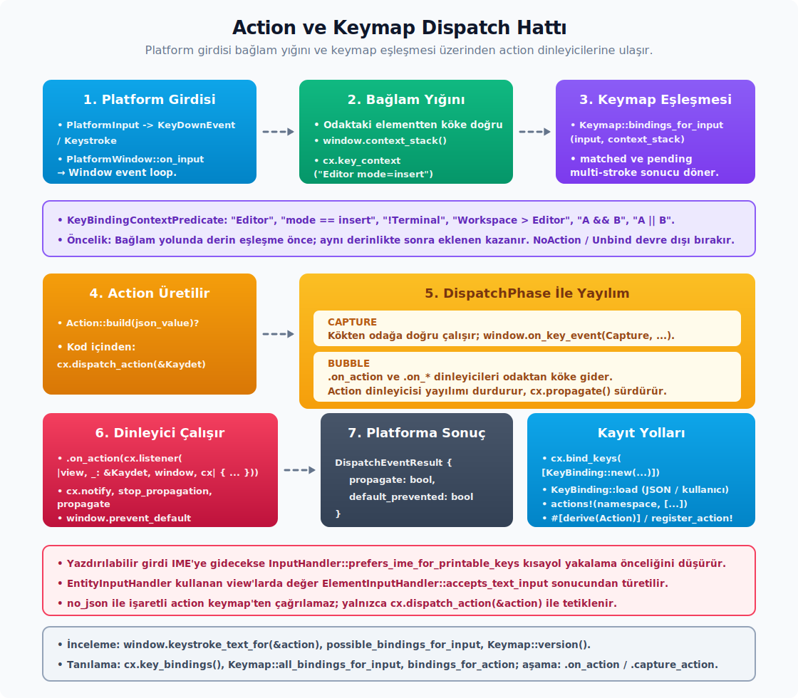

# Action ve Keymap

---

## Action ve Keymap İlişkisi

GPUI'de `Action` uygulamanın yapabileceği bir işi (komutu) ifade ederken, `Keymap` bu işi hangi tuş kombinasyonunun tetikleyeceğini belirler.

| Kavram | Sorumluluğu | Örnek |
|---|---|---|
| `Action` | İş mantığını ve (varsa) veriyi tanımlar. Niyet beyanıdır. | `actions!(duzenleyici, [Kaydet]);` |
| `Keymap` | Tuş basımlarını belirli bağlamlarda bir `Action`'a bağlar. | `cx.bind_keys([KeyBinding::new("cmd-s", Kaydet, None)]);` |

Bir eylemin tetiklenmesi için iki şeye ihtiyacın var: Eylemin ağaçta dinlenmesi (`.on_action`) ve eylemin tuşlara bağlanması (`bind_keys` veya komut paleti üzerinden).

## Action Sistemi Derinlemesine

Action tanımını iki ana yolla yaparsın. Hangi yolu seçeceğin, action'ın veri taşıyıp taşımamasına bağlıdır.

**Veri taşımayan action.** Yalnız adı olan action'lar için makro tek satırda iş görür:

```rust
use gpui::actions;
actions!(benim_ad_alanim, [Kaydet, Kapat, Yenile]);
```

`actions!` makrosu her isim için bir `unit struct` üretir ve bunun üzerinde `Action`'ın yanı sıra `Clone`, `PartialEq`, `Default`, `Debug` türetmelerini de uygular; namespace `benim_ad_alanim::Kaydet` adıyla kayıt defterine (`registry`) eklenir.

**Veri taşıyan action.** Yanında veri götürmesi gereken action'lar için derive ve attribute kullanırsın:

```rust
use gpui::Action;

#[derive(Clone, PartialEq, serde::Deserialize, schemars::JsonSchema, Action)]
#[action(namespace = duzenleyici)]
pub struct SatiraGit { pub satir: u32 }
```

`#[action(namespace = ..., name = "...", no_json, no_register)]` öznitelikleri bu derive üzerinde davranışı yönlendirir. Varsayılan olarak `Deserialize` derive'ı ve `JsonSchema` uygulaması beklenir; tamamen kod içinde kullanılacak bir action için `no_json`'ı, kayda alınması istenmeyen durumda `no_register`'ı seçersin.

**Yönlendirme.** Bir action'ı tetiklemenin başlıca yolları şunlar:

- `window.dispatch_action(action.boxed_clone(), cx)` — odaktaki elementten köke doğru yayılır.
- `focus_handle.dispatch_action(&action, window, cx)` — belirli bir handle'dan başlatır.
- Keymap girdileri eşleştiğinde otomatik yönlendirme tetiklenir.

**Dinleyici kaydı.** Action'ı dinleyen kodu element üzerinde tanımlarsın:

```rust
.on_action(cx.listener(|gorunum, eylem: &SatiraGit, _window, cx| {
    gorunum.satira_git(eylem.satir);
    cx.notify();
}))
.capture_action(cx.listener(isleyici)) // capture aşaması
```

**`DispatchPhase`.** Olaylar element ağacında iki ayrı aşamada akar:

- `Capture` — kökten odaktaki elemente doğru.
- `Bubble` — odaktaki elementten köke doğru. Varsayılan aşamadır. Action dinleyicileri burada varsayılan olarak yayılımı durdurur; aksi gerekirse dinleyici içinde `cx.propagate()` çağırırsın.

**Kısayol bağlama.** Tuş bağlama tanımını `bind_keys` çağrısıyla yaparsın:

```rust
cx.bind_keys([
    KeyBinding::new("cmd-s", Kaydet, Some("CalismaAlani")),
    KeyBinding::new("ctrl-g", SatiraGit { satir: 0 }, Some("Duzenleyici")),
]);
```

**Bağlam yüklemi (`predicate`) grameri.** Bağlam ifadeleri keymap'in eşleşme mantığını kurar (`gpui` crate'i):

- `Duzenleyici` — bağlam yığınında `Duzenleyici` tanımlayıcısı bulunuyor.
- `Duzenleyici && !SaltOkunur` — birleştirme ve negasyon.
- `CalismaAlani > Duzenleyici` — `>` operatörü, "Duzenleyici'nin üst yönlendirme yolunda CalismaAlani var" anlamına gelen alt öğe yüklemidir.
- `mode == insert` — eşitlik (`KeyContext::set("mode", "insert")` ile yazdığın anahtar/değer çiftine bakar).
- `mode != normal` — eşitsizlik.
- `(Duzenleyici || Terminal) && !SaltOkunur` — parantezle gruplama.

Gerçek ayrıştırıcı yalnızca şu operatörleri tanır: `>`, `&&`, `||`, `==`, `!=`, `!`. `in (a, b)`, `not in` veya fonksiyon çağrısı gibi söz dizimleri yoktur. Vim modu gibi çoklu seçeneği `mode == normal || mode == visual` biçiminde ifade edersin.

`.key_context("Duzenleyici")` çağrısı element ağacına bağlam ekler; alt öğeler üst bağlamları görür. Aynı kısayol birden fazla bağlamda eşleşirse en özgül (en derin) olan kazanır.

**Dikkat noktaları.** Action tanımlama tarafında hataya açık kullanımlar:

- Action kayda alınmadan kısayol tanımladığında keymap ayrıştırmasında hata oluşur; `actions!` veya `#[derive(Action)]`'ı mutlaka ana modülde derlemiş olmalısın.
- Bubble aşamasında dinleyici `cx.propagate()` çağırmadığı sürece üst öğedeki action dinleyicilerine ulaşılmaz (varsayılan davranış).
- Aynı action ismini iki crate'te tanımlarsan kayıt çakışması olur; namespace bu yüzden zorunludur.
- Zed çalışma zamanında bilinmeyen action ismi keymap'te uyarı kaydı üretir, `panic` vermez.

## Action Makro Detayları ve register_action!

`#[derive(Action)]` ve `actions!` makrosu çoğu durumda yeterlidir; ancak action sözleşmesinin ek köşe taşları da vardır.

#### Yeni action yazarken kullandığın çekirdek yüzey (`gpui` crate'i)

```rust
pub trait Action: Any + Send {
    fn boxed_clone(&self) -> Box<dyn Action>;
    fn partial_eq(&self, other: &dyn Action) -> bool;
    fn name(&self) -> &'static str;
    fn name_for_type() -> &'static str where Self: Sized;
    fn build(deger: serde_json::Value) -> Result<Box<dyn Action>>
        where Self: Sized;
    fn action_json_schema(_: &mut schemars::SchemaGenerator) -> Option<schemars::Schema>
        where Self: Sized { None }
    fn deprecated_aliases() -> &'static [&'static str]
        where Self: Sized { &[] }
    fn deprecation_message() -> Option<&'static str>
        where Self: Sized { None }
    fn documentation() -> Option<&'static str>
        where Self: Sized { None }
}
```

`name(&self)` çalışma zamanı adını verir; `name_for_type()` statik adı verir. Çalışma zamanı çok biçimliliği (`runtime polymorphism`) söz konusu olduğunda ilkini, kayıt sırasında ikincisini kullanırsın.

#### `#[action(...)]` öznitelikleri

`#[derive(Action)]` üzerinde tanımlayabileceğin öznitelikler şunlar:

- `namespace = benim_crate` — action adını `benim_crate::Kaydet` biçimine çevirir.
- `name = "OpenFile"` — namespace içinde özel ad.
- `no_json` — `Deserialize`/`JsonSchema` derive zorunluluğunu kaldırır; `build()` her zaman hata döner, `action_json_schema()` `None` verir. Tamamen kod içinde kullanılacak action'lar (örneğin `RangeAction { start: usize }`) için tercih edersin.
- `no_register` — inventory üzerinden otomatik kaydı atlar; trait'i elle uygularken veya koşula bağlı kayıt yaparken gerekir.

#### `register_action!` makrosu

`#[derive(Action)]` kullanmadan `Action`'ı elle uyguladığında, action'ın inventory'e dahil olabilmesi için ayrı bir kayıt makrosu vardır:

```rust
use gpui::register_action;

register_action!(Yapistir);
```

Bu makro yalnızca bir `inventory::submit!` çağrısı üretir; struct ya da impl tanımına dokunmaz. `no_register` ile birleştirdiğinde elle kaydın zamanını seçebilirsin.

#### Action runtime API'leri

Action'ları çalışma zamanında sorgulamak ve tetiklemek için bazı yardımcılar sağlanır:

- `cx.is_action_available(&action) -> bool` — odaktaki element yolunda bu action'ı dinleyen biri var mı? Menü öğelerini pasifleştirmek için idealdir.
- `window.is_action_available(&action, cx)` — pencereye özel sürüm.
- `cx.dispatch_action(&action)` — aktif pencere varsa ona, yoksa genel action dinleyicisine gönderir.
- `window.dispatch_action(action.boxed_clone(), cx)` — pencereye özel sürüm.
- `cx.build_action(name, json_value)` — keymap girdisinden çalışma zamanı action'ı üretir; şema yoksa `ActionBuildError` döner.

#### Dikkat Noktaları

Action makrolarının kullanımındaki ince noktalar:

- `partial_eq` varsayılan olarak `PartialEq` impl'ini kullanır; derive eklenmemişse karşılaştırma yanlış sonuç verebilir.
- Aynı `name()` döndüren iki action kayda alındığında, `App` oluşturulurken (kayıt defteri kurulurken) `panic` üretir; namespace kullanımı çakışmaları önler.
- `no_json` ile işaretlenmiş bir action keymap dosyasından çağrılamaz; yalnızca kod içinden `dispatch_action` ile tetiklersin.

## Keymap, KeyContext ve Dispatch Stack



Action tanımı tek başına yeterli değildir. Kısayolun çalışabilmesi için odaktaki elementin yönlendirme yolunda uygun `KeyContext` bulunması gerekir.

**Bağlam ekleme.** Element bağlamını `key_context` ile bildirirsin:

```rust
div()
    .track_focus(&self.odak_tutamagi)
    .key_context("Duzenleyici mod=ekleme")
    .on_action(cx.listener(|gorunum, _: &Kaydet, window, cx| {
        gorunum.kaydet(window, cx);
    }))
```

**Kısayol ekleme.** Kısayolları `bind_keys` ile kaydedersin:

```rust
cx.bind_keys([
    KeyBinding::new("cmd-s", Kaydet, Some("Duzenleyici")),
    KeyBinding::new("ctrl-g", SatiraGit { satir: 0 }, Some("CalismaAlani && !Duzenleyici")),
]);
```

**Önemli parçalar.** Bu sistemin temel taşları şunlar:

- `KeyContext::parse("Duzenleyici mod = ekleme")` — elementin bağlamını üretir.
- `KeyContext::new_with_defaults()` — varsayılan bağlam kümesiyle başlar. `primary()` ve `secondary()`, ayrıştırılan ana ve ek bağlam girişlerine erişir. `is_empty()`, `clear()`, `extend(&diger)`, `add(tanimlayici)`, `set(anahtar, deger)`, `contains(anahtar)` ve `get(anahtar)`, düşük seviyeli bağlam inşa ve sorgu yüzeyidir.
- `KeyBindingContextPredicate` — kısayol tarafındaki yüklem dilidir: `Duzenleyici`, `mod == ekleme`, `!Terminal`, `CalismaAlani > Duzenleyici`, `A && B`, `A || B`.
- `KeyBindingContextPredicate::parse(kaynak)` — yüklem üretir. `eval(baglam_yigini)` bool eşleşme, `depth_of(baglam_yigini)` en derin eşleşme derinliği, `is_superset(&diger)` ise keymap önceliği ve çakışma analizinde kullanırsın. `eval_inner(...)` genel görünür ama ayrıştırıcı veya doğrulayıcı gibi düşük seviyeli kodlar içindir; normal bileşen kodu doğrudan çağırmaz.
- `Keymap::bindings_for_input(input, context_stack)` — eşleşen action'ları ve bekleyen çok vuruşlu (`multi-stroke`) durumu döndürür.
- `Keymap::possible_next_bindings_for_input(input, context_stack)` — mevcut akor önekini (`chord prefix`) takip edebilecek kısayolları öncelik sırasında verir.
- `Keymap::version() -> KeymapVersion` — kısayol seti değiştikçe artan sayaçtır; kısayol UI önbelleklerinde geçersizleştirme anahtarı olarak kullanabilirsin.
- `Keymap::new(bindings)`, `add_bindings(bindings)`, `bindings()`, `bindings_for_action(action)`, `all_bindings_for_input(input)` ve `clear()`, ham keymap tablosunu kurma, sorgulama ve sıfırlama yüzeyidir. Uygulama akışında çoğunlukla `cx.bind_keys(...)` ve settings yükleyicisini tercih edersin; bu metotları test, doğrulayıcı, tanılama ve özel keymap UI'ı için kullanırsın.
- `window.context_stack()` — kökten odaktaki düğüme, yönlendirme yolundaki bağlamları verir.
- `window.keystroke_text_for(&action)` — UI'da gösterilecek en yüksek öncelikli kısayol metni.
- `window.possible_bindings_for_input(&[keystroke])` — akor veya bekleyen yardım UI'ları için kullanırsın.
- `cx.key_bindings() -> Rc<RefCell<Keymap>>` — keymap'e düşük seviyeli erişim. Üretim kodunda mümkün olduğu kadar `bind_keys`'i, keymap dosyasını ve doğrulayıcı akışını tercih edersin; bu handle test, tanılama ve özel keymap UI'ı için uygundur.
- `cx.clear_key_bindings()` — tüm kısayolları temizler ve pencereleri yeniden çizim için işaretler; normal uygulama akışında değil test veya sıfırlama yollarında kullanırsın.

**Öncelik.** Aynı tuşa birden çok kısayol düştüğünde sıralama şu kurallarla çözülür:

- Bağlam yolunda daha derin eşleşme daha yüksek önceliklidir.
- Aynı derinlikte sonra eklenen kısayol önce gelir; kullanıcı keymap'i yerleşik kısayolları bu yüzden ezebilir.
- `NoAction` ve `Unbind` kısayollarını devre dışı bırakma için kullanırsın.
- Yazdırılabilir girdi IME'ye gidecekse `InputHandler::prefers_ime_for_printable_keys`, kısayol yakalamasının önceliğini düşürebilir. `EntityInputHandler` kullanan view'larda bu değer, `ElementInputHandler` tarafından `accepts_text_input` sonucundan türetilir; ayrı bir karar istiyorsan ham `InputHandler` yazarsın.

**Dikkat noktaları.** Bu sistemde hataya açık kullanımlar:

- `.key_context(...)` bulunmayan bir alt ağaçta bağlam yüklemli kısayol çalışmaz.
- Dinleyici odak yolunda değilse action yayılımı oraya ulaşmaz; genel dinleyici için `cx.on_action(...)`'ı, yerel dinleyici için element üzerinde `.on_action(...)`'ı kullanırsın.
- `KeyBinding::new`, ayrıştırma hatasında `panic` verebilir; kullanıcı JSON'undan yükleme yapıldığında `KeyBinding::load`'u ve hata raporlamayı tercih edersin.
- `KeyBinding::load(keystrokes, action, context_predicate, use_key_equivalents, action_input, keyboard_mapper)`, başarısız olabilen bir yükleyicidir; `KeybindingKeystroke` eşlemesini de burada kurar. `context_predicate` `Option<Rc<KeyBindingContextPredicate>>`, `action_input` ise `Option<SharedString>` alır ve hata durumunda `InvalidKeystrokeError` döner. Çalışma zamanında `with_meta(...)` ve `set_meta(...)`, kısayolun hangi keymap katmanından geldiğini taşır. `match_keystrokes(...)` tam veya bekleyen eşleşmeyi verirken `keystrokes()`, `action()`, `predicate()`, `meta()` ve `action_input()` okuyucuları tanılama ve komut/keymap UI'larını besler.

## DispatchPhase, Olay Yayılımı ve DispatchEventResult

Fare, tuş ve action olayları element ağacında iki aşamada akar:

```rust
pub enum DispatchPhase {
    Bubble,  // odaktaki element → kök (varsayılan)
    Capture, // kök → odaktaki element
}
```

`Window::on_mouse_event`, `on_key_event` ve `on_modifiers_changed` dinleyicileri aşamaya göre çağrılır. Element fluent API'lerinde `.on_*` ailesi bubble aşamasına, `.capture_*` ailesi ise capture aşamasına bağlanır.

**Kontrol bayrakları** (`gpui` crate'i):

- `cx.stop_propagation()` — aynı tipteki diğer dinleyicilerin çağrılmasını keser (farede z-index'te alt katman, tuşta ağaçta üst element).
- `cx.propagate()` — önceki `stop_propagation()` etkisini geri alır. Action dinleyicileri bubble aşamasında varsayılan olarak yayılımı durdurduğu için üst öğeye düşürmek istiyorsan dinleyici içinden `cx.propagate()` çağırırsın.
- `window.prevent_default()` ve `window.default_prevented()` — aynı yönlendirme içinde varsayılan element davranışını bastıran pencere bayrağıdır. En görünür kullanım örneği, fare basma sırasında üst öğeye odak aktarımının engellenmesidir.

**Platforma dönen sonuç.** Yönlendirme tamamlandığında platforma şu yapı döner:

```rust
pub struct DispatchEventResult {
    pub propagate: bool,        // hâlâ bubble ediliyorsa true
    pub default_prevented: bool, // GPUI varsayılan davranışı bastırıldı mı
}
```

`PlatformWindow::on_input` geri çağrısı, `Fn(PlatformInput) -> DispatchEventResult` döndürür. Mevcut platform arka uçlarında (`backend`) "olay işlendi mi?" kararı esas olarak `propagate` üzerinden verilir (`!propagate`, "işlendi" anlamına gelir). `default_prevented`, GPUI yönlendirme ağacındaki varsayılan element davranışını ve test/tanılama sonucunu taşır. Bunu genel bir platform iptal mekanizması gibi değil, dinleyicinin açıkça kontrol ettiği yerlerde anlamlandırman gerekir.

**Pratik akış.** Tipik bir yönlendirme turunda şu adımları izlersin:

1. Element dinleyicisi tetiklenir, view verisi güncellenir, gerekirse `cx.notify()` çağrılır.
2. Dinleyici olayı tüketmek istiyorsa `cx.stop_propagation()` çağırır.
3. Action dinleyicisi varsayılan davranışı korumak istiyorsa `cx.propagate()` ile yayılımı yeniden açar.
4. Varsayılan odak aktarımı gibi GPUI içi bir davranışı bastıracaksan `window.prevent_default()` çağırırsın.

**Dikkat noktaları.** Bu akışta dikkat edeceğin noktalar:

- `capture_*` dinleyicileri odak yolu bilinmeden çalışır; pencere genelinde kısayol veya gözlemci için kullanırsın; ama veri değiştireceksen odaktaki elementi çalışma zamanında kontrol etmen gerekir.
- Action yayılımı davranışı, fare veya tuş olaylarından ters çalışır. Yeni bir action dinleyicisinde refleksle `stop_propagation` yazmak, üst öğedeki action'ları engelleyebilir.
- `default_prevented`, genel bir platform iptal API'si değildir; hangi davranışın durdurulduğunu anlamak için ilgili element veya pencere dinleyicisinin `window.default_prevented()`'i kontrol edip etmediğine bakarsın.

## Action ve Keymap'in Çalışma Zamanı İncelemesi

Action tanımlama ve yönlendirme önceki bölümlerde işlenmiştir. Zed komut paleti, keymap UI'ı ve geliştirici tanılaması için çalışma zamanı inceleme (`introspection`) yüzeyini de bilmen gerekir.

**Action kayıt defteri.** Kayıt defterindeki action'lar üzerinde aşağıdaki yardımcılar sorgu yapar:

- `cx.build_action(name, data) -> Result<Box<dyn Action>, ActionBuildError>` — metin (`string`) action adı ve isteğe bağlı JSON verisinden çalışma zamanı action'ı üretir.
- `cx.all_action_names() -> &[&'static str]` — kayda alınmış tüm action adlarını döndürür. Kayıtlı olmak, action'ın element ağacında o anda kullanılabilir olduğu anlamına gelmez.
- `cx.action_schemas(generator)` — iç kullanım dışı action adlarını ve JSON şemalarını verir.
- `cx.action_schema_by_name(name, generator)` — tek bir action için şema döndürür; `None` action'ın yokluğunu, `Some(None)` action'ın varlığını ama şema bulunmayışını ifade eder.
- `cx.action_documentation()` — keymap düzenleyicisi, JSON şeması ve geliştirici tanılaması için action açıklamalarını sağlar.

**Kullanılabilir action ve kısayol sorguları.** Bağlamdaki action durumunu ve ilgili kısayolları öğrenmek için:

- `window.available_actions(cx)` — odaktaki element yönlendirme yolundaki action dinleyicileriyle genel action dinleyicilerini birleştirir. Menü ve komut UI'ında "bu action şu anda yapılabilir mi?" sorusunun pencereye özel cevabıdır.
- `window.on_action_when(condition, TypeId::of::<A>(), listener)` — çizim aşamasında o anki yönlendirme düğümüne koşullu, düşük seviyeli action dinleyicisi ekler. Element API'sindeki `.on_action(...)` ve `.capture_action(...)` genelde daha okunaklıdır; özel element yazmıyorsan bu seviyeye inmezsin.
- `cx.is_action_available(&action)` ve `window.is_action_available(&action, cx)` — bool kısayollar.
- `window.is_action_available_in(&action, focus_handle)` — action kullanılabilirliği sorgusunu belirli bir odak handle'ının yönlendirme yolundan yapar.
- `window.bindings_for_action(&action)` — odaktaki bağlam yığınına göre action'a giden kısayolları döner; gösterim için son kısayol en yüksek öncelikli kabul edilir.
- `window.highest_precedence_binding_for_action(&action)` — aynı sorgunun tek sonuçlu, daha ucuz sürümü.
- `window.bindings_for_action_in(&action, focus_handle)` ve `highest_precedence_binding_for_action_in(...)` — sorguyu belirli bir odak handle'ı yolundan yapar.
- `window.bindings_for_action_in_context(&action, KeyContext)` — tek bir elle verdiğin bağlama göre sorgu.
- `window.highest_precedence_binding_for_action_in_context(&action, KeyContext)` — aynı sorgunun tek sonuçlu en yüksek öncelikli sürümü.
- `cx.all_bindings_for_input(&[Keystroke])` — bağlama bakmadan girdi dizisine kayıtlı tüm kısayolları listeler.
- `window.possible_bindings_for_input(&[Keystroke])` — çok vuruşlu veya önek akışında o anki bağlam yığınına göre sıradaki aday kısayolları verir. Tam eşleşen action yönlendirme sonucu için normal `window.dispatch_keystroke(...)` akışını kullanırsın; genel `Window::bindings_for_input` yardımcısı yoktur.

| API | Alt özellikler | Kısa anlamı |
| :-- | :-- | :-- |
| `ActionBuildError` | `NotFound`, `BuildError` | `cx.build_action(...)` action adını veya JSON payload'ını çözemediğinde dönen hatadır. |
| `actions` | macro | Veri taşımayan action unit struct'larını ve registry kayıtlarını üretir. |
| `NoAction` | special unit action | Keymap'te belirli bağlamdaki binding'i sessize almak için kullanırsın. |
| `AsKeystroke`, `KeybindingKeystroke` | keystroke dönüşümü ve binding eşleşme taşıyıcısı | Keymap input sorgularının string/keystroke girdisini ve fiziksel/karakter eşleşmesini yönetir. |
| `KeyBindingContextPredicate` | `parse`, `eval`, `depth_of`, `is_superset` | Keymap context yüklem dilini temsil eder. |
| `EntityInputHandler`, `ElementInputHandler` | input handler trait'i ve element sarmalayıcısı | Kısayol/metin girdisi ayrımının IME ve printable key tarafında view'a bağlanmasını sağlar. |
- `window.pending_input_keystrokes()` ve `window.has_pending_keystrokes()` — tamamlanmamış tuş akoru (`key chord`) durumunu UI'da göstermek veya test etmek için.

**Genel keystroke gözlemi.** Tüm pencerelerdeki keystroke akışını yakalamak için iki kanca vardır; biri yönlendirmeden sonra, diğeri yönlendirmeden önce çalışır:

```rust
let yonlendirme_sonrasi = cx.observe_keystrokes(|olay, window, cx| {
    tusu_kaydet(olay, window, cx);
});

let yonlendirme_oncesi = cx.intercept_keystrokes(|olay, _window, cx| {
    if engellenmeli_mi(olay) {
        cx.stop_propagation();
    }
});
```

- `observe_keystrokes`, action ve olay mekanizmaları çözüldükten sonra çalışır; yayılım durdurulmuşsa çağrılmaz.
- `intercept_keystrokes`, yönlendirmeden önce çalışır; burada `cx.stop_propagation()` çağrısı action yönlendirmesini engeller.
- Her ikisi de `Subscription` döner; bu değer elden çıkınca gözlemci düşer.

**ActionRegistry ve macro action verisi.** `ActionRegistry` normal uygulama kodunun oluşturduğu bir nesne değildir; `App` içinde tutulur ve `actions!`, `#[derive(Action)]`, `register_action!` çıktılarından beslenir. `ActionRegistry::build_action_type(...)` bir tip kimliğinden (`TypeId`) action üretir; isim + JSON değerinden üreten metot ise `build_action`'dır. `build_action_type`, deprecated alias varsa tercih edilen ada yönlendirir. `ActionRegistry::deprecation_messages()` eski action adları için uyarı metinlerini döndürür. `MacroActionBuilder` ve `MacroActionData`, `actions!` makrosunun ürettiği veri taşımayan action'ları registry'ye bağlayan taşıyıcılardır. `generate_list_of_all_registered_actions()` registry içeriğini dokümantasyon, komut paleti veya test doğrulaması için çıkarır; bir action'ın o anda kullanılabilir olup olmadığını söylemez.

**DispatchTree ve ReusedSubtree.** `DispatchTree`, çizilen element ağacının action, key context, focus ve hitbox dispatch bilgisini tutar. `window.context_stack()`, `window.available_actions(cx)`, `window.dispatch_keystroke(...)`, `window.dispatch_event(...)` ve action yayılımı bu ağaçtan beslenir. `DispatchTree::push_node()`, `set_active_node(...)`, `set_focus_id(...)`, `pop_node()` ve `reuse_subtree(...)` frame içinde dispatch düğümlerini kurar; `root_node_id()`, `active_node_id()`, `focusable_node_id(...)`, `dispatch_path(...)`, `focus_path(...)`, `view_path_reversed(...)` ve `focus_contains(parent, child)` kurulmuş ağacı sorgular. Tuş akorlarında `dispatch_key(...)` eşleşen binding, pending input ve replay bilgisini üretir; `flush_dispatch(...)` ise timeout sonrası bekleyen prefix'i yeniden oynatma olaylarına çevirir. `ReusedSubtree`, önceki frame'den tekrar kullanılan alt ağaçların dispatch bilgisini taşır; `ReusedSubtree::refresh_node_id(old_id)` eski node id'yi yeni frame aralığına eşler, `ReusedSubtree::contains_focus()` yeniden kullanılan alt ağacın aktif focus'u içerip içermediğini söyler. Uygulama kodunda bu tipleri elle kurmazsın; özel element veya renderer altyapısı yazıyorsan dispatch node'unun hangi fazda üretildiğini anlamak için okursun.

**Keyboard mapper ve capslock.** `PlatformKeyboardLayout`, `PlatformKeyboardMapper` ve `DummyKeyboardMapper` tuşların platforma göre görünen metne ve gerçek `Keystroke` değerine dönüşmesini sağlar. `Keystroke::should_match(target)` gerçek basılan tuş ile keymap'te beklenen `KeybindingKeystroke` değerini karşılaştırırken hem fiziksel key'i hem IME veya option-alt kombinasyonlarından gelen `key_char` değerini hesaba katar. Uygulama tarafında `cx.keyboard_layout()`, `cx.keyboard_mapper()` ve `cx.on_keyboard_layout_change(...)` sarmalayıcılarını kullanırsın. `Capslock` pencere veya test girdisindeki caps lock durumunu taşır; keymap eşleşmesi için modifier gibi düşünülmemelidir.

**TabStopMap düşük seviyesi.** `TabStopMap::begin_group(...)`, `end_group(...)`, `replay(...)` ve `paint_index()` focus traversal ağacının frame içi işlemleridir. `TabStopMap::next(focused_id)` ve `TabStopMap::prev(focused_id)` mevcut focus'a göre bir sonraki veya önceki `FocusHandle` değerini döndürür; odak yoksa sıranın ilk veya son tab stop'una sarar. `TabStopOperation`, `TabStopOrderNodeSummary` ve `TabStopCount` bu ağacın operasyon ve özet taşıyıcılarıdır. Uygulama bileşeninde `.tab_group()`, `.tab_index(...)`, `.tab_stop(...)`, `window.focus_next(cx)` ve `window.focus_prev(cx)` kullanırsın; `TabStopMap`'i elle yönetmek yalnız özel traversal altyapısı yazarken gerekir.

**Dikkat noktaları.** İnceleme yüzeyinde atlanması kolay noktalar:

- `all_action_names` içinde görünen bir action'ın o anda kullanılabilir olması garanti değildir; UI öğesini etkin veya pasif yapmak için `available_actions`'ı ya da `is_action_available`'ı tercih edersin.
- Kısayol gösteriminde bağlam yığınını dikkate almayan `cx.all_bindings_for_input` yerine mümkün olduğunda pencere veya odak handle'ı bazlı sorguyu kullanırsın.
- Yakalayıcılar (`interceptor`) genel etkilidir; modal pencerelere özgü tuş engelleme yapacaksan mümkün olduğunca element action veya capture dinleyicisi ile sınırlı tutman gerekir.

## Zed Keymap Dosyası, Doğrulayıcı ve Unbind Akışı

GPUI action ve kısayol modeli Zed'de `settings::keymap_file` üzerinden kullanıcı dosyasına bağlanır. Bu bölüm, çalışma zamanı yönlendirmesinden farklı olarak JSON yükleme, şema ve dosya güncelleme tarafını kapsar.

**Dosya modeli.** Keymap JSON yapısı birkaç ana tip üzerinden okunur:

- `KeymapFile(Vec<KeymapSection>)` — üst seviye JSON array.
- `KeymapSection` — bağlam yüklemiyle birlikte kısayol ve unbind eşlemelerini taşır. Alan görünürlüğü dengeli değildir: yalnız `pub context: String` dış erişime açıktır; `use_key_equivalents: bool`, `unbind: Option<IndexMap<...>>`, `bindings: Option<IndexMap<...>>` ve `unrecognized_fields: IndexMap<...>` alanları **private**'tır. `KeymapFile` ayrıştırıcısı bu alanlara crate içinden doğrudan erişir; dış kod yalnızca `KeymapSection::bindings(&self)` okuyucusunu kullanabilir ve bu da `(keystroke, KeymapAction)` çiftlerini dönen tek genel iteratördür (`keymap_file`). `unbind` ve `use_key_equivalents` için ayrı bir genel okuyucu bu sürümde bulunmuyor.
- `KeymapAction(Value)` — `null`, `"action::Name"` veya `["action::Name", { ...args... }]` biçimlerini temsil eder.
- `UnbindTargetAction(Value)` — `unbind` eşlemesindeki hedef action değeri.
- `KeymapFileLoadResult::{Success, SomeFailedToLoad, JsonParseFailure}` — dosyanın kısmen yüklenebildiği senaryoyu açıkça ayırır.

**Yükleme.** İçeriği ayrıştırmanın veya yüklemenin iki ana yolu vardır:

```rust
let tus_haritasi = KeymapFile::parse(&icerik)?;
let sonuc = KeymapFile::load(&icerik, cx);
```

`load_asset(varlik_yolu, kaynak, cx)`, paketlenmiş (`bundled`) keymap dosyalarını yükler ve `KeybindSource` üst verisini ayarlayabilir. `load_panic_on_failure`, `test-support` derleme özelliği altında kalan test yolları gibi "asset bozuksa devam etmeyelim" akışları içindir.

**Temel keymap.** Hangi temel keymap'in seçili olduğu enum'da tutulur:

- `BaseKeymap::{VSCode, JetBrains, SublimeText, Atom, TextMate, Emacs, Cursor, None}`.
- Temel, varsayılan, vim ve kullanıcı kısayolları `KeybindSource` üst verisi taşır; UI bu üst veriyle kısayolun nereden geldiğini gösterir.

**Yerleşik keymap davranışı.** Aşağıdaki davranışlar Zed'in varsayılan keymap kurulumunda gözlenir:

- Agent panelindeki ACP thread'ine özgü kısayollar `AcpThread` bağlamında yaşar. Terminal alt bağlamı, alt öğe yüklemi ile `AgentPanel > Terminal` kullanır; bu, `>` operatörünün gerçek yönlendirme yolu ilişkisi için kullanılmasının pratik örneğidir.
- Git paneli iki sekmelidir: `git_panel::ActivateChangesTab` ve `git_panel::ActivateHistoryTab` için varsayılan kısayol macOS'ta `cmd-1` ile `cmd-2`, Linux/Windows'ta `ctrl-1` ile `ctrl-2`'dir.
- Worktree seçici, `worktree_picker::ForceDeleteWorktree` action'ını destekler. Varsayılan kısayol macOS'ta `cmd-alt-shift-backspace`, Linux/Windows'ta `ctrl-alt-shift-backspace`'tir; UI tarafında silme ikonu üzerinde `alt` basılıysa zorla silme yolu çalışır.
- `buffer_search::UseSelectionForFind` seçimi, seçim yoksa imleç altındaki kelimeyi arama sorgusu olarak kullanır. Ayarın atlanması gereken çağrılar, `SeedQuerySetting::Always` üzerine yazmasını vermelidir.
- Vim kullanırken Helix tarzında kelimeye atlama `vim::HelixJumpToWord` aksiyonudur. Helix modlarında (`vim_mode == helix_normal || vim_mode == helix_select`) varsayılan olarak `g w` kısayoluna bağlıdır; standart Vim modunda varsayılan değildir. `helix_normal` modunda hedef kelimenin başına taşır, `helix_select` modunda seçimi hedef kelime başına kadar genişletir. Standart Vim modunda `g w` yerleşik olarak yeniden sarma (`rewrap`) davranışını sürdürür.

**Doğrulayıcı.** Belirli action tiplerine özel doğrulama mantığı ekleyebilirsin:

- `KeyBindingValidator` — belirli bir action tipi için kısayol doğrulaması yapar.
- `KeyBindingValidatorRegistration(pub fn() -> Box<dyn KeyBindingValidator>)` inventory ile toplanır.
- Doğrulayıcı hataları `MarkdownString` döner; keymap UI bunu kullanıcıya okunaklı bir hata olarak gösterebilir.

**Devre dışı bırakma ve unbind nöbetçi action'ları (`sentinel`).** GPUI iki ayrı nöbetçi action sağlar (`gpui::action`). İkisinin çalışma zamanı davranışı da **yönlendirme yapmamak**'tır; ancak keymap yönlendirme tablosundaki görevleri farklıdır:

- **`zed::NoAction`** — `actions!(zed, [NoAction])` ile tanımlıdır, veri taşımaz. Keymap JSON'unda eylem değeri olarak `null` veya `"zed::NoAction"` yazarsın:

  ```json
  { "context": "Duzenleyici", "bindings": { "cmd-p": null } }
  ```

  Aynı keystroke'a daha düşük öncelikle bağlanmış action'lar bu bağlam için iptal edilir; eşleşme `Keymap::resolve_binding` tarafından `disabled_binding_matches_context(...)` çağrısıyla **bağlama duyarlı** şekilde süzülür (`gpui` crate'i). Yani `NoAction`, belirli bir bağlam yüklemi içinde o tuşu sessize alır.

- **`zed::Unbind(SharedString)`** — `derive(Action)` ile tanımlıdır; yükü (`payload`) bir action adıdır. JSON biçimi şu şekildedir:

  ```json
  ["zed::Unbind", "editor::NewLine"]
  ```

  Bu nöbetçi kendi context yüklemi eşleştiğinde aynı keystroke'a aynı action adıyla daha düşük öncelikte kalan kısayolları iptal eder; hedef binding'in kendi context ayrıntısı ayrıca eşleştirilmez (`keymap`'deki `is_unbind` kolu). Yani `editor::NewLine` için `enter` tuşunu tüm bağlamlarda unbind etmek istiyorsan unbind girdisinin context'ini geniş tutarsın.

**Nöbetçi kontrol API'leri.** Nöbetçi action'ları çalışma zamanında tespit etmek için iki ufak yardımcı vardır:

- `gpui::is_no_action(&dyn Action) -> bool` (`action`) — `as_any().is::<NoAction>()` üzerinden alta dönüştürme yapar. Özel keymap UI veya komut paleti listesinde "(disabled)" göstergesi koymak için uygundur.
- `gpui::is_unbind(&dyn Action) -> bool` (`action`) — aynı şekilde `Unbind` nesnesini alta dönüştürür.

`KeymapFile::update_keybinding`, `KeybindUpdateOperation::Remove` için bu iki nöbetçiyi bağlama göre üretir. Kullanıcı kısayolları `Remove` ile doğrudan dosyadan silinir. Çatı (`framework`) veya varsayılan kısayolları sessize alacaksan kullanıcı keymap'ine `null` (NoAction) ya da `["zed::Unbind", ...]` girdisi yazarsın.

**Dosya güncelleme.** Keymap dosyasını programatik olarak değiştirmek için şu fonksiyonu kullanırsın:

```rust
let guncellenen = KeymapFile::update_keybinding(
    islem,
    tus_haritasi_icerigi,
    sekme_boyutu,
    klavye_esleyici,
)?;
```

- `KeybindUpdateOperation::Add { source, from }` — yeni kısayol ekler.
- `Replace { source, target, target_keybind_source }` — kullanıcı kısayoluysa değiştirir; kullanıcı dışı kısayol değişiyorsa ekleme artı bastırma için unbind'e dönüştürebilir.
- `Remove { target, target_keybind_source }` — kullanıcı kısayolunu dosyadan siler; kullanıcı dışı bir kısayolu kaldırmak için `unbind` yazar.
- `KeybindUpdateTarget`, action adı, isteğe bağlı action argümanları, bağlam ve `KeybindingKeystroke` dizisini taşır.

**Dikkat noktaları.** Dosya güncellemeyle ilgili dikkat noktaları:

- `use_key_equivalents` yalnızca destekleyen platformlarda anlamlıdır; klavye eşleyicisi (`keyboard mapper`) sağlanmadan dosya güncellemesi doğru keystroke metnini üretemez.
- Kullanıcı dışı bir kısayolu "silmek" gerçek kaynağı değiştirmez; kullanıcı keymap'ine bastırma yapan bir `unbind` girdisi yazılır.
- Kullanıcı JSON'u bozuksa `update_keybinding` dosyayı değiştirmez; önce ayrıştırma başarıyla geçmesi gerekir.

---
