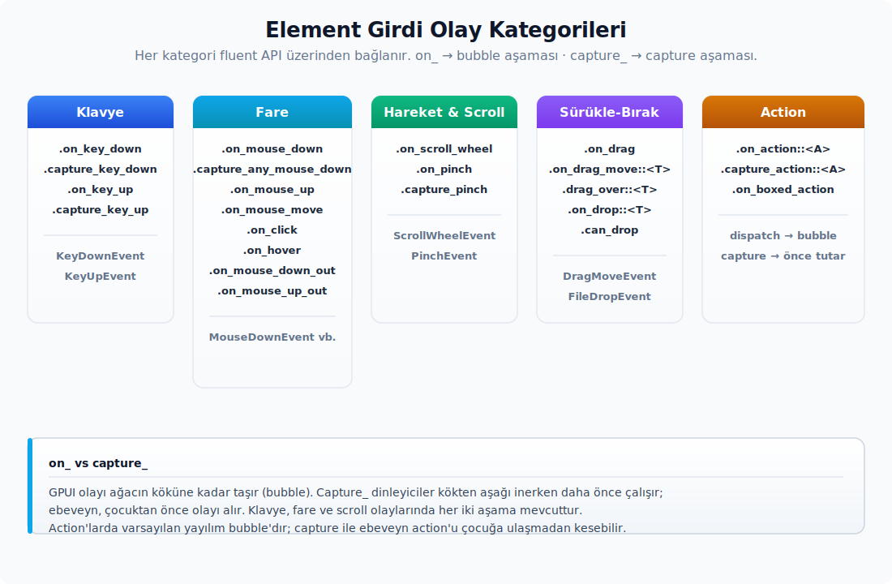

# Girdi, Sistem ve Menü

---

## Girdi, Pano, Prompt ve Platform Servisleri

Element seviyesinde GPUI birçok girdi olayını tek tipli bir fluent API üzerinden açar. Aşağıdaki listeler, farklı olay tiplerini hangi metotlarla yakaladığını özetler:



- Klavye: `.on_key_down`, `.capture_key_down`, `.on_key_up`, `.capture_key_up`.
- Fare: `.on_mouse_down`, `.capture_any_mouse_down`, `.on_mouse_up`, `.capture_any_mouse_up`, `.on_mouse_move`, `.on_mouse_down_out`, `.on_mouse_up_out`, `.on_click`, `.on_hover`.
- Hareket ve scroll: `.on_scroll_wheel`, `.on_pinch`, `.capture_pinch`.
- Sürükle-bırak: `.on_drag`, `.on_drag_move`, `.on_drop`.
- Action: `.capture_action::<A>`, `.on_action::<A>`, `.on_boxed_action`.

Olay tipleri `interactive` ve `platform` içinde tanımlıdır: `KeyDownEvent`, `KeyUpEvent`, `MouseDownEvent`, `MouseUpEvent`, `MouseMoveEvent`, `MousePressureEvent`, `ScrollWheelEvent`, `PinchEvent`, `FileDropEvent`, `ExternalPaths`, `ClickEvent`. `ScrollDelta::pixel_delta(line_height)`, satır tabanlı scroll'u piksele çevirir; `coalesce` aynı yöndeki delta'ları birleştirir.

**Pano.** Pano okuma ve yazmayı sade çağrılarla yaparsın:

```rust
cx.write_to_clipboard(ClipboardItem::new_string("metin".to_string()));

if let Some(oge) = cx.read_from_clipboard()
    && let Some(metin) = oge.text()
{
    // kullan
}
```

`ClipboardItem` birden çok `ClipboardEntry` taşıyabilir: `String`, `Image` veya `ExternalPaths`. `String` girdisine üst veri eklemek istediğinde `new_string_with_metadata` veya `new_string_with_json_metadata`'yı kullanırsın. `ClipboardItem::new_image(&image)` görseli pano girdisine çevirir; `ClipboardItem::into_entries()` ise öğeyi tüketip sahipli `ClipboardEntry` iterator'ı verir. Linux/FreeBSD için primary selection `read_from_primary`/`write_to_primary`; macOS Find pasteboard için `read_from_find_pasteboard`/`write_to_find_pasteboard`, `cfg` koşullu API'lerdir.

`ClipboardString` metnin yanında isteğe bağlı format/metadata taşır. `ClipboardString::text()` veya `ClipboardItem::text()` ile düz metne inmeyi tercih edersin; sahipli metin gerekiyorsa `ClipboardString::into_text()` değeri tüketir. JSON metadata için `ClipboardString::with_json_metadata(...)` yazma, `ClipboardString::metadata_json::<T>()` okuma tarafıdır. `ClipboardString::text_hash(text)` özellikle Linux/FreeBSD pano değişimi izleme yollarında metnin değişip değişmediğini ucuzca ayırmak için kullanılır. Metadata yalnız aynı uygulama ailesi içinde zengin yapıştırma davranışı gerektiğinde anlamlıdır. Görsel pano girdilerinde `Image` ve `ImageFormat` boru hattı devreye girer; normal metin kopyalama için `ClipboardItem::new_string(...)` yeterlidir.

| API | Alt özellikler | Kısa anlamı |
| :-- | :-- | :-- |
| `ClipboardEntry` | `String(ClipboardString)`, `Image(Image)`, `ExternalPaths(ExternalPaths)` | `ClipboardItem` içindeki sahipli pano girdisi varyantıdır. |
| `ClickEvent` | mouse/keyboard click ayrımı | `.on_click(...)` callback'lerinde kaynak, pozisyon, click sayısı ve alternatif mouse butonlarını okumak için kullanılır. |
| `KeyDownEvent`, `KeyUpEvent` | key press/release olayı | Klavye listener ve test girdi simülasyonu tarafında ham key event modelidir. |
| `MousePressureEvent`, `ScrollDelta` | pressure ve scroll delta modeli | Gelişmiş pointer/scroll girdisini platformdan element listener'ına taşır. |
| `EntityInputHandler`, `ElementInputHandler` | input handler trait'i ve element bağlayıcısı | IME, selection bounds ve printable key kararlarını view state'ine bağlar. |

**PlatformInputHandler sınırı.** `PlatformInputHandler` platform penceresinin aktif metin girdi dinleyicisini temsil eder. Uygulama düzeyinde bunu doğrudan saklamazsın; `EntityInputHandler` ve `ElementInputHandler` view'ı platforma bağlar, `window.handle_input(...)` da frame içinde bu bağı kaydeder. Platform arka ucu bu sarmalayıcı üzerinden `apple_press_and_hold_enabled()`, `dispatch_input(input, window, cx)`, `selected_bounds(window, cx)`, `query_accepts_text_input()` ve `query_prefers_ime_for_printable_keys()` çağrılarını yapar. Böylece platform, IME kabulü, seçili metin sınırı ve printable tuşların IME'ye mi kısayola mı gideceği kararını view'ın gerçek `InputHandler` uygulamasından sorar. Doğrudan `PlatformInputHandler` implement etmek, yeni platform arka ucu veya çok özel editör entegrasyonu yazdığında gerekir.

**Prompt ve dosya seçici.** Kullanıcıyla iletişim kuran platform diyalogları da bağlam üzerinden çalışır:

- `window.prompt(level, message, detail, answers, cx) -> oneshot::Receiver<usize>`
- `cx.set_prompt_builder(...)`, özel GPUI prompt UI'ını kurar; `reset_prompt_builder`, yerel veya varsayılan akışa döner.
- `cx.prompt_for_paths(PathPromptOptions { files, directories, multiple, prompt })`, dosya veya dizin seçici açar.
- `cx.prompt_for_new_path(directory, suggested_name)`, kaydetme diyaloğunu açar.
- `cx.open_url(url)`, `cx.register_url_scheme(scheme)`, `cx.reveal_path(path)`, `cx.open_with_system(path)`, platform servislerine gider.
- Platformun kimlik bilgisi deposu için `cx.write_credentials(url, username, password)`, `cx.read_credentials(url)` ve `cx.delete_credentials(url)` async `Task<Result<_>>` döndürür.
- Uygulama yolu ve sistem bilgisi için `cx.app_path()`, `cx.path_for_auxiliary_executable(name)`, `cx.compositor_name()`, `cx.should_auto_hide_scrollbars()`.
- Yeniden başlatma ve HTTP istemcisi tarafında `cx.set_restart_path(path)`, `cx.restart()`, `cx.http_client()` ve `cx.set_http_client(client)` bulunur.

`PathPromptOptions { files, directories, multiple, prompt }`, dosya seçici davranışını açıkça modellediği için kullanıcı ayarından gelen "dosya mı, dizin mi, ikisi birden mi?" kararını string parametrelerle taşımaktan daha güvenlidir. Platform bazı kombinasyonları desteklemeyebilir; `cx.can_select_mixed_files_and_dirs()` sonucuna göre dosya ve dizini birlikte seçtirme akışına yedek tasarlarsın.

**Platform ve prompt davranışı.** Diyaloglarda platforma özel davranışlar sürpriz oluşturabilir; bilmen gereken birkaç nokta:

- macOS `Window::prompt` NSAlert akışında Return ilk butona, Escape Cancel'a gider; Space ile odak son "iptal olmayan ve varsayılan olmayan" butona taşınır. "Save / Don't Save / Cancel" gibi üçlü prompt'larda orta seçenek klavyeyle erişilebilir kalır.
- Wayland'da pano ve primary selection yazılırken, tuş veya fare basma türüne göre süzülmüş seri yerine alınan en güncel compositor serisi kullanılır; aksi halde bazı compositor'lar seçim isteğini sessizce reddedebilir.
- `open_path_prompt` sonuç sıralaması `ProjectPanelSettings.sort_mode` ile uyumlu çalışır. Proje panelindeki "önce dizinler / önce dosyalar / karışık" seçimi, dosya yolu prompt'unun aday listesinde de aynı şekilde uygulanır.

## Prompt Builder, PromptHandle ve Fallback Prompt

**Public API kapsamı.** Bu başlık altında ayrı alt başlık açmayı gerektirmeyen public alt yüzeyler:

| Konu | Grup | API | Not |
|---|---|---|---|
| `PromptHandle` | Metotlar | `with_view` | Builder, sorgu veya runtime çağrıları; ayrıntı bu konu anlatımındaki kullanım bağlamıyla okunur. |


`Window::prompt` platform diyaloğunu açar. Platform prompt'u desteklemiyorsa veya özel bir prompt builder ayarlanmışsa GPUI içinde çizilen prompt'u kullanırsın:

```rust
let yanit = window.prompt(
    PromptLevel::Warning,
    "Kaydedilmemiş değişiklikler",
    Some("Kaydetmeden kapatılsın mı?"),
    &[PromptButton::cancel("İptal"), PromptButton::ok("Kapat")],
    cx,
);

let secilen_sira = yanit.await?;
```

**Prompt tipleri.** Prompt akışında kullanılan tipler şu rolleri üstlenir:

- `PromptLevel::{Info, Warning, Critical}` — görsel önem seviyesidir.
- `PromptButton::ok(label)`, `cancel(label)`, `new(label)` — sırasıyla ok, cancel ve genel action butonu üretir; `label()` ve `is_cancel()` okunabilir.
- `PromptResponse(pub usize)` — özel prompt view'unun seçilen buton indeksini yaydığı olaydır.
- `Prompt` — `EventEmitter<PromptResponse> + Focusable` trait birleşimidir.
- `PromptHandle::with_view(view, window, cx)` — özel prompt entity'sini pencereye bağlar, önceki odağı kaydeder ve prompt yanıtında odağı geri verir.
- `fallback_prompt_renderer(...)` — `set_prompt_builder` ile varsayılan GPUI prompt çizimini zorlamak için kullanırsın.

| API | Alt özellikler | Kısa anlamı |
| :-- | :-- | :-- |
| `PathPromptOptions` | `files`, `directories`, `multiple`, `prompt` | Dosya/dizin seçici davranışını tipli biçimde taşır. |
| `PromptLevel` | `Info`, `Warning`, `Critical` | Platform veya GPUI prompt'unun önem seviyesidir. |
| `PromptButton` | `Ok`, `Cancel`, `Other`, `ok`, `cancel`, `new`, `label`, `is_cancel` | Prompt cevap düğmelerinin etiket ve semantiğini taşır. |
| `PromptResponse` | seçilen buton indeksi | Özel prompt view'unun `EventEmitter` üzerinden yaydığı cevaptır. |
| `fallback_prompt_renderer` | fallback GPUI prompt builder | Sistem prompt'u kullanılmadığında GPUI içinde çizilen varsayılan prompt renderer'ını kurar. |

**Zed entegrasyonu** (`ui_prompt`):

- `ui_prompt::init(cx)`, `WorkspaceSettings::use_system_prompts` ayarını `SettingsStore` üzerinden gözlemler. Sistem prompt'ları açıksa `cx.reset_prompt_builder()` çağrılarak platform diyaloğuna düşülür; aksi halde `cx.set_prompt_builder(zed_prompt_renderer)` ile GPUI içindeki markdown destekli prompt akışına geçilir. Linux/FreeBSD'de sistem prompt'u yoksayılır, daima Zed çizimi kullanılır.
- `ZedPromptRenderer`, `pub` bir struct'tır: `Markdown` entity'siyle mesaj ve detay metnini çizer; cancel ve confirm action'larını içeride yönlendirir. Uygulama kodu doğrudan oluşturmaz; yalnızca prompt builder fonksiyonu tarafından kurulur.

**Özel builder.** Tamamen özel bir prompt görsel akışı tanımlamak için builder'ı kayda alırsın:

```rust
cx.set_prompt_builder(|seviye, mesaj, ayrinti, eylemler, tutamac, window, cx| {
    let mesaj = mesaj.to_string();
    let ayrinti = ayrinti.map(ToString::to_string);
    let eylemler = eylemler.to_vec();
    let gorunum = cx.new(|cx| IstemGorunumu::new(seviye, mesaj, ayrinti, eylemler, cx));
    tutamac.with_view(gorunum, window, cx)
});
```

**Tuzaklar.** Prompt'larla çalışırken dikkat edeceğin noktalar:

- GPUI iç içe (`re-entrant`) prompt desteklemez; bir prompt açıkken aynı pencerede ikinci prompt'un nasıl açılacağını ayrıca tasarlaman gerekir.
- Özel prompt `Focusable` sağlamalıdır; aksi halde `PromptHandle::with_view`, odak geri yükleme zincirini tamamlayamaz.
- Prompt sonucu buton etiketi değil, `answers` dizisindeki indekstir.

## Uygulama Menüsü ve Dock

`gpui` crate'i.

Menü modeli birkaç ana tip etrafında kurulur:

- `Menu { name, items, disabled }`
- `MenuItem`:
  - `Separator`
  - `Submenu(Menu)`
  - `SystemMenu(OsMenu)` — macOS Services gibi sistem alt menüleri.
  - `Action { name, action, os_action, checked, disabled }`
- `OsAction`: `Cut`, `Copy`, `Paste`, `SelectAll`, `Undo`, `Redo`. Yerel düzenleme menüsü eşlemesi için kullanırsın.

**Builder örneği.** Üst seviye menü ağacı kurarken builder kalıbı şu şekildedir:

```rust
cx.set_menus(vec![
    Menu::new("Zed").items([
        MenuItem::action("Zed Hakkında", zed::About),
        MenuItem::Separator,
        MenuItem::action("Çık", workspace::Quit),
    ]),
    Menu::new("Düzenle").items([
        MenuItem::os_action("Geri Al", editor::Undo, OsAction::Undo),
        MenuItem::os_action("Yinele", editor::Redo, OsAction::Redo),
        MenuItem::Separator,
        MenuItem::os_action("Kes", editor::Cut, OsAction::Cut),
        MenuItem::os_action("Kopyala", editor::Copy, OsAction::Copy),
        MenuItem::os_action("Yapıştır", editor::Paste, OsAction::Paste),
        MenuItem::os_action("Tümünü Seç", editor::SelectAll, OsAction::SelectAll),
    ]),
]);
```

`MenuItem::action(name, action)`, veri taşımayan `unit struct` action'lar için bir kısayoldur. Veri taşıyan action'larda da doğrudan action değerini geçirebilirsin: `MenuItem::action("Satıra Git", SatiraGit { satir: 1 })`. Action öğesinin durumunu okumak için `MenuItem::is_checked()` ve `MenuItem::is_disabled()` kullanılır; bunlar platform menüsünde checkmark ve pasif görünüm üretirken işine yarar. Yerel sistem alt menüsü gerektiğinde `MenuItem::os_submenu(name, SystemMenuType::...)` kullanırsın; macOS Services gibi platforma ait alt menüler normal action ağacından ayrı kalır. Aynı menü modelini klonlamak istersen `Menu::owned()` ve `MenuItem::owned()`'ı kullanırsın; bu dönüşüm platform tarafının sakladığı `OwnedMenu` / `OwnedMenuItem` modelini üretir.

**MenuItem tam modeli.** `MenuItem::submenu(menu)`, `separator()`, `action(name, action)`, `os_action(name, action, os_action)`, `os_submenu(name, menu_type)`, `checked(checked)` ve `disabled(disabled)` builder'ları aynı enum'un varyantlarını kurar. `MenuItem::owned()` platforma verilecek sahipli modele iner; UI tarafında yeniden çizim yaparken kaynak `MenuItem` değerini tutmak daha okunaklıdır. `SystemMenuType` ve `OwnedOsMenu` yerel sistem menülerini temsil eder; normal uygulama menüsü için `MenuItem::SystemMenu(OsMenu::...)` veya hazır builder'lar yeterlidir.

| API | Alt özellikler | Kısa anlamı |
| :-- | :-- | :-- |
| `MenuItem` | `Separator`, `Submenu`, `SystemMenu`, `Action`; builder ve `owned` | Uygulama menüsünün ham enum modelidir. |
| `OsMenu`, `SystemMenuType` | `name`, `menu_type`; `Services` | macOS Services gibi işletim sistemi tarafından yönetilen alt menüleri temsil eder. |
| `OsAction` | `Cut`, `Copy`, `Paste`, `SelectAll`, `Undo`, `Redo` | Yerel düzenleme menüsü eşlemesini normal GPUI action'ına bağlar. |
| `OwnedMenu`, `OwnedMenuItem`, `OwnedOsMenu` | sahipli menu/item/os menu modeli | Platform tarafına saklanmak üzere clone edilebilir, sahipli menü ağacı üretir. |

**Diğer menü API'leri** (`App` üzerinde):

- `cx.set_dock_menu(Vec<MenuItem>)` — macOS dock sağ tıklama menüsü; Windows'ta dock menüsü veya jump list modelinin bir parçası olarak çalışır.
- `cx.add_recent_document(path)` — macOS'taki son kullanılan öğeler listesine ekler.
- `cx.update_jump_list(menus, entries) -> Task<Vec<SmallVec<[PathBuf; 2]>>>` — Windows jump list'ini günceller ve kullanıcının listeden kaldırdığı girişleri `Task` sonucu olarak döndürür. Zed `HistoryManager`, bu sonucu geçmişten siler.
- `cx.get_menus()` — şu an ayarlanmış menü modelini okur.

**Platform davranışı.** Aynı menü modeli her platformda farklı bir kanal üzerinden çizilir:

- macOS'ta yerel `NSMenu` ile çizilir; klavye kısayolları kısayol kayıtlarından okunur.
- Windows ve Linux, platform durumunu `OwnedMenu` olarak saklar; Zed bu modeli uygulama içi menü ve çizim katmanlarında kullanır.
- Linux dock menüsü arka uçta `todo` veya işlem yapmayan (`no-op`) durumdadır; dock veya jump-list davranışı için platforma özel bir yedek akış hazırlaman gerekir.

**Tuzak.** Aynı action birden çok menü öğesine bağlandığında keymap'te tek bir kısayol gösterilir. `os_action` yalnızca macOS yerel düzenleme menüsü eşlemesini etkiler; diğer platformlarda sıradan bir action gibi davranır.

---

<!-- phase14-api-anchor:start -->

## Ek public API kapsamı

Bu bölüm, mevcut HEAD API snapshot envanterinde bu dosyanın konu alanına bağlı olan ama ayrı anlatım başlığı gerektirmeyen public field, variant ve member yüzeylerini toplar. Adlar kaynak API sembolleriyle aynı tutulur; ayrıntı için ilgili ana konu anlatımı esas alınır.

### `ExternalPaths`

| Grup | API | Not |
|---|---|---|
| Metotlar | `paths` | Builder, sorgu veya runtime çağrılarıdır; ayrıntı bu dosyadaki kullanım bağlamıyla okunur. |
| Alanlar | `0` | Public veri sözleşmesinin alanlarıdır; kullanım bağlamı bu dosyadaki ana açıklamayla okunur. |

### `PathPromptOptions`

| Grup | API | Not |
|---|---|---|
| Alanlar | `directories`, `files`, `multiple`, `prompt` | Public veri sözleşmesinin alanlarıdır; kullanım bağlamı bu dosyadaki ana açıklamayla okunur. |

### `PromptLevel`

| Grup | API | Not |
|---|---|---|
| Varyantlar | `Critical`, `Info`, `Warning` | Public enum sözleşmesinin varyantlarıdır; davranış bu dosyadaki konu bağlamıyla okunur. |

### `PromptButton`

| Grup | API | Not |
|---|---|---|
| Varyantlar | `Cancel`, `Ok`, `Other` | Public enum sözleşmesinin varyantlarıdır; davranış bu dosyadaki konu bağlamıyla okunur. |
| Metotlar | `cancel`, `is_cancel`, `label`, `new`, `ok` | Builder, sorgu veya runtime çağrılarıdır; ayrıntı bu dosyadaki kullanım bağlamıyla okunur. |

### `ClipboardItem`

| Grup | API | Not |
|---|---|---|
| Metotlar | `entries`, `into_entries`, `metadata`, `new_image`, `new_string`, `new_string_with_json_metadata`, `new_string_with_metadata`, `text` | Builder, sorgu veya runtime çağrılarıdır; ayrıntı bu dosyadaki kullanım bağlamıyla okunur. |
| Alanlar | `entries` | Public veri sözleşmesinin alanlarıdır; kullanım bağlamı bu dosyadaki ana açıklamayla okunur. |

### `ClipboardEntry`

| Grup | API | Not |
|---|---|---|
| Varyantlar | `ExternalPaths`, `Image`, `String` | Public enum sözleşmesinin varyantlarıdır; davranış bu dosyadaki konu bağlamıyla okunur. |

### `OsMenu`

| Grup | API | Not |
|---|---|---|
| Metotlar | `owned` | Builder, sorgu veya runtime çağrılarıdır; ayrıntı bu dosyadaki kullanım bağlamıyla okunur. |
| Alanlar | `menu_type`, `name` | Public veri sözleşmesinin alanlarıdır; kullanım bağlamı bu dosyadaki ana açıklamayla okunur. |

### `SystemMenuType`

| Grup | API | Not |
|---|---|---|
| Varyantlar | `Services` | Public enum sözleşmesinin varyantlarıdır; davranış bu dosyadaki konu bağlamıyla okunur. |

### `MenuItem`

| Grup | API | Not |
|---|---|---|
| Varyantlar | `Action`, `Separator`, `Submenu`, `SystemMenu` | Public enum sözleşmesinin varyantlarıdır; davranış bu dosyadaki konu bağlamıyla okunur. |
| Metotlar 1 | `action`, `checked`, `disabled`, `is_checked`, `is_disabled`, `os_action`, `os_submenu`, `owned` | Builder, sorgu veya runtime çağrılarıdır; ayrıntı bu dosyadaki kullanım bağlamıyla okunur. |
| Metotlar 2 | `separator`, `submenu` | Builder, sorgu veya runtime çağrılarıdır; ayrıntı bu dosyadaki kullanım bağlamıyla okunur. |

### `OwnedOsMenu`

| Grup | API | Not |
|---|---|---|
| Alanlar | `menu_type`, `name` | Public veri sözleşmesinin alanlarıdır; kullanım bağlamı bu dosyadaki ana açıklamayla okunur. |

### `OwnedMenu`

| Grup | API | Not |
|---|---|---|
| Alanlar | `disabled`, `items`, `name` | Public veri sözleşmesinin alanlarıdır; kullanım bağlamı bu dosyadaki ana açıklamayla okunur. |

### `OwnedMenuItem`

| Grup | API | Not |
|---|---|---|
| Varyantlar | `Action`, `Separator`, `Submenu`, `SystemMenu` | Public enum sözleşmesinin varyantlarıdır; davranış bu dosyadaki konu bağlamıyla okunur. |

### `OsAction`

| Grup | API | Not |
|---|---|---|
| Varyantlar | `Copy`, `Cut`, `Paste`, `Redo`, `SelectAll`, `Undo` | Public enum sözleşmesinin varyantlarıdır; davranış bu dosyadaki konu bağlamıyla okunur. |

### `PromptResponse`

| Grup | API | Not |
|---|---|---|
| Alanlar | `0` | Public veri sözleşmesinin alanlarıdır; kullanım bağlamı bu dosyadaki ana açıklamayla okunur. |

<!-- phase14-api-anchor:end -->
