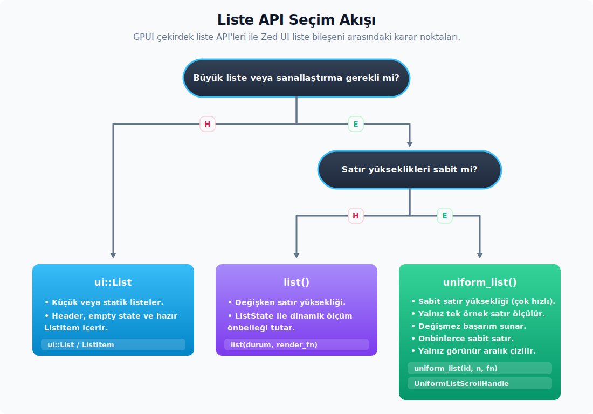

# Liste, Çizim ve Animasyon

---

## ScrollHandle ve Scroll Davranışı

`ScrollHandle`, scroll offset'ini paylaşılabilir bir handle olarak tutar. `Rc<RefCell<ScrollHandleState>>` üzerinden çalışır ve view'lar arasında ucuz biçimde klonlanabilir. Aynı handle birden fazla yerden okunup değiştirilebilir.

**Genel API.** Handle üzerinden erişilebilen başlıca metotlar şunlardır:

- `ScrollHandle::new()` — yeni handle.
- `offset() -> Point<Pixels>` — anlık scroll konumu.
- `max_offset() -> Point<Pixels>` — alınabilecek azami offset.
- `top_item()`, `bottom_item()` — görünür ilk ve son alt öğe dizini.
- `bounds()` — scroll kapsayıcısının sınırları.
- `bounds_for_item(ix)` — verdiğin alt öğenin sınırları.
- `scroll_to_item(ix)`, `scroll_to_top_of_item(ix)` — prepaint aşamasında istenilen öğeye scroll eder.
- `scroll_to_bottom()`
- `set_offset(point)` — offset'i doğrudan ayarlar. Offset, içerik orijininin üst öğe orijinine uzaklığıdır; aşağı kaydıkça Y genelde negatife gider.
- `logical_scroll_top()`, `logical_scroll_bottom()` — görünür alt öğe index'ini ve alt öğe içi piksel offset'ini döndürür.
- `children_count()` — scroll edilen alt öğe sayısı.

**Element üzerine bağlama.** Bir handle'ı div elementine iliştirmek için stateful scroll API'leri tercih edilir:

```rust
let tutamac = ScrollHandle::new();

div()
    .id("liste")
    .overflow_y_scroll()
    .track_scroll(&tutamac)
    .child(/* ... */)
```

`overflow_scroll`, `overflow_x_scroll` ve `overflow_y_scroll` `StatefulInteractiveElement` metotlarıdır; pratikte önce `.id(...)` çağrısı yapılarak `Stateful<Div>` üretilir. Overflow `Scroll` değerini aldığında, girdi wheel (tekerlek) veya dokunma (touch) olayları bu kapsayıcı bünyesinde tüketilir. `track_scroll` aynı handle'ı çizim geçişleri arasında bağlar; bu sayede handle başka alanlardan da okunup güncellenebilir.

`ScrollAnchor` (`div`) bir handle ile çalışan yardımcıdır. Ağaçta doğrudan alt öğe olmayan bir elementin görünür kalmasını ister:

```rust
let capa = ScrollAnchor::for_handle(tutamac.clone());

div()
    .id("secili-satir")
    .anchor_scroll(Some(capa.clone()))
    .child(/* ... */);

capa.scroll_to(window, cx); // sonraki frame'de handle offset'ini ayarlar
```

**Dikkat Noktaları.** Scroll handle ile çalışırken gözden kaçabilecek noktalar:

- `id(...)` çağrılmadığında `overflow_*_scroll` çalışmaz ve element etkileşime açık hale gelmez.
- `track_scroll` çağırılmadığında handle değerleri güncel kalmaz ve offset değeri doğru okunamaz.
- Klavye ile scroll tetiklemek için `.on_key_down(...)` dinleyicisi veya bir action aracılığıyla `scroll_to_item` çağrısı yapılır; otomatik bir klavye scroll mekanizması bulunmamaktadır.

**Liste elementlerine özel durum/handle tipleri.** Büyük ölçekli listelerde `ScrollHandle` yerine şu tipler tercih edilir:

- `ListState` — `scroll_by`, `scroll_to`, `scroll_to_reveal_item`, `scroll_to_end`, `set_follow_mode(FollowMode::Tail)`, `logical_scroll_top`, `is_scrolled_to_end`, `is_following_tail`, `viewport_bounds`, `item_is_above_viewport`, `item_is_below_viewport`.
- `UniformListScrollHandle` — `scroll_to_item(..., ScrollStrategy)`, `scroll_to_item_strict`, `scroll_to_item_with_offset`, `scroll_to_item_strict_with_offset`, `is_scrollable`, `is_scrolled_to_end`, `scroll_to_bottom`, `y_flipped`. `logical_scroll_top_index` yalnız `test-support` veya test derlemesinde public olur.

## List ve UniformList Sanallaştırma

GPUI'de büyük listeler için iki çekirdek element vardır. İkisi farklı liste ihtiyaçları için tasarlanmıştır:



- `list(durum, ogeyi_render_et)` — item yükseklikleri değişebilir. Ölçüm önbelleği `ListState` yapısı içerisinde tutulur.
- `uniform_list(id, item_count, render_range)` — tüm öğelerin (item) yüksekliği aynı olduğunda daha yüksek performans sağlar; ilk veya örnek öğe ölçülerek yalnızca görünür aralık çizilir.

**Değişken yükseklikli liste.** Liste durumu view (görünüm) içerisinde tutulur ve veri seti değiştiğinde ilgili yardımcı metotlar çağrılır:

```rust
struct GunlukGorunumu {
    satirlar: Vec<Satir>,
    liste_durumu: ListState,
}

impl GunlukGorunumu {
    fn new() -> Self {
        Self {
            satirlar: Vec::new(),
            liste_durumu: ListState::new(0, ListAlignment::Top, px(300.)),
        }
    }

    fn satirlari_degistir(&mut self, satirlar: Vec<Satir>, cx: &mut Context<Self>) {
        self.satirlar = satirlar;
        self.liste_durumu.reset(self.satirlar.len());
        cx.notify();
    }
}
```

Çizim aşamasında öğe oluşturucu (item builder) closure yapısı tanımlanır:

```rust
list(self.liste_durumu.clone(), |sira, window, cx| {
    satiri_render_et(sira, window, cx).into_any_element()
})
.with_sizing_behavior(ListSizingBehavior::Auto)
```

**`ListState` yönetimi.** Liste durumunu tutan tipin yüzeyi geniştir. Her metot ayrı bir senaryoya karşılık gelir:

- `new(item_count, alignment, overdraw)` — yapıcı.
- `measure_all()` (consuming) — `ListMeasuringBehavior::Measure(false)` ayarlayarak scrollbar boyutunun yalnız çizilmiş elementlere değil **tüm liste** ölçümüne dayanmasını sağlar.
- `item_count() -> usize` — o anki item sayısı.
- `reset(count)` — tüm item kümesi değişti.
- `splice(old_range, count)` — aralık değişti; scroll offset korunur.
- `splice_focusable(old_range, focus_handles)` — odaklanabilir öğeler sanallaştırılıyorsa focus handle dizisi iletilir; aksi takdirde görünür olmayan ve odaktaki öğe çizim dışı kalabilir.
- `remeasure()` — font veya tema gibi tüm yükseklikleri etkileyen değişim.
- `remeasure_items(range)` — akışlı metin veya tembel içerik gibi belirli öğeler.
- `set_follow_mode(FollowMode::Tail)` — sohbet veya günlük gibi tail-follow davranışı.
- `is_following_tail() -> bool` — aktif takip durumu.
- `is_scrolled_to_end() -> Option<bool>` — en alta scroll mu? Henüz yerleşim yapılmamışsa `None`.
- `scroll_by(distance)`, `scroll_to_end()`, `scroll_to(ListOffset)`, `scroll_to_reveal_item(ix)`.
- `logical_scroll_top() -> ListOffset` — aktif scroll konumu.
- `bounds_for_item(ix) -> Option<Bounds<Pixels>>` — çizilmişse item rect'i.
- `viewport_bounds() -> Bounds<Pixels>` — son layout'ta ölçülen viewport rect'i.
- `item_is_above_viewport(ix) -> Option<bool>` — item'ın viewport'un üstünde kalıp kalmadığını söyler; ölçüm yoksa `None`.
- `item_is_below_viewport(ix) -> Option<bool>` — item'ın viewport'un altında kalıp kalmadığını söyler; ölçüm yoksa `None`.
- `set_scroll_handler(...)` — `ListScrollEvent` ile `visible_range`, `count`, `is_scrolled` ve `is_following_tail` bilgileri izlenebilir.

**Özel scrollbar API'si.** Özel bir scrollbar bileşeni tasarlanırken bu metotlar üzerinden işlem yapılır (`ui::Scrollbars` da bu arayüz temel alınarak yapılandırılmıştır):

- `viewport_bounds() -> Bounds<Pixels>` — en son yerleşim yapılmış viewport rect'i.
- `item_is_above_viewport(ix)` ve `item_is_below_viewport(ix)` — özel scrollbar, jump marker veya sanal arama sonucu göstergelerinde "hedef görünür alanın dışında mı?" sorusunu cevaplar. Bu sorgular item ölçümü veya viewport bilgisi hazır değilse `None` döndürür; bu durumda UI kararı bir sonraki layout'a bırakılmalıdır.
- `scroll_px_offset_for_scrollbar() -> Point<Pixels>` — scrollbar için uyarlanmış güncel scroll konumu.
- `max_offset_for_scrollbar() -> Point<Pixels>` — ölçülmüş item'lara göre maksimum scroll. Sürükleme sırasında bu değer sabit kalır; böylece scrollbar sıçramaz.
- `set_offset_from_scrollbar(point)` — scrollbar sürüklemesinden veya tıklamasından gelen offset'i uygular.
- `scrollbar_drag_started()` / `scrollbar_drag_ended()` — sürükleme sırasında overdraw ölçümünden kaynaklı yükseklik dalgalanmasını dondurmak veya serbest bırakmak için. Sürüklemeye girerken `started`, bırakırken `ended` çağrılmazsa scrollbar sürükleme boyunca beklenmedik biçimde kayabilir.
- `is_scrollbar_dragging() -> bool` — `scrollbar_drag_started` ile `scrollbar_drag_ended` arasındaki elle sürükleme durumunu okur. Wheel veya trackpad scroll ile scrollbar thumb sürüklemesini ayırmak için kullanılır; sürükleme esnasında otomatik tail-follow davranışını bastırmak için bu durumun okunması gerekir.
- `set_offset_from_scrollbar(point)` tarafında scroll offset'inin Y bileşeni, içerik yukarı kaydıkça negatiftir; özel scrollbar yazarken pozitif "başlangıçtan uzaklık" yerine `point(px(0.), -distance)` üretmek doğru sonucu verir. Sürükleme sırasında içerik büyürse başlangıçtaki içerik yüksekliği dondurulur; thumb donmuş alta sürüklenirse `FollowMode::Tail` tekrar `is_following = true` olur.

**Uniform liste.** Sabit yükseklikli item'larda virtualizasyon daha agresiftir:

```rust
let kaydirma_tutamagi = self.kaydirma_tutamagi.clone();

uniform_list("arama-sonuclari", self.ogeler.len(), move |aralik, window, cx| {
    aralik
        .map(|sira| sonucu_render_et(sira, window, cx))
        .collect()
})
.track_scroll(&kaydirma_tutamagi)
.with_width_from_item(Some(0))
```

`UniformListScrollHandle` üzerindeki metotlar listenin tipik scroll ihtiyaçlarını karşılar. `scroll_to_item(ix, strategy)` non-strict davranır: hedef satır zaten tamamen görünüyorsa pozisyonu değiştirmez, görünmüyorsa seçilen `ScrollStrategy` ile onu görünür alana alacak en küçük hareketi yapar. `scroll_to_item_strict(ix, strategy)` aynı hedefi her çağrıda stratejinin tam konumuna taşır; seçili satırı ekranın merkezine sabitlemek veya odak değişiminde deterministik kaydırma yapmak için uygundur.

`scroll_to_item_with_offset(ix, strategy, offset)` hedef pozisyonu satır sayısı cinsinden bir tamponla hesaplar. `ScrollStrategy::Top` ve `ScrollStrategy::Center` için etkili görünüm üstten, `ScrollStrategy::Bottom` için alttan daralır; böylece seçili öğenin çevresinde bağlam satırları bırakılabilir. Strict sürümü, hedef görünür olsa bile bu tamponlu pozisyonu yeniden uygular. `scroll_to_bottom()` listenin sonuna gitmek için hazır kısayoldur. `is_scrollable()` içerik yüksekliği görünüm yüksekliğini aşıyorsa `true` döner; `is_scrolled_to_end()` liste kaydırılabilir değilse `None`, aksi halde son konuma ulaşılaşıp ulaşılmadığını bildirir. `y_flipped(true)` item 0 altta olacak şekilde akışı ters çevirir; yeni öğelerin altta belirdiği akışlarda tercih edilir.

**Karar.** Tercih edilecek liste türü şu kurallara göre belirlenir:

- Öğe yükseklikleri tamamen aynıysa `uniform_list` yapısı tercih edilir.
- Yükseklik değişkenlik gösterebiliyorsa `list` ve doğru `splice`/`remeasure` çağrıları tercih edilmelidir.
- Odaklanabilir öğeler sanallaştırılıyorsa `splice_focusable` ile focus handle iletilmelidir; aksi takdirde görünür olmayan ve odaklanmış öğe çizim dışı kalabilir.

---

## Asset, Image ve SVG Yükleme

`Asset` trait'i asenkron yükleyici sözleşmesidir; her özel kaynak türü bu trait'i uygular:

```rust
pub trait Asset: 'static {
    type Source: Clone + Hash + Send;
    type Output: Clone + Send;

    fn load(
        source: Self::Source,
        cx: &mut App,
    ) -> impl Future<Output = Self::Output> + Send + 'static;
}
```

**Kaynak gösterimi.** Asset adresi farklı yerlerden gelebilir. `Resource` enum'u bu seçenekleri toplar:

- `Resource::Path(Arc<Path>)`
- `Resource::Uri(SharedUri)` — `http://`, `https://`, `file://` vb.
- `Resource::Embedded(SharedString)` — `AssetSource` üzerinden gömülü asset.

`AssetSource` trait'i `App::with_assets` ile kurulan genel asset sağlayıcısıdır. `assets` Zed binary'sinde `RustEmbed` ile SVG ve ikonları gömer. Kayıtlı kaynaklar gerektiğinde `cx.asset_source()` ile okunabilir; çoğu arayüz kodu bu yapıya doğrudan erişmek yerine `Resource::Embedded`, `svg().path(...)` veya `window.use_asset` sarmalayıcılarını tercih eder.

**Görsel elementi.** `img` çağrısı farklı kaynak tiplerini kabul eder ve yükleme/yedek slotları sunar:

```rust
img(PathBuf::from("yol/ikon.png"))
    .w(px(24.))
    .h(px(24.))
    .object_fit(ObjectFit::Contain)
    .with_loading(|| div().bg(rgb(0xeeeeee)).into_any_element())
    .with_fallback(|| div().bg(rgb(0xffeeee)).into_any_element())
```

`img(impl Into<ImageSource>)` argümanları şu şekillerde gelebilir:

- `Resource(Resource)`
- `Render(Arc<RenderImage>)` — önceden rasterize edilmiş kareler.
- `Image(Arc<Image>)` — `ImageFormat` ile etiketlenmiş kodlanmış byte'lar.
- `Custom(Arc<dyn Fn(&mut Window, &mut App) -> Option<Result<Arc<RenderImage>, ImageCacheError>>>)`

URL biçimindeki string ifadeler otomatik olarak `Uri` şeklinde ayrıştırılır. URL formatında olmayan `&str` veya `String` değerleri `Resource::Embedded` kabul edilerek `AssetSource` bünyesinde aranır. Dosya sistemi yolları (path) için ise `Path`, `PathBuf` veya `Arc<Path>` iletilmelidir.

**SVG.** Vektör çizimi için ayrı bir element vardır:

```rust
svg().path("icons/check.svg").size(px(16.)).text_color(rgb(0x000000))
```

SVG dosya yolu `AssetSource` üzerinden okunur. `text_color` özelliği, SVG içerisindeki `currentColor` referanslarının renklendirilmesinde tercih edilir. Özel path string ifadeleri yerine, türetilmiş `IconName::path()` değeri de iletilebilir (Zed bünyesinde `Icon::new(IconName::Check)` doğrudan kullanılmaktadır).

Pratikte seçim şu şekilde gerçekleştirilir:

```rust
let avatar_adresi: SharedUri = "https://example.com/avatar.png".into();

h_flex()
    .gap_2()
    .child(
        Icon::new(IconName::Check)
            .size(IconSize::Small)
            .color(Color::Success),
    )
    .child(
        svg()
            .path("icons/warning.svg")
            .size(px(16.))
            .text_color(cx.theme().colors().icon),
    )
    .child(
        img(avatar_adresi.clone())
            .size(px(32.))
            .rounded_full()
            .object_fit(ObjectFit::Cover),
    )
```

Zed'in bilinen ikon setinden bir simge çizilecekse `Icon::new(IconName::...)` en okunaklı yoldur; tema rengi, boyut ve Zed UI sözleşmeleri bu bileşende toplanır. `svg().path(...)` metodu, URL veya dosya kaynaklı raster görsel çizimlerinde ise `img(...)` yapısı tercih edilir.

**Önbellek davranışı.** İki katmanlıdır: `window.use_asset::<A>(kaynak, cx)` aynı asset türü ve kaynak için tek asenkron yükleme görevini paylaşır ve ilk yükleme tamamlandığında o anki view'i sonraki frame'de yeniden çizdirir. `window.get_asset::<A>(...)` aynı görevi yoklar, fakat tamamlanınca redraw planlamaz. `ImageCache` ise kodu çözülmüş `RenderImage` nesnesini tutar. Element bazında `.image_cache(&varlik)` veya ağacın üst seviyesinde `image_cache(retain_all("id"))` kullanılabilir. Hata kaydı `ImgResourceLoader = AssetLogger<...>` ile otomatiktir.

**Dikkat Noktaları.** Asset yükleme işlemlerinde karşılaşılabilecek durumlar:

- URL ayrıştırma işlemi başarısız olduğunda string değer gömülü (embedded) asset kabul edilir; gerçek dosya yolları için `PathBuf` tercih edilmediğinde yanlış kaynakta arama yapılmasına sebep olunur.
- Özel closure yapısı `'static` ömre (lifetime) sahip olmalıdır; `Window` ve `App` nesneleri yalnızca closure çağrısı esnasında parametre olarak kullanılmalıdır.
- `with_fallback` yalnız yükleme tamamlandığında ve hatalıysa yedeği çizer.
- `with_loading` yükleme 200 ms'den uzun sürerse yükleme yedeğini çizer. Bu eşik `gpui::LOADING_DELAY: Duration` sabitiyle tanımlıdır (`elements/img`); benzer gecikmeli yedek akışlarında da aynı süre değerinden yararlanılabilir.
- `RenderImage` GIF veya animasyonlu WebP için `frame_count()` ve `delay(frame_index)` sağlar. `img` elementi aktif pencerede kare ilerletir ve animasyon karesi ister.
- Yol sınıflandırıcı veya ayarlar güvenlik kontrolü yazarken macOS ve Windows'un varsayılan büyük/küçük harfe duyarsız dosya sistemlerinin atlanmaması gerekir. `util::paths::component_matches_ignore_ascii_case(component, ".zed")` gibi ASCII duyarsız yardımcı fonksiyonlar tercih edilmeli; `.ZED/settings.json` gibi varyasyonlar düz `== ".zed"` karşılaştırmasıyla atlanmamalıdır.

## Asset, ImageCache ve Surface Boru Hattı

GPUI asset katmanı üç seviyelidir ve her seviye ayrı bir sorumluluk taşır:

- `AssetSource` — embedded veya statik asset byte'larını sağlar.
- `Asset` — asenkron yükleyici trait'i; `Source -> Output`.
- `Resource` — görsel veya SVG kaynak adresi: `Uri(SharedUri)`, `Path(Arc<Path>)`, `Embedded(SharedString)`.

**Görsel önbellek elementleri.** Bir alt ağaç için görsel önbelleğini çevrelemenin iki yolu vardır:

```rust
div()
    .image_cache(retain_all("avatarlar"))
    .child(img(avatar_kaynagi.clone()).object_fit(ObjectFit::Cover))
```

Alternatif olarak sarmalayıcı element tercih edilebilir:

```rust
image_cache(retain_all("onizleme-onbellegi"))
    .child(img(onizleme_yolu.clone()))
```

**`RetainAllImageCache`.** Ana önbellek uygulaması birkaç metot sağlar:

- `RetainAllImageCache::new(cx)` entity önbelleği oluşturur.
- `retain_all(id)` element-yerel önbellek sağlayıcısı üretir.
- `load(resource, window, cx)` sonuç hazır değilse `None`, hazırsa `Some(Result<Arc<RenderImage>, ImageCacheError>)` döndürür.
- Bellekten bırakma (drop) esnasında `cx.drop_image(...)` ile GPU görsel kaynakları serbest bırakılır.

**Özel önbellek.** Özel bir önbellek mantığına ihtiyaç duyulduğunda `ImageCache` trait'i implement edilir:

```rust
impl ImageCache for GorselOnbellegi {
    fn load(
        &mut self,
        kaynak: &Resource,
        window: &mut Window,
        cx: &mut App,
    ) -> Option<Result<Arc<RenderImage>, ImageCacheError>> {
        self.yukle_veya_sorgula(kaynak, window, cx)
    }
}
```

**Surface Yapısı.** Ayrı bir yöntem izler: macOS üzerinde `CVPixelBuffer` gibi platform surface kaynaklarını `surface(buffer).object_fit(...)` ile çizmek için tercih edilir. Genel görsel asset önbelleği yerine `window.paint_surface(...)` boru hattını kullanır ve güncel durumda platform bağımlıdır.

**Dikkat Noktaları.** Önbellek ve surface işlemlerinde gözden kaçabilecek noktalar:

- Önbellek ID'si değişirse kodu çözülmüş görsel durumu düşer.
- `img("literal")` ifadesi URL formatında değilse gömülü (embedded) kaynak olarak yorumlanır; dosya sistemi yolları için `PathBuf` veya `Arc<Path>` iletilmelidir.
- Çok büyük veya sürekli güncellenen görsel kümelerinde `RetainAllImageCache` yapısı sınırsız büyüme gösterebilir; özel tahliye (eviction) stratejileri gerektiğinde özel bir `ImageCache` uygulaması yazılmalıdır.

## GPUI Görsel, SVG ve Asset API Yüzeyi

GPUI görsel hattı hem uygulama geliştiricisine açık elementleri hem de renderer/önbellek taşıyıcılarını içerir. Asset crate'inin kendi gömülü kaynak yönetimi ayrı bir konudur; burada anlatılanlar `gpui` crate'inden gelen çizim ve yükleme yüzeyidir.

**Asset ve Resource.** `Resource::{Path, Uri, Embedded}` görsel veya SVG kaynağının nereden geldiğini söyler. `Asset` trait'i `Source -> Output` asenkron yükleyici sözleşmesidir; `AssetLogger<A>` hata döndüren asset yükleyicisini sarar ve sonucu loglar. `hash(data)` değeri önbellek anahtarı üretiminde tercih edilir. Uygulama kodlarında çoğunlukla özel bir `Asset` implementasyonu yazılması gerekmez; `window.use_asset::<A>(...)`, `img(...)`, `svg()` veya Zed'in `assets` kaynağı üzerinden işlemler yürütülür.

**Raster kaynak tipleri.** `Image` pano ve platform image verisini taşır; `Image::empty()`, `from_bytes(...)`, `id()`, `use_render_image(...)`, `get_render_image(...)`, `remove_asset(...)`, `to_image_data(...)`, `format()` ve `bytes()` görsel byte'ı ile decode edilmiş `RenderImage` arasındaki köprüyü kurar. `ImageFormat::{Png, Jpeg, Webp, Gif, Svg, Bmp, Tiff, Ico, Pnm}` `mime_type()` ve `from_mime_type(...)` ile pano/clipboard ve dosya formatı eşleşmesini sağlar. Arayüz çizimlerinde doğrudan `Image` yerine `img(source)` veya `window.paint_image(...)` kullanımı daha doğal bir yaklaşımdır.

**RenderImage.** `RenderImage::new(...)`, `size(frame_index)`, `as_bytes(frame_index)`, `delay(frame_index)` ve `frame_count()` kodu çözülmüş (decoded) raster kareleri temsil eder. Animasyonlu GIF/WebP formatlarında kare sayısı ve gecikme değerleri buradan okunur; `img` elementi aktif pencerede sonraki kareyi talep eder. `RenderImageParams`, `RenderSvgParams`, `ImageId` ve `ImageLoadingTask` renderer/önbellek parametreleri olup, uygulama durum modellerinde (state model) domain verisi gibi saklanmamalıdır.

**Img ve ImageSource.** `img(source)` `ImageSource::{Resource, Render, Image, Custom}` değerine dönüşebilen kaynakları kabul eder. `Img::extensions()`, `image_cache(...)`, `with_loading(...)`, `with_fallback(...)`, `object_fit(...)` ve style zinciri görsel elementin davranışını belirler. `Img::extensions()` `image::ImageFormat::from_extension` listesini ve `svg` uzantısını kapsar (`avif`, `jpg`, `png`, `gif`, `webp`, `tiff`, `bmp`, `ico`, `qoi`, `svg` vb.). `ImageSource::remove_asset(...)` kaynak değiştiğinde asset sisteminden düşürme için kullanılır; `Custom` ve hazır `Render` kaynaklarında iş yapmaz. `LOADING_DELAY` yavaş yüklenen ağ görsellerinde ani yanıp sönen geçici yer tutucular (placeholder) oluşturmamak için bu gecikme süresine güvenilir.

**ImageCache zinciri.** `image_cache(provider)` element wrapper'ı, `retain_all(id)` hazır sağlayıcısı, `ImageCacheProvider`, `ImageCache`, `AnyImageCache`, `ImageCacheItem`, `RetainAllImageCache`, `RetainAllImageCacheProvider` ve `ImageCacheError` aynı zincirin parçalarıdır. `RetainAllImageCache::new(cx)`, `load(resource, window, cx)`, `remove(resource, window, cx)`, `clear(window, cx)`, `len()` ve `is_empty()` küçük/orta ölçekli görsel kümeleri için yeterlidir. Sınırsız büyüme eğilimi gösteren veya belirli zaman aralıklarıyla tahliye gerektiren cache yapılarında özel bir `ImageCache` uygulaması yazılması önerilir.

**SVG hattı.** `svg()` bir `Svg` elementi üretir. `Svg::path(...)` embedded asset'i, `external_path(...)` dosya sistemi yolunu, `with_transformation(...)` görsel dönüşümü ayarlar. `SvgRenderer::new(...)` ve `render_single_frame(...)` düşük seviyeli rasterizer yüzeyidir; çoğu uygulama `svg()` veya `window.paint_svg(...)` ile kalır. `SvgSize::{Size, ScaleFactor}` raster boyutunu belirler. `SMOOTH_SVG_SCALE_FACTOR` SVG'yi hedefin üstünde çözünürlükte raster edip küçülterek ikon kenarlarını yumuşatır.

| API | Alt özellikler | Kısa anlamı |
| :-- | :-- | :-- |
| `asset_cache` | crate kök reexport | Görsel/asset cache altyapısını kök namespace'e taşır; normal kullanım `img`, `svg`, `window.use_asset` sarmalayıcılarıdır. |
| `SvgSize` | `Size`, `ScaleFactor` | SVG raster boyutunu mutlak device pixel veya SVG intrinsic boyutuna göre çarpan olarak belirler. |
| `AnyTooltip`, `TooltipId` | tooltip view/mouse/visibility callback, hovered sorgusu | Popover/tooltip çizim isteğini prepaint ve hit-test yaşamına bağlar. |

**Atlas taşıyıcıları.** Renderer tarafında `AtlasKey::{Glyph, Svg, Image}` doku atlasına girecek kaynağın türünü taşır; `AtlasKey::texture_kind()` bu kaynağın `Monochrome`, `Polychrome` veya `Subpixel` atlas dokusuna mı gideceğini döndürür. `AtlasTextureList<T>` platform atlasındaki doku slotlarını yönetir; `drain()` tüm slotları sahipli olarak boşaltmak, `iter_mut()` ise dolu yuvaların yerinde güncellenmesinde tercih edilir. Bu API'ler renderer ve platform arka ucu (backend) seviyesindedir; uygulama bileşeni geliştirilirken görsel kaynakların `img(...)`, `svg()` veya `window.paint_image(...)` düzeyinde yönetilmesi daha doğru bir yaklaşımdır.

**Dönüşüm ve hitbox ayrımı.** SVG `Transformation` ve scene `TransformationMatrix` yalnız görsel primitive'i değiştirir; element layout'u, hitbox ve focus alanı aynı kalır. Görsel olarak döndürülmüş veya ölçeklendirilmiş bir ikonun tıklama alanının da güncellenmesi gerekiyorsa layout boyutu ayrıca ayarlanmalıdır.

## Path Çizimi ve Özel Çizim

GPUI doğrudan path API'si yerine `canvas` elementi ve `PathBuilder` ile vektör çizimi sunar. `PathBuilder`, lyon tessellator'ının ince bir sarmalayıcısıdır.

`canvas(prepaint, paint)` iki closure alır. GPUI'de ayrı bir public `PaintContext` tipi yerine bu closure'lar `Window` ile çalışır. Prepaint closure yapısı hitbox veya ölçüm gibi yerleşim zamanı operasyonlarını yürüterek paint closure'ına aktarılacak bir değer döner. Paint closure ise `window.paint_*` çağrıları aracılığıyla sahneye çizim elemanları (primitive) ekler.

```rust
canvas(
    |sinirlar, window, _cx| {
        // prepaint: hitbox, yerleşim zamanlı durum
        window.insert_hitbox(sinirlar, HitboxBehavior::Normal)
    },
    |sinirlar, _isabet_kutusu, window, _cx| {
        // paint: window.paint_path(...) çağrıları
        let mut yol = PathBuilder::fill();
        yol.move_to(sinirlar.origin);
        yol.line_to(sinirlar.bottom_left());
        yol.line_to(sinirlar.bottom_right());
        yol.close();
        if let Ok(olusan) = yol.build() {
            window.paint_path(olusan, rgb(0x4f46e5));
        }
    },
)
.size_full()
```

**Görsel Reçete: Kart zemini ve kırpılmış iç çizim.** Aynı canvas bünyesinde önce quad, ardından path çizimi gerçekleştirilebilir. Gerektiğinde kırpılmış alt katman da aynı sıraya eklenebilir:

```rust
canvas(
    |sinirlar, window, _cx| {
        window.insert_hitbox(sinirlar, HitboxBehavior::Normal)
    },
    |sinirlar, isabet_kutusu, window, _cx| {
        window.set_cursor_style(CursorStyle::PointingHand, &isabet_kutusu);

        window.paint_quad(
            fill(sinirlar, rgb(0xffffff))
                .corner_radii(Corners::all(px(6.)))
                .border_widths(Edges::all(px(1.)))
                .border_color(rgb(0xd0d7de)),
        );

        let ic_sinirlar = sinirlar.inset(px(6.));
        window.paint_layer(ic_sinirlar, |window| {
            let mut yol = PathBuilder::stroke(px(2.));
            yol.move_to(ic_sinirlar.bottom_left());
            yol.line_to(ic_sinirlar.center());
            yol.line_to(ic_sinirlar.top_right());

            if let Ok(olusan) = yol.build() {
                window.paint_path(olusan, rgb(0x16a34a));
            }
        });
    },
)
.size(px(96.))
```

Bu kalıpta `insert_hitbox` prepaint aşamasında çalıştırılır; `set_cursor_style`, `paint_quad`, `paint_path` ve `paint_layer` metotları ise paint aşamasında çağrılır. `paint_layer` iç sınırın dışına taşan çizimleri kırpar ancak hitbox'ı veya layout'u etkilemez.

**`PathBuilder`.** Path inşası adım adım akıcı (fluent) metotlarla gerçekleştirilir:

- `PathBuilder::fill()` veya `PathBuilder::stroke(width)` ile başlatılır.
- `move_to(point)`, `line_to(point)`, `curve_to(to, ctrl)`, `cubic_bezier_to(to, control_a, control_b)`, `arc_to(radii, x_rotation, large_arc, sweep, to)`, `relative_arc_to(...)`, `add_polygon(...)`, `close()`.
- `dash_array(&[Pixels])` yalnızca stroke path'lerde anlamlıdır; tek sayıda değer verilirse SVG/CSS davranışındaki gibi liste iki kez tekrarlanır.
- `transform(...)`, `translate(point)`, `scale(f32)`, ve `rotate(degrees)` metotları, build öncesinde path yapısını dönüştürür.
- `build()` → tessellate edilmiş `Path<Pixels>` döner; hata `?` ile yayılır.

**Tessellator parametreleri** (`PathStyle`, `FillOptions`, `StrokeOptions`, `FillRule`).

GPUI bu tipleri lyon'dan yeniden dışa aktarır (`pub use lyon::tessellation::{FillOptions, FillRule, StrokeOptions}`, `path_builder`). `PathBuilder::with_style(...)`, hazır `fill()` veya `stroke(width)` builder'ının stilini açık bir `PathStyle` ile değiştirmek içindir. `PathBuilder::build_path(buf)` ise lyon tessellator'ından gelen `VertexBuffers` değerini `Path<Pixels>` modeline dönüştüren düşük seviye köprüdür; normal kullanımda `build()` bunu otomatik olarak çağırır. `PathBuilder.style: PathStyle` alanı `pub` görünürlüktedir; iki varyantı vardır:

```rust
pub enum PathStyle {
    Stroke(StrokeOptions),
    Fill(FillOptions),
}
```

Varsayılan yapıcılar, lyon'un varsayılan parametrelerini ayarlar (`PathBuilder::fill()` → `FillOptions::default()`; `PathBuilder::stroke(width)` → `StrokeOptions::default().with_line_width(width.0)`). Bu seçeneklerin özelleştirilmesi gerektiğinde `PathBuilder::with_style(...)` tercih edilebilir veya daha düşük seviyede `path.style` alanı doğrudan güncellenebilir.

- `FillOptions` — `tolerance` (düzleştirme hassasiyeti, varsayılan 0.1), `fill_rule` (`FillRule::{EvenOdd, NonZero}`, SVG `fill-rule` semantiği; varsayılan **`EvenOdd`** — `lyon_tessellation::FillOptions::DEFAULT_FILL_RULE`), `sweep_orientation` (varsayılan `Orientation::Vertical`), `handle_intersections` (varsayılan `true`). Hızlı yardımcılar: `FillOptions::even_odd()`, `FillOptions::non_zero()`, `FillOptions::tolerance(t)`.

| API | Alt özellikler | Kısa anlamı |
| :-- | :-- | :-- |
| `path_builder` | crate kök reexport | Path çizim ve lyon tessellation yardımcılarını kök namespace'e taşır. |
| `Orientation` | `Horizontal`, `Vertical` | Path fill sweep orientation ve erişilebilirlik yön bilgisinde kullanılan ortak yön enum'udur. |
| `ContentMask` | `bounds`, `intersect` | Paint/prepaint sırasında aktif kırpma sınırını taşır. |
| `outline` | bounds, color, border style | `fill`/`quad` gibi modül düzeyinde serbest bir fonksiyondur; ürettiği `PaintQuad`'ı `window.paint_quad(...)` argümanı olarak verilir. |

- `StrokeOptions` — `line_width` (varsayılan 1.0), `start_cap` ve `end_cap` (her sub-path için başlangıç ve bitiş ucu, varsayılan `LineCap::Butt`), `line_join` (varsayılan `LineJoin::Miter`), `miter_limit` (varsayılan 4.0), `tolerance` (varsayılan 0.1). Tüm sabitler `lyon_tessellation::StrokeOptions::{DEFAULT_LINE_CAP, DEFAULT_LINE_JOIN, DEFAULT_MITER_LIMIT, DEFAULT_LINE_WIDTH, DEFAULT_TOLERANCE}` const'larında bulunur.
- `FillRule::EvenOdd` (lyon ve gpui varsayılanı): SVG even-odd kuralıdır; iç içe path'lerde delik oluşturur. İki üst üste binen kapalı path'in çakışan bölgesi şeffaf hale gelir. `FillRule::NonZero`: SVG non-zero winding kuralıdır; yön birleşimine göre kapsama hesaplar, çakışan path'ler genellikle dolu kalır. Karmaşık kompozit şekiller için bilinçli olarak `non_zero()` seçeneği tercih edilmelidir.

Lyon API'sine inmek istenirse `lyon::tessellation::FillOptions::tolerance(0.5)` gibi builder zincirlerini kullanmak mümkündür; GPUI bu builder'ları olduğu gibi yeniden dışa aktardığı için ayrı bir sarmalayıcıya ihtiyaç yoktur.

**Window paint API'leri.** Path veya quad yapıları GPU'ya iletilirken pencere üzerindeki paint metotları tercih edilir:

- `window.paint_path(path, color)` — tessellate edilmiş path.
- `window.paint_quad(quad)` — `fill(bounds, ...).border(...)` kısaltması.
- `window.paint_strikethrough(...)`, `paint_underline(...)`
- `window.paint_image(...)` — raster görsel çizimi.
- `window.paint_layer(bounds, |window| ...)` — aynı çizim sırasında toplanan geometri için yeni bir katman açar; çoğunlukla başarım (performance) ve overdraw denetimi amacıyla tercih edilir.

**Dikkat Noktaları.** Path çizimlerinde dikkat edilmesi gereken hususlar:

- Her karede (frame) yeni path inşa etmek performansı (FPS) düşürür. Mümkün olan durumlarda prepaint aşamasında inşa edilip paint aşamasında yalnızca çizilmelidir.
- Path bounds dışına taşan kısımlar kırpılmaz; bu durumlarda `paint_layer` ile manuel kırpma uygulanmalıdır.
- Stroke genişliği mantıksal Pixels'dir; yüksek çözünürlüklü (DPI) ekranlarda çok ince kalmaması için `px(1.0).max(...)` gibi alt sınır sınırlandırmaları tercih edilir.

## Anchored ve Popover Konumlandırma

`anchored()` fonksiyonu bir `Anchored` builder nesnesi döner. Popover, menü ve tooltip benzeri konumlandırmalar bu element üzerinde yapılandırılır:

```rust
anchored()
    .anchor(Anchor::TopLeft)
    .position(point(px(120.), px(80.)))
    .offset(point(px(0.), px(4.)))
    .snap_to_window_with_margin(Edges::all(px(8.)))
    .child(menu_gorunumu.into_any_element())
```

**API.** Konumlandırmayı belirleyen başlıca metotlar şunlardır:

- `anchor(Anchor)` — alt öğenin hangi referans noktasının `position`'a hizalanacağı. `Anchor` varyantları `TopLeft`, `TopRight`, `BottomLeft`, `BottomRight`, `TopCenter`, `BottomCenter`, `LeftCenter`, `RightCenter`.
- `position(point)` — anchor noktası (window veya yerel koordinatlarda).
- `offset(point)` — hizalama sonrası ek kayma.
- `position_mode(AnchoredPositionMode::Window)` veya `position_mode(AnchoredPositionMode::Local)` — koordinat referansı.
- `snap_to_window()` ve `snap_to_window_with_margin(Edges)` — pencere dışına taşıyorsa aynı anchor'ı koruyarak pencere içine kaydırır.

**`AnchoredFitMode`.** Pencere kenarına yaklaşıldığında nasıl davranılacağı:

- `SwitchAnchor` (varsayılan) — yetersiz alanda ters anchor'a geçilir.
- `SnapToWindow` — aynı köşede kalır, pencere kenarına oturur.
- `SnapToWindowWithMargin(Edges)` — marjin bırakarak oturur.

Anchored element ağaca normal bir alt öğe gibi eklenir; ancak yerleşim fazında üst öğe sınırlarını yok sayar ve mutlak konumlandırma gibi davranır. Tooltip, popover ve ContextMenu altta bu element üzerinde çalışır.

**Dikkat Noktaları.** Anchored kullanımı sırasında karşılaşılabilecek hatalı kullanımlar:

- `Local` modda position üst öğenin içerik orijinine görelidir; window modda ise ekranda mutlak değil, **pencere içi** koordinatlardır.
- Snap fonksiyonları arasında en son çağrılan metot geçerli olur.
- Anchored alt öğesi kendi içerisinde taşma (overflow) durumunda `Visible` davranır; içeriğin pencere dışına taşması durumunda scroll yönetimi için ekstra bir sarmalayıcıya gereksinim duyulur.

## PaintQuad, Window Paint Primitives ve BorderStyle

`canvas` ve özel `Element::paint` içerisinde GPU'ya gönderilen primitive yapıları şu çağrılarla üretilir:

```rust
window.paint_quad(fill(sinirlar, rgb(0xeeeeee)));

window.paint_quad(
    quad(
        sinirlar,
        Corners::all(px(8.)),                  // köşe yarıçapları
        rgb(0xffffff),                         // arka plan
        Edges::all(px(1.)),                    // kenarlık kalınlıkları
        rgb(0xdddddd),                         // kenarlık rengi
        BorderStyle::Solid,                    // veya Dashed
    ),
);

window.paint_quad(outline(sinirlar, rgb(0xff0000), BorderStyle::Solid));
```

**`PaintQuad` builder yardımcıları** (`PaintQuad`). `corner_radii` köşe yuvarlaklığını, `border_widths` her kenarın kalınlığını, `border_color` kenarlık rengi, `background` ise düz renk veya arka plan türünü kurar. Bu yapı layout üretmez; çağıran taraf `bounds` değerini kendisi hesaplar ve GPU boyama kuyruğuna yalnızca çizilecek dikdörtgeni verir.

**Diğer paint API'leri.** Window üzerinde çağırabileceğin paint yardımcıları geniş bir yelpazeyi kapsar:

- `window.paint_path(Path<Pixels>, impl Into<Background>)` — tessellate edilmiş path.
- `window.paint_underline(Point, width, &UnderlineStyle)` — metin alt çizgisi.
- `window.paint_strikethrough(Point, width, &StrikethroughStyle)`.
- `window.paint_glyph(...)` — tek glif rasterize ve çizim. Genellikle `TextLayout` tarafından otomatik kullanılır; doğrudan manuel çağrılması nadiren gerekir.
- `window.paint_emoji(...)` — emoji renk glifi.
- `window.paint_image(bounds, corner_radii, RenderImage, ...)` — raster görsel.
- `window.paint_svg(bounds, path, data, transformation, color, cx)` — `SvgRenderer` atlas önbelleği üzerinden monokrom SVG maskesi.
- `window.paint_surface(bounds, CVPixelBuffer)` — yalnız macOS yerel surface'i.
- `window.paint_drop_shadows(bounds, corner_radii, &[BoxShadow])` — `inset: false` gölge seti; genellikle arka plan ve kenarlık çizimlerinden önce tetiklenir.
- `window.paint_inset_shadows(bounds, corner_radii, &[BoxShadow])` — `inset: true` iç gölge seti; genellikle element arka planından sonra tetiklenir.
- `window.paint_layer(bounds, |window| ...)` — aynı bounds üzerinde kırpma ile yeni çizim katmanı; taşma gizleme ve batch/draw order kontrolü için.

`BorderStyle` (`gpui` crate'i) iki değer alır: `Solid` ve `Dashed`. `Corners<P>`, `Edges<P>`, `Bounds<P>`, `Hsla` ve `Background` zaten önceden bilinen geometri ve renk tipleridir; her builder bunları `Into` üzerinden kabul edinir.

**Dikkat Noktaları.** Paint çağrılarında dikkat edilmesi gereken hususlar:

- `paint_*` çağrıları yalnız `Element::paint` fazında geçerlidir; GPUI kaynak kodu bunu `debug_assert_paint()` ile denetler.
- `paint_path` her karede yeniden tessellate edilirse performans (FPS) olumsuz etkilenir; mümkünse path yapısının prepaint aşamasında oluşturulup element durumunda (state) saklanması önerilir.
- `paint_layer` kırpma uyguladığı için içerik sınırlarının dışına taşan kısımlar gizlenir; gölge gibi dışarı taşan efektlerin katman dışında çizilmesi gerekir.
- `border_widths` dört kenara ayrı değer verebilir (`Edges { top, right, bottom, left }`); tek bir değer tanımlanmak istendiğinde `Edges::all(px(1.))` tercih edilir.

## Scene ve Primitive Alt Katmanı

`Scene`, paint fazında üretilen primitive listesinin sahibidir. Uygulama kodlarında `Scene` yapısının manuel oluşturulması gerekmez; `Window` paint metotları bu yapıyı otomatik olarak doldurur. Yine de özel renderer, test snapshot'ları veya düşük seviyeli çizim araçları yazılırken bu yüzey önem kazanır.

- `Scene::clear()`, `len()`, `push_layer(bounds)`, `pop_layer()`, `insert_primitive(primitive)`, `replay(...)`, `finish()` ve `batches()` çizim listesini yönetir.
- `Primitive` varyantları `Shadow`, `Quad`, `Path`, `Underline`, `MonochromeSprite`, `SubpixelSprite`, `PolychromeSprite` ve `Surface` türlerini taşır; raster image ve SVG çizimleri renderer katmanında sprite primitive'lerine dönüşür. `Primitive::bounds()` ve `content_mask()` çizim alanı ve kırpma bilgisini verir.
- `PrimitiveBatch`, `DrawOrder`, `MonochromeSprite`, `SubpixelSprite`, `PolychromeSprite`, `PaintSurface`, `PathId`, `PathVertex<Pixels>` ve `PathVertex_ScaledPixels` renderer'ın batch ve sprite atlas verileridir. `Scene` bu veriyi `shadows`, `quads`, `underlines`, sprite listeleri ve `surfaces` alanlarında türüne göre saklar.
- `clipped_bounds(...)`, path'in aktif içerik maskesiyle kesilmiş sınırını hesaplar.

Bu tipler "ekrana ne çizilecek?" sorusunun son cevabıdır. Bir buton, liste veya kart bileşeni tasarlarken `Scene` yerine element API'leri tercih edilir; yalnızca GPUI renderer hattı genişletilmek istendiğinde primitive seviyesine inilir.

## Çizim Bağlamı Yığını, Asset Çekme ve SVG Dönüşümü

Özel element yazarken `Window` yalnızca paint primitive çağrılarının yeri değildir; çizim fazlarında aktif stil, offset, kırpma ve asset yükleme bağlamını da taşır.

**Bağlam yığını yardımcıları.** Geçici olarak farklı stil, rem veya kırpma sınırları gerektiğinde yığına ekleme yapılır:

- `window.with_text_style(Some(TextStyleRefinement), |window| ...)` — aktif metin stili yığınına refinement ekler. İçeride `window.text_style()` birleşmiş sonucu verir.
- `window.with_rem_size(Some(px(...)), |window| ...)` — rem üzerine yazma yığını; içeride `window.rem_size()` üzerine yazılan değeri döndürür.
- `window.set_rem_size(px(...))` — pencerenin temel rem değerini kalıcı değiştirir.
- `window.with_content_mask(Some(ContentMask { bounds }), |window| ...)` — mevcut maske ile `ContentMask::intersect(...)` üzerinden kesişim alır; paint veya prepaint içindeki `content_mask()` bu aktif kırpmayı verir.
- `window.with_image_cache(Some(cache), |window| ...)` — alt ağaç için aktif görsel önbellek yığınını değiştirir. `ImageCacheElement` ve `Div` arka plan görseli yolları bunu kullanır; normal bileşen kodu çoğunlukla `image_cache(retain_all(...))` fluent API'sini tercih eder.
- `window.with_element_offset(offset, |window| ...)` ve `with_absolute_element_offset(offset, |window| ...)` — prepaint sırasında alt öğe offset'ini değiştirir. Scroll ve list uygulamalarının hitbox ve yerleşim koordinatlarını doğru üretmesi bu API'lere dayanır.
- `window.element_offset()` — prepaint sırasında aktif offset'i okur.
- `window.transact(|window| -> Result<_, _> { ... })` — prepaint yan etkilerini deneme amaçlı yapar; closure `Err` döndüğünde hitbox/tooltip/dispatch/yerleşim kayıtları eski index'e kısaltılır.

**Kare ve paint yardımcıları.** Pencere üzerindeki bazı işler doğrudan çizim bağlamını etkiler:

- `window.set_window_cursor_style(style)` — hitbox'a bağlı olmayan, tüm pencere için imleç isteği. Paint fazında çağrılır ve hitbox imleçlerine göre önceliklidir.
- `window.set_tooltip(AnyTooltip) -> TooltipId` — tooltip isteği prepaint fazında kaydedilir; kaynak gövdede `debug_assert_prepaint()` ile denetlenir.
- `window.paint_svg(...)` — `SvgRenderer` ve sprite atlas üzerinden monokrom SVG maskesi çizer. SVG her zaman hedef boyutun `gpui::SMOOTH_SVG_SCALE_FACTOR: f32 = 2.0` (`svg_renderer`) katı çözünürlükte rasterize edilip sonra küçültülür; bu nedenle `paint_svg` çağrısı küçük ikon boyutlarında bile yumuşak kenar üretir. `paint_image` kodu çözülmüş raster kare, `paint_surface` ise macOS yerel surface'i içindir.

**Jenerik asset yükleme.** Asset bekleme ve önbellek paylaşımı için üç yardımcı bulunur:

```rust
if let Some(sonuc) = window.use_asset::<BenimVarligim>(&kaynak, cx) {
    yukleneni_render_et(sonuc, window, cx);
}
```

- `window.use_asset::<A>(&kaynak, cx) -> Option<A::Output>` — yükleme tamamlanmadığında `None` döner ve ilk yükleme bittiğinde ilgili view yapısının bir sonraki karede güncellenmesini tetikler.
- `window.get_asset::<A>(&kaynak, cx) -> Option<A::Output>` — önbelleği yoklar ancak tamamlandığında view yeniden çizimi planlamaz.
- `cx.fetch_asset::<A>(&kaynak) -> (Shared<Task<A::Output>>, bool)` — daha düşük seviye ortak görev önbelleği; aynı asset türü ve kaynağı için tek `Asset::load` future'ı paylaşılır.
- `AssetLogger<T>` — `Asset<Output = Result<R, E>>` yükleyicisini sarar ve hata sonucunu loglar.

**SVG dönüşümü.** SVG elementi kendi içinde dönüşüm desteği sağlar:

```rust
svg()
    .path("icons/check.svg")
    .with_transformation(
        Transformation::rotate(radians(0.2))
            .with_scaling(size(1.2, 1.2))
            .with_translation(point(px(2.), px(0.))),
    )
```

- `svg().path(...)` — embedded `AssetSource` içinden SVG okur.
- `svg().external_path(...)` — dosya sistemi path'inden okur.
- `Transformation::{scale, translate, rotate}` ve `with_scaling`/`with_translation`/`with_rotation` yalnızca çizimi etkiler; hitbox ve yerleşim boyutu değişmez.
- Düşük seviyeli `TransformationMatrix::{unit, translate, rotate, scale}` sahne primitive'leri üzerinde tercih edilir.
- `SvgSize` `SvgRenderer` çizim isteğinin raster boyutunu tanımlar: `Size(Size<DevicePixels>)` mutlak boyut, `ScaleFactor(f32)` SVG'nin bildirdiği boyuta çarpan uygular.

**Dikkat Noktaları.** Bu çizim bağlamı API'lerinde dikkat edilmesi gereken hususlar:

- `with_content_mask` yalnızca kırpma maskesidir; hitbox veya yerleşimi otomatik küçültmez.
- `use_asset` yeniden çizimi o anki view entity'sine bağlar; view dışı bir yardımcı fonksiyonda çağrılıyorsa, o anki view beklentisinin bozulmamasına dikkat edilmelidir.
- SVG dönüşümü görsel olarak döndürür ya da ölçeklendirir, ancak işaretçi hitbox'ı eski yerleşim rect'inde kalır.

---

## Animasyon Sistemi

Animasyon API'si `gpui` crate'inde yer alır.

`Animation` üç alandan oluşur: `duration: Duration`, `oneshot: bool` (false ise tekrar eder), `easing: Rc<dyn Fn(f32) -> f32>`. İnşa için `Animation::new(duration)` doğrusal easing ile tek seferlik animasyon oluşturur. `.repeat()` döngüye alır, `.with_easing(fn)` easing'i değiştirir.

`AnimationExt` trait'i herhangi bir `IntoElement` için iki metot ekler:

```rust
use gpui::{Animation, AnimationExt};
use std::time::Duration;

div()
    .size(px(100.))
    .with_animation(
        "buyu",
        Animation::new(Duration::from_millis(500))
            .with_easing(gpui::ease_in_out),
        |oge, ilerleme| oge.size(px(100. + 100. * ilerleme)),
    )
```

Çoklu animasyon zinciri için `with_animations(id, vec![anim_a, anim_b], |el, ix, delta| ...)` kalıbı kullanılır. Closure'a (element, animation_index, delta_in_animation) parametreleri verilir; `ix` aktif animasyonun vec içindeki sırası, `delta` ise o animasyona göre 0..1 ilerlemesidir. Sıralı veya çoklu fazlı geçişler tasarlanırken `ix` değeri üzerinden eşleşme (`match`) kurulabilir.

**Yerleşik easing fonksiyonları** (`gpui` crate'i): `linear`, `quadratic`, `ease_in_out`, `ease_out_quint()`, `bounce(inner)`, `pulsating_between(min, max)`. `pulsating_between` yön değiştirerek değer döndürür (yükleme göstergeleri için idealdir; `Animation::repeat()` ile birleştirilebilir).

| API | Alt özellikler | Kısa anlamı |
| :-- | :-- | :-- |
| `pulsating_between` | min/max arası yön değiştiren easing | Tekrarlanan animasyonlarda nefes alma/yükleme göstergesi benzeri değer üretir. |

**Dikkat Noktaları.** Animasyon kullanımında gözden kaçabilecek noktalar:

- Element ID çizim boyunca sabit olmalıdır; değiştiği anda animasyon durumu sıfırlanır.
- Animator closure yapısı `'static` olduğundan dış durum `Rc`, `Arc` veya `clone` ile yakalanmalıdır.
- Tekrarlanan animasyonlar `window.request_animation_frame()` ile bir sonraki kareyi talep eder; bu da mevcut view yapısının bir sonraki karede güncellenmesini tetikler. İhtiyaç duyulmayan durumlarda animasyon `oneshot` (tek seferlik) olarak bırakılmalıdır.
- Kareler arası ilerleme değeri executor saatinden hesaplanır; normal `TestAppContext`/`VisualTestContext` testlerinde `cx.background_executor.advance_clock(...)` veya `TestApp::advance_clock(...)` metotları tercih edilir. macOS'a özel `VisualTestAppContext` üzerinde ayrıca doğrudan `advance_clock(...)` yardımcısı vardır.

---
