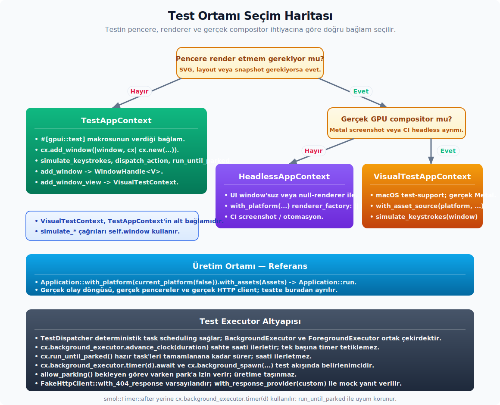

# Test, Inspector ve Düşük Seviye API

**Public API kapsamı.** Bu başlık altında ayrı alt başlık açmayı gerektirmeyen public alt yüzeyler:

| Konu | Grup | API | Not |
|---|---|---|---|
| `Inspector` | Metotlar | `active_element_id`, `is_picking`, `render_inspector_states`, `start_picking` | Builder, sorgu veya runtime çağrıları; ayrıntı bu konu anlatımındaki kullanım bağlamıyla okunur. |


---

## Test Rehberi

GPUI test yazımında izlediğin genel disiplinler şunlar:

- `#[gpui::test]` makrosunu ve `TestAppContext`'i kullanırsın.
- Pencere gerektiğinde test context'inin offscreen veya window yardımcılarını tercih edersin.
- Async timer için `cx.background_executor().timer(duration).await` çağrısını kullanırsın.
- UI action testlerinde keybinding ve action dispatch'i doğrudan test edersin.
- Görsel test gerektiğinde `VisualTestContext`'i ve başsız renderer desteğini kontrol edersin.
- Element hata ayıklama sınırları gerektiğinde test-support altında `.debug_selector(...)` eklersin.
- `gpui` `proptest` özelliği açıkken `Hsla` için `Arbitrary` uygulaması ve `Hsla::opaque_strategy()` yardımcısı bulunur. Renk veya kontrast property testlerinde alfa 1.0 olan rastgele renk üretmek için bu yardımcıyı kullanırsın.

**Testlerde kaçındığın kalıplar.** Aşağıdaki desenler test sonuçlarını güvenilmez yapar:

- `smol::Timer::after(...)` çağrısıyla `run_until_parked()` beklemek.
- Test dışı üretim yoluna panik taşıyan kısa yollar kullanmak.
- Async hata sonuçlarını `let _ = ...` ile sessizce yutmak.

## Test Bağlamları ve Simülasyon




`crates/gpui/src/app/test_context.rs`, `crates/gpui/src/app/visual_test_context.rs`.

`#[gpui::test]` makrosu bir `TestAppContext` sağlar. Görsel test için `add_window` bir `WindowHandle<V>` döndürür ve `VisualTestContext` ile sürersin. İsim benzerliğine dikkat: `VisualTestContext` test penceresini kendi içinde tutar; macOS `test-support` altındaki `VisualTestAppContext` ise window handle'ı açık argüman olarak alan ayrı bir bağlamdır.

```rust
#[gpui::test]
fn kaydetmeyi_test_et(cx: &mut TestAppContext) {
    let window = cx.add_window(|window, cx| {
        cx.new(|cx| Duzenleyici::new(window, cx))
    });

    cx.simulate_keystrokes(window, "cmd-s");
    cx.run_until_parked();

    window.read_with(cx, |duzenleyici, _| {
        assert!(duzenleyici.temiz_mi);
    });
}
```

**Sık kullandığın API'ler.** Test akışında en çok karşılaştığın yardımcılar:

- `TestAppContext::single()` — çoklu istemci kurmayan testlerde tek bir test uygulaması başlatır. `#[gpui::test]` çoğu zaman bunu senin yerine kurar; elle test koşumu yazarken anlamlıdır.
- `cx.add_window(|window, cx| cx.new(...))` — yeni bir offscreen pencere açar.
- `cx.simulate_keystrokes(window, "cmd-s left")` — boşlukla ayrılmış keystroke dizisini simüle eder.
- `cx.simulate_input(window, "hello")` — metin girdisi simulasyonu yapar.
- `cx.dispatch_action(window, action)`.
- `cx.run_until_parked()` — tüm bekleyen future ve task tamamlanana kadar sürer.
- `cx.background_executor.advance_clock(duration)` — deterministik timer ilerletme.
- `cx.background_executor.run_until_parked()` — test executor'ında yalnızca arka plan sürer.
- `window.update(cx, |gorunum, window, cx| ...)` — pencere içi durumu değiştirir.

`add_window_view` veya `add_empty_window` ile aldığın `VisualTestContext` pencere bağlamını taşıdığı için bazı metotları window argümanı almadan çağırabilirsin:

- `cx.simulate_keystrokes("cmd-p")` ve `cx.simulate_input("hello")` — `self.window`'u kullanır.
- `cx.dispatch_action(action)` — yine `self.window` üzerinden dispatch eder.
- `cx.run_until_parked()`, `cx.window_title()`, `cx.document_path()` — window'suz yardımcılardır.

Fare simülasyon metotları `VisualTestContext` üzerinde de `self.window` ile çalışır ve window argümanı almaz (`test_context.rs:764-809`):

- `cx.simulate_mouse_move(position, button, modifiers)`
- `cx.simulate_mouse_down(position, button, modifiers)`
- `cx.simulate_mouse_up(position, button, modifiers)`
- `cx.simulate_click(position, modifiers)`

Pencere argümanı isteyen yardımcılar `TestAppContext` üzerindeki `simulate_keystrokes(window, ...)`, `simulate_input(window, ...)`, `dispatch_action(window, ...)` ve `dispatch_keystroke(window, ...)` ailesidir. `VisualTestContext` bu window handle'ını kendi içinde tuttuğu için aynı klavye ve action yardımcılarını window'suz sarmalayıcılar olarak sunar. `VisualTestAppContext` ise `simulate_keystrokes(window, ...)`, `simulate_mouse_move(window, ...)`, `simulate_click(window, ...)` ve `dispatch_action(window, ...)` biçimindeki window argümanlı formu kullanır.

`AnyWindowHandle::build_entity(cx, |window, cx| ...)`, elde yalnız tip silinmiş pencere handle'ı varken o pencere içinde yeni bir `Entity<V>` kurmanın test yardımcısıdır. `VisualTestContext::deactivate_window()` aktif test penceresini blur eder ve ardından arka plan executor'ını park edene kadar sürer; focus kaybı, menü kapanması veya inactive window stili testlerinde doğrudan bu davranışı doğrularsın.

**Pratik kurallar.** Test akışında dikkat edeceğin noktalar:

- Gerçek tutarlılık için `smol::Timer` yerine `cx.background_executor.timer(d)`'yi tercih edersin.
- `run_until_parked` ile `advance_clock`'u kombine ederken önce clock'u ilerletir, sonra park beklersin. `VisualTestContext` `TestAppContext`'in içine deref ettiği için normal yolda `cx.background_executor.advance_clock(d)` kullanırsın; doğrudan `advance_clock(d)` yardımcısı `VisualTestAppContext` üzerinde yer alır.
- Async test için `#[gpui::test]` `async fn(cx: &mut TestAppContext)` formunu destekler; ön plan task'larını orada `cx.spawn` ile kurarsın.
- Pencerenin gerçekten çizilmesi için `VisualTestContext::draw(...)`, `TestApp::draw()` veya doğrudan `window.draw(cx).clear()` kullanan bir pencere güncellemesi gerekebilir; aksi halde hata ayıklama sınırları veya yerleşim bilgisi üretilmez.

**Tuzaklar.** Test simulasyonunda atladığın noktalar:

- `simulate_keystrokes` action dispatch'ini tetikler ancak keymap binding'inin kayıtlı olması gerekir; testte `cx.bind_keys([...])` çağırmadığında beklenen action ulaşmaz.
- `run_until_parked` zamanı ilerletmez; yalnız bekleyen future'ları sürer. Timer beklediğinde `advance_clock` da yapman gerekir.
- `dispatch_action` odak ağacında action işleyicisi bulamadığında sessizce no-op olur; view'in gerçekten odakta olduğundan emin olman gerekir.

## TestApp, HeadlessAppContext ve Görsel Test Yüzeyi

GPUI test API'si birkaç benzer isimli bağlamdan oluşur. Bunları doğru ayırmak testin hangi düzeyde çalıştığını netleştirir.

**TestApp.** `TestApp` düşük seviyeli uygulama koşumudur; doğrudan kullanmak yerine çoğu testte `#[gpui::test]` ile gelen `TestAppContext` yeterlidir. Doğrudan `TestApp` kullandığında `with_seed(seed)`, `with_text_system(...)`, `with_text_system_and_assets(...)`, `new_entity(...)`, `update_entity(...)`, `read_entity(...)`, `open_window(...)`, `open_window_with_options(...)`, `background_spawn(...)`, `to_async()`, `set_global(...)`, `has_global(...)`, `read_from_clipboard()`, `write_to_clipboard(...)`, `opened_url()`, `did_prompt_for_new_path()`, `simulate_new_path_selection(...)`, `has_pending_prompt()` ve `simulate_prompt_answer(...)` ile uygulama durumunu sürersin. Bu seviye platform davranışını test etmeye yarar; sıradan view testi için daha yüksek `TestAppContext` sarmalayıcıları okunaklıdır.

**TestAppContext.** `TestAppContext` `new_app(...)`, `add_window(...)`, `open_window(...)`, `update(...)`, `read(...)`, `spawn(...)`, `to_async()`, `executor()`, `foreground_executor()`, `background_executor`, `run_until_parked()`, `simulate_keystrokes(...)`, `simulate_input(...)`, `dispatch_keystroke(...)`, `dispatch_action(...)`, `simulate_window_resize(...)`, `set_screen_capture_sources(...)`, `opened_url()`, `expect_restart()`, `pending_prompt()`, `simulate_prompt_answer(...)`, `simulate_new_path_selection(...)`, `read_from_clipboard()`, `write_to_clipboard(...)`, `has_global(...)`, `set_global(...)`, `try_read_global(...)`, `update_global(...)`, `events(...)`, `notifications(...)`, `condition(...)`, `set_name(...)`, `test_function_name()` ve `skip_drawing()` gibi test odaklı yardımcılar sağlar. Testte bir şeyi "oldu mu?" diye beklemek için `condition(...)`, entity event'i için `Entity::next_event(...)`, bildirim için `Entity::next_notification(...)` tercih edilir; sleep koymak deterministik değildir.

**`TestAppWindow<V>`.** `TestAppWindow` tipli pencere handle'ıdır. `root()`, `handle()`, `update(...)`, `read(...)`, `title()`, `draw(...)`, `simulate_keystroke(...)`, `simulate_keystrokes(...)`, `simulate_input(...)`, `simulate_mouse_move(...)`, `simulate_mouse_down(...)`, `simulate_mouse_up(...)`, `simulate_click(...)`, `simulate_scroll(...)`, `simulate_event(...)` ve `simulate_resize(...)` pencereyi doğrudan sürer. Aynı işlemlerin `TestAppContext` veya `VisualTestContext` sarmalayıcıları varsa, testin niyetini daha açık gösteren sarmalayıcıyı seçersin.

**HeadlessAppContext.** Başsız testlerde `HeadlessAppContext::with_platform(...)` ve `with_asset_source(...)` ile uygulama başlatılır; `open_window(...)`, `capture_screenshot(...)`, `run_until_parked()`, `advance_clock(...)`, `allow_parking()` ve `forbid_parking()` ekran olmadan UI akışını sürmeye yarar. Görsel karşılaştırma için renderer desteği gerekir; yalnız state ve async davranış test ediliyorsa başsız bağlam daha hızlıdır.

**VisualTestContext ve VisualTestAppContext.** `VisualTestContext::from_window(...)`, `update(...)`, `dispatch_action(...)`, `dispatch_keystrokes(...)`, `simulate_input(...)`, `simulate_mouse_move(...)`, `simulate_mouse_down(...)`, `simulate_mouse_up(...)`, `simulate_click(...)`, `simulate_modifiers_change(...)`, `simulate_capslock_change(...)`, `simulate_resize(...)`, `simulate_event(...)`, `simulate_close(...)`, `draw(...)`, `debug_bounds(...)`, `window_title()`, `document_path()`, `run_until_parked()` ve `into_mut()` tek pencereyi görsel olarak doğrular. macOS test-support tarafındaki `VisualTestAppContext` ise `open_offscreen_window(...)`, `open_offscreen_window_default(...)`, `capture_screenshot(...)`, `wait_for(...)`, `wait_for_animations()`, `is_screen_capture_supported()`, clipboard/global yardımcıları ve window argümanlı simülasyon metotlarıyla daha platforma yakın çalışır. Hangi bağlamı seçtiğini test adında veya kurulumunda belli etmek, ileride test flake'lerini ayıklamayı kolaylaştırır.

**Test platformu.** `TestPlatform::new()`, `with_text_system(...)`, `with_platform(...)`, `TestDispatcher::new()`, `from_scheduler(...)`, `scheduler()`, `session_id()`, `drain_tasks()`, `advance_clock(...)`, `advance_clock_to_next_timer()`, `simulate_random_delay()`, `tick()`, `run_until_parked()`, `allow_parking()`, `forbid_parking()`, `set_num_cpus(...)` ve `num_cpus_override()` platform/test scheduler sınırını oluşturur. `TestWindow::simulate_input(...)` ve `simulate_resize(...)`, `TestDisplay::new(...)`, `TestAtlas::new(...)`, `TestScreenCaptureSource::new(...)`, `VisualTestPlatform::new(...)` ve `dispatcher()` platform arka ucunu taklit eder. Üretim özelliği yazarken bu tipleri kullanmazsın; test koşumunu özelleştirirken kullanırsın.

---

## Inspector ve Hata Ayıklama Yardımcıları

`crates/gpui/src/inspector.rs` (feature: `inspector`).

`gpui` crate'i `inspector` özelliği ile (veya `debug_assertions` açıkken) derlendiğinde dev tool entegrasyonu sağlar:

- `InspectorElementId` — her element için `(file, line, instance)` tabanlı kimlik.
- `InspectorElementPath` (`inspector.rs:30`) — bir elementin `GlobalElementId` zincirini ve yapıdan gelen `&'static Location` kaynak konumunu (`source location`) birleştiren kimlik. Element seçildiğinde inspector UI'ı bu path üzerinden kaynak bağlantı gösterir. Hem alanları hem `Clone` impl'i özellik kapısı altındadır.
- Element kaynak konumu `#[track_caller]` ile yakalanır ve `InspectorElementPath.source_location` alanına yazılır.
- Element seçimi pencerede `Inspector` global durum üzerinden tetiklenir.
- `Inspector::start_picking()` seçim kipini açar, `Inspector::is_picking()` bu kipin açık olup olmadığını döndürür.
- `Inspector::active_element_id()` seçili element kimliğini verir; `Inspector::render_inspector_states(window, cx)` ise aktif elemente bağlı state panellerini `AnyElement` listesi olarak üretir.
- `Window::toggle_inspector(cx)` inspector panelini açar veya kapatır.
- `Window::is_inspector_picking(cx)` pencerenin inspector seçim kipinde olup olmadığını okur; `Window::insert_inspector_hitbox(hitbox_id, inspector_id, cx)` seçim yapılabilecek hitbox'ı inspector kimliğiyle eşler.
- `Window::with_inspector_state(...)` aktif elemente özel geçici inspector durumu tutar.
- `App::set_inspector_renderer(InspectorRenderer)` inspector UI'ını bağlar. `InspectorRenderer` (`inspector.rs:55`) şu tip takma adıdır:

  ```rust
  pub type InspectorRenderer =
      Box<dyn Fn(&mut Inspector, &mut Window, &mut Context<Inspector>) -> AnyElement>;
  ```

  Inspector panelinin içeriği bu closure tarafından üretilir; argümanlar Inspector durumu, ait olduğu Window ve Inspector için Context'tir.
- `App::register_inspector_element(...)` belirli bir element tipinin inspector panel çizimini kaydeder; altta `InspectorElementRegistry::register(...)` type id'ye göre renderer closure'ını saklar. Element seçildiğinde durum için özel UI çizilir.

**Yansıma katmanı.** `Styled` metotlarını çalışma zamanında listeleyebilmek için bir yansıma mekanizması vardır. `Styled` trait `cfg(any(feature = "inspector", debug_assertions))` altında `#[gpui_macros::derive_inspector_reflection]` ile işaretlenir (`styled.rs:18-21`). Bu macro yan etki olarak iki API üretir:

- **`gpui::styled_reflection`** — proc macro çıktısı modül.
  - `pub fn methods<T: Styled + 'static>() -> Vec<FunctionReflection<T>>` — `Styled` trait'inin tüm yansıtılabilir metotlarını belirli bir somut tip için sarar.
  - `pub fn find_method<T: Styled + 'static>(name: &str) -> Option<FunctionReflection<T>>` — aynı listeyi isim eşleşmesine göre filtreler.
- **`gpui::inspector_reflection::FunctionReflection<T>`** (`inspector.rs:233`):

  ```rust
  pub struct FunctionReflection<T> {
      pub name: &'static str,
      pub function: fn(Box<dyn Any>) -> Box<dyn Any>,
      pub documentation: Option<&'static str>,
      pub _type: PhantomData<T>,
  }
  ```

  `documentation` alanı trait metodunun `///` doc yorumundan çıkarılır (`gpui_macros::extract_doc_comment`). Inspector UI bu metni markdown olarak çizer — örneğin `inspector_ui/src/div_inspector.rs:670` Styled metodu otomatik tamamlamasında `CompletionDocumentation::MultiLineMarkdown` formuna sarar. Tailwind doc bağlantısı gibi ham bağlantılar da bu yolla köprüye dönüşür.
- `FunctionReflection::invoke(deger: T) -> T` — metodu çalışma zamanında çağırır; inspector "method picker" akışında kullanıcı bir style metodunu seçtiğinde mevcut elementin `StyleRefinement`'ı bu invoke ile dönüştürülür.

Üretim build'inde inspector kodu sıfır maliyetlidir; yansıma modülü ve `FunctionReflection` da özellik kapısının dışında derlenmediği için release Zed binary'sinde bulunmaz.

**Diğer hata ayıklama yardımcıları.** Inspector dışında küçük yardımcılar da mevcuttur:

- `div().debug_selector(|| "my-button")` — test ve inspector'da seçici atar.
- `crates/gpui/src/profiler.rs` — executor task timing buffer'ları; aşağıdaki "Profiler" başlığında detaylı anlatılır.
- `WindowInvalidator::debug_assert_paint()`, `debug_assert_prepaint()` ve `debug_assert_paint_or_prepaint()` özel element veya pencere içi helper'ın doğru çizim fazında çağrıldığını denetler. Bunları uygulama davranışı için koşul olarak kullanmazsın; yanlış fazdaki `paint_*`, hitbox veya ölçüm çağrılarını debug build'de erken yakalatmak için vardır.
- `RUST_LOG=gpui=debug` ile olay/key dispatch log seviyesi yükselir.
- `debug_selector` değerleri testte `VisualTestContext::debug_bounds(selector)` üzerinden okunur; üretim kaplaması için ayrı bir env bayrağı gerekir.

**Somut kullanım.** Bir element görünmüyorsa önce gerçekten layout alıp almadığını test selector ile doğrulaman pratik olur:

```rust
fn render(&mut self, _window: &mut Window, _cx: &mut Context<Self>) -> impl IntoElement {
    let buton = div()
        .id("kaydet-butonu")
        .debug_selector(|| "kaydet-butonu".into())
        .child("Kaydet");

    #[cfg(debug_assertions)]
    let buton = buton.debug();

    buton
}
```

Görsel testte aynı selector üzerinden son çizilen sınırları okuyabilirsin:

```rust
let sinirlar = cx
    .debug_bounds("kaydet-butonu")
    ?;

assert!(sinirlar.size.width > px(0.));
assert!(sinirlar.size.height > px(0.));
```

`.debug()` yalnız `debug_assertions` açıkken vardır ve elementin kendi sınırına kırmızı debug çerçevesi çizer. `.debug_below()` aynı debug etkisini alt ağaçtaki uygun elementlere yayar. `.debug_selector(...)` ise test-support/test yolunda bounds haritasına anahtar yazar; release build'de no-op olduğu için üretim davranışına güvenlik veya iş mantığı bağlamaman gerekir.

## Profiler

`crates/gpui/src/profiler.rs` GPUI scheduler'ının ön plan ve arka plan executor'larının çalıştırdığı task'ların başlangıç-bitiş aralıklarını thread başına dairesel bir buffer'da toplar. Bu veriyi, başarım analizi yapacak bir UI veya CLI üzerinden serileştirilebilir tipler üzerinden okursun. Üretim build'inde modül normalde sessizdir; örneklemeyi `set_enabled` ile açtığında task ekleme yolu işler.

**Profilleme açma/kapama.**

```rust
let onceki = gpui::profiler::set_enabled(true);
```

- `set_enabled(true)` profilleme örneklemesini açar; içeride `PROFILER_ENABLED: AtomicBool` `AcqRel` ile değiştirilir. Önceki değer zaten istenen değere eşitse no-op olur ve `false` döner.
- `set_enabled(false)` örneklemeyi kapatır ve aktif thread buffer'larını temizler; tekrar açma anında eski veri bilinmediği için aynı oturumun ilerisindeki ölçümle karışmasın diye buffer `shrink_to_fit` ile küçültülür.
- `set_enabled` değerin gerçekten değiştiği durumda `true`, değişmediği durumda `false` döner; çağıran taraf log satırı yazıp yazmama kararını bunun üzerinden verebilir.

**Serileştirilebilir veri modeli.**

```rust
pub struct SerializedTaskTiming {
    pub location: SerializedLocation,
    pub start: u128,    // anchor'a göre nanosaniye
    pub duration: u128, // task süresi, nanosaniye
}

pub struct SerializedThreadTaskTimings {
    pub thread_name: Option<String>,
    pub thread_id: u64,             // ThreadId'nin DefaultHasher hash'i
    pub timings: Vec<SerializedTaskTiming>,
}

pub struct SerializedLocation {
    pub file: SharedString,
    pub line: u32,
    pub column: u32,
}
```

- `SerializedTaskTiming::convert(anchor: Instant, &[TaskTiming])` ham `TaskTiming` dizisini base anchor zamanına göre nanosaniye offset'i ve süre çiftine çevirir. Devam eden task'lar (henüz `end` set edilmemiş) süresini `Instant::now()` üzerinden tahmin eder; bu yüzden snapshot zamanına göre canlı task'lar şişebilir. Devam eden ölçüm istemiyorsan snapshot öncesi `set_enabled(false)` çağırır, ardından okursun.
- `SerializedThreadTaskTimings::convert(anchor, ThreadTaskTimings)` thread'in tüm `TaskTiming` dizisini serileştirir, `ThreadId` değerini deterministik hash ile `u64`'e indirir. Anchor genelde app startup zamanıdır; aynı anchor'ı kullanırsan farklı thread snapshot'larını aynı zaman ekseninde karşılaştırabilirsin.

**Snapshot ve delta okuma.**

- Snapshot için `ThreadTaskTimings::convert(&[GlobalThreadTimings])` global olarak bilinen tüm thread buffer'larını bir araya getirir. Çağıran taraf önce `GLOBAL_THREAD_TIMINGS.lock()` üzerinden ham `GlobalThreadTimings` listesini alır; üretim kodu için bu API `#[doc(hidden)]`'dır ve dev tooling tarafında tercih edersin.
- Delta okumayı `ProfilingCollector` üzerinden yaparsın: collector başlangıç anchor'ını saklar ve `collect_unseen(all_timings)` çağrısı her thread için son `cursor` konumundan ileriyi serileştirir. Buffer dairesel olduğundan cursor geride kaldığında eski kayıtlar silinmiş olabilir; bu durumda buffer'da kalan tüm timing'ler döner ve cursor güncellenir. Devam eden son task delta'ya dahil edilmez (`end = None`); bir sonraki çağrıda tamamlanmışsa sıraya alınır.
- `ProfilingCollector::startup_time()` collector'ın zaman ekseni için kullandığı başlangıç `Instant` değerini döndürür. Harici profil UI'ı aynı anchor ile farklı thread delta'larını aynı zaman çizelgesine yerleştirebilir.
- `ProfilingCollector::reset()` cursor'ları sıfırlar; yeni bir profil seansı başlatırken kullanırsın.

**Tipik kullanım.**

```rust
let anchor = scheduler::Instant::now();
let mut collector = gpui::profiler::ProfilingCollector::new(anchor);
gpui::profiler::set_enabled(true);

// ... uygulamayı çalıştır, bir süre sonra ...

let snapshot = gpui::profiler::ThreadTaskTimings::convert(
    &gpui::profiler::GLOBAL_THREAD_TIMINGS.lock(),
);
let deltalar = collector.collect_unseen(snapshot);
for thread in deltalar {
    for olcum in &thread.new_timings {
        eprintln!(
            "{}:{} {} ns",
            olcum.location.file, olcum.location.line, olcum.duration
        );
    }
}
```

Bu örnek `ProfilingCollector` ile artımlı okuma yapar; uzun süre çalışan oturumlarda her snapshot tüm geçmişi değil yalnız son okumadan beri eklenenleri döndürür.

**Yardımcı fonksiyonlar.** Crate kökünden yeniden dışa aktarılan thread-local yardımcılar şunlar:

- `gpui::profiler::add_task_timing(timing)` — bir `TaskTiming` kaydını thread-local buffer'a ekler. Profilleme kapalıysa erken döner; üretim build'inde başarım maliyeti `AtomicBool::load(Acquire)` tek bayrak okumasıdır.
- `gpui::profiler::get_current_thread_task_timings()` — yalnız çağırıldığı thread'in buffer'ını döndürür; debug akışları için.
- `gpui::add_task_timing(...)` ve `gpui::get_current_thread_task_timings()` aynı fonksiyonların crate kökünden dışa aktarılmış halleridir.

`THREAD_TIMINGS` thread-local `LazyCell` değeridir; ilk erişimde mevcut thread için `ThreadTimings` buffer'ı kurar ve global zayıf referans listesine ekler. `ThreadTimings::get_thread_task_timings()` bu buffer'ı `ThreadTaskTimings` snapshot'ına dönüştürür. Uygulama özelliği yazarken bu thread-local değeri doğrudan kullanmak yerine `get_current_thread_task_timings()` veya `ProfilingCollector` yüzeyiyle ilerlemek daha okunaklıdır.

**Buffer sınırı.** `MAX_TASK_TIMINGS = (16 * 1024 * 1024) / size_of::<TaskTiming>()` her thread için yaklaşık 16 MiB üst sınır verir. Bu sınır aşıldığında en eski kayıt `pop_front()` ile düşer; `total_pushed` yine artar ve delta okuyucu kaybı `cursor < buffer_start` durumundan algılayabilir.

**Tuzaklar.**

- `set_enabled` `true` çağrısının ardından gelen ilk birkaç task buffer'da yer almayabilir; örnekleme açılırken bayrak okuma sırası nedeniyle in-flight task'lar yakalanmaz. Sabit bir snapshot için `set_enabled(true)`'dan sonra workload'u yeniden başlatırsın.
- `SerializedTaskTiming::convert` devam eden son task'ı `Instant::now()` ile tamamlanmış gibi serileştirir. Bu davranış canlı snapshot'larda istenebilir. Analiz aracı geriye dönük ölçüm yapıyorsa kapalı task'larla canlı task'ları ayırmak için `ProfilingCollector::collect_unseen` çıkışını tercih edersin; orada in-progress kayıt atlanır.
- `ThreadTimings::add_task_timing` aynı `location` ve `start` ile gelen kaydı önceki entry'nin sonu olarak günceller; yani aynı satırdan ardışık iki kayıt tek bir aralığı uzatır. Bu, scheduler bir görevi parçalı raporladığında zaman çizelgesini bütün tutar ama elle çağıran kodun bunu bilerek kullanması gerekir.

---

## DefaultColors, GPU Specs ve Platform Tanıları

Tema sistemi dışındaki küçük ama pratik platform yüzeyleri burada toplanır:

- `Colors::for_appearance(window)` — `WindowAppearance::Light` veya `VibrantLight` için light, `Dark` veya `VibrantDark` için dark varsayılan palet döndürür.
- `Colors::light()`, `Colors::dark()`, `Colors::get_global(cx)` — GPUI örneklerinde ve temel bileşenlerde kullanılan framework renkleri. Zed uygulama UI'ında esas kaynak `cx.theme().colors()`'dur.
- `DefaultColors` trait'i `cx.default_colors()` kısayolunu sağlar; bunun için `GlobalColors(Arc<Colors>)` global durum olarak ayarlanmış olmalıdır.
- `DefaultAppearance::{Light, Dark}` `WindowAppearance` değerinden türetilir ve temel GPUI renk kümesini seçmek için kullanılır.
- `window.gpu_specs() -> Option<GpuSpecs>` — Linux/Vulkan tarafında GPU/driver bilgisini ve yazılım öykünmesi durumunu verir; macOS ve Windows'ta şu anda `None` dönebilir.
- `window.set_window_edited(true)` — platform seviyesinde "kirli doküman" göstergesi.
- `window.set_document_path(Some(path))` — macOS'ta `AXDocument` erişilebilirlik özelliği değerini ayarlar.
- `window.play_system_bell()` — platform uyarı sesi.
- `window.window_title()`, `titlebar_double_click()`, `tabbed_windows()`, `merge_all_windows()`, `move_tab_to_new_window()`, `toggle_window_tab_overview()`, `set_tabbing_identifier(...)` — macOS'a özgü pencere ve tab entegrasyonlarıdır.
- `window.input_latency_snapshot()` — `input-latency-histogram` özelliği açıkken input-to-frame ve mid-frame input histogramlarını döndürür.

Bu API'ler tema veya pencere oluşturma akışının merkezinde değildir; ancak tanı ekranları, test koşumları, macOS doküman pencereleri ve platforma duyarlı davranışlarda rehbere dahildir.

## Pencere Çalışma Zamanı Anlık Görüntüsü, Yerleşim Ölçümü ve Kare Zamanlaması

Zed'in `workspace` ve `ui` katmanlarında sık gördüğün bazı `Window` çağrıları çizim çıktısı üretmez. O anki pencere veya girdi durumunu okumak ya da işi doğru kare fazına taşımak için kullanırsın.

**Anlık girdi durumu.** Modifier, capslock ve fare durumunu pencere üzerinden okuyabilirsin:

- `window.modifiers() -> Modifiers` — o an basılı modifier'ları verir. Zed'de Shift/Alt/Ctrl ile notification suppress, pane clone veya quick action preview davranışı değiştirmek için kullanırsın.
- `window.capslock() -> Capslock` — capslock durumunu okur.
- `window.mouse_position() -> Point<Pixels>` — işaretçinin pencere içi konumu. Bağlam menüsü ve right-click menu konumlandırmasında doğrudan kullanırsın.
- `window.last_input_was_keyboard() -> bool` — focus-visible kararlarında ana sinyaldir; işaretçi ile odaklanan elemente gereksiz odak halkası çizmemek için.
- `window.is_window_hovered() -> bool` — tooltip, popover veya hover kaplaması pencere dışına çıktığında kapatmak gibi durumlarda kullanırsın.

**Çizim ve prepaint sırasında o anki view ile yerleşim.** Yerleşim ölçümlerine ve view kimliğine ulaşmak için aşağıdaki yardımcılar sağlanır:

- `window.current_view() -> EntityId` — şu anda çizim, prepaint veya paint edilen view entity'sidir. `request_animation_frame`, `use_asset` ve hover/indent-guide gibi gecikmeli bildirim akışları bu id'ye bağlanır. Yalnız çizim fazlarında anlamlıdır; uzun süre saklanacak bir konu id'si gibi ele almaman gerekir.
- `window.request_layout(style, children, cx) -> LayoutId` — özel elementin taffy yerleşim ağacına node eklemesidir.
- `window.request_measured_layout(style, measure) -> LayoutId` — metin veya dinamik ölçüm gerektiren elementlerde yerleşim zamanında ölçüm closure'ı sağlar.
- `window.compute_layout(layout_id, available_space, cx)` — verdiğin yerleşim node'u için hesaplamayı tetikler.
- `window.layout_bounds(layout_id) -> Bounds<Pixels>` — hesaplanan sınırları (`bounds`) pencere koordinatlarında döndürür. Popover ve right-click menu gibi bileşenler anchor sınırlarını öğrenmek için bunu prepaint sırasında okur.
- `window.pixel_snap(...)`, `pixel_snap_f64(...)`, `pixel_snap_point(...)`, `pixel_snap_bounds(...)` — mantıksal pikseli cihaz piksel grid'ine hizalar. İnce çizgi, indent guide ve kaplama kenarlıklarında bulanıklığı azaltmak için kullanırsın.

**Kare zamanlama araçları.** Aynı kare yerine sonraki kareye iş taşımak için üç ana yardımcı grubu vardır:

```rust
window.on_next_frame(|window, _cx| {
    window.refresh();
});

cx.on_next_frame(window, |gorunum, window, cx| {
    gorunum.yeniden_olc(window, cx);
});

window.defer(cx, |window, cx| {
    window.dispatch_action(BenimEylem.boxed_clone(), cx);
});
```

- `window.on_next_frame(...)` — mevcut kare tamamlandıktan sonraki karede çalışır. Yerleşim sonucu, hitbox veya popover konumu bir kare sonra bilinecekse doğru araçtır. Zed UI'da bazı menü konumlandırmaları iki kez `on_next_frame` kullanır; ilk kare anchor veya yerleşim bilgisini, ikinci kare menü entity'sinin kendi sınırlarını stabilize eder.
- `Context<T>::on_next_frame(window, |gorunum, window, cx| ...)` — aynı işin o anki entity'ye bağlı yardımcısıdır; geri çağrı içine entity update context'i gelir.
- `window.request_animation_frame()` — sürekli animasyon, GIF veya animasyonlu görsel için yeni kare ister. Bir view içinde çağırdığında o anki view'i sonraki karede bildirir.
- `cx.defer(...)`, `window.defer(cx, ...)`, `cx.defer_in(window, ...)` — mevcut etki döngüsü bittikten sonra çalışır. Entity zaten update stack'inde olduğunda reentrant update panic'inden kaçınmak ya da focus/menu dispatch'ini stack boşalınca yapmak için kullanırsın. Yerleşim ölçümü gerektiğinde `defer` yerine `on_next_frame`'i tercih edersin.

**Düşük seviyeli özel element hook'ları.** Element uygulaması yazarken kullandığın dispatch ve hitbox API'leri:

- `window.insert_window_control_hitbox(area, hitbox)` — paint fazında platform control hitbox'ı kaydeder; Windows özel başlık çubuğunda min, max, close ve sürükleme alanları için kullanırsın.
- `window.set_key_context(context)` — paint fazında o anki dispatch node'una keybinding context bağlar. Element API'deki `.key_context(...)` bunun sarmalayıcısıdır.
- `window.set_focus_handle(&focus_handle, cx)` — prepaint fazında o anki dispatch node'unu focus handle ile ilişkilendirir. Element API'deki `.track_focus(...)` çoğu uygulama kodunda daha doğru seviyedir.
- `window.set_view_id(view_id)` — prepaint fazında dispatch veya önbellek node'una view id bağlar. Kaynak yorumunda kaldırılması planlanan düşük seviyeli bir kaçış yolu olarak işaretlidir; normal view çizim akışında kullanmaman gerekir.
- `window.bounds_changed(cx)` — platform resize/move geri çağrısının yaptığı durum yenileme ve gözlemci bildirme işlemini tetikler. Platform/test altyapısı içindir; uygulama kodunda resize simülasyonu dışında çağırmaman gerekir.

## App/Window Düşük Seviyeli Servisleri: Platform, Metin, Palet ve Atlas

Bu küçük API'ler ana çizim modelinin parçası değildir; ancak Zed başlangıcı, editör metin davranışı ve görsel önbellek gibi yerlerde devreye girer.

**Application ve platform kurulumu.** Application yapıcısı tek seçimle gelir; platform yardımcılarını ise üst katmanda yaygın olarak kullanırsın:

- `Application::with_platform(Rc<dyn Platform>)` Application kurmak için tek yapıcıdır; `Application::new()` diye sade bir yapıcı yoktur.
- Üretim kodu genellikle bu yapıcıyı doğrudan çağırmaz; `gpui_platform` yardımcılarını kullanırsın:
  - `gpui_platform::application()` → `Application::with_platform(current_platform(false))`.
  - `gpui_platform::headless()` → `Application::with_platform(current_platform(true))`.
  - Hedef tek thread wasm ise `gpui_platform::single_threaded_web()` aynı desenin web varyantıdır.
- Test koşumunda `Application::with_platform(test_platform)` ile `TestPlatform` veya `VisualTestPlatform`'u enjekte edersin; `Application::run` GPUI'a sahipliği geçirip olay döngüsünü sürer.
- `Application::with_assets(Assets)` embedded asset kaynağını bağlar; `svg()`, `window.use_asset` ve paketlenmiş kaynak yüklemeleri buna dayanır. SVG rasterizer da bu çağrıdan sonra sıfırlanır.
- `Application::with_http_client(Arc<dyn HttpClient>)` çalışma zamanı HTTP istemcisini bağlar; varsayılan `NullHttpClient` örneğidir.
- Başsız testlerde `HeadlessAppContext::with_platform(...)` aynı fikrin test koşumu sürümüdür; UI penceresi açmadan App, executor ve platform servislerini kurar.

**Metin ve çizim servisleri.** Metin çizim tarafında ek API'ler şu işleri yapar:

- `cx.set_text_rendering_mode(mode)` ve `cx.text_rendering_mode()` uygulama genelindeki metin çizim modunu yönetir. Zed startup'ta ayarlardan gelen değeri buraya yazar.
- `TextRenderingMode::{PlatformDefault, Subpixel, Grayscale}` desteklenir. `PlatformDefault` metin sistemi tarafında platformun önerdiği gerçek moda çözülür; ölçüm ve paint path'inde enum'u doğrudan string ayar gibi ele almaman gerekir.
- `cx.svg_renderer() -> SvgRenderer` düşük seviyeli SVG rasterizer handle'ını verir. Uygulama elementleri çoğunlukla `svg()` veya `window.paint_svg(...)` kullanır; önbellek/renderer entegrasyonu yazarken doğrudan erişim gerekebilir.
- `window.show_character_palette()` platform karakter paletini açar. Editör tarafındaki `show_character_palette` action'ı bu çağrıya iner.

**Görsel atlas ve kaynak bırakma.** GPU atlas sızıntısı olmaması için görsel bırakma geri çağrıları özel yardımcılar sağlar:

- `window.drop_image(Arc<RenderImage>) -> Result<()>` — o anki pencere sprite atlas'ından görsel kaynağını bırakır.
- `cx.drop_image(image, current_window)` — tüm pencerelerde atlas temizliği yapar. O anki pencere update edilirken `App.windows` içinden geçici olarak çıkmış olabileceği için `Some(window)` argümanını ayrıca verirsin.
- Zed/GPUI görsel önbellek bırakma geri çağrıları atlas sızıntısı olmasın diye bu API'leri kullanır; normal `img()`/`svg()` kullanımında elle çağırman gerekmez.

**Pencere ve platform küçük servisleri.** Pencere bağlamında erişebildiğin yardımcılar:

- `window.display(cx) -> Option<Rc<dyn PlatformDisplay>>` — pencerenin bulunduğu display'i platform display listesiyle eşler.
- `window.show_character_palette()`, `window.play_system_bell()`, `window.set_window_edited(...)`, `window.set_document_path(...)` gibi çağrılar platform entegrasyonudur; çapraz platform davranışı platform trait uygulamasına bağlıdır.
- `window.gpu_specs()` ve özellik kapılı `window.input_latency_snapshot()` tanı ekranlar veya başarım analizi içindir; uygulama durum akışının kaynağı olarak kullanmaman gerekir.

**Tuzaklar.** Bu düşük seviyeli servisleri yanlış kullanmak görünmez sorunlar üretir:

- `cx.svg_renderer()` veya `cx.drop_image(...)` gibi düşük seviye servisleri bileşen API'si yerine kullanmak sahiplik ve önbellek sorumluluğunu da çağırana yükler.
- `Application::with_platform` üretimde tek platform seçimini startup'ta yapar; çalışma zamanında platform değiştirme mekanizması değildir.
- `show_character_palette` her platformda gerçek bir UI açmayabilir; platform uygulaması no-op olabilir.

## CursorStyle, FontWeight ve Sabit Enum Tabloları

**Trait impl kapsamı.** Bu konu altında ayrı başlık açmayı gerektirmeyen trait implementasyon üyeleri:

| Konu | Üyeler | Not |
|---|---|---|
| `CursorStyle` | `hash` | Trait impl üzerinden gelen public üyelerdir; çoğu dönüşüm, render, builder veya standart trait köprüsüdür. |
| `FontWeight` | `add`, `Err`, `from`, `from_str`, `hash`, `Output`, `sub` | Trait impl üzerinden gelen public üyelerdir; çoğu dönüşüm, render, builder veya standart trait köprüsüdür. |


**Public API kapsamı.** Bu başlık altında ayrı alt başlık açmayı gerektirmeyen public alt yüzeyler:

| Konu | Grup | API | Not |
|---|---|---|---|
| `CursorStyle` | Varyantlar 1 | `Arrow`, `ClosedHand`, `ContextualMenu`, `Crosshair`, `DragCopy`, `DragLink`, `IBeam`, `IBeamCursorForVerticalLayout`, `OpenHand`, `OperationNotAllowed`, `PointingHand`, `ResizeColumn`, `ResizeDown`, `ResizeLeft` | Enum seçim değerleri; davranış farkı ilgili konu anlatımında verilir. |
| `CursorStyle` | Varyantlar 2 | `ResizeLeftRight`, `ResizeRight`, `ResizeRow`, `ResizeUp`, `ResizeUpDown`, `ResizeUpLeftDownRight`, `ResizeUpRightDownLeft` | Enum seçim değerleri; davranış farkı ilgili konu anlatımında verilir. |
| `FontWeight` | Metotlar | `ALL`, `BLACK`, `BOLD`, `EXTRA_BOLD`, `EXTRA_LIGHT`, `LIGHT`, `MEDIUM`, `NORMAL`, `SEMIBOLD`, `THIN` | Builder, sorgu veya runtime çağrıları; ayrıntı bu konu anlatımındaki kullanım bağlamıyla okunur. |


Aşağıdaki sabitler her seferinde araştırılmak yerine tek noktada toplanır. Sık başvurduğun platform enum'ları ve hangi alanda anlam taşıdıkları kısaca özetlenir.

#### `CursorStyle` (`crates/gpui/src/platform.rs:1745+`)

CSS cursor karşılıklarıyla birlikte:

- `Arrow` (varsayılan)
- `IBeam`, `IBeamCursorForVerticalLayout` — metin girişi.
- `Crosshair`
- `OpenHand` (`grab`), `ClosedHand` (`grabbing`)
- `PointingHand` (`pointer`)
- `ResizeLeft`, `ResizeRight`, `ResizeLeftRight` — yatay resize.
- `ResizeUp`, `ResizeDown`, `ResizeUpDown` — dikey resize.
- `ResizeUpLeftDownRight`, `ResizeUpRightDownLeft` — köşe resize.
- `ResizeColumn`, `ResizeRow` — tablo veya grid resize.
- `OperationNotAllowed` (`not-allowed`)
- `DragLink` (`alias`), `DragCopy` (`copy`)
- `ContextualMenu` (`context-menu`)

Element üzerinde `.cursor(CursorStyle::PointingHand)` ya da kısayolları `.cursor_pointer()`, `.cursor_text()`, `.cursor_grab()`, `.cursor_default()` kullanırsın.

#### `FontWeight` (`crates/gpui/src/text_system.rs:871+`)

CSS weight değerleriyle birebir:

- `THIN` (100), `EXTRA_LIGHT` (200), `LIGHT` (300)
- `NORMAL` (400, varsayılan), `MEDIUM` (500)
- `SEMIBOLD` (600), `BOLD` (700)
- `EXTRA_BOLD` (800), `BLACK` (900)

`FontWeight::ALL` dizisi tüm değerleri sırasıyla taşır. UI bileşenlerinde genellikle `FontWeight::SEMIBOLD` ve `FontWeight::BOLD`'u tercih edersin.

#### `FontStyle`

**Trait impl kapsamı.** Bu konu altında ayrı başlık açmayı gerektirmeyen trait implementasyon üyeleri:

| Konu | Üyeler | Not |
|---|---|---|
| `FontStyle` | `hash` | Trait impl üzerinden gelen public üyelerdir; çoğu dönüşüm, render, builder veya standart trait köprüsüdür. |


**Public API kapsamı.** Bu başlık altında ayrı alt başlık açmayı gerektirmeyen public alt yüzeyler:

| Konu | Grup | API | Not |
|---|---|---|---|
| `FontStyle` | Varyantlar | `Italic`, `Normal`, `Oblique` | Enum seçim değerleri; davranış farkı ilgili konu anlatımında verilir. |


`Normal`, `Italic`, `Oblique`. `.italic()` fluent kısayolu Italic'e ayarlar.

#### `WindowControlArea` (`crates/gpui/src/window.rs:564`)

**Public API kapsamı.** Bu başlık altında ayrı alt başlık açmayı gerektirmeyen public alt yüzeyler:

| Konu | Grup | API | Not |
|---|---|---|---|
| `WindowControlArea` | Varyantlar | `Drag`, `Max`, `Min` | Enum seçim değerleri; davranış farkı ilgili konu anlatımında verilir. |


`Drag`, `Close`, `Max`, `Min`. Özel bir başlık çubuğu yazarken Windows yerel hit-test için zorunludur.

#### `HitboxBehavior` (`crates/gpui/src/window.rs:692`)

**Public API kapsamı.** Bu başlık altında ayrı alt başlık açmayı gerektirmeyen public alt yüzeyler:

| Konu | Grup | API | Not |
|---|---|---|---|
| `HitboxBehavior` | Varyantlar | `BlockMouse`, `BlockMouseExceptScroll`, `Normal` | Enum seçim değerleri; davranış farkı ilgili konu anlatımında verilir. |


`Normal`, `BlockMouse`, `BlockMouseExceptScroll`. `.occlude()` ve `.block_mouse_except_scroll()` element kısayolları sırasıyla son ikisini ayarlar.

#### `BorderStyle` (`crates/gpui/src/scene.rs:544`)

`Solid`, `Dashed`. `Style::border_style` veya `paint_quad` ile geçirirsin.

#### `Anchor`, `Corners` ve Layer-shell `Anchor`

**Public API kapsamı.** Bu başlık altında ayrı alt başlık açmayı gerektirmeyen public alt yüzeyler:

| Konu | Grup | API | Not |
|---|---|---|---|
| `Anchor` | Metotlar | `is_center`, `opposite`, `other_side_along` | Builder, sorgu veya runtime çağrıları; ayrıntı bu konu anlatımındaki kullanım bağlamıyla okunur. |
| `Anchor` | Varyantlar | `BottomCenter`, `BottomLeft`, `BottomRight`, `LeftCenter`, `RightCenter`, `TopCenter`, `TopLeft`, `TopRight` | Enum seçim değerleri; davranış farkı ilgili konu anlatımında verilir. |


Anchored elementte kullandığın tip `gpui::Anchor`'dır: `TopLeft`, `TopRight`, `BottomLeft`, `BottomRight`, `TopCenter`, `BottomCenter`, `LeftCenter`, `RightCenter`.

`Corners<T>` farklı bir tiptir; kenarlık yarıçapı ve quad köşe yarıçapları içindir. Layer-shell modülündeki `Anchor` ise bitflag yapısındadır (`TOP | BOTTOM | LEFT | RIGHT`); anchored element `Anchor`'ı ile karıştırmaman gerekir.

#### `ResizeEdge` (`crates/gpui/src/platform.rs:358`)

**Public API kapsamı.** Bu başlık altında ayrı alt başlık açmayı gerektirmeyen public alt yüzeyler:

| Konu | Grup | API | Not |
|---|---|---|---|
| `ResizeEdge` | Varyantlar | `Bottom`, `BottomLeft`, `BottomRight`, `Left`, `Right`, `Top`, `TopLeft`, `TopRight` | Enum seçim değerleri; davranış farkı ilgili konu anlatımında verilir. |


`Top`, `Bottom`, `Left`, `Right`, `TopLeft`, `TopRight`, `BottomLeft`, `BottomRight`. `window.start_window_resize(edge)` argümanı olarak verirsin.

## Kalan GPUI Tipleri: Dış API ve Crate-İçi Sınır

Bu bölüm iki farklı yüzeyi ayırır: `crates/gpui/src/gpui.rs` üzerinden dışarı export edilen genel API ve private modüllerde `pub` tanımlanmış olsa da yalnız crate içinde erişilebilen taşıyıcılar. `pub` kelimesi tek başına dış API anlamına gelmez; dış kullanıcı açısından asıl sınır `gpui.rs` içindeki `pub use ...` / `pub(crate) use ...` kararlarıdır.

### Düşük seviye GPUI audit kapsam tabloları

Aşağıdaki tablolar, bu dosyada anlatılan ama ayrı başlık açılması gerekmeyen düşük seviye GPUI yüzeylerini açıkça kapsar. Amaç bu tipleri uygulama geliştiricisinin nerede görmesi gerektiğini netleştirmektir: çoğu doğrudan feature yazarken değil, test koşumu, platform implementasyonu, inspector, profiler, özel element veya renderer entegrasyonu yazarken gerekir.

| API | Alt özellikler | Kısa anlamı |
| :-- | :-- | :-- |
| `app` | crate kök reexport | `crates/gpui/src/app.rs` yüzeyini kök namespace'e taşır; normal kullanım `App`, `Context<T>` ve test context'leri üzerinden olur. |
| `executor` | crate kök reexport | Scheduler sarmalayıcılarını kök namespace'e taşır; uygulama kodu çoğunlukla `cx.background_executor()` ve `cx.foreground_executor()` okur. |
| `geometry` | crate kök reexport | `Point`, `Size`, `Bounds`, `px`, `rems`, `percentage`, `radians` gibi geometri ve ölçü yardımcılarını toplar. |
| `profiler` | modül ve crate kök reexport | Task timing toplama ve serileştirme yüzeyidir; üretim path'inde `set_enabled` açılmadıkça sessizdir. |
| `property_test` | test macro reexport | `#[gpui::property_test]` altyapısını test build'lerinde görünür yapar; uygulama runtime API'si değildir. |
| `AppContext` | trait ve derive macro adı | Trait tarafı App erişimini soyutlar; derive macro tarafı `#[app]` alanına delegasyon üretir. İki namespace aynı adı taşıdığı için dokümanda birlikte anılır. |
| `FutureExt`, `WithTimeout` | `with_timeout(...)` zinciri | Future'a executor kontrollü timeout ekleyen trait ve onun sarmalayıcı future tipidir. |
| `BackgroundExecutor`, `ForegroundExecutor`, `Scope` | `spawn`, `spawn_with_priority`, `scheduler_executor`, scoped task | Ön plan/arka plan task scheduling yüzeyidir; testte deterministik zaman için test dispatcher ile çalışır. |
| `ArcCow` | `gpui_util::arc_cow::ArcCow` | Clone maliyeti düşük copy-on-write paylaşımlı veri taşımak için yeniden dışa aktarılır. |
| `block_on` | `pollster::block_on` | Küçük senkron köprülerde kullanılır; GPUI ana akışında async task/executor tercih edilir. |
| `AnyDrag`, `KeystrokeEvent`, `ArenaClearNeeded` | drag view/value/cursor, resolved action, arena temizliği | App/window iç durum taşıyıcılarıdır; çoğu uygulama kodu bu tipleri doğrudan sahiplenmez. |
| `SHUTDOWN_TIMEOUT` | 100ms | `Context::on_app_quit` future'larının quit sırasında çalışabileceği süreyi sınırlar. |

| API | Alt özellikler | Kısa anlamı |
| :-- | :-- | :-- |
| `InspectorElementId` | `path`, `instance_id` | Inspector'da seçilebilir elementin stabil kaynak yolu ve instance ayırıcısını taşır. |
| `InspectorElementPath` | `global_id`, `source_location` | Element id zincirini `#[track_caller]` kaynak konumuyla birleştirir; yalnız inspector/debug build hattında anlamlıdır. |
| `InspectorRenderer` | `Box<dyn Fn(&mut Inspector, &mut Window, &mut Context<Inspector>) -> AnyElement>` | `App::set_inspector_renderer(...)` ile bağlanan inspector panel çizim callback'idir. |
| `FunctionReflection` | `name`, `function`, `documentation`, `invoke` | Inspector'ın `Styled` metotlarını çalışma zamanında listeleyip seçili metoda uygulamasını sağlar. |
| `styled_reflection` | `methods`, `find_method` | `derive_inspector_reflection` çıktısı modüldür; somut `Styled` tipi için yansıtılabilir metotları verir. |
| `methods`, `find_method` | reflection listeleme ve isimle arama | Inspector style method picker akışının düşük seviyeli fonksiyonlarıdır. |
| `SerializedLocation` | `file`, `line`, `column` | Profiler timing kaydındaki kaynak konumunu serileştirir. |
| `SerializedTaskTiming` | `location`, `start`, `duration`, `convert` | Tek task ölçümünü anchor zamana göre nanosaniye offset ve süreye çevirir. |
| `SerializedThreadTaskTimings` | `thread_name`, `thread_id`, `timings`, `convert` | Bir thread'in task timing listesini serileştirilebilir forma indirir. |
| `set_enabled` | `true` açar, `false` kapatır ve buffer temizler | Profiler örneklemesini runtime'da açıp kapatır; değer değiştiyse `true` döndürür. |
| `ReadGlobal`, `UpdateGlobal` | `global`, `update_global`, `set_global` | `Global` tipleri için App üzerinden tip güvenli okuma/güncelleme kısayollarıdır. |

| API | Alt özellikler | Kısa anlamı |
| :-- | :-- | :-- |
| `PlatformDisplay` | `id`, `uuid`, `bounds`, `visible_bounds`, `default_bounds` | Monitor/display soyutlamasıdır; pencere yerleşimi ve kullanılabilir alan hesabı burada başlar. |
| `DisplayId` | `new`, `From<u64>`, `Into<u64>` | Platform display kimliğini opaque tip olarak taşır. |
| `ThermalState` | `Nominal`, `Fair`, `Serious`, `Critical` | Sistem ısıl baskısını sınıflandırır; yoğun arka plan işlerini azaltmak için tanı bilgisidir. |
| `GpuSpecs` | `is_software_emulated`, `device_name`, `driver_name`, `driver_info` | GPUI'ın çalıştığı GPU/driver bilgisini taşır; `window.gpu_specs()` Linux/Vulkan tarafında tanı için bunu döndürebilir. |
| `SourceMetadata` | `id`, `label`, `is_main`, `resolution` | Screen capture kaynağının kullanıcıya gösterilebilir metadata'sıdır. |
| `RequestFrameOptions` | animasyon/kare isteği seçenekleri | Platformdan yeni frame talep ederken taşınan düşük seviye ayar paketidir. |
| `WindowParams` | `bounds`, `titlebar`, `kind`, `is_movable`, `is_resizable`, `focus`, `show`, `display_id`, `window_min_size` | `WindowOptions` çözümlendikten sonra platform backend'ine giden pencere açma parametreleridir. |
| `DEFAULT_WINDOW_SIZE`, `DEFAULT_ADDITIONAL_WINDOW_SIZE` | ana pencere ve ek pencere varsayılan boyutları | `WindowOptions.window_bounds` verilmediğinde veya ikincil pencere açıldığında kullanılan ölçü sabitleridir. |
| `TextRenderingMode` | `PlatformDefault`, `Subpixel`, `Grayscale` | Platform text system'in glif rasterleme modunu bildirir. |
| `PlatformTextSystem`, `NoopTextSystem` | font yükleme, metrics, glyph, raster, layout | Platform metin motoru trait'i ve test/headless için no-op implementasyondur. |
| `PlatformInputHandler` | `selected_text_range`, IME/input handler köprüsü | Platform metin girdisi ile GPUI `InputHandler` arasındaki async window context köprüsüdür. |
| `PlatformKeyboardLayout`, `PlatformKeyboardMapper`, `DummyKeyboardMapper` | layout, mapper, test mapper | Platform keystroke çevirimi ve test keyboard mapping sınırıdır. |
| `PlatformAtlas` | `get_or_insert_with`, `remove` | Glif/SVG/image raster sonuçlarını atlas tile olarak cache'leyen platform trait'idir. |
| `AtlasKey` | `Glyph`, `Svg`, `Image`, `texture_kind` | Atlas cache anahtarıdır; içerik tipine göre texture kind seçer. |
| `AtlasTile`, `AtlasTextureId`, `AtlasTextureKind`, `TileId` | texture id, tile id, padding/bounds, `Monochrome`/`Polychrome`/`Subpixel` | Atlas içindeki fiziksel texture/tile adreslemesini taşır. |
| `get_gamma_correction_ratios` | gamma değerinden 4 oran üretir | Subpixel text rendering gamma düzeltmesi için düşük seviye yardımcıdır. |

| API | Alt özellikler | Kısa anlamı |
| :-- | :-- | :-- |
| `InputEvent` | `to_platform_input` | Tüm platform input olaylarının `PlatformInput` enum'una çevrilmesini sağlayan sealed trait'tir. |
| `KeyEvent`, `MouseEvent`, `GestureEvent` | marker trait | Olay ailesini key/mouse/gesture olarak sınıflandırır. |
| `Capslock` | capslock state taşıyıcı | Modifier değişimlerinde platform capslock durumunu taşır. |
| `ModifiersChangedEvent` | `modifiers`, `capslock`, `Deref<Target = Modifiers>` | Platform modifier state değişimini taşır; doğrudan `Modifiers` metotlarını çağırabilirsin. |
| `KeyboardButton`, `KeyboardClickEvent` | `Enter`, `Space`; `button`, `bounds` | Klavye ile tetiklenen click olayını temsil eder. |
| `MouseDownEvent`, `MouseUpEvent`, `MouseMoveEvent` | `button`, `position`, `modifiers`, `click_count`, `dragging`, `is_focusing` | Fare press/release/move ham olaylarıdır; modifier alanı doğrudan `modifiers` üzerinden okunur. |
| `MouseClickEvent`, `MouseExitEvent` | down/up çifti; exit `position`, `pressed_button`, `modifiers` | Click sentezi ve pencere dışına çıkış olayıdır; `MouseExitEvent` `Modifiers` için `Deref` taşır. |
| `ScrollWheelEvent`, `PinchEvent` | `delta`, `touch_phase`; `delta`, `phase` | Scroll ve pinch gesture olaylarıdır; ikisi de `Modifiers` için `Deref` taşır. |
| `TouchPhase` | `Started`, `Moved`, `Ended` | Touch/scroll/pinch fazını sınıflandırır. |
| `NavigationDirection` | `Back`, `Forward` | Mouse navigation button yönüdür. |
| `PressureStage` | `Zero`, `Normal`, `Force` | Force click basınç aşamasını sınıflandırır. |
| `ExternalPaths`, `FileDropEvent` | `paths`; `Entered`, `Pending`, `Submit`, `Exited` | Dosya sürükle-bırak verisini ve fazlarını taşır. |
| `ClipboardEntry` | `String(ClipboardString)`, `Image(Image)`, `ExternalPaths(ExternalPaths)` | `ClipboardItem` içindeki pano girdisinin metin, görsel veya dosya yolu varyantıdır. |
| `ClipboardString` | text ve opsiyonel metadata | Pano metnini ek metadata ile taşır; `ClipboardItem` içinde `ClipboardEntry::String` olarak yer alır. |
| `ImageFormat`, `ImageFormatIter` | `Png`, `Jpeg`, `Webp`, `Gif`, `Svg`, `Bmp`, `Tiff`, `Ico`, `Pnm`; `EnumIter` çıktısı | Pano/görsel format eşleştirme sırasını belirler; iterator tipi uygulama kodunda genellikle adlandırılmaz. |
| `OwnedOsMenu`, `SystemMenuType` | OS menu handle, system menu sınıfı | Platform app menu ve system menu entegrasyonunda kullanılır. |
| `InvalidKeystrokeError`, `KEYSTROKE_PARSE_EXPECTED_MESSAGE` | parse hatası ve beklenen format mesajı | Keystroke string parse başarısız olduğunda kullanıcıya/diagnostic'e taşınan hata yüzeyidir. |

| API | Alt özellikler | Kısa anlamı |
| :-- | :-- | :-- |
| `FontId`, `FontFamilyId`, `GlyphId` | opaque numeric id | Platform text system tarafından çözülen font, font ailesi ve glyph kimlikleridir. |
| `SUBPIXEL_VARIANTS_X`, `SUBPIXEL_VARIANTS_Y` | `4`, `1` | Glif atlas subpixel rasterleme varyant sayılarıdır. |
| `RenderGlyphParams` | `font_id`, `glyph_id`, `font_size`, `subpixel_variant`, `scale_factor`, `is_emoji`, `subpixel_rendering`, `dilation` | Glif raster bounds ve atlas cache anahtarı olarak kullanılan parametre paketidir. |
| `FontMetrics` | `units_per_em`, `ascent`, `descent`, `line_gap`, `underline_position`, `underline_thickness`, `cap_height`, `x_height`, `bounding_box` | Typeface ölçülerini font size'a göre pixel değerlerine çeviren metrics taşıyıcısıdır. |
| `FontFallbacks` | `fallback_list`, `from_fonts` | Font ailesi fallback zincirini temsil eder. |
| `GlyphRasterData` | `bounds`, `params` | `ShapedLine` prepaint sırasında hesaplanan glyph raster verisini paint fazına taşır. |
| `DecorationRun` | `len`, `color`, `background_color`, `underline`, `strikethrough` | Text decoration aralıklarını taşır. |
| `ShapedLine`, `ShapedRun`, `ShapedGlyph` | text + layout; `font_id` + glyph listesi; glyph id/position/index/emoji | Şekillendirilmiş metin ve glyph dizisini paint için temsil eder. |
| `LineLayout`, `WrappedLineLayout`, `WrappedLine` | width/ascent/descent/runs; wrap boundaries; wrapped paint payload | Metin yerleşimi ve satır sarma sonucudur. |
| `FontRun` | `len`, `font_id` | Tek fontla çizilecek text run uzunluğunu taşır. |
| `LineWrapper`, `LineWrapperHandle` | `wrap_line`, `should_truncate_line`, `truncate_line`, pooled wrapper handle | Text sarma/truncation ölçümünü ve wrapper pool geri dönüşünü yönetir. |
| `LineFragment`, `Boundary`, `WrapBoundary`, `TruncateFrom` | `Text`/`Element`, wrap index, run/glyph boundary, `Start`/`End` | Satır sarma ve truncation algoritmasının ham girdileri ve sonuç işaretleridir. |
| `WindowTextSystem` | `shape_line`, `shape_text`, `layout_line`, `layout_line_by_hash` | Pencereye bağlı text shaping ve cache katmanıdır. |
| `font_name_with_fallbacks`, `font_name_with_fallbacks_shared` | virtual font adını concrete ada çevirir | `.SystemUIFont`, `.ZedSans`, `.ZedMono` gibi adları platform/system fallback'ine çözer. |

| API | Alt özellikler | Kısa anlamı |
| :-- | :-- | :-- |
| `DrawOrder` | `u32` type alias | Scene primitive sıralama anahtarıdır. |
| `Drawable`, `Empty`, `GlobalElementId`, `HitboxId` | drawable wrapper, boş element, global element kimliği, opaque hitbox id | Element ağacı, paint fazı ve hit-test eşleştirmesinde kullanılan temel taşıyıcılardır. |
| `ImageId`, `RenderImageParams`, `RenderSvgParams` | cache id, image frame index, SVG path/size | Görsel ve SVG render cache anahtarlarını taşır. |
| `AssetLogger`, `hash` | asset cache log modu ve cache hash yardımcısı | Asset/görsel önbellek tanılama ve anahtar üretimi için kullanılır. |
| `PrimitiveBatch` | `Shadows`, `Quads`, `Paths`, `Underlines`, sprite/surface batch'leri | Scene primitive'lerini renderer'a uygun batch aralıklarına ayırır. |
| `Quad`, `Underline` | bounds/mask/background/border; bounds/color/thickness/wavy | En yaygın iki scene primitive'idir; `window.paint_quad` ve text decoration path'lerinde görülür. |
| `MonochromeSprite`, `SubpixelSprite`, `PolychromeSprite` | tile, bounds, mask, color/opacity/transform | Glif, SVG ve image atlas sprite'larını renderer'a taşır. |
| `PaintSurface` | `bounds`, `content_mask`, platform image buffer | Platform surface primitive'idir; özellikle macOS compositing yolunda görünür. |
| `PathId`, `PathVertex`, `PathVertex_ScaledPixels` | path index, vertex positions/mask, scaled alias | Scene path çiziminin vertex ve id taşıyıcılarıdır. |
| `DebugBelow` | debug marker | `debug_below` styling'inin alt ağaçta taşınması için debug build işaretleyicisidir. |
| `RenderablePromptHandle`, `FallbackPromptRenderer` | renderable prompt handle ve fallback renderer | Platform prompt yoksa GPUI içinde çizilen yedek prompt akışında kullanılır. |
| `quad` | window helper fn | Düşük seviyede quad primitive üretimine yakın yardımcıdır; uygulama kodu çoğunlukla `div()` styling veya `window.paint_quad` kullanır. |

| API | Alt özellikler | Kısa anlamı |
| :-- | :-- | :-- |
| `KeymapVersion`, `BindingIndex`, `KeyBindingMetaIndex` | keymap version, binding index, metadata index | Keymap binding listesi değişim ve metadata takip yüzeyidir. |
| `ContextEntry` | `key`, `value` | Key context içindeki identifier veya key/value çifti kaydıdır. |
| `TabStopOrderNodeSummary` | tab stop özet taşıyıcısı | Focus/tab order ağacını test veya tanı amacıyla özetler. |
| `generate_list_of_all_registered_actions` | inventory action registry listesi | Komut paleti, dokümantasyon veya test doğrulaması için kayıtlı action listesini üretir. |

#### Style ve Yerleşim Enumları

`style.rs` tarafındaki temel enum ve tip takma adları `Styled` fluent metotlarının arkasındaki ham değerlerdir:

- Hizalama: `AlignItems`, `AlignSelf`, `JustifyItems`, `JustifySelf`, `AlignContent`, `JustifyContent`.
- Flex: `FlexDirection`, `FlexWrap`.
- Görünürlük ve metin: `Visibility`, `WhiteSpace`, `TextOverflow`, `TextAlign`.
- Dolgu: `Fill` (`style.rs:808`); şu anda tek varyantı `Color(Background)`'tır. Tek varyantlı bir enum olmasının nedeni gelecekte ek dolgu tipleri (örneğin örüntü tabanlı fill) eklenebilmesi için API'yi sabit tutmaktır. Solid renk dışında bir şey üretmen gerektiğinde `Background` tipinin `linear_gradient`, `pattern_slash` veya `checkerboard` yapıcılarını kullanırsın.
- Hata ayıklama: `DebugBelow`, yalnız `debug_assertions` altında derlenir; `debug_below` styling'ini özel element içinden okumak için global işaretleyici olarak kullanırsın.

Uygulama kodunda genellikle bu enum'ları doğrudan inşa etmezsin. `.items_center()`, `.justify_between()`, `.flex_col()`, `.whitespace_nowrap()`, `.text_ellipsis()` gibi yardımcı metotları kullanırsın. Özel element veya style refinement yazarken ham enum'lara ihtiyaç duyarsın.

#### Geometri Yardımcıları

`geometry.rs` genel yüzeyindeki düşük seviye yardımcılar:

- `Axis` ve `Along` — yatay/dikey eksene göre `Point`, `Size`, `Bounds` gibi tiplerden ilgili boyutu seçmek için kullanırsın.
- `Half` ve `IsZero` — generic geometri hesaplarında yarıya bölme ve sıfır testi sağlayan trait'lerdir.
- `Radians`/`radians(deger)` ve `Percentage`/`percentage(deger)` — transform, gradient ve responsive ölçü değerlerini tip-güvenli taşır.
- `GridLocation` ve `GridPlacement` — `.grid_row(...)`, `.grid_col(...)`, `.grid_area(...)` gibi style metotlarının ham grid yerleşim girdisidir.
- `PathStyle` — path çiziminde fill veya stroke stil seçimini taşır.

Bu tipleri özellikle özel yerleşim hesaplarında, canvas ve path çiziminde ve grid placement değerlerinin programatik üretiminde kullanırsın.

#### Element ve Kare-Durum Taşıyıcıları

Bazı genel tipler element ağacının yerleşim, prepaint ve paint fazları arasında durum taşır:

- `Drawable<E>`, `Canvas<T>`, `AnimationElement<E>`, `Svg`, `Img`, `SurfaceSource`.
- `AnchoredState`, `DivFrameState`, `DivInspectorState`, `ImgLayoutState`, `ListPrepaintState`, `InteractiveTextState`, `UniformListFrameState`, `UniformListScrollState`.
- `InteractiveElementState`, `ElementClickedState`, `ElementHoverState`, `GroupStyle`, `DragMoveEvent<T>`.
- `DeferredScrollToItem`, `ItemSize`, `UniformListDecoration`, `ListScrollEvent`, `ListMeasuringBehavior`, `ListHorizontalSizingBehavior`.

Normal uygulama kodunda bu durum tiplerini çoğunlukla doğrudan tutmazsın; `div()`, `canvas(...)`, `img(...)`, `svg()`, `list(...)`, `uniform_list(...)`, `anchored()`, `deferred(...)` ve ilgili element builder'ları bunları üretir. Özel element uygulaması yazarken `Element::request_layout`, `Element::prepaint` ve `Element::paint` dönüş değerlerinde bu taşıyıcıların benzer desenlerini izlersin.

#### Girdi Olay Tipleri

`interactive.rs` olay ailesi:

- Trait sınıfları: `InputEvent`, `KeyEvent`, `MouseEvent`, `GestureEvent`.
- Klavye: `ModifiersChangedEvent`, `KeyboardClickEvent`, `KeyboardButton`.
- Fare: `MouseClickEvent`, `MouseExitEvent`, `PressureStage`.
- Dokunma ve hareket: `TouchPhase`, `NavigationDirection`.
- Hitbox: `HitboxId` çizilmiş kare içinde hitbox'ı tanımlayan opaque id'dir; uygulama kodu genellikle `Hitbox` handle'ı ve `window.hitbox(...)` sonucu ile çalışır.
- Drag/drop tarafında `ExternalPaths` ve `FileDropEvent` "Sürükleme ve Bırakma İçeriği Üretimi" başlığında ayrıca ele alınmıştır.

Element geri çağrılarında somut olay tipi çoğunlukla otomatik gelir: `.on_mouse_down(|olay, window, cx| ...)`, `.on_scroll_wheel(...)`, `.on_modifiers_changed(...)` gibi. Yapay test olayı veya platform girdi çevirimi yazarken `InputEvent::to_platform_input()` hattı önemlidir.

**Modifiers deref aliasing (asimetrik).** Aşağıdaki dört olay açıkça `impl Deref for X { type Target = Modifiers; }` taşır (`crates/gpui/src/interactive.rs:77`, `:450`, `:502`, `:590`):

- `ModifiersChangedEvent`
- `ScrollWheelEvent`
- `PinchEvent`
- `MouseExitEvent`

Bu sayede `Modifiers` üzerindeki tüm `&self` metotlarını — `secondary()`, `modified()`, `number_of_modifiers()`, `is_subset_of(...)` ve `control`, `alt`, `shift`, `platform`, `function` alanları — bu dört olay üzerinde doğrudan çağırabilirsin. "Keystroke, Modifiers ve Platform Bağımsız Kısayollar" başlığındaki kısayollar (`Modifiers::command_shift()` vb.) ise `Modifiers` üzerinde **inherent associated function**'dır; olay üzerinden çağırmazsın, ayrı bir `Modifiers` üretmek için kullanırsın.

`MouseDownEvent`, `MouseUpEvent` ve `MouseMoveEvent` Deref **etmez**; yalnız `modifiers: Modifiers` alanını ifşa eder. Bu yüzden bu üç olayda `olay.modifiers.secondary()` yazarsın; dört Deref'li olayda ise hem `olay.modifiers.secondary()` hem `olay.secondary()` çalışır. Asimetri kasıtlıdır: Deref'li dörtlü "girdinin modifier şapkası budur" semantiğini taşır; fare press/move olayları ise modifier'ı yalnız yan veri olarak saklar.

#### Görsel, SVG ve Önbellek Taşıyıcıları

Görsel ve SVG hattında genel ama genelde framework tarafından taşınan tipler:

- `ImageId`, `ImageFormat`, `ClipboardString`.
- `ImageFormatIter` — `ImageFormat` üzerindeki `#[derive(EnumIter)]` (`platform.rs:1973`) ile otomatik üretilen iterator tipidir. Uygulama kodu doğrudan adlandırmaz; `ImageFormat::iter()` (strum'dan) bu tipi döndürür. `from_mime_type` fonksiyonu kendi içinde `Self::iter().find(...)` ile pano içeriğini "olası en yaygın formattan başlayarak" eşleştirir; varyant sırası — Png, Jpeg, Webp, Gif, Svg, Bmp, Tiff, Ico, Pnm — kasıtlıdır; iter sonucunu doğrudan etkiler.
- `ImageStyle`, `ImageAssetLoader`, `ImageCacheProvider`, `AnyImageCache`, `ImageCacheItem`, `ImageLoadingTask`, `RetainAllImageCacheProvider`.
- `RenderImageParams` ve `RenderSvgParams` — renderer'a verdiğin rasterization parametrelerini taşır.

Uygulama seviyesinde çoğunlukla `img(source)`, `svg().path(...)`, `image_cache(retain_all(id))`, `window.use_asset(...)`, `window.paint_image(...)` ve `window.paint_svg(...)`'ı kullanırsın. Önbellek uygulaması yazarken `ImageCacheProvider -> ImageCache -> ImageCacheItem` zincirine inersin.

#### Platform, Dispatcher, Atlas ve Renderer Sınırı

Platform uygulaması veya başsız renderer yazmadığın sürece aşağıdaki tipleri uygulama kodunda nadiren doğrudan kullanırsın:

- Display ve tanı: `DisplayId`, `ThermalState`, `SourceMetadata`, `RequestFrameOptions`, `WindowParams`, `InputLatencySnapshot`.
- Dispatcher ve executor: rustdoc genel yüzeyinde `Scope`, `FallibleTask`, `SchedulerLocalExecutor` ve `RunnableMeta` görünür. Buna ek olarak platform sınırında `#[doc(hidden)]` tutulan `PlatformDispatcher`, `RunnableVariant` (`Runnable<RunnableMeta>` tip takma adı) ve `TimerResolutionGuard` vardır; bunlar `target/doc/gpui/all.html` listesinde görünmez ve uygulama API'si olarak kullanmaman gerekir. Detay:
  - `RunnableMeta { location: &'static Location<'static> }` (`scheduler/src/scheduler.rs:59`) — her scheduled task'a iliştirilen hata ayıklama meta verisi. `track_caller` ile yakalanan kaynak konumunu taşır; profiler ve log akışı doc-hidden `RunnableVariant` üzerinden bu alana ulaşır.
  - `FallibleTask<T>` (`scheduler/src/executor.rs:250`) — `Task::fallible(self)` çağrısının döndürdüğü sarmalayıcı. Future olarak poll edildiğinde `Option<T>` döner; iptal edilirse panik atmaz, `None` üretir. `must_use` işaretli olduğu için sessizce drop edilirse derleme uyarısı verir.
  - `SchedulerLocalExecutor` — `gpui::executor.rs:9` `pub use scheduler::LocalExecutor as SchedulerLocalExecutor` yeniden dışa aktarımıdır. GPUI tarafındaki `ForegroundExecutor` bunun üzerinde bir sarmalayıcıdır; ham scheduler handle'ına `ForegroundExecutor::scheduler_executor()` (`executor.rs:378`) çağrısıyla inilir, `BackgroundExecutor::scheduler_executor()` de paralel `scheduler::BackgroundExecutor` döner. Uygulama kodu genelde `cx.foreground_executor()` veya `cx.background_executor()` kullanır; scheduler handle yalnız scheduler crate'iyle doğrudan etkileşim gerektiğinde çekilir.
- Metin ve klavye: `PlatformTextSystem`, `NoopTextSystem`, `PlatformKeyboardLayout`, `PlatformKeyboardMapper`, `DummyKeyboardMapper`, `PlatformInputHandler`.
- GPU atlas: `PlatformAtlas`, `AtlasKey`, `AtlasTextureList<T>`, `AtlasTile`, `AtlasTextureId`, `AtlasTextureKind`, `TileId`.
- Başsız ve ekran yakalama: `PlatformHeadlessRenderer`, `scap_screen_sources(...)`.
- Test platformu: `TestDispatcher`, `TestScreenCaptureSource`, `TestScreenCaptureStream`, `TestWindow`.
- İç scheduler: `PlatformScheduler` modül içinde genel olsa da crate kökünden normal uygulama API'si olarak export edilen bir yüzey değildir.

Bu tiplerin doğru sahibi `gpui_platform` uygulamalarıdır. Zed uygulama katmanında genellikle `cx.platform()`, `cx.text_system()`, `cx.svg_renderer()`, `window.drop_image(...)`, `window.input_latency_snapshot()` veya "Başsız Çalışma, Ekran Yakalama ve Test Çizim Aracı" başlığındaki API'ler üzerinden dolaylı erişim sağlarsın.

#### Scene, Primitive ve Crate-İçi Arena Taşıyıcıları

`scene.rs`, `arena.rs` ve `taffy.rs` renderer ve yerleşim boru hattının alt katmanıdır:

- Scene tarafı dış API'ye yeniden dışa aktarılır: `Scene`, `Primitive`, `PrimitiveBatch`, `DrawOrder`, `Quad`, `Underline`, `Shadow`, `PaintSurface`, `MonochromeSprite`, `SubpixelSprite`, `PolychromeSprite`, `PathId`, `PathVertex<P>`, `PathVertex_ScaledPixels`.
- Yerleşim tarafında `AvailableSpace` ve `LayoutId` crate kökünden genel olarak dışa aktarılır. `TaffyLayoutEngine` ise `taffy` private modülünde `pub struct` olsa da `gpui.rs` yalnız `use taffy::TaffyLayoutEngine` yaptığı için dış API değildir.
- Arena tarafında `Arena` ve `ArenaBox<T>` `arena` private modülünde `pub` olarak tanımlanır; ancak `gpui.rs` bunları `pub(crate) use arena::*` ile yalnız crate içine açar; dış uygulama kodunun API'si değildir.

Uygulama kodunda genellikle bu tipleri elle üretmezsin. `Element` uygulamaları `window.paint_quad`, `window.paint_image`, `window.paint_path`, `window.paint_layer` gibi API'ler üzerinden scene'e primitive ekler. Arena yönetimi `Window::draw` boyunca dahili olarak yapılır; arena'yı açıp kapatan `ElementArenaScope` da `window.rs` içinde `pub(crate)` olduğu için uygulama kodu doğrudan kullanmaz, `AnyElement`/`Element` API'leri üzerinden çalışırsın.

**Scene genel metotları.** Aşağıdaki metotlar scene seviyesinde doğrudan erişilebilir:

- `Scene` — `clear`, `len`, `push_layer`, `pop_layer`, `insert_primitive`, `replay`, `finish`, `batches`.
- `Primitive` — `bounds`, `content_mask`.
- `TransformationMatrix` — `unit`, `translate`, `rotate`, `scale`, `compose`, `apply`.
- `Path` — `new`, `scale`, `move_to`, `line_to`, `curve_to`, `push_triangle`, `clipped_bounds`.

#### Metin Sistemi ve Satır Yerleşim Taşıyıcıları

`text_system.rs` ve alt modülleri font şekillendirme, sarma ve glif rasterleme verilerini genel tiplerle taşır:

- Font ve glif kimlikleri: `TextSystem`, `FontId`, `FontFamilyId`, `GlyphId`, `FontMetrics`, `RenderGlyphParams`, `GlyphRasterData`.
- Satır şekillendirme: `ShapedLine`, `ShapedRun`, `ShapedGlyph`, `LineLayout`, `WrappedLine`, `WrappedLineLayout`, `FontRun`.
- Sarma: `LineWrapper`, `LineWrapperHandle`, `LineFragment`, `Boundary`, `WrapBoundary`, `TruncateFrom`.
- Dekorasyon: `DecorationRun`.

Normal UI kodu bunlara `window.text_system()`, `window.line_height()`, `window.text_style()`, `StyledText`, `TextLayout` ve `InteractiveText` üzerinden dokunur. Özel metin renderer'ı veya editör seviyesinde ölçüm kodu yazarken ham tiplere ihtiyaç duyarsın.

**Metin genel metotları.** Metin alt katmanında doğrudan çağırabildiğin API'ler şunlar:

- `TextSystem` — `new`, `all_font_names`, `add_fonts`, `get_font_for_id`, `resolve_font`, `bounding_box`, `typographic_bounds`, `advance`, `layout_width`, `em_width`, `em_advance`, `em_layout_width`, `ch_width`, `ch_advance`, `units_per_em`, `cap_height`, `x_height`, `ascent`, `descent`, `baseline_offset`, `line_wrapper`.
- `WindowTextSystem` — `new`, `shape_line`, `shape_line_by_hash`, `shape_text`, `layout_line`, `try_layout_line_by_hash`, `layout_line_by_hash`.
- `Font` — `bold`, `italic`.
- `FontMetrics` — `ascent`, `descent`, `line_gap`, `underline_position`, `underline_thickness`, `cap_height`, `x_height`, `bounding_box`.
- `ShapedLine` — `len`, `width`, `with_len`, `paint`, `paint_background`, `split_at`.
- `WrappedLine` — `len`, `paint`, `paint_background`.
- `LineLayout` — `index_for_x`, `closest_index_for_x`, `x_for_index`, `font_id_for_index`.
- `WrappedLineLayout` — `len`, `width`, `size`, `ascent`, `descent`, `wrap_boundaries`, `font_size`, `runs`, `index_for_position`, `closest_index_for_position`, `position_for_index`.
- `LineWrapper` — `wrap_line`, `should_truncate_line`, `truncate_line`.
- `FontFeatures` — `disable_ligatures`, `tag_value_list`, `is_calt_enabled`.
- `FontFallbacks` — `fallback_list`, `from_fonts`.

#### Profiler, Queue ve Global Traitleri

Başarım ve queue altyapısındaki genel taşıyıcılar:

- Profiler: `TaskTiming`, `ThreadTaskTimings`, `ThreadTimings`, `ThreadTimingsDelta`, `GlobalThreadTimings`, `GuardedTaskTimings`, `SerializedLocation`, `SerializedTaskTiming`, `SerializedThreadTaskTimings`.
- Priority queue: `SendError<T>`, `RecvError`, `Iter<T>`, `TryIter<T>`.
- Global helper trait'leri: `ReadGlobal`, `UpdateGlobal`.

Profiler tiplerini `gpui::profiler` yüzeyinden task veya thread zamanlamalarını okumak ve serileştirmek için kullanırsın. Queue hata ve iterator tipleri `PriorityQueueSender`/`PriorityQueueReceiver` kullandığında görünür. `ReadGlobal` ve `UpdateGlobal` trait'leri global durum okuma ve güncelleme kısayollarını sağlar; uygulama kodunda çoğu zaman doğrudan `cx.global`, `cx.read_global` veya `cx.update_global` çağrıları yeterlidir.

#### Prompt Renderer Taşıyıcıları

Prompt katmanında iki ek tip vardır:

- `RenderablePromptHandle` — prompt sonucunu özel `RenderOnce` UI ile gösterebilen handle.
- `FallbackPromptRenderer` — platform yerel prompt yoksa GPUI içinde yedek prompt çizmek için kullandığın renderer hook'u.

Uygulama tarafında çoğu zaman `cx.prompt(...)`, `cx.prompt_for_path(...)`, `cx.prompt_for_new_path(...)` ve `PromptBuilder` yeterlidir; özel platform veya başsız prompt davranışı yazarken bu taşıyıcılara inersin.

#### Menu, Keymap, Action ve Test Taşıyıcıları

**Public API kapsamı.** Bu başlık altında ayrı alt başlık açmayı gerektirmeyen public alt yüzeyler:

| Konu | Grup | API | Not |
|---|---|---|---|
| `Menu` | Metotlar | `items`, `new`, `owned` | Builder, sorgu veya runtime çağrıları; ayrıntı bu konu anlatımındaki kullanım bağlamıyla okunur. |
| `Menu` | Alanlar | `items`, `name` | Public veri alanları; runtime, stil veya ayar sözleşmesinin taşınan parçalarıdır. |


Doğrudan kullanıcı akışında nadiren gördüğün genel yardımcılar:

- Menu: `SystemMenuType`, `OwnedOsMenu`.
- Keymap: `KeymapVersion`, `BindingIndex`, `KeyBindingMetaIndex`, `ContextEntry`.
- Tab sırası: `TabStopOperation` `tab_stop.rs` içinde `pub enum` olsa da modül `gpui.rs` tarafından `pub(crate) use tab_stop::*` ile açılır; dış API değildir. `TabStopOrderNodeSummary` rustdoc JSON'da public item olarak görünür, fakat private `tab_stop::sum_tree_impl` yolunda kaldığı için normal uygulama API'si sayılmaz. Odak gezinmesi için dış kod `FocusHandle`, `tab_stop`, `tab_group` ve `tab_index` API'lerini kullanır.
- Action registry: `MacroActionBuilder`, `MacroActionData`, `generate_list_of_all_registered_actions()`.
- Test: `TestAppWindow<V>` ve macOS `test-support` için `VisualTestAppContext`.
- App iç tipleri: `AppCell`, `AppRef`, `AppRefMut`, `ArenaClearNeeded`, `KeystrokeEvent`, `AnyDrag`, `LeakDetectorSnapshot`.

`generate_list_of_all_registered_actions()` action registry'yi dokümantasyon, komut paleti veya test doğrulaması için tarar. `AppCell`/`AppRef`/`AppRefMut` normal uygulama kodunun sahiplenmesi gereken tipler değildir; `App`, `Context<T>` ve async context'ler üzerinden çalışmak doğru sınırdır.

#### Küçük Genel Fonksiyonlar

- `guess_compositor()` — Linux/Wayland/X11 compositor adını tahmin eder; "Platform Servisleri" başlığındaki `cx.compositor_name()` akışının düşük seviyeli yardımcısıdır.
- `get_gamma_correction_ratios(gamma)` — atlas/glif çizim gamma düzeltme oranlarını üretir; tema rengi seçmek için kullanmazsın.
- `LinearColorStop` — gradient stop verisidir; `linear_gradient(...)` yardımcıları bunu üretir.
- `combine_highlights(...)` — metin vurgu katmanlarını birleştirir; editör ve metin çizim hattında kullanılır.
- `hash(data)` — asset önbellek anahtarı üretimi için yardımcıdır.
- `percentage(deger)` — `Percentage` yapıcı yardımcısıdır.
- `scap_screen_sources(...)` — ekran yakalama kaynaklarını platforma göre toplar; uygulama kodunda çoğu zaman `cx.screen_capture_sources(...)`'ı tercih edersin.

#### Constants ve Tip Takma Adları

`target/doc/gpui/all.html` altında ayrı listelenen sabitler:

- `DEFAULT_WINDOW_SIZE = 1536x1095` — `WindowOptions.window_bounds` verilmediğinde varsayılan yerleşim için kullanılan ana pencere boyutu.
- `DEFAULT_ADDITIONAL_WINDOW_SIZE = 900x750` — ayarlar veya rules library gibi ek işlevsel pencereler için önerilen minimum oranlı boyut.
- `KEYSTROKE_PARSE_EXPECTED_MESSAGE` — `InvalidKeystrokeError` mesajının "beklenen modifier + key" açıklaması.
- `LOADING_DELAY = 200ms` — `img()` elementinin yükleme durumunu göstermeden önce beklediği süre.
- `MAX_BUTTONS_PER_SIDE = 3` — `WindowButtonLayout` içinde bir tarafta tutulabilecek yerel kontrol butonu slot sayısı.
- `SHUTDOWN_TIMEOUT = 100ms` — `Context::on_app_quit` future'larının app quit sırasında çalışabileceği süre.
- `SMOOTH_SVG_SCALE_FACTOR = 2.0` — SVG'leri daha yumuşak raster etmek için kullanılan yüksek çözünürlük scale'i.
- `SUBPIXEL_VARIANTS_X = 4`, `SUBPIXEL_VARIANTS_Y = 1` — glif atlas subpixel rasterleme varyant sayıları.

Tip takma adları:

- `AlignSelf = AlignItems`, `JustifyItems = AlignItems`, `JustifySelf = AlignItems`, `JustifyContent = AlignContent` — style enum takma adları.
- `DrawOrder = u32` — scene katman/primitive sıralama anahtarı.
- `ImageLoadingTask = Shared<Task<Result<Arc<RenderImage>, ImageCacheError>>>` — görsel önbellek yükleyici task tipi.
- `ImgResourceLoader = AssetLogger<ImageAssetLoader>` — `img()` elementinin asset loader takma adı.
- `InspectorRenderer = Box<dyn Fn(&mut Inspector, &mut Window, &mut Context<Inspector>) -> AnyElement>` — `App::set_inspector_renderer(...)` ile kurduğun inspector UI renderer geri çağrısı.
- `PathVertex_ScaledPixels = PathVertex<ScaledPixels>` — scene path vertex takma adı.
- `Result = anyhow::Result` — crate kök hata takma adı.
- `Transform = lyon::math::Transform` — path builder transform takma adı.

Renk ve geometri kısa fonksiyonları:

- Renk: `rgb(0xRRGGBB)`, `rgba(0xRRGGBBAA)`, `hsla(h, s, l, a)`, `black()`, `white()`, `red()`, `green()`, `blue()`, `yellow()`, `transparent_black()`, `transparent_white()`, `opaque_grey(l, a)`.
- Background: `solid_background(color)`, `linear_color_stop(color, percentage)`, `linear_gradient(angle, from, to)`, `pattern_slash(color, width, interval)`, `checkerboard(color, size)`.
- Geometri: `point(x, y)`, `size(width, height)`, `px(f32)`, `rems(f32)`, `relative(f32)`, `percentage(f32)`, `radians(f32)`, `auto()`, `phi()`.

| API | Kısa anlamı |
| :-- | :-- |
| `BorrowAppContext` | `App` ve context taşıyıcılarını ortak okuma/güncelleme yardımcılarına bağlayan düşük seviye trait'tir; normal kod çoğu zaman somut `App`/`Context<T>` imzalarıyla kalır. |
| `ImageAssetLoader`, `ImgResourceLoader`, `RenderImage`, `Resource` | `img()` ve image cache hattının asset, async yükleme ve cache sonucu taşıyıcılarıdır. |
| `SvgRenderer`, `SMOOTH_SVG_SCALE_FACTOR` | SVG rasterleştirme worker'ı ve yumuşak SVG render ölçeğidir. |
| `TextSystem`, `FontFeatures` | Platform font sistemi ve OpenType feature map taşıyıcısıdır. |
| `KeyBinding`, `keymap`, `is_no_action`, `is_unbind` | GPUI keymap bağlama modeli, keymap modülü ve no-op/unbind yardımcılarıdır. |
| `WindowBackgroundAppearance`, `WindowControls`, `WindowButton`, `WindowButtonLayout`, `TitlebarOptions`, `MAX_BUTTONS_PER_SIDE` | Platform pencere arka planı, native kontrol butonları ve titlebar seçeneklerinin GPUI tarafındaki düşük seviye yüzeyidir. |
| `assets`, `colors`, `input`, `inspector`, `inspector_reflection`, `interactive` | Crate kökünden yeniden açılan alt modüllerdir; derin davranış ilgili konu dosyalarında anlatılır. |
| `prelude`, `refineable` | Ergonomik import ve refinement macro/trait yüzeyine geçiş noktalarıdır; yeni davranış katmanı değil, mevcut GPUI yüzeyinin re-export kapısıdır. |

#### Kök Yeniden Dışa Aktarım ve Makro Yüzeyi

`gpui.rs` crate kökünde yalnız GPUI modüllerini değil, bazı yardımcı crate'leri de yeniden dışa aktarır:

- `Result` — `anyhow::Result` takma adıdır; GPUI API'leriyle aynı hata tipini kullanmak için tercih edersin.
- `ArcCow` — `gpui_util::arc_cow::ArcCow`; clone maliyeti düşük copy-on-write paylaşımlı veri taşımak içindir.
- `FutureExt` ve `Timeout` — `future.with_timeout(duration, executor)` zincirinin trait ve hata tipidir. Zincirin döndürdüğü future sarmalayıcı tipi `WithTimeout<T>`'dir.
- `block_on` — `pollster::block_on`; eşzamanlı köprü gerektiğinde ön plan olmayan küçük future'lar için kullanırsın.
- `ctor` — action registration veya benzeri startup registration desenleri için yeniden dışa aktarılır.
- `http_client` — GPUI platform HTTP client trait'lerine crate kökünden erişim sağlar.
- `proptest` — yalnız `test-support` veya test build'lerinde property test yardımcılarını dışa aktarır.
- Makrolar: `Action`, `IntoElement`, `AppContext`, `VisualContext`, `register_action`, `test`, `property_test`, `bench`. `gpui.rs` ayrıca `Render` derive'ını da yeniden dışa aktarır. Macro kaynağında `#[doc(hidden)]` olduğu için `target/doc/gpui/all.html` içinde listelenmez ve `derive.Render.html` sayfası üretilmez. Bu derive yalnız boş bir `Render` impl'i üretir; `render` gövdesi `gpui::Empty` döndürür. Gerçek UI üreten view'lerde elle `impl Render` yazarsın.

Rustdoc listesindeki `Action`, `IntoElement`, `Refineable`, `AppContext` ve `VisualContext` kısa adları tek bir öğe değildir; trait ve derive macro yüzeyleri ayrı namespace'lerde yaşar. `#[derive(AppContext)]` struct içinde `#[app]` ile işaretlenmiş `&mut App` alanını bulur ve `AppContext` metotlarını o alana delege eder. `#[derive(VisualContext)]` hem `#[app]` hem `#[window]` ister; `VisualContext` için `type Result<T> = T` üretir, `window_handle`, `update_window_entity`, `new_window_entity`, `replace_root_view` ve `focus` çağrılarını ilgili `App`/`Window` alanlarına indirir. `prelude::IntoElement`, `prelude::Refineable` ve `prelude::VisualContext` rustdoc'ta görünen derive macro takma adlarıdır; yeni bir trait veya farklı bir çalışma zamanı davranışı değildir.

Bu yeniden dışa aktarımlar yeni bir API anlamına gelmez; modüllerde anlatılan aynı yüzeyin crate kökünden ergonomik erişimidir. Özellikle `property_test` ve `proptest` yalnız test kodunda, `ctor` ise registration altyapısı gibi dar alanlarda kullanırsın.

Test yardımcı fonksiyonları `gpui::test` modülünde toplanır: `seed_strategy()`, `apply_seed_to_proptest_config(...)`, `run_test_once(...)`, `run_test(...)` ve `Observation<T>`. Bunlar `#[gpui::test]` ve `#[gpui::property_test]` makrolarının altyapısıdır; normal uygulama kodu çağırmaz.

Başarım ölçümü (benchmark) için GPUI, Criterion ile aynı şekli koruyan ince bir köprü sunar. `#[gpui::bench]` öznitelik makrosu bir ölçüm fonksiyonunu işaretler; `gpui::bench_group!` ve `gpui::bench_main!` makroları `criterion::criterion_group!` ve `criterion::criterion_main!` çağrılarını birebir sarmalar, böylece bir GPUI benchmark dosyası sıradan bir Criterion benchmark dosyasıyla aynı iskelete sahip olur. Ölçüm gövdesi içinde GPUI çalışma zamanına `BenchAppContext` ve `BenchWindowContext` ile erişirsin; bunlar `App` ve `Window` yüzeyini ölçüm akışına uyarlar. Bu üç bağlam tipi ve makro altyapısı yalnız `test` veya `test-support` özelliği açıkken derlenir; ürün kodu bunları görmez.

Profiler yardımcıları `add_task_timing(...)` ve `get_current_thread_task_timings()` thread-local task timing toplama için kullanılır. Metin yedek yardımcıları `font_name_with_fallbacks(...)` ve `font_name_with_fallbacks_shared(...)` platform font ailesi yedek adını döndürür. `swap_rgba_pa_to_bgra(...)` önceden çarpılmış RGBA byte buffer'ını platform BGRA düzenine çevirmek için renk veya bitmap alt katmanında kullanılır.

---

<!-- phase14-api-anchor:start -->

## Ek public API kapsamı

Bu bölüm, mevcut HEAD API snapshot envanterinde bu dosyanın konu alanına bağlı olan ama ayrı anlatım başlığı gerektirmeyen public field, variant ve member yüzeylerini toplar. Adlar kaynak API sembolleriyle aynı tutulur; ayrıntı için ilgili ana konu anlatımı esas alınır.

### `bench`, `bench_group`, `bench_main` ve Benchmark Bağlamları

| Grup | API | Not |
|---|---|---|
| Makrolar | `bench`, `bench_group`, `bench_main` | `#[gpui::bench]` ölçüm fonksiyonunu işaretler; `bench_group!` ve `bench_main!` Criterion'ın `criterion_group!`/`criterion_main!` makrolarını birebir sarmalar. |
| Bağlamlar | `BenchAppContext`, `BenchWindowContext` | `App` ve `Window` yüzeyini ölçüm akışına uyarlar. Üçü de yalnız `test` veya `test-support` özelliği açıkken derlenir; ürün kodunda görünmez. |

### `AnyDrag`

| Grup | API | Not |
|---|---|---|
| Alanlar | `cursor_offset`, `cursor_style`, `value`, `view` | Public veri sözleşmesinin alanlarıdır; kullanım bağlamı bu dosyadaki ana açıklamayla okunur. |

### `KeystrokeEvent`

| Grup | API | Not |
|---|---|---|
| Alanlar | `action`, `context_stack`, `keystroke` | Public veri sözleşmesinin alanlarıdır; kullanım bağlamı bu dosyadaki ana açıklamayla okunur. |

### `Resource`

| Grup | API | Not |
|---|---|---|
| Varyantlar | `Embedded`, `Path`, `Uri` | Public enum sözleşmesinin varyantlarıdır; davranış bu dosyadaki konu bağlamıyla okunur. |

### `ImageId`

| Grup | API | Not |
|---|---|---|
| Alanlar | `0` | Public veri sözleşmesinin alanlarıdır; kullanım bağlamı bu dosyadaki ana açıklamayla okunur. |

### `RenderImageParams`

| Grup | API | Not |
|---|---|---|
| Alanlar | `frame_index`, `image_id` | Public veri sözleşmesinin alanlarıdır; kullanım bağlamı bu dosyadaki ana açıklamayla okunur. |

### `RenderImage`

| Grup | API | Not |
|---|---|---|
| Metotlar | `as_bytes`, `delay`, `frame_count`, `new`, `size` | Builder, sorgu veya runtime çağrılarıdır; ayrıntı bu dosyadaki kullanım bağlamıyla okunur. |
| Alanlar | `id` | Public veri sözleşmesinin alanlarıdır; kullanım bağlamı bu dosyadaki ana açıklamayla okunur. |

### `Drawable`

| Grup | API | Not |
|---|---|---|
| Alanlar | `element` | Public veri sözleşmesinin alanlarıdır; kullanım bağlamı bu dosyadaki ana açıklamayla okunur. |

### `Text`

| Grup | API | Not |
|---|---|---|
| Metotlar | `id`, `new`, `new_inaccessible`, `text`, `with_id` | Builder, sorgu veya runtime çağrılarıdır; ayrıntı bu dosyadaki kullanım bağlamıyla okunur. |

### `BackgroundExecutor`

| Grup | API | Not |
|---|---|---|
| Metotlar 1 | `is_main_thread`, `new`, `now`, `num_cpus`, `scheduler_executor`, `scoped`, `scoped_priority`, `spawn` | Builder, sorgu veya runtime çağrılarıdır; ayrıntı bu dosyadaki kullanım bağlamıyla okunur. |
| Metotlar 2 | `spawn_with_priority`, `timer` | Builder, sorgu veya runtime çağrılarıdır; ayrıntı bu dosyadaki kullanım bağlamıyla okunur. |

### `ForegroundExecutor`

| Grup | API | Not |
|---|---|---|
| Metotlar | `block_on`, `block_with_timeout`, `new`, `spawn`, `spawn_with_priority` | Builder, sorgu veya runtime çağrılarıdır; ayrıntı bu dosyadaki kullanım bağlamıyla okunur. |

### `Scope`

| Grup | API | Not |
|---|---|---|
| Metotlar | `num_cpus`, `spawn` | Builder, sorgu veya runtime çağrılarıdır; ayrıntı bu dosyadaki kullanım bağlamıyla okunur. |

### `ReadGlobal`

| Grup | API | Not |
|---|---|---|
| Trait metotları | `global` | Trait sözleşmesinin implementor tarafından sağlanan public metotlarıdır. |

### `UpdateGlobal`

| Grup | API | Not |
|---|---|---|
| Trait metotları | `set_global`, `update_global` | Trait sözleşmesinin implementor tarafından sağlanan public metotlarıdır. |

### `BorrowAppContext`

| Grup | API | Not |
|---|---|---|
| Trait metotları | `set_global`, `update_default_global`, `update_global` | Trait sözleşmesinin implementor tarafından sağlanan public metotlarıdır. |

### `GpuSpecs`

| Grup | API | Not |
|---|---|---|
| Alanlar | `device_name`, `driver_info`, `driver_name`, `is_software_emulated` | Public veri sözleşmesinin alanlarıdır; kullanım bağlamı bu dosyadaki ana açıklamayla okunur. |

### `InspectorElementId`

| Grup | API | Not |
|---|---|---|
| Alanlar | `instance_id`, `path` | Public veri sözleşmesinin alanlarıdır; kullanım bağlamı bu dosyadaki ana açıklamayla okunur. |

### `InspectorElementPath`

| Grup | API | Not |
|---|---|---|
| Alanlar | `global_id`, `source_location` | Public veri sözleşmesinin alanlarıdır; kullanım bağlamı bu dosyadaki ana açıklamayla okunur. |

### `FunctionReflection`

| Grup | API | Not |
|---|---|---|
| Metotlar | `invoke` | Builder, sorgu veya runtime çağrılarıdır; ayrıntı bu dosyadaki kullanım bağlamıyla okunur. |
| Alanlar | `_type`, `documentation`, `function`, `name` | Public veri sözleşmesinin alanlarıdır; kullanım bağlamı bu dosyadaki ana açıklamayla okunur. |

### `InputEvent`

| Grup | API | Not |
|---|---|---|
| Trait metotları | `to_platform_input` | Trait sözleşmesinin implementor tarafından sağlanan public metotlarıdır. |

### `TouchPhase`

| Grup | API | Not |
|---|---|---|
| Varyantlar | `Ended`, `Moved`, `Started` | Public enum sözleşmesinin varyantlarıdır; davranış bu dosyadaki konu bağlamıyla okunur. |

### `MouseDownEvent`

| Grup | API | Not |
|---|---|---|
| Metotlar | `is_focusing` | Builder, sorgu veya runtime çağrılarıdır; ayrıntı bu dosyadaki kullanım bağlamıyla okunur. |
| Alanlar | `button`, `click_count`, `first_mouse`, `modifiers`, `position` | Public veri sözleşmesinin alanlarıdır; kullanım bağlamı bu dosyadaki ana açıklamayla okunur. |

### `MouseUpEvent`

| Grup | API | Not |
|---|---|---|
| Metotlar | `is_focusing` | Builder, sorgu veya runtime çağrılarıdır; ayrıntı bu dosyadaki kullanım bağlamıyla okunur. |
| Alanlar | `button`, `click_count`, `modifiers`, `position` | Public veri sözleşmesinin alanlarıdır; kullanım bağlamı bu dosyadaki ana açıklamayla okunur. |

### `MouseClickEvent`

| Grup | API | Not |
|---|---|---|
| Alanlar | `down`, `up` | Public veri sözleşmesinin alanlarıdır; kullanım bağlamı bu dosyadaki ana açıklamayla okunur. |

### `KeyboardClickEvent`

| Grup | API | Not |
|---|---|---|
| Alanlar | `bounds`, `button` | Public veri sözleşmesinin alanlarıdır; kullanım bağlamı bu dosyadaki ana açıklamayla okunur. |

### `KeyboardButton`

| Grup | API | Not |
|---|---|---|
| Varyantlar | `Enter`, `Space` | Public enum sözleşmesinin varyantlarıdır; davranış bu dosyadaki konu bağlamıyla okunur. |

### `NavigationDirection`

| Grup | API | Not |
|---|---|---|
| Varyantlar | `Back`, `Forward` | Public enum sözleşmesinin varyantlarıdır; davranış bu dosyadaki konu bağlamıyla okunur. |

### `MouseMoveEvent`

| Grup | API | Not |
|---|---|---|
| Metotlar | `dragging` | Builder, sorgu veya runtime çağrılarıdır; ayrıntı bu dosyadaki kullanım bağlamıyla okunur. |
| Alanlar | `modifiers`, `position`, `pressed_button` | Public veri sözleşmesinin alanlarıdır; kullanım bağlamı bu dosyadaki ana açıklamayla okunur. |

### `ScrollWheelEvent`

| Grup | API | Not |
|---|---|---|
| Alanlar | `delta`, `modifiers`, `position`, `touch_phase` | Public veri sözleşmesinin alanlarıdır; kullanım bağlamı bu dosyadaki ana açıklamayla okunur. |

### `PinchEvent`

| Grup | API | Not |
|---|---|---|
| Alanlar | `delta`, `modifiers`, `phase`, `position` | Public veri sözleşmesinin alanlarıdır; kullanım bağlamı bu dosyadaki ana açıklamayla okunur. |

### `MouseExitEvent`

| Grup | API | Not |
|---|---|---|
| Alanlar | `modifiers`, `position`, `pressed_button` | Public veri sözleşmesinin alanlarıdır; kullanım bağlamı bu dosyadaki ana açıklamayla okunur. |

### `FileDropEvent`

| Grup | API | Not |
|---|---|---|
| Varyantlar | `Entered`, `Exited`, `Pending`, `Submit` | Public enum sözleşmesinin varyantlarıdır; davranış bu dosyadaki konu bağlamıyla okunur. |

### `KeyBinding`

| Grup | API | Not |
|---|---|---|
| Metotlar 1 | `action`, `action_input`, `keystrokes`, `load`, `match_keystrokes`, `meta`, `new`, `predicate` | Builder, sorgu veya runtime çağrılarıdır; ayrıntı bu dosyadaki kullanım bağlamıyla okunur. |
| Metotlar 2 | `set_meta`, `with_meta` | Builder, sorgu veya runtime çağrılarıdır; ayrıntı bu dosyadaki kullanım bağlamıyla okunur. |

### `KeyBindingMetaIndex`

| Grup | API | Not |
|---|---|---|
| Alanlar | `0` | Public veri sözleşmesinin alanlarıdır; kullanım bağlamı bu dosyadaki ana açıklamayla okunur. |

### `ContextEntry`

| Grup | API | Not |
|---|---|---|
| Alanlar | `key`, `value` | Public veri sözleşmesinin alanlarıdır; kullanım bağlamı bu dosyadaki ana açıklamayla okunur. |

### `PlatformDisplay`

| Grup | API | Not |
|---|---|---|
| Trait metotları | `bounds`, `default_bounds`, `id`, `uuid`, `visible_bounds` | Trait sözleşmesinin implementor tarafından sağlanan public metotlarıdır. |

### `ThermalState`

| Grup | API | Not |
|---|---|---|
| Varyantlar | `Critical`, `Fair`, `Nominal`, `Serious` | Public enum sözleşmesinin varyantlarıdır; davranış bu dosyadaki konu bağlamıyla okunur. |

### `SourceMetadata`

| Grup | API | Not |
|---|---|---|
| Alanlar | `id`, `is_main`, `label`, `resolution` | Public veri sözleşmesinin alanlarıdır; kullanım bağlamı bu dosyadaki ana açıklamayla okunur. |

### `DisplayId`

| Grup | API | Not |
|---|---|---|
| Metotlar | `new` | Builder, sorgu veya runtime çağrılarıdır; ayrıntı bu dosyadaki kullanım bağlamıyla okunur. |

### `WindowControls`

| Grup | API | Not |
|---|---|---|
| Alanlar | `fullscreen`, `maximize`, `minimize`, `window_menu` | Public veri sözleşmesinin alanlarıdır; kullanım bağlamı bu dosyadaki ana açıklamayla okunur. |

### `WindowButton`

| Grup | API | Not |
|---|---|---|
| Varyantlar | `Close`, `Maximize`, `Minimize` | Public enum sözleşmesinin varyantlarıdır; davranış bu dosyadaki konu bağlamıyla okunur. |
| Metotlar | `id` | Builder, sorgu veya runtime çağrılarıdır; ayrıntı bu dosyadaki kullanım bağlamıyla okunur. |

### `WindowButtonLayout`

| Grup | API | Not |
|---|---|---|
| Alanlar | `left`, `right` | Public veri sözleşmesinin alanlarıdır; kullanım bağlamı bu dosyadaki ana açıklamayla okunur. |

### `RequestFrameOptions`

| Grup | API | Not |
|---|---|---|
| Alanlar | `force_render`, `require_presentation` | Public veri sözleşmesinin alanlarıdır; kullanım bağlamı bu dosyadaki ana açıklamayla okunur. |

### `PlatformTextSystem`

| Grup | API | Not |
|---|---|---|
| Trait metotları 1 | `add_fonts`, `advance`, `all_font_names`, `font_id`, `font_metrics`, `glyph_dilation_for_color`, `glyph_for_char`, `glyph_raster_bounds` | Trait sözleşmesinin implementor tarafından sağlanan public metotlarıdır. |
| Trait metotları 2 | `layout_line`, `rasterize_glyph`, `recommended_rendering_mode`, `typographic_bounds` | Trait sözleşmesinin implementor tarafından sağlanan public metotlarıdır. |

### `NoopTextSystem`

| Grup | API | Not |
|---|---|---|
| Metotlar | `new` | Builder, sorgu veya runtime çağrılarıdır; ayrıntı bu dosyadaki kullanım bağlamıyla okunur. |

### `AtlasKey`

| Grup | API | Not |
|---|---|---|
| Varyantlar | `Glyph`, `Image`, `Svg` | Public enum sözleşmesinin varyantlarıdır; davranış bu dosyadaki konu bağlamıyla okunur. |
| Metotlar | `texture_kind` | Builder, sorgu veya runtime çağrılarıdır; ayrıntı bu dosyadaki kullanım bağlamıyla okunur. |

### `PlatformAtlas`

| Grup | API | Not |
|---|---|---|
| Trait metotları | `get_or_insert_with`, `remove` | Trait sözleşmesinin implementor tarafından sağlanan public metotlarıdır. |

### `AtlasTile`

| Grup | API | Not |
|---|---|---|
| Alanlar | `bounds`, `padding`, `texture_id`, `tile_id` | Public veri sözleşmesinin alanlarıdır; kullanım bağlamı bu dosyadaki ana açıklamayla okunur. |

### `AtlasTextureId`

| Grup | API | Not |
|---|---|---|
| Alanlar | `index`, `kind` | Public veri sözleşmesinin alanlarıdır; kullanım bağlamı bu dosyadaki ana açıklamayla okunur. |

### `AtlasTextureKind`

| Grup | API | Not |
|---|---|---|
| Varyantlar | `Monochrome`, `Polychrome`, `Subpixel` | Public enum sözleşmesinin varyantlarıdır; davranış bu dosyadaki konu bağlamıyla okunur. |

### `TileId`

| Grup | API | Not |
|---|---|---|
| Alanlar | `0` | Public veri sözleşmesinin alanlarıdır; kullanım bağlamı bu dosyadaki ana açıklamayla okunur. |

### `PlatformInputHandler`

| Grup | API | Not |
|---|---|---|
| Metotlar 1 | `accepts_text_input`, `apple_press_and_hold_enabled`, `bounds_for_range`, `character_index_for_point`, `dispatch_input`, `marked_text_range`, `new`, `query_accepts_text_input` | Builder, sorgu veya runtime çağrılarıdır; ayrıntı bu dosyadaki kullanım bağlamıyla okunur. |
| Metotlar 2 | `query_prefers_ime_for_printable_keys`, `replace_and_mark_text_in_range`, `replace_text_in_range`, `selected_bounds`, `selected_text_range`, `text_for_range`, `unmark_text` | Builder, sorgu veya runtime çağrılarıdır; ayrıntı bu dosyadaki kullanım bağlamıyla okunur. |

### `WindowOptions`

| Grup | API | Not |
|---|---|---|
| Alanlar 1 | `app_id`, `display_id`, `focus`, `icon`, `is_minimizable`, `is_movable`, `is_resizable`, `kind` | Public veri sözleşmesinin alanlarıdır; kullanım bağlamı bu dosyadaki ana açıklamayla okunur. |
| Alanlar 2 | `show`, `tabbing_identifier`, `titlebar`, `window_background`, `window_bounds`, `window_decorations`, `window_min_size` | Public veri sözleşmesinin alanlarıdır; kullanım bağlamı bu dosyadaki ana açıklamayla okunur. |

### `WindowParams`

| Grup | API | Not |
|---|---|---|
| Alanlar 1 | `bounds`, `display_id`, `focus`, `icon`, `is_minimizable`, `is_movable`, `is_resizable`, `kind` | Public veri sözleşmesinin alanlarıdır; kullanım bağlamı bu dosyadaki ana açıklamayla okunur. |
| Alanlar 2 | `show`, `tabbing_identifier`, `titlebar`, `window_min_size` | Public veri sözleşmesinin alanlarıdır; kullanım bağlamı bu dosyadaki ana açıklamayla okunur. |

### `TitlebarOptions`

| Grup | API | Not |
|---|---|---|
| Alanlar | `appears_transparent`, `title`, `traffic_light_position` | Public veri sözleşmesinin alanlarıdır; kullanım bağlamı bu dosyadaki ana açıklamayla okunur. |

### `WindowBackgroundAppearance`

| Grup | API | Not |
|---|---|---|
| Varyantlar | `Blurred`, `MicaAltBackdrop`, `MicaBackdrop`, `Opaque`, `Transparent` | Public enum sözleşmesinin varyantlarıdır; davranış bu dosyadaki konu bağlamıyla okunur. |

### `TextRenderingMode`

| Grup | API | Not |
|---|---|---|
| Varyantlar | `Grayscale`, `PlatformDefault`, `Subpixel` | Public enum sözleşmesinin varyantlarıdır; davranış bu dosyadaki konu bağlamıyla okunur. |

### `ImageFormat`

| Grup | API | Not |
|---|---|---|
| Varyantlar 1 | `Bmp`, `Gif`, `Ico`, `Jpeg`, `Png`, `Pnm`, `Svg`, `Tiff` | Public enum sözleşmesinin varyantlarıdır; davranış bu dosyadaki konu bağlamıyla okunur. |
| Varyantlar 2 | `Webp` | Public enum sözleşmesinin varyantlarıdır; davranış bu dosyadaki konu bağlamıyla okunur. |
| Metotlar | `from_mime_type`, `mime_type` | Builder, sorgu veya runtime çağrılarıdır; ayrıntı bu dosyadaki kullanım bağlamıyla okunur. |

### `ClipboardString`

| Grup | API | Not |
|---|---|---|
| Metotlar | `into_text`, `metadata_json`, `new`, `text`, `text_hash`, `with_json_metadata` | Builder, sorgu veya runtime çağrılarıdır; ayrıntı bu dosyadaki kullanım bağlamıyla okunur. |
| Alanlar | `metadata`, `text` | Public veri sözleşmesinin alanlarıdır; kullanım bağlamı bu dosyadaki ana açıklamayla okunur. |

### `PlatformKeyboardLayout`

| Grup | API | Not |
|---|---|---|
| Trait metotları | `id`, `name` | Trait sözleşmesinin implementor tarafından sağlanan public metotlarıdır. |

### `PlatformKeyboardMapper`

| Grup | API | Not |
|---|---|---|
| Trait metotları | `get_key_equivalents`, `map_key_equivalent` | Trait sözleşmesinin implementor tarafından sağlanan public metotlarıdır. |

### `InvalidKeystrokeError`

| Grup | API | Not |
|---|---|---|
| Alanlar | `keystroke` | Public veri sözleşmesinin alanlarıdır; kullanım bağlamı bu dosyadaki ana açıklamayla okunur. |

### `Capslock`

| Grup | API | Not |
|---|---|---|
| Alanlar | `on` | Public veri sözleşmesinin alanlarıdır; kullanım bağlamı bu dosyadaki ana açıklamayla okunur. |

### `SerializedLocation`

| Grup | API | Not |
|---|---|---|
| Alanlar | `column`, `file`, `line` | Public veri sözleşmesinin alanlarıdır; kullanım bağlamı bu dosyadaki ana açıklamayla okunur. |

### `SerializedTaskTiming`

| Grup | API | Not |
|---|---|---|
| Metotlar | `convert` | Builder, sorgu veya runtime çağrılarıdır; ayrıntı bu dosyadaki kullanım bağlamıyla okunur. |
| Alanlar | `duration`, `location`, `start` | Public veri sözleşmesinin alanlarıdır; kullanım bağlamı bu dosyadaki ana açıklamayla okunur. |

### `SerializedThreadTaskTimings`

| Grup | API | Not |
|---|---|---|
| Metotlar | `convert` | Builder, sorgu veya runtime çağrılarıdır; ayrıntı bu dosyadaki kullanım bağlamıyla okunur. |
| Alanlar | `thread_id`, `thread_name`, `timings` | Public veri sözleşmesinin alanlarıdır; kullanım bağlamı bu dosyadaki ana açıklamayla okunur. |

### `PrimitiveBatch`

| Grup | API | Not |
|---|---|---|
| Varyantlar | `MonochromeSprites`, `Paths`, `PolychromeSprites`, `Quads`, `Shadows`, `SubpixelSprites`, `Surfaces`, `Underlines` | Public enum sözleşmesinin varyantlarıdır; davranış bu dosyadaki konu bağlamıyla okunur. |

### `PaintSurface`

| Grup | API | Not |
|---|---|---|
| Alanlar | `bounds`, `content_mask`, `image_buffer`, `order` | Public veri sözleşmesinin alanlarıdır; kullanım bağlamı bu dosyadaki ana açıklamayla okunur. |

### `PathId`

| Grup | API | Not |
|---|---|---|
| Alanlar | `0` | Public veri sözleşmesinin alanlarıdır; kullanım bağlamı bu dosyadaki ana açıklamayla okunur. |

### `PathVertex`

| Grup | API | Not |
|---|---|---|
| Metotlar | `scale` | Builder, sorgu veya runtime çağrılarıdır; ayrıntı bu dosyadaki kullanım bağlamıyla okunur. |
| Alanlar | `content_mask`, `st_position`, `xy_position` | Public veri sözleşmesinin alanlarıdır; kullanım bağlamı bu dosyadaki ana açıklamayla okunur. |

### `RenderSvgParams`

| Grup | API | Not |
|---|---|---|
| Alanlar | `path`, `size` | Public veri sözleşmesinin alanlarıdır; kullanım bağlamı bu dosyadaki ana açıklamayla okunur. |

### `SvgRenderer`

| Grup | API | Not |
|---|---|---|
| Metotlar | `new`, `render_single_frame` | Builder, sorgu veya runtime çağrılarıdır; ayrıntı bu dosyadaki kullanım bağlamıyla okunur. |

### `TabStopOrderNodeSummary`

| Grup | API | Not |
|---|---|---|
| Alanlar | `tab_stops` | Public veri sözleşmesinin alanlarıdır; kullanım bağlamı bu dosyadaki ana açıklamayla okunur. |

### `FontId`

| Grup | API | Not |
|---|---|---|
| Alanlar | `0` | Public veri sözleşmesinin alanlarıdır; kullanım bağlamı bu dosyadaki ana açıklamayla okunur. |

### `FontFamilyId`

| Grup | API | Not |
|---|---|---|
| Alanlar | `0` | Public veri sözleşmesinin alanlarıdır; kullanım bağlamı bu dosyadaki ana açıklamayla okunur. |

### `TextSystem`

| Grup | API | Not |
|---|---|---|
| Metotlar 1 | `add_fonts`, `advance`, `all_font_names`, `ascent`, `baseline_offset`, `bounding_box`, `cap_height`, `ch_advance` | Builder, sorgu veya runtime çağrılarıdır; ayrıntı bu dosyadaki kullanım bağlamıyla okunur. |
| Metotlar 2 | `ch_width`, `descent`, `em_advance`, `em_width`, `get_font_for_id`, `layout_width`, `line_wrapper`, `new` | Builder, sorgu veya runtime çağrılarıdır; ayrıntı bu dosyadaki kullanım bağlamıyla okunur. |
| Metotlar 3 | `resolve_font`, `typographic_bounds`, `units_per_em`, `x_height` | Builder, sorgu veya runtime çağrılarıdır; ayrıntı bu dosyadaki kullanım bağlamıyla okunur. |

### `WindowTextSystem`

| Grup | API | Not |
|---|---|---|
| Metotlar 1 | `em_layout_width`, `layout_line`, `layout_line_by_hash`, `layout_width`, `new`, `shape_line`, `shape_line_by_hash`, `shape_text` | Builder, sorgu veya runtime çağrılarıdır; ayrıntı bu dosyadaki kullanım bağlamıyla okunur. |
| Metotlar 2 | `try_layout_line_by_hash` | Builder, sorgu veya runtime çağrılarıdır; ayrıntı bu dosyadaki kullanım bağlamıyla okunur. |

### `GlyphId`

| Grup | API | Not |
|---|---|---|
| Alanlar | `0` | Public veri sözleşmesinin alanlarıdır; kullanım bağlamı bu dosyadaki ana açıklamayla okunur. |

### `RenderGlyphParams`

| Grup | API | Not |
|---|---|---|
| Alanlar | `dilation`, `font_id`, `font_size`, `glyph_id`, `is_emoji`, `scale_factor`, `subpixel_rendering`, `subpixel_variant` | Public veri sözleşmesinin alanlarıdır; kullanım bağlamı bu dosyadaki ana açıklamayla okunur. |

### `FontMetrics`

| Grup | API | Not |
|---|---|---|
| Metotlar | `ascent`, `bounding_box`, `cap_height`, `descent`, `line_gap`, `underline_position`, `underline_thickness`, `x_height` | Builder, sorgu veya runtime çağrılarıdır; ayrıntı bu dosyadaki kullanım bağlamıyla okunur. |
| Alanlar 1 | `ascent`, `bounding_box`, `cap_height`, `descent`, `line_gap`, `underline_position`, `underline_thickness`, `units_per_em` | Public veri sözleşmesinin alanlarıdır; kullanım bağlamı bu dosyadaki ana açıklamayla okunur. |
| Alanlar 2 | `x_height` | Public veri sözleşmesinin alanlarıdır; kullanım bağlamı bu dosyadaki ana açıklamayla okunur. |

### `FontFallbacks`

| Grup | API | Not |
|---|---|---|
| Metotlar | `fallback_list`, `from_fonts` | Builder, sorgu veya runtime çağrılarıdır; ayrıntı bu dosyadaki kullanım bağlamıyla okunur. |
| Alanlar | `0` | Public veri sözleşmesinin alanlarıdır; kullanım bağlamı bu dosyadaki ana açıklamayla okunur. |

### `FontFeatures`

| Grup | API | Not |
|---|---|---|
| Metotlar | `disable_ligatures`, `is_calt_enabled`, `tag_value_list` | Builder, sorgu veya runtime çağrılarıdır; ayrıntı bu dosyadaki kullanım bağlamıyla okunur. |
| Alanlar | `0` | Public veri sözleşmesinin alanlarıdır; kullanım bağlamı bu dosyadaki ana açıklamayla okunur. |

### `GlyphRasterData`

| Grup | API | Not |
|---|---|---|
| Alanlar | `bounds`, `params` | Public veri sözleşmesinin alanlarıdır; kullanım bağlamı bu dosyadaki ana açıklamayla okunur. |

### `DecorationRun`

| Grup | API | Not |
|---|---|---|
| Alanlar | `background_color`, `color`, `len`, `strikethrough`, `underline` | Public veri sözleşmesinin alanlarıdır; kullanım bağlamı bu dosyadaki ana açıklamayla okunur. |

### `ShapedLine`

| Grup | API | Not |
|---|---|---|
| Metotlar | `len`, `paint`, `paint_background`, `split_at`, `width`, `with_len` | Builder, sorgu veya runtime çağrılarıdır; ayrıntı bu dosyadaki kullanım bağlamıyla okunur. |
| Alanlar | `text` | Public veri sözleşmesinin alanlarıdır; kullanım bağlamı bu dosyadaki ana açıklamayla okunur. |

### `WrappedLine`

| Grup | API | Not |
|---|---|---|
| Metotlar | `len`, `paint`, `paint_background` | Builder, sorgu veya runtime çağrılarıdır; ayrıntı bu dosyadaki kullanım bağlamıyla okunur. |
| Alanlar | `text` | Public veri sözleşmesinin alanlarıdır; kullanım bağlamı bu dosyadaki ana açıklamayla okunur. |

### `LineLayout`

| Grup | API | Not |
|---|---|---|
| Metotlar | `closest_index_for_x`, `font_id_for_index`, `index_for_x`, `x_for_index` | Builder, sorgu veya runtime çağrılarıdır; ayrıntı bu dosyadaki kullanım bağlamıyla okunur. |
| Alanlar | `ascent`, `descent`, `font_size`, `len`, `runs`, `width` | Public veri sözleşmesinin alanlarıdır; kullanım bağlamı bu dosyadaki ana açıklamayla okunur. |

### `ShapedRun`

| Grup | API | Not |
|---|---|---|
| Alanlar | `font_id`, `glyphs` | Public veri sözleşmesinin alanlarıdır; kullanım bağlamı bu dosyadaki ana açıklamayla okunur. |

### `ShapedGlyph`

| Grup | API | Not |
|---|---|---|
| Alanlar | `id`, `index`, `is_emoji`, `position` | Public veri sözleşmesinin alanlarıdır; kullanım bağlamı bu dosyadaki ana açıklamayla okunur. |

### `WrappedLineLayout`

| Grup | API | Not |
|---|---|---|
| Metotlar 1 | `ascent`, `closest_index_for_position`, `descent`, `font_size`, `index_for_position`, `len`, `position_for_index`, `runs` | Builder, sorgu veya runtime çağrılarıdır; ayrıntı bu dosyadaki kullanım bağlamıyla okunur. |
| Metotlar 2 | `size`, `width`, `wrap_boundaries` | Builder, sorgu veya runtime çağrılarıdır; ayrıntı bu dosyadaki kullanım bağlamıyla okunur. |
| Alanlar | `unwrapped_layout`, `wrap_boundaries`, `wrap_width` | Public veri sözleşmesinin alanlarıdır; kullanım bağlamı bu dosyadaki ana açıklamayla okunur. |

### `WrapBoundary`

| Grup | API | Not |
|---|---|---|
| Alanlar | `glyph_ix`, `run_ix` | Public veri sözleşmesinin alanlarıdır; kullanım bağlamı bu dosyadaki ana açıklamayla okunur. |

### `FontRun`

| Grup | API | Not |
|---|---|---|
| Alanlar | `font_id`, `len` | Public veri sözleşmesinin alanlarıdır; kullanım bağlamı bu dosyadaki ana açıklamayla okunur. |

### `TruncateFrom`

| Grup | API | Not |
|---|---|---|
| Varyantlar | `End`, `Start` | Public enum sözleşmesinin varyantlarıdır; davranış bu dosyadaki konu bağlamıyla okunur. |

### `LineWrapper`

| Grup | API | Not |
|---|---|---|
| Assoc const | `MAX_INDENT` | Inherent impl üzerinde public sabit yüzeyidir; kullanım bağlamı bu dosyadaki ana açıklamayla okunur. |
| Metotlar | `should_truncate_line`, `truncate_line`, `truncate_wrapped_line`, `wrap_line` | Builder, sorgu veya runtime çağrılarıdır; ayrıntı bu dosyadaki kullanım bağlamıyla okunur. |

### `LineFragment`

| Grup | API | Not |
|---|---|---|
| Varyantlar | `Element`, `Text` | Public enum sözleşmesinin varyantlarıdır; davranış bu dosyadaki konu bağlamıyla okunur. |
| Metotlar | `element`, `text` | Builder, sorgu veya runtime çağrılarıdır; ayrıntı bu dosyadaki kullanım bağlamıyla okunur. |

### `Boundary`

| Grup | API | Not |
|---|---|---|
| Alanlar | `ix`, `next_indent` | Public veri sözleşmesinin alanlarıdır; kullanım bağlamı bu dosyadaki ana açıklamayla okunur. |

### `FutureExt`

| Grup | API | Not |
|---|---|---|
| Trait metotları | `with_timeout` | Trait sözleşmesinin implementor tarafından sağlanan public metotlarıdır. |

### `ArenaClearNeeded`

| Grup | API | Not |
|---|---|---|
| Metotlar | `clear` | Builder, sorgu veya runtime çağrılarıdır; ayrıntı bu dosyadaki kullanım bağlamıyla okunur. |

<!-- phase14-api-anchor:end -->
