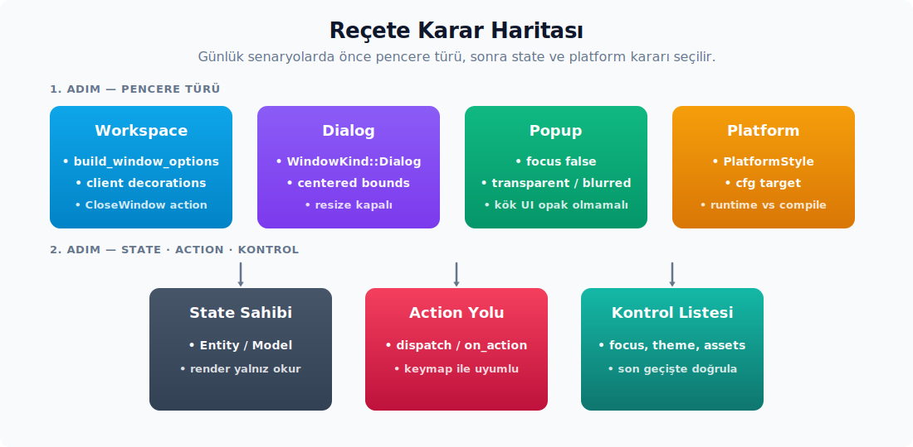

# Reçeteler ve Kontrol Listeleri

---

## Reçeteler

Bu bölüm, önceki başlıklardaki API'leri günlük senaryolara oturtarak özetler. Her reçete, ihtiyaç duyulan ayarları ve çağrı sırasını tek bir noktada toplar.



#### Yeni Workspace Penceresi

Bir Zed workspace penceresi açarken adımlar şu sırayı izler:

1. `zed::build_window_options(ekran_uuid, cx)` çağrısı yapılır.
2. Kök view (görünüm) olarak workspace veya multi-workspace entity oluşturulur.
3. Başlık çubuğu tasarımı için `TitleBar`/`PlatformTitleBar` yöntemi izlenir.
4. Kök içerik `workspace::client_side_decorations(...)` ile sarmalanır.
5. Kapatma işlemi için `workspace::CloseWindow` action yapısı yönlendirilir (dispatch).

#### Küçük Diyalog Penceresi

Küçük modal benzeri pencerelerde tipik konfigürasyon aşağıdaki gibidir; ana pencere değil bir diyalog hedeflendiği için `WindowKind::Dialog` ve resize/minimize kısıtlamaları tercih edilir:

```rust
cx.open_window(
    WindowOptions {
        titlebar: Some(TitlebarOptions {
            title: Some("Diyalog".into()),
            appears_transparent: true,
            traffic_light_position: Some(point(px(12.), px(12.))),
        }),
        window_bounds: Some(WindowBounds::centered(size(px(440.), px(300.)), cx)),
        is_resizable: false,
        is_minimizable: false,
        kind: WindowKind::Dialog,
        app_id: Some(ReleaseChannel::global(cx).app_id().to_owned()),
        ..Default::default()
    },
    |window, cx| {
        window.activate_window();
        cx.new(|cx| DiyalogGorunumu::new(window, cx))
    },
)?;
```

#### Saydam/Bulanık Bildirim

Bildirim ve kaplama pencerelerinde tipik olarak başlık çubuğu kapatılır, pencerenin odak almaması ayarlanır ve arka plan saydamlaştırılır:

```rust
cx.open_window(
    WindowOptions {
        titlebar: None,
        focus: false,
        show: true,
        kind: WindowKind::PopUp,
        is_movable: false,
        is_resizable: false,
        window_background: WindowBackgroundAppearance::Transparent,
        window_decorations: Some(WindowDecorations::Client),
        ..Default::default()
    },
    |window, cx| cx.new(|cx| BildirimGorunumu::new(window, cx)),
)?;
```

Bulanıklık efekti istendiğinde `Transparent` yerine `Blurred` seçeneği tercih edilir; bunun gerçekleşebilmesi için içerik kökünün tamamen opak bir arka plan çizmediğinden emin olunması gerekir, aksi takdirde bulanıklık efekti görünmez kalacaktır.

#### Platforma Göre UI Ayırma

Çalışma zamanında platforma göre dallanma gerektiğinde `PlatformStyle` yapısından yararlanılır:

```rust
match PlatformStyle::platform() {
    PlatformStyle::Mac => { /* macOS */ }
    PlatformStyle::Linux => { /* Linux */ }
    PlatformStyle::Windows => { /* Windows */ }
}
```

Derleme zamanı (compile-time) farklılıkları gerekiyorsa `cfg!(target_os = "...")` veya `#[cfg(...)]` tercih edilir. Çalışma zamanı stillendirmelerinde `PlatformStyle` kullanımı daha okunaklı bir yapı sunar.

#### Başlık Çubuğu Sürükleme ve Çift Tıklama

Sürükleme alanı öncelikle `WindowControlArea::Drag` ile işaretlenir; çift tıklama olaylarında platforma göre yerel ya da akıcı (fluent) yardımcı metotlar tercih edilir:

```rust
h_flex()
    .window_control_area(WindowControlArea::Drag)
    .on_click(|olay, window, _| {
        if olay.click_count() == 2 {
            if cfg!(target_os = "macos") {
                window.titlebar_double_click();
            } else {
                window.zoom_window();
            }
        }
    })
```

Linux veya macOS işletim sistemlerinde manuel sürükleme başlatılması gerektiğinde, fare hareketi esnasında şu çağrı gerçekleştirilir:

```rust
window.start_window_move();
```

Windows tarafında `WindowControlArea::Drag` yerel hit-test üzerinden daha doğru sonucu verir; bu nedenle Windows'ta sürükleme için ayrı bir `start_window_move` çağrısına gerek kalmaz.

#### İstemci Tarafı Yeniden Boyutlandırma Tutamacı

İstemci tarafı süslemesi (client-side decoration) ile birlikte sunulan yeniden boyutlandırma tutamaçlarında kenar hesaplaması yapılır ve ilgili `ResizeEdge` ile platform çağrısı tetiklenir:

```rust
.on_mouse_down(MouseButton::Left, move |olay, window, _| {
    if let Some(kenar) = yeniden_boyutlandirma_kenari(olay.position, golge, boyut, doseme) {
        window.start_window_resize(kenar);
    }
})
```

İmleç stili de aynı kenara göre `ResizeUpDown`, `ResizeLeftRight`, `ResizeUpLeftDownRight` veya `ResizeUpRightDownLeft` olarak yapılandırılmalıdır; aksi takdirde yeniden boyutlandırma bölgesinde görsel geri bildirim eksik kalacaktır.

#### Tema Değişince Pencere Arka Planını Güncelleme

Tema akışı tüm pencerelere yansıtılırken, ayar gözlemcisi (settings observer) içerisinden tek tek pencerelerin arka plan görünümü güncellenir:

```rust
cx.observe_global::<SettingsStore>(move |cx| {
    for window in cx.windows() {
        let gorunum = cx.theme().window_background_appearance();
        window.update(cx, |_, window, _| {
            window.set_background_appearance(gorunum);
        }).ok();
    }
}).detach();
```

Zed ana uygulaması bu deseni zaten kullanır.

#### HTTP'den Veri Çekip Listeleme

Basit veri yükleme akışı üç adıma ayrılır: view alanları yükleniyor/hata/liste durumlarını tutar, asenkron task HTTP isteğini gerçekleştirir ve sonuç döndüğünde ilgili view `update_in` metodu içerisinde güncellenir:

```rust
#[derive(serde::Deserialize)]
struct Kayit {
    sira: usize,
    baslik: SharedString,
}

struct KayitListesiGorunumu {
    adres: SharedString,
    kayitlar: Vec<Kayit>,
    yukleniyor_mu: bool,
    hata: Option<SharedString>,
}

impl KayitListesiGorunumu {
    fn yenile(&mut self, window: &mut Window, cx: &mut Context<Self>) {
        self.yukleniyor_mu = true;
        self.hata = None;
        cx.notify();

        let http_istemcisi = cx.http_client();
        let adres = self.adres.clone();

        cx.spawn_in(window, async move |gorunum, cx| {
            let sonuc = kayitlari_cek(http_istemcisi, adres).await;

            gorunum.update_in(cx, |gorunum, _window, cx| {
                gorunum.yukleniyor_mu = false;
                match sonuc {
                    Ok(kayitlar) => gorunum.kayitlar = kayitlar,
                    Err(hata) => gorunum.hata = Some(hata.to_string().into()),
                }
                cx.notify();
            })?;

            Ok::<(), anyhow::Error>(())
        })
        .detach_and_log_err(cx);
    }
}
```

HTTP yardımcısını UI katmanından bağımsız konumlandırılır; bu sayede testlerde sahte (mock) bir `HttpClient` iletilebilir ve JSON parse hataları arayüz durumuna (UI state) açıkça yansıtılır:

```rust
async fn kayitlari_cek(
    http_istemcisi: Arc<dyn HttpClient>,
    adres: SharedString,
) -> anyhow::Result<Vec<Kayit>> {
    use futures::AsyncReadExt as _;

    let mut cevap = http_istemcisi.get(adres.as_ref(), ().into(), true).await?;
    let mut govde = String::new();
    cevap.body_mut().read_to_string(&mut govde).await?;

    Ok(serde_json::from_str(&govde)?)
}
```

Render tarafında liste `.children(...)` ile üretilir, yükleme ve hata durumları da aynı element ağacına bağlanır:

```rust
div()
    .v_flex()
    .children(self.hata.as_ref().map(|hata| {
        Label::new(hata.clone()).color(Color::Error)
    }))
    .when(self.yukleniyor_mu, |oge| {
        oge.child(Label::new("Yükleniyor...").color(Color::Muted))
    })
    .children(self.kayitlar.iter().map(|kayit| {
        div()
            .id(("kayit", kayit.sira))
            .px_2()
            .py_1()
            .child(kayit.baslik.clone())
    }))
```

Bu desen fire-and-forget (tetikle ve unut) tarzı yenilemeler için uygundur. Kullanıcı pencereyi kapattığında ya da yeni bir istek eskisini iptal etmek durumunda olduğunda, dönen `Task` bir view alanında saklanmalıdır; yalnızca bilinçli olarak arka planda bırakılan işlerde `detach_and_log_err(cx)` tercih edilir.

#### Git Graph Özel Komut Task'ı

Git Graph commit bağlam menüsünden özel bir task çalıştırmak için global `tasks.json` içine `git-command` etiketli bir task eklenmesi gerekir. Worktree yerel task'lar bu akışta desteklenmez. Task seçili commit ve repository bağlamıyla çözülür; varsayılan çalışma dizini seçili repository köküdür.

Desteklenen Git değişkenleri seçili commit ve onun bağlı olduğu repository bağlamından üretilir. Bu bağlamda yalnız Git değişkenleri sağlanır. `ZED_FILE`, `ZED_SELECTED_TEXT`, `ZED_WORKTREE_ROOT`, `ZED_MAIN_GIT_WORKTREE` gibi editör/worktree değişkenleri varsayılan değer taşımadıkça çözümlenmez.

- `ZED_GIT_SHA` seçili commit'in tam SHA değeridir; `git show`, `git branch --contains` veya özel script argümanı olarak tercih edilir.
- `ZED_GIT_SHA_SHORT` aynı commit'in kısa gösterimidir; task etiketi veya kullanıcıya görünen çıktı için uygundur.
- `ZED_GIT_REPOSITORY_PATH` seçili commit'in geldiği repository'nin çalışma dizini yoludur; task `cwd` değeri için en güvenli seçimdir.
- `ZED_GIT_REPOSITORY_NAME` repository path'inin son bileşeninden türetilir; task etiketi veya environment değişkeninde kullanıcıya okunabilir repository adı gerektiğinde kullanılır.

Tipik bir tanım şöyledir:

```json
[
  {
    "label": "Branches containing commit: $ZED_GIT_SHA_SHORT",
    "command": "git",
    "args": ["branch", "-a", "--contains", "$ZED_GIT_SHA"],
    "tags": ["git-command"]
  }
]
```

## Sık Hatalar ve Doğru Desenler

Aşağıdaki liste rehber boyunca anlatılan dikkat noktalarını tek bir noktada toparlar; her madde belirtisi ile birlikte altta yatan nedeni de işaret eder.

- **İstenen süslemeye güvenme** — `WindowOptions.window_decorations` yalnız bir istektir. Çizim sırasında fiili sonucu `window.window_decorations()` çağrısı verir; kararların bu sonuca göre verilmesi önerilir.
- **Bulanıklık görünmüyor** — Kök view veya tema tamamen opak bir renk çiziyor olabilir. Bulanıklık efektinin görünmesi için saydam bir surface ve içerikte alfa bırakılması şarttır.
- **Linux kontrol butonları yanlış tarafta** — Doğru kaynak `cx.button_layout()`'tur ve değişimler pencerenin `observe_button_layout_changed` çağrısıyla takip edilmelidir.
- **Windows başlık butonları tıklanmıyor** — Butonlarda `window_control_area(Close/Max/Min)` çağrısının eksik kalması yerel hit-test'i bozar.
- **Kapatma davranışı atlanıyor** — Zed workspace penceresinde doğrudan `remove_window` yerine `workspace::CloseWindow` action'ının yönlendirilmesi (dispatch) gerekir; aksi takdirde kaydedilmemiş değişiklikler ve kullanıcı onay süreçleri atlanmış olur.
- **Async task çalışırken yok oluyor** — Dönen `Task` saklanmamış ya da detach edilmemiştir; drop edildiği anda ilgili işlem iptal olur.
- **Entity sızıntı** — Uzun yaşayan task veya abonelik içinde güçlü `Entity` yakalamak döngü üretir; bu gibi durumlarda `WeakEntity` yapısı tercih edilmelidir.
- **Çizim güncellenmiyor** — Durum değişiminden sonra `cx.notify()` çağrısı yapılmamıştır; bu durumda view güncel verilerle yeniden çizilemez.
- **Odak geri çağrısı tetiklenmiyor** — Element `.track_focus(&odak_tutamagi)` ile ağaca bağlanmamış olabilir.
- **Özel başlık çubuğu altında içerik tıklanamıyor** — Sürükleme veya window control hitbox'ı fazla geniş tutulmuş ya da `.occlude()` yanlış yere konmuş olabilir.
- **İstemci süslemesi gölge boşluğu** — `set_client_inset` ve dış sarmalayıcının padding/shadow değerleri birlikte yönetilmelidir; aralarındaki uyumsuzluk istenmeyen görsel boşluklara neden olabilir.

## Yeni Pencere Eklerken Kontrol Listesi

Yeni bir pencere eklerken aşağıdaki kontrol listesi atlanması kolay ayrıntıları görünür tutan bir hatırlatma görevi görür:

1. Bu pencerenin workspace mi, modal mı, yoksa popup mı olacağına karar verilerek uygun `WindowKind` seçilir.
2. Ana Zed penceresi tasarlanıyorsa `build_window_options` tercih edilir.
3. Sınırlar geri yüklenecekse `WindowBounds` kalıcı hale getirilir.
4. Hangi display üzerinde açılacağı belirlenir; `display_id` veya `display_uuid` seçilir.
5. Başlık çubuğunun yerel mi yoksa özel mi olacağı belirlenir; `TitlebarOptions` ile `PlatformTitleBar` arasındaki karar netleştirilir.
6. Linux dekorasyon modu ayarlardan okunuyorsa `window_decorations` bağlanır.
7. İstemci süslemesi varsa sarmalayıcı, inset, yeniden boyutlandırma tutamacı ve tiling durumu eklenir.
8. Kapatma eyleminin (action) doğrudan pencereyi mi kapatacağı yoksa workspace kapatma akışını mı tetikleyeceği belirlenir.
9. Bulanıklık veya saydamlık gereksinimleri varsa `window_background` ile kök alfa (alpha) uyumu kontrol edilir.
10. Başlangıç odağının doğruluğu için `focus`, `show`, `activate_window` ve focus handle durumları gözden geçirilir.
11. Minimum boyut gereksinimi olup olmadığı belirlenir.
12. App ID ve Linux ikon gereksinimleri kontrol edilir.
13. macOS yerel sekmeleme (tabbing) desteği isteniyorsa `tabbing_identifier` yapılandırılır.
14. Ayar veya tema değişimlerinde arka planın güncellenme stratejisi planlanır.
15. Buton yerleşim değişikliklerinde başlık çubuğunun yeniden çizilme ihtiyacı gözden geçirilir.
16. Testlerde timer gerekiyorsa GPUI executor timer yapısından yararlanılır.

## Kısa Cevaplar

Bu başlık altında rehber boyunca en çok sorulan dört konunun kısa özeti yer alır.

**İleride Pencere Oluşturmak İçin İzlenecek Yol.** Workspace penceresi için başlangıç noktası `zed::build_window_options`'tır. Özel ve küçük bir pencere için doğrudan `cx.open_window(WindowOptions { ... }, |window, cx| cx.new(...))` çağrısı tercih edilir. Kök view, `Render` uygulayan bir `Entity` olmalıdır.

**Pencere Dekorunun Tanımlanması.** Linux için `WindowOptions.window_decorations = Some(WindowDecorations::Client/Server)` tanımlanır. Çizim tarafında fiili sonucu `window.window_decorations()` ile okunur. Zed tarzı istemci süslemesi için `workspace::client_side_decorations` kullanılır. macOS ve Windows'ta özel başlık çubuğu için `TitlebarOptions { appears_transparent: true }` ya da `titlebar: None` ile `PlatformTitleBar` tercih edilir.

**Kontrol butonlarının yönetimi.** Zed içinde `platform_title_bar::render_left_window_controls` ve `render_right_window_controls` tercih edilir. Linux'ta `cx.button_layout()` ve `window.window_controls()` sonucu belirleyicidir. Windows'ta butonlar `WindowControlArea::{Min, Max, Close}` ile bağlanır. Kapatma için workspace akışında `CloseWindow` action'ı yönlendirilir (dispatch).

**Bulanıklık Yönetiminin İşletim Sistemine Göre Uygulanması.** Pencere açılırken veya tema değiştiğinde `window.set_background_appearance(...)` çağrılır. Zed tema akışı `opaque`, `transparent` ve `blurred` değerlerini destekler. macOS gerçek bulanıklığı `NSVisualEffectView` ile, Windows composition/DWM ile, Wayland ise compositor bulanıklık protokolü ile uygulanır. Destek olmadığında `Blurred` saydam gibi davranabilir. Kök UI opak çizdiğinde bulanıklık görünmez kalır.

**Platform Farklarının Soyutlanacağı Yer.** Davranış pencere ile ilgiliyse GPUI `Platform` ve `PlatformWindow` katmanına bağlanır. Zed UI görünümüyle ilgiliyse `PlatformStyle::platform()` ve `platform_title_bar` bileşenleri tercih edilir. Ayar farkı gerekiyorsa `settings_content` şeması ve `settings` dönüşümleri girer.

## Kavram → Crate/Modül Eşlemesi

Aşağıdaki liste, rehberde anlatılan kavramların hangi crate veya modülde yer aldığını tek bakışta verir. Yeni bir bileşen yazarken benzer örneğin nerede tanımlı olduğunu anlamaya yarar ve aranan konunun hızla bulunmasını sağlar.

- Pencere açma API'si: `open_window`
- Pencere seçenekleri: `WindowOptions`
- Platform penceresi sözleşmesi: `PlatformWindow`
- Pencere sarmalayıcı metotları: `gpui` crate'i
- Element ve çizim trait'leri: `gpui` crate'i, `view`
- Style fluent API: `gpui` crate'i
- Interactivity fluent API: `gpui` crate'i
- Platform seçimi: `gpui_platform` crate'i
- macOS pencere davranışı: `gpui_macos` crate'i
- Windows pencere davranışı: `gpui_windows` crate'i, `events`
- Linux Wayland davranışı: `gpui_linux` crate'i
- Linux X11 davranışı: `gpui_linux` crate'i
- Zed ana window options: `build_window_options`
- Zed platform başlık çubuğu: `platform_title_bar` crate'i
- Linux kontroller: `platform_title_bar` crate'i
- Windows kontroller: `platform_title_bar` crate'i
- Workspace istemci süslemesi: `client_side_decorations`
- Zed başlık çubuğu kompozisyonu: `title_bar` crate'i
- Tema arka plan görünüşü: `theme` crate'i, `theme_settings` crate'i, `settings` crate'i
- UI bileşen dışa aktarım listesi: `ui` crate'i
- UI input: `ui_input` crate'i, `input_field`

---
