# Zed kaynak haritası ve bağlantı modeli

İlk bölümde katmanları ayırdık. Bu bölümde Zed tarafındaki gerçek kaynakların nerede durduğunu görürsün. Önce dosyaların fiziksel haritası çıkarılır; ardından başlık çubuğunun uygulama içinde hangi callback'lerle yaşadığı, hangi anda hangi entity'nin oluşturulduğu ve bu parçaların birbirine nasıl bağlandığı anlatılır.

## 5. Zed kaynak haritası

| Parça | Görev |
| :-- | :-- |
| `PlatformTitleBar` | Ana render entity'si, sürükleme alanı, arka plan, köşe yuvarlama, child slotları, sol/sağ buton yerleşimi. |
| `render_left_window_controls` | Linux CSD'de sol pencere butonlarını üretir. |
| `render_right_window_controls` | Linux CSD veya Windows için sağ pencere butonlarını üretir. |
| `LinuxWindowControls` | Linux minimize, maximize/restore ve close butonlarının GPUI render katmanı. |
| `WindowsWindowControls` | Windows caption butonları ve `WindowControlArea` eşleşmeleri. |
| `SystemWindowTabs` | Native pencere sekmeleri, sekme menüsü, sürükle-bırak ve pencere birleştirme davranışları. Modül private olduğu için dış crate API'si değildir; `PlatformTitleBar` içinde child entity olarak kullanılır. |
| `TitleBar` | Zed'in uygulama başlığı, proje adı, menü, kullanıcı ve workspace state'ini `PlatformTitleBar` içine bağlayan üst seviye bileşen. |
| `OnboardingBanner` | Ürün titlebar'ı için duyuru banner'ı altyapısı (`title_bar` crate'inde). Güncel sürümde `TitleBar`'a bağlı değildir; ayrıntı [Üst Bar](../ust_bar/ust_bar.md) bölümünde. |
| `UpdateVersion` | Auto-update durumunu üst barda gösterir ve update tooltip metnini üretir. Tooltip artık eski `Version:` biçimini kullanmaz; `Update to Version:` öneki ve SHA için tam commit değeri kullanılır. |
| `UpdateButton` | `UpdateVersion` tarafından kullanılan görsel kabuk. `checking`, `downloading`, `installing`, `updated`, `errored` durumları için ayrı constructor'lar sağlar. `Checking/Downloading/Installing` durumlarında butona artık `disabled(true)` set edilir; bu süre içinde tıklama davranışı kapalıdır. Animated ikon `LoadCircle` (2 turluk dönüş) ile gelir; eski `ArrowCircle` ikonu yalnız `updated` ve `errored` dışındaki spinning state'lerden kalkmıştır. Errored mesajı `"Failed to Update"` biçimindedir; `Failed to update Zed` metni bırakılmaz. |
| `client_side_decorations` | CSD pencere gölgesi, border, resize kenarları ve inset yönetimi. |
| `WindowOptions` | Pencere dekorasyonu, titlebar options ve native tabbing identifier ayarları. |

## 6. Zed içindeki bağlantı modeli



Zed'in ana workspace penceresinde başlangıç noktası `title_bar::init(cx)` fonksiyonudur. Bu fonksiyon iki iş yapar. Önce platform kabuğunu hazırlamak için `PlatformTitleBar::init(cx)` çağırır. Sonra her yeni `Workspace` açıldığında bir `TitleBar` entity'si oluşturur ve bu entity'yi ilgili workspace'in titlebar item alanına yerleştirir.

Basitleştirilmiş akış şu şekilde okunabilir:

```rust
pub fn init(cx: &mut App) {
    platform_title_bar::PlatformTitleBar::init(cx);

    cx.observe_new(|workspace: &mut Workspace, window, cx| {
        let Some(window) = window else {
            return;
        };

        let multi_workspace = workspace.multi_workspace().cloned();
        let item = cx.new(|cx| {
            TitleBar::new("title-bar", workspace, multi_workspace, window, cx)
        });

        workspace.set_titlebar_item(item.into(), window, cx);
    })
    .detach();
}
```

`TitleBar` entity'si kendi `Render` akışı sırasında alt katmandaki `PlatformTitleBar` entity'sini günceller. Tipik render adımı şuna benzer:

```rust
self.platform_titlebar.update(cx, |titlebar, _| {
    titlebar.set_button_layout(button_layout);
    titlebar.set_children(children);
});

self.platform_titlebar.clone().into_any_element()
```

Bu kullanım, port sırasında çok kolay kaçan bir ayrıntıyı gösterir: `PlatformTitleBar`, kendisine verilen child element'leri render sırasında `mem::take` ile tüketir. Yani child listesi bir kez verildikten sonra sonraki render'da boş kalır. Bu yüzden dinamik başlık içeriği her render geçişinde yeniden `set_children(...)` çağrısıyla tazelenmelidir. Entity oluşturulurken bir defalık verilen içerik sonraki frame'de görünmez.

Zed uygulamasındaki gerçek yönetim zinciri şu kaynaklardan takip edilir:

| Aşama | Ne yapıyor? |
| :-- | :-- |
| Pencere açılışı | `ZED_WINDOW_DECORATIONS` env değeri veya `WorkspaceSettings::window_decorations` ile client/server decoration seçer; `TitlebarOptions { appears_transparent: true, traffic_light_position: Some(point(px(9), px(9))) }`, `is_movable: true`, `window_decorations`, `tabbing_identifier` ayarlarını verir. |
| GPUI pencere bootstrap'i | Platform native tab görünürlüğünü `SystemWindowTabController::init_visible` ile başlatır ve platform `tabbed_windows()` listesini controller'a ekler. |
| Title bar kurulumu | `PlatformTitleBar::init(cx)` çağrılır; her yeni `Workspace` için `TitleBar::new(...)` entity'si oluşturulup `workspace.set_titlebar_item(...)` ile workspace'e bağlanır. |
| Product titlebar render'i | `TitleBar`, her render'da `set_button_layout(...)` ve `set_children(...)` çağırır. `show_menus(cx)` sonucu açıksa platform kabuğu ile ürün başlığı iki satıra ayrılır; kapalıysa ürün child'ları doğrudan `PlatformTitleBar` içine verilir. Bu helper yalnız ayarı değil, macOS'ta `ZED_USE_CROSS_PLATFORM_MENU` env koşulunu da dikkate alır. |
| Product titlebar banner'ı | Duyuru banner'ı `TitleBar` katmanında yönetilir; platform kabuğu bunu bilmez. Banner altyapısı güncel sürümde bağlı değildir (alan `None`). Ayrıntı [Üst Bar](../ust_bar/ust_bar.md) bölümünde. |
| Update bildirimi | Downloading, installing ve updated durumları tooltip metnini `version_tooltip_message(...)` üzerinden alır. Metin `Update to Version:` biçimindedir; SHA kısaltılmaz. |
| Platform titlebar render'i | Drag alanı, double-click, sidebar çakışması, Linux/Windows pencere kontrolleri, sağ tık window menu ve `SystemWindowTabs` child'ı burada birleşir. |
| CSD dış sarmal | `client_side_decorations(...)` shadow, border, resize edge, cursor ve `window.set_client_inset(...)` davranışlarını sağlar. Titlebar tek başına CSD penceresinin tamamı değildir. |
| Workspace/proje aktivasyonu | `OpenMode::NewWindow` yanında `OpenMode::Activate` de `window.activate_window()` çağırır. Mevcut pencereye/sidebar'a açılan proje aktif hale getirildiğinde titlebar state'i de pencere öne alınmış kabulüyle güncellenmelidir. |
| Platform callback'leri | Button layout değişimi, aktif pencere değişimi, hit-test, native tab taşıma/birleştirme/seçme ve tab bar toggle callback'leri GPUI controller state'ine bağlanır. |

Bu zincirden çıkan port kuralı nettir: `PlatformTitleBar` tek başına tam bir başlık çubuğu uygulaması değildir. O yalnızca render edilen başlık kabuğunu temsil eder. Zed'de bu kabuğu gerçekten çalışır hale getiren şey; `WindowOptions` ayarları, GPUI'nin platform callback'leri, `TitleBarSettings`, `Workspace` lifecycle'ı ve CSD sarmalının birlikte kurduğu bütündür. Port hedefinde de bu beş parça aynı anda düşünmen gerekir. Bunlardan biri eksik kalırsa başlık çubuğunun davranış paritesi bozulur.

---
