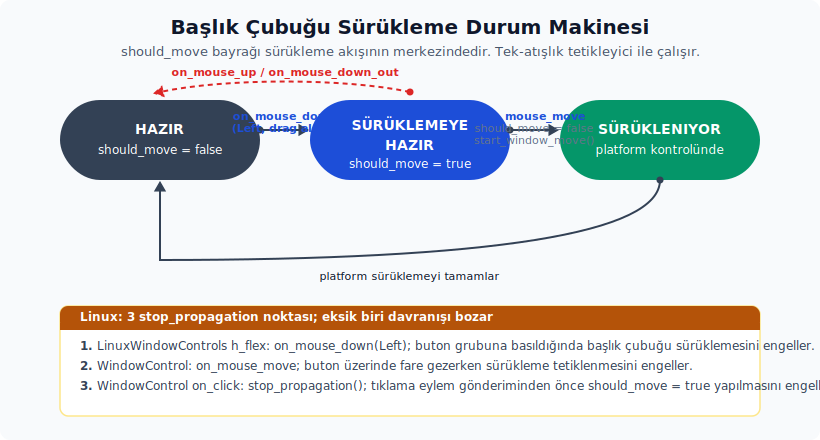
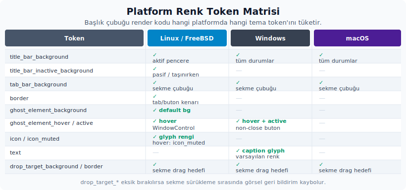
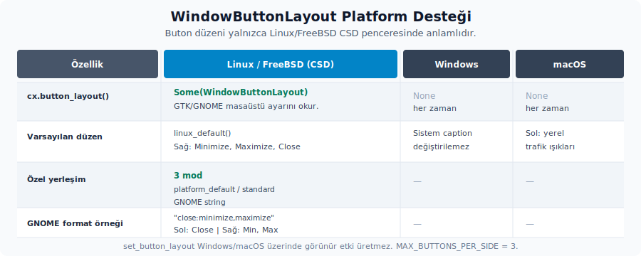

# Platform başlık çubuğu render akışı ve pencere kontrolleri

Bu bölümden itibaren doğrudan başlık çubuğunun render davranışına odaklanacağız. Pencere nasıl sürükleniyor? Linux, Windows ve macOS farkları nerede ortaya çıkıyor? Kapat, minimize ve maximize butonları hangi mekanizmalarla uygulamaya bağlanıyor? Önceki bölümlerde kurulan katmanlar burada somut davranışa dönüşür.

## 11. Davranış modeli

### Sürükleme

Ana başlık çubuğu yüzeyi `WindowControlArea::Drag` etiketiyle işaretlenir. Bu etiket, alanı platforma "sürüklenebilir başlık" olarak tanıtır. Buna ek olarak sol fare basma ve fare hareketi olaylarının zincirinde `window.start_window_move()` çağrısı tetiklenir. Bu iki mekanizma birlikte çalışır. Yalnızca işaretleme yapmak ya da yalnızca manuel çağrıya güvenmek yeterli olmaz.

Başlık çubuğuna yerleştirilen etkileşimli elementler, kendi fare basma/tıklama olaylarında yayılımı durdurmalıdır. Buna butonlar, menü tetikleyicileri ve arama kutuları dahildir. Aksi halde aynı tıklama hem ilgili element hem de altındaki "sürükle" yüzeyi tarafından algılanır. Sonuçta kullanıcı menüye basmak isterken pencere de hareket edebilir.



`hareket_etmeli` bayrağı sürükleme akışının merkezindedir. Kaynakta dört farklı noktada güncellenir:

- `on_mouse_down(Left, ...)` çağrısında `hareket_etmeli` `true` yapılır; yani "olası bir sürükleme başlayabilir" durumu işaretlenir.
- `on_mouse_move(...)` içinde, `hareket_etmeli` `true` ise **önce** bayrak `false` konumuna çekilir, **sonra** `window.start_window_move()` çağrısı yürütülür. Sıralama önemlidir: Tetikleyici tek seferliktir. Bir kez ateşlendikten sonra tekrar çalışması için yeni bir `mouse_down` zinciri gerekir.
- `on_mouse_up(Left, ...)` olayında `hareket_etmeli` bayrağı yine `false` olarak ayarlanır. Bu, sürükleme hiç başlamamış olsa bile durumun temiz kalmasını sağlar.
- `on_mouse_down_out(...)` olayında da `hareket_etmeli` bayrağı `false` olarak güncellenir. Bu sayede başlık çubuğunun dışına tıklanması durumunda bayrak geriden gelip ileride başka bir sürüklemeyi tetiklemez; durum sızıntısı önlenmiş olur.

Linux pencere kontrol katmanı, **üç ayrı `stop_propagation()` noktası** kullanır. Bu üç nokta koda dağılmış olduğu için birlikte izlenmesi gereken bir davranış kümesi oluşturur:

| Yer | Olay | Neyi Engeller? |
| :-- | :-- | :-- |
| `LinuxWindowControls` h_flex kapsayıcısı | `on_mouse_down(Left)` | Buton grubuna basıldığında başlık çubuğu sürüklemesinin başlamasını engeller. |
| `WindowControl` (her buton) | `on_mouse_move` | Buton üzerinde fare gezerken başlık çubuğu sürüklemesinin tetiklenmesini engeller. |
| `WindowControl` `on_click` geri çağrı gövdesi | `cx.stop_propagation()` ilk satır | Tıklama olayının yukarı kabarıp başka işleyicilere ulaşmasını engeller. Eylem gönderiminden ÖNCE çalışır. |

Bu üç engel birlikte bulunmadığı takdirde üç ayrı sorun doğar: Önce, butonun üstüne yapılan `mouse_down` olayı alttaki sürükleme yüzeyini tetikler ve pencere sürüklenmeye başlar. Sonra, buton üzerindeki fare hareketi yine sürüklemeyi ateşleyebilir. Son olarak kapatma eylemi gönderilirken aynı tıklama `PlatformTitleBar` katmanına kadar kabarır ve `hareket_etmeli = true` bayrağını ayarlar. Bu yüzden port hedefinde bu üç noktanın her birine **eşdeğer engeller** yerleştirilmelidir. Bu noktalardan biri eksik kalırsa davranış paritesi bozulur.

Windows tarafında aynı amaca hizmet eden daha kısa bir ifade vardır: `.occlude()` çağrısı. Bu çağrı, caption butonu üzerindeki fare olaylarının alt katmanlara sızmasını engeller. Linux'taki üç ayrı `stop_propagation()` çağrısının yaptığı işi Windows tarafında bu tek çağrı toparlar.

### Tam ekran render ayrımı

Tam ekran yalnızca görsel bir detay değildir; başlık çubuğuna hangi çocukların ekleneceğini de değiştirir. `window.is_fullscreen()` metodu `true` döndüğünde sol tarafa macOS trafik ışığı padding'i de Linux sol pencere kontrolleri de eklenmez. Bunların yerine yalnızca `.pl_2()` yedek değeri tercih edilir.

Aynı render zincirinde sağ taraf bloğu da `when(!window.is_fullscreen(), ...)` koruyucusunun arkasındadır. Başka bir deyişle tam ekranda sağ caption kontrolleri ve Linux CSD'deki sağ tık sistem pencere menüsü kurulmaz. `SystemWindowTabs` çocuğu ise bu koşulun dışında kalır; tam ekran olsun ya da olmasın başlık çubuğunun altına eklenmeye devam eder.

Port hedefinde bu ayrım "tam ekran olunca padding'i değiştir" kadar basit ele alınmamalıdır. Tam ekran aynı anda hem sol/sağ pencere kontrol render'ını etkiler hem de Linux CSD'deki `window.show_window_menu(...)` bağını devre dışı bırakır. Bu yüzden tek bir genel kural yazmak yerine, etkilenen alanlar tek tek düşünülmelidir.

### macOS trafik ışığı boşluğu

macOS tarafında sol boşluk iki ayrı kaynaktan gelir: Pencere açılırken `TitlebarOptions.traffic_light_position` değeri `Some(point(px(9.0), px(9.0)))` olarak verilir; bu yerel trafik ışıklarının pencere içindeki başlangıç konumunu belirler. Render sırasında ise ürün çocuklarının bu alana girmemesi için `TRAFFIC_LIGHT_PADDING` kadar sol padding uygulanır. Bu sabit `ui` crate'inde tanımlıdır; değeri, public `MACOS_SDK_26_OR_LATER` sabiti (macOS SDK 26 ve sonrası derlemelerde `true`) doğruysa `78.0`, değilse `71.0`'dir. Yani `traffic_light_position` ile `TRAFFIC_LIGHT_PADDING` aynı şey değildir: İlki yerel butonların konumu, ikincisi özel başlık çubuğu içeriğinin başlayacağı güvenli boşluktur.

Trafik ışığı konumu pencere açıldıktan sonra da değiştirilebilir. macOS'a özgü `Window::set_traffic_light_position(konum: Point<Pixels>)` çağrısı aynı konum sözleşmesini çalışma zamanında uygular ve platform penceresindeki butonları hemen taşır. Dinamik duyuru bandı, yoğunluk, başlık çubuğu yüksekliği veya yan panel çakışması nedeniyle konum değiştirilecekse port hedefinde çocuk padding'i ile yerel buton konumu birlikte güncellenir; yalnızca padding'i değiştirmek görsel çakışmayı çözmez.

### Çift tıklama

Çift tıklama davranışı Zed kaynağında platforma göre farklı işlenir:

- macOS'ta `window.titlebar_double_click()` çağrısı yapılır.
- Linux/FreeBSD'de `window.zoom_window()` çağrısı yapılır.
- Windows'ta davranış uygulamadan değil, doğrudan platform caption ve hit-test katmanından beklenir.

Port hedefinde çift tıklamanın maximize yerine örneğin minimize gibi farklı bir davranış izlemesi istenirse, bu nokta dışarıdan parametreleştirilecek şekilde tasarlanmalıdır. Aksi halde davranış sabit kalır ve sonradan değiştirmek zorlaşır.

macOS tarafında `window.titlebar_double_click()` çağrısı her zaman "zoom" anlamına gelmez. `gpui_macos` platform implementasyonu çağrı anında `NSGlobalDomain/AppleActionOnDoubleClick` değerini okur ve buna göre davranır. Değer `"None"` ise hiçbir şey yapmaz. `"Minimize"` için `miniaturize_` çağrısı yürütülür. `"Maximize"` ve `"Fill"` için `zoom_` çağrısı yürütülür. Bilinmeyen bir değer geldiğinde de varsayılan olarak yine `zoom_` çalışır. Buna karşılık Linux tarafındaki `window.zoom_window()` çağrısı bu macOS kullanıcı ayarını taklit etmez; her durumda doğrudan maximize/restore davranışını uygular.

### Renk

`title_bar_color` fonksiyonu çalıştığı platforma göre farklı davranır. Linux/FreeBSD tarafında aktif pencere için `title_bar_background` token'ı kullanılır. Pencere pasifse veya taşınıyorsa `title_bar_inactive_background` token'ına geçilir. Diğer platformlarda bu ayrım yapılmaz; doğrudan `title_bar_background` döner.

Bu davranışın amacı, başlık çubuğu ile alttaki sekme çubuğu arasındaki görsel ayrımı korumaktır. Port hedefinin tema sisteminde en az aşağıdaki `cx.theme().colors()` token'larının tanımlı olması gerekir:



- `title_bar_background` — aktif Linux + tüm platformlar
- `title_bar_inactive_background` — pasif/taşıma durumundaki Linux
- `tab_bar_background` — yerel sekme arka planı
- `border` — Linux tab kenarı ve plus butonu sınırı
- `ghost_element_background` — Linux `WindowControlStyle.background` varsayılanı
- `ghost_element_hover` — Linux WindowControl + Windows kapatma dışı hover
- `ghost_element_active` — Windows kapatma dışı active durumu
- `icon` — Linux WindowControl glyph rengi
- `icon_muted` — Linux WindowControl hover glyph rengi
- `text` — Windows caption glyph rengi varsayılanı
- **`drop_target_background`** — **tab sürükleme hedef vurgusu**
- **`drop_target_border`** — **tab sürükleme hedef kenarı vurgusu**

Listenin sonundaki iki token (`drop_target_background` ve `drop_target_border`) özellikle önemlidir. Başka bir sekme sürüklenip mevcut bir sekmenin üzerine geldiğinde drop hedefi bu renklerle vurgulanır. Bu iki token temada tanımsız bırakılırsa sürükle-bırak sırasındaki görsel geri bildirim kaybolur ve kullanıcı sekmeyi nereye bırakacağını anlayamaz.

### Yükseklik

Zed, başlık çubuğu yüksekliğini `platform_title_bar_height(window)` fonksiyonu üzerinden hesaplar:

- Windows'ta sabit `32px` değeri kullanılır.
- Diğer platformlarda hesap `1.75 * rem_size` formülüyle yapılır ve minimum `34px` değeriyle sınırlandırılır.

Bu yükseklik değeri yalnızca başlık çubuğunda kullanılmaz. Windows pencere butonu yüksekliği ve diğer yardımcı başlık hizalamaları da **aynı kaynaktan** beslenmelidir. Farklı yerlere farklı sabitler yazılırsa hizalama bozulur ve sorun sonradan piksel düzeyinde izlenmek zorunda kalır.

## 12. Buton yerleşimi ve ayar yönetimi



Linux/FreeBSD CSD tarafında pencere butonlarının sırası `WindowButtonLayout` tipiyle belirlenir. GPUI tarafındaki tip iki sabit slot dizisinden oluşur:

```rust
pub struct WindowButtonLayout {
    pub left: [Option<WindowButton>; MAX_BUTTONS_PER_SIDE],
    pub right: [Option<WindowButton>; MAX_BUTTONS_PER_SIDE],
}
```

`WindowButton` tipinin değerleri şu üçtür:

- `Minimize`
- `Maximize`
- `Close`

GPUI tarafındaki `WindowButton`, bu üç değerle birlikte dış API olarak kullanıma açıktır. Üzerinde `#[derive(Debug, Clone, Copy, PartialEq, Eq, Hash)]` derive kümesi vardır. `pub fn id(&self) -> &'static str` metodu ise varyantlara karşılık olarak `"minimize"`, `"maximize"` ve `"close"` kararlı element id'lerini döndürür. Bu id'ler Linux tarafındaki `WindowControl::new(...)` çağrılarında doğrudan kullanılır. Bu yüzden port hedefinde anahtar/id uyumu korunmalıdır. Aksi halde Zed'le uyumlu olması beklenen element id'leri sapar ve test ya da araç bağlamalarında ince uyumsuzluklar oluşur.

Yerleşimle ilgili public öğeler şunlardır:

| Öğe | İmza / değer | Davranış notu |
| :-- | :-- | :-- |
| `MAX_BUTTONS_PER_SIDE` | `pub const MAX_BUTTONS_PER_SIDE: usize = 3` | Tipin üyesi değil, ortak modül sabitidir; slot dizilerinin boyutunu verir ve her taraf en fazla üç slot tutar. |
| `WindowButtonLayout::linux_default` | `pub fn linux_default() -> Self` | Tipin ilişkili fonksiyonudur. Sol taraf boş, sağ taraf `Minimize, Maximize, Close`. Yalnız Linux/FreeBSD cfg'inde derlenir. |
| `WindowButtonLayout::parse` | `pub fn parse(yerlesim_dizgesi: &str) -> Result<Self>` | Tipin ilişkili fonksiyonudur. GNOME tarzı `left:right` dizgesini okur; `:` yoksa sol boş, tüm dizge sağ taraf sayılır. |

`parse(...)` fonksiyonunda dikkat edilmesi gereken iki ince nokta vardır. İlki geçersiz isimlerin ele alınma biçimidir. Dizge içinde tanınmayan adlar geçerse, en az bir geçerli buton bulunduğu sürece bu adlar **sessizce yok sayılır**. Yalnızca dizgenin tamamı geçersiz olduğunda hata döner. İkincisi tekrar davranışıdır. Aynı buton iki farklı tarafta veya aynı tarafın içinde tekrar edilirse, ilk görülen slot tutulur ve sonraki tekrarlar yok sayılır. Bu yüzden `"close,foo"` geçerli bir yerleşim üretir; yalnız `"foo"` yazıldığında ise hata döner.

Render tarafında bir tarafın "var olup olmadığı" yalnız o tarafın ilk slotuna bakılarak belirlenir. `render_left_window_controls(...)` için `button_layout.left[0].is_none()` ise tüm sol taraf `None` döner. Aynı kontrol `render_right_window_controls(...)` için `button_layout.right[0].is_none()` ile gerçekleştirilir. Bunun pratik sonucu şudur: Manuel yerleşim verilirken `[None, Some(Close), ...]` gibi bir dizi yazılırsa o taraf bütünüyle gizlenir, çünkü ilk slot boştur. İlk slot doluysa ve sonrasındaki slotlardan biri `None` ise, bu `None` slotlar `LinuxWindowControls` render'ındaki `filter_map(|b| *b)` adımıyla atlanır; bütün taraf düşmez.

Zed'in ayar katmanı bu yerleşim için üç farklı kullanım biçimi sunar:

| Ayar Değeri | Sonuç |
| :-- | :-- |
| `platform_default` | Ayar çözümü (`into_layout()`) `None` üretir; render aşamasında `effective_button_layout` bunu `cx.button_layout()` ile yedekler. |
| `standard` | Zed Linux yedeği: Sağda minimize, maximize, close. |
| GNOME formatında dizge | Örneğin `"close:minimize,maximize"` veya `"close,minimize,maximize:"`. |

Uygulama katmanında bu ayar saklanacaksa izlenecek yol basittir. Kullanıcıdan gelen ayar değeri önce `WindowButtonLayout` tipine çevrilir. Ardından render sırasında `title_bar.set_button_layout(yerlesim)` çağrısı yürütülür. Bu iki adımdan biri atlanırsa ayar durumda durur ama render geçişine yansımaz.

Zed'in kendi `TitleBar` katmanı bu değişikliği `cx.observe_button_layout_changed(window, ...)` çağrısıyla dinler. Değişiklik geldiğinde hemen yeniden render tetikler. Port hedefinde masaüstü buton yerleşimi değişiklikleri canlı izlenecekse aynı gözlemci desenini kullanılmalıdır.

**`Platform::button_layout()` trait varsayılanı `None` döner**. Bu varsayılanı **yalnızca Linux/FreeBSD platform implementasyonu** geçersiz kılar ve GTK/GNOME masaüstü ayarını (örneğin `gtk-decoration-layout`) okur. Bu nedenle `cx.button_layout()` çağrısı Windows ve macOS üzerinde her zaman `None` döner. Aynı şekilde `PlatformTitleBar::effective_button_layout(...)` de Linux + `Decorations::Client` kombinasyonu dışındaki tüm durumlarda `None` sonucunu verir. Sonuç nettir: Buton yerleşimi ayar zinciri yalnızca Linux/FreeBSD CSD penceresinde anlamlıdır. Diğer platformlarda `set_button_layout(...)` çağrılsa bile görünür bir etki üretmez.

Linux tarafında bu değer, `gpui_linux` katmanının ortak durumunda başlangıçta `WindowButtonLayout::linux_default()` olarak tutulur. `Platform::button_layout()` çağrıldığında bu ortak durum `Some(...)` sarmalanmış halde geri döner.

Canlı masaüstü değişikliği XDP üzerinden gelen `ButtonLayout` olayıyla yakalanır. Wayland ve X11 istemcilerinin ikisi de gelen dizgeyi `WindowButtonLayout::parse(...)` ile okur. Ayrıştırma başarısız olursa yine `linux_default()` değerine düşer. Ardından her pencere için `window.set_button_layout()` çağrısı yaparsın. Bu çağrı `on_button_layout_changed` geri çağrısını tetikler. Zed `TitleBar::new(...)` içinde bu geri çağrıyı `cx.observe_button_layout_changed(window, ...)` üzerinden `cx.notify()` çağrısına bağlar. Zincir şöyle ilerler: Masaüstü ayarı değişir -> XDP olayı gelir -> dizge ayrıştırılır -> pencere durumu güncellenir -> geri çağrı tetiklenir -> başlık çubuğu yeniden render olur.

## 13. Butonları uygulama katmanına bağlama

### Kapat davranışı

`PlatformTitleBar`, kendi render fonksiyonunun içinde kapatma eylemini doğrudan şu şekilde sabitler:

```rust
let kapat_eylemi = Box::new(workspace::CloseWindow);
```

Bu Zed'in kendi kullanımı için doğrudur. Ancak port hedefinde kapat butonunun farklı bir varlığı kapatması isteniyorsa bu sabitleme aşılmalıdır. Bunun üç yolu vardır:

1. `PlatformTitleBar` port edilirken bu tipe bir `kapat_eylemi` alanı eklenir; her render'da bu alandan okunarak Zed'in sabit `workspace::CloseWindow` değeri yerine ürünün kendi eylemi geçirilir.
2. Zed'in `render_left_window_controls` ve `render_right_window_controls` serbest fonksiyonları doğrudan kullanılır ve bu fonksiyonlara argüman olarak ürünün kendi `Box<dyn Action>` değeri verilir.
3. Linux butonları doğrudan `LinuxWindowControls::new(...)` çağrısıyla üretilir ve kapatma eylemi bu noktada verilir; üst sözleşme atlanır.

Örnek uygulama eylem eşleşmesi:

```rust
actions!(uygulama, [AktifCalismaAlaniniKapat, YeniCalismaAlaniPenceresi]);

let kapat_eylemi: Box<dyn Action> = Box::new(AktifCalismaAlaniniKapat);
let kontroller = platform_title_bar::render_right_window_controls(
    cx.button_layout(),
    kapat_eylemi,
    window,
);
```

Kapatma eyleminin somut olarak neyi kapatacağı uygulama modeline bağlı olarak belirlenir. Aşağıdaki tablo en yaygın senaryoların karşılığını gösterir:

| Uygulama Varlığı | Kapatma Eylemi Anlamı |
| :-- | :-- |
| Tek pencereli uygulama | Pencereyi kapat veya son pencerede çık politikasını işlet. |
| Workspace tabanlı uygulama | Aktif workspace'i kapat, son workspace ise pencereyi kapat. |
| Doküman tabanlı uygulama | Aktif dokümanı kapat, kirli durum varsa kaydetme modali aç. |
| Çok hesaplı/dashboard uygulama | Aktif kiracı veya görünüm değil, pencere/shell yaşam döngüsünü kapat. |

### Minimize ve maximize

Linux'ta `WindowControl`, minimize ve maximize işlemlerini doğrudan `Window` üzerinden yapar:

- `window.minimize_window()` çağrısı pencereyi simge durumuna küçültür.
- `window.zoom_window()` çağrısı maximize/restore davranışını tetikler.

Bu butonler uygulamanın eylem katmanına hiç uğramaz. Maximize ya da minimize işleminden önce telemetri yazmak, bir politika çalıştırmak veya yerleşim durumunu kalıcılaştırmak gerekiyorsa `WindowControl` port edilir ve bu işlemler ürünün kendi eylemlerine yönlendirilir. Aksi halde "minimize öncesi pencere boyutunu kaydet" gibi bir mantığa fırsat verilmez.

Windows tarafında durum farklıdır. Butonlar tıklama işleyicisi ile pencere fonksiyonu çağırmaz. Bunun yerine `WindowControlArea::{Min, Max, Close}` ile bir hit-test alanı üretirler; davranışı platform caption katmanına bırakırlar. Bu yüzden Windows pencere butonlarının davranışını uygulamanın eylem katmanına çekmek Linux'a göre daha fazla platform uyarlaması ister. Tıklamanın hiç ulaşmadığı bir alana eylem yerleştirmek mümkün değildir.

`window.window_controls()` yetenek yüzeyi de platforma göre değişir. **`WindowControls` struct'ı dört alan taşır**: `fullscreen`, `maximize`, `minimize` ve `window_menu`. Dikkat çekici nokta şudur: Bu yapıda `close` alanı **yoktur**. Bunun nedeni Zed'in "kapat her zaman desteklenir" tasarım kararıdır. `LinuxWindowControls` filtresi içindeki koşulsuz `WindowButton::Close => true` kolu da bu kararın doğrudan yansımasıdır.

`platform_title_bar` crate'i bu yetenek yapısından gerçekten üç alan okur: `minimize` ve `maximize` Linux buton filtresinde kullanılır; `window_menu` ise sağ tık ile açılan pencere menüsünde kullanılır. `fullscreen` alanı bu crate içinde hiç okunmaz. Alan vardır, ama burada işlevsel değildir.

Trait varsayılanı (`WindowControls::default`) tüm yeteneklerin desteklendiğini varsayar. Wayland tarafında ise `xdg_toplevel::Event::WmCapabilities` olayı geldiğinde önce bütün bayraklar `false` olarak ayarlanır. Ardından compositor'ın bildirdiği `Maximize`, `Minimize`, `Fullscreen`, `WindowMenu` yetenekleri tek tek `true` olarak ayarlanır. Bu değer bir sonraki configure adımında `state.window_controls` içine alınır ve görünüm geri çağrısı üzerinden yeniden render tetiklenir.

Bu mekanizmanın sonucu üç maddede özetlenir:

- `LinuxWindowControls`, minimize ve maximize butonlarını bu yetenek değerine göre filtreler; kapat ise her durumda render edilebilir.
- Linux CSD başlık çubuğu üzerindeki sağ tık pencere menüsü işleyicisi, ancak `supported_controls.window_menu` `true` olduğunda eklenir.
- Port hedefinde `WindowControls::default()` değerinin geçici başlangıç varsayımı olduğu kabul edilmelidir. Özellikle Wayland'da yetenek configure olayı geldikten sonra bu değerler değişebilir ve render buna uyum sağlamalıdır.

---
