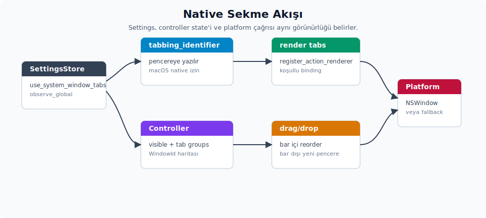

# Yerel pencere sekmeleri

Yerel pencere sekmeleri, özellikle macOS'taki sistem sekmeleri, başlık çubuğunun en karmaşık parçasıdır. Bu yüzden ayrı bir aşama olarak ele alırsın. Burada kararlar tek başına verilmez; `SystemWindowTabController` durumu, platform çağrıları ve sürükle-bırak hedefleri birlikte düşünülür. Bu üç parça birlikte tasarlanmadığında aralarında uyumsuzluk oluşabilir.



## 14. Sistem pencere sekmeleri

`PlatformTitleBar::init(cx)` çağrısı, alt katmandaki `SystemWindowTabs::init(cx)` fonksiyonunu da tetikler. Bu kurulum iki iş yapar:

1. `WorkspaceSettings::use_system_window_tabs` ayarını izlemeye başlar; pencerelerin `tabbing_identifier` değerlerini ayar değiştikçe günceller. İzleme `cx.observe_global::<SettingsStore>(...)` ile kurulur. Abonelik `.detach()` ile crate ömrü boyunca canlı tutulur.
2. Yeni açılan `Workspace` entity nesneleri için bir eylem render işleyicisi kaydeder. Kayıt `cx.observe_new(|workspace: &mut Workspace, ...|)` bloğunda yapılır ve şu dört eylemi bağlar: `ShowNextWindowTab`, `ShowPreviousWindowTab`, `MoveTabToNewWindow`, `MergeAllWindows`.

**Burada kritik bir bağlama farkı vardır.** Bu eylemler `workspace.register_action(...)` ile değil, **`workspace.register_action_renderer(...)`** ile bağlanır. İki API arasındaki fark hem zamanlama hem de kapsam açısından önemlidir:

| API | Bağlama zamanı | Kapsam | Yan etki |
| :-- | :-- | :-- | :-- |
| `register_action` | Kurulum zamanı | `Workspace` entity yaşam süresi | Sabit bağlama. |
| `register_action_renderer` | Her render geçişi | O karede oluşturulan `div` element'inde | Koşullu bağlama: `tabs.len() > 1` veya `tab_groups.len() > 1` koşulları sağlanmazsa o karede eylem **bağlanmaz**. |

Pratik sonuç şudur: `ShowNextWindowTab` eylemi yalnızca `Workspace` içinde birden fazla sekme açıkken çalışır. Tek sekme varken çağrılsa bile etki üretmez. Çünkü çalışma zamanında eylem haritasını o kare için koşula göre yeniden kurarsın. Port hedefinde `Workspace` kavramı birebir yoksa bu desen aynen taşınamayabilir. Yine de "her render geçişinde eylem işleyicilerini koşullu olarak yeniden bağla" prensibi korunmalıdır. Aksi halde tek sekme varken bile sekme dolaşma eylemi çalışıyormuş gibi görünür ve davranışı test etmek zorlaşır.

Ayrıca bu API'nin bir kısıtı daha vardır: `register_action_renderer` bağlandığı `Workspace` entity nesnesine kilitlenir. Bu yüzden **bu eylemler yalnızca bir `Workspace` içindeyken gönderilebilir**. `Workspace` bağlamı dışındaki pencereler, örneğin bağımsız bir ayarlar penceresi, bu eylemleri hiç görmez.

### Sekme butonları

`SystemWindowTabs` içindeki sekme kapatma yollarının tamamı ortak olarak **`workspace::CloseWindow` sabit eylemini** gönderir. Bu kapatma yolu altı farklı çağrı noktasında bulunur:

| # | Tetikleyici | Hedef pencere |
| - | :-- | :-- |
| 1 | Sekme üzerinde orta tık (aktif sekme) | Mevcut pencere |
| 2 | Sekme üzerinde orta tık (başka sekme) | `item.handle.update(...)` ile o pencere |
| 3 | Sekme kapatma (X) butonu tıklaması (aktif sekme) | Mevcut pencere |
| 4 | Sekme kapatma (X) butonu tıklaması (başka sekme) | `item.handle.update(...)` ile o pencere |
| 5 | Sağ tık → `"Close Tab"` | `handle_right_click_action` ile sekme tutamacı |
| 6 | Sağ tık → `"Close Other Tabs"` | Diğer her sekme tutamacı |

Bu altı yolun her birinde **aynı sabit eylem gönderilir**. Dış crate'in verdiği `close_action` özelliği bu kapatma yollarına ulaşmaz. Dışarıdan gelen kapatma eylemini yalnızca Linux tarafındaki `LinuxWindowControls`/`WindowControl` zincirinde kullanırsın. Port hedefinde sekme kapatma davranışı farklılaştırılacaksa, bu altı çağrı noktasının her biri ayrı ayrı ele alman gerekir. Tek bir bayrak açıp kapatmak hepsini aynı anda değiştirmeye yetmez.

**Pencereler arası eylem gönderimi deseni**, yani `handle.update(cx, |_, window, cx| { ... })` çağrı zinciri, bu sekme yollarının dördünde merkezi rol oynar. Bu yollar çağrı anında "**hedef pencere mevcut pencere mi?**" sorusunu sorar. Hedef başka bir pencereyse `item.handle.update(cx, |_view, window, cx| { window.dispatch_action(...) })` yapısıyla sekmenin `AnyWindowHandle`'ı üzerinden ilgili pencerenin bağlamına geçilir ve eylem o pencerede gönderilir. Aynı `handle.update(...)` deseni altı çağrı noktasında geçer:

- Settings gözlemcisinde her pencere için `set_tabbing_identifier` ve sekme listesi yenileme.
- Sekme tıklaması → o pencereyi `activate_window()`.
- Orta tıkla kapatma başka sekmede gerçekleşirse → o pencereye `CloseWindow`.
- X butonu tıklaması başka sekmede gerçekleşirse → o pencereye `CloseWindow`.
- `handle_right_click_action` yardımcısı (`"Close Tab"` / `"Close Other Tabs"` bağlam menüsü).
- Sekme çubuğu dışına bırakma → o pencerede `move_tab_to_new_window()`.

Bu çağrıların hepsi `let _ = handle.update(...)` deyimine sarılıdır. Çünkü `update()` fonksiyonu `Result<R, ()>` döndürür; çağrı sırasında pencere zaten kapanmış olabilir. Böyle bir durumda sonuç bilinçli olarak yutulur ve hata fırlatılmaz.

Port hedefinde aynı deseni karşılamak için üç şey birlikte sağlanmalıdır. Her sekme üst veri yapısı bir tutamak veya proxy taşımalıdır. Pencereler arası işlemler bu proxy üzerinden ilgili pencerenin bağlamına girip işi orada yapmalıdır. Proxy çağrısı da **hata yumuşatma** davranışı göstermelidir: hedef pencere ortadan kalkmışsa sessizce geçilmelidir. Bu üç kural birlikte uygulanmadığında kapanmış pencerelere yapılan çağrılar başarısız olabilir; kaynak deseni bu sonucu yumuşatır.

**Koşullu `Option` deyimi** sol ve sağ pencere kontrollerini şu desenle dahil eder: `sol_kontroller_gosterilsin.then(|| sol_pencere_kontrollerini_render_et(...)).flatten()`.

Bu desen şöyle çalışır: `bool::then(|| fn)` ifadesi mantıksal değer `true` ise `Some(fn())`, `false` ise `None` döner. `sol_pencere_kontrollerini_render_et` fonksiyonu zaten `Option<AnyElement>` döndürdüğü için dış sarmal `Option<Option<...>>` olur; `.flatten()` ile tek seviye `Option`'a iner. Burada dikkat edilmesi gereken yan etki, `then` kapanımının (`closure`) mantıksal değer `true` olduğunda gövdesini çalıştırmasıdır; gövde içinde **clone işlemi** gerçekleşir. İleride bahsedilecek `boxed_clone` zincirindeki adım 2 ve 3'ün her render geçişinde çalışmasının nedeni budur. Aynı sonuç daha açık şekilde `if sol_kontroller_gosterilsin { sol_pencere_kontrollerini_render_et(...) } else { None }` ifadesiyle de yazılabilir. `then().flatten()` formu yalnızca daha kısadır; ek bir avantaj sağlamaz.

Sağ tık menüsü `ui::right_click_menu(ix).trigger(...).menu(...)` kurucu zinciriyle kurulur. Yapı şudur:

```rust
right_click_menu(ix)
    .trigger(|_, _, _| tab)               // tetikleyici element (sekmenin kendisi)
    .menu(move |window, cx| {
        ContextMenu::build(window, cx, move |mut menu, _, _| {
            menu = menu.entry("Close Tab", None, ...);
            menu = menu.entry("Close Other Tabs", None, ...);
            menu = menu.entry("Move Tab to New Window", None, ...);
            menu = menu.entry("Show All Tabs", None, ...);
            menu.context(focus_handle)     // odak yakalama
        })
    })
```

Bu yapıda dört menü girdisinin her biri ayrı bir `move |window, cx| {...}` kapanımı alır. Her kapanım gövdesinde ortak olarak `Self::handle_right_click_action(cx, window, &sekmeler_kopyasi, |tab| kosul, |window, cx| govde)` çağrısı yaparsın.

Buradan ilginç bir bellek davranışı doğar: `tabs` vektörü **dört defa clone'lanır** (`tabs.clone()`, `other_tabs.clone()`, `move_tabs.clone()`, `merge_tabs.clone()`). Bunun nedeni her kapanımın kendi sahip olunan kopyasına ihtiyaç duymasıdır. Referans olarak paylaşmak kapanım ömürleriyle (`lifetime`) çakışır. Port hedefinde aynı kurucu kalıbı kullanabilirsin: `right_click_menu(id).trigger(tetikleyici_fn).menu(menu_kurucu_fn)`. Girdi ekleme işi ise `menu()` geri çağrısı içinde `ContextMenu::build` ile yaparsın.

Menüye konulan dört işlem şunlardır:

- `Close Tab` (#5)
- `Close Other Tabs` (#6)
- `Move Tab to New Window` (`SystemWindowTabController::move_tab_to_new_window` + `window.move_tab_to_new_window()`)
- `Show All Tabs` (`window.toggle_window_tab_overview()`)

Sekme barının alt sağ köşesindeki artı butonu, tıklama anında `zed_actions::OpenRecent { create_new_window: true }` eylemini gönderir. Bu davranış da sabit şekilde gömülüdür. Port hedefinde bu noktanın değiştirilmesi büyük ihtimalle gerekir. Bağımsız bir uygulamada bu eylem genellikle `YeniPencere`, `CalismaAlaniniAc` veya `BelgePenceresiOlustur` gibi ürünün kendi eylemi ile değiştirilir.

İlk pencere açılışındaki yerel sekme durumu, bu Settings gözlemcisi zincirinden değil, daha önce çalışan başka bir yoldan beslenir. `zed::build_window_options(...)` fonksiyonu içindeki `tabbing_identifier` alanı bu görevi üstlenir. GPUI'nin pencere başlangıcı aşaması ise platformun `tab_bar_visible()` ve `tabbed_windows()` çağrılarının sonucunu doğrudan denetleyiciye işler. Daha sonra çalışan `SystemWindowTabs::init(...)` içindeki `observe_global::<SettingsStore>` gözlemcisi, `was_use_system_window_tabs` değerini hafızasında tutar. Yalnızca ayar değiştiğinde çalışır; değer aynıysa hemen erken döner.

Geçiş değeri `true` olduğunda denetleyici yeniden başlatılır. Mevcut tüm pencerelere `"zed"` kimliği ve sekme listesi yazılır. Geçiş `false` olduğunda ise mevcut pencerelerin kimliği `None` yapılır; ancak denetleyicinin `init` fonksiyonu tekrar çağrılmaz. Bu asimetri kasıtlıdır: yerel sekmeyi devre dışı bırakmak denetleyiciyi temizlemekle değil, pencere kimliklerini geri çekmekle olur.

Render sırasında `SystemWindowTabController` global durumu okunur. Denetleyici, aktif pencerenin ait olduğu sekme grubunu döndürür. Böyle bir grup yoksa mevcut pencere tek sekme olarak gösterilir.

Sekme çubuğunun boş dönmesi iki durumda mümkündür:

- Platform `window.tab_bar_visible()` çağrısı `false` döner **ve** denetleyici görünür durumda değildir.
- `use_system_window_tabs` ayarı `false` durumda ve yalnız bir sekme vardır.

**Burada önemli bir platform farkı vardır.** `Platform::tab_bar_visible()` trait'inin varsayılan implementasyonu `false` döner. Bu varsayılanı **yalnızca macOS** geçersiz kılar. Bunun sonucu olarak Linux ve Windows'ta yukarıdaki ilk koşulun ilk parçası daima `true` kabul edilir. Yani sekme çubuğunun görünürlüğü **tamamen `SystemWindowTabController::is_visible(...)` durumuna** bağlanır.

`is_visible` fonksiyonu `visible` alanı boşsa `false` kabul eder. Denetleyici, `App` oluşturulurken `visible: None` ile başlar; pencere başlangıcı aşamasında ise `SystemWindowTabController::init_visible(cx, window.tab_bar_visible())` çağrılır. Linux ve Windows'ta `tab_bar_visible()` varsayılan olarak `false` döndüğü için ilk pencere açıldığında denetleyici çoğunlukla `Some(false)` durumuna geçer; sekme çubuğu gizli kalır. macOS dışındaki platformlarda sekme çubuğunun görünmesi için denetleyicinin `set_visible(...)` veya platform geçiş geri çağrısıyla açıkça görünür duruma alınması gerekir. Yalnızca `tab_bar_visible` çağrısını aramak yeterli değildir; görünürlük denetleyici durumuyla birlikte ele alınmalıdır.

macOS'taki yerel sekmeleme için `set_tabbing_identifier(Some(...))` çağrısı yalnızca pencereye kimlik yazmaz. Aynı çağrı paralel olarak `NSWindow::setAllowsAutomaticWindowTabbing:YES` fonksiyonunu da çağırır. Ters yönde, `None` değeri geldiğinde aynı global izin `NO` yapılır ve pencerenin tabbing kimliği `nil` olur. Bu yüzden Zed'in `SystemWindowTabs::init(cx)` içindeki Settings gözlemcisi yalnız denetleyici durumunu değil, macOS'un yerel sekmeleme politikasını da açıp kapatır.

**Sürükle-bırakta sahiplik ve olay ayrımı.** `DraggedWindowTab` tipinin adını ve alanlarını birebir taşımak tek başına yeterli değildir. Sürükleme ve bırakma davranışı, olayın hangi alanda tetiklendiğine göre farklı yollar izler. Kaynaktaki sahiplik ve olay ayrımı şöyledir:

- `render_tab(...).on_drag(...)` çağrısı bir `DraggedWindowTab` yükü üretir ve `last_dragged_tab = Some(tab.clone())` ifadesiyle geçici durumu ayarlar.
- Aynı sekme çubuğu üzerinde tetiklenen `.on_drop(...)` çağrısı yalnızca `SystemWindowTabController::update_tab_position(cx, dragged_tab.id, ix)` fonksiyonunu çalıştırır; başka bir iş yapmaz. Burada hedef, mevcut çubuk içinde sekmenin yerini değiştirmektir.
- Sekme çubuğu dışında sol fare bırakma gerçekleşirse, `last_dragged_tab.take()` ile durum alınır ve iki şey arka arkaya çalışır: önce `SystemWindowTabController::move_tab_to_new_window(cx, tab.id)`, sonra platform tarafındaki `window.move_tab_to_new_window()` çağrısı.
- `merge_all_windows` ise sürükleme yükü üzerinden veya sağ tık `Show All Tabs` menüsünden tetiklenmez. Yalnızca `MergeAllWindows` eylem render işleyicisi, denetleyicideki birleştirme fonksiyonunu ve platform birleştirme çağrısını birlikte tetikler. Sağ tıktaki `Show All Tabs` ise yalnız `window.toggle_window_tab_overview()` çağrısı yapar; birleştirme işlemi değildir.

Bu farklar nedeniyle yerel sekme portunda sürükle-bırak davranışı yalnızca `DraggedWindowTab` alanlarını taşımakla çözülmez. Davranışı aynı zamanda **olayın hangi hedefte gerçekleştiğine göre** birebir kurman gerekir. "Bırakma nerede oldu?" sorusunun cevabına göre üç ayrı dal vardır ve bu dalların hepsi ayrı ayrı kodlanır.

Sekme sürükleme yük tipi `DraggedWindowTab`:

```rust
#[derive(Clone)]
pub struct DraggedWindowTab {
    pub id: WindowId,
    pub ix: usize,
    pub handle: AnyWindowHandle,
    pub title: String,
    pub width: Pixels,
    pub is_active: bool,
    pub active_background_color: Hsla,
    pub inactive_background_color: Hsla,
}
```

Sürükle-bırak sürecinde `on_drag(DraggedWindowTab, ...)` çağrısının taşıdığı yük bu `struct`'tır. Aynı `DraggedWindowTab` tipi `Render` trait'ini de implement eder. Sürükleme önizlemesi bu `struct`'ın `title`, `width`, `is_active`, `active_background_color` ve `inactive_background_color` alanlarından doğrudan çizilir.

`last_dragged_tab` alanı yalnızca geçici durumdur. Tek amacı sekmenin sekme çubuğu dışına bırakılma ihtimalini yakalamaktır. Başarılı bir `on_drop` çağrısı tamamlandığında bu alanı `None` yaparsın. Aksi halde durum sızıntısı oluşur.

Önizleme render geçişi, etiket fontunu aktif tema üzerinden `ThemeSettings::ui_font` değerinden alır. Yüksekliği de `Tab::container_height(cx)` ile hesaplar. Sürükleme gölgesi için ayrı ve sabit bir yükseklik tutulmaz; önizleme gerçek sekmeyle aynı boyda çıkar.

**Denetleyici grup mutasyonları**. Bu fonksiyonların public imzaları yüzeyde basit görünür. Fakat gövdedeki durum algoritması port hedefi için kritiktir. Aşağıdaki tablo her fonksiyonun durum üzerinde tam olarak ne yaptığını gösterir:

| Fonksiyon | Durum davranışı |
| :-- | :-- |
| `update_tab_position(cx, id, ix)` | `id` hangi gruptaysa yalnız o grupta çalışır; `ix >= len` veya aynı pozisyon ise iş yapmadan döner (`no-op`). |
| `update_tab_title(cx, id, title)` | Önce mevcut başlık aynı mı diye değişmez okuma yapar; aynıysa değiştirilebilir global durum almadan döner. |
| `add_tab(cx, id, tabs)` | `tabs` içinde `id` yoksa iş yapmadan döner. Mevcut bir grup, `tabs` içindeki **id hariç** sıralı id listesiyle eşleşirse mevcut sekme o gruba eklenir; eşleşme yoksa `tab_groups.len()` yeni grup id'si olarak kullanılıp gelen `tabs` komple eklenir. |
| `remove_tab(cx, id)` | Sekmeyi bulduğu gruptan çıkarır, boş kalan grubu `retain` ile siler ve çıkarılan sekmeyi döndürür. |
| `move_tab_to_new_window(cx, id)` | Önce `remove_tab`; sonra yeni grup id'si `max(existing_key) + 1`, grup yoksa `0`. |
| `merge_all_windows(cx, id)` | `id`'nin mevcut grubunu başlangıç grubu yapar; tüm grupları drain eder, başlangıç sekmelerini tekrar eklememek için retain uygular ve sonucu grup `0` olarak yazar. |

`select_next_tab` ve `select_previous_tab` fonksiyonları yalnız mevcut grubun içinde döner. Hedef sekmenin `AnyWindowHandle`'ı üzerinde `activate_window()` çağırarak o pencereyi öne getirir. Grup değiştirme eylemleri ise farklı bir yoldan, `get_next_tab_group_window` ve `get_prev_tab_group_window` fonksiyonları üzerinden işler.

Burada dikkat çekici bir nokta vardır: bu iki fonksiyonda grup anahtarı sırası `HashMap` anahtarı sırası olduğu için tutarlı bir "önce/sonra" tanımı yoktur. Kaynak kodunda bu duruma işaret eden bir "next/previous ne demek?" TODO yorumu da bulunur. Port hedefinde grup geçişleri belirlenimci olmalıysa bu noktada `HashMap` yerine sıralı bir yapı tercih edersin.

**Sekme genişliği ölçümü** ince bir mekanizmaya dayanır. Sekme çubuğu render'i, kullanıcıya görünmeyen bir `canvas` elementi içerir. Bu `canvas` tipi iki geri çağrı alır: `prepaint: FnOnce(Bounds, &mut Window, &mut App) -> T` ve `paint: FnOnce(Bounds, T, &mut Window, &mut App)`.

Bu kullanımda `prepaint` boş bırakılır (`|_, _, _| ()`). Asıl ölçümü **`paint`** geri çağrısında yaparsın. Burada `bounds.size.width / number_of_tabs as f32` formülüyle bir sekme genişliği hesaplanır. Ardından bu değer `entity.update(cx, |this, cx| { this.measured_tab_width = width; cx.notify() })` çağrısıyla duruma yazılır.

Bu yapının döngüsel davranışı şöyle işler: yeni bir sekme eklendiğinde, mevcut bir sekme silindiğinde veya pencere yeniden boyutlandığında `paint` tekrar çağrılır. `measured_tab_width` güncellenir ve sonraki render geçişinde `DraggedWindowTab.width` yükünü besler. Gerçek sekme elementinin genişliği ise bu değerden doğrudan ayarlanmaz; sarmalayıcı taraftaki `flex_1()` ve `min_w(rem_size * 10)` kurallarıyla belirlenir. `paint` sırasında oluşan bu yan etki, özellikle sürükleme önizlemesinin güncel genişlikle çizilebilmesi için bir sonraki karede geri beslemeyi tetikler.

Burada bölme hatasına karşı bir güvence vardır. `number_of_tabs` ifadesi `tab_items.len().max(1)` ile en az 1'e sınırlandırılır. Böylece sekme sayısı sıfır olduğunda bile bölme işlemi güvenli kalır. Port hedefinde aynı geri besleme döngüsü kurman gerekir. Bu döngü yoksa sekme genişliği ya `0px` çıkar ya da hiç güncellenmeden statik kalır.

**Sekme ölçüleri, kapatma ayarı ve bırakma işaretleri** konularını birlikte ele alırsın. Burada gözlenmesi gereken altı detay vardır:

- Canvas ölçümünden gelen `measured_tab_width.max(rem_size * 10)` değeri `DraggedWindowTab.width` alanına yazılır. Gerçek sekme sarmalayıcısı ayrıca `.flex_1().min_w(rem_size * 10)` kullanır. Bu ikili yapı sayesinde hem sürükleme önizlemesi gerçekçi genişlikte çıkar hem de gerçek sekme alanı `10rem` altına düşmez.
- Dış sekme çubuğu yüksekliği `Tab::container_height(cx)`, tek sekmenin yüksekliği ise `Tab::content_height(cx)` üzerinden hesaplanır. `ui::Tab` bu iki değeri `DynamicSpacing::Base32` ve `Base32 - 1px` cinsinden üretir. Port hedefinde bu değerlere sabit `32px` yazılırsa, dinamik yoğunluk değişimleri doğru takip edilemez ve UI farklı yoğunluklarda bozulur.
- `ItemSettings::close_position` ayarı `Left` ve `Right` değerlerini alır; varsayılan olarak `Right`'tır. `show_close_button` ayarı ise `Always`, `Hover` ve `Hidden` değerlerini alır; varsayılan `Hover`'dır.
- `Hidden` durumunda kapatma ikonu hiç eklenmez. Diğer durumlarda kapatma alanı `.top_2().w_4().h_4()` ölçüleriyle çizilir; `Left` ayarında `.left_1()`, `Right` ayarında `.right_1()` uygularsın. `Hover` durumunda ikon `visible_on_hover("tab")` değiştiricisi ile yalnız sekmenin üzerine gelindiğinde görünür hâle gelir.
- Kapatma ikonuna yapılan tıklama ile sekmenin ortasındaki fare bırakma olayı aynı `CloseWindow` eylemini gönderir. Hedef sekme, şu anki aktif pencereye ait değilse eylem o sekmenin `AnyWindowHandle`'ı üzerinden çalıştırılır.
- Sürükleme üstü önizleme `drop_target_background` ve `drop_target_border` token'larını kullanır. Önce kenarlık tamamen sıfırlanır; hedef indeks sürüklenen indeksten küçükse sol tarafa `border_l_2`, büyükse sağ tarafa `border_r_2` çizilir. Aynı indeks üstünde herhangi bir yan çizgi gösterilmez; bu, "sekme buraya zaten ait" durumunun görsel ifadesidir.

Alt sağdaki artı bölgesi tek başına bir eylem değildir. Görsel olarak da kendine ait bir yapısı vardır: `.h_full()` ile dikeyde tüm alana yayılır, `DynamicSpacing::Base06.rems(cx)` ile yatay iç boşluk alır, üst ve sol kenarına kenarlık çizilir, içine soluk ve küçük bir artı ikonu yerleştirilir. Tıklama akışı, yukarıda anlatıldığı gibi `zed_actions::OpenRecent { create_new_window: true }` eylemini gönderir. Bağımsız bir uygulamada genellikle aynı görsel alanı korursun; eylemi ise ürünün kendi yeni pencere veya `Workspace` akışına yönlendirirsin.

**Denetleyici akışı:**

```text
ayar geçişi true
  -> SystemWindowTabController::init(cx)
  -> mevcut pencereler için window.set_tabbing_identifier(Some("zed"))
  -> window.tabbed_windows() varsa platform listesini kullan
  -> yoksa SystemWindowTab::new(window.window_title(), window.window_handle())
  -> SystemWindowTabController::add_tab(cx, window_id, tabs)

sekme sürükleme aynı sekme çubuğuna bırakma
  -> update_tab_position(cx, dragged_tab.id, target_ix)

sekme sürükleme sekme çubuğu dışında fare bırakma
  -> move_tab_to_new_window(cx, dragged_tab.id)
  -> ilgili platform penceresinde window.move_tab_to_new_window()

bağlam menüsü / eylem
  -> MoveTabToNewWindow: denetleyici + platform taşıma
  -> sağ tık Show All Tabs: platform sekme genel görünüm geçişi; birleştirme değil
  -> MergeAllWindows eylemi: denetleyici + platform birleştirme
  -> ShowNext/PreviousWindowTab: denetleyici sekme tutamacını activate_window()
```

Yerel sekme desteği bir uygulamada ilk aşamada istenmiyorsa şu yol izlenir:

- `PlatformTitleBar::init(cx)` çağrısı tamamen kaldırılmaz. Bunun yerine port edilen `PlatformTitleBar` içindeki `SystemWindowTabs` çocuk bileşeni özellik bayrağı ile kapatılır. Böylece yerel sekme desteğini ihtiyaç doğduğunda etkinleştirmek kolay olur.
- Pencerelerin `tabbing_identifier` alanı `None` olarak bırakırsın.
- Sekme eylemleri `Workspace` içine kaydedilmez.

Yerel sekme desteği korunacaksa şu yol izlenir:

- Aynı sekme grubuna ait pencerelerin hepsine tek bir sekme grubu adı verirsin.
- `SystemWindowTabController::init(cx)` çağrısı GPUI `App` init sırasında zaten kurulmuştur. Settings geçişi `true` olduğunda Zed bu fonksiyonu tekrar çağırır ve denetleyici durumunu temiz biçimde yeniden başlatır. Manuel olarak tekrar tetiklemek gerekmez.
- Yeni açılan pencerelerin denetleyiciye bildirilmesi için `SystemWindowTab::new(title, handle)` çağrısı kullanırsın.
- Sekme kapatma ve yeni pencere eylemleri uygulamanın yaşam döngüsü modeline doğrudan bağlanır. Bunlar boş bırakılırsa yerel sekme yüzeyi görünür, ama çalışmaz durumda kalır.
