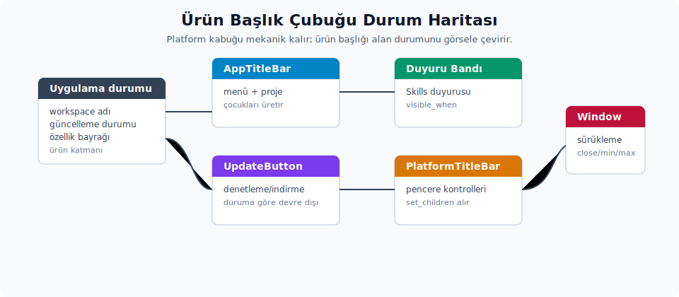

# Ürün titlebar'ı ve uygulamaya bağlama

Platform kabuğu hazır hale geldikten sonra sıra üst katmana gelir. Ürünün kendi başlık içeriği, yan panel bilgisi, menüleri ve uygulama kabuğu bu kabuğa bağlanır. Bu bölüm, "platform kabuğu çalışıyor" noktasından "kullanıcının gördüğü tam başlık çubuğu hazır" noktasına geçişi açıklar.



## 15. Yan panel ve Workspace etkileşimi

`PlatformTitleBar`, isteğe bağlı olarak bir `MultiWorkspace` zayıf referansı alabilir. Bu referansın tek bir amacı vardır: Başlık çubuğundaki pencere kontrollerinin yan panel ile görsel olarak çakışmasını önlemek. Bu görev için gerçekleştirilen işlemler şunlardır:

- Sol yan panel açıkken, sol taraftaki pencere kontrolleri gizlenir.
- Sağ yan panel açıkken, sağ taraftaki pencere kontrolleri gizlenir.
- CSD köşe yuvarlama, yan panelin temas ettiği tarafta kapatılır; böylece köşedeki gölge ve yuvarlama paneli kesip rahatsız edici bir görünüm oluşturmaz.

Zed'de bu bilgi `SidebarRenderState { open, side }` tipinde gelir. Port hedefinde sol veya sağ panel varsa, aynı soyutlamanın daha küçük bir tipe indirgenmesi yeterli olur:

```rust
#[derive(Default, Clone, Copy)]
struct KabukYanPanelDurumu {
    acik: bool,
    taraf: YanPanelTarafi,
}
```

Yan panel kavramının hiç bulunmadığı bir uygulamada bu alan tamamen kaldırılabilir. Alternatif olarak her zaman varsayılan durum döndüren bir implementasyon da sağlanabilir.

`PlatformTitleBar::is_multi_workspace_enabled(cx)` fonksiyonu Zed'de yalnız `DisableAiSettings` ayarı üzerinden değer üretir. İsim ürün açısından dolaylıdır; davranış ise aslında bir özellik bayrağı gibi çalışır. Fakat pencere kontrollerinin gizlenmesinde kullanılan gerçek `SidebarRenderState`, `MultiWorkspace::sidebar_render_state(cx)` üzerinden gelir; burada `open` değeri `self.sidebar_open() && self.multi_workspace_enabled(cx)` şeklinde hesaplanır ve `MultiWorkspace::multi_workspace_enabled(cx)` hem `DisableAiSettings::disable_ai` hem de `AgentSettings::enabled` değerine bakar. Yani Zed'de ürün başlığı tarafındaki yardımcı ile yan panel durumunun tam kaynakları aynı değildir. Port hedefinde bu kontrolün `UygulamaAyarlari::coklu_calisma_alani` veya `KabukAyarlari::yan_panel_etkin` gibi doğrudan anlaşılır tek bir ayar ailesine bağlanması daha sağlıklı olacaktır.

Zed'in ürün modelinde klasör ve proje açma davranışı şöyle çalışır: Varsayılan olarak yeni pencere açılmaz. Klasör veya proje, mevcut pencerenin thread yan paneline eklenir. `File > Open`, `File > Open Recent`, klasör sürükleme ve komut satırında `zed ~/proje` çağrısı gibi yolların hepsi aynı pencere içinde çalışma alanı değişikliğine yol açabilir. Yeni pencere açmak için Open Recent'ta Cmd/Ctrl+Enter ya da CLI tarafında `zed -n` kullanılır. `cli_default_open_behavior` varsayılan olarak `existing_window` kaldığı sürece, CLI üzerinden yapılan açılışlar da mevcut pencere/yan panel yolunu takip eder.

`OpenMode::Activate` modu da `OpenMode::NewWindow` gibi pencereyi öne alır. Bu, üst bar için küçük ama önemli bir sözleşmedir: Proje mevcut pencereye eklense bile "aktif proje değişti" olayı pasif bir durum değişimi gibi ele alınmaz. Port hedefinde proje/yan panel aktivasyonu yapıldığında titlebar başlığı, aktif worktree bilgisi ve pencere etkin/etkin olmayan renkleri aynı render turunda güncellenmelidir; `Activate` modunda pencere aktivasyonu atlanmaz.

Bu davranış `PlatformTitleBar` render sözleşmesini değiştirmez. Zayıf `MultiWorkspace` referansı platform kabuğu için yalnızca tek bir işe yarar: Yan panel tarafındaki pencere kontrol çakışmasını çözmek. Ürün titlebar'ı için ise kural farklıdır: Aktif proje veya çalışma alanı, pencere değişmeden de değişebilir. Bu yüzden proje adı, worktree bilgisi, yan panel tarafı ve başlık içeriği `Window` yaşam döngüsüne bağlanmaz. Aktif `MultiWorkspace::workspace()` durumuna gözlemci yerleştirilerek güncellenmelidir. Bu gözlem yoksa proje değiştiği halde başlıkta güncel olmayan isim görünmeye devam eder.

"Yan panel açık mı?" sorusu ile "açık proje var mı?" sorusu birbirine karıştırılmaz. Boş çalışma alanlarında yeni thread veya terminal oluşturma işlemi iş yapmadan dönebilir (`no-op`). Buna rağmen yan panelin açık/kapalı durumu ve sol/sağ konumu, başlık çubuğu kontrol çakışmasını çözmek için ayrı bir render durumu olarak tutulur. Bu iki durum aynı bayrak altında birleştirilirse pencere kontrolleri uyumsuz durumda gizlenecektir.

## 16. Başlık çubuğuna içerik yerleştirme

`PlatformTitleBar` kendi başına yalnızca platform kabuğunu sağlar. Kullanıcının gördüğü gerçek başlık içeriği bu tipin sorumluluğunda değildir. Zed'in gerçek ürün başlığı `title_bar` crate'indeki `TitleBar` tarafından üretilir. Bu üst katman platform kabuğuna çocuk element olarak şunları geçirir:

- Uygulama menüsü.
- Proje adı / son projeler açılır paneli.
- Git dal adı ve durum ikonu.
- Kısıtlı mod göstergesi.
- Kullanıcı menüsü, oturum açma butonu, kullanıcı menüsü içindeki plan çipi, güncelleme bildirimi.
- İşbirliği/ekran paylaşımı göstergeleri.
- Özellik bayrağına bağlı ilk karşılama/duyuru bantları.
- Güncelleme bildirimi ipucu (`Update to Version: ...`).

Güncelleme ipucunun biçimi, `version_tooltip_message` fonksiyonunda oluşturulur. Sürüm semantik ise `semver::Version` (`Version`) değerinin `to_string()` çıktısını kullanır. Commit SHA durumunda ise `AppCommitSha::full()` çağrısı saklanan tam SHA dizgesini olduğu gibi döndürür; bu yardımcı `short()` gibi karakter sayısını kırpmaz. Zed kaynak metni `"Update to Version:"` önekini kullanır. Port hedefinde bu etiketi Türkçeleştirirken aynı veri ayrımı korunmalıdır; ayrıca uzun metnin tek satıra sığacağı varsayılmaz. `Tooltip::text` veya muadili bir mekanizmada genişlik sınırı düşünülür. Genişlik sınırı yoksa ipucu taşıp ekran kenarında okunmaz hale gelebilir.

Güncelleme bildiriminin görsel kabuğu `ui` crate'indeki `UpdateButton` tipidir. `UpdateVersion::Render`, otomatik güncelleme durumuna göre beş kurucudan birini seçer: `checking`, `downloading`, `installing`, `updated`, `errored`. Bunlardan ilk üçü tıklamaya kapalıdır; kurucularında `disabled(true)` çağrılır ve render edilen düğme `disabled` bayrağına geçer. Zed kaynak metinleri sırasıyla `"Checking for Zed Updates…"`, `"Downloading Zed Update…"`, `"Installing Zed Update…"`, `"Restart to Update"` ve `"Failed to Update"` biçimindedir. Port hedefinde bu metinleri ürün diline çevirirken durum ayrımı aynı kalır.

Bu üç durumda butonun sınır rengi `colors().border` üzerinden gelir. `updated` ve `errored` durumlarında ise sınır `colors().text.opacity(0.15)` ile çizilir. İkonografi de aynı şekilde durum-koşullu seçilir: `Checking` ve `Installing` `IconName::LoadCircle` ile her turu 2 saniyede tamamlayan sürekli (sonsuz tekrarlı) bir dönüş animasyonu uygular; `Downloading` durağan `Download` ikonu kullanır, `errored` ise uyarı rengiyle `Warning` ikonunu gösterir ve kapatma tutamağı ekler.

Port hedefinde aynı bileşen kurulurken bu beş durumun her biri ayrı bir kurucu olarak ifade edilmelidir. Böylece ürün başlık çubuğu otomatik güncelleme durum makinesinin dilini doğrudan yansıtır ve durum geçişi sırasında butonun tıklanabilirlik durumu doğru korunur.

Ürün başlık çubuğu, duyuru bandı gibi içerikleri `TitleBar` katmanında yönetir; platform kabuğu bunları bilmez. `OnboardingBanner` mekanizması crate'te hazırdır (kurucu + `visible_when` koşulu + kalıcı kapatma), ancak güncel sürümde `TitleBar`'ın `banner` alanı `None` bırakılır; yani başlıkta fiilen bir duyuru bandı çizilmez. Bu mekanizmanın doğru durumu ve nasıl kurulacağı [Üst Bar](../ust_bar/ust_bar.md) bölümünde anlatılır. Port hedefinde bir duyuru bileşeni gerekiyorsa yeri `UygulamaBaslikCubugu` katmanıdır; platform kabuğuna eklenmez.

Port hedefinde aynı kalıbın kurulması tavsiye edilir. Platform titlebar yalnızca bir kabuk olarak tutulur. Ürünün anlamlı varlıklarının tamamı üst seviyede bir `UygulamaBaslikCubugu` veya `KabukBaslikCubugu` entity nesnesinde üretilir. Bu ayrım korunmadan platform kabuğunun içine ürün varlıkları doldurulmaya başlanırsa, önceki bölümlerde anlatılan katman ayrımı hızla bulanıklaşır.

Önerilen sorumluluk ayrımı şu şekildedir:

| Katman | Sorumluluk |
| :-- | :-- |
| `PlatformTitleBar` | Platform davranışı, sürükleme alanı, pencere kontrolleri, native sekmeler. |
| `UygulamaBaslikCubugu` | Uygulama adı, aktif çalışma alanı/doküman, menüler, kullanıcı eylemleri. |
| `UygulamaKabugu` | Pencere yerleşimi, CSD sarmalı, titlebar + içerik kompozisyonu. |
| `UygulamaDurumu` | Çalışma alanı, doküman, kullanıcı oturumu, ayar ve yaşam döngüsü eylemleri. |

Başlık çubuğu içeriğinde `justify_between` değiştiricisi kullanıldığı için çocuk elementleri sol, orta ve sağ grup olarak vermek pratiktir. Bu yaklaşım hem render kalıbına uyar hem de element yerleşimini bir bakışta okunur kılar:

```rust
let cocuklar = [
    h_flex()
        .id("baslik-sol")
        .gap_2()
        .child(uygulama_menusu)
        .child(proje_secici)
        .into_any_element(),
    h_flex()
        .id("baslik-sag")
        .gap_1()
        .child(senkron_durumu)
        .child(kullanici_menusu)
        .into_any_element(),
];

self.platform_baslik_cubugu.update(cx, |baslik_cubugu, _| {
    baslik_cubugu.set_children(cocuklar);
});
```

Etkileşimli çocuk elementlerde dikkat edilmesi gereken birkaç nokta vardır:

- Butonların ve açılır panel tetikleyicilerin tamamı tıklama ve fare basma olay yayılımını durdurmalıdır. Bunlar sürükleme yüzeyiyle aynı katmanda durduğu için olay yayılımı engellenmezse pencere sürüklemesi tetiklenebilir.
- Uzun metinler ya `truncate()` değiştiricisi ile kısaltılır ya da sabit bir `max_w(...)` değeriyle sınırlandırılır. Sınır yoksa uzun proje ya da dosya adları başlık çubuğunu taşırır.
- Sağ tarafta platform pencere butonlarının bulunabileceğinin akılda tutulması gerekir. Ürün butonlarının sağ iç boşluğu ve flex daralma davranışının bu olasılığa göre test edilmesi beklenir. Bu test yoksa pencere butonlarıyla çakışma yaşanabilir.
- Tam ekran modunda native pencere kontrolleri değişebileceği için macOS ve Windows davranışları ayrı ayrı doğrulanır. Tek bir platformda iyi çalışan yerleşim, diğer platformda tam ekran geçişinde bozulabilir.

## 17. Kendi uygulamana dahil etme

### Doğrudan Zed crate'iyle kullanım

Zed'in `Workspace` crate'leri, settings kayıtları ve tema altyapısı projede zaten varsa entegrasyon iskeleti aşağıdaki gibidir. Bu yol, Zed'in uygulama başlangıç kurulumuna oldukça yakın bir ortam bekler. Zed'den bağımsız bir GPUI uygulamasında doğrudan kullanım pek pratik değildir; o senaryoda port yaklaşımı daha uygundur.

```rust
use gpui::{App, Context, Entity, Render, Window, div};
use platform_title_bar::PlatformTitleBar;
use ui::prelude::*;

pub fn baslat(cx: &mut App) {
    PlatformTitleBar::init(cx);
}

pub struct UygulamaKabugu {
    baslik_cubugu: Entity<PlatformTitleBar>,
}

impl UygulamaKabugu {
    pub fn new(cx: &mut Context<Self>) -> Self {
        Self {
            baslik_cubugu: cx.new(|cx| PlatformTitleBar::new("uygulama-baslik-cubugu", cx)),
        }
    }
}

impl Render for UygulamaKabugu {
    fn render(&mut self, _window: &mut Window, cx: &mut Context<Self>) -> impl IntoElement {
        let baslik = div()
            .id("baslik")
            .text_sm()
            .child("GPUI Uygulamam")
            .into_any_element();

        self.baslik_cubugu.update(cx, |baslik_cubugu, _| {
            baslik_cubugu.set_children([baslik]);
        });

        v_flex()
            .size_full()
            .child(self.baslik_cubugu.clone())
            .child(div().id("icerik").flex_1())
    }
}
```

Bu örnekte `set_children` çağrısının `render` fonksiyonu içinde yer aldığına dikkat edilmesi gerekir. Bunun nedeni daha önce anlatıldığı gibi, Zed kaynağında çocuk listesinin render sırasında `mem::take` ile tüketilmesidir. Entity oluşturulurken bir kez çocuk vermek sonraki render geçişleri için yeterli değildir; içerik her render'da yeniden tazelenir.

### Bağımsız GPUI uygulamasına port

Zed dışında bir uygulamada doğrudan `platform_title_bar` crate'ine bağımlanmak genellikle ağır gelir. Pek çok ek crate'in de projeye sürüklenmesine yol açar. Port edilirken aşağıdaki tabloda gösterilen değişimler gerçekleştirilir:

| Zed Bağımlılığı | Port Karşılığı |
| :-- | :-- |
| `workspace::CloseWindow` | Uygulamanın `PencereyiKapat`, `BelgeyiKapat`, `ProjeyiKapat` veya `CikisIstendi` eylemi. |
| `zed_actions::OpenRecent { create_new_window: true }` | Uygulamanın `YeniPencere` veya `CalismaAlaniniAc` eylemi. |
| `WorkspaceSettings::use_system_window_tabs` | Uygulama ayarındaki native sekme seçeneği. |
| `ItemSettings::{close_position, show_close_button}` | Sekme kapatma butonu konumu ve görünürlüğü için uygulamanın kendi ayar tipi. |
| `MultiWorkspace` ve `SidebarRenderState` | Sol/sağ panel açık mı bilgisini veren uygulamanın kendi kabuk durum tipi. |
| `DisableAiSettings` | Çoklu çalışma alanı veya yan panel davranışını açıp kapatan uygulamanın kendi özellik bayrağı. |
| `cx.theme().colors().title_bar_background` | Tema sistemindeki titlebar token'ı. |

Pratik port sınırı şu şekilde özetlenebilir:

- `platform_title_bar.rs` dosyası bugün `workspace` crate'inin `MultiWorkspace`, `SidebarRenderState`, `SidebarSide` ve `CloseWindow` tiplerine doğrudan bağlıdır. Port hedefinde bu bağımlılık daraltılır; dosya yalnızca platform sözleşmesini bilir hale getirilir ve yan panel durumu ile kapatma eylemi gibi bilgiler, ürünün kendi kabuk durum ve eylem tipleri üzerinden verilir.
- `system_window_tabs.rs` içindeki eylem ve settings kullanımları ürünün kendi eylem ve ayar tipleriyle değiştirilir. Bu maliyetli görünüyorsa native sekme desteği proje kararına göre kapalı başlatılır; ihtiyaç doğduğunda etkinleştirilir. Buradaki bağımlılıklar diğer parçalara göre daha geniştir.
- `platforms/platform_linux.rs` and `platforms/platform_windows.rs` dosyaları diğer parçalara göre daha taşınabilirdir. Çoğu uygulamada bu dosyalar yalnız küçük değişikliklerle çalışır; özellikle Windows caption davranışı çoğunlukla olduğu gibi kalır.

---
