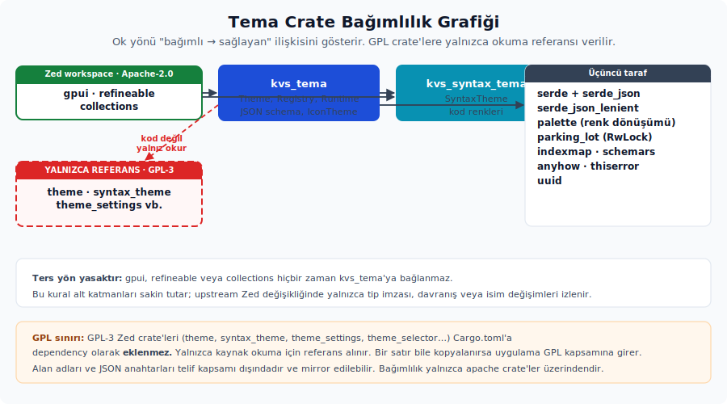

# Proje iskeleti ve bağımlılıklar

Sözleşme sınırları netleştiğinde sıradaki iş, crate yapısını ve bağımlılık tabanını kurmaktır. Sonraki bütün katmanlar bu iskeletin üzerine oturur. Bu yüzden klasör yerleşimi ve bağımlılık seçimleri yalnızca başlangıç detayı değildir; ilerideki geliştirme hızını, test yükünü ve bakım maliyetini doğrudan etkiler.

---

## 4. Crate yapısı ve klasör yerleşimi

Tema sistemi **iki crate** olarak konumlanır:

| Crate | Sorumluluk | Lisans |
| ------- | ----------- | -------- |
| `kvs_tema` | `Theme`, `ThemeColors`, `IconTheme`, JSON şeması, kayıt, çalışma zamanı | uygulamanın kendi lisansı |
| `kvs_syntax_tema` | `SyntaxTheme` — kod renkleri | uygulamanın kendi lisansı |

> **Crate adlandırma:** Bu rehberde `kvs_*` öneki yalnızca bir örnek olarak kullanırsın. Uygulama tarafında `app_tema`, `core_tema` veya farklı bir isim de tercih edilebilir; rehberin ortaya koyduğu kalıplar isim değişse de aynen geçerli kalır.

**Neden iki crate var?** `SyntaxTheme`, UI temasından ayrı yaşayabilen bir pakettir. Bir uygulama UI temasına ihtiyaç duyup sözdizimi renklendirmesine ihtiyaç duymayabilir; tersi de mümkün olabilir. Ayrıca sözdizimi teması tarafı ileride `tree-sitter` gibi farklı bağımlılıklara açılabilir. Bu olasılığı UI tema crate'inden ayrı tutmak, hem derleme süresini hem de dışa açık API yüzeyini daha sade bırakır.

**Klasör yerleşimi:**

```text
~/github/
├── zed/                         ← referans kaynak
└── kvs_ui/                      ← uygulamanın kendi monorepo'su
    ├── Cargo.toml               ← workspace
    └── crates/
        ├── kvs_tema/
        │   ├── Cargo.toml
        │   ├── src/
        │   │   ├── kvs_tema.rs  ← lib kökü (mod.rs değil)
        │   │   ├── styles.rs
        │   │   ├── styles/
        │   │   │   ├── colors.rs
        │   │   │   ├── status.rs
        │   │   │   ├── players.rs
        │   │   │   ├── accents.rs
        │   │   │   └── system.rs
        │   │   ├── schema.rs    ← JSON Content tipleri
        │   │   ├── refinement.rs ← Content → Theme dönüşümü
        │   │   ├── registry.rs
        │   │   ├── runtime.rs   ← Global, ActiveTheme, init
        │   │   ├── icon_theme.rs ← IconTheme sözleşmesi
        │   │   └── fallback.rs  ← uygulamaya ait varsayılan temalar
        │   └── tests/
        │       ├── fixtures/
        │       │   ├── one-dark.json   ← Zed'den, MIT lisanslı
        │       │   └── kvs-default.json
        │       └── parse_fixture.rs
        └── kvs_syntax_tema/
            ├── Cargo.toml
            └── src/kvs_syntax_tema.rs
```

**Modül adlandırma kuralı:** Lib kökü `mod` olarak değil, **crate adıyla aynı isimli bir dosya** olarak tutulur; örneğin `kvs_tema.rs`. Böylece editör başlığında hangi crate'in kök dosyasında çalıştığını hemen görürsün. Zed projesinin kendi konvansiyonu da bu yöndedir.

**Modüllerin sorumluluk haritası:**

| Modül | İçerir | Dış API mı? |
| ------- | -------- | ------------- |
| `kvs_tema.rs` (lib kökü) | Yeniden ihraçlar, `Theme`, `Appearance`, `ThemeFamily`; `ThemeStyles` (port tercihiyle crate-içi; Zed'de `pub`) | Kısmen |
| `styles/colors` | `ThemeColors` | Evet |
| `styles/status` | `StatusColors` | Evet |
| `styles/players` | `PlayerColors`, `PlayerColor` | Evet |
| `styles/accents` | `AccentColors` | Evet |
| `styles/system` | `SystemColors` | Evet |
| `schema` | `*Content` tipleri, `try_parse_color` (port tercihi; aşağıdaki nota bak) | Evet |
| `refinement` | `*_refinement()` fonksiyonları, `apply_*_defaults` | Crate-içi |
| `registry` | `ThemeRegistry`, `ThemeNotFoundError`, `IconThemeNotFoundError` | Evet |
| `runtime` | `GlobalTheme`, `ActiveTheme` trait, `SystemAppearance`, `init` | Evet |
| `icon_theme` | `IconTheme` ve içerik tipleri | Evet |
| `fallback` | `kvs_default_dark()`, `kvs_default_light()` | Evet |

`schema` modülünün bütün `*Content` tiplerini tek çatı altında toplaması bilinçli bir **port tercihidir**; Zed'in mevcut yapısını birebir yansıtmaz. Zed'de `schema.rs` yalnızca `AppearanceContent` ile `try_parse_color`'ı taşır; `ThemeColorsContent`, `ThemeContent`, `ThemeStyleContent` gibi diğer içerik tipleri `settings_content` ve `theme_settings` tarafındadır. Bu rehber bu ayna struct'larını okunabilirlik için tek modülde toplar. Yine de bu tiplere doğrudan dayanan bir tüketici, uygulamanın hedeflediği Zed JSON sözleşmesine bağlanmış olur; sözleşmeyi güncelleyeceksen ayna struct'larını ve test fixture'larını birlikte güncellersin.

---

## 5. Bağımlılık matrisi

**Workspace kökü (`kvs_ui/Cargo.toml`):**

```toml
[workspace]
resolver = "2"
members = [
    "crates/kvs_tema",
    "crates/kvs_syntax_tema",
    # ... uygulama crate'leri
]

[workspace.dependencies]
# Zed workspace bağımlılıkları — alt crate'ler buradan devralır
gpui        = { git = "https://github.com/zed-industries/zed", branch = "main" }
refineable  = { git = "https://github.com/zed-industries/zed", branch = "main" }
collections = { git = "https://github.com/zed-industries/zed", branch = "main" }
```

Alt crate'ler bu bağımlılıkları `gpui = { workspace = true }` biçiminde workspace'ten alır. Böylece kaynak güncellemesini tek bir noktadan yaparsın; crate'ler arasında sürüm sapması oluşmaz.

`kvs_tema/Cargo.toml`:

```toml
[package]
name = "kvs_tema"
version = "0.1.0"
edition = "2021"
license = "MIT"          # veya Apache-2.0 — uygulamanın tercihine bağlı
publish = false

[lib]
path = "src/kvs_tema.rs" # mod.rs değil

[dependencies]
# Zed workspace (Apache-2.0; `refineable` ve `collections` için publish uyarısı)
gpui = { workspace = true }
refineable = { workspace = true }
collections = { workspace = true }

# Aile içi crate
kvs_syntax_tema = { path = "../kvs_syntax_tema" }

# Üçüncü taraf
anyhow = "1"
palette = { version = "0.7", default-features = false, features = ["std"] }
parking_lot = "0.12"
# IndexMap ayrı bir doğrudan bağımlılık değildir; sıra koruyan map'ler için
# şema desteğini schemars'ın `indexmap2` özelliği sağlar.
schemars = { version = "1", features = ["indexmap2"] }
serde = { version = "1", features = ["derive"] }
serde_json = "1"
serde_json_lenient = "0.2"
thiserror = "1"
uuid = { version = "1", features = ["v4"] }

[dev-dependencies]
# Ekransız GPUI test ortamı
gpui = { workspace = true, features = ["test-support"] }
# Refinement karşılaştırmaları için epsilon yardımcısı
approx = "0.5"

[features]
# Tüketici crate'ler için test yardımcılarını açar.
test-util = []
```

`kvs_syntax_tema/Cargo.toml`:

```toml
[package]
name = "kvs_syntax_tema"
version = "0.1.0"
edition = "2021"
license = "MIT"
publish = false

[lib]
path = "src/kvs_syntax_tema.rs"

[features]
# Paket-içi temaları derlemeye gömmek istersen serde tabanını açar.
bundled-themes = ["dep:serde", "dep:serde_json"]

[dependencies]
gpui = { workspace = true }
serde = { workspace = true, optional = true }
serde_json = { workspace = true, optional = true }
```

Varsayılan derlemede sözdizimi crate'inin tek zorunlu bağımlılığı `gpui`'dir; buna yalnızca `HighlightStyle` ve renk tipleri için ihtiyaç vardır. `serde` ile `serde_json` opsiyoneldir ve yalnızca paket-içi tema özelliği (`bundled-themes`) altında devreye girer. Bu izolasyon bilinçli bir tercihtir: sözdizimi tarafına ileride `tree-sitter` eklense bile UI tema crate'i bu değişiklikten etkilenmez.

**Her bağımlılığın rolü ve kabul ettiği değer:**

| Crate | Rol | Tipik kullanım |
| ------- | ----- | ---------------- |
| `gpui` | Renk + bağlam tipleri | `Hsla`, `Rgba`, `SharedString`, `HighlightStyle`, `App`, `Global`, `WindowBackgroundAppearance`, `WindowAppearance` |
| `refineable` | Türetme makrosu | `#[derive(Refineable)]` + `#[refineable(...)]` öznitelikleri |
| `collections` | Map'ler | `HashMap` (deterministik iter), `IndexMap` |
| `kvs_syntax_tema` | Kardeş crate | `SyntaxTheme::new(highlights)` — ad/stil ikili demet yineleyicisi (`impl IntoIterator<Item = (String, HighlightStyle)>`) alır |
| `anyhow` | Hata yayma | `try_parse_color() -> anyhow::Result<Hsla>` |
| `palette` | Renk uzay dönüşümü | sRGB → HSL, `try_parse_color` içinde |
| `parking_lot` | Hızlı kilit | `RwLock<HashMap<...>>` registry'de |
| `schemars` | JSON şeması üretimi | IDE otomatik tamamlama desteği için tema dosyalarına şema üretmek; `indexmap2` özelliği üzerinden `IndexMap` tipleri için şema desteği eklenir (opsiyonel) |
| `serde` | Deserialize çekirdeği | Tüm `*Content` tipleri için |
| `serde_json` | Standart JSON | Zed tarafında theme crate'inde esasen testlerde devreye girer; programatik JSON üretimine ihtiyaç duyarsan port tercihi olarak eklersin |
| `serde_json_lenient` | Yorum ve sonda virgül toleranslı | Zed JSON dosyalarını ayrıştırmak için **şart** |
| `thiserror` | Hata türetme | `#[derive(Error)] ThemeNotFoundError` |
| `uuid` | Benzersiz kimlik | İkon teması yüklenirken (`load_icon_theme` içinde) `uuid::Uuid::new_v4()` ile benzersiz id üretmek |
| `inventory` | Bağlama zamanında statik kayıt | Zed'de `#[derive(RegisterSetting)]` `inventory::submit!` ile ayar tipini ekler; `SettingsStore::new` ise `inventory::iter` ile bunları toplar. Ayna tarafta `kvs_tema_ayarlari` ayarları otomatik kayıt edilecekse zorunlu hale gelir; alternatifi, kayıt listesini elle tutmaktır |
| `settings_macros` (Zed iç crate) | Türetme ve öznitelik makroları | `RegisterSetting`, `MergeFrom`, `with_fallible_options`. Ayna tarafta `kvs_ayarlari_macros` veya benzeri ayrı bir crate kurulur (proc-macro crate'ler diğer crate tipleriyle aynı pakette tutulamaz) |
| `derive_more` | `newtype` ergonomisi türevleri | `FontSize` newtype'ında `derive_more::FromStr` ile `from_str` üretmek için (`settings_content` crate'i). Ayna tarafta opsiyoneldir; elle de implement edilebilir |
| `serde_path_to_error` | Ayrıştırma hatasında alan yolu | Zed'de bu crate'i `settings_json` kullanır; ayrıştırma hatasında hangi alanın hatalı olduğunu `theme.colors.background: ...` biçiminde gösterir. Ayna tarafta kullanıcı deneyimi açısından tavsiye edilir |

**Sürüm uyumu:**

- **`palette` major versiyonu Zed'in kullandığıyla aynı tutman gerekir.** Aksi durumda HSL dönüşümü çok küçük miktarda kayabilir ve tema renkleri referans JSON çıktısıyla birebir örtüşmeyebilir. Bu fark gözle zor seçebilirsin, ama exact karşılaştırma yapan testleri bozar.

- **`serde_json_lenient`** Zed'in kullandığı sürümle uyumlu olmalıdır; major versiyon değişikliği yorum ve sonda virgül ayrıştırma davranışını değiştirebilir, bu da bazı geçerli Zed JSON dosyalarının aniden ayrıştırılamamasına yol açabilir.

- **`gpui`, `refineable`, `collections`** git kaynağından alırsın. Uygulamanın hedeflediği Zed durumunu açık tutmak için `branch` yerine `rev` ile sabit bir commit referansı kullanabilirsin:

  ```toml
  gpui = { git = "https://github.com/zed-industries/zed", rev = "6e8eaab25b5ac324e11a82d1563dcad39c84bace" }
  ```

Branch takibi Zed'deki değişimleri otomatik alır; `rev` ile sabitleme ise hangi Zed durumunun referans alındığını netleştirir. Bu rehberde önemli olan, seçilen referansın açık ve test edilebilir olmasıdır.

**Bağımlılık akış grafiği:**



```text
kvs_tema  ──bağımlı──>  gpui, refineable, collections, kvs_syntax_tema
                           palette, parking_lot, serde, serde_json_lenient,
                           schemars, thiserror, anyhow, uuid

kvs_syntax_tema  ──bağımlı──>  gpui

gpui, refineable, collections  ──kaynak──>  zed workspace (Apache-2.0;
                                            `gpui` publish edilebilir,
                                            `refineable` ve `collections`
                                            publish = false)
```

Bu grafiğin yönü tersine işlemez; `gpui` hiçbir zaman `kvs_tema`'ya bağlanmaz. Bu kural sayesinde Zed'in upstream'inde bir değişiklik olduğunda tema crate'i yalnızca üç yerden etkilenir: **tip imzası**, **davranış** ve **isim/yol değişimi**. Böylece upstream'i takip ederken nereye bakacağını baştan bilirsin ve beklenmedik geri etkiler azalır.

**Lib kökü iskeleti (`src/kvs_tema.rs`):**

```rust
//! kvs_tema — Zed-uyumlu, lisans-temiz tema sistemi.

pub(crate) mod refinement;   // crate-içi
pub mod fallback;            // ad alanı: `kvs_tema::fallback::kvs_default_dark`
mod icon_theme;
mod registry;
mod runtime;
mod schema;
mod styles;

// Kararlı dış API — glob ile ihraç
pub use crate::icon_theme::*;
pub use crate::registry::*;
pub use crate::runtime::*;
pub use crate::styles::*;

// Schema — Zed tarafı `pub use crate::schema::*;` ile glob ihraç yapar.
// Burada tek tek ihraç bir port tercihidir: yeni bir iç tip eklenince
// istemeden dışa açık olmasın diye dışa açık yüzey elle tutulur.
pub use crate::schema::{
    AppearanceContent, FontStyleContent, FontWeightContent,
    HighlightStyleContent, PlayerColorContent, StatusColorsContent,
    ThemeColorsContent, ThemeContent, ThemeFamilyContent,
    ThemeStyleContent, WindowBackgroundContent,
    try_parse_color,
};

use gpui::SharedString;
use std::sync::Arc;

#[derive(Debug, PartialEq, Clone, Copy, serde::Deserialize)]
#[serde(rename_all = "snake_case")]
pub enum Appearance {
    Light,
    Dark,
}

impl Appearance {
    pub fn is_light(&self) -> bool {
        matches!(self, Self::Light)
    }
}

#[derive(Clone, Debug, PartialEq)]
pub struct Theme {
    pub id: String,
    pub name: SharedString,
    pub appearance: Appearance,
    pub(crate) styles: ThemeStyles,   // erişim metotları üzerinden
}

// Port tercihi: Zed'de `Theme.styles` ve `ThemeStyles` `pub`'tır. Burada
// erişim metotlarıyla okutmak için kapsülleme bilerek daraltılmıştır.
#[derive(Clone, Debug, PartialEq)]
pub(crate) struct ThemeStyles {
    pub(crate) window_background_appearance: gpui::WindowBackgroundAppearance,
    pub(crate) system: SystemColors,
    pub(crate) colors: ThemeColors,
    pub(crate) status: StatusColors,
    pub(crate) player: PlayerColors,
    pub(crate) accents: AccentColors,
    pub(crate) syntax: Arc<kvs_syntax_tema::SyntaxTheme>,
}

// Erişim metotları — dışa açık okuma yolu
impl Theme {
    pub fn colors(&self)  -> &ThemeColors   { &self.styles.colors }
    pub fn status(&self)  -> &StatusColors  { &self.styles.status }
    pub fn players(&self) -> &PlayerColors  { &self.styles.player }
    pub fn accents(&self) -> &AccentColors  { &self.styles.accents }
    pub fn system(&self)  -> &SystemColors  { &self.styles.system }
    pub fn syntax(&self)  -> &Arc<kvs_syntax_tema::SyntaxTheme> {
        &self.styles.syntax
    }
    pub fn window_background_appearance(&self) -> gpui::WindowBackgroundAppearance {
        self.styles.window_background_appearance
    }
}

pub struct ThemeFamily {
    pub id: String,
    pub name: SharedString,
    pub author: SharedString,
    pub themes: Vec<Theme>,
}
```

---
