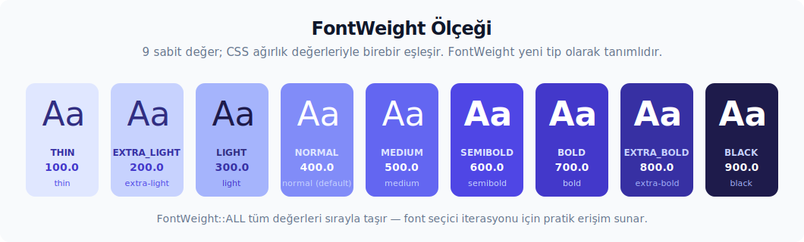

# GPUI'nin tema için kullanılan yüzeyi

Tema sistemi neredeyse her adımda GPUI tipleriyle konuşur. Renkler, font stilleri, pencere görünümü ve global durum bu yüzeyin parçasıdır. Bu tipler önceden anlaşılırsa, veri modeli ve çalışma zamanı kararları sonraki bölümlerde çok daha rahat takip edilir. Bu bölüm, tema kodunun sık kullandığı GPUI parçalarını görevleriyle ve yaygın dikkat noktalarıyla birlikte anlatır.

---

## 6. Renk tipleri: `Hsla`, `Rgba` ve kurucular

**Kaynak:** `gpui::color` (re-export'lu: `use gpui::{Hsla, Rgba, hsla, rgb, rgba};`).

GPUI tarafında iki temel renk tipi vardır. Tema sözleşmesi bunların içinde **`Hsla`'yı ana tip** olarak kullanır. Sözleşmedeki renk alanlarının tamamı `Hsla` taşır. `Rgba` ise çoğunlukla girişte, yani hex string ayrıştırılırken, ara temsil olarak devreye girer.

**`Hsla`** — Hue/Saturation/Lightness/Alpha:

```rust
pub struct Hsla {
    pub h: f32,  // 0.0 .. 1.0 — normalize renk tonu (0=kırmızı, 1/3=yeşil, 2/3=mavi)
    pub s: f32,  // 0.0 .. 1.0 — doygunluk
    pub l: f32,  // 0.0 .. 1.0 — açıklık (0=siyah, 0.5=salt renk, 1=beyaz)
    pub a: f32,  // 0.0 .. 1.0 — alfa
}
```

> **Hue alanı 0-1 aralığında çalışır, 0-360 derece değil.** CSS tarafındaki `hsl(210, 75%, 60%)` ifadesinin Rust karşılığı `hsla(210.0 / 360.0, 0.75, 0.60, 1.0)` biçimindedir. Hataya açık kullanım, derece değerini doğrudan `hsla` içine vermektir.

**`Rgba`** — sRGB renk uzayı (genelde hex ayrıştırmadan üretilir):

```rust
pub struct Rgba { pub r: f32, pub g: f32, pub b: f32, pub a: f32 }
```

**Kurucu tablosu:**

| Çağrı | Sonuç | Notlar |
| ------- | ------- | -------- |
| `hsla(h, s, l, a)` | `Hsla` | Serbest fonksiyon, en yaygın yol. |
| `rgb(0xff0000)` | `Rgba` | 24-bit RGB; alfa 1.0. |
| `rgba(0xff000080)` | `Rgba` | 32-bit RGBA; son byte alfa. |
| `opaque_grey(0.5, 1.0)` | `Hsla` | `(lightness, alpha)`. |
| `Rgba::try_from("#1c2025ff")` | `Result<Rgba>` | Hex ayrıştırma; alfa eksik ise 1.0. |
| `black()`, `white()` | `Hsla` | `(0,0,0,1)` / `(0,0,1,1)`. |
| `transparent_black()` | `Hsla` | `(0,0,0,0)` — renk geçişi ucu için ideal. |
| `transparent_white()` | `Hsla` | `(0,0,1,0)`. |
| `red()`, `blue()`, `yellow()` | `Hsla` | Doygun temel renkler (lightness 0.5). |
| `green()` | `Hsla` | **Lightness 0.25** — diğerlerinden farklı (koyu yeşil). |

**`Hsla` metotları (sık kullanılanlar):**

- `color.opacity(0.5) -> Hsla` — alfa değerini `* factor` ile çarpar; yeni bir `Hsla` döndürür.
- `color.alpha(0.3) -> Hsla` — alfa değerini doğrudan **atar**; çarpma değil atama yapar.
- `color.fade_out(0.3)` — yerinde alfa azaltma (`&mut self`).
- `color.blend(other) -> Hsla` — önceden çarpılmış alfa ile karışım üretir.
- `color.grayscale() -> Hsla` — doygunluğu sıfıra çeker.
- `color.to_rgb() -> Rgba` — Hsla'dan Rgba'ya çevirir.
- `color.is_transparent()`, `color.is_opaque()` — alfa kontrolü için.

**Test feature yüzeyi:** `gpui` `proptest` feature'ı ile derlendiğinde `Hsla` için iki ek test API'si gelir. `any::<Hsla>()` tüm kanalları (`h`, `s`, `l`, `a`) `0.0..=1.0` aralığında üretir. `Hsla::opaque_strategy()` ise yalnızca opak renk üretir (`a = 1.0`) ve kontrast, parlaklık veya tema türetme özellik testlerinde alfa belirsizliğini ortadan kaldırır. Bu API production sözleşmesi değildir; test/geliştirme feature'ı altında tutulmalıdır.

**Renk ayrıştırma boru hattı (`try_parse_color`):**

```rust
pub fn try_parse_color(s: &str) -> anyhow::Result<Hsla> {
    let rgba = gpui::Rgba::try_from(s)?;                       // 1. hex → Rgba
    let srgba = palette::rgb::Srgba::from_components(
        (rgba.r, rgba.g, rgba.b, rgba.a)
    );                                                          // 2. Rgba → palette::Srgba
    let hsla = palette::Hsla::from_color(srgba);               // 3. sRGB → HSL
    Ok(gpui::hsla(
        hsla.hue.into_positive_degrees() / 360.0,              // 4. palette HSL → gpui Hsla
        hsla.saturation,
        hsla.lightness,
        hsla.alpha,
    ))
}
```

Boru hattı birkaç küçük dönüşümden oluşur: GPUI `Rgba` → palette `Srgba` → palette `Hsla` → GPUI `Hsla`. Ortadaki `palette` katmanı gereklidir; çünkü GPUI tarafında `Rgba` değerini doğrudan `Hsla` değerine çeviren bir yol yoktur.

**Tema'da kullanım:**

```rust
pub struct ThemeColors {
    pub background: Hsla,
    pub border: Hsla,
    // ...
}
```

Tüm çalışma zamanı renk alanları `Hsla` tipindedir. JSON tarafında string olarak gelen renkler, deserializasyon veya refinement hazırlığı sırasında `try_parse_color` üzerinden `Hsla`'ya çevrilir ve struct'a bu biçimde yerleşir.

**Dikkat noktaları:**

1. **Hue'yu 0–360 aralığında yazmak**: `hsla(210.0, ...)` yazıldığında `hsla` kurucusu hue değerini `0.0..=1.0` aralığına clamp eder; `210.0` değeri `1.0` olur ve pratikte kırmızı uç noktasına denk gelir. Hue mutlaka `/ 360.0` bölümü ile normalize edilmelidir.
2. **`Default::default()` görünmezliği**: `Hsla::default()` çıktısı `(0, 0, 0, 0)` olur. Alfa sıfır olduğu için UI'da hiçbir şey görünmez. Durum renklerinde `unsafe { std::mem::zeroed() }` ile struct doldurmak da aynı görünmezlik sonucunu üretir.
3. **`opacity` ile `alpha` arasındaki fark**: `opacity(0.5)` mevcut alfa değerini `0.5` ile **çarpar**; `alpha(0.5)` ise alfa değerini doğrudan `0.5`'e **atar**. Yarı şeffaf bir rengi tam şeffaf yapmak için `opacity(0)` işe yaramaz; bunun yerine `alpha(0)` veya `transparent_black()` tercih edilmelidir.
4. **`green()` davranışının farkı**: Diğer temel renk fonksiyonlarından farklı olarak `green()` lightness değerini 0.5 yerine 0.25 verir. Yedek renkler hazırlanırken bu detayın gözetilmesi, beklenmedik koyu yeşil tonlarının önüne geçer.
5. **sRGB ↔ HSL kayması**: Aynı hex değeri farklı `palette` major versiyonlarında çok küçük miktarda farklı bir `Hsla` üretebilir. Bu yüzden hedeflenen Zed referansıyla aynı `palette` major versiyonunun kullanılması, exact karşılaştırma yapan testlerin tutarlı kalması için gereklidir.

---

## 7. Metin/font tipleri: `SharedString`, `HighlightStyle`, `FontStyle`, `FontWeight`

### `SharedString`

**Kaynak:** `gpui::SharedString` (alt seviyede `gpui_shared_string` crate).

Kavramsal olarak `Arc<str>` veya `&'static str` taşıyabilen, **ucuz klonlanan** değişmez bir string tipidir. Alt seviyede `SmolStr` ile tutulur: belirli bir uzunluğa kadarki kısa metinler yapının içinde (inline) saklanır, yalnızca bu sınırın üstündeki metinler `Arc` tabanlıdır. Her render geçişi kare kare yeniden çalışır. Bu yüzden `String::clone()` her seferinde yeni bellek ayırma üretirse maliyet birikir. `SharedString::clone()` ise kısa metinlerde yapının ucuz bir kopyasını çıkarır, daha uzun metinlerde ise `Arc` referans sayacını artırır; her iki durumda da yeni bir yığın ayırması yapmaz.

**Kurucular:**

```rust
let koyu_tema: SharedString = "kvs varsayilan koyu".into();       // From<&str>
let varsayilan: SharedString = SharedString::from("kvs varsayilan"); // From<&str>
let dinamik: SharedString = String::from("dinamik").into();       // From<String>
let odunc_metin: SharedString = std::borrow::Cow::Borrowed("x").into(); // From<Cow<str>>
```

**Sık kullanılan davranışlar:**

- `Clone` — kısa metinlerde ucuz kopya, uzun metinlerde `Arc` referans sayacı; her iki durumda da yığın ayırması yapılmaz.
- `Deref<Target=str>` — `&str` metotları doğrudan erişilebilir: `s.starts_with("..")`, `s.len()`.
- `Display + Debug + AsRef<str>`.
- `Eq + Hash` — `HashMap<SharedString, ...>` içinde anahtar olarak kullanabilirsin (registry deseni).
- `PartialOrd + Ord` — sıralanabilir.

**Tema'da kullanım:**

```rust
pub struct Theme {
    pub name: SharedString,           // "Kvs Default Dark"
    // ...
}

pub struct ThemeFamily {
    pub name: SharedString,
    pub author: SharedString,
    // ...
}

pub struct ThemeNotFoundError(pub SharedString);
```

Tema sisteminde isimler `SharedString` üzerinden taşınır. Registry içinde bu isimler hem map anahtarı olarak kullanılır hem de değer olarak sıkça klonlanır ve hash'lenir. Her noktada `String::clone()` ile bellek ayırma üretmek zamanla gereksiz bir maliyete dönüşür.

**Dikkat noktaları:**

1. **`SharedString::from(String)` ilk dönüşümün maliyeti metin uzunluğuna bağlıdır**: Kısa metinler yapının içine kopyalandığı için bu dönüşüm yığın ayırması yapmaz; yalnızca inline sınırının üstündeki metinlerde gerçek bir ayırma çalışır. Her iki durumda da sonraki klonlar ücretsizdir. Bu yüzden sıcak yolda her seferinde aynı string'i `String`'den yeniden üretmek yerine, bir kez `SharedString`'e dönüştürüp saklamak yine de daha verimli olur.
2. **Büyük/küçük harf duyarlılığı**: "Kvs Varsayılan" ve "kvs varsayılan" iki farklı anahtar olarak kabul edilir. Registry'deki `get` çağrılarının başarılı olması için isim **birebir** vermen gerekir.
3. **`to_string()` bellek ayırma üretir**: Yeni bir `String` ayrılır; bu gerekmiyorsa `.as_ref()` veya `Display` üzerinden yazmak daha doğru bir tercihtir.

### `HighlightStyle`

**Kaynak:** `gpui::HighlightStyle` (`text_system`).

Bir sözdizimi token'ına uygulanacak görünüm bilgisini taşır. Tüm alanlar opsiyoneldir:

```rust
pub struct HighlightStyle {
    pub color: Option<Hsla>,
    pub background_color: Option<Hsla>,
    pub font_style: Option<FontStyle>,
    pub font_weight: Option<FontWeight>,
    pub underline: Option<UnderlineStyle>,
    pub strikethrough: Option<StrikethroughStyle>,
    pub fade_out: Option<f32>,
}
```

- `None` değeri "üst stilden devral" anlamına gelir. Editor birden fazla katmanı sırayla `refine` ettiği için `None` katmanı alttakini korur, `Some` katmanı ise üstüne yazar.
- `Default::default()` çağrısı tüm alanları `None` ile doldurur (nötr stil).
- `Eq` ve `Hash`, `f32` taşıyan `fade_out` alanı için elle uygulanır (`f.to_be_bytes()` ile `u32`'ye çevrilir): `None` durumu sıfır bayt dizisine düşer (`unwrap_or_default()`), `Some(f32)` ise `f32`'nin baytları hash'lenir.
- `Copy + Clone` türevlidir. Klonlama pahalı değildir; tuple iterasyonu sırasında kopyalayarak taşımak doğal bir kullanımdır.

### `UnderlineStyle` ve `StrikethroughStyle`

`HighlightStyle.underline` ve `.strikethrough` alanlarının iç tipleri (`gpui::style`):

```rust
#[derive(Refineable, Copy, Clone, Default, Debug, PartialEq, Eq, Hash, Serialize, Deserialize, JsonSchema)]
pub struct UnderlineStyle {
    pub thickness: Pixels,    // kalınlık
    pub color: Option<Hsla>,  // None → metin rengi
    pub wavy: bool,           // imla denetleyicisi gibi dalgalı çizgi
}

#[derive(Refineable, Copy, Clone, Default, Debug, PartialEq, Eq, Hash, Serialize, Deserialize, JsonSchema)]
pub struct StrikethroughStyle {
    pub thickness: Pixels,
    pub color: Option<Hsla>,
}
```

Zed'in tema JSON sözleşmesinde sözdizimi stilleri için `underline`/`strikethrough` alanları **doğrudan ayrıştırılmaz**. `refine_theme` / `modify_theme` sözdizimi bloğunda yalnızca `color`, `background_color`, `font_style` ve `font_weight` alanları işlenir (`refine_theme`, `theme_settings`). Bu yüzden `underline`/`strikethrough`/`fade_out` alanları her zaman `Default::default()` değerinden, yani `None` veya nötr değerden gelir. Pratik sonuç şudur: tema yazarı bir sözdizimi token'ını tema dosyası üzerinden altı çizili gösteremez. Bu sınır Zed referansında da vardır; ayna tarafta da aynı sınır korunmalıdır. Aksi halde tema sözleşmesi Zed'den ayrılır ve gereksiz yere genişler.

**Tema'da kullanım** (`Theme::from_content` içinde):

```rust
fn vurgulama_stili(icerik: &HighlightStyleContent) -> HighlightStyle {
    HighlightStyle {
        color: icerik.color.as_deref().and_then(|renk| try_parse_color(renk).ok()),
        background_color: icerik.background_color.as_deref()
            .and_then(|renk| try_parse_color(renk).ok()),
        font_style: icerik.font_style.map(|stil| match stil {
            FontStyleContent::Normal => FontStyle::Normal,
            FontStyleContent::Italic => FontStyle::Italic,
            FontStyleContent::Oblique => FontStyle::Oblique,
        }),
        font_weight: icerik.font_weight.map(|agirlik| FontWeight(agirlik.0.clamp(100., 950.))),
        ..Default::default()
    }
}
```

Buradaki `.clamp(100., 950.)` çağrısı, JSON'dan gelen ağırlığı geçerli `[100, 950]` aralığına sınırlar; aralık dışı bir değer en yakın uca çekilir.

Üretilen `HighlightStyle` örnekleri `Vec<(String, HighlightStyle)>` listesi olarak `SyntaxTheme::new(...)` kurucusuna verirsin. Kurucu da stilleri içerideki `Vec<HighlightStyle>` içine, capture adlarını ise `BTreeMap<String, usize>` içine ayırır.

### `FontStyle`

```rust
pub enum FontStyle { Normal, Italic, Oblique }
```

- Tema JSON anahtarı: `"font_style": "italic"` (snake_case).
- `.italic()` akıcı kısayolu element üzerinde değeri `Italic` olarak atar.
- `Default` değeri `Normal`'dır.

### `FontWeight`

```rust
pub struct FontWeight(pub f32);
```

CSS weight değerleriyle birebir, sabit olarak tanımlıdır:



| Sabit | Değer | CSS karşılığı |
| ------- | ------- | --------------- |
| `FontWeight::THIN` | 100.0 | thin |
| `FontWeight::EXTRA_LIGHT` | 200.0 | extra-light |
| `FontWeight::LIGHT` | 300.0 | light |
| `FontWeight::NORMAL` | 400.0 | normal (varsayılan) |
| `FontWeight::MEDIUM` | 500.0 | medium |
| `FontWeight::SEMIBOLD` | 600.0 | semibold |
| `FontWeight::BOLD` | 700.0 | bold |
| `FontWeight::EXTRA_BOLD` | 800.0 | extra-bold |
| `FontWeight::BLACK` | 900.0 | black |

`FontWeight::ALL` tüm değerleri sırayla taşır (iterasyon için).

Tema JSON anahtarı `"font_weight": 700` veya `"font_weight": 700.0` biçimini kabul eder; `FontWeightContent` `transparent` newtype olduğu için doğrudan sayı ayrıştırabilir.

**Dikkat noktaları:**

1. **`HighlightStyle` katman karışımı**: Editor, semantic highlight ile tree-sitter highlight'ını **birleştirerek** çalışır. Tema tarafında `Italic` verilmiş olsa bile semantic katman `Some(Normal)` döndürdüğünde italik etkisi kaybolur. Bu davranış tema tarafının kontrolünde değildir ve tema yazarı için sürpriz olabilir.
2. **`FontWeight(700.0)` ile `FontWeight::BOLD` arasındaki tercih**: Davranış açısından ikisi de aynı sonucu verir; ancak okunabilirlik açısından sabit kullanmak çok daha açıklayıcıdır.
3. **`underline`, `strikethrough`, `fade_out` sınırını karıştırmak**: `HighlightStyle` tipi bu alanları taşır, ancak Zed tema JSON'u sözdizimi bloğunda bunları doğrudan kabul etmez. Ayna tarafta da bu ayrımı korumak gerekir: çalışma zamanı tipinin kapasitesi ile JSON sözleşmesinin izin verdiği alanlar aynı şey değildir.
4. **`FontStyle::Oblique` çizim farkı**: Çoğu OS font'unda Italic ile aynı şekilde render edilir, ancak bazı font'larda ayrı bir glif seti bulunabilir. "Italic seçildi ama Oblique göründü" şeklinde bir bildirim geldiğinde font katmanına bakmak yerinde olur.
5. **`HighlightStyle::default()` nötrdür ve kendi başına renk katkısı vermez:** Tüm alanlar `None` döndürür (color dahil). Bir sözdizimi kategorisi için `Default::default()` konulduğunda token üst/default metin stilinden görünür kalabilir, ama tema o kategoriye özel renk üretmemiş olur. Yedek sözdizimi kurulurken vurgulamak istediğin kategorilere en az `color: Some(...)` vermen gerekir.

---

## 8. Pencere: `WindowBackgroundAppearance`, `WindowAppearance`

Burada iki ayrı pencere kavramı vardır: tema yazarının seçtiği **arka plan tipi** ve sistemin verdiği **light/dark modu**. İsimleri benzer görünse de farklı problemleri çözerler. Bu ikisini ayırmak, ileride çıkabilecek birçok hatayı baştan engeller.

### `WindowBackgroundAppearance`

**Kaynak:** `gpui::WindowBackgroundAppearance` (`window`).

GPUI enum'u pencere arka planı için şu değerleri taşır. Tema/settings JSON sözleşmesindeki `"background.appearance"` alanı ise `WindowBackgroundContent` üzerinden yalnız `Opaque`, `Transparent` ve `Blurred` değerlerini GPUI'ye çevirir; iki Windows 11 materyali olan `MicaBackdrop` ve `MicaAltBackdrop` bu sürümde düşük seviye GPUI yüzeyinde kalır ve tema JSON'undan doğrudan gelmez:

```rust
pub enum WindowBackgroundAppearance {
    Opaque,
    Transparent,
    Blurred,
    MicaBackdrop,
    MicaAltBackdrop,
}
```

| Değer | Davranış | Platform notu |
| ------- | ---------- | --------------- |
| `Opaque` (varsayılan) | Pencere arka planı tam dolu; altındaki masaüstü görünmez. | Her yerde çalışır. |
| `Transparent` | Pencere altındaki masaüstü/diğer pencereler doğrudan görünür. Bunun için tema'nın `background` rengi alpha < 1 olmalı. | macOS, Windows, Wayland evet. X11 compositor'a bağlı. |
| `Blurred` | Arka planı bulanıklaştıran platform etkisini ister. | Platform desteğine bağlıdır; destek yoksa pencere yöneticisi yedek davranışa düşebilir. |
| `MicaBackdrop` | Windows 11 Mica backdrop materyalini ister. | GPUI enum'unda vardır; Zed tema/settings JSON sözleşmesi bu değeri doğrudan parse etmez. |
| `MicaAltBackdrop` | Windows 11 Mica Alt backdrop materyalini ister. | GPUI enum'unda vardır; Zed tema/settings JSON sözleşmesi bu değeri doğrudan parse etmez. |

**Tema'da yer:**

```rust
pub(crate) struct ThemeStyles {
    pub(crate) window_background_appearance: WindowBackgroundAppearance,
    // ...
}
// Theme erişim metodu
impl Theme {
    pub fn window_background_appearance(&self) -> WindowBackgroundAppearance {
        self.styles.window_background_appearance
    }
}
```

JSON Content tarafında ise `WindowBackgroundContent` (`Opaque`/`Transparent`/`Blurred`) üçlüsü `IntoGpui` dönüşümüyle bu enum'un ilk üç varyantına eşlenir.

**Pencere açılırken aktarma:**

```rust
WindowOptions {
    window_background: cx.theme().window_background_appearance(),
    // ...
}
```

Bu değer `open_window` argümanı olarak verirsin. Pencere yöneticisi de pencereyi bu arka plan tipine göre oluşturur.

**Çalışma zamanı değişimi:** Pencere açıldıktan sonra arka plan tipinin değiştirilmesi gerekiyorsa `window.set_background_appearance(yeni_gorunum)` çağrısı kullanırsın.

### `WindowAppearance`

**Kaynak:** `gpui::WindowAppearance` (`platform`).

```rust
pub enum WindowAppearance {
    Light,         // macOS: aqua
    VibrantLight,  // macOS: NSAppearanceNameVibrantLight
    Dark,          // macOS: darkAqua
    VibrantDark,   // macOS: NSAppearanceNameVibrantDark
}
```

`Vibrant*` varyantları macOS'a özgüdür. Diğer platformlarda üretilmezler, ama enum her zaman dört değeri taşır. Tema seçimi için çoğu zaman yalnızca `Light`/`Dark` ayrımı yeterlidir; vibrancy ayrı bir özellik gibi düşünmen gerekir.

**Erişim:**

- `cx.window_appearance() -> WindowAppearance` — uygulama düzeyi (sistem tercihini verir).
- `window.appearance() -> WindowAppearance` — pencerenin gerçek görünümü (üst pencere değerini ezebilir).
- `window.observe_window_appearance(|window, cx| ...)` — değişimi izler (geri dönüş bir `Subscription`'dır; `.detach()` zorunludur).
- `cx.observe_window_appearance(window, |this, window, cx| ...)` — view durumu içinden izleme yapar.

**Tema'da kullanım** (`SystemAppearance::init`):

```rust
let gorunum = match cx.window_appearance() {
    WindowAppearance::Dark | WindowAppearance::VibrantDark => Appearance::Dark,
    WindowAppearance::Light | WindowAppearance::VibrantLight => Appearance::Light,
};
```

Sistem light/dark tercihine göre `Appearance::Dark` veya `Appearance::Light` seçilir; sonrasında registry'den uygun isimde tema istenir.

**Sistem değişimini takip eden Zed-tarzı desen:**

```rust
cx.observe_window_appearance(window, |_, window, cx| {
    let gorunum = window.appearance();
    // SystemAppearance'ı güncelle, temayı yeniden yükle
    // ...
}).detach();
```

`.detach()` çağrısı zorunludur. `Subscription` düşerse gözlemci ölür ve sistem değişimleri sessizce kaybolur.

**Dikkat noktaları:**

1. **`Transparent` ile opak arka plan ikilemi**: `WindowBackgroundAppearance::Transparent` seçilmesine rağmen temanın `colors.background` alfa değeri 1.0 ise sonuç yine opak bir pencere olur. Transparent moddan görsel olarak yararlanmak için arka plan alfa değeri < 1 olmalıdır.
2. **`Blurred` modunun platform yedeği**: Linux X11 üzerinde blur desteklenmiyorsa GPUI sessizce opak görünüme düşer. Tema yazarına platform farkındalığı taşıyan bir uyarı vermek, geliştirici tarafında elle kurulması gereken bir kolaylıktır.
3. **`Vibrant*` dalını atlamak**: `match cx.window_appearance()` yazılırken yalnızca `Light` ve `Dark` ele alınıp `Vibrant*` varyantları atlanırsa derleyici hata verir; `_ => ...` ile geçilirse macOS davranışı eksik kalır; vibrancy tonu da doğru ayrıştırılmaz.
4. **`window.set_background_appearance` sistem modunu değiştirmez**: Bu fonksiyon yalnızca pencere düzeyinde etki eder; sistem light/dark moduna dokunmaz.
5. **Açıldıktan sonra blur eklemek**: GPU kaynakları yeniden ayrıldığından ilk kare görsel olarak titreyebilir.

---

## 9. Bağlam tipleri: `App`, `Context<T>`, `Window`, `BorrowAppContext`

GPUI'de **bağlam** (`cx`), o anda hangi kaynaklara erişilebildiğini belirler. Tema sistemi çoğunlukla `App` ve `Context<T>` ile çalışır. `Window`'a doğrudan dokunması daha nadirdir.

### `App`

Uygulama düzeyindeki durumu temsil eder:

```rust
fn init(cx: &mut App) { /* ... */ }
```

**Tema sisteminin `App` üzerinden eriştiği başlıca yüzeyler:**

- `cx.global::<T>() -> &T` — okuma; tip yoksa panic.
- `cx.try_global::<T>() -> Option<&T>` — okuma; tip yoksa `None`.
- `cx.set_global::<T>(value)` — kurma veya üzerine yazma.
- `cx.update_global::<T, _>(|t, cx| ...)` — değiştirir; tip yoksa panic.
- `cx.has_global::<T>() -> bool` — varlık kontrolü.
- `cx.window_appearance() -> WindowAppearance` — sistem mod sorgusu.
- `cx.refresh_windows()` — açık tüm pencereleri yeniden render eder.

### `Context<T>`

Bir `Entity<T>` (View, Model) güncellenirken gelir:

```rust
impl Render for AnaPanel {
    fn render(&mut self, window: &mut Window, cx: &mut Context<Self>) -> impl IntoElement {
        let tema = cx.theme();   // ← Context<T> üzerinde de çalışır
        div().bg(tema.colors.background)
    }
}
```

**Önemli ayrıntı:** `Context<T>: Deref<Target = App>` ilişkisi nedeniyle `App` metotları `Context<T>` üzerinde de doğrudan çalışır. Bu yüzden `cx.theme()` çağrısı için render içinde mi yoksa uygulama init akışında mı olunduğu çoğu durumda fark etmez.

**`Context<T>` ekstra metotları (tema-dışı, kıyas için):**

- `cx.notify()` — bu entity'nin re-render'ını tetikler.
- `cx.emit(event)` — entity olay yayar.
- `cx.spawn(...)` — async task başlatır.
- `cx.subscribe(...)`, `cx.observe(...)` — entity'ler arası izleme kurarsın.

Tema sistemi bu metotları **kendi içinde kullanmaz**. UI tüketicisi, bir entity'yi tema değişimine bağlamak istediğinde bu bağlantıyı `cx.notify()` gibi mekanizmalarla kendisi kurarsın.

### `Window`

Pencere düzeyindeki durumu temsil eder. Tema sistemi `Window` parametresini doğrudan almaz; çağrılan GPUI fonksiyonları bilgiyi `App`/`Context<T>` üzerinden taşır. Tek istisna sistem görünümü değişiminin izlenmesidir; o noktada `window.observe_window_appearance(...)` veya `cx.observe_window_appearance(window, ...)` çağrısı için `Window` referansına ihtiyaç duyulur.

### `BorrowAppContext` trait

`App`, `Context<T>`, `AsyncApp`, `AsyncWindowContext`; hepsi bu trait'i uygular:

```rust
pub trait BorrowAppContext {
    fn set_global<G: Global>(&mut self, global: G);
    fn update_global<G: Global, R>(&mut self, f: impl FnOnce(&mut G, &mut Self) -> R) -> R;
    fn update_default_global<G: Global + Default, R>(
        &mut self,
        f: impl FnOnce(&mut G, &mut Self) -> R,
    ) -> R;
}
```

`update_global` kapanışının ikinci parametresi `&mut App` değil `&mut Self`'tir; yani kapanış, çağrıyı yaptığın bağlamın türünü (`App`, `Context<T>`, async bağlam) korur. Okuma metotları (`has_global`, `global`, `try_global`) bu trait'te değil, doğrudan `App` üzerinde inherent metot olarak tanımlıdır.

Tema sisteminin global yönetimi bu trait üzerinden işler. Aynı `GlobalTheme::update_theme(cx, tema)` çağrısı `App`, `Context<T>` ve async bağlam üzerinden kullanabilirsin.

**Trait uyum tablosu (tema açısından):**

| Bağlam | `cx.theme()` | `set_global` | `cx.notify()` | `cx.window_appearance()` |
| -------- | -------------- | -------------- | --------------- | --------------------------- |
| `&App` | ✓ | ✗ (mut gerek) | ✗ | ✓ |
| `&mut App` | ✓ | ✓ | ✗ | ✓ |
| `&Context<T>` | ✓ | ✗ | ✗ | ✓ |
| `&mut Context<T>` | ✓ | ✓ | ✓ | ✓ |
| `&AsyncApp` | `try_global` ile | ✗ | ✗ | `window` üzerinden |

**Dikkat noktaları:**

1. **`cx.theme()` panic potansiyeli**: `GlobalTheme` kurulmadıysa panic atar. Bu yüzden `kvs_tema::init(cx)` çağrısını uygulama başında mümkün olan en erken noktada yapman gerekir.
2. **`Context<T>` içinden `set_global` çağırmak**: Teknik olarak çalışır, ama tema değişimi tüm view'ları etkilediğinden bireysel bir entity'den tetiklenmesi mantığa uymaz; tema değişim akışı `App` düzeyinde tutulduğunda akış çok daha okunaklı olur.
3. **AsyncApp üzerinden tema erişimi**: `&App` yerine `WeakEntity` ve `update` kullanılması tercih edilir; tema durumu okuma anında değişebileceği için doğrudan referans tutmak risklidir.
4. **`Window` referansını saklamak**: Pencere kapandığında handle bayatlar. Bu yüzden `WindowHandle<T>` veya `WeakEntity` tercih edilmelidir.

---

## 10. `Global` trait ve `cx.set_global / update_global / refresh_windows`

GPUI'de **global durum**, `App` içinde tip ile indekslenen durum demektir. Her tipten yalnızca tek bir örnek tutulabilir. Tema sistemi bu yapı üzerinde üç temel global taşır.

**`Global` trait** — herhangi bir metot içermeyen bir işaretleyicidir:

```rust
pub trait Global: 'static {}
```

- Tek gereksinim `'static` olmaktır; başka bir referans tutmayan, kendi başına yaşayan bir tip yeterlidir.
- Her tip için `impl Global for BenimTipim {}` satırı yeterli olur.

**Newtype deseni (zorunlu pratik):**

```rust
struct GlobalThemeRegistry(Arc<ThemeRegistry>);
impl Global for GlobalThemeRegistry {}
```

`Arc<ThemeRegistry>` tipini doğrudan global yapmak yerine onu bir **newtype'a sarmak** iyi bir pratiktir. Çünkü `Arc<ThemeRegistry>` başka bir yerde başka bir amaçla da global yapılabilir. Global anahtarı `GlobalThemeRegistry` gibi ayrı bir tip olduğunda bu çakışma baştan önlenir.

**Global yönetimi metotları** (`set_global`/`update_global`/`update_default_global` `BorrowAppContext`'te; `has_global`/`try_global`/`global` ise `App` üzerinde inherent metottur):

| Metot | Davranış | Yoksa |
| -------- | ---------- | ------- |
| `cx.set_global(g)` | Kurar veya üzerine yazar | OK |
| `cx.update_global::<G, _>(\|g, cx\| ...)` | Değiştirir | **Panic** |
| `cx.update_default_global::<G, _>(\|g, cx\| ...)` | Değiştirir | Default ile kurar |
| `cx.has_global::<G>()` | Kontrol | `false` |
| `cx.try_global::<G>()` | Okuma | `None` |
| `cx.global::<G>()` | Okuma | **Panic** |

**`init`-or-`update` deseni** (tema sisteminin tutarlı kullanımı):

```rust
pub fn temayi_kur_veya_guncelle(cx: &mut App, tema: Arc<Theme>) -> anyhow::Result<()> {
    if cx.has_global::<GlobalTheme>() {
        GlobalTheme::update_theme(cx, tema);
    } else {
        // İlk kez kuruluyor; icon teması da elde hazır olmalı.
        let ikon_temasi = kvs_tema::ThemeRegistry::global(cx)
            .default_icon_theme()?;
        cx.set_global(GlobalTheme::new(tema, ikon_temasi));
    }

    Ok(())
}
```

İlk çağrıda `set_global`, sonraki çağrılarda ise `update_global` kullanırsın. Bu desen tema sistemine özgü değildir; global durum yönetimi için genel ve okunaklı bir kalıptır.

> **İsim çakışmasından kaçınma:** `theme_settings::settings` modülünde `pub fn set_theme(current: &mut SettingsContent, …)` adında **ayrı bir dışa açık yardımcı** vardır. Bu fonksiyon kullanıcı ayar dosyasını değiştirir, çalışma zamanı global'ini değil; ikisinin aynı isme bağlanması okuyucuyu yanıltır. Ayna tarafta çalışma zamanı fonksiyonunun adı `update_theme` (Zed paritesi) veya `temayi_kur_veya_guncelle` gibi farklı bir kimlikte tutulmalıdır.

### Tema sisteminin üç global'i

| Global | İçerik | Kim kurar | Kim okur |
| -------- | -------- | ----------- | ---------- |
| `GlobalThemeRegistry` | `Arc<ThemeRegistry>` | `cx.set_global(GlobalThemeRegistry(...))` (Zed'de `pub(crate) ThemeRegistry::set_global` sarmalayıcısı bunu yapar) | `ThemeRegistry::global(cx)` |
| `GlobalTheme` | `Arc<Theme>` + `Arc<IconTheme>` (aktif) | `cx.set_global(GlobalTheme::new(...))`, sonra `update_theme` / `update_icon_theme` | `cx.theme()`, `GlobalTheme::icon_theme(cx)` |
| `GlobalSystemAppearance` | `SystemAppearance` | `SystemAppearance::init` | `SystemAppearance::global(cx)` |
| `BufferFontSize`, `UiFontSize`, `AgentUiFontSize`, `AgentBufferFontSize` | `Pixels` (geçersiz kılma) | `adjust_*_font_size` çağrıları | `ThemeSettings::*_font_size(cx)` (geçersiz kılma yoksa ayar değerine düşer). Zed dışa açık yüzeyinde yalnızca agent newtype'ları yeniden ihraç edilir; buffer/ui newtype'ları içte kalır |

### `cx.refresh_windows()`

Açık olan tüm pencereleri **yeniden render** eder:

```rust
pub fn temayi_degistir(ad: &str, cx: &mut App) -> anyhow::Result<()> {
    let registry = ThemeRegistry::global(cx);
    let yeni = registry.get(ad)?;
    GlobalTheme::update_theme(cx, yeni);
    cx.refresh_windows();   // ← tüm UI'yı yenile
    Ok(())
}
```

**Neden gerekli olur?** GPUI'deki `cx.notify()` yalnızca belirli bir Entity'nin yeniden render edilmesini tetikler. Tema değişikliği ise **her** view'ı etkiler. Bu yüzden tek tek view'lara `cx.notify()` göndermek yerine, tüm pencereleri kapsayan bir tetikleme gerekir.

**Davranış:**

- Tüm açık pencerelerde view ağacı yeniden inşa edilir (sonraki kare).
- Pencerelere özgü durum (odak, kaydırma konumu vb.) korunur.
- GPU kaynakları yeniden kullanılır; yalnızca yerleşim ve boyama adımları yeniden çalışır.

**Dikkat noktaları:**

1. **Init sıralaması**: `cx.theme()` çağrısı `GlobalTheme` kurulmadan yapılırsa panic atar. `kvs_tema::init(cx)` ana akışın en erken noktasında çağrılmalıdır.
2. **`set_global` çakışması**: Aynı tipin yeniden kurulması mevcut global'i siler. Bu yüzden tema dışı bir global durum aynı tipte tutulmamalıdır.
3. **`refresh_windows` eşleşmesi**: Tema değiştiğinde UI'nın eski renkte kalmaması için `GlobalTheme::update_theme` çağrısını (veya onu saran yerel yardımcıyı) her zaman `refresh_windows` ile eşleştirmen gerekir. Bu eşleşmeyi tek bir yardımcı fonksiyon içinde tuttuğunda aynı yenileme kuralını tüm akışta korursun.
4. **`update_global` içinde `set_global` çağırmak**: Aynı tip üzerinde yeniden giriş hatasına yol açar. Update geri çağırımı içinde yalnızca alan değiştirilmeli, yeni bir kurma işlemi yapılmamalıdır.
5. **Gözlemci aboneliğinin yaşaması**: `cx.observe_window_appearance(...)` çağrısı bir `Subscription` döndürür; bu değer üzerinde `.detach()` çağrılmadığında `Subscription` düşer ve gözlemci ölür, o yüzden sistem değişimleri kaybolur.

---

## 11. `refineable::Refineable` türetme davranışı

**Kaynak:** `refineable` crate (Zed workspace, Apache-2.0).

`#[derive(Refineable)]`, her struct için alanları `Option<T>` olan bir **ikiz `*Refinement` tipi** üretir. Sonrasında `orijinal.refine(&refinement)` çağrısı bu ikizi orijinal değerle birleştirir.

### Türetme davranışı

**Girdi:**

```rust
#[derive(Refineable, Clone, Debug, PartialEq)]
#[refineable(Debug, serde::Deserialize)]
pub struct StatusColors {
    pub error: Hsla,
    pub error_background: Hsla,
    pub error_border: Hsla,
}
```

**Üretilen çıktı** (otomatik; kullanıcı tarafından elle yazılmaz):

```rust
#[derive(Default, Clone, Debug, serde::Deserialize)]
pub struct StatusColorsRefinement {
    pub error: Option<Hsla>,
    pub error_background: Option<Hsla>,
    pub error_border: Option<Hsla>,
}

impl Refineable for StatusColors {
    type Refinement = StatusColorsRefinement;

    fn refine(&mut self, refinement: &Self::Refinement) {
        if let Some(v) = &refinement.error { self.error = *v; }
        // ... her alan
    }

    fn refined(mut self, refinement: Self::Refinement) -> Self {
        self.refine(&refinement);
        self
    }
    // ... is_superset_of, subtract, from_cascade, is_empty
}
```

### `#[refineable(...)]` öznitelik parametreleri

Listedeki öğeler, **Refinement tipine eklenecek türetmelerdir**:

```rust
#[refineable(Debug, serde::Deserialize)]
```

Refinement tipi zaten `Default + Clone` türevlidir; bu öznitelik ile üstüne `Debug` ve `serde::Deserialize` eklersin.

Tema sözleşmesinde fiilen kullanılanlar şunlardır:

- `Debug` — log ve test çıktısı için.
- `serde::Deserialize` — refinement'in doğrudan JSON'dan deserialize edilebilmesi için.

### Alan-bazlı sarmalama kuralları (`derive_refineable` davranışı)

Makro, alan tipine göre üç farklı sarmalama yapar (`refineable` crate'i):

| Alan tipi (girdi) | Refinement'taki tip | Davranış |
| ------------------- | --------------------- | ---------- |
| Düz `T` (örn. `Hsla`, `Pixels`) | `Option<T>` | `Some(v)` üzerine yazar, `None` taban değeri korur |
| `Option<T>` (zaten Option) | `Option<T>` **aynen** (tekrar sarmalanmaz) | Boş ↔ dolu durumu kullanıcı seviyesinden gelir; makro yeniden `Option<Option<T>>` üretmez |
| `#[refineable] U` (iç içe refineable) | `URefinement` (iç içe refinement tipi) | Özyinelemeli olarak `refine` çağrılır |

`is_optional_field` (`refineable` crate'i) bu kararı **tip yolunun tek segmentli `Option` olup olmadığına** bakarak verir. Yalın `Option<T>` sayılır; `core::option::Option<T>`, `std::option::Option<T>`, `BenimOption<T>` veya generic alias **sayılmaz**. Ayna tarafta alan tiplerini açıkça `Option<T>` formunda yazman bu yüzden en güvenli tercihtir.

**Refinement içi yuva (`type Refinement = Self::Refinement`):** Refinement tipi kendi başına da `Refineable` uygular ve `type Refinement = Self::Refinement` ilişkisini kurar; yani Refinement'in Refinement'i yine kendisidir. Bu sabit nokta sayesinde `Cascade<S>` slot listesindeki her slot aynı tipte refinement taşır.

### `Refineable` trait yüzeyi (tam)

```rust
pub trait Refineable: Clone {
    type Refinement: Refineable<Refinement = Self::Refinement> + IsEmpty + Default;

    fn refine(&mut self, refinement: &Self::Refinement);
    fn refined(self, refinement: Self::Refinement) -> Self;
    fn from_cascade(cascade: &Cascade<Self>) -> Self where Self: Default + Sized;
    fn is_superset_of(&self, refinement: &Self::Refinement) -> bool;
    fn subtract(&self, refinement: &Self::Refinement) -> Self::Refinement;
}

pub trait IsEmpty {
    fn is_empty(&self) -> bool;
}
```

Tema sisteminin gerçekten kullandığı yüzey oldukça **dardır**: çoğunlukla `refine` ve `refined`. `Cascade`, `is_superset_of`, `subtract` ve `is_empty` trait sözleşmesinin parçasıdır, ama tema akışında çağrılmaz. Zed de bunların büyük bölümünü tema tarafında kullanmaz.

### Davranış kuralları

- **İç içe davranış açıktır**: Makro, normal alanları `Option<T>` içine sarar ve değer verildiğinde alanı değiştirir. Yalnızca alan üzerinde `#[refineable]` özniteliği bulunduğunda iç içe refinement tipi kullanılır ve `self.field.refine(...)` çağrılır. `Theme.styles` gibi üst katmanlarda bu otomatik davranış istenmiyorsa alanın işaretlenmemesi yeterlidir; elle orkestrasyon `Theme::from_content` içinde kalır.
- **`Some(v)` üzerine yazma, `None` koruma**: JSON deserializasyonu sırasında verilmeyen alan `None` olarak gelir ve taban değer korunur.
- **Üzerine yazma `clone()` tabanlıdır**: Makro normal alanlar için `value.clone()` üretir. `Hsla` gibi `Copy` türevli tiplerde bu pratikte ucuz bir işlemsiz adımdır; `Copy` olmayan alanlarda gerçek bir klonlama çalışır. Bu yüzden `Refineable` türetilen struct'taki her sarmalanmış alanın `Clone` uygulaması gerekir; aksi halde türetme hata verir ("the trait `Clone` is not implemented for ...").
- **`Refinement`'in kendisi de `Refineable`'dır**: İki refinement'i zincirleme birleştirmek mümkündür (`birinci_refinement.refine(&ikinci_refinement)`); tema sistemi şimdilik bu kapasiteyi kullanmaz, ama gerektiğinde elde hazır durur.

### Tema'da nerede kullanılır

- `ThemeColors` ve `StatusColors` `#[derive(Refineable)]` ile işaretlenir; bunun sonucunda `ThemeColorsRefinement` ve `StatusColorsRefinement` tipleri otomatik üretilir.
- `Theme::from_content` akışı şu adımları izler: 1. Taban `Theme` klonlanır. 2. Content'ten refinement üretilir (`theme_colors_refinement`, `status_colors_refinement`). 3. `apply_status_color_defaults` çağrısı ile türetme uygularsın. 4. `colors.refine(&refinement)` çağrısı ile birleştirme tamamlanır.

Sonuçta eksik alanlar taban temadan gelir, dolu alanlar ise kullanıcı temasından alırsın.

### `Cascade` (bilgi — tema'da kullanılmaz)

`refineable` crate'i, çok katmanlı (3+) refinement yığını için `Cascade<S>` ve `CascadeSlot` tipleri sunar:

```rust
pub struct Cascade<S: Refineable>(Vec<Option<S::Refinement>>);
pub struct CascadeSlot(usize);
```

Tema sistemi bu tipleri kullanmaz; taban + kullanıcı olmak üzere iki katman yeterlidir. GPUI'nin `Interactivity` katmanı bile `Cascade` yerine `Option<Box<StyleRefinement>>` alanları tutar. Yani üç veya daha fazla refinement katmanına pratikte sık ihtiyaç duyulmaz. Bu yüzeyi bilmek yararlıdır, ama tema sistemi şimdilik onu hazırda bekletmekle yetinir.

### Dikkat Noktaları

1. **`#[refineable(...)]` özniteliği gerektiren durumlar**: Eklenmediği durumda Refinement tipi yalnızca `Default + Clone` taşır. Serde gereği duyulan senaryolarda `#[refineable(serde::Deserialize)]` çağrısını elle eklemen gerekir.
2. **Dışa açık/iç uyumsuzluğu**: `pub struct ThemeColors` tanımı varsa Refinement tipi de `pub struct ThemeColorsRefinement` olarak üretilir. Görünürlük, makro tarafından kopyalanır.
3. **`refine` ile `refined` arasındaki tercih**: İlki `&mut self` üzerinde çalışır, ikincisi sahip alır. `Hsla` gibi küçük alanlar için `refine` her zaman daha doğal bir seçimdir.
4. **İç içe struct'lar için karar noktası**: Makro yalnızca `#[refineable]` ile işaretli alanlarda özyinelemeli birleştirme yapar. `Theme.styles.colors` gibi katmanlarda bu ilişkinin bilinçli kurulması istenmediği durumlarda, `Theme::from_content` her alt struct için ayrı bir `refine` çağrısı yürütür.
5. **`refineable` crate'inin `publish = false` olması**: Crates.io'ya yayınlanan bir crate'in bu türetmeyi kullanabilmesi için fork veya vendor yolu zorunlu olur.
6. **Refinement tipinin `Default` taşımak zorunda olması**: `..Default::default()` yazılmadığında her alanın açıkça vermen gerekir. Makro `Default` türevini zaten ücretsiz olarak ürettiği için bundan yararlanmak yapılacak en doğal şeydir.

---
