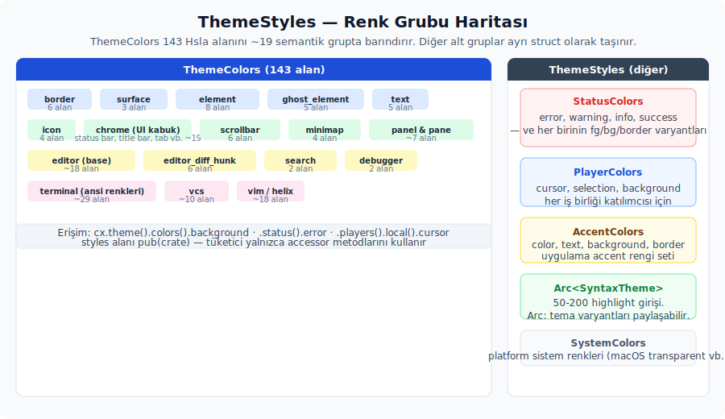

# Çalışma zamanı veri modeli

GPUI tipleri tanındıktan sonra, uygulamanın bellekte taşıyacağı tema modelini kurabiliriz. Bu modelin içinde ana `Theme` tipi, renk grupları, sözdizimi tema kabı ve ikon tema sözleşmesi yer alır. Bu bölüm çalışma zamanı tarafının ana yapı taşlarını tek tek anlatır ve her parçanın neden bu şekilde tasarlandığını açıklar.

---

## 12. `Theme` ve `ThemeStyles` üst yapısı

**Kaynak modül:** `kvs_tema/src/kvs_tema.rs` (lib kökü).

Tema'nın **üst düzey** sözleşmesi iki struct'a ayrılır: `Theme` ve `ThemeStyles`. `Theme`, üst bilgi ile stil kabını bir araya getirir. `ThemeStyles` ise tüm renk ve stil gruplarını taşır. Bu ayrım, ilerideki okuma ve klonlama işlemlerinin neden ucuz kaldığını da gösterir.

```rust
pub struct Theme {
    pub id: String,
    pub name: SharedString,
    pub appearance: Appearance,
    pub(crate) styles: ThemeStyles,   // erişim metotları üzerinden okunur
}

pub(crate) struct ThemeStyles {
    pub(crate) window_background_appearance: WindowBackgroundAppearance,
    pub(crate) system: SystemColors,
    pub(crate) colors: ThemeColors,
    pub(crate) status: StatusColors,
    pub(crate) player: PlayerColors,
    pub(crate) accents: AccentColors,
    pub(crate) syntax: Arc<kvs_syntax_tema::SyntaxTheme>,
}

// Tüketicinin tek okuma yolu — erişim metotları
impl Theme {
    pub fn colors(&self) -> &ThemeColors      { &self.styles.colors }
    pub fn status(&self) -> &StatusColors     { &self.styles.status }
    pub fn players(&self) -> &PlayerColors    { &self.styles.player }
    pub fn accents(&self) -> &AccentColors    { &self.styles.accents }
    pub fn system(&self) -> &SystemColors     { &self.styles.system }
    pub fn syntax(&self) -> &Arc<kvs_syntax_tema::SyntaxTheme> {
        &self.styles.syntax
    }
    pub fn appearance(&self) -> Appearance {
        self.appearance
    }
    pub fn window_background_appearance(&self) -> WindowBackgroundAppearance {
        self.styles.window_background_appearance
    }

    /// Lightness'i azaltarak renk koyulaştırır. İlk değer açık tema,
    /// ikincisi koyu tema modunda kullanılır; lightness alt sınırı 0.0.
    /// Zed paritesi.
    pub fn darken(&self, color: Hsla, light_amount: f32, dark_amount: f32) -> Hsla {
        let amount = match self.appearance {
            Appearance::Light => light_amount,
            Appearance::Dark => dark_amount,
        };
        let mut hsla = color;
        hsla.l = (hsla.l - amount).max(0.0);
        hsla
    }
}
```

> **Görünürlük kararı:** `styles` alanı `pub(crate)` olarak tanımlanır. Tüketici crate doğrudan `theme.styles.X` zincirini **yazamaz**; her okuma erişim metodu üzerinden geçer. Amaç, tüketici kodu tema modelinin iç yerleşimine bağlamamaktır. Uygulama mevcut Zed sözleşmesine göre güncellendiğinde erişim arayüzü okunacak alanları açık ve kontrollü tutar. Bu kural ilgili bölümde dış API kataloğu üzerinden ayrıca netleştirilir.

### Alan-alan davranış

| Alan | Tip | Niye böyle |
| ------ | ----- | ------------ |
| `id` | `String` | Benzersiz tema id'sidir; çalışma zamanında `uuid::Uuid::new_v4()` ile üretilir. Map anahtarı olarak kullanılmadığı için hash ihtiyacı yoktur. |
| `name` | `SharedString` | İnsan tarafından okunabilir ad (örn. "Kvs Varsayılan Koyu"). Registry map anahtarı olarak çok klonlandığından `Arc<str>` ucuzluğu burada kazanç sağlar. |
| `appearance` | `Appearance` | `Light` veya `Dark`. UI tarafının sistem moduna göre tema seçmesini mümkün kılar. |
| `styles` | `ThemeStyles` | Tüm renk grupları. Ayrı bir struct olarak tutulmasının nedeni: `Theme` klonlanırken `styles`'ın boyutunu (~150 `Hsla` + diğerleri) tek alan altında bir arada tutmaktır. |

### `ThemeStyles` alt katmanları

| Alt katman | Tip | Bölüm referansı |
| ----------- | ----- | ----------------- |
| `window_background_appearance` | `WindowBackgroundAppearance` | — |
| `system` | `SystemColors` | — |
| `colors` | `ThemeColors` | — |
| `status` | `StatusColors` | — |
| `player` | `PlayerColors` | — |
| `accents` | `AccentColors` | — |
| `syntax` | `Arc<SyntaxTheme>` | — |

### `Arc<SyntaxTheme>` neden Arc?

`SyntaxTheme` içinde genelde 50-200 girdilik highlight listesi bulunur. Syntax bölümü, tema renklerinden **bağımsız** olarak paylaşılabilir. Bu yüzden `Arc` ile sarmalamak işe yarar: aynı syntax teması birden fazla `Theme` varyantı arasında kullanabilirsin. Örneğin light ve dark sürümler yalnızca UI renklerinde ayrışıp aynı syntax kurallarını paylaşabilir.

Diğer alt katmanlar (`ThemeColors`, `StatusColors`, vb.) `Arc` ile sarılmaz. Her biri görece küçüktür; en büyük grup yaklaşık 150 `Hsla` taşır. Ayrıca taban tema ile her varyant için ayrı bir klon almak zaten beklenen akıştır.

### Erişim desenleri

```rust
let tema = cx.theme();                         // &Arc<Theme>
let arka_plan = tema.colors().background;      // erişim metodu üzerinden
let soluk_metin = tema.colors().text_muted;
let hata = tema.status().error;
let yerel = tema.players().local().cursor;
```

> **Zed eşdeğeri:** Zed'in `theme` crate'i dosyasında da `theme.colors()` ve `theme.status()` erişim metotları bulunur. `kvs_tema`'da bu sözleşme aynen korunur; erişim metotları yukarıdaki struct tanımının `impl Theme` bloğunda yer alır.
>
> Tüketici kod **hiçbir zaman** `theme.styles.X` yazmaz — `styles` alanı `pub(crate)` olduğundan crate dışından görünmez.

### `Theme` clone stratejisi

`Theme` bir bütün olarak yaklaşık `~150 × Hsla (16 byte) + birkaç enum + Arc + String` boyutundadır; yani **2.5-3 KiB** civarında kalır. Her `cx.theme()` çağrısı `&Arc<Theme>` döndürür. Bu yüzden yaygın kullanımda klonlama maliyeti yalnızca `Arc` referans sayacı artışıdır. Doğrudan `Theme::clone()` çağırmak çoğu zaman gerekmez; `GlobalTheme.theme` zaten `Arc<Theme>` üzerinden taşınır.

### İstemci tarafı dekorasyon sabitleri

`CLIENT_SIDE_DECORATION_ROUNDING` ve `CLIENT_SIDE_DECORATION_SHADOW`, tema renklerinden farklı bir dışa açık yüzeydir. İkisi de `Pixels` tipindedir ve platform-native başlık çubuğu kullanılmadığında çizilen istemci tarafı pencere kromunun geometri kararını sabitler.

| Sabit | Değer | Ne için kullanılır |
| ------- | ------- | -------------------- |
| `CLIENT_SIDE_DECORATION_ROUNDING` | `px(10.0)` | İstemci tarafı pencere köşe yuvarlatması. |
| `CLIENT_SIDE_DECORATION_SHADOW` | `px(10.0)` | İstemci tarafı pencere gölge alanı. |

Bu değerler bir tema paleti alanı değildir; kullanıcı temasından geçersiz kılınmaz. Bir uygulama Zed'e benzer pencere kromu çiziyorsa aynı sabitleri pencere dekorasyonu katmanında kullanır. Bileşenlerin hover, border veya surface renklerini belirlerken bu sabitlere bakılmaz; o işler `ThemeColors` alanlarından yürür.

### Tuzaklar

1. **`id` ile `name` arasında karışıklık**: `name` `SharedString` tipindedir ve registry'de anahtar olarak kullanılır. `id` (uuid) yalnızca tema-içi tanımlama amacıyla tutulur; ikisinin birbirinin yerine konulması registry akışını bozar.
2. **`styles` alanını `pub` yapmak**: Bu, dış sözleşmeyi doğrudan iç yapıya bağlar. Bu rehberin kararı `pub(crate)` yönündedir. Tüketicinin tek okuma yolu erişim metotlarıdır (`theme.colors()`, `theme.status()` vb.).
3. **`appearance` çalışma zamanında değişmez**: Bir tema *Light* olarak yüklendi diye çalışma zamanında Dark olarak yeniden işlenmez. Tema değişimi için `GlobalTheme::update_theme` çağrısı yapılarak yeni bir `Arc<Theme>` aktive edilmelidir.
4. **`SystemColors::default()` ile doldurmanın yeterliliği**: Tema yazarı sistem renklerini özelleştirmek istemiyorsa `Default::default()` yeterlidir. Bazı geliştiriciler bu alanı atlayıp `unsafe zeroed` ile karıştırıp yapıyı görünmez hale getirme yoluna gider; bu yaklaşım sonradan zor takip edilen hatalara yol açar.

---

## 13. `ThemeColors` alan kataloğu ve yansıtma API'si

**Kaynak modül:** `kvs_tema/src/styles/colors.rs`.

UI renk paletinin tamamı tek bir struct altında toplanır. **Alan sayısı yaklaşık 150 civarındadır**; kesin sayı takip edilen Zed tema sözleşmesine bağlıdır.



```rust
#[derive(Refineable, Clone, Debug, PartialEq)]
#[refineable(Debug, serde::Deserialize)]
pub struct ThemeColors {
    /* ~150 alan, gruplara ayrılmış */
}
```

`#[derive(Refineable)]` özniteliği sayesinde `ThemeColorsRefinement` ikizi otomatik olarak üretilir.

### Alan grupları (semantik kategoriler)

Aşağıdaki tablo, alan adlandırma öneklerini ve her grubun **ne işe yaradığını** özetler. Zed'in `theme` crate'indeki sıralama korunur. Bir alanı eksik bırakmak, sözleşmeyi delmek anlamına gelir.

| Grup | Prefix / örnek | Rol | Yaklaşık alan sayısı |
| ------ | ---------------- | ----- | --------------------- |
| **Kenarlıklar** | `border`, `border_variant`, `border_focused`, `border_selected`, `border_transparent`, `border_disabled` | Çevre çizgileri ve odak/seçim durumları | 6 |
| **Yüzeyler** | `background`, `surface_background`, `elevated_surface_background` | Pencere/panel/popover katmanlama | 3 |
| **Etkileşimli element** | `element_background`, `element_hover`, `element_active`, `element_selected`, `element_selection_background`, `element_disabled`, `drop_target_background`, `drop_target_border` | Button/clickable durumları | 8 |
| **Ghost element** | `ghost_element_background`, `ghost_element_hover`, `ghost_element_active`, `ghost_element_selected`, `ghost_element_disabled` | Şeffaf arka planla element durumları (toolbar icon vb.) | 5 |
| **Metin** | `text`, `text_muted`, `text_placeholder`, `text_disabled`, `text_accent` | Ön plan renkleri | 5 |
| **Icon** | `icon`, `icon_muted`, `icon_disabled` | Icon ön plan renkleri | 3 |
| **Editor** | `editor_*` (background, foreground, line_number, active_line_background, wrap_guide, document_highlight_*) | Kod editör katmanı | 18 |
| **Editor diff hunk** | `editor_diff_hunk_*` | Diff hunk arka plan/kenarlık görünümü | 6 |
| **Terminal** | `terminal_background`, `terminal_foreground`, `terminal_ansi_*`, `terminal_ansi_dim_*` | Terminal ön plan/arka plan ve ANSI normal/bright/dim renkleri | 29 |
| **Panel** | `panel_background`, `panel_focused_border`, `panel_indent_guide_*` | Sidebar/panel kromu | ~5 |
| **Status bar** | `status_bar_background` | Alt durum çubuğu | 1-2 |
| **Title bar** | `title_bar_background`, `title_bar_inactive_background`, `title_bar_border` | Pencere başlığı | ~3 |
| **Tab** | `tab_bar_background`, `tab_active_background`, `tab_inactive_background` | Editor tab şeridi | ~5 |
| **Search** | `search_match_background` | Arama vurgusu | ~2 |
| **Scrollbar** | `scrollbar_thumb_*`, `scrollbar_track_*` | Kaydırma çubuğu | 6 |
| **Minimap** | `minimap_thumb_*` | Minimap kaydırma thumb'u | 4 |
| **Debugger** | `debugger_accent`, `editor_debugger_active_line_background` | Debug oturumu | 2 |
| **VCS** | `version_control_added`, `_modified`, `_deleted`, `_word_*`, `_conflict_marker_*` | Git/VCS göstergeleri | 10 |
| **Vim** | `vim_normal_*`, `vim_visual_*`, `vim_helix_*`, `vim_yank_background` | Vim/Helix modu vurgusu | 18 |
| **Pane group** | `pane_group_border`, `pane_focused_border` | Editor pane sınırları | ~2 |

> **Bu tablo yaklaşık sayılar verir.** Tam liste için `theme` crate'i çalışma zamanı alanları ve `settings_content` crate'i Content alanları esas alınır.

### Tam alan paritesi

Aşağıdaki liste, referans alınan Zed sürümündeki `ThemeColors` çalışma zamanı alanlarının **eksiksiz** kataloğudur. Çalışma zamanı struct'ı toplam 143 adet `Hsla` alanı taşır. `ThemeColorsContent` tarafında da hedeflenen sözleşme bu çalışma zamanı alanlarına karşılık gelen content alanlarıyla sınırlı tutulur; alias alanlar bu rehberin kapsamına alınmaz.

```text
border:
  border, border_variant, border_focused, border_selected,
  border_transparent, border_disabled

surface:
  elevated_surface_background, surface_background, background

element:
  element_background, element_hover, element_active, element_selected,
  element_selection_background, element_disabled,
  drop_target_background, drop_target_border

ghost_element:
  ghost_element_background, ghost_element_hover, ghost_element_active,
  ghost_element_selected, ghost_element_disabled

text:
  text, text_muted, text_placeholder, text_disabled, text_accent

icon:
  icon, icon_muted, icon_disabled, icon_placeholder, icon_accent

debugger:
  debugger_accent

chrome:
  status_bar_background, title_bar_background,
  title_bar_inactive_background, toolbar_background,
  tab_bar_background, tab_inactive_background, tab_active_background,
  search_match_background, search_active_match_background,
  panel_background, panel_focused_border, panel_indent_guide,
  panel_indent_guide_hover, panel_indent_guide_active,
  panel_overlay_background, panel_overlay_hover,
  pane_focused_border, pane_group_border

scrollbar:
  scrollbar_thumb_background, scrollbar_thumb_hover_background,
  scrollbar_thumb_active_background, scrollbar_thumb_border,
  scrollbar_track_background, scrollbar_track_border

minimap:
  minimap_thumb_background, minimap_thumb_hover_background,
  minimap_thumb_active_background, minimap_thumb_border

vim:
  vim_normal_background, vim_insert_background, vim_replace_background,
  vim_visual_background, vim_visual_line_background,
  vim_visual_block_background, vim_yank_background,
  vim_helix_jump_label_foreground, vim_helix_normal_background,
  vim_helix_select_background, vim_normal_foreground,
  vim_insert_foreground, vim_replace_foreground, vim_visual_foreground,
  vim_visual_line_foreground, vim_visual_block_foreground,
  vim_helix_normal_foreground, vim_helix_select_foreground

editor:
  editor_foreground, editor_background, editor_gutter_background,
  editor_subheader_background, editor_active_line_background,
  editor_highlighted_line_background, editor_debugger_active_line_background,
  editor_line_number, editor_active_line_number, editor_hover_line_number,
  editor_invisible, editor_wrap_guide, editor_active_wrap_guide,
  editor_indent_guide, editor_indent_guide_active,
  editor_document_highlight_read_background,
  editor_document_highlight_write_background,
  editor_document_highlight_bracket_background,
  editor_diff_hunk_added_background,
  editor_diff_hunk_added_hollow_background,
  editor_diff_hunk_added_hollow_border,
  editor_diff_hunk_deleted_background,
  editor_diff_hunk_deleted_hollow_background,
  editor_diff_hunk_deleted_hollow_border

terminal:
  terminal_background, terminal_foreground, terminal_bright_foreground,
  terminal_dim_foreground, terminal_ansi_background,
  terminal_ansi_black, terminal_ansi_bright_black, terminal_ansi_dim_black,
  terminal_ansi_red, terminal_ansi_bright_red, terminal_ansi_dim_red,
  terminal_ansi_green, terminal_ansi_bright_green, terminal_ansi_dim_green,
  terminal_ansi_yellow, terminal_ansi_bright_yellow,
  terminal_ansi_dim_yellow, terminal_ansi_blue,
  terminal_ansi_bright_blue, terminal_ansi_dim_blue,
  terminal_ansi_magenta, terminal_ansi_bright_magenta,
  terminal_ansi_dim_magenta, terminal_ansi_cyan,
  terminal_ansi_bright_cyan, terminal_ansi_dim_cyan,
  terminal_ansi_white, terminal_ansi_bright_white,
  terminal_ansi_dim_white

link:
  link_text_hover

version_control:
  version_control_added, version_control_deleted,
  version_control_modified, version_control_renamed,
  version_control_conflict, version_control_ignored,
  version_control_word_added, version_control_word_deleted,
  version_control_conflict_marker_ours,
  version_control_conflict_marker_theirs
```

**Parite ilişkisi:** Çalışma zamanı alanları ile `ThemeColorsContent` alanları aynı hedef sözleşmenin iki yüzüdür: çalışma zamanı tarafı `Hsla`, content tarafı JSON'dan gelen `Option<String>` taşır. Alias alanlar ayrıca eklenmez.

### Adlandırma kuralı

| Konum | Stil | Örnek |
| ------- | ------ | ------- |
| Rust alan adı | `snake_case` | `border_variant`, `terminal_ansi_red` |
| JSON anahtarı | `dot.separated` | `border.variant`, `terminal.ansi.red` |
| Bağlantı | `#[serde(rename = "border.variant")]` |  |

### `Refineable` davranışı

`ThemeColors` `Refineable` türevini taşıdığı için her alan için `ThemeColorsRefinement` içinde bir `Option<Hsla>` üretilir. `from_content` akışı şu şekilde işler:

1. Taban `ThemeColors` klonlanır.
2. Kullanıcı temasından `ThemeColorsRefinement` üretilir.
3. `taban.refine(&refinement)` çağrısıyla iki katman birleştirilir.

Sonuçta eksik alanlar tabandan gelir; kullanıcının verdiği alanlar tabanın üstüne yazılır.

| API | Alt özellikler | Kısa anlamı |
| :-- | :-- | :-- |
| `ThemeColorsRefinement` | `ThemeColors` alanlarının `Option<Hsla>` karşılıkları | Kullanıcı temasında verilen UI renklerini taşır; `None` alanlar tabandan kalır. |
| `StatusColorsRefinement` | `StatusColors` alanlarının `Option<Hsla>` karşılıkları | Durum ön plan/arka plan/kenarlık geçersiz kılmalarını taşır; arka plan türetme `apply_status_color_defaults` ile yapılır. |

### Tuzaklar

1. **Sıra önemlidir (sözleşme açısından değil, okunabilirlik açısından)**: Zed dosyasındaki sıralamanın korunması, yeni alanların yerinin anlaşılmasını kolaylaştırır. Alfabetik sıralama ise yanlış bir tercih olur ve ileride parite kontrolünü zorlaştırır.
2. **Grup yorumlarını silmek**: `// Kenarlıklar`, `// Yüzeyler` gibi semantik yorumlar grup sınırını gösterir; yeni alan grupları eklenirken bu yorumlar referans noktası olarak iş görür.
3. **Yeni grup eklendiğinde ilgili bölüm tablosunu güncellememek**: Yeni bir semantik grup eklendiyse rehberin bu bölümündeki tabloya satır eklemen gerekir; aksi halde dokümantasyon kodun gerisinde kalır.
4. **Editor / debugger / vcs alanlarını dışlamak**: "Henüz editor yok" geçerli bir dışlama sebebi olarak kabul edilmez. Tüm alanlar eklenir, UI'da okunması sonraya bırakılabilir.
5. **`Option<Hsla>` alanları**: `ThemeColors` `Hsla` (Option değil) tutar. Eksik bir alan tabandan doldurulur; refinement katmanı bunu yönetir. `ThemeColors` içinde `Option<Hsla>` kullanılmaya kalkıldığında refinement deseni bozulur.

### `all_theme_colors` ve `ThemeColorField` — yansıtma API'si

**Kaynak:** `theme` crate'i (`ThemeColorField` enum), `theme` crate'i (`all_theme_colors` fn).

Tema editörü, color picker, debug inspector veya snapshot testi yazarken tema renklerini **çalışma zamanında listelemek** gerekebilir. Zed bu ihtiyacı iki yapıyla karşılar:

```rust
use strum::{AsRefStr, EnumIter, IntoEnumIterator};

/// Tema editörü/önizleme için seçilmiş yansıtma alt kümesi.
#[derive(EnumIter, Debug, Clone, Copy, AsRefStr)]
#[strum(serialize_all = "snake_case")]
pub enum ThemeColorField {
    Border,
    BorderVariant,
    // ... referans Zed sürümünde 111 varyant
}

impl ThemeColors {
    pub fn color(&self, field: ThemeColorField) -> Hsla { /* match field */ }
    pub fn iter(&self) -> impl Iterator<Item = (ThemeColorField, Hsla)> + '_ { /* ... */ }
    pub fn to_vec(&self) -> Vec<(ThemeColorField, Hsla)> { /* ... */ }
}

/// Tüm tema renklerini anahtar-değer listesi olarak döner
pub fn all_theme_colors(cx: &mut App) -> Vec<(Hsla, SharedString)> {
    let tema = cx.theme();
    ThemeColorField::iter()
        .map(|alan| {
            let renk = tema.colors().color(alan);
            let ad = alan.as_ref().to_string();
            (renk, SharedString::from(ad))
        })
        .collect()
}
```

**Kritik parite notu:** `ThemeColorField`, `ThemeColors` içindeki her alanı kapsamaz. Referans Zed sürümünde çalışma zamanı `ThemeColors` 143 alan taşır; `ThemeColorField` ise yalnızca 111 varyantlık bir yansıtma alt kümesidir. Küme ilişkisi şöyledir:

```text
ThemeColorField labels ⊆ ThemeColors fields
ThemeColorField labels = 111
ThemeColors fields = 143
```

`ThemeColors` içinde bulunan ama Zed yansıtma API'sinde yer almayan 32 alan şunlardır:

```text
debugger_accent
editor_debugger_active_line_background
editor_diff_hunk_added_background
editor_diff_hunk_added_hollow_background
editor_diff_hunk_added_hollow_border
editor_diff_hunk_deleted_background
editor_diff_hunk_deleted_hollow_background
editor_diff_hunk_deleted_hollow_border
editor_hover_line_number
element_selection_background
version_control_conflict_marker_ours
version_control_conflict_marker_theirs
version_control_word_added
version_control_word_deleted
vim_helix_jump_label_foreground
vim_helix_normal_background
vim_helix_normal_foreground
vim_helix_select_background
vim_helix_select_foreground
vim_insert_background
vim_insert_foreground
vim_normal_background
vim_normal_foreground
vim_replace_background
vim_replace_foreground
vim_visual_background
vim_visual_block_background
vim_visual_block_foreground
vim_visual_foreground
vim_visual_line_background
vim_visual_line_foreground
vim_yank_background
```

**`kvs_tema`'da karşılığı:**

```rust
#[derive(Debug, Clone, Copy)]
pub enum ThemeColorField {
    Background,
    Border,
    // ... Zed yansıtma alt kümesindeki 111 alan için bir varyant
}

impl ThemeColorField {
    // Zed referansında `ALL` const yok; `strum::IntoEnumIterator`
    // kullanılıyor. `kvs_tema` isterse makrodan `ALL` üretebilir.
    pub const ALL: &'static [ThemeColorField] = &[
        ThemeColorField::Background,
        ThemeColorField::Border,
        // ...
    ];

    pub fn label(&self) -> SharedString {
        match self {
            Self::Background => "background".into(),
            Self::Border     => "border".into(),
            // ...
        }
    }

    pub fn value(&self, renkler: &ThemeColors) -> Hsla {
        match self {
            Self::Background => renkler.background,
            Self::Border     => renkler.border,
            // ...
        }
    }
}

pub fn all_theme_colors(cx: &mut App) -> Vec<(Hsla, SharedString)> {
    let renkler = cx.theme().colors();
    ThemeColorField::ALL
        .iter()
        .map(|alan| (alan.value(renkler), alan.label()))
        .collect()
}
```

**Üretim disiplini:** Burada iki stratejiden biri seçilmeli ve seçimin adı net konulmalıdır:

- **Zed paritesi:** `ThemeColorField` yalnızca Zed'in 111 alanlık yansıtma alt kümesini ayna eder. `ThemeColors` alanları için ayrıca 143 alanlık bir çalışma zamanı/content parite testi tutulur.
- **Yerel tam yansıtma:** `ThemeColorField` 143 alanın tamamını kapsar. Bu, Zed'den bilinçli bir genişletmedir; snapshot testlerinde `111` değil `143` beklenir.

111 ya da 143 alanı elle yazmak yorucu hale geldiğinde türetme makrosu pratik bir çözüm olur:

```rust
#[derive(Refineable, ThemeColorReflect)]
pub struct ThemeColors { /* ... */ }
```

`ThemeColorReflect` türetme makrosu `ThemeColorField` enum'unu, `label` ve `value` impl'lerini otomatik olarak üretir. Zed paritesi tercih edilmişse 32 alan, `#[theme_color_reflect(skip)]` benzeri bir öznitelik ile yansıtma dışı bırakılır; aksi halde makro yerel genişletme üretir. Refinement makrosuyla aynı crate içinde (`ui_macros` veya `kvs_macros`) tutulması, bakım açısından çok daha tutarlı bir yerleşim olur.

**Kullanım yerleri:**

```rust
// Tema editörü ekranı
fn tema_editoru_render(cx: &mut Context<TemaEditoru>) -> impl IntoElement {
    v_flex().children(
        kvs_tema::all_theme_colors(cx).into_iter().map(|(renk, etiket)| {
            h_flex()
                .gap_2()
                .child(div().size(px(20.)).bg(renk))
                .child(Label::new(etiket.clone()))
                .child(Label::new(format!("{:?}", renk)))
        })
    )
}
```

```rust
// Snapshot testi
#[test]
fn tema_renk_sayisi_zed_referansiyla_eslesir() {
    assert_eq!(ThemeColorField::ALL.len(), 111);
}
```

Bu test tek başına yeterli değildir. `ThemeColorField` etiketlerinin tamamı gerçek bir `ThemeColors` alanına denk gelmelidir. Dışarıda kalan 32 alanın da yukarıdaki listeyle birebir eşleşmesi beklenir. Aksi halde yeni eklenen bir alan sessizce yansıtma dışında kalabilir ya da yanlışlıkla yansıtmaya eklenip Zed paritesi bozulabilir.

```rust
// Yansıtma karşılaştırması
let zed_renkleri: Vec<_> = temadaki_tum_renkler(tema_a);
let kullanici_renkleri: Vec<_> = temadaki_tum_renkler(tema_b);
for ((zed_renk, etiket), (kullanici_renk, _)) in zed_renkleri.iter().zip(kullanici_renkleri.iter()) {
    if zed_renk != kullanici_renk {
        println!("{}: {:?} → {:?}", etiket, zed_renk, kullanici_renk);
    }
}
```

---

## 14. `StatusColors`: ön plan/arka plan/kenarlık üçlüsü deseni

**Kaynak modül:** `kvs_tema/src/styles/status.rs`.

Diagnostic ve VCS durum renklerini taşır. Her durum için **üç alan** vardır: ön plan (`<ad>`), arka plan (`<ad>_background`) ve kenarlık (`<ad>_border`).

```rust
#[derive(Refineable, Clone, Debug, PartialEq)]
#[refineable(Debug, serde::Deserialize)]
pub struct StatusColors {
    pub error: Hsla,
    pub error_background: Hsla,
    pub error_border: Hsla,
    pub warning: Hsla,
    pub warning_background: Hsla,
    pub warning_border: Hsla,
    // ... 14 status × 3 = 42 alan
}
```

### 14 status tipi

| Status | Kullanım |
| -------- | ---------- |
| `conflict` | Git merge conflict işaretleyicisi |
| `created` | Yeni eklenmiş satır/dosya |
| `deleted` | Silinmiş satır/dosya |
| `error` | Diagnostic hata seviyesi |
| `hidden` | Gizli/atlanmış öğeler |
| `hint` | Diagnostic ipucu seviyesi (en düşük) |
| `ignored` | `.gitignore` ile dışlanmış |
| `info` | Diagnostic info seviyesi |
| `modified` | Değiştirilmiş satır/dosya |
| `predictive` | Tahmin (örn. AI tamamlama) |
| `renamed` | Adı değiştirilmiş dosya |
| `success` | Başarılı işlem göstergesi |
| `unreachable` | Erişilemez kod yolu |
| `warning` | Diagnostic uyarı seviyesi |

**Toplam:** 14 × 3 = **42 alan**.

Tam alan grupları:

```text
conflict, conflict_background, conflict_border
created, created_background, created_border
deleted, deleted_background, deleted_border
error, error_background, error_border
hidden, hidden_background, hidden_border
hint, hint_background, hint_border
ignored, ignored_background, ignored_border
info, info_background, info_border
modified, modified_background, modified_border
predictive, predictive_background, predictive_border
renamed, renamed_background, renamed_border
success, success_background, success_border
unreachable, unreachable_background, unreachable_border
warning, warning_background, warning_border
```

### Üçlü deseni

Her status üçlüsü kendi içinde tutarlı bir yapıya sahiptir:

```rust
pub <ad>: Hsla,             // ön plan — ana renk (icon, metin)
pub <ad>_background: Hsla,  // arka plan — vurgu arka planı
pub <ad>_border: Hsla,      // kenar — outline/divider
```

Pratikte tema yazarı çoğu zaman yalnızca ön plan rengini verir. `_background` ve `_border` değerleri ise tabandan gelir veya ayrı yardımcılarla türetilir.

### Türetme önizleme (`apply_status_color_defaults`)

`refinement` içindeki yardımcı; **ön plan verilmiş ama arka plan verilmemiş** durumda `_background` değerini ön planın **%25 alpha**'lı bir kopyasından türetir:

```rust
pub fn apply_status_color_defaults(renkler: &mut StatusColorsRefinement) {
    let eslesmeler = &mut [
        (&mut renkler.deleted, &mut renkler.deleted_background),
        (&mut renkler.created, &mut renkler.created_background),
        (&mut renkler.modified, &mut renkler.modified_background),
        (&mut renkler.conflict, &mut renkler.conflict_background),
        (&mut renkler.error, &mut renkler.error_background),
        (&mut renkler.hidden, &mut renkler.hidden_background),
    ];
    for (on_plan, arka_plan) in eslesmeler {
        if arka_plan.is_none() && let Some(on_plan) = on_plan.as_ref() {
            **arka_plan = Some(on_plan.opacity(0.25));
        }
    }
}
```

Detaylar ilgili bölümde işlenir. Burada bilinmesi gereken nokta şudur: **yalnız ön plan** veren JSON temaları, belirli `_background` değerlerini tabandan almaz. Bu değerler doğrudan kullanıcının verdiği ön plan renginden türetilir. Böylece tema yazarının seçtiği ana renkten kopmayan bir görsel tutarlılık elde edilir.

### JSON şeması

```json
{
  "error": "#ff5555ff",
  "error.background": "#ff555520",
  "error.border": "#ff555580",
  "warning": "#ffaa00ff"
}
```

> **Not:** JSON anahtarında `.background` (`error.background`) kullanılır; Rust alan adında ise `_background` (`error_background`). İki taraf arasındaki köprü `#[serde(rename = "error.background")]` ile kurulur.

### Tüm alanlar Hsla, hiçbiri Option değil

`StatusColors` da `ThemeColors` gibi her alanı `Hsla` olarak tutar. Eksik alanlar çalışma zamanı struct'ında değil, refinement katmanında ele alınır. `StatusColorsRefinement` her alanı otomatik olarak `Option<Hsla>` haline getirir.

### Editor için `DiagnosticColors` projeksiyonu

Zed'in `theme` crate'i dosyasında, `StatusColors`'un yanı sıra **`DiagnosticColors`** adında üç alanlı bir tip de bulunur:

```rust
pub struct DiagnosticColors {
    pub error: Hsla,
    pub warning: Hsla,
    pub info: Hsla,
}
```

**Rol:** Editor diagnostic'leri için (dalgalı alt çizgi, gutter işaretleri, diagnostic popup) **sıkıştırılmış** bir renk seti sunar. `StatusColors` 42 alan taşır; `DiagnosticColors` ise editor render yoluna yalnızca üç ön plan rengini verir. Bu tip refinement zincirinde yer almaz; doğrudan `StatusColors`'tan **türetilir**:

```rust
impl Theme {
    pub fn diagnostic_colors(&self) -> DiagnosticColors {
        DiagnosticColors {
            error: self.status().error,
            warning: self.status().warning,
            info: self.status().info,
        }
    }
}
```

**Kullanım yeri:** Editor crate'i (`kvs_editor`) diagnostic render sırasında `cx.theme().status().error` yerine `cx.theme().diagnostic_colors().error` çağrısını kullanabilir. Üç alanı tek seferde almak, her render'da ayrı ayrı `status()` erişimi yapmaktan daha okunaklıdır.

**JSON sözleşmesinde yer almaz.** Tema dosyasında `diagnostic.error` gibi bir anahtar bulunmaz; `error`, `warning` ve `info` değerleri `StatusColors`'tan gelir. `DiagnosticColors` tamamen çalışma zamanı tarafında yapılan bir projeksiyondur.

**Ne zaman kullanılır?**

- Editor diagnostic render: `error` squiggly, `warning` squiggly, `info` squiggly.
- Diagnostic popup başlığı (önem derecesi ikonu + renk).
- Gutter işaretinin yanındaki önem derecesi noktası.

**Ne zaman kullanılmaz?**

- Modal, banner veya toast tasarımları: bu yüzeylerde `StatusColors`'un üçlü deseni (ön plan/arka plan/kenarlık) gerekir; `DiagnosticColors` arka plan ve kenarlık taşımaz.
- File tree status alanları (created/modified/deleted): bunlar diagnostic değil VCS status değerleridir; `StatusColors.modified` gibi alanlardan beslenir.

**Sözleşme sınırı:** `DiagnosticColors` alanları hedeflenen Zed diagnostic önem derecesi modelini izler. Bu model güncellendiğinde `kvs_tema` çalışma zamanı tipi de aynı çalışma kapsamında güncellenir; iki farklı önem derecesi setini aynı anda taşıyan ayrı bir katman kurulmaz.

### Tuzaklar

1. **Türetme kuralının atlanması**: Kullanıcı yalnızca `error` rengini verdiyse ve `apply_status_color_defaults` çağrılmadıysa, `error_background` tabandan kalır. Sonuç olarak kullanıcı temasının ana rengi var ama arka plan tabanın yarı saydam mavisidir; UI dağınık görünür.
2. **14 status'un tamamını dahil etmek**: Tema yazarı yalnızca `error` ve `warning` kullanıyor olsa bile, struct'ta `predictive`, `unreachable`, `renamed` vb. **bulunmak zorundadır**. UI'da okunmayan alanın maliyeti sıfırdır.
3. **`_background` ve `_border` farklı türetilebilir**: Arka plan için %25 alpha makul bir tercihtir; kenarlık için %50 alpha çoğu zaman daha doğal durur. Mevcut yardımcı fonksiyon yalnızca `_background` için tanımlıdır; `_border` için ayrı bir türetme istendiğinde ek bir fonksiyonun yazılması yerinde olur.
4. **Yeni status tipi**: Zed sözleşmesindeki her status tipi ön plan/arka plan/kenarlık üçlüsüyle temsil edilir; yalnız ön plan türetme gerektiren senaryolar `apply_status_color_defaults` içinde toplanır.

---

## 15. `PlayerColors`, `PlayerColor`, slot semantiği

**Kaynak modül:** `kvs_tema/src/styles/players.rs`.

"Player" terimi Zed'in collaboration sisteminden gelir. Aynı dosyada eş zamanlı düzenleme yapan her kullanıcıya ayrı bir **cursor**, **selection** ve **background** rengi atanır. Bu yapı tek kullanıcılı uygulamalarda da işe yarar; örneğin çoklu imleç görünümlerinde kullanılabilir.

```rust
#[derive(Clone, Debug, PartialEq)]
pub struct PlayerColor {
    pub cursor: Hsla,
    pub background: Hsla,
    pub selection: Hsla,
}

#[derive(Clone, Debug, PartialEq)]
pub struct PlayerColors(pub Vec<PlayerColor>);

impl Default for PlayerColors {
    fn default() -> Self {
        Self::dark()
    }
}
```

### `PlayerColor` alanları

| Alan | Rol |
| ------ | ----- |
| `cursor` | Kullanıcının imleç rengi (tam opak). |
| `background` | Avatar/etiket arka planı (yarı saydam). |
| `selection` | Bu kullanıcının metin seçim arka planı (yarı saydam). |

### Slot semantiği

`PlayerColors(Vec<PlayerColor>)` sıralı bir listedir. **İndeks 0 yerel kullanıcıya ayrılır**. Sonraki indeksler katılımcı slotlarıdır.

**Zed kaynak sözleşmesinin tüm metotları** (`theme` crate'i):

```rust
impl PlayerColors {
    pub fn dark() -> Self { /* 8 player slot */ }
    pub fn light() -> Self { /* 8 player slot */ }

    /// İlk slot — yerel kullanıcı. Liste boşsa panic eder.
    pub fn local(&self) -> PlayerColor {
        *self.0.first()?
    }

    /// Agent slot — listenin son elemanı.
    pub fn agent(&self) -> PlayerColor {
        *self.0.last()?
    }

    /// Absent (yerelde olmayan) kullanıcı — agent ile aynı son slot.
    pub fn absent(&self) -> PlayerColor {
        *self.0.last()?
    }

    /// Read-only katılımcı — yerel renklerin grayscale projeksiyonu.
    pub fn read_only(&self) -> PlayerColor {
        let yerel = self.local();
        PlayerColor {
            cursor: yerel.cursor.grayscale(),
            background: yerel.background.grayscale(),
            selection: yerel.selection.grayscale(),
        }
    }

    /// Belirli bir katılımcı indeksine renk atar. İndeks 0 yerel slot'u
    /// atlar; modulo ile slot havuzu sarmal döner.
    pub fn color_for_participant(&self, participant_index: u32) -> PlayerColor {
        let len = self.0.len() - 1;
        self.0[(participant_index as usize % len) + 1]
    }
}
```

**Davranış kuralları:**

- Liste boş olduğunda `local()`, `agent()`, `absent()`, `read_only()` ve `color_for_participant()` metotlarının hepsi panic atar. Bu yüzden yedek temalarda en az bir `PlayerColor` bulunmalıdır. Collaboration veya katılımcı renkleri kullanılacaksa en az iki slot gerekir.
- `color_for_participant(N)` çağrısı yerel slot'u atlar: katılımcı 0, liste indeks 1'ini kullanır. 8 slot bulunduğu varsayıldığında uzak slotlar indeks 1 ile 7 arasında döner.
- `agent()` ve `absent()` aynı slot'u döndürür: listenin son elemanı. Semantik ayrım tüketici tarafında yapılır. Bir kullanım agent UI'sı, diğeri offline kullanıcı olabilir.
- `read_only()` çağrı anında yerel slot'tan gri tonlama türevi üretir; yedek temada yerel değer dolu olduğu sürece otomatik çalışır.
- Bu API boş veya tek elemanlı listeyi tolere etmez; listenin çalışma zamanına ulaşmadan önce yedek veya fixture testleriyle garanti altına alınması gerekir.

### JSON şeması

```json
{
  "players": [
    { "cursor": "#22d3eeff", "background": "#22d3ee40", "selection": "#22d3ee20" },
    { "cursor": "#a78bfaff", "background": "#a78bfa40", "selection": "#a78bfa20" }
  ]
}
```

`players` boş dizi olarak gelirse refinement deseni taban listeyi korur; bu durum `Theme::from_content` içinde kontrol edilir.

### Kullanım örnekleri

```rust
// Yerel kullanıcının imleci
let yerel = cx.theme().players().local();
div().bg(yerel.cursor)

// 3. katılımcının seçimi
let katilimci = cx.theme().players().color_for_participant(3);
div().bg(katilimci.selection)
```

### Tuzaklar

1. **Boş `PlayerColors`**: `Vec` boş olduğunda `local()` panic eder; yalnız tek bir slot varsa `color_for_participant` modulo-by-zero hatasına yol açar. Yedek temalarda **en az bir yerel slot**, katılımcı kullanılan senaryolarda ise **en az iki slot** bulundurulmalıdır:
   ```rust
   PlayerColors(vec![PlayerColor { cursor: vurgu, ... }])
   ```
2. **`color_for_participant(0)` ile `local()` arasındaki fark**: Bu iki çağrı aynı sonucu vermez. `local()` indeks 0'a karşılık gelir; `color_for_participant(0)` ise indeks 1'i döndürür. Uzak katılımcı renkleri böylelikle yerel renkten ayrı tutulur.
3. **Modulo yerine clamp düşünmek**: Modulo davranışı kasıtlıdır — slot sayısı yetmediğinde "sarmal" bir döngü oluşturur. Clamp seçildiğinde ise son slot, sınırı aşan tüm katılımcılarda aynı renk olur ve katılımcılar birbirinden ayırt edilemez hale gelir.
4. **`cursor` alpha değeri**: Bu alan genellikle 1.0 (tam opak) verilir; `background` ve `selection` ise yarı saydam tutulur. Üçünün de tam opak olduğu durumda metin görünmez hale gelir.
5. **Tema yazarının `players` alanını atlaması**: `players: []` verilmesi veya alanın hiç olmaması durumunda tabanın player paleti korunur. Bu davranış kasıtlıdır; her tema kendi player paletini sunmak zorunda değildir.

---

## 16. `AccentColors`, `SystemColors`, `Appearance`

Bu üç tip tema'nın **kromatik altyapısını** tamamlar: dönen vurgu listesi, platforma özgü sabitler ve tema modunun nominal işareti.

### `AccentColors`

**Kaynak modül:** `kvs_tema/src/styles/accents.rs`.

Tema'nın vurgu renklerini taşır. Bu liste çoğunlukla rotasyon mantığıyla kullanılır; örneğin chip, etiket veya label dizilerinde her öğeye sırayla renk vermek için.

**Zed kaynak sözleşmesi** (`theme` crate'i):

```rust
#[derive(Clone, Debug, Deserialize, PartialEq)]
pub struct AccentColors(pub Arc<[Hsla]>);

impl Default for AccentColors {
    fn default() -> Self {
        Self::dark()
    }
}

impl AccentColors {
    pub fn dark() -> Self { /* 13 elemanlı sabit liste */ }
    pub fn light() -> Self { /* 13 elemanlı sabit liste */ }

    pub fn color_for_index(&self, index: u32) -> Hsla {
        self.0[index as usize % self.0.len()]
    }
}
```

**Üç önemli sözleşme noktası:**

- İç tip `Arc<[Hsla]>`'dır; `Vec<Hsla>` değildir. Sözleşme `Arc<[T]>` üzerinden paylaşılır. Klonlama ucuzdur, değerler mutate edilmez.
- Arama metodunun adı `color_for_index`'dir, `color_for` değil.
- Boş liste için **yedek yoktur**: modulo araması `len()` 0 olduğunda panic atar. `Default::default()` çağrısı `Self::dark()` döndürdüğü için varsayılan her zaman 13 elemanlıdır. Tema yazarının `accents: []` vermesine refinement katmanı da izin vermez.

**`kvs_tema`'da sözleşme:**

```rust
#[derive(Clone, Debug, Deserialize, PartialEq)]
pub struct AccentColors(pub Arc<[Hsla]>);

impl Default for AccentColors {
    fn default() -> Self {
        Self::dark()
    }
}

impl AccentColors {
    pub fn dark() -> Self { Self(Arc::from(default_dark_accents().as_slice())) }
    pub fn light() -> Self { Self(Arc::from(default_light_accents().as_slice())) }

    pub fn color_for_index(&self, index: u32) -> Hsla {
        self.0[index as usize % self.0.len()]
    }
}
```

**Davranış:**

- Modulo ile döner; vurgu listesi tükendiğinde başa sarar.
- Boş liste durumu sözleşmeyle dışarıda bırakılır. Yine de savunmacı kod gerektiren yerlerde `Default::default()` ile yedek kurmak gerekir; aksi halde sıfır eleman panic riski oluşturur.

**JSON şeması:**

```json
{
  "accents": ["#22d3eeff", "#a78bfaff", "#f59e0bff", null]
}
```

`null` girdiler `Vec<Option<String>>` olarak `*Content` tipine girer; ayrıştırma hatası alanlar `filter_map` ile elenir (`Theme::from_content` içinde).

**Tema'da kullanım:**

```rust
let etiket_rengi = cx.theme().accents().color_for_index(etiket_indeksi);
```

Etiket veya chip listesinde her öğeye bir indeks verildiğinde, renk otomatik olarak liste üzerinden döner.

### `SystemColors`

**Kaynak modül:** `kvs_tema/src/styles/system.rs`.

Tema-bağımsız platform sabitlerini taşır. **Tüm temalarda aynı değerleri** kullanır. Tema yazarı bunları geçersiz kılabilir, ancak pratikte bu çok nadir gereken bir tercihtir.

```rust
#[derive(Clone, Debug, PartialEq)]
pub struct SystemColors {
    pub transparent: Hsla,
    pub mac_os_traffic_light_red: Hsla,
    pub mac_os_traffic_light_yellow: Hsla,
    pub mac_os_traffic_light_green: Hsla,
}

impl Default for SystemColors {
    fn default() -> Self {
        Self {
            transparent: hsla(0., 0., 0., 0.),
            mac_os_traffic_light_red: hsla(0.0139, 0.79, 0.65, 1.0),
            mac_os_traffic_light_yellow: hsla(0.0986, 0.84, 0.62, 1.0),
            mac_os_traffic_light_green: hsla(0.3194, 0.49, 0.55, 1.0),
        }
    }
}
```

**Alanlar:**

| Alan | Rol |
| ------ | ----- |
| `transparent` | `hsla(0,0,0,0)` sabitidir — `transparent_black()` ile aynı; alan olarak da ayrıca bulundurulur. |
| `mac_os_traffic_light_red` | macOS pencere kapatma butonu rengi (kırmızı). |
| `mac_os_traffic_light_yellow` | Minimize butonu rengi (sarı). |
| `mac_os_traffic_light_green` | Maximize/fullscreen butonu rengi (yeşil). |

Özel titlebar uygulamasında (rehber.md #27) traffic light butonları elle çizildiğinde, renkler bu alanlardan beslenmelidir.

**Tema'da kullanım:**

```rust
// SystemColors::default() kullanıldığı sürece elle inşa etmeye gerek yok
ThemeStyles {
    system: SystemColors::default(),
    // ...
}
```

### `Appearance`

**Kaynak modül:** `kvs_tema/src/kvs_tema.rs` (lib kökü).

```rust
#[derive(Debug, PartialEq, Clone, Copy, serde::Deserialize)]
pub enum Appearance {
    Light,
    Dark,
}

impl Appearance {
    pub fn is_light(&self) -> bool {
        match self {
            Self::Light => true,
            Self::Dark => false,
        }
    }
}

impl From<WindowAppearance> for Appearance {
    fn from(value: WindowAppearance) -> Self {
        match value {
            WindowAppearance::Dark | WindowAppearance::VibrantDark => Self::Dark,
            WindowAppearance::Light | WindowAppearance::VibrantLight => Self::Light,
        }
    }
}
```

> **Not:** Zed kaynağındaki `Appearance` `#[serde(rename_all = ...)]` özniteliği taşımaz. JSON tarafında `"appearance": "light"` veya `"dark"` üretmek için Content katmanı kendi `AppearanceContent` enum'unu taşır. Bu yüzden çalışma zamanı `Appearance` için doğrudan deserialize ihtiyacı normal akışta ortaya çıkmaz. Yine de `serde::Deserialize` türetmesiyle tutulması testlerde ve bazı iç akışlarda işe yarar.

**Tema'da rol:** Tema'nın **nominal modu**. Sistem light/dark mod sinyalinden farklıdır:

| Tip | Anlam |
| ----- | ------- |
| `Appearance` | "Bu tema light mi, dark mı?" |
| `WindowAppearance` | "OS şu an light mı, dark mı?" |

Bu iki değerin birbiriyle **eşleşmesi zorunlu değildir**. Kullanıcı sistem dark moddayken açıkça light bir tema seçmiş olabilir.

**JSON anahtarı:** `"appearance": "light"` veya `"appearance": "dark"`.

**Kullanım:**

```rust
let aktif_tema = cx.theme();
if aktif_tema.appearance.is_light() {
    // açık temaya özel logo varyantı, vb.
}
```

### Tuzaklar

1. **`AccentColors` listesinin boş başlatılması**: Boş liste arama sırasında panic riski oluşturur. Yedek temalarda en az 4-6 vurgu rengi doldurmak, görsel çeşitliliği koruyan en pratik yaklaşımdır.
2. **`SystemColors`'un sıfır bırakılması**: `Default::default()` kullanmak yeterlidir. Elle doldurma yolu seçildiğinde macOS traffic light renklerinin elle hesaplanması gerekir, bu da gereksiz bir bakım yükü getirir.
3. **`Appearance` ile `WindowAppearance` arasındaki karışıklık**: İlki tema'nın nominal modunu, ikincisi sistem modunu temsil eder. Aralarında `From<WindowAppearance> for Appearance` impl'i bulunur; `Vibrant*` varyantları `Light`/`Dark` değerlerine indirgenir. Doğrudan dönüşüm şöyle çalışır:
   ```rust
   let uygulama_gorunumu: Appearance = cx.window_appearance().into();
   ```
   Sözleşme tutarlılığı açısından `SystemAppearance::init` de aynı `From` impl'ini içeride kullanır. "İki kategoriye indirgeme" davranışının tek kaynağı bu impl'dir.
4. **JSON'daki `appearance` alanı için casing**: Çalışma zamanı `Appearance` ile JSON'daki `AppearanceContent` ayrı tiplerdir. Content tarafı serializer ayarlarını taşır; çalışma zamanı enum'unun rename politikası tüketici tarafında görünmez.
5. **`AccentColors::color_for_index(u32)` taşması**: `u32::MAX` verilse bile modulo güvenlidir — usize'a cast 64-bit platformda taşma yaratmaz. 32-bit platformlarda dikkat gerektirir ama bu nadir bir senaryodur.
6. **`AccentColors` iç tipini `Vec<Hsla>` yapmak**: Sözleşme `Arc<[Hsla]>` üzerinedir. `Vec` yazıldığında tabandan yapılan klon her tema varyantında yeni bir bellek ayırma üretir; bu durum `Arc<[T]>`'nin ucuz klon garantisini bozar.

---

## 17. `ColorScale` ailesi — 12-adımlı palet sistemi

**Kaynak:** `theme` crate'i.

Zed'in yedek temalarındaki renk üretim sistemi **Radix UI** color scales modelinden esinlenir. Her renk ailesi 12 adımlı bir skala olarak modellenir. Zed referansında `neutral` adında tek bir alan yoktur; nötr aileler `gray`, `mauve`, `slate`, `sage`, `olive`, `sand` gibi ayrı skala set'leri halinde tutulur. Adım numarası **semantik anlam** taşır:

```rust
pub struct ColorScaleStep(usize);

impl ColorScaleStep {
    pub const ONE: Self = Self(1);    // Ana arka plan
    pub const TWO: Self = Self(2);    // Hafif arka plan
    pub const THREE: Self = Self(3);  // Normal element arka planı
    pub const FOUR: Self = Self(4);   // Hover element arka planı
    pub const FIVE: Self = Self(5);   // Aktif element arka planı
    pub const SIX: Self = Self(6);    // Border
    pub const SEVEN: Self = Self(7);  // Güçlü kenarlık
    pub const EIGHT: Self = Self(8);  // Element focus ring
    pub const NINE: Self = Self(9);   // Dolu arka plan (vurgu)
    pub const TEN: Self = Self(10);   // Hover dolu arka plan
    pub const ELEVEN: Self = Self(11);// Low-contrast text
    pub const TWELVE: Self = Self(12);// High-contrast text
}

pub struct ColorScale(Vec<Hsla>);    // 12 Hsla

impl ColorScale {
    pub fn step(&self, step: ColorScaleStep) -> Hsla { /* ... */ }
    pub fn step_1(&self) -> Hsla { /* ... */ }
    // ... step_12 kadar
}

pub struct ColorScaleSet {
    name: SharedString,
    light: ColorScale,
    light_alpha: ColorScale,
    dark: ColorScale,
    dark_alpha: ColorScale,
}

impl ColorScaleSet {
    pub fn new(
        name: impl Into<SharedString>,
        light: ColorScale,
        light_alpha: ColorScale,
        dark: ColorScale,
        dark_alpha: ColorScale,
    ) -> Self;

    pub fn name(&self) -> &SharedString;
    pub fn light(&self) -> &ColorScale;
    pub fn light_alpha(&self) -> &ColorScale;
    pub fn dark(&self) -> &ColorScale;
    pub fn dark_alpha(&self) -> &ColorScale;
    pub fn step(&self, cx: &App, step: ColorScaleStep) -> Hsla;
    pub fn step_alpha(&self, cx: &App, step: ColorScaleStep) -> Hsla;
}

pub struct ColorScales {
    pub gray: ColorScaleSet,
    pub mauve: ColorScaleSet,
    pub slate: ColorScaleSet,
    pub sage: ColorScaleSet,
    pub olive: ColorScaleSet,
    pub sand: ColorScaleSet,
    pub gold: ColorScaleSet,
    pub bronze: ColorScaleSet,
    pub brown: ColorScaleSet,
    pub yellow: ColorScaleSet,
    pub amber: ColorScaleSet,
    pub orange: ColorScaleSet,
    pub tomato: ColorScaleSet,
    pub red: ColorScaleSet,
    pub ruby: ColorScaleSet,
    pub crimson: ColorScaleSet,
    pub pink: ColorScaleSet,
    pub plum: ColorScaleSet,
    pub purple: ColorScaleSet,
    pub violet: ColorScaleSet,
    pub iris: ColorScaleSet,
    pub indigo: ColorScaleSet,
    pub blue: ColorScaleSet,
    pub cyan: ColorScaleSet,
    pub teal: ColorScaleSet,
    pub jade: ColorScaleSet,
    pub green: ColorScaleSet,
    pub grass: ColorScaleSet,
    pub lime: ColorScaleSet,
    pub mint: ColorScaleSet,
    pub sky: ColorScaleSet,
    pub black: ColorScaleSet,
    pub white: ColorScaleSet,
}

impl IntoIterator for ColorScales {
    type Item = ColorScaleSet;
    type IntoIter = std::vec::IntoIter<Self::Item>;

    /// `vec![self.gray, self.mauve, ..., self.white]` sırasıyla 33 paleti
    /// dolaşır. Tüm paletleri kataloglamak (snapshot, color picker grid)
    /// için kanonik yol.
    fn into_iter(self) -> Self::IntoIter { /* ... 33 element vec'i ... */ }
}
```

**`ColorScales::IntoIterator` davranışı:** Zed (`theme` crate'i) tüm 33 paleti **sabit bir sırada** (`gray → mauve → slate → sage → olive → sand → gold → bronze → brown → yellow → amber → orange → tomato → red → ruby → crimson → pink → plum → purple → violet → iris → indigo → blue → cyan → teal → jade → green → grass → lime → mint → sky → black → white`) `Vec` olarak yayar. Sıralama deterministiktir. Snapshot testleri ve UI palet ızgaraları bu sıraya güvenebilir. Mirror tarafta bu sıranın korunması gerekir; aksi halde color picker ile snapshot karşılaştırmaları farklı sırada değer üretir. Testler de düşer.

**Kullanım örneği (Zed `StatusColors::dark()`):**

```rust
impl StatusColors {
    pub fn dark() -> Self {
        Self {
            error: red().dark().step_9(),
            error_background: red().dark().step_9().opacity(0.25),
            error_border: red().dark().step_9(),
            // ...
        }
    }
}
```

`red()` bir `ColorScaleSet` döndürür; `.dark()` bu set içinden bir `ColorScale` seçer; `.step_9()` ise dolu vurgu rengini verir.

**Public API isimleriyle okuma:** `ColorScale::step` genel seçim metodudur; `ColorScale::step_1`, `ColorScale::step_2`, `ColorScale::step_3`, `ColorScale::step_4`, `ColorScale::step_5`, `ColorScale::step_6`, `ColorScale::step_7`, `ColorScale::step_8`, `ColorScale::step_9`, `ColorScale::step_10`, `ColorScale::step_11` ve `ColorScale::step_12` ise okunabilir kısayollardır. `ColorScaleSet::light`, `ColorScaleSet::dark`, `ColorScaleSet::light_alpha` ve `ColorScaleSet::dark_alpha` doğrudan ilgili scale'i döndürür. `ColorScaleSet::step(cx, step)` ve `ColorScaleSet::step_alpha(cx, step)` ise aktif `cx.theme().appearance` değerine göre light/dark seçimini kendi içinde yapar.

`ColorScaleStep::ONE` ile `ColorScaleStep::TWELVE` arasındaki sabitler semantik adım sözleşmesini taşır; `ColorScaleStep::ALL` sabiti de bu 12 adımı kanonik sırada dolaşmak için kullanılır. Palette preview, snapshot ve tema editörü gibi yüzeylerde elle `1..=12` aralığı üretmek yerine `ALL` kullanmak daha güvenlidir; böylece scale sözleşmesi ileride değişirse dolaşım noktası tek yerde kalır.

### Color scale public yüzeyi

| API | Alt özellikler | Kısa anlamı |
| :-- | :-- | :-- |
| `ColorScaleStep` | `ONE`...`TWELVE`, `ALL` | 12 adımlı paletin semantik index tipidir; `ALL` canonical dolaşım sırasını verir. |
| `ColorScaleSet` | `name`, `light`, `light_alpha`, `dark`, `dark_alpha`, `step(cx, step)`, `step_alpha(cx, step)` | Aynı renk ailesinin light/dark ve alpha varyantlarını taşır; `cx.theme().appearance` değerine göre doğru scale'i seçebilir. |

**`kvs_tema`'da ele alma seçenekleri:**

1. **Skala olmadan, doğrudan `hsla` ile:** İlgili bölüm zaten bu yolu anlatır. Az sayıda tema için yeterli olur; alanlar arası tutarlılık "anchor hue + opacity" disiplini sayesinde sağlanır.

2. **Minimal skala (`step_*` yardımcıları olmadan, sadece sabit):**

   ```rust
   pub struct KvsSkala {
       pub step_1: Hsla,
       pub step_2: Hsla,
       // ...
       pub step_12: Hsla,
   }

   pub fn notr_koyu() -> KvsSkala {
       KvsSkala {
           step_1:  hsla(220.0 / 360.0, 0.06, 0.08, 1.0),
           step_2:  hsla(220.0 / 360.0, 0.06, 0.10, 1.0),
           step_3:  hsla(220.0 / 360.0, 0.06, 0.13, 1.0),
           // ... 12 adım
       }
   }
   ```

3. **Tam Radix-style skala (Zed pariteli):** `theme` crate'i ve `theme` crate'i ayna edilir. Bu **kapsamlı** bir iştir; `default_color_scales()` 33 renk ailesi için 12 adım ile light/dark/alpha matrisini taşır. Tema sıfırdan tasarlanacaksa bu yola girilmesi gerekmez; yalnızca Zed'in birebir paletini taklit etmek hedefleniyorsa bu yol seçilir (lisans-temizliği için HSL değerlerinin bağımsız üretilmesi şarttır; ilgili bölüm).

**Tavsiye:** Çoğu uygulama için 1. seçenek, yani ilgili bölümdeki çapa disiplini yeterlidir. ColorScale modeli, **20'den fazla tema varyantı** üretmesi gereken tasarım sistemlerinde anlamlı olur. Tek koyu ve tek açık tema için çoğu zaman gereğinden ağır kalır.

**Public domain açık-lisanslı kaynaklar:**

- [Radix UI Colors](https://www.radix-ui.com/colors) — MIT lisanslı, HSL değerleri açıktır.
- [Tailwind CSS palette](https://tailwindcss.com/docs/customizing-colors) — MIT lisanslı.
- [Open Color](https://yeun.github.io/open-color/) — MIT lisanslı.

Bu kaynaklardaki HSL değerleri referans olarak alınabilir; bunları tema içinde `ColorScale` ile modellemek isteğe bağlıdır.

---

## 18. `ThemeFamily`, `SyntaxTheme`, `IconTheme`

Bu üç tip, tema'nın **paketleme ve uzantı** tarafını taşır. `ThemeFamily` bir paket içindeki birden fazla varyantı tek çatı altında toplar. `SyntaxTheme` sözdizimi token'larının ayrı sözleşmesini taşır. `IconTheme` ise ikon tema sözleşmesinin çalışma zamanı modelini kurar.

### `ThemeFamily`

**Kaynak modül:** `kvs_tema/src/kvs_tema.rs` (lib kökü).

**Zed kaynak sözleşmesi** (`theme` crate'i):

```rust
pub struct ThemeFamily {
    pub id: String,
    pub name: SharedString,
    pub author: SharedString,
    pub themes: Vec<Theme>,
    /// Sözleşmenin sondan bir alanı — Zed'in `scale.rs` palet matrisi.
    pub scales: ColorScales,
}
```

**Rol:** Bir **paket** içinde birden fazla tema varyantını bir arada tutar. Örneğin "One" ailesi `One Light` ve `One Dark` varyantlarını içerir. Zed'in `assets/themes/` altındaki her JSON dosyası tek bir `ThemeFamily` deserialize'ına karşılık gelir.

**Alan rolleri:**

| Alan | Rol |
| ------ | ----- |
| `id` | Paket id'si (uuid veya stable id). |
| `name` | Paketin adı (örn. "One"). |
| `author` | Paketin yazarı (örn. "Zed Industries"). |
| `themes` | Bu paketin içindeki tüm varyantlar (light + dark). |
| `scales` | Aileye bağlı palet matrisi — `ColorScales` (43.5'te detay). |

> **`scales` alanı için karar:** `kvs_tema` `ColorScale` ayna etmiyorsa (ilgili bölüm tavsiyesi) bu alan da alınmaz; ayna ediyorsa hedeflenen Zed sözleşmesindeki sırayla eklenir.

**JSON şeması:**

```json
{
  "name": "One",
  "author": "Zed Industries",
  "themes": [
    { "name": "One Light", "appearance": "light", "style": { ... } },
    { "name": "One Dark", "appearance": "dark", "style": { ... } }
  ]
}
```

**Registry'ye yükleme:**

```rust
let aile: ThemeFamilyContent = serde_json_lenient::from_slice(&bytes)?;
let temalar: Vec<Theme> = aile.themes
    .into_iter()
    .map(|tema_icerigi| Theme::from_content(tema_icerigi, &taban))
    .collect();
kayit.insert_themes(temalar);
```

Aile üst bilgisi registry'ye doğrudan geçirilmez; yalnızca tek tek `Theme` örnekleri kaydedilir. Aile bilgisini `Theme.id` üzerinden veya ek bir üst bilgi tablosunda saklamak istenirse bu ayrıca verilecek opsiyonel bir karardır.

### `SyntaxTheme`

**Kaynak crate:** `kvs_syntax_tema` (`kvs_syntax_tema/src/kvs_syntax_tema.rs`). Zed'in `syntax_theme` crate'i dosyasıyla pariteldir.

```rust
#[derive(Debug, PartialEq, Eq, Clone, Default)]
pub struct SyntaxTheme {
    highlights: Vec<HighlightStyle>,
    capture_name_map: BTreeMap<String, usize>,
}

impl SyntaxTheme {
    /// Yeni sözleşme: tuple iterator alır, `Self` döner (Arc DEĞİL).
    pub fn new(
        highlights: impl IntoIterator<Item = (String, HighlightStyle)>,
    ) -> Self { /* tuple'ları ayrıştırır, capture_name_map indexler */ }

    /// Highlight'ı index üzerinden okur.
    pub fn get(&self, highlight_index: impl Into<usize>) -> Option<&HighlightStyle>;

    /// Capture adıyla highlight araması.
    pub fn style_for_name(&self, name: &str) -> Option<HighlightStyle>;

    /// İndekse karşılık gelen capture adını döner.
    pub fn get_capture_name(&self, idx: impl Into<usize>) -> Option<&str>;

    /// Capture adı için u32 highlight id'sini döner; "string.escape"
    /// gibi alt-kapsama "string" taban öneki ile eşleşmesini sağlar.
    pub fn highlight_id(&self, capture_name: &str) -> Option<u32>;

    /// Taban temayı kullanıcı geçersiz kılması ile birleştirir; girdi boşsa
    /// tabanı olduğu gibi döndürür.
    pub fn merge(
        base: Arc<Self>,
        user_syntax_styles: Vec<(String, HighlightStyle)>,
    ) -> Arc<Self>;

    #[cfg(any(test, feature = "test-support"))]
    pub fn new_test(colors: impl IntoIterator<Item = (&'static str, Hsla)>) -> Self;
    #[cfg(any(test, feature = "test-support"))]
    pub fn new_test_styles(
        colors: impl IntoIterator<Item = (&'static str, HighlightStyle)>,
    ) -> Self;
}
```

**Yapı için önemli notlar:**

- İki **iç** alan bulunur: `highlights: Vec<HighlightStyle>` yalnızca stil vektörüdür, capture adı taşımaz. `capture_name_map: BTreeMap<String, usize>` ise capture adından indekse gider. Bu iki alan dış crate'lere açılmaz; tüketici `style_for_name`, `get` ve `highlight_id` üzerinden okur.
- `new(...)` `Self` döndürür ve **`Arc::new` sarmalamaz**; `Arc` sözleşmesi çağıran tarafta kurulur (`Arc::new(SyntaxTheme::new(...))`).
- `style_for_name` `BTreeMap` araması yapar. "İlk eşleşme kazanır" gibi bir davranış yoktur; anahtar benzersiz tutulur. Aynı capture iki kez verilirse `new` çağrısı sırasında ikincisi haritada birincisinin üstüne yazar.
- `highlight_id` önek eşleşmeli aramaya izin verir: `"string.escape"` capture'ı `"string"` highlight'ına düşer. Tree-sitter entegrasyonunda alt kapsama kuralının çalışma biçimi budur.

**JSON şeması:**

```json
{
  "syntax": {
    "comment": { "color": "#8b9eb999", "font_style": "italic" },
    "string":  { "color": "#a1c181ff" },
    "keyword": { "color": "#c678ddff", "font_weight": 700 }
  }
}
```

JSON tarafında bu yapı bir object olarak yer alır. Sırası `IndexMap` ile korunur. Rust çalışma zamanına `Vec<(String, HighlightStyle)>` listesi olarak iletilir. `SyntaxTheme::new` bu listeyi tüketir; iki iç alana (`highlights` ve `capture_name_map`) ayırır.

**`new()` `Self` döner; `Arc` sarmalı çağıran tarafta kurulur:**

```rust
let sozdizimi = Arc::new(SyntaxTheme::new(vurgular));
```

`Theme` struct'ı içinde alan tipi `Arc<SyntaxTheme>` olarak tanımlanır. `Arc` sözleşmesi `Theme` katmanında kurulur; `SyntaxTheme::new` API'si ise Zed'de olduğu gibi `Self` döndürür.

**Tema'da kullanım:**

```rust
// Capture adı ile arama — BTreeMap O(log n)
let stil = cx.theme().syntax().style_for_name("comment");

// Highlight id alıp indeks üzerinden okumak (tree-sitter entegrasyonu)
let kimlik = cx.theme().syntax().highlight_id("string.escape")?;
let stil = cx.theme().syntax().get(kimlik as usize)?;

// Capture adını indeksten geri okuma
let ad = cx.theme().syntax().get_capture_name(0)?;
```

> **Alan iterasyonu:** `highlights` iç bir `Vec<HighlightStyle>`'dır ve capture adları bu vektörde tutulmaz. Capture adlarına erişmek için `get_capture_name(idx)` döngüsü kullanılır veya `highlight_id` ile aramaya başvurulur.

Editor entegrasyonu ilgili bölümlerde ele alınır. `SyntaxTheme::merge(taban, gecersiz_kilma)` yardımcısı geçersiz kılmaları tabanın üstüne uygular ve yeni bir `Arc` döndürür. Tema geçersiz kılmaları bu yardımcıyı çağırır.

### `IconTheme`

**Kaynak modül:** `kvs_tema/src/icon_theme.rs`.

Tema sistemi yalnızca UI renklerini değil, **ikon tema sözleşmesini** de ayna eder; bu ilgili bölümdeki temel ilkenin parçasıdır. `IconTheme`, Zed'in `theme` crate'indeki yapıyla alan paritesi korunarak yazılır.

**Çalışma zamanı sözleşmesi:**

```rust
use std::sync::Arc;
use collections::HashMap;
use gpui::SharedString;

pub struct IconTheme {
    pub id: String,
    pub name: SharedString,
    pub appearance: Appearance,
    pub directory_icons: DirectoryIcons,
    pub named_directory_icons: HashMap<String, DirectoryIcons>,
    pub chevron_icons: ChevronIcons,
    pub file_stems: HashMap<String, String>,     // "Cargo.toml" → "icon-id"
    pub file_suffixes: HashMap<String, String>,  // "rs" → "icon-id"
    pub file_icons: HashMap<String, IconDefinition>,
}

pub struct DirectoryIcons {
    pub collapsed: Option<SharedString>,         // SVG/PNG yolu
    pub expanded: Option<SharedString>,
}

pub struct ChevronIcons {
    pub collapsed: Option<SharedString>,
    pub expanded: Option<SharedString>,
}

pub struct IconDefinition {
    pub path: SharedString,                       // asset altındaki dosya yolu
}

pub struct IconThemeFamily {
    pub id: String,
    pub name: SharedString,
    pub author: SharedString,
    pub themes: Vec<IconTheme>,
}
```

> **Uyarı:** Alan listesi Zed icon theme sözleşmesini takip eder. Icon theme sözleşmesi UI renk sözleşmesinden daha hızlı değişebilir. Bu yüzden çalışma zamanı tipinde alan paritesini korumak özellikle önemlidir.

### Icon theme çalışma zamanı yardımcı tipleri

| API | Alt özellikler | Kısa anlamı |
| :-- | :-- | :-- |
| `IconDefinition` | `path: SharedString` | `file_icons` map'inde icon anahtarını gerçek asset yoluna bağlayan çalışma zamanı kaydıdır. |
| `DirectoryIcons` | `collapsed`, `expanded` | Klasör ikonlarının kapalı/açık slotlarını çalışma zamanında taşır. |
| `ChevronIcons` | `collapsed`, `expanded` | Tree chevron ikonlarının kapalı/açık slotlarını çalışma zamanında taşır. |
| `IconThemeFamily` | `id`, `name`, `author`, `themes` | Bir icon tema paketinin üst bilgisini ve light/dark gibi varyantlarını tek koleksiyonda taşır. |

**JSON Content sözleşmesi:**

```rust
#[derive(Debug, Clone, Default, Serialize, Deserialize, JsonSchema)]
pub struct IconThemeFamilyContent {
    pub name: String,
    pub author: String,
    pub themes: Vec<IconThemeContent>,
}

#[derive(Debug, Clone, Serialize, Deserialize, JsonSchema)]
pub struct IconThemeContent {
    pub name: String,
    pub appearance: AppearanceContent,
    #[serde(default)]
    pub directory_icons: DirectoryIconsContent,
    #[serde(default)]
    pub named_directory_icons: HashMap<String, DirectoryIconsContent>,
    #[serde(default)]
    pub chevron_icons: ChevronIconsContent,
    #[serde(default)]
    pub file_stems: HashMap<String, String>,
    #[serde(default)]
    pub file_suffixes: HashMap<String, String>,
    #[serde(default)]
    pub file_icons: HashMap<String, IconDefinitionContent>,
}

#[derive(Debug, Clone, Default, Serialize, Deserialize, JsonSchema)]
pub struct DirectoryIconsContent {
    pub collapsed: Option<String>,
    pub expanded: Option<String>,
}

#[derive(Debug, Clone, Default, Serialize, Deserialize, JsonSchema)]
pub struct ChevronIconsContent {
    pub collapsed: Option<String>,
    pub expanded: Option<String>,
}

#[derive(Debug, Clone, Serialize, Deserialize, JsonSchema)]
pub struct IconDefinitionContent {
    pub path: String,
}
```

`*Content` tiplerinin opsiyonellik felsefesi UI temasıyla aynıdır: her alan ya `Option` taşır ya da `#[serde(default)]` ile boş bırakma hakkı tanır.

**Content → çalışma zamanı akışı:**

```rust
impl IconTheme {
    pub fn from_content(icerik: IconThemeContent) -> Self {
        Self {
            id: uuid::Uuid::new_v4().to_string(),
            name: SharedString::from(icerik.name),
            appearance: match icerik.appearance {
                AppearanceContent::Light => Appearance::Light,
                AppearanceContent::Dark => Appearance::Dark,
            },
            directory_icons: DirectoryIcons {
                collapsed: icerik.directory_icons.collapsed.map(SharedString::from),
                expanded: icerik.directory_icons.expanded.map(SharedString::from),
            },
            named_directory_icons: icerik.named_directory_icons.into_iter()
                .map(|(anahtar, deger)| (anahtar, DirectoryIcons {
                    collapsed: deger.collapsed.map(SharedString::from),
                    expanded: deger.expanded.map(SharedString::from),
                }))
                .collect(),
            chevron_icons: ChevronIcons {
                collapsed: icerik.chevron_icons.collapsed.map(SharedString::from),
                expanded: icerik.chevron_icons.expanded.map(SharedString::from),
            },
            file_stems: icerik.file_stems,
            file_suffixes: icerik.file_suffixes,
            file_icons: icerik.file_icons.into_iter()
                .map(|(anahtar, deger)| (anahtar, IconDefinition { path: deger.path.into() }))
                .collect(),
        }
    }
}
```

UI temasından farklı olarak burada **refinement katmanı yoktur**. Yani `Refineable` türevli alan-bazlı tema geçersiz kılma hattı icon tema için çalışmaz. Buna rağmen Zed'in yükleme ve arama davranışı "tam değiştirme" de değildir. `ThemeRegistry::load_icon_theme`, kullanıcı temasının `file_stems`, `file_suffixes` ve `named_directory_icons` haritalarını varsayılan icon theme'in üstüne genişletir. `directory_icons`, `chevron_icons` ve `file_icons` alanları çalışma zamanı objesine kullanıcının verdiği biçimde girer. Arama sırasında ise eksik dosya tipi, klasör ve chevron yolları aktif temadan varsayılan icon theme'e düşebilir. Ayna tarafta bu iki aşama ayrı düşünülmelidir: schema/refinement yoktur, ama registry yükleme ve UI arama yedeği vardır.

### Varsayılan icon tema sabiti

`DEFAULT_ICON_THEME_NAME`, Zed'in yerleşik icon temasını registry içinde aramak için kullanılan dışa açık addır. Güncel kaynakta değeri `"Zed (Default)"` biçimindedir. `default_icon_theme()` yardımcısı aynı isimle bir `Arc<IconTheme>` döndürür ve registry kurucusu bu temayı başlangıçta map'e yerleştirir.

Bu sabit, kullanıcıya gösterilecek tema adıyla registry arama anahtarının aynı kalmasını sağlar. Ayna uygulamada varsayılan icon tema farklı asset'ler taşıyabilir, ancak aynı davranış sözleşmesi korunmalıdır: registry boş başlamaz, varsayılan icon tema her zaman vardır ve aktif icon tema çözülemediğinde arama bu varsayılan temaya düşebilir.

**Rol:** Dosya, dizin ve chevron icon'larının **kaynağını** tutar. UI yalnızca icon id'sini bilir; asıl SVG/PNG asset registry'sinden gelir.

**Tema sözleşmesindeki yeri:** Icon tema, UI tema (`Theme`) ile **kardeş** bir kavramdır; `Theme.styles` içine **girmez**. Zed'e uyumlu çalışma zamanında ikisi aynı `ThemeRegistry` içinde farklı map'lerde tutulur:

```rust
struct ThemeRegistryState {
    themes: HashMap<SharedString, Arc<Theme>>,
    icon_themes: HashMap<SharedString, Arc<IconTheme>>,
    extensions_loaded: bool,
}

impl ThemeRegistry {
    pub fn insert_icon_theme(&self, icon_theme: IconTheme) { /* ... */ }
    pub fn get_icon_theme(&self, name: &str) -> Result<Arc<IconTheme>, IconThemeNotFoundError> { /* ... */ }
    pub fn list_icon_themes(&self) -> Vec<ThemeMeta> { /* ... */ }
    pub fn load_icon_theme(&self, family: IconThemeFamilyContent, icons_root: &Path) -> anyhow::Result<()> { /* ... */ }
}
```

Aktif icon tema, ayrı bir `GlobalIconTheme` yerine `GlobalTheme` içinde tutulur. Bu seçim, tema değişimi ile icon tema değişimini aynı yenileme modeline bağlar: ayarlar değişir → uygun `Theme` ve `IconTheme` registry'den çözülür → `GlobalTheme::update_theme` ve `update_icon_theme` çağrıları yapılır → `cx.refresh_windows()` ile ekran yenilenir.

**JSON şeması:**

```json
{
  "name": "Material Icons",
  "author": "Material team",
  "themes": [{
    "name": "Material",
    "appearance": "dark",
    "directory_icons": {
      "collapsed": "icons/folder-closed.svg",
      "expanded":  "icons/folder-open.svg"
    },
    "named_directory_icons": {
      ".github": {
        "collapsed": "icons/folder-github.svg",
        "expanded":  "icons/folder-github-open.svg"
      }
    },
    "chevron_icons": {
      "collapsed": "icons/chevron-right.svg",
      "expanded":  "icons/chevron-down.svg"
    },
    "file_stems": { "Cargo.toml": "rust-cargo", "package.json": "npm" },
    "file_suffixes": { "rs": "rust", "ts": "typescript", "md": "markdown" },
    "file_icons": {
      "rust":       { "path": "icons/rust.svg" },
      "typescript": { "path": "icons/typescript.svg" },
      "markdown":   { "path": "icons/markdown.svg" }
    }
  }]
}
```

**Arama mantığı (Zed `file_icons` crate paritesi — `file_icons` crate'i):**

```rust
pub fn tur_icin_ikon(tur: &str, aktif: &IconTheme, varsayilan: &IconTheme) -> Option<&str> {
    aktif
        .file_icons
        .get(tur)
        .or_else(|| varsayilan.file_icons.get(tur))
        .map(|tanim| tanim.path.as_ref())
}

pub fn ikon_getir(yol: &Path, aktif: &IconTheme, varsayilan: &IconTheme) -> Option<SharedString> {
    let coz = |sonek: &str| -> Option<SharedString> {
        aktif
            .file_stems
            .get(sonek)
            .or_else(|| aktif.file_suffixes.get(sonek))
            .and_then(|tur| tur_icin_ikon(tur, aktif, varsayilan).map(SharedString::from))
    };

    // 1. Tam dosya adı: "eslint.config.js" gibi tam eşleşme
    if let Some(mut tur) = yol.file_name().and_then(|ad| ad.to_str()) {
        if let Some(ikon_yolu) = coz(tur) { return Some(ikon_yolu); }

        // 2. Nokta ile bölünen sonekleri sırayla dene:
        //    "auth.module.js" → "module.js" → "js"
        while let Some((_, sonek)) = tur.split_once('.') {
            if let Some(ikon_yolu) = coz(sonek) { return Some(ikon_yolu); }
            tur = sonek;
        }
    }

    // 3. Çoklu uzantı: "Component.stories.tsx" gibi alternatif sonek
    if let Some(sonek) = yol.multiple_extensions() {
        if let Some(ikon_yolu) = coz(sonek.as_str()) { return Some(ikon_yolu); }
    }

    // 4. Normal uzantı veya gizli dosya adı (`.gitignore`)
    if let Some(sonek) = yol.extension_or_hidden_file_name() {
        if let Some(ikon_yolu) = coz(sonek) { return Some(ikon_yolu); }
    }

    // 5. Sadece normal uzantı: ".data.json" → "json"
    if let Some(uzanti) = yol.extension().and_then(|uzanti| uzanti.to_str()) {
        if let Some(ikon_yolu) = coz(uzanti) { return Some(ikon_yolu); }
    }

    // 6. "default" tipine düş (her icon theme'de bulunmalı)
    tur_icin_ikon("default", aktif, varsayilan).map(SharedString::from)
}
```

Yani **arama zinciri 6 katmanlıdır**: tam ad → noktalı sonek döngüsü → `multiple_extensions` → `extension_or_hidden_file_name` → ham `extension` → `"default"` tipi. Her katmanda önce aktif temanın `file_stems`/`file_suffixes` haritası, sonra `file_icons` araması ile aktif → varsayılan yedek gerçekleştirilir. Klasör ve chevron icon'larında ayrıca **3 katman** vardır: `named_directory_icons` (klasör adına özel) → `directory_icons` (jenerik) → her ikisinde de aktif → varsayılan yedek. Bu akış expanded/collapsed slot ayrımını da korur.

Dış metot yüzeyi gerçek adlarıyla şudur: `FileIcons::get(cx)`, `FileIcons::get_icon(path, cx)`, `FileIcons::get_icon_for_type(typ, cx)`, `FileIcons::get_folder_icon(expanded, path, cx)` ve `FileIcons::get_chevron_icon(expanded, cx)`. Jenerik klasör yedeğini sağlayan `get_generic_folder_icon` ise iç bir yardımcıdır; portta dış API olarak açılması doğru olmaz.

**Varlık yükleme:** Icon yolları (örn. `icons/rust.svg`) `AssetSource` katmanından çözülür. `IconTheme` yalnızca yolu tutar; SVG ayrıştırması GPUI'nin `svg()` element çağrısında gerçekleşir.

**Paketleme akışı (ilgili bölümün parça-paralel akışı):**

```rust
pub fn gomulu_ikon_temalarini_yukle(
    kayit: &ThemeRegistry,
) -> anyhow::Result<()> {
    for yol in EmbeddedAssets::iter()
        .filter(|yol| yol.starts_with("icon_themes/") && yol.ends_with(".json"))
    {
        let dosya = EmbeddedAssets::get(&yol)
            .ok_or_else(|| anyhow::anyhow!("asset eksik: {}", yol))?;
        let aile: IconThemeFamilyContent =
            serde_json_lenient::from_slice(&dosya.data)?;
        kayit.load_icon_theme(aile, Path::new("icon_themes/"))?;
    }
    Ok(())
}
```

**`kvs_tema::init` ile entegrasyon:**

`init`, UI tema registry'sinin yanı sıra icon tema registry'sini de kurabilir. Bu adım opsiyoneldir; uygulama icon teması kullanmıyorsa atlanabilir:

```rust
pub fn init(cx: &mut App) -> anyhow::Result<()> {
    SystemAppearance::init(cx);

    // UI tema registry
    let tema_kaydi = Arc::new(ThemeRegistry::new(Box::new(()) as Box<dyn AssetSource>));
    tema_kaydi.insert_themes([
        fallback::kvs_default_dark(),
        fallback::kvs_default_light(),
    ]);
    // set_global Zed'de pub(crate); kvs_tema aynasında dışa açık yapmak
    // mümkün, ama init yardımcısı kullanmak daha tutarlı.
    kvs_tema::init(LoadThemes::JustBase, cx);

    let tema_kaydi = ThemeRegistry::global(cx);
    let aktif_tema = tema_kaydi
        .get("Kvs Varsayılan Koyu")?;
    let aktif_ikon_temasi = tema_kaydi
        .default_icon_theme()?;

    cx.set_global(GlobalTheme::new(aktif_tema, aktif_ikon_temasi));
    Ok(())
}
```

### Tuzaklar

1. **`ThemeFamily.id` kullanılmıyorsa**: Registry yalnızca `Theme`'leri isim üzerinden indeksler. `ThemeFamily.id` çalışma zamanında neredeyse hiç sorgulanmaz; saklanması daha çok debug ve isimlendirme amacıyla anlamlıdır. Ekstra üst bilgi için ihtiyaç duyulmuyorsa atlanması da mümkündür, ancak Zed paritesini koruma adına tutulmasında fayda vardır.
2. **`SyntaxTheme::new()`'nun `Arc` döndüğünü varsaymak**: Zed sözleşmesi `Self` döndürür; `Arc` sözleşmesi çağıran tarafta kurulur (`Arc::new(SyntaxTheme::new(...))`).
3. **`SyntaxTheme.highlights` alanına dışarıdan erişmeye çalışmak**: Bu alan içtir; tüketici yalnızca `style_for_name`, `get`, `get_capture_name` ve `highlight_id` üzerinden okur. `IndexMap`/`HashMap` tartışması tarihseldir: gerçek implementasyon iki ayrı yapıyı bir arada kullanır (`Vec<HighlightStyle>` ve `BTreeMap<String, usize>`).
4. **`IconTheme` ile `Theme` arasında bağ kurmak**: İki sözleşme ayrıdır. Birbirine bağlama denemesi (`Theme.icon: IconTheme` gibi) senkronizasyon disiplinini bozar; Zed ikisini ayrı tutar ve aynı yaklaşımın ayna tarafta da korunması beklenir.
5. **`IconTheme` aynasının ertelenmesi**: "Henüz icon tema kullanmıyorum" geçerli bir dışlama sebebi olarak kabul edilmez. Struct'ın tanımlanması ve çalışma zamanı implementasyonunun `unimplemented!()` yer tutucusuyla sonraya bırakılması yeterli bir yaklaşımdır.

---
