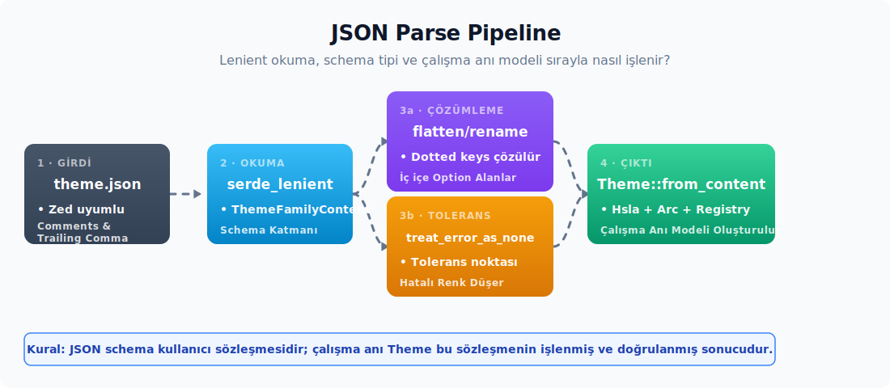

# JSON sözleşmesi ve ayrıştırma katmanı

Çalışma zamanı modeli kurulduktan sonra sıra JSON sözleşmesine gelir. Burada üç konu birlikte ele alınır: Zed uyumlu JSON yapısı, alanların opsiyonel ele alınması ve ayrıştırma sırasında ne kadar hata toleransı gösterileceği. Bu kararlar birbirine sıkı sıkıya bağlıdır; birindeki tercih diğer ikisinin davranışını doğrudan etkiler.



---

## 19. `ThemeContent` ve serde flatten/rename desenleri

**Kaynak modül:** `kvs_tema/src/schema.rs`.

JSON tema dosyalarını ayrıştıran tip hiyerarşisi üç seviyeden oluşur:

```text
ThemeFamilyContent      ← dosya kökü, "themes" dizisi taşır
└── ThemeContent        ← bir tema varyantı (light veya dark)
    └── ThemeStyleContent ← tüm renk grupları düz yapıda
        ├── ThemeColorsContent  (flatten)
        ├── StatusColorsContent (flatten)
        ├── Vec<AccentContent> (accents)
        ├── Vec<PlayerColorContent>
        ├── IndexMap<String, HighlightStyleContent>  (syntax)
        └── Option<WindowBackgroundContent>
```

### Tip imzaları

```rust
#[derive(Debug, Clone, Serialize, Deserialize, JsonSchema)]
pub struct ThemeFamilyContent {
    pub name: String,
    pub author: String,
    pub themes: Vec<ThemeContent>,
}

#[derive(Debug, Clone, Serialize, Deserialize, JsonSchema)]
pub struct ThemeContent {
    pub name: String,
    pub appearance: AppearanceContent,
    pub style: ThemeStyleContent,
}

#[settings_macros::with_fallible_options]
#[derive(Debug, Clone, Default, Serialize, Deserialize, JsonSchema, MergeFrom, PartialEq)]
#[serde(default)]
pub struct ThemeStyleContent {
    #[serde(rename = "background.appearance")]
    pub window_background_appearance: Option<WindowBackgroundContent>,

    #[serde(default)]
    pub accents: Vec<AccentContent>,

    #[serde(flatten, default)]
    pub colors: ThemeColorsContent,

    #[serde(flatten, default)]
    pub status: StatusColorsContent,

    #[serde(default)]
    pub players: Vec<PlayerColorContent>,

    #[serde(default)]
    pub syntax: IndexMap<String, HighlightStyleContent>,
}
```

### Diğer Content tipleri — temel tanımlar ve tam alan haritası

`ThemeStyleContent`'in alt-tipleri:

```rust
// ─── Enum'lar — snake_case rename
#[derive(Debug, PartialEq, Clone, Copy, Serialize, Deserialize, JsonSchema)]
#[serde(rename_all = "snake_case")]
pub enum AppearanceContent {
    Light,
    Dark,
}

#[derive(Debug, PartialEq, Clone, Copy, Serialize, Deserialize, JsonSchema, MergeFrom)]
#[serde(rename_all = "snake_case")]
pub enum WindowBackgroundContent {
    Opaque,
    Transparent,
    Blurred,
}

#[derive(Debug, Clone, Copy, Serialize, Deserialize, JsonSchema, MergeFrom, PartialEq)]
#[serde(rename_all = "snake_case")]
pub enum FontStyleContent {
    Normal,
    Italic,
    Oblique,
}

// ─── Newtype — saydam.
// JsonSchema türetilmez; aşağıda elle impl edilir (sınır 100–900, varsayılan 400).
#[derive(Clone, Copy, Debug, PartialEq, PartialOrd, Serialize, Deserialize, MergeFrom, derive_more::FromStr)]
#[serde(transparent)]
pub struct FontWeightContent(pub f32);

#[derive(Debug, Clone, Serialize, Deserialize, JsonSchema, MergeFrom, PartialEq)]
pub struct AccentContent(pub Option<String>);

// ─── HighlightStyleContent (syntax token sözleşmesi)
#[derive(Debug, Clone, Default, Serialize, Deserialize, JsonSchema, MergeFrom, PartialEq)]
#[serde(default)]
pub struct HighlightStyleContent {
    pub color: Option<String>,

    #[serde(skip_serializing_if = "Option::is_none", deserialize_with = "treat_error_as_none")]
    pub background_color: Option<String>,

    #[serde(skip_serializing_if = "Option::is_none", deserialize_with = "treat_error_as_none")]
    pub font_style: Option<FontStyleContent>,

    #[serde(skip_serializing_if = "Option::is_none", deserialize_with = "treat_error_as_none")]
    pub font_weight: Option<FontWeightContent>,
}

impl HighlightStyleContent {
    /// 4 alanın hepsi `None` ise true. Seçici önizlemesi ve testlerde
    /// "syntax geçersiz kılması boş mu" sorusu için kullanılır.
    /// Zed paritesi (`settings_content`).
    pub fn is_empty(&self) -> bool {
        self.color.is_none()
            && self.background_color.is_none()
            && self.font_style.is_none()
            && self.font_weight.is_none()
    }
}

// ─── PlayerColorContent (collaboration slot'ları)
// Default türetmez; eksik bir bileşen çalışma zamanında `unwrap_or_default()` ile
// `PlayerColor::default`'tan gelir.
#[derive(Debug, Clone, Serialize, Deserialize, JsonSchema, MergeFrom, PartialEq)]
pub struct PlayerColorContent {
    pub cursor: Option<String>,
    pub background: Option<String>,
    pub selection: Option<String>,
}
```

| API | Alt özellikler | Kısa anlamı |
| :-- | :-- | :-- |
| `AccentContent` | `Option<String>` newtype | `ThemeStyleContent.accents` listesinde tek vurgu rengini taşır; JSON birleştirme seviyesinde liste atomik üzerine yazma davranışı gösterir. |
| `project` | `settings_content` yeniden ihracı | Proje, LSP, diagnostics ve semantic token ayarlarını kök crate yüzeyine çıkarır. |
| `terminal` | `settings_content` yeniden ihracı | Terminal ayar tiplerini kök crate yüzeyine çıkarır; tema renklerindeki `terminal.*` alanlarıyla aynı isim alanı değildir. |

```rust
// ─── ThemeColorsContent (UI renkleri — ~150 alan)
#[derive(Debug, Clone, Default, Serialize, Deserialize, JsonSchema)]
#[serde(default)]
pub struct ThemeColorsContent {
    pub border: Option<String>,
    #[serde(rename = "border.variant")]
    pub border_variant: Option<String>,
    #[serde(rename = "border.focused")]
    pub border_focused: Option<String>,
    #[serde(rename = "border.selected")]
    pub border_selected: Option<String>,
    #[serde(rename = "border.transparent")]
    pub border_transparent: Option<String>,
    #[serde(rename = "border.disabled")]
    pub border_disabled: Option<String>,

    pub background: Option<String>,
    #[serde(rename = "surface.background")]
    pub surface_background: Option<String>,
    #[serde(rename = "elevated_surface.background")]
    pub elevated_surface_background: Option<String>,

    #[serde(rename = "element.background")]
    pub element_background: Option<String>,
    #[serde(rename = "element.hover")]
    pub element_hover: Option<String>,
    #[serde(rename = "element.active")]
    pub element_active: Option<String>,
    #[serde(rename = "element.selected")]
    pub element_selected: Option<String>,
    #[serde(rename = "element.disabled")]
    pub element_disabled: Option<String>,

    pub text: Option<String>,
    #[serde(rename = "text.muted")]
    pub text_muted: Option<String>,
    #[serde(rename = "text.placeholder")]
    pub text_placeholder: Option<String>,
    #[serde(rename = "text.disabled")]
    pub text_disabled: Option<String>,
    #[serde(rename = "text.accent")]
    pub text_accent: Option<String>,

    pub icon: Option<String>,
    #[serde(rename = "icon.muted")]
    pub icon_muted: Option<String>,
    #[serde(rename = "icon.disabled")]
    pub icon_disabled: Option<String>,

    #[serde(rename = "terminal.ansi.black")]
    pub terminal_ansi_black: Option<String>,
    #[serde(rename = "terminal.ansi.red")]
    pub terminal_ansi_red: Option<String>,
    // ... 8 ANSI rengi × 3 (normal + parlak + soluk) = 24 alan
    // ... terminal background/foreground/bright_foreground/dim_foreground
    // ... editör, debugger, vcs, vim, panel, scrollbar, tab grupları
    // (tam liste: ThemeColors'taki ~150 alanın hepsi ayna edilir)
}

// Referans Zed sürümü için tam ThemeColorsContent alan haritası:
//
// border => "border"
// border_variant => "border.variant"
// border_focused => "border.focused"
// border_selected => "border.selected"
// border_transparent => "border.transparent"
// border_disabled => "border.disabled"
// elevated_surface_background => "elevated_surface.background"
// surface_background => "surface.background"
// background => "background"
// element_background => "element.background"
// element_hover => "element.hover"
// element_active => "element.active"
// element_selected => "element.selected"
// element_disabled => "element.disabled"
// element_selection_background => "element.selection_background"
// drop_target_background => "drop_target.background"
// drop_target_border => "drop_target.border"
// ghost_element_background => "ghost_element.background"
// ghost_element_hover => "ghost_element.hover"
// ghost_element_active => "ghost_element.active"
// ghost_element_selected => "ghost_element.selected"
// ghost_element_disabled => "ghost_element.disabled"
// text => "text"
// text_muted => "text.muted"
// text_placeholder => "text.placeholder"
// text_disabled => "text.disabled"
// text_accent => "text.accent"
// icon => "icon"
// icon_muted => "icon.muted"
// icon_disabled => "icon.disabled"
// icon_placeholder => "icon.placeholder"
// icon_accent => "icon.accent"
// debugger_accent => "debugger.accent"
// status_bar_background => "status_bar.background"
// title_bar_background => "title_bar.background"
// title_bar_inactive_background => "title_bar.inactive_background"
// toolbar_background => "toolbar.background"
// tab_bar_background => "tab_bar.background"
// tab_inactive_background => "tab.inactive_background"
// tab_active_background => "tab.active_background"
// search_match_background => "search.match_background"
// search_active_match_background => "search.active_match_background"
// panel_background => "panel.background"
// panel_focused_border => "panel.focused_border"
// panel_indent_guide => "panel.indent_guide"
// panel_indent_guide_hover => "panel.indent_guide_hover"
// panel_indent_guide_active => "panel.indent_guide_active"
// panel_overlay_background => "panel.overlay_background"
// panel_overlay_hover => "panel.overlay_hover"
// pane_focused_border => "pane.focused_border"
// pane_group_border => "pane_group.border"
// scrollbar_thumb_background => "scrollbar.thumb.background"
// scrollbar_thumb_hover_background => "scrollbar.thumb.hover_background"
// scrollbar_thumb_active_background => "scrollbar.thumb.active_background"
// scrollbar_thumb_border => "scrollbar.thumb.border"
// scrollbar_track_background => "scrollbar.track.background"
// scrollbar_track_border => "scrollbar.track.border"
// minimap_thumb_background => "minimap.thumb.background"
// minimap_thumb_hover_background => "minimap.thumb.hover_background"
// minimap_thumb_active_background => "minimap.thumb.active_background"
// minimap_thumb_border => "minimap.thumb.border"
// editor_foreground => "editor.foreground"
// editor_background => "editor.background"
// editor_gutter_background => "editor.gutter.background"
// editor_subheader_background => "editor.subheader.background"
// editor_active_line_background => "editor.active_line.background"
// editor_highlighted_line_background => "editor.highlighted_line.background"
// editor_debugger_active_line_background => "editor.debugger_active_line.background"
// editor_line_number => "editor.line_number"
// editor_active_line_number => "editor.active_line_number"
// editor_hover_line_number => "editor.hover_line_number"
// editor_invisible => "editor.invisible"
// editor_wrap_guide => "editor.wrap_guide"
// editor_active_wrap_guide => "editor.active_wrap_guide"
// editor_indent_guide => "editor.indent_guide"
// editor_indent_guide_active => "editor.indent_guide_active"
// editor_document_highlight_read_background => "editor.document_highlight.read_background"
// editor_document_highlight_write_background => "editor.document_highlight.write_background"
// editor_document_highlight_bracket_background => "editor.document_highlight.bracket_background"
// editor_diff_hunk_added_background => "editor.diff_hunk.added.background"
// editor_diff_hunk_added_hollow_background => "editor.diff_hunk.added.hollow_background"
// editor_diff_hunk_added_hollow_border => "editor.diff_hunk.added.hollow_border"
// editor_diff_hunk_deleted_background => "editor.diff_hunk.deleted.background"
// editor_diff_hunk_deleted_hollow_background => "editor.diff_hunk.deleted.hollow_background"
// editor_diff_hunk_deleted_hollow_border => "editor.diff_hunk.deleted.hollow_border"
// terminal_background => "terminal.background"
// terminal_foreground => "terminal.foreground"
// terminal_ansi_background => "terminal.ansi.background"
// terminal_bright_foreground => "terminal.bright_foreground"
// terminal_dim_foreground => "terminal.dim_foreground"
// terminal_ansi_black => "terminal.ansi.black"
// terminal_ansi_bright_black => "terminal.ansi.bright_black"
// terminal_ansi_dim_black => "terminal.ansi.dim_black"
// terminal_ansi_red => "terminal.ansi.red"
// terminal_ansi_bright_red => "terminal.ansi.bright_red"
// terminal_ansi_dim_red => "terminal.ansi.dim_red"
// terminal_ansi_green => "terminal.ansi.green"
// terminal_ansi_bright_green => "terminal.ansi.bright_green"
// terminal_ansi_dim_green => "terminal.ansi.dim_green"
// terminal_ansi_yellow => "terminal.ansi.yellow"
// terminal_ansi_bright_yellow => "terminal.ansi.bright_yellow"
// terminal_ansi_dim_yellow => "terminal.ansi.dim_yellow"
// terminal_ansi_blue => "terminal.ansi.blue"
// terminal_ansi_bright_blue => "terminal.ansi.bright_blue"
// terminal_ansi_dim_blue => "terminal.ansi.dim_blue"
// terminal_ansi_magenta => "terminal.ansi.magenta"
// terminal_ansi_bright_magenta => "terminal.ansi.bright_magenta"
// terminal_ansi_dim_magenta => "terminal.ansi.dim_magenta"
// terminal_ansi_cyan => "terminal.ansi.cyan"
// terminal_ansi_bright_cyan => "terminal.ansi.bright_cyan"
// terminal_ansi_dim_cyan => "terminal.ansi.dim_cyan"
// terminal_ansi_white => "terminal.ansi.white"
// terminal_ansi_bright_white => "terminal.ansi.bright_white"
// terminal_ansi_dim_white => "terminal.ansi.dim_white"
// link_text_hover => "link_text.hover"
// version_control_added => "version_control.added"
// version_control_deleted => "version_control.deleted"
// version_control_modified => "version_control.modified"
// version_control_renamed => "version_control.renamed"
// version_control_conflict => "version_control.conflict"
// version_control_ignored => "version_control.ignored"
// version_control_word_added => "version_control.word_added"
// version_control_word_deleted => "version_control.word_deleted"
// version_control_conflict_marker_ours => "version_control.conflict_marker.ours"
// version_control_conflict_marker_theirs => "version_control.conflict_marker.theirs"
// vim_normal_background => "vim.normal.background"
// vim_insert_background => "vim.insert.background"
// vim_replace_background => "vim.replace.background"
// vim_visual_background => "vim.visual.background"
// vim_visual_line_background => "vim.visual_line.background"
// vim_visual_block_background => "vim.visual_block.background"
// vim_yank_background => "vim.yank.background"
// vim_helix_jump_label_foreground => "vim.helix_jump_label.foreground"
// vim_helix_normal_background => "vim.helix_normal.background"
// vim_helix_select_background => "vim.helix_select.background"
// vim_normal_foreground => "vim.normal.foreground"
// vim_insert_foreground => "vim.insert.foreground"
// vim_replace_foreground => "vim.replace.foreground"
// vim_visual_foreground => "vim.visual.foreground"
// vim_visual_line_foreground => "vim.visual_line.foreground"
// vim_visual_block_foreground => "vim.visual_block.foreground"
// vim_helix_normal_foreground => "vim.helix_normal.foreground"
// vim_helix_select_foreground => "vim.helix_select.foreground"

// ─── StatusColorsContent (14 status × 3 = 42 alan)
#[derive(Debug, Clone, Default, Serialize, Deserialize, JsonSchema)]
#[serde(default)]
pub struct StatusColorsContent {
    pub error: Option<String>,
    #[serde(rename = "error.background")]
    pub error_background: Option<String>,
    #[serde(rename = "error.border")]
    pub error_border: Option<String>,

    pub warning: Option<String>,
    #[serde(rename = "warning.background")]
    pub warning_background: Option<String>,
    #[serde(rename = "warning.border")]
    pub warning_border: Option<String>,

    // ... 14 status (conflict, created, deleted, hidden, hint, ignored,
    // info, modified, predictive, renamed, success, unreachable) × üçlü
}
```

`ThemeColorsContent`, hedeflenen Zed sözleşmesindeki çalışma zamanı `ThemeColors` alanlarına karşılık gelen `Option<String>` alanları taşır. Örneğin `scrollbarr.thumb.background` gibi yazım hatalı, sözleşmede hiç bulunmayan bir anahtar yerine mevcut sözleşmedeki `scrollbar.thumb.background` anahtarı beklenir. (Bunun aksine `scrollbar_thumb.background` anahtarı sözleşmenin tanınan ama artık önerilmeyen bir parçasıdır; deprecated bir alanı besler ve yazıldığında bir uyarıyla yine de okunur.)

**Davranış kuralları (özet):**

| Tip | Opsiyonellik | Yanlış değer davranışı |
| ----- | -------------- | ------------------------ |
| `AppearanceContent` | `ThemeContent.appearance` **zorunlu** | Deserialize hatası (tema hiç yüklenmez) |
| `WindowBackgroundContent` | `ThemeStyleContent` üstünde `#[with_fallible_options]` bulunur | Kullanıcı ayarları `RootUserSettings::parse_json` hattında `None` + `ParseStatus::Failed`; tema dosyası normal serde hattında deserialize hatası |
| `FontStyleContent` | `Option` + `treat_error_as_none` | `None` |
| `FontWeightContent` | `Option` + `treat_error_as_none`; `f32` newtype | `None` |
| `HighlightStyleContent.color` | `Option<String>`; özel deserializer yok | Geçersiz hex string → refinement'ta `None`; yanlış JSON tipi → deserialize hatası |
| `HighlightStyleContent` (diğer) | `Option<...>` + `treat_error_as_none` | `None` |
| `PlayerColorContent` (3 alan) | hepsi `Option<String>` | Eksik alan aynı indeksteki taban player slot'undan; yeni slot eklenirse eksik bileşenler `Default` değerinden |
| `ThemeColorsContent` (146 alan, 3'ü deprecated) | her biri `Option<String>` | Refinement → taban |
| `StatusColorsContent` (42 alan) | her biri `Option<String>` | Refinement → taban (ön plan→arka plan türetme uygulanır) |

> **`AppearanceContent` neden `Option` değil?** Bir temanın "Light mı, Dark mı?" sorusu **kritiktir**. Bu bilgi eksik olduğunda renk seçimi anlamını yitirir. Bu yüzden alan, sözleşmenin zorunlu enum alanı olarak tutulur.

### `#[serde(flatten)]` — alt struct'ları aynı seviyeye açar

JSON dosyasında `style` objesi içinde **150'den fazla alan düz olarak** sıralanır; iç içe `"colors": { ... }` yapısı yoktur. Rust tarafında bu alanlar mantıksal olarak ayrı struct'larda (`ThemeColorsContent`, `StatusColorsContent`) tutulur. JSON ayrıştırılırken ise **aynı seviyeden** deserialize edilir. `#[serde(flatten)]` bu eşlemeyi sağlar.

**Davranış:**

```rust
ThemeStyleContent {
    #[serde(flatten, default)]
    pub colors: ThemeColorsContent,    // "background", "border", ...
    #[serde(flatten, default)]
    pub status: StatusColorsContent,   // "error", "warning", ...
    // ...
}
```

JSON:

```json
"style": {
  "background": "#000",       // ← ThemeColorsContent.background
  "border": "#111",           // ← ThemeColorsContent.border
  "error": "#f00",            // ← StatusColorsContent.error
  "warning": "#fa0"           // ← StatusColorsContent.warning
}
```

İki ayrı struct'ın alanları **aynı JSON objesi** içinden deserialize edilir. Çakışan anahtar bulunmamalıdır. Örneğin `ThemeColorsContent` içinde `"error"` alanı yoktur; bu yüzden `StatusColorsContent.error` ile çatışmaz.

### `#[serde(rename = "...")]` — alan adı eşleme

Rust alan adı snake_case, JSON anahtarı ise dot.separated biçimindedir:

```rust
#[serde(rename = "border.variant")]
pub border_variant: Option<String>,
```

Detaylar ilgili bölümde ele alınır.

### `#[serde(rename_all = "snake_case")]` — enum varyant adları

`AppearanceContent`, `WindowBackgroundContent`, `FontStyleContent` gibi **enum'lar** için varyant adlarını JSON'a `snake_case` olarak aktarmak amacıyla kullanılır:

```rust
#[derive(Debug, PartialEq, Clone, Copy, Serialize, Deserialize, JsonSchema)]
#[serde(rename_all = "snake_case")]
pub enum AppearanceContent {
    Light,
    Dark,
}
```

Bu sayede tema dosyasında `"appearance": "light"` yazılır. Rust varyant adı `Light` olsa bile JSON tarafında küçük harf kullanılır. `rename_all = "snake_case"` özniteliği, her varyant için tek tek `rename` yazma yükünü kaldırır.

### `#[serde(transparent)]` — newtype'ı saydamlaştır

```rust
#[derive(Clone, Copy, Debug, PartialEq, PartialOrd, Serialize, Deserialize, MergeFrom, derive_more::FromStr)]
#[serde(transparent)]
pub struct FontWeightContent(pub f32);
```

Bu öznitelik sayesinde JSON'da `{ "font_weight": { "0": 700 } }` yerine doğrudan `{ "font_weight": 700 }` yazılır. Newtype'ın sarmaladığı tek alan saydam görünür; JSON tüketicisi `FontWeightContent`'in newtype olduğunu fark etmez.

`FontWeightContent` için `JsonSchema` türetilmez; elle impl edilir. Türetme yalnızca "sayı" derdi; elle yazılan şema ise geçerli aralığı (`100`–`900`) ve varsayılanı (`400`) şemaya da taşır, böylece editör otomatik tamamlaması sınırların dışındaki değerleri uyarabilir:

```rust
impl schemars::JsonSchema for FontWeightContent {
    fn schema_name() -> std::borrow::Cow<'static, str> {
        "FontWeightContent".into()
    }

    fn json_schema(_: &mut schemars::SchemaGenerator) -> schemars::Schema {
        use schemars::json_schema;
        json_schema!({
            "type": "number",
            "minimum": Self::THIN.0,    // 100
            "maximum": Self::BLACK.0,   // 900
            "default": Self::NORMAL.0,  // 400
            "description": "Font weight value between 100 (thin) and 900 (black)"
        })
    }
}
```

### `#[serde(default)]` — eksik alana varsayılan değer

```rust
#[serde(flatten, default)]
pub colors: ThemeColorsContent,
```

JSON'da `colors` alanı yoksa `ThemeColorsContent::default()` çağrılır ve tüm alanlar `None` olarak gelir. `default` özniteliği alan bazında da tanımlanabilir:

```rust
#[serde(default)]
pub players: Vec<PlayerColorContent>,    // Yoksa boş Vec
```

### Hiyerarşik özet

| Öznitelik | Etkisi | Tema'da örnek |
| ----------- | -------- | --------------- |
| `#[serde(flatten)]` | Alt struct'ı aynı seviyede açar | `ThemeColorsContent`/`StatusColorsContent` flatten ile düz |
| `#[serde(rename = "x.y")]` | Alan adını bağlar | `border_variant` ↔ `"border.variant"` |
| `#[serde(rename_all = "snake_case")]` | Tüm varyantlara uygulanır | `AppearanceContent::Light` ↔ `"light"` |
| `#[serde(transparent)]` | Newtype'ı saydamlaştırır | `FontWeightContent(700.0)` ↔ `700` |
| `#[serde(default)]` | Eksik alana varsayılan verir | `players: []` veya yok ise boş Vec |
| `#[serde(deserialize_with = "fn")]` | Özel deserializer kurur | `treat_error_as_none` |

### Dikkat Noktaları

1. **`flatten` çakışması**: İki flatten'li struct'ın aynı isimli bir alanı bulunursa, hangisinin önce ayrıştırılacağı tanımsız hale gelir. Tema sözleşmesinde bu çakışma görülmez; `ThemeColorsContent` ve `StatusColorsContent` alan kümeleri kesişmez.
2. **`flatten` başarımı**: Serde flatten, serde_derive'ın daha ağır kod üretmesine yol açar. Tema deserialize'ı sıcak yolda olmadığı için bu genelde sorun değildir; ancak settings veya config gibi sık çağrılan struct'larda dikkat gerektirir.
3. **`rename` ile alan-bazlı `default` çakışması**: Doğru yazım `#[serde(rename = "x.y", default)]` biçimindedir; iki öznitelik aynı `serde` parantezi içinde virgülle ayrılır.
4. **`Serialize` türetmenin gerekliliği**: Yalnızca deserialize yapan bir tema için `Serialize` türetilmesi şart değildir; ancak `schemars::JsonSchema` veya round-trip test ihtiyacı varsa türetilmesi yerinde olur.
5. **`JsonSchema` türetimi**: `schemars`, IDE otomatik tamamlama desteği için tema dosyalarına JSON şeması üretebilir. Türetim ücretsiz değildir (derleme zamanı maliyeti vardır); kullanılmadığı durumda bırakılmaması tercih edilir.

---

## 20. `*Content` tiplerinin opsiyonellik felsefesi

Content tipleri **tek bir ana kuralı** izler: her renk alanı `Option<String>`, her enum alanı ise `Option<EnumContent>` olarak tutulur. Renk alanları doğrudan `Hsla` veya zorunlu `String` yapılmaz.

### Üç gerekçe

**1. Kullanıcı her alanı yazmak zorunda değildir.**

Zed temalarında tipik bir tema dosyası 150 alandan yalnızca 30-50 kadarını yazar; gerisi tabandan dolar. Eksik alanların ayrıştırma hatası vermek yerine `None` olarak gelmesi gerekir. Refinement katmanı, hangi alanın geçersiz kılındığını ve hangisinin tabandan kalacağını bu `Some`/`None` ayrımına bakarak belirler.

**2. Renk ayrıştırma hatası tüm temayı bozmamalıdır.**

```json
{
  "background": "#1c2025ff",     // ← geçerli
  "border": "rebeccapurple",     // ← geçersiz (adlandırılmış renk, hex değil)
  "text": "#c8ccd4ff"            // ← geçerli
}
```

`border: String` yani zorunlu alan olarak tanımlansaydı, tek bir hatalı alan yüzünden tüm tema yüklenemezdi. `border: Option<String>` olduğunda değer string olarak gelir. Ardından `try_parse_color` bir `Result` döndürür; hata olursa refinement `None`'a düşer ve taban değeri kullanılır.

**3. Tip sözleşmesi seçilen Zed referansına bağlı kalır.**

Geçerli enum değerleri seçilen Zed referansındaki listeyle sınırlıdır. Örneğin `font_style: "semi_oblique"` mevcut sözleşmede yoksa bu değer geçersiz kabul edilir. Ancak `font_style: Option<FontStyleContent>` olduğunda, `treat_error_as_none` deserializer'ı geçersiz varyantı `None`'a düşürür ve tema yüklemesi kalan alanlarla devam eder.

### İki katmanlı opsiyonellik

```text
JSON          Content              Refinement       Theme
─────────────────────────────────────────────────────────
"#1c2025ff"   Some("#1c2025ff")   Some(Hsla(..))   Hsla(..)
"bozuk"       Some("bozuk")       None             tabandan
yok           None                 None             tabandan
```

**Görsel olarak okunabilir özet:**

- `Option<String>` katmanı: "kullanıcı bu alanı yazdı mı?"
- `Option<Hsla>` katmanı: "yazdıysa ayrıştırılabildi mi?"

İki ayrı katman, iki farklı durumu ayırt etmeyi sağlar:

| Senaryo | Content katmanı | Refinement katmanı | Sonuç |
| --------- | ----------------- | -------------------- | --------- |
| Alan yok | `None` | `None` | Taban |
| Alan var, geçerli hex | `Some("#...")` | `Some(Hsla(...))` | Kullanıcı geçersiz kılması |
| Alan var, geçersiz hex | `Some("bozuk")` | `None` | Taban (sessizce) |
| Alan var, JSON tipi uyumsuz | `with_fallible_options` hattında `None`; normal serde hattında deserialize hatası | `None` veya hata | Hangi yükleme yolunun kullanıldığına bağlı |

### `Default::default()` her Content tipinde

```rust
#[derive(Debug, Clone, Default, Serialize, Deserialize, JsonSchema)]
#[serde(default)]
pub struct ThemeColorsContent {
    pub border: Option<String>,
    pub border_variant: Option<String>,
    // ...
}
```

`Default` türetilir; tüm alanlar `Option<_>` olduğundan varsayılan değerin karşılığı "tüm alanlar `None`" olur. `#[serde(default)]` struct seviyesinde tüm alanlara uygulanır.

Bu sayede JSON'da bütün bir struct (`colors`, `status` vb.) eksik olabilir. Serde flatten katmanı `Default::default()` çağırır ve ayrıştırma işlemine devam eder.

### `Option<String>` neden `Option<Hsla>` değil?

İlk akla gelen soru şu olabilir: "Madem string ileride `Hsla`'ya çevriliyor, neden baştan `Option<Hsla>` kullanılmıyor?"

**Cevap:** Serde'nin JSON'dan `Hsla`'ya doğrudan deserialize edebileceği hazır bir yol yoktur. GPUI `Hsla` için elle bir `Deserialize` impl yazmak gerekir. Bu da hex string ayrıştırma mantığını struct özniteliklerinin içine taşır. Sonuçta test etmesi zor bir ayrıştırma adımı ve okunması güç hata mesajları ortaya çıkar.

Mevcut yaklaşımda akış şu şekilde işler:

1. Serde yalnızca "string olarak al" der.
2. `try_parse_color` ayrı bir fonksiyondur — birim test edilebilir.
3. Hatalı renk, string olarak content'te kalır; Refinement aşamasında sessizce `None`'a düşer.

Bu **sorumluluk ayrımı** sağlamdır: serde "yapı doğru mu?" sorusunu cevaplar, ayrıştırıcı ise "değer geçerli mi?" sorusunu cevaplar.

### Dikkat Noktaları

1. **`String` (Option olmadan) kullanmak**: Zorunlu alan = bir eksik alanın tüm temayı patlatması demektir. Sözleşmeye uymaz.
2. **`Option<Hsla>` kullanmak (ayrıştırmayı Deserialize'a sokmak)**: Özel Deserialize implementasyonu test edilemez, hata mesajları zayıf kalır ve ayrıştırıcı katmanı sözleşmeye gömülmüş olur. Mevcut iki katmanlı yaklaşım bu senaryoda tercih edilir.
3. **`Default::default()` türevini atlamak**: `#[derive(Default)]` bulunmayan bir Content tipi `#[serde(default)]` kullanamaz; struct seviyesinde varsayılan şarttır.
4. **`Default` ile dolu Hsla beklemek**: Content tipinin `Default` çağrısı tüm alanları `None` döndürür. Default'tan doğrudan Theme inşa edilmez; refinement aşaması taban ile birleştirir. "Boş tema dosyasını yüklemek = taban" denkliği bilinçli bir tasarım sonucudur.
5. **Bilinmeyen enum değeri**: `font_style: "semi_oblique"` ifadesinde `FontStyleContent` `SemiOblique`'i tanımıyorsa, varsayılan deserialize hata döndürür. Çözüm: `HighlightStyleContent` içinde `treat_error_as_none`; diğer yoğun `Option` taşıyan content tiplerinde ise `#[with_fallible_options]` makrosu.

### `MergeFrom` derive davranış matrisi

`settings_content` tarafındaki kullanıcı settings content tiplerini `#[derive(..., MergeFrom)]` ile işaretlenir. Zed settings hiyerarşisi (`default.json → user.json → project.json`) **`MergeFrom` üzerinden çalışır**. `default` baz değerleri sağlar; kullanıcı ve proje settings'i bunun üstüne merge edilir. Tema dosyası yükü olan `theme_settings::ThemeFamilyContent` ve `ThemeContent` ise bu merge hattının parçası değildir. Onlar doğrudan deserialize edilir ve çalışma zamanı temasına refine edilir. `MergeFrom` trait'i `settings_content` crate'inde tanımlıdır; derive macro'su `settings_macros` crate'inden gelir ve alan tipine göre davranışı değişir:

| Alan tipi | `merge_from(self, other)` davranışı | Etki |
| ----------- | ------------------------------------- | ------ |
| Primitif (`u16`, `u32`, `i*`, `bool`, `f32`, `f64`, `char`, `usize`, `NonZeroUsize`, `NonZeroU32`) | `*self = other.clone()` | **Üzerine yazma** — kullanıcı değeri default'u tamamen ezer |
| `String`, `Arc<str>`, `PathBuf`, `Arc<Path>` | Üzerine yazma | Aynı: tek bir skaler değer üstüne yazılır |
| `Option<T>` | `None` ise yok sayar; mevcut `Some` + yeni `Some` → özyinelemeli merge (`this.merge_from(other)`); mevcut `None` + yeni `Some` → `replace(other.clone())` | Özyinelemeli merge için en uygun tip |
| `Vec<T>` | `*self = other.clone()` | **Üzerine yazma** (birleştirme değil) — `accents: ["#aaa"]` kullanıcı değeri default `accents` listesini siler |
| `Box<T: MergeFrom>` | `self.as_mut().merge_from(other.as_ref())` | İşaretçi içeriği özyinelemeli merge |
| `HashMap<K, V: MergeFrom>` / `BTreeMap` / `IndexMap` | Her anahtar için: mevcutsa özyinelemeli merge, yoksa ekleme | Map'lerin anahtar bazlı birleşmesi (örn. `theme_overrides`) |
| `HashSet<T>` / `BTreeSet<T>` | Birleşim (her öğe eklenir) | Set birleşimi |
| `serde_json::Value` | Object → özyinelemeli merge; aksi halde üzerine yazma | Serbest biçimli JSON için akıllı merge |

**Tema sözleşmesi için kritik sonuçlar:**

1. **`accents: Vec<AccentContent>` üzerine yazma davranışı gösterir.** Kullanıcı `experimental.theme_overrides.accents = ["#abc"]` yazdığında, temanın taban vurgu listesi silinir. Bunun istenmeyen bir yan etkisi vardır: tek bir rengi değiştirmek için kullanıcı tüm listeyi yeniden yazmak zorunda kalır. `merge_accent_colors` (ilgili bölüm Adım 5) bu davranışı `theme_overrides` zinciri içinde **kısmi yedek** ile yumuşatır; yine de JSON merge seviyesinde liste hâlâ atomik olarak davranır.

2. **`theme_overrides: HashMap<String, ThemeStyleContent>` anahtar bazlı merge.** Kullanıcı yalnızca `"One Dark": { ... }` yazsa bile `default.json` içinde bulunan diğer tema geçersiz kılmaları korunur. Aynı tema adı için iki katmanda geçersiz kılma varsa, içleri özyinelemeli merge ile birleştirilir.

3. **`Option<ThemeSelection>` özyinelemeli merge.** `default.json` içinde `theme = Static("One Dark")`, kullanıcı tarafında ise `theme = Dynamic { mode: System, light: ..., dark: ... }` tanımlıysa: `Some + Some` → özyinelemeli `merge_from` çalışır. `ThemeSelection` kendisi `MergeFrom` türetmesine sahip olduğundan varyant değişebilir; ancak bu türetme enum davranışı **iç değerleri birleştirmek değil, geçersiz kılmaktır** (varyantlar farklı olduğunda içler birbirine karışmaz).

4. **Renk string'leri `Option<String>` olduğundan her renk alanı için**:
   - default'ta verilmemiş, kullanıcıda var → kullanıcı değeri yazılır
   - default'ta var, kullanıcıda yok → default korunur
   - default'ta var, kullanıcıda var → kullanıcı değeri yazılır (`String` üzerine yazma)

Bu davranış matrisi `treat_error_as_none` ve `with_fallible_options` mekanizmalarından bağımsızdır. Onlar **ayrıştırma seviyesinde**, `MergeFrom` ise **ayrıştırma sonrası merge seviyesinde** çalışır.

> **Ayna disiplini:** `kvs_tema` veya `kvs_ayarlari_icerik` crate'i bir `MergeFrom` türetme makrosunu ayna etmelidir; alternatif olarak `settings_macros` doğrudan bağımlılık yapılır. Tema sözleşmesi `MergeFrom` üzerine kurulduğu için her `*Content` tipi için elle `merge_from` yazmak dağınık ve hata üretmeye açık bir yola dönüşür.

---

## 21. `try_parse_color`: hex → `Hsla` boru hattı

**Kaynak:** `kvs_tema/src/schema.rs` veya `kvs_tema/src/refinement.rs` (yerleşim uygulama tasarımına göre değişebilir).

JSON'dan gelen hex string'i çalışma zamanı `Hsla` değerine çeviren tek fonksiyon:

```rust
use gpui::Hsla;
use palette::FromColor;

pub fn try_parse_color(s: &str) -> anyhow::Result<Hsla> {
    let rgba = gpui::Rgba::try_from(s)?;
    let srgba = palette::rgb::Srgba::from_components(
        (rgba.r, rgba.g, rgba.b, rgba.a)
    );
    let hsla = palette::Hsla::from_color(srgba);

    Ok(gpui::hsla(
        hsla.hue.into_positive_degrees() / 360.0,
        hsla.saturation,
        hsla.lightness,
        hsla.alpha,
    ))
}
```

### Boru hattının dört adımı

```text
"#1c2025ff"  →  gpui::Rgba  →  palette::Srgba  →  palette::Hsla  →  gpui::Hsla
  hex string    (1) ayrıştır   (2) yeniden yorumla (3) renk uzayı    (4) normalize
```

**Adım 1 — Hex string'in ayrıştırılması:**

```rust
let rgba = gpui::Rgba::try_from(s)?;
```

`gpui::Rgba::try_from` (`gpui` crate'i) **dört** hex formatını kabul eder:

| Format | Hex hanesi | Alpha kaynağı | Çiftleme |
| -------- | ----------- | --------------- | ---------- |
| `#rgb` | 3 | `0xf` (`1.0`) | `0xa → 0xaa` (her hane çiftlenir) |
| `#rgba` | 4 | 4. hane | `0xa → 0xaa` (4 hane de çiftlenir) |
| `#rrggbb` | 6 | `0xff` (`1.0`) | yok |
| `#rrggbbaa` | 8 | son 2 hane | yok |

Önemli kurallar:

- **`#` zorunludur**: Kaynak kod `value.trim().split_once('#')` ile ayrıştırmayı başlatır; `#` olmadan girilen hex (`RRGGBB`) `Err` döndürür.
- **Trim yapılır**: Önceki ve sonraki whitespace temizlenir (`" #1c2025 "` geçerli sayılır).
- **Büyük/küçük harf duyarsızdır**: `u8::from_str_radix` zaten duyarsız çalışır; `#1c2025FF` ve `#1C2025ff` aynı sonucu verir.
- **Kısa form çiftleme**: `#abc` → `#aabbcc`, `#abcd` → `#aabbccdd`. Tek bir hane (`r` baytı) 4 bit sola kaydırılır ve kendisiyle OR'lanır (`(value << 4) | value`).
- **Alpha varsayılanı**: `#rgb` formatında alpha hanesi `0xf` (yani `0xff` = `1.0`); `#rrggbb` formatında ise byte `0xff` olarak gelir.

Hata durumları:

- Geçersiz hex karakter (`#zzz`): `u8::from_str_radix` `Err` döndürür.
- Tanınmayan uzunluk (`#abcde` 5 hex veya `#abcdefg` 7 hex): `match` dört varyantın hiçbirine düşmez ve fall-through hatası üretir.
- `#` yok: "invalid RGBA hex color" hatası verilir.
- Boş string: `#` bulunamaz ve `Err` döner.

Bu nedenle tema JSON'ında `"#abc"` yazılması geçerlidir; kısa form da Zed paritesindeki desteklenen hex biçimlerinin bir parçasıdır.

**Adım 2 — `Rgba` → `palette::Srgba`:**

```rust
let srgba = palette::rgb::Srgba::from_components(
    (rgba.r, rgba.g, rgba.b, rgba.a)
);
```

GPUI'nin `Rgba` tipi ile palette crate'inin `Srgba` tipi aynı değerleri taşır, ama farklı crate'lerde tanımlıdır. `from_components` tuple alıp struct'a yerleştirir; veri kopyası çok küçük bir maliyettir (yalnızca 4 × f32).

**Adım 3 — sRGB → HSL renk uzayı dönüşümü:**

```rust
let hsla = palette::Hsla::from_color(srgba);
```

`palette::Hsla` ile `palette::Srgba` farklı renk uzaylarında bulunur. Burada sRGB küpünden HSL silindirine matematiksel bir dönüşüm yapılır. `palette` crate'inin asıl işi bu adımdadır.

**Adım 4 — `palette::Hsla` → `gpui::Hsla`:**

```rust
gpui::hsla(
    hsla.hue.into_positive_degrees() / 360.0,
    hsla.saturation,
    hsla.lightness,
    hsla.alpha,
)
```

İki crate'in `Hsla` yapısı birbirine **uyumsuzdur**:

| Alan | palette | gpui |
| ------ | --------- | ------ |
| `hue` | Derece (0–360°), `palette::RgbHue` newtype | Normalize (0.0–1.0), düz `f32` |
| `saturation` | 0.0–1.0 | 0.0–1.0 |
| `lightness` | 0.0–1.0 | 0.0–1.0 |
| `alpha` | 0.0–1.0 | 0.0–1.0 |

`hue.into_positive_degrees()` negatif değerleri 0–360 aralığına normalize eder (`-30°` → `330°`); ardından `/ 360.0` ile değer GPUI'nin normalize uzayına çekilir.

### Dönüş tipi: `Result<Hsla>`, çağıran tarafta `Option<Hsla>`

Fonksiyon `anyhow::Result<Hsla>` döndürür. Çağıran taraf hatayı `Option` katmanına indirir:

```rust
fn renk(metin: &Option<String>) -> Option<gpui::Hsla> {
    metin.as_deref().and_then(|deger| try_parse_color(deger).ok())
}
```

Bu desen ilgili bölümde ayrıntılı olarak ele alınır: `Some(geçersiz hex) → None`.

### Test ve idempotans

`try_parse_color` saf (deterministik) ve doğal olarak test edilebilir bir fonksiyondur:

```rust
#[test]
fn dolu_kirmiziyi_ayristirir() -> anyhow::Result<()> {
    let renk = try_parse_color("#ff0000ff")?;
    assert!((renk.h - 0.0).abs() < 1e-3);
    assert!((renk.s - 1.0).abs() < 1e-3);
    assert!((renk.l - 0.5).abs() < 1e-3);
    assert!((renk.a - 1.0).abs() < 1e-3);
    Ok(())
}

#[test]
fn adlandirilmis_rengi_reddeder() {
    assert!(try_parse_color("red").is_err());
}
```

### `palette` versiyonunun önemi

`palette` major sürüm farkı renk uzayı dönüşümünü değiştirebilir. Aynı hex değeri farklı bir `Hsla` üretebilir. Bu nedenle:

- `palette` sürümünün Zed'in kullandığı sürümle uyumlu tutulması gerekir.
- Fixture testleri `assert_eq!(...)` yerine `assert!((a - b).abs() < epsilon)` ile yazılır; küçük kayan nokta sapmaları beklenen bir durumdur.

### Başarım

Her renk alanı için tek bir `try_parse_color` çağrısı yapılır. Yaklaşık 150 renkli bir tema için yaklaşık 150 fonksiyon çağrısı gerçekleşir. Tek bir tema yüklemesi mikrosaniye seviyesinde kalır. Bu fonksiyon sıcak yolda yer almaz.

### Dikkat Noktaları

1. **3-hex shorthand desteksizliği**: `#abc` (CSS shorthand) Zed paritesinde desteklenmesine rağmen, beklenmedik bir hex formatıyla karşılaşıldığında ayrıştırma hatası alınabilir; kullanıcı temalarında bu durumun dikkate alınması gerekir.
2. **`palette` ihmali**: Elle sRGB → HSL dönüşümü yazmak (palette olmadan) Zed davranışından sapar; bu yüzden `palette` kullanılır.
3. **Negatif hue koruması**: `palette::Hsla::from_color` zaman zaman `hue = -30°` döndürür; `into_positive_degrees()` çağrısı zorunludur. Bu çağrı yapılmadığında `h = -30/360 = -0.083` olur ve GPUI bunu 0.917'ye sarmaz, doğrudan **clamp eder**.
4. **`alpha = 0.0` hata gibi görünür**: Geçerli bir tema rengi (örneğin `transparent_black`) alpha 0 olabilir. `try_parse_color` `Ok` döner ve `Hsla.a = 0.0` verir. UI'da görünmez ama bu bir ayrıştırma hatası değildir; davranışın bilinmesi gerekir.
5. **Refinement aşamasında hatanın yutulması**: `try_parse_color(s).ok()` hata mesajını sessizce siler. Debug için bir log eklenmesi yerinde olur: `try_parse_color(s).inspect_err(|hata| tracing::warn!("hatalı renk: {}", hata)).ok()`. Default'ta log kapalı tutulduğunda kullanıcı tarafında gürültü olmaz, ama debug ihtiyacında bilgi hazır bulunur.

---

## 22. Hata toleransı: `treat_error_as_none` ve açık sözleşme

Bu rehberde hata toleransı, alternatif sözleşmeleri destekleyen ayrı bir katman anlamına gelmez. Hedef, seçilen Zed referansındaki JSON sözleşmesini açık biçimde taşımaktır. Bu yüzden bilinmeyen alanlar ile bilinen alanlardaki hatalı değerler ayrı ele alınır: bilinmeyen alan sözleşme dışıdır; hatalı değer ise bilinen bir alanın ayrıştırılamayan içeriğidir.

### Vektör 1: Bilinmeyen alanlar — açık hata

Serde varsayılan olarak bilinmeyen alanları **görmezden gelir**. Bu davranış yazım farklarını saklayabilir: `scrollbar.thumb.background` yerine `scrollbarr.thumb.background` (fazladan bir `r`) yazıldığında tema yüklenir ama beklenen renk uygulanmaz. Bu rehberde bilinmeyen alanların sessizce kabul edilmesi istenmez.

```rust
fn tema_stil_anahtarlarini_dogrula(stil: &serde_json::Map<String, serde_json::Value>) -> anyhow::Result<()> {
    for anahtar in stil.keys() {
        anyhow::ensure!(
            TEMA_STIL_ANAHTARLARI.contains(anahtar.as_str()),
            "bilinmeyen tema stil alanı `{anahtar}`"
        );
    }
    Ok(())
}
```

**Senaryo:** Kullanıcı tema JSON'unda `scrollbarr.thumb.background` yazdı (fazladan bir `r` ile yazım hatası). Mevcut sözleşmede böyle bir anahtar hiç yoktur; doğru anahtar `scrollbar.thumb.background` olmalıdır.

- Anahtar validasyonu AÇIK: Tema yüklemesi alan yolunu gösteren bir hatayla durur. Hata hızlıca bulunur.
- Anahtar validasyonu YOK: Alan sessizce atlanır. JSON'da renk verilmiş gibi görünür, ama uygulama taban değeri kullanır.

**Bu kural nettir:** Mevcut Zed sözleşmesinde olmayan alanlar kabul edilmez. `ThemeStyleContent` `#[serde(flatten)]` kullandığı için pratik çözüm `deny_unknown_fields` değil, hedef sözleşmedeki anahtarları tutan açık bir izin listesi validasyonudur. Zed referansı güncellenecekse önce ayna struct'larının, sonra izin listesinin, fixture ve snapshot testlerinin güncellenmesi gerekir.

Pratik yükleme yardımcısı bu yüzden iki aşamalı yazılır: önce JSON toleranslı biçimde `serde_json::Value` olarak okunur, `themes[*].style` içindeki anahtarlar `TEMA_STIL_ANAHTARLARI` ile doğrulanır, sonra aynı değer `ThemeFamilyContent` tipine deserialize edilir. Bu rehberde örnek yardımcı adı `tema_ailesini_kati_ayristir(baytlar)` olarak tercih edilir.

### Vektör 2: Bilinmeyen enum değerleri — iki tolerans hattı

Enum alanlarda varsayılan davranış farklıdır: serde bilinmeyen bir varyant gördüğünde `Err` döndürür.

**Senaryo:** Kullanıcı `"font_style": "semi_oblique"` yazdı. Mevcut sözleşmede geçerli değerler `normal`, `italic` ve `oblique` ile sınırlıdır.

- Standart deserialize: `Err("unknown variant semi_oblique, expected one of normal, italic, oblique")`.
- `HighlightStyleContent` içinde: `treat_error_as_none` alanı `None`'a düşürür.
- `#[with_fallible_options]` kullanılan diğer content tiplerinde: alan `None`'a düşer ve hata thread-local hata listesinde biriktirilerek dosyanın `ParseStatus`'una yansıtılır.

**Zed paritesi iki ayrı mekanizmadan oluşur:**

1. **Öznitelik makrosu** (`#[with_fallible_options]`): `ThemeSettingsContent`, `ThemeStyleContent`, `ThemeColorsContent`, `StatusColorsContent` gibi yoğun `Option` taşıyan struct/enum'lar üzerine yerleştirilir. Makro her `Option<T>` alanı için otomatik olarak şu özniteliği ekler:
   ```rust
   #[serde(
       default,
       skip_serializing_if = "Option::is_none",
       deserialize_with = "crate::fallible_options::deserialize",
   )]
   ```
   Bu sayede her alana elle `#[serde(deserialize_with = "...")]` yazma ihtiyacı ortadan kalkar.

2. **`fallible_options::deserialize` fonksiyonu**: Tek tek alanı çağırır; bir hata varsa thread-local `ERRORS` listesine ekler ve `Default::default()` (yani `None`) döndürür. `ERRORS` `None` ise (`parse_json` çağrılmadıysa) hatayı yutmaz; doğrudan yukarı kabarcıklayarak iletir.

3. **`fallible_options::parse_json::<T>(json)`**: Üst seviye çağrı noktasıdır. `ERRORS` thread-local'ını sıfırlar, ayrıştırmayı çalıştırır, ayrıştırma bittikten sonra biriken hataları toplar ve `(Option<T>, ParseStatus)` döndürür. `ParseStatus` **üç varyantlıdır** (`settings_content::ParseStatus`, `settings_content` crate'i): `Success`, `Unchanged` (kaynak dosya değişmediği için ayrıştırma atlanır) ve `Failed { error: String }`. `Unchanged` yalnızca settings dosya yönetim katmanından gelir (file watcher değişiklik olmadığına karar verdiğinde); `parse_json` doğrudan çağrıldığında yalnızca `Success` veya `Failed` döner.

Dış tüketici yolu genelde doğrudan `fallible_options::parse_json` değildir. `settings_content::RootUserSettings` trait'i, `SettingsContent`, `Option<SettingsContent>`, `UserSettingsContent` ve ayrıca `ProjectSettingsContent` için (en az dört tip) `parse_json(json) -> (Option<Self>, ParseStatus)` ile `parse_json_with_comments(json) -> anyhow::Result<Self>` metotlarını sağlar. İç yardımcı olan `fallible_options::deserialize` ise `pub(crate)` kalır; yalnızca `#[with_fallible_options]` makrosunun eklediği serde özniteliği tarafından crate içinden çağrılır.

| API | Alt özellikler | Kısa anlamı |
| :-- | :-- | :-- |
| `RootUserSettings` | `parse_json`, `parse_json_with_comments` | Kök settings yüklerini aynı ayrıştırma arayüzünden geçirir; blanket impl yerine açık impl'ler vardır (`SettingsContent`, `Option<SettingsContent>`, `UserSettingsContent` ve ayrıca `ProjectSettingsContent` — en az dört tip). |

Bu tolerans **yalnızca `fallible_options::parse_json` veya `RootUserSettings` hattında** tam davranışını gösterir. Tema dosyaları farklı bir yoldan gelir: `load_bundled_themes`, gömülü `assets/themes/*.json` için `serde_json::from_slice` kullanır; `deserialize_user_theme`, kullanıcı tema dosyası için `serde_json_lenient::from_slice` kullanır. Bu normal serde yollarında `ERRORS` thread-local'ı kurulmadığı için `fallible_options::deserialize` hatayı yutmaz; doğrudan deserialize hatası döndürür. `HighlightStyleContent` içindeki yerel `treat_error_as_none` ise bu thread-local'a bağlı değildir ve tema dosyası ayrıştırmasında da seçili alanları `None`'a düşürür.

4. **`HighlightStyleContent` istisnası**: Bu struct `#[with_fallible_options]` kullanmaz. Kaynakta yalnızca `background_color`, `font_style` ve `font_weight` alanlarında yerel `treat_error_as_none` bulunur; `color` alanında bulunmaz. Sonul olarak `"font_style": "semi_oblique"` veya `"background_color": 3` sessizce `None`'a düşer, ama `"color": 3` doğrudan bir deserialize hatası üretir. Geçersiz bir renk string'i (`"color": "not-a-color"`) ise content aşamasında `Some` olarak kalır ve refinement'ta `try_parse_color(...).ok()` ile `None`'a düşer.

**Mekanizma (kullanıcı tarafından görünmeyen):**

1. `parse_json::<ThemeColorsContent>(json)` çağrılır.
2. Her `Option<T>` alanı için makro tarafından eklenen `fallible_options::deserialize` çağrılır.
3. Bir alan ayrıştırma hatası verdiğinde → hata thread-local'a yazılır, alan `None` olarak atanır ve ayrıştırma devam eder.
4. Tüm ayrıştırma tamamlandığında `ParseStatus` döner; UI gerekirse uyarı gösterir, eksik alan tabandan doldurulur.

**Kullanım (mirror tarafı):**

```rust
#[settings_macros::with_fallible_options]
#[derive(Debug, Clone, Default, Serialize, Deserialize, JsonSchema, MergeFrom)]
#[serde(default)]
pub struct ThemeColorsContent {
    pub text: Option<String>,
    pub icon: Option<String>,
    // ...
}
```

`HighlightStyleContent` ise Zed'de hâlâ özel deserializer kullanır:

```rust
#[derive(Debug, Clone, Default, Serialize, Deserialize, JsonSchema, MergeFrom, PartialEq)]
#[serde(default)]
pub struct HighlightStyleContent {
    pub color: Option<String>,
    #[serde(skip_serializing_if = "Option::is_none", deserialize_with = "treat_error_as_none")]
    pub background_color: Option<String>,
    #[serde(skip_serializing_if = "Option::is_none", deserialize_with = "treat_error_as_none")]
    pub font_style: Option<FontStyleContent>,
    #[serde(skip_serializing_if = "Option::is_none", deserialize_with = "treat_error_as_none")]
    pub font_weight: Option<FontWeightContent>,
}
```

> **Notlar:**
>
> - Makro yalnızca `Option<T>` alanlarını işaretler. `Vec<T>`, `String` ve primitive alanlar etkilenmez; onların hatası hâlâ üst seviyeyi patlatır.
> - `HighlightStyleContent` için elle yazılmış `treat_error_as_none` deseni kaynakta hâlâ geçerlidir; bunun `#[with_fallible_options]` ile değiştirilmesi bu rehberin konusu değildir.
> - `serde_json_lenient` deserializer'ı (`parse_json` içinde kullanılır) sonda virgül ve yorum kabul eder; bu da kullanıcı dostu editör deneyimi için ek bir tolerans katmanı sağlar.

### Hata tolerans matrisi

| Senaryo | Varsayılan davranış | İstenen | Çözüm |
| --------- | ------------------ | --------- | ------- |
| Bilinmeyen alan | Görmezden gelir | Hata verilsin | Allowlist anahtar validasyonu |
| Bilinmeyen enum varyantı | Err | None'a düş | `treat_error_as_none` veya `#[with_fallible_options]` |
| Yanlış tip (örn. number bekleniyor, string geldi) | Err | None'a düş | `treat_error_as_none` veya `#[with_fallible_options]` |
| Hex ayrıştırma hatası | (Content katmanı string olarak alır) | None'a düş | Refinement katmanında `try_parse_color(s).ok()` |
| `null` değer | None | None | Varsayılan davranış uyar |

### Test örnekleri

```rust
#[test]
fn bilinmeyen_alan_reddedilir() -> anyhow::Result<()> {
    let json = r#"{
        "name": "Deneme", "author": "Kvs",
        "themes": [{
            "name": "Koyu", "appearance": "dark",
            "style": {
                "background": "#000000ff",
                "scrollbarr.thumb.background": "#ffffffff"   // ← sözleşmede olmayan yazım hatalı anahtar
            }
        }]
    }"#;
    let Err(hata) = tema_ailesini_kati_ayristir(json.as_bytes()) else {
        anyhow::bail!("sozlesme disi anahtar kabul edildi");
    };
    assert!(hata.to_string().contains("bilinmeyen tema stil alanı"));
    Ok(())
}

#[test]
fn bilinmeyen_font_stili_none_olur() -> anyhow::Result<()> {
    let json = r#"{ "color": "#000", "font_style": "semi_oblique" }"#;
    let vurgulama: HighlightStyleContent = serde_json::from_str(json)?;
    assert!(vurgulama.font_style.is_none());           // bilinmeyen → None
    assert!(vurgulama.color.is_some());                // diğer alan etkilenmez
    Ok(())
}
```

### Dikkat Noktaları

1. **Bilinmeyen alanı sessizce atlamak**: Bu, kullanıcı yazım hatalarını saklar ve sözleşme dışı anahtarların destekleniyormuş gibi algılanmasına yol açar. Mevcut Zed sözleşmesinde olmayan alanlar açık hataya düşmelidir.
2. **`treat_error_as_none` her yere koymak**: Zed bunu yalnızca `HighlightStyleContent`'te seçili alanlara koyar. Genel settings content'inde makro kullanılır; syntax highlight struct'ında ise mevcut özel davranışın değiştirilmesi tercih edilmez.
3. **Hata yutmayı sessizce yapmak**: Üretimde `tracing::warn!` ile log alınması yerinde olur; amaç kullanıcının tema dosyasındaki bir yazım hatasını fark etmesi değil, debug akışı için bilgi bırakmaktır. Log seviyesi varsayılan olarak kapalı tutulabilir.
4. **`#[serde(default)]` özniteliği gerektiren durumlar**: `deserialize_with` yazıldığında varsayılan davranış değişir; `default` özniteliği bu durumda şart hale gelir, aksi takdirde alan eksik olduğunda hata alınır.
5. **`serde_json::Value` başarımı**: `treat_error_as_none` her alanı bir kez `Value`'ya, sonra tipe çevirir; yani iki kez ayrıştırma yapılır. Tema yüklemesi sıcak yolda olmadığı için bu maliyet pratikte sorun yaratmaz.

---

## 23. JSON anahtar konvansiyonu (dot vs snake_case)

Tema JSON dosyalarında alan adları **dot.separated** yazılır; Rust alan adları ise **snake_case** olarak tutulur. İki konvansiyon `#[serde(rename = "...")]` ile birbirine bağlanır.

### Konvansiyon

| Konum | Stil | Örnek |
| ------- | ------ | ------- |
| Zed JSON dosyası | `dot.separated` | `border.variant`, `element.hover`, `text.muted`, `terminal.ansi.red` |
| Rust alan adı | `snake_case` | `border_variant`, `element_hover`, `text_muted`, `terminal_ansi_red` |
| `#[serde(rename = "...")]` | Bağlantı | `#[serde(rename = "border.variant")]` |

### Mekanizma

```rust
#[derive(Debug, Clone, Default, Serialize, Deserialize, JsonSchema)]
#[serde(default)]
pub struct ThemeColorsContent {
    #[serde(rename = "border")]
    pub border: Option<String>,

    #[serde(rename = "border.variant")]
    pub border_variant: Option<String>,

    #[serde(rename = "border.focused")]
    pub border_focused: Option<String>,

    #[serde(rename = "element.hover")]
    pub element_hover: Option<String>,
    // ...
}
```

**Her alan için ayrı `rename`** kullanılır. `rename_all`, snake_case ↔ dot dönüşümünü yapamaz. Serde'in `rename_all` desteği kebab-case, camelCase, PascalCase ve SCREAMING_SNAKE_CASE gibi biçimleri kapsar; dot ayrımını desteklemez. Bu yüzden her alan elle işaretlenir.

### Hiyerarşi gösterimi

Dot konvansiyonu Zed JSON'unun **görsel hiyerarşisini** korur:

```json
{
  "background": "#000",                  // genel arka plan
  "background.appearance": "opaque",     // pencere arka plan tipi
  "border": "#111",                      // ana kenarlık
  "border.variant": "#222",              // alternatif kenarlık
  "border.focused": "#3a8",              // odak durumunda kenarlık
  "border.disabled": "#444",             // devre dışı durumda kenarlık
  "element.hover": "#332",               // element üzerinde hover
  "element.active": "#443",              // element basılı
  "element.selected": "#a83",            // element seçili
  "terminal.ansi.red": "#f00",           // terminal ANSI 8 kırmızı
  "terminal.ansi.bright_red": "#f44"     // terminal ANSI bright kırmızı
}
```

Dot konvansiyonu sayesinde **mantıksal gruplar** yan yana kalır. `border` ailesi, `element` ailesi ve `terminal.ansi` ailesi aynı blokta toplanır. Snake_case JSON kullanılsaydı bu sıralama bozulurdu; `border_variant`, `border_focused`, `border_disabled` gibi isimler alfabetik olarak farklı yerlere dağılırdı.

### Çift altçizgi konvansiyonu (boundary case)

Bazı alanlar **iki seviyeli** dot konvansiyonu taşır:

| JSON | Rust |
| ------ | ------ |
| `terminal.ansi.red` | `terminal_ansi_red` |
| `terminal.ansi.bright_red` | `terminal_ansi_bright_red` |
| `version_control.added` | `version_control_added` |

Yani dot **alt seviye ayrımını**, underscore ise **kelime ayrımını** temsil eder. JSON anahtarında bulunan underscore Rust adında korunur:

```json
"terminal.ansi.bright_red": "#ff5555"
```

```rust
#[serde(rename = "terminal.ansi.bright_red")]
pub terminal_ansi_bright_red: Option<String>,
```

### Status renklerinde özel durum

`StatusColors` içinde `_background` ve `_border` Rust suffix'leri JSON tarafında **ayrı bir dot seviyesi** olarak görünür:

| Rust alan | JSON anahtarı |
| ----------- | --------------- |
| `error` | `error` |
| `error_background` | `error.background` |
| `error_border` | `error.border` |
| `success_background` | `success.background` |

```rust
#[serde(rename = "error")]
pub error: Option<String>,

#[serde(rename = "error.background")]
pub error_background: Option<String>,

#[serde(rename = "error.border")]
pub error_border: Option<String>,
```

### Pratik liste

Yaygın renk grupları için Rust ↔ JSON eşlemesi:

| Rust | JSON |
| ------ | ------ |
| `border` | `border` |
| `border_variant` | `border.variant` |
| `border_focused` | `border.focused` |
| `border_selected` | `border.selected` |
| `border_transparent` | `border.transparent` |
| `border_disabled` | `border.disabled` |
| `surface_background` | `surface.background` |
| `elevated_surface_background` | `elevated_surface.background` |
| `element_background` | `element.background` |
| `element_hover` | `element.hover` |
| `element_active` | `element.active` |
| `element_selected` | `element.selected` |
| `element_disabled` | `element.disabled` |
| `ghost_element_background` | `ghost_element.background` |
| `text_muted` | `text.muted` |
| `text_placeholder` | `text.placeholder` |
| `text_accent` | `text.accent` |
| `icon_muted` | `icon.muted` |
| `terminal_ansi_red` | `terminal.ansi.red` |
| `terminal_ansi_bright_red` | `terminal.ansi.bright_red` |
| `error_background` | `error.background` |
| `version_control_added` | `version_control.added` |

> **Kaynak eşleşmesi:** Bu tablo Zed'in `settings_content` crate'indeki `#[serde(rename = "...")]` öznitelikleriyle birebir aynı anahtarları kullanır.

### Dikkat Noktaları

1. **`rename` olmadan snake_case beklemek**: `border_variant` (Rust) alanına `rename` eklenmediği durumda, serde JSON tarafında `"border_variant"` bekler. Zed JSON'unda ise `"border.variant"` yazıldığı için alan **sessizce boş kalır** (`None`). En yaygın karşılaşılan hatadır.
2. **`rename` yazım hatası**: `#[serde(rename = "boder.variant")]` gibi yazım hatalı bir kullanım derleme hatası vermez; ayrıştırma anında alan boş kalır. Gerçek tema örnekleri ile çalışmak, bu tür eşleşme hatalarını görünür kılar.
3. **`rename_all` snake_case'e güvenmek**: `#[serde(rename_all = "snake_case")]` Rust ↔ snake_case JSON dönüşümü için tasarlanmıştır; dot konvansiyonu için **işe yaramaz**. Her alanın elle işaretlenmesi gerekir.
4. **Dot içinde alanı tek kelime sanmak**: `border.variant` Rust tarafında iki alan değil tek bir alandır (`border_variant`). Dot kelime ayırıcısı değil, hiyerarşi ayırıcısı olarak işlev görür.
5. **`status.error` yerine `error.status` beklemek**: Status renklerinde JSON prefix'i `error.background` biçimindedir; **`status.error_background` değil**. `StatusColors` flatten ile düz seviyeye açıldığı için "status" diye bir prefix bulunmaz. Aynı durum `colors.background` yerine doğrudan `background` için de geçerlidir.
6. **JSON'da hem `border_variant` hem `border.variant` yazmak**: Kullanıcı temasında bu iki anahtar bir arada görünürse hangisinin kazanacağı tanımsız bir hale gelir. Geliştirici dokümantasyonunda yalnızca dot konvansiyonunun önerilmesi, bu belirsizliği ortadan kaldırır.

### `serde_json_lenient` ile JSON yazım kolaylığı

Zed tema dosyaları pratikte **standart JSON'dan biraz daha esnektir**: yorum satırları ve sonda virgül içerebilir. Bu yapıların ayrıştırılabilmesi için `serde_json_lenient` kullanılır (ilgili bölüm bağımlılık matrisinde yer alır).

**Kullanıcı tema dosyalarında desteklenen genişletmeler:**

```jsonc
{
  // Tek satır yorum (// ile başlar)
  "name": "Benim Temam",
  "author": "Kvs",

  /* Çok satırlı yorum bloğu —
     açıklama, atıf, vs. */
  "themes": [{
    "name": "Benim Koyu Temam",
    "appearance": "dark",
    "style": {
      "background": "#1c2025ff",
      "border":     "#2a2f3aff",   // satır sonu yorumu da kabul
      "text":       "#c8ccd4ff",   // ← sonda virgül yasal
    },
  }],   // ← dizi elemanı sonrası sonda virgül
}       // ← obje kapatması öncesi sonda virgül
```

**Standart `serde_json` bu JSON'u ayrıştıramaz.** Yorum satırı `Err("expected value")`, sonda virgül ise `Err("trailing comma")` döndürür. Zed kullanıcı tema dosyalarını `deserialize_user_theme` yolunda `serde_json_lenient::from_slice` ile okur; bu yüzden yorum ve sonda virgül desteği kullanıcı temaları için geçerlidir. Gömülü `assets/themes/*.json` yükleme yolu ise `load_bundled_themes` içinde `serde_json::from_slice` kullanır ve standart JSON bekler.

**Kullanım:**

```rust
let aile: ThemeFamilyContent =
    serde_json_lenient::from_slice(&baytlar)?;
// veya str için:
let aile: ThemeFamilyContent =
    serde_json_lenient::from_str(json)?;
```

API yüzeyi `serde_json` ile uyumludur; aradaki tek fark import yoludur. Ayna tarafta kullanıcı teması ve test fixture'ı aynı toleransı paylaşacaksa bu yardımcının tek yerde kullanılması gerekir.

**Sınırlamalar:**

- Tırnaksız anahtar (`{ name: "x" }`) **kabul edilmez**; bu yapı JavaScript nesne literalidir, JSON değildir.
- Tek tırnaklı string (`'value'`) kabul edilmez.
- JSON5'in genişletmelerinin tamamı desteklenmez; yalnızca yorum ve sonda virgül desteği bulunur.

**Dikkat noktası — yazma yönü:** Tema dosyası ayna tarafta yazıldığında (test fixture veya yedek dump için), `serde_json::to_string_pretty` çıktısı standart JSON üretir (yorumsuz). Toleranslı ayrıştırma yalnızca **okumada** etkilidir; yazılan çıktı sade JSON formatında olur.

---

## 24. `deserialize_icon_theme` — IconTheme JSON yardımcısı

**Kaynak:** `theme` crate'i.

İlgili bölüm içinde icon tema JSON yüklemesi ele alınmıştı. Zed bu işlemi tek satırlık bir yardımcı ile sarmalar:

### Icon theme content tipleri

`deserialize_icon_theme` yalnızca byte ayrıştırmaz; hedef tipi `IconThemeFamilyContent` olduğu için icon tema JSON sözleşmesinin dışa açık giriş kapısıdır. Bu sözleşmede aile kökü `name`, `author` ve `themes` alanlarını taşır. `themes` içindeki her öğe bir `IconThemeContent` değeridir.

| Tip | JSON'daki rol | Boş bırakma davranışı |
| ----- | --------------- | ----------------------- |
| `IconThemeContent` | Tek icon tema varyantı; `name`, `appearance`, dosya/dizin/chevron eşlemelerini taşır. | Harita alanları `#[serde(default)]` ile boş map'e düşer. |
| `DirectoryIconsContent` | Jenerik veya isimli klasör icon'u için `collapsed` ve `expanded` yolları. | İki alan da `Option<SharedString>` olduğu için tek yönlü icon verilebilir. |
| `ChevronIconsContent` | Tree disclosure chevron'ları için `collapsed` ve `expanded` yolları. | Eksik yol arama sırasında varsayılan icon theme'e düşebilir. |
| `IconDefinitionContent` | `file_icons` map'inde icon anahtarından gerçek varlık yoluna geçiş. | `path` zorunludur; icon anahtarı varsa varlık yolunun da verilmesi gerekir. |

Örnek yapı şu şekildedir:

```json
{
  "name": "Kvs Ikonlari",
  "author": "Kvs",
  "themes": [{
    "name": "Kvs Ikonlari Koyu",
    "appearance": "dark",
    "directory_icons": {
      "collapsed": "icons/folder.svg",
      "expanded": "icons/folder-open.svg"
    },
    "chevron_icons": {
      "collapsed": "icons/chevron-right.svg",
      "expanded": "icons/chevron-down.svg"
    },
    "file_stems": { "Cargo.toml": "rust-cargo" },
    "file_suffixes": { "rs": "rust" },
    "file_icons": {
      "rust": { "path": "icons/rust.svg" },
      "rust-cargo": { "path": "icons/cargo.svg" }
    }
  }]
}
```

Burada `file_stems` ve `file_suffixes` doğrudan yol taşımaz; yalnızca icon anahtarı üretir. Gerçek varlık yolu `file_icons` içindeki `IconDefinitionContent::path` alanından gelir. Bu ayrım arama akışını okunur tutar: önce dosya adı veya uzantıdan icon anahtarı çözülür, sonra anahtar üzerinden yol bulunur.

```rust
pub fn deserialize_icon_theme(baytlar: &[u8]) -> anyhow::Result<IconThemeFamilyContent> {
    let aile: IconThemeFamilyContent = serde_json_lenient::from_slice(baytlar)?;
    Ok(aile)
}
```

**`kvs_tema`'daki karşılığı:**

```rust
pub fn deserialize_icon_theme(baytlar: &[u8]) -> anyhow::Result<IconThemeFamilyContent> {
    serde_json_lenient::from_slice(baytlar)
        .with_context(|| "icon tema ayrıştırma hatası")
}
```

Tek satırlık bir yardımcı gibi görünür, ama birkaç pratik faydası vardır:

- `serde_json_lenient` import'unu tüketici crate'lerden gizler.
- Hata mesajını `anyhow::Context` ile zenginleştirir; debug çıktısında hangi adımın başarısız olduğu net anlaşılır.
- Ayrıştırıcı ayrıntısı yardımcı içinde kaldığı için tüketici crate'ler doğrudan `serde_json_lenient` API'sine bağlanmaz.
