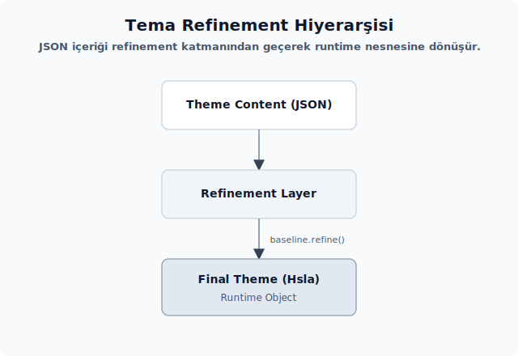

# Refinement ve tema üretimi

Content katmanından son `Theme` nesnesine giden yol burada tamamlanır: birleştirme sırası, varsayılan türetme ve taban uygulaması aynı akışta birleşir. Adımlar Zed'in `refine_theme` akışıyla denk düşer. Bu bölüm, sözleşmenin neden bu kadar düzenli tutulduğunu somut örneklerle gösterir.

---

<div align="center">



</div>

## 29. Content → Refinement → Theme akışı

**Kaynak modül:** `kvs_tema/src/refinement.rs`.

Bu bölüm üç katmanlı boru hattının orta halkasını anlatır. Davranış **durumsuz** ve **belirlenimci** kalır: aynı `Content`, her seferinde aynı `Refinement` değerini üretir.

### Üç katmanın rolü

| Katman | Tip | Soru | Üretildiği yer |
| -------- | ----- | ------ | ---------------- |
| **Content** | `Option<String>` alanlar | Kullanıcı bu alanı yazdı mı? | JSON ayrıştırma |
| **Refinement** | `Option<Hsla>` alanlar | Yazdıysa ayrıştırılabildi mi? | `refinement` |
| **Theme** | `Hsla` alanlar | Sonuç nedir? | `Theme::from_content` |

### Neden iki ayrı `Option` katmanı?

İlk akla gelen soru şudur: "Madem string ileride `Hsla`'ya çevriliyor, neden tek katmanda halletmiyoruz?"

**Cevap:** İki **farklı hata türünün** ayırt edilmesi gerekir:

- **Tip-yapısal hata** (Content katmanı): JSON anahtarı sözleşme dışı, tip uyumsuz veya enum varyantı tanımsız olabilir. Serde bu durumu deserialize sırasında yakalar. Yalnız `treat_error_as_none` kullanılan alanlarda sonuç `None`'a düşer; diğer alanlarda ayrıştırma hatası döner.
- **Değer-içerik hatası** (Refinement katmanı): String alanı doludur ama hex değildir (`"mor"` gibi) veya hex'in formatı bozuktur (`"#zzz"`). `try_parse_color` `Err` döndürür; refinement bu hatayı sessizce `None`'a yutar.

İki katman sayesinde her hata kendi yerinde ele alınır ve üst katmanlara taşınmaz.

### Akış görünümü — örnek bir alan

Kullanıcı tema JSON'unda şu satır bulunsun:

```json
"border.variant": "#363c46ff"
```

Adımlar sırasıyla şöyle ilerler:

**1. Content katmanı**:

```rust
ThemeColorsContent {
    border_variant: Some("#363c46ff".to_string()),
    border: None,                  // JSON'da yok
    border_focused: None,
    // ...
}
```

**2. Refinement katmanı**:

```rust
ThemeColorsRefinement {
    border_variant: Some(hsla(...)),   // try_parse_color başarılı
    border: None,                       // Content'te None idi
    border_focused: None,
    // ...
}
```

**3. Theme katmanı**:

```rust
let mut tema = taban.clone();
tema.styles.colors.refine(&iyilestirme);
// tema.styles.colors.border_variant = kullanıcının değeri
// tema.styles.colors.border        = tabanın değeri (None idi)
```

### Refinement katmanının üç dönüşümü

`refinement` modülünün sorumlulukları şunlardır:

1. **String → Hsla**: `theme_colors_refinement`, `status_colors_refinement` ve dolaylı olarak `accents`/`players`/`syntax` (`Theme::from_content` içinde).
2. **Türetme** (`apply_status_color_defaults`): ön plan verilmiş ama arka plan verilmemiş durum alanlarına %25 alpha arka plan üretir.
3. **Refineable çağrısı**: `taban.refine(&iyilestirme)` ile taban güncellenir. (Bu adım ilgili bölümde işlenir; `refinement` kendi içinde `refine` çağırmaz, yalnızca Refinement üretir.)

### Modülün dış arayüzü

`refinement` dış API'leri (Zed `theme_settings` crate'i paritesinde):

```rust
pub fn theme_colors_refinement(
    icerik: &ThemeColorsContent,
    durum_renkleri: &StatusColorsRefinement,
    acik_mi: bool,
) -> ThemeColorsRefinement;
pub fn status_colors_refinement(icerik: &StatusColorsContent) -> StatusColorsRefinement;
pub fn apply_status_color_defaults(iyilestirme: &mut StatusColorsRefinement);
pub fn apply_theme_color_defaults(
    iyilestirme: &mut ThemeColorsRefinement,
    oyuncu_renkleri: &PlayerColors,
);
pub fn syntax_overrides(
    stil: &ThemeStyleContent,
) -> Vec<(String, gpui::HighlightStyle)>;
```

| API | Alt özellikler | Kısa anlamı |
| :-- | :-- | :-- |
| `ThemeColorsRefinement` | `Option<Hsla>` UI renk alanları | `theme_colors_refinement` çıktısıdır; `Some` alanlar taban `ThemeColors` üstüne yazılır, `None` alanlar korunur. |
| `StatusColorsRefinement` | `Option<Hsla>` durum ön plan/arka plan/kenarlık alanları | `status_colors_refinement` çıktısıdır; ön plan verilip arka plan boşsa `apply_status_color_defaults` %25 alpha arka plan türetir. |
| `AccentContent` | `Option<String>` newtype | Vurgu geçersiz kılma listesinde tek renk girdisini temsil eder; ayrıştırılan liste boş değilse vurgu paleti tamamen değiştirilir. |

> **Önemli:** `theme_colors_refinement` **üç parametre alır**, tek parametre değildir. `status_colors` parametresi çeşitli VCS alanlarının ve helix jump label alanının durum renklerine düşebilmesi için gerekir: başta `version_control_added`/`version_control_deleted` → `status.created`/`status.deleted` olmak üzere, `version_control_modified`/`version_control_renamed` → `status.modified`, `version_control_conflict`/`version_control_ignored` → `status.ignored` ve `vim_helix_jump_label_foreground` → `status.error` bu yoldan beslenir. `is_light` parametresi ise `editor_diff_hunk_*` alanlarının appearance'a göre doğru opacity sabitini seçmesini sağlar.

Crate-içi yardımcılar:

```rust
fn renk(deger: &Option<String>) -> Option<gpui::Hsla>;  // tek satır ayrıştırma
```

> **İlgili bölümdeki modül haritasında `refinement` "crate-içi" olarak işaretlenmişti.** Tek istisna, `Theme::from_content` tarafından çağrılan `apply_status_color_defaults` ve `*_refinement` fonksiyonlarıdır. Tüketici UI katmanı bu modüle doğrudan dokunmaz.

### Saflık ve test edilebilirlik

Refinement katmanı **dış dünyaya dokunmaz**:

- GPU veya render API'leri kullanılmaz.
- `App`/`Context` bağımlılığı yoktur.
- I/O yapılmaz.
- Lock veya global duruma dokunulmaz.

Bu sayede birim testler saf ve hızlı kalır:

```rust
#[test]
fn bos_icerik_bos_iyilestirme_uretir() {
    let durum_iyilestirme = StatusColorsRefinement::default();
    let iyilestirme = theme_colors_refinement(
        &ThemeColorsContent::default(),
        &durum_iyilestirme,
        false,
    );
    assert!(iyilestirme.border.is_none());
    assert!(iyilestirme.background.is_none());
}

#[test]
fn gecersiz_hex_none_olur() {
    let durum_iyilestirme = StatusColorsRefinement::default();
    let icerik = ThemeColorsContent {
        border: Some("renk-degil".to_string()),
        ..Default::default()
    };
    let iyilestirme = theme_colors_refinement(&icerik, &durum_iyilestirme, false);
    assert!(iyilestirme.border.is_none());
}
```

### Dikkat Noktaları

1. **Refinement'ı tüketici API'ye sızdırmak**: UI katmanı yalnızca `Theme` görmelidir. `Refinement` tipinin dışarı açılması, tüketici kodu JSON sözleşmesinin iç ayrıntılarına bağlar ve tema üretim sırasını dağıtır.
2. **Refinement'ı gereksiz klonlamak**: `Refinement` 150 `Option<Hsla>` alanı içerir; klon görece ucuz olsa da gereksizdir. Referansla (`&refinement`) geçirilmesi daha doğrudur.
3. **`refine()` öncesi `apply_status_color_defaults` sırası**: Türetme uygulanmadığında yalnız ön plan veren durum temaları tabanın arka planını tutar; sonuç kullanıcı renkleriyle uyumsuz bir görüntüye dönüşür. Bu adımın `refine()` öncesinde çalışması gerekir.
4. **Refinement'ı global tutmak**: Refinement geçici bir nesnedir; `from_content` çağrısı içinde yaratılır, kullanılır ve düşürülür. `static` veya `Arc` ile tutulmasının anlamı yoktur.

---

## 30. `theme_colors_refinement`, `status_colors_refinement` deseni

İki yardımcı fonksiyon Content tipini Refinement tipine çevirir. **Tek bir desen** üzerinden çalışırlar: her renk alanını `renk()` yardımcısından geçirirler.

### `renk()` yardımcısı — temel yapı taşı

```rust
fn renk(deger: &Option<String>) -> Option<gpui::Hsla> {
    deger.as_deref().and_then(|deger| try_parse_color(deger).ok())
}
```

**Davranış:**

```text
Option<String>  →  Option<Hsla>
─────────────────────────────────
None            →  None
Some("...")     →  Some(hsla(...))  (ayrıştırma başarılı)
Some("bozuk")   →  None             (ayrıştırma hatası yutulur)
```

Üç ana dal vardır:

1. `deger.as_deref()`: `&Option<String>` → `Option<&str>`. Klonsuz ve sıfır maliyetli bir dönüşümdür.
2. `and_then(|deger| try_parse_color(deger).ok())`: `Some(deger)` ise ayrıştırma denenir; `Err` çıktığında sonuç `None`'a düşer. `try_parse_color` ilgili bölümde ayrıntılı işlenmiştir.

`renk()` `refinement` modülünün **dahili** yardımcısıdır; `pub` değildir. Her renk alanı için gereken tek satırlık ayrıştırma mantığını tek noktada toplar.

### `theme_colors_refinement` deseni

```rust
pub fn theme_colors_refinement(
    icerik: &ThemeColorsContent,
    durum_renkleri: &StatusColorsRefinement,
    acik_mi: bool,
) -> ThemeColorsRefinement {
    // 1. Düz alanlar — her biri tek satır ayrıştırma:
    let border = renk(&icerik.border);
    // ... border_variant, border_focused, border_selected, border_transparent,
    //     border_disabled, background, surface_background, ... (çoğu alan)

    // 2. Taban zincirli alanlar — sözleşmenin asıl inceliği burada:
    let scrollbar_thumb_background = renk(&icerik.scrollbar_thumb_background)
        .or_else(|| renk(&icerik.deprecated_scrollbar_thumb_background));
    let scrollbar_thumb_active_background = renk(&icerik.scrollbar_thumb_active_background)
        .or(scrollbar_thumb_background);
    let search_match_background = renk(&icerik.search_match_background);
    let search_active_match_background = renk(&icerik.search_active_match_background)
        .or(search_match_background);
    let version_control_added = renk(&icerik.version_control_added).or(durum_renkleri.created);
    let version_control_deleted = renk(&icerik.version_control_deleted).or(durum_renkleri.deleted);
    let pane_group_border = renk(&icerik.pane_group_border).or(border);
    let panel_background = renk(&icerik.panel_background);
    let element_hover = renk(&icerik.element_hover);
    let panel_overlay_background = renk(&icerik.panel_overlay_background)
        .or(panel_background.map(ensure_opaque));
    let panel_overlay_hover = renk(&icerik.panel_overlay_hover)
        .or(panel_background
            .zip(element_hover)
            .map(|(panel, hover)| panel.blend(hover))
            .map(ensure_opaque));
    let minimap_thumb_background = renk(&icerik.minimap_thumb_background)
        .or(scrollbar_thumb_background.map(ensure_non_opaque));
    // ... minimap_thumb_{hover,active}_background, minimap_thumb_border de
    //     scrollbar_thumb_*'tan türer.

    // 3. Appearance tabanlı opacity sabitleri (`acik_mi` parametresi burada):
    let (hunk_dolgu, hunk_bos_arka_plan, hunk_bos_kenarlik) = if acik_mi {
        (LIGHT_DIFF_HUNK_FILLED_OPACITY,        // 0.16
         LIGHT_DIFF_HUNK_HOLLOW_BACKGROUND_OPACITY,  // 0.08
         LIGHT_DIFF_HUNK_HOLLOW_BORDER_OPACITY)      // 0.48
    } else {
        (DARK_DIFF_HUNK_FILLED_OPACITY,         // 0.12
         DARK_DIFF_HUNK_HOLLOW_BACKGROUND_OPACITY,   // 0.06
         DARK_DIFF_HUNK_HOLLOW_BORDER_OPACITY)       // 0.36
    };
    // editor_diff_hunk_added_background, editor_diff_hunk_deleted_background
    // version_control_added/deleted * hunk_dolgu ile türetilir; hollow varyantları
    // hunk_bos_arka_plan ve hunk_bos_kenarlik opacity'leri ile.

    ThemeColorsRefinement {
        border,
        border_variant: renk(&icerik.border_variant),
        // ... düz alanlar
        scrollbar_thumb_background,
        scrollbar_thumb_active_background,
        search_match_background,
        search_active_match_background,
        version_control_added,
        version_control_deleted,
        pane_group_border,
        panel_overlay_background,
        panel_overlay_hover,
        minimap_thumb_background,
        // ... editor_diff_hunk_* alanları türetilmiş değerlerle
        ..Default::default()
    }
}
```

**Yapı kuralları:**

- **Düz alanlar**: `<alan_adi>: renk(&icerik.<alan_adi>),` kalıbını izler. Alanların büyük çoğunluğu bu gruptadır.
- **Taban zincirli alanlar**: Bazı alanlar doğrudan `renk(...)` çağrısından değil, öncelikli bir taban zincirinden değer alır. Kanonik liste şudur:

| Alan | Düşüş sırası |
| ------ | -------------- |
| `scrollbar_thumb_background` | `→ deprecated scrollbar_thumb.background` |
| `scrollbar_thumb_active_background` | `→ scrollbar_thumb_background` |
| `search_active_match_background` | `→ search_match_background` |
| `version_control_added` | `→ status_colors.created` |
| `version_control_deleted` | `→ status_colors.deleted` |
| `pane_group_border` | `→ border` |
| `panel_overlay_background` | `→ ensure_opaque(panel_background)` |
| `panel_overlay_hover` | `→ ensure_opaque(panel_background.blend(element_hover))` |
| `minimap_thumb_background` | `→ ensure_non_opaque(scrollbar_thumb_background)` |
| `minimap_thumb_hover_background` | `→ ensure_non_opaque(scrollbar_thumb_hover_background)` |
| `minimap_thumb_active_background` | `→ ensure_non_opaque(scrollbar_thumb_active_background)` |
| `minimap_thumb_border` | `→ scrollbar_thumb_border` |
| `editor_document_highlight_bracket_background` | `→ editor_document_highlight_read_background` |
| `editor_diff_hunk_added_background` | `→ version_control_added × hunk_fill (light=0.16 / dark=0.12)` |
| `editor_diff_hunk_added_hollow_background` | `→ version_control_added × hunk_hollow_bg (0.08 / 0.06)` |
| `editor_diff_hunk_added_hollow_border` | `→ version_control_added × hunk_hollow_border (0.48 / 0.36)` |
| `editor_diff_hunk_deleted_background` | `→ version_control_deleted × hunk_fill` |
| `editor_diff_hunk_deleted_hollow_background` | `→ version_control_deleted × hunk_hollow_bg` |
| `editor_diff_hunk_deleted_hollow_border` | `→ version_control_deleted × hunk_hollow_border` |
| `version_control_modified` | `→ status_colors.modified` |
| `version_control_renamed` | `→ status_colors.modified` |
| `version_control_conflict` | `→ status_colors.ignored` |
| `version_control_ignored` | `→ status_colors.ignored` |
| `vim_yank_background` | `→ editor_document_highlight_read_background` |
| `vim_helix_jump_label_foreground` | `→ status_colors.error` |

- **`..Default::default()` zorunludur**: Macro tarafından üretilen Refinement tipinin tüm alanlarını elle vermek pratik değildir; varsayılan taban gerekir. Bu kalıp, yalnızca kullanıcının JSON'da vermediği geçerli alanların tabanda kalmasını sağlar; sözleşme dışı alanları desteklemek için kullanılmaz.
- **`ensure_opaque` / `ensure_non_opaque`** crate-içi yardımcılardır: `ensure_opaque` alpha'yı her zaman `1.0` yapar; `ensure_non_opaque` ise alpha `0.7` üstündeyse `0.7`'ye indirir, `<= 0.7` değerleri olduğu gibi bırakır. Ayna tarafta aynı isimle yerleşim beklenir veya `kvs_renk` modülüne taşınabilir.

> **Yeni alan semantiği:** `ThemeColors` tarafına `new_color` adında bir alan eklendiğinde, macro `ThemeColorsRefinement` içinde otomatik olarak `new_color: Option<Hsla>` üretir. `..Default::default()` derlemeyi korur. Ancak alan `theme_colors_refinement` içinde açıkça doldurulmazsa kullanıcı temasındaki değer çalışma zamanına taşınmaz.

### `status_colors_refinement` deseni

```rust
pub fn status_colors_refinement(icerik: &StatusColorsContent) -> StatusColorsRefinement {
    StatusColorsRefinement {
        conflict: renk(&icerik.conflict),
        conflict_background: renk(&icerik.conflict_background),
        conflict_border: renk(&icerik.conflict_border),

        created: renk(&icerik.created),
        created_background: renk(&icerik.created_background),
        created_border: renk(&icerik.created_border),

        // ... 14 durum × 3 alan = 42 alan, hepsi renk() üzerinden

        ..Default::default()
    }
}
```

Aynı kalıp burada da geçerlidir. Her durum üçlüsü (ön plan, arka plan, kenarlık) ayrı bir satırda yazılır.

### Neden macro veya `From` impl değil?

İlk akla gelen çözüm şudur: "Bu kadar tekrarlı kod için macro yazalım."

**Karşı argüman:**

- **Görsel arama**: Bir alanın refinement'ta nasıl ele alındığını bulmak için `grep "border_variant"` yeterlidir. Macro kullanılırsa bu zincir saklanır ve gözle takip zorlaşır.
- **Alan görünürlüğü**: Yeni bir alan eklendiğinde manuel ekleme zorunluluğu, alanın refinement zincirinde görünür kalmasını sağlar. Macro otomatik üretim yaptığında alanın gerçekten doldurulup doldurulmadığını fark etmek zorlaşır.
- **Derleme süresi**: Her renk alanı için birkaç ek satır, toplamda birkaç yüz satır düz kod demektir. Macro proc-macro derleme süresinden daha hızlıdır.
- **IDE deneyimi**: `renk(&icerik.border_variant)` üzerinde "go to definition" çağrısı Content alanına gider; macro tarafında IDE indirgemelerin tamamına henüz aşina değildir.

Zed kendi `refinement` dosyasında da macro kullanmaz; aynı tek satır deseni tercih edilmiştir.

### `From` trait impl alternatifi

```rust
impl From<&ThemeColorsContent> for ThemeColorsRefinement { ... }
```

Çalışır, ancak birkaç dezavantajı vardır:

- Trait üzerinden çağrı niyeti gizler: `let iyilestirme: ThemeColorsRefinement = (&icerik.colors).into();` ifadesi yerine `theme_colors_refinement(&icerik.colors, &durum_iyilestirme, acik_mi)` çok daha nettir.
- Birden fazla Refinement tipi vardır (ThemeColors + StatusColors); her biri için ayrı `From` impl gerekir ve `From` trait'ler arasında okuma kaybolur.

Mevcut fonksiyon yaklaşımı **görünür bir API** sunar. Refinement modülünün yaptığı iş, birkaç fonksiyon imzasından okunabilir kalır.

### `accents`, `players`, `syntax` neden burada değil?

Bu üç katman `*Content` opsiyonelliğinden çok **liste/map** sözleşmesi taşır. Tek alan bazlı refinement burada yeterli olmaz. Bu yüzden `Theme::from_content` içinde satır içi işlenirler:

- `accents: Vec<AccentContent>` (her girdi içi `Option<String>` newtype) — refinement değil, **boş ise taban, dolu ise listeyi yeniden ayrıştırma** kararıdır.
- `players: Vec<PlayerColorContent>` — aynı boş/dolu kararı.
- `syntax: IndexMap<String, HighlightStyleContent>` — `Vec<(String, HighlightStyle)>` üretimi.

Bunlar `*_refinement` fonksiyonu altında modellenmez. Çünkü `Refineable` derive macro'su `Vec` veya `IndexMap` üzerinde hangi davranışın beklendiğini bilemez: `Refinement = Option<Vec<...>>` mi olmalı, yoksa `Vec<Option<...>>` mi? Satır içi işleme bu yüzden daha doğal kalır.

### Dikkat Noktaları

1. **`renk(icerik.border)` yerine `renk(&icerik.border)`**: Yardımcı `&Option<String>` parametresi bekler, `Option<String>` değil. Move alma istenmeyeceği için referans vermen gerekir.
2. **`..Default::default()` tabanı**: Yeni bir alan eklendiğinde derleme bozulur. Varsayılan taban yerinde tutulmalıdır; zaten verilen alanları varsayılan değerler geçersiz kılmaz.
3. **`as_deref` yerine `as_ref().map(String::as_str)`**: Aynı sonucu verir ama daha uzun bir yazımdır. `as_deref()` idiomatik kullanımdır.
4. **Hata loglaması**: Ayrıştırma hatası sessizce `None`'a düşer. Üretim hata ayıklama ihtiyacı için şu yaklaşım yardımcı olur:
   ```rust
   fn renk(deger: &Option<String>) -> Option<gpui::Hsla> {
       deger.as_deref().and_then(|deger| {
           try_parse_color(deger)
               .inspect_err(|hata| tracing::warn!("renk ayrıştırma hatası: {}", hata))
               .ok()
       })
   }
   ```
   Varsayılan davranışta sessiz tutulması ve isteğe bağlı olarak log açılması doğru bir tercih olur.
5. **`status_colors_refinement` 42 alanın açık işlenmesi**: 14 × 3 = 42 alan bulunur; kısayol yoktur. `..Default::default()` ile eksik alanların tutulacağına güvenildiğinde refinement uygulanmaz. Kullanıcı teması ile taban arasında sessiz bir tutarsızlık doğar.

---

## 31. `apply_status_color_defaults` ve `apply_theme_color_defaults`: %25 alpha türetme kuralı

`StatusColors` sözleşmesinin özel bir davranışı vardır. Tema yazarı bir durum için **yalnızca ön plan** verirse, **arka plan** değeri otomatik olarak ön planın **%25 alpha**'lı halinden türetilir. Bu kural Zed tema davranışıyla uyum için gereklidir. Aksi halde kullanıcı temasında ana renk değişir, arka plan ise tabandan kalır ve ortaya parçalı bir görünüm çıkar.

### Kural

**Eğer** Refinement'ta `<status>` ön plan `Some(on_plan)` değerini taşıyor ama `<status>_background` `None` ise, **uygulama**: `<status>_background = Some(on_plan.opacity(0.25))`.

```rust
pub fn apply_status_color_defaults(iyilestirme: &mut StatusColorsRefinement) {
    let ciftler: &mut [(&mut Option<_>, &mut Option<_>)] = &mut [
        (&mut iyilestirme.deleted, &mut iyilestirme.deleted_background),
        (&mut iyilestirme.created, &mut iyilestirme.created_background),
        (&mut iyilestirme.modified, &mut iyilestirme.modified_background),
        (&mut iyilestirme.conflict, &mut iyilestirme.conflict_background),
        (&mut iyilestirme.error, &mut iyilestirme.error_background),
        (&mut iyilestirme.hidden, &mut iyilestirme.hidden_background),
    ];

    for (on_plan, arka_plan) in ciftler {
        if arka_plan.is_none()
            && let Some(on_plan) = on_plan.as_ref()
        {
            **arka_plan = Some(on_plan.opacity(0.25));
        }
    }
}
```

### Hangi durum için türetme uygulanır?

**6 durum:** `deleted`, `created`, `modified`, `conflict`, `error`, `hidden`.

| Durum | Türetme uygulanır mı | Neden |
| -------- | --------------------- | ------- |
| `deleted` | ✓ | VCS göstergesi — ön plan/arka plan ilişkisi anlamlı |
| `created` | ✓ | VCS göstergesi |
| `modified` | ✓ | VCS göstergesi |
| `conflict` | ✓ | VCS göstergesi |
| `error` | ✓ | Diagnostic — error vurgusu ön plandan türetilebilir |
| `hidden` | ✓ | Gizli öğeler için fade |
| `hint` | ✗ | Diagnostic — arka plan genelde transparan veya farklı |
| `info` | ✗ | Diagnostic — arka plan ayrı tema |
| `success` | ✗ | UI feedback — arka plan kullanıcıya net görünür |
| `warning` | ✗ | Diagnostic — arka plan ayrı tema |
| `predictive` | ✗ | AI tahmin — özel renk |
| `ignored` | ✗ | VCS — arka plan genelde transparan |
| `renamed` | ✗ | VCS — arka plan uyumsuz türetilebilir |
| `unreachable` | ✗ | Kod — arka plan genelde transparan |

> **Bu seçim Zed'in `refine_theme_family` davranışını izler.** Listenin değiştirilmesi gündeme gelirse önce Zed kaynağına (`theme` crate'i) bakılmalı, ardından değişiklik yerel API genişletmesi olarak değerlendirilmelidir.

### `_border` türetilmez

Yalnızca `_background` türetilir; `_border` `None` ise tabandan gelir. Tema yazarı `error: "#ff5555"` yazdığında durum şu olur:

- `error` = `Some(hsla(...))`
- `error_background` = türetildi (`#ff555540` benzeri)
- `error_border` = tabandan (tema yazarı vermediyse)

Bu kasıtlı bir tercihtir. Border renginin %50 alpha versiyonu her durumda makul olmayabilir; bu rengin ayrı bir kararla yazılması beklenir.

### Mekanizma detayı

```rust
let ciftler: &mut [(&mut Option<_>, &mut Option<_>)] = &mut [
    (&mut iyilestirme.deleted, &mut iyilestirme.deleted_background),
    // ...
];
```

**`&mut Option<_>` çiftleri**: Rust borrow checker aynı struct'tan rastgele birden fazla `&mut` referans alınmasına izin vermez. Ancak farklı **alanlar** söz konusu olduğunda buna izin verir. `ciftler` array'i bu çiftleri tek slice'ta toplar.

```rust
for (on_plan, arka_plan) in ciftler {
    if arka_plan.is_none() && let Some(on_plan) = on_plan.as_ref() {
        **arka_plan = Some(on_plan.opacity(0.25));
    }
}
```

- `arka_plan.is_none()`: arka plan verilmemiş.
- `let Some(on_plan) = on_plan.as_ref()`: if-let chain (Rust 2024) — ön plan verilmiş.
- `**arka_plan = ...`: `arka_plan` `&mut &mut Option<Hsla>` tipindedir (içeri çıkmak için iki deref); değer atarsın.
- `on_plan.opacity(0.25)`: `Hsla::opacity` ilgili bölümde işlenmiştir.

### Çağrı yeri

`apply_status_color_defaults`, `Theme::from_content` içinde **yalnızca tek bir yerde** çağrılır:

```rust
let mut durum_iyilestirme = status_colors_refinement(&icerik.style.status);
apply_status_color_defaults(&mut durum_iyilestirme);  // ← burada
let mut durum = taban.styles.status.clone();
durum.refine(&durum_iyilestirme);
```

Sıralama:
1. Content'ten refinement üretilir.
2. Refinement'a türetme uygulanır.
3. Tabana refinement uygulanır.

### `theme_color_defaults` muadili?

`ThemeColors` için genel bir ön plan/arka plan türetme yardımcısı yoktur. Sebep basittir: UI renklerinde durum renklerindeki gibi düzenli bir ön plan/arka plan ilişkisi bulunmaz. `border_variant` ile `surface_background` birbirinden bağımsız alanlardır. Genel türetme bu yüzden yapay kalır.

Zed'de `apply_theme_color_defaults` adında bir fonksiyon bulunur, ancak tam davranışı ilgili bölümde işlenir: yalnızca `element_selection_background` alanını türetir ve kaynak rengi `player_colors.local().selection` değeridir (`text_accent` veya başka bir alan değil). Kaynak rengin alpha'sı `1.0` olduğunda sonuç alpha'sı `0.25`'e çekilir; aksi durumda değer olduğu gibi atarsın. Yani sabit bir `× 0.25` formülü **söz konusu değildir**; alpha < 1.0 olan bir player selection'ı aynen kopyalanır. `apply_theme_color_defaults` tarafındaki ek türetme kuralları ilgili bölümde ayrıca ele alırsın.

### Test örnekleri

```rust
#[test]
fn yalniz_on_plan_arka_plan_turetir() -> anyhow::Result<()> {
    let mut iyilestirme = StatusColorsRefinement::default();
    iyilestirme.error = Some(gpui::hsla(0.0, 0.8, 0.5, 1.0));
    // error_background None

    apply_status_color_defaults(&mut iyilestirme);

    assert!(iyilestirme.error_background.is_some());
    let arka_plan = iyilestirme
        .error_background
        .ok_or_else(|| anyhow::anyhow!("arka plan türetilmedi"))?;
    assert!((arka_plan.a - 0.25).abs() < 1e-6);
    // h, s, l ön plan ile aynı
    let on_plan = iyilestirme
        .error
        .ok_or_else(|| anyhow::anyhow!("ön plan eksik"))?;
    assert_eq!(arka_plan.h, on_plan.h);
    Ok(())
}

#[test]
fn acik_arka_plan_korunur() -> anyhow::Result<()> {
    let mut iyilestirme = StatusColorsRefinement::default();
    iyilestirme.error = Some(gpui::hsla(0.0, 0.8, 0.5, 1.0));
    iyilestirme.error_background = Some(gpui::hsla(0.0, 0.0, 0.0, 0.5)); // siyah yarı

    apply_status_color_defaults(&mut iyilestirme);

    let arka_plan = iyilestirme
        .error_background
        .ok_or_else(|| anyhow::anyhow!("arka plan eksik"))?;
    assert_eq!(arka_plan.h, 0.0);  // geçersiz kılınmadı
    assert_eq!(arka_plan.l, 0.0);
    Ok(())
}

#[test]
fn on_plan_ve_arka_plan_yoksa_bos_kalir() {
    let mut iyilestirme = StatusColorsRefinement::default();
    // error ve error_background None

    apply_status_color_defaults(&mut iyilestirme);

    assert!(iyilestirme.error.is_none());
    assert!(iyilestirme.error_background.is_none());  // hâlâ None
}
```

### Dikkat Noktaları

1. **`opacity(0.25)` yerine `alpha(0.25)`**: `opacity(x)` mevcut alpha'yı `* x` ile çarpar; `alpha(x)` ise doğrudan atar. Ön plan genelde alpha 1.0 olduğu için iki çağrı aynı sonucu üretir; ancak anlamları farklıdır. Zed `opacity` kullanır, ayna tarafta da aynı tercih korunur.
2. **6 durumun listeye tam yazılması**: Liste eksik olduğunda (örneğin `modified` eklenmediğinde) türetme çalışmaz; kullanıcı yalnız ön plan yazdığında arka plan tabandan gelir. Listenin tam olması şarttır.
3. **`ciftler` slice'ının tekrar kullanılması**: `&mut [...]` literal her çağrıda yeniden üretilir; başarım açısından bir kayıp değildir. Bu kod sıcak yolda yer almaz.
4. **`if-let chain` söz dizimi**: `if arka_plan.is_none() && let Some(on_plan) = on_plan.as_ref()` ifadesi Rust 2024 edition'a aittir. Edition < 2024 ortamlarda iç içe `if let` yazılır:
   ```rust
   if arka_plan.is_none() {
       if let Some(on_plan) = on_plan.as_ref() {
           **arka_plan = Some(on_plan.opacity(0.25));
       }
   }
   ```
5. **`_border` türetmesinin eklenmesi**: Sözleşmenin dışına çıkar ve kullanıcı temasıyla uyumsuz bir görüntü riskini doğurur. Bu adımın eklenmesi yerel bir API genişletmesi olarak değerlendirilmelidir.
6. **Türetme sırası**: `apply_status_color_defaults` `refine()`'dan **önce** çağrılmalıdır. Sonra çağrıldığında tabanın `_background` değeri zaten yazılmış olur ve türetme yerini bulamaz.

### `apply_theme_color_defaults` — refinement varsayılanları

**Kaynak:** `theme` crate'i.

İlgili bölümün başında `apply_status_color_defaults` için %25 alpha türetme kuralı işlenmişti. Zed'in `ThemeColors` için **ikinci** bir varsayılan uygulama fonksiyonu daha vardır:

```rust
pub fn apply_theme_color_defaults(
    tema_renkleri: &mut ThemeColorsRefinement,
    oyuncu_renkleri: &PlayerColors,
) {
    if tema_renkleri.element_selection_background.is_none() {
        let mut secim = oyuncu_renkleri.local().selection;
        if secim.a == 1.0 {
            secim.a = 0.25;
        }
        tema_renkleri.element_selection_background = Some(secim);
    }
}
```

**`kvs_tema`'da neden gerekir?**

- `ThemeColorsRefinement` `Option<Hsla>` alanları taşır; refinement zincirinde `None` kalan alanlar tabandan gelir.
- `element_selection_background` özel bir taban kuralı taşır: kullanıcı veya tema bu alanı vermediyse lokal player selection rengi alınır; tam opak ise alpha `0.25`'e çekilir.
- Bu fonksiyon appearance tabanlı genel bir renk doldurucu değildir. `border_disabled` veya `text_disabled` gibi alanların otomatik üretilmesi sağlamaz; böyle bir genişletme yapılacak olursa Zed referansından bağımsız bir uygulama kararı olarak ele alman gerekir.

**Örnek implementasyon:**

```rust
pub fn apply_theme_color_defaults(
    iyilestirme: &mut ThemeColorsRefinement,
    oyuncu_renkleri: &PlayerColors,
) {
    if iyilestirme.element_selection_background.is_none() {
        let mut secim = oyuncu_renkleri.local().selection;
        if secim.a == 1.0 {
            secim.a = 0.25;
        }
        iyilestirme.element_selection_background = Some(secim);
    }
}
```

**Çağrı sırası (`Theme::from_content` içinde):**

```rust
let mut durum_iyilestirme = status_colors_refinement(&icerik.style.status);
apply_status_color_defaults(&mut durum_iyilestirme);
let acik_mi = matches!(icerik.appearance, AppearanceContent::Light);
let mut renk_iyilestirme = theme_colors_refinement(
    &icerik.style.colors,
    &durum_iyilestirme,
    acik_mi,
);

apply_theme_color_defaults(&mut renk_iyilestirme, &oyuncu_renkleri);

let mut renkler = taban.styles.colors.clone();
renkler.refine(&renk_iyilestirme);
```

Varsayılan uygulama, kullanıcı `ThemeColorsRefinement` değeri üretildikten **sonra** ve taban `ThemeColors` üstüne `refine()` edilmeden **önce** gelir. Bu sıralama kullanıcı geçersiz kılması varsa onu korur; yalnızca eksik (`None`) alanlar doldurulur.

---

## 32. `Theme::from_content` birleşik akış

**Kaynak modül:** `kvs_tema/src/refinement.rs` veya `kvs_tema.rs` (lib kökü). Yerleşim uygulama tasarımına göre değişebilir; ancak `impl Theme` bloğu tek parçadır.

Refinement katmanının dışarıya verdiği ana kurulum fonksiyonudur. İki bilgiyle çağrılır: kullanıcı tema içeriği ve taban tema. Sonuç olarak tam bir `Theme` nesnesi üretir.

```rust
impl Theme {
    pub fn from_content(icerik: ThemeContent, taban: &Theme) -> Self { ... }
}
```

**İmza ayrıntısı:**

- `icerik: ThemeContent` — **sahip alır** (move). Çağıran, fonksiyon sonrası Content'i kullanamaz; ancak Content tipi zaten ayrıştırma sonrası bir kez kullanılır ve atarsın.
- `taban: &Theme` — **referanstır**. Taban tema kaydında durur. Klon gerektiğinde fonksiyon içinde `.clone()` çağırırsın.
- Dönüş: `Self` (`Theme`).

### 8 adımlı akış

```rust
pub fn from_content(icerik: ThemeContent, taban: &Theme) -> Self {
    // 1. Appearance dönüşümü
    let gorunum = match icerik.appearance {
        AppearanceContent::Light => Appearance::Light,
        AppearanceContent::Dark => Appearance::Dark,
    };

    // ---
    // Aşağıdaki adımlar Zed `refine_theme`
    // sırasını birebir takip eder. Sıra önemlidir:
    //   - durum_iyilestirme, tema_iyilestirme'den ÖNCE çünkü
    //     theme_colors_refinement(`durum_renkleri`) ona ihtiyaç duyar.
    //   - player birleştirme, tema_iyilestirme'den ÖNCE çünkü
    //     apply_theme_color_defaults(player) ona ihtiyaç duyar.
    // ---

    // 2a. Durum refinement + %25 alpha türetme
    let mut durum_iyilestirme = status_colors_refinement(&icerik.style.status);
    apply_status_color_defaults(&mut durum_iyilestirme);

    // 2b. Taban durumunu refine et
    let mut durum = taban.styles.status.clone();
    durum.refine(&durum_iyilestirme);

    // 3. Player birleştirme — taban player listesi üstüne index bazlı geçersiz kılma
    let mut oyuncu = taban.styles.player.clone();
    merge_player_colors(&mut oyuncu, &icerik.style.players);

    // 4a. Theme color refinement — 3 parametre: icerik + durum_iyilestirme + acik_mi
    let acik_mi = matches!(gorunum, Appearance::Light);
    let mut renk_iyilestirme = theme_colors_refinement(
        &icerik.style.colors,
        &durum_iyilestirme,
        acik_mi,
    );

    // 4b. element_selection_background türetmesi (player.local().selection)
    apply_theme_color_defaults(&mut renk_iyilestirme, &oyuncu);

    // 4c. Taban theme colors değerlerini refine et
    let mut renkler = taban.styles.colors.clone();
    renkler.refine(&renk_iyilestirme);

    // 5. Accents: boş ise tabana dokunma; dolu ise ayrıştırılabilen
    //    renkleri topla. Zed paritesi (`merge_accent_colors`,
    //): ayrıştırılabilen renkler
    //    boş çıkarsa accent listesini değiştirme; aksi halde taban
    //    `Arc<[Hsla]>`'i tamamen değiştir.
    let mut vurgular = taban.styles.accents.clone();
    merge_accent_colors(&mut vurgular, &icerik.style.accents);

    // Player birleştirme bu noktada ZATEN çalıştırıldı — adım 3.
    // Aşağıdaki kalan kod blokları sadece syntax ve pencere arka planı adımlarını içerir.
    // 6. Syntax listesini kur. Zed `refine_theme` burada
    //    `schema::syntax_overrides` yardımcısını
    //    çağırmaz; aynı dönüşümü satır içi yapıp `SyntaxTheme::new(...)`
    //    ile yeni syntax theme üretir. `SyntaxTheme::merge(...)`
    //    yalnız çalışma zamanı theme override akışında kullanılır.
    let sozdizimi_vurgulari = syntax_overrides(&icerik.style);
    let sozdizimi = Arc::new(SyntaxTheme::new(sozdizimi_vurgulari));

    // 7. Pencere arka planı: enum eşleme veya GPUI default'u
    let pencere_arka_plan_gorunumu = match icerik.style.window_background_appearance {
        Some(WindowBackgroundContent::Opaque) => WindowBackgroundAppearance::Opaque,
        Some(WindowBackgroundContent::Transparent) => WindowBackgroundAppearance::Transparent,
        Some(WindowBackgroundContent::Blurred) => WindowBackgroundAppearance::Blurred,
        None => WindowBackgroundAppearance::default(),
    };

    // 8. Theme yapısını topla
    Self {
        id: uuid::Uuid::new_v4().to_string(),
        name: SharedString::from(icerik.name),
        appearance: gorunum,
        styles: ThemeStyles {
            window_background_appearance: pencere_arka_plan_gorunumu,
            system: SystemColors::default(),  // SystemColors tema JSON'u tarafından değiştirilmez
            colors: renkler,
            status: durum,
            player: oyuncu,
            accents: vurgular,
            syntax: sozdizimi,
        },
    }
}
```

### Adım adım davranış

**Adım 1 — Appearance enum dönüşümü.**

`AppearanceContent::Light` → `Appearance::Light`. Burada iki ayrı enum tipi vardır. Content tipi serde için, Theme tipi çalışma zamanı için kullanırsın. Doğrudan cast yapılmaz; açık bir `match` yazılır.

**Adım 2 — Durum refinement + %25 alpha türetme.**

`status_colors_refinement` ilgili bölümde, `apply_status_color_defaults` ise ilgili bölümde ele alınmıştır. Türetme `theme_colors_refinement`'tan **önce** çalıştırılır; çünkü `theme_colors_refinement`, `version_control_added`/`version_control_deleted` alanları için `durum_iyilestirme.created`/`durum_iyilestirme.deleted` değerlerine düşer (ilgili bölüm taban tablosu).

**Adım 3 — Player birleştirme.**

`merge_player_colors(&mut oyuncu, &icerik.style.players)` çağrısı taban player listesini index başına alan bazlı geçersiz kılar. Bu adımın theme color refinement'tan **önce** olması gerekir; çünkü `apply_theme_color_defaults`, `player.local().selection` rengini okur.

**Adım 4 — Theme color refinement + türetme.**

`theme_colors_refinement(icerik, &durum_iyilestirme, acik_mi)` üç parametreyle çağrılır; ilgili bölümdeki imza tablosu bunu açıklar. Ardından `apply_theme_color_defaults(refinement, &oyuncu)` çağrılır ve `element_selection_background` türetilir. Bu sıra, durum türetmesinden sonra ve tabana uygulamadan öncedir.

**Adım 4 (devam) — Taban refine detayı.**

```rust
let mut renkler = taban.styles.colors.clone();
renkler.refine(&renk_iyilestirme);
```

`Refineable::refine` — `Some` alanları geçersiz kılar, `None` ise tabandan kalır. Adım 2'de `durum.refine(&durum_iyilestirme)` aynı şekilde uygularsın.

**`.clone()` neden gereklidir?** `taban: &Theme` immutable bir referanstır; doğrudan üzerinde `refine` çağrılamaz. Taban tema kaydında paylaşıldığı için değiştirilemez; her tema kendi kopyasını alır.

**Maliyet:** `ThemeColors` ~150 `Hsla` taşır = 150 × 16 byte = 2.4 KiB klon. `StatusColors` 42 alan = ~700 byte. Toplam ~3 KiB / tema, tema yüklenirken yalnızca bir kez. Bu adım sıcak yolda değildir.

**Adım 3 (devam) — Player birleştirme davranış detayı.**

```rust
let mut oyuncu = taban.styles.player.clone();
merge_player_colors(&mut oyuncu, &icerik.style.players);
```

`merge_player_colors` kanonik akışın 3. adımıdır; durum refinement'tan sonra, theme colors refinement'tan önce çalışır. İnce noktaları şunlardır:

- Tema yazarı şu listeyi vermiş olsun: `players: [{ "cursor": "#abc" }, { "cursor": "#def" }]`.
- Player 0'ın cursor'u `#abc`, background ve selection ise **taban player 0**'dan (tabanın `local()` slot'undan) gelir.
- Player 1'in cursor'u `#def`, background ve selection ise **taban player 1**'den (slot semantiğine göre turuncu tonları) gelir.

Yani taban **index başına** uygulanır; tüm eksikler `local()` slot'undan gelmez. Bu davranış Zed'in `merge_player_colors` sözleşmesiyle eşleşir ve slot semantiğini korur.

Player slot'u taban kapasitesinden büyük bir index ise, örneğin taban 8 slot tutarken tema 10 slot tanımlamışsa, eksik taban `PlayerColor::default()` ile doldurulur.

**Adım 5 — Accent birleştirme.**

```rust
merge_accent_colors(&mut vurgular, &icerik.style.accents);
```

Zed kaynağındaki `theme_settings::theme_settings::merge_accent_colors` şu davranışı sergiler:

- `user_accent_colors.is_empty()` → tabana dokunmaz (`accents` tabandan klonlu kalır).
- Aksi halde ayrıştırılabilen renkler `filter_map` ile toplanır; toplam liste boş çıkarsa (hepsi null veya ayrıştırma hatası) yine tabana dokunulmaz. Liste en az 1 renk içerdiğinde `accents.0 = Arc::from(renkler)` çağrısıyla **taban tamamen değiştirilir**.

> **Dikkat noktası:** Tema yazarı `accents: ["#aaa", null, "#bbb"]` yazdığında, `merge_accent_colors` null'ları ve ayrıştırma hatalarını eler. Sonuç `accents = [#aaa, #bbb]` olur. İndeksleme bu durumda kayar; `#bbb` artık accent index 1'dir, tabandaki orijinal index 2 değildir. Ayna tarafta semantik bozulmaması için aynı `filter_map` zinciri korunmalıdır.

**Adım 6 — Syntax: `IndexMap` → `Vec<(String, HighlightStyle)>` → `Arc::new(SyntaxTheme::new(...))`.**

`theme_settings::schema::syntax_overrides` yardımcısı (yukarıdaki ilgili bölüm imza tablosunda yer alır), Content tarafındaki `IndexMap<String, HighlightStyleContent>` yapısını `Vec<(String, gpui::HighlightStyle)>` haline çevirir. `HighlightStyleContent`'in 4 alanı (`color`, `background_color`, `font_style`, `font_weight`) ayrıştırılır; gerisi `Default::default()`'tan gelir (`underline`, `strikethrough`, `fade_out` vb.).

```rust
let sozdizimi_vurgulari = syntax_overrides(&icerik.style);
let sozdizimi = Arc::new(SyntaxTheme::new(sozdizimi_vurgulari));
```

Zed `theme_settings::refine_theme` bu dönüşümü şu an satır içi yazar (`theme_settings`); `syntax_overrides(stil)` yardımcısı aynı `IndexMap` → `Vec<(String, HighlightStyle)>` dönüşümünü ürettiği için ayna tarafta da kullanabilirsin. Buradaki kritik ayrım şu şekildedir:

- **Tam kullanıcı tema yüklemesi** (`refine_theme_family` / `refine_theme`): syntax bölümü `SyntaxTheme::new(...)` ile kurarsın. Taban syntax üzerine alan bazlı bir birleştirme yapılmaz. **Pratik sonuç:** Tema JSON'ında `syntax` bölümü boş veya eksik olduğunda `syntax_overrides` boş bir vec döner ve `SyntaxTheme::new([])` çağrılır — sonuç **tamamen boş bir syntax theme** olur. Editor renklerinin görünebilmesi için tema yazarının `syntax: { ... }` bloğunu mutlaka doldurması gerekir; aksi takdirde syntax highlight'sız bir editör ekranı ortaya çıkar.
- **Çalışma zamanı theme override** (`ThemeSettings::apply_theme_overrides` → private `modify_theme`): mevcut `base_theme.styles.syntax` üstüne `SyntaxTheme::merge(base, syntax_overrides(theme_overrides))` uygularsın. Bu yol alan bazlı option-or birleştirme yapar; override'da olmayan bir capture tabandaki `HighlightStyle`'ı korur.

Bu nedenle `SyntaxTheme::merge` ilgili bölümde ve override akışında kanonik yardımcı olarak işlev görür; ancak ilgili bölümdeki tam JSON → `Theme` hattının son adımı **değildir**. Bu ayrım karıştırılırsa, kullanıcı tema yüklemesinde aslında olmayan bir taban syntax mirası varmış gibi anlatılır.

**Adım 7 — Pencere arka planı: enum dönüşümü veya GPUI default'u.**

```rust
match icerik.style.window_background_appearance {
    Some(...) => /* Content variant'ından GPUI variant'ına */,
    None => WindowBackgroundAppearance::default(),
}
```

Tema yazarı değer vermediyse `WindowBackgroundAppearance::default()` kullanılır; bu da güncel GPUI'de `Opaque` değeridir. Değer verdiyse Content enum'undan GPUI enum'una açık bir `match` yaparsın.

**Adım 8 — Theme yapısını topla.**

- `id`: `uuid::Uuid::new_v4().to_string()` — her seferinde yeni bir benzersiz id üretilir. Aynı tema iki kez yüklendiğinde iki farklı id alır; çalışma zamanında ayırt etmek için kullanabilirsin (genelde gerekmez).
- `name`: `SharedString::from(icerik.name)`. Content'in `name: String` alanı klonsuz biçimde `SharedString`'e sarmalanır.
- `appearance`: Adım 1.
- `styles.system`: `SystemColors::default()` değerinden gelir (tema yazarı sistem renklerini geçersiz kılmaz).
- Diğerleri: Adım 3–7'den.

### Kenar durumlar

| Senaryo | Davranış |
| --------- | ---------- |
| Tüm Content tipleri default (boş tema) | Tüm renkler tabandan; `name` boş String → boş `SharedString` |
| Ayna tasarımda `appearance: "dark"` için light taban geçirmek | `appearance = Dark`, renkler light tabandan gelir; çağıran kod tabanı appearance'a göre seçmelidir |
| Aynı taban ile iki kez `from_content` | İki ayrı `Theme` (farklı `id`); değerler aynı |
| `syntax: {}` | Boş `Vec<...>` → `Arc<SyntaxTheme>`, ancak içi boş |
| `accents: [null, null]` | Ayrıştırılabilen renk kalmadığı için taban accents korunur |
| `players: []` | `player = taban.styles.player.clone()` |
| `players: [{}]` | Taban/default player listesi korunur; slot 0'daki üç alan taban slot 0 değerinden kalır |

### Başarım profili

| Adım | Maliyet | Not |
| ------ | --------- | ----- |
| Appearance match | <1 µs | Basit |
| Refinement üretimi (2 fn) | ~10–30 µs | 150 + 42 alan, her biri Option + and_then |
| `apply_status_color_defaults` | <1 µs | 6 iterasyon |
| `clone() + refine()` × 2 | ~5–10 µs | Memcpy + 192 conditional write |
| Accents/Players/Syntax | ~5–20 µs | Map sayısına bağlı |
| Toplam | **~25–60 µs** | Tema yüklemesi başına |

100 tema yüklendiğinde toplam yaklaşık ~5 ms olur. Bu kod yolu sıcak yol değildir.

### Çağrı yerleri

`Theme::from_content` iki ana yerden çağrılır:

1. **Yerleşik tema yükleme**: `assets/themes/*.json` → `ThemeFamilyContent` → her `ThemeContent` için `from_content`.
2. **Kullanıcı tema yükleme** (çalışma zamanı API): Kullanıcı bir tema dosyası eklediğinde → `serde_json_lenient::from_str` → `from_content`.

Test örnek verilerinde de kullanırsın:

```rust
#[test]
fn zed_one_koyu_ayristirir() -> anyhow::Result<()> {
    let json = include_str!("fixtures/one-dark.json");
    let aile: ThemeFamilyContent = serde_json_lenient::from_str(json)?;
    let taban = fallback::kvs_default_dark();
    for tema_icerigi in aile.themes {
        let tema = Theme::from_content(tema_icerigi, &taban);
        assert!(!tema.name.is_empty());
    }
    Ok(())
}
```

### Dikkat Noktaları

1. **Taban appearance eşleşmesi**: Ayna tasarımda light bir tema yüklenirken dark taban kullanıldığında, kullanıcının vermediği alanlar dark tabandan gelir ve uyumsuz bir görüntü oluşur. Çağıran kodun tabanı `icerik.appearance` değerine göre seçmesi gerekir:
   ```rust
   let taban = match icerik.appearance {
       AppearanceContent::Light => fallback::kvs_default_light(),
       AppearanceContent::Dark => fallback::kvs_default_dark(),
   };
   ```
2. **`from_content`'in her render'da çağrılması**: Sıcak yol olmasa bile gereksizdir. Tema yüklenirken bir kez çağrılır ve sonuç önbelleğe alınır.
3. **`uuid` bağımlılığının eklenmesi**: Cargo.toml'a `uuid = { version = "1", features = ["v4"] }` eklersin. İlgili bölüm listesinde de yer alır.
4. **`SystemColors`'un geçersiz kılınması**: Sözleşmede SystemColors tema yazarı tarafından override edilmez. Şu anki Content tipinde bu alana karşılık gelen bir yer yoktur; istense bile yazılamaz. Bu durum kasıtlıdır.
5. **`Theme.id` üzerinden eşitlik**: İki tema farklı id'lere sahip olduğunda aynı içeriği taşısa bile farklı sayılır. Eşitlik için `name` veya `styles` karşılaştırılmalıdır.
6. **Accents `filter_map` null davranışı**: Zed davranışı, ayrıştırılamayan veya `null` accent girdilerini eler; liste boş kaldığında taban korunur.
7. **`from_content` çalışma zamanı kırılması potansiyeli**: Mevcut implementasyonda kırılma noktası bulunmaz. Buna karşın sonuçları doğrudan açan bir çağrı eklemek dikkat gerektirir: tema yüklemesinin çalışma zamanında kırılmaması, sessizce tabana düşmesi beklenir.

### Zed paritesi: `refine_theme*`, `merge_*`, `load_user_theme`

Yukarıdaki `Theme::from_content` `kvs_tema` için önerilen tasarımdır. Zed'de aynı işi parçalara bölen **dört public fonksiyon** bulunur (`theme_settings` crate'i):

| Fonksiyon | Sorumluluk | Karşılık |
| ----------- | ------------ | ---------- |
| `pub fn refine_theme(theme: &ThemeContent) -> Theme` | Tek bir `ThemeContent` → `Theme`. Taban `appearance`'a göre `ThemeColors::light`/`dark` üzerinden alınır; refinement + merge + parse pipeline'ı çalıştırılır | `Theme::from_content` ile aynı akış |
| `pub fn refine_theme_family(content: ThemeFamilyContent) -> ThemeFamily` | Tüm aileyi `refine_theme` ile çevirip `ThemeFamily { themes, scales: default_color_scales(), … }` üretir | Aile-bazlı yardımcı; tek tema için `refine_theme` yeterli |
| `pub fn merge_player_colors(&mut PlayerColors, &[PlayerColorContent])` | Adım 3'ün kanonik implementasyonu (index başına alan bazında merge) | ilgili bölüm Adım 3 |
| `pub fn merge_accent_colors(&mut AccentColors, &[AccentContent])` | Adım 5'in kanonik implementasyonu (ayrıştırılan liste boş değilse `Arc<[Hsla]>`'i tamamen değiştir) | ilgili bölüm Adım 5 |

Ayrıca `pub fn load_user_theme(registry: &ThemeRegistry, bytes: &[u8]) -> Result<()>` ve `pub fn deserialize_user_theme(bytes: &[u8]) -> Result<ThemeFamilyContent>` fonksiyonları kullanıcı tema dosyasını diskten ayrıştıran public yüzeyi sunar:

```rust
pub fn load_user_theme(kayit: &ThemeRegistry, baytlar: &[u8]) -> Result<()> {
    let tema = deserialize_user_theme(baytlar)?;
    let iyilestirilmis = refine_theme_family(tema);
    kayit.insert_theme_families([iyilestirilmis]);
    Ok(())
}

pub fn deserialize_user_theme(baytlar: &[u8]) -> Result<ThemeFamilyContent> {
    let tema_ailesi: ThemeFamilyContent =
        serde_json_lenient::from_slice(baytlar)?;
    Ok(tema_ailesi)
}
```

Kullanıcı tema dizini gibi çalışma zamanı yükleme yolları bu iki fonksiyonu doğrudan kullanabilir:

```rust
pub fn kullanici_tema_yukle(
    kayit: &ThemeRegistry,
    baytlar: &[u8],
) -> anyhow::Result<()> {
    let aile = deserialize_user_theme(baytlar)?;
    let iyilestirilmis = refine_theme_family(aile);
    kayit.insert_theme_families([iyilestirilmis]);
    Ok(())
}
```

Bu akışta alias kontrolü bulunmaz. Kullanıcı tema dosyası mevcut sözleşmedeki anahtarlarla yazılmalıdır; sözleşme dışı alias'lar için ayrı bir kabul hattı kurulmaz.

---
