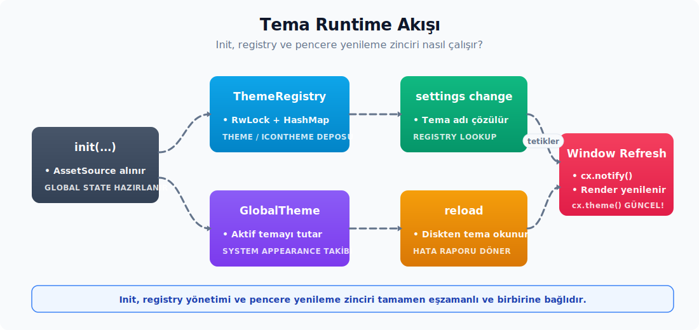

# Çalışma zamanı kuruluşu ve tema seçimi

Üretilen temalar önce tema kaydına ve global duruma yerleştirilir, ardından sistem görünümü izlenir ve tema değiştiğinde pencereler yenilenir. Bu bölüm, bu akışı sırasıyla anlatır: tema nerede tutulur, aktif tema nasıl seçilir ve UI yeni renkleri nasıl görür?



---

## 33. `ThemeRegistry`: API yüzeyi ve thread safety

**Kaynak modül:** `kvs_tema/src/registry.rs`.

Yüklü UI temalarının ve ikon temalarının ad bazlı kataloğunu tutar. Thread-safe okuma/yazma erişimi sunar; çalışma zamanının tek "tema veritabanı" gibi çalışır.

### Yapı

```rust
use parking_lot::RwLock;
use std::sync::Arc;
use collections::HashMap;
use gpui::{AssetSource, SharedString};

#[derive(Debug, Clone)]
pub struct ThemeMeta {
    pub name: SharedString,
    pub appearance: Appearance,
}

struct ThemeRegistryState {
    themes: HashMap<SharedString, Arc<Theme>>,
    icon_themes: HashMap<SharedString, Arc<IconTheme>>,
    extensions_loaded: bool,
}

pub struct ThemeRegistry {
    state: RwLock<ThemeRegistryState>,
    assets: Box<dyn AssetSource>,
}
```

**Sarmalama katmanları:**

1. **`Arc<Theme>` / `Arc<IconTheme>`** — Her tema paylaşılabilir; klonu ucuzdur (yalnızca refcount artışı). Zed paritesinde `cx.theme()` and `GlobalTheme::icon_theme(cx)` çağrıları `&Arc<_>` döndürür.
2. **`HashMap<SharedString, _>`** — Ad bazlı O(1) lookup. `SharedString` key olarak kullanılır; klonsuz hash'leme yapar.
3. **`RwLock<...>`** — Çoklu okuyucu, tek yazıcı. Tema okuma sıktır (render path), yazma ise nadirdir (init + reload).
4. **`AssetSource`** — Yerleşik tema ve icon theme varlıklarını aynı kayıt üzerinden listeler ve yükler; üretim paketlemesi ile uyumlu çalışır.

> **Neden `parking_lot::RwLock`?** `std::sync::RwLock` daha yavaş ve daha büyüktür. Ayrıca çalışma zamanı kırılması sonrası poison davranışı kilit sonucunu elle açma zorunluluğu doğurur. `parking_lot::RwLock`:
> - Yaklaşık 2× daha hızlı kilit-açma sağlar.
> - Daha küçük bir bellek ayak izi taşır.
> - Poison kavramı yoktur — çalışma zamanı kırılması sonrası bile lock kullanılmaya devam edebilir.
> - `read()` ve `write()` doğrudan guard döndürür; ek bir sonuç açma çağrısına ihtiyaç bırakmaz.

### Hata tipleri

**Zed kaynak sözleşmesi** (`theme` crate'i): hata tipi adları `ThemeNotFoundError` ve `IconThemeNotFoundError` biçimindedir. Sonda `Error` suffix'i bulunur. `kvs_tema` mirror'ında da aynı isimler kullanılır:

```rust
use thiserror::Error;

#[derive(Debug, Error)]
#[error("tema bulunamadı: {0}")]
pub struct ThemeNotFoundError(pub SharedString);

#[derive(Debug, Error)]
#[error("ikon tema bulunamadı: {0}")]
pub struct IconThemeNotFoundError(pub SharedString);
```

- `thiserror` makrosu `Display + std::error::Error` türevlerini ücretsiz olarak üretir.
- Tek alanlı newtype — hata mesajı `"tema bulunamadı: Kvs Varsayılan Koyu"` biçiminde okunur.
- Hata propagation kolaydır: `?` operatörü ile `anyhow::Result<...>` veya başka bir error chain'e dönüştürülebilir.

### Global sarmalayıcı

```rust
#[derive(Default)]
struct GlobalThemeRegistry(Arc<ThemeRegistry>);
impl Global for GlobalThemeRegistry {}
```

`Arc<ThemeRegistry>`'yi `App` global'i yapmak için bir newtype kullanılır. `Arc<ThemeRegistry>`'yi doğrudan global yapmak iki nedenle uygun değildir:

- `Arc<T>` zaten `'static + Send + Sync` özelliklerini taşır; ancak global key olarak `Arc` kullanmak başka kodlarla, örneğin başka bir `Arc<ThemeRegistry>` tutan kodla çakışma yaratır.
- Newtype, bu özel kaydın **kendine ait bir global anahtarına** sahip olduğunu garanti altına alır.

### Public API yüzeyi

Zed'in `theme` crate'indeki public yüzeye paraleldir. Üç önemli davranış farkı yorum satırlarında belirtilmiştir:

```rust
impl ThemeRegistry {
    // KONSTRUKTOR: tek imza, AssetSource ZORUNLU.
    // `ThemeRegistry::new()` (argümansız) yok; testte
    // `Box::new(()) as Box<dyn AssetSource>` geçirilir.
    pub fn new(assets: Box<dyn AssetSource>) -> Self;

    pub fn global(cx: &App) -> Arc<Self>;
    pub fn default_global(cx: &mut App) -> Arc<Self>;
    pub fn try_global(cx: &mut App) -> Option<Arc<Self>>;

    // `set_global` Zed'de `pub(crate)`; `init()` içinde çağrılır.
    // Tüketici doğrudan değiştiremez — global'i kurmak için
    // `init(LoadThemes::..., cx)` kullanılır.
    pub(crate) fn set_global(assets: Box<dyn AssetSource>, cx: &mut App);

    pub fn assets(&self) -> &dyn AssetSource;

    // TEK TEK Theme insert eden public API YOK.
    // Tek bir tema yüklemek için tek elemanlı koleksiyon geçirilir:
    //   kayit.insert_themes([tema]);
    pub fn insert_theme_families(&self, families: impl IntoIterator<Item = ThemeFamily>);
    pub fn insert_themes(&self, themes: impl IntoIterator<Item = Theme>);
    pub fn remove_user_themes(&self, names: &[SharedString]);
    pub fn clear(&self);
    pub fn get(&self, name: &str) -> Result<Arc<Theme>, ThemeNotFoundError>;
    pub fn list_names(&self) -> Vec<SharedString>;
    pub fn list(&self) -> Vec<ThemeMeta>;

    // Tek tek IconTheme insert eden public API DA YOK.
    // `load_icon_theme(family, root_dir)` aileden ekler;
    // `register_test_icon_themes` test-only kullanılır.
    pub fn get_icon_theme(&self, name: &str) -> Result<Arc<IconTheme>, IconThemeNotFoundError>;
    pub fn default_icon_theme(&self) -> Result<Arc<IconTheme>, IconThemeNotFoundError>;
    pub fn list_icon_themes(&self) -> Vec<ThemeMeta>;
    pub fn remove_icon_themes(&self, names: &[SharedString]);
    pub fn load_icon_theme(
        &self,
        family: IconThemeFamilyContent,
        icons_root_dir: &Path,
    ) -> anyhow::Result<()>;

    pub fn extensions_loaded(&self) -> bool;
    pub fn set_extensions_loaded(&self);

    #[cfg(any(test, feature = "test-support"))]
    pub fn register_test_themes(&self, families: impl IntoIterator<Item = ThemeFamily>);
    #[cfg(any(test, feature = "test-support"))]
    pub fn register_test_icon_themes(&self, icon_themes: impl IntoIterator<Item = IconTheme>);
}
```

> **`ThemeRegistry::new` davranış notu:** Yapıcı kendi içinde `insert_theme_families([zed_default_themes()])` çağrısı yapar ve default icon theme'i de ekler. Yani `new`'den dönen kayıt hiçbir zaman tamamen boş değildir. Ayna tarafta `kvs_default_themes()` ailesinin otomatik yüklenmesi beklenir.

**Her metodun davranışı:**

| Metot | İmza | Davranış | Lock |
| -------- | ------ | ---------- | ------ |
| `new` | `(assets: Box<dyn AssetSource>) -> Self` | `zed_default_themes()` ailesini ve default icon tema'yı yükleyerek kayıt kurar; asset zorunlu | Yok |
| `global` | `(cx: &App) -> Arc<Self>` | Aktif kaydı döndürür; init edilmemişse global erişim hatasıyla durur | App global okuma |
| `default_global` | `(cx: &mut App) -> Arc<Self>` | Yoksa default bir kayıt kurar ve döndürür | App global yazma |
| `try_global` | `(cx: &mut App) -> Option<Arc<Self>>` | Init edilmemişse `None` | App global okuma |
| `set_global` | `(assets, cx) -> ()` — `pub(crate)` | `init(...)` çağrısı içinden global'i kurar; tüketici çağıramaz | App global yazma |
| `insert_themes` | `(&self, themes)` | Her temayı `name` key'i ile ekler; aynı isimde varsa **üzerine yazar** | Write |
| `insert_theme_families` | `(&self, families)` | Ailelerdeki tüm temaları `insert_themes` ile ekler | Write |
| `remove_user_themes` | `(&self, names)` | Verilen ad listesindeki temaları kaldırır | Write |
| `clear` | `(&self)` | Tüm UI temalarını siler (icon temalar etkilenmez) | Write |
| `get` | `(&self, name: &str) -> Result<Arc<Theme>, ThemeNotFoundError>` | Tema'yı klonlar (Arc); yoksa hata döndürür | Read |
| `list_names` | `(&self) -> Vec<SharedString>` | Tüm tema adlarını sıralı liste olarak döndürür | Read |
| `list` | `(&self) -> Vec<ThemeMeta>` | Selector için ad + appearance metadata'sı döndürür | Read |
| `get_icon_theme` | `(&self, name)` | Icon tema lookup | Read |
| `default_icon_theme` | `(&self)` | Default icon tema; yoksa `IconThemeNotFoundError` | Read |
| `list_icon_themes` | `(&self) -> Vec<ThemeMeta>` | Icon selector için metadata | Read |
| `load_icon_theme` | `(family, root)` | Icon path'lerini root'a göre çözerek ekler | Write |
| `extensions_loaded` | `() -> bool` | Extension temaları yüklendi mi bilgisini taşır | Read |
| `register_test_themes` / `register_test_icon_themes` | `(&self, ...)` — `#[cfg(test-support)]` | Test feature'ı altında family/icon kayıtları | Write |

### Davranış detayları

**`insert_themes` üzerine yazma:**

```rust
pub fn insert_themes(&self, temalar: impl IntoIterator<Item = Theme>) {
    let mut durum = self.state.write();
    for tema in temalar.into_iter() {
        durum.themes.insert(tema.name.clone(), Arc::new(tema));
    }
}
```

`HashMap::insert` aynı key bulunduğunda eski değeri **drop eder**. Kullanıcı aynı "Benim Temam" adıyla iki tema yüklediğinde ikincisi birincinin yerini alır. Bu davranış **kasıtlıdır**; kullanıcının aynı adla yeniden yükleyerek temayı güncellemesi bu yolla karşılanır.

> Tek bir tema yüklemek gerektiğinde tek elemanlı bir koleksiyon geçirilir: `kayit.insert_themes([tema]);` veya `kayit.insert_themes(std::iter::once(tema));`. Zed'de tek tema eklemek için ayrı bir `insert(theme)` metodu bulunmaz.

**`get` clone semantiği:**

```rust
pub fn get(&self, ad: &str) -> Result<Arc<Theme>, ThemeNotFoundError> {
    self.state
        .read()
        .themes
        .get(ad)
        .cloned()    // Arc<Theme> → ucuz klon
        .ok_or_else(|| ThemeNotFoundError(ad.to_string().into()))
}
```

`cloned()` çağrısı `Arc<Theme>`'i klonlar; yalnızca refcount artar. Caller kendi `Arc<Theme>` örneğine sahip olur, registry'nin storage'ı ondan bağımsız kalır.

**`list_names` sıralama:**

```rust
pub fn list_names(&self) -> Vec<SharedString> {
    let mut adlar: Vec<_> = self.state.read().themes.keys().cloned().collect();
    adlar.sort();
    adlar
}
```

`HashMap` sırasızdır; `sort()` deterministik bir liste sunar. UI'da tema seçici dropdown'u alfabetik görünür. Picker veya selector adın yanında appearance da gösterecekse `list()` çağrısı tercih edilir.

### Thread safety semantiği

- `&ThemeRegistry`'den (paylaşımlı erişimden) hem **okunabilir hem de yazılabilir**. `RwLock` iç-mutabilite sağladığı için `insert` çağrısı bile `&self` ile mümkündür.
- `Arc<ThemeRegistry>` **`Send + Sync`**'tir; çünkü `RwLock` iki özelliği de garanti eder.
- Lock hold süresi minimaldir — `insert`/`get` çağrısı tek bir HashMap operasyonundan ibarettir. Race condition oluşmaz.

> **Kilit zinciri uyarısı:** `registry.read()` guard'ı tutulurken başka bir kilide girilmesi, örneğin `GlobalTheme` güncellenmesi, **deadlock riski** doğurur. Tema değişiminde önce `registry.get()` çağrılır, dönen `Arc` alınır, lock düşer ve sonra `GlobalTheme::update_theme(...)` çağrılır. Mevcut API bu deseni zaten teşvik eder.

### Zed uyumlu tamamlanmış API

Zed-benzeri selector/settings/icon-theme akışı hedefleniyorsa aşağıdaki metotlar opsiyonel değildir, public runtime sözleşmesinin parçasıdır:

| Metot | Gerekçe |
| ------- | --------- |
| `default_global`, `try_global` | Init ve test akışları ile lazy setup. |
| `insert_theme_families` | Built-in, user ve extension temalarının aile halinde eklenmesi. |
| `remove_user_themes` | Kullanıcı tema dizini yeniden tarandığında eski kullanıcı temalarının temizlenmesi. |
| `list` (`ThemeMeta`) | Selector/picker için ad + appearance metadata'sı. |
| `assets()` | Built-in tema, icon, SVG ve lisans dosyalarının tek asset kaynağından yüklenmesi. |
| `list_icon_themes`, `get_icon_theme`, `load_icon_theme` | Icon theme selector ve aktif icon theme reload akışı. |
| `remove_icon_themes` | Extension/user icon theme yenileme. |
| `extensions_loaded`, `set_extensions_loaded` | Extension temaları gelmeden önce fallback'e sessiz düşme, geldikten sonra gerçek hata loglama. |

Bu metotlardan birini public API'ye eklemeyeceksen, bu kararı açıkça kapsam dışı bir tasarım kararı olarak yazman gerekir. "Şimdilik UI yok" yeterli bir gerekçe değildir; selector UI ileride gelse bile registry sözleşmesinin hazır olması beklenir.

### Dikkat Noktaları

1. **`get(name: &str)` ile `get(&SharedString)` arasındaki tercih**: İmza `&str` aldığı için caller `&"...".into()` yazmak zorunda değildir; `"...".into()` ya da bir literal yeterli olur. HashMap key `SharedString` olsa bile `Borrow<str>` impl'i sayesinde `&str` ile lookup çalışır.
2. **`insert` race condition**: İdempotent değildir; lock yazma sırasına göre son giren kazanır.
3. **`global(cx)` init sırası**: Registry init edilmediyse global erişim hatası oluşur. `kvs_tema::init(...)` çağrısı uygulama başında yapılmış olmalıdır.
4. **`Arc<ThemeRegistry>`'yi parametre olarak almak ile `cx` kullanmak**: API `ThemeRegistry::global(cx)` desenine sahiptir; genel olarak `cx` üzerinden erişim daha esnektir.
5. **`SharedString` case sensitivity**: "Kvs Varsayılan" ile "kvs varsayılan" iki ayrı key olarak değerlendirilir.
6. **Registry ile aktif tema kurulumunu birlikte düşünmek**: registry `set_global` sonrası `cx.set_global(GlobalTheme::new(default, default_icon))` çağrısı şarttır. Aksi halde `cx.theme()` veya `GlobalTheme::icon_theme(cx)` global erişim hatasıyla durur.

---

## 34. `GlobalTheme` ve `ActiveTheme` trait

**Kaynak modül:** `kvs_tema/src/runtime.rs`.

`GlobalTheme`, aktif UI temasını ve aktif icon temasını taşıyan global'dir. `ActiveTheme` trait'i Zed'de yalnızca `cx.theme()` ergonomisini sağlar. Icon tema registry'de ayrı tutulur, ama aktif seçim aynı global altında saklanır. Bu sayede settings değişiminde UI ve icon refresh aynı akıştan geçer.

### `GlobalTheme` yapısı

```rust
use gpui::{App, BorrowAppContext, Global};
use std::sync::Arc;

pub struct GlobalTheme {
    theme: Arc<Theme>,
    icon_theme: Arc<IconTheme>,
}
impl Global for GlobalTheme {}
```

`Theme` ve `IconTheme`'i doğrudan global yapmaman gerekir; bunun yerine bir newtype wrapper kullanılır. Alanlar private'tır. Dışarıdan erişim `theme()`/`icon_theme()` ve update metotları üzerinden yapılır.

### `GlobalTheme` API

```rust
impl GlobalTheme {
    pub fn new(tema: Arc<Theme>, ikon_tema: Arc<IconTheme>) -> Self {
        Self { theme: tema, icon_theme: ikon_tema }
    }

    pub fn theme(cx: &App) -> &Arc<Theme> {
        &cx.global::<Self>().theme
    }

    pub fn icon_theme(cx: &App) -> &Arc<IconTheme> {
        &cx.global::<Self>().icon_theme
    }

    pub fn update_theme(cx: &mut App, tema: Arc<Theme>) {
        cx.update_global::<Self, _>(|global_tema, _| global_tema.theme = tema);
    }

    pub fn update_icon_theme(cx: &mut App, ikon_tema: Arc<IconTheme>) {
        cx.update_global::<Self, _>(|global_tema, _| global_tema.icon_theme = ikon_tema);
    }
}
```

**`theme(cx)`:**

- `cx.global::<Self>()` global'i okur; bulunmadığında global erişim hatasıyla durur.
- `&Arc<Theme>` döndürür — caller refcount artırmadan okur, klona ihtiyaç duymaz.

**`icon_theme(cx)`:**

- Aktif icon tema değerini döndürür.
- File tree, picker, tabs ve explorer icon çözümü bu değeri okur.

**İlk kurulum:**

- Zed public API'sinde `set_theme_and_icon` adında bir metot bulunmaz.
- `init` sırasında `cx.set_global(GlobalTheme::new(theme, icon_theme))` çağrılır.
- Global ilk kez kurulurken iki aktif değerin de hazır olması beklenir.

**`update_theme` / `update_icon_theme`:**

`init-or-update` deseni burada şöyle işler:
- `init` global'i `GlobalTheme::new` + `cx.set_global` ile kurulur.
- Sonraki değişimler `update_global` ile yapılır — mevcut instance mutate edilir.

> **Neden yeni bir `set_global` yerine `update_global`?** İki davranış görünüşte aynıdır, ancak:
> - `set_global` global tipini **kontrolsüz biçimde değiştirir** — observer'lar bilgilendirilmez.
> - `update_global` callback'i içinde GPUI'nin observer mekanizması tetiklenir (örneğin `cx.observe_global::<GlobalTheme>(|_, _| {})`).
>
> Tema değişim observer'ı yoksa fark görünmez; ama ileride eklenebilecek senaryolar düşünüldüğünde `update_global` daha güvenli bir tercihtir.

`kvs_tema` istediği takdirde yerel convenience metotları ekleyebilir; bunlar Zed public yüzeyinde olmadığı için yerel genişletme olarak değerlendirilir. Önerilen adlandırmalar:

| Yerel ad | Davranış | Neden bu ad |
| ---------- | ---------- | ------------- |
| `temayi_kur_veya_guncelle(cx, tema)` | `has_global`'a göre `set_global` veya `update_theme` çağırır | `set_theme` adı `theme_settings::settings::set_theme` ile çakışır — namespace karışıklığı bug çıkarır |
| `ikon_temayi_kur_veya_guncelle(cx, ikon)` | Aynı desen, icon tarafı | Aynı gerekçe |
| `aktifi_kur(cx, tema, ikon)` | `cx.set_global(GlobalTheme::new(...))` çağrısının okunabilir alias'ı | İlk init'i tek satıra indirir |

Init öncesinde `GlobalTheme::update_theme` veya bu yerel sarmalayıcılar çağrılırsa global yokluğu nedeniyle çalışma zamanı hatası oluşur.

### `ActiveTheme` trait

**Zed kaynak sözleşmesi** (`theme` crate'i):

```rust
pub trait ActiveTheme {
    fn theme(&self) -> &Arc<Theme>;
}

impl ActiveTheme for App {
    fn theme(&self) -> &Arc<Theme> {
        GlobalTheme::theme(self)
    }
}
```

**Önemli sözleşme notu:** Zed'de `ActiveTheme` trait'i **yalnızca** `theme()` metoduna sahiptir; `icon_theme()` trait'in parçası **değildir**. Aktif icon tema'ya erişim `GlobalTheme::icon_theme(cx)` üzerinden yapılır. Zed paritesinde `cx.icon_theme()` doğrudan çalışmaz.

**`kvs_tema` için iki seçenek:**

1. **Paritede kalmak** — trait'i Zed'deki gibi tek metotlu tutabilirsin; icon tema'ya `GlobalTheme::icon_theme(cx)` veya bağımsız bir `IconActiveTheme` trait'i üzerinden erişilir:

   ```rust
   pub trait ActiveTheme {
       fn theme(&self) -> &Arc<Theme>;
   }

   pub trait IconActiveTheme {
       fn icon_theme(&self) -> &Arc<IconTheme>;
   }

   impl ActiveTheme for App {
       fn theme(&self) -> &Arc<Theme> { GlobalTheme::theme(self) }
   }
   impl IconActiveTheme for App {
       fn icon_theme(&self) -> &Arc<IconTheme> { GlobalTheme::icon_theme(self) }
   }
   ```

2. **`kvs_tema` ek metot olarak `icon_theme` koymak** — bu, Zed paritesini genişletmek anlamına gelir; trait Zed'den farklı, iki metotlu bir yerel API olur.

Rehberin örnekleri 1. seçeneği varsayar; aktif icon tema için `GlobalTheme::icon_theme(cx)` çağrılır. 2. seçenek uygulandığında ilgili çağrılar `cx.icon_theme()` olarak kısaltılabilir.

**Mantık:**

- Trait **extension method** sağlar — `App` üzerinde `cx.theme()` çağrısını mümkün kılar.
- `Context<T>: Deref<Target = App>` sayesinde `cx.theme()` `Context<T>` üzerinden de çalışır — ayrı bir trait impl gerekmez; deref coercion yeterlidir.
- `AsyncApp` üzerinde `theme()` çalışmaz; `AsyncApp` `&App`'e doğrudan deref etmez. Gerektiğinde `cx.try_global::<GlobalTheme>()` ile manuel erişilir.

### Tüketici tarafı kullanımı

```rust
use kvs_tema::ActiveTheme;

impl Render for AnaPanel {
    fn render(&mut self, _window: &mut Window, cx: &mut Context<Self>) -> impl IntoElement {
        let tema = cx.theme();   // &Arc<Theme>
        let _ikonlar = GlobalTheme::icon_theme(cx); // &Arc<IconTheme>
        div()
            .bg(tema.colors().background)
            .text_color(tema.colors().text)
    }
}
```

`use kvs_tema::ActiveTheme;` zorunludur — trait metodu import edilmediği sürece görünmez. Tipik bir desen, prelude modülü kullanmaktır:

```rust
pub use crate::runtime::ActiveTheme;
pub use crate::Theme;
pub use crate::IconTheme;
```

```rust
use kvs_tema::prelude::*;  // tek satırlık import
```

### Accessor metotları

`styles` alanı crate-içi olduğu için tüketicinin açık okuma yolu ilgili bölümdeki accessor'lardır:

```rust
impl Theme {
    pub fn colors(&self) -> &ThemeColors { &self.styles.colors }
    pub fn status(&self) -> &StatusColors { &self.styles.status }
    pub fn players(&self) -> &PlayerColors { &self.styles.player }
}
```

Sonuç:

```rust
.bg(cx.theme().colors().background)
.text_color(cx.theme().colors().text)
```

Icon okuma — dosya ikonu çözümü bir `&Path` alır ve aktif icon tema'yı `cx` üzerinden okuyup ikon adını `Option<SharedString>` olarak döner (ikon yoksa `None`):

```rust
use std::path::Path;

let ikon_adi: Option<SharedString> =
    FileIcons::get_icon(Path::new("Cargo.toml"), cx);
```

### Subscribe pattern (observer)

UI bileşeni tema değişimini takip etmek istediğinde aşağıdaki desen kullanılır:

```rust
impl AnaPanel {
    fn new(cx: &mut Context<Self>) -> Self {
        // Tema değişince notify
        cx.observe_global::<GlobalTheme>(|_, cx| cx.notify()).detach();
        Self
    }
}
```

`cx.observe_global` `Subscription` döndürür; `.detach()` çağrısı zorunludur. Aksi halde observer ölür.

Buna ek olarak şuna dikkat edilir: `cx.refresh_windows()` zaten tüm view'ları yeniden çizdiği için explicit observer çoğu durumda gereksizdir. Observer yalnızca tema veya icon tema değişiminde özel bir state güncellenecekse anlamlı olur.

### Dikkat Noktaları

1. **`theme(&Arc<Theme>)` üzerinde gereksiz clone**: `cx.theme()` zaten `&Arc<Theme>` döndürür; bunun üzerinde `.clone()` çağrılması gereksiz bir refcount artışı oluşturur. `let tema = cx.theme();` yeterli olur.
2. **`use kvs_tema::ActiveTheme` import etmemek**: Trait import edilmediğinde `cx.theme()` "method not found" hatasıyla karşılaşır. Prelude kullanmak en pratik çözüm olur.
3. **Global'i icon temasız kurmak**: Aktif icon tema yokken explorer render fallback path üretemez. `init` içinde default icon tema'yı mutlaka kurmak gerekir.
4. **`update_theme` callback'inde başka bir global set etme girişimi**: `update_global::<Self, _>(|this, _| ...)` callback'inde yalnızca field mutate edilebilir; başka bir global set etmek re-entrancy hatası doğurur.
5. **Theme parametresinin `Theme` olarak alınması**: `update_theme(cx, theme: Theme)` yazıldığında her çağrıda klon oluşurdu. `Arc<Theme>` parametre tipi zorunludur.
6. **`observe_global` üzerinde `.detach()` çağırmamak**: Subscription drop edildiğinde observer ölür; tema değişince bileşen yenilenmez.

---

## 35. `SystemAppearance` ve sistem mod takibi

**Kaynak modül:** `kvs_tema/src/runtime.rs`.

OS'un light/dark mod tercihini taşır. Tema seçim mantığı bu değeri okur ve uygun tema varyantını yükler.

### Yapı

**Zed kaynak sözleşmesi** (`theme` crate'i):

```rust
#[derive(Debug, Clone, Copy)]
pub struct SystemAppearance(pub Appearance);

impl Default for SystemAppearance {
    fn default() -> Self {
        Self(Appearance::Dark)
    }
}

impl std::ops::Deref for SystemAppearance {
    type Target = Appearance;
    fn deref(&self) -> &Self::Target {
        &self.0
    }
}

#[derive(Default)]
struct GlobalSystemAppearance(SystemAppearance);

impl std::ops::Deref for GlobalSystemAppearance {
    type Target = SystemAppearance;
    fn deref(&self) -> &Self::Target { &self.0 }
}

impl std::ops::DerefMut for GlobalSystemAppearance {
    type Target = SystemAppearance;
    fn deref_mut(&mut self) -> &mut Self::Target { &mut self.0 }
}

impl Global for GlobalSystemAppearance {}
```

- `SystemAppearance(pub Appearance)` — `Appearance` newtype'ıdır; `Default` `Self(Appearance::Dark)` döndürür.
- `Deref<Target = Appearance>` impl'i sayesinde `system.is_light()` gibi `Appearance` metotları doğrudan çalışır; `.0` açmaya gerek kalmaz.
- `Copy` türevidir; çünkü `Appearance` `Copy`'dir. Bu sayede değer geçişi ucuz olur.
- `GlobalSystemAppearance` `Default` türevini taşır ve `Deref`/`DerefMut` ile newtype'ı tutucu olarak şeffaflaştırır.

> **Neden `Appearance` doğrudan global yapılmaz?** `Appearance` enum'u farklı anlamlarda da kullanılır: tema'nın nominal modu ve JSON deserialize hedefi gibi. Global anahtarının **sisteme özgü** kalması önemlidir. `SystemAppearance` yalnızca "OS şu an ne söylüyor?" sorusunu cevaplar.

### API

```rust
impl SystemAppearance {
    /// Bağlamda yoksa default kurar; varsa pencere mevcut görünümünden
    /// günceller. Zed paritesi `default_global` + `From<WindowAppearance>`
    /// üzerinden çalışır.
    pub fn init(cx: &mut App) {
        *cx.default_global::<GlobalSystemAppearance>() =
            GlobalSystemAppearance(SystemAppearance(cx.window_appearance().into()));
    }

    /// Aktif sistem görünümünü döner; yoksa global erişim hatası oluşur.
    pub fn global(cx: &App) -> Self {
        cx.global::<GlobalSystemAppearance>().0
    }

    /// Sistem görünümünü mutate etmek için. Pencere event'i veya test
    /// kurulumunda kullanılır.
    pub fn global_mut(cx: &mut App) -> &mut Self {
        cx.global_mut::<GlobalSystemAppearance>()
    }
}
```

> **`init` `default_global` ile çalışır:** `set_global` yerine `default_global` kullanıldığında, bağlamda global yoksa `Default::default()` (yani `SystemAppearance(Appearance::Dark)`) oluşturulup üstüne yazılır. İkinci `init` çağrısı eski global'i drop etmek yerine mevcut yerinde günceller; observer ihtiyacı varsa ayrı bir gözlem akışı kurman gerekir.

**`init(cx)`:**

- `cx.window_appearance()` sorgusu yapılır.
- `WindowAppearance` dört variant'tan birini döndürür; match ifadesi dört variant'ı iki kategoride birleştirir.
- `set_global` ile global kurulur.

**`global(cx)`:**

- `cx.global::<GlobalSystemAppearance>()` çağrısı `&GlobalSystemAppearance` döndürür.
- `.0` newtype'ı açar — `SystemAppearance` `Copy` olduğu için değer geri döner.

### Sistem mod değişimini izleme (public API)

`init` çağrısı yalnızca **başlangıçta** yapılır. OS theme değişimini takip etmek için observer gerekir. Observer kurmak `Window` referansı ister; `init` ise `&mut App` aldığı için bunu içeride yapamaz. Bu yüzden tüketici, pencere açıldıktan sonra ayrı bir public fonksiyon çağırır:

```rust
pub fn observe_system_appearance<V: 'static>(
    window: &mut Window,
    cx: &mut Context<V>,
) {
    cx.observe_window_appearance(window, |_, window, cx| {
        let yeni_gorunum = match window.appearance() {
            WindowAppearance::Dark | WindowAppearance::VibrantDark => Appearance::Dark,
            WindowAppearance::Light | WindowAppearance::VibrantLight => Appearance::Light,
        };

        // SystemAppearance global'ini güncelle
        *SystemAppearance::global_mut(cx) = SystemAppearance(yeni_gorunum);

        // Tüketici tema değişimini de istiyorsa observe_global ile
        // ayrı subscribe eder; bu fonksiyon sadece sistem mod'unu
        // raporlar (politika kullanıcıya bırakılır).
    }).detach();
}
```

**Çağrı yeri — pencere açma callback'i:**

```rust
fn uygulamayi_baslat(platform: std::rc::Rc<dyn gpui::Platform>) {
    Application::with_platform(platform).run(|cx| {
        if let Err(hata) = kvs_tema::init(LoadThemes::JustBase, cx) {
            tracing::error!("tema sistemi başlatılamadı: {}", hata);
            return;
        }

        if let Err(hata) = cx.open_window(WindowOptions::default(), |window, cx| {
            cx.new(|cx| {
                // Adım 2: pencere açıldıktan sonra observer kur
                kvs_tema::observe_system_appearance(window, cx);
                AnaPanel
            })
        }) {
            tracing::error!("pencere açılamadı: {}", hata);
        }
    });
}
```

**İki adımlı kuruluşun gerekçesi:**

- **Adım 1 (`init`)**: Sistem mod'unun **anlık değerini** yakalar (`cx.window_appearance()` `&App` üzerinden çalışır).
- **Adım 2 (`observe_system_appearance`)**: Mod **değişimini** dinler (`cx.observe_window_appearance` `Window` ister).

Tüketici 2. adımı atlayabilir. Bu durumda sistem modu "set once" davranışı gösterir ve uygulama yaşadığı sürece ilk değerinde kalır. Bu kasıtlı bir seçim olabilir; ancak otomatik tema takibi isteniyorsa observer kurulması gerekir.

> **`.detach()` zorunluluğu:** `cx.observe_window_appearance` `Subscription` döndürür; drop edildiğinde observer ölür. `observe_system_appearance` fonksiyonu zaten `.detach()` çağırır; tüketicinin elle çağırmasına gerek kalmaz.

### Sistemden tema seçme örneği

`SystemAppearance` okuyup uygun temayı yüklemek:

```rust
pub fn sistemden_tema_sec(cx: &mut App) -> anyhow::Result<()> {
    let kayit = ThemeRegistry::global(cx);
    let ad = match SystemAppearance::global(cx).0 {
        Appearance::Dark => "Kvs Varsayılan Koyu",
        Appearance::Light => "Kvs Varsayılan Açık",
    };
    GlobalTheme::update_theme(cx, kayit.get(ad)?);
    cx.refresh_windows();
    Ok(())
}
```

> **Tema adının sabit string olarak yazılması:** "Kvs Varsayılan Koyu" ifadesi tipo'ya açıktır. Üretim için iki yaklaşım daha güvenlidir:
> - Sabitler modülü: `pub const VARSAYILAN_KOYU: &str = "Kvs Varsayılan Koyu";`
> - Kullanıcı ayarlarından okuma: `SettingsTema { varsayilan_koyu: String, varsayilan_acik: String }`.

### `Appearance` ile `SystemAppearance` and `WindowAppearance` ayrımı

| Tip | Anlamı |
| ----- | -------- |
| `WindowAppearance` (GPUI) | OS'un raporladığı raw mode (Light/Dark/Vibrant*) |
| `SystemAppearance` (tema) | OS modunun **iki kategoriye** indirgenmiş hali (Light/Dark) |
| `Appearance` (tema) | Bir **tema'nın nominal modu** |

Bu üç tip farklı kavramları temsil eder; karıştırılmamalıdır:

- Kullanıcı sistem Dark modda olsa bile explicit olarak Light tema seçmişse: `SystemAppearance::Dark` ama `cx.theme().appearance == Light`.
- macOS Vibrant moda geçtiğinde: `WindowAppearance::VibrantDark` döner ama `SystemAppearance::Dark` olarak kategorize edilir (kategori indirme).

### Dikkat Noktaları

1. **`init` tek seferlik çağrılır**: Sistem mod değişirse `init` tekrar tetiklenmez. Değişimin yakalanması için observer'ın kurulması gerekir.
2. **`SystemAppearance` `Copy` ama `GlobalSystemAppearance` değil**: Newtype `Copy` türevini taşımaz; ama içindeki `SystemAppearance` `Copy` olduğu için `.0` `Copy` döner.
3. **Vibrant variant'larını açık eşlemek**: `match` ifadesinde `_ => Light` veya `_ => Dark` yazıldığında macOS'ta hataya açık kategori üretimi oluşur. Dört variant'ın da listelenmesi gerekir.
4. **Sistem moduna zorla uymaya çalışmak**: Kullanıcı manuel olarak bir tema seçmiş olabilir; sistem mod değişimini doğrudan uygulamak kullanıcı tercihini ezer. Bunun için ayar yapısı genişletilebilir.
5. **`SystemAppearance::global(cx)` init sırası**: Zed'de `SystemAppearance` `Default` (`Appearance::Dark`) türevini taşır; ancak `global(cx)` `cx.global::<...>` çağrısı yaptığı için bağlamda kayıt yoksa global erişim hatası oluşur. Erişimden önce `default_global(cx)` veya `init(cx)` ile kurulum yapılması gerekir. Bu sıra `init()` fonksiyonu içinde garanti altındadır.

---

## 36. `init()` ve `LoadThemes`: kuruluş sırası, fallback ve yükleme modu

**Kaynak modül:** `kvs_tema/src/runtime.rs`.

`kvs_tema::init(LoadThemes::..., cx)`, runtime'ın **tek giriş noktasıdır**. Uygulamanın başında, pencere açılmadan **mutlaka** çağrılır.

### Tam kod

`kvs_tema::init` Zed paritesi için `LoadThemes` enum'unu parametre olarak alır:

```rust
pub fn init(yuklenecek_temalar: LoadThemes, cx: &mut App) -> anyhow::Result<()> {
    SystemAppearance::init(cx);

    let varliklar: Box<dyn AssetSource> = match yuklenecek_temalar {
        LoadThemes::JustBase => Box::new(()),
        LoadThemes::All(varliklar) => varliklar,
    };

    // `ThemeRegistry::new(assets)` zed_default_themes ailesini ve
    // default icon tema'yı kendi içinde yükler.
    let kayit = Arc::new(ThemeRegistry::new(varliklar));

    // Font picker dropdown'u ve `setup_ui_font` runtime hazırlığı.
    // Zed paritesi (`theme::init`): registry kurulduktan
    // hemen sonra font ailesi önbelleği init edilir.
    FontFamilyCache::init_global(cx);

    kayit.insert_themes([
        crate::fallback::kvs_default_dark(),
        crate::fallback::kvs_default_light(),
    ]);

    let varsayilan = kayit
        .get("Kvs Varsayılan Koyu")
        ?;
    let varsayilan_ikon = kayit
        .default_icon_theme()
        ?;

    // `ThemeRegistry::set_global` Zed'de `pub(crate)`.
    cx.set_global(GlobalThemeRegistry(kayit.clone()));
    cx.set_global(GlobalTheme::new(varsayilan, varsayilan_ikon));
    Ok(())
}
```

> **İki katmanlı init paritesi:** Zed bu kuruluşu **iki adımda** yapar. `theme::init` ayrı bir yedek tema eklemez; registry'yi (kuruluşunda `zed_default_themes()` ailesini ve varsayılan icon tema'yı zaten içeren kayıt) ve font önbelleğini kurar, ardından aktif tema'yı varsayılan koyu tema `One Dark` olarak ayarlar — bu koyu varsayılan kaydın `zed_default_themes()` içeriğinden gelir. Daha sonra üst seviyede `theme_settings::init` çağrılır. Bu ikinci adım `set_theme_settings_provider` ile typography/density provider'ını kurar, `LoadThemes::All` durumunda `assets/themes/**/*.json` altındaki bundled tema asset'lerini yükler, `configured_theme(cx)` ile settings dosyasından gelen seçimi çözer ve aktif tema'yı **varsayılan koyu temadan settings'in istediği temaya** geçirir. Kullanıcı disk temaları bu adımın parçası değildir; onlar `load_user_theme(registry, bytes)` veya `deserialize_user_theme(bytes)` yoluyla ayrıca registry'ye eklenir. Mirror tarafta da bu ayrım korunmalıdır: `kvs_tema::init` registry + `GlobalTheme` default'unu kurar, `kvs_tema_ayarlari::init` ise provider + settings observer + `configured_theme` akışını kurar. Bunları tek init'te birleştirmek `kvs_tema` crate'ini settings crate'ine zorunlu bağlar ve ilgili bölümdeki bağımlılık kararıyla çelişir.

### 5 adımlı kuruluş

**Adım 1 — `SystemAppearance::init(cx)`:**

Sistem modu sorgulanır ve global kurulur. **İlk** adım olmasının nedeni, sonraki adımların gerektiğinde sistem mod'una bakabilmesidir.

**Adım 2 — Registry yaratma:**

```rust
let kayit = Arc::new(ThemeRegistry::new(varliklar));
```

`Arc` global'e konacağı için kullanılır. `ThemeRegistry::new(assets)` `AssetSource` parametresini zorunlu alır; testte `Box::new(()) as Box<dyn AssetSource>` geçirilir. Yapıcı zaten içinde `insert_theme_families([zed_default_themes()])` çağrısı yapar ve default icon tema'yı ekler — yani `new`'den dönen registry hiçbir zaman boş değildir.

**Adım 3 — Fallback temalarının insert edilmesi:**

```rust
kayit.insert_themes([
    crate::fallback::kvs_default_dark(),
    crate::fallback::kvs_default_light(),
]);
```

Bu adım ayna uygulamaya özgü bir genişletmedir: Zed'in `init`'i ayrı bir yedek tema insert etmez; oradaki koyu varsayılan, Adım 2'deki `zed_default_themes()` ailesinin içinden gelir. Ayna tarafta `kvs_default_dark`/`kvs_default_light` yedek temaların açıkça eklenmesi, ürünün kendi yedek çiftini kayıtta garanti altına alır.

İki "varsayılan" tema her zaman kayıtta bulunur. Bunun nedenleri:

- Kullanıcı tema yükleme akışı bozulsa bile **uygulama çalışmaya devam eder**.
- `cx.theme()` ve `GlobalTheme::icon_theme(cx)` çağrıları için hedef global değerler hazır olur.
- Sistem light/dark mod değişiminde her zaman bir hedef tema hazır durur.

**Adım 4 — Varsayılan seçimi:**

```rust
let varsayilan = kayit
    .get("Kvs Varsayılan Koyu")
    ?;
let varsayilan_ikon = kayit
    .default_icon_theme()
    ?;
```

Zed kaynak kodunda başlangıç teması için `DEFAULT_DARK_THEME` sabiti kullanılır ve güncel değeri `"One Dark"` olur. Ayna uygulamada sabitin adı korunabilir, ancak değer ürünün kendi yedek temasına işaret etmelidir; örneğin `pub const VARSAYILAN_KOYU_TEMA: &str = "Kvs Varsayılan Koyu";`. Önemli olan, `init` sonunda aktif tema seçiminin kayıtta gerçekten bulunan bir isimle yapılmasıdır.

Zed kaynak kodunda bu invariant fail-fast açılır; rehber örneğinde ise aynı sözleşme `?` ile dışarı taşınır. Az önce UI fallback temaları insert edildi; registry de default icon tema'yı kurdu. Eksik olmaları beklenmez. Eksiklerse bu programatik bir hatadır ve uygulama başlangıcında görünür olmalıdır.

> Alternatif olarak `SystemAppearance` baz alınarak başlangıç teması seçilebilir:
> ```rust
> let varsayilan_ad = match SystemAppearance::global(cx).0 {
>     Appearance::Dark => "Kvs Varsayılan Koyu",
>     Appearance::Light => "Kvs Varsayılan Açık",
> };
> let varsayilan = kayit.get(varsayilan_ad)?;
> ```
> Bu sürüm OS modunu hemen yansıtır.

**Adım 5 — Global'lerin kurulması:**

```rust
cx.set_global(GlobalThemeRegistry(kayit.clone()));
cx.set_global(GlobalTheme::new(varsayilan, varsayilan_ikon));
```

Sıra önemlidir: önce registry global'i kurulur, ardından aktif UI tema + aktif icon tema aynı GlobalTheme içinde kurulur. `cx.theme()` ve `GlobalTheme::icon_theme(cx)` bu noktadan sonra güvenle çağrılabilir.

### Çağrı yeri

`gpui::Application` kurulurken, pencere açılmadan **mutlaka**:

```rust
use gpui::{App, Application, WindowOptions};
use kvs_tema::LoadThemes;

fn uygulamayi_baslat(platform: std::rc::Rc<dyn gpui::Platform>) {
    Application::with_platform(platform).run(|cx: &mut App| {
        // 1. Tema sistemini başlat
        if let Err(hata) = kvs_tema::init(LoadThemes::JustBase, cx) {
            tracing::error!("tema sistemi başlatılamadı: {}", hata);
            return;
        }

        // 2. Başka init'ler (ayarlar, key bindings, vs.)
        // ...

        // 3. Pencere aç — render içinde cx.theme() artık güvenli
        if let Err(hata) = cx.open_window(WindowOptions {
            window_background: cx.theme().window_background_appearance(),
            ..Default::default()
        }, |w, cx| {
            cx.new(|cx| AnaPanel::new(cx))
        }) {
            tracing::error!("pencere açılamadı: {}", hata);
        }
    });
}
```

### Hata davranışları

| Hata | Davranış | Önlem |
| ------ | ---------- | ------- |
| Fallback tema yüklenmediyse | Başlangıçta görünür hata | Code review — `kvs_default_*` fonksiyonları static olarak erişilebilir; runtime'da bu hatanın oluşması beklenmez |
| `cx.window_appearance()` kırılır mı? | Platform implementasyonuna delege edilir; test platformu `Light` döndürür | Platform katmanı doğrulanır |
| `cx` zaten init edilmişse (`init` iki kez çağrıldı) | `set_global` sessizce üzerine yazar; eski registry/theme drop edilir | Tekrarlı çağrı beklenen kullanım değildir |
| `kvs_tema::init` çağrılmadan `cx.theme()` / `GlobalTheme::icon_theme(cx)` | Panic: "global not found" | Init ilk satıra konur |

### Genişletilmiş init varyasyonları

**1. Yerleşik tema yüklemesi:**

```rust
pub fn yerlesik_temalarla_baslat(cx: &mut App) -> anyhow::Result<()> {
    init(LoadThemes::JustBase, cx)?;

    // Yerleşik temaları ekle
    let kayit = ThemeRegistry::global(cx);
    if let Err(hata) = yerlesik_temalari_yukle(&kayit) {
        tracing::warn!("yerleşik tema yükleme hatası: {}", hata);
    }
    Ok(())
}
```

`init`'in temel kontratı korunur; yerleşik yükleme **opsiyoneldir**. Hata oluşsa bile uygulama açılır; yedek temalar yeterlidir.

**2. Async kullanıcı tema yükleme:**

```rust
pub fn kullanici_temalariyla_baslat(
    cx: &mut App,
    kullanici_tema_dizini: PathBuf,
) -> anyhow::Result<()> {
    init(LoadThemes::JustBase, cx)?;

    cx.spawn(async move |cx| {
        let girdiler = std::fs::read_dir(&kullanici_tema_dizini)?;
        for girdi in girdiler.flatten() {
            let baytlar = std::fs::read(girdi.path())?;
            let aile: ThemeFamilyContent = serde_json_lenient::from_slice(&baytlar)?;
            cx.update(|cx| -> anyhow::Result<()> {
                let kayit = ThemeRegistry::global(cx);
                // `refine_theme_family` aileyi tek seferde çözer; her tema
                // varyantının taban renkleri (light/dark) fonksiyonun
                // içinde uygulanır, ayrı bir taban argümanı geçirilmez.
                let aile = refine_theme_family(aile);
                kayit.insert_theme_families([aile]);
                Ok(())
            })?;
        }
        anyhow::Ok(())
    }).detach_and_log_err(cx);
    Ok(())
}
```

Kullanıcı tema yükleme **disk I/O** içerdiği için async çalışır; init akışını bloklamaz.

### Test senaryoları

```rust
#[gpui::test]
fn init_yedek_temalari_kurar(cx: &mut TestAppContext) -> anyhow::Result<()> {
    cx.update(|cx| -> anyhow::Result<()> {
        kvs_tema::init(LoadThemes::JustBase, cx)?;

        let kayit = ThemeRegistry::global(cx);
        let adlar = kayit.list_names();
        assert!(adlar.iter().any(|ad| ad.as_ref() == "Kvs Varsayılan Koyu"));
        assert!(adlar.iter().any(|ad| ad.as_ref() == "Kvs Varsayılan Açık"));

        let tema = cx.theme();
        assert_eq!(tema.name.as_ref(), "Kvs Varsayılan Koyu");
        Ok(())
    })?;
    Ok(())
}
```

### Dikkat Noktaları

1. **`init`'in pencere içinde çağrılması**: `Context<T>::update` callback'i init için uygun yer değildir; pencere zaten render başladığında `cx.theme()` çağırıyor olur. Init Application root'unda yer alır.
2. **`init`'in async yapılması**: `init` `&mut App` aldığından async olamaz. Async yüklemeler `spawn` ile **init sonrası** başlatılır.
3. **Birden fazla `init` çağrısı**: İdempotent değildir — registry ve aktif tema sıfırlanır. Bu çağrı tekrarlanmamalıdır.
4. **`init` yokken `cx.theme()` çağrılması**: Global erişim hatası `"global not found: GlobalTheme"` biçiminde olur. Hata mesajı yönlendiricidir; `init` eklendiğinde sorun giderilir.
5. **Varsayılan tema seçiminde yedek olmadan**: `kayit.get("Yok")` hatası kullanıcıya veya init log'una taşınmalıdır. Yalnızca eklenmiş temaların seçilmesi gerekir.
6. **Yedeklerin kaldırılması**: Kullanıcı temaları yüklendikten sonra "Kvs Varsayılan *" temaları gereksiz görünebilir; **kaldırılmaması** gerekir. Kullanıcı temasının yüklenmesi başarısız olduğunda son çare olarak iş görür.

### `LoadThemes` — yükleme modu enum'u

**Kaynak:** `theme` crate'i.

Zed'in `init` fonksiyonu, paketlenmiş temaların yüklenip yüklenmeyeceğini bir enum üzerinden kontrol eder:

```rust
pub enum LoadThemes {
    /// Yalnızca yedek (yerleşik taban) temaları yükle
    JustBase,
    /// Tüm yerleşik tema dosyalarını da yükle
    All(Box<dyn AssetSource>),
}
```

**Karşılığı `kvs_tema`'da:**

```rust
pub enum LoadThemes {
    JustBase,
    All(Box<dyn gpui::AssetSource>),
}

pub fn init(yuklenecek_temalar: LoadThemes, cx: &mut App) -> anyhow::Result<()> {
    SystemAppearance::init(cx);

    // ThemeRegistry::new tek imza taşır: AssetSource zorunlu.
    let tum_yerlesikleri_yukle = matches!(&yuklenecek_temalar, LoadThemes::All(_));
    let varliklar: Box<dyn gpui::AssetSource> = match yuklenecek_temalar {
        LoadThemes::JustBase => Box::new(()),
        LoadThemes::All(varliklar) => varliklar,
    };
    let kayit = Arc::new(ThemeRegistry::new(varliklar));

    kayit.insert_themes([
        fallback::kvs_default_dark(),
        fallback::kvs_default_light(),
    ]);

    if tum_yerlesikleri_yukle {
        if let Err(hata) = yerlesik_temalari_asset_source_ile_yukle(&kayit) {
            tracing::warn!("yerleşik tema yüklemesi başarısız: {}", hata);
        }
    }

    let varsayilan = kayit.get("Kvs Varsayılan Koyu")?;
    let varsayilan_ikon = kayit.default_icon_theme()?;

    cx.set_global(GlobalThemeRegistry(kayit.clone()));
    cx.set_global(GlobalTheme::new(varsayilan, varsayilan_ikon));
    Ok(())
}
```

**Ne zaman `JustBase`?**

- Test ortamları (`#[gpui::test]` bağlamında yerleşik varlıklara ihtiyaç duyulmadığında).
- Headless CLI veya batch işler (registry yalnızca program içi kullanımda).
- Minimal binary çıkışı (önyükleme süresini düşürme amacı).

**Ne zaman `All(...)`?**

- Üretim uygulama girişi.
- Geliştirme çalışmaları (yerleşik tema örnek verileriyle doğrulama).

**Yapısal not:** `LoadThemes::All(Box<dyn AssetSource>)` enum içinde bir `AssetSource` taşır. `init` çağrısı sırasında `Application::with_platform(...).with_assets(...)` ile geçirilen aynı asset source'un tekrar verilmesi zorunlu değildir; `cx.asset_source()` üzerinden dolaylı erişim भी mümkündür. Hangi yolun seçileceği ilgili bölümdeki paketleme stratejisine bağlıdır.

---

## 37. `font_family_cache` — font ailesi önbellek

**Kaynak:** `theme` crate'i.

Zed sistem font ailelerini her sorguda yeniden almak yerine global bir önbellekte tutar:

```rust
pub struct FontFamilyCache {
    state: Arc<RwLock<FontFamilyCacheState>>,
}
```

**Rol:** Ayar UI'daki font seçici dropdown'u, kullanıcının makinesindeki font listesini gösterir. OS sorgusu pahalı bir işlemdir; cache asenkron olarak init edilir ve sonrasında bellek üzerinden okunur.

Public yüzey:

```rust
impl FontFamilyCache {
    pub fn init_global(cx: &mut App);
    pub fn global(cx: &App) -> Arc<Self>;
    pub fn list_font_families(&self, cx: &App) -> Vec<SharedString>;
    pub fn try_list_font_families(&self) -> Option<Vec<SharedString>>;
    pub async fn prefetch(&self, cx: &gpui::AsyncApp);
}
```

**Tema sözleşmesindeki yer:** Yoktur — bu tip `kvs_tema` kapsamı dışında tutulabilir. Font ailesi listesini kullanan settings/picker bileşeni gerektiğinde, `kvs_settings` veya `kvs_ui` crate'inde benzer bir cache implement edilebilir.

**Kapsam dışı gerekçesi:** Mirror disiplini `Theme` ve içerdiği tipleri zorunlu kılar; `FontFamilyCache` ise bir runtime önbelleğidir, sözleşmenin parçası değildir.

---

## 38. Tema değiştirme ve `cx.refresh_windows()`

Tema değişimi iki temel işlemdir: aktif tema güncellenir ve pencereler yenilenir. Pencereler yenilenmezse UI eski renkte kalır.

### Temel akış

```rust
pub fn temayi_degistir(ad: &str, cx: &mut App) -> anyhow::Result<()> {
    let kayit = ThemeRegistry::global(cx);
    let yeni = kayit.get(ad)?;          // 1. Tema lookup
    GlobalTheme::update_theme(cx, yeni); // 2. Global güncelle
    cx.refresh_windows();                // 3. UI yenile
    Ok(())
}
```

### Adım adım

**Adım 1 — Registry lookup:**

```rust
let kayit = ThemeRegistry::global(cx);
let yeni = kayit.get(ad)?;
```

- `kayit.get(ad)` `Result<Arc<Theme>, ThemeNotFoundError>` döndürür.
- `?` operatörü hatayı çağırana taşır.
- Tema bulunamazsa `ThemeNotFoundError` döner — çağıran bunu loglayabilir veya UI'da gösterebilir.

**Adım 2 — Global update:**

```rust
GlobalTheme::update_theme(cx, yeni);
```

`init-or-update` pattern burada da geçerlidir. İlk çağrıda global kurulur, sonraki çağrılarda ise içeride mutate edilir. `observe_global::<GlobalTheme>` observer'ları varsa tetiklenir.

**Adım 3 — `cx.refresh_windows()`:**

```rust
cx.refresh_windows();
```

### `cx.refresh_windows()` semantiği

| Davranış | Etki |
| ---------- | ------ |
| Açık tüm pencerelere `refresh` mesajı gönderir | Sonraki frame'de tüm view ağacı yeniden inşa edilir |
| Pencerelere özel state (focus, scroll, selection) | **Korunur** |
| GPU resource (textures, font atlas) | **Reuse** edilir; yalnızca layout + paint tekrar çalışır |
| `cx.notify()` ile fark | `notify()` lokal entity'yi yeniler, `refresh_windows()` global olarak tüm pencereleri yeniler |

**Maliyet:**

- Frame budget tipik olarak 16 ms'tir (60 fps); refresh maliyeti ~2-5 ms civarında olur (içerik karmaşıklığına bağlı).
- Kullanıcı tema değiştirir, bir frame geçer ve yeni renk görünür hale gelir. Gözlemlenebilir bir gecikme oluşmaz.

### Helper fonksiyon önerisi

`temayi_degistir` çağrısının helper içine sarılması tüketici kodlarda tekrarın önüne geçer:

```rust
pub fn temayi_degistir(ad: &str, cx: &mut App) -> Result<(), ThemeNotFoundError> {
    let kayit = ThemeRegistry::global(cx);
    let yeni = kayit.get(ad)?;
    GlobalTheme::update_theme(cx, yeni);
    cx.refresh_windows();
    Ok(())
}
```

Tüketici tarafından kullanım:

```rust
use kvs_tema::temayi_degistir;

fn handle_tema_secimi(secilen: &str, cx: &mut App) {
    if let Err(hata) = temayi_degistir(secilen, cx) {
        // toast: "Tema değiştirilemedi: ..."
    }
}
```

### Dikkat Noktaları

1. **`refresh_windows` çağrısının yeri**: Tema değişimi sonrasında UI eski renkte kalabilir ve yeni renk ancak sonraki etkileşimle (örn. hover) görünür. Helper fonksiyona sarılması bu hataya açık akışın önüne geçer.
2. **`cx.notify()` kapsamı**: `notify` yalnızca lokal entity'i yeniler — tüm view'ları kapsamaz. Tema değişiminde `refresh_windows` şarttır.
3. **Reload sonrası `aktif_ad` lookup'ının başarısız olması**: Tema dosyasından o isim silinmiş olabilir. `get(&aktif_ad).is_err()` durumunda varsayılan yedeğe düşülür:
   ```rust
   match kayit.get(&aktif_ad) {
       Ok(tema) => GlobalTheme::update_theme(cx, tema),
       Err(_) => {
           tracing::warn!("aktif tema silindi, yedeğe dönülüyor");
           let yedek = kayit.get("Kvs Varsayılan Koyu")?;
           GlobalTheme::update_theme(cx, yedek);
       }
   }
   cx.refresh_windows();
   ```
4. **Frame budget aşımı**: Çok karmaşık UI'da `refresh_windows` çağrısı 16 ms'yi aşabilir ve bir frame skip olarak görünebilir. Bu noktada profiling yapılması yerinde olur; gerçek bir bug söz konusudur.
