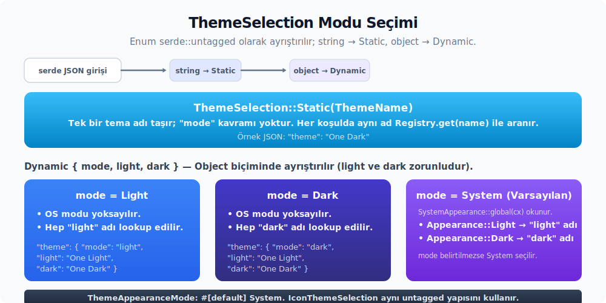

# Ayarlar ve yoğunluk entegrasyonu

Çalışma zamanı çalışır hale geldikten sonra kullanıcı ayarları devreye girer. Bu bölüm tema seçimi, font geçersiz kılma akışları ve UI yoğunluk sözleşmesinin çalışma zamanına nasıl bağlandığını anlatır. Bu üç hat birlikte düşünülür; birindeki karar diğerlerinin davranışını doğrudan etkiler.

---

## 39. Settings entegrasyonu: `ThemeSettings`, `RegisterSetting`, `IntoGpui`, `ThemeSettingsProvider`, font çalışma zamanı API'leri

### Ayar / geçersiz kılma / seçici köprüsü

Zed-benzeri bir kontrol için tek bir `ad: String` yeterli değildir. Minimum settings modeli şu dört özelliği taşımalıdır:

1. **Sabit seçim:** Tek bir tema adı her modda kullanılır.
2. **Dinamik seçim:** `mode + light + dark` üçlüsü tanımlanır; `mode=system` durumunda OS modu hangi adın seçileceğini belirler.
3. **Aktif tema geçersiz kılması:** Geçerli temanın üstüne geçici veya deneysel `ThemeStyleContent` uygulanır.
4. **Tema bazlı geçersiz kılma:** Belirli bir tema adı için özel bir geçersiz kılma haritası tanımlanır.

Zed'e denk düşen ayar sözleşmesi:

> **Sahiplik zinciri (önemli):** `ThemeName`, `IconThemeName`, `ThemeAppearanceMode`, `FontFamilyName`, `DEFAULT_LIGHT_THEME` ve `DEFAULT_DARK_THEME` aslında **`settings_content` crate'inde** tanımlıdır. `theme_settings` crate'i bunları `pub use settings::{...}` ile yeniden ihraç eder; tüketici kod `theme_settings::ThemeName` adıyla erişir. Mirror tarafta tek kaynak `kvs_ayarlari_icerik` (veya muadili) crate'i olmalıdır. `kvs_tema_ayarlari` yalnızca `pub use` ile köprü kurulur. Aynı tipin birden fazla yerde tanımlanması şema ve test çatışmasına yol açar.

> **Flatten ilişkisi:** Zed'de `SettingsContent.theme: Box<ThemeSettingsContent>` alanı `#[serde(flatten)]` ile işaretlidir. Yani kullanıcı ayar dosyasında `theme:` veya `icon_theme:` **iç alan değildir** — `ui_font_size`, `theme`, `icon_theme`, `experimental.theme_overrides`, `theme_overrides`, `unstable.ui_density` gibi tüm alanlar `settings.json`'da **top-level alanlar** olarak yazılır. `SettingsContent` 25'ten fazla alt struct'ını flatten ile birleştirir; kullanıcı tek bir düz JSON görür. Mirror tarafında da `kvs_ayarlari_icerik::AyarIcerik` içinde `pub theme: Box<TemaAyarContent>` alanının `#[serde(flatten)]` ile sarmalanması Zed paritesi için zorunludur. Aksi halde mevcut Zed kullanıcı ayar dosyaları çalışmaz.
>
> Aynı şekilde `UserSettingsContent` `content: Box<SettingsContent>` + `release_channel_overrides` + `platform_overrides` üçlüsünü flatten ile barındırır; üst seviye `profiles: IndexMap<String, SettingsProfile>` ise düz alan olarak kalır.

| API | Alt özellikler | Kısa anlamı |
| :-- | :-- | :-- |
| `SettingsProfile` | `base`, `settings` | İsimli profil geçersiz kılmasıdır; `base=user` mevcut kullanıcı ayarlarının, `base=default` varsayılan ayarların üstüne profil ayarını uygular. |
| `project` | `settings_content` reexport | Proje ve dil/LSP ayar content tiplerini kök `settings_content` yüzeyinden erişilebilir yapar. |

```rust
use std::{collections::HashMap, sync::Arc};

#[derive(Clone, Debug, serde::Serialize, serde::Deserialize)]
#[serde(transparent)]
pub struct ThemeName(pub Arc<str>);

#[derive(Clone, Debug, serde::Serialize, serde::Deserialize)]
#[serde(transparent)]
pub struct IconThemeName(pub Arc<str>);

#[derive(Clone, Copy, Debug, Default, Eq, PartialEq, serde::Serialize, serde::Deserialize)]
#[serde(rename_all = "snake_case")]
pub enum ThemeAppearanceMode {
    Light,
    Dark,
    #[default]
    System,
}

#[derive(Clone, Debug, serde::Serialize, serde::Deserialize)]
#[serde(untagged)]
pub enum ThemeSelection {
    Static(ThemeName),
    Dynamic {
        #[serde(default)]
        mode: ThemeAppearanceMode,
        light: ThemeName,
        dark: ThemeName,
    },
}

#[derive(Clone, Debug, serde::Serialize, serde::Deserialize)]
#[serde(untagged)]
pub enum IconThemeSelection {
    Static(IconThemeName),
    Dynamic {
        #[serde(default)]
        mode: ThemeAppearanceMode,
        light: IconThemeName,
        dark: IconThemeName,
    },
}

pub const DEFAULT_LIGHT_THEME: &str = "One Light";
pub const DEFAULT_DARK_THEME: &str = "One Dark";

#[derive(Clone, Debug, Default, serde::Serialize, serde::Deserialize)]
#[serde(default)]
pub struct ThemeSettingsContent {
    // Font ve typography alanları ilgili bölümde listelenir.
    pub theme: Option<ThemeSelection>,
    pub icon_theme: Option<IconThemeSelection>,

    #[serde(rename = "experimental.theme_overrides")]
    pub experimental_theme_overrides: Option<ThemeStyleContent>,

    pub theme_overrides: HashMap<String, ThemeStyleContent>,
}
```



Örnek bir kullanıcı config'i:

```jsonc
{
  "theme": {
    "mode": "system",
    "light": "One Light",
    "dark": "One Dark"
  },
  "icon_theme": {
    "mode": "system",
    "light": "Material Light",
    "dark": "Material Dark"
  },
  "experimental.theme_overrides": {
    "background": "#101216ff",
    "text": "#e6e8ebff"
  },
  "theme_overrides": {
    "One Dark": {
      "editor.active_line.background": "#222631ff"
    }
  }
}
```

Selection çözümleme fonksiyonları:

```rust
impl ThemeSelection {
    pub fn name(&self, sistem: Appearance) -> ThemeName {
        match self {
            Self::Static(ad) => ad.clone(),
            Self::Dynamic {
                mode: gorunum_modu,
                light: acik,
                dark: koyu,
            } => match gorunum_modu {
                ThemeAppearanceMode::Light => acik.clone(),
                ThemeAppearanceMode::Dark => koyu.clone(),
                ThemeAppearanceMode::System => match sistem {
                    Appearance::Light => acik.clone(),
                    Appearance::Dark => koyu.clone(),
                },
            },
        }
    }

    pub fn mode(&self) -> Option<ThemeAppearanceMode> {
        match self {
            Self::Static(_) => None,
            Self::Dynamic { mode, .. } => Some(*mode),
        }
    }
}

impl IconThemeSelection {
    pub fn name(&self, sistem: Appearance) -> IconThemeName {
        match self {
            Self::Static(ad) => ad.clone(),
            Self::Dynamic {
                mode: gorunum_modu,
                light: acik,
                dark: koyu,
            } => match gorunum_modu {
                ThemeAppearanceMode::Light => acik.clone(),
                ThemeAppearanceMode::Dark => koyu.clone(),
                ThemeAppearanceMode::System => match sistem {
                    Appearance::Light => acik.clone(),
                    Appearance::Dark => koyu.clone(),
                },
            },
        }
    }

    pub fn mode(&self) -> Option<ThemeAppearanceMode> {
        match self {
            Self::Static(_) => None,
            Self::Dynamic { mode, .. } => Some(*mode),
        }
    }
}
```

### `Settings` trait — `ThemeSettings::get_global(cx)` nereden gelir

Zed'in `theme_settings::ThemeSettings` tipi `Settings` trait'ini implement eder:

```rust
pub trait Settings: 'static + Send + Sync + Sized {
    /// Ayar dosyasına her zaman yazılan alan adları (versiyon tag'leri
    /// gibi).
    const PRESERVED_KEYS: Option<&'static [&'static str]> = None;

    /// `SettingsContent` (varsayılan + kullanıcı + proje birleşimi) → çalışma zamanı tipi.
    fn from_settings(content: &SettingsContent) -> Self;

    /// `SettingsStore`'a kaydet (init sırasında).
    fn register(cx: &mut App);

    /// `path` ile yol kapsamlı okuma (proje geçersiz kılması için).
    fn get<'a>(path: Option<SettingsLocation>, cx: &'a App) -> &'a Self;

    /// Global okuma — path::None ile aynı.
    fn get_global(cx: &App) -> &Self;

    /// Yumuşak okuma — `SettingsStore` kuruluysa.
    fn try_get(cx: &App) -> Option<&Self>;

    /// AsyncApp tarafından senkron read (typed setting tipini callback'e ver).
    fn try_read_global<R>(
        cx: &AsyncApp,
        f: impl FnOnce(&Self) -> R,
    ) -> Option<R>;

    /// Çalışma zamanı geçersiz kılması — ayar dosyası değişene kadar geçerli.
    fn override_global(settings: Self, cx: &mut App);
}
```

### `#[derive(RegisterSetting)]` ile otomatik kayıt

Zed'in `Settings`-tipi otomatik kayıt mekanizması iki bileşene dayanır:

```rust
// proc-macro üretimi:
inventory::submit! {
    RegisteredSetting {
        settings_value: || Box::new(SettingValue::<#type_name> { ... }),
        from_settings: |content| Box::new(<#type_name as Settings>::from_settings(content)),
        id: || std::any::TypeId::of::<#type_name>(),
    }
}

// settings_store.rs içinde:
inventory::collect!(RegisteredSetting);

impl SettingsStore {
    fn load_settings_types(&mut self) {
        for kayitli_ayar in inventory::iter::<RegisteredSetting>() {
            self.register_setting_internal(kayitli_ayar);
        }
    }

    pub fn new(cx: &mut App, varsayilan_ayarlar: &str) -> Self {
        let mut store = Self { /* ... */ };
        store.load_settings_types();   // ← link-time tüm ayar tipleri burada toplanır
        store
    }
}
```

**Pratik sonuç:**

`ThemeSettings` aslında `#[derive(Clone, PartialEq, RegisterSetting)]` ile işaretlenir. `theme_settings::init` `ThemeSettings::register(cx)` çağırmaz. Inventory crate'i, `submit!` makrosunun üretildiği yerde static registration yapar. `SettingsStore::new` constructor'ında `inventory::iter::<RegisteredSetting>()` üzerinden tüm linklenen setting tipleri toplanır. Yani üretim akışında setting tiplerini elle `register` etmek gerekmez; bu trait metodu yalnızca testlerde veya `SettingsStore` elle kurulurken kullanılır.

> **Önemli parite notu:** Mirror tarafta inventory deseninin alternatifi elle kaydetmektir. İki yol karıştırılmamalıdır: ya tüm tipler `#[derive(KaydetAyar)]` ile otomatik kaydedilir ya da tamamı elle kaydedilir.

### `ThemeSettings` alan görünürlükleri

`ThemeSettings` struct'ında alanların görünürlüğü Zed paritesinde **karışıktır**:

| Alan | Görünürlük | Erişim yolu |
| ------ | ----------- | ------------- |
| `ui_font_size: Pixels` | **private** | `theme_settings.ui_font_size(cx)` accessor |
| `ui_font: Font` | `pub` | doğrudan alan |
| `buffer_font_size: Pixels` | **private** | `theme_settings.buffer_font_size(cx)` accessor |
| `buffer_font: Font` | `pub` | doğrudan alan |
| `agent_ui_font_size: Option<Pixels>` | **private** | `theme_settings.agent_ui_font_size(cx)` |
| `agent_buffer_font_size: Option<Pixels>` | **private** | `theme_settings.agent_buffer_font_size(cx)` |
| `git_commit_buffer_font_size: Option<Pixels>` | **private** | `theme_settings.git_commit_buffer_font_size(cx)` |
| `markdown_preview_font_family: Option<SharedString>` | **private** | `theme_settings.markdown_preview_font_family()` |
| `markdown_preview_code_font_family: Option<SharedString>` | **private** | `theme_settings.markdown_preview_code_font_family()` |
| `markdown_preview_theme: Option<ThemeSelection>` | `pub` | doğrudan alan |
| `buffer_line_height: BufferLineHeight` | `pub` | doğrudan alan |
| `theme: ThemeSelection` | `pub` | doğrudan alan |
| `experimental_theme_overrides: Option<ThemeStyleContent>` | `pub` | doğrudan alan |
| `theme_overrides: HashMap<String, ThemeStyleContent>` | `pub` | doğrudan alan |
| `icon_theme: IconThemeSelection` | `pub` | doğrudan alan |
| `ui_density: UiDensity` | `pub` | doğrudan alan |
| `unnecessary_code_fade: f32` | `pub` | doğrudan alan |

**Gerekçe:** Font boyutu değerleri `*FontSize` geçersiz kılma global'lerinden etkilenir. Accessor metotlar bu geçersiz kılmayı uygular ve **etkin değeri** döndürür. Doğrudan alan okuması ise ayarlar dosyasındaki ham değeri verir. Bu yüzden font boyutu alanları bilinçli olarak private tutulur. Markdown preview font family alanları da private tutulur; düz markdown metni UI fontuna, inline code ve code block ise buffer fontuna fallback eder.

Mirror tarafta `TemaAyarlari` struct'ında font boyutlarının private tutulması ve accessor metotlarla okunması Zed paritesi açısından zorunludur. Aksi halde geçersiz kılma düşürme davranışı Zed akışından sapar.

**Çalışma akışı:**

1. `SettingsStore::set_global(cx, store)` settings sisteminin init'inde kurulur.
2. `SettingsStore::new`'ün `load_settings_types`'ı inventory'den kayıtlı tipleri otomatik yükler; `ThemeSettings::register(cx)` üretim akışında çağrılmaz.
3. `ThemeSettings::get_global(cx)` çalıştığında `cx.global::<SettingsStore>().get(None)` üzerinden cache'lenmiş güncel `&ThemeSettings` döner.
4. `SettingsLocation { worktree_id, path }` ile yol kapsamlı arama yapıldığında proje-local `.zed/settings.json` geçersiz kılmaları uygulanır.

Mirror tarafında, `kvs_tema` `Settings` trait'ine doğrudan bağımlı değildir. Ancak `kvs_tema_ayarlari` crate'i `kvs_ayarlari::Settings` benzeri bir trait sözleşmesini takip eder. `ThemeSettingsProvider` bu bağlantının soyutlanmış arayüzüdür. `kvs_tema`, sağlayıcıdan typography ve yoğunluk okur; `Settings` trait'ini doğrudan kullanmaz. Otomatik kayıt için `#[derive(KaydetAyar)]` benzeri bir makro mirror edilebilir; alternatif olarak `init` fonksiyonunda elle `Settings::register` çağrılır.

### `IntoGpui` trait — Settings → çalışma zamanı köprüsü

Zed, `*Content` tiplerini GPUI çalışma zamanı tiplerine çevirirken **tek bir trait** kullanır: `settings::IntoGpui`.

```rust
pub trait IntoGpui {
    type Output;
    fn into_gpui(self) -> Self::Output;
}
```

Tüm impl'ler `settings` crate'inde toplanır (mirror tarafında `kvs_ayarlari` veya `kvs_ayarlari_icerik` köprü modülü):

| Kaynak (Content) | Çıktı (Runtime) | Davranış |
| ------------------ | ----------------- | ---------- |
| `FontStyleContent` | `gpui::FontStyle` | Variant 1:1 (Normal/Italic/Oblique) |
| `FontWeightContent` | `gpui::FontWeight` | `FontWeight(self.0.clamp(100., 950.))` — CSS aralığında zorlama |
| `FontFeaturesContent` | `gpui::FontFeatures` | `FontFeatures(Arc::new(map.collect()))` |
| `WindowBackgroundContent` | `gpui::WindowBackgroundAppearance` | Variant 1:1 (Opaque/Transparent/Blurred) |
| `ModifiersContent` | `gpui::Modifiers` | Alan kopyala (`control, alt, shift, platform, function`) |
| `FontSize` | `gpui::Pixels` | `px(self.0)` |
| `FontFamilyName` | `gpui::SharedString` | `SharedString::from(self.0)` (klonsuz `Arc<str>` taşır) |

`ThemeSettings::from_settings` font-bazlı her alanda `into_gpui()` zinciri ile bu trait'i kullanır. İmzası `from_settings(content) -> Self` biçimindedir; bir `Result` döndürmez. Zorunlu alanlar fail-fast ile açılır; `?` operatörüyle dışarı taşınmaz. Aşağıdaki blok bu yüzden sözde-koddur — alan eşlemesinin biçimini gösterir, derlenebilir bir parça değildir (zorunlu alan açma noktaları `‹zorunlu›` ile imlenir):

```text
// sözde-kod — gerçek imza: from_settings(content) -> Self
ui_font_size: clamp_font_size(content.ui_font_size‹zorunlu›.into_gpui()),
ui_font: Font {
    family: content.ui_font_family.as_ref()‹zorunlu›.0.clone().into(),
    features: content.ui_font_features.clone()‹zorunlu›.into_gpui(),
    fallbacks: font_fallbacks_from_settings(content.ui_font_fallbacks.clone()),
    weight: content.ui_font_weight‹zorunlu›.into_gpui(),
    style: Default::default(),
},
```

`‹zorunlu›` ile imlenen her nokta, alan boş geldiğinde başlangıçta fail-fast durur. Bu yüzden `default.json`'un bu alanları doldurması bir sözleşmedir; çalışma zamanı tipi ancak o zaman üretilir.

**Önemli davranış:** `ThemeSettings::from_settings` içinde birçok zorunlu alan fail-fast açılır. Yani **`default.json` bu alanları doldurmak zorundadır**. `ui_font_size`, `ui_font_family`, `ui_font_features`, `ui_font_weight`, `buffer_font_family`, `buffer_font_features`, `buffer_font_weight`, `buffer_font_size`, `buffer_line_height`, `theme`, `icon_theme` ve `unnecessary_code_fade` boş kalırsa çalışma zamanı tipi üretilemez ve başlangıç fail-fast durur. Mirror tarafta `kvs_default_settings.json` bu zorunlu alanları içermelidir.

### Content/çalışma zamanı tip yinelemesi ve `From` impls

Zed'in `theme_settings::settings` modülü çalışma zamanı tarafında `ThemeSelection`, `IconThemeSelection`, `BufferLineHeight` gibi tipleri **yeniden tanımlar**. Bunlar `settings_content` tarafındaki Content tipleriyle aynı varyantlara sahiptir, ama farklı derive list'leri taşır. Aralarındaki köprü `From` implementasyonları üzerinden kurulur:

```rust
impl From<settings::ThemeSelection> for ThemeSelection {
    fn from(s: settings::ThemeSelection) -> Self { /* variant kopyala */ }
}
```

`UiDensity` için ise `pub(crate) fn ui_density_from_settings(val) -> UiDensity` helper'ı bulunur. Bu iki kat tip katmanı kasıtlıdır:

- **Content tipleri** (`settings_content::theme::*`): `JsonSchema, MergeFrom, serde::{Serialize, Deserialize}, strum::EnumDiscriminants` derive'larıyla birlikte gelir; JSON sözleşmesi, şema üretimi ve user/default/project cascade için ayarlanır.
- **Runtime tipleri** (`theme_settings::settings::*`): Daha az derive taşır, çalışma zamanı sıcak yolu için optimize edilir. Seçici UI ile `ThemeSettings.theme.name(appearance)` gibi metotlar burada yer alır.

Mirror tarafta bu yineleme korunmalıdır: `kvs_ayarlari_icerik::TemaSecimi` (content) ve `kvs_tema_ayarlari::TemaSecimi` (runtime), aralarında `From` impl ile bağlanır. Tek tipe indirgeme yapılırsa serde derive'ı çalışma zamanı tarafına taşınır.

Tema uygulama akışı:

```rust
pub fn yapilandirilmis_tema(
    ayarlar: &ThemeSettingsContent,
    cx: &mut App,
) -> anyhow::Result<Arc<Theme>> {
    let kayit = ThemeRegistry::global(cx);
    let sistem = SystemAppearance::global(cx).0;
    let secim = match ayarlar.theme.clone() {
        Some(secim) => secim,
        None => varsayilan_tema_secimi(),
    };
    let ad = secim.name(sistem);

    let mut tema = match kayit.get(&ad.0) {
        Ok(tema) => tema,
        Err(_) => match kayit.get(varsayilan_tema_adi(sistem)) {
            Ok(tema) => tema,
            Err(_) => kayit.get("Kvs Varsayılan Koyu")?,
        },
    };

    tema = tema_gecersiz_kilmalarini_uygula(tema, ayarlar);
    Ok(tema)
}

pub fn tema_gecersiz_kilmalarini_uygula(
    mut tema: Arc<Theme>,
    ayarlar: &ThemeSettingsContent,
) -> Arc<Theme> {
    if let Some(gecersiz_kilmalar) = &ayarlar.experimental_theme_overrides {
        let mut kopya = (*tema).clone();
        temayi_duzenle(&mut kopya, gecersiz_kilmalar);
        tema = Arc::new(kopya);
    }

    if let Some(gecersiz_kilmalar) = ayarlar.theme_overrides.get(tema.name.as_ref()) {
        let mut kopya = (*tema).clone();
        temayi_duzenle(&mut kopya, gecersiz_kilmalar);
        tema = Arc::new(kopya);
    }

    tema
}
```

`modify_theme` aynı düşük seviyeli refinement araçlarını kullanır, ama tam bir `refine_theme` hattı değildir. `window_background_appearance` geçersiz kılınır, `status_colors_refinement` ve `theme_colors_refinement` uygulanır, player ve accent listeleri birleştirilir, syntax geçersiz kılmaları mevcut syntax üstüne bindirilir. Geçersiz kılma işlemi registry'deki orijinal `Arc<Theme>` örneğini değiştirmez; yalnızca bir klon üzerinde çalışır.

> **Önemli fark:** Zed `ThemeSettings::modify_theme` içinde `apply_status_color_defaults` ve `apply_theme_color_defaults` çağırmaz. Yani ayar seviyesindeki `theme_overrides`, yalnızca ön planı verilen status değerinden otomatik arka plan üretmez. `element_selection_background` değerini player selection'dan da türetmez. Bu iki türetme yalnızca tam user theme yüklemesindeki `refine_theme` akışına aittir.

Ayar gözlemcisi:

```rust
pub fn observe_tema_ayarlari(cx: &mut App) {
    let ayarlar = TemaAyarlari::get_global(cx);
    let mut onceki_buffer_font_boyutu_ayari = ayarlar.buffer_font_size_settings();
    let mut onceki_ui_font_boyutu_ayari = ayarlar.ui_font_size_settings();
    let mut onceki_agent_ui_font_boyutu_ayari = ayarlar.agent_ui_font_size_settings();
    let mut onceki_agent_buffer_font_boyutu_ayari = ayarlar.agent_buffer_font_size_settings();
    let mut onceki_git_commit_buffer_font_boyutu_ayari =
        ayarlar.git_commit_buffer_font_size_settings();
    let mut onceki_tema_adi = ayarlar.theme.name(SystemAppearance::global(cx).0);
    let mut onceki_ikon_tema_adi = ayarlar.icon_theme.name(SystemAppearance::global(cx).0);
    let mut onceki_tema_gecersiz_kilmalari = (
        ayarlar.experimental_theme_overrides.clone(),
        ayarlar.theme_overrides.clone(),
    );

    cx.observe_global::<AyarStore>(move |cx| {
        let ayarlar = TemaAyarlari::get_global(cx);
        let buffer_font_boyutu_ayari = ayarlar.buffer_font_size_settings();
        let ui_font_boyutu_ayari = ayarlar.ui_font_size_settings();
        let agent_ui_font_boyutu_ayari = ayarlar.agent_ui_font_size_settings();
        let agent_buffer_font_boyutu_ayari = ayarlar.agent_buffer_font_size_settings();
        let git_commit_buffer_font_boyutu_ayari =
            ayarlar.git_commit_buffer_font_size_settings();
        let tema_adi = ayarlar.theme.name(SystemAppearance::global(cx).0);
        let ikon_tema_adi = ayarlar.icon_theme.name(SystemAppearance::global(cx).0);
        let tema_gecersiz_kilmalari = (
            ayarlar.experimental_theme_overrides.clone(),
            ayarlar.theme_overrides.clone(),
        );

        if buffer_font_boyutu_ayari != onceki_buffer_font_boyutu_ayari {
            onceki_buffer_font_boyutu_ayari = buffer_font_boyutu_ayari;
            reset_buffer_font_size(cx);
        }
        if ui_font_boyutu_ayari != onceki_ui_font_boyutu_ayari {
            onceki_ui_font_boyutu_ayari = ui_font_boyutu_ayari;
            reset_ui_font_size(cx);
        }
        if agent_ui_font_boyutu_ayari != onceki_agent_ui_font_boyutu_ayari {
            onceki_agent_ui_font_boyutu_ayari = agent_ui_font_boyutu_ayari;
            reset_agent_ui_font_size(cx);
        }
        if agent_buffer_font_boyutu_ayari != onceki_agent_buffer_font_boyutu_ayari {
            onceki_agent_buffer_font_boyutu_ayari = agent_buffer_font_boyutu_ayari;
            reset_agent_buffer_font_size(cx);
        }
        if git_commit_buffer_font_boyutu_ayari != onceki_git_commit_buffer_font_boyutu_ayari {
            onceki_git_commit_buffer_font_boyutu_ayari = git_commit_buffer_font_boyutu_ayari;
            reset_git_commit_buffer_font_size(cx);
        }

        if tema_adi != onceki_tema_adi
            || tema_gecersiz_kilmalari != onceki_tema_gecersiz_kilmalari
        {
            onceki_tema_adi = tema_adi;
            onceki_tema_gecersiz_kilmalari = tema_gecersiz_kilmalari;
            temayi_yeniden_yukle(cx);
        }
        if ikon_tema_adi != onceki_ikon_tema_adi {
            onceki_ikon_tema_adi = ikon_tema_adi;
            ikon_temayi_yeniden_yukle(cx);
        }
    }).detach();
}
```

> **Tüm 8 değişken zorunludur:** Gözlemci 5 font boyutu, 2 tema adı ve 1 `theme_overrides` alanını izler. Font boyutları izlenmezse, kullanıcı ayar dosyasında `buffer_font_size`'ı değiştirdiğinde çalışma zamanı eski geçersiz kılma değerini göstermeye devam edebilir.

Tema seçici davranışı:

```text
liste kaynağı:
  ThemeRegistry::list() -> Vec<ThemeMeta { name, appearance }>

önizleme:
  seçici içinde highlight değişince GlobalTheme::update_theme ile
  geçici tema uygulanır, refresh_windows çağrılır

onay:
  ayar dosyası ThemeSelection olarak güncellenir:
    - Static ise seçilen ad tek değer olur
    - Dynamic ise seçilen temanın appearance'ına göre light/dark slot'u güncellenir
    - mode=system ve seçilen tema sistem görünümünden farklıysa mode light/dark'a çekilir

vazgeç/iptal:
  açılıştaki tema adı saklanır; seçici kapanınca onay verilmediyse
  önizleme öncesi tema geri yüklenir ve refresh_windows çağrılır
```

Bu modelle uygulama, Zed'deki gibi iki davranışı da sunar: kullanıcı ister tek tema seçer, ister sistem moduna göre light/dark temaları ayrı tutar.

### Ayar mutator helper'ları (Zed paritesi)

Zed `theme_settings` crate'inde **çalışma zamanı global'ini değil**, kullanıcı ayar dosyasının `SettingsContent` AST'ini güvenli biçimde değiştiren üç public helper sunar:

```rust
// theme_settings::settings içinde:
pub fn set_theme(
    current: &mut SettingsContent,
    theme_name: impl Into<Arc<str>>,
    theme_appearance: Appearance,
    system_appearance: Appearance,
);

pub fn set_icon_theme(
    current: &mut SettingsContent,
    icon_theme_name: IconThemeName,
    appearance: Appearance,
);

pub fn set_mode(content: &mut SettingsContent, mode: ThemeAppearanceMode);
```

| Fonksiyon | İş yaptığı yer | Karar mantığı |
| ----------- | ---------------- | --------------- |
| `set_theme` | `settings.theme.theme` (`Option<ThemeSelection>`) | `Static` ise adı değiştirir, `Dynamic` ise `theme_appearance`'a göre `light` veya `dark` slot'unu günceller. `mode == System` iken seçilen appearance sistem appearance'ından farklıysa `mode`'u seçilen tarafa kilitler |
| `set_icon_theme` | `settings.theme.icon_theme` | `Dynamic` modda mevcut mode'a göre `light` veya `dark` slot'unu yazar; `Static` durumunda tek slot'u günceller. |
| `set_mode` | `settings.theme.theme` **ve** `settings.theme.icon_theme` | Tema tarafında: mevcut `Static` seçimi `Dynamic { mode = System, light = DEFAULT_LIGHT_THEME, dark = DEFAULT_DARK_THEME }` ile değiştirir; mevcut `Dynamic` ise yalnızca `mode`'u günceller. İkon tarafında: `Static` seçimi `Dynamic { mode, light = mevcut ikon, dark = mevcut ikon }`'e çevirir; `Dynamic` ise yalnızca `mode`'u günceller |

**`kvs_tema` karşılığı:** Bu üç fonksiyon `kvs_tema` çalışma zamanı API'sinin değil, seçici / settings UI köprüsünün sorumluluğudur. Mirror crate yapısında ya `kvs_tema_ayarlari` ya da `kvs_secici` modülünde tutulur. Seçici onay akışında dosya yazma sırası şöyle kurulur:

```rust
pub fn secimi_onayla(
    secilen: &ThemeMeta,
    cx: &mut App,
) -> anyhow::Result<()> {
    let sistem = SystemAppearance::global(cx).0;

    // 1. Önce bellek içindeki SettingsContent'i değiştir.
    let mut icerik = SettingsStore::global(cx).user_settings_content().clone();
    set_theme(&mut icerik, secilen.name.clone(), secilen.appearance, sistem);

    // 2. Diske kalıcı yaz (file watcher yeniden yüklemeyi tetikler).
    SettingsStore::global(cx).write_user_settings(icerik)?;

    // 3. Gözlemci reload_theme'i çağırır; açıkça
    //    GlobalTheme::update_theme + refresh_windows burada gerekmez.
    Ok(())
}
```

**Dikkat noktası:** Seçici önizlemesi için `GlobalTheme::update_theme` + `refresh_windows` çağrıldıktan sonra kullanıcı onay yerine vazgeç seçerse, settings dosyası yazılmamış olur ama çalışma zamanı hâlâ önizleme temasını gösterir. İptal akışında önizleme öncesi tema adı saklanmalı ve `GlobalTheme::update_theme(cx, eski)` ile geri yüklenmelidir.

### `reload_theme` / `reload_icon_theme` — observer reaksiyonu

Zed `theme_settings` crate'inde iki public reload helper'ı tanımlar:

```rust
pub fn reload_theme(cx: &mut App);
pub fn reload_icon_theme(cx: &mut App);
```

Davranış:

1. `configured_theme(cx)` (veya `configured_icon_theme(cx)`) ile aktif seçimi ve geçersiz kılmaları yeniden çözülür.
2. `GlobalTheme::update_theme` veya `update_icon_theme` ile global'i yazılır.
3. `cx.refresh_windows()` çağrılır.

Settings gözlemcisi (`init` içindeki `cx.observe_global::<SettingsStore>`) font boyutu, tema adı, ikon tema adı veya tema geçersiz kılmalarının değiştiğini fark ettiğinde ilgili yeniden yükleme helper'ını çağırır.

`kvs_tema` mirror tarafında bu iki fonksiyon `pub fn temayi_yeniden_yukle(cx)` ve `pub fn icon_temayi_yeniden_yukle(cx)` olarak yer alır; gözlemciyi kuran `init` fonksiyonu da Zed'deki `theme_settings::init`'in karşılığıdır.

### Sistem mod takipli otomatik tema

```rust
pub fn sistem_modu_tema_takibini_gozle(
    window: &mut Window,
    cx: &mut Context<impl 'static>,
) {
    cx.observe_window_appearance(window, |_, window, cx| {
        let kategori = match window.appearance() {
            WindowAppearance::Dark | WindowAppearance::VibrantDark => Appearance::Dark,
            WindowAppearance::Light | WindowAppearance::VibrantLight => Appearance::Light,
        };

        // SystemAppearance değerini güncelle.
        *SystemAppearance::global_mut(cx) = SystemAppearance(kategori);

        // Mevcut temanın appearance değeri sistemle uyumlu mu?
        let mevcut = cx.theme();
        if mevcut.appearance != kategori {
            let ad = match kategori {
                Appearance::Dark => "Kvs Varsayılan Koyu",
                Appearance::Light => "Kvs Varsayılan Açık",
            };
            let _ = temayi_degistir(ad, cx);
        }
    }).detach();
}
```

### Tema reload

Kullanıcı tema dosyasını editörden değiştirdiğinde uygulamanın yeniden okumaya geçmesi:

```rust
pub fn tema_dosyasini_yeniden_yukle(
    yol: &Path,
    cx: &mut App,
) -> anyhow::Result<()> {
    let baytlar = std::fs::read(yol)?;
    let aile: ThemeFamilyContent = serde_json_lenient::from_slice(&baytlar)?;

    let taban_koyu = fallback::kvs_default_dark();
    let taban_acik = fallback::kvs_default_light();

    let kayit = ThemeRegistry::global(cx);
    let temalar: Vec<Theme> = aile
        .themes
        .into_iter()
        .map(|tema_icerigi| {
            let taban = match tema_icerigi.appearance {
                AppearanceContent::Dark => &taban_koyu,
                AppearanceContent::Light => &taban_acik,
            };
            Theme::from_content(tema_icerigi, taban)
        })
        .collect();
    kayit.insert_themes(temalar);  // Aynı isim üzerine yazar.

    // Aktif tema yeniden yüklendi mi? Yeniden kurarak gözlemcileri tetikle.
    let aktif_ad = cx.theme().name.clone();
    if let Ok(yeni) = kayit.get(&aktif_ad) {
        GlobalTheme::update_theme(cx, yeni);
        cx.refresh_windows();
    }

    Ok(())
}
```

**Akış:**

1. Disk'ten okunur ve parse edilir.
2. Her tema varyantı için uygun taban seçilir.
3. `kayit.insert_themes` çağrısı eski kaydın üstüne yazar — aynı isim güncellenir.
4. Aktif tema yeniden yüklendiyse `GlobalTheme::update_theme` ile global güncellenir ve `refresh_windows` çağrılır.

### Başarım

| Operasyon | Süre | Sıcak yol? |
| ----------- | ------ | ----------- |
| `kayit.get(ad)` | O(1) HashMap araması | Sık (her tema değişiminde) |
| `GlobalTheme::update_theme` | Global güncelleme + gözlemci tetiklemesi | Sık |
| `refresh_windows` | Tüm açık view ağaçları | Sık |
| `Theme::from_content` (yeniden yükleme) | ~25–60 µs | Nadir |
| Tek tema değişimi toplam | ~2–5 ms (sonraki frame'de görünür) | Kullanıcı tetikler |

### Dikkat Noktaları

1. **`kayit.get` sonucunu hatasız varsaymak**: Hata UI'da görünür kılınmalı, çalışma zamanı kırılmasına dönüşmemelidir. `?` ile yayma ya da bir match deseni kullanılır.
2. **Sistem mod takipli akışta kullanıcı tercihinin ezilmesi**: `ayar.mod_takibi` bayrağı ile koşullu çalıştırma yerinde olur.
3. **Async yeniden yüklemede `cx` lifetime'ı**: `cx.spawn` içinde `cx` `AsyncApp`'tir; sync bağlama `cx.update(|cx| ...)` ile geçiş yapılır.

---

### `ThemeSettingsProvider` — settings entegrasyon trait'i

**Kaynak:** `theme` crate'i.

Hedeflenen Zed referansında `theme`, `theme_settings`'i **doğrudan tüketmez**. Bunun yerine `ThemeSettingsProvider` adında bir trait sunar. Settings crate'i bu trait'i implement eder ve `theme` çalışma zamanında sağlayıcıyı sorgular. Böylece bağımlılık yönü temiz kalır: tema crate'i settings'e bağımlı değildir; settings crate'i tema'ya bir hizmet sunar.

```rust
use gpui::{App, Font, Pixels};

pub trait ThemeSettingsProvider: Send + Sync + 'static {
    fn ui_font<'a>(&'a self, cx: &'a App) -> &'a Font;
    fn buffer_font<'a>(&'a self, cx: &'a App) -> &'a Font;
    fn ui_font_size(&self, cx: &App) -> Pixels;
    fn buffer_font_size(&self, cx: &App) -> Pixels;
    fn ui_density(&self, cx: &App) -> UiDensity;
}

pub fn set_theme_settings_provider(saglayici: Box<dyn ThemeSettingsProvider>, cx: &mut App);
pub fn theme_settings(cx: &App) -> &dyn ThemeSettingsProvider;
```

**Sözleşme sınırı:** Bu trait aktif tema adını veya aktif icon tema adını döndürmez. Zed'de sağlayıcı yalnızca typography ve yoğunluk okumaları için vardır. Seçici durumunu `ThemeSettingsContent.theme` ve `ThemeSettingsContent.icon_theme` alanlarından çözersiniz.

**`kvs_tema`'da karşılığı:**

```rust
use gpui::{App, Font, Pixels};

pub trait TemaAyarSaglayici: Send + Sync + 'static {
    fn ui_font<'a>(&'a self, cx: &'a App) -> &'a Font;
    fn buffer_font<'a>(&'a self, cx: &'a App) -> &'a Font;
    fn ui_font_size(&self, cx: &App) -> Pixels;
    fn buffer_font_size(&self, cx: &App) -> Pixels;
    fn ui_density(&self, cx: &App) -> UiDensity;
}

struct GlobalTemaAyarSaglayici(Box<dyn TemaAyarSaglayici>);
impl Global for GlobalTemaAyarSaglayici {}

pub fn set_tema_ayar_saglayici(saglayici: Box<dyn TemaAyarSaglayici>, cx: &mut App) {
    cx.set_global(GlobalTemaAyarSaglayici(saglayici));
}

pub fn tema_ayarlari(cx: &App) -> &dyn TemaAyarSaglayici {
    &*cx.global::<GlobalTemaAyarSaglayici>().0
}
```

**Bağlama akışı:**

```rust
struct KvsAyarSaglayici;

impl TemaAyarSaglayici for KvsAyarSaglayici {
    fn ui_font<'a>(&'a self, cx: &'a App) -> &'a Font {
        &kvs_ayarlari::get(cx).ui_font
    }
    fn buffer_font<'a>(&'a self, cx: &'a App) -> &'a Font {
        &kvs_ayarlari::get(cx).buffer_font
    }
    fn ui_font_size(&self, cx: &App) -> Pixels {
        kvs_ayarlari::get(cx).ui_font_size
    }
    fn buffer_font_size(&self, cx: &App) -> Pixels {
        kvs_ayarlari::get(cx).buffer_font_size
    }
    fn ui_density(&self, cx: &App) -> UiDensity {
        kvs_ayarlari::get(cx).ui_density
    }
}

fn uygulamayi_baslat(platform: std::rc::Rc<dyn gpui::Platform>) {
    Application::with_platform(platform).run(|cx| {
        if let Err(hata) = kvs_tema::init(LoadThemes::All(Box::new(KvsVarliklari)), cx) {
            tracing::error!("tema sistemi başlatılamadı: {}", hata);
            return;
        }
        kvs_ayarlari::init(cx);
        kvs_tema::set_tema_ayar_saglayici(Box::new(KvsAyarSaglayici), cx);
        // ...
    });
}
```

**Neden bir trait?**

- Tema crate'i `settings` crate'inin tipini bilmez; yalnızca davranışını sözleşme olarak kabul eder.
- Test ortamında `MockTemaAyarSaglayici` enjekte edilebilir; gerçek bir ayar store'u kurmaya gerek kalmaz.
- Ayar dosya formatı değişirse trait imzası değişmeden kalır.

**`ThemeSettingsContent` alan modeli:**

`settings_content` crate'i tarafındaki ayar şeması sağlayıcıdan daha geniştir; kullanıcı ayar dosyası burada temsil edilir. `ThemeSettingsContent` şu alanları taşır:

```text
ui_font_size, ui_font_family, ui_font_fallbacks, ui_font_features,
ui_font_weight, buffer_font_family, buffer_font_fallbacks,
buffer_font_size, buffer_font_weight, buffer_line_height,
buffer_font_features, agent_ui_font_size, agent_buffer_font_size,
git_commit_buffer_font_size,
markdown_preview_font_family, markdown_preview_code_font_family,
markdown_preview_theme, theme, icon_theme, ui_density,
unnecessary_code_fade, experimental_theme_overrides, theme_overrides
```

Bu alanların yardımcı tipleri de şemaya dahildir:

| Tip | Rol | Kritik sözleşme |
| ----- | ----- | ----------------- |
| `ThemeSettingsContent` | Kullanıcı ayar dosyasındaki tema/font/density alanları | 23 alan; container düzeyinde `#[with_fallible_options]`, `#[serde(default)]` ise alan bazlı (örneğin `theme_overrides`) uygulanır; `MergeFrom` davranışı korunur |
| `FontSize` | `f32` pixel newtype'ı | Serialize edilirken iki ondalık basamak tutar |
| `FontFamilyName` | font family adı | `#[serde(transparent)]`, `Arc<str>` |
| `FontFeaturesContent` | OpenType feature map'i | 4 karakter alfanumerik key; boolean veya unsigned integer value |
| `BufferLineHeight` | `comfortable`, `standard`, `custom(f32)` | custom değer `>= 1.0` olmalıdır |
| `CodeFade` | gereksiz kod fade oranı | şema aralığı `0.0..=0.9` |
| `DEFAULT_LIGHT_THEME` / `DEFAULT_DARK_THEME` | ayar yedek adları | `"One Light"` / `"One Dark"` tek kaynak olarak korunur |
| `ThemeSelectionDiscriminants`, `IconThemeSelectionDiscriminants`, `BufferLineHeightDiscriminants` | Content enum'larının variant/discriminant görünümü | Selector UI, şema ve strum tabanlı variant listelerinde content enum varyantlarını ayrı tip olarak görünür kılar |

`agent_ui_font_size`, `agent_buffer_font_size` ve `git_commit_buffer_font_size` sağlayıcı trait'inde yer almaz; her biri kendi tüketici alanında ayar katmanında kalır. `git_commit_buffer_font_size` varsayılanı 12 pikseldir; git paneli ve commit modal'ındaki editörün yazı tipi boyutunu diğer tampon boyutlarından bağımsız olarak denetler. `theme`, `icon_theme`, `markdown_preview_theme`, `experimental.theme_overrides` ve `theme_overrides` seçici ve geçersiz kılma akışına gider; typography helper'ları ise sağlayıcı üzerinden `ui_font`, `buffer_font`, `ui_font_size`, `buffer_font_size` ve `ui_density` değerlerini okur. `markdown_preview_code_font_family` sağlayıcı trait'ine eklenmez; markdown preview tüketicisi `ThemeSettings` üzerinden okur. Değer boşsa `buffer_font.family` kullanır.

Tema renklerini tüketen her ayar `ThemeSettingsContent` içine girmez. `completion_menu_item_kind` bunun yeni örneğidir: şema sahibi `EditorSettingsContent`'tir, değerleri `off` ve `symbol` olur, default `off`'tur. `symbol` açıldığında completion menüsü aktif syntax theme'den capture rengi okur; bu yüzden tema dokümantasyonunda ele alınır, ama `ThemeSettingsProvider` veya `ThemeSettingsContent` sözleşmesine eklenmez. Eski ad, alias veya geriye uyumluluk katmanı tanımlanmaz.

| API | Alt özellikler | Kısa anlamı |
| :-- | :-- | :-- |
| `EditorSettingsContent` | `completion_menu_item_kind` dahil editor ayar alanları | Tema rengi tüketebilen editor davranışlarının şema sahibidir; bu ayarlar `ThemeSettingsContent` içine taşınmaz. |

### Font ayarları çalışma zamanı API'leri (`adjust_*`, `reset_*`, geçersiz kılma global'leri)

**Kaynak modüller:** `theme_settings` crate'i.

Zed font ölçeklemesini iki katmanlı çalıştırır: ayar dosyasındaki taban değer (`ThemeSettings.{ui,buffer,agent_ui,agent_buffer}_font_size`) ve **çalışma zamanı geçersiz kılma global'leri**. Geçersiz kılma global'i set edildiğinde `ThemeSettings::*_font_size(cx)` accessor'ı önce global'i okur; yoksa settings değerine düşer. Böylece kullanıcı `cmd-+`/`cmd--` ile font'u geçici olarak büyütebilir. Settings dosyası yazılmaz.

```rust
struct BufferFontSize(Pixels);               // private
pub(crate) struct UiFontSize(Pixels);        // crate-içi
pub struct AgentUiFontSize(Pixels);          // public
pub struct AgentBufferFontSize(Pixels);      // public
pub struct GitCommitBufferFontSize(Pixels);  // public, settings.rs

impl Global for BufferFontSize {}      // ... her biri için
```

| API | Alt özellikler | Kısa anlamı |
| :-- | :-- | :-- |
| `GitCommitBufferFontSize` | `Pixels` newtype, `Global` impl | Commit mesajı buffer font size geçersiz kılmasını çalışma zamanı global'i olarak taşır; `adjust_git_commit_buffer_font_size` set eder, `reset_git_commit_buffer_font_size` kaldırır. |

Public yüzey:

```rust
// Düzenle (callback ile)
pub fn adjust_buffer_font_size(cx: &mut App, f: impl FnOnce(Pixels) -> Pixels);
pub fn adjust_ui_font_size(cx: &mut App, f: impl FnOnce(Pixels) -> Pixels);
pub fn adjust_agent_ui_font_size(cx: &mut App, f: impl FnOnce(Pixels) -> Pixels);
pub fn adjust_agent_buffer_font_size(cx: &mut App, f: impl FnOnce(Pixels) -> Pixels);
pub fn adjust_git_commit_buffer_font_size(cx: &mut App, f: impl FnOnce(Pixels) -> Pixels);

// Geçersiz kılmayı kaldır → ayar değerine düş
pub fn reset_buffer_font_size(cx: &mut App);
pub fn reset_ui_font_size(cx: &mut App);
pub fn reset_agent_ui_font_size(cx: &mut App);
pub fn reset_agent_buffer_font_size(cx: &mut App);
pub fn reset_git_commit_buffer_font_size(cx: &mut App);

// ±1 px convenience
pub fn increase_buffer_font_size(cx: &mut App);
pub fn decrease_buffer_font_size(cx: &mut App);

// Yardımcılar (settings.rs)
pub fn clamp_font_size(size: Pixels) -> Pixels;
pub fn adjusted_font_size(size: Pixels, cx: &App) -> Pixels;
pub fn observe_buffer_font_size_adjustment<V: 'static>(
    cx: &mut Context<V>,
    f: impl 'static + Fn(&mut V, &mut Context<V>),
) -> Subscription;
pub fn setup_ui_font(window: &mut Window, cx: &mut App) -> gpui::Font;
```

`adjust_*` her zaman aynı 4 adımı izler:

1. `ThemeSettings::get_global(cx).*_font_size(cx)` (veya `*_font_size_settings()`) ile **mevcut baz değer** okunur.
2. `cx.try_global::<*FontSize>().map_or(base, |g| g.0)` ile geçersiz kılma varsa o değer, yoksa baz değer alınır.
3. Callback çağrılır; sonuç `clamp_font_size` ile `[MIN_FONT_SIZE, MAX_FONT_SIZE]` aralığına sıkıştırılır ve `cx.set_global(*FontSize(...))` ile yazılır.
4. `cx.refresh_windows()` çağrılır.

`reset_*` ise `cx.has_global::<*FontSize>()` durumunda `remove_global` ve ardından `refresh_windows` çalıştırır. Geçersiz kılma yoksa no-op'tur; gereksiz yeniden çizim üretmez.

**Sayısal sabitler** (`theme_settings` crate'i):

```rust
const MIN_FONT_SIZE: Pixels = px(6.0);
const MAX_FONT_SIZE: Pixels = px(100.0);
const MIN_LINE_HEIGHT: f32 = 1.0;
```

`clamp_font_size` bu iki const'a göre sıkıştırma yapar. `MIN_LINE_HEIGHT` ise `ThemeSettings::line_height()` accessor'ında kullanılır:

```rust
pub fn line_height(&self) -> f32 {
    f32::max(self.buffer_line_height.value(), MIN_LINE_HEIGHT)
}
```

Yani `BufferLineHeight::Custom(0.5)` gibi geçersiz değerler bile accessor seviyesinde `1.0`'a yükseltilir. `deserialize_line_height` parse aşamasında zaten 1.0 alt sınırını zorlar; accessor tarafındaki kontrol ise bellek içi geçersiz kılma veya bug durumlarına karşı ikinci savunmadır. Mirror tarafta aynı çift koruma uygulanmalıdır.

**Settings gözlemcisi ilişkisi:** `theme_settings::init` içindeki observer, ayar dosyasındaki taban değer değiştiğinde geçersiz kılmayı **otomatik olarak sıfırlar** (`reset_*` çağırır). Yani kullanıcı `cmd-+` ile büyüttüğü font'u settings dosyası üzerinden düzenlediğinde geçersiz kılma düşürülür. Settings dosyası hakikat kaynağı rolünü korur.

**`kvs_tema` karşılığı:** Bu API ailesi `kvs_tema` çalışma zamanı crate'inin değil, **settings/UI köprüsünün** sorumluluğudur. Mirror tarafta üç strateji vardır:

| Strateji | Açıklama | Ne zaman |
| ---------- | ---------- | ---------- |
| Sağlayıcı trait'ini genişletme | `TemaAyarSaglayici`'a `adjust_*`/`reset_*` eklenir | `kvs_tema` tüketicilerinin font değişimini dinlemesi gerekiyorsa |
| Sade newtype mirror | `BufferFontSize` vb. global'leri `kvs_tema_ayarlari` crate'inde tutulur, `adjust_*`/`reset_*` orada implement edilir | Settings UI'sı bağımsız bir crate olduğunda |
| Kapsam dışı bırakma | UI yoksa hiç mirror edilmez | Font picker kapsam dışı bırakıldıysa |

Sözleşme parite bayrağı şudur: bu fonksiyonlar `kvs_tema` public API'sinde yer almaz.

---

## 40. `UiDensity` — UI yoğunluk ayarı

**Kaynak:** `theme` crate'i.

```rust
#[derive(
    Debug, Default, PartialEq, Eq, PartialOrd, Ord, Hash, Clone, Copy,
    serde::Serialize, serde::Deserialize, schemars::JsonSchema,
)]
#[serde(rename_all = "snake_case")]
pub enum UiDensity {
    Compact,
    #[default]
    Default,
    Comfortable,
}
```

**Rol:** Kullanıcının UI'da tercih ettiği yoğunluğu temsil eder. Buton padding'leri, liste item yükseklikleri ve panel iç boşlukları bu enuma göre ölçeklenir.

**Tema sözleşmesindeki yeri:** `UiDensity` `Theme` içinde **yer almaz**. Ayrı bir kullanıcı tercihi olarak `TemaAyarSaglayici` üzerinden okunur. `ThemeColors` ile karıştırılmamalıdır; bu bir renk değil, boyut tercihidir.

> **Content/çalışma zamanı tip yinelemesi:** `UiDensity` Zed'de **iki yerde** tanımlıdır:
>
> - `settings_content::theme::UiDensity`: content tipi, `JsonSchema + MergeFrom + Serialize + Deserialize` derive'larıyla beraber.
> - `theme::ui_density::UiDensity`: çalışma zamanı tipi.
>
> Aralarındaki köprü `theme_settings::settings::ui_density_from_settings` adındaki `pub(crate)` bir helper'dır; `From` trait kullanılmaz; çünkü iki tipin değişik derive zincirleri arasındaki dönüşüm `theme_settings` crate'i içinde özel kalır. `ThemeSettings::from_settings` bu helper'ı `ui_density` alanı boşsa default yoğunlukla çağırır.
>
> Mirror tarafta aynı yineleme zorunlu değildir; tek bir `UiDensity` tipi kullanılabilir. Ancak `JsonSchema`/`MergeFrom` derive zincirini çalışma zamanı sıcak yoluna eklemek istenmiyorsa ayrım korunur.

**Tüketici kullanım deseni:**

```rust
pub fn yogunluk_boslugu(yogunluk: UiDensity) -> Pixels {
    match yogunluk {
        UiDensity::Compact     => px(6.0),
        UiDensity::Default     => px(8.0),
        UiDensity::Comfortable => px(12.0),
    }
}

impl Render for AracCubugu {
    fn render(&mut self, _window: &mut Window, cx: &mut Context<Self>) -> impl IntoElement {
        let yogunluk = kvs_tema::tema_ayarlari(cx).ui_density(cx);
        let renkler = cx.theme().colors();

        div()
            .p(yogunluk_boslugu(yogunluk))
            .bg(renkler.background)
            .child("...")
    }
}
```

**`bilesen_rehberi.md` ile köprü:** `DynamicSpacing::BaseXX.px(cx)` helper'ı zaten `UiDensity`'i bilir — `ui::ui_density(cx)` ile şu anki yoğunluk sorgulanır. Bağımsız bir component crate kullanılıyorsa `tema_ayarlari(cx).ui_density(cx)` çağrısının GPUI spacing helper'larına bağlanması gerekir.

**JSON kullanıcı ayarı:**

```jsonc
{
  "unstable.ui_density": "comfortable"
}
```

> **JSON anahtarı `"unstable.ui_density"`'dir**. `ThemeSettingsContent.ui_density` alanı `#[serde(rename = "unstable.ui_density")]` ile işaretlenir. Düz bir `"ui_density"` anahtarı **tanınmaz**, parse aşamasında `None` kalır ve default değer (`UiDensity::Default`) etkin olur. Mirror tarafta aynı rename konulmalıdır; çünkü hedeflenen Zed sözleşmesinde geçerli anahtar budur.
