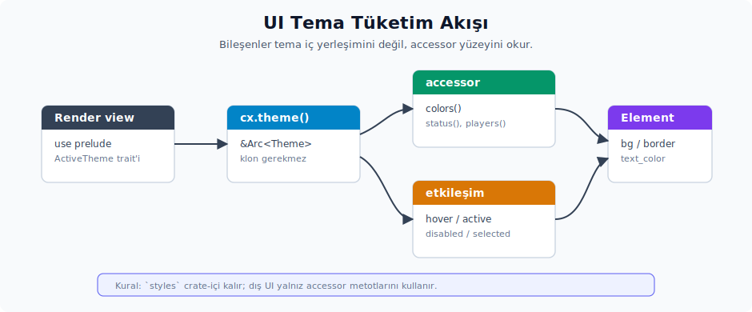

# UI tüketimi ve etkileşim renkleri

Bileşen tarafında tema okuma yolu `cx.theme()` çağrısıdır. Hover, active, disabled ve selected gibi durumlar da tema alanlarından beslenir. Bu bölüm, bileşenlerin tema değerlerine nasıl ulaştığını ve etkileşim durumlarında hangi alanları kullanması gerektiğini anlatır.



---

## 41. `cx.theme()` ile bileşen renklendirme

**Tüketici sözleşmesi:** UI bileşenleri tema değerlerine `cx.theme()` çağrısı üzerinden erişir. Bu çağrı `&Arc<Theme>` döndürür; klon ve bellek ayırma üretmeden okuma yaparsın.

### Temel kalıp

```rust
use gpui::{div, prelude::*, App, Window, Context};
use kvs_tema::ActiveTheme;

struct AnaPanel;

impl Render for AnaPanel {
    fn render(
        &mut self,
        _w: &mut Window,
        cx: &mut Context<Self>,
    ) -> impl IntoElement {
        let tema = cx.theme();
        div()
            .bg(tema.colors().background)
            .text_color(tema.colors().text)
            .border_1()
            .border_color(tema.colors().border)
            .p_4()
            .child("Merhaba")
    }
}
```

**Üç gereklilik:**

1. **`use kvs_tema::ActiveTheme;`** — trait import edilmediği takdirde `cx.theme()` çağrısı "method not found" hatasıyla karşılaşır.
2. **`let tema = cx.theme();`** — `&Arc<Theme>` döndürdüğü için `&self` borrow gibi davranır; render içinde tek seferlik bağlamayla yetinilir.
3. **Alan erişimi** — `styles` crate-içi olduğundan, tüketici `tema.colors().background` gibi accessor'lar üzerinden okur.

### Erişim yolları kıyaslaması

```rust
// Accessor metotları (dış crate için zorunlu yol)
let bg = tema.colors().background;
let muted = tema.colors().text_muted;
let error = tema.status().error;
let local = tema.players().local().cursor;
```

**Accessor metotları neden tercih edilir?** `styles` alanı tema modelinin iç yerleşimidir; tüketici bileşenlerin bu iç yerleşime bağlanması istenmez. Accessor yöntemi, mevcut Zed sözleşmesinde okunacak alanı `theme.colors()` gibi açık bir kapıdan verir ve UI kodunu daha anlaşılır tutar.

### Runtime renk ailelerini UI'da tüketme

`ThemeStyles`, `ThemeColors`, `StatusColors`, `PlayerColors`, `AccentColors`, `SystemColors` ve `SyntaxTheme` runtime veri modelinin parçalarıdır; UI tarafında çoğunlukla bu tipleri doğrudan kurmazsın, aktif `Theme` üzerinden okursun. Bu ayrım önemlidir: bileşen kodu tema üreticisi değildir, tema tüketicisidir.

| Runtime tipi | UI'daki erişim yolu | Kullanım |
|--------------|---------------------|----------|
| `ThemeStyles` | Doğrudan okunmaz; `Theme` accessor'ları üzerinden parçalanır. | Tema iç yapısını bir arada tutan kap. |
| `ThemeColors` | `cx.theme().colors()` | Yüzey, metin, icon, border, editor, terminal ve interaction renkleri. |
| `StatusColors` | `cx.theme().status()` | Error, warning, info, success, git/diff ve benzeri durum renkleri. |
| `PlayerColors` | `cx.theme().players()` | Collab cursor, selection, agent/remote participant ve Mermaid/git graph gibi döngüsel renkler. |
| `AccentColors` | `cx.theme().accents()` | İndent guide, rainbow bracket, grafik dilimi gibi index bazlı vurgu renkleri. |
| `SystemColors` | `cx.theme().system()` | `transparent` ve platform kromu için macOS traffic light renkleri. |
| `SyntaxTheme` | `cx.theme().syntax()` | Tree-sitter capture adlarından `HighlightStyle` çözme. |

`ThemeColorField` ve `all_theme_colors(cx)` normal bileşen render'ı için değil, tema editörü, color picker, debug inspector ve snapshot ekranı için düşünülür. `ThemeColorField` `ThemeColors` alanlarının reflection alt kümesini isimlendirir; `all_theme_colors(cx)` aktif temadan bu alanları `(Hsla, SharedString)` listesi olarak verir. Bir button arka planı çizeceksen `all_theme_colors` dolaşmazsın; doğrudan `theme.colors().element_background` okursun.

```rust
let tema = cx.theme();
let colors = tema.colors();
let status = tema.status();
let oyuncular = tema.players();

let hata_rengi = status.diagnostic().error;
let yerel_secim = oyuncular.local().selection;
let katilimci = oyuncular.color_for_participant(katilimci_indeksi);
let salt_okunur = oyuncular.read_only();
let yok_katilimci = oyuncular.absent();
```

`StatusColors::diagnostic()` yalnızca üçlü bir `DiagnosticColors` görünümü üretir: `error`, `warning` ve `info`. Diagnostic panel, inline error stripe veya status badge bu üç alanı okuyabilir; ama `created`, `deleted`, `modified` gibi VCS renkleri bu helper'da yoktur. Onlar için doğrudan `theme.status().created` gibi alan okursun.

`PlayerColor` tek katılımcının `cursor`, `background` ve `selection` üçlüsüdür. `PlayerColors::color_for_participant(index)` local oyuncuyu atlayıp remote katılımcılar arasında modulo ile döner; bu yüzden collab katılımcı rengi seçerken kullanılır. `PlayerColors::read_only()` local rengi grayscale'e çeker; salt-okunur veya pasif kullanıcı göstergesinde işe yarar. `PlayerColors::absent()` ise son renk slot'unu döndürür ve bulunmayan/ayrılmış katılımcı durumunda kullanılır. Liste boşsa bu helper'ların güvenli çalışması beklenmez; fallback tema en az bir player rengi sağlamalıdır.

`AccentColors::color_for_index(index)` index'i accent listesine modulo ile sarar. Bu API, sınırsız sayıda indent guide veya Mermaid pie dilimi gibi tekrar eden görsel slotlarda kullanışlıdır. `default_color_scales()` ise `ColorScales` ailesinin built-in palet matrisini üretir; sıradan UI bileşeni bunu çağırmaz. Fallback tema veya tema editörü, scale tabanlı palette preview üretirken bu fonksiyona ihtiyaç duyar.

`SystemColors::transparent` özel bir `Hsla` değeridir ve şeffaf border/background placeholder'larında kullanılır. macOS traffic light alanları ise titlebar/pencere kromu içindir; form bileşenlerinde status rengi gibi kullanılmaz.

### Prelude modül deseni

`kvs_tema` her render dosyasında üç ayrı import gerektirebilir:

```rust
use kvs_tema::ActiveTheme;
use kvs_tema::Theme;
use kvs_tema::Appearance;
```

Prelude modülü bu üç import'u tek satıra indirir:

```rust
// kvs_tema/src/prelude.rs
pub use crate::runtime::ActiveTheme;
pub use crate::{Appearance, Theme, ThemeFamily};
pub use crate::styles::*;
```

Tüketici tarafından kullanım:

```rust
use kvs_tema::prelude::*;
```

> **`gpui::prelude` ile çakışma:** GPUI'nin `prelude::*` modülü `Render` trait'ini ve fluent API trait'lerini taşır. `kvs_tema::prelude::*` yanına eklendiğinde iki ayrı `use` satırı tercih edilir:
> ```rust
> use gpui::{prelude::*, div, App, Window, Context};
> use kvs_tema::prelude::*;
> ```

### Stateless okuma ile cached değer karşılaştırması

```rust
// (A) Stateless — her render'da tema okur
impl Render for X {
    fn render(&mut self, _w: &mut Window, cx: &mut Context<Self>) -> impl IntoElement {
        div().bg(cx.theme().colors().background)
    }
}

// (B) Cached — state'te tutar
struct X {
    bg: Hsla,
}
impl X {
    fn new(cx: &mut Context<Self>) -> Self {
        Self { bg: cx.theme().colors().background }
    }
}
impl Render for X {
    fn render(&mut self, _w: &mut Window, cx: &mut Context<Self>) -> impl IntoElement {
        div().bg(self.bg)  // ← tema değişirse güncellenmez!
    }
}
```

**Genel tercih (A), yani stateless yaklaşımdır.** `cx.refresh_windows()` (Bölüm VIII/Konu 38) view'ı yeniden çağırır ve tema yeni değerlerle okunur. (B) yaklaşımı tema değişimine **kapalı** kalır; eski rengi tutmaya devam eder ve bu bug'a dönüşür.

İstisna: render içinde **hesaplanmış bir değer** (örneğin `bg.opacity(0.5)`) başarım için cache edilebilir. Ancak `cx.theme()` zaten bellek ayırma üretmediği için bu seviyede cache çoğu zaman gereksizdir.

### Birden fazla alan okuma

`cx.theme()` çağrısının **bir kez** yapılıp, türeyenlerin lokal olarak bind edilmesi okunabilirliği artırır:

```rust
// İYİ
let tema = cx.theme();
let colors = tema.colors();
let status = tema.status();

div()
    .bg(colors.background)
    .text_color(colors.text)
    .border_color(if has_error { status.error } else { colors.border })

// KÖTÜ (her çağrı `cx.global` lookup yapar)
div()
    .bg(cx.theme().colors().background)
    .text_color(cx.theme().colors().text)
    .border_color(if has_error {
        cx.theme().status().error
    } else {
        cx.theme().colors().border
    })
```

Tekrarın maliyeti pratikte düşüktür (`cx.global` bir HashMap lookup'u yapar). Yine de okunabilirlik için tek bir bağlama yeterlidir.

### Bileşen tasarım deseni

UI bileşenleri için **tema okuma sözleşmesi**:

```rust
use kvs_tema::prelude::*;

struct Button {
    label: SharedString,
    on_click: Box<dyn Fn(&mut Window, &mut App)>,
}

impl Render for Button {
    fn render(
        &mut self,
        _w: &mut Window,
        cx: &mut Context<Self>,
    ) -> impl IntoElement {
        let colors = cx.theme().colors();

        div()
            .px_3()
            .py_2()
            .bg(colors.element_background)
            .text_color(colors.text)
            .rounded_md()
            .border_1()
            .border_color(colors.border)
            .child(self.label.clone())
    }
}
```

**Sözleşme noktaları:**

- Bileşen tema değerini kendi içinde okur; parent'tan renk parametresi almaz.
- Bileşen `Theme` tipini import etmez; yalnızca `ActiveTheme` trait'ini (prelude ile) kullanır.
- Bileşen state'inde `Hsla` tutmaz — her render'da temayı fresh olarak okur.

### Tuzaklar

1. **`use kvs_tema::ActiveTheme;` import'unun unutulması**: `cx.theme()` "method not found" hatası verir. En yaygın import bug'ıdır; prelude kullanmak bunu pratikte ortadan kaldırır.
2. **`cx.theme().clone()` çağrısı**: `&Arc<Theme>` zaten ucuz bir referanstır; `.clone()` refcount artırır ancak çoğu durumda referans yeterlidir. Gereksiz bir maliyet doğurur.
3. **Bileşen state'inde rengin cache'lenmesi**: Tema değişiminde stale kalır. Stateless okuma tercih edersin.
4. **`tema.styles.colors.X` zinciri**: Dış crate'ten erişildiğinde compile hatası verir. Accessor (`theme.colors()`) tek doğru yoldur.
5. **Render dışında `cx.theme()` çağrılması**: `&mut Context<Self>` `App`'ten `cx.theme()` çağrısına izin verir; ancak render fazı dışındaki bir çağrı çoğunlukla yanlış bir soyutlama belirtisidir — bileşen state'te tutar ve tema değişiminde yeniden okunmaz. Çağrı render fazıyla sınırlandırılmalıdır.
6. **`Context<T>` yerine `&Window` ile erişim denemek**: `Window` üzerinden `cx.theme()` yapılamaz; `Window` `App`'e deref etmez. Render imzası `(&mut Window, &mut Context<Self>)` biçimindedir — iki parametre birbirinden ayrıdır.

### `Theme::darken` ile appearance-aware koyulaştırma

Zed'in `Theme::darken(color, light_amount, dark_amount)` (`theme.rs:274`) yardımcısı, bir rengi appearance'a göre **lightness** azaltarak koyulaştırır. Light tema modunda `light_amount`, dark tema modunda `dark_amount` kullanırsın. Sonuç `l = (l - amount).max(0.0)` ile alt sınırlanır. Aynı bileşenin iki temada da yeterli kontrastı koruması için iki ayrı miktar verirsin.

```rust
use kvs_tema::ActiveTheme;

impl Render for HoverChip {
    fn render(&mut self, _w: &mut Window, cx: &mut Context<Self>) -> impl IntoElement {
        let tema = cx.theme();
        // Hover'da background'u light'ta 0.06, dark'ta 0.04 koyulaştır.
        let hover_bg = tema.darken(tema.colors().element_background, 0.06, 0.04);
        div()
            .bg(tema.colors().element_background)
            .hover(|s| s.bg(hover_bg))
            .text_color(tema.colors().text)
    }
}
```

**Sınırlar:** `darken` yalnızca lightness değerini etkiler; alpha, saturation ve hue olduğu gibi kalır. Şeffaf renkler yine şeffaftır. Mirror tarafta aynı imzanın korunması parite açısından önemlidir. Daha gelişmiş bir varyant (`OkLab` veya `palette::Mix`) yerel API genişletmesi olarak ele alırsın.

### Markdown preview, code fontu ve Mermaid tema tüketimi

Markdown preview hattı, tema tüketicisi olarak şu alanları kullanır:

- Düz markdown metni preview modunda `markdown_preview_font_family()` ile okunur; bu alan set edilmemişse `ui_font.family` kullanırsın.
- Inline code ve code block'lar yeni `markdown_preview_code_font_family()` accessor'ını kullanır; set edilmediğinde `buffer_font.family` değerine düşer. Bu nedenle settings mirror'ında `markdown_preview_font_family` ile `markdown_preview_code_font_family` ayrı alanlar olarak tutulur. `MarkdownStyle::default` constructor'ı code block ve inline code TextStyleRefinement'ında bu accessor'dan dönen değeri kullanır; `is_preview` bayrağı `false` ise (örn. agent panel anlatımı) doğrudan `buffer_font.family` okunur, böylece markdown preview ile in-app markdown render aynı yardımcı imzasını paylaşır.
- Mermaid render hattı artık aktif tema renklerinden kendi renderer temasını üretir. Renkler renderer'a `#rrggbb` CSS hex olarak verilir; alpha kanalı taşınmaz, o yüzden şeffaflık gerekiyorsa renk önce tema tarafında uygun zemine blend edilmelidir. Hangi `ThemeColors` slot'unun hangi Mermaid alanına gittiğini şu tablo gösterir:

| Mermaid alanı | Kaynak | Kullanım |
|---------------|--------|----------|
| `background`, `edge_label_background` | `colors.editor_background` | Diyagramın genel arka planı ve kenar etiket arkası |
| `primary_color` | `colors.surface_background` | Birincil node fill (flowchart, ER) |
| `primary_text_color`, `text_color`, `pie_title_text_color`, `pie_legend_text_color`, `git_commit_label_color`, `git_tag_label_color` | `colors.text` | Tüm metin tonları |
| `primary_border_color`, `line_color`, `pie_stroke_color`, `pie_outer_stroke_color`, `git_tag_label_border` | `colors.border` | Birincil border ve hat çizgileri |
| `secondary_color`, `git_commit_label_background`, `git_tag_label_background` | `colors.element_background` | İkincil yüzey ve git rozet arka planı |
| `tertiary_color`, `sequence_activation_fill` | `colors.ghost_element_hover` | Üçüncül vurgu ve sequence aktivasyon kutusu |
| `cluster_background` | `colors.panel_background` | Subgraph cluster arka planı |
| `cluster_border`, `sequence_note_border` | `colors.border_variant` | Cluster ve sequence note çerçevesi |
| `sequence_actor_fill`, `sequence_actor_border`, `sequence_actor_line`, `sequence_note_fill`, `sequence_activation_border` | `colors.element_background`, `colors.border`, `colors.surface_background` | Sequence actor lifeline ve note alanları |
| `pie_colors` (12 slot) | `accents().color_for_index(i)` | Pie dilimleri; index mod sayfa içi accent listesine sarılır |
| `pie_section_text_color`, `git_branch_label_colors` | sabit `"#fff"` | Yüksek kontrast için sabit beyaz; tema'dan bağımsızdır |
| `git_colors` | `players().0[i % len].cursor` | Git graph commit halkaları |
| `git_inv_colors` | `players().0[i % len].background` | Git graph commit boya alanları |

- Mermaid fontu `ThemeSettings::ui_font.family` üzerinden gelir ve GPUI'nin font fallback çözümlemesinden geçirilir. Sanal Zed font adları burada normalize edilir: `.ZedSans` ve `Zed Plex Sans` `IBM Plex Sans`, `.ZedMono` `Lilex`, `.SystemUIFont` ise `system-ui` olarak çözülür. Tanımsız bir ad gelirse renderer'a olduğu gibi geçer.
- Mermaid `accent0..accentN` class'ları player renklerinden üretilir; fill rengi light/dark appearance'a göre okunabilir bir kontrasta çekilir. Bu durum, player slot'larının yalnızca collab cursor için değil, görsel markdown diyagramları için de tüketildiği anlamına gelir. Kontrast adımı WCAG ölçütüne yaklaştırılmış sabit luminance hedefleri kullanır: light tema için relative luminance hedefi `>= 0.35` (siyah metinle yaklaşık 8:1 kontrast), dark tema için `<= 0.18` (beyaz metinle yaklaşık 4.6:1). Lightness değeri en fazla 50 adımda `±0.02` artırılarak hedefe yaklaşır; tutmazsa son adımdaki renk kabul edilir. Metin rengi light tema'da `gpui::black()`, dark tema'da `gpui::white()` olur. Bu sabitler mirror tarafta da aynı değerlerde tutulmalıdır; aksi halde aynı player paleti farklı kontrast üretir.
- Mermaid kaynağı yazılırken `%%{init}%%`, elle `classDef` ve temadan bağımsız hex renkler kullanılmaz. Vurgu gerekiyorsa `A:::accent0 --> B:::accent1` gibi `accent0..accent7` class'ları kullanılır; yalnızca birebir marka/ürün rengi gerekiyorsa hardcoded renk kabul edilir. Renderer'a verilen kaynak `format!("{}\n{}", contents, accent_classdefs)` ile tema'dan üretilen `classDef accentN fill:...,stroke:...,color:...` blokları eklenerek beslenir; bu yüzden kullanıcı kaynağında aynı sınıf adlarının yeniden tanımlanması override edilmiş bir tema rengi üretir.
- Diyagramın render edilebilmesi için fenced code block'un **kapanmış olması** gerekir (`metadata.is_fenced_closed`). Açık (henüz kapanmamış) bir blok parse sırasında atlanır; bu sayede yarı yazılmış markdown önizleme akışında parser yanlış zamanlama nedeniyle hata üretmez.
- İki kaynak türü desteklenir. İlk tür klasik `~~~mermaid` etiketli fenced blok'tur; `mermaid` etiketinden sonra opsiyonel sayı `scale` olarak parse edilir (`mermaid 200` → %200). İkinci tür `~~~src` ile başlayan ve `.mermaid` veya `.mmd` uzantılı bir dosyaya işaret eden `FencedSrc` blok'tur; bu durumda scale sabit `100` kabul edilir. Diğer uzantılar bu yola girmez.
- Render başarılı olduğunda blok `Preview | Code` sekme başlığıyla birlikte çizilir; varsayılan sekme görsel önizleme, `Code` sekmesi ise diyagramın kaynağıdır. Hangi blok'un hangi sekmede olduğu `Markdown.mermaid_showing_code: HashSet<usize>` içinde tutulur; her offset için `toggle_mermaid_tab(offset)` çağrısı aynı kümeyi flip eder. Render başarısız olur veya cache henüz hazır değilse sekme başlığı çizilmez ve kullanıcıya doğrudan kaynak gösterilir. Render bekleme satırı `top-1 right-2` köşesinde "Rendering..." etiketiyle pulsing animasyon olarak çıkar.
- Kopya butonunun ve sarım butonunun görünürlüğü tüketici tarafından kontrol edilir. `MarkdownElement` `CodeBlockRenderer::Default { copy_button_visibility, wrap_button_visibility, .. }` taşıyorsa Mermaid blok'u bu değerleri okur. `CopyButtonVisibility::Hidden` seçildiğinde sekme başlığı ve kopya butonu çizilmez; `WrapButtonVisibility::Hidden` ise sarım düğmesini gizler. Her iki düğme de aynı `h_flex` konteynerinde bulunur; biri `AlwaysVisible` ise konteyner herzaman görünür. Bu çoğunlukla agent panel gibi minimal görünüm gerektiren tüketicilerde kullanırsın. `CodeBlockRenderer::Default` artık iki alan taşıdığından `{ copy_button_visibility, .. }` deseni çalışmaya devam eder, ancak struct literal yazarken `wrap_button_visibility` alanı da sağlanmalıdır.
- Mermaid SVG çıktısı blok başına bir kez render edilip `MermaidState::cache` içinde tutulur. Tema veya `ThemeSettings` değiştiğinde cache geçersizleştirilmelidir; aksi takdirde markdown preview önceki tema renkleriyle kalır. Bunun için `Markdown::invalidate_mermaid_cache(&mut Context<Self>)` public metodu eklersin. Metot `options.render_mermaid_diagrams` açıkken `mermaid_state.clear()` çağırır, parsed markdown'u yeniden render kuyruğuna atar ve `cx.notify()` ile yeniden çizim tetikler. Agent panel gibi tema değişimini observe eden tüketiciler bu çağrıyı `cx.observe_window_appearance` veya tema observer'ına bağlar. `MarkdownOptions { render_mermaid_diagrams: true, ..Default::default() }` bayrağı kapatıldığında ise hem cache hem `mermaid_showing_code` kümesi tamamen boşaltılır.

Editor completion menüsündeki `completion_menu_item_kind = "symbol"` ayarı da syntax theme'i editor metni dışında tüketir. Ayar `off` iken rozet yoktur; `symbol` iken her completion için tek harflik bir rozet çizilir ve varsa syntax capture rengiyle boyanır. Noktalı capture adlarında tam ad bulunamazsa parent capture denenir (`function.method` → `function`). Capture yoksa veya capture'ın `color` alanı boşsa rozet yine çizilir, ancak özel renklendirme yapılmaz.

| LSP kind | Rozet | Syntax capture |
|----------|-------|----------------|
| `TEXT` | `t` | — |
| `METHOD` | `m` | `function.method` |
| `FUNCTION` | `f` | `function` |
| `CONSTRUCTOR` | `C` | `constructor` |
| `FIELD` | `f` | `property` |
| `VARIABLE` | `v` | `variable` |
| `CLASS` | `c` | `type` |
| `INTERFACE` | `i` | `type` |
| `MODULE` | `M` | `namespace` |
| `PROPERTY` | `p` | `property` |
| `UNIT` | `u` | — |
| `VALUE` | `v` | — |
| `ENUM` | `e` | `enum` |
| `KEYWORD` | `k` | `keyword` |
| `SNIPPET` | `s` | `string` |
| `COLOR` | `c` | — |
| `FILE` | `F` | — |
| `REFERENCE` | `r` | — |
| `FOLDER` | `D` | — |
| `ENUM_MEMBER` | `e` | `variant` |
| `CONSTANT` | `c` | `constant` |
| `STRUCT` | `S` | `type` |
| `EVENT` | `E` | — |
| `OPERATOR` | `o` | `operator` |
| `TYPE_PARAMETER` | `T` | `type` |

---

## 42. Hover / active / disabled / selected / ghost desenleri

GPUI'nin fluent API'si etkileşim durumları için `.hover()`, `.active()` ve `Interactivity` katmanını sağlar. Tema tarafında her durum için **özel alanlar** vardır. Bu alanların nasıl eşleneceği sözleşmenin parçasıdır.

### Etkileşim alanları eşlemesi

```text
ThemeColors:
├── element_background    ← varsayılan
├── element_hover         ← .hover(|s| s.bg(...))
├── element_active        ← .active(|s| s.bg(...))
├── element_selected      ← seçili state (uygulama mantığı)
├── element_selection_background  ← metin seçim bg
├── element_disabled      ← disabled state
│
├── ghost_element_background  ← transparan varyant
├── ghost_element_hover
├── ghost_element_active
├── ghost_element_selected
└── ghost_element_disabled
```

### Temel etkileşim deseni

```rust
use gpui::{div, prelude::*};
use kvs_tema::prelude::*;

impl Render for InteractiveButton {
    fn render(&mut self, _w: &mut Window, cx: &mut Context<Self>) -> impl IntoElement {
        let colors = cx.theme().colors();

        div()
            .id("btn")                              // ← Interactivity için ID şart
            .px_3()
            .py_2()
            .bg(colors.element_background)
            .text_color(colors.text)
            .rounded_md()
            .hover(|s| s.bg(colors.element_hover))
            .active(|s| s.bg(colors.element_active))
            .child("Click")
    }
}
```

**Önemli noktalar:**

- `.id(...)` çağrısı **şarttır** — Interactivity (hover/active/click) bileşeni stateful bir yapıdadır ve ID olmadan GPUI durumu tanıyamaz.
- `.hover(|s| ...)` ve `.active(|s| ...)` çağrıları bir `StyleRefinement` callback'i alır (Bölüm III/Konu 11). Bu refinement element üzerine layer'lanır.

### Hover varyantları

```rust
// 1. Tek alan değişimi
div().bg(colors.element_background)
    .hover(|s| s.bg(colors.element_hover))

// 2. Hover'da border ekleme
div().border_1().border_color(colors.border)
    .hover(|s| s.border_color(colors.border_focused))

// 3. Hover'da text rengi değişimi
div().text_color(colors.text_muted)
    .hover(|s| s.text_color(colors.text))
```

### Active (basılı) state

```rust
div()
    .bg(colors.element_background)
    .hover(|s| s.bg(colors.element_hover))
    .active(|s| s.bg(colors.element_active))
```

**Sıralama önemlidir:** GPUI önce hover'ı uygular, ardından active'i yerleştirir. Active'de verilen alan hover'ın üstüne yazılır. Active state, mouse button basılıyken etkin olur.

### Disabled state

GPUI doğrudan bir `.disabled(|s| ...)` callback'i sunmaz; disabled mantığı uygulama tarafında yönetilir:

```rust
let bg = if self.is_disabled {
    colors.element_disabled
} else {
    colors.element_background
};

let text = if self.is_disabled {
    colors.text_disabled
} else {
    colors.text
};

div()
    .id("btn")
    .bg(bg)
    .text_color(text)
    .when(!self.is_disabled, |this| {
        this.hover(|s| s.bg(colors.element_hover))
            .active(|s| s.bg(colors.element_active))
            .on_click(/* ... */)
    })
```

`.when(cond, |this| ...)` koşullu bir fluent yardımcısıdır. Disabled durumda hover, active ve click handler tamamen atlanır.

> **Alternatif:** `element_disabled` zaten "soluk" bir renk taşır; hover davranışı disabled'da tamamen kapatılmak yerine yalnızca görsel feedback'in farklılaştırılması da yeterli olabilir. Bu noktada karar tasarım tercihine kalır.

### Selected state

Seçili öğeler için durum bilgisini **uygulama mantığı** taşır; tema yalnızca rengi sağlar:

```rust
struct ListItem {
    label: SharedString,
    is_selected: bool,
}

impl Render for ListItem {
    fn render(&mut self, _w: &mut Window, cx: &mut Context<Self>) -> impl IntoElement {
        let colors = cx.theme().colors();

        let bg = if self.is_selected {
            colors.element_selected
        } else {
            colors.element_background
        };

        div()
            .id(SharedString::from(format!("item-{}", self.label)))
            .px_3().py_2()
            .bg(bg)
            .text_color(colors.text)
            .hover(|s| s.bg(colors.element_hover))
            .child(self.label.clone())
    }
}
```

> **`element_selected` ile `element_selection_background` arasındaki fark:**
> - `element_selected` bir liste öğesinin seçili durumunu gösterir.
> - `element_selection_background` metin seçimi (highlight) arka planıdır.
>
> İki alan birbirinden farklıdır ve karıştırılmamalıdır.

### Ghost element family

"Ghost" terimi, transparan arka planlı bir elementi tanımlar. Toolbar icon button'ları gibi yüzeye yapışmış görünen bileşenlerde kullanırsın.

```rust
div()
    .id("toolbar-btn")
    .p_2()
    .bg(colors.ghost_element_background)         // transparan
    .text_color(colors.icon)
    .hover(|s| s.bg(colors.ghost_element_hover)) // hover'da görünür ol
    .active(|s| s.bg(colors.ghost_element_active))
```

`ghost_element_background` genellikle `hsla(0, 0, 0, 0)` (tamamen şeffaf) olarak tutulur. Hover durumunda `ghost_element_hover` (çoğunlukla `elevated_surface_background` rengine yakın bir değer) devreye girer ve element görünür hale gelir.

**Ne zaman ghost kullanılır?**

| Durum | element | ghost_element |
|-------|---------|---------------|
| Toolbar icon button | | ✓ |
| Form button | ✓ | |
| Sidebar item | | ✓ (genelde) |
| Modal action | ✓ | |
| Tab şeridi | | ✓ |
| Dropdown trigger | ✓ | |

**Genel kural:** Element'in **kendine ait bir kromu** varsa (border, görünür bg) → `element_*` seçersin. Yüzeye yapışmış, yalnızca hover/active'de görünen bir element ise → `ghost_element_*` tercih edersin.

### Drop target (drag & drop)

```rust
div()
    .bg(colors.background)
    .when(self.is_drop_target_active, |this| {
        this.bg(colors.drop_target_background)
            .border_2()
            .border_color(colors.drop_target_border)
    })
```

Drop target alanları, sürükleme işlemi sırasında kullanıcıya "buraya bırakılabilir" geri bildirimi vermek için kullanırsın.

### Etkileşim alanı seçim akış şeması

```text
Bileşen interactive mi?
├── Hayır → element_background (statik bg) + text
│
└── Evet
    ├── Yüzeye yapışmış mı? (toolbar/sidebar/tab)
    │   └── Evet → ghost_element_background + ghost_element_hover/active
    │
    └── Kendi kromu var mı? (button/card/modal)
        └── Evet → element_background + element_hover/active
```

### Tuzaklar

1. **`.id()` çağrısının atlanması**: Interactivity stateful bir yapıdır — ID olmadan hover/active çalışmaz ve "method not found" yerine sessiz bir başarısızlık ortaya çıkar.
2. **`.hover` callback'inde tekrar `cx` üzerinden tema erişimi**:
   ```rust
   .hover(|s| s.bg(cx.theme().colors().element_hover))  // ← cx burada yok
   ```
   `cx` callback dışında bağlandığı için bu kapsamda erişim mümkün olmaz. Doğru yol, değeri önceden bağlamaktır:
   ```rust
   let hover_bg = colors.element_hover;
   .hover(move |s| s.bg(hover_bg))
   ```
3. **Hover ile active sıralamasının tersine yazılması**: `.active(...).hover(...)` yazılsa bile davranış aynıdır (refinement sırası önceden belirlenmiştir); ancak okunabilirlik için `hover → active` sıralaması idiomatik kabul edilir.
4. **`element_disabled` yerine `element_background.opacity(0.5)` tercih etmek**: İki seçenek farklı tasarım kararlarıdır. Tema yazarı disabled için özel bir renk vermiş olabilir; bu durumda `element_disabled` alanının kullanman gerekir.
5. **`element_selected`'in her zaman dolu olduğunu varsaymak**: Refinement aşamasında `Some` değer geldiğinde dolu olur; tema yazarı vermediğinde baseline değerinden gelir. Fallback tema değerinin açık doldurulması, sürpriz boşlukların önüne geçer (Bölüm VI/Konu 25).
6. **Ghost ile element'in karıştırılması**: Toolbar bir element'e `element_background` verildiğinde, beklenen şeffaf görüntü yerine yüzey rengiyle dolar; bu durum tasarım dilinin kaymasına yol açar.
7. **Etkileşim durumlarının kontrast olmayan renklerle verilmesi**: `element_hover` ile `element_background` arasında yeterli lightness farkı bulunmadığında kullanıcı hover etkisini fark etmez. Tema testlerinde bu farkın gözle doğrulanması yerinde olur.

---
